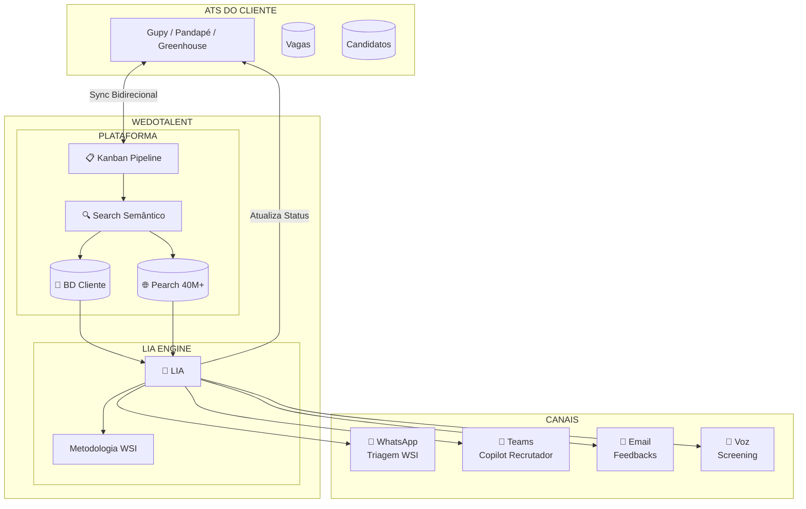
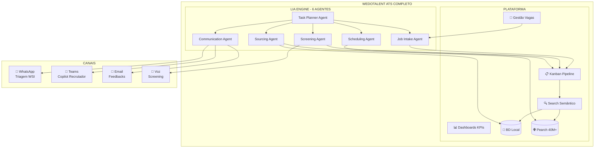
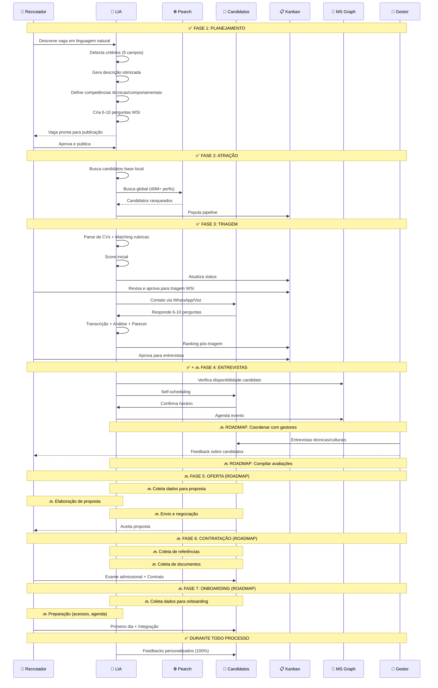
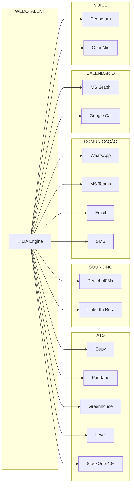

# WeDo Talent + LIA
## Recrutamento Autônomo com Agentes de IA

---

# 1. Visão Geral do Produto

## O Problema

```
┌─────────────────────────────────────────────────────────────────────────────┐
│                        RECRUTAMENTO TRADICIONAL                              │
├─────────────────────────────────────────────────────────────────────────────┤
│                                                                              │
│  📋 Criar Vaga    →  🔍 Buscar CVs    →  📞 Triar 100+    →  📅 Agendar     │
│   (2-4 horas)        (4-8 horas)        (20+ horas)         (3-5 horas)     │
│                                                                              │
│  ⚠️ GARGALOS:                                                               │
│  • 80% do tempo em tarefas operacionais repetitivas                         │
│  • Triagem manual = inconsistente e demorada                                │
│  • Candidatos abandonam por falta de feedback                               │
│  • Recrutadores sobrecarregados = qualidade cai                             │
│                                                                              │
└─────────────────────────────────────────────────────────────────────────────┘
```

## A Solução: LIA (Learning Intelligence Assistant)

```
┌─────────────────────────────────────────────────────────────────────────────┐
│                        RECRUTAMENTO COM LIA                                  │
├─────────────────────────────────────────────────────────────────────────────┤
│                                                                              │
│  🤖 LIA Cria     →  🤖 LIA Busca    →  🤖 LIA Tria      →  🤖 LIA Agenda   │
│   (15 minutos)       (automático)       (automático)        (automático)    │
│                                                                              │
│                    ↓                     ↓                     ↓            │
│              🔄 ATUALIZA ATS DO CLIENTE AUTOMATICAMENTE 🔄                  │
│                                                                              │
│  ✅ RESULTADOS:                                                              │
│  • 80% redução de trabalho operacional                                      │
│  • ROI de 2,4x em produtividade                                             │
│  • Triagem consistente via metodologia WSI                                  │
│  • Feedback personalizado para 100% dos candidatos                          │
│  • Recrutador foca em decisões estratégicas                                 │
│  • ATS do cliente sempre atualizado (sync bidirecional)                     │
│                                                                              │
└─────────────────────────────────────────────────────────────────────────────┘
```

---

# 2. Modos de Operação

## 2.1 Modo Plugin (ATS do Cliente)

A WeDo Talent conecta no ATS existente do cliente, adicionando inteligência ao processo atual.
**O ATS do cliente continua sendo a fonte da verdade - a LIA turbina e atualiza automaticamente.**

### Esquema Visual - Modo Plugin

```
┌─────────────────────────────────────────────────────────────────────────────────────────┐
│                              MODO PLUGIN - ATS DO CLIENTE                                │
├─────────────────────────────────────────────────────────────────────────────────────────┤
│                                                                                          │
│  ┌─────────────────────┐                    ┌─────────────────────────────────────────┐ │
│  │   ATS DO CLIENTE    │◄──── SYNC ────────►│              WEDOTALENT                 │ │
│  ├─────────────────────┤   BIDIRECIONAL     ├─────────────────────────────────────────┤ │
│  │                     │                    │                                         │ │
│  │  • Gupy            │                    │  ┌─────────────────────────────────┐   │ │
│  │  • Pandapé         │                    │  │         PLATAFORMA WEB           │   │ │
│  │  • Greenhouse      │                    │  ├─────────────────────────────────┤   │ │
│  │  • Lever           │                    │  │  ┌─────────┐  ┌─────────┐       │   │ │
│  │  • Outros (40+)    │                    │  │  │ KANBAN  │  │ SEARCH  │       │   │ │
│  │                     │                    │  │  │Pipeline │  │Semântico│       │   │ │
│  │  ┌───────────────┐ │                    │  │  └─────────┘  └─────────┘       │   │ │
│  │  │ Vagas        │ │                    │  │                                   │   │ │
│  │  │ Candidatos   │ │                    │  │  ┌─────────────────────────┐     │   │ │
│  │  │ Status       │ │                    │  │  │    BANCO DE DADOS       │     │   │ │
│  │  │ Histórico    │ │                    │  │  ├─────────────────────────┤     │   │ │
│  │  └───────────────┘ │                    │  │  │ 📁 BD Cliente (local)  │     │   │ │
│  │         ▲          │                    │  │  │ 🌐 BD Global (Pearch)  │     │   │ │
│  │         │          │                    │  │  │    40M+ candidatos     │     │   │ │
│  └─────────┼──────────┘                    │  │  └─────────────────────────┘     │   │ │
│            │                               │  └─────────────────────────────────┘   │ │
│            │                               │                    │                    │ │
│            │ ATUALIZA                      │                    ▼                    │ │
│            │ AUTOMATICAMENTE               │  ┌─────────────────────────────────┐   │ │
│            │                               │  │         🤖 LIA ENGINE            │   │ │
│            │                               │  ├─────────────────────────────────┤   │ │
│            └───────────────────────────────┤  │ • Cria vagas assistida          │   │ │
│                                            │  │ • Tria candidatos (WSI)         │   │ │
│                                            │  │ • Ranqueia automaticamente      │   │ │
│                                            │  │ • Agenda entrevistas            │   │ │
│                                            │  │ • Envia feedbacks               │   │ │
│                                            │  └─────────────────────────────────┘   │ │
│                                            └─────────────────────────────────────────┘ │
│                                                              │                          │
│                                                              ▼                          │
│  ┌──────────────────────────────────────────────────────────────────────────────────┐ │
│  │                              CANAIS DE COMUNICAÇÃO                                 │ │
│  ├──────────────────────────────────────────────────────────────────────────────────┤ │
│  │                                                                                    │ │
│  │   ┌─────────────┐   ┌─────────────┐   ┌─────────────┐   ┌─────────────┐          │ │
│  │   │  WHATSAPP   │   │   TEAMS     │   │   EMAIL     │   │    VOZ      │          │ │
│  │   ├─────────────┤   ├─────────────┤   ├─────────────┤   ├─────────────┤          │ │
│  │   │ • Triagem   │   │ • Copilot   │   │ • Convites  │   │ • Screening │          │ │
│  │   │   WSI       │   │   do        │   │ • Feedbacks │   │   por voz   │          │ │
│  │   │ • Contato   │   │   Recrutador│   │ • Lembretes │   │ • Deepgram  │          │ │
│  │   │ • Lembretes │   │ • Comandos  │   │ • Status    │   │ • OpenMic   │          │ │
│  │   └─────────────┘   └─────────────┘   └─────────────┘   └─────────────┘          │ │
│  │                                                                                    │ │
│  └──────────────────────────────────────────────────────────────────────────────────┘ │
│                                                                                          │
└─────────────────────────────────────────────────────────────────────────────────────────┘
```

### Diagrama Mermaid - Modo Plugin



**Benefícios do Modo Plugin:**
- Zero migração de dados
- Mantém workflow atual do cliente
- Adiciona IA sem substituir ferramentas
- Integração via StackOne (40+ ATS suportados)
- ATS sempre atualizado automaticamente

---

## 2.2 Modo Standalone (ATS Completo)

A WeDo Talent funciona como ATS completo com toda a inteligência nativa.
**Mesma estrutura do plugin, mas a WeDo Talent é o próprio ATS.**

### Esquema Visual - Modo Standalone

```
┌─────────────────────────────────────────────────────────────────────────────────────────┐
│                           MODO STANDALONE - WEDOTALENT ATS                               │
├─────────────────────────────────────────────────────────────────────────────────────────┤
│                                                                                          │
│  ┌───────────────────────────────────────────────────────────────────────────────────┐ │
│  │                              WEDOTALENT ATS COMPLETO                               │ │
│  ├───────────────────────────────────────────────────────────────────────────────────┤ │
│  │                                                                                    │ │
│  │   ┌──────────────────────────────────────────────────────────────────────────┐   │ │
│  │   │                         PLATAFORMA WEB                                    │   │ │
│  │   ├──────────────────────────────────────────────────────────────────────────┤   │ │
│  │   │                                                                           │   │ │
│  │   │   ┌─────────────────┐  ┌─────────────────┐  ┌─────────────────┐          │   │ │
│  │   │   │  📋 KANBAN      │  │  🔍 SEARCH      │  │  📊 DASHBOARDS  │          │   │ │
│  │   │   ├─────────────────┤  ├─────────────────┤  ├─────────────────┤          │   │ │
│  │   │   │ • Pipeline      │  │ • Semântico     │  │ • KPIs          │          │   │ │
│  │   │   │ • Drag & Drop   │  │ • Similar       │  │ • Métricas      │          │   │ │
│  │   │   │ • Filtros       │  │ • Boolean       │  │ • Relatórios    │          │   │ │
│  │   │   │ • Bulk Actions  │  │ • Arquétipos    │  │ • Exportação    │          │   │ │
│  │   │   └─────────────────┘  └─────────────────┘  └─────────────────┘          │   │ │
│  │   │                                                                           │   │ │
│  │   │   ┌─────────────────┐  ┌─────────────────┐  ┌─────────────────┐          │   │ │
│  │   │   │  📁 GESTÃO      │  │  🗄️ BANCO DADOS │  │  ⚙️ CONFIG      │          │   │ │
│  │   │   ├─────────────────┤  ├─────────────────┤  ├─────────────────┤          │   │ │
│  │   │   │ • Vagas         │  │ • BD Local      │  │ • Empresa       │          │   │ │
│  │   │   │ • Candidatos    │  │ • BD Global     │  │ • Usuários      │          │   │ │
│  │   │   │ • Entrevistas   │  │   (Pearch 40M+) │  │ • Templates     │          │   │ │
│  │   │   │ • Histórico     │  │ • Unificado     │  │ • Integrações   │          │   │ │
│  │   │   └─────────────────┘  └─────────────────┘  └─────────────────┘          │   │ │
│  │   │                                                                           │   │ │
│  │   └──────────────────────────────────────────────────────────────────────────┘   │ │
│  │                                           │                                       │ │
│  │                                           ▼                                       │ │
│  │   ┌──────────────────────────────────────────────────────────────────────────┐   │ │
│  │   │                           🤖 LIA ENGINE                                   │   │ │
│  │   ├──────────────────────────────────────────────────────────────────────────┤   │ │
│  │   │                                                                           │   │ │
│  │   │   ┌─────────────┐ ┌─────────────┐ ┌─────────────┐ ┌─────────────┐        │   │ │
│  │   │   │ JOB INTAKE  │ │  SOURCING   │ │  SCREENING  │ │ SCHEDULING  │        │   │ │
│  │   │   │   AGENT     │ │    AGENT    │ │    AGENT    │ │    AGENT    │        │   │ │
│  │   │   ├─────────────┤ ├─────────────┤ ├─────────────┤ ├─────────────┤        │   │ │
│  │   │   │ Wizard      │ │ Base local  │ │ CV parsing  │ │ MS Graph    │        │   │ │
│  │   │   │ 8 etapas    │ │ Pearch 40M+ │ │ WSI scoring │ │ Self-sched  │        │   │ │
│  │   │   └─────────────┘ └─────────────┘ └─────────────┘ └─────────────┘        │   │ │
│  │   │                                                                           │   │ │
│  │   │   ┌─────────────┐ ┌─────────────┐                                        │   │ │
│  │   │   │COMMUNICATION│ │TASK PLANNER │                                        │   │ │
│  │   │   │    AGENT    │ │    AGENT    │                                        │   │ │
│  │   │   ├─────────────┤ ├─────────────┤                                        │   │ │
│  │   │   │ 8 canais    │ │ Orquestra   │                                        │   │ │
│  │   │   │ Feedbacks   │ │ tarefas     │                                        │   │ │
│  │   │   └─────────────┘ └─────────────┘                                        │   │ │
│  │   │                                                                           │   │ │
│  │   └──────────────────────────────────────────────────────────────────────────┘   │ │
│  │                                                                                    │ │
│  └───────────────────────────────────────────────────────────────────────────────────┘ │
│                                              │                                          │
│                                              ▼                                          │
│  ┌──────────────────────────────────────────────────────────────────────────────────┐ │
│  │                              CANAIS DE COMUNICAÇÃO                                 │ │
│  ├──────────────────────────────────────────────────────────────────────────────────┤ │
│  │                                                                                    │ │
│  │   ┌─────────────┐   ┌─────────────┐   ┌─────────────┐   ┌─────────────┐          │ │
│  │   │  WHATSAPP   │   │   TEAMS     │   │   EMAIL     │   │    VOZ      │          │ │
│  │   ├─────────────┤   ├─────────────┤   ├─────────────┤   ├─────────────┤          │ │
│  │   │ • Triagem   │   │ • Copilot   │   │ • Convites  │   │ • Screening │          │ │
│  │   │   WSI       │   │   do        │   │ • Feedbacks │   │   por voz   │          │ │
│  │   │ • Contato   │   │   Recrutador│   │ • Lembretes │   │ • Deepgram  │          │ │
│  │   │ • Lembretes │   │ • Comandos  │   │ • Status    │   │ • OpenMic   │          │ │
│  │   └─────────────┘   └─────────────┘   └─────────────┘   └─────────────┘          │ │
│  │                                                                                    │ │
│  └──────────────────────────────────────────────────────────────────────────────────┘ │
│                                                                                          │
└─────────────────────────────────────────────────────────────────────────────────────────┘
```

### Diagrama Mermaid - Modo Standalone



**Benefícios do Modo Standalone:**
- Experiência 100% integrada
- Máxima automação disponível
- Sem dependência de ferramentas externas
- Custo único (sem licenças de ATS)
- Dados unificados em um só lugar

---

# 3. Fluxo Completo de Recrutamento com LIA

## Visão Geral: O que LIA cobre vs Roadmap

```
┌─────────────────────────────────────────────────────────────────────────────────────────┐
│                     JORNADA COMPLETA DE RECRUTAMENTO                                     │
├─────────────────────────────────────────────────────────────────────────────────────────┤
│                                                                                          │
│  ┌─────────────────────────────────────────────────────────────────────────────────┐   │
│  │  LEGENDA:  ✅ LIA COBRE   |   🔜 ROADMAP   |   👤 SEMPRE HUMANO                 │   │
│  └─────────────────────────────────────────────────────────────────────────────────┘   │
│                                                                                          │
│  ══════════════════════════════════════════════════════════════════════════════════    │
│                           FASE 1: PLANEJAMENTO                                          │
│  ══════════════════════════════════════════════════════════════════════════════════    │
│                                                                                          │
│  ┌──────────────────────────────────────────────────────────────────────┐              │
│  │ ✅ 1️⃣ CRIAÇÃO DE VAGA (LIA COBRE)                                   │              │
│  │  ┌──────────┐  ┌──────────┐  ┌──────────┐  ┌──────────┐  ┌────────┐ │              │
│  │  │Descrição │→ │Requisitos│→ │Competên- │→ │Perguntas │→ │Publicar│ │              │
│  │  │ + IA     │  │Técnicos  │  │cias      │  │  WSI     │  │        │ │              │
│  │  └──────────┘  └──────────┘  └──────────┘  └──────────┘  └────────┘ │              │
│  │  🤖 LIA: Wizard 8 etapas, detecção critérios, gera JD otimizada     │              │
│  └──────────────────────────────────────────────────────────────────────┘              │
│                                         ▼                                               │
│  ══════════════════════════════════════════════════════════════════════════════════    │
│                           FASE 2: ATRAÇÃO                                               │
│  ══════════════════════════════════════════════════════════════════════════════════    │
│                                                                                          │
│  ┌──────────────────────────────────────────────────────────────────────┐              │
│  │ ✅ 2️⃣ SOURCING DE CANDIDATOS (LIA COBRE)                            │              │
│  │  ┌───────────────┐                    ┌───────────────┐              │              │
│  │  │  Base Local   │        +           │  Pearch AI    │              │              │
│  │  │  (Internos)   │                    │  (40M+)       │              │              │
│  │  └───────────────┘                    └───────────────┘              │              │
│  │  🤖 LIA: Busca semântica, similar search, ranking automático        │              │
│  └──────────────────────────────────────────────────────────────────────┘              │
│                                         ▼                                               │
│  ══════════════════════════════════════════════════════════════════════════════════    │
│                           FASE 3: TRIAGEM                                               │
│  ══════════════════════════════════════════════════════════════════════════════════    │
│                                                                                          │
│  ┌──────────────────────────────────────────────────────────────────────┐              │
│  │ ✅ 3️⃣ TRIAGEM DE CVs (LIA COBRE)                                    │              │
│  │  ┌──────────┐  ┌──────────┐  ┌──────────┐  ┌──────────┐             │              │
│  │  │CV Parse  │→ │Matching  │→ │Red Flags │→ │Score     │             │              │
│  │  │          │  │Rubricas  │  │          │  │Inicial   │             │              │
│  │  └──────────┘  └──────────┘  └──────────┘  └──────────┘             │              │
│  │  🤖 LIA: Avaliação automática de 100% dos CVs                       │              │
│  └──────────────────────────────────────────────────────────────────────┘              │
│                                         ▼                                               │
│  ┌──────────────────────────────────────────────────────────────────────┐              │
│  │ 👤 4️⃣ KANBAN - APROVAÇÃO PARA TRIAGEM WSI (HUMANO)                  │              │
│  │                                                                       │              │
│  │   📥 Novos  →  👁️ Revisão  →  ✅ Aprovados  →  ❌ Reprovados        │              │
│  │   (auto)       (humano)        (triagem WSI)     (feedback)          │              │
│  │                                                                       │              │
│  │  👤 RECRUTADOR: Decide quem avança para triagem conversacional      │              │
│  └──────────────────────────────────────────────────────────────────────┘              │
│                                         ▼                                               │
│  ┌──────────────────────────────────────────────────────────────────────┐              │
│  │ ✅ 5️⃣ TRIAGEM CONVERSACIONAL WSI (LIA COBRE)                        │              │
│  │  ┌────────────┐   ┌────────────┐   ┌────────────┐                   │              │
│  │  │ Contato    │ → │ Entrevista │ → │ Score WSI  │                   │              │
│  │  │ Automático │   │ 6-10 pergs │   │ + Parecer  │                   │              │
│  │  └────────────┘   └────────────┘   └────────────┘                   │              │
│  │  🤖 LIA: WhatsApp/Voz, transcrição, análise, parecer automático     │              │
│  └──────────────────────────────────────────────────────────────────────┘              │
│                                         ▼                                               │
│  ┌──────────────────────────────────────────────────────────────────────┐              │
│  │ 👤 6️⃣ KANBAN - RANKING PÓS-TRIAGEM (HUMANO)                         │              │
│  │                                                                       │              │
│  │  🥇 Top 5  →  🥈 Qualificados  →  🥉 Reserva  →  ❌ Não Avança       │              │
│  │  (4.5+)       (4.0-4.4)           (3.5-3.9)      (<3.5)              │              │
│  │                                                                       │              │
│  │  👤 RECRUTADOR: Aprova candidatos para entrevistas com gestores     │              │
│  └──────────────────────────────────────────────────────────────────────┘              │
│                                         ▼                                               │
│  ══════════════════════════════════════════════════════════════════════════════════    │
│                           FASE 4: ENTREVISTAS                                           │
│  ══════════════════════════════════════════════════════════════════════════════════    │
│                                                                                          │
│  ┌──────────────────────────────────────────────────────────────────────┐              │
│  │ ✅ 7️⃣ AGENDAMENTO COM CANDIDATO (LIA COBRE)                         │              │
│  │  ┌────────────┐   ┌────────────┐   ┌────────────┐                   │              │
│  │  │ Check      │ → │ Propor     │ → │ Confirmar  │                   │              │
│  │  │ Calendário │   │ Horários   │   │ + Lembrete │                   │              │
│  │  └────────────┘   └────────────┘   └────────────┘                   │              │
│  │  🤖 LIA: MS Graph, self-scheduling, lembretes automáticos           │              │
│  └──────────────────────────────────────────────────────────────────────┘              │
│                                         ▼                                               │
│  ┌──────────────────────────────────────────────────────────────────────┐              │
│  │ 🔜 8️⃣ AGENDAMENTO COM CLIENTES INTERNOS (ROADMAP)                   │              │
│  │  ┌────────────┐   ┌────────────┐   ┌────────────┐                   │              │
│  │  │ Identifica │ → │ Verifica   │ → │ Agenda com │                   │              │
│  │  │ Painel     │   │ Agendas    │   │ Gestores   │                   │              │
│  │  └────────────┘   └────────────┘   └────────────┘                   │              │
│  │  🔜 FUTURO: Coordena entrevistas com gestor + equipe técnica        │              │
│  └──────────────────────────────────────────────────────────────────────┘              │
│                                         ▼                                               │
│  ┌──────────────────────────────────────────────────────────────────────┐              │
│  │ 👤 9️⃣ ENTREVISTAS TÉCNICAS/GESTORES (HUMANO)                        │              │
│  │                                                                       │              │
│  │   👔 Gestor      +      👨‍💻 Equipe Técnica      +      💼 RH        │              │
│  │   (Decisão final)       (Validação técnica)          (Suporte)       │              │
│  │                                                                       │              │
│  │  👤 SEMPRE HUMANO: Conexão interpessoal e fit cultural              │              │
│  └──────────────────────────────────────────────────────────────────────┘              │
│                                         ▼                                               │
│  ┌──────────────────────────────────────────────────────────────────────┐              │
│  │ 🔜 🔟 AVALIAÇÃO PÓS-ENTREVISTA (ROADMAP)                             │              │
│  │  ┌────────────┐   ┌────────────┐   ┌────────────┐                   │              │
│  │  │ Coleta     │ → │ Compila    │ → │ Ranking    │                   │              │
│  │  │ Feedbacks  │   │ Pareceres  │   │ Final      │                   │              │
│  │  └────────────┘   └────────────┘   └────────────┘                   │              │
│  │  🔜 FUTURO: LIA consolida avaliações dos entrevistadores            │              │
│  └──────────────────────────────────────────────────────────────────────┘              │
│                                         ▼                                               │
│  ══════════════════════════════════════════════════════════════════════════════════    │
│                           FASE 5: OFERTA                                                │
│  ══════════════════════════════════════════════════════════════════════════════════    │
│                                                                                          │
│  ┌──────────────────────────────────────────────────────────────────────┐              │
│  │ 🔜 1️⃣1️⃣ COLETA DE DADOS PARA PROPOSTA (ROADMAP)                     │              │
│  │  ┌────────────┐   ┌────────────┐   ┌────────────┐                   │              │
│  │  │ Pretensão  │ + │ Benefícios │ + │ Preferên-  │                   │              │
│  │  │ Salarial   │   │ Atuais     │   │ cias       │                   │              │
│  │  └────────────┘   └────────────┘   └────────────┘                   │              │
│  │  🔜 FUTURO: LIA coleta info via chat para montar proposta           │              │
│  └──────────────────────────────────────────────────────────────────────┘              │
│                                         ▼                                               │
│  ┌──────────────────────────────────────────────────────────────────────┐              │
│  │ 🔜 1️⃣2️⃣ ELABORAÇÃO DE PROPOSTA (ROADMAP)                            │              │
│  │  ┌────────────┐   ┌────────────┐   ┌────────────┐                   │              │
│  │  │ Gera       │ → │ Aprovação  │ → │ Ajustes    │                   │              │
│  │  │ Proposta   │   │ RH/Gestor  │   │ (se nec.)  │                   │              │
│  │  └────────────┘   └────────────┘   └────────────┘                   │              │
│  │  🔜 FUTURO: LIA sugere proposta baseada em mercado e budget         │              │
│  └──────────────────────────────────────────────────────────────────────┘              │
│                                         ▼                                               │
│  ┌──────────────────────────────────────────────────────────────────────┐              │
│  │ 🔜 1️⃣3️⃣ ENVIO E NEGOCIAÇÃO DE PROPOSTA (ROADMAP)                    │              │
│  │  ┌────────────┐   ┌────────────┐   ┌────────────┐                   │              │
│  │  │ Envia      │ → │ Aguarda    │ → │ Negocia    │                   │              │
│  │  │ Proposta   │   │ Resposta   │   │ (se nec.)  │                   │              │
│  │  └────────────┘   └────────────┘   └────────────┘                   │              │
│  │  🔜 FUTURO: LIA envia, acompanha e ajuda na negociação              │              │
│  └──────────────────────────────────────────────────────────────────────┘              │
│                                         ▼                                               │
│  ┌──────────────────────────────────────────────────────────────────────┐              │
│  │ 👤 1️⃣4️⃣ ACEITE DA PROPOSTA (HUMANO)                                 │              │
│  │                                                                       │              │
│  │       ✅ Aceita       |       🔄 Contraproposta       |       ❌ Recusa│              │
│  │                                                                       │              │
│  │  👤 SEMPRE HUMANO: Decisão do candidato                              │              │
│  └──────────────────────────────────────────────────────────────────────┘              │
│                                         ▼                                               │
│  ══════════════════════════════════════════════════════════════════════════════════    │
│                           FASE 6: CONTRATAÇÃO                                           │
│  ══════════════════════════════════════════════════════════════════════════════════    │
│                                                                                          │
│  ┌──────────────────────────────────────────────────────────────────────┐              │
│  │ 🔜 1️⃣5️⃣ COLETA DE REFERÊNCIAS (ROADMAP)                             │              │
│  │  ┌────────────┐   ┌────────────┐   ┌────────────┐                   │              │
│  │  │ Solicita   │ → │ Contata    │ → │ Compila    │                   │              │
│  │  │ Referências│   │ ex-gestores│   │ Feedbacks  │                   │              │
│  │  └────────────┘   └────────────┘   └────────────┘                   │              │
│  │  🔜 FUTURO: LIA conduz checagem de referências automatizada         │              │
│  └──────────────────────────────────────────────────────────────────────┘              │
│                                         ▼                                               │
│  ┌──────────────────────────────────────────────────────────────────────┐              │
│  │ 🔜 1️⃣6️⃣ COLETA DE DOCUMENTOS PARA CONTRATAÇÃO (ROADMAP)             │              │
│  │  ┌────────────┐   ┌────────────┐   ┌────────────┐                   │              │
│  │  │ Lista      │ → │ Solicita   │ → │ Valida     │                   │              │
│  │  │ Documentos │   │ Envio      │   │ Recebimento│                   │              │
│  │  └────────────┘   └────────────┘   └────────────┘                   │              │
│  │  🔜 FUTURO: LIA solicita RG, CPF, comprovantes, etc via chat        │              │
│  └──────────────────────────────────────────────────────────────────────┘              │
│                                         ▼                                               │
│  ┌──────────────────────────────────────────────────────────────────────┐              │
│  │ 👤 1️⃣7️⃣ EXAME ADMISSIONAL + CONTRATO (HUMANO)                       │              │
│  │                                                                       │              │
│  │   🏥 Exame Médico    →    📝 Contrato    →    ✍️ Assinatura         │              │
│  │                                                                       │              │
│  │  👤 SEMPRE HUMANO: Processos legais e formais                        │              │
│  └──────────────────────────────────────────────────────────────────────┘              │
│                                         ▼                                               │
│  ══════════════════════════════════════════════════════════════════════════════════    │
│                           FASE 7: ONBOARDING                                            │
│  ══════════════════════════════════════════════════════════════════════════════════    │
│                                                                                          │
│  ┌──────────────────────────────────────────────────────────────────────┐              │
│  │ 🔜 1️⃣8️⃣ COLETA DE DADOS PARA ONBOARDING (ROADMAP)                   │              │
│  │  ┌────────────┐   ┌────────────┐   ┌────────────┐                   │              │
│  │  │ Dados      │ + │ Preferên-  │ + │ Equipamen- │                   │              │
│  │  │ Bancários  │   │ cias       │   │ tos        │                   │              │
│  │  └────────────┘   └────────────┘   └────────────┘                   │              │
│  │  🔜 FUTURO: LIA coleta informações para preparar primeiro dia       │              │
│  └──────────────────────────────────────────────────────────────────────┘              │
│                                         ▼                                               │
│  ┌──────────────────────────────────────────────────────────────────────┐              │
│  │ 🔜 1️⃣9️⃣ PREPARAÇÃO DO ONBOARDING (ROADMAP)                          │              │
│  │  ┌────────────┐   ┌────────────┐   ┌────────────┐                   │              │
│  │  │ Setup      │ + │ Agenda     │ + │ Materiais  │                   │              │
│  │  │ Acessos    │   │ Integrações│   │ Boas-vindas│                   │              │
│  │  └────────────┘   └────────────┘   └────────────┘                   │              │
│  │  🔜 FUTURO: LIA coordena setup de acessos e agenda integração       │              │
│  └──────────────────────────────────────────────────────────────────────┘              │
│                                         ▼                                               │
│  ┌──────────────────────────────────────────────────────────────────────┐              │
│  │ 👤 2️⃣0️⃣ PRIMEIRO DIA + INTEGRAÇÃO (HUMANO)                          │              │
│  │                                                                       │              │
│  │   🎉 Boas-vindas   →   👥 Conhecer equipe   →   🚀 Iniciar trabalho │              │
│  │                                                                       │              │
│  │  👤 SEMPRE HUMANO: Conexão e acolhimento pessoal                     │              │
│  └──────────────────────────────────────────────────────────────────────┘              │
│                                                                                          │
│  ══════════════════════════════════════════════════════════════════════════════════    │
│                          DURANTE TODO O PROCESSO                                        │
│  ══════════════════════════════════════════════════════════════════════════════════    │
│                                                                                          │
│  ┌──────────────────────────────────────────────────────────────────────┐              │
│  │ ✅ FEEDBACKS PERSONALIZADOS (LIA COBRE)                              │              │
│  │                                                                       │              │
│  │   📧 Durante o processo:           📧 Ao final:                      │              │
│  │   • Confirmação de candidatura     • Aprovado → próximos passos      │              │
│  │   • Status da triagem              • Reprovado → feedback construtivo│              │
│  │   • Convite para triagem WSI       • Banco de talentos               │              │
│  │   • Confirmação de entrevista                                         │              │
│  │                                                                       │              │
│  │  🤖 LIA: 100% dos candidatos recebem feedback personalizado          │              │
│  └──────────────────────────────────────────────────────────────────────┘              │
│                                                                                          │
└─────────────────────────────────────────────────────────────────────────────────────────┘
```

---

## Resumo: Cobertura da LIA

| Status | Etapa | Descrição | Automação |
|--------|-------|-----------|-----------|
| ✅ | Criação de Vaga | Wizard 8 etapas, JD, competências, perguntas WSI | 90% |
| ✅ | Sourcing | Busca local + Pearch 40M+, ranking | 95% |
| ✅ | Triagem CV | Parse, matching, red flags, score inicial | 100% |
| 👤 | Aprovação Triagem | Recrutador decide quem avança | 0% (humano) |
| ✅ | Triagem WSI | WhatsApp/Voz, análise, parecer | 95% |
| 👤 | Aprovação Entrevista | Recrutador aprova para gestores | 0% (humano) |
| ✅ | Agendamento Candidato | Self-scheduling, lembretes | 90% |
| 🔜 | Agendamento Gestores | Coordenar com clientes internos | Roadmap |
| 👤 | Entrevistas | Gestores e equipe técnica | 0% (humano) |
| 🔜 | Avaliação Pós-Entrevista | Compilar feedbacks dos entrevistadores | Roadmap |
| 🔜 | Coleta Dados Proposta | Pretensão, benefícios atuais | Roadmap |
| 🔜 | Elaboração Proposta | Sugestão baseada em mercado | Roadmap |
| 🔜 | Envio Proposta | Envio e acompanhamento | Roadmap |
| 👤 | Aceite Proposta | Decisão do candidato | 0% (humano) |
| 🔜 | Coleta Referências | Contato com ex-gestores | Roadmap |
| 🔜 | Coleta Documentos | RG, CPF, comprovantes | Roadmap |
| 👤 | Exame + Contrato | Processos legais | 0% (humano) |
| 🔜 | Dados Onboarding | Info para primeiro dia | Roadmap |
| 🔜 | Prep. Onboarding | Acessos, agenda, materiais | Roadmap |
| 👤 | Primeiro Dia | Integração pessoal | 0% (humano) |
| ✅ | Feedbacks | Durante e ao final do processo | 100% |

---

## Fluxo em Mermaid (Sequencial Completo)



---

# 4. LIA como Assistente via Teams

## Copilot do Recrutador

```
┌─────────────────────────────────────────────────────────────────────────────┐
│                        LIA COPILOT NO TEAMS                                  │
├─────────────────────────────────────────────────────────────────────────────┤
│                                                                              │
│  💬 "LIA, quantos candidatos tenho na vaga de Dev Sênior?"                  │
│      → 📊 "Você tem 47 candidatos: 12 triados, 8 aprovados, 27 pendentes"   │
│                                                                              │
│  💬 "LIA, agende entrevistas com os top 3 aprovados"                        │
│      → 📅 "Entrevistas agendadas para João (14h), Maria (15h), Pedro (16h)" │
│                                                                              │
│  💬 "LIA, qual o score WSI do candidato Carlos Silva?"                      │
│      → 🎯 "Carlos: 4.3/5.0 - Pontos fortes: comunicação, Python, AWS"       │
│                                                                              │
│  💬 "LIA, envie feedback para os reprovados da vaga X"                      │
│      → ✉️ "15 feedbacks personalizados enviados via email"                  │
│                                                                              │
└─────────────────────────────────────────────────────────────────────────────┘
```

## Funcionalidades do Copilot

| Comando | Ação |
|---------|------|
| Status de vagas | Resumo de candidatos por etapa |
| Aprovar candidatos | Move candidatos no pipeline |
| Agendar entrevistas | Integração MS Graph |
| Enviar feedbacks | Comunicação automatizada |
| Buscar candidatos | Sourcing via linguagem natural |
| Gerar relatórios | Dashboards e KPIs |

---

# 5. Arquitetura de Agentes

## Orquestrador + 6 Agentes Especializados

```
┌─────────────────────────────────────────────────────────────────────────────┐
│                           ORCHESTRATOR                                       │
│              (Coordena todos os agentes, roteia intenções)                   │
└─────────────────────────────────────────────────────────────────────────────┘
         │           │           │           │           │           │
         ▼           ▼           ▼           ▼           ▼           ▼
┌─────────────┐ ┌─────────────┐ ┌─────────────┐ ┌─────────────┐ ┌─────────────┐ ┌─────────────┐
│ JOB INTAKE  │ │  SOURCING   │ │  SCREENING  │ │ SCHEDULING  │ │COMMUNICATION│ │TASK PLANNER │
│   AGENT     │ │    AGENT    │ │    AGENT    │ │    AGENT    │ │    AGENT    │ │    AGENT    │
├─────────────┤ ├─────────────┤ ├─────────────┤ ├─────────────┤ ├─────────────┤ ├─────────────┤
│• Wizard 8   │ │• Base local │ │• CV parsing │ │• MS Graph   │ │• 8 canais   │ │• Decomposição│
│  etapas     │ │• Pearch 40M+│ │• Rubricas   │ │• Self-sched │ │• 38 templates│ │• Priorização│
│• Detecção   │ │• Ranking    │ │• Red flags  │ │• Conflitos  │ │• Feedbacks  │ │• DAG tasks  │
│  critérios  │ │• Semântico  │ │• Score WSI  │ │• Lembretes  │ │• LGPD aware │ │• Orquestração│
│• WSI pergs  │ │• Similar    │ │• Voz/WA     │ │             │ │             │ │             │
└─────────────┘ └─────────────┘ └─────────────┘ └─────────────┘ └─────────────┘ └─────────────┘
                                      │
                                      ▼
                          ┌─────────────────────┐
                          │   POLICY ENGINE     │
                          ├─────────────────────┤
                          │ • Regras de negócio │
                          │ • Rate-limiting     │
                          │ • Escalation flows  │
                          │ • Compliance LGPD   │
                          └─────────────────────┘
```

---

# 6. Métricas e ROI

## Indicadores Comprovados

```
┌─────────────────────────────────────────────────────────────────────────────┐
│                           IMPACTO MEDIDO                                     │
├─────────────────────────────────────────────────────────────────────────────┤
│                                                                              │
│   ┌───────────────────┐   ┌───────────────────┐   ┌───────────────────┐    │
│   │                   │   │                   │   │                   │    │
│   │      2,4x         │   │       80%         │   │      100%         │    │
│   │       ROI         │   │    REDUÇÃO        │   │   FEEDBACKS       │    │
│   │                   │   │   DE TRABALHO     │   │                   │    │
│   │  Produtividade    │   │   Operacional     │   │  Personalizados   │    │
│   │   do recrutador   │   │                   │   │  automatizados    │    │
│   │                   │   │                   │   │                   │    │
│   └───────────────────┘   └───────────────────┘   └───────────────────┘    │
│                                                                              │
└─────────────────────────────────────────────────────────────────────────────┘
```

## Comparativo Antes vs Depois

| Métrica | Sem LIA | Com LIA | Ganho |
|---------|---------|---------|-------|
| **Vagas/recrutador/mês** | 8 | 19 | +138% |
| **Tempo criação de vaga** | 2-4 horas | 15 minutos | -87% |
| **Triagem por candidato** | 15 minutos | Automático | -100% |
| **Taxa de resposta candidatos** | 40% | 85% | +112% |
| **Feedbacks enviados** | 30% | 100% | +233% |
| **Time-to-hire** | 45 dias | 25 dias | -44% |

---

# 7. Stack Tecnológica

## Componentes Principais

| Camada | Tecnologia |
|--------|------------|
| **Frontend** | Next.js 15, React, shadcn/ui, Tailwind CSS |
| **Backend** | FastAPI, Python 3.11, LangGraph |
| **LLM** | Claude Sonnet 4.5 (Anthropic) |
| **Database** | PostgreSQL |
| **Cache** | Redis |
| **Voz** | Deepgram (STT), OpenMic.ai |
| **Sourcing** | Pearch AI (40M+ perfis) |
| **Calendário** | Microsoft Graph |
| **ATS Sync** | StackOne (40+ integrações) |

---

# 8. Integrações

## Ecossistema Conectado



---

# 9. Diferencial Competitivo

## WeDo Talent vs Concorrentes

| Funcionalidade | WeDo Talent | DigAí | Gupy | Tezi AI |
|----------------|-------------|-------|------|---------|
| **Triagem WhatsApp/Voz** | ✅ | ✅ | ❌ | ❌ |
| **Arquitetura Multi-Agent** | ✅ 6+ | ❌ | ❌ | ✅ |
| **Banco 40M+ integrado** | ✅ | ❌ | ❌ | ✅ 750M+ |
| **Metodologia estruturada** | ✅ WSI | ⚠️ | ❌ | ❌ |
| **Copilot/Assistente** | ✅ Teams | ❌ | ❌ | ❌ |
| **Busca Semântica LLM** | ✅ 8 domínios | ❌ | ⚠️ | ✅ |
| **Foco Brasil** | ✅ | ✅ | ✅ | ❌ |

---

# 10. Resumo Executivo

## Proposta de Valor

```
┌─────────────────────────────────────────────────────────────────────────────┐
│                                                                              │
│   "WeDo Talent + LIA automatiza 80% do processo de recrutamento,            │
│    permitindo que recrutadores foquem em decisões estratégicas              │
│    enquanto a IA cuida de toda a operação."                                 │
│                                                                              │
├─────────────────────────────────────────────────────────────────────────────┤
│                                                                              │
│   🤖 LIA = Agente de IA que:                                                │
│   • Cria vagas com descrições otimizadas                                    │
│   • Busca candidatos em 40M+ perfis                                         │
│   • Tria automaticamente com metodologia científica                         │
│   • Conduz entrevistas por voz/WhatsApp                                     │
│   • Agenda entrevistas automaticamente                                       │
│   • Envia feedbacks personalizados                                          │
│   • Atua como assistente do recrutador via Teams                            │
│                                                                              │
│   📊 ROI Comprovado:                                                         │
│   • 2,4x mais produtividade                                                 │
│   • 80% redução de trabalho operacional                                     │
│   • 100% dos candidatos recebem feedback                                    │
│                                                                              │
│   🎯 Foco: Escalar triagem de candidatos                                    │
│                                                                              │
└─────────────────────────────────────────────────────────────────────────────┘
```

---

**Documento preparado para apresentação de produto/tech/negócios**

*WeDo Talent - Janeiro 2026*
