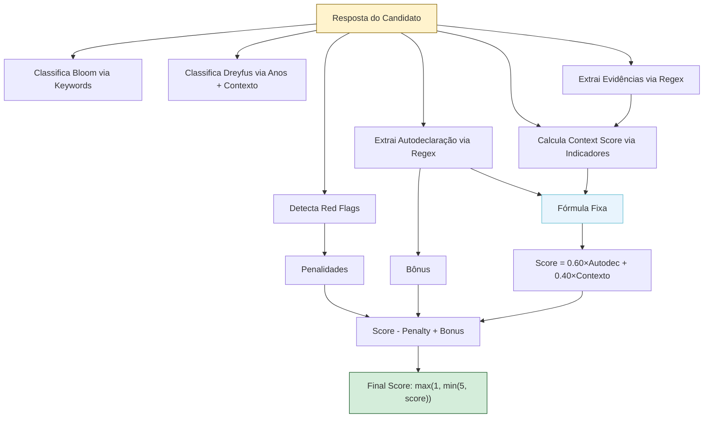
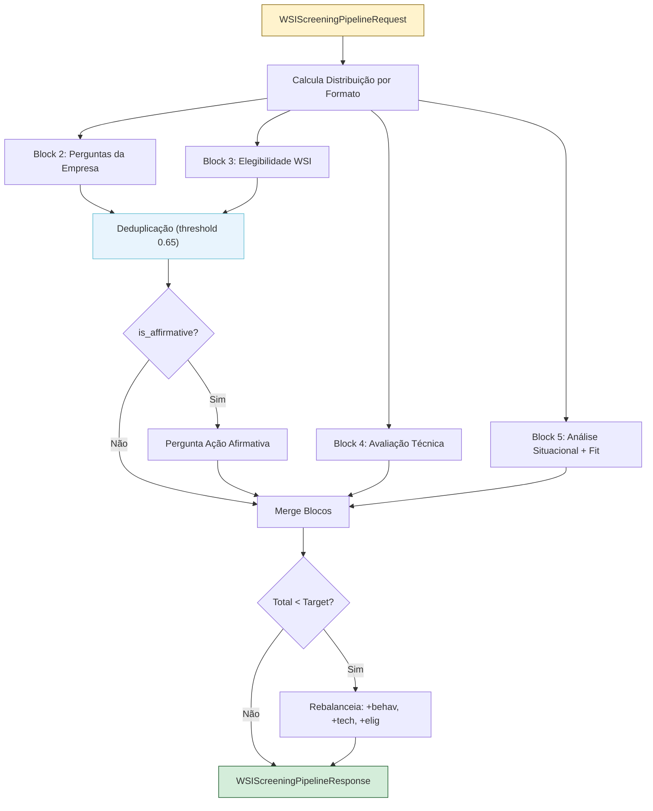
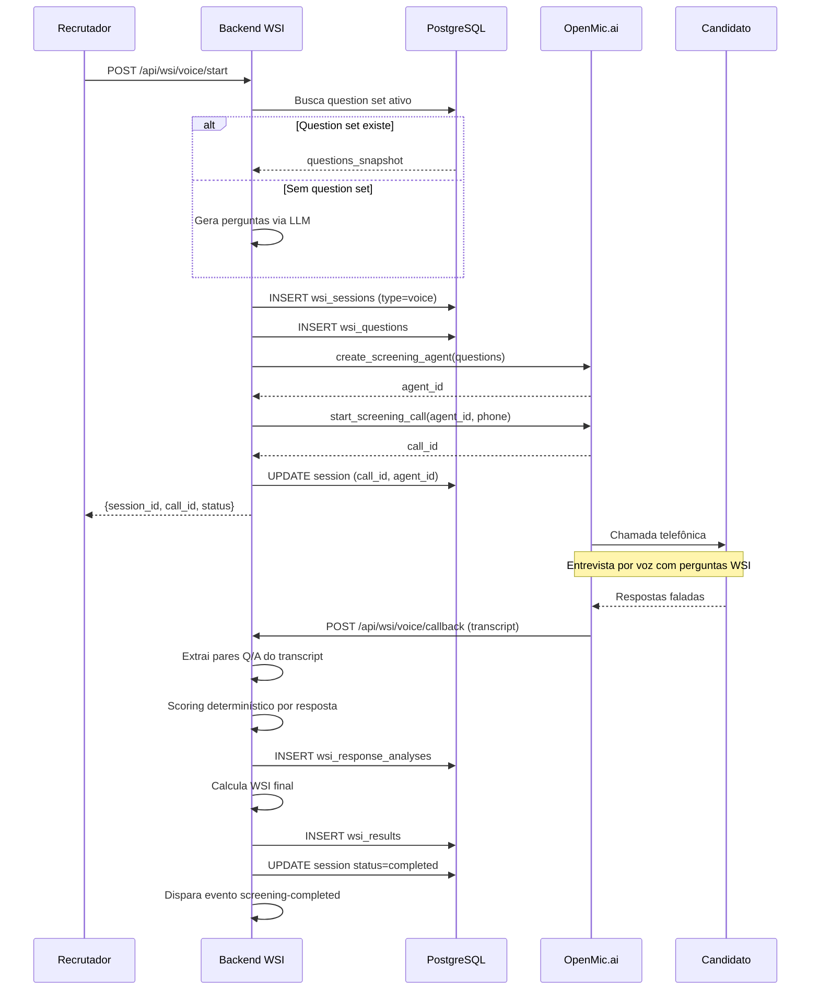
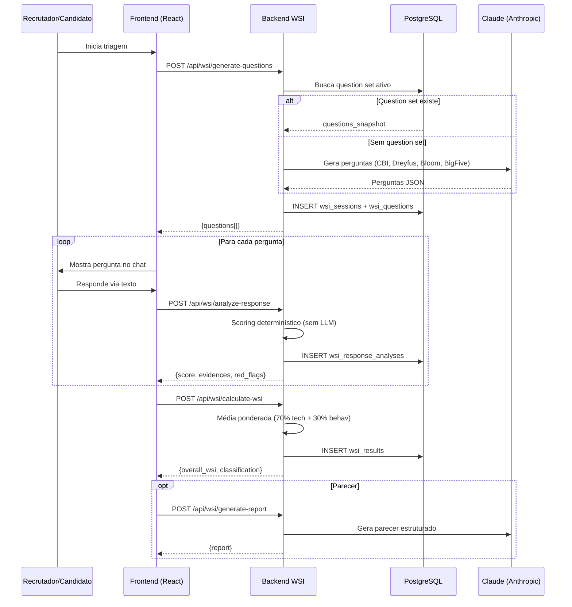
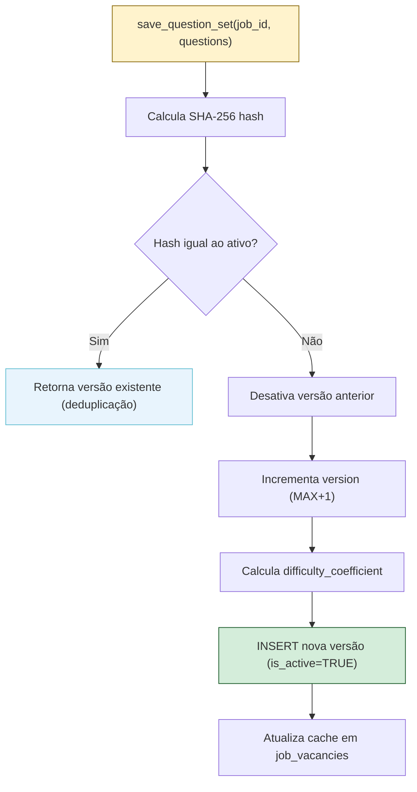
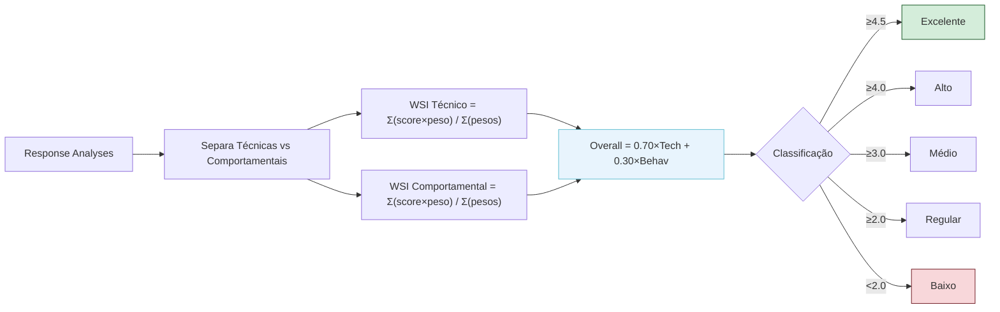
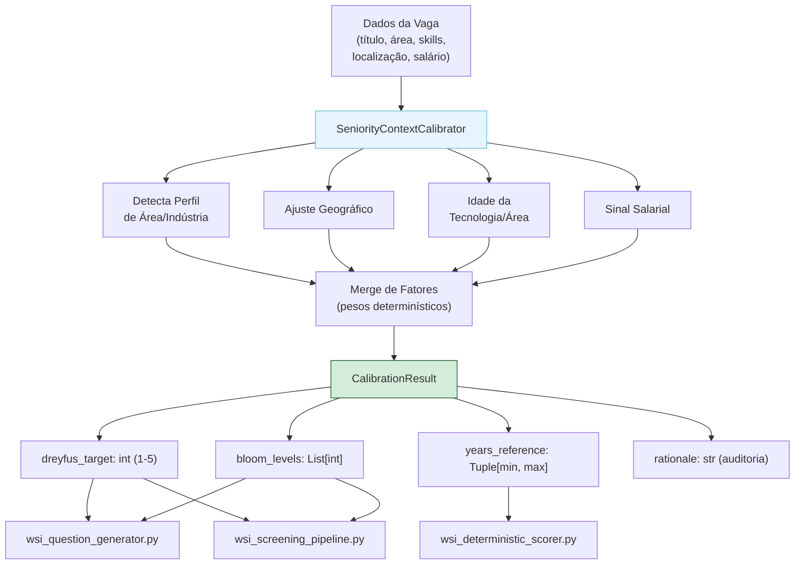

# WSI (WeDoTalent Skill Index) - Documentação Técnica Completa

**Versão:** 1.0  
**Data:** 2026-02-11  
**Objetivo:** Permitir a replicação completa do sistema WSI em outro ambiente.

---


## Índice

1. [Visão Geral da Arquitetura](#1-visão-geral-da-arquitetura)
2. [Diagramas de Fluxo](#2-diagramas-de-fluxo)
3. [Frameworks Científicos](#3-frameworks-científicos)
4. [Modelos de Dados (Pydantic)](#4-modelos-de-dados-pydantic)
5. [Pipeline de Geração de Perguntas](#5-pipeline-de-geração-de-perguntas)
6. [Screening Pipeline Unificado (Blocos 2-5)](#6-screening-pipeline-unificado-blocos-2-5)
7. [Scoring Determinístico](#7-scoring-determinístico)
8. [Cálculo WSI Final (Média Ponderada)](#8-cálculo-wsi-final-média-ponderada)
9. [Fluxo de Triagem por Chat](#9-fluxo-de-triagem-por-chat)
10. [Fluxo de Triagem por Voz (OpenMic)](#10-fluxo-de-triagem-por-voz-openmic)
11. [Versionamento de Question Sets](#11-versionamento-de-question-sets)
12. [Normalização de Scores e Comparação Cross-Version](#12-normalização-de-scores-e-comparação-cross-version)
13. [Cutoffs e Decisões Automatizadas](#13-cutoffs-e-decisões-automatizadas)
14. [Geração de Parecer Estruturado](#14-geração-de-parecer-estruturado)
15. [Geração de Feedback para Candidato](#15-geração-de-feedback-para-candidato)
16. [Ações Afirmativas](#16-ações-afirmativas)
17. [Armazenamento (Schema SQL)](#17-armazenamento-schema-sql)
18. [API REST (Endpoints)](#18-api-rest-endpoints)
19. [Prompts LLM Completos](#19-prompts-llm-completos)
20. [Templates Hardcoded](#20-templates-hardcoded)
21. [Referências Frontend (TSX/TS)](#21-referências-frontend-tsxts)
22. [Plano Técnico: Inferência Contextual de Senioridade (Opção B)](#22-plano-técnico-inferência-contextual-de-senioridade-opção-b)
    - 22.14 [Status da Implementação (Concluída)](#2214-status-da-implementação-concluída)
23. [Evolução Futura: Aprendizado Adaptativo de Calibração](#23-evolução-futura-aprendizado-adaptativo-de-calibração)
24. [Diagnóstico: Extração de Senioridade e Gaps no Fluxo WSI](#24-diagnóstico-extração-de-senioridade-e-gaps-no-fluxo-wsi)
25. [Guia de Replicação](#25-guia-de-replicação)

---
## 1. Visão Geral da Arquitetura

### 1.1 Estrutura de Serviços

```
lia-agent-system/app/
├── api/
│   └── wsi_endpoints.py              # API REST (FastAPI Router)
├── services/
│   ├── wsi_service.py                 # Serviço principal (6 etapas do WSI)
│   ├── wsi_deterministic_scorer.py    # Scoring 100% determinístico (sem LLM)
│   ├── wsi_question_generator.py      # Gerador baseado em templates (sem LLM)
│   ├── wsi_screening_pipeline.py      # Pipeline unificado (Blocos 2-5)
│   ├── wsi_voice_orchestrator.py      # Orquestrador de triagem por voz
│   ├── screening_question_set_service.py  # Versionamento de question sets
│   └── openmic_service.py            # Integração com OpenMic.ai (voz)
├── schemas/
│   └── screening.py                   # Schemas Pydantic para screening
└── models/
    └── screening_question_set.py      # ORM model
```

### 1.2 Fluxo Macro do WSI (6 Etapas)

```
ETAPA 1: analyze_jd_and_suggest_competencies(jd_text)
   → LLM analisa JD → sugere 5 técnicas + 2 comportamentais com pesos

ETAPA 2: generate_screening_questions(competencies, mode)
   → LLM + Templates → 6-10 perguntas científicas

ETAPA 3: analyze_response(question, response_text)
   → Scoring DETERMINÍSTICO (sem LLM) → Score 1-5 por resposta

ETAPA 4: calculate_wsi(responses, weights)
   → Fórmula fixa → WSI Técnico + WSI Comportamental + WSI Geral

ETAPA 5: generate_structured_report(wsi_result, responses)
   → LLM → Parecer para recrutadores

ETAPA 6: generate_candidate_feedback(wsi_result, responses, decision)
   → LLM → Feedback construtivo para candidato
```

### 1.3 Princípio Fundamental

> **O LLM é usado APENAS para geração de texto (perguntas, parecer, feedback) e extração de informações.**
> **O CÁLCULO DE SCORES é 100% determinístico — fórmulas fixas, reproduzíveis, sem LLM.**

---

## 2. Diagramas de Fluxo

### 2.1 Fluxo Macro WSI (6 Etapas)

```mermaid
flowchart LR
    A["1. Análise JD"] -->|"Competências sugeridas"| B["2. Geração Perguntas"]
    B -->|"6-10 perguntas WSI"| C["3. Análise Respostas"]
    C -->|"Scores 1-5 por resposta"| D["4. Cálculo WSI"]
    D -->|"WSI Tech + Behav + Overall"| E["5. Parecer"]
    E -->|"Relatório estruturado"| F["6. Feedback"]

    style A fill:#f9f9f9,stroke:#333
    style B fill:#f9f9f9,stroke:#333
    style C fill:#e8f4fd,stroke:#60BED1
    style D fill:#e8f4fd,stroke:#60BED1
    style E fill:#f9f9f9,stroke:#333
    style F fill:#f9f9f9,stroke:#333
```



### 2.2 Scoring Determinístico (Etapa 3)



### 2.3 Pipeline Unificado (Blocos 2-5)



### 2.4 Fluxo de Triagem por Voz



### 2.5 Fluxo de Triagem por Chat



### 2.6 Versionamento de Question Sets



### 2.7 Cálculo WSI Final (Etapa 4)



### 2.8 Fluxo Completo do Processo Seletivo com WSI (Diagrama Mestre)

Este diagrama cobre **todos os fluxos possíveis** desde a criação da vaga até a contratação ou rejeição final, incluindo todas as bifurcações de decisão, canais de comunicação e etapas intermediárias.

```mermaid
flowchart TD
    subgraph CRIACAO["🔧 CRIAÇÃO DA VAGA"]
        START(("Início")) --> PATH{"Caminho de<br/>Criação"}
        PATH -->|"Conversacional"| WIZARD["Job Wizard<br/>(Chat com LIA)"]
        PATH -->|"Direto"| MODAL["Modal WSI<br/>(Interface Direta)"]

        WIZARD --> EXTRACT["LLM Extrai Entidades<br/>(título, senioridade, skills)"]
        EXTRACT --> NORMALIZE["Normaliza Senioridade<br/>(junior/pleno/senior/lead/executive)"]
        NORMALIZE --> JD_ENRICH["Enriquecimento JD<br/>(5 serviços orquestrados)"]
        
        MODAL --> COMP_SELECT["Seleção Manual de<br/>Competências + Senioridade"]
        COMP_SELECT --> JD_ENRICH
        
        JD_ENRICH --> JD_EVAL{"Avaliação JD<br/>(WSI Quality Score)"}
        JD_EVAL -->|"Score < 60%"| JD_ADJUST["Ajuste de JD<br/>(sugestões LIA)"]
        JD_ADJUST --> JD_EVAL
        JD_EVAL -->|"Score ≥ 60%"| QUESTION_GEN
    end

    subgraph PERGUNTAS["📝 GERAÇÃO DE PERGUNTAS WSI"]
        QUESTION_GEN["Pipeline de Geração"] --> CALIB["Calibração por Senioridade<br/>(Bloom + Dreyfus)"]
        CALIB --> BLOCKS["Distribuição por Blocos"]
        BLOCKS --> B2["Bloco 2: Perguntas<br/>da Empresa"]
        BLOCKS --> B3["Bloco 3: Elegibilidade"]
        BLOCKS --> B4["Bloco 4: Avaliação<br/>Técnica (CBI)"]
        BLOCKS --> B5["Bloco 5: Situacional<br/>+ Fit Cultural"]
        
        B2 --> DEDUP["Deduplicação<br/>(threshold 0.65)"]
        B3 --> DEDUP
        B4 --> MERGE_Q["Merge + Rebalanceamento"]
        B5 --> MERGE_Q
        DEDUP --> AFF_CHECK{"Vaga<br/>Afirmativa?"}
        AFF_CHECK -->|"Sim"| AFF_Q["+ Pergunta<br/>Ação Afirmativa"]
        AFF_CHECK -->|"Não"| MERGE_Q
        AFF_Q --> MERGE_Q
        
        MERGE_Q --> VERSION["Versionamento<br/>(SHA-256 hash)"]
        VERSION --> HASH_CHECK{"Hash igual<br/>ao ativo?"}
        HASH_CHECK -->|"Sim"| REUSE["Reutiliza versão<br/>existente"]
        HASH_CHECK -->|"Não"| NEW_VER["Nova versão<br/>(v+1, is_active=TRUE)"]
        
        REUSE --> QUESTIONS_READY["6-10 Perguntas WSI<br/>Prontas"]
        NEW_VER --> QUESTIONS_READY
    end

    subgraph CONVITE["📨 CONVITE PARA TRIAGEM"]
        QUESTIONS_READY --> INVITE_PATH{"Canal de<br/>Convite"}
        INVITE_PATH -->|"Email"| EMAIL_INVITE["Email via SendGrid<br/>(template initial_contact)"]
        INVITE_PATH -->|"WhatsApp"| WA_INVITE["WhatsApp via Twilio<br/>(template com link)"]
        INVITE_PATH -->|"Bulk"| BULK_INVITE["Convite em Massa<br/>(batch screening)"]
        
        EMAIL_INVITE --> CAND_RECEBE["Candidato Recebe<br/>Link de Triagem"]
        WA_INVITE --> CAND_RECEBE
        BULK_INVITE --> CAND_RECEBE
    end

    subgraph TRIAGEM["🎯 EXECUÇÃO DA TRIAGEM WSI"]
        CAND_RECEBE --> TRIAGEM_TYPE{"Modalidade"}
        TRIAGEM_TYPE -->|"Texto"| TEXT_SCREEN["Triagem por Chat<br/>(wsi-text-screening-modal)"]
        TRIAGEM_TYPE -->|"Voz"| VOICE_SCREEN["Triagem por Voz<br/>(OpenMic.ai / Deepgram)"]
        
        TEXT_SCREEN --> SESSION["Cria WSI Session<br/>(status=in_progress)"]
        VOICE_SCREEN --> SESSION
        
        SESSION --> QA_LOOP["Loop: Pergunta → Resposta"]
        QA_LOOP --> SCORING["Scoring Determinístico<br/>(SEM LLM)"]
        SCORING --> FORMULA["Score = 0.60×Autodec<br/>+ 0.40×Contexto<br/>- Penalty + Bonus"]
        FORMULA --> RESPONSE_STORED["Armazena<br/>wsi_response_analyses"]
        RESPONSE_STORED --> MORE_Q{"Mais<br/>perguntas?"}
        MORE_Q -->|"Sim"| QA_LOOP
        MORE_Q -->|"Não"| CALC_WSI
    end

    subgraph RESULTADO["📊 CÁLCULO E CLASSIFICAÇÃO WSI"]
        CALC_WSI["Cálculo WSI Final"] --> TECH_AVG["WSI Técnico<br/>= Σ(score×peso) / Σ(pesos)"]
        CALC_WSI --> BEHAV_AVG["WSI Comportamental<br/>= Σ(score×peso) / Σ(pesos)"]
        TECH_AVG --> OVERALL["Overall WSI<br/>= 0.70×Tech + 0.30×Behav"]
        BEHAV_AVG --> OVERALL
        
        OVERALL --> CLASSIFY{"Classificação WSI"}
        CLASSIFY -->|"≥ 4.5"| EXCELENTE["Excelente"]
        CLASSIFY -->|"≥ 3.5"| ALTO["Alto"]
        CLASSIFY -->|"≥ 2.5"| MEDIO["Médio"]
        CLASSIFY -->|"≥ 1.5"| REGULAR["Regular"]
        CLASSIFY -->|"< 1.5"| BAIXO["Baixo"]
        
        EXCELENTE --> DECISION{"Decisão Automática<br/>(Cutoff WSI)"}
        ALTO --> DECISION
        MEDIO --> DECISION
        REGULAR --> DECISION
        BAIXO --> DECISION
        
        DECISION -->|"WSI ≥ 4.0"| APROVADO["✅ APROVADO"]
        DECISION -->|"3.0 - 4.0"| AGUARDANDO["⏳ AGUARDANDO"]
        DECISION -->|"< 3.0"| NAO_APROVADO["❌ NÃO APROVADO"]
    end

    subgraph PARECER["📄 GERAÇÃO DE PARECER E FEEDBACK"]
        APROVADO --> GEN_PARECER["Gera Parecer via LLM<br/>(Claude/Gemini)"]
        AGUARDANDO --> GEN_PARECER
        NAO_APROVADO --> GEN_PARECER
        
        GEN_PARECER --> PARECER_DOC["Parecer Estruturado<br/>(pontos fortes, gaps,<br/>recomendação)"]
        
        GEN_PARECER --> GEN_FEEDBACK["Gera Feedback<br/>Candidato via LLM"]
        GEN_FEEDBACK --> FEEDBACK_DOC["Feedback Qualitativo<br/>(NUNCA revela scores<br/>numéricos)"]
    end

    subgraph POS_TRIAGEM["🔄 FLUXO PÓS-TRIAGEM"]
        PARECER_DOC --> KANBAN_UPDATE["Atualiza Kanban<br/>(score + status)"]
        FEEDBACK_DOC --> KANBAN_UPDATE
        
        KANBAN_UPDATE --> SORT_SCREENING["Ordena na Coluna Screening<br/>(needsAction primeiro,<br/>depois por score desc)"]
        
        SORT_SCREENING --> RECRUITER_VIEW["Recrutador Visualiza<br/>(Card + WSI Scorecard<br/>na coluna Triagem)"]
        
        RECRUITER_VIEW --> AUTO_FB_CHECK{"governance_<br/>auto_feedback?"}
        
        AUTO_FB_CHECK -->|"true + Reprovado"| AUTO_REJECT_FB["Envia Feedback<br/>Negativo Automático"]
        AUTO_FB_CHECK -->|"false"| MANUAL_DECISION
        AUTO_FB_CHECK -->|"true + Aprovado"| AUTO_SCHED_CHECK
        
        AUTO_REJECT_FB --> REJECT_COMM{"Canal"}
        REJECT_COMM -->|"Email"| EMAIL_REJECT["Email: screening_failed<br/>(pontos fortes + áreas<br/>desenvolvimento)"]
        REJECT_COMM -->|"WhatsApp"| WA_REJECT["WhatsApp: feedback<br/>negativo humanizado"]
        EMAIL_REJECT --> REJECTED_FINAL["Etapa: Reprovado<br/>(etapa final)"]
        WA_REJECT --> REJECTED_FINAL
        
        AUTO_SCHED_CHECK{"governance_<br/>auto_schedule?"}
        AUTO_SCHED_CHECK -->|"true"| AUTO_SCHEDULE["Agenda Entrevista<br/>Automaticamente"]
        AUTO_SCHED_CHECK -->|"false"| MANUAL_DECISION
        AUTO_SCHEDULE --> ENTREVISTA_RH
    end

    subgraph DECISAO_REC["👤 DECISÃO DO RECRUTADOR"]
        MANUAL_DECISION["Recrutador Avalia<br/>Parecer + Score WSI"]
        
        MANUAL_DECISION --> APPROVAL_GATE{"governance_<br/>requires_approval?"}
        APPROVAL_GATE -->|"true"| REC_DECISION{"Decisão do<br/>Recrutador"}
        APPROVAL_GATE -->|"false + WSI ≥ 4.0"| REC_APROVA
        APPROVAL_GATE -->|"false + WSI < 3.0"| REC_REPROVA
        
        REC_DECISION -->|"Aprovar"| REC_APROVA["Move para<br/>Próxima Etapa"]
        REC_DECISION -->|"Aguardar"| REC_STANDBY["Mantém em<br/>Standby"]
        REC_DECISION -->|"Reprovar"| REC_REPROVA["Envia Feedback<br/>Negativo"]
        
        REC_REPROVA --> REJECT_CHANNEL{"Canal"}
        REJECT_CHANNEL -->|"Email"| REC_EMAIL_REJ["Email: screening_failed"]
        REJECT_CHANNEL -->|"WhatsApp"| REC_WA_REJ["WhatsApp: feedback"]
        REC_EMAIL_REJ --> REJECTED_FINAL
        REC_WA_REJ --> REJECTED_FINAL
        
        REC_STANDBY --> STANDBY_STAGE["Etapa: Standby"]
    end

    subgraph APROVACAO["✅ FLUXO DE APROVAÇÃO"]
        REC_APROVA --> APPROVE_COMM{"Canal de<br/>Feedback Positivo"}
        APPROVE_COMM -->|"Email"| EMAIL_PASS["Email: screening_passed<br/>(parabéns + pontos fortes<br/>+ próximos passos)"]
        APPROVE_COMM -->|"WhatsApp"| WA_PASS["WhatsApp: aprovação<br/>+ próximos passos"]
        
        EMAIL_PASS --> NEXT_STAGE
        WA_PASS --> NEXT_STAGE
        
        NEXT_STAGE{"Próxima Etapa<br/>(allowedTransitions)"}
        NEXT_STAGE -->|"Direto"| LONG_LIST
        NEXT_STAGE -->|"Pula"| SHORT_LIST
        NEXT_STAGE -->|"Pula"| ENTREVISTA_RH
        NEXT_STAGE -->|"Pula"| ENTREVISTA_TEC
    end

    subgraph PIPELINE["📋 PIPELINE DE RECRUTAMENTO (Etapas 3-13)"]
        LONG_LIST["3. Long List<br/>(Pré-seleção)"]
        SHORT_LIST["4. Short List<br/>(Lista Final)"]
        ENTREVISTA_RH["5. Entrevista RH"]
        TESTE_TECNICO["6. Teste Técnico"]
        TESTE_INGLES["7. Teste de Inglês"]
        ENTREVISTA_TEC["8. Entrevista Técnica"]
        ENTREVISTA_GESTOR["9. Entrevista Gestor"]
        ENTREVISTA_GESTOR2["10. Entrevista Gestor 2"]
        ENTREVISTA_FINAL["11. Entrevista Final"]
        REFERENCIAS["12. Referências"]
        PROPOSTA["13. Proposta"]
        
        LONG_LIST --> SHORT_LIST
        LONG_LIST -->|"Standby"| STANDBY_STAGE
        SHORT_LIST --> ENTREVISTA_RH
        SHORT_LIST --> ENTREVISTA_TEC
        ENTREVISTA_RH --> TESTE_TECNICO
        ENTREVISTA_RH --> TESTE_INGLES
        ENTREVISTA_RH --> ENTREVISTA_TEC
        ENTREVISTA_RH --> ENTREVISTA_GESTOR
        TESTE_TECNICO --> ENTREVISTA_TEC
        TESTE_TECNICO --> ENTREVISTA_GESTOR
        TESTE_INGLES --> ENTREVISTA_TEC
        TESTE_INGLES --> ENTREVISTA_GESTOR
        ENTREVISTA_TEC --> ENTREVISTA_GESTOR
        ENTREVISTA_TEC --> ENTREVISTA_FINAL
        ENTREVISTA_TEC --> PROPOSTA
        ENTREVISTA_GESTOR --> ENTREVISTA_GESTOR2
        ENTREVISTA_GESTOR --> ENTREVISTA_FINAL
        ENTREVISTA_GESTOR --> PROPOSTA
        ENTREVISTA_GESTOR2 --> ENTREVISTA_FINAL
        ENTREVISTA_GESTOR2 --> PROPOSTA
        ENTREVISTA_FINAL --> REFERENCIAS
        ENTREVISTA_FINAL --> PROPOSTA
        REFERENCIAS --> PROPOSTA
        
        LONG_LIST -->|"Reprovado"| REJ_PIPE["Reprovado<br/>(qualquer etapa)"]
        SHORT_LIST -->|"Reprovado"| REJ_PIPE
        ENTREVISTA_RH -->|"Reprovado"| REJ_PIPE
        TESTE_TECNICO -->|"Reprovado"| REJ_PIPE
        TESTE_INGLES -->|"Reprovado"| REJ_PIPE
        ENTREVISTA_TEC -->|"Reprovado"| REJ_PIPE
        ENTREVISTA_GESTOR -->|"Reprovado"| REJ_PIPE
        ENTREVISTA_GESTOR2 -->|"Reprovado"| REJ_PIPE
        ENTREVISTA_FINAL -->|"Reprovado"| REJ_PIPE
        REFERENCIAS -->|"Reprovado"| REJ_PIPE
        
        REJ_PIPE --> REJ_FB_CHANNEL{"Canal Feedback"}
        REJ_FB_CHANNEL -->|"Email"| REJ_FB_EMAIL["Email: rejection_post_interview<br/>(com feedback opcional)"]
        REJ_FB_CHANNEL -->|"WhatsApp"| REJ_FB_WA["WhatsApp: feedback<br/>personalizado"]
        REJ_FB_EMAIL --> REJECTED_FINAL
        REJ_FB_WA --> REJECTED_FINAL
    end

    subgraph FINAIS["🏁 ETAPAS FINAIS (14-16)"]
        PROPOSTA --> PROPOSTA_DEC{"Decisão<br/>Candidato"}
        PROPOSTA_DEC -->|"Aceita"| CONTRATADO["14. ✅ CONTRATADO<br/>(etapa final)"]
        PROPOSTA_DEC -->|"Recusa"| PROPOSTA_RECUSADA["16. ❌ PROPOSTA<br/>RECUSADA<br/>(offer_declined)"]
        PROPOSTA_DEC -->|"Contraproposta"| CONTRA["Negociação"]
        CONTRA --> PROPOSTA_DEC
        
        CONTRATADO --> FIM_SUCESSO(("✅ FIM<br/>Sucesso"))
        PROPOSTA_RECUSADA --> FIM_RECUSA(("❌ FIM<br/>Recusa"))
        REJECTED_FINAL --> FIM_REJEICAO(("15. ❌ FIM<br/>Reprovado"))
        STANDBY_STAGE --> FIM_STANDBY(("⏸️ FIM<br/>Standby"))
    end

    style CRIACAO fill:#f9f9f9,stroke:#6B7280
    style PERGUNTAS fill:#f0f9ff,stroke:#60BED1
    style CONVITE fill:#fefce8,stroke:#ca8a04
    style TRIAGEM fill:#ecfdf5,stroke:#059669
    style RESULTADO fill:#eff6ff,stroke:#2563eb
    style PARECER fill:#fdf4ff,stroke:#9333ea
    style POS_TRIAGEM fill:#fff7ed,stroke:#ea580c
    style DECISAO_REC fill:#f0fdf4,stroke:#16a34a
    style APROVACAO fill:#ecfdf5,stroke:#059669
    style PIPELINE fill:#f8fafc,stroke:#64748b
    style FINAIS fill:#f1f5f9,stroke:#334155
    
    style APROVADO fill:#d1fae5,stroke:#059669,color:#065f46
    style NAO_APROVADO fill:#fee2e2,stroke:#dc2626,color:#991b1b
    style AGUARDANDO fill:#fef3c7,stroke:#d97706,color:#92400e
    style CONTRATADO fill:#d1fae5,stroke:#059669,color:#065f46
    style REJECTED_FINAL fill:#fee2e2,stroke:#dc2626,color:#991b1b
    style FIM_SUCESSO fill:#a7f3d0,stroke:#059669
    style FIM_REJEICAO fill:#fecaca,stroke:#dc2626
    style FIM_RECUSA fill:#fed7aa,stroke:#ea580c
```



#### Legenda do Diagrama Mestre

| Subgraph | Fase | Descrição |
|----------|------|-----------|
| 🔧 CRIAÇÃO DA VAGA | Pré-WSI | Dois caminhos: Job Wizard (conversacional) ou Modal direto. Inclui enriquecimento de JD |
| 📝 GERAÇÃO DE PERGUNTAS | WSI Etapas 1-2 | Calibração por senioridade, distribuição por blocos, deduplicação, versionamento |
| 📨 CONVITE PARA TRIAGEM | Comunicação | Envio do link de triagem via Email (SendGrid), WhatsApp (Twilio) ou Bulk |
| 🎯 EXECUÇÃO DA TRIAGEM | WSI Etapas 3 | Triagem por texto ou voz, scoring determinístico (sem LLM) |
| 📊 CÁLCULO E CLASSIFICAÇÃO | WSI Etapa 4 | Cálculo WSI final (70% tech + 30% behav), classificação e decisão automática |
| 📄 PARECER E FEEDBACK | WSI Etapas 5-6 | Geração de parecer (recrutador) e feedback (candidato) via LLM |
| 🔄 PÓS-TRIAGEM | Decisão | Atualização do Kanban, ordenação, auto-feedback (se habilitado) |
| 👤 DECISÃO DO RECRUTADOR | Avaliação | Recrutador avalia parecer e decide: aprovar, aguardar ou reprovar |
| ✅ APROVAÇÃO | Comunicação | Feedback positivo + agendamento de próxima etapa |
| 📋 PIPELINE | Etapas | 12 etapas possíveis: Long List → Short List → Entrevistas → Testes → Proposta |
| 🏁 FINAIS | Conclusão | 4 desfechos: Contratado, Proposta Recusada, Reprovado, Standby |

#### Pontos de Rejeição

O candidato pode ser rejeitado em **qualquer etapa** do pipeline. Cada rejeição gera:

1. **Feedback via email** (`rejection_post_interview` com campo opcional de feedback personalizado)
2. **Feedback via WhatsApp** (mensagem humanizada com pontos fortes)
3. **Movimentação para etapa final "Reprovado"** (irreversível)

#### Transições Permitidas por Etapa

| Etapa | Pode ir para |
|-------|-------------|
| Funil (sourcing) | Triagem, Reprovado |
| Triagem (screening) | Long List, Short List, Entrevista RH, Entrevista Técnica, Reprovado |
| Long List | Short List, Entrevista RH, Reprovado, Standby |
| Short List | Entrevista RH, Entrevista Técnica, Reprovado |
| Entrevista RH | Teste Técnico, Teste Inglês, Entrevista Técnica, Entrevista Gestor, Reprovado |
| Teste Técnico | Teste Inglês, Entrevista Técnica, Entrevista Gestor, Reprovado |
| Teste de Inglês | Entrevista Técnica, Entrevista Gestor, Reprovado |
| Entrevista Técnica | Entrevista Gestor, Entrevista Final, Proposta, Reprovado |
| Entrevista Gestor | Entrevista Gestor 2, Entrevista Final, Proposta, Reprovado |
| Entrevista Gestor 2 | Entrevista Final, Proposta, Reprovado |
| Entrevista Final | Referências, Proposta, Reprovado |
| Referências | Proposta, Reprovado |
| Proposta | Contratado, Reprovado, Proposta Recusada |

#### Canais de Comunicação por Momento

| Momento | Template | Canais | Presente no Diagrama |
|---------|----------|--------|---------------------|
| Convite inicial | `EmailTemplates.initial_contact` | Email, WhatsApp | Sim (subgraph CONVITE) |
| Lembrete triagem | `EmailTemplates.screening_reminder` | Email | Sim (subgraph CONVITE, se candidato não responder) |
| Aprovado na triagem | `EmailTemplates.screening_passed` | Email, WhatsApp | Sim (subgraph APROVACAO) |
| Reprovado na triagem | `EmailTemplates.screening_failed` | Email, WhatsApp | Sim (subgraphs POS_TRIAGEM e DECISAO_REC) |
| Entrevista agendada | `EmailTemplates.interview_scheduled` | Email | Sim (subgraph POS_TRIAGEM, auto_schedule) |
| Rejeição pós-entrevista | `EmailTemplates.rejection_post_interview` | Email, WhatsApp | Sim (subgraph PIPELINE, rejeição em qualquer etapa) |
| Proposta | (template dinâmico) | Email | Sim (subgraph FINAIS) |

#### Governança de Automação (Modelada no Diagrama)

| Flag | Default | Efeito | Nó no Diagrama |
|------|---------|--------|----------------|
| `governance_auto_feedback` | `false` | Se true, envia feedback negativo automaticamente para reprovados na triagem | `AUTO_FB_CHECK` |
| `governance_auto_schedule` | `false` | Se true, agenda entrevista automaticamente para aprovados | `AUTO_SCHED_CHECK` |
| `governance_requires_approval` | `true` | Se true, exige validação do recrutador antes de shortlist; se false e WSI ≥ 4.0, candidato avança automaticamente | `APPROVAL_GATE` |

#### Etapas do Pipeline (recruitment-stages.ts)

| # | Nome Interno | Display Name | Tipo | Transições Permitidas |
|---|-------------|-------------|------|----------------------|
| 1 | `sourcing` | Funil | active, initial | screening, rejected |
| 2 | `screening` | Triagem | active | long_list, short_list, interview_hr, interview_technical, rejected |
| 3 | `long_list` | Long List | active | short_list, interview_hr, rejected, standby |
| 4 | `short_list` | Short List | active | interview_hr, interview_technical, rejected |
| 5 | `interview_hr` | Entrevista RH | active | technical_test, english_test, interview_technical, interview_manager, rejected |
| 6 | `technical_test` | Teste Técnico | active | english_test, interview_technical, interview_manager, rejected |
| 7 | `english_test` | Teste de Inglês | active | interview_technical, interview_manager, rejected |
| 8 | `interview_technical` | Entrevista Técnica | active | interview_manager, interview_final, offer, rejected |
| 9 | `interview_manager` | Entrevista Gestor | active | interview_manager2, interview_final, offer, rejected |
| 10 | `interview_manager2` | Entrevista Gestor 2 | active | interview_final, offer, rejected |
| 11 | `interview_final` | Entrevista Final | active | references, offer, rejected |
| 12 | `references` | Referências | active | offer, rejected |
| 13 | `offer` | Proposta | active | hired, rejected, offer_declined |
| 14 | `hired` | Contratado | **final** | (nenhuma) |
| 15 | `rejected` | Reprovado | **final** | (nenhuma) |
| 16 | `offer_declined` | Proposta Recusada | **final** | (nenhuma) |
| — | `standby` | Standby | especial | (reativação manual) |

---

## 3. Frameworks Científicos

### 3.1 CBI (Competency-Based Interviewing) — McClelland, 1973

**Princípio:** Comportamentos passados são os melhores preditores de performance futura.

**Estrutura:** Perguntas no formato STAR (Situation, Task, Action, Result).

**Template base:** "Conte sobre uma situação em que [contexto específico]. O que você fez e qual foi o resultado?"

**Uso no WSI:** 60% das perguntas geradas são CBI (type=`contextual`).

**Distribuição por senioridade:**
| Senioridade | Bloom Level | Exemplo de Complexidade |
|-------------|------------|------------------------|
| junior | 2-3 | "Descreva sua experiência com {skill}" |
| pleno | 3-4 | "Descreva um projeto onde usou {skill} significativamente" |
| senior | 5 | "Descreva arquitetura complexa usando {skill}" |
| lead | 6 | "Como definiu padrões técnicos para {skill}" |
| executive | 6 | "Como avalia adoção de {skill} em organização" |

### 3.2 Bloom's Taxonomy (Revisada) — Anderson et al., 2001

**6 níveis cognitivos, do mais simples ao mais complexo:**

| Level | Nome | Descrição | Indicadores no texto |
|-------|------|-----------|---------------------|
| 1 | Lembrar | Recordar fatos básicos | "lembro", "sei", "conheço", "aprendi", "estudei", "vi", "ouvi" |
| 2 | Compreender | Explicar ideias/conceitos | "entendo", "explico", "compreendo", "descrevo", "interpreto", "resumo" |
| 3 | Aplicar | Usar na prática | "aplico", "uso", "implemento", "desenvolvo", "construo", "projeto", "faço" |
| 4 | Analisar | Conexões entre ideias | "analiso", "comparo", "diferencio", "diagnostico", "investigo", "otimizo" |
| 5 | Avaliar | Justificar decisões | "avalio", "julgo", "recomendo", "decido", "valido", "defendo", "escolhi" |
| 6 | Criar | Produzir original | "crio", "arquiteto", "projeto", "inovo", "lidero", "fundei", "desenvolvi do zero" |

**Mapeamento Senioridade → Bloom:**
```python
SENIORITY_TO_BLOOM = {
    "junior": [1, 2, 3],
    "pleno": [3, 4],
    "senior": [4, 5],
    "lead": [5, 6],
    "executive": [5, 6]
}
```

**Detecção:** O scorer percorre os indicadores de cima para baixo (Level 6→1), retornando o nível mais alto encontrado no texto da resposta.

### 3.3 Dreyfus Model — Dreyfus & Dreyfus, 1980

**5 estágios de aquisição de habilidades:**

| Level | Nome | Descrição | Faixa de Anos |
|-------|------|-----------|---------------|
| 1 | Novato | Segue regras rígidas | 0-1 anos |
| 2 | Iniciante Avançado | Reconhece aspectos situacionais | 1-2 anos |
| 3 | Competente | Planeja e prioriza | 2-3 anos |
| 4 | Proficiente | Visão holística | 3-5 anos |
| 5 | Especialista | Intuição transcende análise | 5+ anos |

**Mapeamento Senioridade → Dreyfus:**
```python
SENIORITY_TO_DREYFUS = {
    "junior": 2,
    "pleno": 3,
    "senior": 4,
    "lead": 5,
    "executive": 5
}
```

**Cálculo:**
1. Base: determinado por anos de experiência extraídos do texto
2. Ajuste: se `context_score >= 4.5` → `+1 nível`; se `context_score < 2.5` → `-1 nível`
3. Limites: mínimo 1, máximo 5

**Extração de anos de experiência (regex):**
```python
patterns = [
    r"(\d+)\s*anos?\s*(?:de\s*)?(?:experiência|exp)",
    r"há\s*(\d+)\s*anos?",
    r"(\d+)\s*anos?\s*(?:trabalhando|desenvolvendo)",
    r"experiência\s*(?:de\s*)?(\d+)\s*anos?"
]
# Default: 2.0 anos se não encontrado
# Máximo: 20.0 anos
```

### 3.4 Big Five (OCEAN) — Goldberg, 1992

**5 traços de personalidade avaliados:**

| Traço | Nome PT | Signals Esperados |
|-------|---------|-------------------|
| Openness | Abertura | Criatividade, Iniciativa, Adaptabilidade, Pensamento crítico |
| Conscientiousness | Conscienciosidade | Organização, Planejamento, Atenção a detalhes, Persistência |
| Extraversion | Extroversão | Liderança, Comunicação, Persuasão, Energia social |
| Agreeableness | Amabilidade | Mediação, Empatia, Colaboração, Receptividade |
| Stability | Estabilidade | Calma sob pressão, Resiliência, Autocontrole, Maturidade |

**Uso no WSI:** 5% das perguntas (1 pergunta situacional/comportamental). Cada traço possui 3 perguntas hardcoded com thresholds de seleção (40-70).

---

## 4. Modelos de Dados (Pydantic)

### 4.1 Competency
```python
class Competency(BaseModel):
    name: str                                                    # Ex: "Python", "Liderança"
    type: Literal["technical", "behavioral", "cultural"]
    weight: float = Field(ge=0, le=1)                           # Ex: 0.25
    seniority_level: Literal["junior","pleno","senior","lead","executive"]
    is_critical: bool = False
```

### 4.2 WSIQuestion
```python
class WSIQuestion(BaseModel):
    id: str                                                      # UUID
    competency: str                                              # Nome da competência
    framework: Literal["CBI", "Bloom", "Dreyfus", "BigFive"]
    question_type: Literal["autodeclaration", "contextual", "microcase", "situational"]
    question_text: str
    weight: float                                                # Peso da competência
    expected_signals: List[str]                                  # Sinais esperados na resposta
    scoring_criteria: Dict[str, str]                             # Critérios por score (1-5)
```

### 4.3 ResponseAnalysis
```python
class ResponseAnalysis(BaseModel):
    question_id: str
    competency: str
    response_text: str
    autodeclaration_score: Optional[float] = Field(None, ge=1, le=5)
    context_score: Optional[float] = Field(None, ge=1, le=5)
    bloom_level: Optional[int] = Field(None, ge=1, le=6)
    dreyfus_level: Optional[int] = Field(None, ge=1, le=5)
    evidences: List[str]
    red_flags: List[str]
    consistency_penalty: float = 0.0
    final_score: float = Field(ge=1, le=5)
    justification: str
```

> **NOTA:** O campo `bloom_level` aceita valores de 1 a 6, alinhado com os 6 níveis da taxonomia de Bloom (Lembrar→Criar). O campo `dreyfus_level` aceita 1 a 5, alinhado com os 5 estágios do modelo Dreyfus (Novato→Especialista).

### 4.4 WSIResult
```python
class WSIResult(BaseModel):
    candidate_id: str
    job_vacancy_id: str
    technical_wsi: float = Field(ge=0, le=5)
    behavioral_wsi: float = Field(ge=0, le=5)
    overall_wsi: float = Field(ge=0, le=5)
    classification: Literal["excelente", "alto", "medio", "regular", "baixo"]
    percentile: Optional[int] = None
    response_analyses: List[ResponseAnalysis]
    created_at: datetime
```

### 4.5 StructuredReport
```python
class StructuredReport(BaseModel):
    candidate_id: str
    wsi_result: WSIResult
    executive_summary: str
    technical_analysis: Dict[str, Any]     # pontos_fortes, gaps, evidencias
    behavioral_analysis: Dict[str, Any]    # colaboracao, inovacao, organizacao, resiliencia (scores)
    cultural_fit: Dict[str, Any]           # score, valores_alinhados, atencoes
    recommendation: Dict[str, Any]         # decisao, justificativa, proximos_passos
```

### 4.6 CandidateFeedback
```python
class CandidateFeedback(BaseModel):
    candidate_id: str
    decision: Literal["aprovado", "aguardando", "nao_aprovado"]
    main_message: str
    technical_strengths: List[str]
    development_opportunities: List[str]
    behavioral_strengths: List[str]
    next_steps: str
    personalized_tip: Optional[str] = None
    development_plan: Optional[Dict[str, List[str]]] = None    # curto_prazo, medio_prazo
    recommended_resources: Optional[List[str]] = None
```

---

## 5. Pipeline de Geração de Perguntas

### 5.1 Dois Sistemas de Geração

O WSI possui **dois sistemas de geração de perguntas** que coexistem:

#### Sistema 1: WSIQuestionGenerator (LLM-powered) — `wsi_service.py`
- Usado quando **não existe** question set versionado ativo
- Gera perguntas via LLM (Claude) com prompts específicos por framework
- Cada pergunta é gerada individualmente com fallback hardcoded
- Distribuição: 60% CBI, 20% Dreyfus, 15% Bloom, 5% Big Five

#### Sistema 2: WSIScreeningQuestionGenerator (Template-based) — `wsi_question_generator.py`
- Usa **templates hardcoded** sem LLM
- Seleção baseada em: senioridade, skills, perfil Big Five
- Distribuição por categorias: eligibility, behavioral, technical, cultural
- Mais rápido e determinístico

### 5.2 Distribuição de Perguntas (Sistema 1 — LLM)

```python
# Modos disponíveis
"compact":      6-8 perguntas (5-7 min WhatsApp)
"compact_plus": 8-10 perguntas (7-10 min WhatsApp)

# Distribuição por framework
CBI (contextual):     60% → 4 perguntas para competências técnicas
Dreyfus (autodecl.):  20% → 1-2 perguntas
Bloom (microcase):    15% → 1 pergunta técnica
Big Five (situacional): 5% → 1 pergunta comportamental
```

### 5.3 Distribuição de Perguntas (Sistema 2 — Templates)

```python
MODEL_DISTRIBUTIONS = {
    "compact": {"eligibility": 2, "technical": 3, "behavioral": 3, "total": 8},
    "full":    {"eligibility": 3, "technical": 5, "behavioral": 4, "total": 12},
}
```

### 5.4 Geração CBI (LLM) — Prompt Completo

```
Gere UMA pergunta CBI (Competency-Based Interviewing) para avaliar: **{competency.name}**

Nível da vaga: {competency.seniority_level}
Tipo: {competency.type}

Princípio CBI: "Comportamentos passados são os melhores preditores de performance futura."

Estrutura: "Conte sobre uma situação em que [contexto específico]. O que você fez e qual foi o resultado?"

Exemplos de referência do RAG:
{self.question_templates[:2000]}

Responda APENAS em JSON:
{
  "framework": "CBI",
  "question_type": "contextual",
  "question_text": "[Pergunta aqui]",
  "expected_signals": ["Contexto claro", "Ação técnica", "Resultado mensurável"],
  "scoring_criteria": {
    "score_5": "Contexto complexo + decisões avançadas + impacto quantificado",
    "score_3": "Contexto claro + ação técnica + resultado visível",
    "score_1": "Contexto vago + ação genérica + sem resultado"
  }
}
```

**Fallback CBI (quando LLM falha):**
```
"Conte sobre uma experiência onde você aplicou {competency.name} em um projeto real. 
Qual foi o contexto, sua ação e o resultado?"
```

### 5.5 Geração Dreyfus (LLM) — Prompt

```
Gere UMA pergunta Dreyfus (autodeclaração) para avaliar: **{competency.name}**

Estrutura: "De 1 a 5, quanto você domina [tecnologia]? Pode citar um projeto recente onde aplicou?"

Combina:
- Autodeclaração (score 1-5)
- Validação contextual (projeto real)

Responda APENAS em JSON com mesma estrutura anterior.
```

**Fallback Dreyfus:**
```
"De 1 a 5, quanto você se considera proficiente em {competency.name}? 
Pode citar um projeto recente onde aplicou essa competência?"
```

### 5.6 Geração Bloom (LLM) — Prompt

```
Gere UMA pergunta tipo microcase (Bloom Level {bloom_level}) para: **{competency.name}**

Nível cognitivo esperado: {"APLICAR" if 3 else "ANALISAR" if 4 else "CRIAR"}

Exemplos:
- Level 3 (Aplicar): "Como você implementaria [solução]?"
- Level 4 (Analisar): "Como diagnosticaria [problema]?"
- Level 5 (Criar): "Projete [arquitetura/solução]"

Responda APENAS em JSON.
```

**Mapeamento Senioridade → Bloom Level para Microcase:**
```python
seniority_level_map = {
    "junior": 3,     # Aplicar
    "pleno": 4,      # Analisar
    "senior": 4,     # Analisar
    "lead": 5,       # Avaliar/Criar
    "executive": 5   # Avaliar/Criar
}
```

### 5.7 Geração Big Five (LLM) — Prompt

```
Gere UMA pergunta Big Five (situacional) para avaliar: **{competency.name}**

Tipo: Comportamental/Cultural

Estrutura: "Como você reage quando...", "Descreva uma situação em que..."

Foco em traços OCEAN:
- Openness: Inovação, aprendizado
- Conscientiousness: Organização, entrega
- Extraversion: Comunicação, liderança
- Agreeableness: Colaboração
- Emotional Stability: Pressão

Responda APENAS em JSON.
```

### 5.8 RAG Knowledge Base

O sistema carrega templates de:
```
lia-agent-system/training/rag_knowledge/wsi_methodology/
├── frameworks_overview.md          # Visão geral dos frameworks
├── question_generation_templates.md # Templates de perguntas
└── report_templates.md             # Templates de parecer/feedback
```

Se os arquivos não existirem, há **fallbacks hardcoded** embutidos no código.

---

## 6. Screening Pipeline Unificado (Blocos 2-5)

### 6.1 Arquitetura de Blocos

O `WSIScreeningPipeline` orquestra a geração de perguntas em 4 blocos:

| Block ID | Nome | Fonte | Descrição |
|----------|------|-------|-----------|
| 2 | Perguntas Padrão da Empresa | Database | Perguntas customizadas pela empresa |
| 3 | Elegibilidade WSI | Templates | Disponibilidade, salário, modelo de trabalho |
| 4 | Avaliação Técnica | Templates + Skills | Perguntas CBI/Bloom por skill |
| 5 | Análise Situacional e Fit | Templates + Big Five | Comportamental + Cultural |

### 6.2 Fluxo do Pipeline

```
1. Recebe WSIScreeningPipelineRequest com:
   - job_title, seniority, technical_skills, behavioral_competencies
   - big_five_profile, format ("compact"|"full"), question_count
   - include_company_questions, company_question_categories
   - is_affirmative, affirmative_type

2. Calcula distribuição de perguntas por formato:
   compact: elig=2, tech=3, behav=3 (total=8)
   full:    elig=3, tech=5, behav=4 (total=12)
   custom:  proporcional ao question_count

3. Monta blocos em sequência:
   Block 2 → Company questions (se habilitado)
   Block 3 → Eligibility (com deduplicação contra Block 2)
   Block 3+ → Affirmative action (se is_affirmative=true)
   Block 4 → Technical
   Block 5 → Behavioral + Cultural

4. Rebalanceia se total < target (adiciona mais behav, tech, ou elig)

5. Retorna WSIScreeningPipelineResponse com:
   - questions, blocks, total_count, block_distribution
   - metadata, quality_warnings
```

### 6.3 Deduplicação

```python
def _is_duplicate(question_text: str, existing_texts: List[str], threshold: float = 0.65) -> bool:
    """Usa SequenceMatcher para comparar similaridade textual."""
    for existing in existing_texts:
        if SequenceMatcher(None, a.lower().strip(), b.lower().strip()).ratio() >= threshold:
            return True
    return False
```

Perguntas de elegibilidade (Block 3) são deduplicadas contra perguntas da empresa (Block 2).

### 6.4 UnifiedScreeningQuestion Schema

```python
class UnifiedScreeningQuestion:
    id: str
    text: str
    category: str           # "company", "eligibility", "technical", "behavioral", "cultural"
    block_id: int            # 2, 3, 4, ou 5
    source: str              # "company", "wsi_eligibility", "wsi_generated"
    trait: Optional[str]     # Big Five trait
    skill: Optional[str]     # Skill técnica
    bloom_level: int
    bloom_label: str
    dreyfus_stage: int
    dreyfus_label: str
    framework: str           # "CBI", "BigFive", "Bloom", "Dreyfus", "WSI", "Company"
    weight: float
    is_eliminatory: bool
    question_type: str       # "open", "yes_no", "single_choice", "multiple_choice", "scale"
    options: Optional[List]  # Para multiple choice
    expected_answer: Optional[str]
    expected_signals: List[str]
    scoring_criteria: Dict
    is_selected: bool
    order: int
```

---

## 7. Scoring Determinístico

### 7.1 Princípio

> **NENHUM LLM é usado para calcular scores.** O scoring é 100% determinístico, baseado em regex, keyword matching e fórmulas fixas.

### 7.2 Fórmula Principal

```
Score = (0.60 × Autodeclaração) + (0.40 × Contexto) - Penalidade + Bônus
```

Constantes:
```python
WSI_FORMULA_WEIGHTS = {
    "autodeclaracao": 0.60,
    "contexto": 0.40
}
```

Score final: `max(1.0, min(5.0, raw_score + penalty + bonus))`

### 7.3 Extração de Autodeclaração

Extraído do texto da resposta do candidato via **regex patterns**:

```python
# Padrões numéricos
r"(\d)[/\s]?de[/\s]?5"     →  "4 de 5" → 4.0
r"nota\s*(\d)"              →  "nota 4" → 4.0
r"(\d)/5"                   →  "4/5" → 4.0
r"nível\s*(\d)"             →  "nível 4" → 4.0

# Padrões textuais (keyword matching)
5.0: ["expert", "especialista", "domínio completo", "mestre", "5 de 5"]
4.0: ["avançado", "domino bem", "proficiente", "sólido", "4 de 5"]
3.0: ["intermediário", "razoável", "competente", "3 de 5"]
2.0: ["básico", "iniciante", "aprendendo", "2 de 5"]
1.0: ["muito básico", "nunca usei", "não tenho experiência", "1 de 5"]

# Se nenhum padrão encontrado: usa context_score como fallback
```

### 7.4 Cálculo de Context Score

Baseado em indicadores de qualidade no texto:

```python
CONTEXT_INDICATORS = {
    "high_quality": [
        "milhões", "milhares", "percentual", "%", "reduzimos", "aumentamos",
        "métricas", "kpi", "produção", "escala", "enterprise", "liderança",
        "arquitetura", "decisão", "impacto", "resultado", "otimização"
    ],
    "medium_quality": [
        "projeto", "equipe", "implementei", "desenvolvi", "trabalhei",
        "cliente", "api", "sistema", "banco de dados", "deploy"
    ],
    "low_quality": [
        "curso", "tutorial", "estudando", "aprendendo", "básico",
        "iniciante", "teoria", "acadêmico"
    ]
}
```

**Algoritmo:**
```python
score = 3.0  # Base

# Indicadores high quality
if high_count >= 3: score = 5.0
elif high_count >= 1: score = 4.0 + (high_count * 0.2)

# Indicadores medium quality
elif medium_count >= 3: score = 3.5
elif medium_count >= 1: score = 3.0 + (medium_count * 0.1)

# Penalidade por indicadores low quality
if low_count >= 2: score = max(1.0, score - 1.0)
elif low_count >= 1: score = max(1.5, score - 0.5)

# Boost por evidências concretas
if evidences:
    evidence_boost = min(0.5, len(evidences) * 0.1)
    score += evidence_boost

return min(5.0, max(1.0, round(score, 2)))
```

### 7.5 Extração de Evidências

Detectadas via regex no texto da resposta:

```python
# Tecnologias
r"(?:python|java|javascript|typescript|react|angular|vue|node|fastapi|django|flask)"
r"(?:postgresql|mysql|mongodb|redis|elasticsearch)"
r"(?:aws|azure|gcp|docker|kubernetes|k8s)"
r"(?:api|rest|graphql|microserviços|microsserviços)"

# Métricas quantificáveis
r"(\d+%\s*(?:de\s*)?(?:redução|aumento|melhoria|cobertura|coverage))"
r"(reduz\w*\s*(?:de\s*)?\d+\s*(?:ms|s|segundos))"
r"(atend\w*\s*\d+\s*(?:mil|milhões|usuários|clientes|requisições))"

# Máximo: 10 evidências por resposta
```

### 7.6 Detecção de Red Flags

```python
# 1. Inflação de score
if autodeclaração >= 4.5 AND context_score < 3.0:
    → "Inflação de score: autodeclaração alta, contexto fraco"

# 2. Resposta muito curta
if word_count < 20:
    → "Resposta muito curta, falta contexto"

# 3. Resposta genérica
generic_keywords = ["trabalhei com isso", "tenho experiência", "já fiz", "sei fazer"]
if generic_count >= 2 AND word_count < 50:
    → "Resposta genérica sem detalhes específicos"
```

### 7.7 Penalidades

```python
PENALTY_TRIGGERS = {
    "inflation": {
        "keywords": ["expert", "especialista", "domino completamente", "5 de 5", "nível máximo"],
        "penalty": -1.0    # Penalidade severa por inflação
    },
    "generic": {
        "keywords": ["trabalhei com isso", "tenho experiência", "já fiz", "sei fazer"],
        "penalty": -0.5    # Penalidade moderada por genericidade
    },
    "no_context": {
        "min_words": 20,
        "penalty": -0.3    # Penalidade leve por resposta curta
    }
}
```

**Condições de aplicação:**
- Inflation: autodeclaração >= 4.5 E context_score < 3.0 → -1.0
- Generic: 2+ keywords genéricos detectados → -0.5
- No context: menos de 20 palavras → -0.3
- Penalidades são cumulativas

### 7.8 Bônus

```python
BONUS_TRIGGERS = {
    "humility": {
        "keywords": ["ainda estou aprendendo", "preciso melhorar", "3 de 5", "intermediário"],
        "bonus": +0.5     # Bônus por humildade (correlação com competência real)
    },
    "exceptional_evidence": {
        "keywords": ["open source", "contribuí", "palestrei", "publiquei", "patente", "prêmio"],
        "bonus": +0.3     # Bônus por evidência excepcional
    }
}

# Bônus total máximo: 1.0
```

### 7.9 Resultado Determinístico Completo

```python
@dataclass
class DeterministicWSIResult:
    autodeclaracao_score: float    # 1.0-5.0
    context_score: float           # 1.0-5.0
    bloom_level: int               # 1-6
    bloom_name: str                # "Lembrar"..."Criar"
    dreyfus_level: int             # 1-5
    dreyfus_name: str              # "Novato"..."Especialista"
    evidences: List[str]           # Tecnologias, métricas detectadas
    red_flags: List[str]           # Alertas
    penalty: float                 # Valor negativo
    bonus: float                   # Valor positivo
    final_score: float             # 1.0-5.0
    formula_applied: str           # String da fórmula aplicada
    justification: str             # Justificativa textual
```

---

## 8. Cálculo WSI Final (Média Ponderada)

### 8.1 Separação Técnico vs Comportamental

```python
# Primeiro tenta detectar técnicas por keyword no nome da competência
technical_keywords = ["python", "javascript", "sql", "docker", "aws"]
technical_responses = [r for r in responses if any(kw in r.competency.lower() for kw in technical_keywords)]

# Fallback: se não detectou, assume 70% primeiras como técnicas
if not technical_responses:
    technical_count = int(len(responses) * 0.7)
    technical_responses = responses[:technical_count]

behavioral_responses = [r for r in responses if r not in technical_responses]
```

### 8.2 Fórmula WSI Final

```python
# WSI Técnico = média ponderada dos scores técnicos
technical_wsi = Σ(score_i × weight_i) / Σ(weight_i)

# WSI Comportamental = média ponderada dos scores comportamentais
behavioral_wsi = Σ(score_i × weight_i) / Σ(weight_i)

# Se não tem respostas comportamentais: behavioral_wsi = technical_wsi × 0.7

# WSI Geral (Overall)
overall_wsi = (0.70 × technical_wsi) + (0.30 × behavioral_wsi)
```

### 8.3 Classificação WSI

```python
if overall_wsi >= 4.5: classification = "excelente"
elif overall_wsi >= 4.0: classification = "alto"
elif overall_wsi >= 3.0: classification = "medio"
elif overall_wsi >= 2.0: classification = "regular"
else:                     classification = "baixo"
```

### 8.4 Cálculo de Percentil (Ranking)

```python
def calculate_percentiles(results: List[WSIResult]) -> List[WSIResult]:
    sorted_results = sorted(results, key=lambda r: r.overall_wsi, reverse=True)
    total = len(sorted_results)
    for idx, result in enumerate(sorted_results):
        result.percentile = int(((total - idx) / total) * 100)
    return sorted_results
```

### 8.5 Normalização de Pesos

Antes do cálculo, pesos são normalizados para somar 1.0:

```python
def normalize_weights(weights: Dict[str, float]) -> Dict[str, float]:
    total = sum(weights.values())
    if abs(total - 1.0) < 0.01:  # Já normalizado
        return weights
    return {k: v / total for k, v in weights.items()}
```

---

## 9. Fluxo de Triagem por Chat

### 9.1 Sequência

```
1. Frontend envia POST /api/wsi/generate-questions
   {session_id, candidate_id, job_vacancy_id, competencies, mode}

2. Backend verifica se existe question set versionado ativo:
   - SIM: usa questions_snapshot do set ativo
   - NÃO: gera perguntas dinamicamente via wsi_service

3. Salva sessão WSI (wsi_sessions) + perguntas (wsi_questions)

4. Frontend apresenta perguntas uma a uma no chat

5. Para cada resposta: POST /api/wsi/analyze-response
   → Salva análise em wsi_response_analyses

6. Após todas respostas: POST /api/wsi/calculate-wsi
   → Calcula WSI final, salva em wsi_results
   → Atualiza wsi_sessions.status = 'completed'

7. Opcional: POST /api/wsi/generate-report
   → Gera parecer estruturado via LLM

8. Opcional: POST /api/wsi/generate-feedback
   → Gera feedback para candidato via LLM
```

### 9.2 Conversão de Question Set para WSIQuestion

Quando usa question set versionado, converte o snapshot:

```python
def _convert_snapshot_to_wsi_questions(snapshot: list) -> list:
    for q in snapshot:
        text = q.get("text", q.get("question", q.get("question_text", "")))
        category = q.get("category", "technical")
        
        framework_map = {
            "eligibility": "CBI",
            "technical": "Bloom",
            "behavioral": "BigFive",
        }
        type_map = {
            "eligibility": "contextual",
            "technical": "autodeclaration",
            "behavioral": "situational",
        }
        
        WSIQuestion(
            id=q.get("id", f"qs_{idx}"),
            competency=q.get("skill_targeted", q.get("competency_validated", category)),
            framework=framework_map.get(category, "Bloom"),
            question_type=type_map.get(category, "contextual"),
            question_text=text,
            weight=float(q.get("weight", 0.75)),
            expected_signals=q.get("expected_signals", []),
            scoring_criteria=q.get("scoring_criteria", {}),
        )
```

---

## 10. Fluxo de Triagem por Voz (OpenMic)

### 10.1 Sequência

```
1. Recebe VoiceScreeningRequest:
   {candidate_id, job_vacancy_id, competencies, candidate_phone, candidate_name, mode}

2. Verifica question set versionado (igual ao chat)

3. Gera/carrega perguntas WSI

4. Cria sessão WSI (wsi_sessions, screening_type="voice")

5. Salva perguntas no banco (wsi_questions)

6. Cria agente OpenMic.ai:
   openmic_service.create_screening_agent(job_title, job_description, skills, questions)

7. Inicia chamada telefônica:
   openmic_service.start_screening_call(agent_id, candidate_phone, candidate_name)

8. Atualiza sessão com call_id e agent_id

9. [ASYNC] Aguarda webhook de call completed

10. process_call_completed(call_id, transcript, transcript_object):
    a. Busca sessão WSI pelo call_id
    b. Carrega perguntas da sessão
    c. Extrai pares Q/A do transcript
    d. Analisa cada resposta com wsi_service.analyze_response()
    e. Salva análises em wsi_response_analyses
    f. Calcula WSI final via wsi_service.calculate_wsi()
    g. Salva resultado em wsi_results
    h. Atualiza sessão status='completed'
    i. Dispara evento screening-completed
```

### 10.2 Extração de Q/A do Transcript

**Estratégia 1: Transcript estruturado (com speaker labels)**
```python
# Separa utterances por speaker
for item in transcript_object:
    speaker = item.get('speaker', item.get('role', '')).lower()
    if 'agent' in speaker or 'lia' in speaker or 'assistant' in speaker:
        agent_utterances.append(item)
    elif 'user' in speaker or 'human' in speaker or 'candidato' in speaker:
        user_utterances.append(item)

# Match perguntas por word overlap (fuzzy matching)
for question in questions:
    q_words = set(question.question_text.lower().split())
    for idx, utterance in enumerate(agent_utterances):
        u_words = set(utterance['text'].lower().split())
        overlap = len(q_words & u_words) / len(q_words)
        if overlap > 0.3:  # threshold mínimo
            # Coleta respostas do user após esse utterance
```

**Estratégia 2: Transcript raw (pattern matching)**
```python
# Busca primeiras 6 palavras da pergunta no transcript
q_words = question.question_text.lower().split()[:6]
search_pattern = ' '.join(q_words)
q_position = transcript_lower.find(search_pattern)

# Se não encontrou com 6, tenta com 3 palavras
if q_position == -1 and len(q_words) > 3:
    search_pattern = ' '.join(q_words[:3])

# Extrai resposta via regex: "candidato/user/resposta: ..."
response_match = re.search(
    r'(?:candidato|user|resposta)[:\s]+(.+?)(?:(?:agente|lia|pergunta)[:\s]|$)',
    after_question, re.IGNORECASE | re.DOTALL
)

# Fallback: usa próximo parágrafo ou próximas sentenças
```

**Fallback final:** Se nenhum match, usa transcript completo (primeiros 3000 chars) para a primeira pergunta.

---

## 11. Versionamento de Question Sets

### 11.1 Modelo de Dados

```python
class ScreeningQuestionSet:
    id: UUID
    job_vacancy_id: str
    version: int                    # Auto-incremento por job_vacancy_id
    questions_hash: str             # SHA-256 das perguntas serializadas
    questions_snapshot: JSONB       # Snapshot completo das perguntas
    questions_count: int
    block_distribution: JSONB       # Ex: {"3": 2, "4": 3, "5": 3}
    metadata: JSONB
    source: str                     # "wizard", "modal_wsi", "voice", "text_deepgram"
    created_by: str                 # User ID
    is_active: bool                 # Apenas 1 ativo por job
    difficulty_coefficient: float   # 0.0-1.0
    created_at: datetime
    updated_at: datetime
```

### 11.2 Fluxo de Versionamento

```
1. save_question_set(job_vacancy_id, questions, source):
   a. Calcula hash SHA-256 das perguntas (sorted, serialized)
   b. Busca version ativa atual
   c. Se hash idêntico: retorna versão existente (deduplicação)
   d. Se hash diferente:
      - Desativa versão anterior (is_active = FALSE)
      - Incrementa version (MAX(version) + 1)
      - Insere nova versão com is_active = TRUE
      - Calcula difficulty_coefficient
      - Atualiza cache em job_vacancies.screening_questions
```

### 11.3 Cálculo de Hash (Deduplicação)

```python
def _calculate_questions_hash(questions: List[Dict]) -> str:
    sorted_questions = sorted(questions, key=lambda q: q.get("text", q.get("question", "")))
    serialized = json.dumps(sorted_questions, sort_keys=True, ensure_ascii=False)
    return hashlib.sha256(serialized.encode("utf-8")).hexdigest()
```

### 11.4 Cálculo do Coeficiente de Dificuldade

```python
def _calculate_difficulty_coefficient(questions: List[Dict]) -> float:
    # Coleta bloom_level e dreyfus_stage de cada pergunta
    avg_bloom = mean(bloom_values) if bloom_values else 3.0
    avg_dreyfus = mean(dreyfus_values) if dreyfus_values else 3.0
    
    # Normalização
    normalized_bloom = (avg_bloom - 1) / 5.0    # Bloom tem 6 níveis (1-6)
    normalized_dreyfus = (avg_dreyfus - 1) / 4.0 # Dreyfus tem 5 níveis (1-5)
    
    # Ponderação
    coefficient = normalized_bloom * 0.6 + normalized_dreyfus * 0.4
    
    return round(max(0.0, min(1.0, coefficient)), 4)
```

### 11.5 Verificação de Consistência Cross-Version

```python
async def check_version_consistency(job_vacancy_id):
    # Verifica se candidatos foram triados com versões diferentes
    return {
        "current_version": int,
        "total_screened": int,
        "screened_with_current": int,
        "screened_with_older": int,
        "older_versions_used": [{"version": int, "count": int}],
        "has_inconsistency": bool  # True se screened_with_older > 0
    }
```

### 11.6 Rastreamento de Versão na Sessão

Cada `wsi_session` registra:
```sql
question_set_version INTEGER  -- Versão do question set usado
question_set_id UUID          -- ID do question set usado
```

---

## 12. Normalização de Scores e Comparação Cross-Version

### 12.1 Problema

Quando o question set muda (versão incrementada), candidatos triados com versões diferentes possuem scores potencialmente não comparáveis, pois a dificuldade das perguntas pode variar.

### 12.2 Solução: Difficulty Coefficient

Cada question set possui um `difficulty_coefficient` (0.0-1.0) que pode ser usado para normalizar scores entre versões:

```python
normalized_score = raw_score / difficulty_coefficient
# (Implementação do serviço de normalização é referenciada no replit.md)
```

### 12.3 Tracking

- Cada `wsi_session` registra `question_set_version` e `question_set_id`
- O serviço `check_version_consistency()` detecta quando há candidatos triados com versões diferentes
- O `has_inconsistency` flag alerta o recrutador

---

## 13. Cutoffs e Decisões Automatizadas

### 13.1 Cutoffs de Decisão (Deterministic Scorer)

```python
WSI_CUTOFFS = {
    "approved_auto": 4.2,    # >= 4.2: Aprovado automaticamente
    "review_min": 3.8,        # >= 3.8: Requer revisão manual
    "waiting_min": 3.0         # >= 3.0: Aguardando comparação
    # < 3.0: Rejeitado
}
```

### 13.2 Matriz de Decisão

| WSI Score | Decisão | Interpretação |
|-----------|---------|---------------|
| >= 4.2 | `approved` | Candidato aprovado automaticamente |
| 3.8 - 4.19 | `needs_review` | Candidato requer revisão manual |
| 3.0 - 3.79 | `waiting` | Aguardando comparação com outros candidatos |
| < 3.0 | `rejected` | Candidato abaixo do corte mínimo |

### 13.3 Classificação WSI (Label)

| WSI Score | Classificação | Label |
|-----------|--------------|-------|
| 4.5 - 5.0 | Excelente | `excelente` |
| 4.0 - 4.49 | Alto | `alto` |
| 3.0 - 3.99 | Médio | `medio` |
| 2.0 - 2.99 | Regular | `regular` |
| < 2.0 | Baixo | `baixo` |

### 13.4 Pontos Fortes vs Desenvolvimento

```python
# Classificação de respostas para feedback
strong_responses:       final_score >= 4.0
development_responses:  final_score < 3.5
```

---

## 14. Geração de Parecer Estruturado

### 14.1 Pré-processamento de Respostas

Antes de invocar o LLM, o sistema classifica respostas como técnicas ou comportamentais via **keyword matching** no nome da competência:

```python
tech_keywords = ["python", "react", "java", "sql", "aws", "node", "go", "rust",
                 "docker", "kubernetes", "api", "backend", "frontend", "devops",
                 "data", "machine", "deep", "cloud"]

tech_responses = [r for r in responses if r.competency and any(
    kw in r.competency.lower() for kw in tech_keywords
)]
behav_responses = [r for r in responses if r not in tech_responses]

tech_strong = [f"{r.competency} ({r.final_score}/5)" for r in tech_responses if r.final_score >= 4.0]
tech_gaps = [f"{r.competency} ({r.final_score}/5)" for r in tech_responses if r.final_score < 3.0]
behav_strong = [f"{r.competency} ({r.final_score}/5)" for r in behav_responses if r.final_score >= 4.0]
```

Essas listas classificadas são injetadas no contexto do prompt como `PONTOS FORTES TÉCNICOS`, `GAPS TÉCNICOS` e `PONTOS FORTES COMPORTAMENTAIS`, permitindo ao LLM gerar pareceres mais precisos e fundamentados.

### 14.2 Critérios Objetivos para Decisão

O prompt agora inclui critérios determinísticos que guiam a decisão do LLM:

```
CRITÉRIOS OBJETIVOS PARA DECISÃO:
- WSI Geral >= 4.0 → APROVADO
- WSI Geral >= 3.0 e < 4.0 → AGUARDANDO
- WSI Geral < 3.0 → NÃO APROVADO

EXCEÇÕES:
- WSI >= 3.5 E todos os scores técnicos >= 3.0 → pode ser APROVADO
- WSI >= 4.0 MAS red_flags graves → rebaixa para AGUARDANDO
```

### 14.3 Regras de Qualidade do Parecer

O prompt inclui 5 regras de qualidade mínima que o LLM deve seguir:

```
REGRAS DE QUALIDADE DO PARECER:
1. Sumário Executivo DEVE ter 2-3 frases completas (mínimo 100 caracteres),
   incluindo: perfil resumido, principal ponto forte e recomendação clara
2. Análise Técnica: Citar ao menos 2 evidências concretas extraídas das
   respostas (projetos, métricas, tecnologias mencionadas)
3. Análise Comportamental: Scores de 1.0 a 5.0 para cada dimensão,
   baseados nas respostas observadas
4. Fit Cultural: Identificar ao menos 1 valor alinhado e 1 ponto de
   atenção quando WSI < 4.0
5. Recomendação: Justificativa DEVE referenciar dados do WSI (scores,
   classificação). Próximos passos DEVEM ser acionáveis
```

### 14.4 Prompt LLM Completo (Versão Melhorada)

```
Gere um parecer estruturado completo para recrutadores usando a metodologia WSI.

CANDIDATO ID: {candidate_id}

WSI RESULTADOS:
- WSI Técnico: {wsi_result.technical_wsi}/5.0
- WSI Comportamental: {wsi_result.behavioral_wsi}/5.0
- WSI Geral: {wsi_result.overall_wsi}/5.0
- Classificação: {wsi_result.classification.upper()}

ANÁLISES DAS RESPOSTAS:
{responses_summary}
(formato: "- {competency} (Score: {score}/5): {justification}")

PONTOS FORTES TÉCNICOS: {tech_strong or "Nenhum score >= 4.0"}
GAPS TÉCNICOS: {tech_gaps or "Nenhum score < 3.0"}
PONTOS FORTES COMPORTAMENTAIS: {behav_strong or "Nenhum score >= 4.0"}

TEMPLATES DE REFERÊNCIA (exemplos do RAG):
{self.report_templates[:3000]}

---

CRITÉRIOS OBJETIVOS PARA DECISÃO (OBRIGATÓRIO seguir):
- WSI Geral >= 4.0 → decisao = "APROVADO"
- WSI Geral >= 3.0 e < 4.0 → decisao = "AGUARDANDO" (requer avaliação adicional)
- WSI Geral < 3.0 → decisao = "NÃO APROVADO"
- EXCEÇÃO: Se WSI Geral >= 3.5 E todos os scores técnicos >= 3.0 → pode ser "APROVADO"
- EXCEÇÃO: Se WSI Geral >= 4.0 MAS há red_flags graves → rebaixa para "AGUARDANDO"

REGRAS DE QUALIDADE DO PARECER:
1. Sumário Executivo DEVE ter 2-3 frases completas (mínimo 100 caracteres),
   incluindo: perfil resumido, principal ponto forte e recomendação clara
2. Análise Técnica: Citar ao menos 2 evidências concretas extraídas das
   respostas (projetos, métricas, tecnologias mencionadas)
3. Análise Comportamental: Scores de 1.0 a 5.0 para cada dimensão,
   baseados nas respostas observadas
4. Fit Cultural: Identificar ao menos 1 valor alinhado e 1 ponto de
   atenção quando WSI < 4.0
5. Recomendação: Justificativa DEVE referenciar dados do WSI (scores,
   classificação). Próximos passos DEVEM ser acionáveis

Gere parecer estruturado incluindo:
1. **Sumário Executivo** (2-3 frases): Resumo do perfil, pontos fortes, recomendação
2. **Análise Técnica**: Pontos fortes (top 3), gaps (se houver), evidências concretas das respostas
3. **Análise Comportamental**: Colaboração, inovação, organização, resiliência (scores 1.0-5.0)
4. **Fit Cultural**: Score geral, valores alinhados, pontos de atenção
5. **Recomendação**: Decisão (seguir critérios acima), justificativa com dados, próximos passos acionáveis

RETORNE APENAS JSON:
{
  "executive_summary": "...",
  "technical_analysis": {
    "pontos_fortes": ["...", "...", "..."],
    "gaps": ["..."],
    "evidencias": ["Projeto X", "Métrica Y"]
  },
  "behavioral_analysis": {
    "colaboracao": 4.0,
    "inovacao": 4.5,
    "organizacao": 4.0,
    "resiliencia": 3.5
  },
  "cultural_fit": {
    "score": 4.0,
    "valores_alinhados": ["Excelência técnica", "..."],
    "atencoes": ["..."]
  },
  "recommendation": {
    "decisao": "APROVADO",
    "justificativa": "...",
    "proximos_passos": ["Agendar técnica", "..."]
  }
}
```

### 14.5 Fallback (quando LLM falha)

```python
{
    "executive_summary": f"Candidato com WSI {classification} ({overall_wsi}/5.0). Análise detalhada não disponível.",
    "technical_analysis": {"pontos_fortes": ["Análise em processamento"], "gaps": [], "evidencias": []},
    "behavioral_analysis": {"colaboracao": 3.0, "inovacao": 3.0, "organizacao": 3.0, "resiliencia": 3.0},
    "cultural_fit": {"score": 3.0, "valores_alinhados": ["Em avaliação"], "atencoes": []},
    "recommendation": {"decisao": "AGUARDANDO", "justificativa": "Análise em processamento", "proximos_passos": ["Revisar manualmente"]}
}
```

---

## 15. Geração de Feedback para Candidato

### 15.1 Classificação de Respostas

```python
strong_responses = [r for r in responses if r.final_score >= 4.0]
development_responses = [r for r in responses if r.final_score < 3.5]

strong_competencies = [f"{r.competency} ({r.final_score}/5)" for r in strong_responses]
development_competencies = [f"{r.competency} ({r.final_score}/5)" for r in development_responses]

# Separação adicional de comportamentais fortes (via keyword exclusion)
tech_strong = [r for r in responses if r.final_score >= 4.0 and r not in development_responses]
behav_strong_list = [r.competency for r in tech_strong if r.competency and not any(
    kw in r.competency.lower() for kw in tech_keywords  # mesma lista de keywords da seção 14.1
)]
```

### 15.2 Tom Obrigatório por Decisão

O prompt agora inclui descrições detalhadas do tom a ser adotado para cada tipo de decisão:

| Decisão | Tom | Descrição Detalhada |
|---------|-----|---------------------|
| aprovado | Empolgado e encorajador | Celebrar conquistas, destacar competências excepcionais, transmitir entusiasmo genuíno sobre o próximo passo. Usar linguagem positiva e energética. |
| aguardando | Construtivo e esperançoso | Valorizar pontos fortes demonstrados, posicionar como "quase lá", indicar claramente o que pode fortalecer a candidatura. Manter tom otimista. |
| nao_aprovado | Respeitoso e construtivo | Agradecer sinceramente, destacar pontos positivos antes dos gaps, oferecer orientação de desenvolvimento. NUNCA usar tom negativo ou desanimador. |

### 15.3 Regras de Qualidade do Feedback (8 Regras)

O prompt inclui 8 regras de qualidade obrigatórias:

```
REGRAS DE QUALIDADE DO FEEDBACK:

1. main_message: Mínimo 150 caracteres, NUNCA começar com "Infelizmente"
2. technical_strengths: Mínimo 2 competências técnicas específicas mencionadas
3. development_opportunities: Ser específico (não genérico) — citar a competência e o que melhorar
4. behavioral_strengths: Citar comportamentos observados nas respostas do candidato
5. next_steps: Acionável e específico por tipo de decisão
   - aprovado: próximas etapas do processo
   - aguardando: o que fazer enquanto aguarda
   - nao_aprovado: como se preparar para futuras oportunidades
6. personalized_tip: Prático e específico para o perfil do candidato
7. development_plan:
   - curto_prazo: ações para 1-3 meses
   - medio_prazo: ações para 3-6 meses
8. recommended_resources: Mínimo 2 recursos reais (cursos, livros, certificações)

REGRA CRÍTICA: NUNCA revelar scores numéricos ao candidato.
```

### 15.4 Prompt LLM Completo (Versão Melhorada)

```
Gere um feedback estruturado e construtivo para o candidato.

DECISÃO: {decision.upper()}
WSI GERAL: {wsi_result.overall_wsi}/5.0 ({wsi_result.classification})

PONTOS FORTES TÉCNICOS: {strong_competencies}
PONTOS FORTES COMPORTAMENTAIS: {behav_strong_list or "Nenhum identificado com score >= 4.0"}
OPORTUNIDADES DE DESENVOLVIMENTO: {development_competencies}

TEMPLATES DE REFERÊNCIA (exemplos do RAG):
{self.report_templates[10000:13000]}

---

TOM OBRIGATÓRIO: {tone_map.get(decision, "Construtivo e empático")}

REGRAS DE QUALIDADE DO FEEDBACK:
1. main_message: Mínimo 150 caracteres. NUNCA começar com "Infelizmente". Começar agradecendo a participação.
2. technical_strengths: Citar ao menos 2 competências específicas mencionadas nas respostas. Não usar genéricos como "Participação no processo".
3. development_opportunities: Ser específico sobre o que melhorar (ex: "Aprofundar conhecimento em design patterns" vs "Estudar mais").
4. behavioral_strengths: Citar comportamentos observados nas respostas (ex: "Demonstrou capacidade analítica ao descrever o diagnóstico do problema").
5. next_steps: Ser claro e acionável. Para APROVADO: próxima etapa do processo. Para AGUARDANDO: o que será avaliado. Para NÃO APROVADO: encorajar nova candidatura futura.
6. personalized_tip: Uma dica prática e específica baseada nos gaps identificados.
7. development_plan: Curto prazo (1-3 meses) e médio prazo (3-6 meses) com ações concretas.
8. recommended_resources: Ao menos 2 recursos reais (cursos, livros, certificações, plataformas) relevantes para os gaps.

NUNCA revelar scores numéricos ao candidato. Usar termos qualitativos ("excelente domínio", "bom conhecimento", "oportunidade de aprofundamento").

RETORNE APENAS JSON:
{
  "main_message": "...",
  "technical_strengths": ["...", "..."],
  "development_opportunities": ["...", "..."],
  "behavioral_strengths": ["...", "..."],
  "next_steps": "...",
  "personalized_tip": "...",
  "development_plan": {"curto_prazo": ["..."], "medio_prazo": ["..."]},
  "recommended_resources": ["Curso X", "Projeto Y"]
}
```

---

## 16. Ações Afirmativas

### 16.1 Tipos Suportados

```python
AFFIRMATIVE_QUESTIONS = {
    "pcd": "Legal ter você aqui! 😊 Essa vaga faz parte do nosso programa de inclusão para Pessoas com Deficiência (PCD). Você se identifica com esse perfil? Fique tranquilo(a), sua resposta não elimina você do processo — queremos apenas entender melhor como adaptar as próximas etapas pra você.",
    
    "racial": "Que bom te ter aqui! 😊 Essa vaga faz parte do nosso programa de ação afirmativa para pessoas negras (pretas e pardas), por autodeclaração. Você se identifica com esse perfil? Independente da resposta, você segue no processo — mas é importante pra gente entender seu perfil.",
    
    "gender": "Que bom te ter aqui! 😊 Essa vaga faz parte do nosso programa de ação afirmativa para mulheres. Você se identifica com esse perfil? Sua resposta não elimina você do processo, mas nos ajuda a entender melhor a composição dos candidatos.",
    
    "age": "Legal ter você aqui! 😊 Essa vaga faz parte do nosso programa de inclusão para profissionais 50+. Você se enquadra nessa faixa etária? Fique tranquilo(a), sua resposta não elimina você do processo — queremos apenas garantir diversidade geracional.",
    
    "lgbtqia+": "Que bom te ter aqui! 😊 Essa vaga faz parte do nosso programa de diversidade para pessoas LGBTQIA+. Você se identifica com esse grupo? Sua resposta não elimina você do processo, é apenas para nos ajudar a promover um ambiente mais inclusivo."
}
```

### 16.2 Comportamento

- Injetada no Block 3 (Eligibility) quando `is_affirmative=true`
- **Não é eliminatória** (`is_eliminatory=False`)
- `question_type="yes_no"`
- `weight=1.0`
- Bloom Level 1 (Lembrar), Dreyfus Level 1 (Novato)
- Framework: "WSI"

---

## 17. Armazenamento (Schema SQL)

### 17.1 Tabela: wsi_sessions

```sql
CREATE TABLE wsi_sessions (
    id UUID PRIMARY KEY,
    candidate_id VARCHAR NOT NULL,
    job_vacancy_id VARCHAR NOT NULL,
    screening_type VARCHAR NOT NULL,       -- 'chat', 'voice'
    mode VARCHAR NOT NULL,                  -- 'compact', 'compact_plus'
    status VARCHAR NOT NULL DEFAULT 'in_progress',  -- 'in_progress', 'completed', 'cancelled'
    call_id VARCHAR,                        -- OpenMic call ID (voice only)
    agent_id VARCHAR,                       -- OpenMic agent ID (voice only)
    question_set_version INTEGER,           -- Versão do question set usado
    question_set_id UUID,                   -- ID do question set usado
    started_at TIMESTAMP DEFAULT CURRENT_TIMESTAMP,
    completed_at TIMESTAMP,
    updated_at TIMESTAMP DEFAULT CURRENT_TIMESTAMP
);
```

### 17.2 Tabela: wsi_questions

```sql
CREATE TABLE wsi_questions (
    id VARCHAR PRIMARY KEY,
    session_id UUID NOT NULL REFERENCES wsi_sessions(id),
    competency VARCHAR NOT NULL,
    framework VARCHAR NOT NULL,             -- 'CBI', 'Bloom', 'Dreyfus', 'BigFive'
    question_type VARCHAR NOT NULL,         -- 'contextual', 'autodeclaration', 'microcase', 'situational'
    question_text TEXT NOT NULL,
    weight FLOAT NOT NULL,
    expected_signals JSONB,
    scoring_criteria JSONB,
    sequence_order INTEGER NOT NULL
);
```

### 17.3 Tabela: wsi_response_analyses

```sql
CREATE TABLE wsi_response_analyses (
    id UUID PRIMARY KEY,
    session_id UUID NOT NULL REFERENCES wsi_sessions(id),
    question_id VARCHAR NOT NULL,
    candidate_id VARCHAR,
    job_vacancy_id VARCHAR,
    competency VARCHAR NOT NULL,
    response_text TEXT NOT NULL,
    response_audio_url VARCHAR,
    autodeclaration_score FLOAT,
    context_score FLOAT,
    bloom_level INTEGER,
    dreyfus_level INTEGER,
    evidences JSONB,
    red_flags JSONB,
    consistency_penalty FLOAT DEFAULT 0.0,
    final_score FLOAT NOT NULL,
    justification TEXT
);
```

### 17.4 Tabela: wsi_results

```sql
CREATE TABLE wsi_results (
    id UUID PRIMARY KEY,
    session_id UUID NOT NULL REFERENCES wsi_sessions(id),
    candidate_id VARCHAR NOT NULL,
    job_vacancy_id VARCHAR NOT NULL,
    technical_wsi FLOAT NOT NULL,
    behavioral_wsi FLOAT NOT NULL,
    overall_wsi FLOAT NOT NULL,
    classification VARCHAR NOT NULL,       -- 'excelente', 'alto', 'medio', 'regular', 'baixo'
    percentile INTEGER
);
```

### 17.5 Tabela: screening_question_sets

```sql
CREATE TABLE screening_question_sets (
    id UUID PRIMARY KEY,
    job_vacancy_id VARCHAR NOT NULL,
    version INTEGER NOT NULL,
    questions_hash VARCHAR NOT NULL,        -- SHA-256
    questions_snapshot JSONB NOT NULL,
    questions_count INTEGER NOT NULL,
    block_distribution JSONB,
    metadata JSONB,
    source VARCHAR NOT NULL,               -- 'wizard', 'modal_wsi', 'voice', 'text_deepgram'
    created_by VARCHAR,
    is_active BOOLEAN DEFAULT TRUE,
    difficulty_coefficient FLOAT DEFAULT 0.0,
    created_at TIMESTAMP NOT NULL,
    updated_at TIMESTAMP NOT NULL,
    
    UNIQUE (job_vacancy_id, version)
);
```

---

## 18. API REST (Endpoints)

### 18.1 Router Base

```
Prefix: /api/wsi
Tags: ["WSI"]
```

### 18.2 Endpoints

| Método | Path | Descrição | Etapa |
|--------|------|-----------|-------|
| POST | `/generate-questions` | Gera perguntas WSI para sessão | 2 |
| POST | `/analyze-response` | Analisa resposta do candidato | 3 |
| POST | `/calculate-wsi` | Calcula score WSI final | 4 |
| POST | `/generate-report` | Gera parecer estruturado | 5 |
| POST | `/generate-feedback` | Gera feedback para candidato | 6 |
| POST | `/voice/start` | Inicia triagem por voz | Voice |
| POST | `/voice/callback` | Webhook de call completed | Voice |
| GET | `/voice/status/{session_id}` | Status da sessão de voz | Voice |

### 18.3 Request/Response Models

**GenerateQuestionsRequest:**
```json
{
  "session_id": "uuid",
  "candidate_id": "uuid",
  "job_vacancy_id": "uuid",
  "competencies": [
    {"name": "Python", "type": "technical", "weight": 0.25, "seniority_level": "senior", "is_critical": true}
  ],
  "mode": "compact"
}
```

**AnalyzeResponseRequest:**
```json
{
  "session_id": "uuid",
  "question_id": "uuid",
  "candidate_id": "uuid",
  "job_vacancy_id": "uuid",
  "question_text": "...",
  "response_text": "...",
  "response_audio_url": null,
  "competency": "Python",
  "framework": "CBI"
}
```

**CalculateWSIRequest:**
```json
{
  "session_id": "uuid",
  "candidate_id": "uuid",
  "job_vacancy_id": "uuid",
  "weights": {"Python": 0.25, "React": 0.20, "Liderança": 0.15}
}
```

**StartVoiceScreeningRequest:**
```json
{
  "candidate_id": "uuid",
  "job_vacancy_id": "uuid",
  "competencies": [...],
  "candidate_phone": "+5511999999999",
  "candidate_name": "João Silva",
  "job_title": "Senior Python Developer",
  "job_description": "...",
  "mode": "compact"
}
```

---

## 19. Prompts LLM Completos

### 19.1 Análise de JD e Sugestão de Competências

```
Analise este Job Description e sugira as competências mais importantes para avaliação em triagem.

JD:
{job_description}

Cultura da empresa:
{company_culture or "Não fornecida"}

Nível da vaga: {seniority}

Sua tarefa:
1. Extraia 5 competências TÉCNICAS mais críticas
2. Extraia 2 competências COMPORTAMENTAIS/CULTURAIS
3. Sugira pesos (total 100%):
   - 70% para técnicas
   - 30% para comportamentais/culturais

Responda em JSON:
{
  "technical_competencies": [
    {"name": "Python", "weight": 0.25, "is_critical": true}
  ],
  "behavioral_competencies": [
    {"name": "Colaboração em Equipe", "weight": 0.15}
  ],
  "cultural_competencies": [...],
  "confidence_score": 0.95
}
```

### 19.2 Prompts de Geração de Perguntas

Ver seção [5.4 a 5.7](#54-geração-cbi-llm--prompt-completo).

### 19.3 Prompts de Parecer e Feedback

Ver seções [14](#14-geração-de-parecer-estruturado) e [15](#15-geração-de-feedback-para-candidato).

---

## 20. Templates Hardcoded

**O que são:** Templates de perguntas pré-definidos embutidos diretamente no código Python (`wsi_question_generator.py`) que **NÃO** requerem chamadas LLM para gerar perguntas.

**Por que existem:** Servem a 3 propósitos fundamentais:

1. **Garantia de fallback**: Quando o LLM está indisponível ou falha, esses templates garantem que o sistema sempre consegue gerar perguntas de triagem
2. **Geração determinística**: A classe `WSIScreeningQuestionGenerator` usa esses templates diretamente (sem LLM) para gerar perguntas instantaneamente com base no nível de senioridade e skills da vaga
3. **Conformidade com frameworks científicos**: Cada template é pré-etiquetado com nível Bloom, estágio Dreyfus e framework (CBI/BigFive), garantindo consistência metodológica científica

**Como funcionam na prática:**

- `TECHNICAL_QUESTION_TEMPLATES`: Indexados por senioridade (junior→executive), cada template possui placeholder `{skill}` que é substituído pela skill técnica real. Níveis Bloom aumentam com a senioridade (junior=2-3, senior=5, lead/executive=6)
- `BIG_FIVE_QUESTIONS`: 15 perguntas (3 por traço OCEAN), cada uma com `threshold` que filtra com base no score do perfil Big Five. Apenas perguntas onde o score do traço >= threshold são selecionadas
- `eligibility_templates` / `cultural_templates`: Perguntas fixas para avaliação de fit básico

**Sistema dual de geração:** A plataforma possui DOIS geradores de perguntas:

1. `WSIScreeningQuestionGenerator` (determinístico, usa templates) — usado pelo Screening Pipeline
2. `WSIService._generate_*_question()` methods (LLM-powered, usa templates como fallback) — usado pelo WSI core service

> **Nota sobre RAG:** O arquivo `lia-agent-system/training/rag_knowledge/wsi_methodology/report_templates.md` contém exemplos profissionais de parecer e feedback que o LLM utiliza como referências few-shot para geração de relatórios e feedbacks de maior qualidade.

### 20.1 Technical Question Templates

```python
TECHNICAL_QUESTION_TEMPLATES = {
    "junior": [
        {"template": "Você já utilizou {skill} em algum projeto ou estudo? Descreva sua experiência e o que aprendeu.",
         "bloom_level": 2, "framework": "CBI"},
        {"template": "Qual foi o maior desafio que você enfrentou ao aprender {skill}? Como você superou?",
         "bloom_level": 3, "framework": "CBI"}
    ],
    "pleno": [
        {"template": "Descreva um projeto onde você utilizou {skill} de forma significativa. Qual foi o contexto, sua ação e o resultado?",
         "bloom_level": 4, "framework": "CBI"},
        {"template": "Qual foi o maior desafio técnico que você enfrentou com {skill}? Como você diagnosticou e resolveu o problema?",
         "bloom_level": 4, "framework": "CBI"},
        {"template": "Compare diferentes abordagens ou ferramentas relacionadas a {skill}. Em que situações você usaria cada uma?",
         "bloom_level": 5, "framework": "Bloom"}
    ],
    "senior": [
        {"template": "Descreva uma arquitetura ou solução complexa que você projetou usando {skill}. Quais trade-offs você considerou?",
         "bloom_level": 5, "framework": "CBI"},
        {"template": "Como você avalia e decide a melhor abordagem técnica ao usar {skill}? Dê um exemplo de uma decisão difícil.",
         "bloom_level": 5, "framework": "Bloom"},
        {"template": "Conte sobre uma vez em que você mentorou alguém em {skill}. Como você estruturou o ensino?",
         "bloom_level": 6, "framework": "Dreyfus"}
    ],
    "lead": [
        {"template": "Descreva como você definiu padrões ou diretrizes técnicas relacionadas a {skill} para sua equipe ou empresa.",
         "bloom_level": 6, "framework": "CBI"},
        {"template": "Qual foi a decisão arquitetural mais impactante que você tomou envolvendo {skill}? Quais foram os resultados a longo prazo?",
         "bloom_level": 6, "framework": "Bloom"}
    ],
    "executive": [
        {"template": "Como você avalia a adoção de novas tecnologias como {skill} em uma organização? Quais fatores você considera?",
         "bloom_level": 6, "framework": "Bloom"},
        {"template": "Descreva uma estratégia técnica que você liderou envolvendo {skill}. Qual foi o impacto no negócio?",
         "bloom_level": 6, "framework": "CBI"}
    ]
}
```

### 20.2 Big Five Questions (15 perguntas hardcoded)

```python
BIG_FIVE_QUESTIONS = {
    "openness": [
        {"text": "Descreva uma situação onde você propôs uma solução inovadora para um problema no trabalho. O que motivou sua ideia e qual foi o resultado?",
         "expected_signals": ["Criatividade", "Iniciativa", "Abertura a novas ideias"], "threshold": 60},
        {"text": "Conte sobre uma vez em que você precisou aprender uma tecnologia ou metodologia completamente nova. Como você abordou esse aprendizado?",
         "expected_signals": ["Curiosidade intelectual", "Adaptabilidade", "Proatividade no aprendizado"], "threshold": 50},
        {"text": "Você já questionou um processo estabelecido e sugeriu uma mudança? Como foi essa experiência?",
         "expected_signals": ["Pensamento crítico", "Coragem para inovar", "Capacidade de argumentação"], "threshold": 70}
    ],
    "conscientiousness": [
        {"text": "Como você organiza e prioriza múltiplas tarefas quando tem vários projetos simultâneos? Dê um exemplo concreto.",
         "expected_signals": ["Organização", "Planejamento", "Gestão de tempo"], "threshold": 60},
        {"text": "Descreva uma situação onde você precisou entregar um projeto com alta qualidade sob pressão de prazo. Como garantiu a qualidade?",
         "expected_signals": ["Atenção a detalhes", "Comprometimento", "Resiliência"], "threshold": 50},
        {"text": "Conte sobre um projeto de longo prazo que você gerenciou do início ao fim. Como manteve o foco e a consistência?",
         "expected_signals": ["Persistência", "Disciplina", "Foco em resultados"], "threshold": 70}
    ],
    "extraversion": [
        {"text": "Conte sobre uma experiência liderando uma equipe ou conduzindo uma reunião importante. Como você engajou os participantes?",
         "expected_signals": ["Liderança", "Comunicação", "Energia social"], "threshold": 60},
        {"text": "Descreva uma situação onde você precisou influenciar ou convencer colegas sobre uma ideia. Qual foi sua abordagem?",
         "expected_signals": ["Persuasão", "Assertividade", "Habilidades interpessoais"], "threshold": 50},
        {"text": "Como você contribui para manter o moral e a motivação da equipe em momentos desafiadores?",
         "expected_signals": ["Energia positiva", "Colaboração", "Empatia ativa"], "threshold": 70}
    ],
    "agreeableness": [
        {"text": "Descreva como você lidou com um conflito na equipe. Qual foi seu papel na resolução?",
         "expected_signals": ["Mediação", "Empatia", "Colaboração"], "threshold": 60},
        {"text": "Conte sobre uma vez em que você ajudou um colega a superar uma dificuldade profissional. O que você fez?",
         "expected_signals": ["Suporte", "Altruísmo", "Trabalho em equipe"], "threshold": 50},
        {"text": "Como você reage quando recebe feedback crítico sobre seu trabalho? Dê um exemplo.",
         "expected_signals": ["Receptividade", "Humildade", "Abertura para crescimento"], "threshold": 40}
    ],
    "stability": [
        {"text": "Como você lida com situações de alta pressão e prazos curtos? Descreva uma experiência específica.",
         "expected_signals": ["Calma sob pressão", "Resiliência", "Autocontrole"], "threshold": 60},
        {"text": "Conte sobre uma situação onde um projeto não saiu como planejado. Como você reagiu e se recuperou?",
         "expected_signals": ["Adaptabilidade", "Equilíbrio emocional", "Foco em soluções"], "threshold": 50},
        {"text": "Descreva como você mantém o equilíbrio emocional em situações de incerteza ou mudanças constantes.",
         "expected_signals": ["Estabilidade", "Maturidade", "Gestão de estresse"], "threshold": 70}
    ]
}
```

### 20.3 Eligibility Question Templates

```python
# Pipeline (Block 3)
eligibility_templates = [
    {"text": "Qual sua disponibilidade para início? Existe algum período de aviso prévio ou compromisso atual que precisemos considerar?",
     "signals": ["Disponibilidade imediata", "Planejamento", "Transparência"], "weight": 0.9},
    {"text": "Esta posição requer trabalho presencial/híbrido/remoto. Isso é compatível com sua situação atual? Há alguma restrição de localização?",
     "signals": ["Adaptação ao modelo", "Localização", "Flexibilidade"], "weight": 0.9},
    {"text": "Considerando a faixa salarial da vaga, como isso se alinha com suas expectativas de remuneração?",
     "signals": ["Alinhamento salarial", "Expectativas", "Flexibilidade"], "weight": 0.85}
]
```

### 20.4 Cultural Question Templates

```python
cultural_templates = [
    {"text": "O que você busca em uma cultura de empresa? Quais valores são importantes para você?",
     "signals": ["Alinhamento de valores", "Autoconhecimento", "Clareza de expectativas"]},
    {"text": "Descreva o ambiente de trabalho ideal para você. Como você contribui para criar esse ambiente?",
     "signals": ["Colaboração", "Proatividade", "Adaptabilidade"]},
    {"text": "Por que você se interessou pela posição de {title}? O que te atraiu nessa oportunidade?",
     "signals": ["Motivação genuína", "Conhecimento da vaga", "Alinhamento de objetivos"]}
]
```

### 20.5 Scoring Criteria Templates

```python
# Para perguntas comportamentais (todas as categorias)
scoring_criteria = {
    "5": "Exemplo detalhado com impacto mensurável e reflexão profunda",
    "4": "Exemplo claro com ação específica e resultado visível",
    "3": "Exemplo básico com contexto e ação identificáveis",
    "2": "Exemplo vago ou genérico sem detalhes concretos",
    "1": "Sem exemplo ou resposta irrelevante"
}

# Para perguntas técnicas (parametrizado por skill)
scoring_criteria = {
    "5": f"Projeto complexo com decisões avançadas em {skill}",
    "4": f"Projeto real com aplicação significativa de {skill}",
    "3": f"Experiência básica com {skill} em contexto prático",
    "2": f"Conhecimento teórico de {skill} sem aplicação clara",
    "1": f"Sem experiência relevante com {skill}"
}

# Para perguntas de elegibilidade
scoring_criteria = {
    "5": "Resposta clara e totalmente alinhada com requisitos",
    "4": "Resposta adequada com pequenas ressalvas",
    "3": "Resposta básica com alinhamento parcial",
    "2": "Resposta vaga ou com potenciais impedimentos",
    "1": "Desalinhamento claro com requisitos da vaga"
}
```

---

## 21. Referências Frontend (TSX/TS)

### 21.1 Componentes WSI Core

| Arquivo | Descrição |
|---------|-----------|
| `src/components/wsi/index.tsx` | Barrel export dos componentes WSI |
| `src/components/wsi/wsi-scorecard.tsx` | Card de score WSI do candidato |
| `src/components/wsi/JDEvaluationPanel.tsx` | Painel de avaliação/edição de JD (2 colunas) |
| `src/components/wsi/QuestionAdjustmentChat.tsx` | Chat para ajuste de perguntas WSI via LIA |
| `src/components/wsi/wsi-triagem-invite-modal.tsx` | Modal de convite para triagem WSI |
| `src/components/wsi/wsi-text-screening-modal.tsx` | Modal de triagem WSI por texto |
| `src/components/wsi/wsi-voice-screening-status.tsx` | Status de triagem por voz em tempo real |

### 21.2 Componentes no Expanded Chat / Job Wizard

| Arquivo | Descrição |
|---------|-----------|
| `src/components/expanded-chat/stages/WSIQuestionsStage.tsx` | Etapa de perguntas WSI no wizard expandido |
| `src/components/expanded-chat/stages/CompetenciesStage.tsx` | Etapa de competências no wizard expandido |
| `src/components/expanded-chat/stages/EnrichedJDStage.tsx` | Etapa de JD enriquecido no wizard |
| `src/components/expanded-chat/components/WSIQualityBar.tsx` | Barra de qualidade WSI no chat |
| `src/components/expanded-chat/ExpandedChatContext.tsx` | Context provider do chat expandido (contém estado WSI) |
| `src/components/job-wizard/stages/WSIQuestionsStage.tsx` | Etapa WSI no Job Wizard principal |
| `src/components/job-wizard/stages/ReviewPublishStage.tsx` | Revisão final (inclui resumo WSI) |
| `src/components/job-wizard/WizardContext.tsx` | Context do wizard (gerencia estado de screening) |

### 21.3 UI Actions e Painéis

| Arquivo | Descrição |
|---------|-----------|
| `src/components/ui-actions/cards/WSIScoreCard.tsx` | Card WSI no side panel de ações |
| `src/components/ui-actions/cards/JobSummaryCard.tsx` | Resumo da vaga (inclui info WSI) |
| `src/components/ui-actions/panels/WSIQuestionsPanel.tsx` | Painel lateral de perguntas WSI |
| `src/components/ui-actions/SidePanelContainer.tsx` | Container do side panel (renderiza painéis WSI) |
| `src/components/interview-notes/score-card-wsi.tsx` | Score WSI nas notas de entrevista |

### 21.4 Proxy Routes (Next.js API Routes → Backend)

| Arquivo | Endpoint Proxy | Backend |
|---------|---------------|---------|
| `src/app/api/backend-proxy/wsi/generate-questions/route.ts` | `/api/backend-proxy/wsi/generate-questions` | `POST /api/wsi/generate-questions` |
| `src/app/api/backend-proxy/wsi/regenerate-questions/route.ts` | `/api/backend-proxy/wsi/regenerate-questions` | `POST /api/wsi/regenerate-questions` |
| `src/app/api/backend-proxy/wsi/screening-pipeline/route.ts` | `/api/backend-proxy/wsi/screening-pipeline` | `POST /api/wsi/screening-pipeline` |
| `src/app/api/backend-proxy/wsi/generate-batch/route.ts` | `/api/backend-proxy/wsi/generate-batch` | `POST /api/wsi/generate-batch` |
| `src/app/api/backend-proxy/wsi/suggest-question/route.ts` | `/api/backend-proxy/wsi/suggest-question` | `POST /api/wsi/suggest-question` |
| `src/app/api/backend-proxy/wsi/jd-evaluate/route.ts` | `/api/backend-proxy/wsi/jd-evaluate` | `POST /api/wsi/jd-evaluate` |
| `src/app/api/backend-proxy/wsi/questions/[jobId]/route.ts` | `/api/backend-proxy/wsi/questions/:jobId` | `GET /api/wsi/questions/:jobId` |
| `src/app/api/backend-proxy/wsi/questions/save/route.ts` | `/api/backend-proxy/wsi/questions/save` | `POST /api/wsi/questions/save` |
| `src/app/api/backend-proxy/wsi/questions/adjust/route.ts` | `/api/backend-proxy/wsi/questions/adjust` | `POST /api/wsi/questions/adjust` |
| `src/app/api/backend-proxy/screening/questions/route.ts` | `/api/backend-proxy/screening/questions` | `POST /api/screening/questions` |
| `src/app/api/backend-proxy/screening/questions/regenerate/route.ts` | `/api/backend-proxy/screening/questions/regenerate` | `POST /api/screening/questions/regenerate` |
| `src/app/api/backend-proxy/candidates/bulk/start-screening/route.ts` | `/api/backend-proxy/candidates/bulk/start-screening` | `POST /api/candidates/bulk/start-screening` |
| `src/app/api/backend-proxy/candidates/[id]/screening-decision/route.ts` | `/api/backend-proxy/candidates/:id/screening-decision` | `POST /api/candidates/:id/screening-decision` |
| `src/app/api/backend-proxy/communication/send-screening-invite/route.ts` | `/api/backend-proxy/communication/send-screening-invite` | `POST /api/communication/send-screening-invite` |
| `src/app/api/backend-proxy/company/screening-questions/route.ts` | `/api/backend-proxy/company/screening-questions` | `GET /api/company/screening-questions` |

### 21.5 Hooks e Serviços

| Arquivo | Descrição |
|---------|-----------|
| `src/hooks/use-screening-questions.ts` | Hook para gerenciar perguntas de triagem |
| `src/hooks/useScreeningConfig.ts` | Hook de configuração de screening |
| `src/hooks/use-company-eligibility-questions.ts` | Hook para perguntas de elegibilidade da empresa |
| `src/hooks/use-wizard-auto-save.ts` | Auto-save do wizard (inclui estado WSI) |
| `src/hooks/use-job-wizard-backend.ts` | Hook de integração do wizard com backend |
| `src/services/lia-api.ts` | Serviço de comunicação com API LIA (inclui chamadas WSI) |

### 21.6 Páginas e Modais

| Arquivo | Descrição |
|---------|-----------|
| `src/components/lia-screening-dialogue.tsx` | Diálogo de screening da LIA |
| `src/components/lia-screening-guide.tsx` | Guia de screening da LIA |
| `src/components/job-creation/ScreeningQuestionsPanel.tsx` | Painel de perguntas no job creation |
| `src/components/modals/screening-media-modal.tsx` | Modal de mídia de screening (áudio/vídeo) |
| `src/components/modals/stage-transition-actions-modal.tsx` | Modal de transição de etapa (trigger de screening) |
| `src/components/modals/smart-transition-modal.tsx` | Modal de transição inteligente |
| `src/components/modals/general-score-modal.tsx` | Modal de score geral (inclui WSI) |
| `src/components/bulk-actions-bar.tsx` | Barra de ações em massa (iniciar screening em batch) |

### 21.7 Tipos e Constantes

| Arquivo | Descrição |
|---------|-----------|
| `src/components/ui-actions/types.ts` | Tipos do side panel (inclui tipos WSI) |
| `src/components/job-wizard/types.ts` | Tipos do wizard (inclui screening state) |
| `src/components/kanban/types.ts` | Tipos do kanban (inclui screening status) |
| `src/data/screening-email-templates.ts` | Templates de e-mail para convite de screening |
| `src/types/interview-notes.ts` | Tipos de notas de entrevista (inclui WSI score) |
| `src/lib/recruitment-stages.ts` | Estágios de recrutamento (screening como etapa) |

---

## 22. Plano Técnico: Inferência Contextual de Senioridade (Opção B)

**Objetivo:** Substituir os mapeamentos fixos de senioridade→Bloom/Dreyfus por inferência contextual automática, sem permitir configuração pelo cliente (preservando a integridade da metodologia WSI).

**Princípio:** O sistema usa sinais contextuais da vaga (área, indústria, localização, skills, faixa salarial) para calibrar automaticamente os níveis Bloom e Dreyfus, reconhecendo que "senior em Data Science (3 anos)" ≠ "senior em Direito (8-10 anos)".

### 22.1 Diagnóstico do Estado Atual

#### Problema 1: Mapeamentos Fixos Sem Contexto

```python
# wsi_question_generator.py (ATUAL - sem contexto)
SENIORITY_TO_DREYFUS = {
    "junior": 2,    # Sempre Iniciante Avançado
    "pleno": 3,     # Sempre Competente  
    "senior": 4,    # Sempre Proficiente (para QUALQUER área)
    "lead": 5,      # Sempre Especialista
    "executive": 5  # Sempre Especialista
}

SENIORITY_TO_BLOOM = {
    "junior": [1, 2, 3],   # Sempre Lembrar/Compreender/Aplicar
    "pleno": [3, 4],       # Sempre Aplicar/Analisar
    "senior": [4, 5],      # Sempre Analisar/Avaliar (para QUALQUER área)
    "lead": [5, 6],        # Sempre Avaliar/Criar
    "executive": [5, 6]    # Sempre Avaliar/Criar
}
```

**Impacto:** Um "Senior Data Scientist" com 3 anos recebe exatamente as mesmas perguntas de complexidade que um "Senior Advogado Tributarista" com 10 anos.

#### Problema 2: Normalização de Senioridade Fragmentada

| Arquivo | Mapeamento | Divergências |
|---------|-----------|-------------|
| `job_vacancy_service.py` | `"staff"→"Especialista"`, `"principal"→"Especialista"` | Não tem lead/executive |
| `search_analytics_service.py` | `"staff"→"Staff"`, `"principal"→"Principal"` | Outputs diferentes |
| `feature_engineering.py` | `"staff"→5`, `"principal"→5`, `"c-level"→7` | Numérico, escala diferente |
| `job_vacancy_nodes.py` | Duplica mapping com `"trainee"→"junior"` | Lógica repetida |
| `wsi_question_generator.py` | Apenas 5 valores: junior/pleno/senior/lead/executive | Não reconhece staff/principal |

#### Problema 3: Anos de Experiência no Dreyfus Sem Contexto

```python
# wsi_deterministic_scorer.py (ATUAL)
DREYFUS_LEVELS = {
    1: {"years_range": (0, 1)},   # Novato
    2: {"years_range": (1, 2)},   # Iniciante Avançado
    3: {"years_range": (2, 3)},   # Competente
    4: {"years_range": (3, 5)},   # Proficiente
    5: {"years_range": (5, 99)}   # Especialista
}
```

**Impacto:** 3 anos em IA Generativa (área que existe há ~3 anos) é tratado igual a 3 anos em Direito (área com séculos de maturidade).

### 22.2 Arquitetura da Solução

#### Nova Estrutura de Arquivos

```
lia-agent-system/app/services/
├── seniority_context_calibrator.py   # NOVO: Serviço central de calibração
├── seniority_utils.py                # NOVO: Utilitário unificado de normalização
├── calibration_profiles.py           # NOVO: Perfis de maturidade por área/indústria
├── wsi_question_generator.py         # MODIFICADO: Usa calibrador ao invés de mapeamento fixo
├── wsi_screening_pipeline.py         # MODIFICADO: Usa calibrador
├── wsi_deterministic_scorer.py       # MODIFICADO: Dreyfus com anos contextuais
└── wsi_service.py                    # MODIFICADO: Passa contexto ao pipeline
```

#### Diagrama de Integração



### 22.3 Serviço Central: `seniority_context_calibrator.py`

#### Assinatura do Serviço

```python
@dataclass
class CalibrationContext:
    """Entrada: contexto completo da vaga."""
    seniority: str                    # junior/pleno/senior/lead/executive (normalizado)
    job_title: str                    # Ex: "Engenheiro de Dados Senior"
    department: Optional[str]         # Ex: "Engenharia", "Jurídico"
    industry: Optional[str]           # Ex: "Tecnologia", "Saúde", "Financeiro"
    country: Optional[str]            # Ex: "BR", "US", "UK"
    location: Optional[str]           # Ex: "São Paulo", "Remote"
    required_skills: List[str]        # Ex: ["Python", "Spark", "AWS"]
    salary_min: Optional[float]       # Em BRL
    salary_max: Optional[float]       # Em BRL
    company_size: Optional[str]       # micro/small/medium/large/enterprise

@dataclass
class CalibrationResult:
    """Saída: calibração contextual determinística."""
    dreyfus_target: int               # 1-5 (ajustado por contexto)
    bloom_levels: List[int]           # Ex: [3, 4] ou [4, 5]
    years_reference: Tuple[float, float]  # Ex: (3.0, 5.0) anos esperados
    area_maturity: str                # "emergent" | "growing" | "mature" | "traditional"
    confidence: float                 # 0.0-1.0 (baseado em quantos sinais contextuais foram usados)
    rationale: str                    # Justificativa para auditoria
    calibration_offsets: Dict[str, float]  # Detalhamento dos offsets aplicados
```

#### Lógica de Calibração (100% Determinística)

```python
def calibrate(context: CalibrationContext) -> CalibrationResult:
    """
    Pipeline de calibração em 4 etapas:
    
    1. Resolve perfil de maturidade da área
    2. Aplica ajuste geográfico
    3. Calcula fator de "idade da tecnologia"
    4. Usa sinal salarial como validação
    
    CRÍTICO: Nenhum passo usa LLM. Tudo é baseado em
    tabelas estáticas e fórmulas determinísticas.
    """
```

### 22.4 Perfis de Maturidade por Área (`calibration_profiles.py`)

#### Tabela de Perfis de Área

Cada perfil define como a senioridade se traduz em anos de experiência esperados e níveis Bloom/Dreyfus para aquela área.

```python
AREA_MATURITY_PROFILES = {
    # === ÁREAS EMERGENTES (< 5 anos de existência mainstream) ===
    "ai_generative": {
        "maturity": "emergent",
        "keywords": ["ia generativa", "genai", "llm", "prompt engineering", "langchain", 
                     "gpt", "claude", "gemini", "stable diffusion", "midjourney"],
        "seniority_years": {
            "junior": (0, 1),
            "pleno": (1, 2),
            "senior": (2, 4),
            "lead": (3, 5),
            "executive": (4, 7)
        },
        "bloom_offset": -1,  # Reduz 1 nível Bloom (área nova = menos profundidade disponível)
        "dreyfus_offset": 0  # Dreyfus mantém (depende de anos reais na área)
    },
    
    # === ÁREAS EM CRESCIMENTO (5-15 anos) ===
    "data_science": {
        "maturity": "growing",
        "keywords": ["data science", "ciência de dados", "machine learning", "ml", 
                     "deep learning", "nlp", "computer vision", "data engineer"],
        "seniority_years": {
            "junior": (0, 2),
            "pleno": (2, 4),
            "senior": (3, 6),
            "lead": (5, 8),
            "executive": (7, 12)
        },
        "bloom_offset": 0,
        "dreyfus_offset": 0
    },
    "cloud_devops": {
        "maturity": "growing",
        "keywords": ["devops", "sre", "cloud", "kubernetes", "docker", "terraform",
                     "aws", "azure", "gcp", "plataforma", "infraestrutura"],
        "seniority_years": {
            "junior": (0, 2),
            "pleno": (2, 4),
            "senior": (4, 7),
            "lead": (6, 10),
            "executive": (8, 15)
        },
        "bloom_offset": 0,
        "dreyfus_offset": 0
    },
    
    # === ÁREAS MADURAS (15-30 anos) ===
    "software_engineering": {
        "maturity": "mature",
        "keywords": ["desenvolvedor", "developer", "engenheiro de software", "software engineer",
                     "fullstack", "frontend", "backend", "java", "python", "javascript",
                     "react", "angular", "node"],
        "seniority_years": {
            "junior": (0, 2),
            "pleno": (2, 5),
            "senior": (5, 8),
            "lead": (7, 12),
            "executive": (10, 20)
        },
        "bloom_offset": 0,
        "dreyfus_offset": 0
    },
    "product_design": {
        "maturity": "mature",
        "keywords": ["ux", "ui", "product design", "design de produto", "figma",
                     "user research", "usabilidade", "interface"],
        "seniority_years": {
            "junior": (0, 2),
            "pleno": (2, 5),
            "senior": (4, 7),
            "lead": (6, 10),
            "executive": (8, 15)
        },
        "bloom_offset": 0,
        "dreyfus_offset": 0
    },
    "product_management": {
        "maturity": "mature",
        "keywords": ["product manager", "pm", "product owner", "po", "gestão de produto",
                     "roadmap", "backlog", "agile"],
        "seniority_years": {
            "junior": (0, 2),
            "pleno": (2, 5),
            "senior": (5, 8),
            "lead": (7, 12),
            "executive": (10, 18)
        },
        "bloom_offset": 0,
        "dreyfus_offset": 0
    },
    
    # === ÁREAS TRADICIONAIS (30+ anos) ===
    "finance_accounting": {
        "maturity": "traditional",
        "keywords": ["financeiro", "finance", "contabilidade", "accounting", "controller",
                     "fiscal", "tributário", "auditoria", "tesouraria"],
        "seniority_years": {
            "junior": (0, 3),
            "pleno": (3, 6),
            "senior": (6, 10),
            "lead": (8, 15),
            "executive": (12, 25)
        },
        "bloom_offset": +1,  # +1 Bloom (área com mais profundidade disponível)
        "dreyfus_offset": 0
    },
    "legal": {
        "maturity": "traditional",
        "keywords": ["advogado", "jurídico", "legal", "direito", "compliance",
                     "regulatório", "contencioso", "trabalhista", "societário"],
        "seniority_years": {
            "junior": (0, 3),
            "pleno": (3, 7),
            "senior": (7, 12),
            "lead": (10, 18),
            "executive": (15, 30)
        },
        "bloom_offset": +1,
        "dreyfus_offset": +1  # +1 Dreyfus (exige mais anos para mesmo nível cognitivo)
    },
    "engineering_civil": {
        "maturity": "traditional",
        "keywords": ["engenheiro civil", "construção", "obras", "estrutural",
                     "geotécnico", "hidráulico", "infraestrutura civil"],
        "seniority_years": {
            "junior": (0, 3),
            "pleno": (3, 7),
            "senior": (7, 12),
            "lead": (10, 18),
            "executive": (15, 25)
        },
        "bloom_offset": +1,
        "dreyfus_offset": +1
    },
    "medicine_health": {
        "maturity": "traditional",
        "keywords": ["médico", "enfermeiro", "saúde", "healthcare", "farmacêutico",
                     "biomédico", "fisioterapeuta", "hospitalar", "clínico"],
        "seniority_years": {
            "junior": (0, 3),
            "pleno": (3, 7),
            "senior": (8, 15),
            "lead": (12, 20),
            "executive": (15, 30)
        },
        "bloom_offset": +1,
        "dreyfus_offset": +1
    },
    "human_resources": {
        "maturity": "traditional",
        "keywords": ["rh", "recursos humanos", "hr", "talent", "recrutamento",
                     "seleção", "people", "gente e gestão", "dp", "folha"],
        "seniority_years": {
            "junior": (0, 2),
            "pleno": (2, 5),
            "senior": (5, 9),
            "lead": (7, 14),
            "executive": (10, 20)
        },
        "bloom_offset": 0,
        "dreyfus_offset": 0
    },
    "sales_commercial": {
        "maturity": "traditional",
        "keywords": ["vendas", "sales", "comercial", "account", "business development",
                     "bdr", "sdr", "closer", "key account"],
        "seniority_years": {
            "junior": (0, 2),
            "pleno": (2, 5),
            "senior": (5, 8),
            "lead": (7, 12),
            "executive": (10, 20)
        },
        "bloom_offset": 0,
        "dreyfus_offset": 0
    },
    "marketing": {
        "maturity": "mature",
        "keywords": ["marketing", "growth", "performance", "branding", "conteúdo",
                     "inbound", "outbound", "crm", "automação"],
        "seniority_years": {
            "junior": (0, 2),
            "pleno": (2, 5),
            "senior": (4, 8),
            "lead": (6, 12),
            "executive": (10, 18)
        },
        "bloom_offset": 0,
        "dreyfus_offset": 0
    }
}

# Perfil de fallback quando nenhum perfil é detectado
DEFAULT_PROFILE = {
    "maturity": "mature",
    "seniority_years": {
        "junior": (0, 2),
        "pleno": (2, 5),
        "senior": (5, 8),
        "lead": (7, 12),
        "executive": (10, 20)
    },
    "bloom_offset": 0,
    "dreyfus_offset": 0
}
```

### 22.5 Ajuste Geográfico

```python
GEOGRAPHIC_ADJUSTMENTS = {
    # Mercados com progressão mais rápida (startup culture)
    "fast_progression": {
        "countries": ["US", "UK", "IL", "DE", "NL", "SE"],
        "cities": ["são paulo", "tel aviv", "berlin", "amsterdam", "london", "san francisco"],
        "years_multiplier": 0.85  # 15% menos anos para mesmo nível
    },
    # Mercados com progressão padrão
    "standard_progression": {
        "countries": ["BR", "MX", "AR", "CO", "PT", "ES", "FR", "IT"],
        "cities": [],
        "years_multiplier": 1.0  # Baseline
    },
    # Mercados com progressão mais lenta (estruturas tradicionais)
    "slow_progression": {
        "countries": ["JP", "KR", "IN"],
        "cities": [],
        "years_multiplier": 1.15  # 15% mais anos para mesmo nível
    }
}
```

**Exemplo de aplicação:**

| Vaga | Perfil Área | Geo Adjust | Senior = Anos |
|------|-------------|-----------|---------------|
| Senior Data Scientist (SP) | growing: (3, 6) | standard: ×1.0 | **3-6 anos** |
| Senior Advogado Tributarista (SP) | traditional: (7, 12) | standard: ×1.0 | **7-12 anos** |
| Senior ML Engineer (San Francisco) | growing: (3, 6) | fast: ×0.85 | **2.5-5.1 anos** |
| Senior Eng. Civil (Tokyo) | traditional: (7, 12) | slow: ×1.15 | **8-13.8 anos** |

### 22.6 Fator de Idade da Tecnologia

Para vagas técnicas, o sistema verifica a "idade" das skills requeridas para ajustar a expectativa.

```python
TECHNOLOGY_AGE_PROFILES = {
    # Tecnologias muito novas (< 3 anos mainstream)
    "very_new": {
        "skills": ["langchain", "llamaindex", "openai api", "prompt engineering",
                   "rag", "vector database", "pinecone", "weaviate", "rust (web)"],
        "max_senior_years": 4,
        "bloom_ceiling": 5  # Teto: Avaliar (não existe "Criar" se a tech é nova)
    },
    # Tecnologias novas (3-7 anos)
    "new": {
        "skills": ["kubernetes", "terraform", "next.js", "svelte", "deno",
                   "flutter", "graphql", "rust", "go (recent)"],
        "max_senior_years": 6,
        "bloom_ceiling": 6
    },
    # Tecnologias maduras (7-15 anos)
    "established": {
        "skills": ["react", "angular", "vue", "docker", "typescript",
                   "python (data)", "spark", "kafka", "aws", "azure"],
        "max_senior_years": 10,
        "bloom_ceiling": 6
    },
    # Tecnologias legadas (15+ anos)
    "legacy": {
        "skills": ["java", "c#", ".net", "sql server", "oracle", "cobol",
                   "sap", "mainframe", "delphi", "php"],
        "max_senior_years": 15,
        "bloom_ceiling": 6
    }
}
```

### 22.7 Algoritmo de Calibração Completo

```python
def calibrate(context: CalibrationContext) -> CalibrationResult:
    """
    Algoritmo principal de calibração contextual.
    
    Ordem de prioridade dos sinais:
    1. Perfil de área/indústria (peso: 0.40)
    2. Idade da tecnologia/skills (peso: 0.25)
    3. Ajuste geográfico (peso: 0.20)
    4. Sinal salarial (peso: 0.15) - apenas validação
    """
    offsets = {}
    confidence_signals = 0
    total_signals = 4
    
    # === PASSO 1: Detectar perfil de área ===
    area_profile = detect_area_profile(
        title=context.job_title,
        department=context.department,
        industry=context.industry,
        skills=context.required_skills
    )
    # Match por keywords no título, departamento e skills
    # Fallback: DEFAULT_PROFILE se nenhum match ≥ 2 keywords
    
    base_years = area_profile["seniority_years"][context.seniority]
    bloom_offset = area_profile["bloom_offset"]
    dreyfus_offset = area_profile["dreyfus_offset"]
    offsets["area_profile"] = {"bloom": bloom_offset, "dreyfus": dreyfus_offset}
    if area_profile != DEFAULT_PROFILE:
        confidence_signals += 1
    
    # === PASSO 2: Fator de idade da tecnologia ===
    tech_age_factor = calculate_tech_age_factor(context.required_skills)
    # Se skills predominantemente "very_new": bloom_ceiling = 5
    # Se skills predominantemente "legacy": sem ajuste
    
    tech_bloom_ceiling = tech_age_factor.get("bloom_ceiling", 6)
    tech_years_adjust = tech_age_factor.get("years_multiplier", 1.0)
    offsets["tech_age"] = tech_age_factor
    if tech_age_factor != {}:
        confidence_signals += 1
    
    # === PASSO 3: Ajuste geográfico ===
    geo_multiplier = get_geographic_multiplier(
        country=context.country, 
        location=context.location
    )
    adjusted_years = (
        base_years[0] * geo_multiplier * tech_years_adjust,
        base_years[1] * geo_multiplier * tech_years_adjust
    )
    offsets["geographic"] = {"multiplier": geo_multiplier}
    if geo_multiplier != 1.0:
        confidence_signals += 1
    
    # === PASSO 4: Validação por sinal salarial ===
    salary_alignment = validate_salary_signal(
        salary_min=context.salary_min,
        salary_max=context.salary_max,
        seniority=context.seniority,
        area_profile=area_profile
    )
    # Se salário é muito alto para "junior" → pode ser senior real
    # Se salário é muito baixo para "senior" → pode ser pleno real
    # Ajusta Dreyfus em ±1 se discrepância significativa
    offsets["salary_signal"] = salary_alignment
    if salary_alignment.get("adjustment", 0) != 0:
        confidence_signals += 1
    
    # === CÁLCULO FINAL ===
    # Base: mapeamento atual (SENIORITY_TO_DREYFUS / SENIORITY_TO_BLOOM)
    base_dreyfus = SENIORITY_TO_DREYFUS[context.seniority]
    base_bloom = SENIORITY_TO_BLOOM[context.seniority]
    
    # Aplica offsets
    final_dreyfus = clamp(base_dreyfus + dreyfus_offset + salary_alignment.get("dreyfus_adj", 0), 1, 5)
    
    final_bloom = [
        clamp(level + bloom_offset, 1, 6) 
        for level in base_bloom
    ]
    # Aplica ceiling da idade da tecnologia
    final_bloom = [min(level, tech_bloom_ceiling) for level in final_bloom]
    # Remove duplicatas e ordena
    final_bloom = sorted(set(final_bloom))
    
    confidence = confidence_signals / total_signals
    
    rationale = build_rationale(
        context=context,
        area_profile=area_profile,
        geo_multiplier=geo_multiplier,
        tech_age_factor=tech_age_factor,
        salary_alignment=salary_alignment,
        final_dreyfus=final_dreyfus,
        final_bloom=final_bloom
    )
    
    return CalibrationResult(
        dreyfus_target=final_dreyfus,
        bloom_levels=final_bloom,
        years_reference=adjusted_years,
        area_maturity=area_profile["maturity"],
        confidence=confidence,
        rationale=rationale,
        calibration_offsets=offsets
    )
```

### 22.8 Exemplos de Calibração

#### Exemplo 1: Senior Data Scientist em São Paulo

```
Input:
  seniority: "senior"
  job_title: "Senior Data Scientist"
  department: "Data"
  country: "BR"
  location: "São Paulo"
  skills: ["Python", "Spark", "Machine Learning", "SQL"]
  salary: R$ 18.000 - R$ 25.000

Calibração:
  Perfil detectado: data_science (growing) → anos: (3, 6)
  Geo: BR → standard (×1.0)
  Tech age: ML/Python → established → bloom_ceiling: 6
  Salário: alinhado com senior data → sem ajuste
  
  Resultado:
    dreyfus_target: 4 (Proficiente) → base 4 + offset 0 = 4
    bloom_levels: [4, 5] → base [4,5] + offset 0 = [4, 5]
    years_reference: (3.0, 6.0)
    confidence: 0.50 (2/4 sinais: área + tech)
    
  Sem mudança vs hoje (área growing = padrão)
```

#### Exemplo 2: Senior Advogado Tributarista em São Paulo

```
Input:
  seniority: "senior"
  job_title: "Advogado Tributarista Senior"
  department: "Jurídico"
  country: "BR"
  location: "São Paulo"
  skills: ["Direito Tributário", "Planejamento Fiscal", "CARF"]
  salary: R$ 15.000 - R$ 22.000

Calibração:
  Perfil detectado: legal (traditional) → anos: (7, 12)
  Geo: BR → standard (×1.0)
  Tech age: N/A (não-tech) → sem ajuste
  Salário: alinhado → sem ajuste
  
  Resultado:
    dreyfus_target: 5 (Especialista) → base 4 + offset +1 = 5 ⬆️
    bloom_levels: [5, 6] → base [4,5] + offset +1 = [5, 6] ⬆️
    years_reference: (7.0, 12.0)
    confidence: 0.25 (1/4 sinais: área)
    
  DIFERENÇA: Perguntas mais complexas (Avaliar/Criar ao invés de Analisar/Avaliar)
             porque senior em Direito exige mais profundidade
```

#### Exemplo 3: Senior GenAI Engineer em San Francisco

```
Input:
  seniority: "senior"
  job_title: "Senior GenAI Engineer"
  department: "Engineering"
  country: "US"
  location: "San Francisco"
  skills: ["LangChain", "OpenAI API", "RAG", "Python", "Vector DB"]
  salary: USD 180.000 - 250.000

Calibração:
  Perfil detectado: ai_generative (emergent) → anos: (2, 4)
  Geo: US/San Francisco → fast_progression (×0.85)
  Tech age: LangChain/RAG → very_new → bloom_ceiling: 5
  Salário: alto → condiz com senior em SF → sem ajuste
  
  Resultado:
    dreyfus_target: 4 (Proficiente) → base 4 + offset 0 = 4
    bloom_levels: [3, 4] → base [4,5] + offset -1 = [3, 4], ceiling 5 ✓ ⬇️
    years_reference: (1.7, 3.4) → (2,4) × 0.85
    confidence: 0.75 (3/4 sinais: área + tech + geo)
    
  DIFERENÇA: Perguntas MENOS complexas (Aplicar/Analisar ao invés de Analisar/Avaliar)
             porque a área é emergente e tem menos profundidade disponível
```

### 22.9 Integração nos Serviços WSI Existentes

#### Mudanças no `wsi_question_generator.py`

```python
# ANTES (fixo):
dreyfus_stage = SENIORITY_TO_DREYFUS.get(context.seniority, 3)
bloom_levels = SENIORITY_TO_BLOOM.get(context.seniority, [3, 4])

# DEPOIS (contextual):
from app.services.seniority_context_calibrator import calibrate, CalibrationContext

calibration = calibrate(CalibrationContext(
    seniority=context.seniority,
    job_title=context.title,
    department=context.department,
    industry=context.industry,
    country=context.country,
    location=context.location,
    required_skills=[s.name for s in context.competencies],
    salary_min=context.salary_min,
    salary_max=context.salary_max,
    company_size=context.company_size
))

dreyfus_stage = calibration.dreyfus_target
bloom_levels = calibration.bloom_levels

# Metadata de auditoria anexada ao response
metadata["calibration"] = {
    "area_maturity": calibration.area_maturity,
    "dreyfus_target": calibration.dreyfus_target,
    "bloom_levels": calibration.bloom_levels,
    "years_reference": calibration.years_reference,
    "confidence": calibration.confidence,
    "rationale": calibration.rationale
}
```

#### Mudanças no `wsi_screening_pipeline.py`

```python
# Mesma substituição nos pontos onde SENIORITY_TO_DREYFUS e SENIORITY_TO_BLOOM são usados:
# - _generate_technical_questions() (linha ~225)
# - _generate_behavioral_questions() (linha ~299)
# - _generate_eligibility_questions() (linha ~383)
# - _generate_cultural_fit_questions() (linha ~439)
```

#### Mudanças no `wsi_deterministic_scorer.py`

```python
# ANTES: DREYFUS_LEVELS com anos fixos
# DEPOIS: Receber years_reference do CalibrationResult

def calculate_dreyfus_level(
    years_experience: float, 
    context_score: float,
    years_reference: Optional[Tuple[float, float]] = None  # NOVO parâmetro
) -> Tuple[int, str]:
    """
    Se years_reference fornecido, usa limites contextuais.
    Senão, fallback para DREYFUS_LEVELS padrão.
    """
```

### 22.10 Unificação da Normalização de Senioridade

#### Novo: `seniority_utils.py`

```python
"""
Módulo unificado de normalização de senioridade.
SINGLE SOURCE OF TRUTH para todo o sistema.
"""

# Taxonomia WSI oficial (5 níveis)
WSI_SENIORITY_LEVELS = ["junior", "pleno", "senior", "lead", "executive"]

SENIORITY_NORMALIZATION_MAP = {
    # Variações de Junior
    "junior": "junior", "júnior": "junior", "jr": "junior", "jr.": "junior",
    "entry": "junior", "entry level": "junior", "entry-level": "junior",
    "trainee": "junior", "estagiário": "junior", "intern": "junior",
    
    # Variações de Pleno
    "pleno": "pleno", "mid": "pleno", "mid-level": "pleno", 
    "midlevel": "pleno", "intermediário": "pleno",
    
    # Variações de Senior
    "senior": "senior", "sênior": "senior", "sr": "senior", "sr.": "senior",
    "especialista": "senior", "staff": "senior",
    
    # Variações de Lead
    "lead": "lead", "tech lead": "lead", "líder": "lead", "líder técnico": "lead",
    "principal": "lead", "staff engineer": "lead",
    
    # Variações de Executive
    "executive": "executive", "c-level": "executive", "diretor": "executive",
    "director": "executive", "vp": "executive", "head": "executive",
    "gerente": "executive", "manager": "executive", "coordenador": "lead"
}

def normalize_seniority(raw: str) -> str:
    """
    Normaliza qualquer input de senioridade para os 5 níveis WSI.
    Retorna 'pleno' como fallback seguro.
    """
    if not raw:
        return "pleno"
    return SENIORITY_NORMALIZATION_MAP.get(raw.lower().strip(), "pleno")
```

**Arquivos a migrar para usar `seniority_utils.normalize_seniority()`:**

| Arquivo | Mudança |
|---------|---------|
| `job_vacancy_service.py:126-140` | Substituir mapping local por `seniority_utils.normalize_seniority()` |
| `job_vacancy_nodes.py:400-407` | Remover `seniority_map` duplicado |
| `job_vacancy_nodes.py:730-737` | Remover `seniority_map` duplicado |
| `search_analytics_service.py:412-443` | Manter `_normalize_seniority()` para analytics mas usar WSI normalizer internamente |
| `feature_engineering.py:87-100` | Manter numérico mas derivar de `normalize_seniority()` |
| `wsi_question_generator.py` | Usar `normalize_seniority()` antes de calibrar |
| `wsi_screening_pipeline.py` | Usar `normalize_seniority()` antes de calibrar |

### 22.11 Observabilidade e Rollout

#### Feature Flag

```python
# Feature flag para rollout gradual (interno, NÃO exposto ao cliente)
WSI_CONTEXTUAL_CALIBRATION_ENABLED = True  # Default: True após validação

# Fallback automático se calibração falhar
def get_calibration_or_fallback(context):
    if not WSI_CONTEXTUAL_CALIBRATION_ENABLED:
        return legacy_fixed_mapping(context.seniority)
    try:
        return calibrate(context)
    except Exception as e:
        logger.warning(f"Calibration failed, using fallback: {e}")
        return legacy_fixed_mapping(context.seniority)
```

#### Metadata no Response

```json
{
  "questions": [...],
  "metadata": {
    "calibration": {
      "area_maturity": "traditional",
      "dreyfus_target": 5,
      "bloom_levels": [5, 6],
      "years_reference": [7.0, 12.0],
      "confidence": 0.75,
      "rationale": "Perfil 'legal' detectado (keywords: advogado, tributário). Dreyfus +1 (4→5), Bloom +1 ([4,5]→[5,6]). Geo BR standard (×1.0). Salário alinhado.",
      "version": "calibrator_v1"
    }
  }
}
```

### 22.12 Tarefas de Implementação (Sequência)

| # | Tarefa | Dependências | Estimativa |
|---|--------|-------------|-----------|
| 1 | Criar `seniority_utils.py` com normalização unificada | Nenhuma | 2h |
| 2 | Criar `calibration_profiles.py` com perfis de área, geo e tech_age | Nenhuma | 4h |
| 3 | Criar `seniority_context_calibrator.py` com algoritmo completo | #1, #2 | 6h |
| 4 | Testes unitários do calibrador (cobertura de todos os exemplos da seção 22.8) | #3 | 4h |
| 5 | Integrar calibrador no `wsi_question_generator.py` | #3 | 3h |
| 6 | Integrar calibrador no `wsi_screening_pipeline.py` | #3 | 3h |
| 7 | Atualizar `wsi_deterministic_scorer.py` para aceitar `years_reference` contextual | #3 | 2h |
| 8 | Migrar 6 arquivos para usar `seniority_utils.normalize_seniority()` | #1 | 3h |
| 9 | Adicionar metadata de calibração no response do pipeline | #5, #6 | 2h |
| 10 | Testes de integração (fluxo end-to-end com diferentes perfis) | #5, #6, #7 | 4h |
| 11 | Feature flag e mecanismo de fallback | #3 | 1h |
| **Total** | | | **~34h** |

### 22.13 Critérios de Validação

1. **Determinismo:** Mesmos inputs SEMPRE produzem mesmos outputs (sem LLM envolvido)
2. **Backward compatibility:** Com feature flag desabilitada, comportamento é 100% idêntico ao atual
3. **Nenhuma configuração do cliente:** Perfis são hardcoded no sistema, não expostos via API
4. **Auditabilidade:** Cada calibração produz um `rationale` legível que explica a decisão
5. **Fallback seguro:** Se calibração falhar, usa mapeamento fixo atual como fallback
6. **Cobertura de perfis:** Mínimo 12 perfis de área cobrindo >90% das vagas
7. **Testes com cenários reais:** Validar com ≥ 20 vagas reais de diferentes áreas/regiões

---

### 22.14 Status da Implementação (Concluída)

> **Data de conclusão:** 2026-02-11  
> **Status:** ✅ Implementação completa e integrada ao sistema WSI.

A inferência contextual de senioridade descrita na Seção 22 foi implementada com sucesso. Abaixo está a documentação dos componentes criados, pontos de integração e detalhes técnicos.

#### 22.14.1 Arquivos Criados

| Arquivo | Descrição |
|---------|-----------|
| `app/services/seniority_utils.py` | Módulo unificado de normalização de senioridade. Contém: `normalize_seniority()` (função principal com fallback para "pleno"), `SENIORITY_NORMALIZATION_MAP` (mapa de aliases PT/EN com ~60 variações), `is_valid_seniority_level()` (validação contra taxonomia WSI), `get_seniority_numeric()` (conversão numérica 1-5), `infer_seniority_from_title()` (inferência por keywords do título), `compare_seniority()` (comparação entre níveis). |
| `app/services/calibration_profiles.py` | Dados hardcoded de calibração: 13 perfis de área (`AREA_MATURITY_PROFILES`), perfil default (`DEFAULT_PROFILE`), ajustes geográficos (`GEOGRAPHIC_ADJUSTMENTS`), perfis de idade tecnológica (`TECHNOLOGY_AGE_PROFILES`) e ranges salariais de referência (`SALARY_REFERENCE_RANGES_BRL`). |
| `app/services/seniority_context_calibrator.py` | Serviço central de calibração com pipeline determinístico de 4 etapas. Contém: dataclasses `CalibrationContext` (entrada) e `CalibrationResult` (saída com rationale), função `calibrate()` (pipeline principal) e `calibrate_or_fallback()` (wrapper seguro com try/except). |

#### 22.14.2 Pontos de Integração Atualizados

| Arquivo | Integração |
|---------|-----------|
| `app/services/wsi_question_generator.py` | Utiliza o calibrador para obter níveis Dreyfus/Bloom contextualizados, controlado por feature flag. |
| `app/services/wsi_screening_pipeline.py` | Utiliza o calibrador para construção contextual do pipeline de perguntas. |
| `app/services/wsi_deterministic_scorer.py` | `calculate_dreyfus_level()` agora aceita parâmetro opcional `years_reference: Dict[str, Tuple[float, float]]` para ranges de anos contextuais do calibrador. Quando fornecido, substitui os ranges estáticos de `DREYFUS_LEVELS`. |
| `app/api/wsi_endpoints.py` | Normaliza senioridade de entrada via `normalize_seniority()` + integra calibrador no endpoint de informações WSI. |
| `app/services/candidate_comparison_service.py` | Utiliza `normalize_seniority()` para comparação consistente entre candidatos. |

#### 22.14.3 Feature Flag

```python
WSI_CONTEXTUAL_CALIBRATION_ENABLED = True  # default
```

- **Habilitada (True):** Pipeline de calibração contextual de 4 etapas é executado.
- **Desabilitada (False):** Sistema usa mapeamentos base fixos (comportamento legado).
- **Fallback automático:** Se `calibrate()` lançar exceção, `calibrate_or_fallback()` retorna resultado com mapeamentos base e `confidence=0.0`.

#### 22.14.4 Perfis de Área Implementados

| Profile ID | Maturidade | Anos Senior | Bloom Offset | Dreyfus Offset | Exemplos de Área |
|------------|------------|-------------|--------------|----------------|------------------|
| `ai_generative` | emergent | 2-4 | -1 | 0 | GenAI, LLM Engineering, Prompt Engineering |
| `data_science` | growing | 3-6 | 0 | 0 | Data Science, ML, Deep Learning |
| `cloud_devops` | growing | 4-7 | 0 | 0 | DevOps, SRE, Cloud (AWS/Azure/GCP) |
| `software_engineering` | mature | 5-8 | 0 | 0 | Full-Stack, Backend, Frontend |
| `product_design` | mature | 4-7 | 0 | 0 | UX/UI, Product Design |
| `product_management` | mature | 5-8 | 0 | 0 | PM, Product Owner, Scrum Master |
| `finance_accounting` | traditional | 6-10 | +1 | 0 | Finanças, Contabilidade, Auditoria |
| `legal` | traditional | 7-12 | +1 | +1 | Jurídico, Compliance, Regulatório |
| `engineering_civil` | traditional | 7-12 | +1 | +1 | Engenharia Civil, Construção |
| `medicine_health` | traditional | 8-15 | +1 | +1 | Medicina, Enfermagem, Saúde |
| `human_resources` | traditional | 5-9 | 0 | 0 | RH, T&D, Recrutamento |
| `sales_commercial` | traditional | 5-8 | 0 | 0 | Vendas, Comercial, BDR |
| `marketing` | mature | 4-8 | 0 | 0 | Marketing Digital, Growth, Branding |

**Perfil Default (fallback):** maturidade `mature`, senior 5-8 anos, offsets 0/0.

#### 22.14.5 Algoritmo de Calibração (4 Etapas)

```
ENTRADA: CalibrationContext(seniority, job_title, department, industry,
         country, location, required_skills, salary_min, salary_max)

ETAPA 1: Detecção de Perfil de Área
   → Concatena title + department + industry + skills em search_text
   → Matching de keywords contra 13 perfis AREA_MATURITY_PROFILES
   → Seleciona perfil com maior número de matches (mínimo 2)
   → Se nenhum ≥ 2 matches: usa DEFAULT_PROFILE
   → Obtém: seniority_years, bloom_offset, dreyfus_offset

ETAPA 2: Ajuste Geográfico
   → Verifica country/location contra GEOGRAPHIC_ADJUSTMENTS
   → fast_progression (US, UK, IL, DE, NL, SE): multiplier = 0.85
   → standard_progression (BR, MX, AR, PT, ES, FR): multiplier = 1.0
   → slow_progression (JP, KR, IN): multiplier = 1.15
   → Aplica multiplicador aos seniority_years do perfil

ETAPA 3: Fator de Idade Tecnológica
   → Matching de skills contra TECHNOLOGY_AGE_PROFILES
   → very_new (LangChain, RAG): bloom_ceiling=5, years_multiplier=0.8
   → new (K8s, Terraform, Next.js): bloom_ceiling=6, years_multiplier=0.9
   → established (React, Docker, AWS): bloom_ceiling=6, years_multiplier=1.0
   → legacy (Java, C#, Oracle): bloom_ceiling=6, years_multiplier=1.0
   → Aplica teto de Bloom e multiplicador de anos

ETAPA 4: Validação de Sinal Salarial
   → Calcula midpoint salarial: (salary_min + salary_max) / 2
   → Compara com SALARY_REFERENCE_RANGES_BRL para senioridade
   → Se midpoint > 1.5 × ref_max: dreyfus_adj = +1
   → Se midpoint < 0.5 × ref_min: dreyfus_adj = -1
   → Caso contrário: dreyfus_adj = 0

CÁLCULO FINAL:
   dreyfus_target = base_dreyfus + area_dreyfus_offset + salary_adj  [clamp 1-5]
   bloom_levels = (base_bloom + area_bloom_offset) capped by bloom_ceiling  [clamp 1-6]
   years_reference = seniority_years × geo_multiplier × tech_years_multiplier
   confidence = signals_used / 4.0  (0.0 a 1.0)

SAÍDA: CalibrationResult(dreyfus_target, bloom_levels, years_reference,
       area_maturity, area_profile_id, confidence, rationale, calibration_offsets)
```

#### 22.14.6 Dataclasses

```python
@dataclass
class CalibrationContext:
    seniority: str                          # Senioridade bruta (normalizada internamente)
    job_title: str                          # Título do cargo
    department: Optional[str] = None        # Departamento
    industry: Optional[str] = None          # Indústria/setor
    country: Optional[str] = None           # Código ISO 2 (ex: "BR")
    location: Optional[str] = None          # Cidade/localização
    required_skills: Optional[List[str]] = None  # Skills requeridas
    salary_min: Optional[float] = None      # Salário mínimo BRL
    salary_max: Optional[float] = None      # Salário máximo BRL
    company_size: Optional[str] = None      # Porte da empresa

@dataclass
class CalibrationResult:
    dreyfus_target: int                     # Nível Dreyfus calibrado (1-5)
    bloom_levels: List[int]                 # Níveis Bloom esperados (ex: [4, 5])
    years_reference: Tuple[float, float]    # Faixa de anos (ex: (3.0, 5.0))
    area_maturity: str                      # "emergent"|"growing"|"mature"|"traditional"
    area_profile_id: str                    # ID do perfil (ex: "data_science")
    confidence: float                       # Confiança 0.0-1.0
    rationale: str                          # Justificativa em português
    calibration_offsets: Dict[str, Any]     # Breakdown completo dos offsets
```

#### 22.14.7 Integração com Scorer Determinístico

A função `calculate_dreyfus_level()` em `wsi_deterministic_scorer.py` foi atualizada para aceitar ranges contextuais:

```python
def calculate_dreyfus_level(
    years_experience: float,
    context_score: float,
    years_reference: Optional[Dict[str, Tuple[float, float]]] = None,
) -> Tuple[int, str]:
```

- **Sem `years_reference`:** Usa ranges estáticos de `DREYFUS_LEVELS` (comportamento original).
- **Com `years_reference`:** Usa ranges do calibrador (ex: `{"junior": (0,2), "pleno": (2,4), ...}`), permitindo que o nível Dreyfus reflita a maturidade da área profissional.

#### 22.14.8 Critérios de Validação Atendidos

| Critério | Status |
|----------|--------|
| Determinismo (sem LLM) | ✅ 100% determinístico — keywords, fórmulas fixas |
| Backward compatibility | ✅ Feature flag com fallback automático |
| Nenhuma configuração por cliente | ✅ Perfis hardcoded no repositório |
| Auditabilidade | ✅ `rationale` em português + `calibration_offsets` detalhado |
| Fallback seguro | ✅ `calibrate_or_fallback()` com try/except |
| Cobertura de perfis | ✅ 13 perfis de área + perfil default |

---

## 23. Evolução Futura: Aprendizado Adaptativo de Calibração

### 23.1 Contexto e Motivação

O sistema de Calibração Contextual de Senioridade (Seção 22) foi implementado com perfis **estáticos e hardcoded** — os ranges de anos de experiência por área profissional são fixos e não mudam automaticamente.

Esta decisão foi intencional para a fase inicial da plataforma, porém o sistema deve evoluir para um modelo de **aprendizado adaptativo** que ajuste os ranges com base em dados reais de contratações e desempenho pós-contratação.

### 23.2 Por Que Não Implementar Agora

| Razão | Detalhe |
|-------|---------|
| **Falta de dados reais** | O sistema de calibração acabou de ser implementado. Para aprendizado funcionar, é necessário volume significativo de contratações concluídas com feedback de desempenho (mínimo 50-100 por área profissional para relevância estatística). |
| **Validação dos perfis iniciais** | Os 13 perfis foram baseados em referências de mercado. Antes de adaptar, é necessário validar se geram boas avaliações na prática — pelo menos 6 meses de operação. |
| **Risco de drift acidental** | Se o sistema aprendesse sozinho e errasse, contaminaria todas as avaliações futuras. O aprendizado deve ter supervisão humana. |
| **Prioridades de produto** | Outras funcionalidades da plataforma (pipeline de candidatos, integração ATS, busca semântica) geram mais valor imediato para os clientes. |

### 23.3 Pré-requisitos para Ativação

Antes de implementar o aprendizado adaptativo, os seguintes sistemas devem estar operacionais:

1. **Outcome Learning System ativo** — Registrando resultados de desempenho pós-contratação (retenção, performance reviews, tempo até produtividade)
2. **Volume mínimo de dados** — Pelo menos 50 contratações concluídas por área profissional com feedback de resultado
3. **Pipeline de feedback fechado** — Recrutadores reportando se a calibração de senioridade foi adequada para cada vaga
4. **Infraestrutura de versionamento** — Sistema de versões dos perfis de calibração já preparado (os perfis atuais são v1.0)
5. **Dashboard de monitoramento** — Visibilidade sobre a distribuição de scores por área/senioridade para detectar anomalias

### 23.4 Arquitetura Proposta do Learning Loop de Calibração

```
┌─────────────────────────────────────────────────────────────────┐
│                    LEARNING LOOP DE CALIBRAÇÃO                  │
│                                                                 │
│  ┌──────────────┐    ┌───────────────┐    ┌──────────────────┐ │
│  │  1. COLETA   │───>│  2. ANÁLISE   │───>│  3. PROPOSTA     │ │
│  │  DE DADOS    │    │  DE PADRÕES   │    │  DE AJUSTE       │ │
│  └──────────────┘    └───────────────┘    └──────────────────┘ │
│         │                                         │             │
│         │            ┌───────────────┐            │             │
│         │            │  5. VERSIONA  │            v             │
│         └────────────│  MENTO       │<────┌──────────────────┐ │
│                      │  DO PERFIL    │    │  4. REVISÃO      │ │
│                      └───────────────┘    │  HUMANA          │ │
│                                           └──────────────────┘ │
└─────────────────────────────────────────────────────────────────┘
```

#### Etapa 1: Coleta de Dados
- Registrar para cada contratação: anos de experiência do candidato, área profissional, senioridade declarada, score WSI obtido, resultado pós-contratação (90/180/360 dias)
- Fonte primária: Outcome Learning System (`outcome_records`)
- Fonte secundária: Feedback do recrutador sobre adequação da calibração

#### Etapa 2: Análise de Padrões
- Identificar desvios entre os ranges configurados e os dados reais
- Exemplo: "Candidatos de Data Science com 3 anos sendo classificados como Senior performam tão bem quanto os com 5 anos — sugere reduzir range de Senior"
- Algoritmo: Análise estatística (percentis P25/P75 dos anos de experiência dos contratados com bom desempenho, agrupados por área + senioridade)
- Threshold mínimo: Só gerar proposta se houver ≥30 data points e desvio >15% do range atual

#### Etapa 3: Proposta de Ajuste
- Gerar relatório com: range atual, range sugerido, dados de suporte, impacto estimado (quantos candidatos seriam reclassificados)
- Formato: `CalibrationAdjustmentProposal` com campos `current_range`, `proposed_range`, `supporting_data_count`, `confidence_score`, `impact_analysis`
- Cada proposta acompanhada de justificativa textual em português

#### Etapa 4: Revisão Humana (OBRIGATÓRIA)
- **Nenhum ajuste é aplicado automaticamente** — um administrador da plataforma deve aprovar explicitamente cada mudança
- Interface de aprovação mostrando: dados de suporte, comparação antes/depois, simulação de impacto
- Opções: Aprovar, Rejeitar, Ajustar Manualmente, Adiar para Mais Dados
- Registro de auditoria: quem aprovou, quando, justificativa

#### Etapa 5: Versionamento do Perfil
- Cada ajuste aprovado cria uma nova versão do perfil (v1.0 → v1.1 → v2.0)
- Versões anteriores permanecem acessíveis para auditoria e comparação
- Scores já calculados com versões anteriores NÃO são retroativamente alterados
- Metadata de cada score registra a versão do perfil usada

### 23.5 Modelo de Dados para Aprendizado

```python
@dataclass
class CalibrationAdjustmentProposal:
    profile_id: str                          # ex: "data_science"
    seniority_level: str                     # ex: "senior"
    current_range: Tuple[float, float]       # ex: (4.0, 7.0)
    proposed_range: Tuple[float, float]      # ex: (3.0, 6.0)
    supporting_data_count: int               # ex: 87
    confidence_score: float                  # 0.0-1.0
    mean_years_successful: float             # média dos contratados com bom desempenho
    p25_years: float                         # percentil 25
    p75_years: float                         # percentil 75
    impact_analysis: Dict[str, int]          # {"reclassified_up": 12, "reclassified_down": 3}
    justification: str                       # texto em português
    status: str                              # "pending" | "approved" | "rejected" | "deferred"
    reviewed_by: Optional[str]               # user ID do aprovador
    reviewed_at: Optional[datetime]          # timestamp da aprovação
    version_from: str                        # "v1.0"
    version_to: str                          # "v1.1"

@dataclass
class CalibrationDataPoint:
    candidate_id: str
    job_vacancy_id: str
    area_profile_id: str
    seniority_declared: str
    years_experience: float
    wsi_score: float
    calibration_version: str
    hired: bool
    outcome_90d: Optional[str]               # "excellent" | "good" | "adequate" | "poor"
    outcome_180d: Optional[str]
    outcome_360d: Optional[str]
    recruiter_calibration_feedback: Optional[str]  # "too_strict" | "adequate" | "too_lenient"
    collected_at: datetime
```

### 23.6 Regras de Segurança do Aprendizado

1. **Nenhuma mudança automática** — Toda alteração requer aprovação humana explícita
2. **Rate limit de mudanças** — Máximo de 1 ajuste por perfil por trimestre (evita oscilação)
3. **Rollback automático** — Se os scores da nova versão mostrarem degradação >10% na taxa de aprovação de candidatos com bom desempenho, reverter automaticamente para versão anterior
4. **Isolamento por tenant** — Dados de aprendizado são globais (cross-tenant) para ter volume suficiente, mas ajustes podem ser testados em modo A/B com tenants específicos antes de roll-out geral
5. **Preservação de integridade** — O cálculo WSI final (fórmula de score) NUNCA é alterado pelo aprendizado — apenas os ranges de anos e offsets de Dreyfus/Bloom são ajustados
6. **Auditoria completa** — Cada proposta, aprovação/rejeição e aplicação é registrada com timestamp e responsável

### 23.7 Critérios para Retomar Este Tema

| Marco | Indicador | Ação |
|-------|-----------|------|
| **6 meses de operação** | Primeiro batch de dados de calibração coletados | Análise exploratória dos dados |
| **50+ contratações/área** | Volume estatisticamente relevante para ≥3 áreas | Implementar Etapas 1 e 2 (coleta + análise) |
| **Feedback de recrutadores** | ≥10 feedbacks de "calibração inadequada" em uma área | Priorizar análise desta área específica |
| **100+ contratações/área** | Volume robusto para ≥5 áreas | Implementar sistema completo (Etapas 1-5) |
| **Outcome data disponível** | ≥30 outcomes de 90 dias registrados por área | Ativar proposta de ajustes baseada em desempenho |

### 23.8 Integração com Sistemas Existentes

O Learning Loop de Calibração se conecta naturalmente a sistemas já implementados:

- **Outcome Learning System** → Fonte primária de dados de desempenho pós-contratação
- **Feedback Loop System** → Captura do feedback de recrutadores sobre adequação da calibração
- **Feature Flags System** → Ativação gradual do aprendizado por tenant (A/B testing)
- **Fine-tuning Data Export** → Os dados de calibração podem alimentar futuras iterações de modelos
- **Unified Learning System** → Hub central onde os ajustes de calibração são registrados

### 23.9 Estimativa de Esforço

| Componente | Complexidade | Estimativa |
|------------|-------------|------------|
| Coleta de dados (DataPoints) | Média | 2-3 dias |
| Análise de padrões (estatística) | Alta | 3-5 dias |
| Interface de proposta/aprovação | Média | 3-4 dias |
| Versionamento de perfis | Média | 2-3 dias |
| Dashboard de monitoramento | Média | 2-3 dias |
| Testes e validação | Alta | 3-4 dias |
| **Total estimado** | | **15-22 dias** |

---

## 24. Diagnóstico: Extração de Senioridade e Gaps no Fluxo WSI

### 24.1 O Problema Central

A senioridade é um campo **crítico** para a metodologia WSI — ela determina:
- O nível Dreyfus alvo (1-5) para avaliação de proficiência
- Os níveis Bloom usados nas perguntas (1-6) para medir profundidade cognitiva
- Os templates e complexidade das perguntas de triagem
- Os coeficientes de dificuldade para normalização de scores

**Porém, na implementação atual, a senioridade é tratada como um input passivo** — o sistema simplesmente aceita o que o recrutador informa, sem validação, inferência inteligente, ou tratamento de ausência.

### 24.2 Mapeamento dos 3 Caminhos Atuais de Entrada

#### Caminho 1: Job Wizard (fluxo conversacional)
```
Recrutador digita → LLM extrai "seniority" → normalize_seniority() → JobVacancyState.seniority
                                                                            ↓
                                                                 WSI Pipeline usa como input
```
- **Problema:** Se o recrutador diz "Preciso de um dev Python", sem mencionar nível, a senioridade **fica vazia ou vai para "pleno" silenciosamente**
- **Mapeamento duplicado:** `job_vacancy_service.normalize_seniority()` faz "senior" → "Sênior", depois o WSI faz "Sênior" → "senior" de volta (2 conversões redundantes)

#### Caminho 2: API Direta (`WSIScreeningPipelineRequest`)
```python
seniority: Literal["junior", "pleno", "senior", "lead", "executive"] = Field(default="pleno")
```
- **Problema:** Default silencioso para "pleno" — se o frontend não enviar senioridade, TODAS as perguntas são geradas no nível médio sem nenhum aviso

#### Caminho 3: Modal de Triagem (`ScreeningQuestionRequest`)
```python
seniority: Literal["junior", "pleno", "senior", "lead", "executive"] = Field(default="pleno")
```
- **Mesmo problema:** Default silencioso para "pleno"

### 24.3 Diagnóstico: 6 Problemas Identificados

| # | Problema | Severidade | Impacto |
|---|---------|------------|---------|
| 1 | **Default silencioso "pleno"** | Alta | Quando não há senioridade, todas as perguntas ficam em nível médio — subestima seniors, sobrecarrega juniors |
| 2 | **Sem inferência a partir do título** | Alta | A função `infer_seniority_from_title()` existe em `seniority_utils.py` mas NÃO é usada nos fluxos WSI |
| 3 | **Normalização duplicada** | Média | 2 funções diferentes normalizam senioridade: `job_vacancy_service.normalize_seniority()` e `seniority_utils.normalize_seniority()` com mapeamentos diferentes |
| 4 | **Sem validação contextual** | Alta | O sistema aceita "junior" para um cargo de "Diretor de TI" sem questionar |
| 5 | **Job Description não é analisado** | Alta | Mesmo quando há JD completo com pistas de senioridade, o campo `job_description` não é usado para inferir nível |
| 6 | **Sem feedback ao recrutador** | Média | O recrutador não sabe que a senioridade afeta drasticamente as perguntas geradas |

### 24.4 Análise de Impacto na Qualidade WSI

**Cenário real: "Engenheiro de Software" sem senioridade informada**

| O que acontece hoje | O que deveria acontecer |
|---------------------|------------------------|
| Default "pleno" (Bloom 3-4, Dreyfus 3) | Inferir "pleno" por falta de indicadores no título, MAS avisar o recrutador |
| Perguntas de nível médio geradas silenciosamente | Perguntar: "Qual o nível de senioridade? Detectei que o título não especifica." |
| Sem metadata sobre a inferência | Registrar: `seniority_source: "default"`, `confidence: 0.0` |

**Cenário real: "Senior Data Scientist" com seniority não preenchido**

| O que acontece hoje | O que deveria acontecer |
|---------------------|------------------------|
| Default "pleno" — perguntas **erradas** | Inferir "senior" do título automaticamente |
| Bloom 3-4 ao invés de 4-5 | Bloom 4-5 (calibrado para Data Science emergente) |
| Dreyfus 3 ao invés de 4 | Dreyfus 4 com years_reference (3-6 anos) |

### 24.5 Solução Proposta: Combinação Paralela de Sinais (Multi-Signal)

A abordagem correta **não é progressiva** (onde cada camada só roda se a anterior falhou). Em vez disso, **todas as fontes de sinal executam sempre**, e o sistema combina os resultados para:

1. **Aumentar confiança** — Quando título e JD concordam, a confiança é máxima
2. **Detectar inconsistências** — "Senior Developer" no título + "1-2 anos" no JD = contradição que merece atenção
3. **Nunca perder informação** — JD pode revelar pistas que o título não tem (e vice-versa)
4. **Cross-validar o input do recrutador** — Se informou "junior" mas título e JD apontam "senior", a LIA alerta

```
┌──────────────────────────────────────────────────────────────────────────┐
│        RESOLUÇÃO DE SENIORIDADE — COMBINAÇÃO PARALELA DE SINAIS         │
│                                                                          │
│  ┌────────────────┐  ┌────────────────┐  ┌────────────────┐             │
│  │   SINAL 1:     │  │   SINAL 2:     │  │   SINAL 3:     │             │
│  │   Input do     │  │   Inferência   │  │   Análise do   │             │
│  │   Recrutador   │  │   do Título    │  │   JD (regex)   │             │
│  │                │  │                │  │                │             │
│  │  "senior"      │  │  Keywords no   │  │  "5+ anos",   │             │
│  │  (se informou) │  │  título        │  │  "arquitetura" │             │
│  │                │  │  (determin.)   │  │  (determin.)   │             │
│  │  Peso: 0.50    │  │  Peso: 0.25    │  │  Peso: 0.25    │             │
│  └───────┬────────┘  └───────┬────────┘  └───────┬────────┘             │
│          │                   │                   │                       │
│          └───────────┬───────┴───────────────────┘                       │
│                      ▼                                                   │
│          ┌───────────────────────┐                                       │
│          │  MOTOR DE COMBINAÇÃO  │                                       │
│          │                       │                                       │
│          │  1. Coletar sinais    │                                       │
│          │  2. Detectar acordo   │                                       │
│          │  3. Detectar conflito │                                       │
│          │  4. Calcular confiança│                                       │
│          │  5. Gerar warnings    │                                       │
│          └───────────┬───────────┘                                       │
│                      ▼                                                   │
│          ┌───────────────────────┐                                       │
│          │  RESULTADO FINAL      │                                       │
│          │                       │                                       │
│          │  level: "senior"      │                                       │
│          │  confidence: 0.95     │                                       │
│          │  agreement: "full"    │                                       │
│          │  signals_used: 3      │                                       │
│          └───────────────────────┘                                       │
│                                                                          │
│  Se nenhum sinal produz resultado → FALLBACK "pleno" + aviso ao user    │
└──────────────────────────────────────────────────────────────────────────┘
```

#### Sinal 1: Input Explícito do Recrutador (Peso: 0.50)
- Se o recrutador informou senioridade via chat ou dropdown
- Peso mais alto porque é uma **declaração intencional**
- Porém, NÃO é aceito cegamente — é cross-validado contra Sinais 2 e 3
- Se conflitar com os outros sinais, a LIA alerta: "Você informou Júnior, mas o título e a descrição indicam Senior — gostaria de confirmar?"
- `signal_source: "explicit"`, `weight: 0.50`

#### Sinal 2: Inferência do Título (Peso: 0.25, Determinístico)
- **Executa SEMPRE** que há um título disponível
- Usa `infer_seniority_from_title()` (já existe em `seniority_utils.py`)
- Exemplos: "Senior Software Engineer" → "senior", "Tech Lead" → "lead", "Analista Júnior" → "junior"
- Retorna `None` se o título é ambíguo (ex: "Engenheiro de Software")
- `signal_source: "title_keywords"`, `weight: 0.25`

#### Sinal 3: Análise do Job Description (Peso: 0.25, Determinístico)
- **Executa SEMPRE** que há job_description disponível (independente do título)
- Usa matching de keywords e regex patterns (100% determinístico, sem LLM) para extrair sinais do texto completo:
  - **Anos de experiência**: "1-2 anos" → junior, "3-5 anos" → pleno, "5+ anos" → senior
  - **Complexidade técnica**: "básico/fundamental" → junior, "avançado/arquitetura" → senior
  - **Responsabilidades de liderança**: "mentoria", "gestão de equipe" → lead
  - **Escopo organizacional**: "estratégia", "board", "P&L" → executive
  - **Requisitos educacionais**: "formando/cursando" → junior, "pós-graduação/MBA" → senior/executive
  - **Autonomia esperada**: "sob supervisão" → junior, "autonomia total" → senior
- Retorna tanto o nível inferido quanto os **trechos do JD** que sustentam a inferência (evidências)
- `signal_source: "jd_analysis"`, `weight: 0.25`

#### Sinal 4: Fontes Contextuais — Quando o JD Não Tem Evidências (Peso: 0.20, Determinístico)

Quando o JD está vazio, é genérico, ou não contém indicadores de senioridade, o sistema consulta **fontes contextuais já existentes na plataforma** antes de recorrer ao fallback:

**4a. Faixa Salarial (se disponível)**
- O calibrador de senioridade (`seniority_context_calibrator.py`) já possui `SALARY_REFERENCE_RANGES_BRL` com faixas por nível
- Se o recrutador informou salário R$ 25.000-35.000, o sistema cruza com as faixas de referência → aponta para "senior" ou "lead"
- Determinístico, sem LLM
- `signal_source: "salary_range"`, `confidence: 0.65`

**4b. Histórico da Empresa (vagas anteriores similares)**
- O sistema já tem `config_completeness_service.py` que consulta `previous_jobs` da empresa
- Se a empresa já contratou "Analista de Dados" antes como Senior, essa informação é usada como referência
- Via `ats_job_history_service.py` e `job_context_service.py`
- `signal_source: "company_history"`, `confidence: 0.60`

**4c. Complexidade das Skills Requeridas**
- Se as skills listadas incluem "Kubernetes", "System Design", "arquitetura de microserviços" → indicativo de Senior+
- Se incluem "HTML básico", "Excel" → indicativo de Junior/Pleno
- Mapeamento determinístico via catálogo de skills com tags de complexidade
- `signal_source: "skills_complexity"`, `confidence: 0.50`

**4d. Market Benchmarks (dados de mercado)**
- O `market_benchmark_service.py` já tem dados de mercado para combinações cargo + senioridade
- Se há benchmark para "Analista de Dados Senior" na região informada, isso reforça ou contradiz outros sinais
- `signal_source: "market_benchmark"`, `confidence: 0.55`

```
┌──────────────────────────────────────────────────────────────────────┐
│   QUANDO SINAIS 1-3 SÃO INSUFICIENTES                               │
│                                                                      │
│  ┌─────────────┐ ┌─────────────┐ ┌─────────────┐ ┌──────────────┐  │
│  │ 4a. Salário  │ │ 4b. Hist.   │ │ 4c. Skills  │ │ 4d. Market   │  │
│  │ R$25k-35k   │ │ Empresa já  │ │ Kubernetes,  │ │ Benchmark    │  │
│  │ → senior    │ │ contratou   │ │ System Design│ │ regional     │  │
│  │             │ │ similar como│ │ → senior+    │ │              │  │
│  │             │ │ "senior"    │ │              │ │              │  │
│  └──────┬──────┘ └──────┬──────┘ └──────┬──────┘ └──────┬───────┘  │
│         └───────┬───────┴───────────────┴───────────────┘           │
│                 ▼                                                    │
│     ┌─────────────────────┐                                         │
│     │ Combina com Sinais  │                                         │
│     │ 1-3 (se existirem)  │                                         │
│     └──────────┬──────────┘                                         │
│                ▼                                                    │
│     ┌─────────────────────┐     ┌─────────────────────────────┐    │
│     │ Resolução possível? │─NO─→│ PERGUNTAR AO RECRUTADOR     │    │
│     │ (confidence > 0.40) │     │ "Qual o nível de senioridade │    │
│     └──────────┬──────────┘     │  desta vaga? Não consegui    │    │
│                │ YES            │  identificar automaticamente."│    │
│                ▼                └─────────────────────────────┘    │
│     Usar resultado combinado                                       │
│     com confidence calculada                                       │
└──────────────────────────────────────────────────────────────────────┘
```

#### 24.5.5 Estratégia Completa de Fallback (Quando Nada Funciona)

Se **todos os sinais** (1-4) falham ou produzem confiança abaixo de 0.40, a LIA **pergunta ao recrutador** proativamente:

```
Cenário: Título "Analista" + Sem JD + Sem salário + Empresa nova (sem histórico)

LIA: "Não consegui identificar o nível de senioridade desta vaga. 
Para gerar perguntas de triagem adequadas, preciso saber: 
é uma posição Júnior, Pleno, Sênior ou de Liderança?

Isso afeta diretamente a complexidade das perguntas que vou criar 
para avaliar os candidatos."
```

**Ordem de prioridade para resolução:**

| Prioridade | Fonte | Tipo | Quando é usado |
|-----------|-------|------|----------------|
| 1 | Input explícito do recrutador | Declaração | Sempre (se disponível) |
| 2 | Inferência do título | Determinístico | Sempre (se há título) |
| 3 | Análise do JD | Determinístico (regex+keywords) | Sempre (se há JD) |
| 4a | Faixa salarial | Determinístico | Se informada |
| 4b | Histórico da empresa | Consulta DB | Se empresa tem vagas anteriores |
| 4c | Complexidade das skills | Determinístico | Se há skills listadas |
| 4d | Market benchmarks | Consulta DB | Se há dados de mercado |
| 5 | **Perguntar ao recrutador** | Conversacional | Quando confidence < 0.40 |
| 6 | Default "pleno" + aviso | Fallback final | Só se recrutador não responde |

**Princípio: O default "pleno" é o ÚLTIMO recurso, não o primeiro.** Antes dele, o sistema esgota todas as fontes de dados disponíveis e, se necessário, pergunta ao recrutador.

#### 24.5.1 Motor de Combinação: Regras de Resolução

O Motor de Combinação recebe os sinais (3 primários + 4 contextuais) e aplica as seguintes regras:

**Regra 1 — Acordo Unânime (Confiança Máxima)**
```
Se Sinal1 == Sinal2 == Sinal3 → confidence: 1.0, agreement: "full"
Exemplo: Recrutador disse "senior" + título "Senior Dev" + JD "5+ anos"
→ Resultado: senior, confidence 1.0, sem warnings
```

**Regra 2 — Acordo Parcial (Confiança Alta)**
```
Se 2 de 3 sinais concordam → confidence: 0.85, agreement: "majority"
O sinal divergente gera um validation_warning
Exemplo: Título "Senior Dev" + JD "5+ anos" + Recrutador não informou
→ Resultado: senior, confidence 0.85, source: "title+jd"
```

**Regra 3 — Conflito Entre Sinais (Confiança Média, Requer Atenção)**
```
Se Sinal1 ≠ Sinal2 ou Sinal1 ≠ Sinal3 (com recrutador explícito)
→ confidence: 0.60, agreement: "conflict"
→ requires_confirmation: true
→ LIA pergunta ao recrutador para resolver
Exemplo: Recrutador disse "junior" + título "Senior Dev" + JD "5+ anos"
→ LIA: "Você informou Junior, mas o título e a descrição apontam 
   para Senior (5+ anos, arquitetura). Qual nível está correto?"
```

**Regra 4 — Sinal Único (Confiança Moderada)**
```
Se apenas 1 sinal disponível (sem título, sem JD, sem input)
→ confidence: 0.50-0.70 (depende da fonte)
→ LIA informa proativamente o que detectou
Exemplo: Só há título "Tech Lead", sem JD
→ Resultado: lead, confidence 0.60, source: "title_only"
→ LIA: "Identifiquei nível Lead pelo título. Como não há 
   descrição da vaga ainda, confirma esse nível?"
```

**Regra 5 — Nenhum Sinal (Fallback com Aviso)**
```
Se nenhum sinal produz resultado → level: "pleno", confidence: 0.0
→ agreement: "none", source: "default_with_warning"
→ LIA: "Não consegui identificar o nível de senioridade. 
   Vou usar Pleno como padrão — me diga se quer ajustar."
```

#### 24.5.2 Tabela de Pesos por Cenário

| Cenário | S1 (Explícito) | S2 (Título) | S3 (JD) | S4 (Contextuais) | Confiança Final |
|---------|----------------|-------------|---------|-------------------|-----------------|
| 4 sinais concordam | 0.45 | 0.20 | 0.20 | 0.15 | 1.00 |
| 3 primários concordam | 0.50 | 0.25 | 0.25 | — | 0.95 |
| Explícito + Título + JD concordam | 0.50 | 0.25 | 0.25 | — | 0.95 |
| Título + JD concordam, sem Explícito | — | 0.45 | 0.45 | 0.10 | 0.85 |
| Explícito + Título concordam, sem JD | 0.55 | 0.35 | — | 0.10 | 0.85 |
| Explícito + JD concordam, sem Título | 0.55 | — | 0.35 | 0.10 | 0.85 |
| Só Explícito + S4 confirma | 0.65 | — | — | 0.35 | 0.75 |
| Só Título + S4 confirma | — | 0.60 | — | 0.40 | 0.70 |
| Só S4 (salário + histórico + skills) | — | — | — | 1.00 | 0.55 |
| Só Explícito, sem confirmação | 1.00 | — | — | — | 0.70 |
| Só Título, sem confirmação | — | 1.00 | — | — | 0.60 |
| Só JD, sem confirmação | — | — | 1.00 | — | 0.55 |
| Conflito entre sinais | — | — | — | — | 0.40 (perguntar) |
| Nenhum sinal (fallback) | — | — | — | — | 0.00 (perguntar, depois "pleno") |

#### 24.5.3 Detecção de Inconsistências (Valor-Chave da Abordagem Paralela)

A grande vantagem de executar todos os sinais sempre é detectar **contradições que indicam erro humano ou dados incorretos**:

| Inconsistência | O que a LIA faz |
|----------------|------------------|
| Título "Junior Dev" + JD "10+ anos de experiência" | "Notei uma diferença: o título indica Júnior, mas a descrição pede 10+ anos. Qual está correto?" |
| Recrutador disse "Senior" + JD "sob supervisão direta" | "Você definiu Senior, mas a descrição menciona supervisão direta, que é mais comum em níveis iniciais. Quer revisar?" |
| Título "Diretor" + Seniority informada "Pleno" | "O título Diretor normalmente corresponde a nível Executivo, não Pleno. Prefere ajustar?" |
| Título "Analista" (ambíguo) + JD "definir arquitetura, mentoria" | "O título não especifica nível, mas a descrição indica responsabilidades de Senior (arquitetura, mentoria). Posso usar Senior?" |
| JD "vaga para recém-formados" + Recrutador disse "Senior" | "A descrição menciona recém-formados, mas o nível definido é Senior. Qual está correto?" |

#### 24.5.4 Princípios Arquiteturais da Combinação

1. **LLM apenas para extração e geração de texto, NUNCA para scoring** — A combinação de sinais é 100% determinística (pesos fixos, regras if/else), mantendo consistência com a filosofia WSI
2. **O analisador determinístico processa o JD para extrair sinais** (anos de experiência, complexidade, autonomia) via regex e keywords, e a decisão final é algorítmica
3. **Todos os sinais executam em paralelo** — Não há dependência entre eles
4. **Auditabilidade total** — Cada resolução registra quais sinais foram usados, seus valores, e como a decisão foi tomada
5. **Recrutador tem a palavra final** — Se houver conflito, a LIA pergunta. Se houver acordo, a LIA informa e segue

### 24.6 Implementação Técnica: Função `resolve_seniority()`

```python
@dataclass
class SenioritySignal:
    """Um sinal individual de senioridade de uma fonte específica."""
    source: str          # "explicit" | "title_keywords" | "jd_analysis"
    level: Optional[str] # "junior" | "pleno" | "senior" | "lead" | "executive" | None
    confidence: float    # 0.0 - 1.0 (confiança deste sinal individual)
    evidence: Optional[str]  # Texto que originou a inferência
    weight: float        # Peso deste sinal na combinação

@dataclass
class SeniorityResolution:
    """Resultado da resolução combinada de senioridade."""
    level: str                                      # "junior" | "pleno" | "senior" | "lead" | "executive"
    source: str                                     # "explicit+title+jd" | "title+jd" | "explicit_only" | "default_with_warning"
    confidence: float                               # 0.0 - 1.0 (combinada)
    agreement: str                                  # "full" | "majority" | "conflict" | "single" | "none"
    signals: List[SenioritySignal]                  # Todos os sinais coletados
    validation_warnings: List[str]                  # Inconsistências detectadas
    requires_confirmation: bool                     # Se a LIA deve perguntar ao recrutador
    confirmation_message: Optional[str]             # Mensagem para o recrutador
    metadata: Dict[str, Any]                        # Detalhes para auditoria

async def resolve_seniority(
    explicit_seniority: Optional[str],
    job_title: Optional[str],
    job_description: Optional[str] = None,
    department: Optional[str] = None,
    salary_min: Optional[float] = None,
    salary_max: Optional[float] = None,
    technical_skills: Optional[List[str]] = None,
    company_id: Optional[str] = None,
    db: Optional[AsyncSession] = None,
) -> SeniorityResolution:
    """
    Resolve a senioridade de uma vaga combinando TODOS os sinais disponíveis em paralelo.
    
    Execução paralela (SEMPRE):
    1. Sinal 1: Input explícito do recrutador (se fornecido)
    2. Sinal 2: Inferência determinística do título (se título disponível)
    3. Sinal 3: Análise determinística do JD via regex+keywords (se JD disponível)
    4. Sinal 4: Fontes contextuais (salário, histórico, skills, benchmarks)
    
    Depois combina os sinais com pesos e regras de acordo/conflito.
    Se confiança final < 0.40 → pergunta ao recrutador via chat.
    Se recrutador não responde → fallback "pleno" com warning.
    """
```

### 24.7 Pontos de Integração

A função `resolve_seniority()` deve ser chamada nos seguintes pontos:

| Ponto de Integração | Arquivo | Ação |
|---------------------|---------|------|
| **Job Wizard — stage transition** | `job_intake_agent.py` | Resolver senioridade ao concluir etapa de informações básicas |
| **WSI Pipeline Request** | `wsi_screening_pipeline.py` | Antes de construir o pipeline, resolver se seniority está faltando |
| **Question Generator** | `wsi_question_generator.py` | Resolver antes de selecionar templates |
| **WSI Endpoints** | `wsi_endpoints.py` | Resolver no endpoint de geração de perguntas |
| **Smart Orchestrator** | `wizard_smart_orchestrator.py` | Resolver durante field extraction |
| **JD Generator** | `jd_generator_service.py` | Usar senioridade resolvida ao gerar descrição |

### 24.8 Integração com Geração de JD (Ciclo Virtuoso)

A solução multi-signal cria um **ciclo virtuoso** entre geração de JD e resolução de senioridade:

```
1. Recrutador informa título → Sinal 2 (título) infere senioridade
2. Se há JD → Sinal 3 (JD) executa em paralelo, confirma ou contradiz
3. Senioridade resolvida alimenta JD Generator → JD gerado com nível correto
4. JD gerado tem indicadores claros de senioridade → Reforça a inferência futura
5. Se recrutador edita JD → Sinal 3 re-analisa automaticamente
6. Se edição muda o nível detectado → LIA notifica: "A alteração no JD 
   sugere um nível diferente. Quer que eu ajuste?"
7. Pipeline WSI recebe senioridade validada por múltiplos sinais → Perguntas precisas
```

**Re-resolução automática:** Quando o recrutador edita o JD ou o título, o `resolve_seniority()` é re-executado. Se o resultado mudar, a LIA informa a mudança proativamente.

### 24.9 Sobre Exigir Senioridade no JD

**Não recomendado** como solução principal. Razões:

1. **Fricção para o recrutador** — Bloquear o processo por falta de um campo gera frustração
2. **Filosofia conversacional** — A LIA deve resolver gaps proativamente, não exigir campos obrigatórios
3. **Muitas vagas importadas** — JDs importados de ATS externos frequentemente não têm senioridade explícita

**Recomendação:** A LIA deve **perguntar proativamente** quando não consegue inferir, mas nunca bloquear o fluxo. O default explícito com warning é suficiente para permitir continuidade.

### 24.10 Metadata de Auditoria (Multi-Signal)

Toda resolução de senioridade deve ser rastreável nos metadados do pipeline WSI. A estrutura reflete a arquitetura multi-signal:

```json
{
  "seniority_resolution": {
    "final_level": "senior",
    "source": "explicit+title+jd",
    "confidence": 0.95,
    "agreement": "full",
    "signals": [
      {
        "source": "explicit",
        "level": "senior",
        "confidence": 1.0,
        "weight": 0.50,
        "evidence": "Recrutador informou via dropdown"
      },
      {
        "source": "title_keywords",
        "level": "senior",
        "confidence": 0.85,
        "weight": 0.25,
        "evidence": "Keyword 'senior' em 'Senior Software Engineer'"
      },
      {
        "source": "jd_analysis",
        "level": "senior",
        "confidence": 0.90,
        "weight": 0.25,
        "evidence": "JD menciona: '5+ anos de experiência', 'definir arquitetura', 'mentoria de desenvolvedores júniors'"
      }
    ],
    "validation_warnings": [],
    "requires_confirmation": false,
    "calibration_applied": true,
    "calibration_profile": "software_engineering",
    "resolved_at": "2026-02-11T14:30:00Z"
  }
}
```

**Exemplo com conflito detectado:**

```json
{
  "seniority_resolution": {
    "final_level": "senior",
    "source": "title+jd",
    "confidence": 0.40,
    "agreement": "conflict",
    "signals": [
      {
        "source": "explicit",
        "level": "junior",
        "confidence": 1.0,
        "weight": 0.50,
        "evidence": "Recrutador informou 'junior'"
      },
      {
        "source": "title_keywords",
        "level": "senior",
        "confidence": 0.85,
        "weight": 0.25,
        "evidence": "Keyword 'senior' em 'Senior Data Engineer'"
      },
      {
        "source": "jd_analysis",
        "level": "senior",
        "confidence": 0.88,
        "weight": 0.25,
        "evidence": "JD: '7+ anos', 'arquitetura de dados', 'liderar projetos de migração'"
      }
    ],
    "validation_warnings": [
      "CONFLITO: Recrutador informou 'junior' mas título e JD indicam 'senior'. Requer confirmação."
    ],
    "requires_confirmation": true,
    "confirmation_message": "Você definiu Júnior, mas o título 'Senior Data Engineer' e a descrição (7+ anos, arquitetura de dados) indicam Senior. Qual nível está correto?",
    "calibration_applied": false,
    "calibration_profile": null,
    "resolved_at": "2026-02-11T14:30:00Z"
  }
}
```

### 24.11 Prioridade de Implementação

| Fase | O que fazer | Impacto | Esforço |
|------|------------|---------|---------|
| **Fase 1 (imediata)** | Criar `resolve_seniority()` com Motor de Combinação + 3 sinais | Alto — fundação do sistema | 2-3 dias |
| **Fase 1 (imediata)** | Conectar `infer_seniority_from_title()` como Sinal 2 nos fluxos WSI | Alto — resolve 60% dos casos | 0.5 dia |
| **Fase 1 (imediata)** | Implementar Sinal 3 (análise de JD determinística, regex+keywords) — executa sempre que há JD | Alto — resolve 90% dos casos | 2-3 dias |
| **Fase 1 (imediata)** | Substituir default silencioso por fallback com aviso | Médio — visibilidade | 0.5 dia |
| **Fase 1 (imediata)** | Unificar normalização — usar apenas `seniority_utils.normalize_seniority()` | Médio — consistência | 0.5 dia |
| **Fase 2 (curto prazo)** | Detecção de inconsistências entre sinais + mensagens de conflito | Alto — qualidade e UX | 1-2 dias |
| **Fase 2 (curto prazo)** | Re-resolução automática quando recrutador edita título ou JD | Médio — precisão contínua | 1 dia |
| **Fase 3 (médio prazo)** | LIA pergunta proativamente no chat em caso de conflito ou nenhum sinal | Alto — experiência | 1-2 dias |
| **Total estimado** | | | **8-12 dias** |

### 24.12 Decisão Arquitetural

**Recomendação: Combinação Paralela de Sinais (Multi-Signal)**

Não exigir senioridade como campo obrigatório, não ignorar sua ausência. Em vez disso, implementar **resolução multi-signal** que:
1. **Executa TODOS os sinais disponíveis em paralelo** — título, JD e input do recrutador são analisados sempre, não progressivamente
2. **Combina os resultados com pesos determinísticos** — extração do JD é feita por regex+keywords (sem LLM), nunca para scoring
3. **Detecta inconsistências** entre as fontes — cross-validação que aumenta confiança ou revela erros
4. **Alerta o recrutador** quando há conflito entre sinais — sem bloquear, apenas informar
5. **Cai para default com aviso transparente** quando nenhum sinal produz resultado — sem surpresas silenciosas

A vantagem sobre a abordagem progressiva: o JD é **sempre** considerado na análise, mesmo quando o título ou o input do recrutador já fornecem uma resposta. Isso garante que inconsistências como "Senior Developer" + "1-2 anos no JD" sejam detectadas.

### 24.13 Status de Implementação (2026-02-11)

**Implementado:**

| Componente | Arquivo | Status |
|-----------|---------|--------|
| **SeniorityResolver** (Motor de Combinação) | `app/services/seniority_resolver.py` | Implementado |
| **SeniorityJDAnalyzer** (Sinal 3 — análise de JD) | `app/services/seniority_jd_analyzer.py` | Implementado |
| **Sinal 1** (input explícito) | Integrado em `seniority_resolver.py` | Implementado |
| **Sinal 2** (inferência do título) | Conecta `infer_seniority_from_title()` de `seniority_utils.py` | Implementado |
| **Sinal 3** (análise do JD) | Determinístico (regex+keywords), sem LLM | Implementado |
| **Sinal 4a** (faixa salarial) | Usa `SALARY_REFERENCE_RANGES_BRL` de `calibration_profiles.py` | Implementado |
| **Sinal 4c** (complexidade das skills) | Mapeamento determinístico de keywords | Implementado |
| **Schema atualizado** | `app/schemas/screening.py` — seniority agora Optional | Implementado |
| **Pipeline integrado** | `app/services/wsi_screening_pipeline.py` — usa `resolve_seniority_simple()` | Implementado |
| **Feature flag** | `SENIORITY_RESOLVER_ENABLED` em `seniority_resolver.py` | Implementado |
| **Metadata de auditoria** | `seniority_resolution` no `WSIScreeningPipelineResponse` | Implementado |

**Próximos passos (não implementados):**

| Componente | Prioridade | Estimativa |
|-----------|-----------|------------|
| **Sinal 4b** (histórico da empresa — consulta DB) | Média | 1-2 dias |
| **Sinal 4d** (market benchmarks — consulta DB) | Baixa | 1 dia |
| **Re-resolução automática** quando recrutador edita título/JD | Média | 1 dia |
| **LIA pergunta proativamente** no chat em caso de conflito | Alta | 1-2 dias |
| **Integração com Job Wizard** (`job_intake_agent.py`) | Alta | 1 dia |
| **Integração com Smart Orchestrator** (`wizard_smart_orchestrator.py`) | Média | 0.5 dia |

#### 24.13.1 Arquivos Criados

**`app/services/seniority_resolver.py`** (Novo)
- `SenioritySignal` — dataclass representando um sinal individual de senioridade
- `SeniorityResolution` — dataclass com resultado combinado + metadata
- `resolve_seniority()` — função async principal que coleta e combina todos os sinais
- `resolve_seniority_simple()` — wrapper sync para backward compatibility
- Motor de Combinação com 5 regras (acordo unânime, maioria, conflito, sinal único, nenhum sinal)
- Detecção de inconsistências com mensagens em português
- Feature flag `SENIORITY_RESOLVER_ENABLED`

**`app/services/seniority_jd_analyzer.py`** (Novo)
- `analyze_jd_for_seniority()` — análise determinística do texto do JD
- 5 categorias de indicadores: anos de experiência, complexidade técnica, autonomia, mentoria, educação
- 20+ patterns regex para extração de anos de experiência (PT + EN)
- Mapeamento determinístico de indicadores para níveis de senioridade
- Retorna nível inferido + confiança + evidências + indicadores categorizados

#### 24.13.2 Arquivos Modificados

**`app/schemas/screening.py`**
- `ScreeningQuestionRequest.seniority`: `Literal[...] = "pleno"` → `Optional[Literal[...]] = None`
- `WSIScreeningPipelineRequest.seniority`: `Literal[...] = "pleno"` → `Optional[Literal[...]] = None`
- `WSIScreeningPipelineResponse`: adicionado campo `seniority_resolution: Optional[Dict[str, Any]]`

**`app/services/wsi_screening_pipeline.py`**
- Importa `resolve_seniority_full` e `SENIORITY_RESOLVER_ENABLED`
- `build_pipeline()`: resolver executa SEMPRE quando flag habilitada (cross-validação com seniority explícito)
- Quando seniority explícito: honra o valor do recrutador mas cross-valida com sinais inferidos
- Quando seniority None: usa resultado completo do resolver
- Todas as referências a `request.seniority` substituídas por `effective_seniority`
- Metadata COMPLETA de resolução propagada na response (signals, agreement, confidence, warnings, confirmation_message)

**`app/services/seniority_resolver.py`**
- Adicionada função `resolve_seniority_full()`: wrapper síncrono que retorna `SeniorityResolution` completa
- Refatorado `_run_resolve_sync()`: lógica síncrona compartilhada entre `_full` e `_simple`
- `resolve_seniority_simple()`: mantido para compatibilidade retroativa

#### 24.13.3 Fluxo de Integração Implementado (v2 — Cross-Validação)

```
WSIScreeningPipelineRequest
    │
    │ SENIORITY_RESOLVER_ENABLED ?
    │
    ├── SIM → resolve_seniority_full() [SEMPRE executa, com ou sem seniority explícito]
    │         ├── Sinal 1: explicit (request.seniority, pode ser None)
    │         ├── Sinal 2: infer_seniority_from_title(job_title)
    │         ├── Sinal 3: analyze_jd_for_seniority(job_description)
    │         ├── Sinal 4a: salary range matching
    │         └── Sinal 4c: skills complexity matching
    │         │
    │         └── Motor de Combinação → SeniorityResolution completa
    │              ├── level, confidence, agreement
    │              ├── signals[] (cada sinal com source, level, confidence, weight, evidence)
    │              ├── validation_warnings[] (conflitos em português)
    │              ├── confirmation_message (para o recrutador)
    │              └── requires_confirmation (flag)
    │
    │         Se request.seniority != None:
    │           effective_seniority = normalize(request.seniority) [honra explícito]
    │           source = "explicit_with_cross_validation"
    │         Se request.seniority == None:
    │           effective_seniority = resolution.level [usa resultado do resolver]
    │           source = "multi_signal"
    │
    ├── NÃO (flag desabilitada) → normalize_seniority(request.seniority)
    │         └── effective_seniority = resultado
    │
    └── effective_seniority + seniority_resolution_meta (metadata completa) usados em:
        ├── CalibrationContext (calibração contextual Bloom/Dreyfus)
        ├── ScreeningQuestionRequest (geração de perguntas)
        ├── WSIScreeningPipelineResponse.seniority_resolution (metadata COMPLETA)
        │     ├── resolved, source, effective_level, explicit_input
        │     ├── resolver_level, confidence, agreement
        │     ├── signals[] (audit trail de cada sinal)
        │     ├── warnings[] (conflitos detectados)
        │     ├── confirmation_message, requires_confirmation
        │     └── Permite cross-validação: explícito vs inferido
        └── Logs de auditoria (warnings + info)
```

**Mudança crítica v2**: O resolver agora executa SEMPRE quando habilitado, mesmo com seniority
explícito. Quando há seniority explícito, o resolver faz cross-validação e gera warnings se
detectar conflito entre o nível informado pelo recrutador e os sinais inferidos (título, JD, etc.).
A metadata completa (`SeniorityResolution`) é propagada para a API response, permitindo que o
frontend exiba avisos de conflito e solicite confirmação quando `requires_confirmation = true`.

### 24.14 JD Analyzer — Detalhes Técnicos do Analisador Determinístico

**Arquivo**: `app/services/seniority_jd_analyzer.py`

**Princípio**: 100% determinístico — NÃO usa LLM. Usa matching de keywords e regex patterns.

O módulo `seniority_jd_analyzer.py` analisa o texto completo de uma descrição de vaga (Job Description) para extrair indicadores de senioridade. A função principal `analyze_jd_for_seniority(job_description)` recebe o texto da vaga e retorna um dicionário com `{level, confidence, evidence[], indicators{}}`.

#### 24.14.1 Cinco Categorias de Indicadores

**1. Anos de Experiência** (regex, PT + EN) — Peso dominante (3x) quando encontrado

- 20+ regex patterns compilados em `EXPERIENCE_PATTERNS`
- Suporte bilíngue (português e inglês)
- Exemplos de matching:

| Pattern | Exemplo | Nível Inferido |
|---------|---------|---------------|
| `até 2 anos` / `up to 2 years` | "Exigimos até 2 anos de experiência" | junior |
| `1 a 2 anos` | "1 a 2 anos na área" | junior |
| `3 a 5 anos` / `3 to 5 years` | "Mínimo 3 anos de experiência" | pleno |
| `5+ anos` / `5+ years` | "5+ anos em desenvolvimento" | senior |
| `mínimo 5 anos` / `at least 5 years` | "Mínimo de 5 anos de exp." | senior |
| `8 a 10 anos` / `8+ anos` | "8+ anos de experiência" | lead |
| `10+ anos` / `10+ years` | "10+ anos em liderança" | lead/executive* |
| `mais de 10 anos` / `more than 10 years` | "Mais de 10 anos na indústria" | executive |
| `15+ anos` / `20+ anos` | "15+ anos de carreira" | executive |

- **Generic fallback pattern**: Quando nenhum pattern específico é encontrado, o sistema usa `(\d+)\s*[-a+]\s*(\d+)?\s*(?:anos?|years?)` para capturar qualquer menção a anos e calcula a média:
  - Média ≤ 2 → junior
  - Média ≤ 4 → pleno
  - Média ≤ 7 → senior
  - Média ≤ 10 → lead
  - Média > 10 → executive

**2. Complexidade/Profundidade Técnica** (keyword matching via `COMPLEXITY_INDICATORS`)

| Nível | Keywords |
|-------|----------|
| junior | "básico", "fundamental", "noções de", "conceitos básicos", "introdutório", "basic", "fundamentals", "conhecimento inicial", "familiaridade com" |
| pleno | "sólido conhecimento", "experiência comprovada", "proven experience", "intermediate", "bom conhecimento", "hands-on experience", "proficiency in" |
| senior | "avançado", "profundo conhecimento", "arquitetura", "design patterns", "system design", "distributed systems", "advanced", "expert-level", "microserviços", "scalability" |
| lead | "estratégico", "visão de negócio", "business strategy", "go-to-market", "definir roadmap", "visão estratégica" |
| executive | "p&l", "board", "conselho", "governança", "governance", "investor relations", "market strategy" |

**3. Autonomia/Responsabilidade** (keyword matching via `AUTONOMY_INDICATORS`)

| Nível | Keywords |
|-------|----------|
| junior | "sob supervisão", "acompanhamento", "orientação de", "under supervision", "guided by", "com apoio de" |
| pleno | "autônomo em tarefas", "independente", "independent", "self-directed", "trabalhar de forma autônoma" |
| senior | "autonomia total", "tomada de decisão", "full autonomy", "decision-making", "ownership", "dono do projeto" |
| lead | "liderar equipe", "gestão de pessoas", "team management", "people leadership", "coordenar time", "managing teams" |
| executive | "definir estratégia", "gestão de orçamento", "budget management", "c-level reporting", "report to ceo", "gestão de p&l" |

**4. Mentoria/Ensino** (keyword matching via `MENTORSHIP_INDICATORS`)

| Nível | Keywords |
|-------|----------|
| pleno | "contribuir com o time", "compartilhar conhecimento", "share knowledge" |
| senior | "mentoria", "mentoring juniors", "code review", "mentorar", "tech talks", "referência técnica" |
| lead | "desenvolver pessoas", "coaching", "talent development", "people development", "formar profissionais" |

**5. Requisitos de Formação** (keyword matching via `EDUCATION_INDICATORS`)

| Nível | Keywords |
|-------|----------|
| junior | "cursando", "formando", "recém-formado", "student", "graduating", "em formação", "estudante" |
| senior | "pós-graduação desejável", "mba desejável", "postgraduate preferred", "especialização desejável" |
| executive | "mba", "pós-graduação obrigatória", "mba required", "mba obrigatório", "mestrado", "doutorado", "master's degree", "phd" |

#### 24.14.2 Escala de Confiança

A função `_calculate_confidence(total_indicators)` calcula a confiança baseada na quantidade total de indicadores encontrados:

| Indicadores Encontrados | Confiança |
|------------------------|-----------|
| 0 | 0.00 |
| 1 | 0.50 |
| 2-3 | 0.65 |
| 4-5 | 0.80 |
| 6+ | 0.90 |

#### 24.14.3 Lógica de Pontuação

1. O texto da vaga é convertido para minúsculas
2. Cada categoria de indicadores é avaliada independentemente
3. Cada keyword encontrada incrementa o contador do nível correspondente (`Counter`)
4. Anos de experiência têm peso **3x** (dominante) — quando encontrado, o nível correspondente recebe `+3` no contador
5. O nível com mais indicadores vence (`Counter.most_common(1)`)
6. A confiança é calculada pelo número bruto de indicadores (descontando o peso extra dos anos)
7. Retorna: `{level: str, confidence: float, evidence: List[str], indicators: Dict[str, List[str]]}`

### 24.15 Mapa de Normalização de Senioridade

**Arquivo**: `app/services/seniority_utils.py` — Single Source of Truth

Este módulo é o **ponto único de verdade** para toda a plataforma. Qualquer normalização de senioridade deve usar funções deste módulo.

#### 24.15.1 Taxonomia Oficial WSI (5 níveis)

```
junior → pleno → senior → lead → executive
  (1)      (2)     (3)     (4)      (5)
```

#### 24.15.2 Mapa de Normalização (100+ Variações)

| Nível | Variações Aceitas |
|-------|-------------------|
| `junior` | júnior, jr, jr., entry, entry level, entry-level, trainee, estagiário, intern, internship, graduate, apprentice |
| `pleno` | mid, mid-level, midlevel, intermediário, intermedio, middle |
| `senior` | sênior, sr, sr., especialista, expert, staff |
| `lead` | tech lead, techlead, tech-lead, líder, líder técnico, lider tecnico, principal, principal engineer, staff engineer, coordenador, coordinator, team lead, teamlead, chapter lead, squad lead |
| `executive` | c-level, c-suite, diretor, director, vp, vice president, vice-president, president, head, head of, ceo, cto, cfo, coo, cio, chro, gerente, manager, gerente sênior, senior manager, superintendente, diretor executivo, executive director |

#### 24.15.3 Funções Públicas

| Função | Assinatura | Retorno | Descrição |
|--------|-----------|---------|-----------|
| `normalize_seniority` | `(raw: Optional[str]) → str` | `str` | Normaliza qualquer variação para 5 níveis. Fallback: `"pleno"` |
| `infer_seniority_from_title` | `(title: Optional[str]) → Optional[str]` | `Optional[str]` | Infere senioridade do título do cargo |
| `is_valid_seniority_level` | `(seniority: Optional[str]) → bool` | `bool` | Valida se é nível oficial |
| `get_seniority_numeric` | `(seniority: Optional[str]) → int` | `int` | Converte para 1-5 (fallback: 2) |
| `compare_seniority` | `(s1: str, s2: str) → int` | `int` | Comparação (-1, 0, 1) |
| `normalize_and_validate` | `(raw: Optional[str]) → Optional[str]` | `Optional[str]` | Normalização estrita (None se falhar) |

#### 24.15.4 Ordem de Prioridade na Inferência por Título

A função `infer_seniority_from_title()` verifica keywords na seguinte ordem (retorna na primeira correspondência):

1. **executive keywords** (verificados primeiro) — "diretor", "head of", "ceo", "cto", "gerente", "manager", "vp"
2. **lead keywords** — "tech lead", "coordenador", "líder", "chapter lead", "squad lead"
3. **senior keywords** — "sênior", "senior", "sr", "especialista", "expert", "staff"
4. **pleno keywords** — "pleno", "mid", "mid-level", "intermediário"
5. **junior keywords** — "júnior", "junior", "jr", "trainee", "estagiário", "intern"

### 24.16 Detalhes do Motor de Combinação — Algoritmos Internos

**Arquivo**: `app/services/seniority_resolver.py`

#### 24.16.1 Redistribuição de Pesos (`_redistribute_weights`)

Quando nem todos os sinais estão ativos (ex: não há faixa salarial informada), os pesos são redistribuídos proporcionalmente:

- Sinais ativos = sinais com `level != None`
- Pesos redistribuídos para que soma dos ativos = 1.0
- Fórmula: `signal.weight = signal.weight / total_active_weight`
- Modificação in-place na lista de sinais

#### 24.16.2 Pesos Base dos Sinais

| Sinal | Peso Base | Descrição |
|-------|-----------|-----------|
| `explicit` | 0.50 | Entrada explícita do recrutador |
| `title_keywords` | 0.25 | Inferência por palavras-chave do título |
| `jd_analysis` | 0.25 | Análise determinística do JD |
| `salary_range` | 0.15 | Inferência por faixa salarial |
| `skills_complexity` | 0.10 | Inferência por complexidade de skills |

#### 24.16.3 Confiança por Tipo de Sinal

| Sinal | Confiança Quando Ativo |
|-------|----------------------|
| `explicit` | 1.00 (fixo) |
| `title_keywords` | 0.80 (fixo) |
| `jd_analysis` | Calculada via `_calculate_confidence()` (0.50-0.90) |
| `salary_range` | 0.65 (fixo) |
| `skills_complexity` | 0.55 (fixo) |

#### 24.16.4 Regras do Motor (em ordem de execução)

| Ordem | Condição | Level | Confiança | Agreement | Requer Confirmação |
|-------|----------|-------|-----------|-----------|-------------------|
| 1 | Nenhum sinal ativo | `"pleno"` | 0.0 | `"none"` | Sim |
| 2 | Sinal único | level do sinal | 0.70 (explicit) ou 0.50 (inferido) | `"single"` | Não |
| 3 | Acordo total (todos iguais) | level unânime | 1.0 | `"full"` | Não |
| 4 | Conflito explícito vs inferido | level do explícito | 0.40 | `"conflict"` | Sim |
| 5 | Maioria (2+ sinais concordam) | level da maioria | 0.85 | `"majority"` | Não |
| 6 | Fallback ponderado | explicit (se disponível), senão weighted max | 0.60 | `"weighted"` | Não |

#### 24.16.5 Detecção de Conflitos (`_detect_conflicts`)

A função gera mensagens de aviso em português quando o sinal explícito do recrutador diverge dos sinais inferidos. Tipos de aviso:

- **Conflito com título**: `"CONFLITO: Título indica '{X}' mas recrutador informou '{Y}'. Requer confirmação."`
- **Conflito com JD**: `"CONFLITO: Descrição da vaga indica '{X}' mas recrutador informou '{Y}'. Requer confirmação."`
- **Inconsistência salarial**: `"INCONSISTÊNCIA: Faixa salarial (R$ X-Y) sugere '{X}', mas senioridade informada é '{Y}'."`
- **Inconsistência de skills**: `"INCONSISTÊNCIA: Complexidade das skills sugere '{X}', mas senioridade informada é '{Y}'."`

#### 24.16.6 Funções Públicas do Resolver

| Função | Tipo | Retorno | Uso |
|--------|------|---------|-----|
| `resolve_seniority()` | `async` | `SeniorityResolution` | Pipeline WSI principal |
| `resolve_seniority_full()` | `sync` | `SeniorityResolution` | Integração direta (wrapper sync) |
| `resolve_seniority_simple()` | `sync` | `str` | Backward compatibility (retorna apenas o nível) |

#### 24.16.7 Estruturas de Dados

**`SenioritySignal`** (dataclass):
```
source: str          → "explicit" | "title_keywords" | "jd_analysis" | "salary_range" | "skills_complexity"
level: Optional[str] → "junior" | "pleno" | "senior" | "lead" | "executive" | None
confidence: float    → 0.0 a 1.0
weight: float        → Peso na combinação final
evidence: Optional[str] → Texto que originou a inferência
```

**`SeniorityResolution`** (dataclass):
```
level: str                       → Nível final resolvido
source: str                      → Fontes combinadas (ex: "explicit+title+jd")
confidence: float                → Confiança final (0.0 a 1.0)
agreement: str                   → "full" | "majority" | "conflict" | "single" | "none" | "weighted"
signals: List[SenioritySignal]   → Todos os sinais coletados
validation_warnings: List[str]   → Inconsistências detectadas (PT)
requires_confirmation: bool      → Se LIA deve perguntar ao recrutador
confirmation_message: Optional[str] → Mensagem para o recrutador (PT)
metadata: Dict[str, Any]         → Detalhes de auditoria
```

### 24.17 Suíte de Testes Unitários

**117 testes unitários** cobrindo 3 módulos do sistema de resolução de senioridade.

#### 24.17.1 `tests/test_seniority_resolver.py` (32 testes)

| Classe | Testes | Cobertura |
|--------|--------|-----------|
| TestMotorDeCombinacao | 8 | 6 regras de combinação (none, single, full, conflict, majority, weighted) |
| TestSalaryInference | 5 | Inferência por faixa salarial (5 níveis + edge cases) |
| TestSkillsInference | 4 | Inferência por complexidade de skills (senior, junior, inconclusivo, vazio) |
| TestConflictDetection | 3 | Detecção de conflitos e qualidade das mensagens em PT |
| TestWeightRedistribution | 3 | Redistribuição proporcional de pesos (2, 3 e 5 sinais) |
| TestFeatureFlag | 2 | Comportamento com flag habilitada/desabilitada |
| TestPublicAPI | 2 | Wrappers sync (`resolve_seniority_full` e `resolve_seniority_simple`) |
| TestPortugueseMessages | 5 | Qualidade e formato das mensagens em português |

#### 24.17.2 `tests/test_seniority_jd_analyzer.py` (30 testes)

| Classe | Testes | Cobertura |
|--------|--------|-----------|
| TestExperienceExtraction | 7 | Regex patterns PT/EN para anos de experiência |
| TestKeywordIndicators | 5 | Matching de keywords por categoria (complexidade, autonomia, mentoria, formação) |
| TestConfidenceCalculation | 8 | Escala de confiança (todos os thresholds: 0, 1, 2-3, 4-5, 6+) |
| TestAnalyzeJDComplete | 8 | Análise completa de JD (junior, pleno, senior, lead, executive, vazio, ambíguo, multi-indicador) |
| TestDeterminism | 2 | Mesmo input = mesmo output (verificação de determinismo) |

#### 24.17.3 `tests/test_seniority_utils.py` (55 testes)

| Classe | Testes | Cobertura |
|--------|--------|-----------|
| TestNormalizeSeniority | 18 | 100+ variações PT/EN/abreviações (todos os 5 níveis + fallback) |
| TestInferSeniorityFromTitle | 11 | Inferência de título (5 níveis + None + edge cases) |
| TestGetSeniorityNumeric | 7 | Conversão para 1-5 (5 níveis + None + desconhecido) |
| TestIsValidSeniorityLevel | 9 | Validação de níveis oficiais (5 válidos + 4 inválidos) |
| TestCompareSeniority | 4 | Comparação entre níveis (-1, 0, 1 + igualdade) |
| TestNormalizeAndValidate | 4 | Normalização estrita (sucesso, fallback=None, vazio, parcial) |
| TestConstantsAndMapping | 2 | Constantes e mapeamentos (`WSI_SENIORITY_LEVELS`, `SENIORITY_NUMERIC_MAPPING`) |

#### 24.17.4 Execução dos Testes

```bash
cd lia-agent-system && python -m pytest tests/test_seniority_resolver.py tests/test_seniority_jd_analyzer.py tests/test_seniority_utils.py -v
```

### 24.18 Sobre o Uso de LLM no Sistema WSI

**Princípio Arquitetural: LLM para Texto, Determinístico para Scoring**

#### 24.18.1 Onde o WSI Utiliza LLM

O sistema WSI utiliza LLM **SOMENTE** para geração e processamento de texto natural:

1. **Geração de texto de perguntas** (`wsi_service.py`, `wsi_question_generator.py`) — Prompts CBI, Bloom, Dreyfus, Big Five
2. **Extração de texto livre** — Parsing de respostas de candidatos
3. **Geração de relatórios** — Sínteses qualitativas e pareceres estruturados

#### 24.18.2 Onde o WSI NÃO Usa LLM

Os seguintes módulos são **100% determinísticos** — sem chamadas a LLM, sem APIs externas, sem variabilidade:

| Módulo | Arquivo | Técnica |
|--------|---------|---------|
| Scoring de candidatos | `wsi_deterministic_scorer.py` | Regex + keyword matching + fórmulas fixas |
| Resolução de senioridade | `seniority_resolver.py` | Motor de combinação de sinais determinístico |
| Análise de JD para senioridade | `seniority_jd_analyzer.py` | Regex patterns + keyword matching |
| Calibração Bloom/Dreyfus | `seniority_context_calibrator.py` | Tabelas de calibração fixas |
| Normalização de senioridade | `seniority_utils.py` | Mapa de normalização estático |

#### 24.18.3 Garantias Arquiteturais

Esta separação garante:

- **Reprodutibilidade**: Mesmos inputs = mesmos outputs, sempre. Não há variabilidade de temperatura ou prompt.
- **Auditabilidade**: Cada decisão de scoring tem rationale rastreável — evidências, indicadores e pesos são registrados nos metadados.
- **Performance**: Sem latência de API externa para scoring. Todas as decisões de pontuação são calculadas localmente em milissegundos.
- **Custo**: Zero consumo de tokens para decisões de scoring. LLM é usado apenas para geração de texto (perguntas e relatórios).
- **Compliance**: Decisões explicáveis para LGPD e EU AI Act. O sistema pode demonstrar exatamente como cada score foi calculado, sem "caixa preta" de LLM.

---

*Documento gerado automaticamente a partir da análise do código-fonte do sistema WSI da Plataforma LIA.*

## 25. Guia de Replicação

### 25.1 Stack Tecnológico Necessário

| Componente | Tecnologia | Versão |
|------------|-----------|--------|
| Backend | Python + FastAPI | 3.11+ |
| ORM | SQLAlchemy (async) | 2.x |
| Database | PostgreSQL | 14+ |
| LLM | Claude (Anthropic) | claude-sonnet |
| Voice | OpenMic.ai | API |
| Transcrição | Deepgram | API |

### 25.2 Ordem de Implementação

```
1. Schema SQL (5 tabelas: wsi_sessions, wsi_questions, wsi_response_analyses, 
   wsi_results, screening_question_sets)

2. Modelos Pydantic (Competency, WSIQuestion, ResponseAnalysis, WSIResult, 
   StructuredReport, CandidateFeedback)

3. Scoring Determinístico (wsi_deterministic_scorer.py)
   - extract_autodeclaracao_score()
   - calculate_context_score()
   - calculate_bloom_level()
   - calculate_dreyfus_level()
   - detect_red_flags()
   - calculate_penalty()
   - calculate_bonus()
   - calculate_wsi_deterministic()
   - calculate_final_wsi_score()

4. Question Generator Templates (wsi_question_generator.py)
   - Templates técnicos por senioridade
   - Big Five questions hardcoded
   - Cultural/Eligibility templates

5. Screening Pipeline (wsi_screening_pipeline.py)
   - Blocos 2-5
   - Deduplicação
   - Ações afirmativas
   - Rebalanceamento

6. Question Set Versioning (screening_question_set_service.py)
   - Hash-based deduplication
   - Auto-versioning
   - Difficulty coefficient

7. WSI Service (wsi_service.py)
   - 6 etapas WSI
   - LLM-powered question generation
   - RAG templates
   - Response analysis (delegates to deterministic scorer)
   - Report/Feedback generation

8. Voice Orchestrator (wsi_voice_orchestrator.py)
   - OpenMic integration
   - Transcript parsing
   - Q/A extraction

9. API Endpoints (wsi_endpoints.py)
   - REST endpoints
   - Request/Response validation

10. Integrações Externas
    - OpenMic.ai (voice calls)
    - Anthropic Claude (LLM)
    - Event Dispatcher (screening-completed events)
```

### 25.3 Dependências Python

```
fastapi
sqlalchemy[asyncio]
asyncpg
pydantic
langchain-anthropic  (ou anthropic SDK direto)
uuid
hashlib
difflib
```

### 25.4 Variáveis de Ambiente

```
ANTHROPIC_API_KEY=...         # Para Claude (geração de perguntas, parecer, feedback)
DATABASE_URL=...              # PostgreSQL connection string
OPENMIC_API_KEY=...           # Para triagem por voz
OPENMIC_API_URL=...           # OpenMic.ai endpoint
```

### 25.5 Pontos Críticos para Replicação

1. **O scoring é DETERMINÍSTICO** — nunca use LLM para calcular scores
2. **Fórmula fixa:** `(0.60 × Autodec) + (0.40 × Contexto) - Penalty + Bonus`
3. **WSI Final:** `(0.70 × TechWSI) + (0.30 × BehavWSI)`
4. **Fallbacks são obrigatórios** — toda chamada LLM deve ter fallback hardcoded
5. **Versionamento é por job_vacancy_id** — apenas 1 version ativa por vaga
6. **Deduplicação por hash SHA-256** — perguntas idênticas não geram nova versão
7. **Question sets são snapshot** — perguntas são copiadas, não referenciadas
8. **Pesos normalizados** — sempre normalizar para somar 1.0 antes do cálculo
9. **Percentil é calculado em batch** — requer comparação com outros candidatos da mesma vaga

---
