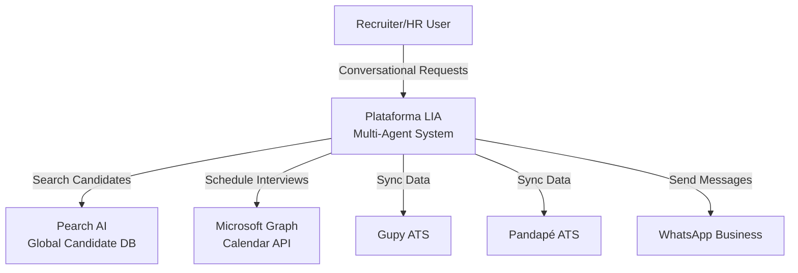
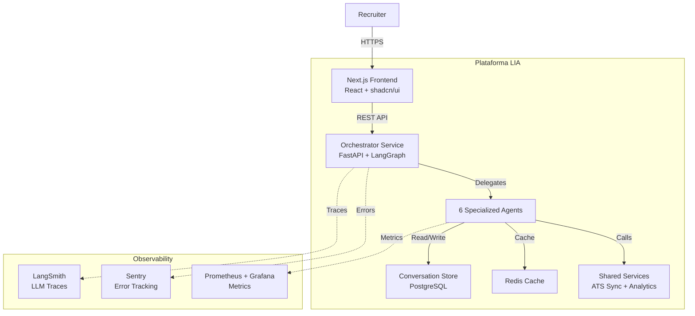
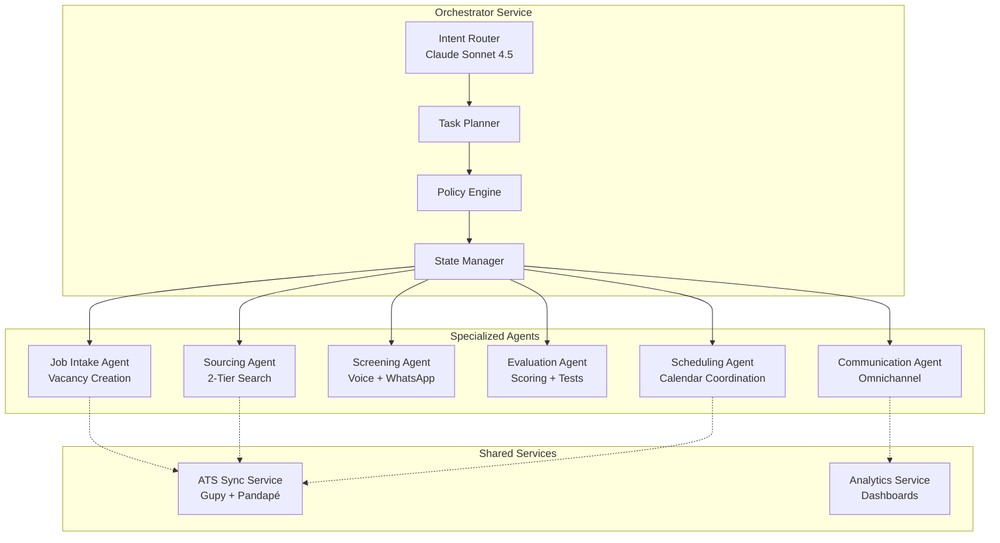
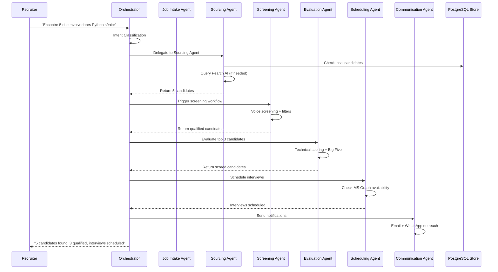
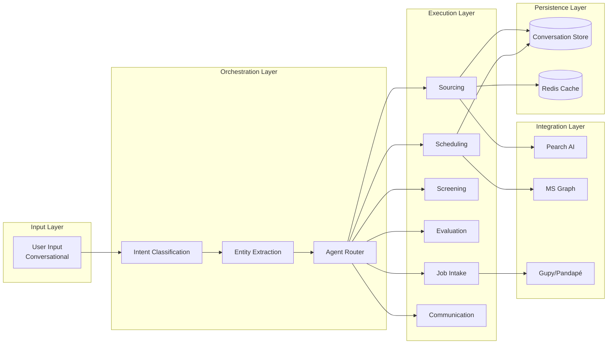
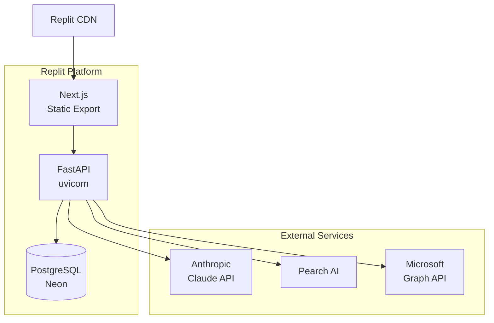

# Diagrama C4: Arquitetura Multi-Agent LIA

## Context Diagram (Level 1)

## Container Diagram (Level 2)

## Component Diagram (Level 3) - Orchestrator & Agents

## Agent Interaction Flow

## Data Flow Diagram

## Technology Stack

| Layer | Technology |
|-------|-----------|
| **Frontend** | Next.js 15.5, React, shadcn/ui, Tailwind CSS |
| **Backend** | FastAPI, Python 3.11 |
| **LLM Orchestration** | LangGraph, LangChain |
| **LLM Model** | Claude Sonnet 4.5 (Anthropic) |
| **Database** | PostgreSQL (Replit) |
| **Cache** | Redis |
| **Observability** | LangSmith, Sentry, Prometheus, Grafana |
| **Feature Flags** | LaunchDarkly or PostHog |
| **Analytics** | PostHog |
| **Code Quality** | SonarCloud, Snyk, Dependabot |
| **APIs** | Pearch AI, Microsoft Graph, OpenMic.ai, Gupy, Pandapé |

## Deployment Architecture

## Security & Compliance

| Requirement | Implementation |
|------------|----------------|
| **Secret Management** | Replit Secrets + environment variables |
| **API Authentication** | JWT tokens, OAuth 2.0 (MS Graph) |
| **Data Encryption** | TLS 1.3 in transit, PostgreSQL encryption at rest |
| **Secret Scanning** | GitHub Advanced Security, Semgrep |
| **Dependency Security** | Snyk, Dependabot |
| **LGPD Compliance** | Data retention policies, audit logs |

## Scalability Considerations

| Aspect | Strategy |
|--------|----------|
| **Horizontal Scaling** | Stateless agents, shared conversation store |
| **Rate Limiting** | Per-agent token limits, circuit breakers |
| **Caching** | Redis for candidate searches, entity extraction |
| **Database** | Connection pooling, read replicas |
| **LLM Costs** | Token budgets per agent, fallback strategies |

## Observability Metrics

| Metric | Tool |
|--------|------|
| **LLM Traces** | LangSmith |
| **Error Tracking** | Sentry |
| **Latency** | Prometheus |
| **Token Usage** | LangSmith + custom metrics |
| **Agent Performance** | Grafana dashboards |
| **User Analytics** | PostHog |
| **Code Quality** | SonarCloud |
