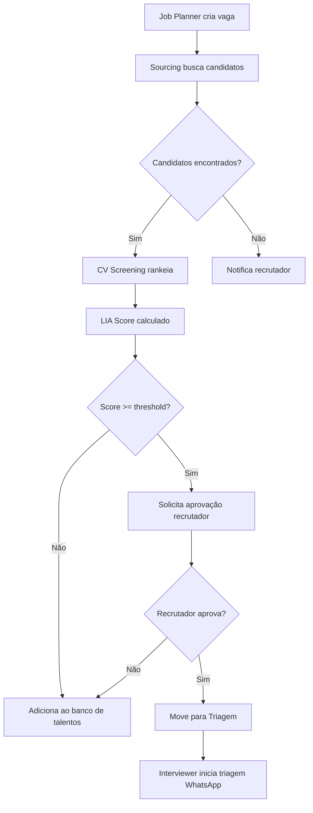
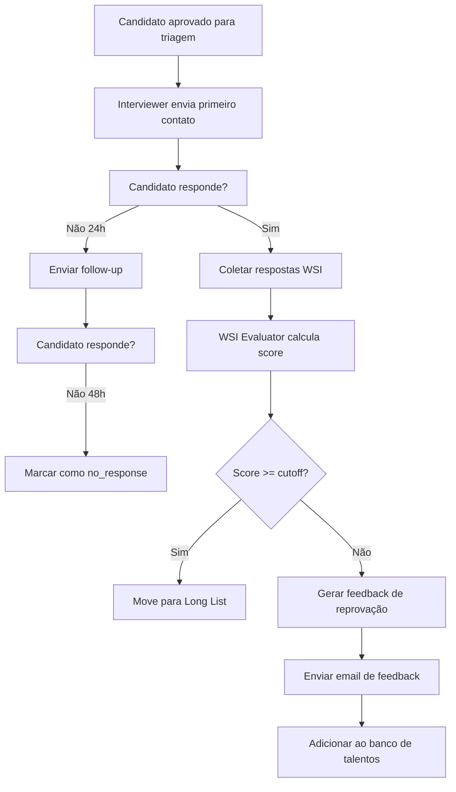
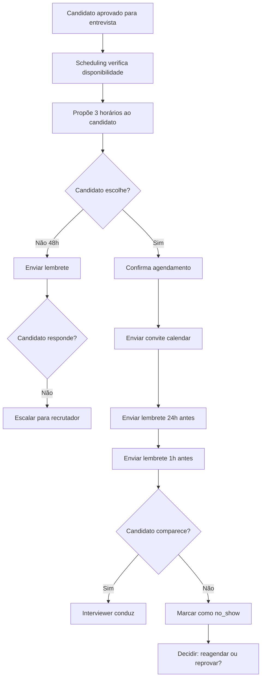

# Arquitetura de Automação de Estágios por Agentes de IA

## Visão Geral

Este documento define como os agentes de IA do LIA automatizam a movimentação de candidatos entre estágios e status, baseado em contextos, triggers e ações definidas.

---

## 1. Arquitetura Multi-Agente Atual

O LIA possui 9 agentes especializados:

| # | Agente | Responsabilidade | Estágios Relacionados |
|---|--------|------------------|----------------------|
| 0 | **Orchestrator** | Roteamento, memória, delegação | Todos |
| 1 | **Job Planner** | Criar/editar vagas, definir requisitos | Pré-processo |
| 2 | **Sourcing** | Buscar candidatos, outreach | `sourcing` |
| 3 | **CV Screening** | Triagem curricular, ranking inicial | `screening` |
| 4 | **Interviewer** | Entrevistas WSI (WhatsApp/Voz) | `screening`, `interview_*` |
| 5 | **WSI Evaluator** | Avaliação WSI, parecer, comparação | Todas as entrevistas |
| 6 | **Scheduling** | Agendamento de entrevistas | `interview_*` |
| 7 | **Analyst & Feedback** | Comunicações, analytics | Todos |
| 8 | **ATS Integrator** | Sincronização com ATSs externos | Todos |
| 9 | **Task Planner** | Criar e gerenciar tarefas | Todos |

---

## 2. Máquina de Estados por Estágio

### 2.1 Modelo Conceitual

```
┌─────────────────────────────────────────────────────────────────────────┐
│                    RECRUITMENT STATE MACHINE                             │
└─────────────────────────────────────────────────────────────────────────┘

ESTADO: sourcing
   ├─ Trigger: job_vacancy_created
   ├─ Agente: Sourcing
   ├─ Ações AI:
   │    ├─ Buscar candidatos (Pearch, LinkedIn, banco interno)
   │    ├─ Rankear por fit inicial
   │    └─ Solicitar aprovação do recrutador
   ├─ Transições possíveis:
   │    ├─ [recrutador aprova] → screening (cv_approved)
   │    ├─ [recrutador reprova] → rejected (rejected_by_recruiter)
   │    └─ [sem resposta 48h] → sourcing (follow_up_sent)
   └─ Sub-status disponíveis:
        identified, researching, qualified_to_contact, contacted_*,
        awaiting_response, interested, not_interested, ready_for_screening

ESTADO: screening
   ├─ Trigger: candidate_approved_for_screening
   ├─ Agentes: CV Screening + Interviewer
   ├─ Ações AI:
   │    ├─ Analisar CV vs Job Description
   │    ├─ Calcular LIA Score inicial
   │    ├─ Detectar red flags
   │    ├─ Iniciar triagem conversacional (WhatsApp/Voz)
   │    ├─ Coletar respostas WSI
   │    └─ Rankear para próxima etapa
   ├─ Transições possíveis:
   │    ├─ [score alto + aprovação] → long_list
   │    ├─ [score baixo] → rejected (screening_rejected)
   │    ├─ [precisa entrevistar] → interview_hr
   │    └─ [candidato desiste] → rejected (candidate_withdrew)
   └─ Sub-status disponíveis:
        cv_received, cv_analyzing, cv_approved, screening_scheduled,
        screening_in_progress, screening_completed, screening_approved

ESTADO: long_list / short_list
   ├─ Trigger: screening_approved
   ├─ Agente: Analyst & Feedback
   ├─ Ações AI:
   │    ├─ Compilar shortlist
   │    ├─ Gerar comparativo de candidatos
   │    ├─ Enviar para aprovação do gestor
   │    └─ Notificar recrutador
   ├─ Transições possíveis:
   │    ├─ [gestor aprova] → interview_manager
   │    ├─ [gestor pede mais candidatos] → sourcing
   │    └─ [gestor reprova] → rejected (manager_rejected)
   └─ Sub-status disponíveis:
        added_to_long_list, added_to_short_list, presented_to_manager,
        awaiting_manager_evaluation, manager_approved, manager_rejected

ESTADO: interview_hr / interview_manager / interview_technical / interview_final
   ├─ Trigger: approved_for_interview
   ├─ Agentes: Scheduling + Interviewer + WSI Evaluator
   ├─ Ações AI:
   │    ├─ Verificar disponibilidade (Microsoft Graph)
   │    ├─ Propor horários ao candidato
   │    ├─ Enviar convites/lembretes
   │    ├─ Conduzir entrevista (se automatizada)
   │    ├─ Transcrever e analisar
   │    ├─ Calcular WSI Score
   │    └─ Gerar parecer
   ├─ Transições possíveis:
   │    ├─ [aprovado] → próximo estágio de entrevista ou offer
   │    ├─ [reprovado] → rejected (interview_rejected)
   │    ├─ [no-show] → rejected ou follow_up
   │    └─ [reagendar] → mesmo estágio (rescheduled)
   └─ Sub-status por entrevista:
        awaiting_schedule, scheduled, confirmed, in_progress,
        completed, no_show, awaiting_feedback, approved, rejected

ESTADO: offer
   ├─ Trigger: final_interview_approved
   ├─ Agente: Analyst & Feedback
   ├─ Ações AI:
   │    ├─ Gerar proposta
   │    ├─ Enviar para aprovação interna
   │    ├─ Enviar proposta ao candidato
   │    └─ Monitorar resposta
   ├─ Transições possíveis:
   │    ├─ [aceita] → hired
   │    ├─ [recusa] → offer_declined
   │    ├─ [negocia] → offer (negotiating)
   │    └─ [sem resposta] → follow_up
   └─ Sub-status disponíveis:
        offer_approved_internally, offer_sent, offer_viewed,
        negotiating, offer_accepted, offer_declined

ESTADO: hired (FINAL)
   ├─ Trigger: offer_accepted
   ├─ Agente: ATS Integrator + Analyst
   ├─ Ações AI:
   │    ├─ Sincronizar com ATS
   │    ├─ Iniciar onboarding
   │    ├─ Arquivar candidatura
   │    └─ Fechar vaga (se única)

ESTADO: rejected (FINAL)
   ├─ Trigger: various
   ├─ Agente: Analyst & Feedback
   ├─ Ações AI:
   │    ├─ Enviar email de feedback
   │    ├─ Salvar no banco de talentos (se aplicável)
   │    └─ Registrar motivo para analytics
```

---

## 3. Tabela de Triggers, Agentes e Ações

### 3.1 Triggers Existentes (automation_service)

| Trigger | Descrição | Agente Responsável |
|---------|-----------|-------------------|
| `candidate_applied` | Candidatura recebida | CV Screening |
| `candidate_stage_changed` | Mudança de estágio | Orchestrator |
| `screening_completed` | Triagem finalizada | WSI Evaluator |
| `interview_scheduled` | Entrevista agendada | Scheduling |
| `feedback_received` | Feedback de entrevista | Analyst |
| `offer_sent` | Proposta enviada | Analyst |
| `candidate_hired` | Candidato contratado | ATS Integrator |
| `candidate_rejected` | Candidato reprovado | Analyst |
| `no_response_48h` | Sem resposta em 48h | Sourcing/Analyst |
| `deadline_approaching` | Prazo aproximando | Task Planner |

### 3.2 Novos Triggers Propostos

| Trigger | Descrição | Agente Responsável |
|---------|-----------|-------------------|
| `lia_score_calculated` | LIA Score calculado | WSI Evaluator |
| `wsi_interview_completed` | Entrevista WSI finalizada | Interviewer |
| `manager_approval_received` | Aprovação do gestor recebida | Analyst |
| `candidate_no_show` | Candidato faltou | Scheduling |
| `reference_check_completed` | Background check concluído | ATS Integrator |
| `offer_negotiation_started` | Negociação iniciada | Analyst |
| `candidate_document_uploaded` | Documento enviado | CV Screening |
| `batch_ranking_completed` | Ranking em lote concluído | CV Screening |

### 3.3 Ações Disponíveis

| Ação | Descrição | Agente Executor |
|------|-----------|-----------------|
| `send_email` | Enviar email templated | Analyst |
| `send_whatsapp` | Enviar WhatsApp | Interviewer |
| `create_task` | Criar tarefa para recrutador | Task Planner |
| `notify_recruiter` | Notificação push/bell | Analyst |
| `notify_manager` | Notificação para gestor | Analyst |
| `update_candidate_status` | Atualizar status | Pipeline Stage Service |
| `log_activity` | Registrar atividade | Audit Service |
| `calculate_score` | Calcular/recalcular score | WSI Evaluator |
| `generate_parecer` | Gerar parecer AI | WSI Evaluator |
| `schedule_interview` | Agendar entrevista | Scheduling |
| `sync_to_ats` | Sincronizar com ATS externo | ATS Integrator |
| `add_to_talent_pool` | Adicionar ao banco de talentos | Sourcing |

---

## 4. Fluxo de Automação por Cenário

### 4.1 Cenário: Abertura de Vaga com Busca AI



### 4.2 Cenário: Triagem Conversacional



### 4.3 Cenário: Agendamento Automático



---

## 5. Contexto por Estágio

### 5.1 Campos de Contexto para Decisões AI

```typescript
interface StageContext {
  // Dados do candidato
  candidate_id: string;
  lia_score: number;
  wsi_scores: {
    technical: number;
    behavioral: number;
    cultural: number;
  };
  red_flags: string[];
  
  // Dados da vaga
  job_vacancy_id: string;
  job_requirements: string[];
  job_stage_config: StageConfig[];
  cutoff_scores: {
    screening: number;
    interview: number;
    offer: number;
  };
  
  // Histórico
  previous_stage: string;
  previous_sub_status: string;
  stage_history: StageHistoryEntry[];
  
  // Interações
  last_contact_at: Date;
  response_rate: number;
  no_show_count: number;
  
  // Contexto da triagem/entrevista
  interview_transcript: string;
  interview_sentiment: 'positive' | 'neutral' | 'negative';
  key_insights: string[];
  
  // Decisões anteriores
  recruiter_decisions: Decision[];
  manager_decisions: Decision[];
  
  // Configurações
  company_policies: Policy[];
  automation_rules: AutomationRule[];
}
```

### 5.2 Decisão AI por Estágio

```typescript
interface AIDecision {
  recommended_action: 'approve' | 'reject' | 'hold' | 'escalate';
  recommended_stage: string;
  recommended_sub_status: string;
  confidence: number; // 0-100
  reasoning: string;
  requires_human_approval: boolean;
  suggested_next_steps: string[];
}
```

---

## 6. Regras de Transição

### 6.1 Transições Automáticas (sem aprovação humana)

| De | Para | Condição | Agente |
|----|------|----------|--------|
| `sourcing.identified` | `sourcing.researching` | Sempre | Sourcing |
| `sourcing.contacted_*` | `sourcing.follow_up_sent` | Sem resposta 48h | Sourcing |
| `screening.cv_received` | `screening.cv_analyzing` | Sempre | CV Screening |
| `interview_*.scheduled` | `interview_*.confirmed` | Candidato confirma | Scheduling |
| `interview_*.completed` | `interview_*.awaiting_feedback` | Sempre | WSI Evaluator |

### 6.2 Transições Semi-Automáticas (sugestão AI + aprovação)

| De | Para | Condição | Aprovador |
|----|------|----------|-----------|
| `sourcing.*` | `screening.*` | LIA Score >= threshold | Recrutador |
| `screening.screening_completed` | `long_list.*` | Score + WSI aprovados | Recrutador |
| `long_list.presented_to_manager` | `interview_manager.*` | Gestor aprova | Gestor |
| `interview_*.approved` | `offer.*` | Todas entrevistas OK | Recrutador + Gestor |

### 6.3 Transições Manuais (apenas humano)

| De | Para | Motivo |
|----|------|--------|
| Qualquer | `rejected.*` | Decisão final de reprovação |
| `offer.*` | `hired` | Aceite formal |
| Qualquer | `standby.*` | Banco de talentos |

---

## 7. Integração com Pipeline Stage Service

O `PipelineStageService` já existe e deve ser o único ponto de transição:

```python
# Exemplo de uso por agente
from app.services.pipeline_stage_service import PipelineStageService

service = PipelineStageService()

# Transição automática pelo Interviewer Agent após triagem
result = await service.transition_candidate(
    vacancy_candidate_id="...",
    to_stage="long_list",
    to_sub_status="added_to_long_list",
    triggered_by="interviewer_agent",
    source_agent="interviewer",
    reason="Triagem WhatsApp concluída com score 85/100",
    context={
        "wsi_score": 85,
        "interview_duration_minutes": 12,
        "sentiment": "positive",
        "recommendation": "Candidato demonstrou excelente fit técnico"
    }
)
```

---

## 8. Referências de Mercado

### 8.1 Repositórios de Referência LangGraph

| Repositório | Descrição | Relevância |
|-------------|-----------|------------|
| [haroon-sajid/Resume-Screening-App](https://github.com/haroon-sajid/resume-screening-app) | Screening com múltiplos agentes | Alta - arquitetura similar |
| [Ajithbalakrishnan/LangGraph_Based_Resume_Screener](https://github.com/Ajithbalakrishnan/LangGraph_Based_Resume_Screener) | RAG + Resume matching | Alta - skill matching |
| [zzzlip/langgraph-AI-interview-agent](https://github.com/zzzlip/langgraph-AI-interview-agent) | Sistema completo de entrevistas | Alta - entrevistas AI |
| [aws-samples/langgraph-multi-agent](https://github.com/aws-samples/langgraph-multi-agent) | Padrão AWS multi-agente | Média - arquitetura |

### 8.2 Plataformas de Referência

| Plataforma | Automação Relevante |
|------------|---------------------|
| **SmartRecruiters (Winston)** | Agente AI autônomo, screening 75% automatizado |
| **Phenom X+** | Agentes zero-config, ontologias de contexto |
| **HireVue** | Video + AI, sentiment analysis |
| **Recruiterflow** | Workflows "Recipes", automação por estágio |
| **Pinpoint** | Multi-step automations, branching conditions |

### 8.3 Métricas de Sucesso

| Métrica | Baseline | Meta com AI |
|---------|----------|-------------|
| Time-to-hire | 44 dias | 11-22 dias |
| Tempo de screening | Dias | Horas |
| Eficiência recrutador | Baseline | +41% |
| Qualidade de contratação | Baseline | +35% |

---

## 9. Próximos Passos de Implementação

### Fase 1: Foundation (2 semanas)
- [ ] Criar tabela `stage_automation_rules` com regras por estágio
- [ ] Implementar `StageAutomationEngine` central
- [ ] Integrar com `PipelineStageService` existente
- [ ] Adicionar novos triggers ao `AutomationService`

### Fase 2: Agentes Atualizados (3 semanas)
- [ ] Atualizar Sourcing Agent para solicitar aprovação
- [ ] Atualizar CV Screening Agent para ranking automático
- [ ] Atualizar Interviewer Agent para triagem WhatsApp
- [ ] Atualizar WSI Evaluator para parecer automático

### Fase 3: UI/UX (2 semanas)
- [ ] Painel de aprovação para recrutador
- [ ] Visualização de sugestões AI no Kanban
- [ ] Histórico de decisões AI vs humano
- [ ] Configuração de thresholds por vaga

### Fase 4: Analytics & Refinamento (Contínuo)
- [ ] Dashboard de automação
- [ ] Métricas de acurácia das sugestões
- [ ] Feedback loop para melhorar modelos
- [ ] Audit trail completo

---

## 10. Considerações de Compliance

### LGPD / GDPR
- Todas as decisões automatizadas devem ter explicabilidade
- Candidato pode solicitar revisão humana de qualquer decisão AI
- Logs de decisão devem ser mantidos por 5 anos

### EU AI Act (Alto Risco)
- Recrutamento é classificado como "alto risco"
- Necessário: documentação, auditoria, supervisão humana
- Decisões finais (rejeição, contratação) requerem aprovação humana

### Bias Mitigation
- Monitorar disparate impact por grupo demográfico
- Auditorias trimestrais de fairness
- Treinamento diversificado dos modelos
