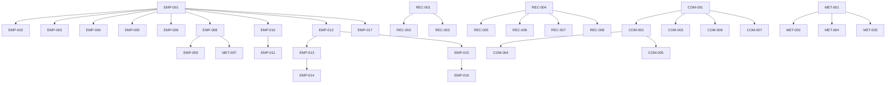
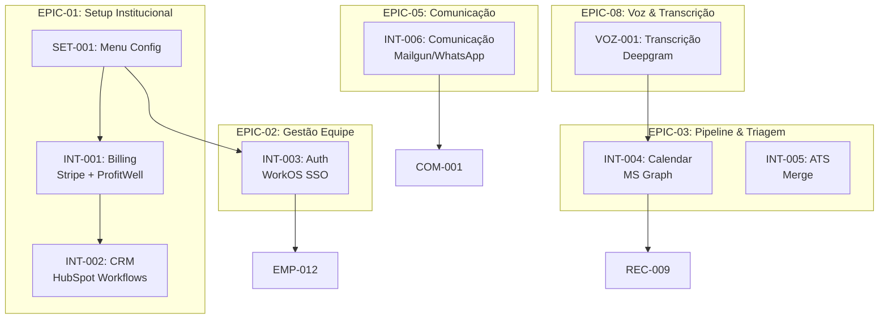

# CARDS JIRA - CONFIGURACOES ADMIN (COMPLETO)

> **Total de Cards:** 54 (4 arquivados)  
> **Organizacao:** Por Epics Funcionais  
> **Data:** Janeiro 2026  
> **Total de Pontos:** 342
> **Ultima Atualizacao:** Janeiro 2026 v3.1 - EPIC-06 renomeado (só Planejamento), Mailgun (não SendGrid), Merge (não StackOne), ProfitWell via Stripe, seção Arquitetura adicionada

---

## DOCUMENTOS DE REFERÊNCIA

> Documentos essenciais para entender o contexto, impacto e integrações do Menu Configurações

| Documento | Descrição | Uso Principal |
|-----------|-----------|---------------|
| **[WEDOTALENT_INTEGRACOES_COMPLETO.md](./WEDOTALENT_INTEGRACOES_COMPLETO.md)** | Catálogo completo de integrações externas (5.222 linhas) | Detalhes técnicos, custos, secrets, fallbacks de todas as integrações |
| **[job-wizard-enhancement-plan.md](./proposals/job-wizard-enhancement-plan.md)** | Plano consolidado do Wizard de Criação de Vagas (27 seções) | Conexão entre campos do Menu Config e o processo de abertura de vaga |
| **[DATABASE_FIELDS_REFERENCE.md](./DATABASE_FIELDS_REFERENCE.md)** | Mapeamento completo de tabelas e campos do banco (716 linhas) | Referência técnica para replicar no stack de produção |
| **[LIA_AGENT_ARCHITECTURE_COMPLETE.md](./LIA_AGENT_ARCHITECTURE_COMPLETE.md)** | Arquitetura completa do sistema de agentes LIA | Entender como os agentes consomem dados do Menu Config |
| **[configuracoes-admin-documentation.md](./configuracoes-admin-documentation.md)** | Documentação funcional do Menu Configurações | Visão de produto e regras de negócio |
| **[WEDOTALENT_COMPLIANCE_ARCHITECTURE.md](./WEDOTALENT_COMPLIANCE_ARCHITECTURE.md)** | Arquitetura de compliance (LGPD, SOX, EU AI Act) | Requisitos regulatórios que impactam configurações |

### Relacionamento com Outros Módulos

```
┌─────────────────────────────────────────────────────────────────────────────┐
│                        MENU CONFIGURAÇÕES (Este Doc)                        │
└─────────────────────────────────────────────────────────────────────────────┘
           │                    │                    │
           ▼                    ▼                    ▼
┌─────────────────┐  ┌─────────────────┐  ┌─────────────────────────────────┐
│  Job Wizard     │  │ Funil Talentos  │  │ Gestão de Vagas                 │
│  (abertura)     │  │ (candidatos)    │  │ (ciclo completo)                │
├─────────────────┤  ├─────────────────┤  ├─────────────────────────────────┤
│ Consome:        │  │ Consome:        │  │ Consome:                        │
│ - Benefícios    │  │ - Pipeline      │  │ - Templates email               │
│ - Tech Stack    │  │ - Status        │  │ - Aprovadores                   │
│ - Departamentos │  │ - Screening     │  │ - Integrações ATS               │
│ - Cultura EVP   │  │ - Instruções LIA│  │ - Microsoft Graph               │
└─────────────────┘  └─────────────────┘  └─────────────────────────────────┘
```

---

## ARQUITETURA E DEPENDÊNCIAS

> Referência: `configuracoes-admin-documentation.md` - Seções 1 e 2

### Estrutura de Componentes Frontend

```
plataforma-lia/src/components/
├── pages/
│   ├── settings-page-enhanced.tsx  # Página principal (versão atual)
│   └── settings-page.tsx           # Versão legado
│
├── settings/
│   ├── CompanyTeamHub.tsx          # Hub Empresa & Equipe
│   ├── RecruitmentHub.tsx          # Hub Recrutamento
│   ├── CommunicationHub.tsx        # Hub Comunicação
│   ├── GoalsPlanningHub.tsx        # Hub Planejamento
│   ├── GlobalSearchHub.tsx         # Hub Busca Global
│   ├── onboarding-wizard.tsx       # Wizard de configuração inicial
│   ├── progress-dashboard.tsx      # Dashboard de progresso
│   ├── user-management.tsx         # Gestão de usuários
│   └── BenefitsTab.tsx             # Tab de benefícios
```

### Dependências do Módulo

**Módulos que este depende:**
- Sistema de Autenticação (usuários, roles, JWT)
- API Backend FastAPI (todas as operações CRUD)
- Sistema de Armazenamento (logos, arquivos)
- Integrações externas (Stripe, Mailgun, Merge, etc.)

**Módulos que dependem deste:**
- Criação de Vagas (usa pipeline, benefícios, templates)
- Funil de Talentos (usa screening, status, instruções LIA)
- Comunicação com Candidatos (usa templates, horários LGPD)
- Sistema de Aprovações (usa aprovadores, fluxos)

### Hubs e Subsecões

| Hub | Componente | Subsecões | Tempo Setup |
|-----|------------|-----------|-------------|
| **Empresa & Equipe** | `CompanyTeamHub.tsx` | Dados, Departamentos, Benefícios, Usuários, Aprovadores | 15 min |
| **Recrutamento** | `RecruitmentHub.tsx` | Pipeline, Screening, Status, Instruções LIA | 20 min |
| **Comunicação** | `CommunicationHub.tsx` | Templates, Assinatura, LGPD, Alertas | 15 min |
| **Planejamento** | `GoalsPlanningHub.tsx` | Workforce Planning, Headcount | 10 min |
| **Busca Global** | `GlobalSearchHub.tsx` | Limites, Créditos, Histórico | 5 min |

---

## ORGANIZAÇÃO POR EPICS

> 8 Epics funcionais completos, ordenados por dependência e fluxo de trabalho

| Epic | Nome | Cards | Pontos | Foco |
|------|------|-------|--------|------|
| **EPIC-01** | 🏢 Setup Institucional | 14 | 88 | Dados da empresa, billing, CRM |
| **EPIC-02** | 👥 Gestão de Equipe & Acessos | 6 | 71 | Usuários, roles, aprovadores, SSO |
| **EPIC-03** | 🔄 Pipeline & Triagem | 12 | 70 | Funil, screening, ATS, calendar |
| **EPIC-04** | 🤖 Configuração da LIA | 2 | 16 | Instruções e governança da IA |
| **EPIC-05** | 📧 Comunicação & Templates | 11 | 57 | Email, WhatsApp, alertas |
| **EPIC-06** | 📊 Planejamento | 3 | 26 | Workforce planning, headcount |
| **EPIC-07** | 🔎 Busca Global & Sourcing | 5 | 24 | Configuração de busca externa |
| **EPIC-08** | 🎤 Voz & Transcrição | 1 | 13 | Transcrição de entrevistas |
| **TOTAL** | | **54** | **355** | |

### Ordem de Desenvolvimento Sugerida

```
FASE 1: Fundação
├── EPIC-01: Setup Institucional (88 pts)
│   └── Base de tudo: empresa precisa existir primeiro
└── EPIC-02: Gestão Equipe & Acessos (71 pts)
    └── Quem pode configurar o resto

FASE 2: Core do Produto
├── EPIC-03: Pipeline & Triagem (70 pts)
│   └── Como candidatos fluem no sistema
└── EPIC-04: Configuração LIA (16 pts)
    └── Como a IA se comporta

FASE 3: Comunicação
└── EPIC-05: Comunicação & Templates (57 pts)
    └── Como a plataforma fala com candidatos

FASE 4: Expansão
├── EPIC-06: Planejamento (26 pts)
├── EPIC-07: Busca Global & Sourcing (24 pts)
└── EPIC-08: Voz & Transcrição (13 pts)
```

---

## INDICE DE CARDS POR EPIC

### EPIC-01: 🏢 Setup Institucional (14 cards, 88 pontos)
- SET-001: Menu de Configurações
- EMP-001: Dados Básicos da Empresa
- EMP-002: Upload de Logo
- EMP-003: Indústria e Tamanho
- EMP-004: Missão, Visão e Valores (EVP)
- EMP-005: Tech Stack da Empresa
- EMP-006: Perfil Big Five da Cultura
- EMP-008: CRUD de Departamentos
- EMP-009: Membros de Departamentos
- EMP-010: CRUD de Benefícios
- EMP-011: Elegibilidade de Benefícios
- EMP-017: Smart Import de Dados
- INT-001: Billing (Stripe + ProfitWell nativo)
- INT-002: CRM & Onboarding (HubSpot Workflows)

### EPIC-02: 👥 Gestão de Equipe & Acessos (6 cards, 71 pontos)
- EMP-012: CRUD de Usuários
- EMP-013: Sistema de Roles
- EMP-014: Permissões Granulares
- EMP-015: CRUD de Aprovadores
- EMP-016: Fluxo de Aprovação
- INT-003: Autenticação Enterprise (WorkOS)

### EPIC-03: 🔄 Pipeline & Triagem (12 cards, 70 pontos)
- REC-001: Visualizar Pipeline
- REC-002: Editar Pipeline (CS Only)
- REC-003: Reordenar Etapas
- REC-004: CRUD Perguntas Screening
- REC-005: Tipos de Pergunta
- REC-006: Perguntas Obrigatórias
- REC-007: Reordenar Perguntas
- REC-008: Restaurar Perguntas Default
- REC-009: Status de Candidatos
- REC-010: Solicitação de Dados
- INT-004: Microsoft Graph (Teams, Calendário)
- INT-005: Integrações ATS (Merge)

### EPIC-04: 🤖 Configuração da LIA (2 cards, 16 pontos)
- REC-011: Instruções LIA
- REC-012: Governança LIA

### EPIC-05: 📧 Comunicação & Templates (11 cards, 57 pontos)
- COM-001: Listar Templates
- COM-002: Criar Template
- COM-003: Editar Template
- COM-004: Variáveis Dinâmicas
- COM-005: Preview de Template
- COM-006: Duplicar Template
- COM-007: Excluir Template
- COM-008: Editar Assinatura
- COM-009: Horários LGPD
- COM-010: Configurar Alertas LIA
- INT-006: Comunicação (Mailgun, WhatsApp)

### EPIC-06: 📊 Planejamento (3 cards, 26 pontos)
- MET-003: KPIs de Recrutamento
- MET-006: Workforce Planning
- MET-007: Headcount por Departamento
- ~~MET-001, MET-002, MET-004, MET-005~~ (ARQUIVADOS)

### EPIC-07: 🔎 Busca Global & Sourcing (5 cards, 24 pontos)
- BGL-001: Definir Limites de Busca
- BGL-002: Toggle Busca Global
- BGL-003: Saldo de Créditos
- BGL-004: Tabela de Custos
- BGL-005: Histórico de Uso

### EPIC-08: 🎤 Voz & Transcrição (1 card, 13 pontos)
- VOZ-001: Transcrição de Entrevistas (Deepgram)

### INFRAESTRUTURA (referência)
- PostgreSQL, Redis, GCP/Azure, LangGraph/LangChain (documentados em WEDOTALENT_INTEGRACOES_COMPLETO.md)

---

## EPIC-01: SETUP INSTITUCIONAL - CARDS JIRA

---

### CARD SET-001: Menu de Configurações

```yaml
Titulo: [FRONTEND] Estrutura do Menu de Configurações Admin
Tipo: Feature
Sprint: 1
Pontos: 13
Prioridade: Critica
Epic: EPIC-01 (Setup Institucional)

Descricao: |
  Implementar a estrutura de navegação do menu de configurações
  com 6 hubs principais, subsections expansíveis, barra de progresso
  e lock/unlock do menu lateral.

Historia de Usuario: |
  Como administrador, eu quero navegar facilmente entre as
  diferentes seções de configuração para gerenciar todos os
  aspectos da plataforma de forma organizada.

Regras de Negocio:
  1. Menu lateral colapsável com hover ou lock
  2. 6 hubs principais com ícones e descrições
  3. Subsections expansíveis por hub
  4. Barra de progresso do setup (0-100%)
  5. Indicador de completude por seção
  6. Navegação via teclado (Tab, Enter)
  7. Persistência do estado expandido/colapsado

Estrutura dos Hubs:
  1. Empresa & Equipe:
     - Dados da Empresa (nome, logo, site)
     - Departamentos (estrutura organizacional)
     - Benefícios (pacote de benefícios)
     - Usuários (recrutadores e permissões)
  2. Recrutamento:
     - Pipeline (etapas do funil)
     - Perguntas de Triagem (screening)
     - Status de Candidatos
     - Solicitação de Dados
     - Instruções LIA
  3. Comunicação & Alertas:
     - Templates de Email
     - Assinatura
     - Horários LGPD
     - Alertas e Briefings
  4. Planejamento:
     - KPIs de Recrutamento
     - Workforce Planning
     - Headcount por Departamento
  5. Busca Global:
     - Limites de Busca
     - Saldo de Créditos
     - Histórico de Uso
  6. Painel de Controle:
     - Gestão de Tarefas
     - Atividades Recentes

Requisitos Tecnicos:
  Frontend:
    - settings-page-enhanced.tsx (componente principal)
    - Hubs: CompanyTeamHub, RecruitmentHub, CommunicationHub,
      GoalsPlanningHub, GlobalSearchHub
    - settingsSections array com estrutura de navegação
    - overallProgress calculado por seção
    - ProgressDashboard modal detalhado
  Dados:
    - localStorage para estado do menu
    - API progress tracking por company_id

Integracoes Externas:
  N/A (estrutura de navegação apenas)

Design & Componentes:
  Componentes Existentes:
    - Card - container do menu lateral
    - Button - lock/unlock, toggle
    - Badge - indicador de progresso %
    - Progress - barra de progresso
    - Collapsible - seções expansíveis
    - Skeleton - loading state
  Novos Componentes:
    - SettingsSidebar - menu lateral completo
    - HubSection - seção de hub com subsections
    - ProgressDashboard - modal com detalhes de progresso
    - SubsectionItem - item de subsection com status
  Design Tokens:
    Background: --lia-bg-secondary (#F9FAFB)
    Border: --lia-border-subtle (#E5E7EB)
    Text: --lia-text-primary (#111827)
    Accent: --wedo-cyan (#60BED1)
    Progress: --wedo-green (#5DA47A)
  Layout:
    Sidebar: w-64 (expandido) / w-16 (colapsado)
    Container: flex h-screen
    Spacing: gap-2 entre seções, gap-1 entre subsections
  Estados:
    - Collapsed (apenas ícones)
    - Expanded (ícones + texto)
    - Locked (sempre expandido)
    - Loading (skeleton)
    - Hover (expande temporário)
  Acessibilidade:
    - Keyboard navigation (Tab, Enter, Space)
    - ARIA-expanded para seções
    - ARIA-current para seção ativa
    - Screen reader anuncia progresso
    - Focus visible em todos os interativos

Comportamento de UI:
  Fluxo Principal:
    1. Usuario acessa /configuracoes
    2. Menu lateral carrega expandido por padrão
    3. Mouse sai do menu: colapsa para ícones apenas
    4. Mouse entra: expande temporariamente
    5. Click no cadeado: lock/unlock (sempre expandido)
    6. Click em hub: seleciona hub e mostra subsections
    7. Click em subsection: carrega conteúdo no painel principal
    8. Barra de progresso atualiza conforme configuração
    9. Click no ícone de gráfico: abre ProgressDashboard modal
  
  Estados de Botoes:
    Hub Item:
      - Default: bg transparente, texto --lia-text-secondary
      - Hover: bg-lia-interactive-hover
      - Active: bg-gray-100, texto --lia-text-primary
      - Focus: ring --wedo-cyan
    Subsection Item:
      - Default: texto --lia-text-tertiary
      - Hover: texto --lia-text-primary
      - Active: bg-gray-100, font-medium
      - Completed: ícone Check verde
      - Pending: círculo âmbar
    Lock/Unlock:
      - Locked: ícone Lock
      - Unlocked: ícone Unlock
      - Hover: bg-lia-interactive-hover
    Progress Badge:
      - 0-33%: bg-electric-red-light, texto --electric-red
      - 34-66%: bg-wedo-orange-light, texto --wedo-orange
      - 67-99%: bg-wedo-cyan-light, texto --wedo-cyan
      - 100%: bg-wedo-green-light, texto --wedo-green
  
  Mensagens de Feedback:
    - Loading: Skeleton no menu durante carregamento
    - Erro: Toast vermelho "Erro ao carregar configurações"
    - Sucesso: Badge verde "100%" quando hub completo

Referencias de Design:
  Figma: "[A ser preenchido pelo time]"
  Storybook:
    URL: "[A ser preenchido]"
    Componentes relacionados:
      - "SettingsSidebar"
      - "HubSection"
      - "ProgressDashboard"
  Assets:
    - "Ícone Settings"
    - "Ícone Lock/Unlock"
    - "Ícones por Hub (Building, Users, Pipeline, etc)"
  Tokens:
    - "accent-primary: #60BED1"
    - "bg-primary: #FFFFFF"
    - "text-primary: #111827"

DoD:
  - [ ] Menu lateral funciona
  - [ ] 6 hubs navegáveis
  - [ ] Lock/unlock funciona
  - [ ] Progresso calcula corretamente
  - [ ] Keyboard navigation funciona

Criterios de Aceitacao:
  - [ ] Navegar entre todos os 6 hubs
  - [ ] Colapsar/expandir menu
  - [ ] Lock mantém menu expandido
  - [ ] Progresso reflete configurações completas
```

---

## HUB EMPRESA & EQUIPE - CARDS JIRA

---

### CARD EMP-001: Dados Basicos da Empresa

```yaml
Titulo: [FULL-STACK] Formulario de Dados Institucionais
Tipo: Feature
Sprint: 1
Pontos: 8
Prioridade: Alta
Epic: EPIC-01 (Setup Institucional)

Descricao: |
  Implementar formulario completo para edicao dos dados
  institucionais da empresa com validacao e autosave.

Historia de Usuario: |
  Como administrador, eu quero editar os dados da empresa
  para manter as informacoes atualizadas nas vagas.

Regras de Negocio:
  1. Nome obrigatorio
  2. CNPJ validado (algoritmo brasileiro)
  3. Email corporativo
  4. Website URL valida
  5. Autosave com debounce 1s
  6. Logo upload ate 2MB

Requisitos Tecnicos:
  Backend:
    - GET /api/backend-proxy/company/profile
    - PUT /api/backend-proxy/company/profile
    - POST /api/backend-proxy/company/logo (multipart)
  Frontend:
    - CompanyDataSection component (Vue/Vuetify)
    - useForm hook com validacao
    - Debounced autosave
    - Toast de feedback
  Dados:
    - companies: id, name, trade_name, cnpj, website, email, phone, address, logo_url, industry, size
  Validacoes:
    - CNPJ: lib cpf-cnpj-validator
    - Email: regex + dominio
    - Website: URL constructor

Integracoes Externas:
  API CNPJ Receita Federal:
    - Tipo: REST API
    - Uso: Autocomplete de razao social, endereco ao digitar CNPJ
    - Endpoint: https://receitaws.com.br/v1/cnpj/{cnpj} (ou similar)
    - Secret: Nenhum (API publica) ou CNPJ_API_KEY (premium)
    - Custo: Gratuito (limite 3 req/min) ou ~R$50/mes (premium)
    - Fallback: Validacao local apenas

Design & Componentes:
  Componentes Existentes:
    - Input - campos de texto (nome, email, website)
    - Select - seleção de indústria e tamanho
    - Button - salvar, cancelar
    - Card - container do formulário
    - Toast - feedback de salvamento (sonner)
    - Skeleton - loading state
  Novos Componentes:
    - CNPJInput - input com máscara e validação de CNPJ
    - CompanyDataForm - formulário principal com autosave
  Design Tokens:
    Background: --lia-bg-secondary (#F9FAFB)
    Border: --lia-border-subtle (#E5E7EB)
    Text: --lia-text-primary (#111827)
    Accent: --wedo-cyan (#60BED1)
  Layout:
    Container: max-w-2xl mx-auto
    Card: lia-card com lia-shadow-sm
    Spacing: gap-6 entre seções, gap-4 entre campos
  Estados:
    - Default, Hover, Focus, Disabled, Loading, Error, Success
  Acessibilidade:
    - Labels obrigatórios em todos os campos
    - Keyboard navigation (Tab order)
    - ARIA labels para ações
    - Mensagens de erro anunciadas por screen readers

Comportamento de UI:
  Fluxo Principal:
    1. Usuario acessa pagina de dados da empresa
    2. Campos carregam com dados atuais (skeleton durante loading)
    3. Usuario edita qualquer campo
    4. Autosave ativa apos 1s de inatividade (debounce)
    5. Indicador de "Salvando..." aparece discretamente
    6. Toast de confirmacao "Dados salvos com sucesso"
  
  Estados de Botoes:
    Salvar:
      - Default: bg-wedo-cyan, texto branco
      - Hover: bg-wedo-cyan-hover (escurece 10%)
      - Loading: spinner + "Salvando..."
      - Disabled: opacity-50 quando nenhuma alteracao
      - Success: checkmark verde por 2s
    Cancelar:
      - Default: bg-lia-bg-tertiary, texto --lia-text-secondary
      - Hover: bg-lia-interactive-hover
      - Disabled: durante loading
  
  Validacoes Inline:
    CNPJ:
      - Erro: borda --electric-red + "CNPJ invalido (verifique os digitos)"
      - Sucesso: borda --wedo-green + icone checkmark
    Email:
      - Erro: "Formato de email invalido"
      - Sucesso: icone checkmark verde
    Website:
      - Erro: "URL invalida (inclua https://)"
      - Sucesso: icone checkmark verde
  
  Mensagens de Feedback:
    - Sucesso: Toast verde "Dados da empresa salvos com sucesso"
    - Erro: Toast vermelho "Erro ao salvar dados. Tente novamente."
    - Warning: Toast laranja "Alguns campos precisam de revisao"
    - Autosave: Badge discreto "Salvo automaticamente" (fade out 2s)
Referencias de Design:
  Figma: "[A ser preenchido pelo time]"
  Storybook:
    URL: "[A ser preenchido]"
    Componentes relacionados:
      - "CNPJInput"
      - "CompanyDataForm"
  Assets:
    - "Ícone checkmark"
    - "Ícone e"
    - "Logo placeholder"
  Tokens:
    - "accent-primary: #60BED1"
    - "bg-primary: #FFFFFF"
    - "text-primary: #111827"


DoD (Definition of Done):
  - [ ] Todos os campos editaveis
  - [ ] Validacoes funcionando
  - [ ] Autosave implementado
  - [ ] Upload de logo funciona
  - [ ] Testes unitarios passando
  - [ ] Testes E2E passando

Criterios de Aceitacao:
  - [ ] CNPJ invalido mostra erro
  - [ ] Dados salvam automaticamente
  - [ ] Logo aparece apos upload
  - [ ] Toast confirma salvamento
```

---

### CARD EMP-002: Upload de Logo

```yaml
Titulo: [FRONTEND] Upload de Logo da Empresa
Tipo: Feature
Sprint: 1
Pontos: 3
Prioridade: Alta
Epic: EPIC-01 (Setup Institucional)
Dependencias: EMP-001

Descricao: |
  Componente de upload de imagem para logo da empresa
  com preview, crop e validacao de tamanho.

Historia de Usuario: |
  Como administrador, eu quero fazer upload do logo da empresa
  para personalizar a presenca nas vagas e comunicacoes.

Regras de Negocio:
  1. Formatos aceitos: PNG, JPG, SVG
  2. Tamanho maximo: 2MB
  3. Dimensoes recomendadas: 512x512px
  4. Preview em tempo real
  5. Opcao de remover logo

Requisitos Tecnicos:
  Frontend:
    - ImageUpload component
    - Preview circular
    - Drag & drop
    - Progress bar
  Backend:
    - POST /api/backend-proxy/company/logo
    - Resize automatico para 512px
    - Storage em CDN

Integracoes Externas:
  CDN/Storage:
    - Tipo: Object Storage
    - Opcoes: AWS S3, Cloudinary, Replit Object Storage
    - Uso: Armazenamento e CDN de logos
    - Secret: AWS_ACCESS_KEY_ID, AWS_SECRET_ACCESS_KEY ou CLOUDINARY_URL
    - Custo: ~$0.023/GB (S3) ou gratuito ate 25GB (Cloudinary)

Design & Componentes:
  Componentes Existentes:
    - Button - upload, remover
    - Card - container do upload
    - Skeleton - loading durante upload
  Novos Componentes:
    - FileUpload - dropzone com drag & drop
    - ImagePreview - preview circular com crop
    - UploadProgress - barra de progresso do upload
  Design Tokens:
    Background: --lia-bg-secondary (#F9FAFB)
    Border: --lia-border-subtle (#E5E7EB) dashed para dropzone
    Text: --lia-text-primary (#111827)
    Accent: --wedo-cyan (#60BED1)
    Error: --electric-red (#de1c31)
  Layout:
    Container: max-w-sm mx-auto
    Card: lia-card com lia-shadow-sm
    Dropzone: aspect-square, rounded-full para preview
    Spacing: gap-4 entre elementos
  Estados:
    - Default (dropzone vazio)
    - Hover (drag over)
    - Uploading (progress bar)
    - Preview (imagem carregada)
    - Error (arquivo inválido)
  Acessibilidade:
    - Label "Upload de logo da empresa"
    - Keyboard: Enter/Space para abrir seletor
    - ARIA-live para status do upload
    - Alt text para preview da imagem

Comportamento de UI:
  Fluxo Principal:
    1. Usuario ve dropzone vazio com texto "Arraste uma imagem ou clique para selecionar"
    2. Usuario arrasta arquivo ou clica para abrir seletor
    3. Validacao de formato (PNG/JPG/SVG) e tamanho (<2MB) em tempo real
    4. Se valido: preview circular aparece imediatamente
    5. Progress bar durante upload (0-100%)
    6. Ao completar: Toast de sucesso + imagem salva
    7. Opcao de remover (icone X no canto) com confirmacao
  
  Estados de Botoes:
    Upload/Selecionar:
      - Default: borda dashed --lia-border-subtle, fundo transparente
      - Hover: borda --wedo-cyan, fundo --wedo-cyan-light (10% opacity)
      - Drag Over: borda --wedo-cyan solida, fundo --wedo-cyan-light
      - Uploading: spinner no centro + progress bar
      - Disabled: durante upload em andamento
    Remover:
      - Default: icone X --lia-text-tertiary no canto superior direito
      - Hover: icone --electric-red
      - Click: abre dialog de confirmacao
  
  Validacoes Inline:
    Formato:
      - Erro: borda --electric-red + "Formato nao suportado. Use PNG, JPG ou SVG"
      - Sucesso: borda --wedo-green (durante drag)
    Tamanho:
      - Erro: "Arquivo muito grande. Maximo 2MB (atual: X MB)"
      - Sucesso: nenhum indicador especifico
  
  Mensagens de Feedback:
    - Sucesso: Toast verde "Logo atualizado com sucesso"
    - Erro: Toast vermelho "Erro no upload. Tente novamente."
    - Removido: Toast verde "Logo removido"
    - Progress: Barra de progresso animada dentro do dropzone
Referencias de Design:
  Figma: "[A ser preenchido pelo time]"
  Storybook:
    URL: "[A ser preenchido]"
    Componentes relacionados:
      - "FileUpload"
      - "ImagePreview"
      - "UploadProgress"
  Assets:
    - "Ícone X"
    - "Ícone e"
    - "Logo placeholder"
  Tokens:
    - "accent-primary: #60BED1"
    - "bg-primary: #FFFFFF"
    - "text-primary: #111827"


DoD:
  - [ ] Upload funciona
  - [ ] Preview exibe
  - [ ] Validacao de formato
  - [ ] Validacao de tamanho

Criterios de Aceitacao:
  - [ ] Arquivo >2MB mostra erro
  - [ ] PNG/JPG/SVG aceitos
  - [ ] Preview circular exibe
  - [ ] Drag & drop funciona
```

---

### CARD EMP-003: Industria e Tamanho

```yaml
Titulo: [FRONTEND] Selecao de Industria e Tamanho
Tipo: Feature
Sprint: 1
Pontos: 3
Prioridade: Media
Epic: EPIC-01 (Setup Institucional)
Dependencias: EMP-001

Descricao: |
  Selecionar setor de atuacao (industria) e porte da empresa
  para contextualizacao nas vagas.

Historia de Usuario: |
  Como administrador, eu quero definir industria e tamanho
  para que candidatos entendam o contexto da empresa.

Regras de Negocio:
  1. Lista pre-definida de industrias
  2. Opcoes de tamanho: Startup, PME, Grande, Enterprise
  3. Opcional: quantidade de funcionarios
  4. Opcional: ano de fundacao

Requisitos Tecnicos:
  Frontend:
    - Select de industria (autocomplete)
    - Radio group para tamanho
    - Input numerico para headcount
    - Input numerico para ano
  Dados:
    - industries: lista fixa de ~50 setores
    - sizes: startup, small, medium, large, enterprise

Design & Componentes:
  Componentes Existentes:
    - Select - autocomplete de indústria (cmdk)
    - RadioGroup - seleção de tamanho (@radix-ui/react-radio-group)
    - Input - headcount e ano de fundação
    - Card - container da seção
    - Badge - tags de indústria selecionada
  Novos Componentes:
    - IndustrySelect - select com ícones por setor
    - CompanySizeSelector - radio group visual com descrições
  Design Tokens:
    Background: --lia-bg-secondary (#F9FAFB)
    Border: --lia-border-subtle (#E5E7EB)
    Text: --lia-text-primary (#111827)
    Accent: --wedo-cyan (#60BED1)
  Layout:
    Container: max-w-2xl mx-auto
    Card: lia-card com lia-shadow-sm
    Grid: 2 colunas para tamanho, 1 coluna para indústria
    Spacing: gap-6 entre seções
  Estados:
    - Default, Hover, Focus, Selected, Disabled
  Acessibilidade:
    - Labels obrigatórios
    - Keyboard navigation (Arrow keys para radio)
    - ARIA-selected para opção ativa
    - Descrições de cada opção de tamanho

Comportamento de UI:
  Fluxo Principal:
    1. Usuario acessa secao de industria e tamanho
    2. Campos carregam com valores atuais (se existirem)
    3. Usuario busca industria no autocomplete (debounce 300ms)
    4. Sugestoes aparecem conforme digita
    5. Usuario seleciona industria (fecha dropdown)
    6. Usuario clica em opcao de tamanho (radio)
    7. Campos opcionais (headcount, ano) podem ser preenchidos
    8. Autosave apos cada alteracao
  
  Estados de Botoes:
    Opcoes de Tamanho (Radio):
      - Default: borda --lia-border-subtle, fundo transparente
      - Hover: borda --wedo-cyan-light
      - Selected: borda --wedo-cyan, fundo --wedo-cyan-light (10%)
      - Focus: ring --wedo-cyan
  
  Validacoes Inline:
    Headcount:
      - Erro: "Numero invalido" (se texto inserido)
      - Sucesso: nenhum indicador especifico
    Ano de Fundacao:
      - Erro: "Ano invalido" (se < 1800 ou > ano atual)
      - Sucesso: nenhum indicador especifico
  
  Mensagens de Feedback:
    - Sucesso: Toast verde "Industria e tamanho salvos"
    - Erro: Toast vermelho "Erro ao salvar. Tente novamente."
Referencias de Design:
  Figma: "[A ser preenchido pelo time]"
  Storybook:
    URL: "[A ser preenchido]"
    Componentes relacionados:
      - "IndustrySelect"
      - "CompanySizeSelector"
  Assets:
    - "Ícones Lucide conforme design"
  Tokens:
    - "accent-primary: #60BED1"
    - "bg-primary: #FFFFFF"
    - "text-primary: #111827"


DoD:
  - [ ] Select de industria funciona
  - [ ] Radio de tamanho funciona
  - [ ] Dados persistem

Criterios de Aceitacao:
  - [ ] Industria selecionada salva
  - [ ] Tamanho selecionado salva
  - [ ] Headcount opcional aceita numeros
```

---

### CARD EMP-004: Missao, Visao e Valores (EVP)

```yaml
Titulo: [FRONTEND] Formulario de Cultura Organizacional
Tipo: Feature
Sprint: 2
Pontos: 5
Prioridade: Media
Epic: EPIC-01 (Setup Institucional)
Dependencias: EMP-001

Descricao: |
  Campos para definir Missao, Visao, Valores e EVP
  (Employee Value Proposition) da empresa.

Historia de Usuario: |
  Como administrador, eu quero descrever a cultura da empresa
  para atrair candidatos alinhados.

Regras de Negocio:
  1. Textarea para Missao (max 500 chars)
  2. Textarea para Visao (max 500 chars)
  3. Input multiplo para Valores (max 10)
  4. Textarea para EVP (max 1000 chars)
  5. Contador de caracteres

Requisitos Tecnicos:
  Frontend:
    - Textareas com counter
    - Tag input para valores
    - Rich text opcional para EVP
  Backend:
    - PUT /api/backend-proxy/company/culture

Integracoes Externas (Opcional):
  LLM (Claude/Gemini):
    - Tipo: AI API
    - Uso: Sugestao de EVP e valores baseado em industria
    - Servico: culture_analyzer_service.py (ja implementado)
    - Secret: ANTHROPIC_API_KEY ou GEMINI_API_KEY
    - Custo: ~$0.003 por request (Claude Haiku)
    - Nota: Funcionalidade opcional, usuario pode preencher manualmente

Configuracao LLM (EMP-004):
  Modelo Recomendado: Claude 3.5 Haiku ou Gemini 1.5 Flash
  Temperatura: 0.4 (criativo mas consistente)
  Max Tokens: 1000
  
  Prompt Template: |
    <role>
    Você é um Especialista em Employer Branding e Employee Value Proposition (EVP)
    com experiência em empresas de diversos setores.
    </role>
    
    <task>
    Baseado nos dados da empresa abaixo, sugira uma proposta de EVP e lista de valores
    organizacionais que sejam autênticos e diferenciadores.
    </task>
    
    <company_data>
    - Indústria: {{industria}}
    - Tamanho: {{tamanho}} (startup/pme/grande/enterprise)
    - Missão: {{missao}} (se disponível)
    - Descrição: {{descricao}} (se disponível)
    </company_data>
    
    <output_format>
    Responda APENAS em JSON válido:
    {
      "evp": "Proposta de valor única em 2-3 frases (max 200 chars)",
      "evp_bullets": ["Bullet 1", "Bullet 2", "Bullet 3", "Bullet 4"],
      "valores": ["Valor 1", "Valor 2", "Valor 3", "Valor 4", "Valor 5"],
      "reasoning": "Breve explicação do porquê dessas sugestões"
    }
    </output_format>
  
  Input Schema:
    industria: string (obrigatório)
    tamanho: enum ["startup", "pme", "grande", "enterprise"]
    missao: string | null
    descricao: string | null
  
  Output Schema:
    evp: string (max 200 chars)
    evp_bullets: string[] (3-5 itens)
    valores: string[] (3-7 itens)
    reasoning: string
  
  Fallback: Se LLM falhar, mostrar valores genéricos por indústria (lista estática)

Design & Componentes:
  Componentes Existentes:
    - Input - campos de texto
    - Button - salvar, sugerir com IA
    - Card - container das seções
    - Badge - valores como tags
    - Skeleton - loading durante sugestão IA
  Novos Componentes:
    - TextareaCounter - textarea com contador de caracteres
    - TagInput - input para adicionar valores (chips)
    - EVPEditor - editor rich text simplificado para EVP
    - AISuggestionButton - botão com ícone Brain para sugestões
  Design Tokens:
    Background: --lia-bg-secondary (#F9FAFB)
    Border: --lia-border-subtle (#E5E7EB)
    Text: --lia-text-primary (#111827)
    Accent: --wedo-cyan (#60BED1)
    AI: --wedo-purple (#9860D1) para elementos de IA
  Layout:
    Container: max-w-2xl mx-auto
    Card: lia-card com lia-shadow-sm
    Stack: vertical com gap-6 entre seções
    Textarea: min-h-[120px] para missão/visão
  Estados:
    - Default, Focus, Filled, Error
    - AI Loading (skeleton + spinner)
    - AI Suggested (highlight temporário)
  Acessibilidade:
    - Labels obrigatórios
    - Contador de caracteres anunciado
    - Keyboard: Enter para adicionar valor
    - ARIA-live para sugestões de IA

Comportamento de UI:
  Fluxo Principal:
    1. Usuario acessa secao de cultura organizacional
    2. Campos de texto (Missao, Visao, EVP) com contador de caracteres
    3. Usuario digita, contador atualiza em tempo real
    4. Para Valores: usuario digita e pressiona Enter para adicionar tag
    5. Tags aparecem como chips removiveis (X)
    6. Botao "Sugerir com IA" gera conteudo automatico
    7. Autosave apos cada alteracao
  
  Estados de Botoes:
    Sugerir com IA:
      - Default: bg-wedo-purple, icone Brain, texto branco
      - Hover: bg-wedo-purple-hover (escurece 10%)
      - Loading: skeleton nos campos + spinner no botao
      - Disabled: quando ja gerando ou campos preenchidos
      - Success: campos preenchem com highlight --wedo-purple-light
    Adicionar Valor:
      - Default: icone Plus --lia-text-tertiary
      - Hover: icone --wedo-cyan
      - Disabled: quando limite de 10 atingido
    Remover Valor (tag X):
      - Default: icone X pequeno na tag
      - Hover: tag inteira fica --electric-red-light
  
  Validacoes Inline:
    Missao/Visao:
      - Contador: "X/500 caracteres" (vermelho se > 500)
      - Erro: borda --electric-red se exceder limite
    EVP:
      - Contador: "X/1000 caracteres"
      - Erro: borda --electric-red se exceder limite
    Valores:
      - Erro: "Maximo 10 valores" se tentar adicionar mais
  
  Mensagens de Feedback:
    - Sucesso: Toast verde "Cultura organizacional salva"
    - IA Sucesso: Toast verde "Sugestoes geradas com sucesso"
    - IA Erro: Toast vermelho "Erro ao gerar sugestoes. Tente novamente."
    - Warning: Toast laranja "Texto muito longo, sera truncado"
Referencias de Design:
  Figma: "[A ser preenchido pelo time]"
  Storybook:
    URL: "[A ser preenchido]"
    Componentes relacionados:
      - "TextareaCounter"
      - "TagInput"
      - "EVPEditor"
  Assets:
    - "Ícone Plus"
    - "Ícone e"
    - "Ícone X"
  Tokens:
    - "accent-primary: #60BED1"
    - "bg-primary: #FFFFFF"
    - "text-primary: #111827"


DoD:
  - [ ] Todos os campos editaveis
  - [ ] Contador funciona
  - [ ] Valores como lista
  - [ ] Botao "Sugerir com IA" funciona (se LLM disponivel)

Criterios de Aceitacao:
  - [ ] Missao salva ate 500 chars
  - [ ] Valores podem ser adicionados/removidos
  - [ ] EVP aceita formatacao basica
  - [ ] Sugestao LLM preenche campos automaticamente
```

---

### CARD EMP-005: Tech Stack da Empresa

```yaml
Titulo: [FRONTEND] Configuracao de Tech Stack
Tipo: Feature
Sprint: 2
Pontos: 5
Prioridade: Media
Epic: EPIC-01 (Setup Institucional)
Dependencias: EMP-001

Descricao: |
  Selecionar tecnologias usadas pela empresa para
  contextualizacao em vagas tech.

Historia de Usuario: |
  Como administrador, eu quero listar as tecnologias da empresa
  para atrair desenvolvedores com stack compativel.

Regras de Negocio:
  1. Autocomplete com sugestoes
  2. Categorias: Frontend, Backend, Mobile, DevOps, Data
  3. Limite de 30 tecnologias
  4. Ordenar por categoria
  5. Exibir logos/icones das tecnologias

Requisitos Tecnicos:
  Frontend:
    - Multi-select com autocomplete
    - Agrupamento por categoria
    - Tech icons (devicons)
  Dados:
    - tech_stack: lista de tecnologias conhecidas

Integracoes Externas:
  Apify (Scraping):
    - Tipo: Web Scraping via Actor
    - Actor: apify~website-content-crawler
    - Uso: Extrair tech stack do site/LinkedIn da empresa
    - Servico: company_scraper_service.py (ja implementado)
    - Secret: APIFY_API_KEY
    - Custo: ~$0.25-0.50 por scrape (5-10 paginas)
  LLM (Claude/Gemini):
    - Tipo: AI API
    - Uso: Parsing e categorizacao das tecnologias encontradas
    - Servico: culture_analyzer_service.py (ja implementado)
    - Secret: ANTHROPIC_API_KEY ou GEMINI_API_KEY
    - Custo: ~$0.01 por analise
    - Output: Array de tecnologias categorizadas

Configuracao LLM (EMP-005):
  Modelo Recomendado: Claude 3.5 Haiku ou Gemini 1.5 Flash
  Temperatura: 0.2 (mais determinístico para extração)
  Max Tokens: 800
  
  Prompt Template: |
    <role>
    Você é um especialista em tecnologia que analisa conteúdo de websites
    para identificar o tech stack utilizado pela empresa.
    </role>
    
    <task>
    Analise o conteúdo abaixo e extraia todas as tecnologias, frameworks,
    linguagens e ferramentas mencionadas ou inferidas.
    </task>
    
    <content>
    {{website_content}}
    </content>
    
    <categorias>
    - frontend: React, Vue, Angular, Next.js, Tailwind, etc.
    - backend: Node.js, Python, Java, Go, Ruby, etc.
    - mobile: React Native, Flutter, Swift, Kotlin, etc.
    - devops: Docker, Kubernetes, AWS, GCP, Azure, etc.
    - data: PostgreSQL, MongoDB, Redis, Elasticsearch, etc.
    - ai_ml: TensorFlow, PyTorch, LangChain, OpenAI, etc.
    </categorias>
    
    <output_format>
    Responda APENAS em JSON válido:
    {
      "tech_stack": [
        { "name": "React", "category": "frontend", "confidence": 0.95 },
        { "name": "Node.js", "category": "backend", "confidence": 0.90 }
      ],
      "engineering_culture": "Breve descrição da cultura de engenharia inferida"
    }
    </output_format>
  
  Input Schema:
    website_content: string (max 40000 chars, truncado se maior)
  
  Output Schema:
    tech_stack: Array<{ name: string, category: enum, confidence: float }>
    engineering_culture: string | null
  
  Pos-Processamento:
    1. Filtrar tecnologias com confidence < 0.7
    2. Remover duplicatas
    3. Limitar a 30 tecnologias
    4. Ordenar por categoria e confidence

Design & Componentes:
  Componentes Existentes:
    - Select - autocomplete multi-select (cmdk)
    - Button - adicionar, importar do site
    - Card - container por categoria
    - Badge - tecnologias selecionadas
    - Skeleton - loading durante scraping
  Novos Componentes:
    - TechStackSelect - multi-select com ícones de tecnologias
    - TechCategoryGroup - agrupamento visual por categoria
    - TechIcon - ícones de devicons para cada tecnologia
    - ImportFromSiteButton - botão com IA para importar
  Design Tokens:
    Background: --lia-bg-secondary (#F9FAFB)
    Border: --lia-border-subtle (#E5E7EB)
    Text: --lia-text-primary (#111827)
    Accent: --wedo-cyan (#60BED1)
    Categories:
      Frontend: --wedo-cyan (#60BED1)
      Backend: --wedo-green (#5DA47A)
      Mobile: --wedo-orange (#D19960)
      DevOps: --wedo-purple (#9860D1)
      Data: --wedo-magenta (#D160AB)
  Layout:
    Container: max-w-3xl mx-auto
    Card: lia-card com lia-shadow-sm
    Grid: flex-wrap para badges de tecnologias
    Spacing: gap-4 entre categorias, gap-2 entre badges
  Estados:
    - Default, Hover, Selected, Disabled
    - Searching (autocomplete loading)
    - Importing (scraping em progresso)
  Acessibilidade:
    - Label "Tecnologias da empresa"
    - Keyboard navigation no autocomplete
    - ARIA-selected para tecnologias selecionadas
    - Screen reader anuncia categoria ao adicionar

Comportamento de UI:
  Fluxo Principal:
    1. Usuario acessa secao de tech stack
    2. Tecnologias existentes aparecem agrupadas por categoria
    3. Usuario digita no autocomplete (debounce 300ms)
    4. Sugestoes aparecem com icones da tecnologia
    5. Usuario clica para adicionar (badge aparece na categoria)
    6. Usuario pode remover clicando no X do badge
    7. Botao "Importar do Site" extrai automaticamente
  
  Estados de Botoes:
    Importar do Site:
      - Default: bg-wedo-cyan, icone Globe, texto branco
      - Hover: bg-wedo-cyan-hover
      - Loading: skeleton nos badges + spinner + "Analisando site..."
      - Disabled: quando ja importando
      - Success: novas tecnologias aparecem com highlight
    Adicionar (no autocomplete):
      - Default: item com icone da tecnologia
      - Hover: fundo --lia-bg-tertiary
      - Selected: checkmark ao lado
    Remover Badge:
      - Default: X pequeno no badge
      - Hover: badge inteiro fica --electric-red-light
  
  Validacoes Inline:
    Limite:
      - Warning: "Limite de 30 tecnologias atingido" (toast laranja)
      - Autocomplete desabilita quando cheio
  
  Mensagens de Feedback:
    - Sucesso: Toast verde "Tech stack atualizado"
    - Import Sucesso: Toast verde "X tecnologias encontradas no site"
    - Import Erro: Toast vermelho "Erro ao analisar site. Verifique a URL."
    - Warning: Toast laranja "Limite de 30 tecnologias atingido"
Referencias de Design:
  Figma: "[A ser preenchido pelo time]"
  Storybook:
    URL: "[A ser preenchido]"
    Componentes relacionados:
      - "TechStackSelect"
      - "TechCategoryGroup"
      - "TechIcon"
  Assets:
    - "Ícone Globe"
    - "Ícone ícones"
    - "Logo placeholder"
  Tokens:
    - "accent-primary: #60BED1"
    - "bg-primary: #FFFFFF"
    - "text-primary: #111827"


DoD:
  - [ ] Autocomplete funciona
  - [ ] Categorias exibem
  - [ ] Icons aparecem
  - [ ] Dados persistem
  - [ ] Import automatico via scraping funciona

Criterios de Aceitacao:
  - [ ] Buscar "React" retorna sugestao
  - [ ] Tecnologias agrupadas por categoria
  - [ ] Limite de 30 respeitado
  - [ ] Botao "Importar do site" extrai tech stack
```

---

### CARD EMP-006: Perfil Big Five da Cultura

```yaml
Titulo: [FULL-STACK] Radar de Cultura Big Five
Tipo: Feature
Sprint: 3
Pontos: 8
Prioridade: Media
Epic: EPIC-01 (Setup Institucional)
Dependencias: EMP-001

Descricao: |
  Configurar perfil comportamental da empresa usando
  modelo Big Five para matching cultural.

Historia de Usuario: |
  Como administrador, eu quero definir o perfil cultural
  para que a LIA faca matching comportamental.

Regras de Negocio:
  1. 5 dimensoes: Abertura, Conscienciosidade, Extroversao, 
     Amabilidade, Neuroticismo
  2. Slider 1-10 para cada dimensao
  3. Grafico radar com preview
  4. Descricoes de cada dimensao
  5. Sugestao baseada em industria

Requisitos Tecnicos:
  Frontend:
    - BigFiveRadar component
    - Sliders com tooltips
    - Chart.js radar chart
    - CultureProfilePreview
  Backend:
    - PUT /api/backend-proxy/company/culture-profile
  IA:
    - Sugestao de perfil baseado em industria

Integracoes Externas:
  LLM (Claude/Gemini):
    - Tipo: AI API
    - Uso: Geracao automatica de perfil Big Five a partir de:
      - Conteudo scrapeado do site (via Apify)
      - Industria e tamanho da empresa
      - Missao, visao e valores informados
    - Servico: culture_analyzer_service.py (ja implementado)
    - Prompt: Analisa conteudo e retorna scores 0-100 para cada dimensao
    - Secret: ANTHROPIC_API_KEY ou GEMINI_API_KEY
    - Custo: ~$0.02 por analise completa
    - Output: { openness, conscientiousness, extraversion, agreeableness, stability }

Configuracao LLM (EMP-006):
  Modelo Recomendado: Claude 3.5 Sonnet (melhor raciocínio)
  Temperatura: 0.3
  Max Tokens: 2000
  Metodologia: Few-Shot com Chain-of-Thought
  
  Prompt Template: |
    <role>
    Você é um Especialista em Psicologia Organizacional com profundo conhecimento
    do modelo Big Five (OCEAN) aplicado a culturas corporativas.
    </role>
    
    <task>
    Analise o conteúdo da empresa e gere um perfil Big Five organizacional.
    Use a escala 0-100 para cada dimensão.
    </task>
    
    <thinking_instructions>
    Antes de gerar os scores, raciocine sobre:
    1. Que tipo de cultura a empresa demonstra? (inovadora vs tradicional)
    2. Como são os processos? (formais vs informais)
    3. Como é a colaboração? (intensa vs individual)
    4. Qual o foco? (pessoas vs resultados)
    5. Como é o ambiente? (calmo vs dinâmico)
    </thinking_instructions>
    
    <scoring_guide>
    OPENNESS (Abertura):
      - 70-100: Startups, inovação, experimentação, criatividade
      - 40-70: Equilíbrio inovação/estabilidade
      - 0-40: Tradicionais, processos estabelecidos, aversão a risco
    
    CONSCIENTIOUSNESS (Conscienciosidade):
      - 70-100: Foco em processos, compliance, qualidade rigorosa
      - 40-70: Processos estruturados com flexibilidade
      - 0-40: Informal, menos processos, agilidade > processos
    
    EXTRAVERSION (Extroversão):
      - 70-100: Cultura colaborativa intensa, muitos eventos, team work
      - 40-70: Equilíbrio colaboração/individual
      - 0-40: Foco individual, introspecção, deep work
    
    AGREEABLENESS (Amabilidade):
      - 70-100: Foco em pessoas, DEI forte, bem-estar, cuidado
      - 40-70: Equilíbrio resultados/pessoas
      - 0-40: Competitivo, meritocracia agressiva, resultados
    
    STABILITY (Estabilidade):
      - 70-100: Ambiente calmo, estável, previsível, work-life balance
      - 40-70: Alguns desafios mas estável
      - 0-40: Alta pressão, startup chaos, mudanças frequentes
    </scoring_guide>
    
    <company_data>
    Website Content: {{website_content}}
    LinkedIn Data: {{linkedin_data}}
    Industry: {{industry}}
    Size: {{company_size}}
    Mission: {{mission}}
    Values: {{values}}
    </company_data>
    
    <output_format>
    Responda APENAS em JSON válido:
    {
      "big_five": {
        "openness": 75,
        "conscientiousness": 60,
        "extraversion": 70,
        "agreeableness": 65,
        "stability": 55
      },
      "reasoning": {
        "openness": "Justificativa para o score",
        "conscientiousness": "Justificativa para o score",
        "extraversion": "Justificativa para o score",
        "agreeableness": "Justificativa para o score",
        "stability": "Justificativa para o score"
      },
      "culture_summary": "Resumo da cultura em 2-3 frases",
      "confidence": 0.85
    }
    </output_format>
  
  Input Schema:
    website_content: string (max 40000 chars)
    linkedin_data: object | null
    industry: string
    company_size: enum ["startup", "pme", "grande", "enterprise"]
    mission: string | null
    values: string[] | null
  
  Output Schema:
    big_five: { openness, conscientiousness, extraversion, agreeableness, stability: 0-100 }
    reasoning: { [dimension]: string }
    culture_summary: string
    confidence: float (0.0-1.0)
  
  Validacao:
    1. Todos os scores devem estar entre 0-100
    2. Confidence < 0.5 = mostrar aviso ao usuário
    3. Se falhar, usar perfil default por indústria

Design & Componentes:
  Componentes Existentes:
    - Slider - controle de cada dimensão (@radix-ui/react-slider)
    - Card - container das dimensões
    - Button - gerar com IA, salvar
    - Skeleton - loading durante análise IA
    - Tooltip - explicações das dimensões
  Novos Componentes:
    - BigFiveRadar - gráfico radar (Chart.js/Recharts)
    - DimensionSlider - slider com label, tooltip e valor
    - CultureProfilePreview - preview do perfil completo
    - GenerateProfileButton - botão com ícone Brain
  Design Tokens:
    Background: --lia-bg-secondary (#F9FAFB)
    Border: --lia-border-subtle (#E5E7EB)
    Text: --lia-text-primary (#111827)
    Accent: --wedo-cyan (#60BED1)
    Radar Colors:
      Openness: --wedo-cyan (#60BED1)
      Conscientiousness: --wedo-green (#5DA47A)
      Extraversion: --wedo-orange (#D19960)
      Agreeableness: --wedo-purple (#9860D1)
      Stability: --wedo-magenta (#D160AB)
  Layout:
    Container: max-w-4xl mx-auto
    Grid: 2 colunas (sliders à esquerda, radar à direita)
    Card: lia-card com lia-shadow-sm
    Spacing: gap-6 entre dimensões
  Estados:
    - Default, Hover (slider), Dragging
    - AI Generating (skeleton no radar)
    - AI Generated (highlight temporário)
  Acessibilidade:
    - Labels para cada dimensão
    - Keyboard: Arrow keys para ajustar slider
    - ARIA-valuenow, ARIA-valuemin, ARIA-valuemax
    - Descrições das dimensões em tooltips acessíveis

Comportamento de UI:
  Fluxo Principal:
    1. Usuario acessa configuracao Big Five
    2. Grafico radar exibe com valores atuais (ou default)
    3. Usuario arrasta slider de qualquer dimensao
    4. Radar chart atualiza em tempo real (animacao suave)
    5. Tooltip aparece com valor numerico durante drag
    6. Botao "Gerar com IA" analisa site e preenche sliders
    7. Usuario salva perfil
  
  Estados de Botoes:
    Gerar com IA:
      - Default: bg-wedo-purple, icone Brain, texto branco
      - Hover: bg-wedo-purple-hover
      - Loading: skeleton no radar + spinner + "Analisando cultura..."
      - Disabled: quando ja gerando
      - Success: valores animam para posicoes novas
    Salvar:
      - Default: bg-wedo-cyan, texto branco
      - Hover: bg-wedo-cyan-hover
      - Loading: spinner + "Salvando..."
      - Disabled: quando nenhuma alteracao
      - Success: checkmark por 2s
  
  Validacoes Inline:
    Sliders:
      - Range: 1-10 (nao permite valores fora)
      - Tooltip: mostra valor numerico durante drag
      - Cores: cada dimensao com cor propria
  
  Mensagens de Feedback:
    - Sucesso: Toast verde "Perfil Big Five salvo"
    - IA Sucesso: Toast verde "Perfil gerado com base no site da empresa"
    - IA Erro: Toast vermelho "Erro ao analisar cultura. Tente novamente."
    - IA Warning: Toast laranja "Baixa confianca - revise os valores"
Referencias de Design:
  Figma: "[A ser preenchido pelo time]"
  Storybook:
    URL: "[A ser preenchido]"
    Componentes relacionados:
      - "BigFiveRadar"
      - "DimensionSlider"
      - "CultureProfilePreview"
  Assets:
    - "Ícone e"
    - "Ícone Brain"
    - "Ícones de gráfico"
  Tokens:
    - "accent-primary: #60BED1"
    - "bg-primary: #FFFFFF"
    - "text-primary: #111827"


DoD:
  - [ ] Sliders funcionam
  - [ ] Radar atualiza em tempo real
  - [ ] Dados persistem
  - [ ] Geracao automatica via LLM funciona

Criterios de Aceitacao:
  - [ ] Mover slider atualiza radar
  - [ ] Tooltips explicam dimensoes
  - [ ] Sugestao por industria funciona
  - [ ] Botao "Gerar com IA" preenche automaticamente
```

---

### CARD EMP-008: CRUD de Departamentos

```yaml
Titulo: [FULL-STACK] Gestao de Departamentos
Tipo: Feature
Sprint: 2
Pontos: 8
Prioridade: Alta
Epic: EPIC-01 (Setup Institucional)
Dependencias: EMP-001

Descricao: |
  CRUD completo de departamentos com gestor, cor
  e estrutura hierarquica.

Historia de Usuario: |
  Como administrador, eu quero gerenciar departamentos
  para organizar a estrutura da empresa.

Regras de Negocio:
  1. Nome obrigatorio e unico
  2. Gestor opcional (nome, email, cargo)
  3. Cor selecionavel (palette)
  4. Ordenacao drag & drop
  5. Excluir nao remove membros

Requisitos Tecnicos:
  Backend:
    - GET /api/backend-proxy/departments
    - POST /api/backend-proxy/departments
    - PUT /api/backend-proxy/departments/{id}
    - DELETE /api/backend-proxy/departments/{id}
  Frontend:
    - DepartmentList component
    - DepartmentForm modal
    - ColorPicker
    - Drag & drop reorder
  Dados:
    - departments: id, name, description, manager_name, 
      manager_email, manager_title, color, headcount, order

Design & Componentes:
  Componentes Existentes:
    - Table - lista de departamentos
    - Dialog - modal de criar/editar (@radix-ui/react-alert-dialog)
    - Button - criar, editar, excluir
    - Input - nome, descrição
    - Card - container da seção
    - Badge - contador de membros
  Novos Componentes:
    - DepartmentList - lista com drag & drop (@dnd-kit)
    - DepartmentForm - formulário no modal
    - DepartmentCard - card com cor e gestor
    - ColorPicker - seletor de cor da palette
    - ManagerSelect - select de gestor com avatar
  Design Tokens:
    Background: --lia-bg-secondary (#F9FAFB)
    Border: --lia-border-subtle (#E5E7EB)
    Text: --lia-text-primary (#111827)
    Accent: --wedo-cyan (#60BED1)
    Department Colors: Palette de 12 cores pré-definidas
  Layout:
    Container: max-w-4xl mx-auto
    Card: lia-card com lia-shadow-sm
    List: stack vertical com gap-3
    Drag Handle: ícone GripVertical à esquerda
    Spacing: gap-4 entre campos no formulário
  Estados:
    - Default, Hover, Dragging, Drop Target
    - Modal: Open, Submitting, Error
    - Delete: Confirmation dialog
  Acessibilidade:
    - Labels obrigatórios nos campos
    - Keyboard: Tab para navegação, Space/Enter para ações
    - ARIA-grabbed para drag & drop
    - Focus trap no modal
    - Confirmação de exclusão com foco no botão cancelar

Comportamento de UI:
  Fluxo Principal:
    1. Usuario ve lista de departamentos ordenados
    2. Usuario clica em "Novo Departamento" - abre modal
    3. Usuario preenche nome, seleciona cor, adiciona gestor (opcional)
    4. Usuario salva - modal fecha, lista atualiza
    5. Usuario pode arrastar para reordenar (drag & drop)
    6. Usuario pode clicar em departamento para editar
    7. Usuario pode excluir com confirmacao
  
  Estados de Botoes:
    Novo Departamento:
      - Default: bg-wedo-cyan, icone Plus, texto branco
      - Hover: bg-wedo-cyan-hover
      - Disabled: nunca
    Salvar (no modal):
      - Default: bg-wedo-cyan, texto branco
      - Hover: bg-wedo-cyan-hover
      - Loading: spinner + "Salvando..."
      - Disabled: quando nome vazio
      - Success: modal fecha + toast
    Cancelar (no modal):
      - Default: bg-lia-bg-tertiary, texto --lia-text-secondary
      - Hover: bg-lia-interactive-hover
    Excluir:
      - Default: icone Trash --lia-text-tertiary
      - Hover: icone --electric-red
      - Click: abre dialog de confirmacao
    Card (drag & drop):
      - Default: cursor grab, icone GripVertical visivel
      - Dragging: opacity-50, borda --wedo-cyan
      - Drop Target: borda dashed --wedo-cyan
  
  Validacoes Inline:
    Nome:
      - Erro: borda --electric-red + "Nome obrigatorio"
      - Erro: "Nome ja existe" (se duplicado)
      - Sucesso: nenhum indicador especifico
  
  Mensagens de Feedback:
    - Criar: Toast verde "Departamento criado com sucesso"
    - Editar: Toast verde "Departamento atualizado"
    - Excluir: Toast verde "Departamento excluido"
    - Reordenar: Toast discreto "Ordem salva"
    - Erro: Toast vermelho "Erro ao salvar. Tente novamente."
Referencias de Design:
  Figma: "[A ser preenchido pelo time]"
  Storybook:
    URL: "[A ser preenchido]"
    Componentes relacionados:
      - "DepartmentList"
      - "DepartmentForm"
      - "DepartmentCard"
  Assets:
    - "Ícone Plus"
    - "Ícone Trash"
    - "Ícone GripVertical"
  Tokens:
    - "accent-primary: #60BED1"
    - "bg-primary: #FFFFFF"
    - "text-primary: #111827"


DoD:
  - [ ] Criar departamento funciona
  - [ ] Editar departamento funciona
  - [ ] Excluir departamento funciona
  - [ ] Reordenar funciona

Criterios de Aceitacao:
  - [ ] Nome duplicado mostra erro
  - [ ] Cor selecionada salva
  - [ ] Gestor associado corretamente
  - [ ] Drag & drop reordena
```

---

### CARD EMP-009: Membros de Departamentos

```yaml
Titulo: [FULL-STACK] Gestao de Membros por Departamento
Tipo: Feature
Sprint: 2
Pontos: 5
Prioridade: Media
Epic: EPIC-01 (Setup Institucional)
Dependencias: EMP-008

Descricao: |
  Adicionar e remover membros (pessoas) dos departamentos.

Historia de Usuario: |
  Como administrador, eu quero vincular pessoas aos departamentos
  para organizar a equipe.

Regras de Negocio:
  1. Membro tem: nome, cargo, email, telefone, LinkedIn
  2. Membro pode estar em 1 departamento apenas
  3. Level: Junior, Pleno, Senior, Lead, Manager
  4. Status: ativo/inativo
  5. Headcount atualiza automaticamente

Requisitos Tecnicos:
  Backend:
    - GET /api/backend-proxy/departments/{id}/members
    - POST /api/backend-proxy/departments/{id}/members
    - PUT /api/backend-proxy/members/{id}
    - DELETE /api/backend-proxy/members/{id}
  Frontend:
    - MemberList dentro de DepartmentCard
    - MemberForm modal
    - Avatar com iniciais

Design & Componentes:
  Componentes Existentes:
    - Table - lista de membros
    - Dialog - modal de criar/editar
    - Button - adicionar, editar, remover
    - Input - nome, cargo, email, telefone, LinkedIn
    - Select - nível e status
    - Badge - level badges (Junior, Pleno, Senior, Lead, Manager)
  Novos Componentes:
    - MemberList - lista dentro do DepartmentCard
    - MemberForm - formulário no modal
    - MemberAvatar - avatar com iniciais e cor
    - LevelBadge - badge colorido por nível
  Design Tokens:
    Background: --lia-bg-secondary (#F9FAFB)
    Border: --lia-border-subtle (#E5E7EB)
    Text: --lia-text-primary (#111827)
    Accent: --wedo-cyan (#60BED1)
    Levels:
      Junior: --wedo-green-light (#A8D5B7)
      Pleno: --wedo-cyan-light (#A8CED5)
      Senior: --wedo-purple-light (#BFA8D5)
      Lead: --wedo-orange-light (#D5BFA8)
      Manager: --wedo-magenta-light (#D5A8C6)
  Layout:
    Container: dentro do DepartmentCard (expansível)
    Card: lia-card com lia-shadow-sm
    List: stack vertical com gap-2
    Avatar: 32x32 rounded-full
    Spacing: gap-4 entre campos no formulário
  Estados:
    - Default, Hover, Selected
    - Modal: Open, Submitting, Error
    - Status: Ativo (verde), Inativo (cinza)
  Acessibilidade:
    - Labels obrigatórios
    - Keyboard navigation na lista
    - ARIA-expanded para seção expansível
    - Focus management no modal

Comportamento de UI:
  Fluxo Principal:
    1. Usuario expande card do departamento
    2. Lista de membros aparece (ou vazio)
    3. Usuario clica em "Adicionar Membro" - abre modal
    4. Usuario preenche dados (nome, cargo, email, nivel, status)
    5. Usuario salva - modal fecha, membro aparece na lista
    6. Headcount do departamento incrementa automaticamente
    7. Usuario pode editar clicando no membro
    8. Usuario pode remover com confirmacao
  
  Estados de Botoes:
    Adicionar Membro:
      - Default: bg-wedo-cyan, icone UserPlus, texto branco
      - Hover: bg-wedo-cyan-hover
      - Disabled: nunca
    Salvar (no modal):
      - Default: bg-wedo-cyan, texto branco
      - Hover: bg-wedo-cyan-hover
      - Loading: spinner + "Salvando..."
      - Disabled: quando campos obrigatorios vazios
      - Success: modal fecha + toast + lista atualiza
    Remover:
      - Default: icone Trash --lia-text-tertiary
      - Hover: icone --electric-red
      - Click: abre dialog de confirmacao
  
  Validacoes Inline:
    Nome:
      - Erro: "Nome obrigatorio"
    Email:
      - Erro: "Email invalido"
      - Sucesso: icone checkmark
    Cargo:
      - Erro: "Cargo obrigatorio"
  
  Mensagens de Feedback:
    - Adicionar: Toast verde "Membro adicionado ao departamento"
    - Editar: Toast verde "Dados do membro atualizados"
    - Remover: Toast verde "Membro removido"
    - Erro: Toast vermelho "Erro ao salvar. Tente novamente."
Referencias de Design:
  Figma: "[A ser preenchido pelo time]"
  Storybook:
    URL: "[A ser preenchido]"
    Componentes relacionados:
      - "MemberList"
      - "MemberForm"
      - "MemberAvatar"
  Assets:
    - "Ícone checkmark"
    - "Ícone Trash"
    - "Ícone UserPlus"
  Tokens:
    - "accent-primary: #60BED1"
    - "bg-primary: #FFFFFF"
    - "text-primary: #111827"


DoD:
  - [ ] Adicionar membro funciona
  - [ ] Editar membro funciona
  - [ ] Remover membro funciona
  - [ ] Headcount atualiza

Criterios de Aceitacao:
  - [ ] Membro aparece no departamento
  - [ ] Headcount incrementa
  - [ ] Remover decrementa headcount
```

---

### CARD EMP-010: CRUD de Beneficios

```yaml
Titulo: [FULL-STACK] Gestao de Beneficios
Tipo: Feature
Sprint: 3
Pontos: 8
Prioridade: Media
Epic: EPIC-01 (Setup Institucional)
Dependencias: EMP-001

Descricao: |
  CRUD de beneficios oferecidos pela empresa com
  categorias e valores.

Historia de Usuario: |
  Como administrador, eu quero listar beneficios
  para exibir nas vagas e atrair candidatos.

Regras de Negocio:
  1. Nome obrigatorio
  2. Categoria: Saude, Alimentacao, Transporte, Educacao, Outros
  3. Valor opcional (R$)
  4. Descricao opcional
  5. Icone por categoria

Requisitos Tecnicos:
  Backend:
    - GET /api/backend-proxy/benefits
    - POST /api/backend-proxy/benefits
    - PUT /api/backend-proxy/benefits/{id}
    - DELETE /api/backend-proxy/benefits/{id}
  Frontend:
    - BenefitsList component
    - BenefitForm modal
    - Icons por categoria
  Dados:
    - benefits: id, name, category, value, description, icon

Design & Componentes:
  Componentes Existentes:
    - Table - lista de benefícios
    - Dialog - modal de criar/editar
    - Button - criar, editar, excluir
    - Input - nome, valor, descrição
    - Select - categoria
    - Card - container da seção
    - Badge - categoria badges
  Novos Componentes:
    - BenefitsList - lista com ícones por categoria
    - BenefitForm - formulário no modal
    - BenefitCard - card com ícone e valor
    - CategoryIcon - ícone Lucide por categoria
    - CurrencyInput - input com máscara de moeda (R$)
  Design Tokens:
    Background: --lia-bg-secondary (#F9FAFB)
    Border: --lia-border-subtle (#E5E7EB)
    Text: --lia-text-primary (#111827)
    Accent: --wedo-cyan (#60BED1)
    Categories:
      Saude: --wedo-green (#5DA47A) + Heart icon
      Alimentacao: --wedo-orange (#D19960) + Utensils icon
      Transporte: --wedo-cyan (#60BED1) + Car icon
      Educacao: --wedo-purple (#9860D1) + GraduationCap icon
      Outros: --lia-text-secondary (#6B7280) + Gift icon
  Layout:
    Container: max-w-4xl mx-auto
    Card: lia-card com lia-shadow-sm
    Grid: 2-3 colunas para cards de benefícios
    Spacing: gap-4 entre cards
  Estados:
    - Default, Hover
    - Modal: Open, Submitting, Error
    - Delete: Confirmation dialog
  Acessibilidade:
    - Labels obrigatórios
    - Ícones com aria-label descritivo
    - Keyboard navigation
    - Focus trap no modal

Comportamento de UI:
  Fluxo Principal:
    1. Usuario ve grid de beneficios por categoria
    2. Cada beneficio mostra icone, nome e valor (opcional)
    3. Usuario clica em "Novo Beneficio" - abre modal
    4. Usuario seleciona categoria (icone muda automaticamente)
    5. Usuario preenche nome, descricao e valor (R$)
    6. Usuario salva - beneficio aparece no grid
    7. Usuario pode editar clicando no card
    8. Usuario pode excluir com confirmacao
  
  Estados de Botoes:
    Novo Beneficio:
      - Default: bg-wedo-cyan, icone Plus, texto branco
      - Hover: bg-wedo-cyan-hover
    Salvar (no modal):
      - Default: bg-wedo-cyan, texto branco
      - Hover: bg-wedo-cyan-hover
      - Loading: spinner + "Salvando..."
      - Disabled: quando nome vazio
      - Success: modal fecha + toast
    Categoria Select:
      - Default: icone da categoria + nome
      - Hover: fundo --lia-bg-tertiary
      - Selected: borda --wedo-cyan + cor da categoria
    Excluir:
      - Default: icone Trash --lia-text-tertiary
      - Hover: icone --electric-red
      - Click: dialog de confirmacao
  
  Validacoes Inline:
    Nome:
      - Erro: "Nome do beneficio obrigatorio"
    Valor:
      - Erro: "Valor invalido" (se texto em campo numerico)
      - Mascara: R$ X.XXX,XX
  
  Mensagens de Feedback:
    - Criar: Toast verde "Beneficio adicionado"
    - Editar: Toast verde "Beneficio atualizado"
    - Excluir: Toast verde "Beneficio removido"
    - Erro: Toast vermelho "Erro ao salvar. Tente novamente."
Referencias de Design:
  Figma: "[A ser preenchido pelo time]"
  Storybook:
    URL: "[A ser preenchido]"
    Componentes relacionados:
      - "BenefitsList"
      - "BenefitForm"
      - "BenefitCard"
  Assets:
    - "Ícone Alimentacao"
    - "Ícone ícone"
  Tokens:
    - "accent-primary: #60BED1"
    - "bg-primary: #FFFFFF"
    - "text-primary: #111827"


DoD:
  - [ ] CRUD completo funciona
  - [ ] Categorias funcionam
  - [ ] Icons exibem

Criterios de Aceitacao:
  - [ ] Criar beneficio salva
  - [ ] Editar beneficio atualiza
  - [ ] Excluir beneficio remove
  - [ ] Categoria tem icone
```

---

### CARD EMP-011: Elegibilidade de Beneficios

```yaml
Titulo: [FRONTEND] Regras de Elegibilidade
Tipo: Feature
Sprint: 3
Pontos: 5
Prioridade: Baixa
Epic: EPIC-01 (Setup Institucional)
Dependencias: EMP-010

Descricao: |
  Definir quais funcionarios sao elegiveis para
  cada beneficio.

Historia de Usuario: |
  Como administrador, eu quero definir elegibilidade
  para controlar quem recebe cada beneficio.

Regras de Negocio:
  1. Opcoes: Todos, Por departamento, Por cargo, Por tempo
  2. Multiplas regras combinaveis
  3. Periodo de carencia opcional
  4. Preview de quantos sao elegiveis

Requisitos Tecnicos:
  Frontend:
    - EligibilityRules component
    - Multi-select de departamentos
    - Select de cargo
    - Input de tempo (meses)

Design & Componentes:
  Componentes Existentes:
    - Select - tipo de regra, cargos
    - Checkbox - seleção múltipla de departamentos
    - Input - período de carência
    - Card - container da seção
    - Badge - preview de elegíveis
  Novos Componentes:
    - EligibilityRules - builder de regras
    - RuleCondition - linha de condição (AND/OR)
    - EligibilityPreview - contador de elegíveis
    - DepartmentMultiSelect - multi-select com checkboxes
  Design Tokens:
    Background: --lia-bg-secondary (#F9FAFB)
    Border: --lia-border-subtle (#E5E7EB)
    Text: --lia-text-primary (#111827)
    Accent: --wedo-cyan (#60BED1)
    Preview: --wedo-green (#5DA47A) para contador
  Layout:
    Container: max-w-2xl mx-auto
    Card: lia-card com lia-shadow-sm
    Stack: vertical com gap-4 entre regras
    Preview: fixed bottom ou inline
    Spacing: gap-3 entre condições
  Estados:
    - Default, Hover, Selected
    - Preview: Calculating, Calculated
    - Rules: Empty, With conditions
  Acessibilidade:
    - Labels descritivos para cada regra
    - Keyboard navigation entre condições
    - ARIA-live para preview de elegíveis
    - Screen reader anuncia mudanças

Comportamento de UI:
  Fluxo Principal:
    1. Usuario acessa configuracao de elegibilidade do beneficio
    2. Usuario seleciona tipo de regra (Todos, Departamento, Cargo, Tempo)
    3. Se Departamento: multi-select de departamentos aparece
    4. Se Cargo: select de cargos aparece
    5. Se Tempo: input de meses de carencia aparece
    6. Preview de "X funcionarios elegiveis" atualiza em tempo real
    7. Usuario salva regras
  
  Estados de Botoes:
    Adicionar Regra:
      - Default: bg-wedo-cyan, icone Plus, texto branco
      - Hover: bg-wedo-cyan-hover
      - Disabled: quando ja existem todas as regras possiveis
    Tipo de Regra (Select):
      - Default: texto placeholder
      - Selected: texto do tipo selecionado
      - Disabled: opcoes ja usadas
    Remover Regra:
      - Default: icone X --lia-text-tertiary
      - Hover: icone --electric-red
    Salvar:
      - Default: bg-wedo-cyan, texto branco
      - Hover: bg-wedo-cyan-hover
      - Loading: spinner + "Salvando..."
      - Success: checkmark por 2s
  
  Validacoes Inline:
    Periodo de Carencia:
      - Erro: "Valor invalido" (se < 0 ou texto)
      - Range: 0-120 meses
  
  Mensagens de Feedback:
    - Sucesso: Toast verde "Regras de elegibilidade salvas"
    - Erro: Toast vermelho "Erro ao salvar. Tente novamente."
    - Preview: Badge atualiza com "X funcionarios elegiveis"
Referencias de Design:
  Figma: "[A ser preenchido pelo time]"
  Storybook:
    URL: "[A ser preenchido]"
    Componentes relacionados:
      - "EligibilityRules"
      - "RuleCondition"
      - "EligibilityPreview"
  Assets:
    - "Ícone Plus"
    - "Ícone X"
    - "Ícone e"
  Tokens:
    - "accent-primary: #60BED1"
    - "bg-primary: #FFFFFF"
    - "text-primary: #111827"


DoD:
  - [ ] Regras podem ser definidas
  - [ ] Preview exibe

Criterios de Aceitacao:
  - [ ] Regra "todos" funciona
  - [ ] Regra por departamento funciona
  - [ ] Preview mostra quantidade
```

---

### CARD EMP-012: CRUD de Usuarios

```yaml
Titulo: [FULL-STACK] Gestao de Usuarios do Sistema
Tipo: Feature
Sprint: 2
Pontos: 13
Prioridade: Alta
Epic: EPIC-02 (Gestão de Equipe & Acessos)
Dependencias: EMP-001

Descricao: |
  CRUD completo de usuarios com convite por email,
  roles e status.

Historia de Usuario: |
  Como administrador, eu quero convidar e gerenciar usuarios
  para controlar acesso a plataforma.

Regras de Negocio:
  1. Email obrigatorio e unico
  2. Convite enviado por email com link
  3. Link expira em 7 dias
  4. Roles: Admin, Recrutador, Gestor, Visualizador
  5. Status: Pendente, Ativo, Inativo
  6. Admin nao pode se auto-desativar
  7. Pelo menos 1 admin deve existir

Requisitos Tecnicos:
  Backend:
    - GET /api/backend-proxy/users
    - POST /api/backend-proxy/users/invite
    - PUT /api/backend-proxy/users/{id}
    - POST /api/backend-proxy/users/{id}/deactivate
    - POST /api/backend-proxy/users/{id}/reactivate
    - Email service para convites
  Frontend:
    - UserManagement component
    - UserInviteModal
    - UserEditModal
    - Status badges
  Dados:
    - users: id, email, name, role, status, invited_at, 
      activated_at, last_login

Integracoes Externas:
  Email Service:
    - Tipo: Transactional Email API
    - Opcoes: Mailgun, SMTP
    - Uso: Envio de convites de usuario com link de ativacao
    - Templates: user_invite, password_reset, account_activated
    - Secret: MAILGUN_API_KEY, MAILGUN_DOMAIN
    - Custo: ~$0.80/1000 emails (Mailgun)
    - Rate Limit: Configurar max 100 convites/hora por empresa

Design & Componentes:
  Componentes Existentes:
    - Table - lista de usuários
    - Dialog - modais de convite/edição
    - Button - convidar, editar, desativar, reativar
    - Input - email, nome
    - Select - role
    - Badge - status badges (Pendente, Ativo, Inativo)
    - Card - container da seção
    - Skeleton - loading da lista
  Novos Componentes:
    - UserManagement - página de gestão de usuários
    - UserInviteModal - modal de convite com validação
    - UserEditModal - modal de edição
    - UserStatusBadge - badge colorido por status
    - RoleSelect - select com descrição de permissões
    - ResendInviteButton - reenviar convite expirado
  Design Tokens:
    Background: --lia-bg-secondary (#F9FAFB)
    Border: --lia-border-subtle (#E5E7EB)
    Text: --lia-text-primary (#111827)
    Accent: --wedo-cyan (#60BED1)
    Status:
      Pendente: --wedo-orange (#D19960)
      Ativo: --wedo-green (#5DA47A)
      Inativo: --lia-text-tertiary (#9CA3AF)
  Layout:
    Container: max-w-5xl mx-auto
    Card: lia-card com lia-shadow-sm
    Table: full-width com colunas fixas
    Spacing: gap-4 entre seções
  Estados:
    - Default, Hover, Selected (row)
    - Modal: Open, Submitting, Success, Error
    - Invite: Sending, Sent, Expired
    - User: Pending, Active, Inactive
  Acessibilidade:
    - Labels obrigatórios nos formulários
    - Keyboard navigation na tabela
    - ARIA-sort para colunas ordenáveis
    - Focus trap nos modais
    - Confirmação de desativação com foco seguro

Comportamento de UI:
  Fluxo Principal:
    1. Usuario ve tabela de usuarios com status badges
    2. Usuario clica em "Convidar Usuario" - abre modal
    3. Usuario preenche email e seleciona role
    4. Usuario envia convite - email e enviado
    5. Usuario aparece na lista com status "Pendente"
    6. Apos ativacao, status muda para "Ativo"
    7. Usuario pode editar role de usuarios ativos
    8. Usuario pode desativar/reativar com confirmacao
  
  Estados de Botoes:
    Convidar Usuario:
      - Default: bg-wedo-cyan, icone UserPlus, texto branco
      - Hover: bg-wedo-cyan-hover
    Enviar Convite (no modal):
      - Default: bg-wedo-cyan, texto branco
      - Hover: bg-wedo-cyan-hover
      - Loading: spinner + "Enviando convite..."
      - Disabled: quando email invalido
      - Success: modal fecha + toast
    Reenviar Convite:
      - Default: icone Mail --lia-text-tertiary
      - Hover: icone --wedo-cyan
      - Loading: spinner pequeno
    Desativar:
      - Default: icone UserMinus --lia-text-tertiary
      - Hover: icone --electric-red
      - Click: dialog de confirmacao
      - Disabled: para o proprio usuario admin
    Reativar:
      - Default: icone UserCheck --wedo-green
      - Hover: bg --wedo-green-light
    Status Badges:
      - Pendente: bg --wedo-orange-light, texto --wedo-orange
      - Ativo: bg --wedo-green-light, texto --wedo-green
      - Inativo: bg --lia-bg-tertiary, texto --lia-text-tertiary
  
  Validacoes Inline:
    Email:
      - Erro: "Email invalido"
      - Erro: "Email ja cadastrado"
      - Sucesso: icone checkmark
    Role:
      - Erro: "Selecione um role" (se vazio)
  
  Mensagens de Feedback:
    - Convite: Toast verde "Convite enviado para [email]"
    - Reenvio: Toast verde "Convite reenviado"
    - Editar: Toast verde "Permissoes atualizadas"
    - Desativar: Toast verde "Usuario desativado"
    - Reativar: Toast verde "Usuario reativado"
    - Erro: Toast vermelho "Erro ao enviar convite. Tente novamente."
    - Warning: Toast laranja "Convite expira em 7 dias"
Referencias de Design:
  Figma: "[A ser preenchido pelo time]"
  Storybook:
    URL: "[A ser preenchido]"
    Componentes relacionados:
      - "UserManagement"
      - "UserInviteModal"
      - "UserEditModal"
  Assets:
    - "Ícone UserPlus"
    - "Ícone e"
    - "Ícone Mail"
  Tokens:
    - "accent-primary: #60BED1"
    - "bg-primary: #FFFFFF"
    - "text-primary: #111827"


DoD:
  - [ ] Convite envia email
  - [ ] Usuario pode ser editado
  - [ ] Usuario pode ser desativado
  - [ ] Roles funcionam

Criterios de Aceitacao:
  - [ ] Email de convite chega
  - [ ] Link de ativacao funciona
  - [ ] Mudar role atualiza permissoes
  - [ ] Desativar impede login
```

---

### CARD EMP-013: Sistema de Roles

```yaml
Titulo: [BACKEND] Implementar Sistema de Roles
Tipo: Feature
Sprint: 2
Pontos: 8
Prioridade: Alta
Epic: EPIC-02 (Gestão de Equipe & Acessos)
Dependencias: EMP-012

Descricao: |
  Sistema de roles com permissoes pre-definidas
  para controle de acesso.

Historia de Usuario: |
  Como administrador, eu quero atribuir roles aos usuarios
  para definir o que cada um pode fazer.

Regras de Negocio:
  1. 4 roles pre-definidos:
     - Admin: acesso total
     - Recrutador: candidatos, vagas, reports
     - Gestor: visualizar, aprovar
     - Visualizador: apenas leitura
  2. Role e obrigatorio para usuario
  3. Apenas Admin pode mudar roles
  4. Mudanca de role e logada

Requisitos Tecnicos:
  Backend:
    - Middleware de verificacao de role
    - Decorators por endpoint
    - Audit log de mudancas
  Dados:
    - roles: id, name, permissions[]
    - user_roles: user_id, role_id

Permissoes:
  admin: ["*"]
  recruiter: ["candidates:*", "jobs:*", "reports:read"]
  manager: ["candidates:read", "jobs:read", "approvals:*"]
  viewer: ["candidates:read", "jobs:read"]

Design & Componentes:
  Componentes Existentes:
    - Table - lista de roles e permissões
    - Select - seleção de role
    - Badge - role badges coloridos
    - Card - container da seção
  Novos Componentes:
    - RolesTable - tabela de roles com permissões
    - RoleBadge - badge colorido por role
    - PermissionsList - lista de permissões por role
    - RoleDescription - tooltip com descrição do role
  Design Tokens:
    Background: --lia-bg-secondary (#F9FAFB)
    Border: --lia-border-subtle (#E5E7EB)
    Text: --lia-text-primary (#111827)
    Accent: --wedo-cyan (#60BED1)
    Roles:
      Admin: --wedo-magenta (#D160AB)
      Recrutador: --wedo-cyan (#60BED1)
      Gestor: --wedo-orange (#D19960)
      Visualizador: --lia-text-secondary (#6B7280)
  Layout:
    Container: max-w-4xl mx-auto
    Card: lia-card com lia-shadow-sm
    Table: full-width, colunas Role, Descrição, Permissões
    Spacing: gap-4 entre seções
  Estados:
    - Default, Hover (row)
    - Tooltip: Open/Closed
  Acessibilidade:
    - Labels descritivos para cada role
    - Keyboard navigation na tabela
    - Tooltips acessíveis com Escape para fechar
    - Screen reader anuncia permissões

Comportamento de UI:
  Fluxo Principal:
    1. Usuario acessa tabela de roles do sistema
    2. Cada role mostra nome, descricao e lista de permissoes
    3. Usuario pode expandir role para ver permissoes detalhadas
    4. Tooltip ao passar sobre role mostra descricao completa
    5. Mudanca de role de usuario e feita na tela de usuarios (EMP-012)
    6. Audit log registra todas as mudancas de role
  
  Estados de Botoes:
    Expandir Role:
      - Default: icone ChevronDown --lia-text-tertiary
      - Hover: icone --wedo-cyan
      - Expanded: icone ChevronUp, lista de permissoes visivel
    Role Badges:
      - Admin: bg --wedo-magenta-light, texto --wedo-magenta
      - Recrutador: bg --wedo-cyan-light, texto --wedo-cyan
      - Gestor: bg --wedo-orange-light, texto --wedo-orange
      - Visualizador: bg --lia-bg-tertiary, texto --lia-text-secondary
  
  Validacoes Inline:
    Nenhuma (tela read-only):
      - Roles sao pre-definidos e nao editaveis pelo usuario
  
  Mensagens de Feedback:
    - Info: Toast azul "Roles sao gerenciados pelo sistema"
    - Auditoria: Toast verde "Mudanca de role registrada" (quando muda role de usuario)
Referencias de Design:
  Figma: "[A ser preenchido pelo time]"
  Storybook:
    URL: "[A ser preenchido]"
    Componentes relacionados:
      - "RolesTable"
      - "RoleBadge"
      - "PermissionsList"
  Assets:
    - "Ícone ChevronUp"
    - "Ícone ChevronDown"
    - "Ícone e"
  Tokens:
    - "accent-primary: #60BED1"
    - "bg-primary: #FFFFFF"
    - "text-primary: #111827"


DoD:
  - [ ] Roles funcionam
  - [ ] Permissoes aplicadas
  - [ ] Audit log funciona

Criterios de Aceitacao:
  - [ ] Recrutador nao acessa configuracoes
  - [ ] Visualizador nao edita
  - [ ] Admin acessa tudo
```

---

### CARD EMP-014: Permissoes Granulares

```yaml
Titulo: [FULL-STACK] Permissoes Granulares por Modulo
Tipo: Feature
Sprint: 4
Pontos: 13
Prioridade: Baixa
Epic: EPIC-02 (Gestão de Equipe & Acessos)
Dependencias: EMP-013

Descricao: |
  Permitir customizar permissoes alem dos roles padrao,
  com granularidade por modulo e acao.

Historia de Usuario: |
  Como administrador, eu quero customizar permissoes
  para casos especiais que nao se encaixam nos roles.

Regras de Negocio:
  1. Modulos: Candidatos, Vagas, Relatorios, Configuracoes
  2. Acoes: Criar, Ler, Editar, Excluir
  3. Permissao custom sobrescreve role
  4. Interface de matriz (modulo x acao)
  5. Log de alteracoes

Requisitos Tecnicos:
  Backend:
    - PUT /api/backend-proxy/users/{id}/permissions
    - Merge de permissoes (role + custom)
  Frontend:
    - PermissionsMatrix component
    - Checkboxes por acao
    - Preview de resultado

Design & Componentes:
  Componentes Existentes:
    - Table - matriz de permissões
    - Checkbox - seleção de permissões
    - Button - salvar, resetar
    - Card - container da seção
    - Badge - indicador de permissão customizada
  Novos Componentes:
    - PermissionsMatrix - matriz módulo x ação
    - PermissionCheckbox - checkbox com estado herdado/custom
    - PermissionPreview - preview do resultado final
    - InheritedBadge - indicador de permissão herdada do role
  Design Tokens:
    Background: --lia-bg-secondary (#F9FAFB)
    Border: --lia-border-subtle (#E5E7EB)
    Text: --lia-text-primary (#111827)
    Accent: --wedo-cyan (#60BED1)
    States:
      Inherited: --lia-text-tertiary (#9CA3AF)
      Custom Added: --wedo-green (#5DA47A)
      Custom Removed: --wedo-orange (#D19960)
  Layout:
    Container: max-w-5xl mx-auto
    Card: lia-card com lia-shadow-sm
    Matrix: grid com módulos nas linhas, ações nas colunas
    Spacing: gap-2 entre células, gap-4 entre seções
  Estados:
    - Default, Hover, Checked, Unchecked
    - Inherited (from role), Custom (override)
    - Saving, Saved, Error
  Acessibilidade:
    - Labels para cada checkbox (módulo + ação)
    - Keyboard navigation na matriz
    - ARIA-checked para checkboxes
    - Legenda explicativa dos estados

Comportamento de UI:
  Fluxo Principal:
    1. Usuario seleciona usuario para customizar permissoes
    2. Matriz modulo x acao aparece com permissoes do role atual
    3. Permissoes herdadas do role aparecem em cinza (indicador visual)
    4. Usuario marca/desmarca checkboxes para customizar
    5. Checkboxes customizados aparecem com cor diferente (verde/laranja)
    6. Preview do resultado final atualiza em tempo real
    7. Usuario salva - merge e aplicado
  
  Estados de Botoes:
    Salvar:
      - Default: bg-wedo-cyan, texto branco
      - Hover: bg-wedo-cyan-hover
      - Loading: spinner + "Salvando permissoes..."
      - Disabled: quando nenhuma alteracao
      - Success: checkmark por 2s
    Resetar para Role:
      - Default: bg-lia-bg-tertiary, texto --lia-text-secondary
      - Hover: bg-lia-interactive-hover
      - Click: dialog de confirmacao
    Checkboxes:
      - Inherited Checked: checkbox cinza, checked
      - Inherited Unchecked: checkbox cinza, unchecked
      - Custom Added: checkbox --wedo-green, checked
      - Custom Removed: checkbox --wedo-orange, unchecked
  
  Validacoes Inline:
    Permissoes Criticas:
      - Warning: "Remover esta permissao pode impactar funcionalidades"
      - Indicador visual --wedo-orange nos checkboxes criticos
  
  Mensagens de Feedback:
    - Sucesso: Toast verde "Permissoes customizadas salvas"
    - Resetar: Toast verde "Permissoes resetadas para o role padrao"
    - Erro: Toast vermelho "Erro ao salvar. Tente novamente."
    - Warning: Toast laranja "Permissao critica removida - revise o impacto"
Referencias de Design:
  Figma: "[A ser preenchido pelo time]"
  Storybook:
    URL: "[A ser preenchido]"
    Componentes relacionados:
      - "PermissionsMatrix"
      - "PermissionCheckbox"
      - "PermissionPreview"
  Assets:
    - "Ícones Lucide conforme design"
  Tokens:
    - "accent-primary: #60BED1"
    - "bg-primary: #FFFFFF"
    - "text-primary: #111827"


DoD:
  - [ ] Matriz exibe
  - [ ] Permissoes customizadas salvam
  - [ ] Merge com role funciona

Criterios de Aceitacao:
  - [ ] Adicionar permissao custom funciona
  - [ ] Remover permissao custom funciona
  - [ ] Preview mostra resultado final
```

---

### CARD EMP-015: CRUD de Aprovadores

```yaml
Titulo: [FULL-STACK] Gestao de Aprovadores
Tipo: Feature
Sprint: 3
Pontos: 8
Prioridade: Alta
Epic: EPIC-02 (Gestão de Equipe & Acessos)
Dependencias: EMP-012

Descricao: |
  Configurar usuarios que podem aprovar vagas,
  contratacoes e outras acoes.

Historia de Usuario: |
  Como administrador, eu quero definir aprovadores
  para controlar o fluxo de aprovacao de vagas.

Regras de Negocio:
  1. Aprovador e um usuario existente
  2. Aprovador tem: usuario, tipo, departamento, limite
  3. Tipos: Vaga, Contratacao, Oferta
  4. Limite: valor maximo que pode aprovar
  5. Aprovador pode ser global ou por departamento

Requisitos Tecnicos:
  Backend:
    - GET /api/backend-proxy/approvers
    - POST /api/backend-proxy/approvers
    - PUT /api/backend-proxy/approvers/{id}
    - DELETE /api/backend-proxy/approvers/{id}
  Frontend:
    - ApproversList component
    - ApproverForm modal
    - UserSelect component
  Dados:
    - approvers: id, user_id, type, department_id, limit, order

Design & Componentes:
  Componentes Existentes:
    - Table - lista de aprovadores
    - Dialog - modal de criar/editar
    - Button - criar, editar, excluir
    - Select - usuário, tipo, departamento
    - Input - limite de valor
    - Card - container da seção
    - Badge - tipo de aprovação
  Novos Componentes:
    - ApproversList - lista com ordenação
    - ApproverForm - formulário no modal
    - ApproverCard - card com usuário e limites
    - UserSelect - select de usuário com avatar
    - CurrencyInput - input para limite monetário
  Design Tokens:
    Background: --lia-bg-secondary (#F9FAFB)
    Border: --lia-border-subtle (#E5E7EB)
    Text: --lia-text-primary (#111827)
    Accent: --wedo-cyan (#60BED1)
    Types:
      Vaga: --wedo-cyan (#60BED1)
      Contratacao: --wedo-green (#5DA47A)
      Oferta: --wedo-orange (#D19960)
  Layout:
    Container: max-w-4xl mx-auto
    Card: lia-card com lia-shadow-sm
    List: stack vertical com gap-3
    Spacing: gap-4 entre campos no formulário
  Estados:
    - Default, Hover
    - Modal: Open, Submitting, Error
    - Delete: Confirmation dialog
  Acessibilidade:
    - Labels obrigatórios
    - Keyboard navigation
    - Focus trap no modal
    - ARIA-describedby para limites

Comportamento de UI:
  Fluxo Principal:
    1. Usuario ve lista de aprovadores ordenados por nivel
    2. Usuario clica em "Adicionar Aprovador" - abre modal
    3. Usuario seleciona usuario existente (select com avatar)
    4. Usuario define tipo (Vaga, Contratacao, Oferta)
    5. Usuario define limite de valor (opcional)
    6. Usuario define departamento (opcional - global se vazio)
    7. Usuario salva - aprovador aparece na lista
    8. Usuario pode editar/excluir com acoes na linha
  
  Estados de Botoes:
    Adicionar Aprovador:
      - Default: bg-wedo-cyan, icone UserPlus, texto branco
      - Hover: bg-wedo-cyan-hover
    Salvar (no modal):
      - Default: bg-wedo-cyan, texto branco
      - Hover: bg-wedo-cyan-hover
      - Loading: spinner + "Salvando..."
      - Disabled: quando usuario ou tipo nao selecionado
      - Success: modal fecha + toast
    Tipo Badges:
      - Vaga: bg --wedo-cyan-light, texto --wedo-cyan
      - Contratacao: bg --wedo-green-light, texto --wedo-green
      - Oferta: bg --wedo-orange-light, texto --wedo-orange
    Excluir:
      - Default: icone Trash --lia-text-tertiary
      - Hover: icone --electric-red
      - Click: dialog de confirmacao
  
  Validacoes Inline:
    Usuario:
      - Erro: "Selecione um usuario"
    Tipo:
      - Erro: "Selecione o tipo de aprovacao"
    Limite:
      - Erro: "Valor invalido" (se texto)
      - Mascara: R$ X.XXX.XXX,XX
  
  Mensagens de Feedback:
    - Criar: Toast verde "Aprovador adicionado"
    - Editar: Toast verde "Aprovador atualizado"
    - Excluir: Toast verde "Aprovador removido"
    - Erro: Toast vermelho "Erro ao salvar. Tente novamente."
Referencias de Design:
  Figma: "[A ser preenchido pelo time]"
  Storybook:
    URL: "[A ser preenchido]"
    Componentes relacionados:
      - "ApproversList"
      - "ApproverForm"
      - "ApproverCard"
  Assets:
    - "Ícone Trash"
    - "Ícone UserPlus"
    - "Ícone e"
  Tokens:
    - "accent-primary: #60BED1"
    - "bg-primary: #FFFFFF"
    - "text-primary: #111827"


DoD:
  - [ ] CRUD funciona
  - [ ] Tipo definido
  - [ ] Departamento opcional

Criterios de Aceitacao:
  - [ ] Aprovador criado aparece na lista
  - [ ] Tipo e obrigatorio
  - [ ] Limite aceita valor
```

---

### CARD EMP-016: Fluxo de Aprovacao

```yaml
Titulo: [FULL-STACK] Configurar Fluxo Multi-nivel
Tipo: Feature
Sprint: 3
Pontos: 8
Prioridade: Media
Epic: EPIC-02 (Gestão de Equipe & Acessos)
Dependencias: EMP-015

Descricao: |
  Configurar fluxo de aprovacao com multiplos niveis
  e regras de escalacao.

Historia de Usuario: |
  Como administrador, eu quero definir niveis de aprovacao
  para vagas que exigem multiplas autorizacoes.

Regras de Negocio:
  1. Niveis ordenados (1, 2, 3...)
  2. Aprovador por nivel
  3. Regra de escalacao por valor/tipo
  4. Timeout para escalacao automatica
  5. Notificacao para aprovadores

Requisitos Tecnicos:
  Backend:
    - PUT /api/backend-proxy/approval-flow
    - Logica de escalacao
    - Notificacoes (email/bell)
  Frontend:
    - ApprovalFlowDesigner component
    - Drag & drop de niveis
    - Regras de escalacao

Integracoes Externas:
  Email Service:
    - Tipo: Transactional Email API
    - Opcoes: Mailgun, SMTP
    - Uso: Notificacao de aprovadores sobre novas aprovacoes pendentes
    - Templates: approval_pending, approval_reminder, approval_escalated
    - Secret: MAILGUN_API_KEY, MAILGUN_DOMAIN
    - Custo: ~$0.001 por email
  Push Notifications (Opcional):
    - Tipo: Push/Bell API
    - Uso: Notificacao in-app para aprovadores
    - Implementacao: WebSocket ou SSE nativo

Design & Componentes:
  Componentes Existentes:
    - Card - níveis do fluxo
    - Button - adicionar nível, salvar
    - Select - aprovador por nível
    - Input - timeout de escalação
    - Badge - número do nível
  Novos Componentes:
    - ApprovalFlowDesigner - designer visual do fluxo
    - FlowLevel - card de nível com drag & drop (@dnd-kit)
    - EscalationRules - configuração de timeout e regras
    - FlowTimeline - visualização do fluxo como timeline
    - ApproverSelect - select com avatar do aprovador
  Design Tokens:
    Background: --lia-bg-secondary (#F9FAFB)
    Border: --lia-border-subtle (#E5E7EB)
    Text: --lia-text-primary (#111827)
    Accent: --wedo-cyan (#60BED1)
    Levels:
      Level 1: --wedo-cyan (#60BED1)
      Level 2: --wedo-green (#5DA47A)
      Level 3: --wedo-orange (#D19960)
    Connectors: --lia-border-default (#D1D5DB)
  Layout:
    Container: max-w-4xl mx-auto
    Card: lia-card com lia-shadow-sm
    Timeline: vertical com conectores entre níveis
    Drag Handle: ícone GripVertical à esquerda
    Spacing: gap-6 entre níveis
  Estados:
    - Default, Hover, Dragging, Drop Target
    - Level: Configured, Empty, Error
    - Flow: Valid, Invalid (ciclos, sem aprovador)
  Acessibilidade:
    - Labels para cada nível
    - Keyboard: Arrow keys para reordenar
    - ARIA-grabbed para drag & drop
    - Screen reader anuncia posição no fluxo

Comportamento de UI:
  Fluxo Principal:
    1. Usuario ve timeline visual do fluxo de aprovacao
    2. Cada nivel mostra aprovador, timeout e regras
    3. Usuario clica em "Adicionar Nivel" - novo nivel aparece
    4. Usuario seleciona aprovador para o nivel
    5. Usuario define timeout (horas) para escalacao
    6. Usuario pode arrastar para reordenar niveis
    7. Usuario pode remover nivel (exceto se for o unico)
    8. Usuario salva fluxo completo
  
  Estados de Botoes:
    Adicionar Nivel:
      - Default: bg-wedo-cyan, icone Plus, texto branco
      - Hover: bg-wedo-cyan-hover
      - Disabled: quando limite de niveis atingido (ex: 5)
    Salvar Fluxo:
      - Default: bg-wedo-cyan, texto branco
      - Hover: bg-wedo-cyan-hover
      - Loading: spinner + "Salvando fluxo..."
      - Disabled: quando fluxo invalido
      - Success: checkmark por 2s
    Nivel Card (drag & drop):
      - Default: cursor grab, icone GripVertical
      - Dragging: opacity-50, borda --wedo-cyan
      - Drop Target: borda dashed --wedo-cyan
    Remover Nivel:
      - Default: icone X --lia-text-tertiary
      - Hover: icone --electric-red
      - Disabled: quando e o unico nivel
    Level Badges:
      - Level 1: bg --wedo-cyan-light, texto --wedo-cyan
      - Level 2: bg --wedo-green-light, texto --wedo-green
      - Level 3+: bg --wedo-orange-light, texto --wedo-orange
  
  Validacoes Inline:
    Aprovador:
      - Erro: "Selecione um aprovador para este nivel"
    Timeout:
      - Erro: "Timeout invalido" (se < 1 hora)
      - Range: 1-168 horas (1 semana)
    Fluxo:
      - Erro: "Fluxo deve ter pelo menos 1 nivel"
  
  Mensagens de Feedback:
    - Sucesso: Toast verde "Fluxo de aprovacao salvo"
    - Reordenar: Toast discreto "Ordem atualizada"
    - Erro: Toast vermelho "Erro ao salvar fluxo. Tente novamente."
    - Warning: Toast laranja "Fluxo sem aprovador em nivel X"
Referencias de Design:
  Figma: "[A ser preenchido pelo time]"
  Storybook:
    URL: "[A ser preenchido]"
    Componentes relacionados:
      - "ApprovalFlowDesigner"
      - "FlowLevel"
      - "EscalationRules"
  Assets:
    - "Ícone Plus"
    - "Ícone GripVertical"
    - "Ícone X"
  Tokens:
    - "accent-primary: #60BED1"
    - "bg-primary: #FFFFFF"
    - "text-primary: #111827"


DoD:
  - [ ] Niveis configurados
  - [ ] Escalacao funciona
  - [ ] Notificacoes enviadas

Criterios de Aceitacao:
  - [ ] Fluxo de 3 niveis configurado
  - [ ] Timeout escala para proximo
  - [ ] Email enviado ao aprovador
```

---

### CARD EMP-017: Smart Import de Dados

```yaml
Titulo: [FULL-STACK] Importacao Inteligente de Dados
Tipo: Feature
Sprint: 4
Pontos: 8
Prioridade: Baixa
Epic: EPIC-01 (Setup Institucional)
Dependencias: EMP-001

Descricao: |
  Importar dados da empresa de fontes externas
  (LinkedIn, website, CNPJ API).

Historia de Usuario: |
  Como administrador, eu quero importar dados automaticamente
  para economizar tempo no cadastro inicial.

Regras de Negocio:
  1. Input de URL do LinkedIn Company
  2. Input de CNPJ para busca na Receita
  3. Scraping de website para dados
  4. Preview antes de confirmar
  5. Merge com dados existentes

Requisitos Tecnicos:
  Backend:
    - POST /api/backend-proxy/company/import
    - Integracao com APIs de CNPJ
    - Scraping de LinkedIn (Apify)
  Frontend:
    - SmartImportZone component (ja implementado)
    - Preview de dados importados
    - Toggle para cada campo
  IA:
    - Extracao de dados nao estruturados

Integracoes Externas:
  Apify (LinkedIn Scraping):
    - Tipo: Web Scraping via Actor
    - Actor: apify~linkedin-company-scraper
    - Uso: Extrair dados de perfil de empresa no LinkedIn
    - Servico: company_scraper_service.py (ja implementado)
    - Secret: APIFY_API_KEY
    - Custo: ~$0.50-1.00 por perfil de empresa
    - Output: nome, descricao, industria, tamanho, posts recentes
  API CNPJ Receita Federal:
    - Tipo: REST API
    - Endpoint: https://receitaws.com.br/v1/cnpj/{cnpj}
    - Uso: Buscar razao social, endereco, situacao cadastral
    - Secret: Nenhum (API publica) ou CNPJ_API_KEY (premium)
    - Custo: Gratuito (limite 3 req/min) ou ~R$50/mes (premium)
  LLM (Claude/Gemini):
    - Tipo: AI API
    - Uso: Parsing e estruturacao de dados extraidos
    - Servico: culture_analyzer_service.py (ja implementado)
    - Secret: ANTHROPIC_API_KEY ou GEMINI_API_KEY
    - Custo: ~$0.02 por analise

Configuracao LLM (EMP-017):
  Modelo Recomendado: Claude 3.5 Haiku ou Gemini 1.5 Flash
  Temperatura: 0.2 (extração precisa)
  Max Tokens: 2000
  Metodologia: Extraction + Normalization
  
  Prompt Template: |
    <role>
    Você é um especialista em normalização e estruturação de dados empresariais.
    </role>
    
    <task>
    Dados foram extraídos de múltiplas fontes (LinkedIn, CNPJ, Website).
    Normalize, desduplicar e estruture em um único perfil de empresa.
    </task>
    
    <sources>
    LinkedIn Data:
    {{linkedin_data}}
    
    CNPJ Data (Receita Federal):
    {{cnpj_data}}
    
    Website Scraped Content:
    {{website_content}}
    </sources>
    
    <rules>
    1. Prioridade de dados: CNPJ > LinkedIn > Website
    2. Para campos conflitantes, use a fonte mais confiável
    3. Normalize nomes (capitalização, acentuação)
    4. Extraia tech stack do conteúdo do website
    5. Infira Big Five se houver dados culturais suficientes
    </rules>
    
    <output_format>
    Responda APENAS em JSON válido:
    {
      "company": {
        "name": "Nome da Empresa",
        "trade_name": "Nome Fantasia",
        "cnpj": "00.000.000/0001-00",
        "industry": "Setor",
        "size": "startup|pme|grande|enterprise",
        "employee_count": 100,
        "founded_year": 2015,
        "headquarters": "São Paulo, SP",
        "website": "https://...",
        "linkedin_url": "https://linkedin.com/company/..."
      },
      "culture": {
        "mission": "Missão extraída ou inferida",
        "vision": "Visão extraída ou inferida",
        "values": ["Valor 1", "Valor 2"],
        "evp_bullets": ["Benefício 1", "Benefício 2"],
        "work_model": "remoto|hibrido|presencial"
      },
      "tech_stack": ["React", "Python", "AWS"],
      "big_five": {
        "openness": 70,
        "conscientiousness": 65,
        "extraversion": 60,
        "agreeableness": 75,
        "stability": 55
      },
      "sources": {
        "linkedin": true,
        "cnpj": true,
        "website": true
      },
      "confidence": 0.85
    }
    </output_format>
  
  Input Schema:
    linkedin_data: object | null (dados estruturados do Apify)
    cnpj_data: object | null (dados da API ReceitaWS)
    website_content: string | null (conteúdo scrapeado)
  
  Output Schema:
    company: { name, trade_name, cnpj, industry, size, employee_count, ... }
    culture: { mission, vision, values, evp_bullets, work_model }
    tech_stack: string[]
    big_five: { openness, conscientiousness, extraversion, agreeableness, stability }
    sources: { linkedin, cnpj, website: boolean }
    confidence: float (0.0-1.0)
  
  Pos-Processamento:
    1. Validar CNPJ (formato e dígito verificador)
    2. Normalizar URLs (https://, remover trailing slash)
    3. Confidence < 0.5 = solicitar revisão humana
    4. Campos com source única = marcar como "verificar"

Design & Componentes:
  Componentes Existentes:
    - Input - URL do LinkedIn, CNPJ
    - Button - importar, confirmar, cancelar
    - Card - container das seções
    - Switch - toggle para cada campo importado
    - Badge - fonte dos dados (LinkedIn, CNPJ, Website)
    - Skeleton - loading durante scraping
    - Toast - feedback de importação (sonner)
  Novos Componentes:
    - SmartImportZone - zona de importação principal (já existe)
    - ImportPreview - preview dos dados extraídos
    - FieldToggle - toggle com fonte e valor atual vs importado
    - ConfidenceBadge - indicador de confiança da extração
    - SourceBadge - badge da fonte (LinkedIn/CNPJ/Website)
    - MergePreview - comparação lado a lado (atual vs importado)
  Design Tokens:
    Background: --lia-bg-secondary (#F9FAFB)
    Border: --lia-border-subtle (#E5E7EB)
    Text: --lia-text-primary (#111827)
    Accent: --wedo-cyan (#60BED1)
    Sources:
      LinkedIn: #0A66C2
      CNPJ: --wedo-green (#5DA47A)
      Website: --wedo-orange (#D19960)
    Confidence:
      High (>0.8): --wedo-green (#5DA47A)
      Medium (0.5-0.8): --wedo-orange (#D19960)
      Low (<0.5): --electric-red (#de1c31)
  Layout:
    Container: max-w-3xl mx-auto
    Card: lia-card com lia-shadow-sm
    Grid: 2 colunas para comparação (atual vs importado)
    Spacing: gap-6 entre seções, gap-4 entre campos
  Estados:
    - Default (formulário vazio)
    - Importing (skeleton + progress)
    - Preview (dados extraídos para revisão)
    - Confirming (salvando merge)
    - Error (falha no scraping)
  Acessibilidade:
    - Labels descritivos para cada campo
    - Keyboard: Tab entre toggles, Enter para confirmar
    - ARIA-live para status de importação
    - Screen reader anuncia fonte e confiança
    - Focus management após importação

Comportamento de UI:
  Fluxo Principal:
    1. Usuario acessa Smart Import Zone
    2. Usuario insere URL do LinkedIn ou CNPJ
    3. Usuario clica em "Importar" - scraping inicia
    4. Progress indicator mostra etapas (Buscando, Analisando, Extraindo)
    5. Preview aparece com dados encontrados vs dados atuais
    6. Cada campo tem toggle para aceitar/rejeitar importacao
    7. Badge de fonte (LinkedIn/CNPJ/Website) em cada campo
    8. Badge de confianca (Alta/Media/Baixa) em campos IA
    9. Usuario revisa e clica em "Confirmar Merge"
    10. Dados sao mesclados - toast de sucesso
  
  Estados de Botoes:
    Importar:
      - Default: bg-wedo-cyan, icone Download, texto branco
      - Hover: bg-wedo-cyan-hover
      - Loading: spinner + "Importando dados..."
      - Disabled: quando URL/CNPJ vazio ou invalido
    Confirmar Merge:
      - Default: bg-wedo-green, icone Check, texto branco
      - Hover: bg-wedo-green-hover
      - Loading: spinner + "Salvando..."
      - Disabled: quando nenhum campo selecionado
      - Success: checkmark + redirect
    Cancelar:
      - Default: bg-lia-bg-tertiary, texto --lia-text-secondary
      - Hover: bg-lia-interactive-hover
    Toggle por Campo:
      - Default: switch desligado (manter atual)
      - Selected: switch ligado --wedo-green (usar importado)
      - Hover: highlight no campo
    Source Badges:
      - LinkedIn: bg #0A66C2, texto branco
      - CNPJ: bg --wedo-green-light, texto --wedo-green
      - Website: bg --wedo-orange-light, texto --wedo-orange
    Confidence Badges:
      - Alta (>0.8): bg --wedo-green-light, texto --wedo-green
      - Media (0.5-0.8): bg --wedo-orange-light, texto --wedo-orange
      - Baixa (<0.5): bg --electric-red-light, texto --electric-red
  
  Validacoes Inline:
    URL LinkedIn:
      - Erro: "URL invalida - use linkedin.com/company/..."
      - Sucesso: icone checkmark
    CNPJ:
      - Erro: "CNPJ invalido"
      - Sucesso: icone checkmark + razao social preview
  
  Mensagens de Feedback:
    - Import Sucesso: Toast verde "Dados importados - revise antes de confirmar"
    - Merge Sucesso: Toast verde "Dados da empresa atualizados com sucesso"
    - Import Erro: Toast vermelho "Erro ao importar. Verifique a URL/CNPJ."
    - Warning: Toast laranja "Baixa confianca em alguns campos - revise manualmente"
    - Conflito: Toast laranja "Conflitos encontrados - escolha qual valor manter"
    - Progress: Stepper visual (Buscando > Analisando > Pronto)
Referencias de Design:
  Figma: "[A ser preenchido pelo time]"
  Storybook:
    URL: "[A ser preenchido]"
    Componentes relacionados:
      - "SmartImportZone"
      - "ImportPreview"
      - "FieldToggle"
  Assets:
    - "Ícone Check"
    - "Ícone checkmark"
    - "Ícone Download"
  Tokens:
    - "accent-primary: #60BED1"
    - "bg-primary: #FFFFFF"
    - "text-primary: #111827"


DoD:
  - [ ] Import por URL funciona
  - [ ] Import por CNPJ funciona
  - [ ] Preview exibe

Criterios de Aceitacao:
  - [ ] URL do LinkedIn retorna dados
  - [ ] CNPJ retorna razao social
  - [ ] Merge preserva dados locais
  - [ ] Preview mostra dados unificados antes de salvar
```

---

## HUB RECRUTAMENTO - CARDS JIRA

---

### CARD REC-001: Visualizar Pipeline

```yaml
Titulo: [FRONTEND] Visualizacao do Pipeline de Recrutamento
Tipo: Feature
Sprint: 1
Pontos: 5
Prioridade: Alta
Epic: EPIC-03 (Pipeline & Triagem)

Descricao: |
  Exibir etapas do pipeline de recrutamento em modo
  leitura para usuarios comuns.

Historia de Usuario: |
  Como recrutador, eu quero visualizar o pipeline
  para entender o fluxo de recrutamento.

Regras de Negocio:
  1. Pipeline configurado pelo CS (read-only)
  2. Etapas com nome, cor e descricao
  3. Ordenacao sequencial
  4. Indicador de etapa atual

Requisitos Tecnicos:
  Backend:
    - GET /api/backend-proxy/recruitment/pipeline
  Frontend:
    - PipelineView component
    - Cards coloridos por etapa
    - Tooltips com descricao
  Dados:
    - stages: id, name, description, color, order, type

Design & Componentes:
  Componentes Existentes:
    - Card - container para cada etapa do pipeline
    - Badge - indicador de status e tipo de etapa
    - Skeleton - loading state do pipeline
    - Tooltip - descrição da etapa no hover
  Novos Componentes:
    - PipelineStage - card colorido representando uma etapa
    - PipelineView - container horizontal das etapas
    - StageTooltip - tooltip com descrição expandida
  Design Tokens:
    Background: --lia-bg-secondary (#F9FAFB)
    Border: --lia-border-subtle (#E5E7EB)
    Text: --lia-text-primary (#111827)
    Accent: --wedo-cyan (#60BED1)
    Stage Colors: cores customizadas por etapa (configuráveis)
  Layout:
    Container: max-w-4xl mx-auto
    Card: lia-card com lia-shadow-sm
    Pipeline: flex horizontal com gap-4, overflow-x-auto
    Spacing: gap-4 entre etapas
  Estados:
    - Default (etapa normal)
    - Active (etapa atual destacada)
    - Completed (etapas anteriores)
    - Hover (mostra tooltip)
  Acessibilidade:
    - Labels descritivos para cada etapa
    - Keyboard navigation (Tab entre etapas)
    - ARIA-label com nome e descrição
    - Screen reader anuncia posição (etapa X de Y)

Comportamento de UI:
  Fluxo Principal:
    1. Usuario acessa pagina de configuracoes do pipeline
    2. Pipeline carrega com skeleton durante loading
    3. Etapas aparecem em sequencia horizontal com cores
    4. Usuario passa mouse sobre etapa (hover)
    5. Tooltip aparece com descricao da etapa
    6. Click na etapa expande card com detalhes
    7. Navegacao via teclado (Tab) entre etapas
  
  Estados de Botoes:
    Card de Etapa:
      - Default: bg com cor da etapa, texto --lia-text-primary
      - Hover: elevacao aumenta (lia-shadow-md), tooltip aparece
      - Active: borda --wedo-cyan, scale(1.02)
      - Focus: ring --wedo-cyan para navegacao teclado
  
  Validacoes Inline:
    N/A (tela read-only)
  
  Mensagens de Feedback:
    - Loading: Skeleton cards durante carregamento
    - Erro: Toast vermelho "Erro ao carregar pipeline. Tente novamente."
    - Empty: Mensagem "Nenhuma etapa configurada" com icone informativo
Referencias de Design:
  Figma: "[A ser preenchido pelo time]"
  Storybook:
    URL: "[A ser preenchido]"
    Componentes relacionados:
      - "PipelineStage"
      - "PipelineView"
      - "StageTooltip"
  Assets:
    - "Ícone informativo"
    - "Ícone e"
  Tokens:
    - "accent-primary: #60BED1"
    - "bg-primary: #FFFFFF"
    - "text-primary: #111827"


DoD:
  - [ ] Pipeline exibe
  - [ ] Cores corretas
  - [ ] Tooltips funcionam

Criterios de Aceitacao:
  - [ ] 6 etapas padrao exibem
  - [ ] Cores diferentes
  - [ ] Hover mostra descricao
```

---

### CARD REC-002: Editar Pipeline (CS Only)

```yaml
Titulo: [FULL-STACK] Edicao de Pipeline (Customer Success)
Tipo: Feature
Sprint: 2
Pontos: 8
Prioridade: Media
Epic: EPIC-03 (Pipeline & Triagem)
Dependencias: REC-001

Descricao: |
  Permitir que CS edite etapas do pipeline para
  personalizar o fluxo do cliente.

Historia de Usuario: |
  Como Customer Success, eu quero editar o pipeline
  para personalizar conforme necessidade do cliente.

Regras de Negocio:
  1. Apenas role CS pode editar
  2. Adicionar/remover/editar etapas
  3. Tipos: screening, interview, test, offer, hired
  4. Validar que hired e ultima etapa
  5. Historico de alteracoes

Requisitos Tecnicos:
  Backend:
    - PUT /api/backend-proxy/recruitment/pipeline
    - POST /api/backend-proxy/recruitment/pipeline/stages
    - DELETE /api/backend-proxy/recruitment/pipeline/stages/{id}
    - Verificacao de role CS
  Frontend:
    - PipelineEditor component (admin only)
    - StageForm modal
    - ColorPicker

Design & Componentes:
  Componentes Existentes:
    - Dialog - modal para adicionar/editar etapa (@radix-ui/react-alert-dialog)
    - Input - nome e descrição da etapa
    - Button - adicionar, salvar, cancelar, excluir
    - Card - container de cada etapa
    - Badge - tipo de etapa
    - Skeleton - loading state
  Novos Componentes:
    - PipelineEditor - view de edição com controles CRUD
    - StageForm - formulário de criação/edição de etapa
    - ColorPicker - seletor de cor da etapa
    - StageTypeSelect - select para tipo (screening, interview, test, offer, hired)
    - DeleteStageDialog - confirmação de exclusão
  Design Tokens:
    Background: --lia-bg-secondary (#F9FAFB)
    Border: --lia-border-subtle (#E5E7EB)
    Text: --lia-text-primary (#111827)
    Accent: --wedo-cyan (#60BED1)
    Danger: --electric-red (#de1c31) para ações destrutivas
  Layout:
    Container: max-w-4xl mx-auto
    Card: lia-card com lia-shadow-sm
    Pipeline: flex horizontal com gap-4
    Modal: max-w-md centered
    Spacing: gap-6 entre seções
  Estados:
    - Default, Hover, Focus, Disabled, Loading
    - Editing (etapa em modo edição)
    - Deleting (confirmação de exclusão)
    - Locked (hired sempre última, não pode mover)
    - Error (validação falhou)
  Acessibilidade:
    - Labels obrigatórios em todos os campos
    - Keyboard navigation (Tab order)
    - ARIA labels para ações CRUD
    - Focus trap no modal
    - Confirmação de ações destrutivas

Comportamento de UI:
  Fluxo Principal:
    1. CS acessa modo edicao do pipeline
    2. Etapas aparecem com controles de edicao (icones edit, delete)
    3. Click em "Adicionar Etapa" abre modal de criacao
    4. Usuario preenche nome, descricao, seleciona cor e tipo
    5. Click em "Salvar" valida e fecha modal
    6. Nova etapa aparece no pipeline com animacao
    7. Click em etapa existente abre modal de edicao
    8. Click em icone lixeira abre dialog de confirmacao
    9. Confirmar exclusao remove etapa com animacao
  
  Estados de Botoes:
    Adicionar Etapa:
      - Default: bg-wedo-cyan, icone Plus, texto branco
      - Hover: bg-wedo-cyan-hover (escurece 10%)
      - Loading: spinner + "Adicionando..."
      - Disabled: quando limite atingido ou modal aberto
    Salvar (Modal):
      - Default: bg-wedo-cyan, texto branco
      - Hover: bg-wedo-cyan-hover
      - Loading: spinner + "Salvando..."
      - Disabled: campos obrigatorios vazios
      - Success: checkmark verde por 1s, modal fecha
    Excluir:
      - Default: icone Trash --lia-text-tertiary
      - Hover: icone --electric-red
      - Loading: spinner durante exclusao
    Cancelar:
      - Default: bg-lia-bg-tertiary, texto --lia-text-secondary
      - Hover: bg-lia-interactive-hover
    Color Picker:
      - Default: circulos de cores disponiveis
      - Hover: scale(1.1) com borda
      - Selected: borda --lia-text-primary, checkmark interno
  
  Validacoes Inline:
    Nome da Etapa:
      - Erro: borda --electric-red + "Nome obrigatorio"
      - Erro: "Nome ja existe" se duplicado
      - Sucesso: borda --wedo-green
    Tipo:
      - Erro: "Selecione um tipo de etapa"
    Etapa Hired:
      - Erro: "Etapa 'Contratado' deve ser a ultima" (se tentar mover)
  
  Mensagens de Feedback:
    - Sucesso Criar: Toast verde "Etapa criada com sucesso"
    - Sucesso Editar: Toast verde "Etapa atualizada com sucesso"
    - Sucesso Excluir: Toast verde "Etapa removida"
    - Erro: Toast vermelho "Erro ao salvar etapa. Tente novamente."
    - Warning: Toast laranja "Voce tem certeza? Esta acao nao pode ser desfeita."
    - Exclusao Dialog: AlertDialog com titulo "Excluir etapa?", mensagem explicativa, botoes Cancelar/Excluir
Referencias de Design:
  Figma: "[A ser preenchido pelo time]"
  Storybook:
    URL: "[A ser preenchido]"
    Componentes relacionados:
      - "PipelineEditor"
      - "StageForm"
      - "ColorPicker"
  Assets:
    - "Ícone Trash"
    - "Ícone lixeira"
    - "Ícone es"
  Tokens:
    - "accent-primary: #60BED1"
    - "bg-primary: #FFFFFF"
    - "text-primary: #111827"


DoD:
  - [ ] CS pode editar
  - [ ] Usuario comum nao pode
  - [ ] Historico registrado

Criterios de Aceitacao:
  - [ ] Adicionar etapa funciona
  - [ ] Remover etapa funciona
  - [ ] Usuario comum ve read-only
```

---

### CARD REC-003: Reordenar Etapas

```yaml
Titulo: [FRONTEND] Drag & Drop de Etapas do Pipeline
Tipo: Feature
Sprint: 2
Pontos: 3
Prioridade: Media
Epic: EPIC-03 (Pipeline & Triagem)
Dependencias: REC-001

Descricao: |
  Permitir reordenar etapas do pipeline via
  drag and drop (CS only).

Historia de Usuario: |
  Como CS, eu quero reordenar etapas arrastando
  para ajustar o fluxo do cliente.

Regras de Negocio:
  1. Drag & drop intuitivo
  2. Hired sempre ultima
  3. Ordem persiste
  4. Animacao suave

Requisitos Tecnicos:
  Frontend:
    - @dnd-kit ou vue-draggable
    - PUT /api/backend-proxy/recruitment/pipeline/order
    - Animacao de transicao

Design & Componentes:
  Componentes Existentes:
    - Card - container de cada etapa
    - Badge - indicador de tipo
    - Skeleton - loading durante reordenação
  Novos Componentes:
    - SortableStage - etapa com handle de drag (@dnd-kit/sortable)
    - DragHandle - ícone grip para arrastar
    - DropIndicator - indicador visual de onde soltar
  Design Tokens:
    Background: --lia-bg-secondary (#F9FAFB)
    Border: --lia-border-subtle (#E5E7EB)
    Text: --lia-text-primary (#111827)
    Accent: --wedo-cyan (#60BED1)
    DragActive: --wedo-cyan-light (#A8CED5) para item sendo arrastado
  Layout:
    Container: max-w-4xl mx-auto
    Card: lia-card com lia-shadow-sm
    Spacing: gap-4 entre etapas
  Estados:
    - Default (ordem normal)
    - Dragging (item sendo arrastado, opacity reduzida)
    - DragOver (destino do drop)
    - Locked (hired não pode ser movido)
    - Saving (ordem sendo salva)
  Acessibilidade:
    - Keyboard: Enter/Space para iniciar drag
    - Arrow keys para mover item
    - Escape para cancelar
    - ARIA-grabbed e ARIA-dropeffect
    - Screen reader anuncia nova posição

Comportamento de UI:
  Fluxo Principal:
    1. CS acessa pipeline em modo edicao
    2. Cada etapa mostra handle de drag (icone grip) a esquerda
    3. Usuario clica e segura no handle
    4. Etapa "levanta" visualmente (shadow aumenta, opacity reduz no original)
    5. Usuario arrasta para nova posicao
    6. Indicador visual (linha --wedo-cyan) mostra onde sera solta
    7. Usuario solta a etapa
    8. Etapa anima para nova posicao
    9. Ordem salva automaticamente no backend
    10. Etapa "Contratado" mostra icone cadeado (nao pode mover)
  
  Estados de Botoes:
    Handle de Drag:
      - Default: icone GripVertical --lia-text-tertiary
      - Hover: icone --lia-text-secondary, cursor grab
      - Dragging: cursor grabbing
      - Disabled: icone Lock para etapa Hired
    Etapa Card:
      - Default: lia-card com lia-shadow-sm
      - Dragging: lia-shadow-lg, scale(1.02), opacity-80 no placeholder
      - DragOver: borda --wedo-cyan no destino
      - Locked: borda dashed --lia-border-subtle, badge "Fixa"
  
  Validacoes Inline:
    Etapa Contratado:
      - Erro: Tooltip "Esta etapa deve permanecer como ultima"
      - Visual: icone Lock ao inves de grip
  
  Mensagens de Feedback:
    - Sucesso: Toast verde "Ordem das etapas atualizada"
    - Erro: Toast vermelho "Erro ao salvar ordem. Tente novamente."
    - Tentativa Mover Hired: Toast laranja "A etapa 'Contratado' nao pode ser movida"
    - Saving: Badge discreto "Salvando ordem..." durante requisicao
Referencias de Design:
  Figma: "[A ser preenchido pelo time]"
  Storybook:
    URL: "[A ser preenchido]"
    Componentes relacionados:
      - "SortableStage"
      - "DragHandle"
      - "DropIndicator"
  Assets:
    - "Ícone GripVertical"
    - "Ícone e"
    - "Ícone grip"
  Tokens:
    - "accent-primary: #60BED1"
    - "bg-primary: #FFFFFF"
    - "text-primary: #111827"


DoD:
  - [ ] Drag funciona
  - [ ] Ordem salva
  - [ ] Hired sempre ultima

Criterios de Aceitacao:
  - [ ] Arrastar muda ordem
  - [ ] Tentar mover hired mostra erro
  - [ ] Ordem persiste apos reload
```

---

### CARD REC-004: CRUD Perguntas Screening

```yaml
Titulo: [FULL-STACK] Gestao de Perguntas Screening WhatsApp
Tipo: Feature
Sprint: 2
Pontos: 8
Prioridade: Alta
Epic: EPIC-03 (Pipeline & Triagem)

Descricao: |
  CRUD de perguntas de screening para qualificacao
  inicial via WhatsApp.

Historia de Usuario: |
  Como recrutador, eu quero configurar perguntas
  para qualificar candidatos antes de entrevistas.

Regras de Negocio:
  1. Perguntas default pre-configuradas
  2. Usuario pode adicionar custom
  3. Limite de 10 perguntas ativas
  4. Ordem via drag & drop
  5. Perguntas default podem ser desativadas

Requisitos Tecnicos:
  Backend:
    - GET /api/backend-proxy/screening-questions
    - POST /api/backend-proxy/screening-questions
    - PUT /api/backend-proxy/screening-questions/{id}
    - DELETE /api/backend-proxy/screening-questions/{id}
  Frontend:
    - ScreeningQuestionsList component
    - QuestionForm modal
    - Drag & drop reorder
  Dados:
    - screening_questions: id, question, type, required, 
      order, is_default, options[]

Integracoes Externas (Opcional):
  LLM (Claude/Gemini):
    - Tipo: AI API
    - Uso: Sugestao de perguntas de screening baseado em:
      - Titulo da vaga
      - Requisitos tecnicos
      - Industria da empresa
    - Secret: ANTHROPIC_API_KEY ou GEMINI_API_KEY
    - Custo: ~$0.005 por sugestao (5-10 perguntas)
    - Nota: Funcionalidade opcional, usuario pode criar manualmente

Configuracao LLM (REC-004):
  Modelo Recomendado: Claude 3.5 Haiku ou Gemini 1.5 Flash
  Temperatura: 0.5 (variedade nas perguntas)
  Max Tokens: 800
  Metodologia: Contextual Question Generation
  
  Prompt Template: |
    <role>
    Você é um Especialista em Recrutamento e Seleção, especializado em
    qualificação inicial de candidatos via mensagens curtas (WhatsApp).
    </role>
    
    <task>
    Gere 5-7 perguntas de screening rápido para qualificar candidatos
    para a vaga abaixo. As perguntas devem ser:
    - Curtas (máximo 100 caracteres)
    - Objetivas (respostas claras)
    - Eliminatórias (identificar fit básico)
    - Apropriadas para WhatsApp
    </task>
    
    <job_context>
    Título: {{job_title}}
    Requisitos: {{requirements}}
    Indústria: {{industry}}
    Modelo de trabalho: {{work_model}}
    Senioridade: {{seniority_level}}
    </job_context>
    
    <question_types>
    - availability: Disponibilidade (inicio, horário)
    - location: Localização/deslocamento
    - experience: Experiência específica
    - salary: Pretensão salarial
    - skills: Habilidades técnicas
    - logistics: Logística (CLT, PJ, viagem)
    </question_types>
    
    <output_format>
    Responda APENAS em JSON válido:
    {
      "questions": [
        {
          "question": "Qual sua pretensão salarial?",
          "type": "salary",
          "response_type": "text",
          "required": true,
          "order": 1
        },
        {
          "question": "Pode iniciar em até 30 dias?",
          "type": "availability",
          "response_type": "yes_no",
          "required": true,
          "order": 2
        }
      ],
      "reasoning": "Explicação da ordem e prioridade das perguntas"
    }
    </output_format>
  
  Input Schema:
    job_title: string (obrigatório)
    requirements: string[] (lista de requisitos)
    industry: string
    work_model: enum ["remoto", "hibrido", "presencial"]
    seniority_level: enum ["junior", "pleno", "senior", "lead"]
  
  Output Schema:
    questions: Array<{
      question: string (max 100 chars),
      type: enum [availability, location, experience, salary, skills, logistics],
      response_type: enum [text, yes_no, number, multiple_choice],
      required: boolean,
      order: integer
    }>
    reasoning: string
  
  Fallback: Se LLM falhar, usar perguntas default genéricas:
    1. "Qual sua pretensão salarial?"
    2. "Qual sua disponibilidade para início?"
    3. "Você tem os requisitos mínimos para a vaga?"

Design & Componentes:
  Componentes Existentes:
    - Table - listagem de perguntas
    - Dialog - modal para adicionar/editar pergunta (@radix-ui/react-alert-dialog)
    - Input - texto da pergunta
    - Select - tipo de pergunta (cmdk)
    - Switch - pergunta obrigatória (@radix-ui/react-switch)
    - Button - adicionar, salvar, excluir, sugerir IA
    - Badge - indicador de tipo e default/custom
    - Skeleton - loading state
  Novos Componentes:
    - ScreeningQuestionsList - tabela ordenável de perguntas
    - QuestionForm - modal de criação/edição
    - QuestionTypeSelect - select com preview de cada tipo
    - AISuggestionButton - botão com ícone Brain para sugestões
    - WhatsAppPreview - preview de como pergunta aparece no WhatsApp
    - SortableQuestion - row com drag handle (@dnd-kit/sortable)
  Design Tokens:
    Background: --lia-bg-secondary (#F9FAFB)
    Border: --lia-border-subtle (#E5E7EB)
    Text: --lia-text-primary (#111827)
    Accent: --wedo-cyan (#60BED1)
    AI: --wedo-purple (#9860D1) para elementos de IA
    Required: --wedo-orange (#D19960) para indicador obrigatório
  Layout:
    Container: max-w-3xl mx-auto
    Card: lia-card com lia-shadow-sm
    Table: striped rows, hover state
    Modal: max-w-lg centered
    Spacing: gap-6 entre seções
  Estados:
    - Default, Hover, Focus, Disabled, Loading
    - Editing (pergunta em edição)
    - Dragging (reordenando)
    - AI Loading (gerando sugestões)
    - Error (validação ou limite atingido)
  Acessibilidade:
    - Labels obrigatórios em todos os campos
    - Keyboard navigation (Tab order)
    - ARIA labels para ações CRUD
    - Screen reader anuncia tipo e obrigatoriedade
    - Drag & drop acessível via keyboard

Comportamento de UI:
  Fluxo Principal:
    1. Usuario acessa pagina de perguntas de screening
    2. Lista de perguntas carrega com skeleton
    3. Perguntas default aparecem com badge "Padrao"
    4. Usuario clica em "Adicionar Pergunta" para criar nova
    5. Modal abre com campos: texto, tipo, obrigatorio
    6. Usuario preenche e clica "Salvar"
    7. Nova pergunta aparece na lista com animacao
    8. Click em pergunta existente abre modal de edicao
    9. Drag handle permite reordenar perguntas
    10. Botao "Sugerir com IA" gera perguntas baseadas na vaga
    11. Perguntas sugeridas aparecem em modal para revisao
  
  Estados de Botoes:
    Adicionar Pergunta:
      - Default: bg-wedo-cyan, icone Plus, texto branco
      - Hover: bg-wedo-cyan-hover
      - Loading: spinner + "Adicionando..."
      - Disabled: limite de 10 atingido (mostra tooltip)
    Sugerir com IA:
      - Default: bg-wedo-purple, icone Brain, texto branco
      - Hover: bg-wedo-purple-hover
      - Loading: skeleton nas sugestoes + spinner no botao
      - Disabled: durante geracao ou sem vaga selecionada
      - Success: modal com sugestoes, highlight --wedo-purple-light
    Salvar (Modal):
      - Default: bg-wedo-cyan, texto branco
      - Hover: bg-wedo-cyan-hover
      - Loading: spinner + "Salvando..."
      - Disabled: texto da pergunta vazio
    Excluir:
      - Default: icone Trash --lia-text-tertiary
      - Hover: icone --electric-red
      - Click: confirmacao antes de excluir
    Toggle Obrigatorio:
      - Default: switch OFF, --lia-text-tertiary
      - Active: switch ON, --wedo-cyan
  
  Validacoes Inline:
    Texto da Pergunta:
      - Erro: borda --electric-red + "Pergunta obrigatoria"
      - Erro: "Maximo 100 caracteres" com contador
      - Sucesso: borda --wedo-green
    Limite de Perguntas:
      - Erro: Toast laranja "Limite de 10 perguntas atingido"
    Tipo de Pergunta:
      - Erro: "Selecione um tipo de resposta"
  
  Mensagens de Feedback:
    - Sucesso Criar: Toast verde "Pergunta adicionada com sucesso"
    - Sucesso Editar: Toast verde "Pergunta atualizada"
    - Sucesso Excluir: Toast verde "Pergunta removida"
    - IA Sucesso: Toast verde "Sugestoes geradas! Revise antes de salvar."
    - IA Erro: Toast vermelho "Erro ao gerar sugestoes. Tente novamente."
    - Erro: Toast vermelho "Erro ao salvar pergunta. Tente novamente."
    - Warning Limite: Toast laranja "Voce atingiu o limite de 10 perguntas"
    - Preview WhatsApp: Card mostrando como pergunta aparece no WhatsApp
Referencias de Design:
  Figma: "[A ser preenchido pelo time]"
  Storybook:
    URL: "[A ser preenchido]"
    Componentes relacionados:
      - "ScreeningQuestionsList"
      - "QuestionForm"
      - "QuestionTypeSelect"
  Assets:
    - "Ícone Plus"
    - "Ícone e"
    - "Ícone Trash"
  Tokens:
    - "accent-primary: #60BED1"
    - "bg-primary: #FFFFFF"
    - "text-primary: #111827"


DoD:
  - [ ] CRUD funciona
  - [ ] Limite de 10 respeitado
  - [ ] Reordenar funciona
  - [ ] Botao "Sugerir com IA" gera perguntas

Criterios de Aceitacao:
  - [ ] 6 perguntas default exibem
  - [ ] Adicionar pergunta custom
  - [ ] Excluir pergunta funciona
  - [ ] Perguntas sugeridas podem ser editadas antes de salvar
```

---

### CARD REC-005: Tipos de Pergunta

```yaml
Titulo: [FRONTEND] Suporte a Tipos de Pergunta
Tipo: Feature
Sprint: 2
Pontos: 5
Prioridade: Media
Epic: EPIC-03 (Pipeline & Triagem)
Dependencias: REC-004

Descricao: |
  Suportar diferentes tipos de pergunta:
  texto, sim/nao, escala, multipla escolha.

Historia de Usuario: |
  Como recrutador, eu quero diferentes tipos de pergunta
  para obter respostas estruturadas.

Regras de Negocio:
  1. Texto livre: resposta aberta
  2. Sim/Nao: resposta binaria
  3. Escala 1-5: resposta numerica
  4. Multipla escolha: opcoes pre-definidas
  5. Preview de como ficara no WhatsApp

Requisitos Tecnicos:
  Frontend:
    - TypeSelector component
    - OptionsEditor para multipla escolha
    - Preview de mensagem WhatsApp
  Dados:
    - type: 'text' | 'yesno' | 'scale' | 'multiple'
    - options: string[] (para multiple)

Design & Componentes:
  Componentes Existentes:
    - Select - seleção de tipo de pergunta (cmdk)
    - Input - opções de múltipla escolha
    - RadioGroup - visualização de escala (@radix-ui/react-radio-group)
    - Button - adicionar/remover opção
    - Card - container do preview
    - Badge - indicador de tipo selecionado
  Novos Componentes:
    - TypeSelector - select visual com ícone por tipo
    - OptionsEditor - editor dinâmico de opções (múltipla escolha)
    - ScalePreview - preview visual da escala 1-5
    - YesNoPreview - preview dos botões sim/não
    - WhatsAppMessagePreview - mockup de como aparece no WhatsApp
  Design Tokens:
    Background: --lia-bg-secondary (#F9FAFB)
    Border: --lia-border-subtle (#E5E7EB)
    Text: --lia-text-primary (#111827)
    Accent: --wedo-cyan (#60BED1)
    WhatsApp: #25D366 para elementos do preview
  Layout:
    Container: max-w-2xl mx-auto
    Card: lia-card com lia-shadow-sm
    Grid: 2 colunas (form + preview)
    Spacing: gap-6 entre seções
  Estados:
    - Default, Hover, Focus, Selected, Disabled
    - TypeChanging (animação de transição)
    - OptionsEditing (adicionando/removendo opções)
    - Preview (visualização atualizada em tempo real)
  Acessibilidade:
    - Labels descritivos para cada tipo
    - Keyboard navigation no select e opções
    - ARIA-selected para tipo ativo
    - Screen reader anuncia mudança de tipo
    - Focus management entre opções

Comportamento de UI:
  Fluxo Principal:
    1. Usuario esta no modal de criar/editar pergunta
    2. Dropdown de tipo de resposta mostra 4 opcoes com icones
    3. Usuario seleciona um tipo
    4. Preview do WhatsApp atualiza em tempo real
    5. Para "Multipla Escolha": campo de opcoes aparece
    6. Usuario adiciona opcoes clicando "+" ou Enter
    7. Opcoes aparecem como chips removiveis
    8. Preview mostra botoes de opcoes como no WhatsApp
    9. Para "Escala": preview mostra botoes 1-2-3-4-5
    10. Para "Sim/Nao": preview mostra botoes Sim/Nao
  
  Estados de Botoes:
    Opcao de Tipo:
      - Default: icone + label, fundo transparente
      - Hover: bg-lia-interactive-hover
      - Selected: bg-wedo-cyan-light, borda --wedo-cyan
      - Focus: ring --wedo-cyan
    Adicionar Opcao (Multipla Escolha):
      - Default: icone Plus --lia-text-tertiary
      - Hover: icone --wedo-cyan
      - Disabled: maximo 6 opcoes atingido
    Remover Opcao:
      - Default: icone X pequeno no chip
      - Hover: chip inteiro fica --electric-red-light
  
  Validacoes Inline:
    Opcoes (Multipla Escolha):
      - Erro: "Minimo 2 opcoes" se menos de 2
      - Erro: "Maximo 6 opcoes" ao tentar adicionar mais
      - Erro: "Opcao duplicada" se texto repetido
      - Sucesso: checkmark ao lado de cada opcao valida
    Texto da Opcao:
      - Erro: "Opcao vazia" se tentar adicionar em branco
      - Erro: "Maximo 30 caracteres"
  
  Mensagens de Feedback:
    - Tipo Alterado: Preview atualiza com transicao suave
    - Opcao Adicionada: Chip aparece com animacao
    - Opcao Removida: Chip desaparece com animacao
    - Erro Validacao: Borda vermelha + mensagem inline
    - Preview: Mockup WhatsApp atualiza em tempo real
Referencias de Design:
  Figma: "[A ser preenchido pelo time]"
  Storybook:
    URL: "[A ser preenchido]"
    Componentes relacionados:
      - "TypeSelector"
      - "OptionsEditor"
      - "ScalePreview"
  Assets:
    - "Ícone es"
    - "Ícone e"
    - "Ícone Plus"
  Tokens:
    - "accent-primary: #60BED1"
    - "bg-primary: #FFFFFF"
    - "text-primary: #111827"


DoD:
  - [ ] 4 tipos funcionam
  - [ ] Opcoes podem ser adicionadas
  - [ ] Preview exibe

Criterios de Aceitacao:
  - [ ] Sim/Nao mostra 2 botoes
  - [ ] Escala mostra 1-5
  - [ ] Multipla mostra opcoes
```

---

### CARD REC-006: Perguntas Obrigatorias

```yaml
Titulo: [FRONTEND] Toggle de Pergunta Obrigatoria
Tipo: Feature
Sprint: 2
Pontos: 3
Prioridade: Media
Epic: EPIC-03 (Pipeline & Triagem)
Dependencias: REC-004

Descricao: |
  Marcar perguntas como obrigatorias para que
  candidato precise responder.

Historia de Usuario: |
  Como recrutador, eu quero marcar perguntas obrigatorias
  para garantir respostas essenciais.

Regras de Negocio:
  1. Toggle por pergunta
  2. Indicador visual (asterisco)
  3. Candidato nao avanca sem responder obrigatorias
  4. Default questions sao obrigatorias

Requisitos Tecnicos:
  Frontend:
    - Switch de required
    - Indicador visual

Design & Componentes:
  Componentes Existentes:
    - Switch - toggle de obrigatório (@radix-ui/react-switch)
    - Badge - indicador visual de obrigatório
    - Card - container da pergunta
  Novos Componentes:
    - RequiredIndicator - asterisco vermelho com tooltip
    - RequiredToggle - switch com label contextual
  Design Tokens:
    Background: --lia-bg-secondary (#F9FAFB)
    Border: --lia-border-subtle (#E5E7EB)
    Text: --lia-text-primary (#111827)
    Accent: --wedo-cyan (#60BED1)
    Required: --electric-red (#de1c31) para asterisco
  Layout:
    Container: inline-flex
    Card: lia-card com lia-shadow-sm
    Toggle: align-right na row da pergunta
    Spacing: gap-2 entre toggle e label
  Estados:
    - Required (asterisco visível, switch ON)
    - Optional (sem asterisco, switch OFF)
    - Disabled (perguntas default locked)
    - Hover, Focus
  Acessibilidade:
    - Label "Pergunta obrigatória"
    - Keyboard: Space para toggle
    - ARIA-checked para estado
    - Screen reader anuncia mudança de estado
    - Tooltip explicando consequência

Comportamento de UI:
  Fluxo Principal:
    1. Usuario visualiza lista de perguntas
    2. Cada pergunta mostra switch de "Obrigatoria" a direita
    3. Perguntas default tem switch ON por padrao
    4. Usuario clica no switch para alternar
    5. Asterisco vermelho aparece/desaparece ao lado do texto
    6. Alteracao salva automaticamente
    7. Tooltip explica que candidato deve responder
  
  Estados de Botoes:
    Switch Obrigatorio:
      - Default OFF: bg-lia-bg-tertiary, thumb esquerda
      - Default ON: bg-wedo-cyan, thumb direita
      - Hover: escurece ligeiramente
      - Disabled: opacity-50 (perguntas default bloqueadas)
      - Transitioning: animacao suave 200ms
  
  Validacoes Inline:
    Toggle Bloqueado:
      - Info: Tooltip "Perguntas padrao sao sempre obrigatorias"
  
  Mensagens de Feedback:
    - Ativado: Toast verde "Pergunta marcada como obrigatoria"
    - Desativado: Toast verde "Pergunta marcada como opcional"
    - Erro: Toast vermelho "Erro ao atualizar. Tente novamente."
    - Autosave: Indicador discreto "Salvo" apos alteracao
Referencias de Design:
  Figma: "[A ser preenchido pelo time]"
  Storybook:
    URL: "[A ser preenchido]"
    Componentes relacionados:
      - "RequiredIndicator"
      - "RequiredToggle"
  Assets:
    - "Ícones Lucide conforme design"
  Tokens:
    - "accent-primary: #60BED1"
    - "bg-primary: #FFFFFF"
    - "text-primary: #111827"


DoD:
  - [ ] Toggle funciona
  - [ ] Indicador exibe

Criterios de Aceitacao:
  - [ ] Marcar obrigatoria mostra *
  - [ ] Desmarcar remove *
```

---

### CARD REC-007: Reordenar Perguntas

```yaml
Titulo: [FRONTEND] Drag & Drop de Perguntas
Tipo: Feature
Sprint: 2
Pontos: 3
Prioridade: Media
Epic: EPIC-03 (Pipeline & Triagem)
Dependencias: REC-004

Descricao: |
  Reordenar perguntas de screening via drag & drop.

Historia de Usuario: |
  Como recrutador, eu quero reordenar perguntas
  para priorizar as mais importantes.

Regras de Negocio:
  1. Drag & drop intuitivo
  2. Ordem persiste
  3. Numero da pergunta atualiza

Requisitos Tecnicos:
  Frontend:
    - @dnd-kit ou vue-draggable
    - PUT /api/backend-proxy/screening-questions/order

Design & Componentes:
  Componentes Existentes:
    - Card - container de cada pergunta
    - Badge - número da pergunta
    - Skeleton - loading durante reordenação
  Novos Componentes:
    - SortableQuestion - row com handle de drag (@dnd-kit/sortable)
    - DragHandle - ícone grip para arrastar
    - DropIndicator - indicador visual de onde soltar
    - OrderBadge - número atualizado automaticamente
  Design Tokens:
    Background: --lia-bg-secondary (#F9FAFB)
    Border: --lia-border-subtle (#E5E7EB)
    Text: --lia-text-primary (#111827)
    Accent: --wedo-cyan (#60BED1)
    DragActive: --wedo-cyan-light (#A8CED5) para item arrastado
  Layout:
    Container: max-w-3xl mx-auto
    Card: lia-card com lia-shadow-sm
    List: vertical com gap-2
    Spacing: gap-2 entre perguntas
  Estados:
    - Default (ordem normal)
    - Dragging (item sendo arrastado, opacity reduzida)
    - DragOver (destino do drop)
    - Saving (ordem sendo salva)
    - Updated (número animado após mudança)
  Acessibilidade:
    - Keyboard: Enter/Space para iniciar drag
    - Arrow keys para mover item
    - Escape para cancelar
    - ARIA-grabbed e ARIA-dropeffect
    - Screen reader anuncia nova posição

Comportamento de UI:
  Fluxo Principal:
    1. Usuario visualiza lista de perguntas numeradas (1, 2, 3...)
    2. Cada pergunta mostra handle de drag a esquerda
    3. Usuario clica e segura no handle
    4. Pergunta "levanta" (shadow, opacity reduzida)
    5. Usuario arrasta para nova posicao
    6. Linha indicadora --wedo-cyan mostra destino
    7. Usuario solta a pergunta
    8. Pergunta anima para nova posicao
    9. Numeros de ordem atualizam com animacao (flip)
    10. Ordem salva automaticamente
  
  Estados de Botoes:
    Handle de Drag:
      - Default: icone GripVertical --lia-text-tertiary
      - Hover: icone --lia-text-secondary, cursor grab
      - Dragging: cursor grabbing, icone --wedo-cyan
    Card da Pergunta:
      - Default: lia-card com lia-shadow-sm
      - Dragging: lia-shadow-lg, scale(1.02)
      - Placeholder: borda dashed --lia-border-subtle, fundo --lia-bg-tertiary
      - DragOver: borda --wedo-cyan
    Badge de Numero:
      - Default: bg-lia-bg-tertiary, texto --lia-text-secondary
      - Updating: animacao flip/scale durante mudanca
      - New Value: destaque --wedo-cyan por 1s
  
  Validacoes Inline:
    N/A (apenas reordenacao)
  
  Mensagens de Feedback:
    - Sucesso: Toast verde "Ordem das perguntas atualizada"
    - Erro: Toast vermelho "Erro ao salvar ordem. Tente novamente."
    - Saving: Badge discreto "Salvando..." durante requisicao
    - Animacao: Numeros atualizam com efeito flip suave
Referencias de Design:
  Figma: "[A ser preenchido pelo time]"
  Storybook:
    URL: "[A ser preenchido]"
    Componentes relacionados:
      - "SortableQuestion"
      - "DragHandle"
      - "DropIndicator"
  Assets:
    - "Ícone grip"
    - "Ícone GripVertical"
    - "Ícone e"
  Tokens:
    - "accent-primary: #60BED1"
    - "bg-primary: #FFFFFF"
    - "text-primary: #111827"


DoD:
  - [ ] Drag funciona
  - [ ] Ordem salva
  - [ ] Numeros atualizam

Criterios de Aceitacao:
  - [ ] Arrastar muda ordem
  - [ ] Ordem persiste apos reload
```

---

### CARD REC-008: Restaurar Perguntas Default

```yaml
Titulo: [FRONTEND] Botao Restaurar Perguntas Padrao
Tipo: Feature
Sprint: 2
Pontos: 3
Prioridade: Baixa
Epic: EPIC-03 (Pipeline & Triagem)
Dependencias: REC-004

Descricao: |
  Botao para restaurar perguntas padrao do sistema.

Historia de Usuario: |
  Como recrutador, eu quero restaurar perguntas padrao
  caso tenha excluido por engano.

Regras de Negocio:
  1. Confirmacao antes de restaurar
  2. Nao exclui perguntas custom
  3. Reativa perguntas default desativadas

Requisitos Tecnicos:
  Frontend:
    - Botao "Restaurar Padrao"
    - Modal de confirmacao
  Backend:
    - POST /api/backend-proxy/screening-questions/restore-defaults

Design & Componentes:
  Componentes Existentes:
    - Button - botão restaurar padrão
    - Dialog - modal de confirmação (@radix-ui/react-alert-dialog)
    - Skeleton - loading durante restauração
  Novos Componentes:
    - RestoreDefaultsButton - botão com ícone RotateCcw
    - RestoreConfirmDialog - modal com lista do que será restaurado
  Design Tokens:
    Background: --lia-bg-secondary (#F9FAFB)
    Border: --lia-border-subtle (#E5E7EB)
    Text: --lia-text-primary (#111827)
    Accent: --wedo-cyan (#60BED1)
    Warning: --wedo-orange (#D19960) para aviso de ação
  Layout:
    Container: max-w-2xl mx-auto
    Button: posicionado no header da seção
    Modal: max-w-md centered
    Spacing: gap-4 no modal
  Estados:
    - Default (botão habilitado)
    - Confirming (modal aberto)
    - Restoring (loading, botão disabled)
    - Success (toast de confirmação)
    - Error (falha na restauração)
  Acessibilidade:
    - Label "Restaurar perguntas padrão"
    - Keyboard navigation no modal
    - ARIA-describedby para explicação da ação
    - Focus trap no modal
    - Screen reader anuncia resultado

Comportamento de UI:
  Fluxo Principal:
    1. Usuario clica em "Restaurar Padrao" no header da secao
    2. AlertDialog abre com aviso sobre a acao
    3. Lista mostra quais perguntas serao restauradas
    4. Usuario le o aviso e decide
    5. Click em "Cancelar" fecha dialog sem alteracoes
    6. Click em "Restaurar" inicia processo
    7. Botao mostra loading durante restauracao
    8. Apos sucesso: dialog fecha, lista atualiza
    9. Perguntas default reaparecem/reativam
    10. Perguntas custom permanecem inalteradas
  
  Estados de Botoes:
    Restaurar Padrao (Trigger):
      - Default: bg-lia-bg-tertiary, icone RotateCcw, texto --lia-text-secondary
      - Hover: bg-lia-interactive-hover, icone --wedo-orange
      - Loading: nao aplicavel (loading no dialog)
      - Disabled: durante restauracao
    Restaurar (Dialog):
      - Default: bg-wedo-orange, texto branco (acao destrutiva)
      - Hover: bg-wedo-orange-hover (escurece)
      - Loading: spinner + "Restaurando..."
      - Disabled: durante loading
      - Success: checkmark por 1s, fecha dialog
    Cancelar (Dialog):
      - Default: bg-lia-bg-tertiary, texto --lia-text-secondary
      - Hover: bg-lia-interactive-hover
      - Disabled: durante loading
  
  Validacoes Inline:
    N/A (acao de restauracao)
  
  Mensagens de Feedback:
    - Dialog Titulo: "Restaurar perguntas padrao?"
    - Dialog Mensagem: "Isso reativara as 6 perguntas padrao. Suas perguntas personalizadas nao serao afetadas."
    - Dialog Lista: Preview das perguntas que serao restauradas
    - Sucesso: Toast verde "Perguntas padrao restauradas com sucesso"
    - Erro: Toast vermelho "Erro ao restaurar. Tente novamente."
    - Info: Badge mostrando "X perguntas serao reativadas"
Referencias de Design:
  Figma: "[A ser preenchido pelo time]"
  Storybook:
    URL: "[A ser preenchido]"
    Componentes relacionados:
      - "RestoreDefaultsButton"
      - "RestoreConfirmDialog"
  Assets:
    - "Ícone e"
    - "Ícone RotateCcw"
  Tokens:
    - "accent-primary: #60BED1"
    - "bg-primary: #FFFFFF"
    - "text-primary: #111827"


DoD:
  - [ ] Botao funciona
  - [ ] Confirmacao exibe
  - [ ] Default restauradas

Criterios de Aceitacao:
  - [ ] Restaurar traz 6 perguntas default
  - [ ] Custom nao sao afetadas
```

---

### CARD REC-009: Status de Candidatos

```yaml
Titulo: [FULL-STACK] Configuracao de Status de Candidatos
Tipo: Feature
Sprint: 5
Pontos: 8
Prioridade: Alta
Epic: EPIC-03 (Pipeline & Triagem)

Descricao: |
  Configurar status e sub-status de candidatos por etapa
  do pipeline. Permite definir motivos de reprovacao,
  status de acompanhamento e transicoes permitidas.

Historia de Usuario: |
  Como recrutador, eu quero configurar status personalizados
  para cada etapa do funil para ter maior controle sobre
  o andamento dos candidatos.

Regras de Negocio:
  1. Status principais: Em Avaliacao, Aprovado, Reprovado, Em Espera
  2. Sub-status personalizaveis por etapa
  3. Motivos de reprovacao configuráveis
  4. Status de desistencia do candidato
  5. Cores customizaveis por status
  6. Ordenacao de exibicao no Kanban

Requisitos Tecnicos:
  Backend:
    - GET /api/backend-proxy/candidate-statuses
    - POST /api/backend-proxy/candidate-statuses
    - PUT /api/backend-proxy/candidate-statuses/{id}
    - DELETE /api/backend-proxy/candidate-statuses/{id}
  Frontend:
    - CandidateStatusesTab component
    - StatusCard com drag-drop para reordenar
    - ColorPicker para cor do status
    - SubStatusManager para sub-status aninhados
  Dados:
    - candidate_statuses: id, name, color, type, parent_id, 
      stage_id, order, is_system, is_active

Design & Componentes:
  Componentes Existentes:
    - Card - container de cada status
    - Input - nome do status
    - Button - adicionar, editar, excluir
    - Badge - indicador de tipo de status
    - ColorPicker - seletor de cor
    - Dialog - modal de criacao/edicao
    - Skeleton - loading state
  Novos Componentes:
    - StatusCard - card draggable com cor e acoes
    - SubStatusList - lista de sub-status aninhados
    - StatusTypeSelect - seletor de tipo (aprovacao/reprovacao/neutro)
    - ReasonTagInput - input para motivos de reprovacao
  Design Tokens:
    Background: --lia-bg-secondary (#F9FAFB)
    Border: --lia-border-subtle (#E5E7EB)
    Text: --lia-text-primary (#111827)
    Accent: --wedo-cyan (#60BED1)
    Approved: --wedo-green (#5DA47A)
    Rejected: --electric-red (#de1c31)
    OnHold: --wedo-orange (#D19960)
  Layout:
    Container: max-w-3xl mx-auto
    Card: lia-card com lia-shadow-sm
    Grid: lista vertical com sub-status indentados
    Spacing: gap-4 entre status, gap-2 entre sub-status
  Estados:
    - Default (lista de status)
    - Editing (status em modo edicao)
    - Dragging (reordenando status)
    - Creating (modal de criacao)
    - Deleting (confirmacao de exclusao)
    - Error (validacao falhou)
  Acessibilidade:
    - Labels obrigatorios em todos os campos
    - Keyboard navigation (Tab order)
    - ARIA labels para acoes CRUD
    - Drag-drop acessivel via teclado
    - Screen reader anuncia reordenacao

Comportamento de UI:
  Fluxo Principal:
    1. Usuario acessa tab "Status de Candidatos"
    2. Lista de status carrega agrupada por tipo
    3. Status do sistema aparecem com badge "Sistema" (read-only)
    4. Usuario clica em "Adicionar Status" para criar novo
    5. Modal abre com campos: nome, tipo, cor, sub-status
    6. Tipo define comportamento: Aprovacao (verde), Reprovacao (vermelho), Neutro (cinza)
    7. Sub-status podem ser adicionados a qualquer status principal
    8. Drag-drop reordena status dentro do mesmo tipo
    9. Usuario salva e lista atualiza em tempo real
  
  Estados de Botoes:
    Adicionar Status:
      - Default: bg-wedo-cyan, texto branco, icone Plus
      - Hover: bg-wedo-cyan-hover
      - Disabled: durante loading
    Salvar Status:
      - Default: bg-wedo-cyan, texto branco
      - Hover: bg-wedo-cyan-hover
      - Loading: spinner + "Salvando..."
      - Disabled: campos obrigatorios vazios
      - Success: checkmark verde por 2s, fecha modal
    Editar:
      - Default: icone Pencil --lia-text-tertiary
      - Hover: icone --wedo-cyan
    Excluir:
      - Default: icone Trash --lia-text-tertiary
      - Hover: icone --electric-red
      - Disabled: para status do sistema
  
  Validacoes Inline:
    Nome do Status:
      - Erro: borda --electric-red + "Nome obrigatorio"
      - Erro: "Nome ja existe"
      - Sucesso: borda --wedo-green
    Cor:
      - Info: preview da cor no card em tempo real
  
  Mensagens de Feedback:
    - Sucesso: Toast verde "Status criado com sucesso"
    - Edicao: Toast verde "Status atualizado"
    - Exclusao: Toast verde "Status removido"
    - Erro: Toast vermelho "Erro ao salvar. Tente novamente."
    - Sistema: Tooltip "Status do sistema nao pode ser editado"

Referencias de Design:
  Figma: "[A ser preenchido pelo time]"
  Storybook:
    URL: "[A ser preenchido]"
    Componentes relacionados:
      - "StatusCard"
      - "SubStatusList"
      - "StatusTypeSelect"
  Assets:
    - "Icone Plus"
    - "Icone Pencil"
    - "Icone Trash"
  Tokens:
    - "accent-primary: #60BED1"
    - "bg-primary: #FFFFFF"
    - "text-primary: #111827"

DoD:
  - [ ] CRUD de status funciona
  - [ ] Sub-status funcionam
  - [ ] Drag-drop reordena
  - [ ] Cores customizaveis

Criterios de Aceitacao:
  - [ ] Criar status personalizado
  - [ ] Adicionar sub-status
  - [ ] Reordenar via drag-drop
  - [ ] Status do sistema protegidos
```

---

### CARD REC-010: Solicitacao de Dados

```yaml
Titulo: [FULL-STACK] Configuracao de Solicitacao de Dados
Tipo: Feature
Sprint: 5
Pontos: 8
Prioridade: Alta
Epic: EPIC-03 (Pipeline & Triagem)

Descricao: |
  Configurar formularios de solicitacao de dados
  complementares aos candidatos em diferentes etapas
  do processo seletivo.

Historia de Usuario: |
  Como recrutador, eu quero configurar quais dados
  solicitar aos candidatos em cada etapa para coletar
  informacoes relevantes no momento certo.

Regras de Negocio:
  1. Formularios por etapa do funil
  2. Campos configuráveis: texto, arquivo, data, selecao
  3. Campos obrigatorios/opcionais
  4. Templates pre-definidos (documentos, endereco, etc)
  5. Validacao de tipo de arquivo
  6. Limite de tamanho por upload
  7. LGPD: consentimento obrigatorio para dados sensiveis

Requisitos Tecnicos:
  Backend:
    - GET /api/backend-proxy/data-requests/templates
    - POST /api/backend-proxy/data-requests/templates
    - PUT /api/backend-proxy/data-requests/templates/{id}
    - DELETE /api/backend-proxy/data-requests/templates/{id}
  Frontend:
    - DataRequestTab component
    - FormBuilder para criar formularios
    - FieldTypeSelector para tipos de campo
    - StageAssociation para vincular a etapas
  Dados:
    - data_request_templates: id, name, stage_id, fields[], 
      is_active, requires_consent, created_at
    - data_request_fields: id, template_id, label, type, 
      required, options[], validation_rules

Design & Componentes:
  Componentes Existentes:
    - Card - container de cada template
    - Input - nome do template, labels de campos
    - Select - tipo de campo, etapa vinculada
    - Switch - obrigatorio/opcional, ativo/inativo
    - Button - adicionar, editar, excluir
    - Dialog - modal de criacao
    - Skeleton - loading state
  Novos Componentes:
    - DataRequestFormBuilder - construtor visual de formulario
    - FieldConfigCard - card de configuracao de cada campo
    - FieldTypeSelector - seletor de tipo (texto, arquivo, data, etc)
    - FileTypeConfig - configuracao de tipos aceitos e tamanho max
    - ConsentToggle - toggle de consentimento LGPD
  Design Tokens:
    Background: --lia-bg-secondary (#F9FAFB)
    Border: --lia-border-subtle (#E5E7EB)
    Text: --lia-text-primary (#111827)
    Accent: --wedo-cyan (#60BED1)
    Required: --electric-red (#de1c31)
    LGPD: --wedo-purple (#9860D1)
  Layout:
    Container: max-w-3xl mx-auto
    Card: lia-card com lia-shadow-sm
    FormBuilder: flex vertical com campos draggable
    Spacing: gap-4 entre templates, gap-2 entre campos
  Estados:
    - Default (lista de templates)
    - Building (construindo formulario)
    - Previewing (preview do formulario)
    - Editing (editando template)
    - Deleting (confirmacao de exclusao)
  Acessibilidade:
    - Labels obrigatorios em todos os campos
    - Keyboard navigation no form builder
    - ARIA labels para drag-drop
    - Screen reader anuncia ordem dos campos
    - Focus management no modal

Comportamento de UI:
  Fluxo Principal:
    1. Usuario acessa tab "Solicitacao de Dados"
    2. Lista de templates carrega agrupada por etapa
    3. Templates pre-definidos marcados com badge "Sistema"
    4. Usuario clica em "Novo Formulario" para criar
    5. Modal abre com FormBuilder visual
    6. Arrastar campos do painel lateral para a area de construcao
    7. Configurar cada campo: label, tipo, obrigatorio, validacao
    8. Para arquivos: definir tipos aceitos (PDF, JPG, etc) e tamanho max
    9. Toggle LGPD para campos sensiveis (documentos, endereco)
    10. Vincular template a uma ou mais etapas do funil
    11. Preview do formulario como candidato vera
    12. Salvar template
  
  Estados de Botoes:
    Novo Formulario:
      - Default: bg-wedo-cyan, texto branco, icone Plus
      - Hover: bg-wedo-cyan-hover
    Adicionar Campo:
      - Default: borda dashed, icone Plus, texto --lia-text-secondary
      - Hover: borda --wedo-cyan, texto --wedo-cyan
    Salvar Template:
      - Default: bg-wedo-cyan, texto branco
      - Hover: bg-wedo-cyan-hover
      - Loading: spinner + "Salvando..."
      - Disabled: sem campos adicionados
      - Success: checkmark verde, fecha modal
    Preview:
      - Default: bg-lia-bg-tertiary, icone Eye
      - Hover: bg-lia-interactive-hover
      - Active: abre painel de preview
    Campo Draggable:
      - Default: lia-card com grip handle
      - Hover: lia-shadow-md
      - Dragging: opacity-70, outline --wedo-cyan
  
  Validacoes Inline:
    Nome do Template:
      - Erro: "Nome obrigatorio"
      - Erro: "Nome ja existe"
    Campo sem Label:
      - Erro: badge vermelho "Label obrigatorio"
    Arquivo sem Tipo:
      - Warning: "Defina tipos de arquivo aceitos"
  
  Mensagens de Feedback:
    - Sucesso: Toast verde "Template criado com sucesso"
    - Edicao: Toast verde "Template atualizado"
    - Exclusao: Toast verde "Template removido"
    - Erro: Toast vermelho "Erro ao salvar. Verifique os campos."
    - LGPD: Info "Este campo requer consentimento do candidato"

Templates Pre-definidos:
  - Documentos Pessoais: RG, CPF, CNH, Passaporte
  - Endereco Completo: CEP, Rua, Numero, Bairro, Cidade, Estado
  - Dados Bancarios: Banco, Agencia, Conta, Tipo
  - Formacao Academica: Instituicao, Curso, Conclusao, Diploma
  - Certificacoes: Nome, Emissor, Data, Arquivo

Referencias de Design:
  Figma: "[A ser preenchido pelo time]"
  Storybook:
    URL: "[A ser preenchido]"
    Componentes relacionados:
      - "DataRequestFormBuilder"
      - "FieldConfigCard"
      - "FieldTypeSelector"
  Assets:
    - "Icone Plus"
    - "Icone Eye"
    - "Icone Grip"
  Tokens:
    - "accent-primary: #60BED1"
    - "bg-primary: #FFFFFF"
    - "text-primary: #111827"

DoD:
  - [ ] CRUD de templates funciona
  - [ ] Form builder funciona
  - [ ] Preview exibe corretamente
  - [ ] Vinculacao a etapas funciona

Criterios de Aceitacao:
  - [ ] Criar formulario com 3+ campos
  - [ ] Configurar campo de arquivo com validacao
  - [ ] Preview mostra formulario completo
  - [ ] Template vinculado a etapa do funil
```

---

### CARD REC-011: Instrucoes LIA

```yaml
Titulo: [FULL-STACK] Configuracao de Instrucoes LIA por Campo
Tipo: Feature
Sprint: 5
Pontos: 8
Prioridade: Alta
Epic: EPIC-04 (Configuração da LIA)

Descricao: |
  Configurar quais campos da empresa a LIA pode consumir
  e instrucoes especificas para cada campo. Permite toggle
  de ativacao e instrucoes personalizadas por campo.

Historia de Usuario: |
  Como administrador, eu quero controlar quais informacoes
  da empresa a LIA utiliza e fornecer instrucoes especificas
  para garantir respostas alinhadas com nossa cultura.

Regras de Negocio:
  1. Toggle de ativacao por campo
  2. Campos: cultura, beneficios, processo_seletivo, valores, etc
  3. Instrucoes personalizadas por campo
  4. Preview de como LIA usara o campo
  5. Campos inativos ignorados pela LIA
  6. Historico de alteracoes para auditoria

Requisitos Tecnicos:
  Backend:
    - GET /api/backend-proxy/company/lia-instructions
    - PUT /api/backend-proxy/company/lia-instructions
  Frontend:
    - LiaFieldToggle component
    - useCompanyLiaInstructions hook
    - InstructionEditor com rich text
    - FieldPreview com exemplo de uso
  Dados:
    - lia_field_config: field_key, is_active, custom_instructions, 
      last_updated_at, updated_by

Campos Disponiveis:
  - cultura: Cultura organizacional e ambiente de trabalho
  - beneficios: Lista de beneficios oferecidos
  - valores: Missao, visao e valores da empresa
  - processo_seletivo: Etapas e formato do processo
  - tech_stack: Tecnologias e ferramentas utilizadas
  - localizacao: Enderecos e modelo de trabalho
  - horarios: Horarios de trabalho e flexibilidade
  - crescimento: Plano de carreira e desenvolvimento
  - diversidade: Politicas de diversidade e inclusao
  - remuneracao: Faixas salariais e politica de compensacao

Design & Componentes:
  Componentes Existentes:
    - Card - container de cada campo
    - Switch - toggle de ativacao (@radix-ui/react-switch)
    - Textarea - instrucoes personalizadas
    - Button - salvar, expandir
    - Badge - status (ativo/inativo)
    - Skeleton - loading state
    - Collapsible - expand/collapse (@radix-ui/react-collapsible)
  Novos Componentes:
    - LiaFieldCard - card com toggle, instrucoes e preview
    - InstructionEditor - editor de instrucoes com placeholders
    - FieldPreviewPanel - preview de como LIA usara o campo
    - ActiveFieldsSummary - resumo de campos ativos
  Design Tokens:
    Background: --lia-bg-secondary (#F9FAFB)
    Border: --lia-border-subtle (#E5E7EB)
    Text: --lia-text-primary (#111827)
    Accent: --wedo-cyan (#60BED1)
    LIA: --ai-aqua (#0094c6)
    Active: --wedo-green (#5DA47A)
    Inactive: --lia-text-tertiary (#9CA3AF)
  Layout:
    Container: max-w-3xl mx-auto
    Card: lia-card com lia-shadow-sm
    Grid: lista vertical de campos
    Spacing: gap-4 entre campos
  Estados:
    - Default (lista de campos)
    - Expanded (campo expandido com instrucoes)
    - Editing (editando instrucoes)
    - Saving (salvando configuracao)
    - Preview (visualizando uso pela LIA)
  Acessibilidade:
    - Labels obrigatorios em toggles
    - Keyboard navigation (Tab/Space)
    - ARIA-expanded para collapsible
    - Screen reader anuncia estado do toggle
    - Focus visible em todos os interativos

Comportamento de UI:
  Fluxo Principal:
    1. Usuario acessa tab "Instrucoes LIA"
    2. Lista de campos carrega com status atual (ativo/inativo)
    3. Toggle rapido ativa/desativa campo sem abrir detalhes
    4. Click no card expande para mostrar instrucoes
    5. Editor de instrucoes permite texto livre + placeholders
    6. Placeholders disponiveis: {{empresa_nome}}, {{candidato_nome}}, etc
    7. Panel de preview mostra exemplo de resposta da LIA usando o campo
    8. Botao "Mostrar Inativos" exibe campos desativados
    9. Autosave apos 1s de inatividade no editor
    10. Contador mostra "X de Y campos ativos"
  
  Estados de Botoes:
    Toggle Campo:
      - OFF: bg-lia-bg-tertiary, indicador cinza
      - ON: bg-ai-aqua, indicador branco
      - Hover: escurece levemente
      - Loading: spinner pequeno substituindo indicador
    Expandir Campo:
      - Default: icone ChevronDown --lia-text-tertiary
      - Hover: icone --wedo-cyan
      - Expanded: icone ChevronUp, rotacao animada
    Salvar Instrucoes:
      - Default: bg-wedo-cyan, texto branco
      - Hover: bg-wedo-cyan-hover
      - Loading: spinner + "Salvando..."
      - Success: checkmark verde por 2s (autosave)
    Preview:
      - Default: bg-ai-aqua-light, icone Sparkles, texto --ai-aqua
      - Hover: bg-ai-aqua, texto branco
      - Active: painel de preview visivel
  
  Validacoes Inline:
    Instrucoes:
      - Warning: "Instrucoes muito longas podem ser truncadas (max 500 chars)"
      - Info: contador de caracteres
    Placeholder Invalido:
      - Erro: highlight vermelho no placeholder nao reconhecido
  
  Mensagens de Feedback:
    - Toggle ON: Toast verde "Campo ativado para LIA"
    - Toggle OFF: Toast cinza "Campo desativado"
    - Instrucoes: Toast verde "Instrucoes salvas automaticamente"
    - Erro: Toast vermelho "Erro ao salvar. Tente novamente."
    - Preview: Tooltip "Exemplo de como LIA usara este campo"

Exemplos de Instrucoes:
  cultura: |
    Descreva nossa cultura de forma acolhedora. Mencione o ambiente
    colaborativo e a valorizacao da autonomia. Evite termos muito
    corporativos.
  beneficios: |
    Liste os beneficios de forma clara e objetiva. Destaque o plano
    de saude e o home office. Nao mencione valores especificos.
  processo_seletivo: |
    Explique as etapas de forma transparente. Mencione que feedback
    e dado em ate 5 dias uteis. Seja acolhedor com candidatos ansiosos.

Referencias de Design:
  Figma: "[A ser preenchido pelo time]"
  Storybook:
    URL: "[A ser preenchido]"
    Componentes relacionados:
      - "LiaFieldCard"
      - "InstructionEditor"
      - "FieldPreviewPanel"
  Assets:
    - "Icone Sparkles"
    - "Icone ChevronDown"
    - "Icone Bot"
  Tokens:
    - "accent-primary: #60BED1"
    - "ai-aqua: #0094c6"
    - "text-primary: #111827"

DoD:
  - [ ] Toggle de campos funciona
  - [ ] Instrucoes salvas
  - [ ] Preview exibe exemplo
  - [ ] Autosave funciona

Criterios de Aceitacao:
  - [ ] Ativar/desativar campo via toggle
  - [ ] Adicionar instrucao personalizada
  - [ ] Preview mostra uso pela LIA
  - [ ] Campos inativos nao usados pela LIA
```

---

### CARD REC-012: Governanca LIA

```yaml
Titulo: [FULL-STACK] Regras de Governanca LIA
Tipo: Feature
Sprint: 5
Pontos: 8
Prioridade: Alta
Epic: EPIC-04 (Configuração da LIA)

Descricao: |
  Configurar regras de governanca para acoes automaticas
  da LIA. Define quando LIA pode agir autonomamente vs
  quando precisa de validacao do recrutador.

Historia de Usuario: |
  Como administrador, eu quero definir limites para
  acoes automaticas da LIA para manter controle sobre
  decisoes importantes do processo seletivo.

Regras de Negocio:
  1. Padrao "LIA sugere, recrutador confirma"
  2. Toggle para acoes automaticas especificas
  3. Acoes: agendar entrevistas, enviar feedback, mover candidatos
  4. Niveis de autonomia: Sugestao, Automatico, Desativado
  5. Notificacao obrigatoria para acoes automaticas
  6. Log de auditoria para todas as acoes da LIA
  7. Override por recrutador (desativar auto para si)

Requisitos Tecnicos:
  Backend:
    - GET /api/backend-proxy/company/governance-rules
    - PUT /api/backend-proxy/company/governance-rules
    - GET /api/backend-proxy/lia/action-log
  Frontend:
    - GovernanceRulesConfig component
    - AutonomyLevelSelector (3 niveis)
    - ActionLogViewer para historico
  Dados:
    - governance_rules: action_type, autonomy_level, 
      requires_notification, last_updated_at
    - lia_action_log: id, action_type, candidate_id, 
      was_automatic, recruiter_id, created_at

Acoes Configuraveis:
  - auto_schedule_interviews: Agendar entrevistas automaticamente
  - auto_send_negative_feedback: Enviar feedback de reprovacao
  - auto_move_to_next_stage: Mover candidatos aprovados para proxima etapa
  - auto_send_reminders: Enviar lembretes de entrevista
  - auto_request_data: Solicitar dados complementares
  - auto_score_candidates: Pontuar candidatos (WSI)

Niveis de Autonomia:
  - suggestion: LIA sugere, recrutador confirma (padrao)
  - automatic: LIA executa e notifica recrutador
  - disabled: Acao manual apenas

Design & Componentes:
  Componentes Existentes:
    - Card - container de cada regra
    - RadioGroup - niveis de autonomia (@radix-ui/react-radio-group)
    - Switch - toggle de notificacao
    - Button - salvar configuracoes
    - Badge - nivel de autonomia atual
    - Skeleton - loading state
    - Table - log de acoes
  Novos Componentes:
    - GovernanceRuleCard - card com seletor de nivel
    - AutonomyLevelRadio - radio group visual para 3 niveis
    - ActionLogTable - tabela de historico de acoes
    - GovernanceSummary - resumo de configuracao atual
  Design Tokens:
    Background: --lia-bg-secondary (#F9FAFB)
    Border: --lia-border-subtle (#E5E7EB)
    Text: --lia-text-primary (#111827)
    Accent: --wedo-cyan (#60BED1)
    Suggestion: --wedo-orange (#D19960)
    Automatic: --wedo-green (#5DA47A)
    Disabled: --lia-text-tertiary (#9CA3AF)
  Layout:
    Container: max-w-3xl mx-auto
    Card: lia-card com lia-shadow-sm
    Grid: lista vertical de regras
    Spacing: gap-6 entre regras
  Estados:
    - Default (configuracao atual)
    - Editing (alterando nivel)
    - Saving (salvando configuracao)
    - ViewingLog (historico de acoes)
    - Error (falha ao salvar)
  Acessibilidade:
    - Labels obrigatorios em radio groups
    - Keyboard navigation (Arrow keys)
    - ARIA-checked para opcao selecionada
    - Screen reader anuncia nivel selecionado
    - Focus visible em todos os interativos

Comportamento de UI:
  Fluxo Principal:
    1. Usuario acessa tab "Governanca LIA"
    2. Lista de acoes carrega com nivel atual de autonomia
    3. Cada acao tem radio group com 3 opcoes (Sugestao/Automatico/Desativado)
    4. Cores indicam nivel: laranja (sugestao), verde (automatico), cinza (desativado)
    5. Toggle de notificacao disponivel apenas para nivel "Automatico"
    6. Info box explica implicacoes de cada nivel
    7. Botao "Ver Historico" abre painel com log de acoes da LIA
    8. Filtros no log: por acao, por recrutador, por data
    9. Export do log em CSV para auditoria
    10. Salvar aplica configuracao para toda a empresa
  
  Estados de Botoes:
    Radio Sugestao:
      - Default: borda --lia-border-subtle, icone MessageSquare
      - Selected: bg-wedo-orange-light, borda --wedo-orange, texto --wedo-orange
      - Hover: bg-lia-interactive-hover
    Radio Automatico:
      - Default: borda --lia-border-subtle, icone Zap
      - Selected: bg-wedo-green-light, borda --wedo-green, texto --wedo-green
      - Hover: bg-lia-interactive-hover
    Radio Desativado:
      - Default: borda --lia-border-subtle, icone XCircle
      - Selected: bg-lia-bg-tertiary, borda --lia-text-tertiary, texto --lia-text-tertiary
      - Hover: bg-lia-interactive-hover
    Salvar:
      - Default: bg-wedo-cyan, texto branco
      - Hover: bg-wedo-cyan-hover
      - Loading: spinner + "Salvando..."
      - Success: checkmark verde por 2s
    Ver Historico:
      - Default: bg-lia-bg-tertiary, icone History
      - Hover: bg-lia-interactive-hover
    Export CSV:
      - Default: bg-lia-bg-tertiary, icone Download
      - Hover: bg-lia-interactive-hover
      - Loading: spinner
  
  Validacoes Inline:
    Automatico sem Notificacao:
      - Warning: "Recomendamos ativar notificacoes para acoes automaticas"
    Todas Desativadas:
      - Info: "LIA esta em modo manual. Nenhuma acao automatica sera executada."
  
  Mensagens de Feedback:
    - Sucesso: Toast verde "Regras de governanca salvas"
    - Erro: Toast vermelho "Erro ao salvar. Tente novamente."
    - Automatico: Info "Acoes automaticas requerem validacao inicial de 7 dias"
    - Historico: Toast verde "Log exportado com sucesso"

Info Box por Nivel:
  Sugestao: |
    LIA analisa e sugere acoes. Voce recebe uma notificacao
    e decide se aprova ou rejeita. Recomendado para acoes
    criticas como feedback de reprovacao.
  Automatico: |
    LIA executa a acao e notifica voce. Util para tarefas
    repetitivas como lembretes de entrevista. Voce pode
    reverter acoes em ate 24h.
  Desativado: |
    Acao executada apenas manualmente por recrutadores.
    Use para manter controle total sobre decisoes sensiveis.

Referencias de Design:
  Figma: "[A ser preenchido pelo time]"
  Storybook:
    URL: "[A ser preenchido]"
    Componentes relacionados:
      - "GovernanceRuleCard"
      - "AutonomyLevelRadio"
      - "ActionLogTable"
  Assets:
    - "Icone MessageSquare"
    - "Icone Zap"
    - "Icone XCircle"
    - "Icone History"
  Tokens:
    - "accent-primary: #60BED1"
    - "suggestion: #D19960"
    - "automatic: #5DA47A"
    - "text-primary: #111827"

DoD:
  - [ ] 3 niveis de autonomia funcionam
  - [ ] Toggle de notificacao funciona
  - [ ] Historico de acoes exibe
  - [ ] Export CSV funciona

Criterios de Aceitacao:
  - [ ] Configurar acao como "Automatico"
  - [ ] Ativar notificacao para acao automatica
  - [ ] Ver historico de acoes da LIA
  - [ ] Exportar log em CSV
```

---

## HUB COMUNICACAO - CARDS JIRA

---

### CARD COM-001: Listar Templates

```yaml
Titulo: [FRONTEND] Listagem de Templates de Email
Tipo: Feature
Sprint: 3
Pontos: 5
Prioridade: Media
Epic: EPIC-05 (Comunicação & Templates)

Descricao: |
  Listar templates de email disponiveis com preview.

Historia de Usuario: |
  Como recrutador, eu quero ver templates disponiveis
  para usar nas comunicacoes.

Regras de Negocio:
  1. Templates do sistema (read-only)
  2. Templates custom (editaveis)
  3. Preview on hover
  4. Filtro por categoria

Requisitos Tecnicos:
  Backend:
    - GET /api/backend-proxy/email-templates
  Frontend:
    - TemplateList component
    - TemplateCard com preview
    - Filtro por categoria
  Dados:
    - email_templates: id, name, subject, body, category, 
      is_system, created_at

Design & Componentes:
  Componentes Existentes:
    - Table - listagem de templates
    - Card - container de cada template
    - Badge - categoria do template, status (sistema/custom)
    - Input - busca de templates
    - Select - filtro por categoria
    - Skeleton - loading state da lista
    - Button - ações (editar, duplicar, excluir)
  Novos Componentes:
    - TemplateCard - card com preview hover do template
    - TemplatePreviewTooltip - tooltip com preview do email
    - CategoryFilter - filtro visual por categoria
  Design Tokens:
    Background: --lia-bg-secondary (#F9FAFB)
    Border: --lia-border-subtle (#E5E7EB)
    Text: --lia-text-primary (#111827)
    Accent: --wedo-cyan (#60BED1)
    System Badge: --wedo-purple (#9860D1)
    Custom Badge: --wedo-green (#5DA47A)
  Layout:
    Container: max-w-4xl mx-auto
    Card: lia-card com lia-shadow-sm
    Grid: grid-cols-1 md:grid-cols-2 lg:grid-cols-3
    Spacing: gap-4 entre cards
  Estados:
    - Default (lista completa)
    - Loading (skeleton cards)
    - Empty (sem templates)
    - Filtered (resultados filtrados)
    - Hover (preview visível)
  Acessibilidade:
    - Labels obrigatórios nos filtros
    - Keyboard navigation na lista
    - ARIA-label para ações de cada template
    - Screen reader anuncia tipo do template

Comportamento de UI:
  Fluxo Principal:
    1. Usuario acessa pagina de templates de email
    2. Lista carrega com skeleton cards durante loading
    3. Cards exibem nome, categoria e badge (Sistema/Custom)
    4. Usuario pode filtrar por categoria via Select
    5. Campo de busca filtra por nome em tempo real (debounce 300ms)
    6. Hover sobre card mostra preview do template em tooltip
    7. Click no card abre opcoes (editar, duplicar, excluir)
  
  Estados de Botoes:
    Filtro Categoria:
      - Default: Select com placeholder "Todas as categorias"
      - Hover: borda --wedo-cyan-light
      - Active: dropdown aberto com opcoes
      - Selected: badge com categoria selecionada
    Card Template:
      - Default: lia-card com lia-shadow-sm
      - Hover: lia-shadow-md + preview tooltip aparece
      - Focus: ring --wedo-cyan
    Acoes (Editar/Duplicar/Excluir):
      - Default: icones --lia-text-tertiary
      - Hover: icones --wedo-cyan (editar/duplicar) ou --electric-red (excluir)
      - Disabled: opacity-50 para acoes nao permitidas
  
  Validacoes Inline:
    Busca:
      - Nenhum resultado: mensagem "Nenhum template encontrado para '[termo]'"
      - Sucesso: lista filtrada em tempo real
  
  Mensagens de Feedback:
    - Empty State: Card central "Nenhum template encontrado. Crie seu primeiro template."
    - Loading: Skeleton cards (3-6 cards) com animacao pulse
    - Erro: Toast vermelho "Erro ao carregar templates. Tente novamente."
  
  Badges:
    Sistema:
      - Cor: bg-wedo-purple-light, text-wedo-purple
      - Icone: Lock (indica read-only)
    Custom:
      - Cor: bg-wedo-green-light, text-wedo-green
      - Icone: Edit (indica editavel)
Referencias de Design:
  Figma: "[A ser preenchido pelo time]"
  Storybook:
    URL: "[A ser preenchido]"
    Componentes relacionados:
      - "TemplateCard"
      - "TemplatePreviewTooltip"
      - "CategoryFilter"
  Assets:
    - "Ícone es"
    - "Ícone e"
    - "Template email base"
  Tokens:
    - "accent-primary: #60BED1"
    - "bg-primary: #FFFFFF"
    - "text-primary: #111827"


DoD:
  - [ ] Templates listam
  - [ ] Preview funciona
  - [ ] Filtro funciona

Criterios de Aceitacao:
  - [ ] Templates do sistema exibem
  - [ ] Hover mostra preview
  - [ ] Filtro por categoria funciona
```

---

### CARD COM-002: Criar Template

```yaml
Titulo: [FULL-STACK] Criar Template de Email
Tipo: Feature
Sprint: 3
Pontos: 8
Prioridade: Media
Epic: EPIC-05 (Comunicação & Templates)
Dependencias: COM-001

Descricao: |
  Criar template de email customizado com editor
  rich text.

Historia de Usuario: |
  Como recrutador, eu quero criar templates
  para padronizar comunicacoes.

Regras de Negocio:
  1. Nome obrigatorio
  2. Assunto obrigatorio
  3. Corpo com rich text
  4. Categoria opcional
  5. Variaveis dinamicas suportadas

Requisitos Tecnicos:
  Backend:
    - POST /api/backend-proxy/email-templates
  Frontend:
    - TemplateForm modal
    - Rich text editor (TipTap/Quill)
    - VariablePicker component
  Dados:
    - body aceita HTML

Integracoes Externas:
  Email Service (Para testes):
    - Tipo: Transactional Email API
    - Opcoes: Mailgun, SMTP
    - Uso: Envio de email de teste para validar template
    - Secret: MAILGUN_API_KEY, MAILGUN_DOMAIN
    - Custo: ~$0.001 por email de teste

Design & Componentes:
  Componentes Existentes:
    - Dialog - modal de criação
    - Input - nome do template, assunto
    - Textarea - corpo do email (modo simples)
    - Select - categoria do template
    - Button - salvar, cancelar, inserir variável
    - Badge - variáveis dinâmicas inseridas
    - Skeleton - loading durante salvamento
  Novos Componentes:
    - TemplateEditor - editor rich text com suporte a variáveis
    - VariablePicker - dropdown com variáveis disponíveis
    - TemplateForm - formulário completo de template
    - RichTextToolbar - barra de formatação do editor
  Design Tokens:
    Background: --lia-bg-secondary (#F9FAFB)
    Border: --lia-border-subtle (#E5E7EB)
    Text: --lia-text-primary (#111827)
    Accent: --wedo-cyan (#60BED1)
    Variable: --wedo-purple (#9860D1)
  Layout:
    Container: max-w-2xl mx-auto
    Card: lia-card com lia-shadow-sm
    Modal: max-w-3xl para editor amplo
    Spacing: gap-6 entre seções, gap-4 entre campos
  Estados:
    - Default (formulário vazio)
    - Editing (preenchendo campos)
    - Saving (loading no botão)
    - Success (toast de confirmação)
    - Error (validação falhou)
  Acessibilidade:
    - Labels obrigatórios em todos os campos
    - Keyboard shortcuts para formatação
    - ARIA-describedby para variáveis
    - Focus trap no modal
    - Screen reader anuncia inserção de variável

Comportamento de UI:
  Fluxo Principal:
    1. Usuario clica em "Novo Template" (botao primario)
    2. Modal abre com formulario vazio e focus no campo Nome
    3. Usuario preenche Nome (obrigatorio) e Assunto (obrigatorio)
    4. Usuario digita no editor rich text (TipTap)
    5. Toolbar de formatacao: Bold, Italic, Lists, Links
    6. Usuario clica em "Inserir Variavel" para abrir dropdown
    7. Autocomplete filtra variaveis conforme digita
    8. Click na variavel insere {{variavel}} na posicao do cursor
    9. Preview ao lado mostra template renderizado em tempo real
    10. Usuario clica "Salvar" para criar template
  
  Estados de Botoes:
    Novo Template:
      - Default: bg-wedo-cyan, texto branco, icone Plus
      - Hover: bg-wedo-cyan-hover (escurece 10%)
    Salvar:
      - Default: bg-wedo-cyan, texto branco
      - Hover: bg-wedo-cyan-hover
      - Loading: spinner + "Salvando..."
      - Disabled: opacity-50 quando campos obrigatorios vazios
      - Success: checkmark verde por 2s, modal fecha
    Cancelar:
      - Default: bg-lia-bg-tertiary, texto --lia-text-secondary
      - Hover: bg-lia-interactive-hover
    Inserir Variavel:
      - Default: bg-wedo-purple-light, texto --wedo-purple, icone Braces
      - Hover: bg-wedo-purple, texto branco
      - Active: dropdown aberto com variaveis
    Formatacao (Bold/Italic/etc):
      - Default: icone --lia-text-tertiary
      - Hover: icone --lia-text-primary
      - Active: bg-lia-bg-tertiary, icone --wedo-cyan
  
  Validacoes Inline:
    Nome:
      - Erro: borda --electric-red + "Nome do template e obrigatorio"
      - Sucesso: borda --wedo-green + icone checkmark
    Assunto:
      - Erro: borda --electric-red + "Assunto e obrigatorio"
      - Sucesso: borda --wedo-green + icone checkmark
    Corpo:
      - Warning: contador "X caracteres" (laranja se > 5000)
  
  Mensagens de Feedback:
    - Sucesso: Toast verde "Template criado com sucesso"
    - Erro: Toast vermelho "Erro ao criar template. Tente novamente."
    - Variavel Inserida: Badge discreto "Variavel inserida" (fade out 1s)
    - Preview: Atualiza em tempo real conforme digitacao
Referencias de Design:
  Figma: "[A ser preenchido pelo time]"
  Storybook:
    URL: "[A ser preenchido]"
    Componentes relacionados:
      - "TemplateEditor"
      - "VariablePicker"
      - "TemplateForm"
  Assets:
    - "Ícone Plus"
    - "Ícone Braces"
    - "Ícone e"
  Tokens:
    - "accent-primary: #60BED1"
    - "bg-primary: #FFFFFF"
    - "text-primary: #111827"


DoD:
  - [ ] Criar template funciona
  - [ ] Rich text funciona
  - [ ] Variaveis inseridas

Criterios de Aceitacao:
  - [ ] Template criado aparece na lista
  - [ ] Formatacao preservada
  - [ ] {{nome}} e outras variaveis inseridas
```

---

### CARD COM-003: Editar Template

```yaml
Titulo: [FULL-STACK] Editar Template Existente
Tipo: Feature
Sprint: 3
Pontos: 5
Prioridade: Media
Epic: EPIC-05 (Comunicação & Templates)
Dependencias: COM-001

Descricao: |
  Editar template customizado existente.

Historia de Usuario: |
  Como recrutador, eu quero editar templates
  para ajustar conforme necessidade.

Regras de Negocio:
  1. Apenas templates custom editaveis
  2. Templates do sistema sao read-only
  3. Versao anterior nao e mantida

Requisitos Tecnicos:
  Backend:
    - PUT /api/backend-proxy/email-templates/{id}
  Frontend:
    - TemplateForm pre-preenchido
    - Validacao de template do sistema

Design & Componentes:
  Componentes Existentes:
    - Dialog - modal de edição
    - Input - nome do template, assunto
    - Textarea - corpo do email
    - Select - categoria do template
    - Button - salvar, cancelar
    - Badge - indicador "Sistema" (read-only)
    - Skeleton - loading ao carregar template
  Novos Componentes:
    - TemplateEditor - reutilizado de COM-002
    - ReadOnlyOverlay - overlay para templates do sistema
  Design Tokens:
    Background: --lia-bg-secondary (#F9FAFB)
    Border: --lia-border-subtle (#E5E7EB)
    Text: --lia-text-primary (#111827)
    Accent: --wedo-cyan (#60BED1)
    ReadOnly: --lia-text-tertiary (#9CA3AF)
  Layout:
    Container: max-w-2xl mx-auto
    Card: lia-card com lia-shadow-sm
    Modal: max-w-3xl para editor amplo
    Spacing: gap-6 entre seções
  Estados:
    - Loading (carregando template)
    - Editable (template custom)
    - ReadOnly (template do sistema)
    - Saving (salvando alterações)
    - Success (alterações salvas)
    - Error (falha na validação)
  Acessibilidade:
    - Labels obrigatórios
    - Keyboard navigation no editor
    - ARIA-readonly para templates do sistema
    - Toast anunciado por screen reader
    - Focus management no modal

Comportamento de UI:
  Fluxo Principal:
    1. Usuario clica em "Editar" no card do template
    2. Modal abre com dados pre-preenchidos
    3. Se template CUSTOM: campos editaveis normalmente
    4. Se template SISTEMA: overlay semi-transparente com mensagem
    5. Overlay exibe: "Template do sistema - somente leitura"
    6. Overlay inclui botao "Duplicar para editar" (cria copia editavel)
    7. Usuario edita campos (se custom) e clica "Salvar"
    8. Modal fecha e lista atualiza
  
  Estados de Botoes:
    Editar (no card):
      - Default: icone Edit --lia-text-tertiary
      - Hover: icone --wedo-cyan
      - Disabled: nunca (sempre permite abrir para ver)
    Salvar:
      - Default: bg-wedo-cyan, texto branco
      - Hover: bg-wedo-cyan-hover
      - Loading: spinner + "Salvando..."
      - Disabled: para templates do sistema (hidden)
      - Success: checkmark verde por 2s
    Duplicar para Editar (overlay):
      - Default: bg-wedo-purple, texto branco, icone Copy
      - Hover: bg-wedo-purple-hover
    Cancelar:
      - Default: bg-lia-bg-tertiary, texto --lia-text-secondary
      - Hover: bg-lia-interactive-hover
  
  Validacoes Inline:
    Template Sistema:
      - Info: overlay --lia-bg-tertiary (50% opacity) + texto centralizado
      - Icone: Lock --wedo-purple no topo
    Nome:
      - Erro: borda --electric-red + "Nome nao pode estar vazio"
      - Sucesso: borda --wedo-green
    Assunto:
      - Erro: borda --electric-red + "Assunto nao pode estar vazio"
  
  Mensagens de Feedback:
    - Sucesso: Toast verde "Template atualizado com sucesso"
    - Erro: Toast vermelho "Erro ao salvar alteracoes. Tente novamente."
    - Read-Only: Badge --wedo-purple "Template do Sistema" no header do modal
    - Duplicado: Toast verde "Copia criada! Voce pode editar agora."
Referencias de Design:
  Figma: "[A ser preenchido pelo time]"
  Storybook:
    URL: "[A ser preenchido]"
    Componentes relacionados:
      - "TemplateEditor"
      - "ReadOnlyOverlay"
  Assets:
    - "Ícone Copy"
    - "Ícone e"
    - "Ícone Edit"
  Tokens:
    - "accent-primary: #60BED1"
    - "bg-primary: #FFFFFF"
    - "text-primary: #111827"


DoD:
  - [ ] Editar custom funciona
  - [ ] Sistema nao editavel

Criterios de Aceitacao:
  - [ ] Editar salva alteracoes
  - [ ] Tentar editar sistema mostra erro
```

---

### CARD COM-004: Variaveis Dinamicas

```yaml
Titulo: [FULL-STACK] Sistema de Variaveis Dinamicas
Tipo: Feature
Sprint: 3
Pontos: 8
Prioridade: Media
Epic: EPIC-05 (Comunicação & Templates)
Dependencias: COM-002

Descricao: |
  Suporte a variaveis dinamicas nos templates
  que sao substituidas no envio.

Historia de Usuario: |
  Como recrutador, eu quero usar variaveis
  para personalizar emails automaticamente.

Regras de Negocio:
  1. Variaveis: {{nome}}, {{cargo}}, {{empresa}}, {{vaga}}, {{link}}
  2. Inserir via picker
  3. Destaque visual no editor
  4. Substituicao no envio

Variaveis Disponiveis:
  - {{candidato_nome}}: Nome do candidato
  - {{candidato_email}}: Email do candidato
  - {{vaga_titulo}}: Titulo da vaga
  - {{empresa_nome}}: Nome da empresa
  - {{recrutador_nome}}: Nome do recrutador
  - {{link_processo}}: Link para acompanhar

Requisitos Tecnicos:
  Frontend:
    - VariablePicker component
    - Highlight de variaveis no editor
  Backend:
    - Template rendering no envio

Integracoes Externas:
  Template Engine:
    - Tipo: Template Rendering Library
    - Opcoes: Handlebars, Mustache, Jinja2 (backend)
    - Uso: Renderizacao de variaveis dinamicas no envio
    - Implementacao: Backend-side, sem API externa
    - Custo: Nenhum (biblioteca local)

Design & Componentes:
  Componentes Existentes:
    - Select - dropdown de variáveis (cmdk)
    - Badge - variáveis inseridas no texto
    - Button - inserir variável
    - Card - container do editor
    - Skeleton - loading durante preview
  Novos Componentes:
    - VariableSelector - dropdown categorizado de variáveis
    - VariableChip - chip visual para variável no editor
    - VariableHighlight - destaque de variáveis no texto
    - VariablePreview - preview com dados substituídos
  Design Tokens:
    Background: --lia-bg-secondary (#F9FAFB)
    Border: --lia-border-subtle (#E5E7EB)
    Text: --lia-text-primary (#111827)
    Accent: --wedo-cyan (#60BED1)
    Variable: --wedo-purple (#9860D1)
    VariableBg: --wedo-purple-light (#BFA8D5)
  Layout:
    Container: max-w-2xl mx-auto
    Card: lia-card com lia-shadow-sm
    VariableChip: inline-flex rounded-md px-2 py-0.5
    Spacing: gap-4 entre elementos
  Estados:
    - Default (picker fechado)
    - Open (dropdown aberto)
    - Searching (filtrando variáveis)
    - Inserted (variável adicionada)
    - Invalid (variável não reconhecida)
    - Preview (dados substituídos)
  Acessibilidade:
    - Label "Inserir variável"
    - Keyboard: Enter para inserir, Escape para fechar
    - ARIA-expanded para dropdown
    - Screen reader anuncia variável inserida
    - Tooltips descrevendo cada variável

Comportamento de UI:
  Fluxo Principal:
    1. Usuario posiciona cursor no editor onde deseja inserir variavel
    2. Usuario clica no botao "Inserir Variavel" ou digita "{{"
    3. Dropdown abre com lista de variaveis disponiveis
    4. Variaveis agrupadas por categoria (Candidato, Vaga, Empresa, Recrutador)
    5. Usuario digita para filtrar (autocomplete)
    6. Click na variavel insere {{variavel}} na posicao do cursor
    7. Variavel aparece como chip destacado (bg --wedo-purple-light)
    8. Preview ao lado mostra variavel substituida por dados mock
    9. Drag-drop permite reposicionar variavel no texto
  
  Estados de Botoes:
    Inserir Variavel:
      - Default: bg-wedo-purple-light, texto --wedo-purple, icone Braces
      - Hover: bg-wedo-purple, texto branco
      - Active: dropdown aberto, borda --wedo-purple
    Variavel no Dropdown:
      - Default: fundo transparente, texto --lia-text-primary
      - Hover: bg-lia-interactive-hover
      - Selected: bg-wedo-purple-light
    Chip de Variavel (no editor):
      - Default: bg-wedo-purple-light, texto --wedo-purple, rounded-md
      - Hover: bg-wedo-purple, texto branco
      - Dragging: opacity-70, cursor move
      - Invalid: bg-electric-red-light, texto --electric-red
  
  Validacoes Inline:
    Variavel Invalida:
      - Erro: chip bg-electric-red-light + tooltip "Variavel nao reconhecida"
      - Sucesso: chip bg-wedo-purple-light (valida)
    Posicao do Cursor:
      - Info: cursor visual indica onde variavel sera inserida
  
  Mensagens de Feedback:
    - Inserida: Badge discreto "{{variavel}} inserida" (fade out 1s)
    - Erro: Toast vermelho "Variavel invalida: {{xyz}}"
    - Preview: Highlight amarelo temporario na preview ao inserir
    - Drag Success: Toast verde "Variavel reposicionada"
  
  Preview Highlight:
    - Variaveis no editor: bg-wedo-purple-light inline
    - Variaveis na preview: texto em negrito + cor --wedo-purple
Referencias de Design:
  Figma: "[A ser preenchido pelo time]"
  Storybook:
    URL: "[A ser preenchido]"
    Componentes relacionados:
      - "VariableSelector"
      - "VariableChip"
      - "VariableHighlight"
  Assets:
    - "Ícone Braces"
    - "Ícone e"
    - "Template email base"
  Tokens:
    - "accent-primary: #60BED1"
    - "bg-primary: #FFFFFF"
    - "text-primary: #111827"


DoD:
  - [ ] Picker exibe variaveis
  - [ ] Inserir funciona
  - [ ] Substituicao funciona

Criterios de Aceitacao:
  - [ ] {{candidato_nome}} substitui por nome real
  - [ ] Variavel invalida mostra erro
```

---

### CARD COM-005: Preview de Template

```yaml
Titulo: [FRONTEND] Preview de Template com Dados
Tipo: Feature
Sprint: 3
Pontos: 5
Prioridade: Media
Epic: EPIC-05 (Comunicação & Templates)
Dependencias: COM-002

Descricao: |
  Preview do template com dados de exemplo
  substituidos.

Historia de Usuario: |
  Como recrutador, eu quero ver preview
  para conferir como ficara o email.

Regras de Negocio:
  1. Dados de exemplo pre-definidos
  2. Opcao de usar dados reais de candidato
  3. Preview de assunto e corpo
  4. Responsivo (desktop/mobile)

Requisitos Tecnicos:
  Frontend:
    - TemplatePreview component
    - Dados mock
    - Toggle desktop/mobile

Design & Componentes:
  Componentes Existentes:
    - Card - container do preview
    - Button - toggle desktop/mobile
    - Badge - indicador de modo (desktop/mobile)
    - Select - seleção de candidato para preview real
    - Skeleton - loading durante renderização
  Novos Componentes:
    - TemplatePreview - componente principal de preview
    - DeviceToggle - toggle visual desktop/mobile
    - EmailFrame - iframe estilizado simulando cliente de email
    - PreviewDataSelector - seletor de dados mock vs real
  Design Tokens:
    Background: --lia-bg-secondary (#F9FAFB)
    Border: --lia-border-subtle (#E5E7EB)
    Text: --lia-text-primary (#111827)
    Accent: --wedo-cyan (#60BED1)
    PreviewBg: --eleven-bg-card (#FFFFFF)
  Layout:
    Container: max-w-3xl mx-auto
    Card: lia-card com lia-shadow-sm
    EmailFrame: max-w-[600px] para desktop, max-w-[375px] para mobile
    Spacing: gap-4 entre controles e preview
  Estados:
    - Default (preview desktop com dados mock)
    - Mobile (preview responsivo mobile)
    - RealData (usando dados de candidato real)
    - Loading (carregando dados)
    - Error (falha ao carregar candidato)
  Acessibilidade:
    - Label "Preview do template"
    - ARIA-live para mudanças de visualização
    - Keyboard: Tab para alternar modos
    - Alt text para indicar modo atual
    - Screen reader anuncia substituições

Comportamento de UI:
  Fluxo Principal:
    1. Usuario abre preview do template (botao "Preview" ou painel lateral)
    2. Preview carrega com dados mock por padrao
    3. Toggle Desktop/Mobile alterna visualizacao (animacao suave)
    4. Desktop: frame 600px largura simulando Outlook/Gmail
    5. Mobile: frame 375px largura simulando iPhone
    6. Usuario pode selecionar candidato real para preview com dados reais
    7. Select "Usar dados de:" abre dropdown de candidatos recentes
    8. Ao selecionar candidato, variaveis substituem por dados reais
    9. Preview atualiza em tempo real conforme edicao do template
  
  Estados de Botoes:
    Toggle Desktop:
      - Default: icone Monitor --lia-text-tertiary
      - Active: bg-wedo-cyan-light, icone --wedo-cyan
      - Hover: bg-lia-interactive-hover
    Toggle Mobile:
      - Default: icone Smartphone --lia-text-tertiary
      - Active: bg-wedo-cyan-light, icone --wedo-cyan
      - Hover: bg-lia-interactive-hover
    Usar Dados Reais:
      - Default: Select com placeholder "Dados de exemplo"
      - Hover: borda --wedo-cyan-light
      - Active: dropdown aberto com candidatos
      - Selected: badge com nome do candidato
    Fechar Preview:
      - Default: icone X --lia-text-tertiary
      - Hover: icone --electric-red
  
  Validacoes Inline:
    Candidato Selecionado:
      - Sucesso: badge verde "Dados reais de [Nome]"
      - Warning: badge laranja "Candidato sem email" (se dado faltando)
    Variaveis:
      - Sucesso: texto normal (dados substituidos)
      - Erro: texto vermelho "[variavel_invalida]" em destaque
  
  Mensagens de Feedback:
    - Loading: Skeleton do email frame durante carregamento
    - Modo Alterado: Badge discreto "Desktop" ou "Mobile" (fade out 1s)
    - Dados Reais: Toast verde "Preview atualizado com dados de [Nome]"
    - Erro: Toast vermelho "Erro ao carregar dados do candidato"
  
  Simulacao Visual:
    Desktop Frame:
      - Header: "De: recrutador@empresa.com | Para: candidato@email.com"
      - Borda: --lia-border-subtle, arredondada
      - Largura: max-w-[600px]
    Mobile Frame:
      - Simulacao de tela iPhone (notch, bordas arredondadas)
      - Largura: max-w-[375px]
      - Altura: max-h-[667px] com scroll
Referencias de Design:
  Figma: "[A ser preenchido pelo time]"
  Storybook:
    URL: "[A ser preenchido]"
    Componentes relacionados:
      - "TemplatePreview"
      - "DeviceToggle"
      - "EmailFrame"
  Assets:
    - "Ícone Smartphone"
    - "Ícone e"
    - "Ícone X"
  Tokens:
    - "accent-primary: #60BED1"
    - "bg-primary: #FFFFFF"
    - "text-primary: #111827"


DoD:
  - [ ] Preview exibe
  - [ ] Variaveis substituidas
  - [ ] Toggle funciona

Criterios de Aceitacao:
  - [ ] {{nome}} mostra "Joao Silva"
  - [ ] Preview mobile funciona
```

---

### CARD COM-006: Duplicar Template

```yaml
Titulo: [FRONTEND] Duplicar Template Existente
Tipo: Feature
Sprint: 3
Pontos: 3
Prioridade: Baixa
Epic: EPIC-05 (Comunicação & Templates)
Dependencias: COM-001

Descricao: |
  Duplicar template para criar variacao.

Historia de Usuario: |
  Como recrutador, eu quero duplicar template
  para criar variacoes rapidamente.

Regras de Negocio:
  1. Copia nome + " (Copia)"
  2. Abre em modo edicao
  3. Funciona para sistema e custom

Requisitos Tecnicos:
  Backend:
    - POST /api/backend-proxy/email-templates/{id}/duplicate
  Frontend:
    - Botao duplicar
    - Abre modal de edicao

Design & Componentes:
  Componentes Existentes:
    - Button - ação de duplicar (ícone Copy)
    - Dialog - modal de edição do duplicado
    - Input - nome do novo template
    - Skeleton - loading durante duplicação
  Novos Componentes:
    - DuplicateButton - botão com confirmação inline
  Design Tokens:
    Background: --lia-bg-secondary (#F9FAFB)
    Border: --lia-border-subtle (#E5E7EB)
    Text: --lia-text-primary (#111827)
    Accent: --wedo-cyan (#60BED1)
  Layout:
    Container: max-w-2xl mx-auto
    Card: lia-card com lia-shadow-sm
    Button: ghost variant com ícone
    Spacing: gap-2 entre ícone e texto
  Estados:
    - Default (botão habilitado)
    - Hover (destaque visual)
    - Duplicating (loading no botão)
    - Success (abre modal de edição)
    - Error (falha na duplicação)
  Acessibilidade:
    - Label "Duplicar template"
    - Keyboard: Enter para duplicar
    - ARIA-busy durante duplicação
    - Toast anunciado por screen reader
    - Focus move para modal após sucesso

Comportamento de UI:
  Fluxo Principal:
    1. Usuario clica no icone "Duplicar" no card do template
    2. Confirmacao inline aparece: "Duplicar template?"
    3. Usuario confirma clicando "Sim" ou cancela com "Nao"
    4. Se confirmado: loading spinner no botao
    5. Template duplicado com nome "[Nome Original] (Copia)"
    6. Modal de edicao abre automaticamente com o novo template
    7. Focus vai para campo Nome (para usuario renomear)
    8. Campo Nome selecionado para facilitar edicao
    9. Usuario pode editar e salvar o novo template
  
  Estados de Botoes:
    Duplicar (no card):
      - Default: icone Copy --lia-text-tertiary
      - Hover: icone --wedo-cyan
      - Loading: spinner pequeno substituindo icone
      - Success: icone Check verde por 1s
    Confirmacao Inline:
      - Sim: bg-wedo-cyan, texto branco, pequeno
      - Nao: bg-transparent, texto --lia-text-secondary
      - Container: bg-lia-bg-tertiary, rounded, shadow-sm
    Salvar (no modal):
      - Default: bg-wedo-cyan, texto branco
      - Hover: bg-wedo-cyan-hover
      - Loading: spinner + "Salvando..."
  
  Validacoes Inline:
    Nome Duplicado:
      - Auto: nome gerado automaticamente com " (Copia)"
      - Warning: borda --wedo-orange se nome ja existe
      - Sugestao: "[Nome] (Copia 2)" se "(Copia)" ja existe
  
  Mensagens de Feedback:
    - Sucesso: Toast verde "Template duplicado com sucesso"
    - Erro: Toast vermelho "Erro ao duplicar template. Tente novamente."
    - Info: Tooltip no icone "Criar copia editavel deste template"
    - Focus: Auto-select do nome no modal para edicao imediata
  
  Auto-Focus:
    - Campo Nome: selecionado automaticamente ao abrir modal
    - Cursor: posicionado no final do texto para facil edicao
Referencias de Design:
  Figma: "[A ser preenchido pelo time]"
  Storybook:
    URL: "[A ser preenchido]"
    Componentes relacionados:
      - "DuplicateButton"
  Assets:
    - "Ícone Copy"
    - "Ícone Check"
    - "Ícone Spacing"
  Tokens:
    - "accent-primary: #60BED1"
    - "bg-primary: #FFFFFF"
    - "text-primary: #111827"


DoD:
  - [ ] Duplicar funciona
  - [ ] Abre em edicao

Criterios de Aceitacao:
  - [ ] Duplicado aparece na lista
  - [ ] Nome com "(Copia)"
```

---

### CARD COM-007: Excluir Template

```yaml
Titulo: [FULL-STACK] Excluir Template Custom
Tipo: Feature
Sprint: 3
Pontos: 3
Prioridade: Baixa
Epic: EPIC-05 (Comunicação & Templates)
Dependencias: COM-001

Descricao: |
  Excluir template customizado (nao sistema).

Historia de Usuario: |
  Como recrutador, eu quero excluir templates
  que nao uso mais.

Regras de Negocio:
  1. Apenas custom pode ser excluido
  2. Confirmacao antes de excluir
  3. Exclusao logica (soft delete)

Requisitos Tecnicos:
  Backend:
    - DELETE /api/backend-proxy/email-templates/{id}
  Frontend:
    - Botao excluir com confirmacao
    - Verificacao is_system

Design & Componentes:
  Componentes Existentes:
    - Button - ação de excluir (ícone Trash, variant destructive)
    - Dialog - modal de confirmação (@radix-ui/react-alert-dialog)
    - Skeleton - loading durante exclusão
  Novos Componentes:
    - DeleteConfirmDialog - dialog específico para exclusão
  Design Tokens:
    Background: --lia-bg-secondary (#F9FAFB)
    Border: --lia-border-subtle (#E5E7EB)
    Text: --lia-text-primary (#111827)
    Destructive: --electric-red (#de1c31)
    DestructiveBg: --electric-red-light (10% opacity)
  Layout:
    Container: max-w-md mx-auto (modal compacto)
    Card: lia-card com lia-shadow-sm
    Button: destructive variant
    Spacing: gap-4 entre elementos do modal
  Estados:
    - Default (botão habilitado para custom)
    - Disabled (templates do sistema)
    - Confirming (modal aberto)
    - Deleting (loading no botão confirmar)
    - Success (removido da lista)
    - Error (falha na exclusão)
  Acessibilidade:
    - Label "Excluir template"
    - ARIA-describedby para mensagem de confirmação
    - Keyboard: Escape para cancelar
    - Focus trap no modal de confirmação
    - Screen reader anuncia resultado

Comportamento de UI:
  Fluxo Principal:
    1. Usuario clica no icone "Excluir" no card do template
    2. Se template SISTEMA: tooltip "Templates do sistema nao podem ser excluidos"
    3. Se template EM USO: alert dialog com warning especial
    4. Se template CUSTOM livre: alert dialog de confirmacao padrao
    5. Alert dialog exibe: "Excluir template '[Nome]'?"
    6. Mensagem de warning: "Esta acao nao pode ser desfeita."
    7. Se em uso: "Este template esta sendo usado em X automacoes."
    8. Botoes: "Cancelar" (secundario) e "Excluir" (destructive)
    9. Usuario confirma ou cancela
    10. Se confirmado: exclusao logica, template some da lista
  
  Estados de Botoes:
    Excluir (no card):
      - Default: icone Trash --lia-text-tertiary
      - Hover: icone --electric-red
      - Disabled: opacity-50 para templates do sistema
    Cancelar (no dialog):
      - Default: bg-lia-bg-tertiary, texto --lia-text-secondary
      - Hover: bg-lia-interactive-hover
      - Focus: ring --lia-border-default
    Confirmar Exclusao:
      - Default: bg-electric-red, texto branco
      - Hover: bg-electric-red-hover (escurece 10%)
      - Loading: spinner + "Excluindo..."
      - Disabled: durante loading
  
  Validacoes Inline:
    Template Sistema:
      - Disabled: botao Excluir desabilitado + tooltip explicativo
      - Visual: icone Lock ao lado do nome
    Template em Uso:
      - Warning: icone AlertTriangle --wedo-orange no dialog
      - Lista: "Usado em: [Automacao 1], [Automacao 2]"
      - Botao: ainda permite excluir, mas com confirmacao extra
  
  Mensagens de Feedback:
    - Sucesso: Toast verde "Template excluido com sucesso"
    - Erro: Toast vermelho "Erro ao excluir template. Tente novamente."
    - Sistema: Tooltip "Templates do sistema sao protegidos"
    - Em Uso Warning: Badge laranja "Template em uso" no dialog
  
  Alert Dialog:
    Titulo: "Excluir template?"
    Icone: Trash --electric-red
    Corpo:
      - Padrao: "Voce esta prestes a excluir '[Nome]'. Esta acao nao pode ser desfeita."
      - Em Uso: + "Atencao: Este template esta vinculado a X automacoes que deixarao de funcionar."
    Botoes: [Cancelar] [Excluir] (destructive)
Referencias de Design:
  Figma: "[A ser preenchido pelo time]"
  Storybook:
    URL: "[A ser preenchido]"
    Componentes relacionados:
      - "DeleteConfirmDialog"
  Assets:
    - "Ícone AlertTriangle"
    - "Ícone e"
    - "Ícone Trash"
  Tokens:
    - "accent-primary: #60BED1"
    - "bg-primary: #FFFFFF"
    - "text-primary: #111827"


DoD:
  - [ ] Excluir funciona
  - [ ] Sistema nao excluivel

Criterios de Aceitacao:
  - [ ] Excluir remove da lista
  - [ ] Sistema mostra erro
```

---

### CARD COM-008: Editar Assinatura

```yaml
Titulo: [FULL-STACK] Configuracao de Assinatura de Email
Tipo: Feature
Sprint: 3
Pontos: 5
Prioridade: Media
Epic: EPIC-05 (Comunicação & Templates)

Descricao: |
  Configurar assinatura padrao para emails.

Historia de Usuario: |
  Como recrutador, eu quero configurar assinatura
  para padronizar comunicacoes.

Regras de Negocio:
  1. Rich text editor
  2. Variaveis dinamicas
  3. Upload de logo
  4. Preview

Requisitos Tecnicos:
  Backend:
    - GET /api/backend-proxy/email-signature
    - PUT /api/backend-proxy/email-signature
  Frontend:
    - SignatureEditor component
    - Rich text editor
    - ImageUpload

Integracoes Externas:
  CDN/Storage:
    - Tipo: Object Storage
    - Opcoes: AWS S3, Cloudinary, Replit Object Storage
    - Uso: Armazenamento de logo na assinatura de email
    - Secret: AWS_ACCESS_KEY_ID, AWS_SECRET_ACCESS_KEY ou CLOUDINARY_URL
    - Custo: ~$0.023/GB (S3) ou gratuito ate 25GB (Cloudinary)

Design & Componentes:
  Componentes Existentes:
    - Card - container do editor
    - Input - campos de texto (nome, cargo, telefone)
    - Button - salvar, fazer upload
    - Skeleton - loading durante salvamento
  Novos Componentes:
    - SignatureEditor - editor visual de assinatura
    - ImageUpload - upload de logo com preview
    - SignaturePreview - preview da assinatura final
    - ColorPicker - seleção de cor de destaque
    - SocialLinksInput - inputs para redes sociais
  Design Tokens:
    Background: --lia-bg-secondary (#F9FAFB)
    Border: --lia-border-subtle (#E5E7EB)
    Text: --lia-text-primary (#111827)
    Accent: --wedo-cyan (#60BED1)
    Link: --ai-aqua (#0094c6)
  Layout:
    Container: max-w-2xl mx-auto
    Card: lia-card com lia-shadow-sm
    Grid: 2 colunas (editor | preview)
    Spacing: gap-6 entre seções, gap-4 entre campos
  Estados:
    - Default (assinatura atual)
    - Editing (alterando campos)
    - Uploading (fazendo upload de logo)
    - Saving (salvando alterações)
    - Preview (visualização em tempo real)
    - Error (falha no upload ou salvamento)
  Acessibilidade:
    - Labels obrigatórios em todos os campos
    - Alt text para preview do logo
    - Keyboard navigation entre campos
    - ARIA-live para preview atualizado
    - Screen reader anuncia upload concluído

Comportamento de UI:
  Fluxo Principal:
    1. Usuario acessa pagina de configuracao de assinatura
    2. Formulario carrega com assinatura atual (se existir)
    3. Layout em 2 colunas: Editor (esquerda) | Preview (direita)
    4. Usuario preenche campos: Nome, Cargo, Telefone, Email
    5. Usuario clica em "Fazer Upload" para adicionar foto/logo
    6. Dropzone aceita PNG/JPG ate 2MB
    7. Foto aparece no preview em tempo real
    8. Color picker permite escolher cor dos links (default: --ai-aqua)
    9. Campos de redes sociais: LinkedIn, Twitter, Instagram (URLs)
    10. Preview atualiza em tempo real conforme edicao
    11. Usuario clica "Salvar Assinatura"
  
  Estados de Botoes:
    Upload de Foto:
      - Default: borda dashed --lia-border-subtle, icone Upload
      - Hover: borda --wedo-cyan, fundo --wedo-cyan-light (10%)
      - Drag Over: borda solida --wedo-cyan
      - Uploading: progress bar circular
      - Success: preview da imagem com icone X para remover
    Salvar Assinatura:
      - Default: bg-wedo-cyan, texto branco
      - Hover: bg-wedo-cyan-hover
      - Loading: spinner + "Salvando..."
      - Disabled: quando nenhuma alteracao
      - Success: checkmark verde por 2s
    Color Picker:
      - Default: circulo com cor atual + icone ChevronDown
      - Hover: borda --wedo-cyan
      - Active: palette de cores expandida
      - Selected: checkmark na cor selecionada
    Remover Foto:
      - Default: icone X --lia-text-tertiary no canto da imagem
      - Hover: icone --electric-red
  
  Validacoes Inline:
    Email:
      - Erro: borda --electric-red + "Formato de email invalido"
      - Sucesso: borda --wedo-green + icone checkmark
    URLs Sociais:
      - Erro: "URL invalida (inclua https://)"
      - Sucesso: icone da rede social aparece
    Foto:
      - Erro: "Arquivo muito grande. Maximo 2MB"
      - Erro: "Formato nao suportado. Use PNG ou JPG"
      - Sucesso: preview imediato
  
  Mensagens de Feedback:
    - Sucesso: Toast verde "Assinatura salva com sucesso"
    - Erro: Toast vermelho "Erro ao salvar assinatura. Tente novamente."
    - Upload: Toast verde "Foto enviada com sucesso"
    - Removido: Toast verde "Foto removida"
    - Cor: Badge discreto "Cor alterada" (fade out 1s)
  
  Preview em Tempo Real:
    - Atualiza instantaneamente conforme digitacao
    - Mostra foto, nome, cargo, contatos
    - Links sociais com icones clicaveis
    - Cor dos links reflete color picker
    - Simula aparencia final no email
Referencias de Design:
  Figma: "[A ser preenchido pelo time]"
  Storybook:
    URL: "[A ser preenchido]"
    Componentes relacionados:
      - "SignatureEditor"
      - "ImageUpload"
      - "SignaturePreview"
  Assets:
    - "Ícone es"
    - "Ícone e"
    - "Logo placeholder"
  Tokens:
    - "accent-primary: #60BED1"
    - "bg-primary: #FFFFFF"
    - "text-primary: #111827"


DoD:
  - [ ] Editor funciona
  - [ ] Salvar persiste
  - [ ] Preview exibe

Criterios de Aceitacao:
  - [ ] Assinatura salva
  - [ ] Logo aparece
  - [ ] Formatacao preservada
```

---

### CARD COM-009: Horarios LGPD

```yaml
Titulo: [FRONTEND] Configuracao de Janela de Envio LGPD
Tipo: Feature
Sprint: 4
Pontos: 5
Prioridade: Media
Epic: EPIC-05 (Comunicação & Templates)

Descricao: |
  Configurar horarios permitidos para envio
  de comunicacoes conforme LGPD.

Historia de Usuario: |
  Como administrador, eu quero definir horarios
  para respeitar a lei e candidatos.

Regras de Negocio:
  1. Horario inicio (default 8h)
  2. Horario fim (default 20h)
  3. Dias da semana
  4. Feriados (opcional)
  5. Timezone

Requisitos Tecnicos:
  Backend:
    - PUT /api/backend-proxy/communication-settings
  Frontend:
    - TimePicker para inicio/fim
    - DaySelector para dias
    - TimezoneSelect

Design & Componentes:
  Componentes Existentes:
    - Card - container da configuração
    - Select - timezone (cmdk)
    - Checkbox - dias da semana
    - Button - salvar configurações
    - Badge - indicador de compliance LGPD
    - Skeleton - loading state
  Novos Componentes:
    - TimePicker - seletor de hora início/fim
    - DaySelector - seleção visual de dias da semana
    - TimeRangeDisplay - visualização do período configurado
    - LGPDComplianceBadge - badge de conformidade LGPD
  Design Tokens:
    Background: --lia-bg-secondary (#F9FAFB)
    Border: --lia-border-subtle (#E5E7EB)
    Text: --lia-text-primary (#111827)
    Accent: --wedo-cyan (#60BED1)
    Compliance: --wedo-green (#5DA47A)
  Layout:
    Container: max-w-xl mx-auto
    Card: lia-card com lia-shadow-sm
    Grid: flex para dias da semana
    Spacing: gap-6 entre seções, gap-2 entre checkboxes
  Estados:
    - Default (configuração atual)
    - Editing (alterando valores)
    - OutOfRange (horário fora do permitido)
    - Saving (salvando configurações)
    - Success (configuração salva)
    - Error (valores inválidos)
  Acessibilidade:
    - Labels obrigatórios em todos os campos
    - Keyboard navigation nos dias
    - ARIA-checked para dias selecionados
    - Screen reader anuncia faixa horária
    - Tooltip explicando LGPD

Comportamento de UI:
  Fluxo Principal:
    1. Usuario acessa pagina de configuracao de horarios LGPD
    2. Campos carregam com valores atuais (default: 8h-20h, Seg-Sex)
    3. Time Pickers para Inicio e Fim (formato 24h)
    4. Toggle individual para cada dia da semana
    5. Dias habilitados: bg-wedo-cyan-light, texto --wedo-cyan
    6. Dias desabilitados: bg-lia-bg-tertiary, texto --lia-text-tertiary
    7. Select de Timezone (default: America/Sao_Paulo)
    8. Badge de compliance LGPD mostra status
    9. Preview visual: barra de horario mostrando janela permitida
    10. Usuario salva configuracoes
  
  Estados de Botoes:
    Toggle Dia:
      - Default OFF: bg-lia-bg-tertiary, texto --lia-text-tertiary
      - Hover: bg-lia-interactive-hover
      - Active ON: bg-wedo-cyan-light, texto --wedo-cyan, icone Check
      - Focus: ring --wedo-cyan
    Salvar:
      - Default: bg-wedo-cyan, texto branco
      - Hover: bg-wedo-cyan-hover
      - Loading: spinner + "Salvando..."
      - Disabled: quando nenhuma alteracao
      - Success: checkmark verde por 2s
    Time Picker:
      - Default: Input com icone Clock
      - Focus: borda --wedo-cyan, dropdown de horas
      - Selected: hora exibida no input
      - Error: borda --electric-red
  
  Validacoes Inline:
    Horario Inicio >= Fim:
      - Erro: borda --electric-red em ambos + "Horario de inicio deve ser anterior ao fim"
    Horario Fora do Range LGPD:
      - Warning: borda --wedo-orange + "Horarios fora do periodo 6h-22h podem violar LGPD"
    Nenhum Dia Selecionado:
      - Erro: "Selecione pelo menos um dia da semana"
  
  Mensagens de Feedback:
    - Sucesso: Toast verde "Configuracoes de horario salvas"
    - Erro: Toast vermelho "Erro ao salvar. Verifique os campos."
    - Warning: Toast laranja "Configuracao pode violar LGPD"
    - Info: Tooltip "LGPD recomenda comunicacoes entre 8h-20h em dias uteis"
  
  Badge de Compliance:
    Conforme:
      - Cor: bg-wedo-green-light, texto --wedo-green
      - Icone: ShieldCheck
      - Texto: "Conforme LGPD"
    Atencao:
      - Cor: bg-wedo-orange-light, texto --wedo-orange
      - Icone: AlertTriangle
      - Texto: "Revisar configuracao"
  
  Preview Visual:
    - Barra de 24h com area permitida destacada
    - Area permitida: bg-wedo-cyan-light
    - Area bloqueada: bg-lia-bg-tertiary
    - Marcadores: linhas verticais para inicio/fim
Referencias de Design:
  Figma: "[A ser preenchido pelo time]"
  Storybook:
    URL: "[A ser preenchido]"
    Componentes relacionados:
      - "TimePicker"
      - "DaySelector"
      - "TimeRangeDisplay"
  Assets:
    - "Ícone Check"
    - "Ícone Clock"
    - "Ícone e"
  Tokens:
    - "accent-primary: #60BED1"
    - "bg-primary: #FFFFFF"
    - "text-primary: #111827"


DoD:
  - [ ] Horarios configuraveis
  - [ ] Dias selecionaveis
  - [ ] Timezone funciona

Criterios de Aceitacao:
  - [ ] 8h-20h como default
  - [ ] Seg-Sex como default
  - [ ] Alterar persiste
```

---

### CARD COM-010: Configurar Alertas LIA

```yaml
Titulo: [FULL-STACK] Configuracao de Alertas e Briefings
Tipo: Feature
Sprint: 4
Pontos: 8
Prioridade: Media
Epic: EPIC-05 (Comunicação & Templates)

Descricao: |
  Configurar alertas e briefings gerados pela LIA.

Historia de Usuario: |
  Como recrutador, eu quero configurar alertas
  para ser notificado de eventos importantes.

Regras de Negocio:
  1. Tipos: email, bell, teams, whatsapp
  2. Eventos: nova candidatura, entrevista marcada, etc
  3. Frequencia de briefing: diario, semanal
  4. Horario do briefing
  5. Toggle por tipo de alerta

Requisitos Tecnicos:
  Backend:
    - GET /api/backend-proxy/alert-settings
    - PUT /api/backend-proxy/alert-settings
  Frontend:
    - AlertSettings component
    - Toggle por evento
    - Select de frequencia
  Dados:
    - alert_settings: event_type, channels[], is_active

Integracoes Externas:
  Email Service:
    - Tipo: Transactional Email API
    - Opcoes: Mailgun, SMTP
    - Uso: Envio de alertas e briefings por email
    - Templates: alert_new_candidate, daily_briefing, weekly_summary
    - Secret: MAILGUN_API_KEY, MAILGUN_DOMAIN
    - Custo: ~$0.001 por email
  Microsoft Teams:
    - Tipo: Webhook API
    - Uso: Envio de alertas para canal do Teams
    - Endpoint: Incoming Webhook URL configurada pelo cliente
    - Secret: TEAMS_WEBHOOK_URL (por empresa)
    - Custo: Gratuito (webhook nativo Teams)
  WhatsApp Business API:
    - Tipo: Messaging API
    - Opcoes: Twilio, Meta Business Platform, Infobip
    - Uso: Alertas instantaneos via WhatsApp
    - Secret: TWILIO_ACCOUNT_SID, TWILIO_AUTH_TOKEN, WHATSAPP_NUMBER
    - Custo: ~$0.05-0.15 por mensagem (varia por pais)
    - Requisito: Numero WhatsApp Business verificado

Design & Componentes:
  Componentes Existentes:
    - Card - container das configurações
    - Switch - toggle por canal/evento (@radix-ui/react-switch)
    - Select - frequência de briefing
    - Table - matriz de eventos x canais
    - Badge - ícones de canais (Email, Bell, Teams, WhatsApp)
    - Input - horário do briefing
    - Skeleton - loading state
  Novos Componentes:
    - AlertMatrix - matriz visual de eventos x canais
    - ChannelIcon - ícone por tipo de canal
    - BriefingScheduler - configurador de frequência e horário
    - EventToggleRow - linha de evento com toggles por canal
  Design Tokens:
    Background: --lia-bg-secondary (#F9FAFB)
    Border: --lia-border-subtle (#E5E7EB)
    Text: --lia-text-primary (#111827)
    Accent: --wedo-cyan (#60BED1)
    Channels:
      Email: --wedo-orange (#D19960)
      Bell: --wedo-cyan (#60BED1)
      Teams: --wedo-purple (#9860D1)
      WhatsApp: --wedo-green (#5DA47A)
  Layout:
    Container: max-w-3xl mx-auto
    Card: lia-card com lia-shadow-sm
    Table: grid com eventos nas linhas, canais nas colunas
    Spacing: gap-6 entre seções, gap-4 entre linhas
  Estados:
    - Default (configuração atual)
    - Editing (alterando toggles)
    - ChannelDisabled (canal não configurado)
    - Saving (salvando preferências)
    - Success (preferências salvas)
    - Error (falha ao salvar)
  Acessibilidade:
    - Labels obrigatórios em todos os toggles
    - Keyboard navigation na matriz
    - ARIA-checked para toggles
    - Screen reader anuncia canal e evento
    - Tooltips para canais não configurados

Comportamento de UI:
  Fluxo Principal:
    1. Usuario acessa pagina de configuracao de alertas
    2. Matriz carrega: linhas = eventos, colunas = canais
    3. Eventos: Nova Candidatura, Entrevista Marcada, Prazo Vencendo, etc
    4. Canais: Email, Bell (in-app), Teams, WhatsApp
    5. Toggle em cada celula para ativar/desativar
    6. Canais nao configurados aparecem com icone Lock + tooltip
    7. Secao separada para Briefing: frequencia + horario
    8. Botao "Testar Notificacao" envia alerta de teste
    9. Usuario salva configuracoes
  
  Estados de Botoes:
    Toggle Canal/Evento:
      - Default OFF: bg-lia-bg-tertiary, indicador cinza
      - Hover: bg-lia-interactive-hover
      - Active ON: bg-[cor-do-canal], indicador branco
      - Disabled: opacity-50 + icone Lock (canal nao configurado)
      - Focus: ring na cor do canal
    Cores por Canal:
      - Email: --wedo-orange (#D19960)
      - Bell: --wedo-cyan (#60BED1)
      - Teams: --wedo-purple (#9860D1)
      - WhatsApp: --wedo-green (#5DA47A)
    Salvar:
      - Default: bg-wedo-cyan, texto branco
      - Hover: bg-wedo-cyan-hover
      - Loading: spinner + "Salvando..."
      - Success: checkmark verde por 2s
    Testar Notificacao:
      - Default: bg-lia-bg-tertiary, texto --lia-text-primary
      - Hover: bg-lia-interactive-hover
      - Loading: spinner + "Enviando..."
      - Success: icone Check verde por 2s
    Configurar Canal:
      - Default: bg-wedo-purple-light, texto --wedo-purple (link)
      - Hover: underline
  
  Validacoes Inline:
    Canal Nao Configurado:
      - Disabled: toggle cinza com icone Lock
      - Tooltip: "Configure o [Canal] nas integracoes para ativar"
      - Link: "Configurar agora" abre pagina de integracoes
    Nenhum Canal Ativo:
      - Warning: banner amarelo "Selecione pelo menos um canal para receber alertas"
  
  Mensagens de Feedback:
    - Sucesso: Toast verde "Preferencias de alerta salvas"
    - Erro: Toast vermelho "Erro ao salvar preferencias. Tente novamente."
    - Teste Enviado: Toast verde "Notificacao de teste enviada para [canal]"
    - Teste Erro: Toast vermelho "Erro ao enviar teste. Verifique configuracao do [canal]."
    - Canal Desativado: Badge discreto "[Evento] desativado para [Canal]" (fade out 1s)
  
  Matriz Visual:
    Header:
      - Colunas: icones dos canais com nome abaixo
      - Cores: cada canal com sua cor de acento
    Linhas:
      - Nome do evento + descricao breve
      - Toggles alinhados em cada coluna
    Agrupamento:
      - Eventos agrupados: Candidaturas, Entrevistas, Prazos, Sistema
  
  Briefing Config:
    Frequencia: Radio group (Diario, Semanal, Mensal)
    Horario: Time picker (default 8h)
    Dia (se semanal): Select de dia da semana
Referencias de Design:
  Figma: "[A ser preenchido pelo time]"
  Storybook:
    URL: "[A ser preenchido]"
    Componentes relacionados:
      - "AlertMatrix"
      - "ChannelIcon"
      - "BriefingScheduler"
  Assets:
    - "Ícone ícone"
    - "Ícone es"
    - "Ícone e"
  Tokens:
    - "accent-primary: #60BED1"
    - "bg-primary: #FFFFFF"
    - "text-primary: #111827"


DoD:
  - [ ] Eventos configuraveis
  - [ ] Canais selecionaveis
  - [ ] Briefing configuravel

Criterios de Aceitacao:
  - [ ] Ativar email para candidatura
  - [ ] Briefing diario as 8h
  - [ ] Desativar evento funciona
```

---

## HUB PLANEJAMENTO - CARDS JIRA

---

### CARD MET-001: Metas Individuais (ARQUIVADO)

```yaml
Titulo: [FULL-STACK] Definir Metas por Recrutador
Tipo: Feature
Sprint: 4
Pontos: 8
Prioridade: Media
Epic: EPIC-06 (Planejamento)
Status: ARQUIVADO
Motivo: Tab Metas removida - funcionalidade movida para futuro

Descricao: |
  Definir metas individuais de recrutamento
  por recrutador.

Historia de Usuario: |
  Como gestor, eu quero definir metas individuais
  para acompanhar desempenho de cada recrutador.

Regras de Negocio:
  1. Meta por recrutador
  2. Tipos: contratacoes, entrevistas, time to hire
  3. Periodo: mensal, trimestral, anual
  4. Valor numerico

Requisitos Tecnicos:
  Backend:
    - GET /api/backend-proxy/goals
    - POST /api/backend-proxy/goals
    - PUT /api/backend-proxy/goals/{id}
  Frontend:
    - GoalsList component
    - GoalForm modal
    - UserSelect
  Dados:
    - goals: id, user_id, type, value, period, start_date, end_date

Design & Componentes:
  Componentes Existentes:
    - Input - valores numéricos de metas
    - Select - tipo de meta e período
    - Card - container de cada meta
    - Progress - barra de progresso da meta
    - Button - criar, editar, excluir
    - Dialog - modal de criação/edição
    - Skeleton - loading state
  Novos Componentes:
    - GoalCard - card com progresso e detalhes da meta
    - GoalForm - formulário de criação/edição de metas
    - UserGoalSelect - seletor de usuário para a meta
  Design Tokens:
    Background: --lia-bg-secondary (#F9FAFB)
    Border: --lia-border-subtle (#E5E7EB)
    Text: --lia-text-primary (#111827)
    Accent: --wedo-cyan (#60BED1)
    Progress: --wedo-green (#5DA47A)
  Layout:
    Container: max-w-3xl mx-auto
    Card: lia-card com lia-shadow-sm
    Spacing: gap-6 entre metas, gap-4 entre campos
  Estados:
    - Default, Hover, Focus, Disabled, Loading, Error
    - Progress: On Track (green), At Risk (orange), Behind (red)
  Acessibilidade:
    - Labels obrigatórios em todos os campos
    - Keyboard navigation (Tab order)
    - ARIA labels para ações de meta
    - Screen reader anuncia progresso da meta

Comportamento de UI:
  Fluxo Principal:
    1. Usuario acessa lista de metas individuais
    2. Clica em "Nova Meta" para abrir modal de criacao
    3. Seleciona recrutador no UserSelect (autocomplete)
    4. Define tipo de meta (contratacoes, entrevistas, time to hire)
    5. Define valor numerico (target) com input numerico
    6. Seleciona periodo (mensal, trimestral, anual)
    7. Clica em "Criar Meta" para salvar
    8. Modal fecha e lista atualiza com nova meta
    9. Progress bar animada mostra progresso atual vs target
  
  Estados de Botoes:
    Nova Meta:
      - Default: bg-wedo-cyan, texto branco, icone Plus
      - Hover: bg-wedo-cyan-hover (escurece 10%)
      - Disabled: durante loading da lista
    Criar Meta:
      - Default: bg-wedo-cyan, texto branco
      - Hover: bg-wedo-cyan-hover
      - Loading: spinner + "Criando..."
      - Disabled: campos obrigatorios vazios
      - Success: checkmark verde por 2s, fecha modal
    Editar:
      - Default: icone Pencil --lia-text-tertiary
      - Hover: icone --wedo-cyan
    Excluir:
      - Default: icone Trash --lia-text-tertiary
      - Hover: icone --electric-red
      - Click: abre dialog de confirmacao
  
  Validacoes Inline:
    Valor da Meta:
      - Erro: borda --electric-red + "Valor deve ser maior que 0"
      - Sucesso: borda --wedo-green
    Recrutador:
      - Erro: "Selecione um recrutador"
      - Sucesso: nome exibido com avatar
  
  Mensagens de Feedback:
    - Sucesso: Toast verde "Meta criada com sucesso"
    - Edicao: Toast verde "Meta atualizada com sucesso"
    - Exclusao: Toast verde "Meta excluida"
    - Erro: Toast vermelho "Erro ao salvar meta. Tente novamente."
  
  Progress Bar:
    - Animacao: ease-out 500ms ao carregar
    - Cores:
      - On Track (>=80%): --wedo-green
      - At Risk (50-79%): --wedo-orange
      - Behind (<50%): --electric-red
    - Tooltip: "X de Y (Z%)" ao hover

DoD:
  - [ ] Criar meta funciona
  - [ ] Editar meta funciona
  - [ ] Meta por usuario

Criterios de Aceitacao:
  - [ ] Meta "5 contratacoes/mes" criada
  - [ ] Meta aparece para usuario
```

---

### CARD MET-002: Metas de Equipe (ARQUIVADO)

```yaml
Titulo: [FULL-STACK] Definir Metas Agregadas de Equipe
Tipo: Feature
Sprint: 4
Pontos: 8
Prioridade: Media
Epic: EPIC-06 (Planejamento)
Dependencias: MET-001
Status: ARQUIVADO
Motivo: Tab Metas removida - funcionalidade movida para futuro

Descricao: |
  Definir metas agregadas para toda a equipe.

Historia de Usuario: |
  Como gestor, eu quero definir metas de equipe
  para acompanhar resultado coletivo.

Regras de Negocio:
  1. Agregacao das metas individuais
  2. Ou meta unica para equipe
  3. Dashboard de progresso
  4. Contribuicao individual

Requisitos Tecnicos:
  Backend:
    - GET /api/backend-proxy/team-goals
    - POST /api/backend-proxy/team-goals
  Frontend:
    - TeamGoalCard component
    - Progress bar agregado

Design & Componentes:
  Componentes Existentes:
    - Card - container de metas de equipe
    - Progress - barra de progresso agregada
    - Badge - status da meta (on track, at risk)
    - Button - criar, editar
    - Dialog - modal de criação
    - Skeleton - loading state
  Novos Componentes:
    - TeamGoalCard - card com progresso agregado
    - ContributionList - lista de contribuições individuais
    - TeamProgressBar - barra de progresso com breakdown
  Design Tokens:
    Background: --lia-bg-secondary (#F9FAFB)
    Border: --lia-border-subtle (#E5E7EB)
    Text: --lia-text-primary (#111827)
    Accent: --wedo-cyan (#60BED1)
    Team: --wedo-purple (#9860D1)
  Layout:
    Container: max-w-3xl mx-auto
    Card: lia-card com lia-shadow-sm
    Spacing: gap-6 entre seções
    Grid: 2 colunas para contribuições
  Estados:
    - Default, Hover, Loading, Error
    - Progress: On Track (green), At Risk (orange), Behind (red)
  Acessibilidade:
    - Labels obrigatórios
    - Keyboard navigation
    - ARIA labels para ações
    - Screen reader anuncia progresso e contribuições

Comportamento de UI:
  Fluxo Principal:
    1. Usuario acessa dashboard de metas de equipe
    2. Visualiza card com meta agregada e progresso geral
    3. Progress bar mostra soma de todas contribuicoes individuais
    4. Clica no card para expandir lista de contribuicoes por membro
    5. Cada membro mostra: nome, foto, contribuicao individual, %
    6. Botao "Editar Meta" abre modal de edicao
    7. Pode criar meta unica para equipe ou agregar individuais
    8. Atualizacoes refletem em tempo real no dashboard
  
  Estados de Botoes:
    Criar Meta de Equipe:
      - Default: bg-wedo-purple, icone Users, texto branco
      - Hover: bg-wedo-purple-hover
      - Loading: spinner + "Criando..."
      - Disabled: quando meta ja existe para o periodo
    Editar Meta:
      - Default: icone Pencil --lia-text-tertiary
      - Hover: icone --wedo-purple
    Expandir/Colapsar:
      - Default: icone ChevronDown --lia-text-tertiary
      - Expanded: icone ChevronUp, rotacao 180deg animada
  
  Validacoes Inline:
    Meta de Equipe:
      - Erro: "Valor deve ser maior que soma das metas individuais"
      - Sucesso: icone checkmark verde
  
  Mensagens de Feedback:
    - Sucesso: Toast verde "Meta de equipe salva com sucesso"
    - Erro: Toast vermelho "Erro ao salvar. Tente novamente."
    - Agregacao: Toast verde "Contribuicoes agregadas automaticamente"
  
  Contribuicao por Membro:
    - Barra individual: proporcional a contribuicao
    - Hover: tooltip com "Nome: X contratacoes (Y%)"
    - Avatar com borda colorida por status:
      - --wedo-green: On Track
      - --wedo-orange: At Risk
      - --electric-red: Behind

DoD:
  - [ ] Meta de equipe funciona
  - [ ] Progresso exibe
  - [ ] Contribuicoes exibem

Criterios de Aceitacao:
  - [ ] Meta "30 contratacoes/equipe/mes" criada
  - [ ] Progresso mostra X/30
```

---

### CARD MET-003: KPIs de Recrutamento

```yaml
Titulo: [FRONTEND] Configurar KPIs Padrao
Tipo: Feature
Sprint: 4
Pontos: 8
Prioridade: Media
Epic: EPIC-06 (Planejamento)

Descricao: |
  Configurar KPIs padrao de recrutamento para
  monitoramento.

Historia de Usuario: |
  Como gestor, eu quero definir KPIs
  para acompanhar eficiencia do recrutamento.

Regras de Negocio:
  1. KPIs: Time to Hire, Cost per Hire, Quality of Hire
  2. Benchmarks por industria
  3. Alertas quando fora da meta
  4. Historico de evolucao

KPIs Disponiveis:
  - Time to Hire: dias da abertura a contratacao
  - Time to Fill: dias da publicacao ao preenchimento
  - Cost per Hire: custo total / contratacoes
  - Quality of Hire: avaliacao pos-90 dias
  - Offer Acceptance Rate: % de ofertas aceitas
  - Source Effectiveness: contratacoes por fonte

Requisitos Tecnicos:
  Frontend:
    - KPIConfig component
    - Slider para metas
    - Benchmark comparativo

Integracoes Externas (Opcional):
  LLM (Claude/Gemini):
    - Tipo: AI API
    - Uso: Benchmark de KPIs por industria (dados agregados)
    - Prompt: "Qual o Time to Hire medio para empresas de Tech em SP?"
    - Secret: ANTHROPIC_API_KEY ou GEMINI_API_KEY
    - Custo: ~$0.01 por consulta
    - Nota: Funcionalidade opcional, empresa pode definir metas manualmente
    - Fallback: Benchmarks estaticos por industria

Configuracao LLM (MET-003):
  Modelo Recomendado: Claude 3.5 Haiku ou Gemini 1.5 Flash
  Temperatura: 0.3 (dados consistentes)
  Max Tokens: 600
  Metodologia: Knowledge Retrieval + Reasoning
  
  Prompt Template: |
    <role>
    Você é um Analista de Métricas de RH com acesso a benchmarks
    de mercado de recrutamento no Brasil.
    </role>
    
    <task>
    Forneça benchmarks de KPIs de recrutamento para o contexto abaixo.
    Use dados do mercado brasileiro quando disponíveis.
    </task>
    
    <context>
    Indústria: {{industry}}
    Tamanho da empresa: {{company_size}}
    Região: {{region}}
    Tipo de vaga: {{job_type}} (tech, comercial, operacional, etc.)
    </context>
    
    <kpis>
    - time_to_hire: Dias da abertura à contratação
    - time_to_fill: Dias da publicação ao preenchimento
    - cost_per_hire: Custo médio por contratação (R$)
    - offer_acceptance_rate: % de ofertas aceitas
    - quality_of_hire: Score médio pós-90 dias (1-5)
    - source_effectiveness: Top 3 fontes mais efetivas
    </kpis>
    
    <output_format>
    Responda APENAS em JSON válido:
    {
      "benchmarks": {
        "time_to_hire": {
          "min": 20,
          "median": 35,
          "max": 60,
          "unit": "days"
        },
        "time_to_fill": {
          "min": 15,
          "median": 28,
          "max": 45,
          "unit": "days"
        },
        "cost_per_hire": {
          "min": 2000,
          "median": 5000,
          "max": 15000,
          "unit": "BRL"
        },
        "offer_acceptance_rate": {
          "min": 70,
          "median": 85,
          "max": 95,
          "unit": "percent"
        }
      },
      "recommendations": [
        "Recomendação 1 para melhorar KPIs",
        "Recomendação 2"
      ],
      "data_source": "Mercado brasileiro, dados agregados 2024",
      "confidence": 0.75
    }
    </output_format>
  
  Input Schema:
    industry: string
    company_size: enum ["startup", "pme", "grande", "enterprise"]
    region: string (ex: "São Paulo", "Brasil")
    job_type: string (ex: "tech", "comercial", "operacional")
  
  Output Schema:
    benchmarks: { [kpi]: { min, median, max, unit } }
    recommendations: string[]
    data_source: string
    confidence: float (0.0-1.0)
  
  Fallback (se LLM falhar):
    Benchmarks estáticos por indústria:
    - Tech: TTH 30d, CPH R$8000, OAR 80%
    - Varejo: TTH 15d, CPH R$2000, OAR 90%
    - Financeiro: TTH 45d, CPH R$12000, OAR 75%

Design & Componentes:
  Componentes Existentes:
    - Slider - definir valores de metas (@radix-ui/react-slider)
    - Card - container de cada KPI
    - Badge - indicador de benchmark
    - Input - valores numéricos
    - Button - salvar, resetar
    - Skeleton - loading durante busca de benchmarks
  Novos Componentes:
    - KPICard - card com slider, meta e benchmark comparativo
    - BenchmarkIndicator - badge com min/median/max do mercado
    - KPIAlertConfig - configuração de alertas por KPI
  Design Tokens:
    Background: --lia-bg-secondary (#F9FAFB)
    Border: --lia-border-subtle (#E5E7EB)
    Text: --lia-text-primary (#111827)
    Accent: --wedo-cyan (#60BED1)
    Benchmark: --wedo-purple (#9860D1)
    Alert: --wedo-orange (#D19960)
  Layout:
    Container: max-w-3xl mx-auto
    Card: lia-card com lia-shadow-sm
    Grid: 2 colunas para KPIs
    Spacing: gap-6 entre KPIs
  Estados:
    - Default, Hover, Focus, Disabled, Loading
    - KPI Status: Good (green), Warning (orange), Critical (red)
  Acessibilidade:
    - Labels obrigatórios em sliders
    - Keyboard navigation (Arrow keys para slider)
    - ARIA-valuenow para valores de KPI
    - Screen reader anuncia benchmark comparativo

Comportamento de UI:
  Fluxo Principal:
    1. Usuario acessa configuracao de KPIs de recrutamento
    2. Lista de KPIs disponiveis (TTH, CPH, QoH, etc.) em cards
    3. Cada card tem slider para definir meta
    4. Ao mover slider, valor atualiza em tempo real
    5. Indicador benchmark (min/median/max) aparece ao lado
    6. Cor do indicador muda conforme posicao relativa ao benchmark:
       - Verde: abaixo da mediana (melhor)
       - Amarelo: na mediana
       - Vermelho: acima do max (pior)
    7. Botao "Buscar Benchmarks" consulta LLM por industria
    8. Autosave apos ajuste do slider (debounce 500ms)
  
  Estados de Botoes:
    Buscar Benchmarks:
      - Default: bg-wedo-purple, icone Brain, texto branco
      - Hover: bg-wedo-purple-hover
      - Loading: skeleton nos benchmarks + spinner no botao
      - Disabled: durante loading
      - Success: benchmarks preenchidos com highlight --wedo-purple-light
    Salvar Configuracao:
      - Default: bg-wedo-cyan, texto branco
      - Hover: bg-wedo-cyan-hover
      - Loading: spinner + "Salvando..."
      - Success: checkmark verde por 2s
    Resetar para Default:
      - Default: bg-lia-bg-tertiary, texto --lia-text-secondary
      - Hover: bg-lia-interactive-hover
      - Click: abre dialog de confirmacao
  
  Validacoes Inline:
    Slider KPI:
      - Range visual: min (verde) -> median (amarelo) -> max (vermelho)
      - Tooltip: "Sua meta: X dias | Mercado: Y dias (mediana)"
    Alerta Config:
      - Erro: "Valor de alerta deve ser maior que a meta"
  
  Mensagens de Feedback:
    - Sucesso: Toast verde "Configuracao de KPIs salva"
    - Benchmark: Toast verde "Benchmarks atualizados para sua industria"
    - Benchmark Erro: Toast vermelho "Erro ao buscar benchmarks. Usando valores estaticos."
    - Warning: Toast laranja "KPI fora do benchmark de mercado"
  
  Indicador de Status:
    - Badge colorido ao lado de cada KPI:
      - Good (--wedo-green): meta <= mediana
      - Warning (--wedo-orange): mediana < meta < max
      - Critical (--electric-red): meta > max
Referencias de Design:
  Figma: "[A ser preenchido pelo time]"
  Storybook:
    URL: "[A ser preenchido]"
    Componentes relacionados:
      - "KPICard"
      - "BenchmarkIndicator"
      - "KPIAlertConfig"
  Assets:
    - "Ícone fig"
    - "Ícone e"
    - "Ícone Brain"
  Tokens:
    - "accent-primary: #60BED1"
    - "bg-primary: #FFFFFF"
    - "text-primary: #111827"


DoD:
  - [ ] KPIs configuraveis
  - [ ] Benchmarks exibem
  - [ ] Alertas funcionam

Criterios de Aceitacao:
  - [ ] Time to Hire meta de 30 dias
  - [ ] Alerta quando > 30 dias
  - [ ] Benchmarks por industria exibem ao lado da meta
```

---

### CARD MET-004: Periodos de Metas (ARQUIVADO)

```yaml
Titulo: [FRONTEND] Configurar Periodos de Metas
Tipo: Feature
Sprint: 4
Pontos: 5
Prioridade: Media
Epic: EPIC-06 (Planejamento)
Dependencias: MET-001
Status: ARQUIVADO
Motivo: Tab Metas removida - funcionalidade movida para futuro

Descricao: |
  Configurar periodos para metas:
  mensal, trimestral, anual.

Historia de Usuario: |
  Como gestor, eu quero definir periodos
  para organizar metas por ciclo.

Regras de Negocio:
  1. Mensal: ciclo de 30 dias
  2. Trimestral: Q1, Q2, Q3, Q4
  3. Anual: ano fiscal
  4. Customizado: datas especificas

Requisitos Tecnicos:
  Frontend:
    - PeriodSelector component
    - DateRangePicker para custom

Design & Componentes:
  Componentes Existentes:
    - Select - seleção de período predefinido
    - Input - datas customizadas
    - Card - container da configuração
    - Button - aplicar, cancelar
    - Badge - período ativo
  Novos Componentes:
    - PeriodSelector - selector com opções visuais (mensal, trimestral, anual)
    - DateRangePicker - seletor de intervalo customizado
    - PeriodPreview - visualização do período selecionado
  Design Tokens:
    Background: --lia-bg-secondary (#F9FAFB)
    Border: --lia-border-subtle (#E5E7EB)
    Text: --lia-text-primary (#111827)
    Accent: --wedo-cyan (#60BED1)
  Layout:
    Container: max-w-2xl mx-auto
    Card: lia-card com lia-shadow-sm
    Grid: 3 colunas para opções de período
    Spacing: gap-4 entre opções
  Estados:
    - Default, Hover, Selected, Disabled
  Acessibilidade:
    - Labels obrigatórios
    - Keyboard navigation (Arrow keys)
    - ARIA-selected para período ativo
    - Screen reader anuncia período selecionado

Comportamento de UI:
  Fluxo Principal:
    1. Usuario acessa configuracao de periodos de metas
    2. Tres opcoes principais em cards clicaveis: Mensal, Trimestral, Anual
    3. Usuario clica em uma opcao, card fica selecionado (borda --wedo-cyan)
    4. Se Mensal: mostra meses do ano para selecao
    5. Se Trimestral: mostra Q1, Q2, Q3, Q4 para selecao
    6. Se Anual: mostra anos disponiveis
    7. Opcao "Customizado" abre DateRangePicker
    8. Date picker valida se range nao sobrepoe periodos existentes
    9. Preview do periodo selecionado aparece abaixo
    10. Clica em "Aplicar" para confirmar
  
  Estados de Botoes:
    Opcoes de Periodo (Cards):
      - Default: borda --lia-border-subtle, fundo transparente
      - Hover: borda --wedo-cyan-light, fundo --wedo-cyan-light (5%)
      - Selected: borda --wedo-cyan (2px), fundo --wedo-cyan-light (10%)
      - Focus: ring --wedo-cyan
    Aplicar:
      - Default: bg-wedo-cyan, texto branco
      - Hover: bg-wedo-cyan-hover
      - Loading: spinner + "Aplicando..."
      - Disabled: nenhum periodo selecionado
      - Success: checkmark verde
    Cancelar:
      - Default: bg-lia-bg-tertiary, texto --lia-text-secondary
      - Hover: bg-lia-interactive-hover
  
  Validacoes Inline:
    DateRangePicker:
      - Erro: borda --electric-red + "Periodo sobrepoe meta existente (Jan-Mar 2025)"
      - Erro: "Data inicial deve ser anterior a data final"
      - Sucesso: borda --wedo-green + preview do periodo
    Periodo:
      - Warning: icone AlertTriangle + "Periodo passado nao pode ser editado"
  
  Mensagens de Feedback:
    - Sucesso: Toast verde "Periodo configurado com sucesso"
    - Erro: Toast vermelho "Erro ao configurar periodo"
    - Warning: Toast laranja "Este periodo ja possui metas definidas"
  
  DateRangePicker:
    - Calendario visual com highlight do range
    - Dias com metas existentes: fundo --lia-bg-tertiary (nao selecionaveis)
    - Range selecionado: fundo --wedo-cyan-light
    - Hover em dias: fundo --lia-interactive-hover

DoD:
  - [ ] Periodos selecionaveis
  - [ ] Custom funciona

Criterios de Aceitacao:
  - [ ] Meta mensal Janeiro 2025
  - [ ] Meta trimestral Q1 2025
  - [ ] Meta customizada funciona
```

---

### CARD MET-005: Dashboard de Progresso (ARQUIVADO)

```yaml
Titulo: [FRONTEND] Dashboard de Acompanhamento de Metas
Tipo: Feature
Sprint: 5
Pontos: 8
Prioridade: Media
Epic: EPIC-06 (Planejamento)
Dependencias: MET-001
Status: ARQUIVADO
Motivo: Tab Metas removida - funcionalidade movida para futuro

Descricao: |
  Dashboard para acompanhar progresso das metas
  em tempo real.

Historia de Usuario: |
  Como gestor, eu quero ver dashboard de metas
  para acompanhar desempenho.

Regras de Negocio:
  1. Progress bars por meta
  2. Grafico de evolucao
  3. Comparativo com periodo anterior
  4. Projecao de atingimento

Requisitos Tecnicos:
  Frontend:
    - GoalsDashboard component
    - Charts (bar, line)
    - Progress circles
  Backend:
    - GET /api/backend-proxy/goals/progress

Design & Componentes:
  Componentes Existentes:
    - Card - containers de KPIs e gráficos
    - Progress - barras de progresso
    - Skeleton - loading dos dados
  Novos Componentes:
    - ProgressCircle - círculo de progresso com porcentagem (Chart.js)
    - GoalProgressCard - card com meta, atual e progresso
    - GoalTrendChart - gráfico de linha de evolução (Chart.js LineChart)
    - GoalComparisonChart - gráfico de barras comparativo (Chart.js BarChart)
    - ProjectionIndicator - indicador de projeção de atingimento
  Design Tokens:
    Background: --lia-bg-secondary (#F9FAFB)
    Border: --lia-border-subtle (#E5E7EB)
    Text: --lia-text-primary (#111827)
    Accent: --wedo-cyan (#60BED1)
    Charts:
      OnTrack: --wedo-green (#5DA47A)
      AtRisk: --wedo-orange (#D19960)
      Behind: --electric-red (#de1c31)
  Layout:
    Container: max-w-6xl mx-auto
    Card: lia-card com lia-shadow-sm
    Grid: 3 colunas para KPIs, 2 colunas para gráficos
    Spacing: gap-6 entre seções
  Estados:
    - Default, Loading, Empty, Error
    - Progress: On Track (green), At Risk (orange), Behind (red)
  Acessibilidade:
    - Labels descritivos para gráficos
    - Alt text para visualizações
    - ARIA-live para atualizações de progresso
    - Tabela alternativa para dados de gráficos

Comportamento de UI:
  Fluxo Principal:
    1. Usuario acessa dashboard de acompanhamento de metas
    2. KPIs principais exibem no topo (cards com circulos de progresso)
    3. Cada circulo preenche animado de 0% ao valor atual
    4. Graficos de evolucao carregam com animacao fade-in
    5. Hover em qualquer ponto do grafico mostra tooltip com valores
    6. Filtro de periodo no canto superior permite trocar visualizacao
    7. Comparativo com periodo anterior mostra delta (seta up/down)
    8. Projecao de atingimento calcula e exibe data estimada
  
  Estados de Botoes:
    Filtro de Periodo:
      - Default: bg-lia-bg-tertiary, texto --lia-text-secondary
      - Hover: bg-lia-interactive-hover
      - Selected: bg-wedo-cyan-light, texto --wedo-cyan, borda --wedo-cyan
      - Options: "Este Mes", "Este Trimestre", "Este Ano", "Custom"
    Exportar Dashboard:
      - Default: icone Download --lia-text-tertiary
      - Hover: icone --wedo-cyan
      - Loading: spinner girando
    Atualizar Dados:
      - Default: icone RefreshCw --lia-text-tertiary
      - Hover: icone --wedo-cyan
      - Loading: icone gira 360deg
  
  Validacoes Inline:
    Periodo Custom:
      - Erro: "Selecione um periodo valido"
      - Sucesso: periodo exibe no filtro
  
  Mensagens de Feedback:
    - Loading: Skeleton nos cards e graficos
    - Erro: Toast vermelho "Erro ao carregar dados. Tente novamente."
    - Atualizado: Badge discreto "Atualizado agora" (fade out 3s)
  
  Interacoes de Graficos:
    Hover em Ponto:
      - Tooltip com: "Data: X | Valor: Y | Meta: Z"
      - Ponto aumenta de tamanho (scale 1.2)
      - Linha vertical pontilhada ate eixo X
    Hover em Barra:
      - Barra fica mais clara (opacity 0.8)
      - Tooltip com valor e percentual
    Projecao:
      - Linha tracejada do ultimo ponto ate fim do periodo
      - Badge: "Projecao: Atingimento em DD/MM" ou "Nao atingira a meta"
      - Cor da projecao:
        - --wedo-green: atingira antes do prazo
        - --wedo-orange: atingira no prazo
        - --electric-red: nao atingira

DoD:
  - [ ] Dashboard exibe
  - [ ] Graficos funcionam
  - [ ] Projecao calcula

Criterios de Aceitacao:
  - [ ] Progresso 60% mostra 60%
  - [ ] Grafico de linha exibe
  - [ ] Projecao estima atingimento
```

---

### CARD MET-006: Workforce Planning

```yaml
Titulo: [FULL-STACK] Planejamento de Headcount
Tipo: Feature
Sprint: 5
Pontos: 13
Prioridade: Media
Epic: EPIC-06 (Planejamento)

Descricao: |
  Planejamento de workforce com previsao
  de demanda por departamento.

Historia de Usuario: |
  Como gestor, eu quero planejar headcount
  para prever necessidades de contratacao.

Regras de Negocio:
  1. Previsao por departamento
  2. Previsao por mes/trimestre
  3. Comparativo atual vs planejado
  4. Gap analysis

Requisitos Tecnicos:
  Backend:
    - GET /api/backend-proxy/workforce-plan
    - PUT /api/backend-proxy/workforce-plan
  Frontend:
    - WorkforcePlanning component
    - Tabela editavel
    - Grafico de projecao
  Dados:
    - workforce_plan: department_id, month, planned_hc, actual_hc

Integracoes Externas (Opcional):
  LLM (Claude/Gemini):
    - Tipo: AI API
    - Uso: Previsao de demanda de contratacao baseado em:
      - Historico de crescimento da empresa
      - Sazonalidade por departamento
      - Projecoes de mercado por industria
    - Secret: ANTHROPIC_API_KEY ou GEMINI_API_KEY
    - Custo: ~$0.02 por analise
    - Nota: Funcionalidade opcional, gestor pode planejar manualmente
    - Output: Sugestao de headcount por departamento/mes

Configuracao LLM (MET-006):
  Modelo Recomendado: Claude 3.5 Sonnet (melhor raciocínio)
  Temperatura: 0.3
  Max Tokens: 1500
  Metodologia: Time-Series Reasoning + Industry Knowledge
  
  Prompt Template: |
    <role>
    Você é um Especialista em Workforce Planning e People Analytics
    com experiência em projeção de demanda de contratação.
    </role>
    
    <task>
    Analise os dados históricos e projete a demanda de headcount
    para os próximos 6-12 meses, por departamento.
    </task>
    
    <company_context>
    Indústria: {{industry}}
    Tamanho atual: {{current_headcount}} funcionários
    Crescimento último ano: {{growth_rate}}%
    Turnover médio: {{turnover_rate}}%
    </company_context>
    
    <historical_data>
    {{historical_hiring_data}}
    </historical_data>
    
    <departments>
    {{departments_list}}
    </departments>
    
    <analysis_factors>
    Considere:
    1. Sazonalidade (ex: tech contrata mais em Q1, varejo em Q4)
    2. Tendências de mercado por setor
    3. Turnover histórico por departamento
    4. Projetos futuros mencionados
    5. Orçamento típico por trimestre
    </analysis_factors>
    
    <output_format>
    Responda APENAS em JSON válido:
    {
      "projections": [
        {
          "department": "Tecnologia",
          "current_hc": 25,
          "projections": {
            "2025-01": { "planned": 28, "confidence": 0.85 },
            "2025-02": { "planned": 30, "confidence": 0.80 },
            "2025-03": { "planned": 32, "confidence": 0.75 }
          },
          "rationale": "Crescimento consistente, projetos de expansão"
        }
      ],
      "total_projection": {
        "q1_2025": 15,
        "q2_2025": 12,
        "q3_2025": 10,
        "q4_2025": 8
      },
      "seasonality_notes": "Pico de contratações tech em Q1/Q2",
      "risks": [
        "Turnover acima da média pode aumentar demanda",
        "Orçamento Q4 pode ser limitado"
      ],
      "confidence": 0.75
    }
    </output_format>
  
  Input Schema:
    industry: string
    current_headcount: integer
    growth_rate: float (percentual)
    turnover_rate: float (percentual)
    historical_hiring_data: Array<{ month, department, hires, departures }>
    departments_list: Array<{ name, current_hc, budget }>
  
  Output Schema:
    projections: Array<{
      department: string,
      current_hc: integer,
      projections: { [month]: { planned, confidence } },
      rationale: string
    }>
    total_projection: { [quarter]: integer }
    seasonality_notes: string
    risks: string[]
    confidence: float (0.0-1.0)
  
  Validacao:
    1. Confidence < 0.6 = mostrar como "projeção estimada"
    2. Sem dados históricos = usar médias de indústria
    3. Projeções > 50% crescimento = alertar como "otimista"
  
  Fallback: Se LLM falhar, usar crescimento linear baseado em:
    - Média de contratações últimos 6 meses
    - Turnover médio por departamento

Design & Componentes:
  Componentes Existentes:
    - Card - container de cada departamento
    - Input - valores de headcount
    - Button - salvar, projetar com IA
    - Skeleton - loading durante projeção
    - Badge - indicadores de gap
  Novos Componentes:
    - WorkforceTable - tabela editável com meses vs departamentos (Table)
    - HeadcountCell - célula editável com atual/planejado
    - GapIndicator - indicador visual de gap (positivo/negativo)
    - WorkforceLineChart - gráfico de projeção (Chart.js LineChart)
    - AIProjectionButton - botão com ícone Brain para projeção IA
  Design Tokens:
    Background: --lia-bg-secondary (#F9FAFB)
    Border: --lia-border-subtle (#E5E7EB)
    Text: --lia-text-primary (#111827)
    Accent: --wedo-cyan (#60BED1)
    AI: --wedo-purple (#9860D1)
    Gap:
      Positive: --wedo-green (#5DA47A)
      Negative: --electric-red (#de1c31)
  Layout:
    Container: max-w-6xl mx-auto
    Card: lia-card com lia-shadow-sm
    Table: full-width com scroll horizontal
    Spacing: gap-6 entre seções
  Estados:
    - Default, Hover, Focus, Editing, Loading, Error
    - AI Loading (skeleton + spinner)
    - Gap: Surplus (green), Deficit (red), On Target (gray)
  Acessibilidade:
    - Labels obrigatórios em células editáveis
    - Keyboard navigation na tabela (Arrow keys)
    - ARIA-live para atualizações de projeção
    - Screen reader anuncia gap por departamento

Comportamento de UI:
  Fluxo Principal:
    1. Usuario acessa planejamento de workforce
    2. Tabela exibe departamentos (linhas) x meses (colunas)
    3. Cada celula mostra: atual / planejado (ex: "3/5")
    4. Click em celula ativa modo de edicao inline
    5. Usuario digita novo valor planejado
    6. Enter ou blur salva, Escape cancela
    7. Gap indicator atualiza em tempo real (verde +, vermelho -)
    8. Grafico de projecao ao lado atualiza conforme edicoes
    9. Botao "Projetar com IA" gera sugestoes automaticas
  
  Estados de Botoes:
    Projetar com IA:
      - Default: bg-wedo-purple, icone Brain, texto branco
      - Hover: bg-wedo-purple-hover
      - Loading: skeleton na tabela + spinner no botao + "Projetando..."
      - Disabled: durante loading
      - Success: celulas preenchidas com highlight --wedo-purple-light (2s)
    Salvar Plano:
      - Default: bg-wedo-cyan, texto branco
      - Hover: bg-wedo-cyan-hover
      - Loading: spinner + "Salvando..."
      - Disabled: nenhuma alteracao pendente
      - Success: checkmark verde por 2s
    Adicionar Departamento:
      - Default: icone Plus --lia-text-tertiary
      - Hover: icone --wedo-cyan
    Exportar Plano:
      - Default: icone Download --lia-text-tertiary
      - Hover: icone --wedo-cyan
  
  Validacoes Inline:
    Celula Headcount:
      - Erro: borda --electric-red + "Valor deve ser >= 0"
      - Erro: "Valor muito alto (max 999)"
      - Sucesso: borda --wedo-green ao salvar
    Departamento:
      - Erro: "Departamento ja existe no plano"
  
  Mensagens de Feedback:
    - Sucesso: Toast verde "Plano de workforce salvo"
    - IA Sucesso: Toast verde "Projecao gerada com X% de confianca"
    - IA Baixa Confianca: Toast laranja "Projecao estimada - dados historicos insuficientes"
    - Erro: Toast vermelho "Erro ao salvar plano. Tente novamente."
  
  Tabela Editavel:
    Celula Default:
      - Fundo: transparente
      - Texto: "atual/planejado"
    Celula Hover:
      - Fundo: --lia-interactive-hover
      - Cursor: pointer
    Celula Editing:
      - Fundo: branco
      - Borda: --wedo-cyan (2px)
      - Input numerico focado
    Celula IA Sugerida:
      - Fundo: --wedo-purple-light (10%)
      - Badge "IA" pequeno no canto
  
  Gap Indicator:
    - Deficit (atual < planejado): 
      - Badge vermelho: "-X" 
      - Icone ArrowDown
    - Surplus (atual > planejado):
      - Badge verde: "+X"
      - Icone ArrowUp
    - On Target (atual = planejado):
      - Badge cinza: "0"
      - Icone Check
Referencias de Design:
  Figma: "[A ser preenchido pelo time]"
  Storybook:
    URL: "[A ser preenchido]"
    Componentes relacionados:
      - "WorkforceTable"
      - "HeadcountCell"
      - "GapIndicator"
  Assets:
    - "Ícone Download"
    - "Ícone ArrowDown"
    - "Ícone e"
  Tokens:
    - "accent-primary: #60BED1"
    - "bg-primary: #FFFFFF"
    - "text-primary: #111827"


DoD:
  - [ ] Plano editavel
  - [ ] Comparativo exibe
  - [ ] Gap calculado
  - [ ] Botao "Projetar com IA" gera sugestoes

Criterios de Aceitacao:
  - [ ] Planejar 5 vagas Tech Jan
  - [ ] Atual 3, gap 2 exibe
  - [ ] Grafico projeta
  - [ ] Projecao IA mostra confidence por mes
```

---

### CARD MET-007: Headcount por Departamento

```yaml
Titulo: [FRONTEND] Visualizacao de Headcount Atual
Tipo: Feature
Sprint: 5
Pontos: 5
Prioridade: Baixa
Epic: EPIC-06 (Planejamento)
Dependencias: EMP-008

Descricao: |
  Visualizar headcount atual por departamento.

Historia de Usuario: |
  Como gestor, eu quero ver headcount atual
  para comparar com o planejado.

Regras de Negocio:
  1. Headcount por departamento
  2. Vagas abertas por departamento
  3. Trend (crescimento/reducao)

Requisitos Tecnicos:
  Frontend:
    - HeadcountByDepartment component
    - Cards com numeros
    - Trend indicators

Design & Componentes:
  Componentes Existentes:
    - Card - container de cada departamento
    - Badge - indicadores de trend
    - Skeleton - loading state
  Novos Componentes:
    - DepartmentHeadcountCard - card com headcount, vagas e trend
    - TrendIndicator - seta com percentual (up/down)
    - HeadcountSummary - resumo geral com totais
  Design Tokens:
    Background: --lia-bg-secondary (#F9FAFB)
    Border: --lia-border-subtle (#E5E7EB)
    Text: --lia-text-primary (#111827)
    Accent: --wedo-cyan (#60BED1)
    Trend:
      Up: --wedo-green (#5DA47A)
      Down: --electric-red (#de1c31)
      Stable: --lia-text-tertiary (#9CA3AF)
  Layout:
    Container: max-w-4xl mx-auto
    Card: lia-card com lia-shadow-sm
    Grid: 3 colunas para departamentos
    Spacing: gap-4 entre cards
  Estados:
    - Default, Loading, Empty
    - Trend: Growing (green arrow up), Shrinking (red arrow down), Stable (gray)
  Acessibilidade:
    - Labels descritivos para cada métrica
    - Screen reader anuncia trend
    - ARIA-label para indicadores visuais

Comportamento de UI:
  Fluxo Principal:
    1. Usuario acessa visualizacao de headcount por departamento
    2. Grid de cards exibe, um por departamento
    3. Cada card mostra: nome, headcount atual, vagas abertas, trend
    4. Cards carregam com animacao stagger (um apos outro)
    5. Trend indicator mostra variacao % vs periodo anterior
    6. Click no card abre drill-down com detalhes
    7. Drill-down mostra lista de funcionarios e vagas
    8. Filtro permite selecionar periodo de comparacao
  
  Estados de Botoes:
    Card Departamento:
      - Default: lia-card com lia-shadow-sm
      - Hover: lia-shadow-md, scale 1.02, cursor pointer
      - Loading: Skeleton com pulse animation
      - Click: expande para drill-down (modal ou sidebar)
    Filtro Periodo:
      - Default: bg-lia-bg-tertiary
      - Hover: bg-lia-interactive-hover
      - Selected: bg-wedo-cyan-light, borda --wedo-cyan
    Ver Detalhes:
      - Default: texto --wedo-cyan, underline on hover
      - Hover: texto --wedo-cyan-hover
    Exportar:
      - Default: icone Download --lia-text-tertiary
      - Hover: icone --wedo-cyan
  
  Validacoes Inline:
    N/A - Visualizacao somente leitura
  
  Mensagens de Feedback:
    - Loading: Skeleton grid com 6 placeholders
    - Erro: Toast vermelho "Erro ao carregar headcount"
    - Vazio: Mensagem "Nenhum departamento cadastrado" com link para criar
  
  Trend Indicator:
    - Growing (positivo):
      - Icone ArrowUpRight --wedo-green
      - Texto: "+X% vs ultimo trimestre"
      - Background badge: --wedo-green-light
    - Shrinking (negativo):
      - Icone ArrowDownRight --electric-red
      - Texto: "-X% vs ultimo trimestre"
      - Background badge: --electric-red-light
    - Stable (0%):
      - Icone Minus --lia-text-tertiary
      - Texto: "Estavel"
      - Background badge: --lia-bg-tertiary
  
  Drill-Down:
    - Modal ou sidebar desliza da direita
    - Header: nome do departamento + headcount total
    - Tabs: "Funcionarios" | "Vagas Abertas"
    - Lista com avatar, nome, cargo, data de admissao
    - Vagas: titulo, status, dias aberta
Referencias de Design:
  Figma: "[A ser preenchido pelo time]"
  Storybook:
    URL: "[A ser preenchido]"
    Componentes relacionados:
      - "DepartmentHeadcountCard"
      - "TrendIndicator"
      - "HeadcountSummary"
  Assets:
    - "Ícone Download"
    - "Ícone ArrowUpRight"
    - "Ícone ArrowDownRight"
  Tokens:
    - "accent-primary: #60BED1"
    - "bg-primary: #FFFFFF"
    - "text-primary: #111827"


DoD:
  - [ ] Headcount exibe
  - [ ] Vagas abertas exibem
  - [ ] Trend calcula

Criterios de Aceitacao:
  - [ ] Tech: 15 pessoas, 3 vagas
  - [ ] Trend +20% ultimo trimestre
```

---

## HUB BUSCA GLOBAL - CARDS JIRA

---

### CARD BGL-001: Definir Limites de Busca

```yaml
Titulo: [FRONTEND] Configurar Limite de Candidatos
Tipo: Feature
Sprint: 4
Pontos: 3
Prioridade: Media
Epic: EPIC-07 (Busca Global & Sourcing)

Descricao: |
  Definir limite maximo de candidatos retornados
  por busca global.

Historia de Usuario: |
  Como administrador, eu quero definir limite
  para controlar custos de busca.

Regras de Negocio:
  1. Limite default: 50 candidatos
  2. Opcoes: 25, 50, 100, 200
  3. Limite maximo: 500
  4. Persiste por empresa

Requisitos Tecnicos:
  Backend:
    - PUT /api/backend-proxy/search-settings
  Frontend:
    - Select de limite
    - Info de custo estimado

Integracoes Externas:
  Pearch API:
    - Tipo: REST API (Candidate Search)
    - Uso: Parametro max_results passado na busca
    - Endpoint: POST /api/v1/search
    - Secret: PEARCH_API_KEY
    - Custo: Proporcional ao limite (50 = 50 credits, 100 = 100 credits)
    - Documentacao: https://docs.pearch.ai/api/search

Design & Componentes:
  Componentes Existentes:
    - Select - seleção de limite
    - Input - valor customizado (se permitido)
    - Card - container da configuração
    - Button - salvar
    - Badge - custo estimado
  Novos Componentes:
    - LimitSelector - select com opções predefinidas e custo
    - CostEstimateDisplay - exibição de custo em créditos
  Design Tokens:
    Background: --lia-bg-secondary (#F9FAFB)
    Border: --lia-border-subtle (#E5E7EB)
    Text: --lia-text-primary (#111827)
    Accent: --wedo-cyan (#60BED1)
    Cost: --wedo-orange (#D19960)
  Layout:
    Container: max-w-xl mx-auto
    Card: lia-card com lia-shadow-sm
    Spacing: gap-4 entre elementos
  Estados:
    - Default, Hover, Selected, Disabled, Saving
  Acessibilidade:
    - Labels obrigatórios
    - Keyboard navigation
    - ARIA-selected para opção ativa
    - Screen reader anuncia custo estimado

Comportamento de UI:
  Fluxo Principal:
    1. Usuario acessa configuracao de limites de busca global
    2. Slider ou select mostra opcoes de limite (25, 50, 100, 200)
    3. Ao mover slider, custo estimado atualiza em tempo real
    4. Badge de custo mostra: "50 candidatos = 50 creditos"
    5. Indicador de saldo restante apos a busca
    6. Usuario confirma limite clicando em "Salvar"
    7. Limite e aplicado imediatamente nas proximas buscas
  
  Estados de Botoes:
    Salvar Limite:
      - Default: bg-wedo-cyan, texto branco
      - Hover: bg-wedo-cyan-hover
      - Loading: spinner + "Salvando..."
      - Disabled: quando limite nao foi alterado
      - Success: checkmark verde por 2s
    Opcoes de Limite:
      - Default: borda --lia-border-subtle, texto --lia-text-primary
      - Hover: borda --wedo-cyan-light, fundo --wedo-cyan-light (5%)
      - Selected: borda --wedo-cyan (2px), fundo --wedo-cyan-light (10%)
      - Focus: ring --wedo-cyan
  
  Validacoes Inline:
    Limite Customizado:
      - Erro: borda --electric-red + "Limite maximo e 500 candidatos"
      - Erro: "Limite minimo e 10 candidatos"
      - Sucesso: borda --wedo-green
    Saldo:
      - Warning: icone AlertTriangle + "Saldo insuficiente para este limite"
  
  Mensagens de Feedback:
    - Sucesso: Toast verde "Limite de busca atualizado para X candidatos"
    - Erro: Toast vermelho "Erro ao salvar limite. Tente novamente."
    - Warning: Toast laranja "Limite alto pode consumir muitos creditos"
  
  Custo Estimado Display:
    - Badge ao lado do slider: "Custo: X creditos"
    - Cor do badge:
      - --wedo-green: custo <= saldo
      - --wedo-orange: custo > 50% do saldo
      - --electric-red: custo > saldo
    - Tooltip: "Sua busca consumira X de Y creditos disponiveis"
Referencias de Design:
  Figma: "[A ser preenchido pelo time]"
  Storybook:
    URL: "[A ser preenchido]"
    Componentes relacionados:
      - "LimitSelector"
      - "CostEstimateDisplay"
  Assets:
    - "Ícone AlertTriangle"
    - "Ícone e"
  Tokens:
    - "accent-primary: #60BED1"
    - "bg-primary: #FFFFFF"
    - "text-primary: #111827"


DoD:
  - [ ] Select funciona
  - [ ] Limite persiste

Criterios de Aceitacao:
  - [ ] Selecionar 100 salva
  - [ ] Busca respeita limite
```

---

### CARD BGL-002: Toggle Busca Global

```yaml
Titulo: [FRONTEND] Habilitar/Desabilitar Busca Global
Tipo: Feature
Sprint: 4
Pontos: 3
Prioridade: Media
Epic: EPIC-07 (Busca Global & Sourcing)

Descricao: |
  Toggle para habilitar/desabilitar busca global
  (Pearch) para a empresa.

Historia de Usuario: |
  Como administrador, eu quero desabilitar busca global
  para evitar consumo de creditos.

Regras de Negocio:
  1. Toggle on/off
  2. Quando off, busca global indisponivel
  3. Apenas Admin pode alterar
  4. Notificacao para usuarios

Requisitos Tecnicos:
  Frontend:
    - Switch component
    - Confirmacao ao desabilitar

Integracoes Externas:
  Pearch API:
    - Tipo: REST API (Candidate Search)
    - Uso: Toggle controla se busca global esta habilitada
    - Quando OFF: Endpoints de busca global retornam 403
    - Secret: PEARCH_API_KEY
    - Custo: Nenhum (apenas config local)

Design & Componentes:
  Componentes Existentes:
    - Switch - toggle on/off (@radix-ui/react-switch)
    - Card - container da configuração
    - Dialog - confirmação ao desabilitar
    - Button - confirmar, cancelar
  Novos Componentes:
    - GlobalSearchToggle - switch com label e descrição
    - DisableConfirmDialog - modal de confirmação com aviso
  Design Tokens:
    Background: --lia-bg-secondary (#F9FAFB)
    Border: --lia-border-subtle (#E5E7EB)
    Text: --lia-text-primary (#111827)
    Accent: --wedo-cyan (#60BED1)
    Warning: --wedo-orange (#D19960)
  Layout:
    Container: max-w-xl mx-auto
    Card: lia-card com lia-shadow-sm
    Spacing: gap-4 entre elementos
  Estados:
    - Enabled (green indicator)
    - Disabled (gray indicator)
    - Confirming (modal aberto)
  Acessibilidade:
    - Label "Habilitar busca global"
    - Keyboard: Space para toggle
    - ARIA-checked para estado
    - Screen reader anuncia mudança de estado

Comportamento de UI:
  Fluxo Principal:
    1. Usuario acessa configuracao de busca global
    2. Switch mostra estado atual (Habilitado/Desabilitado)
    3. Ao clicar para desabilitar, abre modal de confirmacao
    4. Modal avisa: "Usuarios nao poderao fazer buscas globais"
    5. Usuario confirma ou cancela
    6. Se confirmado, switch muda de estado com animacao
    7. Notificacao e enviada para usuarios afetados
    8. Ao habilitar, nao precisa confirmacao
  
  Estados de Botoes:
    Switch Toggle:
      - Enabled: bg-wedo-green, thumb a direita
      - Disabled: bg-lia-bg-tertiary, thumb a esquerda
      - Hover: escurece levemente (5%)
      - Loading: spinner no thumb
      - Focus: ring --wedo-cyan
    Confirmar Desabilitar:
      - Default: bg-electric-red, texto branco, icone AlertTriangle
      - Hover: bg-electric-red (escurece 10%)
      - Loading: spinner + "Desabilitando..."
    Cancelar:
      - Default: bg-lia-bg-tertiary, texto --lia-text-secondary
      - Hover: bg-lia-interactive-hover
  
  Validacoes Inline:
    N/A - Toggle binario
  
  Mensagens de Feedback:
    - Habilitado: Toast verde "Busca global habilitada para todos os usuarios"
    - Desabilitado: Toast laranja "Busca global desabilitada - usuarios notificados"
    - Erro: Toast vermelho "Erro ao alterar configuracao. Tente novamente."
  
  Modal de Confirmacao:
    - Titulo: "Desabilitar Busca Global?"
    - Icone: AlertTriangle --wedo-orange (grande)
    - Corpo: "Esta acao ira:"
      - "- Impedir buscas globais por todos os usuarios"
      - "- Notificar usuarios afetados por email"
      - "- Preservar creditos existentes"
    - Footer: botoes "Cancelar" e "Confirmar Desabilitacao"
    - Overlay: fundo escurecido 50%
Referencias de Design:
  Figma: "[A ser preenchido pelo time]"
  Storybook:
    URL: "[A ser preenchido]"
    Componentes relacionados:
      - "GlobalSearchToggle"
      - "DisableConfirmDialog"
  Assets:
    - "Ícone AlertTriangle"
    - "Ícone e"
    - "Template email base"
  Tokens:
    - "accent-primary: #60BED1"
    - "bg-primary: #FFFFFF"
    - "text-primary: #111827"


DoD:
  - [ ] Toggle funciona
  - [ ] Busca global respeita

Criterios de Aceitacao:
  - [ ] Desabilitar esconde opcao global
  - [ ] Reabilitar mostra opcao
```

---

### CARD BGL-003: Saldo de Creditos

```yaml
Titulo: [FRONTEND] Exibir Saldo de Creditos
Tipo: Feature
Sprint: 4
Pontos: 5
Prioridade: Media
Epic: EPIC-07 (Busca Global & Sourcing)

Descricao: |
  Exibir saldo atual de creditos para busca global.

Historia de Usuario: |
  Como administrador, eu quero ver saldo de creditos
  para planejar uso.

Regras de Negocio:
  1. Saldo em creditos
  2. Equivalente em buscas
  3. Alerta quando baixo (<100)
  4. Link para comprar mais

Requisitos Tecnicos:
  Backend:
    - GET /api/backend-proxy/credits/balance
  Frontend:
    - CreditBalance component
    - Alert badge
    - Link para billing

Integracoes Externas:
  Pearch API:
    - Tipo: REST API (Account)
    - Endpoint: GET /api/v1/account/balance
    - Uso: Consultar saldo atual de creditos da empresa
    - Secret: PEARCH_API_KEY
    - Response: { balance: number, currency: "credits" }
    - Cache: 5min (evitar rate limit)

Design & Componentes:
  Componentes Existentes:
    - Card - container do saldo
    - Badge - alerta de saldo baixo
    - Button - link para comprar créditos
    - Skeleton - loading do saldo
    - Progress - barra de uso (opcional)
  Novos Componentes:
    - CreditBalanceCard - card principal com saldo e equivalente em buscas
    - CreditCostDisplay - exibição formatada de créditos
    - LowBalanceAlert - alerta quando saldo < 100
  Design Tokens:
    Background: --lia-bg-secondary (#F9FAFB)
    Border: --lia-border-subtle (#E5E7EB)
    Text: --lia-text-primary (#111827)
    Accent: --wedo-cyan (#60BED1)
    Alert: --wedo-orange (#D19960)
    Critical: --electric-red (#de1c31)
  Layout:
    Container: max-w-xl mx-auto
    Card: lia-card com lia-shadow-sm
    Spacing: gap-4 entre elementos
  Estados:
    - Default (saldo normal)
    - Warning (saldo < 100, badge laranja)
    - Critical (saldo < 20, badge vermelho)
    - Loading
  Acessibilidade:
    - Label "Saldo de créditos"
    - ARIA-live para alertas de saldo baixo
    - Screen reader anuncia equivalente em buscas

Comportamento de UI:
  Fluxo Principal:
    1. Usuario acessa painel de saldo de creditos
    2. Card principal mostra saldo atual em destaque
    3. Equivalente em buscas: "= X buscas de 50 candidatos"
    4. Barra de progresso visual mostra uso do mes
    5. Se saldo < 100, badge de alerta aparece
    6. Se saldo < 20, alerta critico com icone piscando
    7. Link "Comprar Creditos" redireciona para billing
    8. Historico resumido: ultimas 5 transacoes
  
  Estados de Botoes:
    Comprar Creditos:
      - Default: bg-wedo-cyan, texto branco, icone CreditCard
      - Hover: bg-wedo-cyan-hover
      - Loading: spinner (se verificando billing)
      - Highlighted: pulse animation quando saldo < 20
    Ver Historico Completo:
      - Default: texto --wedo-cyan, underline on hover
      - Hover: texto --wedo-cyan-hover
    Atualizar Saldo:
      - Default: icone RefreshCw --lia-text-tertiary
      - Hover: icone --wedo-cyan
      - Loading: icone gira 360deg
  
  Validacoes Inline:
    N/A - Visualizacao somente leitura
  
  Mensagens de Feedback:
    - Low Balance: Badge laranja fixo "Saldo baixo - considere recarregar"
    - Critical Balance: Badge vermelho piscando "Saldo critico!"
    - Atualizado: Badge discreto "Saldo atualizado" (fade out 2s)
    - Erro: Toast vermelho "Erro ao carregar saldo"
  
  Badge de Saldo:
    - Normal (>= 100 creditos):
      - Cor: --wedo-green
      - Texto: "X creditos disponiveis"
    - Low Balance (20-99 creditos):
      - Cor: --wedo-orange
      - Texto: "Saldo baixo: X creditos"
      - Icone: AlertTriangle
    - Critical (< 20 creditos):
      - Cor: --electric-red
      - Texto: "Saldo critico: X creditos"
      - Icone: AlertTriangle piscando
      - Borda do card: --electric-red (1px)
  
  Equivalente em Buscas:
    - Calculo: saldo / 50 (custo padrao por busca)
    - Texto: "Equivale a ~X buscas"
    - Tooltip: "Baseado em buscas de 50 candidatos cada"
Referencias de Design:
  Figma: "[A ser preenchido pelo time]"
  Storybook:
    URL: "[A ser preenchido]"
    Componentes relacionados:
      - "CreditBalanceCard"
      - "CreditCostDisplay"
      - "LowBalanceAlert"
  Assets:
    - "Ícone e"
    - "Ícone RefreshCw"
    - "Ícone CreditCard"
  Tokens:
    - "accent-primary: #60BED1"
    - "bg-primary: #FFFFFF"
    - "text-primary: #111827"


DoD:
  - [ ] Saldo exibe
  - [ ] Alerta funciona

Criterios de Aceitacao:
  - [ ] "500 creditos (10 buscas)" exibe
  - [ ] Saldo < 100 mostra alerta
```

---

### CARD BGL-004: Tabela de Custos

```yaml
Titulo: [FRONTEND] Exibir Tabela de Custos por Acao
Tipo: Feature
Sprint: 4
Pontos: 5
Prioridade: Media
Epic: EPIC-07 (Busca Global & Sourcing)

Descricao: |
  Exibir tabela de custos em creditos por acao.

Historia de Usuario: |
  Como administrador, eu quero ver custos
  para entender gastos.

Regras de Negocio:
  1. Custo por busca global
  2. Custo por reveal de contato
  3. Custo por enriquecimento
  4. Descontos por volume

Tabela de Custos:
  - Busca Global (50 resultados): 50 creditos
  - Reveal Email: 5 creditos
  - Reveal Telefone: 10 creditos
  - Enriquecimento de Perfil: 15 creditos

Requisitos Tecnicos:
  Frontend:
    - CostTable component
    - Info tooltips

Integracoes Externas:
  Pearch API:
    - Tipo: REST API (Pricing)
    - Endpoint: GET /api/v1/pricing
    - Uso: Buscar tabela de custos atualizada
    - Secret: PEARCH_API_KEY
    - Response: Array de { action, cost_credits, description }
    - Cache: 1h (tabela de precos nao muda frequentemente)
    - Fallback: Tabela estatica hardcoded

Design & Componentes:
  Componentes Existentes:
    - Card - container da tabela
    - Table - tabela de custos
    - Badge - destaque de custos
    - Skeleton - loading da tabela
  Novos Componentes:
    - CostTable - tabela formatada com ações e custos
    - CostRow - linha com ação, custo e descrição
    - VolumeDiscountInfo - informações de descontos por volume
  Design Tokens:
    Background: --lia-bg-secondary (#F9FAFB)
    Border: --lia-border-subtle (#E5E7EB)
    Text: --lia-text-primary (#111827)
    Accent: --wedo-cyan (#60BED1)
    Cost: --wedo-orange (#D19960)
  Layout:
    Container: max-w-2xl mx-auto
    Card: lia-card com lia-shadow-sm
    Table: full-width com headers fixos
    Spacing: gap-4 entre seções
  Estados:
    - Default, Loading, Error
    - Row Hover (highlight sutil)
  Acessibilidade:
    - Headers de tabela (scope="col")
    - Keyboard navigation na tabela
    - Screen reader anuncia custo por ação
    - Tooltips com descrições detalhadas

Comportamento de UI:
  Fluxo Principal:
    1. Usuario acessa tabela de custos por acao
    2. Tabela carrega com todas as acoes disponiveis
    3. Colunas: Acao, Descricao, Custo (creditos)
    4. Hover em linha mostra tooltip com detalhes
    5. Badges coloridos indicam categoria de custo
    6. Secao de descontos por volume no final
    7. Link para documentacao completa de pricing
  
  Estados de Botoes:
    Linha da Tabela:
      - Default: fundo transparente
      - Hover: fundo --lia-interactive-hover
      - Focus (navegacao teclado): outline --wedo-cyan
    Ver Documentacao:
      - Default: texto --wedo-cyan, underline on hover
      - Hover: texto --wedo-cyan-hover
    Atualizar Tabela:
      - Default: icone RefreshCw --lia-text-tertiary
      - Hover: icone --wedo-cyan
      - Loading: icone gira 360deg
  
  Validacoes Inline:
    N/A - Tabela somente leitura
  
  Mensagens de Feedback:
    - Loading: Skeleton rows (5 linhas)
    - Erro: Toast vermelho "Erro ao carregar tabela de custos"
    - Atualizado: Badge discreto "Precos atualizados" (fade out 2s)
  
  Badges de Custo:
    - Baixo (1-10 creditos):
      - Cor: --wedo-green-light
      - Texto: custo em verde
    - Medio (11-50 creditos):
      - Cor: --wedo-orange-light
      - Texto: custo em laranja
    - Alto (> 50 creditos):
      - Cor: --electric-red-light
      - Texto: custo em vermelho
  
  Tooltips por Acao:
    - Busca Global: "Retorna ate X candidatos por busca"
    - Reveal Email: "Desbloqueia email verificado do candidato"
    - Reveal Telefone: "Desbloqueia telefone do candidato"
    - Enriquecimento: "Atualiza dados completos do perfil"
  
  Secao Descontos:
    - Card separado abaixo da tabela
    - Titulo: "Descontos por Volume"
    - Lista: "100+ buscas: 10% off", "500+: 20% off"
    - Botao: "Falar com Comercial" para planos customizados
Referencias de Design:
  Figma: "[A ser preenchido pelo time]"
  Storybook:
    URL: "[A ser preenchido]"
    Componentes relacionados:
      - "CostTable"
      - "CostRow"
      - "VolumeDiscountInfo"
  Assets:
    - "Ícone RefreshCw"
    - "Ícone gira"
    - "Ícone e"
  Tokens:
    - "accent-primary: #60BED1"
    - "bg-primary: #FFFFFF"
    - "text-primary: #111827"


DoD:
  - [ ] Tabela exibe
  - [ ] Valores corretos

Criterios de Aceitacao:
  - [ ] Busca = 50 creditos exibe
  - [ ] Reveal = 5 creditos exibe
```

---

### CARD BGL-005: Historico de Uso

```yaml
Titulo: [FULL-STACK] Historico de Consumo de Creditos
Tipo: Feature
Sprint: 5
Pontos: 8
Prioridade: Baixa
Epic: EPIC-07 (Busca Global & Sourcing)

Descricao: |
  Historico detalhado de consumo de creditos
  com filtros.

Historia de Usuario: |
  Como administrador, eu quero ver historico
  para auditar gastos.

Regras de Negocio:
  1. Log de cada transacao
  2. Filtro por data, usuario, tipo
  3. Exportar CSV
  4. Totalizadores

Requisitos Tecnicos:
  Backend:
    - GET /api/backend-proxy/credits/history
  Frontend:
    - CreditHistory component
    - DataTable com filtros
    - Export button
  Dados:
    - credit_transactions: id, user_id, type, amount, 
      description, created_at

Integracoes Externas:
  Pearch API:
    - Tipo: REST API (Account)
    - Endpoint: GET /api/v1/account/transactions
    - Uso: Buscar historico de transacoes de creditos
    - Secret: PEARCH_API_KEY
    - Params: ?from=date&to=date&page=1&limit=50
    - Response: { transactions: [], total: number, page: number }
    - Nota: Historico local tambem armazenado em credit_transactions

Design & Componentes:
  Componentes Existentes:
    - Card - container do histórico
    - Table - tabela de transações
    - Input - filtros de data
    - Select - filtro de tipo e usuário
    - Button - exportar CSV
    - Badge - tipo de transação
    - Skeleton - loading state
    - Progress - totalizadores visuais
  Novos Componentes:
    - CreditHistoryTable - tabela paginada com transações
    - TransactionRow - linha com data, usuário, tipo, valor
    - DateRangeFilter - filtro de período
    - CreditTotals - card com totalizadores por período
    - ExportButton - botão de exportação CSV
  Design Tokens:
    Background: --lia-bg-secondary (#F9FAFB)
    Border: --lia-border-subtle (#E5E7EB)
    Text: --lia-text-primary (#111827)
    Accent: --wedo-cyan (#60BED1)
    Debit: --electric-red (#de1c31)
    Credit: --wedo-green (#5DA47A)
  Layout:
    Container: max-w-5xl mx-auto
    Card: lia-card com lia-shadow-sm
    Table: full-width com paginação
    Spacing: gap-6 entre filtros e tabela
  Estados:
    - Default, Loading, Empty, Error
    - Filtering (loading parcial)
    - Exporting (spinner no botão)
  Acessibilidade:
    - Labels obrigatórios em filtros
    - Keyboard navigation na tabela
    - ARIA-sort para colunas ordenáveis
    - Screen reader anuncia total e página atual

Comportamento de UI:
  Fluxo Principal:
    1. Usuario acessa historico de consumo de creditos
    2. Filtros no topo: periodo, tipo de acao, usuario
    3. Tabela paginada mostra transacoes
    4. Colunas: Data, Usuario, Acao, Creditos, Descricao
    5. Totalizadores no topo: gastos no periodo, media diaria
    6. Clique em coluna ordena a tabela
    7. Botao "Exportar CSV" gera arquivo para download
    8. Paginacao permite navegar entre paginas
  
  Estados de Botoes:
    Exportar CSV:
      - Default: bg-wedo-cyan, texto branco, icone Download
      - Hover: bg-wedo-cyan-hover
      - Loading: spinner + "Exportando..."
      - Disabled: quando nenhum dado para exportar
      - Success: arquivo baixa automaticamente
    Aplicar Filtros:
      - Default: bg-wedo-cyan, texto branco
      - Hover: bg-wedo-cyan-hover
      - Loading: spinner + "Filtrando..."
      - Disabled: quando filtros iguais aos atuais
    Limpar Filtros:
      - Default: texto --wedo-cyan, underline on hover
      - Hover: texto --wedo-cyan-hover
      - Disabled: quando filtros ja estao limpos
    Paginacao:
      - Default: borda --lia-border-subtle
      - Hover: borda --wedo-cyan-light
      - Current: bg-wedo-cyan, texto branco
      - Disabled: opacity 50% (primeira/ultima pagina)
  
  Validacoes Inline:
    Filtro de Data:
      - Erro: borda --electric-red + "Data inicial deve ser anterior a final"
      - Sucesso: borda --wedo-green
    Periodo Maximo:
      - Warning: "Periodo maximo de 1 ano - ajustando automaticamente"
  
  Mensagens de Feedback:
    - Loading: Skeleton na tabela
    - Filtrado: Badge discreto "X resultados encontrados"
    - Exportado: Toast verde "CSV exportado com sucesso"
    - Export Erro: Toast vermelho "Erro ao exportar. Tente novamente."
    - Vazio: Mensagem "Nenhuma transacao no periodo selecionado"
  
  Tabela de Transacoes:
    Linha Default:
      - Fundo: transparente
      - Alternado: --lia-bg-secondary para zebra stripes
    Linha Hover:
      - Fundo: --lia-interactive-hover
    Celula Creditos:
      - Debito (consumo): texto --electric-red, icone ArrowDown
      - Credito (recarga): texto --wedo-green, icone ArrowUp
    Celula Ordenavel:
      - Header com icone ArrowUpDown
      - Ordenada: ArrowUp ou ArrowDown conforme direcao
  
  Totalizadores:
    - Card no topo da tabela
    - "Total consumido: X creditos"
    - "Media diaria: Y creditos"
    - "Periodo: DD/MM a DD/MM"
    - Grafico sparkline de consumo (mini line chart)
Referencias de Design:
  Figma: "[A ser preenchido pelo time]"
  Storybook:
    URL: "[A ser preenchido]"
    Componentes relacionados:
      - "CreditHistoryTable"
      - "TransactionRow"
      - "DateRangeFilter"
  Assets:
    - "Ícone Download"
    - "Ícone ArrowUpDown"
    - "Ícone ArrowDown"
  Tokens:
    - "accent-primary: #60BED1"
    - "bg-primary: #FFFFFF"
    - "text-primary: #111827"


DoD:
  - [ ] Historico exibe
  - [ ] Filtros funcionam
  - [ ] Export funciona

Criterios de Aceitacao:
  - [ ] Transacoes listam
  - [ ] Filtrar por mes funciona
  - [ ] CSV exporta
```

---

## RESUMO DE PONTOS

| Epic | Cards | Pontos |
|------|-------|--------|
| Empresa & Equipe | 15 | 109 |
| Recrutamento | 8 | 38 |
| Comunicacao | 10 | 54 |
| Metas & Planejamento | 7 | 50 |
| Busca Global | 5 | 24 |
| **TOTAL** | **45** | **275** |

---

## RESUMO DE INTEGRACOES EXTERNAS

### Integracoes por Tipo

| Integracao | Tipo | Cards Afetados | Secret Necessario | Custo Estimado |
|------------|------|----------------|-------------------|----------------|
| **Apify** | Web Scraping | EMP-005, EMP-017 | APIFY_API_KEY | ~$0.25-1.00/scrape |
| **LLM (Claude/Gemini)** | AI API | EMP-004, EMP-005, EMP-006, EMP-017, REC-004, MET-003, MET-006 | ANTHROPIC_API_KEY ou GEMINI_API_KEY | ~$0.003-0.02/request |
| **API CNPJ Receita Federal** | REST API | EMP-001, EMP-017 | Nenhum ou CNPJ_API_KEY | Gratuito ou ~R$50/mes |
| **Email Service (Mailgun)** | Transactional Email | EMP-012, EMP-016, COM-002, COM-010 | MAILGUN_API_KEY, MAILGUN_DOMAIN | ~$0.80/1000 emails |
| **CDN/Storage (S3/Cloudinary)** | Object Storage | EMP-002, COM-008 | AWS_* ou CLOUDINARY_URL | ~$0.023/GB ou gratuito |
| **Pearch API** | Candidate Search | BGL-001, BGL-002, BGL-003, BGL-004, BGL-005 | PEARCH_API_KEY | Creditos (50+/busca) |
| **Microsoft Teams** | Webhook | COM-010 | TEAMS_WEBHOOK_URL | Gratuito |
| **WhatsApp Business** | Messaging API | COM-010 | TWILIO_* ou META_* | ~$0.05-0.15/msg |
| **Template Engine** | Library (Local) | COM-004 | Nenhum | Gratuito |

### Secrets Necessarios (Resumo)

```yaml
# Obrigatorios para MVP
ANTHROPIC_API_KEY: LLM principal (Claude)
MAILGUN_API_KEY: Emails transacionais
MAILGUN_DOMAIN: Domínio Mailgun configurado
PEARCH_API_KEY: Busca global de candidatos

# Opcionais / Alternativos
GEMINI_API_KEY: LLM alternativo
AWS_ACCESS_KEY_ID: S3 storage
AWS_SECRET_ACCESS_KEY: S3 storage
CLOUDINARY_URL: Storage alternativo
APIFY_API_KEY: Scraping de sites/LinkedIn
CNPJ_API_KEY: API CNPJ premium
TEAMS_WEBHOOK_URL: Notificacoes Teams (por empresa)
TWILIO_ACCOUNT_SID: WhatsApp via Twilio
TWILIO_AUTH_TOKEN: WhatsApp via Twilio
```

### Cards com Integracoes Opcionais (Feature Flags)

Esses cards funcionam sem integracao, mas oferecem experiencia aprimorada com IA:

| Card | Funcionalidade Opcional | Fallback |
|------|------------------------|----------|
| EMP-004 | Sugestao de EVP com LLM | Preenchimento manual |
| REC-004 | Sugestao de perguntas com LLM | Perguntas default |
| MET-003 | Benchmark de KPIs com LLM | Benchmarks estaticos |
| MET-006 | Previsao de demanda com LLM | Planejamento manual |

### Servicos de Backend Ja Implementados

| Servico | Arquivo | Integracao |
|---------|---------|------------|
| company_scraper_service | `lia-agent-system/app/services/company_scraper_service.py` | Apify |
| culture_analyzer_service | `lia-agent-system/app/services/culture_analyzer_service.py` | LLM (Claude/Gemini) |
| apify_mcp_client | `lia-agent-system/app/services/apify_mcp_client.py` | Apify MCP |

---

## INTEGRACOES EXTERNAS - CARDS JIRA

> **Referência completa:** docs/WEDOTALENT_INTEGRACOES_COMPLETO.md (5.222 linhas)
> **Filosofia:** 70% SaaS + 30% Interno = menos código para manter

### Legenda de Status de Integração
- ✅ **Integrado** - Já implementado e funcionando
- 🔄 **Em Progresso** - Implementação em andamento
- 📋 **Planejado** - Previsto para implementação futura
- ⏸️ **Opcional** - Implementar conforme demanda de clientes

---

### CARD INT-001: Billing (Stripe)

```yaml
Titulo: [BACKEND] Integração Stripe para Billing
Tipo: Feature
Sprint: 2
Pontos: 13
Prioridade: Alta
Epic: EPIC-01 (Setup Institucional)

Descricao: |
  Implementar integração com Stripe para gestão de billing (assinaturas,
  faturas, Customer Portal). ProfitWell é uma integração nativa do Stripe
  (ativada no dashboard Stripe) para métricas SaaS - não requer
  implementação separada.

Historia de Usuario: |
  Como administrador, eu quero gerenciar assinaturas dos clientes
  e visualizar métricas de receita para acompanhar o crescimento
  do negócio.

Regras de Negocio:
  1. Clientes podem gerenciar assinaturas via Stripe Customer Portal
  2. Webhooks Stripe sincronizam status de assinatura em tempo real
  3. ProfitWell é ativado diretamente no Stripe (não precisa integração)
  4. Dashboard de métricas SaaS via Stripe Dashboard ou embed
  5. Alertas de churn e falha de pagamento
  6. Histórico de faturas por cliente

Requisitos Tecnicos:
  Backend:
    - Webhooks: customer.subscription.created/updated/deleted
    - Webhooks: invoice.paid, invoice.payment_failed
    - Sync com banco de dados local (subscription_status)
    - API REST /api/v1/admin/billing
  Frontend:
    - Redirect para Stripe Customer Portal
    - Dashboard com widgets de billing
    - Tabela de histórico de faturas

Integracoes Externas:
  Stripe:
    - Status: ✅ Integrado
    - Tipo: API REST + Webhooks
    - Uso: Pagamentos, assinaturas, invoices, Customer Portal
    - Secrets: STRIPE_SECRET_KEY, STRIPE_PUBLISHABLE_KEY, STRIPE_WEBHOOK_SECRET
    - Custo: 2.9% + $0.30/transação
    - Free Tier: Grátis, paga por transação
    - Fallback: N/A (crítico para billing)
  ProfitWell (via Stripe):
    - Status: ✅ Integrado (plugin Stripe)
    - Tipo: Integração nativa Stripe
    - Uso: MRR, Churn, LTV, ARPU analytics
    - Secrets: Nenhum (configurado via Stripe Dashboard)
    - Custo: $0 (100% grátis para sempre)
    - Nota: Ativar em Stripe Dashboard > Apps > ProfitWell

Design & Componentes:
  Componentes Existentes:
    - Card, Table, Button, Badge
  Novos Componentes:
    - BillingDashboard - visão geral de assinaturas
    - MRRWidget - gráfico de receita recorrente
    - ChurnWidget - indicador de churn rate
    - InvoiceHistory - tabela de faturas
  Design Tokens:
    Success: --wedo-green (#5DA47A)
    Warning: --wedo-orange (#F59E0B)
    Error: --electric-red (#EF4444)
  Layout:
    Grid 2x2 para widgets de métricas
    Tabela com paginação para faturas

Referencias de Design:
  Storybook: "[A ser preenchido]"
  Figma: "[A ser preenchido]"

DoD:
  - [ ] Webhooks Stripe configurados
  - [ ] Customer Portal funcional
  - [ ] Dashboard de métricas implementado
  - [ ] Alertas de falha de pagamento

Criterios de Aceitacao:
  - [ ] Criar assinatura via Stripe
  - [ ] Receber webhook de pagamento
  - [ ] Visualizar métricas no dashboard
  - [ ] Acessar Customer Portal
```

---

### CARD INT-002: CRM & Onboarding

```yaml
Titulo: [BACKEND] Integração HubSpot CRM & Workflows (Onboarding)
Tipo: Feature
Sprint: 3
Pontos: 13
Prioridade: Media
Epic: EPIC-01 (Setup Institucional)

Descricao: |
  Implementar integração com HubSpot CRM para gestão de clientes
  (Companies, Contacts, Deals) e HubSpot Workflows nativos para
  automação de onboarding via Tickets.
  
  Nota: Onboarding usa HubSpot Tickets + Workflows nativos em vez
  de ferramenta externa (economia ~R$30-75k/ano).

Historia de Usuario: |
  Como gestor de contas, eu quero gerenciar o ciclo de vida
  dos clientes desde o primeiro contato até o onboarding
  completo para maximizar retenção.

Regras de Negocio:
  1. Sync bidirecional de Companies HubSpot ↔ WeDo Talent
  2. Pipeline de Deals reflete status do cliente
  3. Tickets de onboarding criados automaticamente via Workflow
  4. Progresso de onboarding sync com HubSpot
  5. Automações nativas acionam emails e tasks

Requisitos Tecnicos:
  Backend:
    - HubSpot Private App com OAuth2
    - Custom Properties em Companies/Contacts
    - Pipeline de Deals (5 stages)
    - Pipeline de Tickets para Onboarding
    - Webhooks HubSpot → WeDo Talent
    - Workflows nativos para automações
  Frontend:
    - Botão "Ver no HubSpot" em cliente
    - Indicador de progresso de onboarding
    - Checklist de tasks via HubSpot embed

Integracoes Externas:
  HubSpot CRM:
    - Status: ✅ Integrado
    - Tipo: API REST + Private App
    - Uso: CRM, gestão de clientes, deals, contatos
    - Secrets: HUBSPOT_API_KEY, HUBSPOT_PRIVATE_APP_TOKEN
    - Custo: Free CRM ilimitado, $15/user para features extras
    - Free Tier: CRM completo grátis
    - Fallback: CRUD interno simplificado
  HubSpot Tickets + Workflows:
    - Status: ✅ Nativo (incluso no CRM)
    - Tipo: Funcionalidade nativa HubSpot
    - Uso: Onboarding, tasks, progresso
    - Custo: $0 (incluso no CRM Free)
    - Vantagem: Sem dependência de ferramenta externa

Design & Componentes:
  Componentes Existentes:
    - Card, Progress, Checkbox, Button
  Novos Componentes:
    - OnboardingProgress - stepper visual
    - TaskChecklist - lista de tarefas
    - ClientCard - resumo do cliente
  Layout:
    Sidebar com progresso, main com detalhes

Referencias de Design:
  Storybook: "[A ser preenchido]"

DoD:
  - [ ] Sync HubSpot funcional
  - [ ] Pipeline de Deals criado
  - [ ] Pipeline de Tickets (Onboarding) criado
  - [ ] Workflows de automação configurados
  - [ ] Automações de email ativas

Criterios de Aceitacao:
  - [ ] Criar cliente no WeDo cria Company no HubSpot
  - [ ] Deal fechado cria Ticket de Onboarding automaticamente
  - [ ] Status de onboarding reflete progresso via Ticket stages
```

---

### CARD INT-003: Autenticação Enterprise

```yaml
Titulo: [FULL-STACK] Integração WorkOS (SSO, SCIM, MFA)
Tipo: Feature
Sprint: 4
Pontos: 21
Prioridade: Alta
Epic: EPIC-02 (Gestão de Equipe & Acessos)

Descricao: |
  Implementar integração com WorkOS para autenticação enterprise:
  SSO SAML/OIDC, SCIM Directory Sync, MFA, e Audit Logs.

Historia de Usuario: |
  Como cliente enterprise, eu quero fazer login usando meu IdP
  corporativo (Azure AD, Okta, Google Workspace) para manter
  a segurança e compliance da minha organização.

Regras de Negocio:
  1. Cada cliente pode configurar seu próprio IdP
  2. SCIM provisiona/deprovision usuários automaticamente
  3. MFA obrigatório para admin roles
  4. Audit logs armazenados por 1 ano
  5. Fallback para email/senha se SSO falhar
  6. Admin Toolkit para self-service

Requisitos Tecnicos:
  Backend:
    - WorkOS SDK Python
    - SSO callback endpoint
    - SCIM webhook endpoint
    - Organization management
    - Session management
  Frontend:
    - Tela de configuração de SSO
    - Botão "Login with SSO"
    - Admin Toolkit embed
    - MFA enrollment UI

Integracoes Externas:
  WorkOS:
    - Status: ✅ Integrado
    - Tipo: SDK + API REST
    - Uso: SSO SAML/OIDC, SCIM provisioning, MFA, Audit Logs
    - Secrets: WORKOS_API_KEY, WORKOS_CLIENT_ID
    - Custo: Free sem SSO ativo, $50/conexão SSO
    - Free Tier: Desenvolvimento gratuito
    - Fallback: Autenticação email/senha

Design & Componentes:
  Componentes Existentes:
    - Button, Input, Card, Alert
  Novos Componentes:
    - SSOConfigPanel - configuração do IdP
    - MFAEnrollment - setup de MFA
    - DirectorySyncStatus - status SCIM
  Layout:
    Wizard para configuração inicial
    Dashboard para status de conexões

Referencias de Design:
  Documentação: docs/workos_integracao_completa.md (33.702 linhas)
  Storybook: "[A ser preenchido]"

DoD:
  - [ ] SSO SAML funcional
  - [ ] SCIM provisioning funcional
  - [ ] MFA enrollment funcional
  - [ ] Audit logs armazenados

Criterios de Aceitacao:
  - [ ] Login via Azure AD
  - [ ] Login via Google Workspace
  - [ ] Usuário SCIM provisionado automaticamente
  - [ ] MFA bloqueia acesso sem 2FA
```

---

### CARD INT-004: Microsoft Graph

```yaml
Titulo: [BACKEND] Integração Microsoft Graph (Teams, Calendar, Bookings)
Tipo: Feature
Sprint: 3
Pontos: 13
Prioridade: Alta
Epic: EPIC-03 (Pipeline & Triagem)

Descricao: |
  Implementar integração com Microsoft Graph API para agendamento
  de entrevistas via Teams, gestão de calendário Outlook, e
  páginas de Microsoft Bookings.

Historia de Usuario: |
  Como recrutador, eu quero agendar entrevistas diretamente no
  calendário do candidato com link do Teams gerado automaticamente.

Regras de Negocio:
  1. Criar Teams meeting com link auto-gerado
  2. Enviar convite de calendário para candidato e recrutador
  3. Sincronizar disponibilidade do recrutador
  4. Bookings page para auto-agendamento
  5. Fallback para ICS se Graph indisponível

Requisitos Tecnicos:
  Backend:
    - OAuth2 client credentials flow
    - Token management com refresh automático
    - Microsoft Graph SDK ou REST API
    - Retry logic com exponential backoff
    - Endpoint: /api/v1/interviews/with-teams
  Frontend:
    - Seletor de horários disponíveis
    - Preview de convite
    - Link do Teams copiável

Integracoes Externas:
  Microsoft Graph:
    - Status: 🔄 Em Progresso
    - Tipo: API REST + OAuth2
    - Uso: Teams meetings, Outlook calendar, Bookings
    - Secrets: AZURE_CLIENT_ID, AZURE_CLIENT_SECRET, AZURE_TENANT_ID
    - Custo: $0 (incluído no M365)
    - Free Tier: Ilimitado com licença M365
    - Fallback: Arquivo ICS para import manual
  Permissões Azure AD (Application):
    - Calendars.ReadWrite
    - OnlineMeetings.ReadWrite.All
    - Bookings.ReadWrite.All
    - User.Read.All

Design & Componentes:
  Componentes Existentes:
    - Calendar, Button, Modal, Input
  Novos Componentes:
    - SchedulerModal - modal de agendamento
    - TimeSlotPicker - seletor de horários
    - TeamsLinkBadge - badge com link do Teams
  Layout:
    Modal com calendar picker e time slots

Template Variables:
  - "{{link_entrevista}}" - Link do Teams meeting
  - "{{link_calendario}}" - Link do recruiter Bookings

Referencias de Design:
  Implementação: lia-agent-system/app/services/microsoft_graph_service.py
  API: lia-agent-system/app/api/v1/microsoft_graph.py
  Storybook: "[A ser preenchido]"

DoD:
  - [ ] Teams meeting criado via API
  - [ ] Calendar event enviado
  - [ ] Fallback ICS funcional
  - [ ] Retry logic implementado

Criterios de Aceitacao:
  - [ ] Agendar entrevista com link Teams
  - [ ] Candidato recebe convite de calendário
  - [ ] Recrutador vê no Outlook
  - [ ] Funciona sem Graph (ICS fallback)
```

---

### CARD INT-005: Integrações ATS (Merge)

```yaml
Titulo: [BACKEND] Integração ATS Unificada via Merge (Gupy, Pandapé)
Tipo: Feature
Sprint: 5
Pontos: 21
Prioridade: Media
Epic: EPIC-03 (Pipeline & Triagem)

Descricao: |
  Implementar integração com ATS externos via Merge (API unificada).
  Suportar ATSs brasileiros como Gupy e Pandapé.

Historia de Usuario: |
  Como cliente enterprise, eu quero conectar meu ATS existente
  (Gupy, Lever, Greenhouse, etc.) para sincronizar candidatos
  e vagas automaticamente.

Regras de Negocio:
  1. Cliente seleciona ATS na configuração
  2. OAuth2 para conexão segura
  3. Sync bidirecional de candidatos e vagas
  4. Mapeamento de campos customizado
  5. Webhook para mudanças em tempo real
  6. Fallback para import/export manual

Requisitos Tecnicos:
  Backend:
    - Merge SDK
    - Connection management por tenant
    - Field mapping configurável
    - Webhook endpoint para events
    - Queue para sync em background
  Frontend:
    - ATS selector (dropdown)
    - OAuth popup flow
    - Field mapping UI
    - Sync status dashboard

Integracoes Externas:
  Merge:
    - Status: 📋 Planejado
    - Tipo: API REST unificada
    - Uso: 50+ ATS integrations (Gupy, Pandapé, Lever, Greenhouse, etc.)
    - Secrets: MERGE_API_KEY
    - Custo: $65/conexão
    - Free Tier: 3 conexões grátis
    - Fallback: Import/export CSV
  Gupy:
    - Status: 📋 Planejado (via Merge)
    - Tipo: Via Merge API
    - Uso: ATS líder Brasil
  Pandapé:
    - Status: 📋 Planejado (via Merge)
    - Tipo: Via Merge API
    - Uso: ATS Brasil (InfoJobs)

Design & Componentes:
  Componentes Existentes:
    - Select, Button, Card, Table
  Novos Componentes:
    - ATSConnector - wizard de conexão
    - FieldMappingEditor - editor de mapeamento
    - SyncStatusCard - status de sincronização
  Layout:
    Wizard 3-step: Select → Connect → Map

Referencias de Design:
  Documentação: docs/MERGE_INTEGRATION_FIELDS_REFERENCE.md
  Storybook: "[A ser preenchido]"

DoD:
  - [ ] Merge SDK integrado
  - [ ] OAuth flow funcional
  - [ ] Sync de candidatos funcional
  - [ ] Field mapping UI completo

Criterios de Aceitacao:
  - [ ] Conectar Gupy via OAuth
  - [ ] Sync candidatos do ATS externo
  - [ ] Mapear campos customizados
  - [ ] Ver status de sync
```

---

### CARD INT-006: Comunicação (Mailgun + WhatsApp)

```yaml
Titulo: [BACKEND] Integração de Comunicação (Mailgun, WhatsApp)
Tipo: Feature
Sprint: 2
Pontos: 13
Prioridade: Alta
Epic: EPIC-05 (Comunicação & Templates)

Descricao: |
  Implementar integrações de comunicação multicanal: Mailgun
  para emails, Twilio/WhatsApp Business API para mensagens instantâneas.

Historia de Usuario: |
  Como recrutador, eu quero enviar comunicações para candidatos
  via múltiplos canais (email, WhatsApp) usando templates
  personalizados.

Regras de Negocio:
  1. Templates configuráveis por empresa
  2. Variáveis dinâmicas nos templates
  3. Horários LGPD respeitados
  4. Delivery tracking e métricas
  5. Fallback entre canais se um falhar
  6. Rate limiting por candidato

Requisitos Tecnicos:
  Backend:
    - Mailgun API
    - Twilio SDK para WhatsApp
    - Template engine (Jinja2)
    - Queue para envio assíncrono
    - Webhook para delivery status
  Frontend:
    - Template editor WYSIWYG
    - Preview de mensagem
    - Seletor de canal
    - Dashboard de métricas de envio

Integracoes Externas:
  Mailgun:
    - Status: 📋 Planejado
    - Tipo: API REST
    - Uso: Emails transacionais e marketing
    - Secrets: MAILGUN_API_KEY, MAILGUN_DOMAIN
    - Custo: $0.80/1000 emails
    - Free Tier: 5000 emails/mês por 3 meses
    - Fallback: SMTP direto
  Twilio (WhatsApp):
    - Status: ✅ Integrado
    - Tipo: SDK + API
    - Uso: SMS, WhatsApp API, voice calls
    - Secrets: TWILIO_ACCOUNT_SID, TWILIO_AUTH_TOKEN, TWILIO_PHONE_NUMBER
    - Custo: $0.0079/SMS, $0.05-0.15/conversa WhatsApp
    - Free Tier: Trial $15 créditos
    - Fallback: Email
  WhatsApp Business API:
    - Status: 🔄 Em Progresso
    - Tipo: Via Twilio ou direto
    - Uso: Comunicação candidatos via WhatsApp
    - Secrets: WHATSAPP_BUSINESS_TOKEN
    - Custo: $0.05-0.15/conversa
    - Free Tier: 1.000 msg/mês grátis
    - Fallback: SMS via Twilio

Design & Componentes:
  Componentes Existentes:
    - Select, Button, Textarea, Card
  Novos Componentes:
    - TemplateEditor - editor WYSIWYG
    - ChannelSelector - seletor de canal
    - DeliveryMetrics - dashboard de métricas
    - VariablePicker - inserir variáveis
  Layout:
    Editor à esquerda, preview à direita

Referencias de Design:
  Storybook: "[A ser preenchido]"

DoD:
  - [ ] Envio via Mailgun funcional
  - [ ] Envio via WhatsApp funcional
  - [ ] Template engine funcional
  - [ ] Métricas de delivery

Criterios de Aceitacao:
  - [ ] Enviar email com template
  - [ ] Enviar WhatsApp com template
  - [ ] Ver status de entrega
  - [ ] Respeitar horários LGPD
```

---

## VOZ & SPEECH - CARDS JIRA

---

### CARD VOZ-001: Transcrição de Entrevistas

```yaml
Titulo: [BACKEND] Integração Deepgram (Speech-to-Text)
Tipo: Feature
Sprint: 4
Pontos: 13
Prioridade: Media
Epic: EPIC-08 (Voz & Transcrição)

Descricao: |
  Implementar integração com Deepgram para transcrição automática
  de entrevistas via Teams, upload de áudio, ou streaming em tempo real.

Historia de Usuario: |
  Como recrutador, eu quero que as entrevistas sejam transcritas
  automaticamente para que eu possa revisar e analisar as respostas
  sem fazer anotações manuais.

Regras de Negocio:
  1. Suporte a múltiplos idiomas (PT-BR, EN, ES)
  2. Transcrição em tempo real ou batch
  3. Speaker diarization (identificar quem fala)
  4. Timestamps para navegação
  5. Integração com análise WSI
  6. Armazenamento seguro (LGPD)

Requisitos Tecnicos:
  Backend:
    - Deepgram SDK Python
    - Streaming WebSocket ou batch API
    - Speaker diarization
    - Storage para transcrições
    - Queue para processamento assíncrono
  Frontend:
    - Player de áudio com transcrição sincronizada
    - Editor de transcrição (correções)
    - Export para PDF/TXT

Integracoes Externas:
  Deepgram:
    - Status: 🔄 Em Progresso
    - Tipo: API REST + WebSocket
    - Uso: Speech-to-text, transcrição de entrevistas
    - Secrets: DEEPGRAM_API_KEY
    - Custo: $0.0043/minuto
    - Free Tier: $200 créditos grátis (~775 horas)
    - Fallback: Google Speech-to-Text ou Whisper

Design & Componentes:
  Componentes Existentes:
    - Card, Button, Progress
  Novos Componentes:
    - TranscriptionPlayer - player com transcrição
    - SpeakerTimeline - timeline visual de speakers
    - TranscriptEditor - editor de correções
  Layout:
    Player fixo no topo, transcrição scrollável abaixo

Referencias de Design:
  Storybook: "[A ser preenchido]"

DoD:
  - [ ] Transcrição batch funcional
  - [ ] Speaker diarization funcional
  - [ ] Player sincronizado implementado
  - [ ] Export funcional

Criterios de Aceitacao:
  - [ ] Upload de áudio gera transcrição
  - [ ] Identificar diferentes speakers
  - [ ] Clicar em texto salta para momento do áudio
  - [ ] Exportar transcrição em PDF
```

---

## DEPENDENCIAS ENTRE CARDS



---

## SPRINTS SUGERIDOS

### Sprint 1 (Semana 1-2)
- EMP-001, EMP-002, EMP-003
- REC-001
- **Total: 19 pontos**

### Sprint 2 (Semana 3-4)
- EMP-004, EMP-005, EMP-008, EMP-009, EMP-012, EMP-013
- REC-002, REC-003, REC-004, REC-005, REC-006, REC-007, REC-008
- **Total: 71 pontos**

### Sprint 3 (Semana 5-6)
- EMP-006, EMP-010, EMP-011, EMP-015, EMP-016
- COM-001, COM-002, COM-003, COM-004, COM-005, COM-006, COM-007, COM-008
- **Total: 68 pontos**

### Sprint 4 (Semana 7-8)
- EMP-014, EMP-017
- COM-009, COM-010
- MET-001, MET-002, MET-003, MET-004
- BGL-001, BGL-002, BGL-003, BGL-004
- INT-003 (WorkOS)
- VOZ-001 (Deepgram)
- **Total: 110 pontos**

### Sprint 5 (Semana 9-10)
- MET-005, MET-006, MET-007
- BGL-005
- INT-005 (Merge/ATS)
- **Total: 55 pontos**

---

## DEPENDENCIAS DOS CARDS DE INTEGRACAO



### Ordem de Implementação por Epic

| Epic | Cards de Integração | Dependências | Status |
|------|---------------------|--------------|--------|
| EPIC-01 | SET-001, INT-001, INT-002 | - | 🔵 Fundação |
| EPIC-02 | INT-003 | EMP-012 | 🔵 Fundação |
| EPIC-03 | INT-004, INT-005 | REC-009 | 🟢 Core |
| EPIC-05 | INT-006 | COM-001 | 🟡 Comunicação |
| EPIC-08 | VOZ-001 | INT-004 | 🟣 Expansão |

---

*Documento atualizado em Janeiro 2026 - Versão 3.1*  
*WeDo Talent - Plataforma LIA*
*Total: 54 cards ativos, 4 arquivados, 342 pontos*
*Organização: 8 Epics Funcionais Completos*
*Integrações: Stripe+ProfitWell, Mailgun, Merge, Twilio/WhatsApp*
