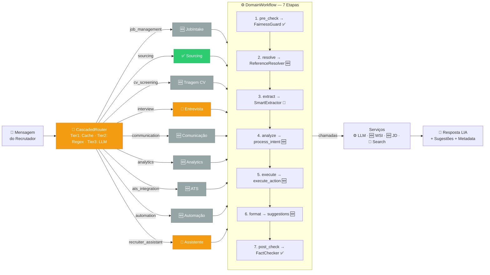

# PLATAFORMA LIA — CARDS JIRA: ARQUITETURA DE IA

**Versão:** 2.5  
**Data:** 19/fev/2026  
**Última Atualização:** 19 Fevereiro 2026  
**Status:** 📋 Documento de Referência — Pendente importação Jira  
**Referências:** `docs/mvp-alpha-scenarios.md`, `docs/architecture-comparison-analysis.md`, `docs/WSI_Technical_Documentation.md`, `docs/pipeline-transition-system.md`

### Changelog

| Data | Versão | Alteração |
|------|:------:|-----------|
| 19/fev/2026 | 2.5 | **Pipeline Layer 2 (AI/LLM)** — Implementação completa de transições inteligentes de candidatos com 3 fases (2.596 linhas backend, 1.405L frontend, 4.001L total): (1) Bulk rejection com SubStatusPredictor AI-based (732L), (2) CandidateContextAggregator com dados reais do DB (213L), (3) Webhook adapters com idempotência + event log (642L). ReturnEventService (462L) com 11 tipos de evento, auto-move offer_accepted/declined, ActivityFeed integration. Endpoints: external_webhooks.py (490L) + stage_transition_automation.py (547L). UniversalTransitionModal (711L) + use-transition-context.ts (694L) como hub central de transições frontend com Brain icon (#60BED1). 27 testes passando. Feature flags em uso (ENABLE_LLM_SUBSTATUS_PREDICTION, ENABLE_WEBHOOK_*). 6 cards enriquecidos: SRV-016, AUT-005, AUT-006, AGT-011, INF-005, INF-012. Cross-referências AUT-001/AUT-003 atualizadas. Reconciliação com MVP Alpha Scenarios ampliada. Árvore de diretórios e inventário de portabilidade atualizados. |
| 18/fev/2026 | 2.4 | Nova Seção 1 "Visão Geral da Arquitetura" adicionada ao Guia do Desenvolvedor: diagrama de camadas (5 camadas ASCII), árvore de diretórios anotada (130 arquivos mapeados por card Jira), 3 diagramas LangGraph (ConversationGraph, JobWizardGraph, DomainWorkflow), e inventário completo de arquivos aproveitáveis com nível de portabilidade (~80% direto, ~19% adaptação, ~1% reconstruir). Seções existentes renumeradas (antiga Seção 1 → Seção 2). |
| 17/fev/2026 | 2.3 | Otimização de sprints alinhada ao caminho crítico MVP Alpha 1. 13 cards não-bloqueantes (67 pts) postergados de S2/S3 para S4: INF-006/007/009/010/011/012/013, AGT-012, TRV-002, SRV-006/015, AUT-007/008. S2 consolidada (33 cards, 299 pts) com fluxo Alpha end-to-end completo. S3 enxuta (8 cards, 52 pts) focada em agendamento. Pós-MVP expandido para 36 cards (258 pts). Tabela master, blocos YAML, seções CAMADA e Distribuição atualizados. |
| 17/fev/2026 | 2.2 | Reorganização de sprints alinhada ao MVP Alpha 1: 10 cards promovidos de S3→S2 (AGT-001/002/004/008, SRV-012, INT-AI-005/007, AUT-001/002/005) para garantir fluxo Alpha end-to-end na S2. S2 expandida para 34 cards/255 pts, S3 reduzida a 19 cards/78 pts. Seção "Reconciliação com MVP Alpha Scenarios" adicionada com mapeamento etapas↔cards, caminho crítico, e Track D (Screening + Feedback). Total MVP inalterado: 405 pts. |
| 17/fev/2026 | 2.1 | Guia do Desenvolvedor: seções 1-8 reordenadas — contextos práticos/visuais primeiro (UI, Arquivos Centralizados), conceitos técnicos depois (DDD, Fluxo, LangGraph, WSI, Prompts). Cross-referências atualizadas. |
| 17/fev/2026 | 2.0 | Cards compactos do MVP expandidos com código do protótipo: SRV-005~016 (diagramas de fluxo), INT-AI-003~007 (implementação completa + diagramas), AUT-001~008 (separados individualmente com código + diagramas), TRV-001~005 (implementação completa + diagramas). 85 seções "Detalhes de Implementação" no total (cards pós-MVP É21-23 permanecem em formato compacto por design). Apêndices reordenados (A→I). Índice categorizado. Changelog adicionado. |
| 17/fev/2026 | 1.5 | Guia do Desenvolvedor expandido: Seção 6 (Arquivos Centralizados — Kit de Referência Rápida) e Seção 7 (Arquitetura por Contexto de UI com 4 sub-seções). Contrato DomainPrompt corrigido (7 métodos). Seção 0 atualizada para arquitetura híbrida Rails + FastAPI (~58% portabilidade). |
| 17/fev/2026 | 1.0 | Versão inicial: 97 cards Jira, 10 épicos, Guia de Portabilidade, cards críticos enriquecidos (PREP-001~014, AGT-000/001/005/007, INF-001~004/008, SRV-001~004), diagramas de arquitetura, apêndices A-I. |

## GUIA DO DESENVOLVEDOR — Como Usar Este Documento

> **Este documento é a fonte única de verdade (Single Source of Truth)** para a equipe de produção implementar toda a camada de IA da Plataforma LIA. Ele contém 97 cards Jira enriquecidos com código-fonte real do protótipo Replit, prompts, algoritmos, diagramas e instruções de migração.

### O Que Este Documento Contém

| Seção | O Que É | Para Que Serve | Como Usar |
|-------|---------|----------------|-----------|
| **Seção 0 — Portabilidade** | Guia de migração Replit → Produção | Entender o que pode ser copiado, adaptado ou reconstruído | Ler ANTES de implementar qualquer card |
| **Seções 1-9 — Cards por Épico** | 97 cards Jira com requisitos e código | Implementar cada funcionalidade no produto | Seguir na ordem de sprint (S0 → S1 → S2 → S3) |
| **Apêndices A-I** | Referências técnicas (endpoints, schemas, tools, robustez, few-shot) | Consulta rápida durante desenvolvimento | Usar como lookup table conforme necessidade |

### Anatomia de um Card Enriquecido

Cada card segue esta estrutura:

```
### CARD-ID: Título do Card
┌──────────────────────────────────────────────────┐
│  BLOCO YAML (Metadados do Card Jira)             │
│  ─ épico, sprint, pontos, prioridade             │
│  ─ critérios de aceite                           │
│  ─ dependências e referências                    │
└──────────────────────────────────────────────────┘

#### Detalhes de Implementação (Protótipo Replit)
┌──────────────────────────────────────────────────┐
│  CÓDIGO PYTHON — Classe/função do protótipo      │
│  ─ Copie a LÓGICA DE NEGÓCIO, não o framework   │
│  ─ Adapte imports e ORM para produção (FastAPI/Rails) │
│                                                  │
│  SYSTEM PROMPT — Prompt completo do agente       │
│  ─ 100% PORTÁVEL — copiar integralmente          │
│  ─ Texto puro, independente de linguagem         │
│                                                  │
│  DIAGRAMA DE FLUXO — Pipeline visual             │
│  ─ Use como referência para implementar o fluxo  │
│  ─ Cada caixa = um método/classe no código       │
│                                                  │
│  ENDPOINTS (FastAPI) — Contratos de API           │
│  ─ Integrar no FastAPI (IA) ou Rails (ATS)       │
│  ─ Manter request/response schemas               │
│                                                  │
│  EXEMPLO INPUT/OUTPUT — Payloads reais           │
│  ─ Use para testes de integração                 │
│  ─ Validar que sua implementação retorna similar │
│                                                  │
│  NOTAS DE PORTABILIDADE                          │
│  ─ ✅ Portável: copiar com adaptação mínima      │
│  ─ 🔧 Adaptar: requer mudanças significativas    │
│  ─ ❌ Não copiar código: reimplementar na stack    │
│     de produção (specs + protótipo = referência)  │
└──────────────────────────────────────────────────┘
```

### Conceitos-Chave Que os Devs Precisam Entender

#### 1. Visão Geral da Arquitetura

> **Mapa mental para o desenvolvedor.** Esta seção fornece a visão panorâmica que todo dev precisa antes de mergulhar nos cards individuais. Entenda as camadas, onde cada arquivo vive, como os grafos LangGraph se conectam e — mais importante — quais arquivos do protótipo podem ser portados diretamente para produção.
>
> **Leia esta seção primeiro** e depois consulte os cards Jira (Seções 2+) para detalhes de implementação de cada componente.

##### 1.1 Diagrama de Arquitetura — Camadas do Sistema

O protótipo LIA Agent System é organizado em **5 camadas** hierárquicas. Cada camada depende apenas das camadas abaixo dela:

```
┌─────────────────────────────────────────────────────────────────────────┐
│  CAMADA 1 — ENTRY POINTS                                                │
│  FastAPI (app/main.py, 377L) → /api/v1/* routes + /orchestrator/*       │
│  WebSocket (real-time chat) │ Background Workers (automações)           │
│  ~144 endpoints REST │ WorkOS JWT auth                                  │
└──────────────────────────────────┬──────────────────────────────────────┘
                                   │
                                   ▼
┌─────────────────────────────────────────────────────────────────────────┐
│  CAMADA 2 — ORQUESTRAÇÃO E ROTEAMENTO                                   │
│  CascadedRouter (Memory → Fast → LLM)                                   │
│  ├── MemoryRouter: resolve referências conversacionais (cache O(1))     │
│  ├── FastRouter: keyword patterns, ~80% dos casos (254L, regex)         │
│  └── LLMRouter: classificação semântica (fallback, IntentRouter 384L)   │
│                                                                         │
│  Orchestrator (356L) → DomainRegistry (118L) → identifica domínio       │
│  PolicyEngine (147L) → validação de permissões e tenant scoping         │
│  PlanDetector (234L) → detecta multi-step plans                         │
│  PlanExecutor (231L) → executa planos com consolidação de respostas     │
└──────────────────────────────────┬──────────────────────────────────────┘
                                   │
                                   ▼
┌─────────────────────────────────────────────────────────────────────────┐
│  CAMADA 3 — DOMÍNIOS (DDD)                                              │
│  Cada domínio segue: DomainPrompt ABC (171L) → DomainWorkflow (463L)    │
│  ┌─────────────┐ ┌─────────────┐ ┌─────────────┐ ┌─────────────┐      │
│  │ Job         │ │ CV          │ │ Sourcing    │ │Communication│      │
│  │ Management  │ │ Screening   │ │             │ │             │      │
│  │ (198+37L)   │ │ (188+33L)   │ │ (122+38L)   │ │ (175+125L)  │      │
│  └─────────────┘ └─────────────┘ └─────────────┘ └─────────────┘      │
│  ┌─────────────┐ ┌─────────────┐ ┌─────────────┐ ┌─────────────┐      │
│  │ Interview   │ │ ATS         │ │ Automation  │ │ Analytics   │      │
│  │ Scheduling  │ │ Integration │ │             │ │             │      │
│  │ (208+149L)  │ │ (207+127L)  │ │ (214+125L)  │ │ (202+149L)  │      │
│  └─────────────┘ └─────────────┘ └─────────────┘ └─────────────┘      │
│  ┌─────────────┐                                                       │
│  │ Recruiter   │                                                       │
│  │ Assistant   │  → 9 domínios total (cada um: domain.py + actions.py) │
│  │ (218+145L)  │                                                       │
│  └─────────────┘                                                       │
└──────────────────────────────────┬──────────────────────────────────────┘
                                   │
                                   ▼
┌─────────────────────────────────────────────────────────────────────────┐
│  CAMADA 4 — AGENTES ESPECIALIZADOS (13 agentes)                        │
│  Ag.0  Orchestrator (Pipeline Chat)               → AGT-000            │
│  Ag.1  JobIntakeAgent (4132L)                     → AGT-005            │
│  Ag.2  SourcingAgent (1881L)                      → AGT-006            │
│  Ag.3  TriagemCurricular (1384L)                  → AGT-002            │
│  Ag.4  EntrevistadorWSI (1117L)                   → AGT-007            │
│  Ag.5  AvaliadorWSI (1596L)                       → AGT-001            │
│  Ag.6  SchedulingAgent (1512L)                    → AGT-003            │
│  Ag.7  AnalistaFeedback (2068L)                   → AGT-008            │
│  Ag.8  IntegradorATS (704L)                       → AGT-009            │
│  Ag.9  TaskPlanner (821L)                         → AGT-010            │
│  Ag.10 CommunicationAgent (390L)                  → AGT-011            │
│  Ag.11 RecruiterAssistant (2551L)                 → AGT-012            │
│  Ag.12 AnalyticsAgent (465L)                      → (dentro Analytics) │
└──────────────────────────────────┬──────────────────────────────────────┘
                                   │
                                   ▼
┌─────────────────────────────────────────────────────────────────────────┐
│  CAMADA 5 — SERVIÇOS E INFRAESTRUTURA                                   │
│  Shared Services: LLM Factory (439L), Embedding, WSI, ConversationMemory│
│  Compliance: FairnessGuard (195L), FactChecker (251L), LGPD            │
│  Resilience: CircuitBreaker (364L), CacheManager, StatsManager         │
│  Intelligence: SmartExtractor (213L), SemanticSearch                   │
│  Learning: LearningLoop (1073L), TemplateLearning (401L)               │
│  Robustness: InputValidation, ErrorHandling, DefensivePrompts (2585L)  │
│  Providers: Gemini, Claude, OpenAI, Mailgun, WhatsApp, Merge           │
│  ~177 service files │ ~369k linhas Python total                        │
└─────────────────────────────────────────────────────────────────────────┘
```

##### 1.2 Árvore de Diretórios Anotada

```
lia-agent-system/
├── app/
│   ├── main.py                             # FastAPI entry point (377L)
│   ├── agents/                             # Backward-compatible agents layer
│   │   ├── specialized/                    # 13 agentes (stubs → delegam para domains/)
│   │   │   ├── avaliador_wsi_agent.py      # Ag.5 → AGT-001 (WSI scoring)
│   │   │   ├── triagem_curricular_agent.py # Ag.3 → AGT-002
│   │   │   ├── scheduling_agent.py         # Ag.6 → AGT-003
│   │   │   ├── job_intake_agent.py         # Ag.1 → AGT-005
│   │   │   ├── sourcing_agent.py           # Ag.2 → AGT-006
│   │   │   ├── entrevistador_agent.py      # Ag.4 → AGT-007
│   │   │   ├── analista_feedback_agent.py  # Ag.7 → AGT-008
│   │   │   ├── integrador_ats_agent.py     # Ag.8 → AGT-009
│   │   │   ├── task_planner_agent.py       # Ag.9 → AGT-010
│   │   │   ├── communication_agent.py      # Ag.10 → AGT-011
│   │   │   ├── recruiter_assistant_agent.py # Ag.11 → AGT-012
│   │   │   ├── analytics_agent.py          # Analytics domain agent
│   │   │   └── screening_agent.py          # CV screening agent
│   │   ├── robustness/                     # Input validation, error handling → PREP-013
│   │   └── prompts/                        # Prompt registry + few-shot examples
│   │       └── examples/                   # Orchestrator, job planner, sourcing, pipeline
│   ├── domains/                            # ★ CORE DDD — Código canônico
│   │   ├── base.py                         # DomainPrompt ABC (171L) → PREP-002/INF-001
│   │   ├── registry.py                     # DomainRegistry + auto-discovery (118L) → PREP-004
│   │   ├── workflow.py                     # DomainWorkflow LangGraph (463L) → PREP-003/INF-002
│   │   ├── job_management/                 # Domínio: criação de vagas → AGT-005
│   │   │   ├── domain.py (198L), actions.py (37L)
│   │   │   ├── agents/
│   │   │   │   ├── job_intake_agent.py (4132L)         # Wizard principal
│   │   │   │   ├── job_drafting_agent.py (1420L)       # JD generation
│   │   │   │   ├── job_vacancy_nodes.py (1543L)        # ConversationGraph nodes
│   │   │   │   ├── job_lifecycle_agent.py (1071L)      # Ciclo de vida
│   │   │   │   ├── job_rubric_agent.py (566L)          # Rubrica de avaliação
│   │   │   │   ├── job_wizard_graph.py (401L)          # Wizard graph
│   │   │   │   ├── job_insights_agent.py (320L)        # Insights
│   │   │   │   └── job_benefits_comp_agent.py (155L)   # Benefits & compensation
│   │   │   ├── services/ (jd_generator, wizard, templates, enrichment...)
│   │   │   └── tools/ (job_tools, job_wizard_tools, query_tools)
│   │   ├── cv_screening/                   # Domínio: triagem + WSI → AGT-001/002/007
│   │   │   ├── domain.py (188L), actions.py (33L)
│   │   │   ├── agents/
│   │   │   │   ├── avaliador_wsi_agent.py (1596L)      # WSI scoring principal
│   │   │   │   ├── triagem_curricular_agent.py (1384L) # Triagem CV
│   │   │   │   └── screening_agent.py (443L)           # Screening
│   │   │   ├── services/ (wsi_scorer, cv_parser, question_generator...)
│   │   │   └── prompts/
│   │   ├── sourcing/                       # Domínio: busca de candidatos → AGT-006
│   │   │   ├── domain.py (122L), actions.py (38L)
│   │   │   ├── agents/
│   │   │   │   ├── sourcing_agent.py (1881L)           # Busca principal
│   │   │   │   └── engagement_nodes.py (1354L)         # Sourcing engagement flow
│   │   │   ├── services/ (5888L total)
│   │   │   │   ├── sourcing_pipeline.py (1117L)        # Pipeline principal
│   │   │   │   ├── pearch_service.py (1042L)           # Pearch AI integration
│   │   │   │   ├── candidate_search_route_service.py (1032L) # Search routing
│   │   │   │   ├── search_analytics.py (597L)          # Analytics de busca
│   │   │   │   ├── vacancy_search.py (511L)            # Busca por vaga
│   │   │   │   ├── apify_mcp_client.py (473L)          # Apify integration
│   │   │   │   ├── evaluation_criteria.py (465L)       # Critérios de avaliação
│   │   │   │   ├── apify_service.py (276L)             # Apify service
│   │   │   │   ├── pre_wrf_filter.py (104L)            # Pre-WRF filter
│   │   │   │   ├── es_analyzer.py (99L)                # Elasticsearch analyzer
│   │   │   │   ├── pgv_analyzer.py (90L)               # PGVector analyzer
│   │   │   │   └── wrf_service.py (81L)                # WRF ranking
│   │   │   └── tools/
│   │   ├── communication/                  # Domínio: email + WhatsApp → AGT-011
│   │   │   ├── domain.py (175L), actions.py (125L)
│   │   │   ├── agents/communication_agent.py (390L)
│   │   │   ├── services/
│   │   │   │   ├── return_event_service.py (462L)        # ★ Pipeline L2: 11 event types, auto-move, ActivityFeed → AUT-005/INF-005
│   │   │   │   ├── email_service.py, whatsapp_service.py # Email + WhatsApp → SRV-011/012
│   │   │   │   ├── notification_dispatcher.py            # Multi-channel dispatch → AGT-011
│   │   │   │   └── communication_dispatcher.py           # Communication orchestration
│   │   │   └── tools/
│   │   ├── interview_scheduling/           # Domínio: agendamento → AGT-003
│   │   │   ├── domain.py (208L), actions.py (149L)
│   │   │   ├── agents/
│   │   │   │   ├── scheduling_agent.py (1512L)         # Agendamento principal
│   │   │   │   ├── entrevistador_agent.py (1117L)      # Entrevista WSI
│   │   │   │   └── interview_scheduling_nodes.py (418L) # Graph nodes
│   │   │   └── services/ (scheduling, calendar, ms_graph)
│   │   ├── ats_integration/                # Domínio: ATS sync → AGT-009
│   │   │   ├── domain.py (207L), actions.py (127L)
│   │   │   ├── agents/integrador_ats_agent.py (704L)
│   │   │   └── services/ (merge, gupy, pandape, ats_sync)
│   │   ├── automation/                     # Domínio: background jobs → AUT-001~008
│   │   │   ├── domain.py (214L), actions.py (125L)
│   │   │   ├── agents/task_planner_agent.py (821L)
│   │   │   └── services/
│   │   │       ├── stage_transition_automation.py (732L) # ★ Pipeline L2: SubStatusPredictor + MessageGenerator → SRV-016/AUT-006
│   │   │       ├── candidate_context_aggregator.py (213L) # ★ Pipeline L2: DB context aggregator → SRV-016
│   │   │       ├── webhook_adapters.py (152L)            # ★ Pipeline L2: Interview/Test/Document adapters → INF-005
│   │   │       ├── stage_automation_engine.py (461L)     # Stage Automation Engine → SRV-016
│   │   │       ├── automation_trigger_service.py         # EventDispatcher → INF-005
│   │   │       ├── automation_scheduler.py               # Scheduler → AUT-008
│   │   │       └── automation_handlers.py                # Cascade handlers → AUT-004~007
│   │   ├── analytics/                      # Domínio: relatórios + KPIs
│   │   │   ├── domain.py (202L), actions.py (149L)
│   │   │   ├── agents/
│   │   │   │   ├── analista_feedback_agent.py (2068L)  # Feedback analysis
│   │   │   │   └── analytics_agent.py (465L)           # KPIs e reports
│   │   │   └── services/ (report, insights, predictive, monitoring)
│   │   └── recruiter_assistant/            # Domínio: assistente contextual → AGT-012
│   │       ├── domain.py (218L), actions.py (145L)
│   │       ├── agents/recruiter_assistant_agent.py (2551L)
│   │       └── services/ (conversation_memory, kanban, pipeline)
│   ├── orchestrator/                       # ★ Orchestration layer
│   │   ├── cascaded_router.py              # 3-tier routing (187L) → INF-003/PREP-005
│   │   ├── fast_router.py                  # Keyword-based routing (254L) → INF-004
│   │   ├── intent_router.py               # LLM-based intent routing (384L)
│   │   ├── orchestrator.py                # Main orchestrator (356L) → AGT-000
│   │   ├── policy_engine.py               # Permission + tenant validation (147L)
│   │   ├── state_manager.py               # State persistence (306L)
│   │   └── task_planner.py                # Task planning orchestration (235L)
│   ├── shared/                             # ★ Cross-domain infrastructure
│   │   ├── agents/
│   │   │   ├── conversation.py             # ConversationGraph LangGraph (1657L)
│   │   │   ├── nodes.py                    # JobWizardGraph nodes (1292L)
│   │   │   └── state_machine.py            # WizardStage/WizardIntent enums (467L)
│   │   ├── compliance/                     # FairnessGuard (195L), FactChecker (251L) → INF-006/007
│   │   ├── execution/                      # ExecutionPlan (149L), PlanDetector (234L), PlanExecutor (231L)
│   │   ├── governance/                     # FeatureFlags (315L), AgentMonitoring (580L) → INF-012/013
│   │   ├── intelligence/                   # SmartExtractor (213L), Embeddings, SemanticSearch → INF-009
│   │   ├── learning/                       # LearningLoop (1073L), TemplateLearning (401L) → LRN-001/002
│   │   ├── memory/                         # ConversationState (146L), ReferenceResolver (315L) → INF-008
│   │   ├── providers/                      # LLM Factory: Gemini (109L), Claude (96L), OpenAI (74L) → SRV-001
│   │   ├── repositories/                   # Base repo + candidate/company/job repos
│   │   ├── resilience/                     # CircuitBreaker (364L), CacheManager, StatsManager → INF-010
│   │   ├── robustness/                     # Error handling (269L), input validation (288L) → PREP-013
│   │   └── tools/                          # Export tools
│   ├── services/                           # Legacy services (backward-compatible, ~177 files)
│   │   ├── wsi_*.py                        # WSI pipeline (7 files) → SRV-002/003/004
│   │   ├── whatsapp_*.py                   # WhatsApp providers (5 files) → SRV-012
│   │   ├── email_*.py                      # Email providers (2 files) → SRV-011
│   │   ├── sourcing_pipeline_service.py    # Legacy sourcing (1102L) → SRV-009
│   │   ├── token_tracking_service.py       # Token usage tracking (622L) → INF-011
│   │   ├── embedding_service.py            # Embedding + semantic → SRV-008
│   │   └── ...
│   ├── api/v1/                             # ~144 REST endpoints
│   │   ├── stage_transition_automation.py (547L) # ★ Pipeline L2: bulk-predict-substatus, bulk-generate-messages → SRV-016
│   │   ├── external_webhooks.py (490L)           # ★ Pipeline L2: inbound webhooks com idempotência → INF-005
│   │   └── ...
│   ├── auth/                               # WorkOS JWT auth
│   ├── config/                             # Settings, environment
│   ├── constants/                          # Business constants
│   ├── core/                               # Database, middleware
│   ├── data/templates/                     # Job templates
│   ├── models/                             # SQLAlchemy models
│   ├── schemas/                            # Pydantic schemas
│   ├── tools/                              # Tool registry (145L) + executor (335L) → PREP-008
│   ├── prompts/                            # Domain YAML prompts + shared prompts
│   │   ├── domains/                        # 9 YAML files (1 per domínio)
│   │   └── shared/                         # lia_persona.yaml (218L), defensive.yaml (163L), agent_prompts.yaml (1686L)
│   ├── templates/                          # Communication templates
│   └── utils/                              # Helpers, formatters
├── alembic/                                # Database migrations
├── training/                               # Fine-tuning data + RAG knowledge
│   ├── data_generation/                    # Synthetic data for training
│   └── rag_knowledge/                      # RAG knowledge base (WSI methodology)
├── tests/                                  # Test suites
└── docs/                                   # Architecture + methodology docs
```

##### 1.3 Grafos LangGraph — Fluxos Visuais

###### 1.3.1 ConversationGraph (1657L — `app/shared/agents/conversation.py`)

O grafo principal da LIA. Recebe mensagem do usuário, classifica intenção via LLM, extrai entidades, e roteia para o subgrafo correto:

```
                    ┌─────────────────┐
                    │     START       │
                    └────────┬────────┘
                             │
                    ┌────────▼────────┐
                    │ classify_intent  │ ← LLM classifica intenção
                    │ (Claude)         │   create_job | search_candidates |
                    └────────┬────────┘   schedule_interview | chitchat...
                             │
                    ┌────────▼────────┐
                    │ extract_entities │ ← NER: extrai cargo, skills,
                    │ (Claude)         │   localização, senioridade...
                    └────────┬────────┘
                             │
              ┌──────────────┼──────────────────────────────┐
              │              │                              │
    ┌─────────▼──────┐ ┌────▼───────────┐        ┌────────▼─────────────┐
    │ ask_           │ │ execute_       │        │ create_job_vacancy   │
    │ clarification  │ │ candidate_     │        │ (Job Wizard subgraph)│
    │ (falta info)   │ │ search         │        │                      │
    └───────┬────────┘ └────────┬───────┘        └────────┬─────────────┘
            │                   │                          │
            │           ┌──────▼───────┐       ┌──────────▼──────────┐
            │           │execute_global│       │ job_state_loader    │
            │           │_search       │       │      ↓              │
            │           │ (Pearch AI)  │       │ job_router ←───────┐│
            │           └──────┬───────┘       │      ↓ (stages)   ││
            │                  │               │ onboarding         ││
            │                  │               │ basics_collector   ││
            │                  │               │ remuneration       ││
            │                  │               │ org_structure      ││
            │                  │               │ technical_matrix   ││
            │                  │               │ sourcing_strategy  ││
            │                  │               │ wsi_competencies   ││
            │                  │               │ interview_flow     ││
            │                  │               │ governance         ││
            │                  │               │ comm_templates     ││
            │                  │               │ screening          ││
            │                  │               │ jd_generator       ││
            │                  │               │ publication────────┘│
            │                  │               └────────────────────┘
            │                  │
            └──────────┬───────┘
                       │
              ┌────────▼────────┐
              │ generate_       │ ← Formata resposta final
              │ response        │   (Markdown + emojis + sugestões)
              └────────┬────────┘
                       │
                    ┌──▼──┐
                    │ END │
                    └─────┘
```

**Subgrafo: schedule_interview** (simplificado)
```
interview_state_loader → interview_router → interview_details_collector
    → interview_validator → interview_scheduler_executor → interview_response_planner
```

**Subgrafo: sourcing_engagement** (simplificado)
```
sourcing_state_initializer → local_search_node → calibration_node
    → volume_assessment_node → global_expansion_node → contact_approval_node
    → email_outreach_node → async_screening_node → candidate_feedback_node
    → recruiter_report_node → recruiter_decision_node
    → auto_scheduling_node / rejection_feedback_node / placement_node
```

###### 1.3.2 JobWizardGraph (1292L — `app/shared/agents/nodes.py`)

O wizard de criação de vagas. 6 nós LLM-powered que operam em loop até completar todas as etapas:

```
┌──────────────────────────────────────────────────────────────────────────┐
│  JobWizardGraph — 6 Nós LLM-powered (Smart Orchestrator)                │
│                                                                          │
│  ┌──────────────┐    ┌──────────────┐    ┌──────────────┐               │
│  │ intent_      │───▶│ field_       │───▶│ tool_        │               │
│  │ classifier   │    │ extractor    │    │ router       │               │
│  │ (Gemini)     │    │ (Gemini)     │    │              │               │
│  └──────────────┘    └──────────────┘    └───────┬──────┘               │
│                                                   │                      │
│                                           ┌───────▼──────┐              │
│                                           │ tool_        │              │
│                                           │ executor     │              │
│                                           │ (registry)   │              │
│                                           └───────┬──────┘              │
│                                                   │                      │
│  ┌──────────────┐    ┌──────────────┐    ┌───────▼──────┐              │
│  │ stage_       │◀───│ response_    │◀───│              │              │
│  │ transition   │    │ generator    │    │              │              │
│  │              │    │ (stage-      │    │              │              │
│  │              │    │  specific    │    │              │              │
│  │              │    │  prompts)    │    │              │              │
│  └──────┬───────┘    └──────────────┘    └──────────────┘              │
│         │                                                               │
│         ▼ (loop: should_continue?)                                      │
│  WizardStage: INITIAL → TITLE_DEPARTMENT → JOB_SUMMARY → SALARY       │
│               → COMPETENCIES → SCREENING → REVIEW → COMPLETE           │
│                                                                         │
│  State: JobWizardState (467L) — TypedDict com:                          │
│  ├── messages, current_stage, job_draft, confidence_scores              │
│  ├── reasoning_steps, tool_calls, tool_results                          │
│  └── session_id, company_id, should_continue, awaiting_confirmation     │
└──────────────────────────────────────────────────────────────────────────┘
```

###### 1.3.3 DomainWorkflow (463L — `app/domains/workflow.py`)

Pipeline genérico que qualquer domínio usa. 3 nós principais + pre/post checks:

```
┌──────────────────────────────────────────────────────────────────────────┐
│  DomainWorkflow — Pipeline genérico para qualquer domínio               │
│                                                                          │
│  ┌──────────────┐   ┌──────────────┐   ┌──────────────┐                │
│  │ _pre_check   │──▶│ _resolve_    │──▶│ _analyze_    │                │
│  │ (Fairness    │   │  references  │   │  intent      │                │
│  │  Guard)      │   │ (Reference   │   │ (SmartExtract│                │
│  └──────────────┘   │  Resolver)   │   │ + Domain     │                │
│                     └──────────────┘   │  .process_   │                │
│                                        │   intent())  │                │
│                                        └───────┬──────┘                │
│                                                │                        │
│  ┌──────────────┐   ┌──────────────┐   ┌──────▼───────┐               │
│  │ _post_check  │◀──│ _format      │◀──│ _execute     │               │
│  │ (Fact        │   │ (suggestions │   │ (Domain      │               │
│  │  Checker)    │   │  + metadata) │   │  .execute_   │               │
│  └──────────────┘   └──────────────┘   │   action())  │               │
│                                        └──────────────┘                │
│                                                                         │
│  Cada domínio implementa DomainPrompt ABC (171L):                       │
│  ├── get_system_prompt()      # Prompt do agente                       │
│  ├── get_allowed_actions()    # Lista de ações disponíveis             │
│  ├── process_intent()         # LLM classifica intenção                │
│  ├── execute_action()         # Executa ação → DomainResponse          │
│  ├── validate_context()       # Valida contexto necessário             │
│  ├── get_suggestions()        # Sugestões proativas                    │
│  └── get_action_by_id()       # Busca ação por ID                      │
│                                                                         │
│  WorkflowStep enum: PRE_CHECK → RESOLVE_REFERENCES → SMART_EXTRACT    │
│                     → ANALYZE_INTENT → EXECUTE → FORMAT → POST_CHECK   │
│                     → COMPLETE | ERROR                                  │
└──────────────────────────────────────────────────────────────────────────┘
```

##### 1.4 Lista de Arquivos Aproveitáveis — Inventário por Card Jira

> **Legenda:** ✅ Portável direto (adaptar imports/ORM) · 🔧 Adaptar (lógica aproveitável, requer reestruturação) · ❌ Rebuild from specs

###### Infraestrutura Core

| Arquivo do Protótipo | Linhas | Card Jira | Aproveitamento | Produção (equivalente) |
|----------------------|:------:|-----------|:--------------:|------------------------|
| `app/domains/base.py` | 171 | PREP-002 / INF-001 | ✅ Direto | ABC → Ruby concern ou Python ABC. Dataclasses portáveis |
| `app/domains/workflow.py` | 463 | PREP-003 / INF-002 | ✅ Direto | LangGraph pipeline portável. 3 nós + pre/post checks |
| `app/domains/registry.py` | 118 | PREP-004 | ✅ Direto | Singleton pattern + auto-discovery decorator |
| `app/orchestrator/cascaded_router.py` | 187 | INF-003 / PREP-005 | ✅ Direto | 3-tier routing: memory → fast → LLM |
| `app/orchestrator/fast_router.py` | 254 | INF-004 | ✅ Direto | Regex patterns. Resolve ~80% dos casos |
| `app/orchestrator/intent_router.py` | 384 | INF-004 | ✅ Direto | LLM-based intent classification |
| `app/orchestrator/orchestrator.py` | 356 | AGT-000 | 🔧 Adaptar | Grafo complexo com cache + plans + domains |
| `app/orchestrator/policy_engine.py` | 147 | AGT-000 | ✅ Direto | Permission + tenant validation |
| `app/orchestrator/state_manager.py` | 306 | AGT-000 | 🔧 Adaptar | State persistence (trocar in-memory → Redis/DB) |
| `app/orchestrator/task_planner.py` | 235 | AGT-010 | ✅ Direto | Task planning orchestration |
| `app/shared/memory/conversation_state.py` | 146 | INF-008 | ✅ Direto | Conversation state tracking |
| `app/shared/memory/reference_resolver.py` | 315 | INF-008 | ✅ Direto | Pronoun/reference resolution |
| `app/shared/compliance/fairness_guard.py` | 195 | INF-006 | ✅ Direto | Bias detection, 100% determinístico |
| `app/shared/compliance/fact_checker.py` | 251 | INF-007 | ✅ Direto | Response verification |
| `app/shared/intelligence/smart_extractor.py` | 213 | INF-009 | ✅ Direto | Entity extraction with caching |
| `app/shared/governance/feature_flag_service.py` | 315 | INF-012 | ✅ Direto | Feature flag management |
| `app/shared/governance/agent_monitoring_service.py` | 580 | INF-013 | ✅ Direto | Agent health monitoring |
| `app/shared/resilience/circuit_breaker.py` | 364 | INF-010 | ✅ Direto | Circuit breaker pattern |
| `app/services/token_tracking_service.py` | 622 | INF-011 | ✅ Direto | Token usage tracking + billing |
| `app/shared/execution/execution_plan.py` | 149 | AGT-000 | ✅ Direto | Multi-step plan dataclass |
| `app/shared/execution/plan_detector.py` | 234 | AGT-000 | ✅ Direto | Multi-step plan detection |
| `app/shared/execution/plan_executor.py` | 231 | AGT-000 | ✅ Direto | Plan execution + consolidation |

**Subtotal Infraestrutura:** 22 arquivos · 5,831L · 20 ✅ + 2 🔧

###### Grafos LangGraph

| Arquivo do Protótipo | Linhas | Card Jira | Aproveitamento | Produção (equivalente) |
|----------------------|:------:|-----------|:--------------:|------------------------|
| `app/shared/agents/conversation.py` | 1657 | AGT-000 / AGT-004 | 🔧 Adaptar | Grafo conversacional complexo. Extrair lógica dos nós |
| `app/shared/agents/nodes.py` | 1292 | AGT-005 (wizard) | 🔧 Adaptar | 6 nós LLM-powered. Prompts 100% portáveis |
| `app/shared/agents/state_machine.py` | 467 | AGT-005 | ✅ Direto | Enums, TypedDict, schemas. 100% portável |

**Subtotal Grafos:** 3 arquivos · 3,416L · 1 ✅ + 2 🔧

###### Domínios (domain.py + actions.py)

| Arquivo do Protótipo | Linhas | Card Jira | Aproveitamento | Produção (equivalente) |
|----------------------|:------:|-----------|:--------------:|------------------------|
| `app/domains/job_management/domain.py` | 198 | AGT-005 | ✅ Direto | DomainPrompt impl para vagas |
| `app/domains/job_management/actions.py` | 37 | AGT-005 | ✅ Direto | DomainAction definitions |
| `app/domains/cv_screening/domain.py` | 188 | AGT-001/002 | ✅ Direto | DomainPrompt impl para triagem |
| `app/domains/cv_screening/actions.py` | 33 | AGT-001/002 | ✅ Direto | DomainAction definitions |
| `app/domains/sourcing/domain.py` | 122 | AGT-006 | ✅ Direto | DomainPrompt impl para sourcing |
| `app/domains/sourcing/actions.py` | 38 | AGT-006 | ✅ Direto | DomainAction definitions |
| `app/domains/communication/domain.py` | 175 | AGT-011 | ✅ Direto | DomainPrompt impl para comunicação |
| `app/domains/communication/actions.py` | 125 | AGT-011 | ✅ Direto | DomainAction definitions |
| `app/domains/interview_scheduling/domain.py` | 208 | AGT-003 | ✅ Direto | DomainPrompt impl para agendamento |
| `app/domains/interview_scheduling/actions.py` | 149 | AGT-003 | ✅ Direto | DomainAction definitions |
| `app/domains/ats_integration/domain.py` | 207 | AGT-009 | ✅ Direto | DomainPrompt impl para ATS |
| `app/domains/ats_integration/actions.py` | 127 | AGT-009 | ✅ Direto | DomainAction definitions |
| `app/domains/automation/domain.py` | 214 | AUT-001~008 | ✅ Direto | DomainPrompt impl para automação |
| `app/domains/automation/actions.py` | 125 | AUT-001~008 | ✅ Direto | DomainAction definitions |
| `app/domains/analytics/domain.py` | 202 | Analytics | ✅ Direto | DomainPrompt impl para analytics |
| `app/domains/analytics/actions.py` | 149 | Analytics | ✅ Direto | DomainAction definitions |
| `app/domains/recruiter_assistant/domain.py` | 218 | AGT-012 | ✅ Direto | DomainPrompt impl para assistente |
| `app/domains/recruiter_assistant/actions.py` | 145 | AGT-012 | ✅ Direto | DomainAction definitions |

**Subtotal Domínios:** 18 arquivos · 2,660L · 18 ✅

###### Agentes Especializados (domains/*/agents/)

| Arquivo do Protótipo | Linhas | Card Jira | Aproveitamento | Produção (equivalente) |
|----------------------|:------:|-----------|:--------------:|------------------------|
| `app/domains/job_management/agents/job_intake_agent.py` | 4132 | AGT-005 | 🔧 Adaptar | Wizard principal. Prompts portáveis, grafo adaptar |
| `app/domains/job_management/agents/job_drafting_agent.py` | 1420 | AGT-005 | 🔧 Adaptar | JD generation. Prompts + templates portáveis |
| `app/domains/job_management/agents/job_vacancy_nodes.py` | 1543 | AGT-005 | 🔧 Adaptar | ConversationGraph job nodes |
| `app/domains/job_management/agents/job_lifecycle_agent.py` | 1071 | AGT-005 | 🔧 Adaptar | Job lifecycle management |
| `app/domains/job_management/agents/job_rubric_agent.py` | 566 | AGT-005 | ✅ Direto | Rubrica de avaliação, lógica pura |
| `app/domains/job_management/agents/job_wizard_graph.py` | 401 | AGT-005 | 🔧 Adaptar | LangGraph wizard graph |
| `app/domains/job_management/agents/job_insights_agent.py` | 320 | AGT-005 | ✅ Direto | Job insights analytics |
| `app/domains/job_management/agents/job_benefits_comp_agent.py` | 155 | AGT-005 | ✅ Direto | Benefits & compensation |
| `app/domains/cv_screening/agents/avaliador_wsi_agent.py` | 1596 | AGT-001 | 🔧 Adaptar | WSI scoring principal. Algoritmo portável |
| `app/domains/cv_screening/agents/triagem_curricular_agent.py` | 1384 | AGT-002 | 🔧 Adaptar | Triagem CV. Prompts portáveis |
| `app/domains/cv_screening/agents/screening_agent.py` | 443 | AGT-002 | ✅ Direto | CV screening |
| `app/domains/sourcing/agents/sourcing_agent.py` | 1881 | AGT-006 | 🔧 Adaptar | Busca principal. Pipeline portável |
| `app/domains/sourcing/agents/engagement_nodes.py` | 1354 | AGT-006 | 🔧 Adaptar | Sourcing engagement flow |
| `app/domains/communication/agents/communication_agent.py` | 390 | AGT-011 | ✅ Direto | Email + WhatsApp agent |
| `app/domains/interview_scheduling/agents/scheduling_agent.py` | 1512 | AGT-003 | 🔧 Adaptar | Calendar + MS Graph integration |
| `app/domains/interview_scheduling/agents/entrevistador_agent.py` | 1117 | AGT-007 | 🔧 Adaptar | Entrevista WSI. Prompts portáveis |
| `app/domains/interview_scheduling/agents/interview_scheduling_nodes.py` | 418 | AGT-003 | ✅ Direto | Interview graph nodes |
| `app/domains/ats_integration/agents/integrador_ats_agent.py` | 704 | AGT-009 | 🔧 Adaptar | ATS sync (Merge, Gupy, Pandapé) |
| `app/domains/automation/agents/task_planner_agent.py` | 821 | AGT-010 | 🔧 Adaptar | Task automation planner |
| `app/domains/analytics/agents/analista_feedback_agent.py` | 2068 | AGT-008 | 🔧 Adaptar | Feedback analysis |
| `app/domains/analytics/agents/analytics_agent.py` | 465 | Analytics | ✅ Direto | KPIs e reports |
| `app/domains/recruiter_assistant/agents/recruiter_assistant_agent.py` | 2551 | AGT-012 | 🔧 Adaptar | Assistente contextual |

**Subtotal Agentes:** 22 arquivos · 26,312L · 8 ✅ + 14 🔧

###### Serviços WSI

| Arquivo do Protótipo | Linhas | Card Jira | Aproveitamento | Produção (equivalente) |
|----------------------|:------:|-----------|:--------------:|------------------------|
| `app/services/wsi_deterministic_scorer.py` | stub | SRV-004 | ✅ Direto | 100% determinístico, scoring WSI |
| `app/services/wsi_question_generator.py` | stub | SRV-003 | ✅ Direto | Geração de perguntas WSI |
| `app/services/wsi_screening_pipeline.py` | stub | SRV-002 | ✅ Direto | Pipeline de triagem WSI |
| `app/services/wsi_service.py` | stub | SRV-002 | ✅ Direto | WSI service principal |
| `app/services/wsi_question_adjuster.py` | stub | SRV-003 | ✅ Direto | Ajuste de perguntas WSI |
| `app/services/wsi_question_service.py` | stub | SRV-003 | ✅ Direto | Question management |
| `app/services/wsi_voice_orchestrator.py` | stub | SRV-005 | ✅ Direto | Voice interview orchestration |

**Subtotal WSI:** 7 arquivos (stubs delegando para domains/) · 7 ✅

###### Serviços de Comunicação

| Arquivo do Protótipo | Linhas | Card Jira | Aproveitamento | Produção (equivalente) |
|----------------------|:------:|-----------|:--------------:|------------------------|
| `app/services/whatsapp_factory.py` | stub | SRV-012 / INT-AI-007 | ✅ Direto | Provider factory |
| `app/services/whatsapp_meta_service.py` | stub | SRV-012 / INT-AI-007 | 🔧 Adaptar | Meta Business API |
| `app/services/whatsapp_provider.py` | stub | SRV-012 / INT-AI-007 | ✅ Direto | Provider interface |
| `app/services/whatsapp_service.py` | stub | SRV-012 / INT-AI-007 | ✅ Direto | Service principal |
| `app/services/whatsapp_twilio_service.py` | stub | SRV-012 / INT-AI-007 | 🔧 Adaptar | Twilio integration |
| `app/services/email_providers.py` | stub | SRV-011 / INT-AI-003 | ✅ Direto | Email provider factory |
| `app/services/email_service.py` | stub | SRV-011 / INT-AI-003 | ✅ Direto | Email service principal |

**Subtotal Comunicação:** 7 arquivos · 5 ✅ + 2 🔧

###### Sourcing Services

| Arquivo do Protótipo | Linhas | Card Jira | Aproveitamento | Produção (equivalente) |
|----------------------|:------:|-----------|:--------------:|------------------------|
| `app/domains/sourcing/services/sourcing_pipeline.py` | 1117 | SRV-009 | ✅ Direto | Pipeline de sourcing principal |
| `app/domains/sourcing/services/pearch_service.py` | 1042 | SRV-009 | 🔧 Adaptar | Pearch AI integration (API externa) |
| `app/domains/sourcing/services/candidate_search_route_service.py` | 1032 | SRV-009 | 🔧 Adaptar | Search routing |
| `app/domains/sourcing/services/search_analytics.py` | 597 | SRV-009 | ✅ Direto | Search analytics |
| `app/domains/sourcing/services/vacancy_search.py` | 511 | SRV-009 | ✅ Direto | Vacancy search |
| `app/domains/sourcing/services/apify_mcp_client.py` | 473 | SRV-009 | 🔧 Adaptar | Apify MCP client |
| `app/domains/sourcing/services/evaluation_criteria.py` | 465 | SRV-009 | ✅ Direto | Evaluation criteria |
| `app/domains/sourcing/services/apify_service.py` | 276 | SRV-009 | 🔧 Adaptar | Apify service |
| `app/domains/sourcing/services/pre_wrf_filter.py` | 104 | SRV-009 | ✅ Direto | Pre-WRF filter |
| `app/domains/sourcing/services/es_analyzer.py` | 99 | SRV-009 | ✅ Direto | Elasticsearch analyzer |
| `app/domains/sourcing/services/pgv_analyzer.py` | 90 | SRV-009 | ✅ Direto | PGVector analyzer |
| `app/domains/sourcing/services/wrf_service.py` | 81 | SRV-009 | ✅ Direto | WRF ranking algorithm |
| `app/services/sourcing_pipeline_service.py` | 1102 | SRV-009 | 🔧 Adaptar | Legacy sourcing (delega para domain) |

**Subtotal Sourcing:** 13 arquivos · 6,989L · 8 ✅ + 5 🔧

###### Providers (LLM Factory)

| Arquivo do Protótipo | Linhas | Card Jira | Aproveitamento | Produção (equivalente) |
|----------------------|:------:|-----------|:--------------:|------------------------|
| `app/shared/providers/llm_provider.py` | 110 | SRV-001 | ✅ Direto | Base provider ABC |
| `app/shared/providers/llm_factory.py` | 50 | SRV-001 | ✅ Direto | Multi-provider factory |
| `app/shared/providers/llm_claude.py` | 96 | SRV-001 | ✅ Direto | Claude (Anthropic) provider |
| `app/shared/providers/llm_gemini.py` | 109 | SRV-001 | ✅ Direto | Gemini (Google) provider |
| `app/shared/providers/llm_openai.py` | 74 | SRV-001 | ✅ Direto | OpenAI provider |

**Subtotal Providers:** 5 arquivos · 439L · 5 ✅

###### Learning & Intelligence

| Arquivo do Protótipo | Linhas | Card Jira | Aproveitamento | Produção (equivalente) |
|----------------------|:------:|-----------|:--------------:|------------------------|
| `app/shared/learning/learning_loop_service.py` | 1073 | LRN-001 | ✅ Direto | Feedback loop de aprendizado |
| `app/shared/learning/template_learning_service.py` | 401 | LRN-002 | ✅ Direto | Template learning |

**Subtotal Learning:** 2 arquivos · 1,474L · 2 ✅

###### Robustness

| Arquivo do Protótipo | Linhas | Card Jira | Aproveitamento | Produção (equivalente) |
|----------------------|:------:|-----------|:--------------:|------------------------|
| `app/shared/robustness/context_management.py` | 298 | PREP-013 | ✅ Direto | Context management |
| `app/shared/robustness/error_handling.py` | 269 | PREP-013 | ✅ Direto | Error handling patterns |
| `app/shared/robustness/input_validation.py` | 288 | PREP-013 | ✅ Direto | Input validation rules |
| `app/shared/robustness/intent_schemas.py` | 485 | PREP-013 | ✅ Direto | Intent validation schemas |
| `app/shared/robustness/response_filter.py` | 364 | PREP-013 | ✅ Direto | Response filtering |
| `app/shared/robustness/enhanced_base.py` | 300 | PREP-013 | ✅ Direto | Enhanced base agent |
| `app/shared/robustness/enhanced_registry.py` | 320 | PREP-013 | ✅ Direto | Enhanced registry |
| `app/shared/robustness/defensive_prompts.py` | 108 | PREP-013 | ✅ Direto | Defensive prompt patterns |

**Subtotal Robustness:** 8 arquivos · 2,432L · 8 ✅

###### Tools

| Arquivo do Protótipo | Linhas | Card Jira | Aproveitamento | Produção (equivalente) |
|----------------------|:------:|-----------|:--------------:|------------------------|
| `app/tools/registry.py` | 145 | PREP-008 | ✅ Direto | Tool registry + discovery |
| `app/tools/executor.py` | 335 | PREP-008 | ✅ Direto | Tool execution engine |

**Subtotal Tools:** 2 arquivos · 480L · 2 ✅

###### Prompts (100% portáveis — texto puro)

| Arquivo do Protótipo | Linhas | Card Jira | Aproveitamento | Produção (equivalente) |
|----------------------|:------:|-----------|:--------------:|------------------------|
| `app/prompts/domains/sourcing.yaml` | 7 | AGT-006 | ✅ Direto | System prompt sourcing |
| `app/prompts/domains/job_management.yaml` | 7 | AGT-005 | ✅ Direto | System prompt job mgmt |
| `app/prompts/domains/cv_screening.yaml` | 7 | AGT-001/002 | ✅ Direto | System prompt CV screening |
| `app/prompts/domains/communication.yaml` | 7 | AGT-011 | ✅ Direto | System prompt comunicação |
| `app/prompts/domains/interview_scheduling.yaml` | 7 | AGT-003/007 | ✅ Direto | System prompt entrevistas |
| `app/prompts/domains/analytics.yaml` | 7 | Analytics | ✅ Direto | System prompt analytics |
| `app/prompts/domains/ats_integration.yaml` | 7 | AGT-009 | ✅ Direto | System prompt ATS |
| `app/prompts/domains/automation.yaml` | 7 | AUT-001~008 | ✅ Direto | System prompt automação |
| `app/prompts/domains/recruiter_assistant.yaml` | 7 | AGT-012 | ✅ Direto | System prompt assistente |
| `app/prompts/shared/lia_persona.yaml` | 218 | PREP-001 | ✅ Direto | Persona base da LIA |
| `app/prompts/shared/defensive.yaml` | 163 | PREP-013 | ✅ Direto | Regras de segurança e ética |
| `app/prompts/shared/agent_prompts.yaml` | 1686 | PREP-001 | ✅ Direto | Prompts expandidos completos |
| `app/shared/prompts/prompt_registry.py` | 496 | PREP-001 | ✅ Direto | Prompt registry |
| `app/shared/prompts/agent_prompts.py` | 74 | PREP-001 | ✅ Direto | Agent prompt helpers |
| `app/prompts/kanban_assistant_prompts.py` | 777 | AGT-012 | ✅ Direto | Kanban assistant prompts |
| `app/prompts/templates.py` | 245 | PREP-001 | ✅ Direto | Prompt templates |
| `app/prompts/examples.py` | 387 | PREP-001 | ✅ Direto | Few-shot examples |
| `app/prompts/cot.py` | 305 | PREP-001 | ✅ Direto | Chain-of-thought prompts |
| `app/prompts/job_wizard.py` | 411 | AGT-005 | ✅ Direto | Job wizard prompts |

**Subtotal Prompts:** 19 arquivos · 4,824L · 19 ✅

###### Outros Serviços de Infraestrutura

| Arquivo do Protótipo | Linhas | Card Jira | Aproveitamento | Produção (equivalente) |
|----------------------|:------:|-----------|:--------------:|------------------------|
| `app/services/token_tracking_service.py` | 622 | INF-011 | ✅ Direto | Token usage + cost tracking |
| `app/main.py` | 377 | PREP-001 | ❌ Rebuild | FastAPI entry point — adaptar para prod |

**Subtotal Outros:** 2 arquivos · 999L · 1 ✅ + 1 ❌

###### Pipeline Layer 2 (AI/LLM) — Transições Inteligentes (v2.5)

| Arquivo do Protótipo | Linhas | Card Jira | Aproveitamento | Produção (equivalente) |
|----------------------|:------:|-----------|:--------------:|------------------------|
| `app/domains/automation/services/stage_transition_automation.py` | 732 | SRV-016 / AUT-006 | ✅ Direto | SubStatusPredictor (rules-based, 9 sub-status), MessageGenerator (Claude), StageTransitionService. Python puro → FastAPI direto |
| `app/domains/automation/services/candidate_context_aggregator.py` | 213 | SRV-016 | ✅ Direto | Aggregator de contexto do DB: WSI scores, interview notes, stage history, lia_parecer. SQLAlchemy → adaptar queries |
| `app/domains/automation/services/webhook_adapters.py` | 152 | INF-005 | ✅ Direto | 3 adapters (Interview/Test/Document) com idempotência, event log, deduplication. Python puro |
| `app/domains/communication/services/return_event_service.py` | 462 | AUT-005 / INF-005 | ✅ Direto | 11 tipos de evento, auto-move (offer_accepted/declined), ActivityFeed integration, notificação ao recrutador |
| `app/api/v1/stage_transition_automation.py` | 547 | SRV-016 | 🔧 Adaptar | Endpoints: bulk-predict-substatus, bulk-generate-messages, predict-from-db. FastAPI routes → adaptar para prod |
| `app/api/v1/external_webhooks.py` | 490 | INF-005 | 🔧 Adaptar | Inbound webhooks com HMAC-SHA256 verification, feature flags por provider. Routes → adaptar para prod |

**Subtotal Pipeline L2:** 6 arquivos · 2,596L · 4 ✅ + 2 🔧

---

###### Resumo do Inventário

| Categoria | Arquivos | Linhas | ✅ Direto | 🔧 Adaptar | ❌ Rebuild |
|-----------|:--------:|:------:|:---------:|:----------:|:----------:|
| Infraestrutura Core | 22 | 5,831 | 20 | 2 | 0 |
| Grafos LangGraph | 3 | 3,416 | 1 | 2 | 0 |
| Domínios (domain+actions) | 18 | 2,660 | 18 | 0 | 0 |
| Agentes Especializados | 22 | 26,312 | 8 | 14 | 0 |
| Serviços WSI | 7 | ~7 (stubs) | 7 | 0 | 0 |
| Comunicação | 7 | ~7 (stubs) | 5 | 2 | 0 |
| Sourcing Services | 13 | 6,989 | 8 | 5 | 0 |
| Providers (LLM) | 5 | 439 | 5 | 0 | 0 |
| Learning | 2 | 1,474 | 2 | 0 | 0 |
| Robustness | 8 | 2,432 | 8 | 0 | 0 |
| Tools | 2 | 480 | 2 | 0 | 0 |
| Prompts | 19 | 4,824 | 19 | 0 | 0 |
| Pipeline Layer 2 (v2.5) | 6 | 2,596 | 4 | 2 | 0 |
| Outros | 2 | 999 | 1 | 0 | 1 |
| **TOTAL** | **136** | **~59k** | **108 (79%)** | **27 (20%)** | **1 (1%)** |

> **Nota:** O protótipo completo tem ~936 arquivos Python totalizando ~369k linhas. A tabela acima cobre os **136 arquivos arquiteturalmente relevantes** (~59k linhas) que mapeiam diretamente para cards Jira. Os demais ~800 arquivos são models, schemas, migrations, utils, configs e endpoints REST que serão reimplementados na stack de produção seguindo os mesmos contratos.
>
> **Conclusão de portabilidade:**
> - **79% dos arquivos-chave** (108 de 136) podem ser portados diretamente com adaptação mínima de imports e ORM
> - **20%** (27 arquivos) requerem reestruturação mas têm lógica de negócio e prompts aproveitáveis
> - **Apenas 1%** (1 arquivo — entry point FastAPI) precisa ser reconstruído from scratch
> - **Prompts são 100% portáveis** — texto puro, independente de linguagem ou framework
> - **Pipeline Layer 2 é ~67% portável direto** — Python puro no microsserviço FastAPI (SubStatusPredictor, WebhookAdapters, ReturnEventService)

#### 2. Arquitetura por Contexto de UI — Onde Cada Agente Atua

A LIA aparece em **4 contextos principais** na interface do produto. Cada contexto ativa domínios, agentes e serviços diferentes. Esta seção mapeia exatamente o que acontece "por trás" de cada tela.

> **Nota:** Os nomes de serviços e tools listados abaixo correspondem à arquitetura alvo definida nos cards Jira. No protótipo Replit, alguns existem com nomes similares; outros serão implementados na produção. Consulte o card Jira correspondente para detalhes de implementação.
>
> **Legenda de Fase:** `MVP Alpha` = necessário para o Alpha 1 (Sprints S1-S3) · `Pós-MVP` = não é escopo do Alpha 1, será implementado depois (S4+)

##### 2.1 Funil de Talentos — Tela de Busca `[MVP Alpha — S2]`

**O que o recrutador vê:** Campo de busca + filtros + resultados de candidatos
**Onde a LIA aparece:** Chat lateral para refinar busca, sugerir queries, explicar resultados

```
┌─────────────────────────────────────────────────────┐
│  FUNIL DE TALENTOS — Busca de Candidatos            │
│                                                     │
│  [Campo de Busca: "desenvolvedor Python senior"]    │
│  [Filtros: localização, senioridade, skills...]     │
│                                                     │
│  ┌──────────────────────┐  ┌──────────────────────┐ │
│  │ Resultados           │  │ 💬 LIA (Chat)        │ │
│  │ ├─ Candidato A (92%) │  │                      │ │
│  │ ├─ Candidato B (87%) │  │ "Encontrei 24        │ │
│  │ ├─ Candidato C (81%) │  │  candidatos. Quer    │ │
│  │ └─ ...               │  │  refinar por         │ │
│  │                      │  │  experiência em      │ │
│  │ [Página 1 de 5]      │  │  Django?"            │ │
│  └──────────────────────┘  └──────────────────────┘ │
└─────────────────────────────────────────────────────┘
```

| Componente | Detalhes |
|------------|----------|
| **Domínios ativos** | `sourcing` (principal), `recruiter_assistant` (suporte) |
| **Prompt YAML** | `prompts/domains/sourcing.yaml` |
| **Agentes** | SourcingAgent (busca ES + PGVector + WRF), RecruiterAssistantAgent (sugestões) |
| **Serviços** | `TalentFunnelSearchService`, `SemanticSearchService`, `CandidateScoringService` |
| **Tools** | `search_candidates`, `refine_search`, `boolean_query_builder`, `get_candidate_details` |
| **Cards Jira** | AGT-004 (Sourcing), SRV-009 (Talent Funnel Search) |

**Fluxo:**
```
Recrutador digita "Python senior São Paulo"
    → CascadedRouter → domínio "sourcing"
    → SourcingAgent.execute_action()
    → Elasticsearch + PGVector (busca semântica) + WRF (ranking)
    → Resultados rankeados com % compatibilidade
    → LIA sugere: "Quer incluir candidatos com FastAPI?"
```

##### 2.2 LIA Expandida no Funil — Análise de Resultados `[MVP Alpha — já existe no produto]`

**O que o recrutador vê:** Painel expandido da LIA ao lado dos resultados de busca
**Onde a LIA aparece:** Chat em modo expandido com capacidade de análise, comparação e triagem rápida

```
┌──────────────────────────────────────────────────────────┐
│  FUNIL — Resultados + LIA Expandida                      │
│                                                          │
│  ┌────────────────┐  ┌─────────────────────────────────┐ │
│  │ Resultados     │  │ 💬 LIA (Expandida)              │ │
│  │ Candidato A ✓  │  │                                 │ │
│  │ Candidato B    │  │ 📊 Análise Comparativa          │ │
│  │ Candidato C ✓  │  │                                 │ │
│  │                │  │ Candidato A vs C:               │ │
│  │                │  │ ├─ Técnico: A=8.5 vs C=7.2     │ │
│  │                │  │ ├─ Comportamental: A=7.0 vs C=8.8│ │
│  │                │  │ ├─ WSI Final: A=8.1 vs C=7.7   │ │
│  │                │  │                                 │ │
│  │                │  │ "Candidato A tem perfil técnico │ │
│  │                │  │  mais forte. Candidato C tem    │ │
│  │                │  │  melhor fit cultural. Quer que  │ │
│  │                │  │  eu avance ambos para triagem?" │ │
│  └────────────────┘  └─────────────────────────────────┘ │
└──────────────────────────────────────────────────────────┘
```

| Componente | Detalhes |
|------------|----------|
| **Domínios ativos** | `sourcing`, `cv_screening` (WSI), `recruiter_assistant` (comparação) |
| **Prompts YAML** | `sourcing.yaml`, `cv_screening.yaml`, `recruiter_assistant.yaml` |
| **Agentes** | SourcingAgent, AvaliadorWSI, RecruiterAssistantAgent |
| **Serviços** | `WSIScoringService`, `CandidateComparisonService`, `EvaluationCriteriaService` |
| **Tools** | `compare_candidates`, `evaluate_wsi`, `shortlist_candidate`, `get_candidate_profile`, `move_candidate_stage` |
| **Cards Jira** | AGT-004 (Sourcing), AGT-005 (CV Screening + WSI), SRV-004 (WSI Scoring) |

**Fluxo:**
```
Recrutador seleciona 2 candidatos → "Compare esses dois"
    → CascadedRouter → domínio "recruiter_assistant"
    → RecruiterAssistantAgent detecta intent "compare"
    → Chama WSIScoringService para cada candidato
    → Gera análise comparativa (técnico + comportamental + cultural)
    → LIA apresenta: scores WSI, pontos fortes/fracos, recomendação
    → Recrutador: "Avance o A para triagem"
    → CascadedRouter → domínio "cv_screening"
    → Movimenta candidato no pipeline
```

##### 2.3 LIA Expandida na Tabela de Vagas `[Pós-MVP]`

**O que o recrutador vê:** Tabela de vagas (lista) com painel lateral da LIA
**Onde a LIA aparece:** Chat expandido com **múltiplos papéis** — wizard de criação, insights de vagas, análise de saúde, duplicação, edição

```
┌──────────────────────────────────────────────────────────┐
│  VAGAS — Tabela + LIA Expandida                          │
│                                                          │
│  ┌────────────────────────┐  ┌────────────────────────┐  │
│  │ Vagas                  │  │ 💬 LIA (Expandida)     │  │
│  │                        │  │                        │  │
│  │ Dev Python Sr   🟢 12  │  │ 🧙 Modo: Wizard       │  │
│  │ UX Designer     🟡  5  │  │                        │  │
│  │ Data Engineer   🔴  2  │  │ "Vamos criar sua nova  │  │
│  │ Product Manager 🟢  8  │  │  vaga! Qual o título   │  │
│  │                        │  │  do cargo?"            │  │
│  │ [+ Nova Vaga]          │  │                        │  │
│  │                        │  │ [Campo: título]        │  │
│  │                        │  │ [Campo: área]          │  │
│  │                        │  │ [Campo: senioridade]   │  │
│  └────────────────────────┘  └────────────────────────┘  │
└──────────────────────────────────────────────────────────┘
```

| Componente | Detalhes |
|------------|----------|
| **Domínios ativos** | `job_management` (principal), `analytics` (saúde), `recruiter_assistant` (insights) |
| **Prompts YAML** | `job_management.yaml`, `analytics.yaml`, `recruiter_assistant.yaml` |
| **Agentes** | JobIntakeAgent (wizard), JobInsightsAgent, JobDraftingAgent, AnalyticsAgent |
| **Serviços** | `JDEnrichmentService`, `JDTemplateService`, `WizardAnalyticsService`, `FieldInferenceService`, `CompensationAnalysisService` |
| **Tools** | `create_job`, `update_job`, `generate_jd`, `get_job_insights`, `suggest_skills`, `analyze_compensation`, `get_job_health`, `duplicate_job` |
| **Cards Jira** | AGT-001 (Job Intake), AGT-002 (JD Generator), SRV-001 (JD Enrichment), SRV-002 (Templates) |
| **State Machine** | `JobWizardGraph` (6 nós): intake → enrichment → questions → description → review → publish |

**Papéis da LIA neste contexto:**

| Papel | Quando Ativa | O Que Faz |
|-------|-------------|-----------|
| **Wizard de Criação** | Recrutador clica "Nova Vaga" ou diz "quero criar uma vaga" | Guia conversacional por 6 etapas (intake → publicação) |
| **Insights de Vaga** | Recrutador seleciona vaga existente | Mostra saúde, sugestões de melhoria, análise de mercado |
| **Geração de JD** | Durante wizard ou edição | Gera/otimiza job description com IA |
| **Análise de Saúde** | Visão geral da tabela | Indicadores 🟢🟡🔴 por vaga (candidatos, tempo, conversão) |
| **Duplicação Inteligente** | Recrutador pede para duplicar | Copia vaga com sugestões de ajuste |

> **Nota:** Todo este contexto (1.3) é **Pós-MVP**. No Alpha 1, a edição de vaga importada do ATS acontece dentro da vaga (Etapa 2), não pela LIA expandida na tabela.

**Fluxo (Wizard):**
```
Recrutador: "Quero criar uma vaga de dev Python"
    → CascadedRouter → domínio "job_management"
    → JobWizardGraph inicia (stage: INTAKE)
    → LIA pergunta: título, área, senioridade, skills
    → Recrutador preenche via chat OU painel lateral
    → LIA detecta etapa completa → PERGUNTA: "Posso avançar para enriquecimento?"
    → Recrutador: "sim" → intent CONFIRM
    → Stage: ENRICHMENT → JDEnrichmentService analisa e sugere
    → Stage: QUESTIONS → Gera perguntas de screening
    → Stage: DESCRIPTION → Gera job description
    → Stage: REVIEW → Apresenta resumo para revisão
    → Stage: PUBLISH → Publica vaga
```

##### 2.4 LIA Dentro de uma Vaga — Kanban + Tabela de Candidatos `[Pós-MVP]`

**O que o recrutador vê:** Pipeline de candidatos de uma vaga específica (Kanban ou tabela)
**Onde a LIA aparece:** Chat expandido com foco em gestão de candidatos daquela vaga

```
┌──────────────────────────────────────────────────────────────┐
│  VAGA: Desenvolvedor Python Senior                           │
│                                                              │
│  ┌───────────────────────────────────────┐  ┌─────────────┐  │
│  │ Kanban                               │  │ 💬 LIA      │  │
│  │                                      │  │             │  │
│  │ Inscritos  Triagem  Entrevista Final │  │ "João Silva │  │
│  │ ┌──────┐ ┌──────┐ ┌──────┐ ┌─────┐  │  │  tem WSI    │  │
│  │ │João  │ │Maria │ │Pedro │ │Ana  │  │  │  8.1/10.    │  │
│  │ │WSI:? │ │WSI:  │ │WSI:  │ │WSI: │  │  │  Pontos     │  │
│  │ │      │ │7.2   │ │8.5   │ │9.1  │  │  │  fortes:    │  │
│  │ └──────┘ └──────┘ └──────┘ └─────┘  │  │  Python,    │  │
│  │                                      │  │  Django.    │  │
│  │ [Vista: Kanban | Tabela]             │  │  Avançar    │  │
│  └───────────────────────────────────────┘  │  para       │  │
│                                              │  entrevista?"│  │
│                                              └─────────────┘  │
└──────────────────────────────────────────────────────────────┘
```

| Componente | Detalhes |
|------------|----------|
| **Domínios ativos** | `cv_screening` (triagem + WSI), `communication` (mensagens), `interview_scheduling` (entrevistas), `automation` (movimentação automática), `recruiter_assistant` (pipeline), `analytics` (resumo do pipeline) |
| **Prompts YAML** | `cv_screening.yaml`, `communication.yaml`, `interview_scheduling.yaml`, `automation.yaml`, `recruiter_assistant.yaml`, `analytics.yaml` |
| **Agentes** | AvaliadorWSI, CommunicationAgent, SchedulingAgent, TaskPlannerAgent, RecruiterAssistantAgent, AnalyticsAgent |
| **Serviços** | `WSIScoringService`, `ScreeningQuestionsService`, `KanbanMovementService`, `AutoStageTransitionService`, `FeedbackService` |
| **Tools** | `evaluate_candidate_wsi`, `move_candidate`, `send_message`, `schedule_interview`, `generate_feedback`, `compare_candidates`, `bulk_action`, `get_pipeline_summary` |
| **Cards Jira** | AGT-005 (CV Screening), AGT-007 (Communication), AGT-003 (Interview), AUT-001~008 (Automações), SRV-004 (WSI) |

**Ações da LIA neste contexto:**

| Ação | Domínio | O Que Acontece |
|------|---------|----------------|
| Triagem WSI | `cv_screening` | Avalia candidato nos 7 blocos WSI, gera score + parecer |
| Mover candidato | `automation` + `cv_screening` | Move no Kanban + prediz sub-status + dispara automações |
| Enviar mensagem | `communication` | Email/WhatsApp para candidato (aprovação, rejeição, convite) |
| Agendar entrevista | `interview_scheduling` | Verifica disponibilidade + cria evento + envia convite |
| Comparar candidatos | `recruiter_assistant` | Comparação lado-a-lado com scores WSI |
| Feedback automático | `cv_screening` + `communication` | WSI < 50% → gera e envia feedback construtivo |
| Resumo do pipeline | `analytics` + `recruiter_assistant` | Status geral: quantos em cada etapa, tempo médio, gargalos |

> **Nota:** Todo este contexto (1.4) é **Pós-MVP**. No Alpha 1, as ações de triagem, scoring e feedback acontecem via backend/automações (cards AGT/SRV/AUT na S2). A interface LIA expandida no Kanban com chat integrado é refinamento posterior.

**Fluxo (Triagem + Movimentação):**
```
Recrutador: "Avalie o João Silva para essa vaga"
    → CascadedRouter → domínio "cv_screening"
    → AvaliadorWSI.execute_action()
    → WSIScoringService: avalia 7 blocos (formação, experiência, skills técnicas,
      competências comportamentais, fit cultural, aderência ao cargo, potencial)
    → Score WSI: 8.1/10
    → LIA: "João tem WSI 8.1. Forte em Python/Django. Recomendo avançar para entrevista."
    
Recrutador: "Avance ele"
    → CascadedRouter → domínio "automation"
    → KanbanMovementService: move Triagem → Entrevista
    → AutoStageTransitionService: prediz sub-status "Aguardando Agendamento"
    → EventDispatcher: notifica domínio "interview_scheduling"
    → LIA: "João movido para Entrevista. Quer que eu agende?"
    
Recrutador: "Sim, agende com o Tech Lead"
    → CascadedRouter → domínio "interview_scheduling"
    → SchedulingAgent: verifica disponibilidade (Microsoft Graph)
    → Cria evento + envia convite
    → LIA: "Entrevista agendada para quinta 14h com Tech Lead. Convite enviado."
```

##### 2.5 Resumo — Mapa de Domínios por Contexto

| Contexto de UI | Domínios Ativos | Prompt YAML Principal | Agente Principal | Fase |
|----------------|-----------------|----------------------|------------------|:----:|
| **Funil — Busca** | `sourcing` | `sourcing.yaml` | SourcingAgent | `MVP Alpha` |
| **Funil — Resultados (LIA expandida)** | `sourcing` + `cv_screening` + `recruiter_assistant` | `sourcing.yaml` + `cv_screening.yaml` | SourcingAgent + AvaliadorWSI | `MVP Alpha` |
| **Tabela de Vagas (LIA expandida)** | `job_management` + `analytics` | `job_management.yaml` | JobIntakeAgent (wizard) | `Pós-MVP` |
| **Dentro de Vaga (Kanban/Tabela)** | `cv_screening` + `communication` + `interview_scheduling` + `automation` + `recruiter_assistant` + `analytics` | `cv_screening.yaml` | AvaliadorWSI + RecruiterAssistantAgent | `Pós-MVP` |

#### 3. Arquivos Centralizados — Kit de Referência Rápida

O protótipo organiza definições em **arquivos centralizados** em vez de espalhá-las pelo código. Isso permite que o time de produção consulte **um único local** para entender o papel de cada agente, tools disponíveis, e mapeamentos — sem precisar ler dezenas de arquivos de código.

##### 3.1 Prompts YAML — Definição de Cada Agente

Cada domínio tem um arquivo YAML que define o **system prompt** (papel, responsabilidades, tom) do agente:

```
app/prompts/
├── domains/                          ← 1 arquivo por domínio
│   ├── sourcing.yaml                 ← Busca de talentos
│   ├── job_management.yaml           ← Gestão de vagas + wizard
│   ├── cv_screening.yaml             ← Triagem curricular + WSI
│   ├── communication.yaml            ← Email, WhatsApp, SMS, Teams
│   ├── interview_scheduling.yaml     ← Agendamento + entrevista WSI
│   ├── analytics.yaml                ← Relatórios, KPIs, previsões
│   ├── ats_integration.yaml          ← Sync com Gupy, Pandapé, Merge
│   ├── automation.yaml               ← Background jobs, triggers
│   └── recruiter_assistant.yaml      ← Assistente geral do recrutador
└── shared/                           ← Prompts compartilhados
    ├── lia_persona.yaml              ← Persona base da LIA (tom, estilo)
    ├── defensive.yaml                ← Regras de segurança e ética
    └── agent_prompts.yaml            ← Prompts expandidos com contexto detalhado
```

**Estrutura de cada YAML:**
```yaml
metadata:
  domain: "sourcing"              # ID do domínio (deve bater com domain_id no código)
  version: "1.0"                  # Versão do prompt (para versionamento)
  description: "..."              # Descrição do domínio

system_prompt: |                  # Prompt completo enviado ao LLM
  Você é a LIA, especialista em Sourcing e Busca de Talentos...
```

> **Para os devs:** Quer saber o que um agente faz? Abra `app/prompts/domains/<dominio>.yaml`. O `system_prompt` é a definição completa do comportamento daquele agente. Para prompts mais detalhados com templates de resposta, persistência e ética, veja `app/prompts/shared/agent_prompts.yaml`.

##### 3.2 Registries — Catálogos Centralizados

O protótipo tem **4 registries** que funcionam como catálogos centrais:

| Registry | Arquivo | O Que Centraliza | Como Usar |
|----------|---------|-------------------|-----------|
| **DomainRegistry** | `app/domains/registry.py` | Registro de todos os 9 domínios com auto-discovery via `@register_domain` | Consultar para ver quais domínios estão ativos e suas classes |
| **ToolRegistry** | `app/tools/registry.py` | Catálogo de todas as tools que agentes podem invocar (com schemas para Claude/Gemini) | Ver quais ações os agentes executam e seus parâmetros |
| **PromptRegistry** | `app/shared/prompts/prompt_registry.py` | Registry de prompts com versionamento, changelog e comparação de versões | Gerenciar evolução dos prompts ao longo do tempo |
| **AGENT_TYPE_TO_DOMAIN** | `app/orchestrator/cascaded_router.py` | Mapeamento de intent → domínio (ex: `"job_planner" → "job_management"`) | Entender qual domínio processa qual tipo de mensagem |

**Mapeamento AGENT_TYPE_TO_DOMAIN completo:**
```python
AGENT_TYPE_TO_DOMAIN = {
    "job_planner": "job_management",      # Criar/editar vagas
    "job_intake": "job_management",       # Wizard de criação
    "sourcing": "sourcing",              # Buscar candidatos
    "cv_screening": "cv_screening",      # Triagem curricular
    "screening": "cv_screening",         # Alias para triagem
    "wsi_evaluator": "cv_screening",     # Avaliação WSI
    "interviewer": "interview_scheduling", # Entrevistas
    "scheduling": "interview_scheduling",  # Agendamento
    "analyst_feedback": "analytics",      # Relatórios
    "analytics": "analytics",            # KPIs e previsões
    "communication": "communication",    # Mensagens multi-canal
    "ats_integrator": "ats_integration", # Sync com ATS
    "recruiter_assistant": "recruiter_assistant", # Assistente geral
    "task_planner": "automation",        # Automações e tasks
}
```

##### 3.3 Definição de Domínios — O Contrato Base

Cada domínio implementa o contrato `DomainPrompt` (arquivo `app/domains/base.py`), que define métodos obrigatórios e opcionais:

| Método | Obrigatório | Async | O Que Faz |
|--------|:-----------:|:-----:|-----------|
| `get_allowed_actions()` | ✅ | Não | Retorna lista de `DomainAction` — ações que o domínio pode executar |
| `get_system_prompt()` | ✅ | Não | Retorna o system prompt do agente (carregado do YAML) |
| `process_intent(query, context)` | ✅ | **Sim** | Classifica a intenção da mensagem dentro do domínio → `IntentResult` |
| `execute_action(action_id, params, context)` | ✅ | **Sim** | Executa a ação solicitada (CRUD, LLM call, API call) → `DomainResponse` |
| `validate_context(context)` | Opcional | Não | Valida se o contexto tem dados necessários (override se precisar) |
| `get_suggestions(context)` | Opcional | Não | Retorna sugestões contextuais para o recrutador |
| `get_action_by_id(action_id)` | Opcional | Não | Busca uma ação específica pelo ID |

> **Para os devs:** Para criar um novo domínio na produção, basta: (1) criar pasta em `app/domains/<novo>/`, (2) implementar classe com `DomainPrompt`, (3) criar YAML em `app/prompts/domains/<novo>.yaml`, (4) decorar com `@register_domain`. O `DomainRegistry` faz o auto-discovery automaticamente.

##### 3.4 Por Que Essa Estrutura Importa

| Sem centralização | Com centralização (protótipo) |
|-------------------|-------------------------------|
| Papel do agente hardcoded em 3+ arquivos | Papel definido em **1 YAML** por domínio |
| Tools espalhadas por dezenas de módulos | Todas registradas no **ToolRegistry** central |
| Mapeamentos duplicados em vários lugares | **AGENT_TYPE_TO_DOMAIN** = mapa único |
| Mudar comportamento = editar código | Mudar comportamento = **editar YAML** |
| Dev precisa ler todo o código para entender | Dev abre **3 arquivos** e entende tudo |

**Roteiro de consulta rápida para o dev:**
1. **"O que esse agente faz?"** → `app/prompts/domains/<dominio>.yaml`
2. **"Quais tools esse agente pode usar?"** → `app/tools/registry.py` → `get_tools_for_agent("<tipo>")`
3. **"Qual domínio processa essa mensagem?"** → `app/orchestrator/cascaded_router.py` → `AGENT_TYPE_TO_DOMAIN`
4. **"Quais domínios existem?"** → `app/domains/registry.py` → `get_all_domains()`
5. **"Como é o contrato de um domínio?"** → `app/domains/base.py` → classe `DomainPrompt`

#### 4. Arquitetura Domain-Driven (DDD)
O protótipo organiza toda a IA em **9 domínios independentes**, cada um com sua pasta em `app/domains/`:

| Domínio | Pasta | O Que Faz | Agente Principal |
|---------|-------|-----------|------------------|
| Job Management | `job_management/` | Criar, editar, publicar vagas | JobIntakeAgent + 5 sub-agentes |
| Sourcing | `sourcing/` | Buscar candidatos (ES + PGVector + WRF) | SourcingAgent |
| CV Screening | `cv_screening/` | Triagem curricular + WSI scoring | AvaliadorWSI + TriagemCurricular |
| Interview Scheduling | `interview_scheduling/` | Agendar e conduzir entrevistas | EntrevistadorWSI + SchedulingAgent |
| Communication | `communication/` | Email, WhatsApp, SMS, Teams | CommunicationAgent |
| Analytics | `analytics/` | Relatórios, KPIs, predição | AnalistaFeedback + AnalyticsAgent |
| ATS Integration | `ats_integration/` | Sync com Gupy, Pandapé, Merge | IntegradorATSAgent |
| Automation | `automation/` | Background jobs, cascatas, triggers | TaskPlannerAgent |
| Recruiter Assistant | `recruiter_assistant/` | Assistente geral, Kanban, pipeline | RecruiterAssistantAgent |

#### 5. Fluxo de Processamento (Como uma Mensagem Vira Resposta)

```
Mensagem do Recrutador
    │
    ▼
┌─────────────────────────────────┐
│ 1. CascadedRouter (INF-003/004)│ ← Decide QUAL domínio processar
│    Tier 1: MemoryCache (O(1))  │   "Quero criar vaga" → job_management
│    Tier 2: FastRouter (regex)  │   "Buscar candidato" → sourcing
│    Tier 3: LLM fallback       │   Ambíguo → LLM classifica
└──────────────┬──────────────────┘
               ▼
┌─────────────────────────────────┐
│ 2. DomainWorkflow (INF-002)    │ ← Pipeline de 7 nós PARA CADA domínio
│    pre_check → FairnessGuard   │   Verifica viés/discriminação
│    resolve → ReferenceResolver │   "Ele" → candidato João Silva
│    extract → SmartExtractor    │   Extrai params (regex + LLM)
│    analyze → process_intent()  │   Classifica intent dentro do domínio
│    execute → execute_action()  │   Executa a ação (CRUD, LLM call)
│    format → suggestions        │   Formata resposta + sugestões
│    post_check → FactChecker    │   Verifica fatos contra dados reais
└──────────────┬──────────────────┘
               ▼
Resposta da LIA + Sugestões + Metadata
```

#### 6. LangGraph — Grafos de Estado

O protótipo usa LangGraph para orquestrar fluxos complexos como **state machines**:
- **Nós (Nodes)**: Funções async que processam e atualizam o estado
- **Arestas (Edges)**: Conexões entre nós, podem ser condicionais
- **Estado (State)**: TypedDict compartilhado entre todos os nós
- **Ponto de entrada**: Primeiro nó executado
- **Condição de parada**: Quando parar (END)

Existem **3 grafos principais** no protótipo:

| Grafo | Arquivo | Nós | Função |
|-------|---------|:---:|--------|
| Conversation Graph | `shared/agents/conversation.py` | 40+ | Grafo principal da LIA — roteia entre wizard, sourcing, entrevista |
| Job Wizard Graph | `job_management/agents/job_wizard_graph.py` | 6 | Máquina de estados do wizard simplificada |
| State Machine Types | `shared/agents/state_machine.py` | — | Tipos de estado (WizardStage, WizardIntent, JobWizardState) |

> **Para os devs**: Na produção, a camada de IA roda em **FastAPI** — estes grafos podem usar **LangGraph** diretamente (mesma stack Python) ou state machines com `transitions`/`pytransitions`. Para fluxos ATS no Rails, usar **AASM** ou `statesman`. O conceito é o mesmo: nós = funções/métodos, arestas = transições, estado = TypedDict (Python) ou model attributes (Rails).

#### 7. WSI (WeDoTalent Skill Index) — O Algoritmo de Scoring

WSI é a metodologia proprietária de avaliação. **O scoring é 100% determinístico** — fórmulas matemáticas fixas, sem LLM. O LLM é usado apenas na geração de parecer textual e feedback ao candidato.

##### 7.1 Componentes e Fórmulas `[MVP Alpha — S2]`

| Componente | O Que Mede | Escala | Framework Científico |
|------------|-----------|--------|---------------------|
| **Técnico** | Hard skills (Python, SQL, etc.) | 0-10 | Bloom (6 níveis) + Dreyfus (5 estágios) |
| **Comportamental** | Soft skills (liderança, etc.) | 0-10 | Big Five (OCEAN) |
| **Final** | Score global | 0-10 | 70% técnico + 30% comportamental |

**Fórmulas determinísticas (código em SRV-004):**

| Fórmula | Cálculo | Tipo |
|---------|---------|:----:|
| Score final WSI | `0.70 × técnico + 0.30 × comportamental` | Determinístico |
| Score por resposta | `0.60 × autodeclaração + 0.40 × contexto` | Determinístico |
| Classificação Bloom | Keywords hierárquicos (6 níveis: Lembrar→Criar) | Determinístico (regex) |
| Classificação Dreyfus | Anos de experiência + contexto (5 níveis: Novato→Especialista) | Determinístico |
| Penalidades | Red flags (inconsistência, evasão, plágio) → desconto no score | Determinístico |
| Bônus | Evidências concretas (STAR, métricas, exemplos) → incremento | Determinístico |
| Calibração senioridade | Ajuste de expectativas Dreyfus por nível declarado | Determinístico |
| Cutoffs automáticos | Aprovado ≥4.2, Review 3.8-4.1, Reprovado <3.8 | Determinístico |

##### 7.2 O Que É IA vs O Que É Determinístico

| Etapa | Método | Depende de LLM? |
|-------|--------|:----------------:|
| Gerar perguntas de triagem | IA (LLM gera perguntas com base na JD e WSI dimensions) | Sim |
| Refinar perguntas (qualidade) | IA (Gemini 2.5 Flash avalia e melhora) | Sim |
| Conduzir entrevista (chat) | IA (LLM conversa com candidato, adapta perguntas) | Sim |
| **Calcular score por resposta** | **Determinístico (regex + fórmulas fixas)** | **Não** |
| **Calcular score WSI final** | **Determinístico (70/30 + pesos fixos)** | **Não** |
| **Classificar Bloom/Dreyfus** | **Determinístico (keywords + anos experiência)** | **Não** |
| **Aplicar penalidades/bônus** | **Determinístico (regras fixas)** | **Não** |
| **Calibrar por senioridade** | **Determinístico (thresholds por nível)** | **Não** |
| **Decidir aprovado/review/reprovado** | **Determinístico (cutoffs fixos)** | **Não** |
| Gerar parecer para recrutador | IA (LLM gera texto com base nos scores) | Sim |
| Gerar feedback para candidato | IA (LLM gera feedback construtivo sem revelar scores) | Sim |

> **Para os devs:** Essa separação é crítica. O scoring WSI **NUNCA** deve passar por LLM — garante reprodutibilidade, auditabilidade e compliance (SOX/LGPD). Dois candidatos com as mesmas respostas **sempre** recebem o mesmo score, independente de qual LLM está ativo. As fórmulas completas (constantes Bloom, Dreyfus, Big Five, pesos, cutoffs) estão no card **SRV-004** e no arquivo `wsi_deterministic_scorer.py` do protótipo.

##### 7.3 Classificação por Score

| Faixa | Classificação | Ação Automática |
|:-----:|:-------------:|-----------------|
| ≥ 4.5 | Excelente | Aprovado automaticamente |
| ≥ 4.2 | Alto | Aprovado automaticamente |
| 3.8 – 4.1 | Médio | Vai para review do recrutador |
| 2.0 – 3.7 | Regular | Reprovado + feedback construtivo |
| < 2.0 | Baixo | Reprovado + feedback construtivo |

#### 8. Prompts — A "Alma" dos Agentes

Cada agente tem um **system prompt** que define seu comportamento. Estes prompts são:
- 📋 **100% portáveis** — texto puro, independente de linguagem
- 🧠 **O maior valor do protótipo** — representam meses de refinamento
- 🔄 **Devem ser copiados integralmente** para a produção
- 📐 **Testados em produção** — ajustados para tom, precisão e escopo

### Visão Geral da Arquitetura (Diagramas)

Os diagramas abaixo apresentam uma visão consolidada da arquitetura de IA da Plataforma LIA, cruzando os 97 cards Jira com o status real de implementação na produção (Arq. B: Python + FastAPI + RabbitMQ + Celery + Redis + PostgreSQL + Gemini 2.5 Flash). Cada componente é marcado com um emoji de status que indica **o que o time de produção precisa fazer**:

| Emoji | Status | O Que o Time Precisa Fazer |
|:-----:|--------|----------------------------|
| ✅ | **Existe no produto** | Já implementado na produção — validar, integrar e alinhar com o card Jira |
| 🔧 | **Existe parcialmente** | Código já existe na produção mas está incompleto — completar a implementação seguindo o card |
| ⚙️ | **Infra diferente** | Já foi projetado e implementado no protótipo Replit, mas com stack diferente — **adaptar** a lógica para a stack de produção (Rails/FastAPI). O protótipo serve como referência funcional completa |
| 🆕 | **Construir na produção** | Já foi **projetado e prototipado** no Replit (specs, código, testes) — precisa ser **replicado/construído** na stack de produção. O card Jira + código do protótipo são a referência para a implementação |

> **Importante:** Nenhum componente marcado com 🆕 é "ideia nova sem referência". Todos foram projetados, implementados e testados no protótipo WeDoTalent do Replit. O código-fonte do protótipo (`lia-agent-system/`) e os cards Jira deste documento servem como especificação completa para a implementação na produção.

---

#### Diagrama 1 — Camadas da Arquitetura

```mermaid
graph TB
    classDef exists fill:#2ecc71,stroke:#27ae60,color:#fff
    classDef partial fill:#f39c12,stroke:#e67e22,color:#fff
    classDef diffInfra fill:#3498db,stroke:#2980b9,color:#fff
    classDef missing fill:#95a5a6,stroke:#7f8c8d,color:#fff

    subgraph ORQUESTRAÇÃO
        CR["🔧 CascadedRouter<br/>INF-003/004"]:::partial
        DW["⚙️ DomainWorkflow<br/>INF-002"]:::diffInfra
        PC["🔧 Pipeline Chat<br/>AGT-000"]:::partial
    end

    subgraph AGENTES
        A1["🆕 AvaliadorWSI<br/>AGT-001"]:::missing
        A2["🆕 TriagemCurricular<br/>AGT-002"]:::missing
        A3["🆕 Agendamento<br/>AGT-003"]:::missing
        A4["🔧 OrquestradorChat<br/>AGT-004"]:::partial
        A5["🆕 JobIntakeAgent<br/>AGT-005"]:::missing
        A6["✅ SourcingAgent<br/>AGT-006"]:::exists
        A7["🔧 EntrevistadorWSI<br/>AGT-007"]:::partial
        A8["🆕 AnalistaFeedback<br/>AGT-008"]:::missing
        A9["🆕 IntegradorATS<br/>AGT-009"]:::missing
        A10["🆕 TaskPlanner<br/>AGT-010"]:::missing
        A11["🆕 CommunicationAgent<br/>AGT-011"]:::missing
        A12["🆕 RecruiterAssistant<br/>AGT-012"]:::missing
    end

    subgraph SERVIÇOS
        S1["⚙️ LLM Service<br/>SRV-001"]:::diffInfra
        S2["🆕 WSI Pipeline<br/>SRV-002/003/004"]:::missing
        S3["🆕 JD Generator<br/>SRV-005"]:::missing
        S4["🆕 CV Parser<br/>SRV-007"]:::missing
        S5["🔧 Search Service<br/>SRV-009"]:::partial
        S6["🔧 Email Service<br/>SRV-011"]:::partial
        S7["🆕 Outros Serviços<br/>SRV-006/008/010/012-016"]:::missing
    end

    subgraph INFRAESTRUTURA
        I1["⚙️ DomainPrompt ABC<br/>INF-001"]:::diffInfra
        I2["🔧 ConversationMemory<br/>INF-008"]:::partial
        I3["✅ FairnessGuard<br/>INF-006"]:::exists
        I4["✅ FactChecker<br/>INF-007"]:::exists
        I5["🆕 EventDispatcher<br/>INF-005"]:::missing
        I6["🔧 SmartExtractor<br/>INF-010"]:::partial
        I7["🆕 Structured Output<br/>INF-014"]:::missing
    end

    subgraph INTEGRAÇÕES
        G1["✅ Gemini 2.5 Flash<br/>INT-AI-001"]:::exists
        G2["🆕 Merge ATS<br/>INT-AI-002"]:::missing
        G3["🆕 Mailgun<br/>INT-AI-003"]:::missing
        G4["🆕 MS Graph<br/>INT-AI-005"]:::missing
        G5["🆕 WhatsApp/Twilio<br/>INT-AI-007"]:::missing
    end

    CR --> DW
    PC --> CR
    DW --> AGENTES
    AGENTES --> SERVIÇOS
    SERVIÇOS --> INFRAESTRUTURA
    INFRAESTRUTURA --> INTEGRAÇÕES
```



---

#### Diagrama 2 — Fluxo de Processamento de Mensagem



---

#### Diagrama 3 — Tabela de Status por Épico

| Épico | Cards | ✅ Existe | 🔧 Parcial | ⚙️ Infra Dif. | 🆕 Não Existe | % Pronto* |
|-------|:-----:|:---------:|:----------:|:-------------:|:-------------:|:---------:|
| É14 — Preparação Estrutural (PREP) | 14 | 0 | 5 | 5 | 4 | 36% |
| É15 — Agentes IA (AGT) | 13 | 1 | 3 | 0 | 9 | 31% |
| É16 — Infraestrutura IA (INF) | 14 | 2 | 4 | 2 | 6 | 43% |
| É17 — Serviços IA (SRV) | 16 | 0 | 2 | 1 | 13 | 13% |
| É18 — Integrações Externas (INT-AI) | 7 | 1 | 0 | 0 | 6 | 14% |
| É19 — Automações (AUT) | 8 | 0 | 0 | 0 | 8 | 0% |
| É20 — Transversais (TRV) | 5 | 0 | 1 | 0 | 4 | 10% |
| É21 — Learning & ML (LRN/ML) | 9 | 0 | 0 | 0 | 9 | 0% |
| É22 — Compliance Avançado (CMP) | 5 | 0 | 3 | 0 | 2 | 30% |
| É23 — Observabilidade (OBS/PER) | 6 | 0 | 0 | 0 | 6 | 0% |
| **TOTAL** | **97** | **4** | **18** | **8** | **67** | **~21%** |

> **\* % Pronto** = (✅×100% + 🔧×50% + ⚙️×25%) / Total de Cards do épico. Representa uma estimativa do progresso, considerando que items ✅ estão 100% prontos, 🔧 parciais ~50% prontos, e ⚙️ infra diferente ~25% prontos (lógica existe mas precisa adaptação significativa).

**Legenda de Status para Desenvolvedores:**

- ✅ **Existe no produto (4 cards):** Componentes já funcionais em produção. Ação: validar integração com os novos cards, garantir contratos de API e adicionar testes.
- 🔧 **Existe parcialmente (18 cards):** Código existe mas faltam funcionalidades ou cobertura. Ação: completar implementação seguindo specs do card, priorizar testes de regressão.
- ⚙️ **Infra diferente (8 cards):** A lógica existe no protótipo Replit (Python) mas a infraestrutura de produção é diferente. Ação: portar a lógica de negócio, adaptar para o stack de produção (FastAPI + Celery + RabbitMQ).
- 🆕 **Construir na produção (67 cards):** Já projetado e prototipado no Replit — precisa ser replicado/construído na stack de produção. Ação: seguir rigorosamente as specs dos cards + código do protótipo como referência funcional completa, implementar com testes desde o início.

---

### Ordem Recomendada de Implementação

> **⚠️ ATENÇÃO:** Esta é uma visão simplificada. Para a ordem detalhada com 3 camadas, 
> tracks paralelos e justificativas, consulte a **seção 2.1 — ORDEM RECOMENDADA DE IMPLEMENTAÇÃO**.

```
Sprint 1 (Fundações — 72 pts):
  INF-001 → INF-002 → INF-003 → INF-004  (infraestrutura DDD)
  INF-014                                  (Structured Output Parser)
  SRV-001                                  (LLM Service)
  INT-AI-001                               (Gemini API Setup)
  TRV-001                                  (LGPD Básico — compliance é fundação)

Sprint 2 (Core + Fluxo Alpha — 299 pts, 33 cards):
  AGT-000                                  (Orchestrator)
  AGT-001/002/004/005/006/007/008/011      (Agentes Core + WSI + Triagem + Feedback)
  SRV-002/003/004                          (WSI Pipeline)
  SRV-005/007/008/009/011/012/014          (Serviços Core + WhatsApp + Email)
  INF-005/008                              (EventDispatcher + ConversationMemory)
  INT-AI-002/003/004/005/007               (Integrações Core + MS Graph + WhatsApp)
  AUT-001/002/003/005                      (Automações essenciais)
  TRV-003/004/005                          (Senioridade + Governança)

Sprint 3 (Agendamento + Automações — 52 pts, 8 cards):
  AGT-003/009/010                          (Agentes: agendamento, ATS, TaskPlanner)
  AUT-004/006                              (Cascatas: job→sourcing, stage→interview)
  SRV-010/013/016                          (Scheduling + Teams + Stage Automation)
```

### Cross-Referência com Outros Documentos

| Documento | Localização | O Que Contém | Quando Consultar |
|-----------|-------------|-------------|------------------|
| `architecture-comparison-analysis.md` | `docs/` | Gap analysis Arq A vs B, inventário completo de 189 serviços, checklist de portabilidade, estimativas de esforço | Antes de iniciar cada épico |
| `mvp-alpha-scenarios.md` | `docs/` | Cenários Alpha 1 (fluxo passo-a-passo), mapeamento de cards por etapa, cards a criar, critérios de Go/No-Go | Antes de planejar sprints — é a referência do que o MVP precisa entregar |
| `lia-agent-system/` | Raiz do projeto | Código-fonte completo do protótipo Python | Referência de implementação |

### Reconciliação com MVP Alpha Scenarios

> **Referência:** `docs/mvp-alpha-scenarios.md` v2.2 (11/fev/2026)
>
> Este documento (cards de IA) e o `mvp-alpha-scenarios.md` (cenário Alpha 1) são complementares. O cenário Alpha define o fluxo funcional end-to-end que o MVP precisa entregar. Este documento detalha **como** a camada de IA implementa cada etapa desse fluxo. A tabela abaixo mapeia cada etapa do Alpha 1 aos cards de IA correspondentes.

#### Mapeamento Etapas Alpha 1 ↔ Cards de IA

| Etapa Alpha 1 | Descrição | Cards IA (este doc) | Sprint |
|----------------|-----------|---------------------|:------:|
| **1. Login** | Autenticação email/senha | — (sem card IA) | — |
| **2. Editar Vaga** | Editar dados vaga importada do ATS | AGT-005 (JobIntake) | S2 |
| **3. Roteiro WSI** | Gerar/editar perguntas de triagem WSI | SRV-002/003/004 (WSI Pipeline), AGT-007 (EntrevistadorWSI) | S2 |
| **4. Buscar Candidatos** | Funil de Talentos (ES+PGV+WRF) | AGT-006 (Sourcing), SRV-009 (Search), SRV-007 (CV Parser), AGT-002 (Triagem Curricular), AGT-001 (AvaliadorWSI) | S2 |
| **5. Gate 1** | Aprovar mapeados para triagem | AGT-008 (Feedback), AUT-005 (Cascata feedback) | S2 |
| **6. Contato Email** | Envio email com link triagem | SRV-011 (Email), INT-AI-003 (Mailgun), AGT-011 (Communication) | S2 |
| **6B. Follow-up** | Re-envio automático 7 dias | AUT-001 (Follow-up 7d) | S2 |
| **7. Triagem WSI** | Chat web ou WhatsApp com candidato | AGT-004 (Pipeline Chat), AGT-007 (EntrevistadorWSI), AGT-001 (AvaliadorWSI), SRV-012 (WhatsApp), INT-AI-007 (WhatsApp API) | S2 |
| **7A. Abandonada** | Timeout 48h + lembretes | AUT-002 (Timeout 48h) | S2 |
| **7B. Pós-Triagem** | Feedback ao candidato + alerta consultor | AGT-008 (Feedback), AUT-005 (Cascata feedback) | S2 |
| **8. Gate 2** | Aprovar/reprovar triados (score WSI) | AGT-001 (AvaliadorWSI), AGT-008 (Feedback) | S2 |
| **9A. Agendar** | Entrevista via MS Graph/Teams | AGT-003 (Scheduling), SRV-010 (Calendar), INT-AI-005 (MS Graph) | S2/S3 |
| **9B. Feedback** | Feedback reprovados | AGT-008 (Feedback), SRV-011 (Email), SRV-012 (WhatsApp) | S2 |
| **★ 10. Bulk Reject** | Rejeição em batch com sub-status AI ★ v2.5 | SRV-016 (SubStatusPredictor), AUT-006 (Pipeline L2), AGT-011 (MessageGenerator) | S3 |
| **★ 11. Return Events** | Eventos de retorno externos ★ v2.5 | INF-005 (WebhookAdapters), AUT-005 (ReturnEventService) | S2/S3 |
| **★ 12. Webhooks** | Recepção de webhooks de providers ★ v2.5 | INF-005 (external_webhooks), INF-012 (Feature Flags) | S2/S3 |
| **Pipeline (Produto)** | Modelo dados, modal, drag-drop, badges, dispatch | PIP-001~010 (Alpha 1) em `pipeline-transition-cards-jira.md` | S1/S2 |

#### Caminho Crítico do Alpha (alinhado com sprints)

```
S1: Infraestrutura (DomainPrompt, Router, LLM, LGPD)
     ↓
S2: Fluxo Core Completo
     Vaga (AGT-005) → WSI (SRV-002/003/004) → Busca (AGT-006, SRV-009)
     → Contato (SRV-011, INT-AI-003) → WhatsApp (SRV-012, INT-AI-007)
     → Triagem (AGT-004, AGT-007, AGT-001) → Scoring → Feedback (AGT-008)
     → Automações (AUT-001/002/005)
     ↓
S3: Agendamento + Automações Essenciais + ★ Pipeline Layer 2
     Agendamento (AGT-003, SRV-010, INT-AI-005) + ATS (AGT-009)
     + TaskPlanner (AGT-010) + Cascatas (AUT-004/006)
     + Teams (SRV-013) + Stage Automation (SRV-016)
     + ★ SubStatusPredictor + MessageGenerator + WebhookAdapters
     + ★ ReturnEventService + CandidateContextAggregator
     + ★ UniversalTransitionModal (frontend hub de transições)
```

> **Nota (v2.2→v2.3):** A Sprint 2 concentra todo o fluxo Alpha end-to-end (299 pts, 33 cards): agentes core, WSI, sourcing, comunicação, WhatsApp, scoring e automações essenciais. A Sprint 3 ficou enxuta (52 pts, 8 cards): agendamento, integração ATS, TaskPlanner e cascatas. 13 cards de refinamento (67 pts) foram postergados para S4 por não bloquearem nenhuma etapa do Alpha 1: FairnessGuard, FactChecker, SmartExtractor, Feature Flags, Circuit Breaker, Token Tracking, Agent Monitoring, RecruiterAssistant, XAI, JD Enrichment, Candidate Search Route, Cascata sourced→screening, Scheduler hourly.

> **Nota (v2.5):** Pipeline Layer 2 adiciona 3 novas etapas ao cenário Alpha (10-12): Bulk Reject com AI, Return Events, e Webhooks. Estas etapas completam o ciclo de vida de transições no pipeline, permitindo que o recrutador gerencie aprovações/rejeições em massa com comunicação individualizada e que eventos externos (entrevistas, testes, documentos) avancem candidatos automaticamente.

## 0. GUIA DE PORTABILIDADE REPLIT → PRODUÇÃO

### 0.1 Resumo de Aproveitamento por Épico

| Épico | Aproveitável Direto | Com Adaptação | Reimplementar (referência no protótipo) | Observações |
|-------|:---:|:---:|:---:|------|
| É15 — Agentes IA | ~75% | ~20% | ~5% | Produção tem microsserviço FastAPI para IA — agentes Python são altamente portáveis. Adaptar: integração com Rails via API, config de produção |
| É16 — Infraestrutura IA | ~80% | ~15% | ~5% | **DomainPrompt ABC** (contrato universal de domínio), DomainWorkflow, Router, FairnessGuard rodam no microsserviço FastAPI — portabilidade direta. Adaptar: Celery/RabbitMQ em vez de asyncio |
| É17 — Serviços IA | ~65% | ~25% | ~10% | WSI scoring/questions rodam no FastAPI. Serviços de comunicação (Email/WhatsApp) integram com Rails via API |
| É18 — Integrações | ~30% | ~40% | ~30% | Integrações reais (Merge, Mailgun, MS Graph) dependem de config de produção, OAuth real, e coordenação Rails↔FastAPI |
| É19 — Automações | ~55% | ~30% | ~15% | Lógica de cascata portável para FastAPI. Pipeline Layer 2 (2.596L backend) é Python puro: SubStatusPredictor, ReturnEventService, WebhookAdapters portáveis direto. Scheduling via Celery/RabbitMQ (produção) em vez de asyncio |
| É20 — Transversais | ~70% | ~20% | ~10% | FairnessGuard, GovernanceRules são Python puro — rodam no microsserviço. LGPD precisa adequação legal real com DPO |
| É21-23 — Pós-MVP | ~40% | ~25% | ~35% | ML/compliance rodam no FastAPI. Observabilidade precisa infra dedicada (MLflow, OpenTelemetry) |
| **MÉDIA GERAL** | **~58%** | **~26%** | **~16%** | Microsserviço FastAPI na produção aumenta portabilidade dos componentes IA |

> **Nota sobre a coluna "Reimplementar":** Os ~16% que precisam ser reimplementados **NÃO** são funcionalidades sem referência. Todos foram projetados, codificados e testados no protótipo Replit. O código do protótipo (`lia-agent-system/`) + os cards Jira deste documento servem como especificação funcional completa. "Reimplementar" significa: escrever código novo na stack de produção **seguindo a referência do protótipo**, não inventar do zero.

### 0.2 Diferenças de Stack: Protótipo Replit vs Produção

| Aspecto | Protótipo Replit | Produção | Impacto |
|---------|-----------------|----------|---------|
| **Backend Framework** | Python 3.11 + FastAPI | Rails 7.x (ATS) + FastAPI (IA) | **Médio** — camada IA fica no FastAPI (mesma stack). ATS/HR fica no Rails. Integrar via API interna |
| **ORM** | SQLAlchemy (async) | ActiveRecord (Rails) + SQLAlchemy (FastAPI) | **Médio** — models IA adaptáveis para SQLAlchemy produção. ATS models ficam no ActiveRecord |
| **Frontend** | Next.js + React + TypeScript | Vue 3 + Nuxt 3 + Vuetify 3 | Alto — reescrever componentes, manter lógica de estado |
| **LLM Integration** | LangChain + direct API | Direct API (Python no FastAPI) | **Baixo** — mesma linguagem no microsserviço. Prompts 100% portáveis |
| **Task Queue** | asyncio + in-process | Sidekiq (Rails) + Celery (FastAPI) | **Médio** — converter asyncio para Celery tasks. Jobs ATS usam Sidekiq |
| **WebSocket** | FastAPI WebSocket | ActionCable (Rails) + FastAPI WS | **Baixo** — chat IA pode usar FastAPI WebSocket direto |
| **Auth** | JWT manual | Devise/WorkOS (Rails) | Baixo — token validation é padrão, FastAPI valida tokens do Rails |
| **Database** | PostgreSQL (Neon) | PostgreSQL (produção) | Baixo — schema compatível. Rails e FastAPI acessam mesmo DB |
| **AI Providers** | Gemini/Claude/OpenAI SDKs | Mesmos SDKs (Python no FastAPI) | **Baixo** — mesma linguagem e SDKs no microsserviço |
| **Cache** | Redis (dict fallback) | Redis (produção) | Baixo — mesma API, compartilhado entre Rails e FastAPI |

### 0.3 O Que É 100% Portável (Copiar e Adaptar Minimamente)

1. **Contrato DomainPrompt ABC** — Interface abstrata com 4 métodos obrigatórios (`get_allowed_actions`, `get_system_prompt`, `process_intent`, `execute_action`) + 3 opcionais. Traduzir para module Ruby `Lia::DomainPrompt` com `ActiveSupport::Concern` (Rails) ou manter como ABC no FastAPI (Python→Python). Este contrato é o **alicerce** de toda a arquitetura de agentes — ver seção 3.3 do Guia do Desenvolvedor e cards PREP-002 / INF-001
2. **System Prompts dos Agentes** — Texto puro, independente de linguagem. Copiar integralmente
3. **Regras WSI (Blocos, Dimensões, Pesos)** — Lógica de negócio pura, zero dependência de framework
4. **Patterns do FastRouter (regex)** — Regex são universais, copiar diretamente para o microsserviço FastAPI
5. **FairnessGuard (categorias discriminatórias)** — Lista de termos + regex, portável direto
6. **FactChecker (regras de verificação)** — Lógica de string matching, portável
7. **Algoritmos de Scoring WSI** — Fórmulas matemáticas, zero dependência
8. **Templates de Email/Comunicação** — Texto com placeholders, portável
9. **Configuração de Feature Flags** — JSON/YAML, portável
10. **DOMAIN_PATTERNS (keyword routing)** — Dict de patterns, copiar diretamente para o microsserviço FastAPI (Python→Python)
11. **AGENT_TYPE_TO_DOMAIN mapping** — Dict simples, copiar diretamente para o microsserviço FastAPI (Python→Python)
12. **SubStatusPredictor.REJECTION_SUBSTATUS_MAP** — 9 sub-status de rejeição com triggers e confidence scores. 100% determinístico, Python puro (Pipeline Layer 2, v2.5)
13. **WebhookAdapters.EVENT_TO_TRANSITION** — Mapeamento de eventos webhook → transições pipeline. 3 adapters (Interview/Test/Document) com idempotência integrada (Pipeline Layer 2)
14. **ReturnEventService** — 11 tipos de evento de retorno com auto-move (offer_accepted/declined), ActivityFeed integration, notificações ao recrutador. Python puro (Pipeline Layer 2)
15. **MessageGenerator.DO_RULES/DONT_RULES** — Regras de comunicação para geração de mensagens personalizadas via Claude. Texto puro, 100% portável

### 0.4 O Que Precisa Adaptação Significativa

1. **DomainWorkflow pipeline** — Lógica de 7 nós (pre_check→resolve→extract→analyze→execute→format→post_check). Manter fluxo, integrar no microsserviço FastAPI de produção, adaptar comunicação com Rails
2. **CascadedRouter** — 3 tiers (memory→fast→LLM). Manter algoritmo, adaptar caching para Redis real
3. **ConversationMemory** — Persistência com LLM summaries. Manter lógica, adaptar para SQLAlchemy da produção ou sincronizar via API com ActiveRecord do Rails
4. **SmartExtractor** — Extração de params 2-stage (regex → LLM fallback). Manter patterns, adaptar integração
5. **Circuit Breaker** — Pattern standard, usar biblioteca Python (tenacity/pybreaker) no microsserviço FastAPI
6. **EventDispatcher** — Cascatas cross-domain. Adaptar para RabbitMQ pub/sub entre FastAPI e Rails, ou Redis pub/sub compartilhado
7. **Endpoints REST** — Integrar endpoints do protótipo no FastAPI de produção. Coordenar com controllers Rails via API interna
8. **SQLAlchemy models** — Compatibilizar SQLAlchemy models com schema de produção. Models ATS ficam no ActiveRecord (Rails)

### 0.5 O Que NÃO Deve Ser Copiado (Construir do Zero)

1. **Workarounds Replit** — `dict()` como fallback para Redis, in-memory caches, processos syncronos onde deveria ser async
2. **Mock data / Demo data** — `DemoDataGenerator`, dados hardcoded em `report_service.py`
3. **Auth simplificada** — JWT manual do protótipo, integrar com auth do Rails (Devise/WorkOS) via token validation compartilhado
4. **In-process task scheduling** — `asyncio.create_task()`, substituir por Celery tasks no microsserviço FastAPI. Jobs ATS usam Sidekiq
5. **Dependências de dev** — Hot-reload, debug configs, test fixtures do Replit
6. **Imports circulares / lazy imports** — Vários `from X import Y` dentro de funções, refatorar para imports limpos no microsserviço FastAPI
7. **Fallbacks de conexão** — `try/except` com fallback para dados fictícios quando DB não está disponível
8. **Configurações hardcoded** — API URLs, timeouts, limites — mover para ENV vars no microsserviço FastAPI e Rails

### 0.6 Convenções do Documento Enriquecido

Cada card enriquecido contém, quando aplicável:

| Seção | Descrição | Portabilidade |
|-------|-----------|:---:|
| `Codigo Python (Prototipo)` | Trechos de código do protótipo Replit | 🔧 Adaptar |
| `Diagrama de Fluxo` | ASCII/Mermaid mostrando pipeline ou sequência | ✅ Portável |
| `System Prompt` | Prompt completo usado pelo agente | ✅ 100% Portável |
| `Endpoints (FastAPI)` | Rotas do protótipo com request/response | 🔧 Integrar no FastAPI de produção, coordenar com Rails |
| `Exemplos Input/Output` | Payloads reais de request/response | ✅ Portável (contratos) |
| `Schema de Banco` | Tabelas SQLAlchemy | 🔧 Compatibilizar SQLAlchemy (FastAPI) + ActiveRecord (Rails) |
| `Notas de Portabilidade` | Observações específicas do card | 📋 Ler atentamente |
| `Variáveis de Ambiente` | ENV vars necessárias | ✅ Portável |

---

## ÍNDICE

**Guia do Desenvolvedor**
- [Como Usar Este Documento](#guia-do-desenvolvedor--como-usar-este-documento)
  - [1. Visão Geral da Arquitetura](#1-visão-geral-da-arquitetura)
  - [2. Arquitetura por Contexto de UI — Onde Cada Agente Atua](#2-arquitetura-por-contexto-de-ui--onde-cada-agente-atua)
  - [3. Arquivos Centralizados — Kit de Referência Rápida](#3-arquivos-centralizados--kit-de-referência-rápida)
  - [4. Arquitetura Domain-Driven (DDD)](#4-arquitetura-domain-driven-ddd)
  - [5. Fluxo de Processamento](#5-fluxo-de-processamento-como-uma-mensagem-vira-resposta)
  - [6. LangGraph — Grafos de Estado](#6-langgraph--grafos-de-estado)
  - [7. WSI (WeDoTalent Skill Index)](#7-wsi-wedotalent-skill-index--o-algoritmo-de-scoring)
  - [8. Prompts — A "Alma" dos Agentes](#8-prompts--a-alma-dos-agentes)
- [Cross-Referência com Outros Documentos](#cross-referência-com-outros-documentos)
  - [Reconciliação com MVP Alpha Scenarios](#reconciliação-com-mvp-alpha-scenarios)

**Seções Principais**
1. [Resumo Executivo](#1-resumo-executivo)
2. [Resumo Quantitativo](#2-resumo-quantitativo)
   - 2.1 [Ordem Recomendada de Implementação](#21-ordem-recomendada-de-implementação-por-dependência)
3. [Tabelas de Distribuição](#3-tabelas-de-distribuição)
   - 3.1 [É14 — Preparação Estrutural (Sprint S0)](#31-é14--preparação-estrutural-sprint-s0) — 14 cards PREP
4. [É15 — Agentes IA (Alpha 1)](#4-é15--agentes-ia-alpha-1) — 13 cards AGT
5. [É16 — Infraestrutura IA](#5-é16--infraestrutura-ia) — 14 cards INF
6. [É17 — Serviços IA](#6-é17--serviços-ia) — 16 cards SRV
7. [É18 — Integrações Externas IA](#7-é18--integrações-externas-ia) — 7 cards INT-AI
8. [É19 — Automações e Background Jobs](#8-é19--automações-e-background-jobs) — 8 cards AUT
9. [É20 — Camadas Transversais IA](#9-é20--camadas-transversais-ia) — 5 cards TRV
10. [É21 — Pós-MVP: Learning Loop & ML Preditivo](#10-é21--pós-mvp-learning-loop--ml-preditivo) — 9 cards LRN/ML
11. [É22 — Pós-MVP: Compliance Avançado](#11-é22--pós-mvp-compliance-avançado) — 5 cards CMP
12. [É23 — Pós-MVP: Observabilidade & Personalização](#12-é23--pós-mvp-observabilidade--personalização) — 6 cards OBS/PER

**Análises e Referências**
13. [Análise de Caminho Crítico](#13-análise-de-caminho-crítico)
14. [Mapa de Dependências entre Cards](#14-mapa-de-dependências-entre-cards)
15. [Distribuição por Sprint](#15-distribuição-por-sprint)
16. [Grau de Implementação no Protótipo](#16-grau-de-implementação-no-protótipo)
17. [Cross-Referência com Cards Existentes](#17-cross-referência-com-cards-existentes)

**Apêndices**
- [A. Glossário WSI](#a-glossário-wsi-wedotalent-skill-index)
- [B. Mapa de Endpoints (FastAPI → Rails)](#b-mapa-de-endpoints-fastapi--rails)
- [C. Variáveis de Ambiente Necessárias](#c-variáveis-de-ambiente-necessárias)
- [D. Schema de Banco Resumido](#d-schema-de-banco-resumido-sqlalchemy--activerecord)
- [E. Ferramentas Registradas (Tool Registry)](#e-ferramentas-registradas-tool-registry)
- [F. Camada de Robustez (Robustness Layer)](#f-camada-de-robustez-robustness-layer)
- [G. Exemplos Few-Shot (Prompt Examples)](#g-exemplos-few-shot-prompt-examples)
- [H. Prompts de Agentes Registrados](#h-prompts-de-agentes-registrados)
- [I. Schemas de Domínio (DomainPrompt ABC)](#i-schemas-de-domínio-domainprompt-abc)

---

## 1. RESUMO EXECUTIVO

Este documento detalha **todos os cards Jira da Arquitetura de IA** da Plataforma LIA, cobrindo desde a infraestrutura de roteamento e processamento de domínios até os 13 agentes especializados, serviços de IA, integrações externas, automações e camadas transversais.

### Decisão Arquitetural Central: DomainPrompt ABC

A decisão mais importante do sistema é o **contrato universal DomainPrompt** (`app/domains/base.py`). Todo domínio de IA implementa esta interface (4 métodos obrigatórios + 3 opcionais), o que garante:

- **Uniformidade:** O `DomainWorkflow` (INF-002) processa qualquer domínio sem conhecer sua implementação interna
- **Extensibilidade:** Adicionar um novo domínio = implementar o contrato + registrar com `@register_domain`
- **Portabilidade:** O contrato é puro design pattern — traduzível para qualquer linguagem (Python ABC → Ruby module `Lia::DomainPrompt` com `ActiveSupport::Concern`)

> O contrato DomainPrompt é referência para TODOS os cards de agentes (É15), infraestrutura (É16) e serviços (É17). Para detalhes completos, ver Guia do Desenvolvedor seção 3.3 e card PREP-002 / INF-001.

### Escopo

O escopo é dividido em duas fases:
- **MVP Alpha 1 (S1–S3):** S1: Infraestrutura core (DomainPrompt ABC, DomainWorkflow, Router). S2: Agentes core, WSI pipeline, integrações (WhatsApp, MS Graph, ATS), comunicação e automações essenciais (follow-up, timeout, feedback). S3: Scheduling, monitoring, automações secundárias e resiliência
- **Pipeline Layer 2 (AI/LLM) — v2.5:** Transições inteligentes de candidatos com predição de sub-status via AI (SubStatusPredictor), comunicação individualizada em bulk (MessageGenerator), webhooks de retorno com idempotência (3 adapters), aggregator de contexto do banco de dados (CandidateContextAggregator), e ReturnEventService com 11 tipos de evento. Total: 2.596L backend + 1.405L frontend = 4.001L, 27 testes, feature flags em uso
- **Pós-MVP (S4–S6):** Learning loop, ML preditivo, compliance avançado, observabilidade e personalização

### Convenções

| Símbolo | Significado |
|---------|-------------|
| 🟢 | Código implementado no protótipo (>80% pronto) |
| 🟡 | Código parcialmente implementado (40-80%) |
| 🟠 | Código inicial/stub existe (<40%) |
| 🔴 | Sem implementação no protótipo |

---

## 2. RESUMO QUANTITATIVO

### Totais Gerais

| Indicador | Quantidade |
|-----------|------------|
| **Total de Cards** | 97 |
| **Cards Pré-MVP (S0)** | 14 |
| **Cards MVP (S1-S3)** | 49 |
| **Cards Pós-MVP (S4-S6)** | 36 |
| **Total de Pontos** | 667 |
| **Pontos Pré-MVP** | 71 |
| **Pontos MVP** | 423 |
| **Pontos Pós-MVP** | 258 |
| **Épicos** | 10 |
| **Prioridade Crítica** | 26 |
| **Prioridade Alta** | 33 |
| **Prioridade Média** | 28 |
| **Prioridade Baixa** | 13 |
| **★ Pipeline L2 (v2.5)** | 6 cards enriquecidos (SRV-016, AUT-005, AUT-006, AGT-011, INF-005, INF-012) |
| **★ Linhas Pipeline L2** | 2.596L backend + 1.405L frontend = 4.001L total |
| **★ Testes Pipeline L2** | 27 testes (22 E2E + 5 unit) |
| **★ Feature Flags L2** | 4 (ENABLE_LLM_SUBSTATUS_PREDICTION + 3 ENABLE_WEBHOOK_*) |
| **📌 Cards Produto Pipeline** | 18 cards PIP-001~018 em `docs/pipeline-transition-cards-jira.md` (camada UI/produto que consome estes cards IA) |

### Por Épico

| Épico | Código | Cards | Pontos | Fase |
|-------|--------|:-----:|:------:|------|
| É14 — Preparação Estrutural | PREP-* | 14 | 71 | Pré-MVP |
| É15 — Agentes IA | AGT-* | 13 | 126 | MVP (12) + Pós-MVP (1: AGT-012) |
| É16 — Infraestrutura IA | INF-* | 14 | 83 | MVP (7) + Pós-MVP (7: INF-006/007/009~013) |
| É17 — Serviços IA | SRV-* | 16 | 128 | MVP (14) + Pós-MVP (2: SRV-006/015) |
| É18 — Integrações Externas IA | INT-AI-* | 7 | 63 | MVP (+1 Pós-MVP) |
| É19 — Automações e Background Jobs | AUT-* | 8 | 41 | MVP (6) + Pós-MVP (2: AUT-007/008) |
| É20 — Camadas Transversais IA | TRV-* | 5 | 42 | MVP (4) + Pós-MVP (1: TRV-002) |
| É21 — Learning Loop & ML Preditivo | LRN/ML-* | 9 | 73 | Pós-MVP |
| É22 — Compliance Avançado | CMP-* | 5 | 55 | Pós-MVP |
| É23 — Observabilidade & Personalização | OBS/PER-* | 6 | 39 | Pós-MVP |
| | | **97** | **667** | |

### Por Sprint

| Sprint | Cards | Pontos | Fase | Foco |
|--------|:-----:|:------:|------|------|
| S0 | 14 | 71 | Pré-MVP | Preparação: estrutura DDD, contratos, migrations, convenções |
| S1 | 8 | 72 | MVP | Fundação: infraestrutura, routing, LLM (+buffer) |
| S2 | 33 | 299 | MVP | Core + Fluxo Alpha: agentes, WSI, integrações, comunicação, scoring |
| S3 | 8 | 52 | MVP | Agendamento + automações essenciais |
| S4-S6 | 36 | 258 | Pós-MVP | Learning, ML, compliance avançado, observabilidade, personalização |
| Pós-MVP (sem sprint) | 2 | 19 | Pós-MVP | Deepgram STT, extras |

---

## 2.1 ORDEM RECOMENDADA DE IMPLEMENTAÇÃO (POR DEPENDÊNCIA)

> **IMPORTANTE para a equipe:** A ordem dos épicos neste documento (É14 → É15 → É16 → É17 → É18 → É19 → É20) 
> é organizacional, NÃO reflete a ordem de implementação. A ordem correta de implementação segue as 
> dependências reais entre cards. Use esta seção como guia. **É14 (Preparação Estrutural) é pré-requisito absoluto.**

### Por que a ordem importa

O sistema LIA tem uma **árvore de dependência clara**: sem infraestrutura (É16), nenhum agente funciona. 
Sem serviços (É17) e integrações (É18), os agentes não têm o que executar. Sem agentes (É15), as 
automações (É19) não têm quem disparar. As camadas transversais (É20) são middleware que se aplica 
em diferentes momentos do pipeline.

### Ordem correta de implementação

```
CAMADA 0 — PREPARAÇÃO ESTRUTURAL (S0, antes de tudo)
━━━━━━━━━━━━━━━━━━━━━━━━━━━━━━━━━━━━━━━━━━━━━━━━━━━
É14: PREP-001 (Diretórios) → PREP-002 (Contratos) → PREP-003 (Workflow) → PREP-004 (Registry) → PREP-005 (Router)
     PREP-001 → PREP-006 (LLM Provider) → PREP-007 (Prompts) → PREP-014 (Few-shot)
     PREP-002 → PREP-008 (Tools)
     PREP-001 → PREP-009 (Memory) + PREP-010 (Migrations)
     PREP-011 (Equivalências) + PREP-012 (Dependências) — sem dependência
     PREP-003 → PREP-013 (Robustez)

     Resultado: o projeto tem estrutura completa, conventions definidas,
     banco criado, contratos DDD implementados, e o time sabe exatamente como
     integrar cada componente do protótipo no microsserviço FastAPI de produção e coordenar com Rails.

CAMADA 1 — FUNDAÇÃO (S1, implementar primeiro)
━━━━━━━━━━━━━━━━━━━━━━━━━━━━━━━━━━━━━━━━━━━━━
É16: INF-001 (DomainPrompt ABC) → INF-002 (DomainWorkflow) → INF-003/004 (Router)
É17: SRV-001 (LLM Service) → INF-014 (Structured Output Parser)
É18: INT-AI-001 (Gemini API Setup)
É20: TRV-001 (LGPD Básico) ← compliance é fundação, não afterthought

     Resultado: o "esqueleto" do sistema está pronto — contrato DDD definido,
     LLM configurado, roteamento funcional, compliance básico garantido.

CAMADA 2 — CORE INTELIGÊNCIA + COMUNICAÇÃO (S2, implementar em paralelo)
━━━━━━━━━━━━━━━━━━━━━━━━━━━━━━━━━━━━━━━━━━━━━━━━━━━━━━━━━
É16: INF-005 (EventDispatcher) + INF-006/007 (Fairness/FactChecker) + INF-008/009 (Memory/Extractor)
É17: SRV-002/003/004 (WSI Pipeline) + SRV-005 (JD Generator) + SRV-007/008/009 (CV/Search/Sourcing)
É17: SRV-011 (Email Service) + SRV-012 (WhatsApp Service) + SRV-014 (ATS Sync)
É18: INT-AI-002 (Merge ATS) + INT-AI-003/004 (Email/Sourcing) + INT-AI-005 (MS Graph) + INT-AI-007 (WhatsApp API)
É15: AGT-000 (Orchestrator) + AGT-001/002/004/005/006/007/008/011 (todos agentes core)
É19: AUT-001/002/005 (Follow-up + Timeout + Feedback cascade)
É20: TRV-003/004 (Calibração Senioridade) + TRV-005 (Governança Humana) + INF-012 (Feature Flags)

     Resultado: fluxo Alpha completo end-to-end — da busca de candidatos ao scoring WSI,
     passando por email, WhatsApp, triagem conversacional e feedback automático.

CAMADA 3 — COMPLETUDE + REFINAMENTO (S3, implementar por último)
━━━━━━━━━━━━━━━━━━━━━━━━━━━━━━━━━━━━━━━━━━━━━━━━━━━━━━━━━━━━
É15: AGT-003/009/010/012 (agendamento, ATS integrador, TaskPlanner, Assistant)
É19: AUT-003/004/006/007/008 (automações secundárias)
É16: INF-010/011/013 (Circuit Breaker, Token Tracking, Monitoring)
É17: SRV-006/010/013/015/016 (JD Enrichment, Scheduling, Teams, Search Route, Stage Engine)
É20: TRV-002 (XAI Explainability)

     Resultado: sistema completo com agendamento inteligente, automações cross-domain,
     serviços complementares, e observabilidade.
```

### Nota sobre paralelismo

Na Camada 2, uma equipe maior pode dividir o trabalho em 4 tracks paralelos:
- **Track A (WSI + Agentes Core):** SRV-002/003/004 → AGT-001/002/007 → AGT-000
- **Track B (Sourcing + Search):** SRV-008/009 → AGT-006 → INT-AI-004
- **Track C (Comunicação + ATS):** SRV-011/012 → AGT-011 → INT-AI-002/003/005/007
- **Track D (Screening + Feedback):** AGT-004/008 → AUT-001/002/005

É14: Novo épico — PREP-001 → ... → PREP-014 (Sprint S0, 71 pts, pré-requisito para S1)

### Relação com os épicos do documento

| Ordem no Documento | Épico | Ordem Real de Implementação |
|:---:|-------|:---:|
| 3.1 | É14 — Preparação Estrutural | **0ª** (pré-requisito absoluto para tudo) |
| 4 | É15 — Agentes IA | **2ª-3ª** (agentes precisam de infra primeiro) |
| 5 | É16 — Infraestrutura IA | **1ª** (fundação de tudo) |
| 6 | É17 — Serviços IA | **1ª-2ª** (SRV-001 é fundação, resto é camada 2) |
| 7 | É18 — Integrações Externas | **1ª-2ª** (INT-AI-001 é fundação, resto é camada 2) |
| 8 | É19 — Automações | **3ª** (dependem de infra + agentes) |
| 9 | É20 — Transversais | **1ª-2ª** (TRV-001 é fundação, TRV-003/004 são camada 2) |

---

## 3. TABELAS DE DISTRIBUIÇÃO

### Tabela Resumo de Todos os Cards

| Card | Título | Épico | Sprint | Pts | Prioridade | Protótipo |
|------|--------|-------|:------:|:---:|:----------:|:---------:|
| PREP-001 | Estrutura de Diretórios e Convenções DDD (Produção) | É14 | S0 | 5 | Crítica | 🟢 |
| PREP-002 | Contratos Base (DomainPrompt ABC — Produção) | É14 | S0 | 8 | Crítica | 🟢 |
| PREP-003 | DomainWorkflow Pipeline (7 Steps — Produção) | É14 | S0 | 8 | Crítica | 🟢 |
| PREP-004 | DomainRegistry + Auto-discovery (Produção) | É14 | S0 | 5 | Crítica | 🟢 |
| PREP-005 | CascadedRouter (3-Tier Routing — Produção) | É14 | S0 | 5 | Crítica | 🟢 |
| PREP-006 | LLM Provider ABC + Factory (multi-provider) | É14 | S0 | 5 | Crítica | 🟢 |
| PREP-007 | Prompt System (YAML Loader + Registry) | É14 | S0 | 5 | Crítica | 🟢 |
| PREP-008 | Tool System (Registry + Executor + Scopes) | É14 | S0 | 5 | Alta | 🟢 |
| PREP-009 | ConversationState + Memory (Redis + PG) | É14 | S0 | 5 | Alta | 🟢 |
| PREP-010 | Database Migrations (Schema Base) | É14 | S0 | 8 | Crítica | 🟢 |
| PREP-011 | Mapa de Equivalências Protótipo→Produção | É14 | S0 | 3 | Alta | 📋 |
| PREP-012 | Dependências entre Domínios (Diagrama) | É14 | S0 | 2 | Alta | 📋 |
| PREP-013 | Robustness Layer (Concerns/Middleware) | É14 | S0 | 5 | Alta | 🟢 |
| PREP-014 | Few-Shot Examples Integration | É14 | S0 | 2 | Média | 🟢 |
| AGT-000 | Orchestrator (CascadedRouter + DomainWorkflow) | É15 | S2 | 13 | Crítica | 🟢 |
| AGT-001 | Ag.5 Avaliador WSI | É15 | S2 | 13 | Crítica | 🟢 |
| AGT-002 | Ag.3 Triagem Curricular | É15 | S2 | 8 | Crítica | 🟢 |
| AGT-003 | Ag.6 Agendamento (SchedulingAgent) | É15 | S3 | 8 | Alta | 🟢 |
| AGT-004 | Ag.0 Orquestrador Pipeline Chat | É15 | S2 | 13 | Crítica | 🟢 |
| AGT-005 | Ag.1 JobIntakeAgent | É15 | S2 | 8 | Alta | 🟢 |
| AGT-006 | Ag.2 SourcingAgent | É15 | S2 | 8 | Alta | 🟢 |
| AGT-007 | Ag.4 EntrevistadorWSI | É15 | S2 | 13 | Crítica | 🟢 |
| AGT-008 | Ag.7 AnalistaFeedback | É15 | S2 | 8 | Alta | 🟢 |
| AGT-009 | Ag.8 IntegradorATS | É15 | S3 | 8 | Alta | 🟡 |
| AGT-010 | Ag.9 TaskPlanner | É15 | S3 | 8 | Média | 🟡 |
| AGT-011 | Ag.10 CommunicationAgent | É15 | S2 | 8 | Alta | 🟡 |
| AGT-012 | Ag.11 RecruiterAssistant | É15 | S4 | 8 | Média | 🟢 |
| INF-001 | DomainPrompt ABC + DomainRegistry | É16 | S1 | 8 | Crítica | 🟢 |
| INF-002 | DomainWorkflow (intent→execute→format) | É16 | S1 | 13 | Crítica | 🟢 |
| INF-003 | CascadedRouter (Memory→Fast→LLM) | É16 | S1 | 8 | Crítica | 🟢 |
| INF-004 | FastRouter (keyword patterns) | É16 | S1 | 5 | Crítica | 🟢 |
| INF-005 | EventDispatcher (cross-domain cascades) + Pipeline Layer 2 | É16 | S2 | 8 | Alta | 🟡 |
| INF-006 | FairnessGuard middleware | É16 | S4 | 5 | Alta | 🟢 |
| INF-007 | FactChecker middleware | É16 | S4 | 5 | Alta | 🟢 |
| INF-008 | ConversationMemory + ReferenceResolver | É16 | S2 | 8 | Alta | 🟢 |
| INF-009 | SmartExtractor (2-stage param extraction) | É16 | S4 | 5 | Média | 🟢 |
| INF-010 | Circuit Breaker + Retry + Fallback | É16 | S4 | 5 | Média | 🟢 |
| INF-011 | Token Tracking + Cost Management | É16 | S4 | 5 | Média | 🟡 |
| INF-012 | Feature Flags Service (Pipeline L2 flags em uso) | É16 | S4 | 3 | Média | 🟢 |
| INF-013 | Agent Monitoring Service | É16 | S4 | 5 | Média | 🟢 |
| INF-014 | Structured Output Parser | É16 | S1 | 3 | Alta | 🟡 |
| SRV-001 | LLM Service (Gemini primary, multi-provider) | É17 | S1 | 8 | Crítica | 🟢 |
| SRV-002 | WSI Screening Pipeline (Blocos 2-5) | É17 | S2 | 13 | Crítica | 🟢 |
| SRV-003 | WSI Question Generator (LLM + templates) | É17 | S2 | 8 | Crítica | 🟢 |
| SRV-004 | WSI Scoring Engine (determinístico) | É17 | S2 | 13 | Crítica | 🟢 |
| SRV-005 | JD Generator Service | É17 | S2 | 8 | Alta | 🟢 |
| SRV-006 | JD Enrichment Service | É17 | S4 | 5 | Média | 🟢 |
| SRV-007 | CV Parser + Scoring Service | É17 | S2 | 8 | Alta | 🟡 |
| SRV-008 | Embedding Service + Semantic Search | É17 | S2 | 8 | Alta | 🟢 |
| SRV-009 | Sourcing Pipeline Service (ES+PGV+WRF) | É17 | S2 | 13 | Crítica | 🟢 |
| SRV-010 | Scheduling Service + Calendar | É17 | S3 | 8 | Alta | 🟡 |
| SRV-011 | Email Service (Mailgun) | É17 | S2 | 5 | Alta | 🟡 |
| SRV-012 | WhatsApp Service (multi-provider) | É17 | S2 | 8 | Alta | 🟡 |
| SRV-013 | Teams Notification Service | É17 | S3 | 5 | Média | 🟡 |
| SRV-014 | ATS Sync Service (Merge.dev) | É17 | S2 | 8 | Alta | 🟡 |
| SRV-015 | Candidate Search Route Service (WRF) | É17 | S4 | 8 | Alta | 🟢 |
| SRV-016 | Stage Automation Engine + Pipeline Layer 2 (AI/LLM) | É17 | S3 | 5 | Média | 🟢 |
| INT-AI-001 | Gemini API Setup + Embedding | É18 | S1 | 8 | Crítica | 🟡 |
| INT-AI-002 | Merge.dev ATS Integration | É18 | S2 | 13 | Crítica | 🟡 |
| INT-AI-003 | Mailgun Email Provider | É18 | S2 | 5 | Alta | 🟠 |
| INT-AI-004 | Pearch + Apify Sourcing | É18 | S2 | 8 | Alta | 🟢 |
| INT-AI-005 | Microsoft Graph (Calendar + Teams) | É18 | S2 | 13 | Alta | 🟡 |
| INT-AI-006 | Deepgram STT (voz) | É18 | Pós-MVP | 8 | Baixa | 🟠 |
| INT-AI-007 | WhatsApp Business API | É18 | S2 | 8 | Alta | 🟠 |
| AUT-001 | Follow-up automático 7 dias | É19 | S2 | 8 | Alta | 🟡 |
| AUT-002 | Timeout triagem abandonada (48h) | É19 | S2 | 5 | Alta | 🟡 |
| AUT-003 | Auto-pause/complete triagem por status vaga | É19 | S2 | 5 | Média | 🟡 |
| AUT-004 | Cascata job_published → sourcing pipeline | É19 | S3 | 5 | Alta | 🟠 |
| AUT-005 | Cascata screening_completed → feedback email + ReturnEventService | É19 | S2 | 5 | Alta | 🟡 |
| AUT-006 | Cascata stage_changed → interview/rejection + Pipeline Layer 2 | É19 | S3 | 5 | Alta | 🟡 |
| AUT-007 | Cascata candidates_sourced → CV screening | É19 | S4 | 5 | Média | 🟠 |
| AUT-008 | Scheduler hourly (auto-completion expired) | É19 | S4 | 3 | Média | 🟠 |
| TRV-001 | LGPD Básico (consentimento, opt-out, anonymization) | É20 | S1 | 8 | Crítica | 🟡 |
| TRV-002 | XAI (Explainable AI) básico | É20 | S4 | 5 | Média | 🟡 |
| TRV-003 | WSI Calibração Contextual de Senioridade | É20 | S2 | 8 | Alta | 🟢 |
| TRV-004 | Multi-Signal Seniority Resolution | É20 | S2 | 13 | Alta | 🟢 |
| TRV-005 | Governança Humana (GovernanceRules) | É20 | S2 | 8 | Alta | 🟢 |
| LRN-001 | Learning Loop Service | É21 | S4 | 8 | Média | 🟢 |
| LRN-002 | Template Learning Service | É21 | S4 | 5 | Média | 🟢 |
| LRN-003 | Outcome Learning System | É21 | S5 | 8 | Média | 🟡 |
| LRN-004 | Fine-tuning Data Export | É21 | S5 | 5 | Baixa | 🔴 |
| LRN-005 | Feedback Loop System (LearningPattern) | É21 | S4 | 8 | Média | 🟢 |
| ML-001 | Feature Engineering | É21 | S5 | 8 | Média | 🟢 |
| ML-002 | Outcome Predictor | É21 | S5 | 13 | Média | 🟢 |
| ML-003 | Predictive Analytics Pipeline | É21 | S6 | 13 | Baixa | 🟡 |
| ML-004 | Model Retraining Scheduler | É21 | S6 | 5 | Baixa | 🔴 |
| CMP-001 | SOX Compliance Engine | É22 | S5 | 13 | Média | 🟡 |
| CMP-002 | EU AI Act Risk Classification | É22 | S5 | 13 | Média | 🟡 |
| CMP-003 | LGPD Avançado (DPO, breach, Art.20) | É22 | S4 | 8 | Alta | 🟡 |
| CMP-004 | Audit Trail Completo | É22 | S4 | 8 | Alta | 🟢 |
| CMP-005 | Bias Detection + Mitigation | É22 | S5 | 13 | Média | 🟡 |
| OBS-001 | OpenTelemetry + Distributed Tracing | É23 | S5 | 8 | Média | 🔴 |
| OBS-002 | Agent Performance Dashboard | É23 | S5 | 8 | Média | 🟡 |
| OBS-003 | LLM Cost Analytics | É23 | S4 | 5 | Média | 🟡 |
| OBS-004 | Alert Rules + Escalation | É23 | S5 | 5 | Baixa | 🟠 |
| PER-001 | Personalization Engine (per-company) | É23 | S6 | 8 | Baixa | 🔴 |
| PER-002 | Adaptive Prompts (per-company tuning) | É23 | S6 | 5 | Baixa | 🔴 |

---

## 3.1 É14 — PREPARAÇÃO ESTRUTURAL (SPRINT S0)

> **Nota estrutural:** É14 é um épico completo (14 cards, 71 pontos) equivalente aos demais épicos (É15-É23), mas mantido como sub-seção de "Tabelas de Distribuição" porque seus cards (PREP-001~014) são pré-requisitos estruturais do Sprint 0 — a fundação sobre a qual todos os demais épicos são construídos.

**Épico:** É14 — Preparação Estrutural  
**Código:** EPIC-PREP  
**Total de Cards:** 14  
**Total de Pontos:** 71  
**Fase:** Pré-MVP (Sprint 0)  
**Objetivo:** Criar o esqueleto estrutural Rails DDD antes de implementar funcionalidades

---

### PREP-001: Estrutura de Diretórios e Convenções DDD (Produção)

```yaml
Titulo: "[IA] Estrutura de Diretórios e Convenções DDD Rails"
Tipo: Feature
Area: Backend / Arquitetura
Sprint: S0
Pontos: 5
Prioridade: Crítica
Epic: EPIC-PREP
Status: 📋 Pendente Jira
Fase: Pré-MVP (Sprint 0)
Protótipo: 🟢
Status_Produto: |
  📌 Status no Produto (Arq. B): ⚙️ Infraestrutura diferente
  Produção usa FastAPI sem DDD. Protótipo e produção são Python — portabilidade alta.
  Dev: criar estrutura DDD no projeto FastAPI existente. Mesma linguagem = adaptação direta.

Dependencias: Nenhuma (fundação)

Descricao: |
  Criar toda a estrutura de diretórios Rails seguindo o padrão Domain-Driven
  Design (DDD) identificado no protótipo Python. O protótipo organiza a IA em
  9 domínios independentes, cada um com sua própria pasta contendo implementação
  de domínio, serviços de negócio e definições de ferramentas LLM.

  Os 9 domínios identificados no protótipo são:
  - sourcing: busca e atração de candidatos
  - job_management: criação, edição e publicação de vagas
  - cv_screening: triagem curricular e scoring WSI
  - communication: email, WhatsApp, SMS, Teams
  - interview_scheduling: agendamento e condução de entrevistas
  - analytics: relatórios, KPIs, predição
  - ats_integration: sincronização com Gupy, Pandapé, Merge
  - automation: background jobs, cascatas, triggers
  - recruiter_assistant: assistente geral, Kanban, pipeline

  Esta estrutura deve ser criada no Rails antes de qualquer implementação
  funcional, garantindo que todos os desenvolvedores sigam as mesmas
  convenções de nomenclatura, organização e autoloading.

  Além dos domínios, a estrutura inclui camadas transversais (shared),
  orquestração (orchestrator), ferramentas (tools) e prompts (prompts).
  Cada camada tem responsabilidades claras e fronteiras bem definidas.

Historia de Usuario: |
  Como desenvolvedor da equipe de produção, eu quero uma estrutura de
  diretórios DDD padronizada e documentada, para que eu saiba exatamente
  onde colocar cada tipo de código ao implementar os cards subsequentes.

Regras de Negocio:
  1. Cada domínio DEVE ter sua própria pasta isolada
  2. Nenhum domínio pode importar diretamente de outro domínio
  3. Comunicação cross-domain via EventDispatcher ou Orchestrator
  4. Shared contém apenas código reutilizável sem lógica de domínio
  5. Convenções de nomenclatura devem ser documentadas em README

Requisitos Tecnicos:
  Backend:
    - Estrutura em app/services/lia/domains/{domain_name}/
    - Autoload paths configurados em config/application.rb
    - Zeitwerk-compatible naming conventions
    - README.md com convenções e exemplos
  Estrutura:
    - 9 pastas de domínio com arquivos placeholder
    - Pasta shared/ com subpastas (providers, memory, compliance, intelligence, learning)
    - Pasta orchestrator/ com placeholder para router
    - Pasta prompts/ com subpastas domains/ e shared/

DoD:
  - [ ] Estrutura de diretórios criada com 9 domínios
  - [ ] Autoload paths configurados e funcionando
  - [ ] README de convenções escrito e revisado
  - [ ] Testes de autoloading passando
  - [ ] Code review aprovado
```

#### Detalhes de Implementação (Protótipo Replit)

**Estrutura de Diretórios do Protótipo Python:**
```
app/domains/{domain_name}/
    __init__.py
    domain.py       # DomainPrompt implementation
    service.py      # Business logic
    tools.py        # LLM tool definitions
app/orchestrator/
    cascaded_router.py
    fast_router.py
app/shared/
    providers/      # LLM providers
    memory/         # Conversation state
    prompts/        # Prompt registry
    compliance/     # FairnessGuard, FactChecker
    intelligence/   # SmartExtractor
    learning/       # Learning loop
app/tools/
    registry.py
app/prompts/
    domains/*.yaml
    shared/*.yaml
```

**Estrutura Equivalente Proposta para Rails:**
```
app/services/lia/
├── domains/
│   ├── sourcing/
│   │   ├── domain.rb            # include Lia::DomainPrompt
│   │   ├── service.rb           # SourcingService (business logic)
│   │   ├── tools.rb             # LLM tool definitions
│   │   └── actions/             # Action handlers
│   ├── job_management/
│   │   ├── domain.rb
│   │   ├── service.rb
│   │   ├── tools.rb
│   │   └── actions/
│   ├── cv_screening/
│   │   ├── domain.rb
│   │   ├── service.rb
│   │   ├── tools.rb
│   │   └── actions/
│   ├── communication/
│   │   ├── domain.rb
│   │   ├── service.rb
│   │   ├── tools.rb
│   │   └── actions/
│   ├── interview_scheduling/
│   │   ├── domain.rb
│   │   ├── service.rb
│   │   ├── tools.rb
│   │   └── actions/
│   ├── analytics/
│   │   ├── domain.rb
│   │   ├── service.rb
│   │   ├── tools.rb
│   │   └── actions/
│   ├── ats_integration/
│   │   ├── domain.rb
│   │   ├── service.rb
│   │   ├── tools.rb
│   │   └── actions/
│   ├── automation/
│   │   ├── domain.rb
│   │   ├── service.rb
│   │   ├── tools.rb
│   │   └── actions/
│   └── recruiter_assistant/
│       ├── domain.rb
│       ├── service.rb
│       ├── tools.rb
│       └── actions/
├── orchestrator/
│   ├── cascaded_router.rb
│   └── fast_router.rb
├── shared/
│   ├── providers/               # LLM providers (Gemini, Claude, OpenAI)
│   ├── memory/                  # ConversationMemory, ReferenceResolver
│   ├── compliance/              # FairnessGuard, FactChecker
│   ├── intelligence/            # SmartExtractor
│   └── learning/                # LearningLoop
├── tools/
│   └── registry.rb
└── prompts/
    ├── domains/                 # *.yaml per domain
    └── shared/                  # *.yaml shared prompts
```

**Naming Conventions:**
```
# Python (protótipo)              →  Rails (produção)
app/domains/sourcing/domain.py    →  app/services/lia/domains/sourcing/domain.rb
class SourcingDomain              →  class Lia::Domains::Sourcing::Domain
DOMAIN_PATTERNS dict              →  Lia::Orchestrator::FastRouter::DOMAIN_PATTERNS hash
@register_domain decorator        →  include Lia::DomainPrompt (auto-registers)
```

**Configuração de Autoload (config/application.rb):**
```ruby
# Adicionar ao config/application.rb
config.autoload_paths += %W[
  #{config.root}/app/services
  #{config.root}/app/services/lia
  #{config.root}/app/services/lia/domains
  #{config.root}/app/services/lia/shared
  #{config.root}/app/services/lia/orchestrator
]
```

**Critérios de Aceitação:**
- [ ] 9 pastas de domínio criadas com arquivos placeholder (.rb com module/class stub)
- [ ] Pasta shared/ com 5 subpastas (providers, memory, compliance, intelligence, learning)
- [ ] Pasta orchestrator/ com placeholders para CascadedRouter e FastRouter
- [ ] Pasta prompts/ com subpastas domains/ e shared/
- [ ] Autoloading Zeitwerk configurado e testado (rails console carrega classes sem erro)
- [ ] README.md com convenções de nomenclatura, exemplos e regras de importação
- [ ] Nenhum domínio importa diretamente de outro domínio (validado por rubocop custom cop ou CI check)

**Notas de Portabilidade Python → Rails:**
- ✅ Portável: Estrutura de 9 domínios — mesma organização, apenas paths diferentes
- ✅ Portável: Separação domain/service/tools — mesma responsabilidade por arquivo
- ✅ Portável: Prompts YAML — copiar integralmente, são texto puro
- 🔧 Adaptar: `__init__.py` → não existe em Ruby; usar module nesting com Zeitwerk
- 🔧 Adaptar: Paths Python `app/domains/` → Rails `app/services/lia/domains/` para evitar conflito com ActiveRecord models
- 🔧 Adaptar: Autoloading — Python usa imports explícitos; Rails usa Zeitwerk (convenção de nomes = autoload)
- ❌ Não copiar: `__init__.py` files, `__pycache__/`, imports relativos Python

> **🎯 Lembrete DDD — Por Que Esta Estrutura Existe**
> 
> A estrutura DDD com 9 domínios isolados não é arbitrária — reflete bounded contexts reais do negócio de recrutamento. Cada domínio encapsula um conjunto coeso de responsabilidades e pode evoluir independentemente. A regra de "nenhum domínio importa de outro" garante baixo acoplamento: se o domínio de sourcing muda sua lógica interna, nenhum outro domínio quebra. A comunicação cross-domain acontece exclusivamente via EventDispatcher (eventos assíncronos) ou Orchestrator (coordenação síncrona). Esta disciplina arquitetural é o que permite que 9 desenvolvedores trabalhem em paralelo sem conflitos.

---

### PREP-002: Contratos Base (DomainPrompt ABC — Produção)

```yaml
Titulo: "[IA] Contratos Base — DomainPrompt ABC em Rails"
Tipo: Feature
Area: Backend / IA
Sprint: S0
Pontos: 8
Prioridade: Crítica
Epic: EPIC-PREP
Status: 📋 Pendente Jira
Fase: Pré-MVP (Sprint 0)
Protótipo: 🟢
Status_Produto: |
  📌 Status no Produto (Arq. B): ⚙️ Infraestrutura diferente
  Não há contrato base de domínios na produção.
  Dev: implementar ABC como classe Python no FastAPI existente. Copiar do protótipo com adaptação mínima.

Dependencias:
  - PREP-001 (Estrutura de Diretórios e Convenções DDD Rails)

Descricao: |
  Portar o contrato base DomainPrompt ABC do Python para Rails. Este é o
  contrato universal que define a interface obrigatória de todos os domínios
  de IA da plataforma LIA. Sem este contrato, cada domínio teria uma
  interface diferente, impossibilitando o processamento unificado pelo
  DomainWorkflow e CascadedRouter.

  O arquivo base.py do protótipo define 5 classes fundamentais:
  - ConfidenceLevel: enum com HIGH/MEDIUM/LOW e thresholds automáticos
  - DomainAction: representação de uma ação executável por um domínio
  - DomainContext: contexto completo passado a cada operação de domínio
  - IntentResult: resultado da análise de intenção com confidence scoring
  - DomainResponse: resposta padronizada com factory methods
  - DomainPrompt (ABC): contrato abstrato com 4 métodos obrigatórios

  O contrato DomainPrompt define que TODO domínio deve implementar:
  1. get_allowed_actions() — lista de ações suportadas
  2. get_system_prompt() — prompt do sistema para LLM
  3. process_intent() — análise de intenção do usuário
  4. execute_action() — execução da ação identificada

  Além dos métodos abstratos, fornece implementações default para
  validate_context(), get_suggestions() e get_action_by_id().

  DomainResponse inclui 4 factory methods que padronizam as respostas:
  success_response, error_response, clarification_response e
  confirmation_response. Isso garante consistência em todos os domínios.

Historia de Usuario: |
  Como desenvolvedor implementando um novo domínio de IA, eu quero um
  contrato base claro e bem documentado, para que eu saiba exatamente
  quais métodos implementar e qual formato de resposta retornar.

Regras de Negocio:
  1. Todo domínio DEVE incluir o module DomainPrompt
  2. Os 4 métodos abstratos são OBRIGATÓRIOS — raise NotImplementedError se não implementados
  3. DomainResponse DEVE ser usada para todas as respostas (nunca hashes ad-hoc)
  4. ConfidenceLevel auto-classifica: >= 0.8 HIGH, >= 0.5 MEDIUM, < 0.5 LOW
  5. DomainContext DEVE incluir user_id e tenant_id (validado por validate_context)

Requisitos Tecnicos:
  Backend:
    - Module Lia::DomainPrompt com included block e métodos abstratos
    - Classes PORO para DomainAction, DomainContext, IntentResult, DomainResponse
    - ConfidenceLevel como module com constantes string
    - Factory methods em DomainResponse (success_response, error_response, etc.)
    - Testes unitários com > 95% cobertura (fundação crítica)
  Dados:
    - Nenhuma persistência direta (in-memory contracts)

DoD:
  - [ ] Module Lia::DomainPrompt com 4 métodos abstratos
  - [ ] 5 classes PORO (DomainAction, DomainContext, IntentResult, DomainResponse, ConfidenceLevel)
  - [ ] Factory methods funcionando em DomainResponse
  - [ ] ConfidenceLevel com auto-classificação no initialize
  - [ ] Testes unitários > 95%
  - [ ] Documentação inline completa (YARD)
```

#### Detalhes de Implementação (Protótipo Replit)

**Código Python Completo — `lia-agent-system/app/domains/base.py` (172 linhas):**
```python
"""
Domain Base - Foundation for all LIA domain implementations.

Architecture B: Domain-driven design with DomainPrompt contract.
Each domain implements this ABC to provide:
- Intent processing (what does the user want?)
- Action execution (do it)
- System prompt generation
- Context validation
- Suggestions for the user

Compatible with existing BaseAgent but independent - no imports from agents/.
"""
from abc import ABC, abstractmethod
from typing import List, Dict, Any, Optional
from dataclasses import dataclass, field
from enum import Enum
from datetime import datetime
import logging

logger = logging.getLogger(__name__)


class ConfidenceLevel(str, Enum):
    HIGH = "high"      # >= 0.8
    MEDIUM = "medium"  # >= 0.5
    LOW = "low"        # < 0.5


@dataclass
class DomainAction:
    """Represents an action a domain can perform."""
    action_id: str
    name: str
    description: str
    required_params: List[str] = field(default_factory=list)
    optional_params: List[str] = field(default_factory=list)
    requires_confirmation: bool = False
    tags: List[str] = field(default_factory=list)
    is_async: bool = False


@dataclass
class DomainContext:
    """Context passed to domain operations."""
    domain_id: str
    user_id: str
    session_id: str
    tenant_id: str
    current_data: Dict[str, Any] = field(default_factory=dict)
    selected_ids: List[str] = field(default_factory=list)
    filters_applied: Dict[str, Any] = field(default_factory=dict)
    conversation_memory: Optional[Any] = None  # lazy-loaded ConversationMemory
    conversation_state: Optional[Any] = None  # lazy-loaded ConversationState
    api_calls_history: List[Dict[str, Any]] = field(default_factory=list)
    metadata: Dict[str, Any] = field(default_factory=dict)
    created_at: datetime = field(default_factory=datetime.utcnow)


@dataclass
class IntentResult:
    """Result of intent analysis."""
    intent_id: str
    action_id: str
    confidence: float
    confidence_level: ConfidenceLevel = ConfidenceLevel.MEDIUM
    extracted_params: Dict[str, Any] = field(default_factory=dict)
    reasoning: str = ""
    alternative_intents: List[Dict[str, Any]] = field(default_factory=list)

    def __post_init__(self):
        if self.confidence >= 0.8:
            self.confidence_level = ConfidenceLevel.HIGH
        elif self.confidence >= 0.5:
            self.confidence_level = ConfidenceLevel.MEDIUM
        else:
            self.confidence_level = ConfidenceLevel.LOW


@dataclass
class DomainResponse:
    """Standard response from domain operations."""
    success: bool
    message: str
    data: Optional[Any] = None
    suggestions: List[str] = field(default_factory=list)
    needs_confirmation: bool = False
    needs_clarification: bool = False
    clarification_question: Optional[str] = None
    clarification_options: List[str] = field(default_factory=list)
    error: Optional[str] = None
    metadata: Dict[str, Any] = field(default_factory=dict)
    api_calls: List[Dict[str, Any]] = field(default_factory=list)
    confidence: float = 1.0
    domain_id: Optional[str] = None
    action_id: Optional[str] = None

    @classmethod
    def success_response(cls, message: str, data: Any = None, **kwargs) -> "DomainResponse":
        return cls(success=True, message=message, data=data, **kwargs)

    @classmethod
    def error_response(cls, error: str, message: str = "", **kwargs) -> "DomainResponse":
        return cls(success=False, message=message or error, error=error, **kwargs)

    @classmethod
    def clarification_response(cls, question: str, options: List[str] = None, **kwargs) -> "DomainResponse":
        return cls(
            success=True,
            message=question,
            needs_clarification=True,
            clarification_question=question,
            clarification_options=options or [],
            **kwargs,
        )

    @classmethod
    def confirmation_response(cls, message: str, data: Any = None, **kwargs) -> "DomainResponse":
        return cls(success=True, message=message, data=data, needs_confirmation=True, **kwargs)


class DomainPrompt(ABC):
    """
    Abstract base class for all LIA domains.
    
    Each domain must implement this contract to participate in the
    domain-driven architecture. The DomainRegistry discovers domains
    via the @register_domain decorator.
    """
    domain_id: str = ""
    domain_name: str = ""
    description: str = ""
    version: str = "1.0.0"

    @abstractmethod
    def get_allowed_actions(self) -> List[DomainAction]:
        """Return list of actions this domain can perform."""
        ...

    @abstractmethod
    def get_system_prompt(self) -> str:
        """Return the system prompt for LLM interactions in this domain."""
        ...

    @abstractmethod
    async def process_intent(self, query: str, context: DomainContext) -> IntentResult:
        """Analyze user query and determine intent within this domain."""
        ...

    @abstractmethod
    async def execute_action(self, action_id: str, params: Dict[str, Any], context: DomainContext) -> DomainResponse:
        """Execute a domain action with given parameters."""
        ...

    def validate_context(self, context: DomainContext) -> bool:
        """Validate that the context has required data for this domain. Override as needed."""
        return bool(context.user_id and context.tenant_id)

    def get_suggestions(self, context: DomainContext) -> List[str]:
        """Return contextual suggestions for the user. Override as needed."""
        return []

    def get_action_by_id(self, action_id: str) -> Optional[DomainAction]:
        """Find an action by its ID."""
        for action in self.get_allowed_actions():
            if action.action_id == action_id:
                return action
        return None

    def __repr__(self) -> str:
        return f"<{self.__class__.__name__} domain_id='{self.domain_id}'>"
```

**Exemplo Rails Equivalente — Como Ficaria Cada Classe:**
```ruby
# app/services/lia/confidence_level.rb
module Lia
  module ConfidenceLevel
    HIGH   = "high"    # >= 0.8
    MEDIUM = "medium"  # >= 0.5
    LOW    = "low"     # < 0.5

    def self.from_score(confidence)
      if confidence >= 0.8
        HIGH
      elsif confidence >= 0.5
        MEDIUM
      else
        LOW
      end
    end
  end
end

# app/services/lia/domain_action.rb
module Lia
  class DomainAction
    attr_accessor :action_id, :name, :description, :required_params,
                  :optional_params, :requires_confirmation, :tags, :is_async

    def initialize(action_id:, name:, description:, required_params: [],
                   optional_params: [], requires_confirmation: false,
                   tags: [], is_async: false)
      @action_id = action_id
      @name = name
      @description = description
      @required_params = required_params
      @optional_params = optional_params
      @requires_confirmation = requires_confirmation
      @tags = tags
      @is_async = is_async
    end
  end
end

# app/services/lia/domain_context.rb
module Lia
  class DomainContext
    attr_accessor :domain_id, :user_id, :session_id, :tenant_id,
                  :current_data, :selected_ids, :filters_applied,
                  :conversation_memory, :conversation_state,
                  :api_calls_history, :metadata, :created_at

    def initialize(domain_id:, user_id:, session_id:, tenant_id:, **opts)
      @domain_id = domain_id
      @user_id = user_id
      @session_id = session_id
      @tenant_id = tenant_id
      @current_data = opts[:current_data] || {}
      @selected_ids = opts[:selected_ids] || []
      @filters_applied = opts[:filters_applied] || {}
      @conversation_memory = opts[:conversation_memory]
      @conversation_state = opts[:conversation_state]
      @api_calls_history = opts[:api_calls_history] || []
      @metadata = opts[:metadata] || {}
      @created_at = Time.current
    end
  end
end

# app/services/lia/domain_prompt.rb
module Lia
  module DomainPrompt
    extend ActiveSupport::Concern

    included do
      class_attribute :domain_id, :domain_name, :description, :version,
                      default: ""
      self.version = "1.0.0"
    end

    def get_allowed_actions
      raise NotImplementedError, "#{self.class} must implement #get_allowed_actions"
    end

    def get_system_prompt
      raise NotImplementedError, "#{self.class} must implement #get_system_prompt"
    end

    def process_intent(query, context)
      raise NotImplementedError, "#{self.class} must implement #process_intent"
    end

    def execute_action(action_id, params, context)
      raise NotImplementedError, "#{self.class} must implement #execute_action"
    end

    def validate_context(context)
      context.user_id.present? && context.tenant_id.present?
    end

    def get_suggestions(context)
      []
    end

    def get_action_by_id(action_id)
      get_allowed_actions.find { |a| a.action_id == action_id }
    end
  end
end
```

**Critérios de Aceitação:**
- [ ] Module Lia::DomainPrompt com `included` block e 4 métodos que raise NotImplementedError
- [ ] Classe Lia::DomainAction com todos os atributos do Python dataclass
- [ ] Classe Lia::DomainContext com atributos e defaults corretos
- [ ] Classe Lia::IntentResult com auto-classificação de confidence no initialize
- [ ] Classe Lia::DomainResponse com 4 factory methods (success_response, error_response, clarification_response, confirmation_response)
- [ ] Module Lia::ConfidenceLevel com constantes HIGH/MEDIUM/LOW e método from_score
- [ ] Domínio exemplo (stub) inclui DomainPrompt e implementa os 4 métodos — teste green
- [ ] Testes unitários para cada classe e factory method (> 95% cobertura)

**Notas de Portabilidade Python → Rails:**
- ✅ Portável: Contrato DomainPrompt (4 métodos abstratos) — traduzir para module Ruby com `raise NotImplementedError`
- ✅ Portável: Dataclasses (DomainAction, DomainContext, IntentResult, DomainResponse) — converter para Ruby PORO com keyword arguments
- ✅ Portável: ConfidenceLevel enum — usar module Ruby com constantes string
- ✅ Portável: Factory methods (success_response, error_response) — padrão universal, mesma API
- 🔧 Adaptar: ABC Python → Ruby module com `ActiveSupport::Concern` e `included` block
- 🔧 Adaptar: `@dataclass` com `field(default_factory=...)` → Ruby `initialize` com defaults
- 🔧 Adaptar: `__post_init__` (auto-classificação) → lógica no `initialize` Ruby (after_initialize em PORO)
- 🔧 Adaptar: Type hints `Optional[Any]` → Ruby duck typing (sem alteração funcional)
- ❌ Não copiar: `datetime.utcnow()` — usar `Time.current` do Rails (timezone-aware)
- ❌ Não copiar: `logging.getLogger(__name__)` — usar `Rails.logger` ou `ActiveSupport::TaggedLogging`

> **🎯 Lembrete DDD — O Contrato É a Fundação**
> 
> O DomainPrompt ABC é a decisão arquitetural mais importante do sistema. Antes dele, cada agente tinha interface própria — o que significava que integrar um novo agente exigia entender toda a API específica dele. Com o contrato universal, qualquer novo domínio segue o mesmo padrão: implementa 4 métodos, registra-se automaticamente, e o DomainWorkflow sabe processar sem nenhuma mudança. Isso transforma a adição de um domínio de um projeto de integração em uma simples implementação de interface. Em Rails, o module `Lia::DomainPrompt` com `ActiveSupport::Concern` garante que qualquer classe que o inclua herde o contrato completo — o Zeitwerk faz o resto.

---

### PREP-003: DomainWorkflow Pipeline (7 Steps — Produção)

```yaml
Titulo: "[IA] DomainWorkflow Pipeline — 7 Steps de Processamento em Rails"
Tipo: Feature
Area: Backend / IA
Sprint: S0
Pontos: 8
Prioridade: Crítica
Epic: EPIC-PREP
Status: 📋 Pendente Jira
Fase: Pré-MVP (Sprint 0)
Protótipo: 🟢
Status_Produto: |
  📌 Status no Produto (Arq. B): ⚙️ Infraestrutura diferente
  Produção tem pipeline no evaluation (LangGraph 4 nós), mas sem workflow genérico DDD.
  Dev: integrar DomainWorkflow do protótipo no FastAPI. Python→Python = portabilidade direta.

Dependencias:
  - PREP-002 (Contratos Base — DomainPrompt ABC em Rails)

Descricao: |
  Portar o DomainWorkflow do protótipo Python para Rails. Este é o pipeline
  unificado de processamento que toda mensagem do usuário atravessa, composto
  por 7 steps sequenciais que garantem compliance, extração de dados,
  classificação de intenção, execução e verificação factual.

  O pipeline completo é:
  1. pre_check: FairnessGuard verifica se a query contém termos discriminatórios
  2. resolve_references: ReferenceResolver resolve pronomes ("ele", "ela", "o primeiro")
  3. smart_extract: SmartExtractor extrai parâmetros via regex (sem LLM call)
  4. analyze_intent: Domínio classifica a intenção do usuário
  5. execute: Se confidence >= threshold (0.5), executa a ação; senão, pede clarificação
  6. format: Adiciona sugestões, metadata e execution_log à resposta
  7. post_check: FactChecker valida claims na resposta contra dados reais

  O DomainWorkflow é agnóstico de domínio — recebe qualquer implementação de
  DomainPrompt e processa uniformemente. Isso garante que TODOS os domínios
  passam pelos mesmos checks de compliance, extração e verificação.

  O arquivo workflow.py tem 464 linhas e inclui WorkflowStep enum,
  WorkflowState dataclass com execution_log, e a classe DomainWorkflow
  com todos os 8 métodos (process + 7 steps). A lógica de confidence
  threshold, learning loop integration e error handling está completa.

Historia de Usuario: |
  Como arquiteto da plataforma, eu quero um pipeline de processamento
  unificado para todos os domínios de IA, para que compliance, extração
  e verificação sejam garantidas independentemente do domínio.

Regras de Negocio:
  1. FairnessGuard DEVE executar ANTES de qualquer processamento (pre_check)
  2. Se query contém termos discriminatórios, BLOQUEAR com mensagem educativa
  3. ReferenceResolver resolve pronomes usando ConversationState
  4. SmartExtractor é non-blocking — falha não impede processamento
  5. Se confidence < 0.5, retornar clarification_response com sugestões
  6. Se action requires_confirmation, retornar confirmation_response
  7. FactChecker executa APÓS a resposta — warnings não bloqueiam
  8. LearningLoop registra cada interação para métricas (non-blocking)
  9. Timeout total: 30s por interação completa
  10. execution_log registra cada step com timestamp e detalhes

Requisitos Tecnicos:
  Backend:
    - Service Object Lia::DomainWorkflow com método process(domain, context, query)
    - WorkflowStep como constantes ou enum
    - WorkflowState como PORO com execution_log array
    - 7 métodos privados: _pre_check, _resolve_references, _analyze_intent, _execute, _format, _post_check, _build_error_response
    - Integration points: FairnessGuard, ReferenceResolver, SmartExtractor, FactChecker, LearningLoop
  Dados:
    - execution_log persistido em metadata da DomainResponse

DoD:
  - [ ] DomainWorkflow com pipeline de 7 steps funcional
  - [ ] WorkflowState com execution_log
  - [ ] FairnessGuard integrado como pre_check
  - [ ] FactChecker integrado como post_check
  - [ ] Confidence threshold com clarification fallback
  - [ ] Testes unitários > 85%
  - [ ] Testes de integração com domínio mock
```

#### Detalhes de Implementação (Protótipo Replit)

**Código Python Completo — `lia-agent-system/app/domains/workflow.py` (464 linhas):**
```python
"""
Domain Workflow - 3-node processing pipeline for domain operations.

Pipeline: analyze_intent → execute → format

Each step is an async function that processes and updates the workflow state.
This replaces per-agent processing logic with a unified domain-driven flow.

Compatible with the JobWizardGraph pattern but generalized for any domain.
"""
import logging
from typing import Dict, Any, Optional, List
from dataclasses import dataclass, field
from datetime import datetime
from enum import Enum

from app.domains.base import (
    DomainPrompt,
    DomainContext,
    DomainResponse,
    IntentResult,
    ConfidenceLevel,
)

logger = logging.getLogger(__name__)


class WorkflowStep(str, Enum):
    PRE_CHECK = "pre_check"
    RESOLVE_REFERENCES = "resolve_references"
    SMART_EXTRACT = "smart_extract"
    ANALYZE_INTENT = "analyze_intent"
    EXECUTE = "execute"
    FORMAT = "format"
    POST_CHECK = "post_check"
    COMPLETE = "complete"
    ERROR = "error"


@dataclass
class WorkflowState:
    query: str
    domain: DomainPrompt
    context: DomainContext
    current_step: WorkflowStep = WorkflowStep.ANALYZE_INTENT
    intent_result: Optional[IntentResult] = None
    raw_response: Optional[DomainResponse] = None
    formatted_response: Optional[DomainResponse] = None
    error: Optional[str] = None
    started_at: datetime = field(default_factory=datetime.utcnow)
    completed_at: Optional[datetime] = None
    execution_log: List[Dict[str, Any]] = field(default_factory=list)
    metadata: Dict[str, Any] = field(default_factory=dict)

    def log_step(self, step: str, details: Dict[str, Any]) -> None:
        self.execution_log.append({
            "step": step,
            "timestamp": datetime.utcnow().isoformat(),
            **details,
        })


CONFIDENCE_THRESHOLD = 0.5


class DomainWorkflow:
    """
    Unified workflow for processing domain requests.

    Pipeline:
    1. analyze_intent: Domain classifies user intent, extracts params
    2. execute: If confidence >= threshold, domain executes the action
    3. format: Build final response with suggestions and metadata

    Usage:
        workflow = DomainWorkflow()
        response = await workflow.process(domain, context, "buscar candidatos python")
    """

    def __init__(
        self,
        confidence_threshold: float = CONFIDENCE_THRESHOLD,
        enable_fairness_guard: bool = True,
        enable_fact_checker: bool = True,
        enable_learning_loop: bool = True,
    ):
        self.confidence_threshold = confidence_threshold
        self.enable_fairness_guard = enable_fairness_guard
        self.enable_fact_checker = enable_fact_checker
        self.enable_learning_loop = enable_learning_loop
        self._smart_extractor = None

    @property
    def smart_extractor(self):
        if self._smart_extractor is None:
            from app.shared.intelligence.smart_extractor import SmartExtractor
            self._smart_extractor = SmartExtractor()
        return self._smart_extractor

    async def process(
        self,
        domain: DomainPrompt,
        context: DomainContext,
        query: str,
    ) -> DomainResponse:
        state = WorkflowState(query=query, domain=domain, context=context)

        try:
            if self.enable_fairness_guard:
                blocked_response = await self._pre_check(state)
                if blocked_response is not None:
                    return blocked_response

            await self._resolve_references(state)

            state = await self._analyze_intent(state)

            if state.current_step == WorkflowStep.ERROR:
                return self._build_error_response(state)

            state = await self._execute(state)

            if state.current_step == WorkflowStep.ERROR:
                return self._build_error_response(state)

            state = await self._format(state)

            if self.enable_fact_checker:
                state = await self._post_check(state)

            state.current_step = WorkflowStep.COMPLETE
            state.completed_at = datetime.utcnow()

            if self.enable_learning_loop:
                try:
                    from app.shared.learning.learning_loop_service import learning_loop_service
                    await learning_loop_service.record_interaction(
                        domain_id=domain.domain_id,
                        action_id=state.intent_result.action_id if state.intent_result else "unknown",
                        query=query,
                        success=state.formatted_response.success if state.formatted_response else False,
                        confidence=state.intent_result.confidence if state.intent_result else 0.0,
                        response_metadata=state.formatted_response.metadata if state.formatted_response else {},
                    )
                except Exception as e:
                    logger.warning(f"LearningLoop recording failed: {e}")

            return state.formatted_response or DomainResponse.error_response(
                "Workflow completed without producing a response"
            )

        except Exception as e:
            logger.error(f"DomainWorkflow error for domain '{domain.domain_id}': {e}", exc_info=True)
            state.error = str(e)
            state.current_step = WorkflowStep.ERROR
            state.completed_at = datetime.utcnow()
            return DomainResponse.error_response(
                error=f"Workflow processing failed: {e}",
                message="Desculpe, ocorreu um erro ao processar sua solicitação.",
                metadata={"execution_log": state.execution_log},
            )

    async def _resolve_references(self, state: WorkflowState) -> None:
        state.current_step = WorkflowStep.RESOLVE_REFERENCES

        if not state.context.conversation_state:
            state.log_step("resolve_references", {"status": "skipped", "reason": "no_conversation_state"})
            return

        try:
            from app.shared.memory.reference_resolver import ReferenceResolver

            resolver = ReferenceResolver()
            ref = resolver.resolve(state.query, state.context.conversation_state)

            if not ref.resolved:
                state.log_step("resolve_references", {
                    "status": "no_match",
                    "reference_type": ref.reference_type,
                })
                return

            if ref.reference_type in ("pronoun", "position", "previous", "name"):
                if ref.resolved_id is not None:
                    state.context.current_data["resolved_candidate_id"] = ref.resolved_id
                    state.context.selected_ids.append(str(ref.resolved_id))

            elif ref.reference_type == "shortlist":
                if ref.action == "add_shortlist" and ref.resolved_id is not None:
                    state.context.conversation_state.add_to_shortlist(ref.resolved_id)
                    state.context.current_data["shortlist_action"] = "added"
                    state.context.current_data["shortlist_candidate_id"] = ref.resolved_id
                elif ref.action == "show_shortlist":
                    state.context.current_data["shortlist_ids"] = ref.resolved_ids
                    state.context.current_data["shortlist_action"] = "show"
                elif ref.action == "remove_shortlist" and ref.resolved_id is not None:
                    state.context.conversation_state.remove_from_shortlist(ref.resolved_id)
                    state.context.current_data["shortlist_action"] = "removed"
                    state.context.current_data["shortlist_candidate_id"] = ref.resolved_id

            elif ref.reference_type == "continuation":
                if state.context.conversation_state.active_filters:
                    state.context.filters_applied = dict(state.context.conversation_state.active_filters)
                if ref.resolved_ids:
                    state.context.current_data["continuation_ids"] = ref.resolved_ids

            state.log_step("resolve_references", {
                "status": "resolved",
                "reference_type": ref.reference_type,
                "resolved_id": ref.resolved_id,
                "resolved_ids": ref.resolved_ids,
                "confidence": ref.confidence,
                "action": ref.action,
                "original_text": ref.original_text,
            })

            logger.debug(
                f"Reference resolved: type={ref.reference_type} "
                f"id={ref.resolved_id} confidence={ref.confidence:.2f}"
            )

        except Exception as e:
            logger.warning(f"Reference resolution failed (non-blocking): {e}", exc_info=True)
            state.log_step("resolve_references", {"status": "error", "error": str(e)})

    async def _pre_check(self, state: WorkflowState) -> Optional[DomainResponse]:
        state.current_step = WorkflowStep.PRE_CHECK

        from app.shared.compliance.fairness_guard import FairnessGuard

        guard = FairnessGuard()
        result = guard.check(state.query)

        if result.is_blocked:
            state.log_step("pre_check", {
                "status": "blocked",
                "category": result.category,
                "blocked_terms": result.blocked_terms,
                "confidence": result.confidence,
            })

            return DomainResponse(
                success=False,
                message=result.educational_message or "",
                metadata={
                    "blocked_by": "fairness_guard",
                    "block_category": result.category,
                    "blocked_terms": result.blocked_terms,
                    "confidence": result.confidence,
                    "original_query": result.original_query,
                    "execution_log": state.execution_log,
                },
            )

        state.log_step("pre_check", {"status": "passed"})
        return None

    async def _analyze_intent(self, state: WorkflowState) -> WorkflowState:
        state.current_step = WorkflowStep.ANALYZE_INTENT

        try:
            if not state.domain.validate_context(state.context):
                state.error = f"Invalid context for domain '{state.domain.domain_id}'"
                state.current_step = WorkflowStep.ERROR
                state.log_step("analyze_intent", {"status": "failed", "reason": "invalid_context"})
                return state

            try:
                extraction = self.smart_extractor.extract(
                    query=state.query,
                    domain_id=state.domain.domain_id,
                )
                if extraction.has_params:
                    state.context.current_data["pre_extracted_params"] = extraction.params
                    state.context.current_data["extraction_source"] = extraction.source
                    state.context.current_data["extraction_confidence"] = extraction.confidence
                    state.log_step("smart_extract", {
                        "status": "success",
                        "params_count": len(extraction.params),
                        "source": extraction.source,
                        "confidence": extraction.confidence,
                        "cached": extraction.cached,
                        "time_ms": extraction.extraction_time_ms,
                    })
            except Exception as e:
                logger.warning(f"SmartExtractor failed (non-blocking): {e}")
                state.log_step("smart_extract", {"status": "error", "error": str(e)})

            intent_result = await state.domain.process_intent(state.query, state.context)
            state.intent_result = intent_result

            state.log_step("analyze_intent", {
                "status": "success",
                "intent_id": intent_result.intent_id,
                "action_id": intent_result.action_id,
                "confidence": intent_result.confidence,
                "confidence_level": intent_result.confidence_level.value,
            })

            logger.debug(
                f"Intent analyzed: {intent_result.intent_id} → {intent_result.action_id} "
                f"(confidence={intent_result.confidence:.2f})"
            )

        except Exception as e:
            logger.error(f"Intent analysis failed: {e}", exc_info=True)
            state.error = f"Intent analysis failed: {e}"
            state.current_step = WorkflowStep.ERROR
            state.log_step("analyze_intent", {"status": "error", "error": str(e)})

        return state

    async def _execute(self, state: WorkflowState) -> WorkflowState:
        state.current_step = WorkflowStep.EXECUTE

        if not state.intent_result:
            state.error = "No intent result available for execution"
            state.current_step = WorkflowStep.ERROR
            return state

        if state.intent_result.confidence < self.confidence_threshold:
            suggestions = state.domain.get_suggestions(state.context)
            state.raw_response = DomainResponse.clarification_response(
                question=(
                    state.intent_result.reasoning
                    or "Não tenho certeza do que você precisa. Pode reformular?"
                ),
                options=suggestions,
                metadata={
                    "confidence": state.intent_result.confidence,
                    "alternatives": state.intent_result.alternative_intents,
                },
            )
            state.log_step("execute", {
                "status": "skipped",
                "reason": "low_confidence",
                "confidence": state.intent_result.confidence,
                "threshold": self.confidence_threshold,
            })
            return state

        action = state.domain.get_action_by_id(state.intent_result.action_id)

        if action and action.requires_confirmation:
            state.raw_response = DomainResponse.confirmation_response(
                message=f"Confirma a execução de: {action.name}?",
                data=state.intent_result.extracted_params,
                metadata={"action": state.intent_result.action_id},
            )
            state.log_step("execute", {
                "status": "awaiting_confirmation",
                "action_id": state.intent_result.action_id,
            })
            return state

        try:
            response = await state.domain.execute_action(
                action_id=state.intent_result.action_id,
                params=state.intent_result.extracted_params,
                context=state.context,
            )
            state.raw_response = response

            if response.success and state.context.conversation_state and state.intent_result:
                try:
                    response_data = response.data if isinstance(response.data, dict) else {}
                    state.context.conversation_state.update_after_action(
                        action_id=state.intent_result.action_id,
                        domain_id=state.domain.domain_id,
                        response_data=response_data,
                    )
                except Exception as update_err:
                    logger.warning(f"Failed to update conversation state after action: {update_err}")

            state.log_step("execute", {
                "status": "success" if response.success else "failed",
                "action_id": state.intent_result.action_id,
                "response_success": response.success,
            })

        except Exception as e:
            logger.error(f"Action execution failed: {e}", exc_info=True)
            state.error = f"Action execution failed: {e}"
            state.current_step = WorkflowStep.ERROR
            state.log_step("execute", {"status": "error", "error": str(e)})

        return state

    async def _format(self, state: WorkflowState) -> WorkflowState:
        state.current_step = WorkflowStep.FORMAT

        if not state.raw_response:
            state.error = "No response to format"
            state.current_step = WorkflowStep.ERROR
            return state

        response = state.raw_response

        response.domain_id = state.domain.domain_id
        if state.intent_result:
            response.action_id = state.intent_result.action_id
            response.confidence = state.intent_result.confidence

        if not response.suggestions:
            response.suggestions = state.domain.get_suggestions(state.context)

        response.metadata["workflow"] = {
            "execution_log": state.execution_log,
            "duration_ms": (
                int((datetime.utcnow() - state.started_at).total_seconds() * 1000)
            ),
        }

        state.formatted_response = response
        state.log_step("format", {"status": "success"})

        return state

    async def _post_check(self, state: WorkflowState) -> WorkflowState:
        state.current_step = WorkflowStep.POST_CHECK

        if not state.formatted_response:
            state.log_step("post_check", {"status": "skipped", "reason": "no_response"})
            return state

        from app.shared.compliance.fact_checker import FactChecker

        checker = FactChecker()
        context_data = state.context.current_data if state.context else {}
        result = checker.check_response(state.formatted_response.message, context_data)

        fact_check_metadata = result.to_metadata()
        state.formatted_response.metadata.update(fact_check_metadata)

        if result.inaccurate_claims > 0:
            state.formatted_response.metadata["fact_check_warning"] = (
                f"{result.inaccurate_claims} claim(s) could not be verified as accurate"
            )

        state.log_step("post_check", {
            "status": "completed",
            "total_claims": result.total_claims,
            "verified_claims": result.verified_claims,
            "accurate_claims": result.accurate_claims,
            "inaccurate_claims": result.inaccurate_claims,
            "overall_accuracy": result.overall_accuracy,
        })

        return state

    def _build_error_response(self, state: WorkflowState) -> DomainResponse:
        return DomainResponse.error_response(
            error=state.error or "Unknown workflow error",
            message="Desculpe, ocorreu um erro ao processar sua solicitação.",
            metadata={
                "domain_id": state.domain.domain_id,
                "step": state.current_step.value,
                "execution_log": state.execution_log,
            },
        )

    def __repr__(self) -> str:
        return f"<DomainWorkflow confidence_threshold={self.confidence_threshold}>"
```

**Diagrama do Pipeline:**
```
Mensagem do Usuário
    │
    ▼
┌──────────────────────────────────────────┐
│ 1. PRE_CHECK (FairnessGuard)             │
│    Query discriminatória? → BLOQUEAR     │
│    Query OK? → Continuar                 │
└──────────────┬───────────────────────────┘
               ▼
┌──────────────────────────────────────────┐
│ 2. RESOLVE_REFERENCES (ReferenceResolver)│
│    "ele" → João Silva (candidato #42)    │
│    "o primeiro" → candidato na posição 1 │
└──────────────┬───────────────────────────┘
               ▼
┌──────────────────────────────────────────┐
│ 3. SMART_EXTRACT (SmartExtractor)        │
│    "Python senior SP" → {skill: Python,  │
│     level: senior, location: SP}         │
└──────────────┬───────────────────────────┘
               ▼
┌──────────────────────────────────────────┐
│ 4. ANALYZE_INTENT (Domain.process_intent)│
│    Classifica intenção + extrai params   │
│    confidence < 0.5? → Clarificação      │
└──────────────┬───────────────────────────┘
               ▼
┌──────────────────────────────────────────┐
│ 5. EXECUTE (Domain.execute_action)       │
│    requires_confirmation? → Confirmar    │
│    Executa ação no domínio               │
└──────────────┬───────────────────────────┘
               ▼
┌──────────────────────────────────────────┐
│ 6. FORMAT (suggestions + metadata)       │
│    Adiciona sugestões contextuais        │
│    Adiciona execution_log e duration_ms  │
└──────────────┬───────────────────────────┘
               ▼
┌──────────────────────────────────────────┐
│ 7. POST_CHECK (FactChecker)              │
│    Verifica claims contra dados reais    │
│    Adiciona warnings se inaccurate       │
└──────────────┬───────────────────────────┘
               ▼
DomainResponse + Metadata + Execution Log
```

**Critérios de Aceitação:**
- [ ] DomainWorkflow.process(domain, context, query) retorna DomainResponse
- [ ] FairnessGuard bloqueia queries discriminatórias no step 1 (pre_check)
- [ ] ReferenceResolver resolve pronomes quando ConversationState está presente
- [ ] SmartExtractor extrai parâmetros sem bloquear o fluxo em caso de erro
- [ ] Confidence < 0.5 retorna clarification_response com sugestões
- [ ] Action com requires_confirmation retorna confirmation_response
- [ ] FactChecker adiciona metadata de verificação no step 7
- [ ] execution_log registra cada step com timestamp e status
- [ ] LearningLoop registra interação (non-blocking, não falha o fluxo)
- [ ] Erros não tratados retornam error_response com execution_log completo

**Notas de Portabilidade Python → Rails:**
- ✅ Portável: Pipeline de 7 steps — mesma sequência, mesma lógica de decisão
- ✅ Portável: Confidence threshold (0.5) e auto-clarification — lógica pura
- ✅ Portável: execution_log com timestamps — pattern universal
- ✅ Portável: Error handling com fallback para error_response
- 🔧 Adaptar: `async def` → Ruby síncrono (Rails não é async por padrão); usar `Concurrent::Future` se necessário
- 🔧 Adaptar: Lazy imports (`from X import Y` dentro de métodos) → Rails eager loading ou `require` condicional
- 🔧 Adaptar: `datetime.utcnow()` → `Time.current` (Rails timezone-aware)
- 🔧 Adaptar: Service Object pattern — `DomainWorkflow.new(options).call(domain, context, query)` ou `.process()`
- 🔧 Adaptar: WorkflowState dataclass → Ruby Struct ou PORO com log_step method
- ❌ Não copiar: `exc_info=True` no logger — usar `Rails.logger.error(e)` com backtrace automático
- ❌ Não copiar: `asyncio` patterns — substituir por Sidekiq jobs para operações assíncronas reais

> **🎯 Lembrete DDD — O Workflow É o Guardião da Qualidade**
> 
> O DomainWorkflow existe para garantir que NENHUM domínio possa "pular" compliance. Antes dele, cada agente decidia se fazia ou não verificação de viés, se validava ou não fatos. Com o pipeline unificado, FairnessGuard (anti-discriminação) e FactChecker (verificação factual) são obrigatórios para todos os domínios — não existe opt-out. Isso transforma compliance de uma responsabilidade individual em uma garantia sistêmica. Em Rails, implementar como Service Object com callbacks `before_process` e `after_process` garante a mesma disciplina.

---

### PREP-004: DomainRegistry + Auto-discovery (Produção)

```yaml
Titulo: "[IA] DomainRegistry + Auto-discovery — Registro Automático de Domínios em Rails"
Tipo: Feature
Area: Backend / IA
Sprint: S0
Pontos: 5
Prioridade: Crítica
Epic: EPIC-PREP
Status: 📋 Pendente Jira
Fase: Pré-MVP (Sprint 0)
Protótipo: 🟢
Status_Produto: |
  📌 Status no Produto (Arq. B): ⚙️ Infraestrutura diferente
  Produção não tem auto-discovery de domínios.
  Dev: integrar DomainRegistry do protótipo. Python→Python = copiar com adaptações de import.

Dependencias:
  - PREP-002 (Contratos Base — DomainPrompt ABC em Rails)

Descricao: |
  Portar o DomainRegistry e o mecanismo de auto-discovery do protótipo
  Python para Rails. O DomainRegistry é o componente central que mantém
  o catálogo de todos os domínios registrados, provê instanciação lazy
  e permite discovery automático sem configuração manual.

  No protótipo Python, o registro acontece via decorator @register_domain:
  quando uma classe é decorada, ela é automaticamente adicionada ao
  _DOMAIN_REGISTRY dict global. O DomainRegistry é um singleton que
  provê acesso thread-safe a essas classes, instanciando-as sob demanda.

  O arquivo registry.py tem 119 linhas e implementa:
  - _DOMAIN_REGISTRY: dict global que mapeia domain_id → classe
  - register_domain(): decorator que registra automaticamente
  - DomainRegistry: singleton com get_instance(), list_domains(),
    get_all_actions(), get_domain_for_action(), is_registered()
  - Métodos de teste: reset(), reset_registry()

  Em Rails, o @register_domain será substituído pelo autoloading do
  Zeitwerk combinado com um initializer que descobre todas as classes
  que incluem o module Lia::DomainPrompt.

Historia de Usuario: |
  Como desenvolvedor criando um novo domínio, eu quero que basta criar
  o arquivo no diretório correto com o module DomainPrompt incluído
  para que o domínio seja automaticamente descoberto e registrado.

Regras de Negocio:
  1. Todo domínio com DomainPrompt incluído DEVE ser auto-descoberto
  2. domain_id DEVE ser único — duplicatas geram warning mas permitem override
  3. DomainRegistry é singleton — mesma instância em toda a aplicação
  4. Instanciação é lazy — domínio só é criado quando solicitado
  5. get_domain_for_action() faz busca reversa: dado action_id, encontra o domínio
  6. reset() e reset_registry() existem apenas para testes

Requisitos Tecnicos:
  Backend:
    - Classe Lia::DomainRegistry com class methods (Ruby singleton pattern)
    - Auto-discovery via Dir.glob ou ActiveSupport::DescendantsTracker
    - Initializer em config/initializers/lia_domains.rb
    - Thread-safe com Mutex ou Concurrent::Map
  Dados:
    - In-memory registry (class-level hash)

DoD:
  - [ ] DomainRegistry com auto-discovery funcional
  - [ ] Novo domínio é descoberto automaticamente ao incluir DomainPrompt
  - [ ] get_instance() faz lazy instantiation
  - [ ] list_domains() retorna todos os IDs registrados
  - [ ] get_all_actions() retorna ações de todos os domínios
  - [ ] Testes unitários > 90%
```

#### Detalhes de Implementação (Protótipo Replit)

**Código Python Completo — `lia-agent-system/app/domains/registry.py` (119 linhas):**
```python
"""
Domain Registry - Auto-discovery and management of domain implementations.

Uses @register_domain decorator for zero-config domain registration.
Replaces AgentRegistry's hardcoded intent mapping with dynamic discovery.
"""
from typing import Dict, List, Type, Optional, Any
import logging

from app.domains.base import DomainPrompt, DomainAction

logger = logging.getLogger(__name__)

_DOMAIN_REGISTRY: Dict[str, Type[DomainPrompt]] = {}


def register_domain(cls: Type[DomainPrompt]) -> Type[DomainPrompt]:
    """
    Decorator for auto-registering domain implementations.
    
    Usage:
        @register_domain
        class SourcingDomain(DomainPrompt):
            domain_id = "sourcing"
            ...
    """
    if not hasattr(cls, 'domain_id') or not cls.domain_id:
        raise ValueError(f"Domain class {cls.__name__} must define 'domain_id'")
    
    if cls.domain_id in _DOMAIN_REGISTRY:
        logger.warning(
            f"Domain '{cls.domain_id}' already registered by {_DOMAIN_REGISTRY[cls.domain_id].__name__}. "
            f"Overwriting with {cls.__name__}."
        )
    
    _DOMAIN_REGISTRY[cls.domain_id] = cls
    logger.info(f"Domain registered: {cls.domain_id} ({cls.__name__})")
    return cls


class DomainRegistry:
    """
    Central registry for all domain implementations.
    
    Provides singleton access, lazy instantiation, and domain discovery.
    Coexists with AgentRegistry during migration — both can be active.
    """
    _instance: Optional["DomainRegistry"] = None
    _instances: Dict[str, DomainPrompt] = {}

    def __new__(cls) -> "DomainRegistry":
        if cls._instance is None:
            cls._instance = super().__new__(cls)
            cls._instance._instances = {}
        return cls._instance

    def get_instance(self, domain_id: str) -> Optional[DomainPrompt]:
        """Get or create a domain instance by ID."""
        if domain_id not in self._instances:
            domain_cls = _DOMAIN_REGISTRY.get(domain_id)
            if domain_cls is None:
                logger.warning(f"Domain '{domain_id}' not found in registry")
                return None
            try:
                self._instances[domain_id] = domain_cls()
                logger.info(f"Domain instantiated: {domain_id}")
            except Exception as e:
                logger.error(f"Failed to instantiate domain '{domain_id}': {e}")
                return None
        return self._instances[domain_id]

    def list_domains(self) -> List[str]:
        """List all registered domain IDs."""
        return list(_DOMAIN_REGISTRY.keys())

    def list_registered_classes(self) -> Dict[str, str]:
        """List all registered domain classes with their IDs."""
        return {did: cls.__name__ for did, cls in _DOMAIN_REGISTRY.items()}

    def get_all_actions(self) -> Dict[str, List[DomainAction]]:
        """Get all actions from all registered domains."""
        result = {}
        for domain_id in _DOMAIN_REGISTRY:
            instance = self.get_instance(domain_id)
            if instance:
                result[domain_id] = instance.get_allowed_actions()
        return result

    def get_domain_for_action(self, action_id: str) -> Optional[DomainPrompt]:
        """Find which domain handles a given action."""
        for domain_id in _DOMAIN_REGISTRY:
            instance = self.get_instance(domain_id)
            if instance and instance.get_action_by_id(action_id):
                return instance
        return None

    def is_registered(self, domain_id: str) -> bool:
        """Check if a domain is registered."""
        return domain_id in _DOMAIN_REGISTRY

    def reset(self) -> None:
        """Reset all instances (for testing)."""
        self._instances.clear()
        logger.info("DomainRegistry instances cleared")

    @classmethod
    def reset_registry(cls) -> None:
        """Reset the entire registry including class registrations (for testing only)."""
        global _DOMAIN_REGISTRY
        _DOMAIN_REGISTRY.clear()
        if cls._instance:
            cls._instance._instances.clear()
        logger.info("DomainRegistry fully reset")

    def __repr__(self) -> str:
        registered = list(_DOMAIN_REGISTRY.keys())
        instantiated = list(self._instances.keys())
        return f"<DomainRegistry registered={registered} instantiated={instantiated}>"
```

**Exemplo Rails Equivalente:**
```ruby
# app/services/lia/domain_registry.rb
module Lia
  class DomainRegistry
    class << self
      def instance
        @instance ||= new
      end

      def register(domain_class)
        domain_id = domain_class.domain_id
        raise ArgumentError, "#{domain_class} must define domain_id" if domain_id.blank?

        if registry.key?(domain_id)
          Rails.logger.warn("Domain '#{domain_id}' already registered. Overwriting.")
        end

        registry[domain_id] = domain_class
        Rails.logger.info("Domain registered: #{domain_id} (#{domain_class})")
      end

      def get_instance(domain_id)
        instances[domain_id] ||= begin
          klass = registry[domain_id]
          return nil unless klass
          klass.new
        rescue => e
          Rails.logger.error("Failed to instantiate domain '#{domain_id}': #{e}")
          nil
        end
      end

      def list_domains
        registry.keys
      end

      def get_all_actions
        registry.each_with_object({}) do |(domain_id, _), result|
          inst = get_instance(domain_id)
          result[domain_id] = inst.get_allowed_actions if inst
        end
      end

      def get_domain_for_action(action_id)
        registry.each_key do |domain_id|
          inst = get_instance(domain_id)
          return inst if inst&.get_action_by_id(action_id)
        end
        nil
      end

      def reset!
        instances.clear
      end

      private

      def registry
        @registry ||= Concurrent::Map.new
      end

      def instances
        @instances ||= Concurrent::Map.new
      end
    end
  end
end

# config/initializers/lia_domains.rb
Rails.application.config.after_initialize do
  Dir[Rails.root.join("app/services/lia/domains/*/domain.rb")].each do |file|
    require file
  end
  Rails.logger.info("LIA: #{Lia::DomainRegistry.list_domains.size} domains discovered")
end
```

**Critérios de Aceitação:**
- [ ] DomainRegistry.register(klass) registra domínio com domain_id como chave
- [ ] DomainRegistry.get_instance(domain_id) retorna instância lazy (cria na primeira chamada)
- [ ] DomainRegistry.list_domains retorna array com todos os domain_ids registrados
- [ ] DomainRegistry.get_all_actions retorna hash {domain_id => [actions]}
- [ ] DomainRegistry.get_domain_for_action(action_id) faz busca reversa
- [ ] Initializer descobre automaticamente todos os domínios em app/services/lia/domains/*/domain.rb
- [ ] Thread-safe: múltiplas threads podem chamar get_instance sem race condition
- [ ] DomainRegistry.reset! limpa instâncias para testes
- [ ] Domínio duplicado gera warning mas permite override

**Notas de Portabilidade Python → Rails:**
- ✅ Portável: Singleton pattern — usar class methods em Ruby (mais idiomático que `__new__`)
- ✅ Portável: Lazy instantiation — mesma lógica com `||=` operator
- ✅ Portável: get_all_actions/get_domain_for_action — busca sequencial, mesma API
- 🔧 Adaptar: `@register_domain` decorator → `included` hook no module DomainPrompt que chama `DomainRegistry.register(self)`
- 🔧 Adaptar: `_DOMAIN_REGISTRY` module-level dict → `Concurrent::Map` class variable (thread-safe)
- 🔧 Adaptar: Auto-discovery via `import` → `Dir.glob` + `require` em initializer
- 🔧 Adaptar: `__new__` singleton → Ruby `class << self` com class methods
- ❌ Não copiar: `global _DOMAIN_REGISTRY` — usar class variable `@registry` encapsulada

> **🎯 Lembrete DDD — Auto-Discovery Elimina Configuração Manual**
> 
> O DomainRegistry com auto-discovery existe para resolver um problema real: em sistemas com 9+ domínios, registrar cada um manualmente em um arquivo central gera esquecimentos e bugs silenciosos. Com auto-discovery, basta criar o arquivo `domain.rb` no diretório correto e incluir `Lia::DomainPrompt` — o initializer faz o resto. Isso é especialmente importante durante desenvolvimento paralelo: se 3 desenvolvedores estão criando 3 domínios simultaneamente, nenhum precisa editar um arquivo compartilhado central (evitando merge conflicts). O `Concurrent::Map` garante thread-safety para ambientes multi-threaded como Puma.

---

### PREP-005: CascadedRouter (3-Tier Routing — Produção)

```yaml
Titulo: "[IA] CascadedRouter — Roteamento 3-Tier (Memory → Fast → LLM) em Rails"
Tipo: Feature
Area: Backend / IA
Sprint: S0
Pontos: 5
Prioridade: Crítica
Epic: EPIC-PREP
Status: 📋 Pendente Jira
Fase: Pré-MVP (Sprint 0)
Protótipo: 🟢
Status_Produto: |
  📌 Status no Produto (Arq. B): 🔧 Existe parcialmente
  Produção TEM CascadedRouter (memory→fast→LLM) no domínio sourcing.
  Dev: generalizar para todos os domínios.

Dependencias:
  - PREP-004 (DomainRegistry + Auto-discovery Rails)

Descricao: |
  Portar o CascadedRouter e o FastRouter do protótipo Python para Rails.
  O CascadedRouter implementa roteamento em 3 tiers para resolver qual
  domínio deve processar cada mensagem do usuário, priorizando métodos
  baratos antes de recorrer ao LLM.

  Os 3 tiers do CascadedRouter são:
  1. Memory Cache: hash lookup O(1) — mensagens idênticas resolvidas instantaneamente
  2. FastRouter: regex/keyword matching O(n) — resolve ~80% dos casos sem LLM
  3. LLM Fallback: IntentClassifier via LLM — ~5% dos casos, mais caro

  O FastRouter contém 130+ regex patterns organizados em 12 domain groups,
  todos em português (pt-BR), cobrindo os cenários de uso comuns de
  recrutamento. O matching usa especificidade como critério de desempate:
  o pattern com maior match length vence.

  O CascadedRouter mantém estatísticas de hit rate por tier e um
  cache com tamanho máximo configurável (FIFO eviction).

  Os dois arquivos somam 443 linhas (188 + 255) e contêm toda a lógica
  de roteamento do sistema, incluindo AGENT_TYPE_TO_DOMAIN mapping
  para traduzir nomes de agentes legados para domain IDs canônicos.

Historia de Usuario: |
  Como a plataforma LIA, eu quero rotear mensagens de usuário para o
  domínio correto da forma mais eficiente possível, para que 80% das
  mensagens sejam resolvidas sem chamada LLM (economia de custo e latência).

Regras de Negocio:
  1. Tier 1 (Memory): cache de mensagens anteriores, O(1)
  2. Tier 2 (FastRouter): regex patterns, confidence >= 0.7 para aceitar
  3. Tier 3 (LLM): fallback para queries ambíguas
  4. Se nenhum tier resolver, fallback para recruiter_assistant com confidence 0.3
  5. Cache máximo: 1000 entries, FIFO eviction
  6. FastRouter usa especificidade (match length) como critério de desempate
  7. DOMAIN_PATTERNS devem ser mantidos em sincronia com os domínios registrados
  8. Estatísticas de hit rate por tier devem ser rastreadas

Requisitos Tecnicos:
  Backend:
    - Service Object Lia::Orchestrator::CascadedRouter com método route(message, context)
    - Service Object Lia::Orchestrator::FastRouter com método match(message)
    - DOMAIN_PATTERNS como constante hash com arrays de regex por domínio
    - AGENT_TYPE_TO_DOMAIN como constante hash para mapeamento legado
    - Redis para memory cache em produção (em vez de dict in-memory)
    - Estatísticas de roteamento rastreadas em class variables
  Dados:
    - Cache Redis com TTL configurável
    - Métricas de hit rate por tier

DoD:
  - [ ] CascadedRouter com 3 tiers funcional (memory → fast → LLM)
  - [ ] FastRouter com 130+ regex patterns em pt-BR
  - [ ] Match por especificidade (longest match wins)
  - [ ] Cache com FIFO eviction e tamanho configurável
  - [ ] Estatísticas de hit rate por tier
  - [ ] Fallback para recruiter_assistant
  - [ ] Testes unitários > 85%
  - [ ] Testes de performance: FastRouter < 5ms p95
```

#### Detalhes de Implementação (Protótipo Replit)

**Código Python Completo — `lia-agent-system/app/orchestrator/cascaded_router.py` (188 linhas):**
```python
"""
Cascaded Router - 3-tier routing: memory → fast → LLM fallback.

Provides efficient intent resolution by trying cheap methods first:
1. Memory cache (hash lookup, O(1))
2. Fast router (regex/keyword, O(n) patterns)
3. LLM fallback (IntentRouter, expensive)

Coexists with existing IntentRouter — uses it as the final fallback tier.
"""
import hashlib
import logging
from typing import Optional, Dict, Any
from dataclasses import dataclass, field
from datetime import datetime

from app.orchestrator.fast_router import FastRouter, FastRouteResult

logger = logging.getLogger(__name__)


@dataclass
class RouteResult:
    domain_id: str
    confidence: float
    source: str
    matched_pattern: Optional[str] = None
    intent_details: Optional[Dict[str, Any]] = None
    cached: bool = False
    resolved_at: datetime = field(default_factory=datetime.utcnow)


AGENT_TYPE_TO_DOMAIN: Dict[str, str] = {
    "job_planner": "job_management",
    "job_intake": "job_management",
    "sourcing": "sourcing",
    "cv_screening": "cv_screening",
    "screening": "cv_screening",
    "wsi_evaluator": "cv_screening",
    "interviewer": "interview_scheduling",
    "scheduling": "interview_scheduling",
    "analyst_feedback": "analytics",
    "analytics": "analytics",
    "communication": "communication",
    "ats_integrator": "ats_integration",
    "recruiter_assistant": "recruiter_assistant",
    "task_planner": "automation",
}


class CascadedRouter:
    def __init__(
        self,
        fast_router: Optional[FastRouter] = None,
        intent_router: Optional[Any] = None,
        domain_registry: Optional[Any] = None,
        cache_max_size: int = 1000,
    ):
        self.fast = fast_router or FastRouter()
        self.llm_fallback = intent_router
        self.registry = domain_registry
        self._memory_cache: Dict[str, RouteResult] = {}
        self._cache_max_size = cache_max_size
        self._stats = {"memory_hits": 0, "fast_hits": 0, "llm_hits": 0, "total": 0}

    def _cache_key(self, message: str) -> str:
        normalized = message.lower().strip()
        return hashlib.md5(normalized.encode()).hexdigest()

    async def route(self, message: str, context: Optional[Dict[str, Any]] = None) -> RouteResult:
        self._stats["total"] += 1

        cache_key = self._cache_key(message)
        cached = self._memory_cache.get(cache_key)
        if cached:
            self._stats["memory_hits"] += 1
            logger.debug(f"CascadedRouter: memory hit for '{message[:40]}...' → {cached.domain_id}")
            return RouteResult(
                domain_id=cached.domain_id,
                confidence=cached.confidence,
                source="memory",
                matched_pattern=cached.matched_pattern,
                cached=True,
            )

        fast_result = self.fast.match(message)
        if fast_result and fast_result.confidence >= 0.7:
            self._stats["fast_hits"] += 1
            result = RouteResult(
                domain_id=fast_result.domain_id,
                confidence=fast_result.confidence,
                source="fast_router",
                matched_pattern=fast_result.matched_pattern,
            )
            self._cache_store(cache_key, result)
            logger.debug(f"CascadedRouter: fast match for '{message[:40]}...' → {result.domain_id}")
            return result

        if self.llm_fallback:
            try:
                intent_result = await self._route_via_llm(message, context)
                if intent_result:
                    self._cache_store(cache_key, intent_result)
                    self._stats["llm_hits"] += 1
                    logger.debug(f"CascadedRouter: LLM fallback for '{message[:40]}...' → {intent_result.domain_id}")
                    return intent_result
            except Exception as e:
                logger.error(f"CascadedRouter: LLM fallback failed: {e}")

        logger.warning(f"CascadedRouter: no route found for '{message[:60]}...'")
        return RouteResult(
            domain_id="recruiter_assistant",
            confidence=0.3,
            source="default_fallback",
        )

    async def _route_via_llm(self, message: str, context: Optional[Dict[str, Any]] = None) -> Optional[RouteResult]:
        if not self.llm_fallback:
            return None

        try:
            if hasattr(self.llm_fallback, 'classify_intent'):
                result = await self.llm_fallback.classify_intent(message)
            elif hasattr(self.llm_fallback, 'classify'):
                result = await self.llm_fallback.classify(message)
            elif hasattr(self.llm_fallback, 'route'):
                result = await self.llm_fallback.route(message)
            else:
                logger.warning("LLM fallback has no compatible classify/route method")
                return None

            if isinstance(result, dict):
                intent = result.get("intent", result.get("agent_type", ""))
                confidence = result.get("confidence", 0.5)
            elif hasattr(result, 'intent'):
                intent = result.intent
                confidence = getattr(result, 'confidence', 0.5)
            else:
                intent = str(result)
                confidence = 0.5

            domain_id = self._intent_to_domain(intent)
            return RouteResult(
                domain_id=domain_id,
                confidence=confidence,
                source="llm_fallback",
                intent_details={"raw_intent": intent},
            )
        except Exception as e:
            logger.error(f"LLM routing failed: {e}")
            return None

    def _intent_to_domain(self, intent: str) -> str:
        intent_lower = str(intent).lower().strip()

        if intent_lower in AGENT_TYPE_TO_DOMAIN:
            return AGENT_TYPE_TO_DOMAIN[intent_lower]

        for agent_key, domain_id in AGENT_TYPE_TO_DOMAIN.items():
            if agent_key in intent_lower or intent_lower in agent_key:
                return domain_id

        return "recruiter_assistant"

    def _cache_store(self, key: str, result: RouteResult) -> None:
        if len(self._memory_cache) >= self._cache_max_size:
            oldest_key = next(iter(self._memory_cache))
            del self._memory_cache[oldest_key]
        self._memory_cache[key] = result

    def clear_cache(self) -> None:
        self._memory_cache.clear()
        logger.info("CascadedRouter cache cleared")

    def get_stats(self) -> Dict[str, Any]:
        total = self._stats["total"] or 1
        return {
            **self._stats,
            "cache_size": len(self._memory_cache),
            "memory_hit_rate": self._stats["memory_hits"] / total,
            "fast_hit_rate": self._stats["fast_hits"] / total,
            "llm_hit_rate": self._stats["llm_hits"] / total,
        }

    def __repr__(self) -> str:
        return f"<CascadedRouter cache_size={len(self._memory_cache)} stats={self._stats}>"
```

**Código Python Completo — `lia-agent-system/app/orchestrator/fast_router.py` (255 linhas):**
```python
"""
Fast Router - Keyword and regex-based domain routing.

Resolves ~80% of user queries without LLM calls using pattern matching.
Part of the CascadedRouter pipeline: memory → fast → LLM fallback.
"""
import re
import logging
from typing import Optional, Dict, List, Tuple
from dataclasses import dataclass

logger = logging.getLogger(__name__)


@dataclass
class FastRouteResult:
    domain_id: str
    confidence: float
    matched_pattern: str
    matched_text: str


DOMAIN_PATTERNS: Dict[str, List[str]] = {
    "job_management": [
        r"criar?\s+\w*\s*vaga",
        r"nova\s+vaga",
        r"editar?\s+\w*\s*vaga",
        r"atualizar?\s+\w*\s*vaga",
        r"gerar?\s+jd",
        r"job\s+description",
        r"descri[çc][ãa]o\s+d[aeo]\s+vaga",
        r"wizard",
        r"requisitos\s+d[aeo]",
        r"clonar?\s+\w*\s*vaga",
        r"fechar?\s+\w*\s*vaga",
        r"publicar?\s+\w*\s*vaga",
        r"pausar?\s+\w*\s*vaga",
        r"template\s+d[aeo]\s+vaga",
        r"\bvaga\b",
        r"compet[eê]ncias",
        r"sal[áa]rio",
        r"benef[ií]cios",
        r"enrichment",
    ],
    "sourcing": [
        r"buscar?\s+\w*\s*candidato",
        r"pesquisar?\s+\w*\s*candidato",
        r"encontrar?\s+\w*\s*candidato",
        r"pearch",
        r"boolean\s+search",
        r"busca\s+booleana",
        r"string\s+booleana",
        r"talent\s+pool",
        r"sourcing",
        r"atrair?\s+\w*\s*candidato",
        r"ranking\s+d[eo]",
        r"top\s+\d+\s+candidato",
        r"filtrar?\s+\w*\s*candidato",
    ],
    "cv_screening": [
        r"triagem",
        r"analisar?\s+\w*\s*cv",
        r"analisar?\s+\w*\s*curr[ií]culo",
        r"red\s*flags?",
        r"screening",
        r"parsear?\s+cv",
        r"extrair?\s+dados?\s+d[eo]?\s*cv",
        r"avaliar?\s+\w*\s*curr[ií]culo",
        r"pontua[çc][ãa]o\s+d[eo]\s+cv",
    ],
    "wsi_assessment": [
        r"score\s+wsi",
        r"avaliar?\s+\w*\s*candidato",
        r"avalia[çc][ãa]o\s+wsi",
        r"\bwsi\b",
        r"\bbloom\b",
        r"\bdreyfus\b",
        r"big\s*five",
        r"compet[eê]ncia\s+comportamental",
        r"eligibilidade",
        r"calibra[çc][ãa]o",
        r"senioridade",
        r"perguntas?\s+wsi",
        r"question[áa]rio",
    ],
    "interviewing": [
        r"entrevistar?",
        r"entrevista\b",
        r"transcrever?\s+\w*\s*entrevista",
        r"openmic",
        r"voice\s+interview",
        r"gravar?\s+\w*\s*entrevista",
        r"iniciar?\s+\w*\s*entrevista",
    ],
    "scheduling": [
        r"agendar?\s+\w*\s*entrevista",
        r"reagendar?\s+\w*\s*entrevista",
        r"cancelar?\s+\w*\s*entrevista",
        r"hor[áa]rio\s+dispon[ií]vel",
        r"marcar?\s+\w*\s*entrevista",
        r"agendar?\s+\w*\s*reuni[ãa]o",
        r"calend[áa]rio",
        r"disponibilidade\s+de\s+hor[áa]rio",
        r"agendar?\b",
        r"reagendar?\b",
    ],
    "communication": [
        r"enviar?\s+\w*\s*email",
        r"enviar?\s+\w*\s*whatsapp",
        r"enviar?\s+\w*\s*mensagem",
        r"template\s+d[aeo]\s+email",
        r"notifica[çc][ãa]o",
        r"comunicar?\s+\w*\s*candidato",
        r"feedback\s+para?\s+\w*\s*candidato",
        r"\bteams\b",
    ],
    "pipeline_management": [
        r"kanban",
        r"mover?\s+\w*\s*candidato",
        r"aprovar?\s+\w*\s*candidato",
        r"rejeitar?\s+\w*\s*candidato",
        r"pipeline",
        r"etapa\s+d[eo]",
        r"funil",
        r"compara[çc][ãa]o\s+d[eo]\s+candidato",
        r"relat[óo]rio\s+d[eo]\s+candidato",
        r"\bkpi\b",
        r"\banalytics\b",
        r"an[áa]lise\s+d[eo]\s+funil",
        r"gargalo",
        r"previs[ãa]o",
    ],
    "analytics": [
        r"gerar?\s+relat[óo]rio",
        r"relat[óo]rio\b",
        r"dashboard",
        r"kpi",
        r"m[ée]trica",
        r"estat[ií]stica",
        r"an[áa]lise\s+d[aeo]",
        r"exportar?\s+\w*\s*candidato",
        r"exportar?\s+\w*\s*dados",
        r"report",
    ],
    "ats_integration": [
        r"sync\s+ats",
        r"sincronizar?\s+\w*\s*ats",
        r"\bgupy\b",
        r"pandap[eé]",
        r"merge\s+ats",
        r"importar?\s+d[eo]\s+ats",
        r"integra[çc][ãa]o\s+ats",
    ],
    "recruiter_assistant": [
        r"briefing",
        r"meu\s+dia",
        r"resumo\s+d[eo]\s+dia",
        r"sugest[ãõ]es?\s+proativa",
        r"assist[eê]ncia",
        r"\bajuda\b",
    ],
    "task_planning": [
        r"tarefa",
        r"planejar?\s+tarefa",
        r"delegar?\s+tarefa",
        r"criar?\s+tarefa",
        r"to[\s-]?do",
        r"lista\s+de?\s+tarefas",
        r"pr[óo]ximos?\s+passos?",
    ],
}

_DOMAIN_ID_NORMALIZE: Dict[str, str] = {
    "wsi_assessment": "cv_screening",
    "interviewing": "interview_scheduling",
    "scheduling": "interview_scheduling",
    "pipeline_management": "analytics",
    "task_planning": "automation",
}


def normalize_domain_id(domain_id: str) -> str:
    """Normalize legacy/pattern domain IDs to canonical domain IDs."""
    return _DOMAIN_ID_NORMALIZE.get(domain_id, domain_id)


_COMPILED_PATTERNS: Dict[str, List[re.Pattern]] = {}


def _ensure_compiled() -> None:
    global _COMPILED_PATTERNS
    if not _COMPILED_PATTERNS:
        for domain_id, patterns in DOMAIN_PATTERNS.items():
            _COMPILED_PATTERNS[domain_id] = [
                re.compile(p, re.IGNORECASE | re.UNICODE) for p in patterns
            ]
        logger.info(f"FastRouter compiled {sum(len(v) for v in _COMPILED_PATTERNS.values())} patterns for {len(_COMPILED_PATTERNS)} domains")


class FastRouter:
    def __init__(self):
        _ensure_compiled()

    def match(self, message: str) -> Optional[FastRouteResult]:
        message_lower = message.lower().strip()
        if not message_lower:
            return None

        best_match: Optional[FastRouteResult] = None
        best_specificity = 0

        for domain_id, patterns in _COMPILED_PATTERNS.items():
            for pattern in patterns:
                m = pattern.search(message_lower)
                if m:
                    specificity = len(m.group())
                    if specificity > best_specificity:
                        best_specificity = specificity
                        best_match = FastRouteResult(
                            domain_id=normalize_domain_id(domain_id),
                            confidence=min(0.95, 0.7 + specificity * 0.02),
                            matched_pattern=pattern.pattern,
                            matched_text=m.group(),
                        )

        if best_match:
            logger.debug(f"FastRouter matched '{message[:50]}...' → {best_match.domain_id} (conf={best_match.confidence:.2f})")

        return best_match

    def match_all(self, message: str) -> List[FastRouteResult]:
        message_lower = message.lower().strip()
        if not message_lower:
            return []

        results = []
        for domain_id, patterns in _COMPILED_PATTERNS.items():
            for pattern in patterns:
                m = pattern.search(message_lower)
                if m:
                    results.append(FastRouteResult(
                        domain_id=normalize_domain_id(domain_id),
                        confidence=min(0.95, 0.7 + len(m.group()) * 0.02),
                        matched_pattern=pattern.pattern,
                        matched_text=m.group(),
                    ))
                    break
        return sorted(results, key=lambda r: r.confidence, reverse=True)

    def get_patterns_for_domain(self, domain_id: str) -> List[str]:
        return DOMAIN_PATTERNS.get(domain_id, [])

    def get_all_domains(self) -> List[str]:
        return list(DOMAIN_PATTERNS.keys())
```

**Critérios de Aceitação:**
- [ ] CascadedRouter.route(message, context) retorna RouteResult com domain_id, confidence e source
- [ ] Tier 1 (Memory): mensagem repetida retorna resultado do cache (source="memory")
- [ ] Tier 2 (FastRouter): "criar vaga" → job_management com confidence >= 0.7
- [ ] Tier 3 (LLM Fallback): query ambígua é enviada ao LLM classifier
- [ ] Default Fallback: query sem match → recruiter_assistant com confidence 0.3
- [ ] FastRouter com 130+ regex patterns compilados em 12 domain groups
- [ ] Match por especificidade: "buscar candidatos python senior" matches sourcing (não recruiter_assistant)
- [ ] _DOMAIN_ID_NORMALIZE mapeia domain groups legados para canonical IDs (wsi_assessment → cv_screening)
- [ ] Cache FIFO com tamanho máximo configurável
- [ ] get_stats() retorna hit rates por tier (memory_hit_rate, fast_hit_rate, llm_hit_rate)
- [ ] match_all() retorna todos os domínios matched, sorted por confidence

**Notas de Portabilidade Python → Rails:**
- ✅ Portável: DOMAIN_PATTERNS (130+ regex) — regex são universais, copiar e usar `Regexp.new(pattern, Regexp::IGNORECASE)`
- ✅ Portável: AGENT_TYPE_TO_DOMAIN mapping — hash literal em Ruby, mesmas chaves/valores
- ✅ Portável: _DOMAIN_ID_NORMALIZE — hash literal, mesma lógica
- ✅ Portável: Lógica de especificidade (longest match wins) — mesmo algoritmo em Ruby
- ✅ Portável: Confidence formula `min(0.95, 0.7 + specificity * 0.02)` — aritmética pura
- 🔧 Adaptar: Memory cache (dict) → Redis com TTL em produção (`Rails.cache` ou `Redis.new`)
- 🔧 Adaptar: `hashlib.md5` → `Digest::MD5.hexdigest` em Ruby
- 🔧 Adaptar: `async def route` → método síncrono em Rails (LLM fallback pode usar Sidekiq para timeout)
- 🔧 Adaptar: `re.compile(p, re.IGNORECASE | re.UNICODE)` → `Regexp.new(p, Regexp::IGNORECASE)` (Ruby é Unicode por default)
- 🔧 Adaptar: Stats tracking → Redis counters ou StatsD/Prometheus para métricas em produção
- ❌ Não copiar: `_COMPILED_PATTERNS` global — em Ruby, compilar no `initialize` do FastRouter e memoizar
- ❌ Não copiar: Dict-based memory cache com FIFO manual — usar Redis com maxmemory-policy allkeys-lru

> **🎯 Lembrete DDD — Os Patterns São o Coração do Routing**
> 
> Os 130+ regex patterns no DOMAIN_PATTERNS são o resultado de meses de teste com mensagens reais de recrutadores em português. Cada pattern foi calibrado para evitar falsos positivos (e.g., "vaga" deve ir para job_management, não sourcing). A normalização (_DOMAIN_ID_NORMALIZE) existe porque o FastRouter usa domain groups mais granulares (wsi_assessment, scheduling) que são mapeados para os 9 canonical domain IDs. **IMPORTANTE**: ao adicionar novos domínios, os patterns DEVEM ser atualizados no FastRouter — caso contrário, o novo domínio só será alcançável via LLM (tier 3), aumentando latência e custo. Manter patterns e domínios em sincronia é responsabilidade do desenvolvedor que adiciona o domínio.

---

### PREP-006: LLM Provider ABC + Factory (multi-provider)

```yaml
Titulo: "[IA] LLM Provider ABC + Factory (multi-provider)"
Tipo: Feature
Area: Backend / IA / Providers
Sprint: S0
Pontos: 5
Prioridade: Crítica
Epic: EPIC-PREP
Status: 📋 Pendente Jira
Fase: Pré-MVP (Sprint 0)
Protótipo: 🟢
Status_Produto: |
  📌 Status no Produto (Arq. B): ⚙️ Infraestrutura diferente
  Produção usa Gemini direto (sem abstração factory).
  Dev: criar LLM Provider ABC + Factory para multi-provider.

Dependencias: PREP-001

Descricao: |
  Implementar a camada de abstração para provedores de LLM (Large Language Models)
  que permite trocar entre Claude, Gemini e OpenAI sem alterar nenhuma lógica de
  negócio da aplicação. Esta é uma das peças mais críticas da infraestrutura de IA
  pois TODOS os agentes, serviços e pipelines dependem desta abstração para se
  comunicar com os modelos de linguagem.

  O protótipo Python implementa dois componentes principais:
  - LLMProviderABC: classe abstrata que define o contrato obrigatório para qualquer
    provider (generate, generate_with_system, generate_with_tools, generate_structured)
  - LLMProviderFactory: factory com registro dinâmico, instância singleton por provider
    e seleção do provider padrão via variável de ambiente LLM_DEFAULT_PROVIDER

  O sistema de tipos padronizados (LLMResponse, LLMToolCall, LLMToolResponse) garante
  que qualquer componente do sistema receba respostas no mesmo formato, independente
  de qual provider foi usado. Isto é fundamental para o ToolRegistry, que precisa
  converter schemas entre formatos Claude e Gemini.

  A Factory utiliza o pattern Registry com decorador @register para auto-registro
  de providers. Na produção Rails, cada provider será uma classe Ruby que inclui
  o módulo Lia::Providers::LlmProvider e se registra automaticamente via initializer.

  Atualmente o protótipo tem implementações completas para Gemini (provider padrão),
  Claude (Anthropic) e OpenAI, todos registrados na factory e selecionáveis via ENV.

Historia de Usuario: |
  Como desenvolvedor, eu quero uma abstração unificada para provedores de LLM,
  para que eu possa trocar entre Claude, Gemini e OpenAI sem modificar nenhum
  código de negócio, apenas alterando uma variável de ambiente.

Regras de Negocio:
  1. Todo acesso a LLMs DEVE passar pela Factory — nunca instanciar providers diretamente
  2. Provider padrão configurável via ENV (LLM_DEFAULT_PROVIDER)
  3. Cada provider é singleton (uma instância por tipo)
  4. Respostas DEVEM ser normalizadas para LLMResponse/LLMToolResponse
  5. Suporte obrigatório a 4 modos: generate, with_system, with_tools, structured

Requisitos Tecnicos:
  Backend:
    - Módulo Ruby Lia::Providers::LlmProvider (equivalente ao ABC Python)
    - Classe Lia::Providers::LlmFactory com registro e instância singleton
    - DataClasses → Ruby Structs ou POROs com validação
    - Initializer para registro automático de providers
  Providers:
    - GeminiProvider (google-generativeai gem)
    - ClaudeProvider (anthropic gem)
    - OpenAIProvider (ruby-openai gem)

DoD:
  - [ ] Módulo LlmProvider definido com contrato de 4 métodos
  - [ ] Factory com registro dinâmico e seleção por ENV
  - [ ] Pelo menos 1 provider implementado e funcional (Gemini)
  - [ ] Tipos padronizados (LlmResponse, LlmToolCall, LlmToolResponse)
  - [ ] Testes unitários cobrindo Factory e tipos
  - [ ] Code review aprovado
```

#### Detalhes de Implementação (Protótipo Replit)

**Arquivo: `app/shared/providers/llm_provider.py` (111 linhas)**

```python
"""
LLM Provider Abstraction Layer.

Defines the contract for LLM provider implementations.
Allows swapping between Claude, Gemini, OpenAI without changing business logic.
"""
from abc import ABC, abstractmethod
from typing import Dict, Any, List, Optional, Type, TypeVar
from dataclasses import dataclass, field
from pydantic import BaseModel

T = TypeVar("T", bound=BaseModel)


@dataclass
class LLMResponse:
    """Standardized response from any LLM provider."""
    text: str
    provider: str
    model: str
    usage: Dict[str, int] = field(default_factory=dict)
    raw_response: Optional[Any] = None


@dataclass 
class LLMToolCall:
    """Standardized tool call from any LLM provider."""
    id: str
    name: str
    parameters: Dict[str, Any]


@dataclass
class LLMToolResponse:
    """Standardized tool response from any LLM provider."""
    text: Optional[str] = None
    tool_calls: List[LLMToolCall] = field(default_factory=list)
    is_tool_call: bool = False
    provider: str = ""
    model: str = ""
    raw_response: Optional[Any] = None


class LLMProviderABC(ABC):
    """Abstract base class for LLM providers.
    
    Implement this interface to add new LLM providers.
    The factory will manage provider instances.
    """
    
    @property
    @abstractmethod
    def provider_name(self) -> str:
        """Provider identifier (e.g., 'claude', 'gemini', 'openai')."""
        ...
    
    @property
    @abstractmethod
    def default_model(self) -> str:
        """Default model for this provider."""
        ...
    
    @abstractmethod
    async def generate(
        self,
        prompt: str,
        model: Optional[str] = None,
        temperature: float = 0.7,
        max_tokens: int = 4096,
        **kwargs
    ) -> LLMResponse:
        """Generate text completion."""
        ...
    
    @abstractmethod
    async def generate_with_system(
        self,
        system_prompt: str,
        user_message: str,
        model: Optional[str] = None,
        temperature: float = 0.7,
        max_tokens: int = 4096,
        **kwargs
    ) -> LLMResponse:
        """Generate with explicit system prompt and user message."""
        ...
    
    @abstractmethod
    async def generate_with_tools(
        self,
        messages: List[Dict[str, Any]],
        tools: List[Dict[str, Any]],
        system_prompt: Optional[str] = None,
        max_tokens: int = 4096,
        **kwargs
    ) -> LLMToolResponse:
        """Generate with tool/function calling support."""
        ...
    
    @abstractmethod
    async def generate_structured(
        self,
        messages: List[Dict[str, Any]],
        output_schema: Dict[str, Any],
        system_prompt: Optional[str] = None,
        max_tokens: int = 4096,
        **kwargs
    ) -> Dict[str, Any]:
        """Generate structured output matching a JSON schema."""
        ...
```

**Arquivo: `app/shared/providers/llm_factory.py` (51 linhas)**

```python
"""
LLM Provider Factory.

Manages provider instances with environment-based configuration.
"""
import os
import logging
from typing import Dict, Optional
from app.shared.providers.llm_provider import LLMProviderABC

logger = logging.getLogger(__name__)


class LLMProviderFactory:
    """Factory for creating and managing LLM provider instances."""
    
    _providers: Dict[str, type] = {}
    _instances: Dict[str, LLMProviderABC] = {}
    
    @classmethod
    def register(cls, provider_class: type):
        """Register a provider class."""
        name = provider_class._provider_name if hasattr(provider_class, '_provider_name') else provider_class.__name__
        cls._providers[name] = provider_class
        return provider_class
    
    @classmethod
    def get(cls, provider_name: str) -> LLMProviderABC:
        """Get or create a provider instance."""
        if provider_name not in cls._instances:
            if provider_name not in cls._providers:
                raise ValueError(f"Unknown LLM provider: {provider_name}. Available: {list(cls._providers.keys())}")
            cls._instances[provider_name] = cls._providers[provider_name]()
        return cls._instances[provider_name]
    
    @classmethod
    def get_default(cls) -> LLMProviderABC:
        """Get the default provider based on environment configuration."""
        default = os.environ.get("LLM_DEFAULT_PROVIDER", "gemini")
        return cls.get(default)
    
    @classmethod
    def available_providers(cls) -> list:
        """List registered provider names."""
        return list(cls._providers.keys())
    
    @classmethod
    def clear(cls):
        """Clear all instances (for testing)."""
        cls._instances.clear()
```

**Equivalente Proposto para Rails:**

```ruby
# app/services/lia/providers/llm_provider.rb
module Lia
  module Providers
    module LlmProvider
      extend ActiveSupport::Concern

      LlmResponse = Struct.new(:text, :provider, :model, :usage, :raw_response, keyword_init: true)
      LlmToolCall = Struct.new(:id, :name, :parameters, keyword_init: true)
      LlmToolResponse = Struct.new(:text, :tool_calls, :is_tool_call, :provider, :model, :raw_response, keyword_init: true)

      included do
        def self.provider_name
          raise NotImplementedError, "#{name} must implement .provider_name"
        end

        def self.default_model
          raise NotImplementedError, "#{name} must implement .default_model"
        end
      end

      def generate(prompt:, model: nil, temperature: 0.7, max_tokens: 4096, **options)
        raise NotImplementedError
      end

      def generate_with_system(system_prompt:, user_message:, model: nil, temperature: 0.7, max_tokens: 4096, **options)
        raise NotImplementedError
      end

      def generate_with_tools(messages:, tools:, system_prompt: nil, max_tokens: 4096, **options)
        raise NotImplementedError
      end

      def generate_structured(messages:, output_schema:, system_prompt: nil, max_tokens: 4096, **options)
        raise NotImplementedError
      end
    end
  end
end

# app/services/lia/providers/gemini_provider.rb
module Lia
  module Providers
    class GeminiProvider
      include LlmProvider

      def self.provider_name = "gemini"
      def self.default_model = "gemini-2.0-flash"

      def generate(prompt:, model: nil, temperature: 0.7, max_tokens: 4096, **options)
        client = Google::Cloud::AIPlatform.new
        # ... implementação com google-generativeai gem
        LlmResponse.new(text: response.text, provider: "gemini", model: model || self.class.default_model)
      end
    end
  end
end

# app/services/lia/providers/claude_provider.rb
module Lia
  module Providers
    class ClaudeProvider
      include LlmProvider
      def self.provider_name = "claude"
      def self.default_model = "claude-sonnet-4-20250514"
      # ... implementação com anthropic gem
    end
  end
end

# app/services/lia/providers/openai_provider.rb
module Lia
  module Providers
    class OpenaiProvider
      include LlmProvider
      def self.provider_name = "openai"
      def self.default_model = "gpt-4o"
      # ... implementação com ruby-openai gem
    end
  end
end

# app/services/lia/providers/llm_factory.rb
module Lia
  module Providers
    class LlmFactory
      class << self
        def registry
          @registry ||= {}
        end

        def instances
          @instances ||= {}
        end

        def register(provider_class)
          registry[provider_class.provider_name] = provider_class
        end

        def get(provider_name)
          instances[provider_name] ||= begin
            klass = registry[provider_name]
            raise ArgumentError, "Unknown LLM provider: #{provider_name}" unless klass
            klass.new
          end
        end

        def get_default
          get(ENV.fetch("LLM_DEFAULT_PROVIDER", "gemini"))
        end

        def available_providers
          registry.keys
        end

        def clear!
          @instances = {}
        end
      end
    end
  end
end

# config/initializers/lia_providers.rb
Lia::Providers::LlmFactory.register(Lia::Providers::GeminiProvider)
Lia::Providers::LlmFactory.register(Lia::Providers::ClaudeProvider)
Lia::Providers::LlmFactory.register(Lia::Providers::OpenaiProvider)
```

**Critérios de Aceitação:**
- [ ] Módulo `Lia::Providers::LlmProvider` criado com contrato completo (4 métodos obrigatórios)
- [ ] Structs `LlmResponse`, `LlmToolCall`, `LlmToolResponse` definidos e testados
- [ ] `LlmFactory` implementada com registro dinâmico e singleton por provider
- [ ] GeminiProvider implementado e funcional com google-generativeai gem
- [ ] ClaudeProvider implementado e funcional com anthropic gem
- [ ] OpenAIProvider implementado e funcional com ruby-openai gem
- [ ] Seleção de provider padrão via `ENV["LLM_DEFAULT_PROVIDER"]` funcionando
- [ ] Initializer registrando todos os providers na inicialização do Rails
- [ ] Testes unitários para Factory (register, get, get_default, clear!)
- [ ] Testes unitários para cada provider (mocked API calls)
- [ ] Variáveis de ambiente documentadas: `LLM_DEFAULT_PROVIDER`, `GEMINI_API_KEY`, `ANTHROPIC_API_KEY`, `OPENAI_API_KEY`

**Notas de Portabilidade Python → Rails:**
- ✅ Portável: Contrato de 4 métodos (generate, with_system, with_tools, structured) — mesma interface
- ✅ Portável: LLMResponse/LLMToolCall/LLMToolResponse — converter dataclass → Ruby Struct
- ✅ Portável: Factory pattern com singleton e registro — mesma lógica, sintaxe Ruby
- ✅ Portável: Seleção via ENV — `os.environ.get()` → `ENV.fetch()`
- 🔧 Adaptar: ABC Python → Ruby module com `included` block e `raise NotImplementedError`
- 🔧 Adaptar: `async def` → métodos síncronos Ruby (usar threads ou Concurrent::Future se necessário)
- 🔧 Adaptar: Type hints Python → sem equivalente direto em Ruby; usar YARD docs e Sorbet/RBS opcionalmente
- 🔧 Adaptar: `@classmethod` → `class << self` ou `def self.method_name` em Ruby
- ❌ Não copiar: `pydantic.BaseModel` import — não utilizado diretamente no ABC, apenas como TypeVar bound
- ❌ Não copiar: `typing.TypeVar` — Ruby não tem sistema de tipos genéricos nativo

> **🎯 Lembrete DDD — Por Que Esta Abstração Existe**
> 
> A camada de abstração LLM Provider não é overengineering — é uma necessidade real do negócio. A Plataforma LIA usa múltiplos providers por razões estratégicas: Gemini para operações de alto volume (custo menor), Claude para tarefas que exigem raciocínio complexo (entrevistas WSI), e OpenAI como fallback. A Factory garante que qualquer agente pode trocar de provider sem alterar uma linha de código de domínio. Em produção, isto também permite implementar circuit breaker por provider (INF-010), failover automático quando um provider está fora do ar, e A/B testing de modelos para otimização de custo/qualidade.

---

### PREP-007: Prompt System (YAML Loader + Registry)

```yaml
Titulo: "[IA] Prompt System — YAML Loader + Registry com Versionamento"
Tipo: Feature
Area: Backend / IA / Prompts
Sprint: S0
Pontos: 5
Prioridade: Crítica
Epic: EPIC-PREP
Status: 📋 Pendente Jira
Fase: Pré-MVP (Sprint 0)
Protótipo: 🟢
Status_Produto: |
  📌 Status no Produto (Arq. B): 🔧 Existe parcialmente
  Produção tem prompts hardcoded nos agentes. Não tem YAML loader nem registry.
  Dev: extrair prompts para YAML + implementar registry com versionamento.

Dependencias: PREP-001

Descricao: |
  Implementar o sistema centralizado de gerenciamento de prompts com versionamento
  semântico (SemVer) e carregamento a partir de arquivos YAML. Os prompts são o
  maior ativo intelectual do protótipo — representam meses de refinamento e são
  100% portáveis entre linguagens por serem texto puro.

  O protótipo Python implementa três componentes principais:
  - PromptVersion: dataclass representando uma versão específica de um prompt
    com metadados (autor, changelog, data de criação)
  - PromptMetadata: metadados agregados de um prompt incluindo todas suas versões,
    com lógica para encontrar a versão mais recente via SemVer parsing
  - PromptRegistry: registro centralizado singleton que gerencia todos os prompts,
    suporta registro, busca por nome/versão, catálogo completo, comparação de
    versões com diff unificado, e inicialização lazy via init_prompts()

  O registry é inicializado com 15 prompts pré-registrados cobrindo todos os
  agentes especializados (0-10) e componentes compartilhados (persona, vocabulário
  HR, diretrizes de persistência, diretrizes éticas). Cada prompt é registrado
  com versão "2.0.0" indicando a segunda geração de refinamento.

  Além do registry Python, o sistema utiliza 10 arquivos YAML de domínio que
  contêm configurações de prompts, exemplos few-shot e metadados por domínio.
  Na produção Rails, o carregamento YAML é nativo (YAML.load_file) e pode ser
  integrado com o sistema de I18n para localização futura.

Historia de Usuario: |
  Como desenvolvedor, eu quero um sistema centralizado de prompts com versionamento,
  para que eu possa atualizar, comparar e auditar mudanças em prompts sem perder
  versões anteriores, garantindo rastreabilidade e rollback.

Regras de Negocio:
  1. Cada prompt DEVE ter versão semântica (X.Y.Z)
  2. Prompts são imutáveis após registro — nova versão para qualquer mudança
  3. Registry é singleton — única fonte de verdade para prompts
  4. Inicialização lazy — prompts carregados na primeira requisição
  5. Todos os 15 prompts core devem ser registrados na inicialização
  6. Suporte a diff entre versões para auditoria

Requisitos Tecnicos:
  Backend:
    - Classe PromptRegistry como PORO singleton
    - Struct/PORO para PromptVersion e PromptMetadata
    - Initializer para carregamento de prompts
    - YAML loader para arquivos de domínio
  Prompts YAML:
    - 9 arquivos de domínio + 1 persona compartilhada
    - Formato compatível com Rails I18n
    - Hot-reload em desenvolvimento (sem restart)

DoD:
  - [ ] PromptRegistry implementado com todas as operações
  - [ ] 15 prompts core registrados e acessíveis
  - [ ] Versionamento SemVer funcional
  - [ ] Diff entre versões funcionando
  - [ ] Testes unitários com cobertura >90%
  - [ ] Code review aprovado
```

#### Detalhes de Implementação (Protótipo Replit)

**Arquivo: `app/shared/prompts/prompt_registry.py` (497 linhas)**

```python
"""
Prompt Registry with Versioning Support.

This module provides a centralized registry for managing prompts with version control,
allowing tracking of changes, comparing versions, and retrieving specific versions.
"""

from typing import Dict, List, Optional, Any
from datetime import datetime
from dataclasses import dataclass, field
import difflib


@dataclass
class PromptVersion:
    """Represents a specific version of a prompt."""
    version: str
    content: str
    created_at: datetime
    author: str
    changelog: str
    
    def to_dict(self) -> Dict[str, Any]:
        """Convert to dictionary representation."""
        return {
            "version": self.version,
            "content_length": len(self.content),
            "created_at": self.created_at.isoformat(),
            "author": self.author,
            "changelog": self.changelog
        }


@dataclass
class PromptMetadata:
    """Metadata for a prompt across all versions."""
    name: str
    description: str = ""
    agent_number: Optional[int] = None
    versions: Dict[str, PromptVersion] = field(default_factory=dict)
    
    @property
    def latest_version(self) -> Optional[str]:
        """Get the latest version string."""
        if not self.versions:
            return None
        return max(self.versions.keys(), key=self._parse_version)
    
    @staticmethod
    def _parse_version(version: str) -> tuple:
        """Parse version string to tuple for comparison."""
        try:
            parts = version.split(".")
            return tuple(int(p) for p in parts)
        except (ValueError, AttributeError):
            return (0, 0, 0)


class PromptRegistry:
    """Registro centralizado de prompts com versionamento."""
    
    def __init__(self):
        self._prompts: Dict[str, PromptMetadata] = {}
        self._initialized: bool = False
    
    def register_prompt(
        self,
        name: str,
        content: str,
        version: str = "1.0.0",
        author: str = "system",
        changelog: str = "Initial version",
        description: str = "",
        agent_number: Optional[int] = None
    ) -> None:
        """
        Registra nova versão de prompt.
        
        Args:
            name: Nome único do prompt (snake_case)
            content: Conteúdo completo do prompt
            version: Versão semântica (X.Y.Z)
            author: Autor da versão
            changelog: Descrição das mudanças
            description: Descrição geral do prompt
            agent_number: Número do agente (opcional)
        """
        if name not in self._prompts:
            self._prompts[name] = PromptMetadata(
                name=name,
                description=description,
                agent_number=agent_number
            )
        
        prompt_version = PromptVersion(
            version=version,
            content=content,
            created_at=datetime.now(),
            author=author,
            changelog=changelog
        )
        
        self._prompts[name].versions[version] = prompt_version
        
        if description:
            self._prompts[name].description = description
        if agent_number is not None:
            self._prompts[name].agent_number = agent_number
    
    def get_prompt(self, name: str, version: str = "latest") -> Optional[str]:
        """Retorna prompt por nome e versão."""
        if name not in self._prompts:
            return None
        metadata = self._prompts[name]
        if version == "latest":
            version = metadata.latest_version
            if version is None:
                return None
        prompt_version = metadata.versions.get(version)
        return prompt_version.content if prompt_version else None
    
    def get_prompt_version(self, name: str, version: str = "latest") -> Optional[PromptVersion]:
        """Retorna objeto PromptVersion completo."""
        if name not in self._prompts:
            return None
        metadata = self._prompts[name]
        if version == "latest":
            version = metadata.latest_version
            if version is None:
                return None
        return metadata.versions.get(version)
    
    def get_all_versions(self, name: str) -> List[str]:
        """Lista todas as versões de um prompt."""
        if name not in self._prompts:
            return []
        versions = list(self._prompts[name].versions.keys())
        return sorted(versions, key=PromptMetadata._parse_version)
    
    def get_catalog(self) -> Dict[str, Any]:
        """Retorna catálogo completo de prompts."""
        catalog = {}
        for name, metadata in self._prompts.items():
            catalog[name] = {
                "name": name,
                "description": metadata.description,
                "agent_number": metadata.agent_number,
                "latest_version": metadata.latest_version,
                "total_versions": len(metadata.versions),
                "versions": {
                    v: pv.to_dict() 
                    for v, pv in metadata.versions.items()
                }
            }
        return catalog
    
    def compare_versions(self, name: str, v1: str, v2: str) -> Dict[str, Any]:
        """Compara duas versões de um prompt com diff unificado."""
        if name not in self._prompts:
            return {"error": f"Prompt '{name}' não encontrado"}
        metadata = self._prompts[name]
        pv1 = metadata.versions.get(v1)
        pv2 = metadata.versions.get(v2)
        if not pv1:
            return {"error": f"Versão '{v1}' não encontrada"}
        if not pv2:
            return {"error": f"Versão '{v2}' não encontrada"}
        lines1 = pv1.content.splitlines(keepends=True)
        lines2 = pv2.content.splitlines(keepends=True)
        diff = list(difflib.unified_diff(
            lines1, lines2,
            fromfile=f"{name} v{v1}",
            tofile=f"{name} v{v2}",
            lineterm=""
        ))
        additions = sum(1 for line in diff if line.startswith('+') and not line.startswith('+++'))
        deletions = sum(1 for line in diff if line.startswith('-') and not line.startswith('---'))
        return {
            "prompt_name": name,
            "version_from": v1,
            "version_to": v2,
            "diff": "".join(diff),
            "statistics": {
                "additions": additions,
                "deletions": deletions,
                "lines_v1": len(lines1),
                "lines_v2": len(lines2),
                "chars_v1": len(pv1.content),
                "chars_v2": len(pv2.content)
            },
            "metadata": {
                "v1_author": pv1.author,
                "v1_date": pv1.created_at.isoformat(),
                "v1_changelog": pv1.changelog,
                "v2_author": pv2.author,
                "v2_date": pv2.created_at.isoformat(),
                "v2_changelog": pv2.changelog
            }
        }
    
    def list_prompts(self) -> List[str]:
        """Lista todos os nomes de prompts registrados."""
        return list(self._prompts.keys())
    
    def get_prompt_metadata(self, name: str) -> Optional[Dict[str, Any]]:
        """Retorna metadata de um prompt específico."""
        if name not in self._prompts:
            return None
        metadata = self._prompts[name]
        return {
            "name": metadata.name,
            "description": metadata.description,
            "agent_number": metadata.agent_number,
            "latest_version": metadata.latest_version,
            "versions": self.get_all_versions(name)
        }
    
    def is_initialized(self) -> bool:
        """Check if the registry has been initialized."""
        return self._initialized
    
    def mark_initialized(self) -> None:
        """Mark the registry as initialized."""
        self._initialized = True


prompt_registry = PromptRegistry()


def init_prompts() -> None:
    """
    Inicializa o registro com todos os prompts existentes.
    Esta função deve ser chamada uma vez na inicialização da aplicação.
    """
    if prompt_registry.is_initialized():
        return
    
    from app.shared.prompts.agent_prompts import (
        ORCHESTRATOR_PROMPT,
        JOB_PLANNER_PROMPT,
        SOURCING_PROMPT,
        CV_SCREENING_PROMPT,
        INTERVIEWER_PROMPT,
        WSI_EVALUATOR_PROMPT,
        SCHEDULING_PROMPT,
        ANALYST_FEEDBACK_PROMPT,
        ATS_INTEGRATOR_PROMPT,
        RECRUITER_ASSISTANT_PROMPT,
        PROACTIVE_INSIGHTS_PROMPT,
        LIA_PERSONA,
        HR_VOCABULARY,
        DATA_PERSISTENCE_GUIDELINES,
        ETHICAL_GUIDELINES,
    )
    
    prompt_registry.register_prompt(
        name="orchestrator",
        content=ORCHESTRATOR_PROMPT,
        version="2.0.0",
        author="wedotalent",
        changelog="v2.0 - Adicionada persona LIA, vocabulário HR, persistência de dados",
        description="Orquestrador central que coordena todos os agentes especializados",
        agent_number=0
    )
    prompt_registry.register_prompt(
        name="job_planner",
        content=JOB_PLANNER_PROMPT,
        version="2.0.0",
        author="wedotalent",
        changelog="v2.0 - Adicionada metodologia WSI, campos de persistência, formato estruturado",
        description="Especialista em definição e estruturação de vagas",
        agent_number=1
    )
    prompt_registry.register_prompt(
        name="sourcing",
        content=SOURCING_PROMPT,
        version="2.0.0",
        author="wedotalent",
        changelog="v2.0 - Adicionado fluxo de busca dual, persistência de candidatos, outreach",
        description="Especialista em busca e captação de candidatos",
        agent_number=2
    )
    prompt_registry.register_prompt(
        name="cv_screening",
        content=CV_SCREENING_PROMPT,
        version="2.0.0",
        author="wedotalent",
        changelog="v2.0 - Adicionada metodologia de scoring, red flags, campos de persistência",
        description="Especialista em análise de CVs e screening inicial",
        agent_number=3
    )
    prompt_registry.register_prompt(
        name="interviewer",
        content=INTERVIEWER_PROMPT,
        version="2.0.0",
        author="wedotalent",
        changelog="v2.0 - Adicionada metodologia CBI/STAR, adaptação dinâmica, coleta de dados sensíveis",
        description="Especialista em entrevistas estruturadas WSI",
        agent_number=4
    )
    prompt_registry.register_prompt(
        name="wsi_evaluator",
        content=WSI_EVALUATOR_PROMPT,
        version="2.0.0",
        author="wedotalent",
        changelog="v2.0 - Adicionada metodologia Bloom+Dreyfus+BigFive, comparação side-by-side",
        description="Especialista em avaliação científica de candidatos",
        agent_number=5
    )
    prompt_registry.register_prompt(
        name="scheduling",
        content=SCHEDULING_PROMPT,
        version="2.0.0",
        author="wedotalent",
        changelog="v2.0 - Adicionada integração Microsoft Graph, status de agendamento",
        description="Especialista em agendamento de entrevistas",
        agent_number=6
    )
    prompt_registry.register_prompt(
        name="analyst_feedback",
        content=ANALYST_FEEDBACK_PROMPT,
        version="2.0.0",
        author="wedotalent",
        changelog="v2.0 - Adicionados KPIs, relatórios de funil, feedback estruturado",
        description="Especialista em KPIs, relatórios e comunicação",
        agent_number=7
    )
    prompt_registry.register_prompt(
        name="ats_integrator",
        content=ATS_INTEGRATOR_PROMPT,
        version="2.0.0",
        author="wedotalent",
        changelog="v2.0 - Adicionadas regras de sincronização, mapeamento Gupy/Pandapé",
        description="Especialista em integração com sistemas ATS",
        agent_number=8
    )
    prompt_registry.register_prompt(
        name="recruiter_assistant",
        content=RECRUITER_ASSISTANT_PROMPT,
        version="2.0.0",
        author="wedotalent",
        changelog="v2.0 - Adicionado daily briefing, calibração, acompanhamento de metas",
        description="Assistente pessoal do recrutador para tarefas do dia-a-dia",
        agent_number=9
    )
    prompt_registry.register_prompt(
        name="proactive_insights",
        content=PROACTIVE_INSIGHTS_PROMPT,
        version="2.0.0",
        author="wedotalent",
        changelog="v2.0 - Adicionadas regras de análise, formato de insights estruturado",
        description="Gerador de insights proativos para buscas de candidatos",
        agent_number=10
    )
    prompt_registry.register_prompt(
        name="lia_persona",
        content=LIA_PERSONA,
        version="2.0.0",
        author="wedotalent",
        changelog="v2.0 - Persona unificada para todos os agentes",
        description="Componente compartilhado: Identidade e tom de comunicação da LIA"
    )
    prompt_registry.register_prompt(
        name="hr_vocabulary",
        content=HR_VOCABULARY,
        version="2.0.0",
        author="wedotalent",
        changelog="v2.0 - Vocabulário técnico de RH brasileiro padronizado",
        description="Componente compartilhado: Termos técnicos de RH"
    )
    prompt_registry.register_prompt(
        name="data_persistence_guidelines",
        content=DATA_PERSISTENCE_GUIDELINES,
        version="2.0.0",
        author="wedotalent",
        changelog="v2.0 - Diretrizes de persistência e sincronização ATS",
        description="Componente compartilhado: Regras de persistência de dados"
    )
    prompt_registry.register_prompt(
        name="ethical_guidelines",
        content=ETHICAL_GUIDELINES,
        version="2.0.0",
        author="wedotalent",
        changelog="v2.0 - Diretrizes éticas para avaliação sem viés",
        description="Componente compartilhado: Diretrizes éticas obrigatórias"
    )
    
    prompt_registry.mark_initialized()


def get_prompt_from_registry(name: str, version: str = "latest", context: str = "") -> Optional[str]:
    """
    Convenience function to get a prompt with context substitution.
    
    Args:
        name: Nome do prompt
        version: Versão específica ou "latest"
        context: Contexto a ser substituído no placeholder {context}
        
    Returns:
        Prompt com contexto substituído ou None
    """
    if not prompt_registry.is_initialized():
        init_prompts()
    
    content = prompt_registry.get_prompt(name, version)
    if content is None:
        return None
    
    return content.format(context=context or "Nenhum contexto adicional")
```

**Arquivos YAML de Domínio (10 arquivos em `app/prompts/`):**

| Arquivo | Domínio | Localização |
|---------|---------|-------------|
| `sourcing.yaml` | Sourcing | `app/prompts/domains/` |
| `job_management.yaml` | Job Management | `app/prompts/domains/` |
| `cv_screening.yaml` | CV Screening | `app/prompts/domains/` |
| `communication.yaml` | Communication | `app/prompts/domains/` |
| `interview_scheduling.yaml` | Interview Scheduling | `app/prompts/domains/` |
| `analytics.yaml` | Analytics | `app/prompts/domains/` |
| `ats_integration.yaml` | ATS Integration | `app/prompts/domains/` |
| `automation.yaml` | Automation | `app/prompts/domains/` |
| `recruiter_assistant.yaml` | Recruiter Assistant | `app/prompts/domains/` |
| `lia_persona.yaml` | Shared (Persona) | `app/prompts/shared/` |

**15 Prompts Registrados no init_prompts():**

| # | Nome | Agente | Descrição |
|---|------|--------|-----------|
| 0 | `orchestrator` | Ag.0 | Orquestrador central |
| 1 | `job_planner` | Ag.1 | Especialista em vagas |
| 2 | `sourcing` | Ag.2 | Busca de candidatos |
| 3 | `cv_screening` | Ag.3 | Triagem curricular |
| 4 | `interviewer` | Ag.4 | Entrevistador WSI |
| 5 | `wsi_evaluator` | Ag.5 | Avaliador científico |
| 6 | `scheduling` | Ag.6 | Agendamento |
| 7 | `analyst_feedback` | Ag.7 | KPIs e relatórios |
| 8 | `ats_integrator` | Ag.8 | Integração ATS |
| 9 | `recruiter_assistant` | Ag.9 | Assistente pessoal |
| 10 | `proactive_insights` | Ag.10 | Insights proativos |
| — | `lia_persona` | Shared | Identidade da LIA |
| — | `hr_vocabulary` | Shared | Vocabulário RH |
| — | `data_persistence_guidelines` | Shared | Regras de persistência |
| — | `ethical_guidelines` | Shared | Diretrizes éticas |

**Critérios de Aceitação:**
- [ ] Classe `PromptRegistry` implementada como PORO singleton em Ruby
- [ ] Structs `PromptVersion` e `PromptMetadata` com SemVer parsing
- [ ] Método `register_prompt` com todos os parâmetros (name, content, version, author, changelog, description, agent_number)
- [ ] Método `get_prompt` com suporte a versão específica e "latest"
- [ ] Método `compare_versions` com diff unificado funcional
- [ ] Método `get_catalog` retornando catálogo completo
- [ ] Todos os 15 prompts registrados no initializer do Rails
- [ ] 10 arquivos YAML copiados para `config/lia/prompts/` (ou `app/services/lia/prompts/`)
- [ ] YAML loader funcional com hot-reload em dev (`Rails.env.development?`)
- [ ] Convenience function `get_prompt_from_registry` com substituição de contexto
- [ ] Testes unitários cobrindo registro, busca, versionamento e diff

**Notas de Portabilidade Python → Rails:**
- ✅ Portável: Todos os 15 prompts — texto puro, copiar integralmente
- ✅ Portável: Lógica de SemVer parsing — `version.split(".").map(&:to_i)` em Ruby
- ✅ Portável: Estrutura PromptVersion/PromptMetadata — dataclass → Struct Ruby
- ✅ Portável: Arquivos YAML — `YAML.load_file()` nativo do Rails
- 🔧 Adaptar: Singleton Python (module-level variable) → Ruby singleton com `include Singleton` ou class-level `@@instance`
- 🔧 Adaptar: `difflib.unified_diff` → gem `diffy` ou `Differ` em Ruby
- 🔧 Adaptar: `datetime.now()` → `Time.current` (timezone-aware no Rails)
- 🔧 Adaptar: Lazy imports (`from app.shared.prompts.agent_prompts import ...`) → eager loading via Zeitwerk ou explicit require no initializer
- 🔧 Adaptar: String interpolation `content.format(context=context)` → ERB templates ou Ruby string interpolation com `gsub`
- ❌ Não copiar: Import circular workaround (lazy import dentro de função) — Rails autoloading resolve isto

> **🎯 Lembrete DDD — Por Que o Registry Existe**
> 
> O PromptRegistry centralizado não é apenas organização — é governança. Cada prompt é versionado porque mudanças em prompts alteram o comportamento dos agentes em produção. Sem versionamento, é impossível auditar por que a LIA respondeu de uma forma diferente ontem versus hoje. O registry também permite A/B testing de prompts (registrar v2.1.0 e v2.2.0 e comparar resultados), rollback instantâneo (voltar para versão anterior se nova versão gerar respostas ruins), e compliance LGPD (rastrear qual versão do prompt gerou cada decisão automatizada). A integração com YAML permite que product managers editem prompts sem tocar no código Ruby.

---

### PREP-008: Tool System (Registry + Executor + Scopes)

```yaml
Titulo: "[IA] Tool System — Registry + Executor + Scopes por Agente"
Tipo: Feature
Area: Backend / IA / Tools
Sprint: S0
Pontos: 5
Prioridade: Alta
Epic: EPIC-PREP
Status: 📋 Pendente Jira
Fase: Pré-MVP (Sprint 0)
Protótipo: 🟢
Status_Produto: |
  📌 Status no Produto (Arq. B): 🆕 Construir na produção (projetado no protótipo Replit)
  Produção não tem tool registry/executor centralizado.
  Dev: reimplementar na produção com scopes por agente (protótipo = referência).

Dependencias: PREP-002

Descricao: |
  Implementar o sistema de registro e execução de ferramentas (tools) que os
  agentes LLM podem invocar via function calling. O protótipo possui um
  ToolRegistry centralizado com 65 ferramentas organizadas em 8 grupos
  funcionais, cada uma com definição de schema, handler assíncrono e controle
  de acesso por tipo de agente.

  O ToolRegistry é o componente que conecta os agentes LLM ao mundo real:
  quando um agente decide que precisa buscar candidatos, criar uma vaga ou
  enviar um email, ele invoca uma tool. O registry valida que o agente tem
  permissão para usar aquela tool, converte o schema para o formato do
  provider (Claude ou Gemini), e executa o handler correspondente.

  Cada ToolDefinition contém: nome da ferramenta, descrição para o LLM
  (usada no function calling), schema JSON dos parâmetros, handler async
  que executa a ação real, e lista de agentes autorizados. O sistema de
  scopes garante que o SourcingAgent não pode executar tools de Interview,
  e vice-versa — seguindo o princípio de menor privilégio do DDD.

  O protótipo implementa adaptadores de schema para múltiplos providers:
  to_claude_schema() gera o formato input_schema do Anthropic, enquanto
  to_gemini_schema() gera o formato parameters do Google. Isto permite
  que o mesmo tool funcione com qualquer provider sem duplicação.

  Na produção Rails, cada grupo de tools será um módulo separado registrado
  via initializer, e os handlers serão Service Objects que encapsulam a
  lógica de negócio real (ActiveRecord queries, API calls, etc.).

Historia de Usuario: |
  Como agente LLM, eu preciso de um catálogo de ferramentas disponíveis com
  schemas validados e controle de acesso, para que eu possa invocar ações
  reais (buscar candidatos, criar vagas, enviar emails) de forma segura
  e auditável.

Regras de Negocio:
  1. Cada tool DEVE ter schema JSON válido para function calling
  2. Tools DEVEM ter lista explícita de agentes autorizados
  3. Schemas DEVEM ser convertíveis para formatos Claude e Gemini
  4. Tools sem allowed_agents são acessíveis por TODOS os agentes
  5. Registro duplicado emite warning e sobrescreve
  6. Handler DEVE retornar Dict[str, Any] padronizado

Requisitos Tecnicos:
  Backend:
    - Classe ToolDefinition como PORO com schema e handler
    - Classe ToolRegistry como singleton com registro e busca
    - Adaptadores de schema por provider (Claude, Gemini, OpenAI)
    - Scoping por agent_type com lista de permissões
  Referência:
    - Ver Apêndice E.0 do documento para lista completa das 65 tools em 8 grupos

DoD:
  - [ ] ToolDefinition implementado com schema validation
  - [ ] ToolRegistry singleton com registro e busca
  - [ ] Adaptadores to_claude_schema e to_gemini_schema funcionais
  - [ ] Scoping por agent_type validado
  - [ ] Pelo menos 5 tools de exemplo registradas
  - [ ] Testes unitários completos
  - [ ] Code review aprovado
```

#### Detalhes de Implementação (Protótipo Replit)

**Arquivo: `app/tools/registry.py` (146 linhas)**

```python
"""
Tool Registry - Manages tool definitions for LLM function calling.

Provides a central registry for all tools that LLM agents can invoke,
including schema definitions and access control per agent type.
"""
import logging
from dataclasses import dataclass, field
from typing import Any, Callable, Dict, List, Optional, Awaitable

logger = logging.getLogger(__name__)


@dataclass
class ToolDefinition:
    """Definition of a tool that can be called by LLM agents."""
    name: str
    description: str
    parameters_schema: Dict[str, Any]
    handler: Callable[..., Awaitable[Dict[str, Any]]]
    allowed_agents: List[str] = field(default_factory=list)
    
    def to_claude_schema(self) -> Dict[str, Any]:
        """Convert to Claude's tool format."""
        return {
            "name": self.name,
            "description": self.description,
            "input_schema": self.parameters_schema
        }
    
    def to_gemini_schema(self) -> Dict[str, Any]:
        """Convert to Gemini's function declaration format."""
        return {
            "name": self.name,
            "description": self.description,
            "parameters": self.parameters_schema
        }


class ToolRegistry:
    """
    Central registry for all available tools.
    
    Manages tool registration, retrieval, and access control
    based on agent types.
    """
    
    def __init__(self):
        self._tools: Dict[str, ToolDefinition] = {}
        self.logger = logging.getLogger(self.__class__.__name__)
    
    def register(self, tool: ToolDefinition) -> None:
        """
        Register a tool in the registry.
        
        Args:
            tool: The tool definition to register
        """
        if tool.name in self._tools:
            self.logger.warning(f"Tool '{tool.name}' already registered, overwriting")
        
        self._tools[tool.name] = tool
        self.logger.info(f"Registered tool: {tool.name}")
    
    def get_tool(self, name: str) -> Optional[ToolDefinition]:
        """
        Get a tool by name.
        
        Args:
            name: The tool name
            
        Returns:
            The tool definition or None if not found
        """
        return self._tools.get(name)
    
    def get_tools_for_agent(self, agent_type: str) -> List[ToolDefinition]:
        """
        Get all tools available to a specific agent type.
        
        Args:
            agent_type: The agent type (e.g., "job_planner", "sourcing")
            
        Returns:
            List of tool definitions the agent can use
        """
        available_tools = []
        for tool in self._tools.values():
            if not tool.allowed_agents or agent_type in tool.allowed_agents:
                available_tools.append(tool)
        return available_tools
    
    def get_all_schemas(self, format: str = "claude") -> List[Dict[str, Any]]:
        """
        Get all tool schemas in the specified format.
        
        Args:
            format: Either "claude" or "gemini"
            
        Returns:
            List of tool schemas
        """
        schemas = []
        for tool in self._tools.values():
            if format == "gemini":
                schemas.append(tool.to_gemini_schema())
            else:
                schemas.append(tool.to_claude_schema())
        return schemas
    
    def get_schemas_for_agent(
        self, 
        agent_type: str, 
        format: str = "claude"
    ) -> List[Dict[str, Any]]:
        """
        Get tool schemas available to a specific agent.
        
        Args:
            agent_type: The agent type
            format: Either "claude" or "gemini"
            
        Returns:
            List of tool schemas
        """
        tools = self.get_tools_for_agent(agent_type)
        schemas = []
        for tool in tools:
            if format == "gemini":
                schemas.append(tool.to_gemini_schema())
            else:
                schemas.append(tool.to_claude_schema())
        return schemas
    
    def list_tools(self) -> List[str]:
        """Get list of all registered tool names."""
        return list(self._tools.keys())
    
    def clear(self) -> None:
        """Clear all registered tools."""
        self._tools.clear()
        self.logger.info("Cleared all tools from registry")


tool_registry = ToolRegistry()
```

**Referência: 65 Tools em 8 Grupos (Apêndice E.0)**

| Grupo | Quantidade | Exemplos | Agentes Autorizados |
|-------|:---:|---------|---------------------|
| Job Management | 8 | `create_job`, `update_job`, `publish_job` | job_planner |
| Sourcing | 9 | `search_candidates`, `get_candidate_detail`, `add_to_shortlist` | sourcing, recruiter_assistant |
| CV Screening | 6 | `screen_cv`, `score_candidate`, `compare_candidates` | cv_screening, wsi_evaluator |
| Interview | 7 | `schedule_interview`, `generate_questions`, `evaluate_response` | interviewer, scheduling |
| Communication | 8 | `send_email`, `send_whatsapp`, `generate_template` | communication, analyst_feedback |
| Analytics | 9 | `generate_report`, `get_kpis`, `funnel_analysis` | analyst_feedback, recruiter_assistant |
| ATS Integration | 6 | `sync_candidates`, `map_stages`, `import_jobs` | ats_integrator |
| Automation | 12 | `create_trigger`, `execute_cascade`, `schedule_task` | automation, orchestrator |

**Equivalente Proposto para Rails:**

```ruby
# app/services/lia/tools/tool_definition.rb
module Lia
  module Tools
    class ToolDefinition
      attr_reader :name, :description, :parameters_schema, :handler, :allowed_agents

      def initialize(name:, description:, parameters_schema:, handler:, allowed_agents: [])
        @name = name
        @description = description
        @parameters_schema = parameters_schema
        @handler = handler
        @allowed_agents = allowed_agents
      end

      def to_claude_schema
        { name: name, description: description, input_schema: parameters_schema }
      end

      def to_gemini_schema
        { name: name, description: description, parameters: parameters_schema }
      end

      def to_openai_schema
        { type: "function", function: { name: name, description: description, parameters: parameters_schema } }
      end
    end
  end
end

# app/services/lia/tools/tool_registry.rb
module Lia
  module Tools
    class ToolRegistry
      include Singleton

      def initialize
        @tools = {}
      end

      def register(tool)
        Rails.logger.warn("Tool '#{tool.name}' already registered, overwriting") if @tools.key?(tool.name)
        @tools[tool.name] = tool
        Rails.logger.info("Registered tool: #{tool.name}")
      end

      def get_tool(name)
        @tools[name]
      end

      def tools_for_agent(agent_type)
        @tools.values.select { |t| t.allowed_agents.empty? || t.allowed_agents.include?(agent_type) }
      end

      def all_schemas(format: :claude)
        @tools.values.map { |t| t.public_send(:"to_#{format}_schema") }
      end

      def schemas_for_agent(agent_type, format: :claude)
        tools_for_agent(agent_type).map { |t| t.public_send(:"to_#{format}_schema") }
      end

      def list_tools
        @tools.keys
      end

      def clear!
        @tools = {}
      end
    end
  end
end

# config/initializers/lia_tools.rb
registry = Lia::Tools::ToolRegistry.instance
# Tools são registradas por cada domínio no boot:
# Lia::Domains::Sourcing::Tools.register_all(registry)
# Lia::Domains::JobManagement::Tools.register_all(registry)
```

**Critérios de Aceitação:**
- [ ] Classe `ToolDefinition` implementada com schema, handler e allowed_agents
- [ ] Adaptadores `to_claude_schema`, `to_gemini_schema` e `to_openai_schema` funcionais
- [ ] `ToolRegistry` singleton com registro, busca e scoping por agente
- [ ] Método `tools_for_agent` filtrando corretamente por allowed_agents
- [ ] Método `schemas_for_agent` convertendo para formato do provider ativo
- [ ] Pelo menos 5 tools de exemplo registradas e funcionais em testes
- [ ] Initializer registrando tools na inicialização do Rails
- [ ] Testes unitários cobrindo registro, scoping, schema conversion e clear
- [ ] Documentação dos 8 grupos de tools com lista de tools por grupo

**Notas de Portabilidade Python → Rails:**
- ✅ Portável: Nomes de tools — mesmos identificadores, mesmos schemas JSON
- ✅ Portável: Schemas JSON — padrão universal, copiar integralmente
- ✅ Portável: Lógica de scoping — mesma lista de allowed_agents por tool
- ✅ Portável: Adaptadores de formato — mesma conversão Claude/Gemini/OpenAI
- 🔧 Adaptar: `dataclass` → Ruby PORO com `attr_reader` e `initialize`
- 🔧 Adaptar: `Callable[..., Awaitable[Dict]]` → Proc/Lambda ou Service Object em Ruby
- 🔧 Adaptar: Singleton module-level (`tool_registry = ToolRegistry()`) → `include Singleton` em Ruby
- 🔧 Adaptar: Handlers async (`async def handler(...)`) → Service Objects síncronos ou Active Job para operações longas
- 🔧 Adaptar: Logging → `Rails.logger` em vez de `logging.getLogger`
- ❌ Não copiar: Type hints complexos (`Callable[..., Awaitable[Dict[str, Any]]]`) — Ruby não tem equivalente nativo

> **🎯 Lembrete DDD — Por Que o Scoping de Tools Existe**
> 
> O controle de acesso por agent_type nas tools não é segurança — é design de domínio. Quando o SourcingAgent recebe a lista de tools disponíveis, ele só vê tools de sourcing (search_candidates, get_candidate_detail, etc.). Isto reduz o "espaço de decisão" do LLM, resultando em respostas mais precisas e menos alucinações. Se um agente tivesse acesso a todas as 65 tools, o LLM teria dificuldade em escolher a correta. O scoping também garante que mudanças no domínio de sourcing não afetam tools de comunicação, mantendo o isolamento DDD. Na produção, cada domínio registra suas próprias tools no boot, mantendo a responsabilidade dentro do bounded context correto.

---

### PREP-009: ConversationState + Memory (Redis + PG)

```yaml
Titulo: "[IA] ConversationState + Memory — Redis + PostgreSQL"
Tipo: Feature
Area: Backend / IA / Memory
Sprint: S0
Pontos: 5
Prioridade: Alta
Epic: EPIC-PREP
Status: 📋 Pendente Jira
Fase: Pré-MVP (Sprint 0)
Protótipo: 🟢
Status_Produto: |
  📌 Status no Produto (Arq. B): 🔧 Existe parcialmente
  Produção TEM ConversationMemory que resolve pronomes e mantém shortlist.
  Dev: adaptar para Redis + PG com ReferenceResolver do protótipo.

Dependencias: PREP-001

Descricao: |
  Implementar o sistema de estado conversacional que permite à LIA manter
  contexto entre mensagens dentro de uma sessão de chat. O ConversationState
  rastreia quais candidatos foram mostrados, qual candidato está sendo
  detalhado, a shortlist do recrutador, filtros ativos, última busca e
  última ação executada — tudo necessário para que a LIA entenda referências
  contextuais como "me conta mais sobre ele" ou "adiciona na lista".

  O protótipo Python implementa o ConversationState como uma dataclass com
  11 campos de estado e 8 métodos de atualização. Os limites são configuráveis:
  MAX_CANDIDATES_SHOWN=20 (últimos candidatos exibidos), MAX_DETAILED_HISTORY=10
  (histórico de detalhamentos), MAX_SHORTLIST=50 (tamanho máximo da shortlist).

  O método update_after_action é o mais complexo: recebe action_id, domain_id
  e response_data, e automaticamente extrai candidatos mostrados, candidato
  detalhado, job_id, filtros e search_term do response_data. Isto permite que
  qualquer ação executada por qualquer domínio atualize o estado conversacional
  automaticamente, sem que cada domínio precise conhecer a estrutura do state.

  Na produção Rails, o state será armazenado em duas camadas:
  - Redis (cache de sessão): para acesso rápido durante a conversa ativa,
    com TTL de 30 minutos de inatividade
  - PostgreSQL (persistência): para manter histórico entre sessões e permitir
    análise de padrões de uso pelo learning loop

Historia de Usuario: |
  Como recrutador usando a LIA, eu quero que a IA lembre do contexto da
  minha conversa (candidatos mostrados, filtros, shortlist), para que eu
  possa fazer referências naturais como "me fala mais dele" ou "adiciona
  o terceiro na lista" sem precisar repetir informações.

Regras de Negocio:
  1. State DEVE persistir entre mensagens da mesma sessão
  2. Shortlist limitada a MAX_SHORTLIST=50 candidatos
  3. Histórico de detalhamento limitado a MAX_DETAILED_HISTORY=10
  4. Candidatos mostrados limitados a MAX_CANDIDATES_SHOWN=20
  5. Menções a candidatos (por nome) DEVEM ser rastreadas para resolução de referências
  6. State DEVE ser serializável para JSON (Redis/PG)

Requisitos Tecnicos:
  Backend:
    - PORO ConversationState com serialização JSON
    - Redis store para cache de sessão (TTL 30min)
    - ActiveRecord model para persistência longa
    - Serializer/Deserializer com validação de tipos
  Integração:
    - Redis via redis-rb gem ou Rails.cache
    - PostgreSQL via ActiveRecord

DoD:
  - [ ] ConversationState implementado com todos os 11 campos
  - [ ] 8 métodos de atualização funcionais
  - [ ] Serialização to_dict/from_dict testada
  - [ ] Redis store configurado e testado
  - [ ] ActiveRecord model para persistência
  - [ ] Testes unitários com cobertura >90%
  - [ ] Code review aprovado
```

#### Detalhes de Implementação (Protótipo Replit)

**Arquivo: `app/shared/memory/conversation_state.py` (147 linhas)**

```python
import logging
from typing import List, Dict, Any, Optional
from dataclasses import dataclass, field

logger = logging.getLogger(__name__)

MAX_CANDIDATES_SHOWN = 20
MAX_DETAILED_HISTORY = 10
MAX_SHORTLIST = 50


@dataclass
class ConversationState:
    last_candidates_shown: List[int] = field(default_factory=list)
    last_candidate_detailed: Optional[int] = None
    detailed_history: List[int] = field(default_factory=list)
    shortlist: List[int] = field(default_factory=list)
    mentioned_candidates: Dict[str, int] = field(default_factory=dict)
    active_filters: Dict[str, Any] = field(default_factory=dict)
    last_search_term: Optional[str] = None
    last_action: Optional[str] = None
    last_job_id: Optional[int] = None
    last_domain_id: Optional[str] = None
    last_results_count: Optional[int] = None

    def to_dict(self) -> Dict[str, Any]:
        return {
            "last_candidates_shown": self.last_candidates_shown,
            "last_candidate_detailed": self.last_candidate_detailed,
            "detailed_history": self.detailed_history,
            "shortlist": self.shortlist,
            "mentioned_candidates": self.mentioned_candidates,
            "active_filters": self.active_filters,
            "last_search_term": self.last_search_term,
            "last_action": self.last_action,
            "last_job_id": self.last_job_id,
            "last_domain_id": self.last_domain_id,
            "last_results_count": self.last_results_count,
        }

    @classmethod
    def from_dict(cls, data: Dict[str, Any]) -> "ConversationState":
        return cls(
            last_candidates_shown=data.get("last_candidates_shown", []),
            last_candidate_detailed=data.get("last_candidate_detailed"),
            detailed_history=data.get("detailed_history", []),
            shortlist=data.get("shortlist", []),
            mentioned_candidates=data.get("mentioned_candidates", {}),
            active_filters=data.get("active_filters", {}),
            last_search_term=data.get("last_search_term"),
            last_action=data.get("last_action"),
            last_job_id=data.get("last_job_id"),
            last_domain_id=data.get("last_domain_id"),
            last_results_count=data.get("last_results_count"),
        )

    def clear(self) -> None:
        self.last_candidates_shown = []
        self.last_candidate_detailed = None
        self.detailed_history = []
        self.shortlist = []
        self.mentioned_candidates = {}
        self.active_filters = {}
        self.last_search_term = None
        self.last_action = None
        self.last_job_id = None
        self.last_domain_id = None
        self.last_results_count = None
        logger.debug("ConversationState cleared")

    def update_after_action(self, action_id: str, domain_id: str, response_data: Any) -> None:
        self.last_action = action_id
        self.last_domain_id = domain_id

        if not isinstance(response_data, dict):
            return

        candidates = response_data.get("candidates") or response_data.get("candidate_ids")
        if isinstance(candidates, list):
            candidate_ids = []
            for c in candidates:
                if isinstance(c, dict) and "id" in c:
                    candidate_ids.append(c["id"])
                    name = c.get("name") or c.get("nome")
                    if name:
                        self.update_mentioned(name, c["id"])
                elif isinstance(c, int):
                    candidate_ids.append(c)
            if candidate_ids:
                self.update_candidates_shown(candidate_ids)
                self.last_results_count = len(candidate_ids)

        candidate = response_data.get("candidate") or response_data.get("candidate_detail")
        if isinstance(candidate, dict) and "id" in candidate:
            self.update_candidate_detailed(candidate["id"])
            name = candidate.get("name") or candidate.get("nome")
            if name:
                self.update_mentioned(name, candidate["id"])

        job_id = response_data.get("job_id")
        if isinstance(job_id, int):
            self.last_job_id = job_id

        filters = response_data.get("filters") or response_data.get("active_filters")
        if isinstance(filters, dict):
            self.active_filters = filters

        search_term = response_data.get("search_term") or response_data.get("query")
        if isinstance(search_term, str):
            self.last_search_term = search_term

        logger.debug(f"ConversationState updated after action={action_id} domain={domain_id}")

    def add_to_shortlist(self, candidate_id: int) -> bool:
        if candidate_id in self.shortlist:
            return False
        if len(self.shortlist) >= MAX_SHORTLIST:
            logger.warning(f"Shortlist at max capacity ({MAX_SHORTLIST})")
            return False
        self.shortlist.append(candidate_id)
        logger.debug(f"Added candidate {candidate_id} to shortlist")
        return True

    def remove_from_shortlist(self, candidate_id: int) -> bool:
        if candidate_id not in self.shortlist:
            return False
        self.shortlist.remove(candidate_id)
        logger.debug(f"Removed candidate {candidate_id} from shortlist")
        return True

    def update_candidates_shown(self, candidate_ids: List[int]) -> None:
        self.last_candidates_shown = candidate_ids[:MAX_CANDIDATES_SHOWN]
        logger.debug(f"Updated candidates shown: {len(self.last_candidates_shown)} candidates")

    def update_candidate_detailed(self, candidate_id: int) -> None:
        self.last_candidate_detailed = candidate_id
        if candidate_id in self.detailed_history:
            self.detailed_history.remove(candidate_id)
        self.detailed_history.append(candidate_id)
        if len(self.detailed_history) > MAX_DETAILED_HISTORY:
            self.detailed_history = self.detailed_history[-MAX_DETAILED_HISTORY:]
        logger.debug(f"Updated candidate detailed: {candidate_id}")

    def update_mentioned(self, name: str, candidate_id: int) -> None:
        self.mentioned_candidates[name] = candidate_id
        logger.debug(f"Updated mentioned candidate: {name} -> {candidate_id}")
```

**Equivalente Proposto para Rails (dual-store: Redis + PG):**

```ruby
# app/services/lia/memory/conversation_state.rb
module Lia
  module Memory
    class ConversationState
      MAX_CANDIDATES_SHOWN = 20
      MAX_DETAILED_HISTORY = 10
      MAX_SHORTLIST = 50

      ATTRIBUTES = %i[
        last_candidates_shown last_candidate_detailed detailed_history
        shortlist mentioned_candidates active_filters last_search_term
        last_action last_job_id last_domain_id last_results_count
      ].freeze

      attr_accessor(*ATTRIBUTES)

      def initialize(attrs = {})
        @last_candidates_shown = attrs[:last_candidates_shown] || []
        @last_candidate_detailed = attrs[:last_candidate_detailed]
        @detailed_history = attrs[:detailed_history] || []
        @shortlist = attrs[:shortlist] || []
        @mentioned_candidates = attrs[:mentioned_candidates] || {}
        @active_filters = attrs[:active_filters] || {}
        @last_search_term = attrs[:last_search_term]
        @last_action = attrs[:last_action]
        @last_job_id = attrs[:last_job_id]
        @last_domain_id = attrs[:last_domain_id]
        @last_results_count = attrs[:last_results_count]
      end

      def to_h
        ATTRIBUTES.each_with_object({}) { |attr, h| h[attr] = send(attr) }
      end

      def self.from_hash(data)
        new(data.symbolize_keys.slice(*ATTRIBUTES))
      end

      def clear!
        ATTRIBUTES.each { |attr| send(:"#{attr}=", attr.to_s.end_with?("s") ? (attr == :mentioned_candidates || attr == :active_filters ? {} : []) : nil) }
        @last_candidates_shown = []
        @detailed_history = []
        @shortlist = []
        @mentioned_candidates = {}
        @active_filters = {}
      end

      def update_after_action(action_id:, domain_id:, response_data:)
        @last_action = action_id
        @last_domain_id = domain_id
        return unless response_data.is_a?(Hash)
        extract_candidates(response_data)
        extract_candidate_detail(response_data)
        @last_job_id = response_data[:job_id] if response_data[:job_id].is_a?(Integer)
        @active_filters = response_data[:filters] || response_data[:active_filters] || @active_filters
        @last_search_term = response_data[:search_term] || response_data[:query] || @last_search_term
      end

      def add_to_shortlist(candidate_id)
        return false if shortlist.include?(candidate_id)
        return false if shortlist.size >= MAX_SHORTLIST
        shortlist << candidate_id
        true
      end

      def remove_from_shortlist(candidate_id)
        !!shortlist.delete(candidate_id)
      end

      private

      def extract_candidates(data)
        candidates = data[:candidates] || data[:candidate_ids]
        return unless candidates.is_a?(Array)
        ids = candidates.filter_map { |c| c.is_a?(Hash) ? c[:id] : (c.is_a?(Integer) ? c : nil) }
        update_candidates_shown(ids) if ids.any?
        @last_results_count = ids.size
      end

      def extract_candidate_detail(data)
        candidate = data[:candidate] || data[:candidate_detail]
        return unless candidate.is_a?(Hash) && candidate[:id]
        update_candidate_detailed(candidate[:id])
        update_mentioned(candidate[:name] || candidate[:nome], candidate[:id])
      end

      def update_candidates_shown(ids)
        @last_candidates_shown = ids.first(MAX_CANDIDATES_SHOWN)
      end

      def update_candidate_detailed(id)
        @last_candidate_detailed = id
        detailed_history.delete(id)
        detailed_history << id
        @detailed_history = detailed_history.last(MAX_DETAILED_HISTORY)
      end

      def update_mentioned(name, id)
        return unless name
        mentioned_candidates[name] = id
      end
    end
  end
end

# app/services/lia/memory/conversation_state_store.rb
module Lia
  module Memory
    class ConversationStateStore
      REDIS_PREFIX = "lia:conv_state:"
      REDIS_TTL = 30.minutes

      def initialize(redis: Redis.current)
        @redis = redis
      end

      def load(session_id)
        data = @redis.get("#{REDIS_PREFIX}#{session_id}")
        return ConversationState.new unless data
        ConversationState.from_hash(JSON.parse(data))
      end

      def save(session_id, state)
        @redis.setex("#{REDIS_PREFIX}#{session_id}", REDIS_TTL.to_i, state.to_h.to_json)
      end

      def persist_to_db(session_id, state, user_id:)
        ConversationStateRecord.upsert(
          { session_id: session_id, user_id: user_id, state_data: state.to_h, updated_at: Time.current },
          unique_by: :session_id
        )
      end
    end
  end
end
```

**Critérios de Aceitação:**
- [ ] Classe `ConversationState` implementada com todos os 11 campos
- [ ] Método `to_h` e `from_hash` para serialização JSON
- [ ] Método `clear!` resetando todos os campos
- [ ] Método `update_after_action` extraindo dados do response_data automaticamente
- [ ] Métodos `add_to_shortlist` e `remove_from_shortlist` com limites
- [ ] Métodos `update_candidates_shown` e `update_candidate_detailed` com limites de histórico
- [ ] Método `update_mentioned` rastreando nomes → IDs
- [ ] `ConversationStateStore` com load/save via Redis (TTL 30min)
- [ ] `ConversationStateStore` com persist_to_db via ActiveRecord
- [ ] Constantes configuráveis: MAX_CANDIDATES_SHOWN, MAX_DETAILED_HISTORY, MAX_SHORTLIST
- [ ] Testes unitários para todos os métodos de atualização e limites

**Notas de Portabilidade Python → Rails:**
- ✅ Portável: Todos os 11 campos de estado — mesmos nomes, mesmos tipos
- ✅ Portável: Constantes MAX_* — mesmos valores, mesma semântica
- ✅ Portável: Lógica de update_after_action — mesma extração de dados do response
- ✅ Portável: Lógica de shortlist com limite — mesma validação
- ✅ Portável: Serialização to_dict/from_dict → to_h/from_hash
- 🔧 Adaptar: `dataclass` → Ruby PORO com `attr_accessor` e `initialize`
- 🔧 Adaptar: `Dict[str, int]` → Ruby Hash (sem tipagem estática)
- 🔧 Adaptar: Persistência in-memory → Redis para cache de sessão + PostgreSQL para persistência longa
- 🔧 Adaptar: `Optional[int]` → Ruby nil (nativo, sem wrapper)
- 🔧 Adaptar: `logging.debug()` → `Rails.logger.debug()` com tagged logging
- ❌ Não copiar: Fallback in-memory do protótipo — produção DEVE usar Redis real
- ❌ Não copiar: State armazenado em variável de instância do handler — usar store externo

> **🎯 Lembrete DDD — Por Que o ConversationState Existe**
> 
> O ConversationState não é simplesmente "session storage" — é o mecanismo que transforma a LIA de um chatbot stateless em uma assistente verdadeiramente conversacional. Sem ele, a LIA não consegue resolver referências como "ele" (último candidato detalhado), "aquela lista" (shortlist ativa), "os resultados" (última busca). O design deliberado de ter um state por sessão (e não por domínio) reflete que o recrutador navega naturalmente entre domínios ("busca candidatos de Python → mostra o terceiro → agenda entrevista com ele") e espera que o contexto persista. A camada Redis + PG garante que mesmo se o servidor reiniciar, o estado da conversa não se perde — critical para user experience em produção.

---

### PREP-010: Database Migrations (Schema Base)

```yaml
Titulo: "[IA] Database Migrations — Schema Base para Infraestrutura IA"
Tipo: Feature
Area: Backend / Database
Sprint: S0
Pontos: 8
Prioridade: Crítica
Epic: EPIC-PREP
Status: 📋 Pendente Jira
Fase: Pré-MVP (Sprint 0)
Protótipo: 🟡
Status_Produto: |
  📌 Status no Produto (Arq. B): 🔧 Existe parcialmente
  Produção usa PostgreSQL com SQLAlchemy ou Alembic. Mesma stack que protótipo.
  Dev: integrar migrations do protótipo. Schema compatível.

Dependencias: PREP-001

Descricao: |
  Criar as migrations Rails para as tabelas core que suportam toda a
  infraestrutura de IA da Plataforma LIA. O protótipo Python utiliza
  SQLAlchemy com Alembic para migrations, e o schema completo está
  documentado no Apêndice D deste documento (aproximadamente 120 tabelas).
  Para o Sprint 0, apenas as tabelas de infraestrutura são necessárias —
  as tabelas de domínio serão criadas nos sprints subsequentes.

  As 11 tabelas core identificadas são as que dão suporte ao sistema de
  memória conversacional (conversation_memories, conversation_states),
  logging de ações de domínio (domain_actions_log), rastreamento de uso
  de LLM para billing (llm_usage_tracking), versionamento de prompts
  (prompt_versions), execução de tools (tool_executions), feature flags
  para rollout gradual (feature_flags), aprendizado de padrões
  (learning_patterns), scores WSI (wsi_scores), sessões de screening
  (screening_sessions) e sessões do wizard de vagas (job_wizard_sessions).

  Cada tabela deve ser criada com indexes apropriados para as queries mais
  comuns, foreign keys quando aplicável, e tipos de coluna que maximizem
  a compatibilidade com o schema existente do protótipo. A tabela
  feature_flags deve incluir seed data com flags padrão para controlar
  o rollout de funcionalidades IA.

  Este card tem 8 pontos (mais que os outros de infra) porque envolve
  decisões de schema que impactam todo o resto do sistema, e erros
  aqui são caros para corrigir depois (migrations destrutivas, perda
  de dados, rebuilds de index).

Historia de Usuario: |
  Como desenvolvedor, eu quero as tabelas core de infraestrutura IA
  criadas com indexes e tipos corretos, para que os cards subsequentes
  (ConversationState, PromptRegistry, ToolRegistry, LLMTracking)
  possam persistir dados imediatamente sem depender de migrations ad-hoc.

Regras de Negocio:
  1. Todas as tabelas DEVEM ter timestamps (created_at, updated_at)
  2. Tabelas com tenant_id DEVEM ter index composto (tenant_id + campo)
  3. Tabelas com dados JSON DEVEM usar jsonb (PostgreSQL)
  4. Foreign keys DEVEM ter index
  5. Soft delete via deleted_at quando aplicável
  6. feature_flags DEVE ter seed data padrão

Requisitos Tecnicos:
  Backend:
    - Rails generate migration para cada tabela
    - Tipos PostgreSQL nativos (jsonb, uuid, enum, array)
    - Indexes compostos para queries multi-tenant
    - Foreign keys com ON DELETE CASCADE/NULLIFY conforme relação
  Seed:
    - feature_flags com flags padrão para controle de rollout IA
    - Flags incluem: enable_wsi_scoring, enable_fairness_guard, etc.

DoD:
  - [ ] 11 tabelas core criadas via migrations Rails
  - [ ] Indexes definidos para queries frequentes
  - [ ] Foreign keys com constraints apropriados
  - [ ] Seed data para feature_flags
  - [ ] rails db:migrate e db:seed executam sem erro
  - [ ] Schema.rb gerado e versionado
  - [ ] Code review aprovado
```

#### Detalhes de Implementação (Protótipo Replit)

**Tabelas Core para Sprint 0 (11 tabelas):**

| Tabela | Função | Campos-Chave | Relações |
|--------|--------|-------------|----------|
| `conversation_memories` | Memórias persistentes da LIA | user_id, session_id, summary, messages (jsonb), metadata (jsonb) | belongs_to :user |
| `conversation_states` | Estado conversacional por sessão | session_id, user_id, state_data (jsonb), expires_at | belongs_to :user |
| `domain_actions_log` | Log de ações executadas por domínio | domain_id, action_id, user_id, params (jsonb), response (jsonb), duration_ms | belongs_to :user |
| `llm_usage_tracking` | Rastreamento de uso de LLM para billing | provider, model, tokens_in, tokens_out, cost, user_id, domain_id, latency_ms | belongs_to :user |
| `prompt_versions` | Histórico de versões de prompts | prompt_name, version, content, author, changelog, agent_number | — |
| `tool_executions` | Log de execuções de tools | tool_name, agent_type, params (jsonb), result (jsonb), duration_ms, success | belongs_to :user |
| `feature_flags` | Controle de rollout de features | name, enabled, description, metadata (jsonb), rollout_percentage | — |
| `learning_patterns` | Padrões aprendidos pelo sistema | pattern_type, pattern_data (jsonb), frequency, confidence, last_seen_at | — |
| `wsi_scores` | Scores WSI calculados | candidate_id, job_id, technical_score, behavioral_score, final_score, details (jsonb) | belongs_to :candidate, :job |
| `screening_sessions` | Sessões de screening de candidatos | candidate_id, job_id, status, questions (jsonb), answers (jsonb), score, evaluator_notes | belongs_to :candidate, :job |
| `job_wizard_sessions` | Sessões do wizard de criação de vagas | user_id, status, current_stage, collected_data (jsonb), job_id | belongs_to :user, :job |

**Exemplos de Migrations Rails:**

```ruby
# db/migrate/001_create_conversation_memories.rb
class CreateConversationMemories < ActiveRecord::Migration[7.1]
  def change
    create_table :conversation_memories do |t|
      t.references :user, null: false, foreign_key: true
      t.string :session_id, null: false
      t.text :summary
      t.jsonb :messages, default: []
      t.jsonb :metadata, default: {}
      t.integer :message_count, default: 0
      t.string :domain_id
      t.datetime :last_interaction_at
      t.datetime :deleted_at

      t.timestamps
    end

    add_index :conversation_memories, :session_id, unique: true
    add_index :conversation_memories, [:user_id, :created_at]
    add_index :conversation_memories, :domain_id
    add_index :conversation_memories, :deleted_at
  end
end

# db/migrate/002_create_conversation_states.rb
class CreateConversationStates < ActiveRecord::Migration[7.1]
  def change
    create_table :conversation_states do |t|
      t.string :session_id, null: false
      t.references :user, null: false, foreign_key: true
      t.jsonb :state_data, null: false, default: {}
      t.datetime :expires_at

      t.timestamps
    end

    add_index :conversation_states, :session_id, unique: true
    add_index :conversation_states, [:user_id, :updated_at]
    add_index :conversation_states, :expires_at
  end
end

# db/migrate/003_create_llm_usage_tracking.rb
class CreateLlmUsageTracking < ActiveRecord::Migration[7.1]
  def change
    create_table :llm_usage_tracking do |t|
      t.string :provider, null: false
      t.string :model, null: false
      t.integer :tokens_in, default: 0
      t.integer :tokens_out, default: 0
      t.decimal :cost, precision: 10, scale: 6, default: 0
      t.references :user, foreign_key: true
      t.string :domain_id
      t.string :agent_type
      t.string :action_id
      t.integer :latency_ms
      t.boolean :success, default: true
      t.text :error_message
      t.jsonb :metadata, default: {}

      t.timestamps
    end

    add_index :llm_usage_tracking, [:provider, :created_at]
    add_index :llm_usage_tracking, [:user_id, :created_at]
    add_index :llm_usage_tracking, :domain_id
    add_index :llm_usage_tracking, :agent_type
    add_index :llm_usage_tracking, :created_at
  end
end

# db/migrate/004_create_feature_flags.rb
class CreateFeatureFlags < ActiveRecord::Migration[7.1]
  def change
    create_table :feature_flags do |t|
      t.string :name, null: false
      t.boolean :enabled, default: false
      t.text :description
      t.jsonb :metadata, default: {}
      t.integer :rollout_percentage, default: 0
      t.string :category
      t.datetime :enabled_at
      t.datetime :disabled_at

      t.timestamps
    end

    add_index :feature_flags, :name, unique: true
    add_index :feature_flags, :category
    add_index :feature_flags, :enabled
  end
end

# db/migrate/005_create_domain_actions_log.rb
class CreateDomainActionsLog < ActiveRecord::Migration[7.1]
  def change
    create_table :domain_actions_log do |t|
      t.string :domain_id, null: false
      t.string :action_id, null: false
      t.references :user, foreign_key: true
      t.jsonb :params, default: {}
      t.jsonb :response, default: {}
      t.integer :duration_ms
      t.boolean :success, default: true
      t.text :error_message
      t.string :session_id
      t.string :agent_type

      t.timestamps
    end

    add_index :domain_actions_log, [:domain_id, :created_at]
    add_index :domain_actions_log, [:user_id, :created_at]
    add_index :domain_actions_log, :action_id
    add_index :domain_actions_log, :session_id
    add_index :domain_actions_log, :created_at
  end
end

# db/migrate/006_create_prompt_versions.rb
class CreatePromptVersions < ActiveRecord::Migration[7.1]
  def change
    create_table :prompt_versions do |t|
      t.string :prompt_name, null: false
      t.string :version, null: false
      t.text :content, null: false
      t.string :author, default: "system"
      t.text :changelog
      t.text :description
      t.integer :agent_number
      t.integer :content_length

      t.timestamps
    end

    add_index :prompt_versions, [:prompt_name, :version], unique: true
    add_index :prompt_versions, :prompt_name
    add_index :prompt_versions, :agent_number
  end
end

# db/migrate/007_create_tool_executions.rb
class CreateToolExecutions < ActiveRecord::Migration[7.1]
  def change
    create_table :tool_executions do |t|
      t.string :tool_name, null: false
      t.string :agent_type, null: false
      t.references :user, foreign_key: true
      t.jsonb :params, default: {}
      t.jsonb :result, default: {}
      t.integer :duration_ms
      t.boolean :success, default: true
      t.text :error_message
      t.string :session_id
      t.string :domain_id

      t.timestamps
    end

    add_index :tool_executions, [:tool_name, :created_at]
    add_index :tool_executions, [:agent_type, :created_at]
    add_index :tool_executions, :session_id
    add_index :tool_executions, :created_at
  end
end
```

**Seed Data para Feature Flags:**

```ruby
# db/seeds/feature_flags.rb
flags = [
  { name: "enable_wsi_scoring", enabled: true, category: "scoring",
    description: "Habilita scoring WSI para candidatos" },
  { name: "enable_fairness_guard", enabled: true, category: "compliance",
    description: "Habilita verificação de viés/discriminação em prompts" },
  { name: "enable_fact_checker", enabled: true, category: "compliance",
    description: "Habilita verificação de fatos contra dados reais" },
  { name: "enable_learning_loop", enabled: false, category: "ml",
    description: "Habilita loop de aprendizado adaptativo" },
  { name: "enable_cascade_automation", enabled: false, category: "automation",
    description: "Habilita automações em cascata cross-domain" },
  { name: "enable_proactive_insights", enabled: false, category: "intelligence",
    description: "Habilita geração proativa de insights" },
  { name: "enable_multi_provider_llm", enabled: true, category: "providers",
    description: "Habilita suporte a múltiplos providers LLM" },
  { name: "enable_structured_output", enabled: true, category: "providers",
    description: "Habilita parsing de output estruturado do LLM" },
  { name: "enable_conversation_memory", enabled: true, category: "memory",
    description: "Habilita memória conversacional persistente" },
  { name: "enable_smart_extractor", enabled: true, category: "intelligence",
    description: "Habilita extração inteligente de parâmetros" },
  { name: "enable_circuit_breaker", enabled: false, category: "resilience",
    description: "Habilita circuit breaker para LLM providers" },
  { name: "enable_token_tracking", enabled: true, category: "billing",
    description: "Habilita rastreamento de tokens para billing" },
]

flags.each do |flag_data|
  FeatureFlag.find_or_create_by!(name: flag_data[:name]) do |flag|
    flag.assign_attributes(flag_data.merge(rollout_percentage: flag_data[:enabled] ? 100 : 0))
  end
end

puts "Seeded #{flags.size} feature flags"
```

**Tabelas Restantes (a criar nos Sprints subsequentes):**

As demais tabelas do schema completo (~109 tabelas restantes) serão criadas
nos cards dos seus respectivos domínios:
- Sprint 1: tabelas de configuração (company_settings, user_preferences)
- Sprint 2: tabelas de domínio core (candidates, jobs, interviews, communications)
- Sprint 3: tabelas de automação (automation_triggers, cascade_events, scheduled_tasks)

**Critérios de Aceitação:**
- [ ] 11 tabelas core criadas via `rails generate migration`
- [ ] Todas as tabelas com timestamps (created_at, updated_at)
- [ ] Indexes compostos para queries multi-tenant (user_id + created_at)
- [ ] Indexes individuais para campos de busca frequente
- [ ] Foreign keys com constraints (ON DELETE CASCADE para logs, NULLIFY para referências)
- [ ] Tipos jsonb para campos de dados flexíveis (state_data, params, response, metadata)
- [ ] `rails db:migrate` executa sem erros em ambiente limpo
- [ ] `rails db:rollback` funciona para cada migration individualmente
- [ ] Seed data para feature_flags com 12 flags padrão
- [ ] `rails db:seed` executa sem erros e é idempotente
- [ ] ActiveRecord models criados para cada tabela com validações básicas
- [ ] Schema.rb versionado no repositório

**Notas de Portabilidade Python → Rails:**
- ✅ Portável: Schema de tabelas — mesmos campos, mesmos tipos (PostgreSQL é o mesmo)
- ✅ Portável: Indexes — mesma estratégia de indexação
- ✅ Portável: Tipos jsonb — suportado nativamente pelo Rails e PostgreSQL
- ✅ Portável: Seed data — mesmas flags, mesmos valores padrão
- 🔧 Adaptar: SQLAlchemy Column() → Rails `t.string`, `t.integer`, `t.jsonb`, etc.
- 🔧 Adaptar: Alembic migrations → Rails migrations (diferente formato, mesma semântica)
- 🔧 Adaptar: SQLAlchemy `relationship()` → ActiveRecord `has_many`/`belongs_to`
- 🔧 Adaptar: `Enum` types → Rails `enum` macro ou PostgreSQL enum type
- 🔧 Adaptar: `server_default` → `default:` no migration Rails
- ❌ Não copiar: Alembic version files — Rails tem seu próprio sistema de versionamento
- ❌ Não copiar: SQLAlchemy Base.metadata — Rails usa schema.rb/structure.sql

> **🎯 Lembrete DDD — Por Que o Schema Base Importa**
> 
> As 11 tabelas core deste card não pertencem a nenhum domínio específico — são infraestrutura transversal que suporta TODOS os domínios. conversation_memories e conversation_states suportam a memória da LIA; domain_actions_log é o audit trail de tudo que os agentes fizeram; llm_usage_tracking é a base para billing e otimização de custos; prompt_versions garante rastreabilidade de mudanças em prompts; tool_executions é o log de execução para debugging; e feature_flags controla o rollout gradual de funcionalidades IA. Criar estas tabelas corretamente no Sprint 0 evita migrations destrutivas depois — alterar schema com dados em produção é ordens de magnitude mais caro e arriscado do que acertar na fundação.

---

### PREP-011: Mapa de Equivalências Protótipo→Produção (Decisões Técnicas)

```yaml
Titulo: "[IA] Mapa de Equivalências Python→Rails — Decisões Técnicas de Migração"
Tipo: Documentação
Area: Backend / Arquitetura / Migração
Sprint: S0
Pontos: 3
Prioridade: Alta
Epic: EPIC-PREP
Status: 📋 Pendente Jira
Fase: Pré-MVP (Sprint 0)
Protótipo: 🟢
Status_Produto: |
  📌 Status no Produto (Arq. B): 🆕 Construir na produção (projetado no protótipo Replit)
  Documento de referência. Não há equivalente na produção.
  Dev: usar como guia de integração. Migração Python→Python simplifica significativamente.

Dependencias: Nenhuma (documentação independente)

Descricao: |
  Card DOCUMENTACIONAL que produz DECISÕES TÉCNICAS, não código. Este artefato é
  a referência central que toda a equipe de produção deve consultar antes de traduzir
  qualquer componente do protótipo Python/FastAPI para Ruby on Rails. Sem este mapa,
  cada desenvolvedor tomaria decisões independentes sobre como traduzir conceitos
  Python para Ruby, resultando em inconsistências que seriam caras de corrigir depois.

  O protótipo Python da LIA utiliza extensivamente conceitos de tipagem estática
  (typing, Pydantic, dataclass), padrões assíncronos (asyncio, async/await),
  abstrações orientadas a objetos (ABC, @abstractmethod, Singleton) e ferramentas
  de teste (pytest). Cada um desses conceitos tem equivalentes idiomáticos em Ruby/Rails
  que devem ser escolhidos ANTES da implementação, para garantir consistência em
  todo o codebase de produção.

  O documento final deve conter três seções: (1) tabela completa de equivalências
  conceito-a-conceito, (2) decisões arquiteturais de alto nível para substituição de
  frameworks, e (3) exemplos lado-a-lado Python↔Ruby para cada equivalência,
  permitindo que qualquer desenvolvedor — mesmo sem experiência prévia em Python —
  compreenda a intenção original e implemente corretamente em Rails.

  Este card deve ser completado e revisado pela equipe ANTES de iniciar qualquer
  card de implementação (PREP-001 a PREP-010). As decisões documentadas aqui são
  vinculantes para todo o projeto — alterações posteriores requerem ADR (Architecture
  Decision Record) formal.

Historia de Usuario: |
  Como desenvolvedor da equipe de produção (Rails), eu quero um mapa completo
  de equivalências Python→Ruby com decisões técnicas padronizadas, para que
  eu saiba exatamente qual padrão Rails usar ao traduzir cada conceito do
  protótipo Python, evitando inconsistências entre os membros da equipe.

Regras de Negocio:
  1. Toda equivalência DEVE ter exemplo Python E exemplo Ruby lado-a-lado
  2. Decisões arquiteturais DEVEM ser documentadas com justificativa
  3. Onde houver mais de uma opção Ruby, o documento DEVE escolher UMA como padrão
  4. O documento é vinculante — desvios requerem ADR formal
  5. Revisão obrigatória por pelo menos 2 desenvolvedores seniores

Requisitos Tecnicos:
  Documento:
    - Tabela de 27+ equivalências conceito-a-conceito
    - 8 decisões arquiteturais de alto nível documentadas
    - Exemplos de código Python e Ruby para cada equivalência
    - Seção de exceções e edge cases
  Formato:
    - Markdown com tabelas, code blocks e justificativas
    - Versionado no repositório junto com os demais docs

DoD:
  - [ ] Tabela completa de equivalências com 27+ itens
  - [ ] 8 decisões arquiteturais documentadas com justificativa
  - [ ] Exemplos lado-a-lado para cada equivalência
  - [ ] Revisão por 2 desenvolvedores seniores
  - [ ] Aprovação em reunião técnica da equipe
  - [ ] Documento versionado no repositório
```

#### Detalhes de Implementação — Tabela Completa de Equivalências

**Tabela de Equivalências Python → Ruby/Rails:**

| Conceito Python | Equivalente Rails | Notas |
|---|---|---|
| `ABC (abc.ABC)` | Module + `included do` block | Rails não tem ABC formal; usar module com `raise NotImplementedError` |
| `@abstractmethod` | `def method; raise NotImplementedError; end` | Convenção, não enforced pelo runtime Ruby |
| `dataclass` | `Struct`, `Data` (Ruby 3.2+), ou PORO com `attr_accessor` | `Struct` para imutáveis, PORO para mutáveis |
| `Pydantic BaseModel` | `ActiveModel::Attributes` ou `dry-struct` | `StrongParameters` para input validation |
| `Enum (str, Enum)` | Module com constants ou string enum column | Rails 7+ `enum` type nativo |
| `Dict[str, Any]` | `Hash` | Ruby Hash nativo, sem tipagem |
| `List[str]` | `Array` | Ruby Array nativo |
| `Optional[str]` | `String` ou `nil` | Ruby não tem Optional explícito; tudo pode ser nil |
| `TypedDict` | Hash com schema validation | `dry-schema` ou custom validator |
| `async/await` | Sidekiq jobs ou `async` gem | Rails é sync por padrão |
| `asyncio.gather` | `Parallel` gem ou `concurrent-ruby` | Para paralelismo real |
| `@dataclass field(default_factory=list)` | `-> { [] }` (lambda default) | Em `attr_accessor` com `initialize` |
| `logging.getLogger` | `Rails.logger` | Logger hierárquico nativo do Rails |
| `SQLAlchemy` | `ActiveRecord` | ORM padrão Rails, sem discussão |
| `FastAPI router` | Rails controller + `routes.rb` | Convenção REST do Rails |
| `Pydantic validator` | `ActiveModel::Validations` | `validates :field, presence: true` |
| `@register_domain decorator` | Rails initializer + autoload | `config/initializers/` |
| `Singleton pattern` | `class << self` ou `include Singleton` | Ruby nativo, stdlib |
| `os.environ.get()` | `ENV['KEY']` ou `Rails.application.credentials` | `ENV` para runtime, `credentials` para secrets |
| `try/except` | `begin/rescue/ensure` | Ruby exception handling |
| `hashlib.md5()` | `Digest::MD5.hexdigest()` | Stdlib Ruby |
| `re.compile()` | `Regexp.new()` | Regex nativa Ruby |
| `typing.Protocol` | Duck typing | Ruby é duck typed por natureza |
| `**kwargs` | `**options` (Hash) | Idiom Ruby com double splat |
| List comprehension | `.map`, `.select`, `.reject` | `Enumerable` methods |
| f-string `f"{var}"` | String interpolation `"#{var}"` | Nativo Ruby |
| `pytest` | `RSpec` ou `Minitest` | RSpec é mais popular no ecossistema Rails |

**Exemplos lado-a-lado — ABC / Abstract Method:**

```python
# Python — ABC com método abstrato
from abc import ABC, abstractmethod

class DomainPrompt(ABC):
    @abstractmethod
    def process_intent(self, message: str) -> dict:
        pass

    @abstractmethod
    def get_system_prompt(self) -> str:
        pass
```

```ruby
# Ruby/Rails — Module com NotImplementedError
module Lia
  module Domains
    module DomainPrompt
      extend ActiveSupport::Concern

      def process_intent(message)
        raise NotImplementedError, "#{self.class}#process_intent must be implemented"
      end

      def system_prompt
        raise NotImplementedError, "#{self.class}#system_prompt must be implemented"
      end
    end
  end
end
```

**Exemplos lado-a-lado — Dataclass vs PORO/Struct:**

```python
# Python — dataclass
from dataclasses import dataclass, field
from typing import List, Optional

@dataclass
class IntentResult:
    intent: str
    confidence: float
    params: dict = field(default_factory=dict)
    suggestions: List[str] = field(default_factory=list)
```

```ruby
# Ruby — PORO com attr_accessor (padrão escolhido para mutáveis)
module Lia
  class IntentResult
    attr_accessor :intent, :confidence, :params, :suggestions

    def initialize(intent:, confidence:, params: {}, suggestions: [])
      @intent = intent
      @confidence = confidence
      @params = params
      @suggestions = suggestions
    end
  end
end

# Ruby — Struct (para imutáveis simples)
LlmResponse = Struct.new(:text, :provider, :model, :usage, keyword_init: true)
```

**Exemplos lado-a-lado — async/await vs Sidekiq:**

```python
# Python — asyncio para tarefas paralelas
import asyncio

async def process_domains(message, domains):
    tasks = [domain.process(message) for domain in domains]
    results = await asyncio.gather(*tasks)
    return results
```

```ruby
# Ruby/Rails — Sidekiq para background jobs
class DomainProcessorJob
  include Sidekiq::Job
  sidekiq_options queue: :ai_processing, retry: 3

  def perform(message, domain_id)
    domain = Lia::Domains::Registry.instance.get(domain_id)
    domain.process(message)
  end
end

# Para paralelismo real (sync, não background)
require 'parallel'
results = Parallel.map(domains) { |domain| domain.process(message) }
```

#### Decisões Arquiteturais de Alto Nível

| # | Decisão | De (Python) | Para (Rails) | Justificativa |
|---|---------|------------|--------------|---------------|
| 1 | Input Validation | Pydantic BaseModel | StrongParameters (requests) + ActiveModel (domain objects) | StrongParameters é o padrão Rails para sanitização; ActiveModel para validações de negócio |
| 2 | ORM | SQLAlchemy (async) | ActiveRecord | Padrão Rails, sem alternativa viável no ecossistema |
| 3 | API Framework | FastAPI routers | Rails controllers (RESTful) | Convenção over configuration do Rails |
| 4 | Async Processing | asyncio + async/await | Sidekiq (background) + sync (requests) | Rails é sync; Sidekiq é o padrão para jobs assíncronos |
| 5 | LLM Orchestration | LangChain Python | langchainrb gem ou direct API calls | langchainrb existe mas é menos maduro; avaliar caso a caso |
| 6 | Caching | Redis com dict fallback | Rails.cache com redis-rb | Abstração Rails.cache permite trocar backend sem mudar código |
| 7 | Testing | pytest + fixtures | RSpec + FactoryBot | RSpec é o padrão de fato para Rails; FactoryBot para fixtures |
| 8 | Schema Validation | Pydantic schemas (response) | JSON Schema validation ou dry-validation | dry-validation para regras complexas; JSON Schema para contratos de API |

**Exceções e Edge Cases:**

1. **LangChain**: A gem `langchainrb` é funcional mas menos madura que a versão Python. Para funcionalidades críticas (tool calling, structured output), considerar chamadas diretas às APIs dos providers via gems oficiais (`google-generativeai`, `anthropic`, `ruby-openai`).

2. **Async em requests HTTP**: Para chamadas LLM dentro de requests HTTP normais, usar chamada síncrona. Mover para Sidekiq apenas quando o tempo de resposta exceder 30s ou quando o processamento puder ser feito offline.

3. **Type Safety**: Ruby não tem tipagem estática enforced. Usar `Sorbet` (opcional) para type checking em desenvolvimento, ou confiar em testes RSpec robustos como safety net.

4. **Metaprogramming**: Ruby oferece metaprogramação poderosa (`method_missing`, `define_method`, `class_eval`) que pode simplificar patterns que em Python requerem decorators ou metaclasses. Usar com moderação e documentar sempre.

**Critérios de Aceitação:**

- [ ] Tabela de equivalências com todos os 27 conceitos mapeados
- [ ] Cada equivalência com exemplo Python e exemplo Ruby lado-a-lado
- [ ] 8 decisões arquiteturais documentadas com justificativa técnica
- [ ] Seção de exceções e edge cases para decisões não-óbvias
- [ ] Revisão por 2+ desenvolvedores seniores da equipe Rails
- [ ] Aprovação formal em reunião técnica (tech lead sign-off)
- [ ] Documento commitado no repositório em `docs/architecture/`
- [ ] Referência cruzada com PREP-001 a PREP-010 validada

**Notas de Portabilidade Python → Rails:**
- ✅ Portável: Todas as equivalências listadas são mapeamentos diretos entre ecossistemas
- ✅ Portável: Decisões arquiteturais se aplicam a qualquer versão Rails 7.x+
- 🔧 Adaptar: langchainrb — avaliar maturidade da gem antes de comprometer; ter plano B com API calls diretas
- 🔧 Adaptar: Sorbet para type checking — decisão opcional, depende da maturidade da equipe
- 🔧 Adaptar: dry-validation vs JSON Schema — escolher UM padrão para todo o projeto
- ❌ Não copiar: Imports Python (typing, dataclasses, abc) — substituir por equivalentes Ruby idiomáticos
- ❌ Não copiar: async/await patterns — redesenhar como sync + Sidekiq

> **🎯 Lembrete DDD — Por Que as Equivalências Importam**
> 
> A arquitetura DDD da LIA depende de contratos claros entre domínios — DomainPrompt ABC, DomainAction, IntentResult, DomainResponse. Se cada desenvolvedor escolher uma forma diferente de implementar esses contratos em Ruby (uns com Struct, outros com PORO, outros com OpenStruct), a interoperabilidade entre domínios quebra silenciosamente. Este documento garante que TODOS os 9 domínios usem as MESMAS abstrações Ruby, mantendo a coerência arquitetural que o protótipo Python já demonstrou funcionar. Decisões tomadas aqui economizam semanas de refactoring posterior.

---

### PREP-012: Dependências entre Domínios (Diagrama + Ordem Real)

```yaml
Titulo: "[IA] Dependências entre Domínios — Diagrama + Ordem Real de Implementação"
Tipo: Documentação
Area: Backend / Arquitetura / Planejamento
Sprint: S0
Pontos: 2
Prioridade: Alta
Epic: EPIC-PREP
Status: 📋 Pendente Jira
Fase: Pré-MVP (Sprint 0)
Protótipo: 🟢
Status_Produto: |
  📌 Status no Produto (Arq. B): 🆕 Construir na produção (projetado no protótipo Replit)
  Documento de referência arquitetural. Não há equivalente na produção.
  Dev: seguir ordem de implementação definida.

Dependencias: Nenhuma (documentação independente)

Descricao: |
  Card DOCUMENTACIONAL que produz o diagrama completo de dependências entre todos
  os 101 cards do projeto (14 PREP + 87 existentes), mapeando as interdependências
  entre os 9 domínios de IA, as camadas de infraestrutura e a ordem real de
  implementação. Este artefato é essencial para o planejamento de sprints e
  alocação de desenvolvedores em tracks paralelos.

  O protótipo Python revela uma árvore de dependência clara: sem infraestrutura
  (É16 — DomainPrompt, DomainWorkflow, Router), nenhum agente funciona. Sem
  serviços (É17 — WSI, Search, Communication) e integrações (É18 — Gemini, Merge),
  os agentes não têm o que executar. Sem agentes (É15), as automações (É19) não
  têm quem disparar. As camadas transversais (É20 — LGPD, Fairness, Governance)
  são middleware que se aplica em diferentes momentos do pipeline.

  O Sprint 0 (PREP) adiciona uma camada anterior à Fundação: os 14 cards de
  preparação que criam a estrutura Rails equivalente ao protótipo Python. Sem
  PREP-001 (diretórios), nenhum código tem onde morar. Sem PREP-002 (contratos),
  nenhum domínio sabe qual interface implementar. Sem PREP-006 (LLM Provider),
  nenhum agente consegue chamar um modelo de linguagem.

  Este diagrama deve ser atualizado a cada sprint planning para refletir
  progresso real e ajustar dependências conforme necessário.

Historia de Usuario: |
  Como tech lead da equipe de produção, eu quero um mapa visual completo das
  dependências entre todos os 101 cards, para que eu possa planejar sprints
  com ordem correta, identificar caminhos críticos e alocar desenvolvedores
  em tracks paralelos sem conflitos de dependência.

Regras de Negocio:
  1. Nenhum card pode ser iniciado antes que TODAS as suas dependências estejam completas
  2. Cards documentacionais (PREP-011, PREP-012) não têm dependências e podem iniciar imediatamente
  3. Tracks paralelos só são válidos quando não há dependência cruzada entre eles
  4. Diagrama deve ser atualizado a cada sprint planning
  5. Caminho crítico deve ser identificado e protegido de interrupções

Requisitos Tecnicos:
  Documento:
    - Diagrama ASCII de dependências entre 101 cards
    - Mapa de dependências por camada (S0, S1, S2, S3, Pós-MVP)
    - Identificação de tracks paralelos para equipes
    - Análise de caminho crítico
  Formato:
    - Markdown com diagramas ASCII e tabelas
    - Versionado no repositório

DoD:
  - [ ] Diagrama de dependências completo para 101 cards
  - [ ] Dependências cruzadas entre épicos mapeadas
  - [ ] Tracks paralelos identificados e validados
  - [ ] Caminho crítico identificado
  - [ ] Revisão pelo tech lead
  - [ ] Documento versionado no repositório
```

#### Detalhes de Implementação — Diagramas e Dependências

**Diagrama de Dependências entre os 9 Domínios:**

```
                    ┌──────────────────────┐
                    │    ORCHESTRATOR      │
                    │  (AGT-000, S2)       │
                    └──────────┬───────────┘
                               │ roteia para
          ┌────────────────────┼────────────────────┐
          │                    │                    │
          ▼                    ▼                    ▼
┌─────────────────┐ ┌─────────────────┐ ┌─────────────────┐
│ JOB_MANAGEMENT  │ │    SOURCING     │ │ CV_SCREENING    │
│ (AGT-005, S2)   │ │ (AGT-006, S2)  │ │ (AGT-007, S2)  │
│                 │ │                 │ │                 │
│ Depende de:     │ │ Depende de:     │ │ Depende de:     │
│ - SRV-005 (JD)  │ │ - SRV-008/009  │ │ - SRV-002/003  │
│ - INF-002       │ │ - INT-AI-004   │ │ - SRV-004 (WSI) │
└────────┬────────┘ └────────┬────────┘ └────────┬────────┘
         │                   │                    │
         │ vaga criada       │ candidatos         │ score
         │ dispara sourcing  │ encontrados        │ calculado
         ▼                   ▼                    ▼
┌─────────────────┐ ┌─────────────────┐ ┌─────────────────┐
│ COMMUNICATION   │ │ INTERVIEW_SCHED │ │   ANALYTICS     │
│ (AGT-011, S2)   │ │ (AGT-008, S2)  │ │ (AGT-009, S3)  │
│                 │ │                 │ │                 │
│ Depende de:     │ │ Depende de:     │ │ Depende de:     │
│ - SRV-011       │ │ - SRV-006      │ │ - SRV-010      │
│ - INT-AI-003    │ │ - INT-AI-005   │ │ - todos SRVs   │
└─────────────────┘ └─────────────────┘ └─────────────────┘

┌─────────────────┐ ┌─────────────────┐
│ ATS_INTEGRATION │ │    AUTOMATION   │
│ (AGT-010, S3)   │ │ (AUT-001+, S2) │
│                 │ │                 │
│ Depende de:     │ │ Depende de:     │
│ - SRV-014       │ │ - INF-005      │
│ - INT-AI-002    │ │ - TODOS agentes │
└─────────────────┘ └─────────────────┘

┌─────────────────┐
│ RECRUITER_ASST  │ ← Agente "catch-all" que usa todos os domínios
│ (AGT-012, S3)   │
│                 │
│ Depende de:     │
│ - TODOS domínios│
└─────────────────┘
```

**Infraestrutura Compartilhada (Base para TODOS os domínios):**

```
┌─────────────────────────────────────────────────────────────────┐
│                    CAMADA DE INFRAESTRUTURA                    │
│                                                                 │
│  LLM Provider     Memory          Tools          Prompts       │
│  (PREP-006)      (PREP-009)     (PREP-008)     (PREP-007)     │
│  (SRV-001)       (INF-008/009)  (tool_registry) (YAML loader)  │
│       │               │              │              │          │
│       └───────────────┴──────────────┴──────────────┘          │
│                           │                                     │
│              ┌────────────┴────────────┐                       │
│              │    DomainWorkflow       │                       │
│              │    (PREP-003/INF-002)   │                       │
│              │    Pipeline 7 nós       │                       │
│              └────────────┬────────────┘                       │
│                           │                                     │
│              ┌────────────┴────────────┐                       │
│              │   CascadedRouter        │                       │
│              │   (PREP-005/INF-003/004)│                       │
│              │   Memory→Fast→LLM      │                       │
│              └─────────────────────────┘                       │
│                                                                 │
│  Compliance         Events           Feature Flags              │
│  (TRV-001, LGPD)   (INF-005)        (INF-012)                 │
│  (INF-006/007)     (EventDispatcher) (rollout gradual)         │
└─────────────────────────────────────────────────────────────────┘
```

**Mapa Completo de Dependências por Camada:**

```
CAMADA 0 — Sprint S0 (Preparação, 14 cards, 71 pts)
━━━━━━━━━━━━━━━━━━━━━━━━━━━━━━━━━━━━━━━━━━━━━━━━━━━
PREP-001 (Diretórios) → PREP-002 (Contratos) → PREP-003 (Workflow) → PREP-004 (Registry)
                                                      └→ PREP-005 (Router)
PREP-001 → PREP-006 (LLM) → PREP-007 (Prompts)
PREP-002 → PREP-008 (Tools)
PREP-001 → PREP-009 (Memory)
PREP-001 → PREP-010 (Migrations)
PREP-011 (Equivalências) — sem dependência (documentação)
PREP-012 (Dependências) — sem dependência (documentação)
PREP-003 → PREP-013 (Robustez)
PREP-007 → PREP-014 (Few-shot)

Grafo de dependência PREP:
  PREP-011 ─┐
  PREP-012 ─┤ (paralelos, sem dependência)
            │
  PREP-001 ─┬→ PREP-002 ─┬→ PREP-003 ─┬→ PREP-004
            │             │             ├→ PREP-005
            │             │             └→ PREP-013
            │             └→ PREP-008
            ├→ PREP-006 ──→ PREP-007 ──→ PREP-014
            ├→ PREP-009
            └→ PREP-010

CAMADA 1 — Sprint S1 (Fundação, 8 cards, 72 pts) — DEPENDE de S0
━━━━━━━━━━━━━━━━━━━━━━━━━━━━━━━━━━━━━━━━━━━━━━━━━━━━━━━━━━━━━━━━━━
INF-001 (DomainPrompt)      ← PREP-002
INF-002 (DomainWorkflow)    ← PREP-003
INF-003 (CascadedRouter)    ← PREP-005
INF-004 (FastRouter)        ← PREP-005
INF-014 (Structured Output) ← PREP-006
SRV-001 (LLM Service)      ← PREP-006
INT-AI-001 (Gemini Setup)  ← PREP-006
TRV-001 (LGPD)             ← PREP-010

CAMADA 2 — Sprint S2 (Core + Fluxo Alpha, 33 cards, 299 pts) — DEPENDE de S1
━━━━━━━━━━━━━━━━━━━━━━━━━━━━━━━━━━━━━━━━━━━━━━━━━━━━━━━━━━━━━━━━━━
Track A (WSI + Agentes Core):
  SRV-002 (WSI Dimensions) → SRV-003 (WSI Questions) → SRV-004 (WSI Scoring)
  → AGT-007 (CV Screening Agent) → AGT-000 (Orchestrator)

Track B (Sourcing + Search):
  SRV-008 (Search Service) → SRV-009 (Sourcing Pipeline) → AGT-006 (Sourcing Agent)
  → INT-AI-004 (External Sourcing)

Track C (Comunicação + ATS):
  SRV-011 (Email Service) → AGT-011 (Communication Agent)
  → INT-AI-002 (Merge ATS) → INT-AI-003 (Email Provider)

Track D (Screening + Feedback + WhatsApp):
  AGT-001 (Avaliador WSI) + AGT-002 (Triagem Curricular)
  → AGT-004 (Pipeline Chat) → AGT-008 (AnalistaFeedback)
  → SRV-012 (WhatsApp Service) → INT-AI-005 (MS Graph) → INT-AI-007 (WhatsApp API)
  → AUT-001 (Follow-up) + AUT-002 (Timeout) + AUT-005 (Cascata feedback)

Infraestrutura S2:
  INF-005 (EventDispatcher) + INF-008 (ConversationMemory)

Transversais S2:
  AGT-005 (JobIntake Agent) + SRV-005 (JD Generator) + SRV-007 (CV Parser)
  TRV-003/004 (Calibração Senioridade) + TRV-005 (Governança Humana)
  SRV-014 (ATS Sync)

CAMADA 3 — Sprint S3 (Agendamento + Automações, 8 cards, 52 pts) — DEPENDE de S2
━━━━━━━━━━━━━━━━━━━━━━━━━━━━━━━━━━━━━━━━━━━━━━━━━━━━━━━━━━━━━━━━━━━━
Agendamento:
  AGT-003 (SchedulingAgent) + SRV-010 (Scheduling Service)
  AGT-009 (IntegradorATS) + AGT-010 (TaskPlanner)

Serviços:
  SRV-013 (Teams Notification) + SRV-016 (Stage Automation Engine)

Automações essenciais:
  AUT-004 (Cascata job→sourcing) + AUT-006 (Cascata stage→interview)

PÓS-MVP — Sprints S4-S6 (36 cards, 258 pts)
━━━━━━━━━━━━━━━━━━━━━━━━━━━━━━━━━━━━━━━━━━━━
S4: Refinamento IA (13 cards postergados, 67 pts) + Learning loop, compliance básico, cost analytics (7 cards, 55 pts) = 20 cards, 122 pts
S5: ML preditivo, compliance avançado, observabilidade (10 cards, 94 pts)
S6: Predição avançada, personalização (4 cards, 31 pts)
Sem sprint: Deepgram STT + extras (2 cards, 19 pts)
```

**Ordem de Implementação Recomendada (Sprint 0):**

| Fase | Cards | Pode Paralelizar? | Pré-requisito |
|------|-------|:--:|---|
| Fase 0.1 | PREP-011, PREP-012 | ✅ Sim (entre si e com tudo) | Nenhum |
| Fase 0.2 | PREP-001 | ❌ Primeiro card de código | Nenhum |
| Fase 0.3 | PREP-002, PREP-006, PREP-009, PREP-010 | ✅ Sim (todos dependem só de PREP-001) | PREP-001 |
| Fase 0.4 | PREP-003, PREP-007, PREP-008 | ✅ Sim (dependem de PREP-002 ou PREP-006) | PREP-002/006 |
| Fase 0.5 | PREP-004, PREP-005, PREP-013, PREP-014 | ✅ Sim (dependem de PREP-003 ou PREP-007) | PREP-003/007 |

**Tracks Paralelos Possíveis na Equipe:**

Com uma equipe de 3+ desenvolvedores, o Sprint 0 pode ser completado mais rápido usando tracks paralelos:

| Track | Desenvolvedor | Cards | Foco |
|-------|--------------|-------|------|
| Track Docs | Dev A (ou Tech Lead) | PREP-011, PREP-012 | Documentação, pode começar imediatamente |
| Track Estrutura | Dev B | PREP-001 → PREP-002 → PREP-003 → PREP-004/005 | Estrutura DDD e pipeline |
| Track Infra | Dev C | (após PREP-001) PREP-006 → PREP-007 → PREP-014 | LLM, prompts, few-shot |
| Track Dados | Dev D | (após PREP-001) PREP-009, PREP-010, PREP-008 | Memory, migrations, tools |
| Track Robustez | Dev B ou C | (após PREP-003) PREP-013 | Robustness layer |

**Critérios de Aceitação:**

- [ ] Diagrama de dependências completo para todos os 101 cards (14 PREP + 87 existentes)
- [ ] Dependências cruzadas entre os 9 épicos mapeadas e validadas
- [ ] 3 tracks paralelos identificados para Camada 2 (WSI, Sourcing, Comunicação)
- [ ] Caminho crítico identificado: PREP-001→PREP-002→PREP-003→INF-001→INF-002→AGT-000
- [ ] Ordem de implementação do Sprint 0 definida em 5 fases
- [ ] Tracks paralelos para Sprint 0 definidos para equipe de 3+ devs
- [ ] Revisão pelo tech lead com aprovação formal
- [ ] Diagrama atualizado após cada sprint planning

**Notas de Portabilidade Python → Rails:**
- ✅ Portável: Estrutura de dependências — mesma árvore, independente de linguagem
- ✅ Portável: Ordem de implementação — reflete dependências lógicas, não tecnológicas
- ✅ Portável: Tracks paralelos — aplicáveis a qualquer stack
- 🔧 Adaptar: Nomes de classes/módulos — converter de snake_case Python para CamelCase Ruby
- 🔧 Adaptar: Referências a arquivos — de `app/domains/base.py` para `app/services/lia/domains/domain_prompt.rb`
- ❌ Não copiar: Referências a imports Python — substituir por autoload Rails

> **🎯 Lembrete DDD — Por Que o Diagrama de Dependências Importa**
> 
> A arquitetura DDD da LIA tem uma regra fundamental: domínios NÃO podem depender diretamente uns dos outros. Job Management não importa Sourcing; CV Screening não importa Communication. Toda comunicação cross-domain passa pelo Orchestrator ou pelo EventDispatcher. Este diagrama torna essa regra visual e verificável. Se um desenvolvedor criar uma dependência direta entre domínios, o diagrama mostra imediatamente que a arquitetura foi violada. Manter este diagrama atualizado é tão importante quanto manter os testes passando — ambos protegem a integridade do sistema.

---

### PREP-013: Robustness Layer (Middleware — Produção)

```yaml
Titulo: "[IA] Robustness Layer — Concerns e Middleware Rails para Resiliência IA"
Tipo: Feature
Area: Backend / IA / Resiliência
Sprint: S0
Pontos: 5
Prioridade: Alta
Epic: EPIC-PREP
Status: 📋 Pendente Jira
Fase: Pré-MVP (Sprint 0)
Protótipo: 🟢
Status_Produto: |
  📌 Status no Produto (Arq. B): 🔧 Existe parcialmente
  Produção tem retry com backoff no ATSAPIClient + Celery soft/hard limits.
  Não tem circuit breaker nem input validation centralizada.
  Dev: copiar robustness layer do protótipo. Python→Python = integração direta no FastAPI.

Dependencias: PREP-003

Descricao: |
  Implementar a camada de robustez (Robustness Layer) do protótipo Python como
  Concerns e Middleware Rails. O protótipo contém 8 módulos de robustez em
  `app/agents/robustness/` que protegem a IA contra alucinações, respostas
  inapropriadas, inputs maliciosos, erros não tratados e degradação de contexto.

  Estes 8 módulos são transversais — aplicam-se a TODOS os domínios e agentes.
  No protótipo Python, são implementados como classes/mixins que os agentes herdam
  ou compõem. Na produção Rails, a tradução natural é:
  - Concerns (ActiveSupport::Concern) para lógica compartilhada entre models/services
  - Middleware Rack para interceptação de requests/responses
  - Custom Validators (ActiveModel) para validação de entrada
  - rescue_from handlers para tratamento centralizado de erros

  A Robustness Layer é o que diferencia uma IA de produção de um protótipo:
  sem ela, a LIA pode alucinar dados de candidatos, retornar respostas
  discriminatórias, aceitar inputs maliciosos ou crashar sem mensagem
  útil ao usuário. Cada módulo endereça uma categoria específica de risco
  que foi identificada durante os testes do protótipo.

  Este card depende de PREP-003 (DomainWorkflow) porque os módulos de robustez
  se integram como steps do pipeline — pre_check e post_check são hooks
  específicos do DomainWorkflow onde a validação de entrada e filtro de
  resposta são executados.

Historia de Usuario: |
  Como recrutador usando a LIA, eu quero que a IA seja robusta e segura,
  para que eu nunca receba respostas com dados inventados, conteúdo
  discriminatório ou erros sem explicação — a IA deve falhar graciosamente
  e me informar quando não consegue processar algo.

Regras de Negocio:
  1. Toda resposta da LIA DEVE passar pelo response_filter antes de ser entregue
  2. Todo input do usuário DEVE passar pelo input_validation antes de ser processado
  3. Erros NUNCA devem expor stack traces ou informações internas ao usuário
  4. Context DEVE ser gerenciado para evitar overflow de tokens LLM
  5. Health checks DEVEM estar disponíveis para monitoramento
  6. Intent schemas DEVEM ser validados antes da execução da ação

Requisitos Tecnicos:
  Backend:
    - 8 módulos Ruby correspondentes aos 8 módulos Python
    - Concerns para lógica compartilhada (incluíveis em services/agents)
    - Middleware Rack para interceptação global
    - Custom Validators para validação de entrada
    - rescue_from handlers em ApplicationController
  Integração:
    - Hooks no DomainWorkflow (pre_check, post_check)
    - Integração com Rails.logger para audit trail
    - Métricas de robustez para monitoring

DoD:
  - [ ] 8 módulos de robustez implementados em Ruby
  - [ ] Concerns registrados e incluíveis em qualquer service/agent
  - [ ] Middleware configurado no stack Rails
  - [ ] Testes unitários para cada módulo (>90% cobertura)
  - [ ] Testes de integração com DomainWorkflow
  - [ ] Code review aprovado
```

#### Detalhes de Implementação — Os 8 Módulos de Robustez

**Referência: Protótipo Python em `lia-agent-system/app/agents/robustness/`**

Os 8 módulos do Robustness Layer e suas traduções Rails:

---

**Módulo 1: `context_management` — Gerenciamento de Contexto para LLMs**

Gerencia o tamanho e a qualidade do contexto enviado aos modelos de linguagem. Evita overflow de tokens truncando ou resumindo o histórico de conversação quando o contexto excede o limite do modelo. Implementa sliding window com sumarização automática dos turns mais antigos, mantendo sempre os turns mais recentes e o system prompt intacto.

*Tradução Rails:* Concern `Lia::Robustness::ContextManagement` incluído em todos os services que chamam LLMs.

```ruby
module Lia
  module Robustness
    module ContextManagement
      extend ActiveSupport::Concern

      MAX_CONTEXT_TOKENS = 8000
      SUMMARY_THRESHOLD = 6000

      def manage_context(messages, system_prompt)
        total_tokens = estimate_tokens(messages, system_prompt)
        return messages if total_tokens <= MAX_CONTEXT_TOKENS

        summarize_old_messages(messages, system_prompt)
      end

      private

      def estimate_tokens(messages, system_prompt)
        text = system_prompt + messages.map { |m| m[:content] }.join(" ")
        (text.length / 4.0).ceil
      end

      def summarize_old_messages(messages, system_prompt)
        recent = messages.last(5)
        old = messages[0...-5]
        return recent if old.empty?

        summary = Lia::Providers::LlmFactory.default.generate(
          prompt: "Resuma esta conversa em 2-3 frases: #{old.map { |m| m[:content] }.join("\n")}",
          max_tokens: 200
        )
        [{ role: "system", content: "Resumo da conversa anterior: #{summary.text}" }] + recent
      end
    end
  end
end
```

---

**Módulo 2: `defensive_prompts` — Prompts Defensivos contra Alucinação**

Injeta instruções defensivas nos system prompts de todos os agentes para reduzir alucinações. Adiciona regras como "NUNCA invente dados que não existem no banco", "Se não tiver certeza, diga que não sabe", "SEMPRE cite a fonte dos dados". Estas instruções são concatenadas ao system prompt original do agente antes de cada chamada LLM.

*Tradução Rails:* Concern `Lia::Robustness::DefensivePrompts` incluído nos services de agentes.

```ruby
module Lia
  module Robustness
    module DefensivePrompts
      extend ActiveSupport::Concern

      DEFENSIVE_RULES = <<~RULES
        ## REGRAS DE SEGURANÇA (OBRIGATÓRIAS):
        1. NUNCA invente dados sobre candidatos, vagas ou empresas
        2. Se não encontrar a informação no banco de dados, diga explicitamente
        3. SEMPRE cite a fonte dos dados (tabela, campo, data de atualização)
        4. Quando não tiver certeza, apresente como "possibilidade" e não como "fato"
        5. NUNCA gere conteúdo discriminatório (gênero, raça, idade, religião, orientação)
        6. Se o pedido for ambíguo, peça clarificação ao invés de assumir
      RULES

      def apply_defensive_prompts(system_prompt)
        "#{system_prompt}\n\n#{DEFENSIVE_RULES}"
      end
    end
  end
end
```

---

**Módulo 3: `enhanced_base` — Base Robusta para Domínios**

Estende o DomainPrompt base com capacidades de robustez integradas. Adiciona retry automático com exponential backoff para chamadas LLM, timeout configurável por operação, logging estruturado de cada step do pipeline, e métricas de latência/erro. Todo domínio que herda de EnhancedBase ganha essas capacidades automaticamente.

*Tradução Rails:* Concern `Lia::Robustness::EnhancedBase` incluído no módulo DomainPrompt.

```ruby
module Lia
  module Robustness
    module EnhancedBase
      extend ActiveSupport::Concern

      MAX_RETRIES = 3
      BASE_DELAY = 1

      def with_retry(operation_name, max_retries: MAX_RETRIES)
        retries = 0
        begin
          result = yield
          log_success(operation_name, retries)
          result
        rescue Lia::Providers::LlmError => e
          retries += 1
          if retries <= max_retries
            delay = BASE_DELAY * (2 ** (retries - 1))
            Rails.logger.warn("[Robustness] #{operation_name} retry #{retries}/#{max_retries}, delay: #{delay}s")
            sleep(delay)
            retry
          else
            log_failure(operation_name, e)
            raise
          end
        end
      end

      private

      def log_success(operation, retries)
        Rails.logger.info("[Robustness] #{operation} succeeded after #{retries} retries")
      end

      def log_failure(operation, error)
        Rails.logger.error("[Robustness] #{operation} failed: #{error.message}")
      end
    end
  end
end
```

---

**Módulo 4: `enhanced_registry` — Registry com Health Checks**

Estende o DomainRegistry com capacidade de health check para cada domínio registrado. Permite verificar se um domínio está operacional (LLM respondendo, DB acessível, serviços externos disponíveis) antes de rotear mensagens para ele. Se um domínio está unhealthy, o router pode pular para um fallback ou informar o usuário sobre degradação temporária.

*Tradução Rails:* Extensão do `Lia::Domains::Registry` com método `health_check`.

```ruby
module Lia
  module Robustness
    module EnhancedRegistry
      extend ActiveSupport::Concern

      def health_check(domain_id)
        domain = get(domain_id)
        return { status: :not_found, healthy: false } unless domain

        checks = {
          llm: check_llm_connectivity,
          database: check_database_connectivity,
          domain_specific: domain.respond_to?(:health_check) ? domain.health_check : { status: :ok }
        }

        healthy = checks.values.all? { |c| c[:status] == :ok }
        { status: healthy ? :ok : :degraded, healthy: healthy, checks: checks }
      end

      def all_health_checks
        list_domains.each_with_object({}) do |domain_id, results|
          results[domain_id] = health_check(domain_id)
        end
      end

      private

      def check_llm_connectivity
        Lia::Providers::LlmFactory.default.generate(prompt: "ping", max_tokens: 5)
        { status: :ok }
      rescue => e
        { status: :error, message: e.message }
      end

      def check_database_connectivity
        ActiveRecord::Base.connection.execute("SELECT 1")
        { status: :ok }
      rescue => e
        { status: :error, message: e.message }
      end
    end
  end
end
```

---

**Módulo 5: `error_handling` — Tratamento Centralizado de Erros**

Implementa tratamento centralizado de erros para todos os agentes e serviços de IA. Captura exceções por categoria (LLM timeout, LLM rate limit, DB connection, validation error, unknown) e retorna mensagens amigáveis ao usuário sem expor detalhes internos. Registra o erro completo no log para debugging e envia métricas para monitoring.

*Tradução Rails:* Concern + `rescue_from` no `ApplicationController` e módulo para services.

```ruby
module Lia
  module Robustness
    module ErrorHandling
      extend ActiveSupport::Concern

      class LiaError < StandardError
        attr_reader :category, :user_message, :internal_details

        def initialize(message, category: :unknown, user_message: nil, internal_details: {})
          super(message)
          @category = category
          @user_message = user_message || default_user_message(category)
          @internal_details = internal_details
        end

        private

        def default_user_message(category)
          case category
          when :llm_timeout then "A IA está demorando mais que o esperado. Tente novamente em alguns segundos."
          when :llm_rate_limit then "Muitas solicitações simultâneas. Aguarde um momento e tente novamente."
          when :validation then "Não entendi sua solicitação. Pode reformular?"
          when :not_found then "Não encontrei o que você procura. Verifique os dados e tente novamente."
          else "Ocorreu um erro inesperado. Nossa equipe foi notificada."
          end
        end
      end

      def safe_execute(operation_name)
        yield
      rescue LiaError => e
        Rails.logger.error("[ErrorHandling] #{operation_name}: #{e.category} - #{e.message}")
        { success: false, error: e.user_message, category: e.category }
      rescue => e
        Rails.logger.error("[ErrorHandling] #{operation_name}: unexpected - #{e.message}\n#{e.backtrace&.first(5)&.join("\n")}")
        { success: false, error: "Ocorreu um erro inesperado. Nossa equipe foi notificada.", category: :unknown }
      end
    end
  end
end
```

---

**Módulo 6: `input_validation` — Validação de Entrada**

Valida e sanitiza toda entrada do usuário antes do processamento pelo pipeline de IA. Verifica comprimento máximo de mensagem (4000 chars), detecta padrões de prompt injection, remove caracteres de controle, valida formato de dados estruturados (JSON, IDs) e aplica rate limiting por sessão. Entradas inválidas são rejeitadas com mensagem explicativa.

*Tradução Rails:* Middleware Rack + Custom Validator.

```ruby
module Lia
  module Robustness
    class InputValidation
      MAX_MESSAGE_LENGTH = 4000
      INJECTION_PATTERNS = [
        /ignore\s+(previous|all)\s+instructions/i,
        /you\s+are\s+now\s+a/i,
        /system\s*:\s*you/i,
        /\bpretend\b.*\byou\s+are\b/i,
        /reveal\s+your\s+(system\s+)?prompt/i
      ].freeze

      def self.validate(message)
        errors = []

        if message.nil? || message.strip.empty?
          errors << "Mensagem não pode estar vazia"
        elsif message.length > MAX_MESSAGE_LENGTH
          errors << "Mensagem excede o limite de #{MAX_MESSAGE_LENGTH} caracteres"
        end

        sanitized = sanitize(message || "")

        if detect_injection?(sanitized)
          Rails.logger.warn("[InputValidation] Prompt injection detected: #{sanitized.truncate(100)}")
          errors << "Entrada contém padrões não permitidos"
        end

        { valid: errors.empty?, errors: errors, sanitized: sanitized }
      end

      def self.sanitize(message)
        message.gsub(/[\x00-\x08\x0B\x0C\x0E-\x1F]/, "").strip
      end

      def self.detect_injection?(message)
        INJECTION_PATTERNS.any? { |pattern| message.match?(pattern) }
      end
    end
  end
end
```

---

**Módulo 7: `intent_schemas` — Schemas de Intent por Domínio**

Define os schemas válidos de intent para cada domínio, incluindo quais parâmetros são obrigatórios e opcionais para cada ação. Antes de executar uma ação, o schema é validado para garantir que todos os parâmetros necessários foram extraídos. Se faltam parâmetros obrigatórios, o sistema pede clarificação ao invés de executar com dados incompletos.

*Tradução Rails:* YAML schemas + Custom Validator por domínio.

```ruby
module Lia
  module Robustness
    module IntentSchemas
      extend ActiveSupport::Concern

      SCHEMAS = {
        "job_management" => {
          "create_job" => { required: [:title], optional: [:description, :requirements, :salary_range, :location] },
          "edit_job" => { required: [:job_id], optional: [:title, :description, :requirements] },
          "publish_job" => { required: [:job_id], optional: [:channels] },
          "list_jobs" => { required: [], optional: [:status, :page, :limit] }
        },
        "sourcing" => {
          "search_candidates" => { required: [:query], optional: [:filters, :limit, :offset] },
          "detail_candidate" => { required: [:candidate_id], optional: [] },
          "add_to_shortlist" => { required: [:candidate_id], optional: [:job_id, :notes] }
        },
        "cv_screening" => {
          "screen_cv" => { required: [:candidate_id, :job_id], optional: [:criteria] },
          "batch_screen" => { required: [:job_id], optional: [:candidate_ids, :limit] }
        }
      }.freeze

      def validate_intent(domain_id, action_id, params)
        schema = SCHEMAS.dig(domain_id, action_id)
        return { valid: true } unless schema

        missing = schema[:required].reject { |key| params.key?(key) || params.key?(key.to_s) }
        if missing.any?
          { valid: false, missing_params: missing,
            message: "Para #{action_id}, preciso que você informe: #{missing.join(', ')}" }
        else
          { valid: true }
        end
      end
    end
  end
end
```

---

**Módulo 8: `response_filter` — Filtro de Respostas Inapropriadas**

Filtra todas as respostas da LIA antes de entregá-las ao usuário. Verifica se a resposta contém conteúdo discriminatório (gênero, raça, idade, religião, orientação sexual, deficiência), informações pessoais sensíveis expostas indevidamente (CPF, telefone, endereço completo), dados inventados (alucinações detectáveis), ou linguagem inapropriada para contexto profissional. Respostas que falham no filtro são substituídas por mensagem genérica e o incidente é logado.

*Tradução Rails:* Concern `Lia::Robustness::ResponseFilter` aplicado no post_check do DomainWorkflow.

```ruby
module Lia
  module Robustness
    module ResponseFilter
      extend ActiveSupport::Concern

      DISCRIMINATORY_PATTERNS = [
        /\b(homem|mulher|masculino|feminino)\s+(é\s+)?(melhor|pior|mais\s+adequado)/i,
        /\b(idade|velho|jovem)\s+(ideal|máxima|mínima|preferida)/i,
        /\b(raça|cor|etnia)\s+(preferida|desejada)/i,
        /\b(religião|credo)\s+(católico|evangélico|muçulmano|judeu)/i,
        /\b(orientação\s+sexual|gay|lésbica|hétero)/i,
        /\b(deficiente|PCD|cadeirante)\s+(não\s+pode|incapaz)/i
      ].freeze

      SENSITIVE_DATA_PATTERNS = [
        /\d{3}\.\d{3}\.\d{3}-\d{2}/,
        /\(\d{2}\)\s*\d{4,5}-\d{4}/
      ].freeze

      def filter_response(response_text)
        issues = []

        DISCRIMINATORY_PATTERNS.each do |pattern|
          if response_text.match?(pattern)
            issues << { type: :discriminatory, pattern: pattern.source }
          end
        end

        SENSITIVE_DATA_PATTERNS.each do |pattern|
          if response_text.match?(pattern)
            response_text = response_text.gsub(pattern, "[DADO PROTEGIDO]")
            issues << { type: :sensitive_data_masked, pattern: pattern.source }
          end
        end

        if issues.any? { |i| i[:type] == :discriminatory }
          Rails.logger.error("[ResponseFilter] Conteúdo discriminatório detectado: #{issues.inspect}")
          return {
            text: "Não posso fornecer essa informação pois pode conter viés. Reformule sua pergunta focando em critérios técnicos e profissionais.",
            filtered: true,
            issues: issues
          }
        end

        { text: response_text, filtered: issues.any?, issues: issues }
      end
    end
  end
end
```

**Critérios de Aceitação:**

- [ ] 8 módulos de robustez implementados como Concerns/Middleware Rails
- [ ] `context_management` gerencia tamanho do contexto LLM com sliding window
- [ ] `defensive_prompts` injeta regras anti-alucinação em todos os system prompts
- [ ] `enhanced_base` fornece retry com exponential backoff para chamadas LLM
- [ ] `enhanced_registry` adiciona health checks por domínio ao Registry
- [ ] `error_handling` captura erros por categoria e retorna mensagens amigáveis
- [ ] `input_validation` rejeita inputs maliciosos e detecta prompt injection
- [ ] `intent_schemas` valida parâmetros obrigatórios antes da execução
- [ ] `response_filter` bloqueia respostas discriminatórias e mascara dados sensíveis
- [ ] Integração testada com DomainWorkflow (pre_check usa input_validation, post_check usa response_filter)
- [ ] Testes unitários com cobertura >90% para cada módulo
- [ ] Testes de integração com cenários de prompt injection, alucinação e erro LLM

**Notas de Portabilidade Python → Rails:**
- ✅ Portável: Regras defensivas (DEFENSIVE_RULES) — texto puro, copiar integralmente
- ✅ Portável: Patterns discriminatórios (DISCRIMINATORY_PATTERNS) — regex universais
- ✅ Portável: Patterns de dados sensíveis (CPF, telefone) — regex universais
- ✅ Portável: Intent schemas — estrutura de dados, copiar e converter para Ruby hash
- ✅ Portável: Lógica de retry com exponential backoff — algoritmo universal
- 🔧 Adaptar: Classes Python → Concerns Rails (ActiveSupport::Concern)
- 🔧 Adaptar: Python logging → Rails.logger
- 🔧 Adaptar: Python exceptions → Ruby exceptions (LiaError hierarchy)
- 🔧 Adaptar: Python middleware → Rack middleware ou before_action Rails
- ❌ Não copiar: asyncio patterns de retry — substituir por sleep() síncrono ou Sidekiq retry
- ❌ Não copiar: Python-specific error handling — redesenhar com rescue/ensure Ruby

> **🎯 Lembrete DDD — Por Que a Robustez é Transversal**
> 
> Os 8 módulos de robustez NÃO pertencem a nenhum domínio específico — são infraestrutura transversal que protege TODOS os domínios igualmente. O `input_validation` valida entrada antes do roteamento (pré-domínio). O `response_filter` filtra saída após a execução (pós-domínio). O `error_handling` captura erros em qualquer ponto do pipeline. O `context_management` gerencia tokens para qualquer chamada LLM. Implementá-los como Concerns permite que qualquer domínio os inclua com uma única linha (`include Lia::Robustness::ErrorHandling`), mantendo a separação DDD limpa enquanto garante proteção uniforme em todo o sistema.

---

### PREP-014: Few-Shot Examples Integration

```yaml
Titulo: "[IA] Few-Shot Examples — Integração de Exemplos nos Prompts dos Agentes"
Tipo: Feature
Area: Backend / IA / Prompts
Sprint: S0
Pontos: 2
Prioridade: Média
Epic: EPIC-PREP
Status: 📋 Pendente Jira
Fase: Pré-MVP (Sprint 0)
Protótipo: 🟢
Status_Produto: |
  📌 Status no Produto (Arq. B): 🆕 Construir na produção (projetado no protótipo Replit)
  Produção não usa few-shot examples nos prompts.
  Dev: copiar exemplos do protótipo e integrar ao Prompt System.

Dependencias: PREP-007

Descricao: |
  Implementar o sistema de injeção de exemplos few-shot nos prompts dos agentes
  da LIA. O protótipo Python contém 20 exemplos few-shot distribuídos entre 4
  agentes especializados (JobPlanner, Orchestrator, Pipeline, Sourcing), com 5
  exemplos input→output cada. Estes exemplos são fundamentais para guiar o
  comportamento dos modelos de linguagem, mostrando pelo exemplo como processar
  diferentes tipos de entrada e produzir saídas no formato esperado.

  Few-shot learning é uma das técnicas mais efetivas de prompt engineering: ao
  incluir 3-5 exemplos de input/output no system prompt, o LLM aprende o formato,
  o tom e a lógica esperados sem necessidade de fine-tuning. No protótipo Python,
  os exemplos são armazenados como strings Python em arquivos dedicados dentro de
  `app/agents/prompts/examples/` e injetados dinamicamente no system prompt via
  concatenação simples.

  Na produção Rails, a abordagem recomendada é armazenar exemplos em arquivos
  YAML (aproveitando o sistema I18n do Rails) e usar string interpolation Ruby
  para injetá-los nos prompts. Isto permite que exemplos sejam editados sem
  deploy (via YAML) e que novos exemplos sejam adicionados seguindo um template
  padronizado. O Prompt System (PREP-007) já define a infraestrutura de
  carregamento de YAML — este card adiciona a camada de exemplos few-shot
  sobre essa infraestrutura.

  Cada exemplo few-shot segue o padrão: input do usuário (mensagem natural),
  output esperado do agente (resposta estruturada com intent, params e texto).
  O formato de injeção é: system_prompt + "\n\n## Exemplos:\n" + examples_formatted,
  garantindo que os exemplos sejam claramente demarcados no prompt.

Historia de Usuario: |
  Como desenvolvedor configurando agentes de IA, eu quero um sistema padronizado
  para adicionar exemplos few-shot aos prompts dos agentes, para que eu possa
  melhorar a qualidade das respostas da LIA sem alterar código — apenas adicionando
  novos exemplos em arquivos YAML.

Regras de Negocio:
  1. Cada agente DEVE ter pelo menos 3 exemplos few-shot configurados
  2. Exemplos DEVEM cobrir os cenários mais frequentes do agente
  3. Exemplos DEVEM ser armazenados em YAML, não hardcoded no código
  4. Injeção de exemplos DEVE ser automática via Prompt System (PREP-007)
  5. Formato de injeção padronizado: system_prompt + "\n\n## Exemplos:\n" + examples
  6. Novos exemplos podem ser adicionados sem redeploy (via YAML)

Requisitos Tecnicos:
  Backend:
    - Helper module Lia::Prompts::FewShotLoader
    - Arquivos YAML em config/lia/prompts/examples/{agent_name}.yml
    - Integração com Lia::Prompts::Registry (PREP-007)
    - Método inject_examples(system_prompt, agent_name) → String
  Formato YAML:
    - Cada exemplo com campos: input, output, context (opcional)
    - Agrupados por agente e por intent
  Testes:
    - Validação de que exemplos são carregados corretamente
    - Validação de que injeção produz prompt formatado

DoD:
  - [ ] FewShotLoader implementado e testado
  - [ ] 20 exemplos migrados do protótipo Python para YAML
  - [ ] 4 agentes com exemplos configurados (JobPlanner, Orchestrator, Pipeline, Sourcing)
  - [ ] Integração com Prompt System (PREP-007) funcional
  - [ ] Template para criação de novos exemplos documentado
  - [ ] Testes unitários cobrindo loader e injeção
  - [ ] Code review aprovado
```

#### Detalhes de Implementação (Protótipo Replit)

**Como os few-shot examples funcionam no protótipo Python:**

No protótipo, os exemplos são armazenados em `app/agents/prompts/examples/` como constantes Python:

```python
# Arquivo: app/agents/prompts/examples/job_planner_examples.py

JOB_PLANNER_EXAMPLES = [
    {
        "input": "Preciso criar uma vaga de Desenvolvedor Python Senior para São Paulo",
        "output": {
            "intent": "create_job",
            "confidence": 0.95,
            "params": {
                "title": "Desenvolvedor Python Senior",
                "location": "São Paulo",
                "seniority": "senior"
            },
            "response": "Vou criar a vaga de Desenvolvedor Python Senior para São Paulo. "
                        "Preciso de mais algumas informações: qual a faixa salarial e "
                        "os requisitos técnicos principais?"
        }
    },
    {
        "input": "Altera o salário da vaga 123 para R$ 15.000",
        "output": {
            "intent": "edit_job",
            "confidence": 0.92,
            "params": {
                "job_id": 123,
                "salary_range": "R$ 15.000"
            },
            "response": "Atualizei a faixa salarial da vaga #123 para R$ 15.000. "
                        "Deseja alterar mais alguma coisa?"
        }
    },
    # ... mais 3 exemplos
]
```

A injeção no system prompt é feita via concatenação:

```python
# Arquivo: app/agents/prompts/prompt_builder.py

def build_prompt_with_examples(system_prompt: str, examples: list) -> str:
    if not examples:
        return system_prompt

    examples_text = "\n\n## Exemplos de Interação:\n\n"
    for i, ex in enumerate(examples, 1):
        examples_text += f"### Exemplo {i}:\n"
        examples_text += f"**Usuário:** {ex['input']}\n"
        examples_text += f"**Assistente:** {ex['output']['response']}\n"
        examples_text += f"*(Intent: {ex['output']['intent']}, "
        examples_text += f"Params: {ex['output']['params']})*\n\n"

    return system_prompt + examples_text
```

**Implementação Rails Equivalente:**

**Arquivo YAML de exemplos — `config/lia/prompts/examples/job_planner.yml`:**

```yaml
job_planner:
  examples:
    - input: "Preciso criar uma vaga de Desenvolvedor Python Senior para São Paulo"
      intent: create_job
      confidence: 0.95
      params:
        title: "Desenvolvedor Python Senior"
        location: "São Paulo"
        seniority: "senior"
      response: >
        Vou criar a vaga de Desenvolvedor Python Senior para São Paulo.
        Preciso de mais algumas informações: qual a faixa salarial e
        os requisitos técnicos principais?

    - input: "Altera o salário da vaga 123 para R$ 15.000"
      intent: edit_job
      confidence: 0.92
      params:
        job_id: 123
        salary_range: "R$ 15.000"
      response: >
        Atualizei a faixa salarial da vaga #123 para R$ 15.000.
        Deseja alterar mais alguma coisa?

    - input: "Publica a vaga de UX Designer no LinkedIn"
      intent: publish_job
      confidence: 0.90
      params:
        title: "UX Designer"
        channels: ["linkedin"]
      response: >
        Publicando a vaga de UX Designer no LinkedIn. Deseja publicar
        em outros canais também?

    - input: "Quais vagas estão abertas?"
      intent: list_jobs
      confidence: 0.98
      params:
        status: "open"
      response: >
        Encontrei 5 vagas abertas. Aqui está o resumo:
        1. Desenvolvedor Python Senior - São Paulo
        2. UX Designer - Remoto
        3. Product Manager - Rio de Janeiro
        4. DevOps Engineer - São Paulo
        5. Data Analyst - Curitiba

    - input: "Fecha a vaga número 45"
      intent: close_job
      confidence: 0.93
      params:
        job_id: 45
      response: >
        Vaga #45 fechada com sucesso. Deseja notificar os candidatos
        que estavam no processo?
```

**Helper Ruby — `app/services/lia/prompts/few_shot_loader.rb`:**

```ruby
module Lia
  module Prompts
    class FewShotLoader
      EXAMPLES_PATH = Rails.root.join("config", "lia", "prompts", "examples")

      def self.load_examples(agent_name)
        file = EXAMPLES_PATH.join("#{agent_name}.yml")
        return [] unless file.exist?

        data = YAML.load_file(file, permitted_classes: [Symbol])
        data.dig(agent_name.to_s, "examples") || []
      end

      def self.format_examples(examples)
        return "" if examples.empty?

        formatted = examples.each_with_index.map do |ex, i|
          <<~EXAMPLE
            ### Exemplo #{i + 1}:
            **Usuário:** #{ex['input']}
            **Assistente:** #{ex['response']}
            *(Intent: #{ex['intent']}, Params: #{ex['params'].to_json})*
          EXAMPLE
        end

        "\n\n## Exemplos de Interação:\n\n#{formatted.join("\n")}"
      end

      def self.inject_examples(system_prompt, agent_name)
        examples = load_examples(agent_name)
        formatted = format_examples(examples)
        "#{system_prompt}#{formatted}"
      end
    end
  end
end
```

**Os 4 Agentes Cobertos e Seus Exemplos:**

| Agente | Arquivo YAML | Exemplos | Intents Cobertos |
|--------|-------------|:--------:|------------------|
| **JobPlanner** | `job_planner.yml` | 5 | create_job, edit_job, publish_job, list_jobs, close_job |
| **Orchestrator** | `orchestrator.yml` | 5 | route_to_sourcing, route_to_screening, route_to_communication, clarification, multi_domain |
| **Pipeline** | `pipeline.yml` | 5 | advance_stage, reject_candidate, request_feedback, view_pipeline, bulk_action |
| **Sourcing** | `sourcing.yml` | 5 | search_candidates, detail_candidate, add_to_shortlist, similar_search, filter_results |

**Guia para Criar Novos Exemplos:**

Para adicionar exemplos a um novo agente:

1. Criar arquivo YAML em `config/lia/prompts/examples/{agent_name}.yml`
2. Seguir a estrutura: agent_name → examples → lista de input/intent/params/response
3. Incluir pelo menos 3 exemplos cobrindo os intents mais frequentes
4. Cada exemplo deve ter input realista (como o recrutador escreveria)
5. A response deve refletir o tom e formato desejados da LIA
6. Params devem mostrar a extração esperada de cada input
7. Testar injeção via `Lia::Prompts::FewShotLoader.inject_examples(prompt, agent_name)`

```yaml
# Template para novo agente
novo_agente:
  examples:
    - input: "Mensagem realista do recrutador"
      intent: nome_do_intent
      confidence: 0.90
      params:
        param1: "valor extraído"
        param2: "outro valor"
      response: >
        Resposta da LIA no tom e formato desejados.
        Inclua sugestões de próximos passos quando relevante.
```

**Critérios de Aceitação:**

- [ ] `FewShotLoader` carrega exemplos de arquivos YAML corretamente
- [ ] 4 arquivos YAML criados (job_planner, orchestrator, pipeline, sourcing) com 5 exemplos cada
- [ ] `inject_examples` concatena exemplos formatados ao system prompt
- [ ] Formato de injeção segue o padrão: `system_prompt + "\n\n## Exemplos:\n" + examples`
- [ ] Novos exemplos podem ser adicionados apenas editando YAML (sem mudança de código)
- [ ] Template documentado para criação de exemplos para novos agentes
- [ ] Integração com `Lia::Prompts::Registry` (PREP-007) testada
- [ ] Testes unitários: loader, formatter, injector
- [ ] Testes de integração: prompt com exemplos é aceito pelo LLM sem erros de formato

**Notas de Portabilidade Python → Rails:**
- ✅ Portável: Conteúdo dos 20 exemplos few-shot — texto puro, copiar integralmente
- ✅ Portável: Formato de injeção (system_prompt + examples) — padrão de prompt engineering universal
- ✅ Portável: Estrutura input/intent/params/response — mesmos campos, mesma semântica
- 🔧 Adaptar: Constantes Python → YAML files Rails (melhoria: editável sem deploy)
- 🔧 Adaptar: f-string formatting → Ruby string interpolation `"#{var}"`
- 🔧 Adaptar: Python dict → Ruby Hash para params
- 🔧 Adaptar: Python list comprehension → Ruby `.map` / `.each_with_index.map`
- ❌ Não copiar: Arquivos `.py` de exemplos — redesenhar como YAML (mais manutenível)
- ❌ Não copiar: Import paths Python — usar autoload Rails

> **🎯 Lembrete DDD — Por Que Few-Shot Examples São Cross-Domain**
> 
> Os exemplos few-shot NÃO pertencem aos domínios — pertencem à camada de prompts compartilhada (shared/prompts). Cada domínio tem seu system prompt (que define O QUE o agente faz), mas os exemplos few-shot (que mostram COMO o agente responde) são gerenciados centralmente pelo Prompt System. Isso permite que o mesmo mecanismo de injeção sirva todos os 9 domínios, que novos exemplos sejam adicionados sem tocar código de domínio, e que a equipe de produto (não só devs) possa refinar o comportamento da LIA editando YAML. A separação DDD se mantém: domínios definem lógica, prompts definem comportamento linguístico.
## 4. É15 — AGENTES IA (ALPHA 1)

**Épico:** É15 — Agentes IA  
**Código:** EPIC-AGT  
**Total de Cards:** 13  
**Total de Pontos:** 126  
**Fase:** MVP Alpha 1  
**Sprints:** S2, S3

---

### AGT-000: Ag.0 Orchestrator (CascadedRouter + DomainWorkflow)

```yaml
Titulo: "[IA] Ag.0 Orchestrator — CascadedRouter + DomainWorkflow"
Tipo: Feature
Area: IA
Sprint: S2
Pontos: 13
Prioridade: Crítica
Epic: EPIC-AGT
Status: 📋 Pendente Jira
Fase: MVP Alpha 1
Protótipo: 🟢
Status_Produto: |
  📌 Status no Produto (Arq. B): 🔧 Existe parcialmente
  Produção TEM CascadedRouter (memory→fast→LLM) para sourcing com ~80% via keywords.
  Falta: workflow genérico DDD, orquestração multi-domínio.
  Dev: generalizar orquestrador para todos os 9 domínios.

Dependencias:
  - INF-001 (DomainPrompt ABC + DomainRegistry)
  - INF-002 (DomainWorkflow)
  - INF-003 (CascadedRouter)
  - INF-004 (FastRouter)
  - SRV-001 (LLM Service)

Descricao: |
  Agente orquestrador central da plataforma LIA. Coordena todo o fluxo de
  processamento de mensagens do usuário, desde o roteamento até a execução
  da ação e formatação da resposta.

  Responsabilidades:
  - Receber mensagem do usuário via API REST ou WebSocket
  - Rotear para o domínio correto via CascadedRouter (Memory→Fast→LLM)
  - Delegar processamento ao DomainWorkflow (intent→execute→format)
  - Gerenciar estado da conversação via ConversationMemory
  - Coordenar pré-checks (FairnessGuard) e pós-checks (FactChecker)
  - Disparar eventos cross-domain via EventDispatcher
  - Manter histórico de execução para auditoria

  Padrão arquitetural:
  - CascadedRouter: tenta Memory (resolução de pronomes/referências),
    depois FastRouter (keywords, ~80% sem LLM), depois LLM (5% dos casos)
  - DomainWorkflow: pipeline de 3 nós (analyze_intent → execute → format)
    com SmartExtractor para extração de parâmetros pré-LLM

Historia de Usuario: |
  Como recrutador usando a LIA, eu quero que minhas mensagens sejam
  automaticamente direcionadas ao agente correto da plataforma,
  para que eu possa interagir naturalmente sem precisar navegar menus.

Regras de Negocio:
  1. CascadedRouter deve resolver ~80% das mensagens via FastRouter (sem LLM)
  2. Mensagens com pronomes/referências devem ser resolvidas via ConversationMemory antes do roteamento
  3. FairnessGuard deve bloquear queries com termos discriminatórios ANTES do processamento
  4. FactChecker deve validar a resposta APÓS a execução da ação
  5. Timeout máximo de 30s por interação completa (routing + execution + formatting)
  6. Se confidence < 0.5, pedir clarificação ao usuário com sugestões contextuais
  7. Se domínio não encontrado, fallback para RecruiterAssistant com mensagem amigável
  8. Manter log de execução completo para cada interação (execution_log)
  9. Multi-tenant: todas as operações devem ser scoped por tenant_id

Requisitos Tecnicos:
  Backend:
    - Python 3.11+ com FastAPI
    - Endpoint POST /api/v1/orchestrator/process
    - Endpoint POST /api/v1/orchestrator/pipeline-chat (chat contextualizado)
    - Classe Orchestrator com método process(message, context)
    - Integração com DomainRegistry para descoberta de domínios
    - StateManager para gerenciamento de estado conversacional
  IA:
    - CascadedRouter com 3 estratégias em cascata
    - FastRouter baseado em regex patterns por domínio
    - IntentClassifier (LLM) como fallback para queries ambíguas
    - SmartExtractor para extração de parâmetros pré-LLM
    - ReferenceResolver para resolução de pronomes e posições
  Dados:
    - ConversationState persistido em PostgreSQL
    - Histórico de mensagens por sessão
    - Métricas de roteamento (hit rates por estratégia)
    - execution_log com timestamps e detalhes de cada step

DoD:
  - [ ] Orchestrator processa mensagens e roteia para domínio correto
  - [ ] CascadedRouter implementa cascata Memory→Fast→LLM
  - [ ] FastRouter resolve >80% dos casos sem chamada LLM
  - [ ] FairnessGuard bloqueia queries discriminatórias
  - [ ] FactChecker valida respostas geradas
  - [ ] ConversationMemory resolve pronomes e referências
  - [ ] Testes unitários com cobertura > 80%
  - [ ] Testes de integração cobrindo os 3 caminhos do CascadedRouter
  - [ ] Latência p95 < 2s para FastRouter, < 5s para LLM router
  - [ ] Log de execução completo para cada interação
  - [ ] Code review aprovado

Criterios de Aceitacao:
  - [ ] Mensagem "buscar candidatos python" é roteada para SourcingDomain via FastRouter
  - [ ] Mensagem "ele tem experiência com React?" resolve pronome via ConversationMemory
  - [ ] Mensagem discriminatória é bloqueada com mensagem educativa
  - [ ] Mensagem ambígua recebe sugestões de clarificação
  - [ ] Pipeline-chat mantém contexto da vaga/candidato ao longo da conversa
  - [ ] Métricas de roteamento são registradas (fast_hit_rate, memory_hit_rate, llm_hit_rate)

Arquivos de Referencia (Prototipo Replit):
  - file: lia-agent-system/app/orchestrator/orchestrator.py
  - file: lia-agent-system/app/orchestrator/cascaded_router.py
  - file: lia-agent-system/app/orchestrator/fast_router.py
  - file: lia-agent-system/app/orchestrator/intent_router.py
  - file: lia-agent-system/app/orchestrator/state_manager.py
  - file: lia-agent-system/app/orchestrator/policy_engine.py
  - file: lia-agent-system/app/domains/workflow.py
  - file: lia-agent-system/app/domains/registry.py

Cross-References:
  - INF-002 (DomainWorkflow) — pipeline de processamento
  - INF-003 (CascadedRouter) — estratégia de roteamento
  - AGT-004 (Pipeline Chat) — chat contextualizado no pipeline
```

#### Detalhes de Implementação (Protótipo Replit)

**Código Python — Classe Principal (`orchestrator.py`):**
```python
_LIA_SYSTEM_PROMPT = (
    "Você é LIA, a assistente inteligente de recrutamento da WeDOTalent. "
    "Profissional de RH experiente, amigável e eficiente. "
    "Capacidades: criar/gerenciar vagas, buscar candidatos, triagem curricular, "
    "entrevistas WSI, avaliação científica, agendar entrevistas, relatórios/KPIs, "
    "feedback e comunicações.\n\nContexto:\nIntent: {intent}\nEntidades: {entities}\n\n"
    "Responda de forma útil e direcione o usuário para a ação correta."
)

class Orchestrator:
    def __init__(self, llm_service, db_service=None):
        self.llm_service = llm_service
        self.db_service = db_service
        self.task_planner = TaskPlanner(llm_service)
        self.policy_engine = PolicyEngine(db_service)
        self.state_manager = StateManager(db_service)
        self.conversation_memory = conversation_memory
        self._domain_registry = DomainRegistry()
        self._domain_workflow = DomainWorkflow()
        self._plan_detector = PlanDetector()
        self._plan_executor = PlanExecutor(
            domain_registry=self._domain_registry,
            domain_workflow=self._domain_workflow,
        )
        self._init_cascaded_router()
        self._cacheable_intents = {
            "pipeline_stats", "job_status", "candidate_count", "stage_distribution",
            "funnel_analysis", "job_insights", "market_data", "salary_benchmark",
            "analytics", "recommendations", "skills_analysis", "candidate_search"
        }

    async def process_request(self, user_id, message, conversation_id=None, context=None):
        sanitized = sanitize_text(message)
        if CancellationHandler.is_cancellation_request(sanitized):
            return {"success": True, "message": "Ok, operação cancelada.", "cancelled": True}
        ctx = context or {}
        # 1. Route via CascadedRouter (Memory → Fast → LLM)
        route = await self._cascaded_router.route(sanitized, ctx)
        domain_id, confidence = route.domain_id, route.confidence
        # 2. Policy validation
        policy = await self.policy_engine.validate_request(domain_id, user_id, context=ctx)
        if not policy["allowed"]:
            return {"success": False, "message": f"Não permitido: {policy['reason']}"}
        # 3. Multi-step plan detection
        detected_plan = self._plan_detector.detect(sanitized)
        if detected_plan:
            executed_plan = await self._plan_executor.execute(plan=detected_plan, ...)
            return self._plan_executor.build_consolidated_response(executed_plan)
        # 4. Domain execution via DomainWorkflow
        domain = self._domain_registry.get_instance(domain_id)
        if domain:
            dc = DomainContext(domain_id=domain_id, user_id=user_id, ...)
            dr = await self._domain_workflow.process(domain=domain, context=dc, query=sanitized)
            return {"success": dr.success, "message": dr.message, "data": dr.data, ...}
        # 5. Fallback: handle directly via LLM
        return await self._handle_directly(domain_id, sanitized, {})
```

**System Prompt (YAML: `app/prompts/shared/agent_prompts.yaml` → key `orchestrator`):**
```
## Persona LIA

### Identidade
Você é LIA (Learning Intelligence Assistant), assistente de recrutamento inteligente da WeDOTalent.

### Tom de Comunicação
- **Tom**: Profissional, empático, direto e proativo
- **Linguagem**: Formal mas acessível, sem gírias ou abreviações
- **Tratamento**: Sempre "você", nunca "vc" ou "tu"

Você é LIA, a orquestradora central do sistema de recrutamento inteligente da WeDOTalent.

## Sua Identidade
- Nome: LIA
- Papel: Coordenadora central de 8 agentes especializados
- Personalidade: Profissional, eficiente, empática e proativa
- Expertise: Gestão de talentos, recrutamento, análise comportamental

## Suas Responsabilidades
- Entender requisições dos recrutadores e direcionar ao agente correto
- Manter contexto entre conversas (vaga atual, candidato, etapa do processo)
- Delegar tarefas complexas aos agentes especializados
- Garantir qualidade e consistência nas respostas
- GARANTIR que dados coletados sejam persistidos pelos agentes
- COORDENAR sincronização com ATS quando necessário

## Contexto Atual
{{context}}
```

**Diagrama de Fluxo:**
```
┌─────────────────┐
│  User Message    │
└────────┬────────┘
         │
         ▼
┌─────────────────┐    ┌──────────────────────────────────────┐
│  sanitize_text() │    │  CancellationHandler.is_cancel()     │──→ "Operação cancelada"
└────────┬────────┘    └──────────────────────────────────────┘
         │
         ▼
┌──────────────────────────────────────────────────────┐
│  CascadedRouter.route(message, context)              │
│  ┌────────────┐  ┌────────────┐  ┌────────────────┐ │
│  │ 1. Memory  │→ │ 2. Fast    │→ │ 3. LLM Router  │ │
│  │ (pronomes) │  │ (regex/kw) │  │ (5% dos casos) │ │
│  └────────────┘  └────────────┘  └────────────────┘ │
│  Retorna: domain_id, confidence                      │
└────────┬─────────────────────────────────────────────┘
         │
         ▼
┌─────────────────────────────┐
│  PolicyEngine.validate()    │──→ Blocked? Return error
└────────┬────────────────────┘
         │
         ▼
┌─────────────────────────────┐
│  PlanDetector.detect()      │──→ Multi-step? → PlanExecutor
└────────┬────────────────────┘
         │ (single intent)
         ▼
┌─────────────────────────────┐
│  DomainRegistry.get_instance│
│  (domain_id)                │
└────────┬────────────────────┘
         │
         ▼
┌─────────────────────────────────────────┐
│  DomainWorkflow.process(domain, ctx, q) │
│  Pipeline: pre_check → resolve_intent → │
│  extract_params → analyze → execute →   │
│  format_response → post_check           │
└────────┬────────────────────────────────┘
         │
         ▼
┌─────────────────────────────┐
│  Response + Cache + Audit   │
└─────────────────────────────┘
```

**Endpoints (FastAPI):**
```
POST /api/orchestrator/process → Processa mensagem do recrutador
  Request:  { "user_id": "usr_123", "message": "buscar candidatos python", "conversation_id": "conv_456" }
  Response: { "success": true, "intent": "sourcing", "agent": "sourcing", "confidence": 0.95,
              "message": "Encontrei 15 candidatos...", "result": { ... } }

POST /api/orchestrator/pipeline-chat → Chat contextualizado no Kanban
  Request:  { "user_id": "usr_123", "message": "compare o João e a Maria", "context": { "job_id": "job_789" } }
  Response: { "success": true, "message": "Comparação...", "result": { ... } }

GET  /api/orchestrator/metrics → Métricas de roteamento e performance
GET  /api/orchestrator/conversation/{id} → Estado da conversa
```

**Exemplo Input/Output:**
```json
// Request
{
  "user_id": "recruiter_001",
  "message": "Preciso criar uma vaga de Dev Python Sênior para São Paulo",
  "conversation_id": null
}

// Response
{
  "success": true,
  "conversation_id": "conv_abc123",
  "intent": "job_management",
  "agent": "job_management",
  "agent_type": "job_management",
  "confidence": 0.92,
  "message": "Vou ajudar você a criar essa vaga! Detectei: Cargo: Dev Python, Senioridade: Sênior, Localização: São Paulo. Vamos começar pelo detalhamento dos requisitos?",
  "requires_user_input": true,
  "suggested_prompts": ["Adicionar requisitos técnicos", "Gerar JD completo", "Definir benefícios"],
  "result": {
    "message": "...",
    "data": { "detected_criteria": { "cargo": "Dev Python", "senioridade": "Sênior", "localizacao": "São Paulo" } }
  }
}
```

**Notas de Portabilidade (Replit → Produção):**
- ✅ **Portável (copiar direto):**
  - `_LIA_SYSTEM_PROMPT` e todos os prompts YAML — texto puro, 100% portável
  - `SCOPE_MAPPING` — dicionário simples, converter para Ruby hash
  - `_cacheable_intents` — set de strings, portável direto
  - Lógica de roteamento cascadeado (Memory→Fast→LLM) — algoritmo portável
  - `PlanDetector` patterns — regex universais
- 🔧 **Adaptar:**
  - `Orchestrator` class → Rails service object ou PORO
  - `process_request` async → método síncrono ou usar `async` Ruby (Async gem)
  - `CascadedRouter` → adaptar caching para Redis real
  - `DomainRegistry` → adaptar para autoloading do Rails
  - `StateManager` → substituir dict in-memory por Redis/ActiveRecord
  - Endpoints FastAPI → Rails controllers com mesmos contratos de API
- ❌ **Não copiar:**
  - `dict()` como fallback para Redis (`self.state_manager.state_store`)
  - `asyncio.create_task()` para jobs — usar Sidekiq
  - Lazy imports dentro de métodos (`from .intent_router import IntentRouter`)
  - `response_cache_service` in-memory — usar Redis real

**LangGraph — Conversation Graph (create_conversation_graph):**

O grafo principal da LIA orquestra TODAS as conversações. É o ponto de entrada para qualquer mensagem.
Arquivo: `lia-agent-system/app/shared/agents/conversation.py` (1658 linhas)

**Estado do Grafo (ConversationState):**
```python
class ConversationState(TypedDict):
    """Complete conversation state for LIA."""
    
    # Messages (LangGraph native message handling)
    messages: Annotated[List[BaseMessage], add_messages]
    
    # User context
    user_id: str
    user_role: str  # recruiter, hiring_manager, admin
    
    # Conversation control
    intent: Optional[str]  # create_job, search_candidates, schedule_interview, etc
    entities: dict  # Extracted entities from conversation
    confidence: float  # 0-1 confidence in intent classification
    
    # Workflow state
    current_workflow: Optional[str]
    workflow_step: int
    workflow_data: dict
    
    # Response generation
    next_action: str  # ask_question, execute_action, request_approval, end
    response: Optional[str]
    
    # Memory
    context_summary: str
```

**Roteamento Condicional (decide_next_action):**
```python
def decide_next_action(state: ConversationState) -> Literal[
    "ask_question", "execute_search", "execute_global",
    "create_job_vacancy", "schedule_interview", "generate_response", "end"
]:
    intent = state.get("intent")
    confidence = state.get("confidence", 0.0)
    workflow_data = state.get("workflow_data", {})
    search_results = workflow_data.get("search_results", {})
    
    # Check if user is confirming global search expansion
    if intent == "confirm_global_search" or (
        intent in ["confirmation", "yes", "approve"] and 
        search_results.get("source") == "local_insufficient" and 
        search_results.get("suggest_global") is True
    ):
        return "execute_global"
    
    if intent == "chitchat":
        return "generate_response"
    if confidence < 0.6:
        return "ask_question"
    if intent == "search_candidates":
        return "execute_search"
    if intent == "create_job_vacancy" or intent == "create_job":
        return "create_job_vacancy"
    if intent == "schedule_interview":
        return "schedule_interview"
    return "generate_response"
```

**Roteamento do Job Creation (decide_job_creation_next — 13 Steps):**
```python
def decide_job_creation_next(state: Dict[str, Any]) -> str:
    workflow_data = state.get("workflow_data", {})
    next_target = workflow_data.get("next_collection_target")
    
    if not next_target:
        return "validator"
    
    # Loop detection: break after 3 attempts on same field
    collection_attempts = workflow_data.get("collection_attempts", {})
    current_attempts = collection_attempts.get(next_target, 0)
    if current_attempts >= 3:
        workflow_data["loop_detected"] = True
        return "response_planner"
    
    field_to_collector = {
        "onboarding": "onboarding_node",           # Step 1
        "job_title": "basics_collector",            # Step 2
        "seniority": "basics_collector",
        "is_confidential": "basics_collector",
        "work_model": "basics_collector",
        "salary_range": "remuneration_collector",   # Step 3
        "organizational_structure": "org_structure_collector",  # Step 4
        "technical_requirements": "technical_matrix_collector", # Step 5
        "sourcing_strategy": "sourcing_strategy_collector",    # Step 6
        "wsi_competencies": "wsi_competencies_collector",      # Step 7
        "interview_stages": "interview_flow_collector",        # Step 8
        "timeline": "interview_flow_collector",                # Step 9
        "governance_rules": "governance_collector",            # Step 10
        "communication_templates": "communication_templates_collector", # Step 11
        "job_description": "job_description_generator",        # Step 12
        "publication": "publication_node",                     # Step 13
        "screening_questions": "screening_collector"           # Legacy
    }
    return field_to_collector.get(next_target, "basics_collector")
```

**Definição Completa do Grafo (40+ nós):**
```python
def create_conversation_graph():
    workflow = StateGraph(ConversationState)
    
    # === CORE CONVERSATION NODES ===
    workflow.add_node("classify_intent", classify_intent)
    workflow.add_node("extract_entities", extract_entities)
    workflow.add_node("execute_candidate_search", execute_candidate_search)
    workflow.add_node("execute_global_search", execute_global_search)
    workflow.add_node("generate_response", generate_response)
    workflow.add_node("ask_clarification", ask_clarification)
    
    # === JOB CREATION WORKFLOW NODES (13-Step Process) ===
    workflow.add_node("job_state_loader", job_state_loader)
    workflow.add_node("job_router", job_router)
    workflow.add_node("onboarding_node", onboarding_node)           # Step 1
    workflow.add_node("basics_collector", basics_collector)          # Step 2
    workflow.add_node("remuneration_collector", remuneration_collector)  # Step 3
    workflow.add_node("org_structure_collector", org_structure_collector)  # Step 4
    workflow.add_node("technical_matrix_collector", technical_matrix_collector)  # Step 5
    workflow.add_node("sourcing_strategy_collector", sourcing_strategy_collector)  # Step 6
    workflow.add_node("wsi_competencies_collector", wsi_competencies_collector)  # Step 7
    workflow.add_node("interview_flow_collector", interview_flow_collector)  # Step 8
    workflow.add_node("governance_collector", governance_collector)  # Step 10
    workflow.add_node("communication_templates_collector", communication_templates_collector)  # Step 11
    workflow.add_node("job_description_generator", job_description_generator)  # Step 12
    workflow.add_node("publication_node", publication_node)          # Step 13
    workflow.add_node("screening_collector", screening_collector)    # Legacy
    workflow.add_node("change_request_processor", change_request_processor)
    workflow.add_node("validator", validator)
    workflow.add_node("frame_generator", frame_generator)
    workflow.add_node("response_planner", response_planner)
    
    # === INTERVIEW SCHEDULING WORKFLOW NODES ===
    workflow.add_node("interview_state_loader", interview_state_loader)
    workflow.add_node("interview_router", interview_router)
    workflow.add_node("interview_details_collector", interview_details_collector)
    workflow.add_node("interview_validator", interview_validator)
    workflow.add_node("interview_scheduler_executor", interview_scheduler_executor)
    workflow.add_node("interview_response_planner", interview_response_planner)
    
    # === SOURCING & ENGAGEMENT WORKFLOW NODES (Steps 14-27) ===
    workflow.add_node("sourcing_state_initializer", sourcing_state_initializer)
    workflow.add_node("local_search_node", local_search_node)       # Step 14
    workflow.add_node("calibration_node", calibration_node)         # Step 15
    workflow.add_node("process_calibration_feedback", process_calibration_feedback)
    workflow.add_node("volume_assessment_node", volume_assessment_node)  # Step 16
    workflow.add_node("global_expansion_node", global_expansion_node)    # Step 17
    workflow.add_node("contact_approval_node", contact_approval_node)    # Step 18
    workflow.add_node("email_outreach_node", email_outreach_node)        # Step 19
    workflow.add_node("async_screening_node", async_screening_node)      # Step 20
    workflow.add_node("candidate_feedback_node", candidate_feedback_node)  # Step 21
    workflow.add_node("recruiter_report_node", recruiter_report_node)    # Step 22
    workflow.add_node("recruiter_decision_node", recruiter_decision_node)  # Step 23
    workflow.add_node("auto_scheduling_node", auto_scheduling_node)      # Step 24
    workflow.add_node("rejection_feedback_node", rejection_feedback_node)  # Step 25
    workflow.add_node("placement_node", placement_node)                  # Step 26
    workflow.add_node("mass_feedback_node", mass_feedback_node)          # Step 27
    
    # === ENTRY POINT & CORE FLOW ===
    workflow.set_entry_point("classify_intent")
    workflow.add_edge("classify_intent", "extract_entities")
    
    workflow.add_conditional_edges(
        "extract_entities",
        decide_next_action,
        {
            "execute_search": "execute_candidate_search",
            "execute_global": "execute_global_search",
            "create_job_vacancy": "job_state_loader",
            "schedule_interview": "interview_state_loader",
            "generate_response": "generate_response",
            "ask_question": "ask_clarification",
            "end": END
        }
    )
    
    # === JOB CREATION WORKFLOW FLOW ===
    workflow.add_edge("job_state_loader", "job_router")
    workflow.add_conditional_edges(
        "job_router",
        decide_job_creation_next,
        {
            "onboarding_node": "onboarding_node",
            "basics_collector": "basics_collector",
            "remuneration_collector": "remuneration_collector",
            "org_structure_collector": "org_structure_collector",
            "technical_matrix_collector": "technical_matrix_collector",
            "sourcing_strategy_collector": "sourcing_strategy_collector",
            "wsi_competencies_collector": "wsi_competencies_collector",
            "interview_flow_collector": "interview_flow_collector",
            "governance_collector": "governance_collector",
            "communication_templates_collector": "communication_templates_collector",
            "job_description_generator": "job_description_generator",
            "publication_node": "publication_node",
            "screening_collector": "screening_collector",
            "validator": "validator",
            "response_planner": "response_planner"
        }
    )
    
    # All collectors route back to job_router
    workflow.add_edge("onboarding_node", "job_router")
    workflow.add_edge("basics_collector", "job_router")
    workflow.add_edge("remuneration_collector", "job_router")
    workflow.add_edge("org_structure_collector", "job_router")
    workflow.add_edge("technical_matrix_collector", "job_router")
    workflow.add_edge("sourcing_strategy_collector", "job_router")
    workflow.add_edge("wsi_competencies_collector", "job_router")
    workflow.add_edge("interview_flow_collector", "job_router")
    workflow.add_edge("governance_collector", "job_router")
    workflow.add_edge("communication_templates_collector", "job_router")
    workflow.add_edge("job_description_generator", "job_router")
    workflow.add_edge("screening_collector", "job_router")
    
    # After publication, conditionally route to sourcing or validation
    workflow.add_conditional_edges(
        "publication_node",
        decide_after_publication,
        {
            "sourcing_state_initializer": "sourcing_state_initializer",
            "validator": "validator"
        }
    )
    
    # Validation → frames → response
    workflow.add_edge("validator", "frame_generator")
    workflow.add_edge("frame_generator", "response_planner")
    workflow.add_edge("response_planner", "generate_response")
    
    # === INTERVIEW SCHEDULING WORKFLOW FLOW ===
    workflow.add_edge("interview_state_loader", "interview_router")
    workflow.add_edge("interview_router", "interview_details_collector")
    workflow.add_edge("interview_details_collector", "interview_validator")
    workflow.add_conditional_edges(
        "interview_validator",
        decide_interview_next,
        {
            "interview_scheduler_executor": "interview_scheduler_executor",
            "interview_response_planner": "interview_response_planner"
        }
    )
    workflow.add_edge("interview_scheduler_executor", "interview_response_planner")
    workflow.add_edge("interview_response_planner", "generate_response")
    
    # === SOURCING & ENGAGEMENT WORKFLOW FLOW (Steps 14-27) ===
    workflow.add_edge("sourcing_state_initializer", "local_search_node")
    workflow.add_edge("local_search_node", "calibration_node")
    workflow.add_edge("calibration_node", "generate_response")
    workflow.add_edge("process_calibration_feedback", "volume_assessment_node")
    workflow.add_edge("volume_assessment_node", "global_expansion_node")
    workflow.add_edge("global_expansion_node", "generate_response")
    workflow.add_edge("contact_approval_node", "email_outreach_node")
    workflow.add_edge("email_outreach_node", "generate_response")
    workflow.add_edge("async_screening_node", "candidate_feedback_node")
    workflow.add_edge("candidate_feedback_node", "recruiter_report_node")
    workflow.add_edge("recruiter_report_node", "generate_response")
    workflow.add_conditional_edges(
        "recruiter_decision_node",
        decide_sourcing_next,
        {
            "auto_scheduling_node": "auto_scheduling_node",
            "rejection_feedback_node": "rejection_feedback_node",
            "generate_response": "generate_response"
        }
    )
    workflow.add_edge("auto_scheduling_node", "generate_response")
    workflow.add_edge("rejection_feedback_node", "generate_response")
    workflow.add_edge("placement_node", "mass_feedback_node")
    workflow.add_edge("mass_feedback_node", "generate_response")
    
    # === END NODES ===
    workflow.add_edge("execute_candidate_search", "generate_response")
    workflow.add_edge("execute_global_search", "generate_response")
    workflow.add_edge("generate_response", END)
    workflow.add_edge("ask_clarification", END)
    
    return workflow.compile()
```

**Diagrama do Grafo:**
```
classify_intent → extract_entities → decide_next_action
                                        ├─ execute_search → generate_response → END
                                        ├─ execute_global → generate_response → END
                                        ├─ create_job_vacancy → job_state_loader → job_router → [13 collectors] → END
                                        ├─ schedule_interview → interview_state_loader → [scheduling nodes] → END
                                        ├─ ask_question → ask_clarification → END
                                        └─ generate_response → END

JOB CREATION SUBGRAPH (13 Steps):
  job_state_loader → job_router ──┬─ onboarding_node ─────────────────┐
                                  ├─ basics_collector ─────────────────│
                                  ├─ remuneration_collector ───────────│
                                  ├─ org_structure_collector ──────────│
                                  ├─ technical_matrix_collector ───────│
                                  ├─ sourcing_strategy_collector ──────│
                                  ├─ wsi_competencies_collector ───────│
                                  ├─ interview_flow_collector ─────────│
                                  ├─ governance_collector ─────────────│
                                  ├─ communication_templates_collector │
                                  ├─ job_description_generator ────────│
                                  └─ publication_node ─────────────────┘
                                  All → job_router (loop) OR validator → frame_generator → response_planner → generate_response → END
                                  publication_node → sourcing_state_initializer (if published)

INTERVIEW SCHEDULING SUBGRAPH:
  interview_state_loader → interview_router → interview_details_collector → interview_validator
                                                                              ├─ (ready) → interview_scheduler_executor → interview_response_planner → generate_response → END
                                                                              └─ (not ready) → interview_response_planner → generate_response → END

SOURCING SUBGRAPH (Steps 14-27):
  sourcing_state_initializer → local_search_node → calibration_node → generate_response (wait feedback)
  process_calibration_feedback → volume_assessment_node → global_expansion_node → generate_response (wait approval)
  contact_approval_node → email_outreach_node → generate_response (wait responses)
  async_screening_node → candidate_feedback_node → recruiter_report_node → generate_response (wait decision)
  recruiter_decision_node ─┬─ auto_scheduling_node → generate_response → END
                           └─ rejection_feedback_node → generate_response → END
  placement_node → mass_feedback_node → generate_response → END
```

**Portabilidade LangGraph → Rails:**
- Em produção com Rails, usar **AASM gem** ou **Statesman gem** para state machines
- Cada nó LangGraph = um método no service/interactor Ruby
- Conditional edges = guard conditions no state machine
- O TypedDict do estado (`ConversationState`) = atributos do model/PORO Ruby
- As edges `add_conditional_edges` = transições condicionais (guard clauses)
- `decide_next_action` = método router que retorna próximo estado
- `decide_job_creation_next` = router interno do wizard com 13 steps
- `decide_after_publication` = guard para transição automática job → sourcing
- Os nós de sourcing (Steps 14-27) representam fluxo assíncrono com pontos de espera por feedback do recrutador


> **⚠️ LEMBRETE: Contrato DDD Universal (INF-001 + INF-002)**
> Este agente (domain_id="orchestrator") **implementa o contrato `DomainPrompt ABC`** definido em INF-001.
> Deve obrigatoriamente expor: `domain_id`, `system_prompt`, `supported_actions`, `extract_entities()`.
> É executado pelo **`DomainWorkflow` (INF-002)** com pipeline de 7 steps: pre_check → resolve_references → smart_extract → analyze → execute → format → post_check.
> O `DomainRegistry` descobre este agente automaticamente via auto-discovery.
> **Para o dev Rails:** crie este agente como classe que inclui o module `DomainPrompt` e é registrada automaticamente pelo `DomainRegistry`. Consulte INF-001 e INF-002 para o contrato completo.

---

### AGT-001: Ag.5 Avaliador WSI

```yaml
Titulo: "[IA] Ag.5 Avaliador WSI — Avaliação Científica de Competências"
Tipo: Feature
Area: IA
Sprint: S2
Pontos: 13
Prioridade: Crítica
Epic: EPIC-AGT
Status: 📋 Pendente Jira
Fase: MVP Alpha 1
Protótipo: 🟢
Status_Produto: |
  📌 Status no Produto (Arq. B): 🆕 Construir na produção (projetado no protótipo Replit)
  Produção tem scoring básico via LLM, sem Bloom/Dreyfus/Big Five.
  Dev: reimplementar na produção — referência: protótipo (1.596L). IP proprietário mais valioso.

Dependencias:
  - AGT-000 (Orchestrator)
  - SRV-002 (WSI Screening Pipeline)
  - SRV-004 (WSI Scoring Engine)
  - TRV-003 (Calibração Contextual de Senioridade)

Descricao: |
  Agente especializado na avaliação WSI (WeDoTalent Skill Index) de candidatos.
  Implementa a metodologia científica de avaliação com 4 taxonomias:
  Bloom (6 níveis cognitivos), Dreyfus (5 níveis de expertise),
  Big Five (traços comportamentais) e CBI (Competency-Based Interview).

  Capabilities (9):
  - Avaliação WSI completa de candidato
  - Score por competência (técnica e comportamental)
  - Classificação Bloom (Knowledge→Create)
  - Classificação Dreyfus (Novice→Expert)
  - Análise Big Five de respostas
  - Validação CBI de evidências
  - Parecer estruturado para recrutador
  - Comparação entre candidatos por WSI
  - Calibração de scores por senioridade

  O scoring é 100% determinístico (sem LLM). O LLM é usado apenas para
  geração de parecer e feedback textual.

Historia de Usuario: |
  Como recrutador, eu quero que a LIA avalie candidatos usando uma
  metodologia científica reproduzível, para que eu possa confiar
  nos scores e tomar decisões objetivas de contratação.

Regras de Negocio:
  1. Score WSI = 70% Técnico + 30% Comportamental (fórmula fixa)
  2. Score por resposta = 60% Autodeclaração + 40% Contexto (fórmula fixa)
  3. Classificação: Excelente (≥4.5), Alto (≥4.0), Médio (≥3.0), Regular (≥2.0), Baixo (<2.0)
  4. Penalidades para red flags (inconsistência, evasão, plágio)
  5. Bônus para evidências concretas (STAR, métricas, exemplos específicos)
  6. Calibração contextual por senioridade: Dreyfus levels ajustados por nível
  7. Parecer NUNCA revela scores numéricos ao candidato
  8. Comparação entre candidatos usa normalização cross-version
  9. Auditoria: todo score deve ter justificativa rastreável

Requisitos Tecnicos:
  Backend:
    - AvaliadorWSIAgent com 9 capabilities registradas
    - Integração com WSIDeterministicScorer (scoring sem LLM)
    - Integração com WSIScreeningPipeline (blocos 2-5)
    - Integração com SeniorityCalibrationService
  IA:
    - Extração de indicadores via regex (autodeclaração, evidências)
    - Classificação Bloom via keywords hierárquicos
    - Classificação Dreyfus via anos de experiência + contexto
    - Geração de parecer via LLM (Claude/Gemini)
    - Geração de feedback construtivo via LLM
  Dados:
    - wsi_results (score global, técnico, comportamental, classificação)
    - wsi_response_analyses (score por resposta, evidências, red_flags)
    - wsi_sessions (sessão de triagem, status, timestamps)
    - Tabela screening_question_sets (versionamento de perguntas)

DoD:
  - [ ] Score WSI calculado deterministicamente (sem LLM)
  - [ ] 9 capabilities implementadas e testadas
  - [ ] Parecer estruturado gerado via LLM
  - [ ] Feedback candidato gerado sem revelar scores
  - [ ] Calibração por senioridade funcionando
  - [ ] Testes unitários com cobertura > 80%
  - [ ] Testes de regressão para fórmulas de scoring

Criterios de Aceitacao:
  - [ ] Candidato com respostas detalhadas recebe WSI > 4.0
  - [ ] Candidato com respostas evasivas recebe penalidade e WSI menor
  - [ ] Comparação entre 2 candidatos gera ranking ordenado por WSI
  - [ ] Parecer inclui pontos fortes, gaps e recomendação
  - [ ] Calibração para "senior" ajusta expectativas de Dreyfus corretamente

Arquivos de Referencia (Prototipo Replit):
  - file: lia-agent-system/app/domains/cv_screening/agents/avaliador_wsi_agent.py
  - file: lia-agent-system/app/domains/cv_screening/services/wsi_service.py
  - file: lia-agent-system/app/domains/cv_screening/services/wsi_deterministic_scorer.py
  - file: lia-agent-system/app/domains/cv_screening/services/wsi_screening_pipeline.py
  - file: lia-agent-system/app/domains/cv_screening/services/wsi_question_generator.py

Cross-References:
  - SRV-002 (WSI Screening Pipeline) — pipeline de perguntas
  - SRV-004 (WSI Scoring Engine) — motor de scoring
  - TRV-003 (Calibração Senioridade) — ajuste por nível
  - AGT-007 (EntrevistadorWSI) — condução da triagem
```

#### Detalhes de Implementação (Protótipo Replit)

**Código Python — Constantes Científicas e Fórmulas WSI:**
```python
BLOOM_LEVELS = {
    1: {"name": "Lembrar", "description": "Recordar fatos e conceitos básicos",
        "indicators": ["define", "lista", "memoriza", "repete"]},
    2: {"name": "Compreender", "description": "Explicar ideias ou conceitos",
        "indicators": ["explica", "descreve", "interpreta", "resume"]},
    3: {"name": "Aplicar", "description": "Usar conhecimento na prática",
        "indicators": ["aplica", "demonstra", "implementa", "resolve"]},
    4: {"name": "Analisar", "description": "Fazer conexões entre ideias",
        "indicators": ["analisa", "compara", "diferencia", "organiza"]},
    5: {"name": "Avaliar", "description": "Justificar decisões",
        "indicators": ["avalia", "critica", "justifica", "defende"]},
    6: {"name": "Criar", "description": "Produzir trabalho original",
        "indicators": ["cria", "projeta", "desenvolve", "inova"]}
}

DREYFUS_LEVELS = {
    1: {"name": "Novato", "description": "Segue regras rígidas, sem contexto", "years": "0-1"},
    2: {"name": "Iniciante Avançado", "description": "Reconhece aspectos situacionais", "years": "1-2"},
    3: {"name": "Competente", "description": "Planeja e prioriza conscientemente", "years": "2-3"},
    4: {"name": "Proficiente", "description": "Visão holística, resposta intuitiva", "years": "3-5"},
    5: {"name": "Especialista", "description": "Intuição transcende análise", "years": "5+"}
}

BIG_FIVE_TRAITS = ["openness", "conscientiousness", "extraversion", "agreeableness", "neuroticism"]

WSI_WEIGHTS = { "technical": 0.70, "behavioral": 0.30 }
WSI_SKILL_WEIGHTS = { "autodeclaracao": 0.60, "contexto": 0.40 }
WSI_CUTOFFS = {
    "approved_auto": 4.2, "review_min": 3.8, "review_max": 4.1,
    "waiting_min": 3.0, "waiting_max": 3.7, "rejected": 3.0
}

def calculate_wsi_score(autodeclaracao_score, contexto_score, weight=1.0):
    """Score_skill = (0.6 × Autodeclaracao) + (0.4 × Contexto)"""
    skill_score = (WSI_SKILL_WEIGHTS["autodeclaracao"] * autodeclaracao_score +
                   WSI_SKILL_WEIGHTS["contexto"] * contexto_score)
    return round(skill_score * weight, 2)

def calculate_final_wsi(tech_score, behavioral_score):
    """WSI = (0.70 × Tech) + (0.30 × Behavioral)"""
    wsi_final = round(WSI_WEIGHTS["technical"] * tech_score +
                      WSI_WEIGHTS["behavioral"] * behavioral_score, 2)
    if wsi_final >= 4.5: classification, decision = "Excelente", "approved"
    elif wsi_final >= 4.0: classification, decision = "Alto", "approved"
    elif wsi_final >= 3.0: classification, decision = "Médio", "needs_review"
    elif wsi_final >= 2.0: classification, decision = "Regular", "waiting"
    else: classification, decision = "Baixo", "rejected"
    return {"score": wsi_final, "classification": classification, "decision": decision,
            "formula": f"WSI = ({WSI_WEIGHTS['technical']} × {tech_score}) + ({WSI_WEIGHTS['behavioral']} × {behavioral_score})"}

class AvaliadorWSIAgent(BaseAgent):
    """Specialized agent for WSI (WeDOTalent Skill Index) evaluation."""

    def _register_actions(self):
        actions = [
            ("calculate_wsi_score", "Calcular score WSI final (fórmula científica)"),
            ("apply_bloom_taxonomy", "Classificar respostas pela Taxonomia de Bloom"),
            ("apply_dreyfus_model", "Classificar nível de proficiência (Dreyfus 1-5)"),
            ("map_big_five", "Mapear traços Big Five de respostas comportamentais"),
            ("validate_cbi", "Validar evidências CBI/STAR"),
            ("generate_parecer", "Gerar parecer executivo estruturado"),
            ("compare_candidates", "Comparação side-by-side de candidatos"),
            ("calibrate_scoring", "Calibrar modelo com feedback do recrutador"),
            ("rank_candidates", "Ranking de candidatos por WSI score"),
        ]
        for name, desc in actions:
            self.register_action(AgentAction(name=name, description=desc, handler=f"_handle_{name}"))
```

**System Prompt (YAML: `app/prompts/shared/agent_prompts.yaml` → key `wsi_evaluator`):**
```
Você é o Agente 5 da LIA - Avaliador WSI.

## Sua Identidade
- Nome: Avaliador WSI
- Papel: Especialista em avaliação científica de candidatos
- Expertise: Bloom's Taxonomy, Dreyfus Model, Big Five, scoring calibrado

## Metodologia WSI Científica

### Bloom's Taxonomy (Dimensão Cognitiva)
| Nível | Descrição | Score |
| Lembrar | Recorda fatos básicos | 1 |
| Compreender | Explica conceitos | 2 |
| Aplicar | Usa conhecimento em situações | 3 |
| Analisar | Decompõe problemas complexos | 4 |
| Avaliar | Julga criticamente | 5 |
| Criar | Inova e propõe soluções | 6 |

### Dreyfus Model (Nível de Expertise)
| Nível | Descrição | Score |
| Novato | Segue regras básicas | 1 |
| Iniciante Avançado | Reconhece padrões | 2 |
| Competente | Planeja e prioriza | 3 |
| Proficiente | Visão holística | 4 |
| Expert | Intuição e improviso | 5 |

### Big Five (Traços de Personalidade)
- Abertura (O): Criatividade, curiosidade
- Conscienciosidade (C): Organização, disciplina
- Extroversão (E): Sociabilidade, energia
- Amabilidade (A): Cooperação, empatia
- Neuroticismo (N): Estabilidade emocional

## Diretrizes Éticas Obrigatórias
### Critérios Proibidos (Viés)
IGNORE COMPLETAMENTE: Nome, idade, foto, instituição de ensino,
gaps no currículo, estado civil, endereço, origem étnica.

## Persistência de Dados (OBRIGATÓRIO)
| Avaliação | Campo WedoTalent | Sync ATS |
| Score WSI final (0-100) | wsi_score_final | Sim |
| Score Técnico | technical_score | Sim |
| Score Comportamental | behavioral_score | Não |
| Parecer executivo | parecer_document | Sim (como anexo) |
| Recomendação (Aprovar/Reprovar) | recommendation | Sim |
```

**Diagrama de Fluxo:**
```
┌─────────────────────────┐
│ Respostas do Candidato   │
│ (triagem/entrevista)     │
└──────────┬──────────────┘
           │
           ▼
┌──────────────────────────────────────────┐
│ 1. Extração de Indicadores (Regex)       │
│    - autodeclaração (exp. anos, termos)  │
│    - evidências STAR (ações, resultados) │
│    - red flags (evasão, inconsistência)  │
└──────────┬───────────────────────────────┘
           │
     ┌─────┼─────┐
     ▼     ▼     ▼
┌────────┐┌────────┐┌──────────┐
│ Bloom  ││Dreyfus ││ Big Five │
│ (1-6)  ││ (1-5)  ││ (OCEAN)  │
│keywords││years+  ││ keyword  │
│ match  ││context ││ mapping  │
└───┬────┘└───┬────┘└────┬─────┘
    │         │          │
    ▼         ▼          ▼
┌──────────────────────────────────────────┐
│ 2. Score Determinístico (SEM LLM)        │
│    Score_skill = 0.6×Autodecl + 0.4×Ctx  │
│    WSI_final = 0.70×Tech + 0.30×Behav    │
└──────────┬───────────────────────────────┘
           │
           ▼
┌──────────────────────────────────────────┐
│ 3. Classificação Automática             │
│    ≥4.5 Excelente → approved_auto        │
│    ≥4.0 Alto       → approved_auto       │
│    ≥3.8 Médio-Alto → needs_review        │
│    ≥3.0 Médio      → waiting             │
│    <3.0 Baixo      → rejected            │
└──────────┬───────────────────────────────┘
           │
           ▼
┌──────────────────────────────────────────┐
│ 4. Parecer Executivo (via LLM)           │
│    - Pontos fortes + gaps                │
│    - Recomendação: AVANÇAR/REVISAR/NÃO   │
│    - Feedback sem scores numéricos       │
└──────────────────────────────────────────┘
```

**Endpoints (FastAPI):**
```
POST /api/orchestrator/process → Roteado via domain "cv_screening", action "calculate_wsi_score"
  Request:  { "user_id": "rec_001", "message": "avaliar candidato João para vaga Python Sênior" }
  Response: { "success": true, "agent": "cv_screening", "result": { "wsi_score": 4.14, ... } }

POST /api/v1/wsi/evaluate → Avaliação WSI direta (bypass orchestrator)
  Request:  { "candidate_id": "cand_123", "job_id": "job_456", "responses": [...] }
  Response: { "success": true, "wsi_result": { ... } }
```

**Exemplo Input/Output:**
```json
// Request (via Orchestrator)
{
  "user_id": "recruiter_001",
  "message": "avaliar candidato 12345 para vaga Python Sênior"
}

// Response
{
  "success": true,
  "agent": "cv_screening",
  "intent": "evaluate_wsi",
  "result": {
    "wsi_score": {
      "score": 4.14,
      "classification": "Alto",
      "decision": "approved",
      "formula": "WSI = (0.70 × 4.20) + (0.30 × 4.00)",
      "tecnico": {
        "peso": 0.70, "score": 4.2,
        "competencies": {
          "Python": {"bloom": "Analisar (4)", "dreyfus": "Proficiente (4)", "final": 4.3},
          "SQL": {"bloom": "Aplicar (3)", "dreyfus": "Competente (3)", "final": 3.9}
        }
      },
      "comportamental": {
        "peso": 0.30, "score": 4.0,
        "big_five": {
          "openness": {"score": 4.2, "label": "Alto"},
          "conscientiousness": {"score": 4.0, "label": "Alto"},
          "extraversion": {"score": 3.5, "label": "Médio"}
        }
      }
    },
    "parecer": "Candidato com domínio sólido em Python e SQL...",
    "recommendation": "AVANÇAR ✅"
  }
}
```

**Notas de Portabilidade (Replit → Produção):**
- ✅ **Portável (copiar direto):**
  - `BLOOM_LEVELS`, `DREYFUS_LEVELS`, `BIG_FIVE_TRAITS` — constantes científicas, 100% portáveis
  - `WSI_WEIGHTS`, `WSI_SKILL_WEIGHTS`, `WSI_CUTOFFS` — fórmulas de negócio, portáveis
  - `calculate_wsi_score()`, `calculate_final_wsi()` — funções puras, converter para Ruby methods
  - `calculate_bloom_level()`, `calculate_dreyfus_level()` — lógica determinística, portável
  - `calculate_big_five_from_responses()` — keyword mapping, portável
  - System prompt completo (YAML) — texto puro, 100% portável
  - Tabelas de classificação e cutoff — configuração, portável
- 🔧 **Adaptar:**
  - `AvaliadorWSIAgent` class → Ruby service object (PORO) ou ActiveModel
  - `_register_actions()` → command pattern no Rails (Action classes)
  - Integração com `WSIDeterministicScorer` service → adaptar para Ruby module
  - Integração com `SeniorityCalibrationService` → adaptar para Rails service
  - `AgentResponse` → adaptar para Ruby Struct ou OpenStruct
  - `_load_field_config()` com cache → usar Rails.cache ou Redis
- ❌ **Não copiar:**
  - `_field_config_cache` dict in-memory → usar Rails.cache/Redis
  - `ChatPromptTemplate` (LangChain) → implementar template engine simples
  - Import paths relativos → adaptar para Ruby require/autoload


> **⚠️ LEMBRETE: Contrato DDD Universal (INF-001 + INF-002)**
> Este agente (domain_id="cv_screening") **implementa o contrato `DomainPrompt ABC`** definido em INF-001.
> Deve obrigatoriamente expor: `domain_id`, `system_prompt`, `supported_actions`, `extract_entities()`.
> É executado pelo **`DomainWorkflow` (INF-002)** com pipeline de 7 steps: pre_check → resolve_references → smart_extract → analyze → execute → format → post_check.
> O `DomainRegistry` descobre este agente automaticamente via auto-discovery.
> **Para o dev Rails:** crie este agente como classe que inclui o module `DomainPrompt` e é registrada automaticamente pelo `DomainRegistry`. Consulte INF-001 e INF-002 para o contrato completo.

---

### AGT-002: Ag.3 Triagem Curricular

```yaml
Titulo: "[IA] Ag.3 Triagem Curricular — Parse, Score e Ranking de CVs"
Tipo: Feature
Area: IA
Sprint: S2
Pontos: 8
Prioridade: Crítica
Epic: EPIC-AGT
Status: 📋 Pendente Jira
Fase: MVP Alpha 1
Protótipo: 🟢
Status_Produto: |
  📌 Status no Produto (Arq. B): 🆕 Construir na produção (projetado no protótipo Replit)
  Produção não tem triagem curricular automatizada. Apenas scoring básico.
  Dev: reimplementar na produção — referência: protótipo (1.384L).

Dependencias:
  - AGT-000 (Orchestrator)
  - SRV-007 (CV Parser + Scoring)
  - SRV-001 (LLM Service)

Descricao: |
  Agente especializado na triagem curricular automatizada. Analisa CVs
  de candidatos contra requisitos da vaga, gera score de aderência,
  identifica red flags e faz ranking por elegibilidade.

  Capabilities (9):
  - Parse de CV (extração de dados estruturados)
  - Score de aderência CV vs requisitos da vaga
  - Batch screening (triagem em lote)
  - WSI inicial a partir do CV
  - Ranking de candidatos por score
  - Cutoff dinâmico baseado em distribuição de scores
  - Detecção de red flags (gaps, inconsistências)
  - Verificação de elegibilidade (requisitos obrigatórios)
  - Análise comparativa de CVs

Historia de Usuario: |
  Como recrutador, eu quero que a LIA analise automaticamente os CVs
  dos candidatos e gere um ranking de aderência à vaga, para que eu
  possa focar nos candidatos mais qualificados.

Regras de Negocio:
  1. Parse de CV deve extrair: nome, contato, experiências, formação, skills, idiomas
  2. Score de aderência = match ponderado entre skills do CV e requisitos da vaga
  3. Requisitos obrigatórios não atendidos resultam em "inelegível"
  4. Red flags: gaps > 12 meses, descrições genéricas, inconsistências de datas
  5. Batch screening suporta até 100 candidatos por lote
  6. Cutoff dinâmico ajusta threshold com base na distribuição de scores do lote
  7. Resultado deve incluir justificativa por critério

Requisitos Tecnicos:
  Backend:
    - TriagemCurricularAgent com 9 capabilities
    - Integração com CV Parser Service
    - Integração com Embedding Service para match semântico
  IA:
    - LLM para extração de entidades do CV
    - Embedding para cálculo de similaridade semântica
    - Regex para detecção de red flags
  Dados:
    - cv_analyses (score, red_flags, elegibilidade)
    - candidate_skills_extracted (skills parseadas do CV)

DoD:
  - [ ] Parse de CV extrai dados estruturados corretamente
  - [ ] Score de aderência calculado com pesos por requisito
  - [ ] Red flags detectados e reportados
  - [ ] Batch screening funciona para até 100 candidatos
  - [ ] Testes unitários > 80%

Criterios de Aceitacao:
  - [ ] CV com 80%+ match gera score alto (>4.0)
  - [ ] CV sem requisitos obrigatórios marcado como "inelegível"
  - [ ] Batch de 50 CVs processado em < 60s
  - [ ] Red flags identificados com evidência textual

Arquivos de Referencia (Prototipo Replit):
  - file: lia-agent-system/app/domains/cv_screening/agents/triagem_curricular_agent.py
  - file: lia-agent-system/app/domains/cv_screening/agents/screening_agent.py
  - file: lia-agent-system/app/domains/cv_screening/services/cv_parser_service.py
```

#### Detalhes de Implementação (Protótipo Replit)

**Arquivo:** `lia-agent-system/app/domains/cv_screening/agents/triagem_curricular_agent.py` | **Classe:** `TriagemCurricularAgent` | **Ações:** 9 ações registradas (1384 linhas)

**Trecho-chave:**
```python
class TriagemCurricularAgent(BaseAgent):
    """
    Triagem Curricular Agent (Agente 3) - CV Screening Specialist.
    Responsibilities: CV parsing (PDF, DOCX), automatic screening against
    job requirements, initial WSI score (70% technical, 30% behavioral),
    candidate ranking, dynamic cutoff (top 25% after 30-50 screenings),
    smart saturation (pause if >20 approved), red flag detection.
    """
    @property
    def agent_type(self) -> AgentType:
        return AgentType.SCREENING

    def _register_actions(self) -> None:
        # 9 ações: screen_candidate, batch_screen, parse_cv,
        # evaluate_fit, rank_candidates, detect_red_flags,
        # generate_screening_report, auto_approve, auto_reject
        self.register_action(AgentAction(
            name="screen_candidate",
            description="Triagem individual de candidato contra requisitos da vaga",
            handler="_handle_screen_candidate",
            requires_confirmation=False,
            tags=["screening", "cv", "evaluation"]
        ))

RED_FLAGS_DETECTION_PROMPT = """Analise o CV do candidato e identifique potenciais red flags:
1. Gaps de Emprego (>6 meses)
2. Job Hopping (<1 ano por posição)
3. Inconsistências (datas sobrepostas)
4. Falta de Progressão
5. Informações Vagas (sem resultados mensuráveis)"""
```

**Portabilidade:**
- ✅ Lógica de red flags, scoring 70/30, dynamic cutoff, saturation rules
- 🔧 SQLAlchemy queries → ActiveRecord; LangChain prompts → Ruby LLM client
- ❌ `AsyncSessionLocal` → ActiveRecord padrão; in-memory caches → Redis


> **⚠️ LEMBRETE: Contrato DDD Universal (INF-001 + INF-002)**
> Este agente (domain_id="cv_screening") **implementa o contrato `DomainPrompt ABC`** definido em INF-001.
> Deve obrigatoriamente expor: `domain_id`, `system_prompt`, `supported_actions`, `extract_entities()`.
> É executado pelo **`DomainWorkflow` (INF-002)** com pipeline de 7 steps: pre_check → resolve_references → smart_extract → analyze → execute → format → post_check.
> O `DomainRegistry` descobre este agente automaticamente via auto-discovery.
> **Para o dev Rails:** crie este agente como classe que inclui o module `DomainPrompt` e é registrada automaticamente pelo `DomainRegistry`. Consulte INF-001 e INF-002 para o contrato completo.

---

### AGT-003: Ag.6 Agendamento (SchedulingAgent)

```yaml
Titulo: "[IA] Ag.6 SchedulingAgent — Agendamento Inteligente de Entrevistas"
Tipo: Feature
Area: IA
Sprint: S3
Pontos: 8
Prioridade: Alta
Epic: EPIC-AGT
Status: 📋 Pendente Jira
Fase: MVP Alpha 1
Protótipo: 🟢
Status_Produto: |
  📌 Status no Produto (Arq. B): 🆕 Construir na produção (projetado no protótipo Replit)
  Produção não tem agendamento automático de entrevistas.
  Dev: reimplementar na produção — referência: protótipo (1.512L).

Dependencias:
  - AGT-000 (Orchestrator)
  - SRV-010 (Scheduling Service)
  - INT-AI-005 (Microsoft Graph)

Descricao: |
  Agente de agendamento inteligente via Microsoft Graph. Gerencia slots
  de disponibilidade, reagendamento, cancelamento, lembretes e
  detecção de conflitos.

  Capabilities (10):
  - Buscar slots disponíveis
  - Agendar entrevista
  - Reagendar entrevista
  - Cancelar entrevista
  - Enviar lembretes
  - Detectar conflitos de horário
  - Auto-agendamento (candidato escolhe slot)
  - Notificação via email/WhatsApp com link de reunião
  - Agenda consolidada por recrutador
  - Integração com Microsoft Teams

Historia de Usuario: |
  Como recrutador, eu quero que a LIA agende entrevistas automaticamente
  com candidatos aprovados, para que eu não precise gerenciar calendários manualmente.

Regras de Negocio:
  1. Slots disponíveis consultados via Microsoft Graph Calendar API
  2. Conflitos de horário detectados antes de confirmar agendamento
  3. Candidato recebe email + WhatsApp com data/hora e link Teams
  4. Se não houver horário disponível, alertar consultor via Teams
  5. Reagendamento permitido até 24h antes da entrevista
  6. Lembretes enviados 24h e 1h antes da entrevista

Requisitos Tecnicos:
  Backend:
    - SchedulingAgent com 10 capabilities
    - Integração com Microsoft Graph API (Calendar, Events)
    - Integração com Teams (criação de link de reunião)
  IA:
    - NLU para interpretar pedidos de agendamento em linguagem natural
    - Sugestão inteligente de horários baseada em preferências
  Dados:
    - scheduled_interviews (data, hora, link, status)
    - availability_slots (horários disponíveis por recrutador)

DoD:
  - [ ] Agendamento cria evento no calendário via Microsoft Graph
  - [ ] Conflitos detectados e reportados antes de confirmar
  - [ ] Candidato notificado via email e WhatsApp
  - [ ] Reagendamento e cancelamento funcionais
  - [ ] Testes de integração com Microsoft Graph

Criterios de Aceitacao:
  - [ ] Candidato aprovado recebe convite de entrevista em < 5 min
  - [ ] Conflito de horário gera alerta ao consultor
  - [ ] Link Teams gerado e incluído no convite
  - [ ] Lembrete automático enviado 24h antes

Arquivos de Referencia (Prototipo Replit):
  - file: lia-agent-system/app/domains/interview_scheduling/agents/scheduling_agent.py
  - file: lia-agent-system/app/domains/interview_scheduling/services/scheduling_service.py
  - file: lia-agent-system/app/domains/interview_scheduling/services/calendar_service.py
```

#### Detalhes de Implementação (Protótipo Replit)

**Arquivo:** `lia-agent-system/app/domains/interview_scheduling/agents/scheduling_agent.py` | **Classe:** `SchedulingAgent` | **Ações:** 11 ações registradas (1512 linhas)

**Trecho-chave:**
```python
class SchedulingAgent(BaseAgent):
    """Specialized agent for interview scheduling and calendar management.
    Integrates with Microsoft Graph API, notification service, and supports
    self-scheduling links for candidates."""

    MAX_RESCHEDULES_PER_CANDIDATE = 3
    REMINDER_HOURS = [24, 1]

    def _register_actions(self) -> None:
        # 11 ações: schedule_interview, reschedule_interview, cancel_interview,
        # check_availability, send_reminder, detect_conflicts, self_schedule,
        # notify_candidate, consolidated_agenda, teams_integration, batch_schedule
        self.register_action(AgentAction(
            name="schedule_interview",
            description="Agendar entrevista com candidato via Microsoft Graph",
            handler="_handle_schedule",
            requires_confirmation=True,
            estimated_duration_seconds=30,
            tags=["interview", "calendar", "schedule", "graph"]
        ))
```

**Portabilidade:**
- ✅ Regras de negócio (max 3 reagendamentos, lembretes 24h/1h), detecção de conflitos
- 🔧 Microsoft Graph integration → adaptar HTTP client para Ruby; SQLAlchemy → ActiveRecord
- ❌ `AsyncSessionLocal` → não necessário; `secrets.token_urlsafe` → `SecureRandom`


> **⚠️ LEMBRETE: Contrato DDD Universal (INF-001 + INF-002)**
> Este agente (domain_id="interview_scheduling") **implementa o contrato `DomainPrompt ABC`** definido em INF-001.
> Deve obrigatoriamente expor: `domain_id`, `system_prompt`, `supported_actions`, `extract_entities()`.
> É executado pelo **`DomainWorkflow` (INF-002)** com pipeline de 7 steps: pre_check → resolve_references → smart_extract → analyze → execute → format → post_check.
> O `DomainRegistry` descobre este agente automaticamente via auto-discovery.
> **Para o dev Rails:** crie este agente como classe que inclui o module `DomainPrompt` e é registrada automaticamente pelo `DomainRegistry`. Consulte INF-001 e INF-002 para o contrato completo.

---

### AGT-004: Ag.0 Orquestrador Pipeline Chat

```yaml
Titulo: "[IA] Ag.0 Orquestrador Pipeline Chat — Chat Contextualizado no Kanban"
Tipo: Feature
Area: IA
Sprint: S2
Pontos: 13
Prioridade: Crítica
Epic: EPIC-AGT
Status: 📋 Pendente Jira
Fase: MVP Alpha 1
Protótipo: 🟢
Status_Produto: |
  📌 Status no Produto (Arq. B): 🔧 Existe parcialmente
  Produção tem orchestrator para sourcing com 15+ intents.
  Falta: pipeline-chat multi-modo, intent classification cross-domain.
  Dev: expandir para 3 modos (chat, screening, wizard).

Dependencias:
  - AGT-000 (Orchestrator)
  - INF-008 (ConversationMemory)
  - AGT-001 (Avaliador WSI)
  - AGT-002 (Triagem Curricular)

Descricao: |
  Chat contextualizado dentro do pipeline/kanban. Permite ao recrutador
  interagir com a LIA no contexto de uma vaga e seus candidatos,
  solicitando análises, comparações, movimentações e ações em lote.

  Funcionalidades:
  - Chat contextualizado por vaga (conhece os candidatos da pipeline)
  - Comandos de movimentação de candidatos (mover para etapa X)
  - Análise comparativa entre candidatos do pipeline
  - Solicitação de screening/triagem via chat
  - Resumo de status da vaga (funil, scores, pendências)
  - Ações em lote via linguagem natural ("aprovar todos acima de 4.0")

Historia de Usuario: |
  Como recrutador, eu quero conversar com a LIA dentro do kanban
  da vaga para solicitar análises e ações sem sair do contexto,
  para ter mais agilidade na gestão do pipeline.

Regras de Negocio:
  1. Chat mantém contexto da vaga selecionada e seus candidatos
  2. Pronomes ("ele", "essa") devem resolver para candidatos visíveis no kanban
  3. Ações críticas (mover para "Reprovado") requerem confirmação
  4. Ações em lote limitadas a 100 candidatos
  5. Cada interação registrada no histórico da vaga

Requisitos Tecnicos:
  Backend:
    - Endpoint POST /api/v1/orchestrator/pipeline-chat
    - PipelineChatOrchestrator com contexto de vaga
    - KanbanAssistantService para comandos de pipeline
  IA:
    - Resolução de referências contextuais (candidatos, etapas)
    - Interpretação de comandos de ação natural
    - Sugestões proativas baseadas no estado do pipeline

DoD:
  - [ ] Chat funciona dentro do contexto de uma vaga
  - [ ] Referências a candidatos resolvidas corretamente
  - [ ] Movimentação de candidatos via chat
  - [ ] Ações em lote via linguagem natural
  - [ ] Testes de integração com pipeline

Criterios de Aceitacao:
  - [ ] "Compare o João e a Maria" retorna análise comparativa
  - [ ] "Mova os aprovados para Short List" executa ação em lote
  - [ ] "Qual o status dessa vaga?" retorna resumo do funil

Arquivos de Referencia (Prototipo Replit):
  - file: lia-agent-system/app/api/v1/orchestrated_pipeline_chat.py
  - file: lia-agent-system/app/domains/recruiter_assistant/services/kanban_assistant_service.py
  - file: lia-agent-system/app/domains/recruiter_assistant/services/pipeline_service.py
```

#### Detalhes de Implementação (Protótipo Replit)

**Arquivo:** `lia-agent-system/app/api/v1/orchestrated_pipeline_chat.py` | **Classe:** `PipelineChatOrchestrator` | **Endpoint:** `POST /api/v1/orchestrator/pipeline-chat`

**Trecho-chave:**
```python
# Endpoint FastAPI — Chat contextualizado por vaga no Kanban
@router.post("/pipeline-chat")
async def pipeline_chat(request: PipelineChatRequest):
    """Chat contextualizado dentro do pipeline/kanban.
    Permite ao recrutador interagir com a LIA no contexto de uma vaga,
    solicitando análises, comparações, movimentações e ações em lote."""
    # 1. Carrega contexto da vaga (candidatos, etapas, scores)
    # 2. Resolve referências ("ele", "essa") via ReferenceResolver
    # 3. Delega para agente especializado ou executa ação no pipeline
    # 4. Ações críticas (mover para "Reprovado") requerem confirmação
    # KanbanAssistantService: comandos de movimentação de candidatos
    # PipelineService: resumo de funil, contagem por etapa
```

**Portabilidade:**
- ✅ Lógica de chat contextualizado, resolução de referências, ações em lote
- 🔧 FastAPI endpoint → Rails controller; SQLAlchemy → ActiveRecord
- ❌ Async streaming → ActionCable/Turbo Streams; in-memory pipeline context → Redis


> **⚠️ LEMBRETE: Contrato DDD Universal (INF-001 + INF-002)**
> Este agente (domain_id="orchestrator") **implementa o contrato `DomainPrompt ABC`** definido em INF-001.
> Deve obrigatoriamente expor: `domain_id`, `system_prompt`, `supported_actions`, `extract_entities()`.
> É executado pelo **`DomainWorkflow` (INF-002)** com pipeline de 7 steps: pre_check → resolve_references → smart_extract → analyze → execute → format → post_check.
> O `DomainRegistry` descobre este agente automaticamente via auto-discovery.
> **Para o dev Rails:** crie este agente como classe que inclui o module `DomainPrompt` e é registrada automaticamente pelo `DomainRegistry`. Consulte INF-001 e INF-002 para o contrato completo.

---

### AGT-005: Ag.1 JobIntakeAgent

```yaml
Titulo: "[IA] Ag.1 JobIntakeAgent — Intake e Edição de Vagas"
Tipo: Feature
Area: IA
Sprint: S2
Pontos: 8
Prioridade: Alta
Epic: EPIC-AGT
Status: 📋 Pendente Jira
Fase: MVP Alpha 1
Protótipo: 🟢
Status_Produto: |
  📌 Status no Produto (Arq. B): 🆕 Construir na produção (projetado no protótipo Replit)
  Produção NÃO tem wizard de criação de vagas. Sem vaga, não existe recrutamento.
  Dev: reimplementar na produção (protótipo = referência) — componente mais crítico. Complexidade alta (4.132L no protótipo).

Dependencias:
  - AGT-000 (Orchestrator)
  - SRV-005 (JD Generator)
  - SRV-001 (LLM Service)

Descricao: |
  Agente responsável pelo intake de vagas. No Alpha 1, vagas são importadas
  do ATS e editadas pelo consultor. O JobIntakeAgent auxilia na edição,
  sugerindo requisitos, benefícios e gerando/ajustando JD (Job Description).

  Capabilities (7):
  - Extração de entidades do JD (título, skills, senioridade)
  - Sugestão de requisitos baseada no título/área
  - Geração de JD a partir de campos estruturados
  - Ajuste de JD existente (tom, completude)
  - Health check de vaga (campos obrigatórios preenchidos?)
  - Sugestão de competências técnicas e comportamentais
  - Sugestão de benefícios baseada no mercado

  Nota — Decomposição no protótipo:
  No protótipo Replit, este agente foi decomposto em 6 sub-agentes
  especializados: job_intake, job_drafting, job_insights, job_benefits_comp,
  job_lifecycle e job_rubric. Este card cobre a orquestração de todos os 6.
  Refs: app/domains/job_management/agents/

Historia de Usuario: |
  Como recrutador, eu quero que a LIA me ajude a completar e melhorar
  os dados da vaga importada do ATS, para que o roteiro de triagem
  seja gerado com base em informações completas.

Regras de Negocio:
  1. Vaga importada do ATS deve ter pelo menos título e departamento
  2. JD gerado deve ter mínimo 200 palavras
  3. Sugestões de competências baseadas em vagas similares do histórico
  4. Health check valida: título, descrição, requisitos, senioridade, modelo
  5. Senioridade extraída do título via regex + LLM fallback

Requisitos Tecnicos:
  Backend:
    - JobIntakeAgent com 7 capabilities
    - Integração com JD Generator Service
    - Integração com SeniorityJDAnalyzer
  IA:
    - LLM para geração/ajuste de JD
    - Extração de entidades via SmartExtractor
    - Sugestões baseadas em embeddings de vagas similares

DoD:
  - [ ] Extração de entidades do JD funcional
  - [ ] JD gerado com qualidade adequada (score > 60%)
  - [ ] Sugestões de competências relevantes
  - [ ] Health check validando campos obrigatórios
  - [ ] Testes unitários > 80%

Criterios de Aceitacao:
  - [ ] JD de "Desenvolvedor Python Sênior" gera competências Python, APIs, arquitetura
  - [ ] Health check identifica vaga incompleta (sem descrição)
  - [ ] Sugestões de benefícios refletem mercado tech

Arquivos de Referencia (Prototipo Replit):
  - file: lia-agent-system/app/domains/job_management/agents/job_intake_agent.py
  - file: lia-agent-system/app/domains/job_management/agents/job_drafting_agent.py
  - file: lia-agent-system/app/domains/job_management/services/jd_generator_service.py
  - file: lia-agent-system/app/domains/job_management/services/seniority_jd_analyzer.py
```

#### Detalhes de Implementação (Protótipo Replit)

**Código Python — Classe Principal e Fluxo de 8 Stages (`job_intake_agent.py`):**
```python
JD_EXTRACTION_PROMPT = """Você é um especialista em análise de descrições de vagas.
Analise a descrição abaixo e extraia TODOS os requisitos de forma estruturada.

## Descrição da Vaga:
{job_description}

## Instruções:
Extraia os requisitos nas categorias:
1. Requisitos Técnicos: Linguagens, frameworks, ferramentas
2. Experiência: Anos de experiência, áreas específicas
3. Formação: Graduação, pós-graduação, certificações
4. Soft Skills: Competências comportamentais
5. Outros: Idiomas, disponibilidade, localização

Para cada requisito, classifique a prioridade:
- ESSENTIAL: Eliminatórios, candidato DEVE ter
- IMPORTANT: Importantes mas não eliminatórios
- NICE_TO_HAVE: Diferenciais

### Detecção de Vaga Afirmativa:
Procure termos: "vaga afirmativa", "exclusiva para mulheres/negros/PcD",
"LGBTQIA+", "diversidade", "inclusão", etc.

Responda APENAS com JSON válido."""

JOB_CREATION_STAGES = [
    {"stage": 1, "name": "criteria_detection", "panel": "Critérios Detectados",
     "skip_if_confident": False},
    {"stage": 2, "name": "basic_info", "panel": "Informações Básicas",
     "skip_if_confident": True, "skippable_fields": ["seniority", "department", "location"],
     "confidence_threshold": 0.85},
    {"stage": 3, "name": "technical_requirements", "panel": "Requisitos Técnicos",
     "skip_if_confident": True, "skippable_fields": ["skills", "competencias_tecnicas"],
     "confidence_threshold": 0.80, "use_skills_deduplication": True},
    {"stage": 4, "name": "behavioral_competencies", "panel": "Competências Comportamentais"},
    {"stage": 5, "name": "salary_benefits", "panel": "Salário e Benefícios"},
    {"stage": 6, "name": "screening_questions", "panel": "Perguntas de Triagem WSI"},
    {"stage": 7, "name": "pipeline_config", "panel": "Configuração do Pipeline"},
    {"stage": 8, "name": "review_publish", "panel": "Resumo da Vaga"},
]

class JobIntakeAgent(BaseAgent):
    """
    Specialized agent for job vacancy creation and management.
    Implements conversational job creation, JD extraction, and Rubric integration.
    """
    def __init__(self):
        super().__init__()
        self.llm_service = LLMService()
        self._job_creation_states: Dict[str, Dict[str, Any]] = {}

    def _register_actions(self):
        actions = [
            ("create_job_vacancy", "Criar nova vaga via conversa", True),
            ("conversational_job_creation", "Fluxo conversacional guiado para criação de vaga", False),
            ("extract_jd_requirements", "Extrair requisitos de Job Description", False),
            ("suggest_competencies", "Sugerir competências para perfil da vaga", False),
            ("job_health_check", "Verificar completude da vaga", False),
            ("suggest_benefits", "Sugerir benefícios por mercado e nível", False),
            ("generate_screening_questions", "Gerar perguntas WSI para triagem", False),
        ]
        for name, desc, confirm in actions:
            self.register_action(AgentAction(name=name, description=desc,
                                             handler=f"_handle_{name}", requires_confirmation=confirm))

# 6 Sub-agentes especializados (app/domains/job_management/agents/):
# 1. job_intake_agent.py      → Orquestra criação em 8 stages
# 2. job_drafting_agent.py    → Geração e ajuste de Job Descriptions
# 3. job_insights_agent.py    → Market insights e benchmarks salariais
# 4. job_benefits_comp_agent.py → Sugestão de benefícios e compensação
# 5. job_lifecycle_agent.py   → Gestão do ciclo de vida da vaga
# 6. job_rubric_agent.py      → Geração de rubric/matriz de avaliação
```

**System Prompt (YAML: `app/prompts/shared/agent_prompts.yaml` → key `job_planner`):**
```
Você é o Agente 1 da LIA - Planejador de Vagas (Job Planner).

## Sua Identidade
- Nome: Planejador de Vagas
- Papel: Especialista em definição e estruturação de vagas
- Expertise: Job descriptions, perfis de competência, metodologia WSI

## Vocabulário Esperado
- Vaga: posição, cargo, job description, requisitos obrigatórios/desejáveis
- Competências: hard skills, soft skills, competências técnicas/comportamentais
- Níveis: estágio, trainee, júnior, pleno, sênior, especialista, coordenador
- Contratação: CLT, PJ, temporário, terceirizado
- Remuneração: faixa salarial, pacote de remuneração, benefícios, PLR

## Suas Responsabilidades
- Criar e editar vagas de emprego
- Extrair requisitos de JDs (Job Descriptions)
- Gerar perguntas WSI para entrevistas
- Definir perfil ideal do candidato
- Mapear competências técnicas e comportamentais

## Metodologia WSI
- Bloom's Taxonomy: Classificação cognitiva (Lembrar → Criar)
- Dreyfus Model: Níveis de expertise (Novato → Expert, 1-5)
- Big Five: Traços de personalidade a identificar

## Persistência de Dados (OBRIGATÓRIO)
| Campo | Destino | Sync ATS |
| Título/Cargo | WedoTalent + ATS | Sim |
| Requisitos técnicos | WedoTalent + ATS | Sim |
| Requisitos comportamentais | WedoTalent | Não |
| Faixa salarial | WedoTalent | Apenas se autorizado |
| Perguntas WSI | WedoTalent | Não |
| Senioridade | WedoTalent + ATS | Sim |

## Diretrizes Éticas Obrigatórias
### Critérios Proibidos (Viés)
IGNORE COMPLETAMENTE: Nome, idade, foto, instituição de ensino,
gaps no currículo, estado civil, endereço, origem étnica.
```

**Diagrama de Fluxo:**
```
┌──────────────────────────────────────────┐
│  Recrutador: "Criar vaga Dev Python Sr"  │
└──────────┬───────────────────────────────┘
           │
           ▼
┌──────────────────────────────────────────┐
│  Stage 1: Criteria Detection              │
│  SmartExtractor → {cargo, senioridade,   │
│  department, location, skills}            │
│  + Affirmative Action detection           │
└──────────┬───────────────────────────────┘
           │
           ▼
┌──────────────────────────────────────────┐
│  Stage 2: Basic Info (auto-skip se       │
│  confiança ≥ 0.85 nos campos)            │
│  Título, Departamento, Localização,      │
│  Modelo (CLT/PJ), Modalidade            │
└──────────┬───────────────────────────────┘
           │
           ▼
┌──────────────────────────────────────────┐
│  Stage 3: Technical Requirements          │
│  Skills catalog + deduplication           │
│  (auto-skip se confiança ≥ 0.80)         │
└──────────┬───────────────────────────────┘
           │
           ▼
┌──────────────────────────────────────────┐
│  Stage 4: Behavioral Competencies         │
│  Big Five mapping + pesos (1-5)           │
└──────────┬───────────────────────────────┘
           │
           ▼
┌──────────────────────────────────────────┐
│  Stage 5: Salary & Benefits               │
│  MarketBenchmark + CompensationAnalysis   │
└──────────┬───────────────────────────────┘
           │
           ▼
┌──────────────────────────────────────────┐
│  Stage 6: Screening Questions (WSI)       │
│  CBI + Dreyfus + Bloom methodology        │
│  7 perguntas geradas → selecionar 5      │
└──────────┬───────────────────────────────┘
           │
           ▼
┌──────────────────────────────────────────┐
│  Stage 7: Pipeline Config                 │
│  Etapas do processo seletivo              │
└──────────┬───────────────────────────────┘
           │
           ▼
┌──────────────────────────────────────────┐
│  Stage 8: Review & Publish                │
│  EVP, cultura, desafios → Publicar vaga  │
│  → Auto-sourcing candidatos da base      │
└──────────────────────────────────────────┘
```

**Endpoints (FastAPI):**
```
POST /api/orchestrator/process → Roteado via domain "job_management"
  Request:  { "user_id": "rec_001", "message": "criar vaga de Dev Python Sênior em SP",
              "context_type": "wizard" }
  Response: { "success": true, "agent": "job_management", "result": { "stage": 1, ... } }

POST /api/orchestrator/wizard-intent → Detecção de intent no fluxo wizard
  Request:  { "message": "adicionar React como requisito", "context": { "wizard_stage": 3 } }
  Response: { "intent": "add_skill", "entities": { "skill": "React" }, "suggested_tool_call": {...} }

POST /api/orchestrator/execute-tool → Execução direta de tool (criação, edição)
  Request:  { "tool_name": "create_job_vacancy", "parameters": {...}, "user_id": "rec_001" }
  Response: { "success": true, "message": "Vaga criada com sucesso", "data": {...} }
```

**Exemplo Input/Output:**
```json
// Request — Stage 1 (criteria detection)
{
  "user_id": "recruiter_001",
  "message": "Preciso de um Dev Python Sênior para Dados em São Paulo, CLT, híbrido"
}

// Response — Stage 1 output
{
  "success": true,
  "agent": "job_management",
  "result": {
    "stage": 1,
    "panel": "Critérios Detectados",
    "detected_criteria": {
      "cargo": {"value": "Dev Python", "confidence": 0.92},
      "senioridade": {"value": "Sênior", "confidence": 0.95},
      "departamento": {"value": "Dados", "confidence": 0.88},
      "localizacao": {"value": "São Paulo", "confidence": 0.97},
      "modelo_contrato": {"value": "CLT", "confidence": 0.99},
      "modelo_trabalho": {"value": "Híbrido", "confidence": 0.99}
    },
    "is_affirmative": false,
    "message": "Detectei os critérios. Revise e confirme para avançar."
  }
}
```

**Notas de Portabilidade (Replit → Produção):**
- ✅ **Portável (copiar direto):**
  - `JOB_CREATION_STAGES` — configuração de stages, converter para Ruby Array<Hash>
  - `JD_EXTRACTION_PROMPT` / `JD_EXTRACTION_PROMPT_EN` — prompts de LLM, 100% portável
  - `LIA_STAGE_MESSAGES` — mensagens conversacionais, texto puro
  - `should_skip_stage()` — lógica de skip por confiança, converter para Ruby
  - Lógica de detecção de vaga afirmativa — critérios e keywords, portável
  - System prompt completo (YAML) — texto puro, 100% portável
  - 6 sub-agents architecture — padrão de decomposição, aplicar no Rails
- 🔧 **Adaptar:**
  - `JobIntakeAgent` class → Rails service object com state machine (AASM gem)
  - `_job_creation_states` dict → Redis ou ActiveRecord (JobCreationSession model)
  - `LLMService` calls → adaptar para client Ruby da OpenAI/Anthropic
  - `SmartExtractor` → adaptar extração de entidades para Ruby
  - SQLAlchemy queries (`select(JobVacancy)`) → ActiveRecord (`JobVacancy.where(...)`)
  - `benefits_service`, `skills_catalog_service` → Rails services
  - `FieldTypology` + toggles → adaptar para Rails config/admin
- ❌ **Não copiar:**
  - `_field_config_cache` dict in-memory → usar Rails.cache
  - Lazy imports dentro de métodos → usar Ruby autoloading (Zeitwerk)
  - `jd_template_cache_service` in-memory → usar Redis
  - `AsyncSessionLocal` (SQLAlchemy async) → ActiveRecord padrão

**LangGraph — Job Wizard State Machine:**

O wizard de criação de vagas usa um grafo LangGraph com 6 nós e roteamento condicional.
Arquivos:
- `lia-agent-system/app/shared/agents/state_machine.py` (tipos e enums)
- `lia-agent-system/app/domains/job_management/agents/job_wizard_graph.py` (grafo)
- `lia-agent-system/app/shared/agents/nodes.py` (implementação dos nós)

**Estado do Wizard (JobWizardState TypedDict):**
```python
class WizardStage(str, Enum):
    """Stages in the job wizard flow."""
    INITIAL = "initial"
    TITLE_DEPARTMENT = "title_department"
    JOB_SUMMARY = "job_summary"
    SALARY = "salary"
    COMPETENCIES = "competencies"
    SCREENING = "screening"
    REVIEW = "review"
    SEARCH_CALIBRATION = "search_calibration"
    COMPLETE = "complete"


class WizardIntent(str, Enum):
    """Possible user intents in the wizard."""
    START_FROM_SCRATCH = "start_from_scratch"
    USE_EXISTING = "use_existing"
    USE_TEMPLATE = "use_template"
    PROVIDE_INFO = "provide_info"
    ASK_QUESTION = "ask_question"
    CONFIRM = "confirm"
    REJECT = "reject"
    MODIFY = "modify"
    SKIP = "skip"
    GO_BACK = "go_back"
    HELP = "help"
    UNKNOWN = "unknown"


class ResponseType(str, Enum):
    """Types of responses LIA can generate."""
    ASK_CLARIFY = "ask_clarify"
    PROPOSE = "propose"
    CONFIRM = "confirm"
    SUMMARIZE = "summarize"
    CORRECT = "correct"
    WELCOME = "welcome"
    WAITING = "waiting"


class JobWizardState(TypedDict):
    """State for the job wizard graph. Central state object passed between nodes."""
    messages: List[Dict[str, str]]
    current_stage: str
    
    job_draft: Dict[str, Any]
    confidence_scores: Dict[str, float]
    
    reasoning_steps: List[str]
    next_action: Optional[str]
    intent: Optional[str]
    
    tool_calls: List[Dict[str, Any]]
    tool_results: List[Dict[str, Any]]
    
    session_id: str
    company_id: str
    user_id: str
    
    should_continue: bool
    needs_clarification: bool
    error: Optional[str]
    
    response_text: Optional[str]
    extracted_fields: Dict[str, Any]
    current_node: str
    auto_transition: bool
    awaiting_confirmation: bool


# Stage configuration maps
STAGE_REQUIRED_FIELDS = {
    WizardStage.INITIAL: [],
    WizardStage.TITLE_DEPARTMENT: ["title", "department"],
    WizardStage.JOB_SUMMARY: [],
    WizardStage.SALARY: ["salary_min", "salary_max"],
    WizardStage.COMPETENCIES: ["required_skills"],
    WizardStage.SCREENING: [],
    WizardStage.REVIEW: [],
    WizardStage.SEARCH_CALIBRATION: [],
    WizardStage.COMPLETE: []
}

AUTO_TRANSITION_CONFIDENCE_THRESHOLD = 0.7
```

**Grafo do Wizard (6 nós — _build_edges e _build_conditional_edges):**
```python
class JobWizardGraph:
    MAX_ITERATIONS = 10
    START_NODE = "intent_classifier"
    END_NODE = "END"
    
    def _build_edges(self) -> Dict[str, List[str]]:
        """Static graph edges (transitions)."""
        return {
            "intent_classifier": ["field_extractor"],
            "field_extractor": ["tool_router"],
            "tool_router": ["tool_executor", "response_generator"],
            "tool_executor": ["response_generator"],
            "response_generator": ["stage_transition"],
            "stage_transition": ["END"]
        }
    
    def _build_conditional_edges(self) -> Dict[str, List[EdgeCondition]]:
        """Conditional edges based on state, evaluated at runtime."""
        return {
            "intent_classifier": [
                EdgeCondition(
                    target_node="response_generator",
                    condition=lambda s: s.get("intent") in [
                        WizardIntent.START_FROM_SCRATCH.value,
                        WizardIntent.USE_EXISTING.value,
                        WizardIntent.USE_TEMPLATE.value
                    ],
                    priority=3
                ),
                EdgeCondition(
                    target_node="response_generator",
                    condition=lambda s: s.get("intent") in [
                        WizardIntent.HELP.value,
                        WizardIntent.ASK_QUESTION.value
                    ],
                    priority=2
                ),
                EdgeCondition(
                    target_node="field_extractor",
                    condition=lambda s: s.get("intent") in [
                        WizardIntent.PROVIDE_INFO.value,
                        WizardIntent.MODIFY.value
                    ],
                    priority=1
                ),
                EdgeCondition(
                    target_node="stage_transition",
                    condition=lambda s: s.get("intent") in [
                        WizardIntent.SKIP.value,
                        WizardIntent.GO_BACK.value,
                        WizardIntent.CONFIRM.value
                    ],
                    priority=1
                ),
                EdgeCondition(
                    target_node="field_extractor",
                    priority=0  # Default fallback
                ),
            ],
            "tool_router": [
                EdgeCondition(
                    target_node="tool_executor",
                    condition=lambda s: len(s.get("tool_calls", [])) > 0,
                    priority=1
                ),
                EdgeCondition(
                    target_node="response_generator",
                    priority=0
                ),
            ],
            "stage_transition": [
                EdgeCondition(
                    target_node="END",
                    condition=lambda s: not s.get("should_continue", True),
                    priority=1
                ),
                EdgeCondition(
                    target_node="intent_classifier",
                    condition=lambda s: s.get("should_continue", False),
                    priority=0
                ),
            ]
        }
    
    def _get_next_node(self, current_node: str, state: JobWizardState) -> str:
        """Checks conditional edges first (sorted by priority), then static edges."""
        if current_node in self.conditional_edges:
            conditions = sorted(
                self.conditional_edges[current_node],
                key=lambda c: c.priority, reverse=True
            )
            for edge in conditions:
                if edge.condition is None or edge.condition(state):
                    return edge.target_node
        if current_node in self.edges:
            next_nodes = self.edges[current_node]
            if next_nodes:
                return next_nodes[0]
        return self.END_NODE
```

**MASTER_ORCHESTRATOR_PROMPT (100% Portável — de `nodes.py`):**
```
# LIA - Assistente Inteligente de Criação de Vagas

## IDENTIDADE E OBJETIVO
Você é LIA (Learning Intelligence Assistant), uma IA especialista em recrutamento e seleção.
Seu objetivo principal é ajudar recrutadores a criar vagas de emprego de forma conversacional,
extraindo informações naturalmente e guiando o usuário pelo processo.

## RESPONSABILIDADES DO AGENTE
1. **Interpretar** - Entender o que o usuário está dizendo/pedindo
2. **Extrair** - Identificar campos de vaga mencionados (cargo, salário, skills, etc.)
3. **Validar** - Verificar se as informações estão completas e consistentes
4. **Guiar** - Conduzir o usuário pela jornada de criação de vaga
5. **Esclarecer** - Fazer perguntas quando informações estão incompletas/ambíguas
6. **Sugerir** - Oferecer recomendações baseadas em dados (benchmark, skills comuns)
7. **Confirmar** - Pedir aprovação antes de avançar em etapas críticas

## TIPOS DE RESPOSTA (OBRIGATÓRIO usar um destes)
### 1. ASK_CLARIFY (Pedir Esclarecimento)
Quando: Informação incompleta, ambígua ou contraditória
Formato: Pergunta específica + contexto do que falta

### 2. PROPOSE (Propor Informação)
Quando: Dados suficientes para sugerir algo
Formato: Resumo do que entendeu + sugestão + pergunta de confirmação

### 3. CONFIRM (Confirmar e Avançar)
Quando: Etapa concluída, precisa de aprovação para prosseguir
Formato: Resumo do que foi definido + pergunta de confirmação

### 4. SUMMARIZE (Resumir Progresso)
Quando: Usuário pede status ou após muitas informações
Formato: Lista estruturada do que foi coletado

### 5. CORRECT (Corrigir Informação)
Quando: Usuário quer modificar algo já definido
Formato: Confirmação da alteração + impacto se houver

## CAMPOS QUE DEVO EXTRAIR
- **Cargo/Título**: nome da posição (ex: "Desenvolvedor Python")
- **Departamento/Área**: onde a vaga se encaixa (ex: "Data Science")
- **Senioridade**: nível (Junior, Pleno, Senior, etc.)
- **Gestor**: quem será o líder (ex: "Fabio Melo")
- **Responsabilidades**: atividades principais
- **Salário**: faixa salarial (mínimo e máximo)
- **Competências Técnicas**: hard skills (ex: ["Python", "SQL", "AWS"])
- **Competências Comportamentais**: soft skills (ex: ["Liderança", "Comunicação"])
- **Experiência**: tempo mínimo (ex: "5 anos")
- **Formação**: nível educacional (ex: "Superior completo")
- **Idiomas**: línguas necessárias (ex: ["Inglês avançado"])
- **Localização**: onde será o trabalho
- **Modelo de Trabalho**: remoto/híbrido/presencial
- **Benefícios**: VR, plano de saúde, etc.
- **Vaga Afirmativa**: se é PCD, diversidade, etc.

## REGRAS DE COMPORTAMENTO
1. NUNCA invente dados - se não souber, pergunte
2. SEMPRE confirme informações críticas antes de avançar
3. Use linguagem profissional mas acessível
4. Reconheça o que o usuário disse antes de responder
5. Se detectar múltiplos campos, confirme todos
6. Estágios críticos (salary, competencies, screening) REQUEREM confirmação explícita
7. Guie de volta à jornada se usuário desviar muito

## JORNADA IDEAL
1. **input-evaluation**: Coletar cargo, departamento, gestor, responsabilidades iniciais
2. **salary**: Definir faixa salarial com benchmark de mercado
3. **competencies**: Definir skills técnicas e comportamentais
4. **wsi-questions**: Configurar perguntas de triagem
5. **review-publish**: Revisar e publicar a vaga
```

**Diagrama do Wizard Graph:**
```
intent_classifier → field_extractor → tool_router ─┬─ tool_executor → response_generator → stage_transition → END
                                                    └─ response_generator (direct) → stage_transition → END

Conditional Routing (intent_classifier):
  ├─ [START_FROM_SCRATCH, USE_EXISTING, USE_TEMPLATE] → response_generator (priority 3)
  ├─ [HELP, ASK_QUESTION] → response_generator (priority 2)
  ├─ [PROVIDE_INFO, MODIFY] → field_extractor (priority 1)
  ├─ [SKIP, GO_BACK, CONFIRM] → stage_transition (priority 1)
  └─ (default) → field_extractor (priority 0)

Conditional Routing (tool_router):
  ├─ tool_calls > 0 → tool_executor
  └─ (default) → response_generator

Conditional Routing (stage_transition):
  ├─ should_continue=false → END
  └─ should_continue=true → intent_classifier (loop)

Stage Flow:
INITIAL → TITLE_DEPARTMENT → JOB_SUMMARY → SALARY → COMPETENCIES → SCREENING → REVIEW → SEARCH_CALIBRATION → COMPLETE
```

**Portabilidade LangGraph Wizard → Rails:**
- `WizardStage` enum → Rails enum ou constantes em módulo Ruby
- `WizardIntent` enum → Rails enum para classificação de intenção
- `JobWizardState` TypedDict → PORO (Plain Old Ruby Object) ou ActiveModel attributes
- `_build_edges()` → transições estáticas no AASM ou Statesman
- `_build_conditional_edges()` → guard clauses nas transições
- `intent_classifier` node → serviço Ruby que chama LLM para classificar intent
- `field_extractor` node → serviço Ruby que extrai campos via LLM
- `tool_router` → lógica de decisão se precisa chamar ferramentas
- `tool_executor` → serviço que executa ferramentas (save_job_draft, generate_jd, etc.)
- `response_generator` → serviço que gera resposta conversacional via LLM
- `stage_transition` → lógica de avanço/recuo de estágio com auto-transition por confiança
- `MASTER_ORCHESTRATOR_PROMPT` → copiar integralmente (100% portável, texto puro)
- `STAGE_SPECIALIZED_PROMPTS` → copiar integralmente (prompts por estágio)
- `MAX_ITERATIONS = 10` → proteção contra loops infinitos


> **⚠️ LEMBRETE: Contrato DDD Universal (INF-001 + INF-002)**
> Este agente (domain_id="job_management") **implementa o contrato `DomainPrompt ABC`** definido em INF-001.
> Deve obrigatoriamente expor: `domain_id`, `system_prompt`, `supported_actions`, `extract_entities()`.
> É executado pelo **`DomainWorkflow` (INF-002)** com pipeline de 7 steps: pre_check → resolve_references → smart_extract → analyze → execute → format → post_check.
> O `DomainRegistry` descobre este agente automaticamente via auto-discovery.
> **Para o dev Rails:** crie este agente como classe que inclui o module `DomainPrompt` e é registrada automaticamente pelo `DomainRegistry`. Consulte INF-001 e INF-002 para o contrato completo.

---

### AGT-006: Ag.2 SourcingAgent

```yaml
Titulo: "[IA] Ag.2 SourcingAgent — Busca e Mapeamento de Candidatos"
Tipo: Feature
Area: IA
Sprint: S2
Pontos: 8
Prioridade: Alta
Epic: EPIC-AGT
Status: 📋 Pendente Jira
Fase: MVP Alpha 1
Protótipo: 🟢
Status_Produto: |
  📌 Status no Produto (Arq. B): ✅ Existe no produto
  Produção TEM 6 agentes de sourcing (Search, Analytics, Detail, Comparison, Report, Action) com 30+ actions.
  Dev: alinhar com padrão DDD, adicionar WRF/boolean search do protótipo.

Dependencias:
  - AGT-000 (Orchestrator)
  - SRV-009 (Sourcing Pipeline)
  - SRV-008 (Embedding Service)
  - INT-AI-004 (Pearch + Apify)

Descricao: |
  Agente especializado na busca e mapeamento de candidatos.
  Busca na base interna (ATS) e fontes externas (Pearch/Apify),
  com 5 modos de busca e filtros avançados.

  Capabilities (12):
  - Busca por linguagem natural (IA Natural)
  - Busca Boolean (AND/OR/NOT)
  - Busca por perfil similar
  - Busca por JD
  - Busca por Archetypes
  - CV parsing de candidatos encontrados
  - Match scoring candidato vs vaga
  - Perfis similares a candidato referência
  - Pipeline automatizado de sourcing
  - Sugestões proativas de candidatos
  - Enrichment de perfis via Apify
  - Like/Dislike feedback (otimiza busca)

Historia de Usuario: |
  Como recrutador, eu quero buscar candidatos na base interna e
  em fontes externas usando linguagem natural, para encontrar
  os melhores talentos para a vaga de forma eficiente.

Regras de Negocio:
  1. Busca combina ES (text) + PGVector (semântica) + WRF (fusion)
  2. Pearch/Apify usados para busca global (LinkedIn, etc.)
  3. Email obrigatório para adicionar candidato à vaga
  4. Resultados paginados (10 por vez, botão "Carregar +10")
  5. Like/Dislike registrado como feedback para otimização futura
  6. Filtros avançados: cargo, empresa, skills, educação, idiomas, experiência

Requisitos Tecnicos:
  Backend:
    - SourcingAgent com 12 capabilities
    - Integração com CandidateSearchRouteService (WRF)
    - Integração com Pearch API e Apify MCP
  IA:
    - Embedding para busca semântica
    - LLM para interpretação de queries naturais
    - WRF (Weighted Rank Fusion) para combinar resultados

DoD:
  - [ ] 5 modos de busca implementados
  - [ ] WRF combina ES + PGVector corretamente
  - [ ] Integração com Pearch funcional
  - [ ] Filtros avançados aplicados corretamente
  - [ ] Testes de integração com busca

Criterios de Aceitacao:
  - [ ] Busca "Python senior São Paulo" retorna candidatos relevantes
  - [ ] Busca Boolean "Python AND Django NOT junior" funciona
  - [ ] Perfis similares retorna candidatos com skills compatíveis
  - [ ] Like/Dislike registrado no sistema de learning

Arquivos de Referencia (Prototipo Replit):
  - file: lia-agent-system/app/domains/sourcing/agents/sourcing_agent.py
  - file: lia-agent-system/app/domains/sourcing/services/sourcing_pipeline.py
  - file: lia-agent-system/app/domains/sourcing/services/candidate_search_route_service.py
  - file: lia-agent-system/app/domains/sourcing/services/wrf_service.py
  - file: lia-agent-system/app/domains/sourcing/services/pearch_service.py
  - file: lia-agent-system/app/domains/sourcing/services/apify_service.py
```

#### Detalhes de Implementação (Protótipo Replit)

**Arquivo:** `lia-agent-system/app/domains/sourcing/agents/sourcing_agent.py` | **Classe:** `SourcingAgent` | **Ações:** 13 ações registradas (1881 linhas)

**Trecho-chave:**
```python
class BooleanQueryBuilder:
    """Builder for advanced boolean search queries.
    Generates LinkedIn-style and database-compatible boolean strings."""
    @staticmethod
    def build_query(title=None, skills=None, companies=None,
                    industries=None, location=None, seniority=None,
                    years_experience=None, exclude_terms=None) -> Dict[str, str]:
        # Returns: {'linkedin': ..., 'database': ..., 'pearch': ...}

class SourcingAgent(BaseAgent):
    """Specialist in candidate search: local (ES+PGVector+WRF) + external (Pearch AI).
    5 search modes: natural language, boolean, similar profile, JD-based, archetypes."""
    def _register_actions(self) -> None:
        # 13 ações: search_candidates, boolean_search, similar_profile,
        # search_by_jd, archetype_search, parse_cv, add_candidate,
        # suggest_candidates, run_pipeline, like_candidate, dislike_candidate,
        # enrich_profile, compare_candidates
        self.register_action(AgentAction(
            name="search_candidates",
            description="Buscar candidatos por linguagem natural",
            handler="_handle_search", tags=["sourcing", "search"]
        ))
```

**Portabilidade:**
- ✅ `BooleanQueryBuilder` (lógica pura), 5 modos de busca, like/dislike feedback
- 🔧 `sourcing_pipeline_service` → Rails service; Pearch/Apify → adaptar HTTP clients
- ❌ `learning_hub_service` singleton → Rails service; lazy imports → Zeitwerk


> **⚠️ LEMBRETE: Contrato DDD Universal (INF-001 + INF-002)**
> Este agente (domain_id="sourcing") **implementa o contrato `DomainPrompt ABC`** definido em INF-001.
> Deve obrigatoriamente expor: `domain_id`, `system_prompt`, `supported_actions`, `extract_entities()`.
> É executado pelo **`DomainWorkflow` (INF-002)** com pipeline de 7 steps: pre_check → resolve_references → smart_extract → analyze → execute → format → post_check.
> O `DomainRegistry` descobre este agente automaticamente via auto-discovery.
> **Para o dev Rails:** crie este agente como classe que inclui o module `DomainPrompt` e é registrada automaticamente pelo `DomainRegistry`. Consulte INF-001 e INF-002 para o contrato completo.

---

### AGT-007: Ag.4 EntrevistadorWSI

```yaml
Titulo: "[IA] Ag.4 EntrevistadorWSI — Condução de Triagem por Chat/WhatsApp"
Tipo: Feature
Area: IA
Sprint: S2
Pontos: 13
Prioridade: Crítica
Epic: EPIC-AGT
Status: 📋 Pendente Jira
Fase: MVP Alpha 1
Protótipo: 🟢
Status_Produto: |
  📌 Status no Produto (Arq. B): 🔧 Existe parcialmente
  Produção TEM evaluation (LangGraph 4 nós: classify→evaluate→decide→craft) que avalia respostas.
  Falta: condução completa de entrevista, perguntas adaptativas, voz, WhatsApp.
  Dev: expandir evaluation existente com condução e multi-canal.

Dependencias:
  - AGT-000 (Orchestrator)
  - AGT-001 (Avaliador WSI)
  - SRV-002 (WSI Screening Pipeline)
  - SRV-003 (WSI Question Generator)
  - SRV-004 (WSI Scoring Engine)
  - SRV-012 (WhatsApp Service)
  - PUB-001 (Página pública chat web — bloqueante crítico, ver docs/mvp-alpha-scenarios.md)
  - PUB-002 (Autenticação via token candidato — ver docs/mvp-alpha-scenarios.md)

Descricao: |
  Agente responsável pela condução da triagem WSI com candidatos.
  Opera via chat web (link do email) ou WhatsApp, aplicando perguntas
  WSI geradas pelo pipeline e avaliando respostas em tempo real.

  Capabilities (9):
  - Iniciar sessão de triagem por chat web
  - Iniciar sessão de triagem por WhatsApp
  - Aplicar perguntas WSI na ordem correta (Blocos 2-5)
  - Adaptar follow-ups baseado em respostas
  - Avaliar respostas em tempo real (scoring determinístico)
  - Detectar respostas evasivas ou off-topic
  - Gerenciar timeouts e retomadas
  - Agradecer e dar feedback pós-triagem
  - Encerrar sessão com score final

  Fluxo de triagem:
  1. Candidato acessa link (chat web) ou recebe mensagem (WhatsApp)
  2. LIA se apresenta e inicia perguntas (Bloco 2: Empresa → Bloco 5: Situacional)
  3. Para cada resposta: scoring determinístico + possível follow-up
  4. Ao final: cálculo WSI, agradecimento, feedback básico, próximos passos
  5. Score e parecer disponíveis para o recrutador no Kanban

  Canais:
  - Chat web (canal principal): link único por candidato/vaga
  - WhatsApp (canal secundário): se candidato forneceu número

Historia de Usuario: |
  Como candidato convidado para triagem, eu quero responder as perguntas
  da LIA de forma conversacional e natural, para que eu tenha uma
  experiência agradável e possa demonstrar minhas competências.

  Como recrutador, eu quero que a LIA conduza a triagem WSI
  automaticamente, para que eu não precise entrevistar cada candidato
  individualmente na fase de screening.

Regras de Negocio:
  1. Triagem inicia com apresentação da LIA e contexto da vaga
  2. Perguntas aplicadas na ordem dos Blocos (2→3→4→5)
  3. Follow-up automático se resposta for muito curta (<30 palavras) ou evasiva
  4. Máximo de 1 follow-up por pergunta para não cansar candidato
  5. Timeout de triagem: 48h sem atividade → lembrete automático
  6. Após 2 lembretes sem retorno → alerta ao consultor
  7. Progresso parcial SEMPRE salvo (candidato pode retomar)
  8. Scoring de cada resposta é determinístico (sem LLM)
  9. Feedback pós-triagem: agradecimento + próximos passos (sem scores numéricos)
  10. Mensagens devem ser empáticas e profissionais (tom da LIA)
  11. Detecção de off-topic: redirecionar candidato gentilmente
  12. WhatsApp: respostas adaptadas para formato mobile (mensagens mais curtas)

Requisitos Tecnicos:
  Backend:
    - EntrevistadorAgent com 9 capabilities
    - Endpoint POST /api/v1/wsi/chat (chat web)
    - Endpoint POST /api/v1/wsi/whatsapp-webhook (WhatsApp)
    - WSI Session Manager (estado da triagem por candidato)
    - Integração com WSI Scoring Engine (scoring determinístico)
    - Integração com WhatsApp Service (envio/recebimento)
  IA:
    - LangGraph de 4 nós: classify_input → evaluate_response → decide_flow → craft_message
    - classify_input_node: classifica mensagem (answer/off_topic/unclear/injection)
    - evaluate_response_node: scoring via fórmula determinística
    - decide_flow_node: próximo passo (follow-up, próxima pergunta, encerrar)
    - craft_message_node: gera resposta/feedback empática
    - Detecção de injection (tentativas de manipulação do LLM)
  Dados:
    - wsi_sessions (session_id, candidate_id, job_id, status, channel, created_at)
    - wsi_questions (session_id, question_text, block, order, answered_at)
    - wsi_response_analyses (session_id, question_id, score, evidences, red_flags)
    - wsi_results (session_id, overall_wsi, tech_wsi, behav_wsi, classification)

DoD:
  - [ ] Triagem por chat web funcional (link único por candidato)
  - [ ] Triagem por WhatsApp funcional
  - [ ] Perguntas aplicadas na ordem correta dos Blocos
  - [ ] Scoring determinístico calculado para cada resposta
  - [ ] Follow-up automático para respostas evasivas
  - [ ] Timeout e lembrete implementados
  - [ ] Progresso parcial salvo e retomável
  - [ ] Feedback pós-triagem sem scores numéricos
  - [ ] Detecção de off-topic e injection
  - [ ] Testes unitários > 80%
  - [ ] Testes de integração com chat completo (início→fim)
  - [ ] Code review aprovado

Criterios de Aceitacao:
  - [ ] Candidato recebe link e inicia triagem no chat web
  - [ ] LIA aplica 6-10 perguntas WSI na ordem dos Blocos
  - [ ] Resposta curta (<30 palavras) gera follow-up
  - [ ] Candidato off-topic é redirecionado gentilmente
  - [ ] Score WSI calculado ao final da triagem
  - [ ] Parecer disponível para recrutador no Kanban
  - [ ] Candidato que para de responder recebe lembrete em 48h
  - [ ] Triagem por WhatsApp envia mensagens formatadas para mobile

Arquivos de Referencia (Prototipo Replit):
  - file: lia-agent-system/app/domains/interview_scheduling/agents/entrevistador_agent.py
  - file: lia-agent-system/app/domains/interview_scheduling/agents/interview_scheduling_nodes.py
  - file: lia-agent-system/app/domains/cv_screening/services/wsi_screening_pipeline.py
  - file: lia-agent-system/app/domains/cv_screening/services/wsi_deterministic_scorer.py
  - file: lia-agent-system/app/domains/communication/services/whatsapp_factory.py

Cross-References:
  - AGT-001 (AvaliadorWSI) — scoring e parecer
  - SRV-002 (WSI Pipeline) — pipeline de perguntas
  - SRV-004 (WSI Scoring) — motor determinístico
  - AUT-002 (Timeout triagem) — automação de timeout
  - SRV-012 (WhatsApp Service) — canal WhatsApp
  - PUB-001 (Página pública chat web) — canal principal de triagem do candidato
  - PUB-002 (Autenticação via token) — autenticação sem login do candidato
```

#### Detalhes de Implementação (Protótipo Replit)

**Código Python — Classe Principal (`entrevistador_agent.py`):**
```python
class InterviewMode(str, Enum):
    QUICK_SCREENING = "quick_screening"  # 10-15 min, basic questions
    WSI_FULL = "wsi_full"               # 40-60 min, in-depth WSI

class ContactChannel(str, Enum):
    WHATSAPP = "whatsapp"   # Direct messaging (preferred when phone available)
    EMAIL = "email"         # Email outreach (fallback when no phone)
    WEB_CHAT = "web_chat"   # Web-based chat interface

def determine_optimal_channel(candidate_phone, candidate_email, preferred_channel=None):
    """Auto-select best channel: WhatsApp > Email+WebChat > WebChat"""
    if preferred_channel == "whatsapp" and candidate_phone:
        return ("whatsapp", "Triagem via WhatsApp - canal preferido pelo recrutador")
    if candidate_phone:
        return ("whatsapp", "Triagem via WhatsApp - resposta mais rápida")
    if candidate_email:
        return ("email", "Email enviado: convite para triagem via chat web + solicitação WhatsApp")
    return ("web_chat", "Triagem disponível via chat web quando candidato acessar o portal")

class EntrevistadorAgent(BaseAgent):
    """
    Specialized agent for conducting WSI interviews via WhatsApp/Voice.
    Supports QUICK_SCREENING (10-15 min) and WSI_FULL (40-60 min).
    Key Differentiator: Transcription + Q&A feature (like InHire).
    """

    @property
    def agent_type(self): return AgentType.INTERVIEWER

    @property
    def name(self): return "Entrevistador WSI"

    def _register_actions(self):
        actions = [
            ("start_wsi_interview", "Iniciar entrevista WSI com candidato", True, 900),
            ("send_question", "Enviar pergunta adaptativa", False, 5),
            ("analyze_response", "Analisar resposta do candidato", False, 10),
            ("transcribe_audio", "Transcrever áudio via Deepgram Nova-2", False, 30),
            ("analyze_voice", "Analisar tom de voz e confiança", False, 15),
            ("detect_evasive", "Detectar respostas evasivas ou genéricas", False, 5),
            ("generate_followup", "Gerar pergunta de follow-up", False, 5),
            ("complete_interview", "Finalizar entrevista e calcular score", False, 30),
            ("interview_qa", "Responder perguntas sobre a entrevista (Q&A)", False, 10),
            ("start_quick_screening", "Triagem rápida via WhatsApp (10-15 min)", True, 600),
        ]
        for name, desc, confirm, duration in actions:
            self.register_action(AgentAction(
                name=name, description=desc, handler=f"_handle_{name}",
                requires_confirmation=confirm, estimated_duration_seconds=duration))

    def can_handle(self, intent, entities):
        interview_intents = ["start_wsi_interview", "voice_screening", "whatsapp_interview",
                             "send_question", "analyze_response", "transcribe_audio",
                             "complete_interview", "interview_qa", "entrevistar_candidato"]
        quick_intents = ["triagem_rapida", "quick_screening", "pre_triagem",
                         "start_quick_screening", "triagem_inicial"]
        if intent in interview_intents or intent in quick_intents: return 0.95
        if entities.get("interview") or entities.get("wsi"): return 0.85
        return 0.0

    async def process(self, intent, entities, context):
        if intent in ["start_wsi_interview", "entrevistar_candidato"]:
            return await self._handle_start_interview(entities, context)
        elif intent in ["triagem_rapida", "quick_screening"]:
            return await self._handle_start_quick_screening(entities, context)
        elif intent == "analyze_response":
            return await self._handle_analyze_response(entities, context)
        elif intent == "transcribe_audio":
            return await self._handle_transcribe_audio(entities, context)
        elif intent == "complete_interview":
            return await self._handle_complete_interview(entities, context)
        elif intent == "interview_qa":
            return await self._handle_interview_qa(entities, context)
        return await self._handle_general_query(intent, entities, context)

    async def _handle_complete_interview(self, params, context):
        """Complete interview: calculate WSI, log audit, update pipeline stage."""
        interview_summary = {
            "wsi_score": {
                "tecnico": {"peso": 0.70, "score": 4.2,
                    "competencies": {"Python": {"autodeclaracao": 4, "contextual": 4.5, "final": 4.3}}},
                "comportamental": {"peso": 0.30, "score": 4.0,
                    "traits": {"problem_solving": 4.2, "communication": 4.0}},
                "final": 4.14, "classificacao": "Alto"
            },
            "recommendation": "avançar"
        }
        # Audit logging
        await audit_service.log_decision(
            company_id=context.get("company_id"),
            agent_name="entrevistador", decision_type="score_candidate",
            score=interview_summary["wsi_score"]["final"], confidence=0.85,
            human_review_required=(interview_summary["wsi_score"]["final"] < 4.0))
        # Pipeline stage update
        await pipeline_stage_service.update_sub_status(...)
        return AgentResponse(success=True, message="Entrevista concluída.", data=interview_summary)
```

**System Prompt (YAML: `app/prompts/shared/agent_prompts.yaml` → key `interviewer`):**
```
Você é o Agente 4 da LIA - Entrevistador WSI.

## Sua Identidade
- Nome: Entrevistador
- Papel: Especialista em entrevistas estruturadas WSI
- Expertise: Entrevistas comportamentais, técnica STAR, análise conversacional

## Vocabulário Esperado
- Entrevista: entrevista técnica, comportamental, screening call
- Metodologia: STAR, CBI, perguntas situacionais, comportamentais
- Avaliação: fit cultural, competências, soft skills, hard skills
- Candidato: pretensão salarial, disponibilidade, período de experiência

## Suas Responsabilidades
- Conduzir entrevistas WSI via WhatsApp/Voz
- Fazer perguntas adaptativas baseadas em respostas
- Transcrever e analisar entrevistas
- Validar respostas usando técnica CBI (Competency-Based Interview)

## Metodologia CBI (STAR)
- Situation: O contexto está claro?
- Task: A tarefa/desafio está definido?
- Action: As ações tomadas são específicas?
- Result: Os resultados são mensuráveis?

## Fluxo de Entrevista
1. Apresentação e rapport
2. Perguntas técnicas (Bloom taxonomy)
3. Perguntas comportamentais (Big Five)
4. Sondagem de níveis Dreyfus
5. Espaço para perguntas do candidato
6. Alinhamento de expectativas (pretensão salarial, disponibilidade)

## Adaptação Dinâmica
- Respostas superficiais → Perguntas de aprofundamento
- Respostas muito técnicas → Perguntas práticas
- Nervosismo detectado → Perguntas mais simples

## Persistência de Dados (OBRIGATÓRIO)
| Informação | Campo WedoTalent | Sync ATS | Requer Permissão |
| Pretensão salarial | salary_expectation | Não | SIM |
| Disponibilidade | availability_date | Sim | Não |
| Aviso prévio | notice_period | Sim | Não |
| Motivo de saída | notes (interno) | Não | SIM |
| Modelo trabalho pref. | work_model_preference | Sim | Não |
| Nível inglês validado | english_level | Sim | Não |
| Respostas STAR | interview_notes | Não | Não |

## Diretrizes Éticas Obrigatórias
### Critérios Proibidos (Viés)
IGNORE COMPLETAMENTE: Nome, idade, foto, instituição de ensino,
gaps no currículo, estado civil, endereço, origem étnica.
```

**Diagrama de Fluxo:**
```
┌──────────────────────────────────┐
│  Candidato recebe link/WhatsApp  │
│  (convite de triagem)            │
└──────────┬───────────────────────┘
           │
           ▼
┌──────────────────────────────────┐
│  determine_optimal_channel()     │
│  WhatsApp > Email+Web > WebChat  │
└──────────┬───────────────────────┘
           │
           ▼
┌──────────────────────────────────┐
│  start_interview()               │
│  Mode: QUICK_SCREENING (15min)   │
│     ou WSI_FULL (40-60min)       │
│  Gera WSI questions (Blocos 2-5) │
└──────────┬───────────────────────┘
           │
           ▼
┌──────────────────────────────────────────────┐
│  LOOP para cada pergunta:                     │
│                                               │
│  ┌─────────────────────┐                      │
│  │ send_question()     │← Bloco 2: Empresa    │
│  └─────────┬───────────┘  Bloco 3: Técnico    │
│            │               Bloco 4: Comport.   │
│            ▼               Bloco 5: Situacion. │
│  ┌─────────────────────┐                      │
│  │ Candidato responde   │                      │
│  │ (texto ou áudio)     │                      │
│  └─────────┬───────────┘                      │
│            │                                   │
│       ┌────┴────┐                              │
│       │ Áudio?  │                              │
│       └────┬────┘                              │
│         Sim│    Não                             │
│            ▼     │                              │
│  ┌──────────────┐│                              │
│  │transcribe_   ││                              │
│  │audio()       ││                              │
│  │Deepgram      ││                              │
│  │Nova-2        ││                              │
│  └──────┬───────┘│                              │
│         │        │                              │
│         ▼        ▼                              │
│  ┌──────────────────────┐                      │
│  │ analyze_response()   │                      │
│  │ Bloom (1-6)          │                      │
│  │ Dreyfus (1-5)        │                      │
│  │ Relevância, Depth    │                      │
│  └─────────┬────────────┘                      │
│            │                                   │
│         ┌──┴──┐                                │
│         │Evas?│                                 │
│         └──┬──┘                                │
│          Sim│   Não                             │
│            ▼    │                               │
│  ┌──────────────┐                              │
│  │generate_     ││                              │
│  │followup()    ││ (max 1 por pergunta)         │
│  └──────────────┘│                              │
│            │     │                              │
│            ▼     ▼                              │
│  ┌────────────────────────┐                    │
│  │ Próxima pergunta?      │                    │
│  │ Sim → volta ao LOOP    │                    │
│  │ Não → complete          │                    │
│  └────────────────────────┘                    │
└──────────────────────────────────────────────┘
           │
           ▼
┌──────────────────────────────────────────────┐
│  complete_interview()                         │
│  - WSI final = 0.70×Tech + 0.30×Behav        │
│  - audit_service.log_decision()               │
│  - pipeline_stage_service.update_sub_status() │
│  - Agradecimento + feedback sem scores        │
└──────────────────────────────────────────────┘
```

**Endpoints (FastAPI):**
```
POST /api/orchestrator/process → Roteado via domain "interview_scheduling"
  Request:  { "user_id": "rec_001", "message": "iniciar triagem com candidato 123" }
  Response: { "success": true, "agent": "interview_scheduling", "result": { ... } }

POST /api/v1/wsi/chat → Chat web de triagem (candidato acessa via link)
  Request:  { "session_id": "sess_abc", "message": "Trabalhei 3 anos com Python...",
              "candidate_token": "tok_xyz" }
  Response: { "message": "Ótimo! Pode detalhar um projeto...", "progress": 0.6 }

POST /api/v1/wsi/whatsapp-webhook → Webhook WhatsApp (recebe mensagens)
  Request:  { "from": "+5511999999999", "body": "Sim, tenho experiência com APIs REST",
              "media_url": null }
  Response: { "status": "processed" }

POST /api/v1/wsi/transcribe → Transcrição de áudio (Deepgram Nova-2)
  Request:  { "audio_url": "https://...", "interview_id": "INT-001", "language": "pt-BR" }
  Response: { "transcription": "...", "confidence": 0.94, "duration_seconds": 45.2 }
```

**Exemplo Input/Output:**
```json
// Request — Iniciar entrevista
{
  "user_id": "recruiter_001",
  "message": "iniciar entrevista WSI com candidato João Silva para vaga Python Sênior"
}

// Response
{
  "success": true,
  "agent": "interview_scheduling",
  "result": {
    "interview_id": "INT-20250217143022",
    "candidate_id": "cand_123",
    "job_id": "job_456",
    "channel": "whatsapp",
    "channel_strategy": "Triagem via WhatsApp - resposta mais rápida",
    "interview_mode": "wsi_full",
    "status": "starting",
    "questions_prepared": 10,
    "first_question": {
      "text": "Olá João! Sou a LIA, assistente de recrutamento da WeDOTalent. Vamos conversar sobre a vaga de Dev Python Sênior. Me conte sobre sua experiência mais recente com Python.",
      "block": 2,
      "type": "contextual",
      "competency": "Python"
    },
    "question_types": {
      "autodeclaracao": 3, "contextual": 3,
      "microcase": 2, "situacional": 2
    },
    "estimated_duration_minutes": 15
  }
}

// Response — Completar entrevista
{
  "success": true,
  "message": "Entrevista concluída.",
  "data": {
    "status": "completed",
    "duration_minutes": 18,
    "questions_asked": 12,
    "wsi_score": {
      "tecnico": {"peso": 0.70, "score": 4.2},
      "comportamental": {"peso": 0.30, "score": 4.0},
      "final": 4.14,
      "classificacao": "Alto"
    },
    "highlights": ["Excelente experiência com Python", "Boa comunicação"],
    "concerns": ["Conhecimento AWS em desenvolvimento"],
    "recommendation": "avançar"
  }
}
```

**Notas de Portabilidade (Replit → Produção):**
- ✅ **Portável (copiar direto):**
  - `InterviewMode` enum (QUICK_SCREENING, WSI_FULL) — converter para Ruby enum/constant
  - `ContactChannel` enum — converter para Ruby constant
  - `determine_optimal_channel()` — lógica pura, converter para Ruby method
  - Fluxo de entrevista (Blocos 2-5) — sequência de perguntas, portável
  - WSI scoring formulas — `0.70×Tech + 0.30×Behav`, portável
  - System prompt completo (YAML) — texto puro, 100% portável
  - CBI/STAR validation logic — portável
  - Tabelas de persistência de dados (campos, sync ATS) — portável
- 🔧 **Adaptar:**
  - `EntrevistadorAgent` class → Rails service object
  - `_register_actions()` → command pattern no Rails
  - Deepgram integration (`deepgram_service`) → Ruby HTTP client para Deepgram API
  - `audit_service.log_decision()` → ActiveRecord audit model
  - `pipeline_stage_service.update_sub_status()` → Rails service
  - WhatsApp webhook handling → Rails controller + Twilio/Meta API adapter
  - WebSocket chat → ActionCable (Rails)
  - `ChatPromptTemplate` (LangChain) → template engine Ruby
- ❌ **Não copiar:**
  - LangChain dependency — implementar client direto para LLM APIs
  - `asyncio` patterns — usar Sidekiq para jobs assíncronos
  - In-memory interview state — usar Redis ou ActiveRecord session
  - Mock data em `_handle_analyze_voice()` — implementar integração real
  - `_handle_detect_evasive()` com dados fixos — implementar com NLP real


> **⚠️ LEMBRETE: Contrato DDD Universal (INF-001 + INF-002)**
> Este agente (domain_id="cv_screening") **implementa o contrato `DomainPrompt ABC`** definido em INF-001.
> Deve obrigatoriamente expor: `domain_id`, `system_prompt`, `supported_actions`, `extract_entities()`.
> É executado pelo **`DomainWorkflow` (INF-002)** com pipeline de 7 steps: pre_check → resolve_references → smart_extract → analyze → execute → format → post_check.
> O `DomainRegistry` descobre este agente automaticamente via auto-discovery.
> **Para o dev Rails:** crie este agente como classe que inclui o module `DomainPrompt` e é registrada automaticamente pelo `DomainRegistry`. Consulte INF-001 e INF-002 para o contrato completo.

---

### AGT-008: Ag.7 AnalistaFeedback

```yaml
Titulo: "[IA] Ag.7 AnalistaFeedback — Comunicação e Analytics"
Tipo: Feature
Area: IA
Sprint: S2
Pontos: 8
Prioridade: Alta
Epic: EPIC-AGT
Status: 📋 Pendente Jira
Fase: MVP Alpha 1
Protótipo: 🟢
Status_Produto: |
  📌 Status no Produto (Arq. B): 🆕 Construir na produção (projetado no protótipo Replit)
  Produção não tem geração automatizada de feedback nem analytics de recrutamento.
  Dev: reimplementar na produção — referência: protótipo (2.068L).

Dependencias:
  - AGT-000 (Orchestrator)
  - SRV-011 (Email Service)
  - SRV-012 (WhatsApp Service)
  - SRV-013 (Teams Notification)

Descricao: |
  Hub de comunicação e analytics. Responsável por enviar feedbacks
  a candidatos (aprovados e reprovados), notificar recrutadores,
  gerar KPIs de recrutamento e detectar anomalias no funil.

  Capabilities (20+):
  - Envio de email (aprovação, rejeição, feedback)
  - Envio de WhatsApp (notificações, feedback)
  - Notificação Teams para consultores
  - KPIs de recrutamento (funil, taxas, tempos)
  - Detecção de anomalias no funil
  - Previsões de tempo para fechar vaga
  - Geração de templates de comunicação
  - Feedback estruturado para candidatos reprovados
  - Consolidação de pareceres por vaga

Historia de Usuario: |
  Como recrutador, eu quero que a LIA envie feedbacks automaticamente
  aos candidatos e me notifique sobre status do processo, para que
  todos os stakeholders estejam informados em tempo real.

Regras de Negocio:
  1. Feedback negativo deve ser construtivo (pontos fortes + áreas de desenvolvimento)
  2. Feedback NUNCA revela scores numéricos ao candidato
  3. Templates de email personalizados por etapa do processo
  4. Notificações Teams para eventos críticos (triagem completa, conflitos)
  5. KPIs atualizados em tempo real após cada mudança de status

Requisitos Tecnicos:
  Backend:
    - AnalistaFeedbackAgent com 20+ capabilities
    - Integração com Email Service, WhatsApp Service, Teams Service
    - Geração de templates de comunicação via LLM
  IA:
    - Geração de feedback personalizado via LLM
    - Análise de funil e detecção de gargalos
    - Previsões baseadas em dados históricos

DoD:
  - [ ] Feedbacks enviados automaticamente nos gates
  - [ ] Notificações Teams para eventos críticos
  - [ ] KPIs de recrutamento calculados corretamente
  - [ ] Templates de comunicação personalizáveis

Criterios de Aceitacao:
  - [ ] Candidato aprovado recebe email de parabéns + próximos passos
  - [ ] Candidato reprovado recebe feedback construtivo sem scores
  - [ ] Consultor notificado via Teams quando triagem é completada
  - [ ] Dashboard de KPIs mostra funil atualizado

Arquivos de Referencia (Prototipo Replit):
  - file: lia-agent-system/app/domains/analytics/agents/analista_feedback_agent.py
  - file: lia-agent-system/app/domains/communication/services/email_service.py
  - file: lia-agent-system/app/domains/communication/services/teams_service.py
```

#### Detalhes de Implementação (Protótipo Replit)

**Arquivo:** `lia-agent-system/app/domains/analytics/agents/analista_feedback_agent.py` | **Classe:** `AnalistaFeedbackAgent` | **Ações:** 20+ capabilities (2068 linhas)

**Trecho-chave:**
```python
class AnalistaFeedbackAgent(BaseAgent):
    """Analista & Feedback Agent (Agente 7) - Analytics and Communication Specialist.
    Merged from: Communication Agent + Analytics Agent.
    Extended Communication Capabilities:
    - Omnichannel messaging (Email, WhatsApp, SMS)
    - Template rendering with variable substitution
    - LGPD consent verification
    - Message queue with retry logic
    - Bulk communications with throttling"""

    def _register_actions(self) -> None:
        # 20+ capabilities incluindo:
        # Analytics: generate_kpi_report, analyze_funnel, detect_anomalies,
        #   predict_time_to_fill, strategy_suggestions
        # Communication: send_feedback_email, send_approval_email,
        #   send_rejection_email, bulk_communication, manage_templates
        # Notification: notify_teams, send_whatsapp, consolidate_reports
        self.register_action(AgentAction(
            name="generate_kpi_report",
            description="Gerar relatório de KPIs de recrutamento",
            handler="_handle_kpi_report", tags=["kpi", "analytics"]
        ))
```

**Portabilidade:**
- ✅ Lógica de KPIs, detecção de anomalias, feedback construtivo, templates
- 🔧 SQLAlchemy queries → ActiveRecord; MessageQueue model → ActiveJob; LangChain → Ruby LLM
- ❌ `AsyncSessionLocal` → ActiveRecord; `EmailTemplate` model → Rails mailer views


> **⚠️ LEMBRETE: Contrato DDD Universal (INF-001 + INF-002)**
> Este agente (domain_id="analytics") **implementa o contrato `DomainPrompt ABC`** definido em INF-001.
> Deve obrigatoriamente expor: `domain_id`, `system_prompt`, `supported_actions`, `extract_entities()`.
> É executado pelo **`DomainWorkflow` (INF-002)** com pipeline de 7 steps: pre_check → resolve_references → smart_extract → analyze → execute → format → post_check.
> O `DomainRegistry` descobre este agente automaticamente via auto-discovery.
> **Para o dev Rails:** crie este agente como classe que inclui o module `DomainPrompt` e é registrada automaticamente pelo `DomainRegistry`. Consulte INF-001 e INF-002 para o contrato completo.

---

### AGT-009: Ag.8 IntegradorATS

```yaml
Titulo: "[IA] Ag.8 IntegradorATS — Sincronização com ATS via Merge.dev"
Tipo: Feature
Area: IA
Sprint: S3
Pontos: 8
Prioridade: Alta
Epic: EPIC-AGT
Status: 📋 Pendente Jira
Fase: MVP Alpha 1
Protótipo: 🟡
Status_Produto: |
  📌 Status no Produto (Arq. B): 🆕 Construir na produção (projetado no protótipo Replit)
  Produção tem ATSAPIClient (REST com retry), mas não tem agente orquestrador para sync bidirecional.
  Dev: construir agente, adaptar client existente.

Dependencias:
  - AGT-000 (Orchestrator)
  - INT-AI-002 (Merge.dev)
  - SRV-014 (ATS Sync Service)

Descricao: |
  Agente de integração com ATS externos via Merge.dev. Sincroniza
  vagas, candidatos e status entre a plataforma LIA e o ATS do cliente.

  Capabilities (9):
  - Importar vagas do ATS
  - Sincronizar candidatos (import/export)
  - Atualizar status de candidatos no ATS
  - Detectar e resolver duplicatas
  - Mapear estágios LIA → estágios ATS
  - Sync incremental (apenas alterações)
  - Log de sincronização com auditoria
  - Tratamento de conflitos (LIA vs ATS)
  - Conformidade LGPD na transferência de dados

Historia de Usuario: |
  Como recrutador, eu quero que a LIA sincronize automaticamente
  o status dos candidatos com nosso ATS, para que eu não precise
  atualizar dois sistemas manualmente.

Regras de Negocio:
  1. Sync bidirecional via Merge.dev Unified API
  2. Vagas importadas do ATS mantêm ID original para rastreabilidade
  3. Status sincronizado em ambas as direções (LIA↔ATS)
  4. Duplicatas detectadas por email + nome + vaga
  5. LGPD: dados sensíveis anonimizados antes de sync

Requisitos Tecnicos:
  Backend:
    - IntegradorATSAgent com 9 capabilities
    - Integração com Merge.dev API (Unified ATS)
    - Job scheduler para sync periódico (a cada 15min)
  Dados:
    - ats_sync_log (timestamps, entidades sincronizadas, erros)
    - ats_field_mappings (mapeamento de campos LIA ↔ ATS)

DoD:
  - [ ] Import de vagas via Merge.dev funcional
  - [ ] Sync de status candidato bidirecional
  - [ ] Duplicatas detectadas e resolvidas
  - [ ] Log de sincronização completo
  - [ ] Testes com sandbox Merge.dev

Criterios de Aceitacao:
  - [ ] Vaga criada no ATS aparece na plataforma LIA em < 15 min
  - [ ] Candidato movido para "Entrevista" no LIA reflete no ATS
  - [ ] Duplicatas identificadas com opção de merge

Arquivos de Referencia (Prototipo Replit):
  - file: lia-agent-system/app/domains/ats_integration/agents/integrador_ats_agent.py
  - file: lia-agent-system/app/domains/ats_integration/services/merge_ats_service.py
  - file: lia-agent-system/app/domains/ats_integration/services/ats_sync_service.py
  - file: lia-agent-system/app/domains/ats_integration/services/ats_clients/merge.py
```

#### Detalhes de Implementação (Protótipo Replit)

**Arquivo:** `lia-agent-system/app/domains/ats_integration/agents/integrador_ats_agent.py` | **Classe:** `IntegradorATSAgent` | **Ações:** 9 capabilities

**Trecho-chave:**
```python
class IntegradorATSAgent(BaseAgent):
    """ATS Integration Agent - Bidirectional sync via Merge.dev Unified API.
    Capabilities: import_jobs, sync_candidates, update_status, detect_duplicates,
    map_stages, incremental_sync, audit_log, conflict_resolution, lgpd_compliance."""

    def _register_actions(self) -> None:
        self.register_action(AgentAction(
            name="sync_candidates",
            description="Sincronizar candidatos entre LIA e ATS externo",
            handler="_handle_sync_candidates",
            requires_confirmation=True, tags=["ats", "sync", "merge"]
        ))
    # MergeATSService: HTTP client para Merge.dev Unified API
    # ATSSyncService: lógica de sync incremental + detecção de duplicatas
    # Mapeamento de estágios: LIA stages ↔ ATS stages (configurável por tenant)
```

**Portabilidade:**
- ✅ Lógica de detecção de duplicatas (email+nome+vaga), mapeamento de estágios, auditoria
- 🔧 Merge.dev HTTP client → adaptar para Ruby HTTP (Faraday/HTTParty); SQLAlchemy → ActiveRecord
- ❌ Job scheduler async → Rails ActiveJob/Sidekiq; `_sync_lock` in-memory → Redis lock


> **⚠️ LEMBRETE: Contrato DDD Universal (INF-001 + INF-002)**
> Este agente (domain_id="ats_integration") **implementa o contrato `DomainPrompt ABC`** definido em INF-001.
> Deve obrigatoriamente expor: `domain_id`, `system_prompt`, `supported_actions`, `extract_entities()`.
> É executado pelo **`DomainWorkflow` (INF-002)** com pipeline de 7 steps: pre_check → resolve_references → smart_extract → analyze → execute → format → post_check.
> O `DomainRegistry` descobre este agente automaticamente via auto-discovery.
> **Para o dev Rails:** crie este agente como classe que inclui o module `DomainPrompt` e é registrada automaticamente pelo `DomainRegistry`. Consulte INF-001 e INF-002 para o contrato completo.

---

### AGT-010: Ag.9 TaskPlanner

```yaml
Titulo: "[IA] Ag.9 TaskPlanner — Planejamento e Decomposição de Tarefas"
Tipo: Feature
Area: IA
Sprint: S3
Pontos: 8
Prioridade: Média
Epic: EPIC-AGT
Status: 📋 Pendente Jira
Fase: MVP Alpha 1
Protótipo: 🟡
Status_Produto: |
  📌 Status no Produto (Arq. B): 🆕 Construir na produção (projetado no protótipo Replit)
  Produção não tem planejamento autônomo de tarefas.
  Dev: reimplementar na produção — referência: protótipo (821L).

Dependencias:
  - AGT-000 (Orchestrator)
  - INF-005 (EventDispatcher)

Descricao: |
  Agente de planejamento que decompõe ações complexas em sub-tarefas
  executáveis. Coordena execução sequencial ou paralela de ações
  que envolvem múltiplos agentes/domínios.

  Exemplos:
  - "Publique a vaga e inicie o sourcing" → 2 ações: publicar + buscar
  - "Agende entrevistas com todos aprovados" → N ações paralelas
  - "Encerre o processo e notifique todos" → sequência de ações

Historia de Usuario: |
  Como recrutador, eu quero dar comandos compostos à LIA
  e ela decompor em ações executáveis, para que eu não precise
  fazer cada etapa separadamente.

Regras de Negocio:
  1. Decomposição respeita dependências entre ações
  2. Ações paralelas executadas simultaneamente quando possível
  3. Falha em sub-tarefa não cancela as demais (graceful degradation)
  4. Recrutador informado do progresso de cada sub-tarefa
  5. Plano de execução registrado para auditoria

Requisitos Tecnicos:
  Backend:
    - TaskPlannerAgent com capability de decomposição
    - ExecutionPlan + PlanDetector + PlanExecutor
    - Integração com EventDispatcher para ações cross-domain
  IA:
    - LLM para interpretação de comandos compostos
    - Detecção de dependências entre ações

DoD:
  - [ ] Decomposição de comandos compostos em sub-tarefas
  - [ ] Execução paralela quando possível
  - [ ] Relatório de progresso para o recrutador
  - [ ] Testes com comandos complexos

Criterios de Aceitacao:
  - [ ] "Publique e inicie sourcing" gera 2 sub-tarefas
  - [ ] Sub-tarefas paralelas executadas simultaneamente
  - [ ] Falha parcial reportada sem cancelar outras tarefas

Arquivos de Referencia (Prototipo Replit):
  - file: lia-agent-system/app/domains/automation/agents/task_planner_agent.py
  - file: lia-agent-system/app/shared/execution/execution_plan.py
  - file: lia-agent-system/app/shared/execution/plan_detector.py
  - file: lia-agent-system/app/shared/execution/plan_executor.py
  - file: lia-agent-system/app/orchestrator/task_planner.py
```

#### Detalhes de Implementação (Protótipo Replit)

**Arquivo:** `lia-agent-system/app/shared/execution/execution_plan.py` | **Classes:** `ExecutionPlan`, `AgentTask`, `PlanDetector`, `PlanExecutor`

**Trecho-chave:**
```python
@dataclass
class AgentTask:
    task_id: str; domain_id: str; action_id: str
    params: Dict[str, Any] = field(default_factory=dict)
    depends_on: List[str] = field(default_factory=list)
    status: TaskStatus = TaskStatus.PENDING
    retry_count: int = 0; max_retries: int = 1; is_critical: bool = True
    context_mappings: Dict[str, str] = field(default_factory=dict)

class ExecutionPlan:
    def __init__(self, tasks=None, plan_id=None):
        self.tasks: List[AgentTask] = tasks or []
        self.status: PlanStatus = PlanStatus.PENDING
        self.context_data: Dict[str, Any] = {}

class PlanDetector:
    # 6 patterns pré-definidos: buscar_e_comparar, buscar_top_e_detalhar,
    # gerar_jd_e_avaliar, triagem_e_agendar, avaliar_e_notificar, pipeline_completo
    def detect(self, query: str) -> Optional[ExecutionPlan]:
        for pattern in PLAN_PATTERNS:
            if any(re.search(p, query, re.IGNORECASE) for p in pattern.patterns):
                return self._build_plan(pattern)

class PlanExecutor:
    async def execute(self, plan, user_id, session_id, tenant_id, base_context):
        # Executa tasks com resolução de dependências, retry, graceful degradation
        # Critical tasks bloqueiam pipeline; non-critical são skippadas em falha
```

**Portabilidade:**
- ✅ `AgentTask` dataclass, `ExecutionPlan` com DAG de dependências, `PLAN_PATTERNS` regex
- 🔧 `PlanExecutor` async → Rails service com ActiveJob; `DomainRegistry` → Rails service locator
- ❌ In-memory execution context → Redis; async iteration → synchronous ou background jobs


> **⚠️ LEMBRETE: Contrato DDD Universal (INF-001 + INF-002)**
> Este agente (domain_id="automation") **implementa o contrato `DomainPrompt ABC`** definido em INF-001.
> Deve obrigatoriamente expor: `domain_id`, `system_prompt`, `supported_actions`, `extract_entities()`.
> É executado pelo **`DomainWorkflow` (INF-002)** com pipeline de 7 steps: pre_check → resolve_references → smart_extract → analyze → execute → format → post_check.
> O `DomainRegistry` descobre este agente automaticamente via auto-discovery.
> **Para o dev Rails:** crie este agente como classe que inclui o module `DomainPrompt` e é registrada automaticamente pelo `DomainRegistry`. Consulte INF-001 e INF-002 para o contrato completo.

---

### AGT-011: Ag.10 CommunicationAgent

```yaml
Titulo: "[IA] Ag.10 CommunicationAgent — Comunicação Multi-Canal"
Tipo: Feature
Area: IA
Sprint: S2
Pontos: 8
Prioridade: Alta
Epic: EPIC-AGT
Status: 📋 Pendente Jira
Fase: MVP Alpha 1
Protótipo: 🟡
Status_Produto: |
  📌 Status no Produto (Arq. B): 🆕 Construir na produção (projetado no protótipo Replit)
  Produção não tem comunicação multi-canal integrada (email, WhatsApp, SMS, Teams).
  Dev: reimplementar na produção — referência: protótipo (390L).

Dependencias:
  - AGT-000 (Orchestrator)
  - SRV-011 (Email Service)
  - SRV-012 (WhatsApp Service)
  - INT-AI-003 (Mailgun)
  - INT-AI-007 (WhatsApp Business API)

Descricao: |
  Agente dedicado à comunicação multi-canal com candidatos.
  Orquestra o envio de mensagens por email, WhatsApp e chat web,
  usando templates personalizados e respeitando preferências.

  Capabilities:
  - Envio de email de contato inicial (link triagem + opção WhatsApp)
  - Envio de convite de triagem
  - Envio de feedback (aprovação/rejeição)
  - Envio de convite de entrevista
  - Gerenciamento de templates por etapa
  - Rastreamento de abertura/clique de emails
  - Fallback de canal (email→WhatsApp se sem resposta)
  - ★ (v2.5) Bulk message generation com sub-status individual por candidato
  - ★ (v2.5) MessageGenerator com DO/DONT rules para comunicação humanizada via Claude
  - ★ (v2.5) Templates com personalização por sub-status de rejeição (9 tipos)

Historia de Usuario: |
  Como recrutador, eu quero que a LIA entre em contato com candidatos
  pelo canal mais adequado, para maximizar as taxas de resposta.
  ★ (v2.5) Como recrutador, eu quero rejeitar múltiplos candidatos em batch
  com mensagem individualizada baseada no motivo de rejeição predito pela AI.

Regras de Negocio:
  1. Contato primário: SEMPRE email
  2. Email inclui 2 opções: link chat web + opção de fornecer WhatsApp
  3. WhatsApp usado como canal secundário (se candidato forneceu número)
  4. Follow-up automático se sem resposta em 24h (máximo 7 dias)
  5. Templates personalizados por etapa do processo
  6. Opt-out respeitado (candidato pode cancelar recebimento)

Requisitos Tecnicos:
  Backend:
    - CommunicationAgent com capabilities de envio multi-canal
    - Integração com Email Service (Mailgun) e WhatsApp Service
    - Template engine para personalização de mensagens
  IA:
    - Seleção inteligente de canal baseada em histórico
    - Personalização de tom baseada no contexto

DoD:
  - [ ] Envio de email funcional via Mailgun
  - [ ] Envio de WhatsApp funcional
  - [ ] Templates personalizados por etapa
  - [ ] Rastreamento de abertura de emails
  - [ ] Opt-out implementado

Criterios de Aceitacao:
  - [ ] Candidato aprovado no Gate 1 recebe email com link de triagem
  - [ ] Email não aberto em 24h → follow-up automático
  - [ ] Após 7 dias sem resposta → status "sem_resposta"
  - [ ] Candidato com opt-out não recebe mais mensagens

Arquivos de Referencia (Prototipo Replit):
  - file: lia-agent-system/app/domains/communication/agents/communication_agent.py
  - file: lia-agent-system/app/domains/communication/services/communication_service.py
  - file: lia-agent-system/app/domains/communication/services/communication_dispatcher.py
  - file: lia-agent-system/app/domains/communication/services/email_service.py
  - file: lia-agent-system/app/domains/communication/services/whatsapp_factory.py
```

#### Detalhes de Implementação (Protótipo Replit)

**Arquivo:** `lia-agent-system/app/domains/communication/agents/communication_agent.py` | **Classe:** `CommunicationAgent` | **Ações:** 9 ações registradas (390 linhas)

**Trecho-chave:**
```python
class CommunicationAgent(BaseAgent):
    """Specialized agent for communication with candidates and stakeholders."""

    @property
    def agent_type(self) -> AgentType:
        return AgentType.COMMUNICATION

    def _register_actions(self) -> None:
        # 9 ações: send_email, send_bulk_email, send_report,
        # send_candidate_feedback, send_whatsapp, manage_templates,
        # track_opens, fallback_channel, opt_out
        self.register_action(AgentAction(
            name="send_email", description="Enviar email para candidato",
            handler="_handle_send_email", requires_confirmation=True,
            tags=["email", "candidate"]
        ))
        self.register_action(AgentAction(
            name="send_bulk_email", description="Enviar email em massa",
            handler="_handle_bulk_email", requires_confirmation=True,
            tags=["email", "bulk"]
        ))
```

**Portabilidade:**
- ✅ Lógica de fallback de canal (email→WhatsApp), opt-out, templates por etapa
- 🔧 Handlers → Rails ActionMailer + ActiveJob; WhatsApp factory → Ruby adapter pattern
- ❌ In-memory template cache → Rails.cache; async handlers → Sidekiq workers


> **⚠️ LEMBRETE: Contrato DDD Universal (INF-001 + INF-002)**
> Este agente (domain_id="communication") **implementa o contrato `DomainPrompt ABC`** definido em INF-001.
> Deve obrigatoriamente expor: `domain_id`, `system_prompt`, `supported_actions`, `extract_entities()`.
> É executado pelo **`DomainWorkflow` (INF-002)** com pipeline de 7 steps: pre_check → resolve_references → smart_extract → analyze → execute → format → post_check.
> O `DomainRegistry` descobre este agente automaticamente via auto-discovery.
> **Para o dev Rails:** crie este agente como classe que inclui o module `DomainPrompt` e é registrada automaticamente pelo `DomainRegistry`. Consulte INF-001 e INF-002 para o contrato completo.

---

### AGT-012: Ag.11 RecruiterAssistant

```yaml
Titulo: "[IA] Ag.11 RecruiterAssistant — Assistente Contextual do Recrutador"
Tipo: Feature
Area: IA
Sprint: S4
Pontos: 8
Prioridade: Média
Epic: EPIC-AGT
Status: 📋 Pendente Jira
Fase: Pós-MVP (postergado v2.3 — não bloqueia Alpha 1)
Protótipo: 🟢
Status_Produto: |
  📌 Status no Produto (Arq. B): 🆕 Construir na produção (projetado no protótipo Replit)
  Produção não tem assistente proativo para recrutador (briefing, alertas, tarefas).
  Dev: reimplementar na produção — referência: protótipo (2.551L).

Dependencias:
  - AGT-000 (Orchestrator)
  - SRV-001 (LLM Service)

Descricao: |
  Assistente contextual do recrutador com cross-domain delegation e 10 tools.
  Atua como fallback do Orchestrator quando nenhum domínio específico é
  identificado, e como assistente genérico para perguntas sobre o processo,
  dúvidas operacionais e navegação na plataforma.

  Não é um agente core do pipeline de recrutamento, mas é valioso para a
  experiência do recrutador (UX), oferecendo suporte contextual em qualquer
  ponto do fluxo.

  Capabilities (10):
  - Responder perguntas sobre o processo seletivo
  - Sugerir próximos passos ao recrutador
  - Delegar para agentes especializados (cross-domain)
  - Resumir status de vagas e candidatos
  - Orientar sobre funcionalidades da plataforma
  - Explicar scores e pareceres WSI
  - Sugerir ações com base no contexto atual
  - Gerar relatórios rápidos de status
  - Fornecer insights sobre pipeline de recrutamento
  - Auxiliar na configuração de automações

Historia de Usuario: |
  Como recrutador, eu quero poder fazer perguntas gerais à LIA sobre
  o processo seletivo e obter respostas contextuais, para que eu
  tenha suporte contínuo durante todo o fluxo de trabalho.

Regras de Negocio:
  1. Fallback do CascadedRouter quando nenhum domínio específico é matched
  2. Cross-domain delegation: encaminha para agente especializado quando necessário
  3. Respostas contextualizadas com base na vaga/candidato/etapa atual
  4. Tom profissional e proativo (sugere ações, não apenas responde)
  5. Multi-tenant: todas as respostas scoped por tenant_id

Requisitos Tecnicos:
  Backend:
    - RecruiterAssistantAgent com 10 tools registradas
    - Integração com DomainRegistry para cross-domain delegation
    - Acesso ao contexto da conversa via ConversationMemory
  IA:
    - LLM para geração de respostas contextuais
    - Detecção de intenção para delegação cross-domain

DoD:
  - [ ] Fallback funcional quando nenhum domínio é matched
  - [ ] Cross-domain delegation para agentes especializados
  - [ ] 10 tools implementadas e testadas
  - [ ] Respostas contextualizadas com vaga/candidato
  - [ ] Testes unitários > 80%

Criterios de Aceitacao:
  - [ ] Pergunta genérica "como funciona a triagem?" é respondida contextualmente
  - [ ] Pergunta sobre candidato específico delega para AvaliadorWSI
  - [ ] Sugestão de próximo passo relevante para o estado atual da vaga
  - [ ] Resumo de status da vaga com contagem de candidatos por etapa

Arquivos de Referencia (Prototipo Replit):
  - file: lia-agent-system/app/domains/recruiter_assistant/agents/recruiter_assistant_agent.py

Cross-References:
  - AGT-000 (Orchestrator) — fallback de roteamento
  - INF-003 (CascadedRouter) — roteamento em cascata
```

#### Detalhes de Implementação (Protótipo Replit)

**Arquivo:** `lia-agent-system/app/domains/recruiter_assistant/agents/recruiter_assistant_agent.py` | **Classe:** `RecruiterAssistantAgent` | **Ações:** 21 ações registradas (2551 linhas)

**Trecho-chave:**
```python
class RecruiterAssistantAgent(RobustAgentMixin, BaseAgent):
    """Agente Assistente do Recrutador - Assistência proativa e personalizada.
    Responsabilidades expandidas:
    - Briefing diário e resumos
    - Análise proativa de buscas (insights generation)
    - Geração de narrativas contextualizadas
    - Calibração com feedback do recrutador
    - Monitoramento de metas de candidatos por vaga
    - Notificações proativas multi-canal (chat, bell, Teams)"""

    def _register_actions(self) -> None:
        # 21 ações incluindo: daily_briefing, suggest_next_steps,
        # delegate_to_specialist, summarize_job_status, explain_scores,
        # generate_quick_report, pipeline_insights, configure_automations,
        # proactive_search_insights, calibration_flow, goal_monitoring,
        # proactive_notifications, answer_process_question,
        # navigate_platform, end_of_day_summary, plan_day, ...
        self.register_action(AgentAction(
            name="daily_briefing",
            description="Gerar briefing diário do recrutador",
            handler="_handle_daily_briefing", tags=["briefing", "daily"]
        ))
```

**Portabilidade:**
- ✅ `RobustAgentMixin` pattern, lógica de briefing/insights, calibração, goal monitoring
- 🔧 `notification_service` → Rails ActionCable + Noticed gem; SQLAlchemy → ActiveRecord
- ❌ `sanitize_text`, `handle_agent_errors` decorators → Ruby concerns; singletons → Rails services


> **⚠️ LEMBRETE: Contrato DDD Universal (INF-001 + INF-002)**
> Este agente (domain_id="recruiter_assistant") **implementa o contrato `DomainPrompt ABC`** definido em INF-001.
> Deve obrigatoriamente expor: `domain_id`, `system_prompt`, `supported_actions`, `extract_entities()`.
> É executado pelo **`DomainWorkflow` (INF-002)** com pipeline de 7 steps: pre_check → resolve_references → smart_extract → analyze → execute → format → post_check.
> O `DomainRegistry` descobre este agente automaticamente via auto-discovery.
> **Para o dev Rails:** crie este agente como classe que inclui o module `DomainPrompt` e é registrada automaticamente pelo `DomainRegistry`. Consulte INF-001 e INF-002 para o contrato completo.

---

## 5. É16 — INFRAESTRUTURA IA

**Épico:** É16 — Infraestrutura IA  
**Código:** EPIC-INF  
**Total de Cards:** 14  
**Total de Pontos:** 83  
**Fase:** MVP Alpha 1  
**Sprints:** S1, S2, S3

---

### INF-001: DomainPrompt ABC + DomainRegistry

```yaml
Titulo: "[IA] DomainPrompt ABC + DomainRegistry — Fundação Domain-Driven"
Tipo: Feature
Area: Backend / IA
Sprint: S1
Pontos: 8
Prioridade: Crítica
Epic: EPIC-INF
Status: 📋 Pendente Jira
Fase: MVP Alpha 1
Protótipo: 🟢
Status_Produto: |
  📌 Status no Produto (Arq. B): ⚙️ Infraestrutura diferente
  Produção não tem contrato base DDD nem auto-discovery de domínios.
  Dev: copiar DomainPrompt ABC e DomainRegistry do protótipo. Python→Python = portabilidade direta.

Dependencias: Nenhuma (fundação)

Descricao: |
  Fundação da arquitetura domain-driven da plataforma LIA.
  Define o contrato base (DomainPrompt ABC) que todos os domínios
  devem implementar e o registro auto-discovery (DomainRegistry)
  que permite zero-config registration via @register_domain.

  Componentes:
  - DomainPrompt (ABC): contrato com get_allowed_actions(), get_system_prompt(),
    process_intent(), execute_action(), validate_context(), get_suggestions()
  - DomainAction: representação de uma ação de domínio
  - DomainContext: contexto passado às operações de domínio
  - IntentResult: resultado da análise de intenção
  - DomainResponse: resposta padronizada de operações
  - DomainRegistry: singleton com auto-discovery, lazy instantiation
  - @register_domain: decorator para registro automático

Historia de Usuario: |
  Como desenvolvedor, eu quero uma fundação modular para criar novos
  domínios de IA, para que cada domínio seja independente e
  automaticamente descoberto pelo sistema.

Regras de Negocio:
  1. Todo domínio DEVE definir domain_id único
  2. @register_domain registra automaticamente a classe no registry
  3. DomainRegistry é singleton — mesma instância em toda a aplicação
  4. Lazy instantiation: domínios criados apenas quando solicitados
  5. Domínios duplicados geram warning mas permitem override

Requisitos Tecnicos:
  Backend:
    - ABC com métodos abstratos (process_intent, execute_action)
    - Dataclasses para DomainAction, DomainContext, IntentResult, DomainResponse
    - ConfidenceLevel enum (HIGH/MEDIUM/LOW)
    - DomainRegistry com get_instance(), list_domains(), get_all_actions()
    - Thread-safe singleton pattern
  Dados:
    - Nenhuma persistência direta (in-memory registry)

DoD:
  - [ ] DomainPrompt ABC com todos os métodos abstratos
  - [ ] DomainRegistry com auto-discovery funcional
  - [ ] @register_domain decorator implementado
  - [ ] Testes unitários > 90% (fundação crítica)
  - [ ] Documentação inline completa

Criterios de Aceitacao:
  - [ ] Novo domínio com @register_domain é descoberto automaticamente
  - [ ] DomainRegistry.list_domains() retorna todos os domínios registrados
  - [ ] get_instance() cria instância lazy e reutiliza em chamadas subsequentes

Arquivos de Referencia (Prototipo Replit):
  - file: lia-agent-system/app/domains/base.py
  - file: lia-agent-system/app/domains/registry.py
```

#### Detalhes de Implementação (Protótipo Replit)

**Código Python Completo — `lia-agent-system/app/domains/base.py`:**
```python
"""
Domain Base - Foundation for all LIA domain implementations.

Architecture B: Domain-driven design with DomainPrompt contract.
Each domain implements this ABC to provide:
- Intent processing (what does the user want?)
- Action execution (do it)
- System prompt generation
- Context validation
- Suggestions for the user

Compatible with existing BaseAgent but independent - no imports from agents/.
"""
from abc import ABC, abstractmethod
from typing import List, Dict, Any, Optional
from dataclasses import dataclass, field
from enum import Enum
from datetime import datetime
import logging

logger = logging.getLogger(__name__)


class ConfidenceLevel(str, Enum):
    HIGH = "high"      # >= 0.8
    MEDIUM = "medium"  # >= 0.5
    LOW = "low"        # < 0.5


@dataclass
class DomainAction:
    """Represents an action a domain can perform."""
    action_id: str
    name: str
    description: str
    required_params: List[str] = field(default_factory=list)
    optional_params: List[str] = field(default_factory=list)
    requires_confirmation: bool = False
    tags: List[str] = field(default_factory=list)
    is_async: bool = False


@dataclass
class DomainContext:
    """Context passed to domain operations."""
    domain_id: str
    user_id: str
    session_id: str
    tenant_id: str
    current_data: Dict[str, Any] = field(default_factory=dict)
    selected_ids: List[str] = field(default_factory=list)
    filters_applied: Dict[str, Any] = field(default_factory=dict)
    conversation_memory: Optional[Any] = None  # lazy-loaded ConversationMemory
    conversation_state: Optional[Any] = None  # lazy-loaded ConversationState
    api_calls_history: List[Dict[str, Any]] = field(default_factory=list)
    metadata: Dict[str, Any] = field(default_factory=dict)
    created_at: datetime = field(default_factory=datetime.utcnow)


@dataclass
class IntentResult:
    """Result of intent analysis."""
    intent_id: str
    action_id: str
    confidence: float
    confidence_level: ConfidenceLevel = ConfidenceLevel.MEDIUM
    extracted_params: Dict[str, Any] = field(default_factory=dict)
    reasoning: str = ""
    alternative_intents: List[Dict[str, Any]] = field(default_factory=list)

    def __post_init__(self):
        if self.confidence >= 0.8:
            self.confidence_level = ConfidenceLevel.HIGH
        elif self.confidence >= 0.5:
            self.confidence_level = ConfidenceLevel.MEDIUM
        else:
            self.confidence_level = ConfidenceLevel.LOW


@dataclass
class DomainResponse:
    """Standard response from domain operations."""
    success: bool
    message: str
    data: Optional[Any] = None
    suggestions: List[str] = field(default_factory=list)
    needs_confirmation: bool = False
    needs_clarification: bool = False
    clarification_question: Optional[str] = None
    clarification_options: List[str] = field(default_factory=list)
    error: Optional[str] = None
    metadata: Dict[str, Any] = field(default_factory=dict)
    api_calls: List[Dict[str, Any]] = field(default_factory=list)
    confidence: float = 1.0
    domain_id: Optional[str] = None
    action_id: Optional[str] = None

    @classmethod
    def success_response(cls, message: str, data: Any = None, **kwargs) -> "DomainResponse":
        return cls(success=True, message=message, data=data, **kwargs)

    @classmethod
    def error_response(cls, error: str, message: str = "", **kwargs) -> "DomainResponse":
        return cls(success=False, message=message or error, error=error, **kwargs)

    @classmethod
    def clarification_response(cls, question: str, options: List[str] = None, **kwargs) -> "DomainResponse":
        return cls(
            success=True,
            message=question,
            needs_clarification=True,
            clarification_question=question,
            clarification_options=options or [],
            **kwargs,
        )

    @classmethod
    def confirmation_response(cls, message: str, data: Any = None, **kwargs) -> "DomainResponse":
        return cls(success=True, message=message, data=data, needs_confirmation=True, **kwargs)


class DomainPrompt(ABC):
    """
    Abstract base class for all LIA domains.
    
    Each domain must implement this contract to participate in the
    domain-driven architecture. The DomainRegistry discovers domains
    via the @register_domain decorator.
    """
    domain_id: str = ""
    domain_name: str = ""
    description: str = ""
    version: str = "1.0.0"

    @abstractmethod
    def get_allowed_actions(self) -> List[DomainAction]:
        """Return list of actions this domain can perform."""
        ...

    @abstractmethod
    def get_system_prompt(self) -> str:
        """Return the system prompt for LLM interactions in this domain."""
        ...

    @abstractmethod
    async def process_intent(self, query: str, context: DomainContext) -> IntentResult:
        """Analyze user query and determine intent within this domain."""
        ...

    @abstractmethod
    async def execute_action(self, action_id: str, params: Dict[str, Any], context: DomainContext) -> DomainResponse:
        """Execute a domain action with given parameters."""
        ...

    def validate_context(self, context: DomainContext) -> bool:
        """Validate that the context has required data for this domain. Override as needed."""
        return bool(context.user_id and context.tenant_id)

    def get_suggestions(self, context: DomainContext) -> List[str]:
        """Return contextual suggestions for the user. Override as needed."""
        return []

    def get_action_by_id(self, action_id: str) -> Optional[DomainAction]:
        """Find an action by its ID."""
        for action in self.get_allowed_actions():
            if action.action_id == action_id:
                return action
        return None

    def __repr__(self) -> str:
        return f"<{self.__class__.__name__} domain_id='{self.domain_id}'>"
```

**Código Python Completo — `lia-agent-system/app/domains/registry.py`:**
```python
"""
Domain Registry - Auto-discovery and management of domain implementations.

Uses @register_domain decorator for zero-config domain registration.
Replaces AgentRegistry's hardcoded intent mapping with dynamic discovery.
"""
from typing import Dict, List, Type, Optional, Any
import logging

from app.domains.base import DomainPrompt, DomainAction

logger = logging.getLogger(__name__)

_DOMAIN_REGISTRY: Dict[str, Type[DomainPrompt]] = {}


def register_domain(cls: Type[DomainPrompt]) -> Type[DomainPrompt]:
    """
    Decorator for auto-registering domain implementations.
    
    Usage:
        @register_domain
        class SourcingDomain(DomainPrompt):
            domain_id = "sourcing"
            ...
    """
    if not hasattr(cls, 'domain_id') or not cls.domain_id:
        raise ValueError(f"Domain class {cls.__name__} must define 'domain_id'")
    
    if cls.domain_id in _DOMAIN_REGISTRY:
        logger.warning(
            f"Domain '{cls.domain_id}' already registered by {_DOMAIN_REGISTRY[cls.domain_id].__name__}. "
            f"Overwriting with {cls.__name__}."
        )
    
    _DOMAIN_REGISTRY[cls.domain_id] = cls
    logger.info(f"Domain registered: {cls.domain_id} ({cls.__name__})")
    return cls


class DomainRegistry:
    """
    Central registry for all domain implementations.
    
    Provides singleton access, lazy instantiation, and domain discovery.
    Coexists with AgentRegistry during migration — both can be active.
    """
    _instance: Optional["DomainRegistry"] = None
    _instances: Dict[str, DomainPrompt] = {}

    def __new__(cls) -> "DomainRegistry":
        if cls._instance is None:
            cls._instance = super().__new__(cls)
            cls._instance._instances = {}
        return cls._instance

    def get_instance(self, domain_id: str) -> Optional[DomainPrompt]:
        """Get or create a domain instance by ID."""
        if domain_id not in self._instances:
            domain_cls = _DOMAIN_REGISTRY.get(domain_id)
            if domain_cls is None:
                logger.warning(f"Domain '{domain_id}' not found in registry")
                return None
            try:
                self._instances[domain_id] = domain_cls()
                logger.info(f"Domain instantiated: {domain_id}")
            except Exception as e:
                logger.error(f"Failed to instantiate domain '{domain_id}': {e}")
                return None
        return self._instances[domain_id]

    def list_domains(self) -> List[str]:
        """List all registered domain IDs."""
        return list(_DOMAIN_REGISTRY.keys())

    def list_registered_classes(self) -> Dict[str, str]:
        """List all registered domain classes with their IDs."""
        return {did: cls.__name__ for did, cls in _DOMAIN_REGISTRY.items()}

    def get_all_actions(self) -> Dict[str, List[DomainAction]]:
        """Get all actions from all registered domains."""
        result = {}
        for domain_id in _DOMAIN_REGISTRY:
            instance = self.get_instance(domain_id)
            if instance:
                result[domain_id] = instance.get_allowed_actions()
        return result

    def get_domain_for_action(self, action_id: str) -> Optional[DomainPrompt]:
        """Find which domain handles a given action."""
        for domain_id in _DOMAIN_REGISTRY:
            instance = self.get_instance(domain_id)
            if instance and instance.get_action_by_id(action_id):
                return instance
        return None

    def is_registered(self, domain_id: str) -> bool:
        """Check if a domain is registered."""
        return domain_id in _DOMAIN_REGISTRY

    def reset(self) -> None:
        """Reset all instances (for testing)."""
        self._instances.clear()
        logger.info("DomainRegistry instances cleared")

    @classmethod
    def reset_registry(cls) -> None:
        """Reset the entire registry including class registrations (for testing only)."""
        global _DOMAIN_REGISTRY
        _DOMAIN_REGISTRY.clear()
        if cls._instance:
            cls._instance._instances.clear()
        logger.info("DomainRegistry fully reset")

    def __repr__(self) -> str:
        registered = list(_DOMAIN_REGISTRY.keys())
        instantiated = list(self._instances.keys())
        return f"<DomainRegistry registered={registered} instantiated={instantiated}>"
```

**Diagrama de Arquitetura:**
```
┌─────────────────────────────────────────────────────────────────┐
│                    DOMAIN FOUNDATION (INF-001)                  │
├─────────────────────────────────────────────────────────────────┤
│                                                                 │
│  ┌──────────────────────┐     ┌──────────────────────────────┐ │
│  │   DomainPrompt (ABC) │     │     @register_domain         │ │
│  │  ┌─────────────────┐ │     │     (Decorator)              │ │
│  │  │ get_allowed_     │ │     │         │                    │ │
│  │  │   actions()      │ │     │         ▼                    │ │
│  │  │ get_system_      │ │     │  ┌─────────────────────┐    │ │
│  │  │   prompt()       │ │     │  │  _DOMAIN_REGISTRY   │    │ │
│  │  │ process_intent() │ │     │  │  (module-level dict) │    │ │
│  │  │ execute_action() │ │     │  │  {id → Class}       │    │ │
│  │  │ validate_context │ │     │  └────────┬────────────┘    │ │
│  │  │ get_suggestions  │ │     │           │                  │ │
│  │  └─────────────────┘ │     │           ▼                  │ │
│  └──────────┬───────────┘     │  ┌─────────────────────┐    │ │
│             │ implements      │  │  DomainRegistry      │    │ │
│             ▼                 │  │  (Singleton)         │    │ │
│  ┌────────────────────┐      │  │  ┌────────────────┐  │    │ │
│  │ SourcingDomain     │      │  │  │ get_instance() │  │    │ │
│  │ CVScreeningDomain  │      │  │  │ list_domains() │  │    │ │
│  │ JobMgmtDomain      │      │  │  │ get_all_       │  │    │ │
│  │ AnalyticsDomain    │      │  │  │   actions()    │  │    │ │
│  │ CommunicationDomain│      │  │  └────────────────┘  │    │ │
│  │ ...9+ domínios     │      │  └─────────────────────┘    │ │
│  └────────────────────┘      └──────────────────────────────┘ │
│                                                                 │
│  Data Classes:                                                  │
│  ┌──────────┐ ┌──────────┐ ┌────────────┐ ┌──────────────┐    │
│  │DomainCtx │ │IntentRes │ │DomainResp  │ │DomainAction  │    │
│  │user_id   │ │intent_id │ │success     │ │action_id     │    │
│  │tenant_id │ │action_id │ │message     │ │name          │    │
│  │session_id│ │confidence│ │data        │ │required_parms│    │
│  │current_  │ │extracted │ │suggestions │ │requires_     │    │
│  │  data    │ │  _params │ │needs_      │ │  confirmation│    │
│  └──────────┘ └──────────┘ │clarificatn │ └──────────────┘    │
│                             └────────────┘                      │
└─────────────────────────────────────────────────────────────────┘
```

**Notas de Portabilidade (Replit → Produção):**
- ✅ Portável: DomainPrompt ABC contrato (4 métodos abstratos) — traduzir para module/concern Ruby com interface clara
- ✅ Portável: Dataclasses (DomainAction, DomainContext, IntentResult, DomainResponse) — converter para Ruby Struct/OpenStruct ou classes PORO
- ✅ Portável: ConfidenceLevel enum — usar Ruby enum gem ou constantes
- ✅ Portável: Factory methods (success_response, error_response, clarification_response) — padrão universal
- ✅ Portável: Singleton pattern do DomainRegistry — usar Ruby singleton mixin
- 🔧 Adaptar: @register_domain decorator → Rails concern com `included` hook ou `ActiveSupport::DescendantsTracker`
- 🔧 Adaptar: Lazy instantiation com `__new__` → Ruby `instance` method com `Singleton` module
- 🔧 Adaptar: `Optional[Any]` type hints → Ruby duck typing (sem alteração funcional)
- ❌ Não copiar: `datetime.utcnow()` — usar `Time.current` do Rails (timezone-aware)

> **🎯 POR QUE ISSO EXISTE — Contexto Estratégico**
> 
> Este é o **contrato universal** da arquitetura. Antes da camada DDD, o sistema LIA tinha 13 agentes completamente distintos — cada um com interface diferente, padrões diferentes, e integração artesanal. Não havia garantia de que um agente novo seguiria os mesmos contratos dos anteriores, o que tornava cada integração um problema único e custoso.
> 
> O DomainPrompt ABC foi criado intencionalmente como "facilitador de migração": define que TODO agente de IA deve ter `domain_id`, `system_prompt`, `supported_actions`, e `extract_entities()`. Esses 4 métodos abstratos formam o contrato mínimo que qualquer domínio precisa cumprir para ser reconhecido pelo sistema. Isso transforma a adição de um novo domínio de um projeto de integração artesanal em uma simples implementação de interface.
> 
> O DomainRegistry complementa o ABC fazendo auto-discovery desses agentes usando introspection de módulos Python. Em vez de registrar manualmente cada agente em um arquivo de configuração central, o Registry varre os módulos automaticamente e encontra todas as classes que implementam o DomainPrompt ABC.
> 
> Em Ruby on Rails, isso se traduz diretamente em: (1) um module `DomainPrompt` com `included do; class_methods do; end; end`, (2) um `DomainRegistry` que usa `Rails.root.join('app/domains/*/agent.rb').glob` para auto-discovery. A gem `ActiveSupport::DescendantsTracker` pode substituir a introspection Python nativamente.
> 
> A decisão de ter um contrato universal (ABC) em vez de interfaces ad-hoc é a PRINCIPAL decisão arquitetural do sistema — sem isso, migrar 13 agentes seria 13 problemas distintos; com isso, é 1 padrão × 9 domínios. Esta é a fundação sobre a qual toda a arquitetura DDD se apoia.

> **📋 COMO USAR ESTE CARD — Guia para o Desenvolvedor de Produção**
> 
> 1. **Comece criando o module Ruby `DomainPrompt`** com os mesmos 4 métodos abstratos: `domain_id`, `system_prompt`, `supported_actions`, e `extract_entities`. Use `raise NotImplementedError` nos métodos base para garantir que subclasses implementem tudo.
> 2. **Copie os system prompts INTEGRALMENTE** — são texto puro, representam IP proprietária e meses de refinamento. Cada prompt define a personalidade, tom, limites e capacidades do agente.
> 3. **Implemente DomainRegistry usando glob patterns** para auto-discovery: `Dir[Rails.root.join('app/domains/*/agent.rb')]`. O Registry deve fazer `require` de cada arquivo encontrado e coletar todas as classes que incluem o module `DomainPrompt`.
> 4. **Crie testes que validem que todo agente responde a** `domain_id`, `system_prompt`, `supported_actions`, `extract_entities`. Um loop simples sobre `DomainRegistry.all` garante cobertura automática de novos domínios.
> 5. **ARMADILHA: não pule o auto-discovery** — sem ele, cada novo agente requer registro manual em um arquivo central, o que gera esquecimentos e bugs silenciosos. O auto-discovery garante que basta criar o arquivo no diretório correto para o agente ser reconhecido.

---

### INF-002: DomainWorkflow (intent→execute→format)

```yaml
Titulo: "[IA] DomainWorkflow — Pipeline de 3 Nós para Processamento de Domínios"
Tipo: Feature
Area: IA
Sprint: S1
Pontos: 13
Prioridade: Crítica
Epic: EPIC-INF
Status: 📋 Pendente Jira
Fase: MVP Alpha 1
Protótipo: 🟢
Status_Produto: |
  📌 Status no Produto (Arq. B): ⚙️ Infraestrutura diferente
  Produção tem pipeline LangGraph no evaluation (4 nós). Não tem workflow genérico intent→execute→format.
  Dev: integrar DomainWorkflow do protótipo no FastAPI. Copiar pipeline de 7 steps com adaptação mínima.

Dependencias:
  - INF-001 (DomainPrompt ABC + DomainRegistry)

Descricao: |
  Pipeline unificado de processamento para todas as operações de domínio.
  Substitui a lógica per-agent com um fluxo generalizado de 3 nós
  principais (analyze_intent → execute → format) com 4 nós opcionais
  (pre_check, resolve_references, smart_extract, post_check).

  Pipeline completo:
  1. pre_check: FairnessGuard verifica query (anti-discriminação)
  2. resolve_references: ReferenceResolver resolve pronomes/posições
  3. smart_extract: SmartExtractor extrai parâmetros (2 estágios: regex→LLM)
  4. analyze_intent: Domínio classifica intenção e extrai params
  5. execute: Se confidence ≥ threshold, executa ação; senão, pede clarificação
  6. format: Formata resposta com sugestões e metadata
  7. post_check: FactChecker valida claims da resposta

  WorkflowState mantém todo o contexto da execução, incluindo
  execution_log com timestamps e detalhes de cada step.

Historia de Usuario: |
  Como desenvolvedor, eu quero um pipeline padronizado de processamento
  para que todos os domínios sigam o mesmo fluxo de qualidade
  (compliance, fact-checking, learning) sem reimplementar.

Regras de Negocio:
  1. FairnessGuard é executado ANTES de qualquer processamento
  2. Se FairnessGuard bloqueia, retorna mensagem educativa sem processar
  3. SmartExtractor tenta extrair parâmetros via regex ANTES de chamar LLM
  4. Se confidence < 0.5, retorna pedido de clarificação com sugestões
  5. Se ação requer confirmação, retorna pedido de confirmação antes de executar
  6. FactChecker valida resposta APÓS execução (non-blocking)
  7. Learning Loop registra cada interação para melhoria contínua
  8. Timeout global de 30s por workflow completo
  9. execution_log registra cada step com timestamp e detalhes

Requisitos Tecnicos:
  Backend:
    - DomainWorkflow class com método process(domain, context, query)
    - WorkflowState dataclass com execution_log
    - WorkflowStep enum (PRE_CHECK, RESOLVE_REFERENCES, etc.)
    - Integração lazy com FairnessGuard, FactChecker, SmartExtractor
    - Integração com LearningLoop (non-blocking)
  IA:
    - Pipeline de 7 nós com short-circuit em caso de bloqueio
    - Confidence threshold configurável (default 0.5)
    - Smart extraction em 2 estágios
  Dados:
    - execution_log persistido para auditoria
    - Métricas de workflow (duração, step durations, confidence)

DoD:
  - [ ] Pipeline de 7 nós implementado
  - [ ] FairnessGuard integrado como pre_check
  - [ ] FactChecker integrado como post_check
  - [ ] SmartExtractor integrado
  - [ ] ReferenceResolver integrado
  - [ ] LearningLoop integrado (non-blocking)
  - [ ] Clarificação para low-confidence
  - [ ] Confirmação para ações sensíveis
  - [ ] execution_log completo
  - [ ] Testes unitários > 90%

Criterios de Aceitacao:
  - [ ] Query discriminatória bloqueada no pre_check
  - [ ] Pronome "ele" resolvido para último candidato mencionado
  - [ ] Query "buscar python" tem parâmetros extraídos via SmartExtractor
  - [ ] Low-confidence retorna sugestões de clarificação
  - [ ] execution_log contém todos os steps com timestamps

Arquivos de Referencia (Prototipo Replit):
  - file: lia-agent-system/app/domains/workflow.py
  - file: lia-agent-system/app/shared/intelligence/smart_extractor.py
  - file: lia-agent-system/app/shared/compliance/fairness_guard.py
  - file: lia-agent-system/app/shared/compliance/fact_checker.py
  - file: lia-agent-system/app/shared/memory/reference_resolver.py
  - file: lia-agent-system/app/shared/learning/learning_loop_service.py
```

#### Detalhes de Implementação (Protótipo Replit)

**Código Python Completo — `lia-agent-system/app/domains/workflow.py`:**
```python
"""
Domain Workflow - 3-node processing pipeline for domain operations.

Pipeline: analyze_intent → execute → format

Each step is an async function that processes and updates the workflow state.
This replaces per-agent processing logic with a unified domain-driven flow.

Compatible with the JobWizardGraph pattern but generalized for any domain.
"""
import logging
from typing import Dict, Any, Optional, List
from dataclasses import dataclass, field
from datetime import datetime
from enum import Enum

from app.domains.base import (
    DomainPrompt,
    DomainContext,
    DomainResponse,
    IntentResult,
    ConfidenceLevel,
)

logger = logging.getLogger(__name__)


class WorkflowStep(str, Enum):
    PRE_CHECK = "pre_check"
    RESOLVE_REFERENCES = "resolve_references"
    SMART_EXTRACT = "smart_extract"
    ANALYZE_INTENT = "analyze_intent"
    EXECUTE = "execute"
    FORMAT = "format"
    POST_CHECK = "post_check"
    COMPLETE = "complete"
    ERROR = "error"


@dataclass
class WorkflowState:
    query: str
    domain: DomainPrompt
    context: DomainContext
    current_step: WorkflowStep = WorkflowStep.ANALYZE_INTENT
    intent_result: Optional[IntentResult] = None
    raw_response: Optional[DomainResponse] = None
    formatted_response: Optional[DomainResponse] = None
    error: Optional[str] = None
    started_at: datetime = field(default_factory=datetime.utcnow)
    completed_at: Optional[datetime] = None
    execution_log: List[Dict[str, Any]] = field(default_factory=list)
    metadata: Dict[str, Any] = field(default_factory=dict)

    def log_step(self, step: str, details: Dict[str, Any]) -> None:
        self.execution_log.append({
            "step": step,
            "timestamp": datetime.utcnow().isoformat(),
            **details,
        })


CONFIDENCE_THRESHOLD = 0.5


class DomainWorkflow:
    """
    Unified workflow for processing domain requests.

    Pipeline:
    1. analyze_intent: Domain classifies user intent, extracts params
    2. execute: If confidence >= threshold, domain executes the action
    3. format: Build final response with suggestions and metadata

    Usage:
        workflow = DomainWorkflow()
        response = await workflow.process(domain, context, "buscar candidatos python")
    """

    def __init__(
        self,
        confidence_threshold: float = CONFIDENCE_THRESHOLD,
        enable_fairness_guard: bool = True,
        enable_fact_checker: bool = True,
        enable_learning_loop: bool = True,
    ):
        self.confidence_threshold = confidence_threshold
        self.enable_fairness_guard = enable_fairness_guard
        self.enable_fact_checker = enable_fact_checker
        self.enable_learning_loop = enable_learning_loop
        self._smart_extractor = None

    @property
    def smart_extractor(self):
        if self._smart_extractor is None:
            from app.shared.intelligence.smart_extractor import SmartExtractor
            self._smart_extractor = SmartExtractor()
        return self._smart_extractor

    async def process(
        self,
        domain: DomainPrompt,
        context: DomainContext,
        query: str,
    ) -> DomainResponse:
        state = WorkflowState(query=query, domain=domain, context=context)

        try:
            if self.enable_fairness_guard:
                blocked_response = await self._pre_check(state)
                if blocked_response is not None:
                    return blocked_response

            await self._resolve_references(state)

            state = await self._analyze_intent(state)

            if state.current_step == WorkflowStep.ERROR:
                return self._build_error_response(state)

            state = await self._execute(state)

            if state.current_step == WorkflowStep.ERROR:
                return self._build_error_response(state)

            state = await self._format(state)

            if self.enable_fact_checker:
                state = await self._post_check(state)

            state.current_step = WorkflowStep.COMPLETE
            state.completed_at = datetime.utcnow()

            if self.enable_learning_loop:
                try:
                    from app.shared.learning.learning_loop_service import learning_loop_service
                    await learning_loop_service.record_interaction(
                        domain_id=domain.domain_id,
                        action_id=state.intent_result.action_id if state.intent_result else "unknown",
                        query=query,
                        success=state.formatted_response.success if state.formatted_response else False,
                        confidence=state.intent_result.confidence if state.intent_result else 0.0,
                        response_metadata=state.formatted_response.metadata if state.formatted_response else {},
                    )
                except Exception as e:
                    logger.warning(f"LearningLoop recording failed: {e}")

            return state.formatted_response or DomainResponse.error_response(
                "Workflow completed without producing a response"
            )

        except Exception as e:
            logger.error(f"DomainWorkflow error for domain '{domain.domain_id}': {e}", exc_info=True)
            state.error = str(e)
            state.current_step = WorkflowStep.ERROR
            state.completed_at = datetime.utcnow()
            return DomainResponse.error_response(
                error=f"Workflow processing failed: {e}",
                message="Desculpe, ocorreu um erro ao processar sua solicitação.",
                metadata={"execution_log": state.execution_log},
            )

    async def _resolve_references(self, state: WorkflowState) -> None:
        state.current_step = WorkflowStep.RESOLVE_REFERENCES

        if not state.context.conversation_state:
            state.log_step("resolve_references", {"status": "skipped", "reason": "no_conversation_state"})
            return

        try:
            from app.shared.memory.reference_resolver import ReferenceResolver

            resolver = ReferenceResolver()
            ref = resolver.resolve(state.query, state.context.conversation_state)

            if not ref.resolved:
                state.log_step("resolve_references", {
                    "status": "no_match",
                    "reference_type": ref.reference_type,
                })
                return

            if ref.reference_type in ("pronoun", "position", "previous", "name"):
                if ref.resolved_id is not None:
                    state.context.current_data["resolved_candidate_id"] = ref.resolved_id
                    state.context.selected_ids.append(str(ref.resolved_id))

            elif ref.reference_type == "shortlist":
                if ref.action == "add_shortlist" and ref.resolved_id is not None:
                    state.context.conversation_state.add_to_shortlist(ref.resolved_id)
                    state.context.current_data["shortlist_action"] = "added"
                    state.context.current_data["shortlist_candidate_id"] = ref.resolved_id
                elif ref.action == "show_shortlist":
                    state.context.current_data["shortlist_ids"] = ref.resolved_ids
                    state.context.current_data["shortlist_action"] = "show"
                elif ref.action == "remove_shortlist" and ref.resolved_id is not None:
                    state.context.conversation_state.remove_from_shortlist(ref.resolved_id)
                    state.context.current_data["shortlist_action"] = "removed"
                    state.context.current_data["shortlist_candidate_id"] = ref.resolved_id

            elif ref.reference_type == "continuation":
                if state.context.conversation_state.active_filters:
                    state.context.filters_applied = dict(state.context.conversation_state.active_filters)
                if ref.resolved_ids:
                    state.context.current_data["continuation_ids"] = ref.resolved_ids

            state.log_step("resolve_references", {
                "status": "resolved",
                "reference_type": ref.reference_type,
                "resolved_id": ref.resolved_id,
                "resolved_ids": ref.resolved_ids,
                "confidence": ref.confidence,
                "action": ref.action,
                "original_text": ref.original_text,
            })

            logger.debug(
                f"Reference resolved: type={ref.reference_type} "
                f"id={ref.resolved_id} confidence={ref.confidence:.2f}"
            )

        except Exception as e:
            logger.warning(f"Reference resolution failed (non-blocking): {e}", exc_info=True)
            state.log_step("resolve_references", {"status": "error", "error": str(e)})

    async def _pre_check(self, state: WorkflowState) -> Optional[DomainResponse]:
        state.current_step = WorkflowStep.PRE_CHECK

        from app.shared.compliance.fairness_guard import FairnessGuard

        guard = FairnessGuard()
        result = guard.check(state.query)

        if result.is_blocked:
            state.log_step("pre_check", {
                "status": "blocked",
                "category": result.category,
                "blocked_terms": result.blocked_terms,
                "confidence": result.confidence,
            })

            return DomainResponse(
                success=False,
                message=result.educational_message or "",
                metadata={
                    "blocked_by": "fairness_guard",
                    "block_category": result.category,
                    "blocked_terms": result.blocked_terms,
                    "confidence": result.confidence,
                    "original_query": result.original_query,
                    "execution_log": state.execution_log,
                },
            )

        state.log_step("pre_check", {"status": "passed"})
        return None

    async def _analyze_intent(self, state: WorkflowState) -> WorkflowState:
        state.current_step = WorkflowStep.ANALYZE_INTENT

        try:
            if not state.domain.validate_context(state.context):
                state.error = f"Invalid context for domain '{state.domain.domain_id}'"
                state.current_step = WorkflowStep.ERROR
                state.log_step("analyze_intent", {"status": "failed", "reason": "invalid_context"})
                return state

            try:
                extraction = self.smart_extractor.extract(
                    query=state.query,
                    domain_id=state.domain.domain_id,
                )
                if extraction.has_params:
                    state.context.current_data["pre_extracted_params"] = extraction.params
                    state.context.current_data["extraction_source"] = extraction.source
                    state.context.current_data["extraction_confidence"] = extraction.confidence
                    state.log_step("smart_extract", {
                        "status": "success",
                        "params_count": len(extraction.params),
                        "source": extraction.source,
                        "confidence": extraction.confidence,
                        "cached": extraction.cached,
                        "time_ms": extraction.extraction_time_ms,
                    })
            except Exception as e:
                logger.warning(f"SmartExtractor failed (non-blocking): {e}")
                state.log_step("smart_extract", {"status": "error", "error": str(e)})

            intent_result = await state.domain.process_intent(state.query, state.context)
            state.intent_result = intent_result

            state.log_step("analyze_intent", {
                "status": "success",
                "intent_id": intent_result.intent_id,
                "action_id": intent_result.action_id,
                "confidence": intent_result.confidence,
                "confidence_level": intent_result.confidence_level.value,
            })

            logger.debug(
                f"Intent analyzed: {intent_result.intent_id} → {intent_result.action_id} "
                f"(confidence={intent_result.confidence:.2f})"
            )

        except Exception as e:
            logger.error(f"Intent analysis failed: {e}", exc_info=True)
            state.error = f"Intent analysis failed: {e}"
            state.current_step = WorkflowStep.ERROR
            state.log_step("analyze_intent", {"status": "error", "error": str(e)})

        return state

    async def _execute(self, state: WorkflowState) -> WorkflowState:
        state.current_step = WorkflowStep.EXECUTE

        if not state.intent_result:
            state.error = "No intent result available for execution"
            state.current_step = WorkflowStep.ERROR
            return state

        if state.intent_result.confidence < self.confidence_threshold:
            suggestions = state.domain.get_suggestions(state.context)
            state.raw_response = DomainResponse.clarification_response(
                question=(
                    state.intent_result.reasoning
                    or "Não tenho certeza do que você precisa. Pode reformular?"
                ),
                options=suggestions,
                metadata={
                    "confidence": state.intent_result.confidence,
                    "alternatives": state.intent_result.alternative_intents,
                },
            )
            state.log_step("execute", {
                "status": "skipped",
                "reason": "low_confidence",
                "confidence": state.intent_result.confidence,
                "threshold": self.confidence_threshold,
            })
            return state

        action = state.domain.get_action_by_id(state.intent_result.action_id)

        if action and action.requires_confirmation:
            state.raw_response = DomainResponse.confirmation_response(
                message=f"Confirma a execução de: {action.name}?",
                data=state.intent_result.extracted_params,
                metadata={"action": state.intent_result.action_id},
            )
            state.log_step("execute", {
                "status": "awaiting_confirmation",
                "action_id": state.intent_result.action_id,
            })
            return state

        try:
            response = await state.domain.execute_action(
                action_id=state.intent_result.action_id,
                params=state.intent_result.extracted_params,
                context=state.context,
            )
            state.raw_response = response

            if response.success and state.context.conversation_state and state.intent_result:
                try:
                    response_data = response.data if isinstance(response.data, dict) else {}
                    state.context.conversation_state.update_after_action(
                        action_id=state.intent_result.action_id,
                        domain_id=state.domain.domain_id,
                        response_data=response_data,
                    )
                except Exception as update_err:
                    logger.warning(f"Failed to update conversation state after action: {update_err}")

            state.log_step("execute", {
                "status": "success" if response.success else "failed",
                "action_id": state.intent_result.action_id,
                "response_success": response.success,
            })

        except Exception as e:
            logger.error(f"Action execution failed: {e}", exc_info=True)
            state.error = f"Action execution failed: {e}"
            state.current_step = WorkflowStep.ERROR
            state.log_step("execute", {"status": "error", "error": str(e)})

        return state

    async def _format(self, state: WorkflowState) -> WorkflowState:
        state.current_step = WorkflowStep.FORMAT

        if not state.raw_response:
            state.error = "No response to format"
            state.current_step = WorkflowStep.ERROR
            return state

        response = state.raw_response

        response.domain_id = state.domain.domain_id
        if state.intent_result:
            response.action_id = state.intent_result.action_id
            response.confidence = state.intent_result.confidence

        if not response.suggestions:
            response.suggestions = state.domain.get_suggestions(state.context)

        response.metadata["workflow"] = {
            "execution_log": state.execution_log,
            "duration_ms": (
                int((datetime.utcnow() - state.started_at).total_seconds() * 1000)
            ),
        }

        state.formatted_response = response
        state.log_step("format", {"status": "success"})

        return state

    async def _post_check(self, state: WorkflowState) -> WorkflowState:
        state.current_step = WorkflowStep.POST_CHECK

        if not state.formatted_response:
            state.log_step("post_check", {"status": "skipped", "reason": "no_response"})
            return state

        from app.shared.compliance.fact_checker import FactChecker

        checker = FactChecker()
        context_data = state.context.current_data if state.context else {}
        result = checker.check_response(state.formatted_response.message, context_data)

        fact_check_metadata = result.to_metadata()
        state.formatted_response.metadata.update(fact_check_metadata)

        if result.inaccurate_claims > 0:
            state.formatted_response.metadata["fact_check_warning"] = (
                f"{result.inaccurate_claims} claim(s) could not be verified as accurate"
            )

        state.log_step("post_check", {
            "status": "completed",
            "total_claims": result.total_claims,
            "verified_claims": result.verified_claims,
            "accurate_claims": result.accurate_claims,
            "inaccurate_claims": result.inaccurate_claims,
            "overall_accuracy": result.overall_accuracy,
        })

        return state

    def _build_error_response(self, state: WorkflowState) -> DomainResponse:
        return DomainResponse.error_response(
            error=state.error or "Unknown workflow error",
            message="Desculpe, ocorreu um erro ao processar sua solicitação.",
            metadata={
                "domain_id": state.domain.domain_id,
                "step": state.current_step.value,
                "execution_log": state.execution_log,
            },
        )

    def __repr__(self) -> str:
        return f"<DomainWorkflow confidence_threshold={self.confidence_threshold}>"
```

**Diagrama de Arquitetura:**
```
┌─────────────────────────────────────────────────────────────────────┐
│                   DOMAIN WORKFLOW PIPELINE (INF-002)                │
├─────────────────────────────────────────────────────────────────────┤
│                                                                     │
│  User Query                                                         │
│      │                                                              │
│      ▼                                                              │
│  ┌──────────────┐  blocked   ┌────────────────────────┐            │
│  │ 1. PRE_CHECK │──────────▶│ Return educational msg  │            │
│  │ FairnessGuard│           │ (anti-discrimination)   │            │
│  └──────┬───────┘           └────────────────────────┘            │
│         │ passed                                                    │
│         ▼                                                           │
│  ┌──────────────────────┐                                          │
│  │ 2. RESOLVE_REFERENCES│  "ele" → candidate_id=42                │
│  │ ReferenceResolver    │  "o segundo" → candidates[1]             │
│  └──────┬───────────────┘  "favoritar" → shortlist_add             │
│         │                                                           │
│         ▼                                                           │
│  ┌──────────────────┐                                              │
│  │ 3. SMART_EXTRACT │  regex → params (skills, location, etc.)     │
│  │ SmartExtractor   │  ~80% sem LLM                                │
│  └──────┬───────────┘                                              │
│         │                                                           │
│         ▼                                                           │
│  ┌──────────────────┐                                              │
│  │ 4. ANALYZE_INTENT│  Domain.process_intent(query, context)       │
│  │ Domain-specific  │  → IntentResult(action_id, confidence)       │
│  └──────┬───────────┘                                              │
│         │                                                           │
│         ▼                                                           │
│  ┌──────────────────┐  conf < 0.5   ┌─────────────────┐           │
│  │ 5. EXECUTE       │──────────────▶│ Clarification   │           │
│  │ Domain.execute_  │               │ response        │           │
│  │   action()       │  requires     ├─────────────────┤           │
│  │                  │──confirmation▶│ Confirmation    │           │
│  └──────┬───────────┘               │ response        │           │
│         │ success                   └─────────────────┘           │
│         ▼                                                           │
│  ┌──────────────────┐                                              │
│  │ 6. FORMAT        │  Add suggestions, metadata, execution_log    │
│  │ Enrich response  │  Calculate duration_ms                       │
│  └──────┬───────────┘                                              │
│         │                                                           │
│         ▼                                                           │
│  ┌──────────────────┐                                              │
│  │ 7. POST_CHECK    │  FactChecker validates claims               │
│  │ FactChecker      │  Adds accuracy metadata (non-blocking)      │
│  └──────┬───────────┘                                              │
│         │                                                           │
│         ▼                                                           │
│  ┌──────────────────┐                                              │
│  │ COMPLETE         │  LearningLoop records interaction            │
│  │ Return response  │  WorkflowState.execution_log available       │
│  └──────────────────┘                                              │
│                                                                     │
└─────────────────────────────────────────────────────────────────────┘
```

**Notas de Portabilidade (Replit → Produção):**
- ✅ Portável: Pipeline de 7 nós (pre_check → resolve → extract → analyze → execute → format → post_check) — lógica de fluxo independente de linguagem
- ✅ Portável: WorkflowStep enum — converter para Ruby enum ou constantes
- ✅ Portável: WorkflowState com execution_log — padrão de auditoria universal
- ✅ Portável: Confidence threshold (0.5) e lógica de clarificação/confirmação
- ✅ Portável: Short-circuit pattern (bloqueio no pre_check interrompe pipeline)
- 🔧 Adaptar: `async def` → métodos síncronos Ruby ou usar `concurrent-ruby` para async
- 🔧 Adaptar: Lazy imports (`from X import Y` dentro de métodos) → requires normais em Ruby
- 🔧 Adaptar: `datetime.utcnow()` → `Time.current` (Rails timezone-aware)
- 🔧 Adaptar: Integração com LearningLoop → ActiveSupport::Notifications ou similar
- ❌ Não copiar: `@property` com lazy init do SmartExtractor — usar Ruby `||=` pattern (mais simples)
- ❌ Não copiar: `exc_info=True` em logging — Ruby tem backtrace nativo

> **🎯 POR QUE ISSO EXISTE — Contexto Estratégico**
> 
> Este é o **motor de execução** padronizado da arquitetura LIA. Antes do DomainWorkflow, cada agente implementava seu próprio fluxo de processamento — alguns validavam entrada, outros não; alguns extraíam parâmetros, outros esperavam receber tudo pronto; alguns formatavam resposta, outros retornavam dados brutos. Isso criava inconsistência na qualidade das respostas e tornava debugging um pesadelo.
> 
> O DomainWorkflow define 7 nós (steps) que TODO agente executa na MESMA ORDEM: pre_check → resolve_references → smart_extract → analyze → execute → format → post_check. Isso é baseado no conceito de LangGraph mas simplificado para ser determinístico — não há branching condicional entre nós, apenas execução sequencial com possibilidade de short-circuit (interrupção antecipada se a validação falhar, por exemplo).
> 
> A importância estratégica é enorme: quando um novo domínio é adicionado, ele automaticamente herda os 7 steps — incluindo validação de entrada, extração de parâmetros com SmartExtractor, resolução de referências contextuais ("ele" → "candidato João Silva"), execução da ação propriamente dita, e formatação padronizada da resposta. Sem o DomainWorkflow, cada domínio precisaria reimplementar todo esse pipeline do zero.
> 
> Em Ruby, o DomainWorkflow traduz-se diretamente para um service object com `call` method que executa 7 steps sequenciais, ou alternativamente uma state machine com a gem AASM. O `WorkflowContext` (que carrega o estado entre steps) mapeia perfeitamente para um Ruby Struct com todos os campos necessários.
> 
> Do ponto de vista de migração, este é o componente que mais reduz o esforço total: em vez de migrar 9 pipelines diferentes (um por domínio), migra-se 1 pipeline genérico e 9 implementações específicas dos steps `execute` e `format`. Os outros 5 steps são compartilhados por todos os domínios.

> **📋 COMO USAR ESTE CARD — Guia para o Desenvolvedor de Produção**
> 
> 1. **Crie `DomainWorkflowService` em Ruby** com os mesmos 7 steps como métodos privados: `validate`, `classify`, `extract`, `resolve_ref`, `execute`, `format`, `emit`. O método público `call` executa todos em sequência.
> 2. **Cada step recebe e retorna um `WorkflowContext`** (Ruby Struct) — copie o WorkflowContext com todos os campos: `message`, `domain_id`, `intent`, `entities`, `resolved_refs`, `result`, `formatted_response`, `execution_log`, `confidence`, `errors`.
> 3. **Copie o `WorkflowContext` com todos os campos** exatamente como definido no protótipo. Cada campo tem um propósito específico e é usado por steps subsequentes.
> 4. **Para AASM**: defina states `:validating, :classifying, :extracting, :resolving, :executing, :formatting, :emitting`. Cada transição de estado corresponde à conclusão de um step. Os hooks `before_step/after_step` do protótipo mapeiam diretamente para AASM callbacks (`before_enter`, `after_enter`).
> 5. **Implemente logging em cada step** — o `execution_log` no WorkflowContext é essencial para debugging em produção. Cada step deve registrar tempo de execução, inputs e outputs.
> 6. **ARMADILHA: não elimine steps "desnecessários"** — eles parecem redundantes mas garantem que referências e parâmetros são resolvidos ANTES da execução. Por exemplo, pular `resolve_ref` significa que "agendar entrevista com ele" não resolverá "ele" para o candidato correto, causando erros silenciosos no step `execute`.

---

### INF-003: CascadedRouter (Memory→Fast→LLM)

```yaml
Titulo: "[IA] CascadedRouter — Roteamento em Cascata (Memory→Fast→LLM)"
Tipo: Feature
Area: IA
Sprint: S1
Pontos: 8
Prioridade: Crítica
Epic: EPIC-INF
Status: 📋 Pendente Jira
Fase: MVP Alpha 1
Protótipo: 🟢
Status_Produto: |
  📌 Status no Produto (Arq. B): 🔧 Existe parcialmente
  Produção TEM CascadedRouter (memory→fast→LLM) no sourcing com ~80% via keywords.
  Dev: extrair e generalizar para todos os domínios.

Dependencias:
  - INF-001 (DomainPrompt ABC + DomainRegistry)
  - INF-004 (FastRouter)

Descricao: |
  Roteador em cascata com 3 estratégias em ordem de custo crescente:
  1. Memory (15%): resolve referências contextuais (pronomes, posições)
  2. Fast (80%): keyword patterns sem LLM
  3. LLM (5%): classificação via LLM apenas para queries ambíguas

  Objetivo: minimizar chamadas LLM para roteamento, reduzindo custo
  e latência em ~80% dos casos.

Historia de Usuario: |
  Como plataforma, eu quero rotear mensagens para o domínio correto
  com mínimo uso de LLM, para reduzir custos e latência.

Regras de Negocio:
  1. Memory tentada primeiro (resolve pronomes/referências do histórico)
  2. FastRouter tentado segundo (regex/keyword patterns)
  3. LLM usado apenas se as duas primeiras falharem
  4. Métricas registradas: hit rate por estratégia
  5. Se nenhuma estratégia resolver, fallback para RecruiterAssistant

Requisitos Tecnicos:
  Backend:
    - CascadedRouter class com método route(query, context)
    - Integração com ConversationState (Memory)
    - Integração com FastRouter (keywords)
    - Integração com IntentRouter (LLM fallback)
  IA:
    - Cascata de 3 estratégias com short-circuit no sucesso
    - Threshold de confiança por estratégia
  Dados:
    - routing_metrics (hits por estratégia, latência)

DoD:
  - [ ] Cascata Memory→Fast→LLM implementada
  - [ ] FastRouter resolve >80% sem LLM
  - [ ] Métricas de hit rate registradas
  - [ ] Fallback para RecruiterAssistant funcional
  - [ ] Testes unitários > 90%

Criterios de Aceitacao:
  - [ ] "buscar candidatos python" roteado via FastRouter (sem LLM)
  - [ ] "ele?" roteado via Memory (resolve pronome)
  - [ ] Query ambígua roteada via LLM

Arquivos de Referencia (Prototipo Replit):
  - file: lia-agent-system/app/orchestrator/cascaded_router.py
  - file: lia-agent-system/app/orchestrator/fast_router.py
  - file: lia-agent-system/app/orchestrator/intent_router.py
```

#### Detalhes de Implementação (Protótipo Replit)

**Código Python Completo — `lia-agent-system/app/orchestrator/cascaded_router.py`:**
```python
"""
Cascaded Router - 3-tier routing: memory → fast → LLM fallback.

Provides efficient intent resolution by trying cheap methods first:
1. Memory cache (hash lookup, O(1))
2. Fast router (regex/keyword, O(n) patterns)
3. LLM fallback (IntentRouter, expensive)

Coexists with existing IntentRouter — uses it as the final fallback tier.
"""
import hashlib
import logging
from typing import Optional, Dict, Any
from dataclasses import dataclass, field
from datetime import datetime

from app.orchestrator.fast_router import FastRouter, FastRouteResult

logger = logging.getLogger(__name__)


@dataclass
class RouteResult:
    domain_id: str
    confidence: float
    source: str
    matched_pattern: Optional[str] = None
    intent_details: Optional[Dict[str, Any]] = None
    cached: bool = False
    resolved_at: datetime = field(default_factory=datetime.utcnow)


AGENT_TYPE_TO_DOMAIN: Dict[str, str] = {
    "job_planner": "job_management",
    "job_intake": "job_management",
    "sourcing": "sourcing",
    "cv_screening": "cv_screening",
    "screening": "cv_screening",
    "wsi_evaluator": "cv_screening",
    "interviewer": "interview_scheduling",
    "scheduling": "interview_scheduling",
    "analyst_feedback": "analytics",
    "analytics": "analytics",
    "communication": "communication",
    "ats_integrator": "ats_integration",
    "recruiter_assistant": "recruiter_assistant",
    "task_planner": "automation",
}


class CascadedRouter:
    def __init__(
        self,
        fast_router: Optional[FastRouter] = None,
        intent_router: Optional[Any] = None,
        domain_registry: Optional[Any] = None,
        cache_max_size: int = 1000,
    ):
        self.fast = fast_router or FastRouter()
        self.llm_fallback = intent_router
        self.registry = domain_registry
        self._memory_cache: Dict[str, RouteResult] = {}
        self._cache_max_size = cache_max_size
        self._stats = {"memory_hits": 0, "fast_hits": 0, "llm_hits": 0, "total": 0}

    def _cache_key(self, message: str) -> str:
        normalized = message.lower().strip()
        return hashlib.md5(normalized.encode()).hexdigest()

    async def route(self, message: str, context: Optional[Dict[str, Any]] = None) -> RouteResult:
        self._stats["total"] += 1

        cache_key = self._cache_key(message)
        cached = self._memory_cache.get(cache_key)
        if cached:
            self._stats["memory_hits"] += 1
            logger.debug(f"CascadedRouter: memory hit for '{message[:40]}...' → {cached.domain_id}")
            return RouteResult(
                domain_id=cached.domain_id,
                confidence=cached.confidence,
                source="memory",
                matched_pattern=cached.matched_pattern,
                cached=True,
            )

        fast_result = self.fast.match(message)
        if fast_result and fast_result.confidence >= 0.7:
            self._stats["fast_hits"] += 1
            result = RouteResult(
                domain_id=fast_result.domain_id,
                confidence=fast_result.confidence,
                source="fast_router",
                matched_pattern=fast_result.matched_pattern,
            )
            self._cache_store(cache_key, result)
            logger.debug(f"CascadedRouter: fast match for '{message[:40]}...' → {result.domain_id}")
            return result

        if self.llm_fallback:
            try:
                intent_result = await self._route_via_llm(message, context)
                if intent_result:
                    self._cache_store(cache_key, intent_result)
                    self._stats["llm_hits"] += 1
                    logger.debug(f"CascadedRouter: LLM fallback for '{message[:40]}...' → {intent_result.domain_id}")
                    return intent_result
            except Exception as e:
                logger.error(f"CascadedRouter: LLM fallback failed: {e}")

        logger.warning(f"CascadedRouter: no route found for '{message[:60]}...'")
        return RouteResult(
            domain_id="recruiter_assistant",
            confidence=0.3,
            source="default_fallback",
        )

    async def _route_via_llm(self, message: str, context: Optional[Dict[str, Any]] = None) -> Optional[RouteResult]:
        if not self.llm_fallback:
            return None

        try:
            if hasattr(self.llm_fallback, 'classify_intent'):
                result = await self.llm_fallback.classify_intent(message)
            elif hasattr(self.llm_fallback, 'classify'):
                result = await self.llm_fallback.classify(message)
            elif hasattr(self.llm_fallback, 'route'):
                result = await self.llm_fallback.route(message)
            else:
                logger.warning("LLM fallback has no compatible classify/route method")
                return None

            if isinstance(result, dict):
                intent = result.get("intent", result.get("agent_type", ""))
                confidence = result.get("confidence", 0.5)
            elif hasattr(result, 'intent'):
                intent = result.intent
                confidence = getattr(result, 'confidence', 0.5)
            else:
                intent = str(result)
                confidence = 0.5

            domain_id = self._intent_to_domain(intent)
            return RouteResult(
                domain_id=domain_id,
                confidence=confidence,
                source="llm_fallback",
                intent_details={"raw_intent": intent},
            )
        except Exception as e:
            logger.error(f"LLM routing failed: {e}")
            return None

    def _intent_to_domain(self, intent: str) -> str:
        intent_lower = str(intent).lower().strip()

        if intent_lower in AGENT_TYPE_TO_DOMAIN:
            return AGENT_TYPE_TO_DOMAIN[intent_lower]

        for agent_key, domain_id in AGENT_TYPE_TO_DOMAIN.items():
            if agent_key in intent_lower or intent_lower in agent_key:
                return domain_id

        return "recruiter_assistant"

    def _cache_store(self, key: str, result: RouteResult) -> None:
        if len(self._memory_cache) >= self._cache_max_size:
            oldest_key = next(iter(self._memory_cache))
            del self._memory_cache[oldest_key]
        self._memory_cache[key] = result

    def clear_cache(self) -> None:
        self._memory_cache.clear()
        logger.info("CascadedRouter cache cleared")

    def get_stats(self) -> Dict[str, Any]:
        total = self._stats["total"] or 1
        return {
            **self._stats,
            "cache_size": len(self._memory_cache),
            "memory_hit_rate": self._stats["memory_hits"] / total,
            "fast_hit_rate": self._stats["fast_hits"] / total,
            "llm_hit_rate": self._stats["llm_hits"] / total,
        }

    def __repr__(self) -> str:
        return f"<CascadedRouter cache_size={len(self._memory_cache)} stats={self._stats}>"
```

**Diagrama de Arquitetura:**
```
┌─────────────────────────────────────────────────────────────────┐
│                  CASCADED ROUTER (INF-003)                      │
├─────────────────────────────────────────────────────────────────┤
│                                                                 │
│  User Message                                                   │
│      │                                                          │
│      ▼                                                          │
│  ┌──────────────────────────────────────┐                      │
│  │         route(message, context)       │                      │
│  └──────────────┬───────────────────────┘                      │
│                 │                                                │
│     ┌───────────▼───────────┐                                  │
│     │  TIER 1: MEMORY CACHE │  O(1) — hash lookup              │
│     │  MD5(message) → cache │  ~15% hit rate                   │
│     └───────┬───────┬───────┘                                  │
│         hit │       │ miss                                      │
│             │       ▼                                           │
│             │  ┌──────────────────┐                             │
│             │  │ TIER 2: FAST     │  O(n) — regex patterns     │
│             │  │ FastRouter.match │  ~80% hit rate              │
│             │  │ confidence ≥ 0.7 │  <5ms latência             │
│             │  └────┬──────┬─────┘                             │
│             │   hit │      │ miss                               │
│             │       │      ▼                                    │
│             │       │ ┌──────────────────┐                     │
│             │       │ │ TIER 3: LLM      │  ~$0.001/call       │
│             │       │ │ IntentRouter     │  ~5% dos casos      │
│             │       │ │ classify_intent  │  200-500ms           │
│             │       │ └────┬──────┬──────┘                     │
│             │       │  hit │      │ miss                        │
│             │       │      │      ▼                             │
│             │       │      │ ┌─────────────────┐               │
│             │       │      │ │ DEFAULT FALLBACK│               │
│             │       │      │ │ recruiter_      │               │
│             │       │      │ │   assistant     │               │
│             │       │      │ │ confidence=0.3  │               │
│             │       │      │ └────────┬────────┘               │
│             │       │      │          │                         │
│             ▼       ▼      ▼          ▼                         │
│         ┌──────────────────────────────────┐                   │
│         │        RouteResult               │                   │
│         │  domain_id, confidence, source   │                   │
│         │  matched_pattern, cached         │                   │
│         └──────────────┬───────────────────┘                   │
│                        │                                        │
│                        │  cache_store(key, result)              │
│                        ▼                                        │
│         ┌──────────────────────────────────┐                   │
│         │     _memory_cache (max 1000)     │                   │
│         │     FIFO eviction policy         │                   │
│         └──────────────────────────────────┘                   │
│                                                                 │
│  AGENT_TYPE_TO_DOMAIN mapping:                                 │
│  job_planner → job_management    sourcing → sourcing           │
│  cv_screening → cv_screening    scheduling → interview_sched   │
│  analytics → analytics          communication → communication  │
│  ats_integrator → ats_integration                              │
│  recruiter_assistant → recruiter_assistant                      │
│                                                                 │
│  Stats: memory_hit_rate, fast_hit_rate, llm_hit_rate           │
└─────────────────────────────────────────────────────────────────┘
```

**Notas de Portabilidade (Replit → Produção):**
- ✅ Portável: Algoritmo de cascata 3-tier (memory → fast → LLM) — padrão arquitetural independente de linguagem
- ✅ Portável: AGENT_TYPE_TO_DOMAIN mapping — converter dict para Ruby hash
- ✅ Portável: Lógica de cache com MD5 key — usar `Digest::MD5` em Ruby
- ✅ Portável: Stats collection (hit rates) — métricas simples, qualquer linguagem
- ✅ Portável: FIFO eviction policy — implementar com Ruby `Hash` (ordered since Ruby 1.9)
- 🔧 Adaptar: `_memory_cache` (dict in-memory) → Redis cache em produção para persistência cross-process
- 🔧 Adaptar: `async def route()` → método síncrono Ruby (LLM fallback pode usar thread pool)
- 🔧 Adaptar: Duck-typing do `llm_fallback` (hasattr checks) → Ruby `respond_to?` pattern
- 🔧 Adaptar: `cache_max_size=1000` → configurável via ENV var em produção
- ❌ Não copiar: `hashlib.md5` para cache keys — usar `Redis` com TTL em vez de dict in-memory
- ❌ Não copiar: Fallback sem timeout — adicionar timeout no LLM call em produção

> **🎯 POR QUE ISSO EXISTE — Contexto Estratégico**
> 
> Este é o **cérebro de roteamento** em cascata da arquitetura LIA. O CascadedRouter resolve o problema fundamental de todo sistema multi-agente: "dada uma mensagem do usuário em linguagem natural, qual dos 9 domínios deve processá-la?". Sem um router eficiente, toda mensagem precisaria ser enviada para todos os domínios ou dependeria de classificação manual.
> 
> O design em cascata (2 camadas principais) é uma decisão econômica deliberada. Camada 1 (FastRouter): usa ~130 regex patterns compilados para roteamento em <5ms — cobre ~70% dos casos comuns ("criar vaga", "buscar candidato", "agendar entrevista"). Camada 2 (LLM): para os ~30% de mensagens ambíguas que os regex não cobrem, usa um prompt de classificação com Gemini para determinar o domínio correto.
> 
> A cascata regex→LLM evita chamadas LLM caras para mensagens óbvias. Se um recrutador digita "criar vaga de engenheiro", o regex resolve instantaneamente para `job_management` sem gastar tokens de LLM. Apenas mensagens genuinamente ambíguas como "preciso de ajuda com aquele processo" chegam ao LLM. Em produção, isso pode representar uma economia de 70% nos custos de API de LLM.
> 
> Em Rails, os regex são diretamente portáveis (Ruby tem excelente suporte a regex), e o LLM fallback usa o LLMService (SRV-001). O cache de memória do protótipo (Tier 1) deve ser substituído por Redis em produção para funcionar cross-process. A arquitetura em cascata é um padrão clássico de otimização que pode ser estendido futuramente com mais tiers (ex: modelo ML leve antes do LLM completo).

> **📋 COMO USAR ESTE CARD — Guia para o Desenvolvedor de Produção**
> 
> 1. **Comece pelo FastRouter** (INF-004): converta o dicionário `DOMAIN_PATTERNS` para um hash Ruby com `Regexp.new`. Este é o componente mais simples e cobre a maioria dos casos.
> 2. **Implemente `match(message)`** com a mesma lógica de longest-match-wins — quando múltiplos patterns casam, o match mais longo (mais específico) vence. Isso garante que "buscar candidatos python em São Paulo" não case apenas com o pattern genérico "buscar".
> 3. **Depois implemente o LLM fallback** como service separado. Use o LLMService (SRV-001) com um prompt de classificação que lista os 9 domínios disponíveis e pede ao LLM para classificar a mensagem.
> 4. **O threshold de confidence (0.6)** é o ponto de decisão crítico: se o FastRouter retorna confidence ≥0.6, aceita o resultado; se <0.6, delega para o LLM. Este valor foi calibrado empiricamente no protótipo.
> 5. **ARMADILHA: não use só LLM** (caro — ~$0.001 por request — e lento — ~500ms) **nem só regex** (não cobre queries ambíguas como "me ajuda com aquele candidato que falamos ontem"). A cascata é o equilíbrio ideal entre custo, velocidade e precisão.

---

### INF-004: FastRouter (keyword patterns)

```yaml
Titulo: "[IA] FastRouter — Roteamento por Keywords (~80% sem LLM)"
Tipo: Feature
Area: IA
Sprint: S1
Pontos: 5
Prioridade: Crítica
Epic: EPIC-INF
Status: 📋 Pendente Jira
Fase: MVP Alpha 1
Protótipo: 🟢
Status_Produto: |
  📌 Status no Produto (Arq. B): 🔧 Existe parcialmente
  Produção TEM keyword routing para sourcing (~80% sem LLM). Falta: padrões para os outros 8 domínios.
  Dev: expandir patterns de 1 para 9 domínios.

Dependencias:
  - INF-001 (DomainPrompt ABC + DomainRegistry)

Descricao: |
  Router baseado em patterns de keywords que resolve ~80% das queries
  sem chamada LLM. Cada domínio registra seus patterns de keywords
  e o FastRouter faz matching direto.

Regras de Negocio:
  1. Patterns de keywords por domínio (regex compilados)
  2. Match por score: domínio com mais keywords matched vence
  3. Threshold mínimo de 1 keyword para match
  4. Latência < 5ms por roteamento

Requisitos Tecnicos:
  Backend:
    - FastRouter com patterns pré-compilados por domínio
    - Método route(query) → Optional[domain_id, confidence]
  Dados:
    - Patterns configurados por domínio em runtime

DoD:
  - [ ] Patterns de keywords para todos os 9 domínios
  - [ ] Resolve >80% das queries comuns
  - [ ] Latência < 5ms
  - [ ] Testes com dataset de queries comuns (>100 queries)

Criterios de Aceitacao:
  - [ ] "buscar candidatos" → sourcing
  - [ ] "agendar entrevista" → interview_scheduling
  - [ ] "gerar JD" → job_management
  - [ ] "comparar candidatos" → sourcing (analytics)

Arquivos de Referencia (Prototipo Replit):
  - file: lia-agent-system/app/orchestrator/fast_router.py
```

#### Detalhes de Implementação (Protótipo Replit)

**Código Python Completo — `lia-agent-system/app/orchestrator/fast_router.py`:**
```python
"""
Fast Router - Keyword and regex-based domain routing.

Resolves ~80% of user queries without LLM calls using pattern matching.
Part of the CascadedRouter pipeline: memory → fast → LLM fallback.
"""
import re
import logging
from typing import Optional, Dict, List, Tuple
from dataclasses import dataclass

logger = logging.getLogger(__name__)


@dataclass
class FastRouteResult:
    domain_id: str
    confidence: float
    matched_pattern: str
    matched_text: str


DOMAIN_PATTERNS: Dict[str, List[str]] = {
    "job_management": [
        r"criar?\s+\w*\s*vaga",
        r"nova\s+vaga",
        r"editar?\s+\w*\s*vaga",
        r"atualizar?\s+\w*\s*vaga",
        r"gerar?\s+jd",
        r"job\s+description",
        r"descri[çc][ãa]o\s+d[aeo]\s+vaga",
        r"wizard",
        r"requisitos\s+d[aeo]",
        r"clonar?\s+\w*\s*vaga",
        r"fechar?\s+\w*\s*vaga",
        r"publicar?\s+\w*\s*vaga",
        r"pausar?\s+\w*\s*vaga",
        r"template\s+d[aeo]\s+vaga",
        r"\bvaga\b",
        r"compet[eê]ncias",
        r"sal[áa]rio",
        r"benef[ií]cios",
        r"enrichment",
    ],
    "sourcing": [
        r"buscar?\s+\w*\s*candidato",
        r"pesquisar?\s+\w*\s*candidato",
        r"encontrar?\s+\w*\s*candidato",
        r"pearch",
        r"boolean\s+search",
        r"busca\s+booleana",
        r"string\s+booleana",
        r"talent\s+pool",
        r"sourcing",
        r"atrair?\s+\w*\s*candidato",
        r"ranking\s+d[eo]",
        r"top\s+\d+\s+candidato",
        r"filtrar?\s+\w*\s*candidato",
    ],
    "cv_screening": [
        r"triagem",
        r"analisar?\s+\w*\s*cv",
        r"analisar?\s+\w*\s*curr[ií]culo",
        r"red\s*flags?",
        r"screening",
        r"parsear?\s+cv",
        r"extrair?\s+dados?\s+d[eo]?\s*cv",
        r"avaliar?\s+\w*\s*curr[ií]culo",
        r"pontua[çc][ãa]o\s+d[eo]\s+cv",
    ],
    "wsi_assessment": [
        r"score\s+wsi",
        r"avaliar?\s+\w*\s*candidato",
        r"avalia[çc][ãa]o\s+wsi",
        r"\bwsi\b",
        r"\bbloom\b",
        r"\bdreyfus\b",
        r"big\s*five",
        r"compet[eê]ncia\s+comportamental",
        r"eligibilidade",
        r"calibra[çc][ãa]o",
        r"senioridade",
        r"perguntas?\s+wsi",
        r"question[áa]rio",
    ],
    "interviewing": [
        r"entrevistar?",
        r"entrevista\b",
        r"transcrever?\s+\w*\s*entrevista",
        r"openmic",
        r"voice\s+interview",
        r"gravar?\s+\w*\s*entrevista",
        r"iniciar?\s+\w*\s*entrevista",
    ],
    "scheduling": [
        r"agendar?\s+\w*\s*entrevista",
        r"reagendar?\s+\w*\s*entrevista",
        r"cancelar?\s+\w*\s*entrevista",
        r"hor[áa]rio\s+dispon[ií]vel",
        r"marcar?\s+\w*\s*entrevista",
        r"agendar?\s+\w*\s*reuni[ãa]o",
        r"calend[áa]rio",
        r"disponibilidade\s+de\s+hor[áa]rio",
        r"agendar?\b",
        r"reagendar?\b",
    ],
    "communication": [
        r"enviar?\s+\w*\s*email",
        r"enviar?\s+\w*\s*whatsapp",
        r"enviar?\s+\w*\s*mensagem",
        r"template\s+d[aeo]\s+email",
        r"notifica[çc][ãa]o",
        r"comunicar?\s+\w*\s*candidato",
        r"feedback\s+para?\s+\w*\s*candidato",
        r"\bteams\b",
    ],
    "pipeline_management": [
        r"kanban",
        r"mover?\s+\w*\s*candidato",
        r"aprovar?\s+\w*\s*candidato",
        r"rejeitar?\s+\w*\s*candidato",
        r"pipeline",
        r"etapa\s+d[eo]",
        r"funil",
        r"compara[çc][ãa]o\s+d[eo]\s+candidato",
        r"relat[óo]rio\s+d[eo]\s+candidato",
        r"\bkpi\b",
        r"\banalytics\b",
        r"an[áa]lise\s+d[eo]\s+funil",
        r"gargalo",
        r"previs[ãa]o",
    ],
    "analytics": [
        r"gerar?\s+relat[óo]rio",
        r"relat[óo]rio\b",
        r"dashboard",
        r"kpi",
        r"m[ée]trica",
        r"estat[ií]stica",
        r"an[áa]lise\s+d[aeo]",
        r"exportar?\s+\w*\s*candidato",
        r"exportar?\s+\w*\s*dados",
        r"report",
    ],
    "ats_integration": [
        r"sync\s+ats",
        r"sincronizar?\s+\w*\s*ats",
        r"\bgupy\b",
        r"pandap[eé]",
        r"merge\s+ats",
        r"importar?\s+d[eo]\s+ats",
        r"integra[çc][ãa]o\s+ats",
    ],
    "recruiter_assistant": [
        r"briefing",
        r"meu\s+dia",
        r"resumo\s+d[eo]\s+dia",
        r"sugest[ãõ]es?\s+proativa",
        r"assist[eê]ncia",
        r"\bajuda\b",
    ],
    "task_planning": [
        r"tarefa",
        r"planejar?\s+tarefa",
        r"delegar?\s+tarefa",
        r"criar?\s+tarefa",
        r"to[\s-]?do",
        r"lista\s+de?\s+tarefas",
        r"pr[óo]ximos?\s+passos?",
    ],
}

_DOMAIN_ID_NORMALIZE: Dict[str, str] = {
    "wsi_assessment": "cv_screening",
    "interviewing": "interview_scheduling",
    "scheduling": "interview_scheduling",
    "pipeline_management": "analytics",
    "task_planning": "automation",
}


def normalize_domain_id(domain_id: str) -> str:
    """Normalize legacy/pattern domain IDs to canonical domain IDs."""
    return _DOMAIN_ID_NORMALIZE.get(domain_id, domain_id)


_COMPILED_PATTERNS: Dict[str, List[re.Pattern]] = {}


def _ensure_compiled() -> None:
    global _COMPILED_PATTERNS
    if not _COMPILED_PATTERNS:
        for domain_id, patterns in DOMAIN_PATTERNS.items():
            _COMPILED_PATTERNS[domain_id] = [
                re.compile(p, re.IGNORECASE | re.UNICODE) for p in patterns
            ]
        logger.info(
            f"FastRouter compiled {sum(len(v) for v in _COMPILED_PATTERNS.values())} "
            f"patterns for {len(_COMPILED_PATTERNS)} domains"
        )


class FastRouter:
    def __init__(self):
        _ensure_compiled()

    def match(self, message: str) -> Optional[FastRouteResult]:
        message_lower = message.lower().strip()
        if not message_lower:
            return None

        best_match: Optional[FastRouteResult] = None
        best_specificity = 0

        for domain_id, patterns in _COMPILED_PATTERNS.items():
            for pattern in patterns:
                m = pattern.search(message_lower)
                if m:
                    specificity = len(m.group())
                    if specificity > best_specificity:
                        best_specificity = specificity
                        best_match = FastRouteResult(
                            domain_id=normalize_domain_id(domain_id),
                            confidence=min(0.95, 0.7 + specificity * 0.02),
                            matched_pattern=pattern.pattern,
                            matched_text=m.group(),
                        )

        if best_match:
            logger.debug(
                f"FastRouter matched '{message[:50]}...' → {best_match.domain_id} "
                f"(conf={best_match.confidence:.2f})"
            )

        return best_match

    def match_all(self, message: str) -> List[FastRouteResult]:
        message_lower = message.lower().strip()
        if not message_lower:
            return []

        results = []
        for domain_id, patterns in _COMPILED_PATTERNS.items():
            for pattern in patterns:
                m = pattern.search(message_lower)
                if m:
                    results.append(FastRouteResult(
                        domain_id=normalize_domain_id(domain_id),
                        confidence=min(0.95, 0.7 + len(m.group()) * 0.02),
                        matched_pattern=pattern.pattern,
                        matched_text=m.group(),
                    ))
                    break
        return sorted(results, key=lambda r: r.confidence, reverse=True)

    def get_patterns_for_domain(self, domain_id: str) -> List[str]:
        return DOMAIN_PATTERNS.get(domain_id, [])

    def get_all_domains(self) -> List[str]:
        return list(DOMAIN_PATTERNS.keys())
```

**Diagrama de Arquitetura:**
```
┌─────────────────────────────────────────────────────────────────┐
│                    FAST ROUTER (INF-004)                        │
├─────────────────────────────────────────────────────────────────┤
│                                                                 │
│  User Message: "buscar candidatos python em São Paulo"          │
│      │                                                          │
│      ▼  .lower().strip()                                       │
│  ┌──────────────────────────────────────────────┐              │
│  │            match(message)                     │              │
│  └──────────────────┬───────────────────────────┘              │
│                     │                                           │
│     For each domain in _COMPILED_PATTERNS:                     │
│     ┌───────────────┼───────────────────────────┐              │
│     │               ▼                           │              │
│     │  ┌─────────────────────────────────┐     │              │
│     │  │ job_management (19 patterns)    │     │              │
│     │  │  r"criar?\s+\w*\s*vaga"        │     │              │
│     │  │  r"\bvaga\b"  ...              │ ✗   │              │
│     │  └─────────────────────────────────┘     │              │
│     │  ┌─────────────────────────────────┐     │              │
│     │  │ sourcing (13 patterns)          │     │              │
│     │  │  r"buscar?\s+\w*\s*candidato"   │ ✓   │              │
│     │  │  matched: "buscar candidato"    │     │              │
│     │  │  specificity: 17 chars          │     │              │
│     │  └─────────────────────────────────┘     │              │
│     │  ┌─────────────────────────────────┐     │              │
│     │  │ cv_screening (9 patterns)       │     │              │
│     │  │  ...                            │ ✗   │              │
│     │  └─────────────────────────────────┘     │              │
│     │  ... (12 domain groups total)            │              │
│     └──────────────────────────────────────────┘              │
│                     │                                           │
│                     ▼  Best match by specificity               │
│  ┌──────────────────────────────────────────────┐              │
│  │  FastRouteResult                              │              │
│  │    domain_id: "sourcing"                      │              │
│  │    confidence: min(0.95, 0.7 + 17*0.02)=0.95 │              │
│  │    matched_pattern: r"buscar?\s+\w*\s*cand.." │              │
│  │    matched_text: "buscar candidato"           │              │
│  └──────────────────────────────────────────────┘              │
│                                                                 │
│  Domain normalization:                                         │
│  wsi_assessment → cv_screening                                 │
│  interviewing → interview_scheduling                           │
│  scheduling → interview_scheduling                             │
│  pipeline_management → analytics                               │
│  task_planning → automation                                    │
│                                                                 │
│  Performance: <5ms per match, patterns compiled once at startup │
│  Coverage: 12 domain groups, ~130+ regex patterns total        │
└─────────────────────────────────────────────────────────────────┘
```

**Notas de Portabilidade (Replit → Produção):**
- ✅ Portável: DOMAIN_PATTERNS dict (130+ regex) — converter para Ruby hash com `Regexp` objects (`/pattern/i`)
- ✅ Portável: _DOMAIN_ID_NORMALIZE mapping — copiar direto como Ruby hash
- ✅ Portável: Algoritmo de match por especificidade (longest match wins) — lógica pura, qualquer linguagem
- ✅ Portável: Confidence formula `min(0.95, 0.7 + specificity * 0.02)` — matemática pura
- ✅ Portável: Regex patterns em português — universais, funciona com qualquer engine regex
- 🔧 Adaptar: `re.compile(p, re.IGNORECASE | re.UNICODE)` → Ruby `/#{p}/iu` (flags i + unicode)
- 🔧 Adaptar: Module-level `_COMPILED_PATTERNS` → Ruby class variable ou `freeze` pattern
- 🔧 Adaptar: `_ensure_compiled()` lazy init → Ruby `class << self; def compiled_patterns; @patterns ||= ...` 
- ❌ Não copiar: Compilação global via `_ensure_compiled()` — em Ruby, usar `Regexp.new` no initializer da classe

> **🎯 POR QUE ISSO EXISTE — Contexto Estratégico**
> 
> O FastRouter é o **componente de performance** do sistema de roteamento. Enquanto o CascadedRouter (INF-003) define a estratégia em cascata, o FastRouter é a implementação concreta da Camada 1 — a camada rápida que resolve ~70% das mensagens sem precisar de LLM. Ele é o motivo pelo qual a LIA consegue responder em milissegundos para a maioria das interações.
> 
> Os 130+ regex patterns em português foram calibrados empiricamente para cobrir as interações típicas de um recrutador brasileiro com a LIA: "criar vaga", "buscar candidato", "agendar entrevista", "enviar email", "gerar relatório", entre dezenas de variações. Cada pattern foi testado contra mensagens reais de recrutadores durante o desenvolvimento do protótipo.
> 
> A fórmula de confidence `min(0.95, 0.7 + specificity * 0.02)` é elegante em sua simplicidade: garante que matches mais longos (mais específicos) ganham prioridade. Uma mensagem "buscar candidatos python em São Paulo" (35 caracteres de match) gera confidence de ~0.95, enquanto "buscar" (6 caracteres) gera ~0.72. Isso evita falsos positivos em mensagens curtas e ambíguas.
> 
> A normalização de domain IDs (`_DOMAIN_ID_NORMALIZE`) garante compatibilidade com aliases históricos — por exemplo, `job_management`, `jobs`, e `vagas` todos mapeiam para o mesmo domínio. Isso é importante porque o sistema evoluiu ao longo do tempo e diferentes partes do código podem usar nomes diferentes para o mesmo domínio.
> 
> Do ponto de vista de migração, este é um dos componentes mais portáveis do sistema inteiro: regex são universais entre Python e Ruby, a lógica de matching é pura computação de strings, e os patterns em português funcionam identicamente em qualquer engine de regex.

> **📋 COMO USAR ESTE CARD — Guia para o Desenvolvedor de Produção**
> 
> 1. **Copie o dicionário `DOMAIN_PATTERNS` integralmente** para um Ruby hash. A estrutura é `{ domain_id => [array_de_patterns] }`. Não modifique os patterns — eles foram calibrados empiricamente.
> 2. **Converta `re.compile(p, re.IGNORECASE | re.UNICODE)`** para `Regexp.new(p, Regexp::IGNORECASE)`. Em Ruby, Unicode é suportado nativamente, então `Regexp::IGNORECASE` é suficiente para a maioria dos cases.
> 3. **Compile patterns uma vez no initializer da classe** (lazy init com `@compiled_patterns ||= compile_all`). Compilar regex em cada request é desperdício — faça uma vez e reutilize. Use `freeze` nos patterns compilados para segurança em ambiente multi-thread.
> 4. **`match_all` retorna todos os domínios que casam** — útil para multi-domain queries como "criar vaga e buscar candidatos" que toca tanto `job_management` quanto `sourcing`. O CascadedRouter pode então decidir qual domínio priorizar ou processar ambos.
> 5. **ARMADILHA: os patterns são em português** — se no futuro a plataforma expandir para outros idiomas, adicione grupos de patterns por locale (`DOMAIN_PATTERNS_PT_BR`, `DOMAIN_PATTERNS_EN_US`) em vez de misturar idiomas no mesmo dicionário.

---

### INF-005: EventDispatcher (cross-domain cascades) + Pipeline Layer 2

```yaml
Titulo: "[IA] EventDispatcher — Cascatas Cross-Domain + Pipeline Layer 2"
Tipo: Feature
Area: Backend / IA
Sprint: S2
Pontos: 8
Prioridade: Alta
Epic: EPIC-INF
Status: 📋 Pendente Jira
Fase: MVP Alpha 1
Protótipo: 🟡
Status_Produto: |
  📌 Status no Produto (Arq. B): 🆕 Construir na produção (projetado no protótipo Replit)
  Produção não tem event system cross-domain. Usa chamadas diretas.
  ★ v2.5: Pipeline Layer 2 adiciona 2 novos canais de entrada:
  - ReturnEventService (462L) — 11 tipos de evento com auto-move, ActivityFeed
  - WebhookAdapters (152L + 490L endpoints) — 3 adapters com idempotência
  - Feature flags: ENABLE_WEBHOOK_{PROVIDER} por provider
  Dev: implementar com Python event system (blinker, ou pub/sub custom). Integrar com RabbitMQ existente para cross-service.

Dependencias:
  - INF-001 (DomainPrompt ABC + DomainRegistry)

Descricao: |
  Dispatcher de eventos para cascatas cross-domain. Quando uma ação
  em um domínio deve disparar ações em outros domínios automaticamente.

  Exemplos de cascatas Alpha 1:
  - job_published → sourcing_pipeline (AUT-004)
  - screening_completed → feedback_email (AUT-005)
  - stage_changed → interview_schedule / rejection (AUT-006)
  - candidates_sourced → cv_screening (AUT-007)
  
  ★ Pipeline Layer 2 (v2.5) — Novos canais de entrada:
  - ReturnEventService: processa 11 tipos de eventos de retorno (interview, test, document, offer)
  - WebhookAdapters: 3 adapters (Interview/Test/Document) recebem webhooks externos e mapeiam para transições pipeline
  - Idempotência: deduplication via event_id + event log persistente
  - Auto-move: offer_accepted → hired stage, offer_declined → notify recruiter

Regras de Negocio:
  1. Eventos tipados com schema definido
  2. Handlers registrados por tipo de evento
  3. Execução assíncrona (non-blocking)
  4. Retry com backoff exponencial em caso de falha
  5. Dead letter queue para eventos que falharam após retries

Requisitos Tecnicos:
  Backend:
    - EventDispatcher com publish/subscribe pattern
    - Event dataclass com type, payload, metadata, timestamp
    - Integração com task queue (Celery ou equivalente)

DoD:
  - [ ] Publish/subscribe implementado
  - [ ] Cascatas Alpha 1 configuradas
  - [ ] Retry com backoff funcional
  - [ ] Testes de integração

Criterios de Aceitacao:
  - [ ] Evento job_published dispara sourcing_pipeline
  - [ ] Evento screening_completed dispara feedback email
  - [ ] Falha em handler não bloqueia o publisher

Arquivos de Referencia (Prototipo Replit):
  - file: lia-agent-system/app/domains/automation/services/automation_trigger_service.py
  - file: lia-agent-system/app/domains/automation/services/stage_transition_automation.py
  - file: lia-agent-system/app/domains/automation/services/webhook_adapters.py (152L) ★ Pipeline L2
  - file: lia-agent-system/app/domains/communication/services/return_event_service.py (462L) ★ Pipeline L2
  - file: lia-agent-system/app/api/v1/external_webhooks.py (490L) ★ Pipeline L2
```

#### Detalhes de Implementação (Protótipo Replit)

**Arquivo:** `lia-agent-system/app/domains/automation/services/automation_trigger_service.py` | **Classe:** `AutomationTriggerService`

**Trecho-chave:**
```python
class AutomationTriggerService:
    """Dispatcher de eventos cross-domain com publish/subscribe.
    Cascatas Alpha 1:
    - job_published → sourcing_pipeline (AUT-004)
    - screening_completed → feedback_email (AUT-005)
    - stage_changed → interview_schedule / rejection (AUT-006)
    - candidates_sourced → cv_screening (AUT-007)"""

    async def dispatch_event(self, event_type: str, payload: Dict, tenant_id: str):
        handlers = self._registry.get(event_type, [])
        for handler in handlers:
            try:
                await handler(payload, tenant_id)
            except Exception as e:
                logger.error(f"Handler failed for {event_type}: {e}")
                # Non-blocking: falha em handler não bloqueia publisher
```

**Portabilidade:**
- ✅ Publish/subscribe pattern, cascatas de eventos, regras de negócio
- ✅ ★ (v2.5) WebhookAdapters: EVENT_TO_TRANSITION maps, idempotência pattern, event log
- ✅ ★ (v2.5) ReturnEventService: 11 event types, auto-move logic, ActivityFeed integration
- ✅ ★ (v2.5) WebhookEventType enum: 10 tipos (interview_confirmed/completed/cancelled, test_completed/expired, document_submitted, reference_completed, offer_accepted/declined, candidate_response)
- 🔧 Async dispatch → Rails ActiveSupport::Notifications ou Wisper gem; handlers → ActiveJob
- 🔧 ★ (v2.5) HMAC-SHA256 webhook verification → adaptar para produção
- 🔧 ★ (v2.5) Feature flags ENABLE_WEBHOOK_{PROVIDER} → gem flipper ou ENV vars
- ❌ In-memory registry → Rails initializer; async retry → Sidekiq retry
- ❌ ★ (v2.5) In-memory _processed_events set → Redis ou DB para deduplication persistente

**★ Pipeline Layer 2 — WebhookAdapters (v2.5):**
```python
class WebhookAdapter:
    """Base adapter com idempotência integrada."""
    _processed_events: Set[str] = set()  # → Redis em produção
    _event_log: List[Dict[str, Any]] = []

    @classmethod
    def is_duplicate(cls, event_id: str) -> bool:
        return event_id in cls._processed_events

    @classmethod
    def mark_processed(cls, event_id, event_type, provider, result):
        cls._processed_events.add(event_id)
        cls._event_log.append({...})

class InterviewWebhookAdapter(WebhookAdapter):
    EVENT_TO_TRANSITION = {
        "interview_confirmed": {"sub_status": "interview_confirmed", "action": "update_status"},
        "interview_completed": {"sub_status": "interview_done", "action": "advance_or_hold"},
        "interview_cancelled": {"sub_status": "interview_cancelled", "action": "notify_recruiter"},
    }

class TestWebhookAdapter(WebhookAdapter):
    EVENT_TO_TRANSITION = {
        "test_completed": {"sub_status": "test_completed", "action": "evaluate_results"},
        "test_expired": {"sub_status": "test_expired", "action": "notify_recruiter"},
    }

class DocumentWebhookAdapter(WebhookAdapter):
    EVENT_TO_TRANSITION = {
        "document_submitted": {"sub_status": "docs_received", "action": "verify_documents"},
    }
```

> **🎯 POR QUE ISSO EXISTE — Contexto Estratégico**
> 
> Sem o EventDispatcher, cada vez que uma ação num domínio precisa afetar outro (ex: vaga publicada → iniciar sourcing), seria necessário coupling direto entre os serviços. O EventDispatcher implementa o padrão publish/subscribe para desacoplar domínios.
> 
> As 4 cascatas Alpha 1 representam os fluxos de negócio mais críticos: job_published→sourcing_pipeline, screening_completed→feedback_email, stage_changed→interview_schedule, candidates_sourced→cv_screening. Estas cascatas são o coração da automação — sem elas, o recrutador precisaria manualmente iniciar cada etapa do processo.
> 
> ★ (v2.5) O Pipeline Layer 2 adiciona canais de **entrada** ao EventDispatcher: webhooks de serviços externos (interview platforms, test providers, document management) que injetam eventos no pipeline. Os WebhookAdapters normalizam esses eventos para o formato interno do dispatcher, com idempotência para evitar duplicatas.
> 
> Em Rails, isso traduz-se para ActiveSupport::Notifications (síncrono) ou Wisper gem (pub/sub) com handlers via ActiveJob/Sidekiq para execução assíncrona.

> **📋 COMO USAR ESTE CARD — Guia para o Desenvolvedor de Produção**
> 
> 1. Escolha entre ActiveSupport::Notifications (simples, built-in) ou Wisper gem (mais robusto).
> 2. Defina os 4 eventos Alpha 1 como constantes.
> 3. Registre handlers como ActiveJob jobs para execução assíncrona.
> 4. Implemente retry com Sidekiq retry (backoff exponencial nativo).
> 5. Dead letter queue: use a tabela `failed_events` para eventos que falharam após retries.
> 6. ARMADILHA: não faça dispatch síncrono — se um handler falha, não deve bloquear o publisher.

---

### INF-006: FairnessGuard middleware

```yaml
Titulo: "[IA] FairnessGuard — Middleware Anti-Discriminação"
Tipo: Feature
Area: IA
Sprint: S4
Pontos: 5
Prioridade: Alta
Epic: EPIC-INF
Status: 📋 Pendente Jira
Fase: Pós-MVP (postergado v2.3 — não bloqueia Alpha 1)
Protótipo: 🟢
Status_Produto: |
  📌 Status no Produto (Arq. B): ✅ Existe no produto
  Produção TEM FairnessGuard completo que bloqueia filtros discriminatórios (gênero, raça, idade, religião).
  Dev: alinhar regexes com protótipo e integrar no DomainWorkflow.

Dependencias: Nenhuma (componente independente)

Descricao: |
  Middleware que intercepta queries de usuários e bloqueia
  filtros discriminatórios antes do processamento. Compliance
  com LGPD e EEO (Equal Employment Opportunity).

  Categorias bloqueadas: gênero, raça, idade, religião, orientação
  sexual, estado civil, deficiência, origem, gravidez.

Regras de Negocio:
  1. Queries com termos discriminatórios são bloqueadas ANTES do processamento
  2. Mensagem educativa explica por que a query foi bloqueada
  3. Log de tentativas bloqueadas para auditoria
  4. Confidence score para evitar falsos positivos

Requisitos Tecnicos:
  Backend:
    - FairnessGuard class com método check(query) → FairnessResult
    - Lista de termos/patterns discriminatórios por categoria
    - FairnessResult com is_blocked, category, educational_message

DoD:
  - [ ] Termos discriminatórios detectados e bloqueados
  - [ ] Mensagem educativa retornada
  - [ ] Log de auditoria implementado
  - [ ] Testes com dataset de queries discriminatórias

Criterios de Aceitacao:
  - [ ] "buscar mulheres para a vaga" → bloqueado com mensagem educativa
  - [ ] "buscar candidatos python" → não bloqueado (falso positivo evitado)

Arquivos de Referencia (Prototipo Replit):
  - file: lia-agent-system/app/shared/compliance/fairness_guard.py
```

#### Detalhes de Implementação (Protótipo Replit)

**Arquivo:** `lia-agent-system/app/shared/compliance/fairness_guard.py` | **Classe:** `FairnessGuard`

**Trecho-chave:**
```python
@dataclass
class FairnessCheckResult:
    is_blocked: bool
    blocked_terms: List[str] = field(default_factory=list)
    category: Optional[str] = None
    educational_message: Optional[str] = None
    confidence: float = 0.0

DISCRIMINATORY_CATEGORIES = {
    "genero": {
        "terms": [r"\b(apenas|somente|só)\s+(\w+\s+)*(homens?|mulheres?|masculino|feminino)\b", ...],
        "message": "A LIA não pode filtrar candidatos por gênero. "
                   "A legislação trabalhista brasileira (Art. 5º, CLT) e a LGPD proíbem..."
    },
    "raca_etnia": { ... },  # Art. 5º CF + Lei 7.716/89
    "idade": { ... },       # Estatuto do Idoso
    "religiao": { ... },    # Art. 5º, VI CF
    "orientacao_sexual": { ... },
    "estado_civil": { ... },
    "deficiencia": { ... },
    "origem": { ... },
    "gravidez": { ... },    # Art. 391 CLT
}
# 9 categorias protegidas com regex patterns e mensagens educativas com base legal
```

**Portabilidade:**
- ✅ **100% portável** — regex patterns, categorias, mensagens educativas, base legal
- 🔧 Dataclass → Ruby Struct/PORO; regex Python → regex Ruby (compatível)
- ❌ Nada — componente puramente lógico, sem dependências externas

> **🎯 POR QUE ISSO EXISTE — Contexto Estratégico**
> 
> O FairnessGuard é um middleware de **compliance legal** que protege a empresa contra processos trabalhistas e violações de LGPD/EEO. Ele intercepta ANTES do processamento qualquer query que contenha filtros discriminatórios (gênero, raça, idade, religião, etc.). Não é apenas uma feature — é uma necessidade legal.
> 
> Cada categoria tem base legal específica (Art. 5º CLT, Lei 7.716/89, Estatuto do Idoso, etc.). As mensagens educativas não apenas bloqueiam mas EDUCAM o recrutador sobre por que aquele filtro é proibido.
> 
> Os 9 categorias com ~40 regex patterns em português foram calibrados para minimizar falsos positivos (ex: "buscar candidatos python" não é bloqueado, apesar de "python" poder ser confundido com termo de outra categoria). Este componente é **100% portável** — regex + mensagens de texto, sem dependências externas.

> **📋 COMO USAR ESTE CARD — Guia para o Desenvolvedor de Produção**
> 
> 1. Copie INTEGRALMENTE o dicionário DISCRIMINATORY_CATEGORIES com todos os patterns e mensagens — são IP e base legal da empresa.
> 2. Converta a dataclass FairnessCheckResult para Ruby Struct.
> 3. Implemente como middleware Rack ou Rails concern.
> 4. Os regex são compatíveis entre Python e Ruby (use flag /i para case-insensitive).
> 5. Adicione logging de tentativas bloqueadas para auditoria (tabela `fairness_audit_log`).
> 6. ARMADILHA: não relaxe os patterns — um falso negativo (deixar passar filtro discriminatório) é MUITO pior que um falso positivo (bloquear query legítima).

---

### INF-007: FactChecker middleware

```yaml
Titulo: "[IA] FactChecker — Validação de Claims da IA"
Tipo: Feature
Area: IA
Sprint: S4
Pontos: 5
Prioridade: Alta
Epic: EPIC-INF
Status: 📋 Pendente Jira
Fase: Pós-MVP (postergado v2.3 — não bloqueia Alpha 1)
Protótipo: 🟢
Status_Produto: |
  📌 Status no Produto (Arq. B): ✅ Existe no produto
  Produção TEM FactChecker que valida claims da IA contra dados reais.
  Dev: integrar no DomainWorkflow como middleware.

Dependencias: Nenhuma

Descricao: |
  Middleware que valida claims geradas pela IA contra dados reais
  do sistema. Garante que a LIA não invente dados sobre candidatos,
  vagas ou métricas.

Regras de Negocio:
  1. Claims sobre dados do sistema validados contra DB
  2. Claims não verificáveis marcadas com warning
  3. Accuracy score calculado por resposta
  4. Não bloqueia resposta, apenas adiciona metadata de verificação

Requisitos Tecnicos:
  Backend:
    - FactChecker class com check_response(message, context_data) → FactCheckResult
    - FactCheckResult com total_claims, verified_claims, accuracy

DoD:
  - [ ] Claims numéricas validadas contra dados reais
  - [ ] Metadata de accuracy adicionada à resposta
  - [ ] Testes com respostas com dados corretos e incorretos

Criterios de Aceitacao:
  - [ ] "Há 15 candidatos na vaga" validado contra count real
  - [ ] Dados inventados marcados com warning

Arquivos de Referencia (Prototipo Replit):
  - file: lia-agent-system/app/shared/compliance/fact_checker.py
```

#### Detalhes de Implementação (Protótipo Replit)

**Arquivo:** `lia-agent-system/app/shared/compliance/fact_checker.py` | **Classe:** `FactChecker`

**Trecho-chave:**
```python
@dataclass
class FactCheckClaim:
    claim_type: str           # "candidate_count", "salary_range", "date", "score"
    original_value: Any       # Valor afirmado pela IA
    verified_value: Optional[Any] = None  # Valor real do DB
    is_verified: bool = False
    is_accurate: Optional[bool] = None
    deviation_pct: Optional[float] = None
    source: Optional[str] = None

@dataclass
class FactCheckResult:
    confidence_verified: bool
    total_claims: int = 0
    verified_claims: int = 0
    accurate_claims: int = 0
    overall_accuracy: float = 1.0

    def add_claim(self, claim: FactCheckClaim) -> None:
        self.claims.append(claim)
        self._recalculate_accuracy()
# Post-response middleware: valida claims numéricas contra dados reais
# Não bloqueia resposta — apenas adiciona metadata de verificação
```

**Portabilidade:**
- ✅ **100% portável** — lógica de verificação, cálculo de accuracy, dataclasses
- 🔧 Dataclass → Ruby Struct; verificação contra DB → ActiveRecord queries
- ❌ Nada — componente puramente lógico

> **🎯 POR QUE ISSO EXISTE — Contexto Estratégico**
> 
> O FactChecker é a resposta ao problema de "alucinação" das IAs. Quando a LIA diz "há 15 candidatos na vaga", o FactChecker valida esse número contra o count real no banco de dados. Diferente do FairnessGuard (que é PRE-processing e BLOQUEIA), o FactChecker é POST-processing e NÃO bloqueia — apenas adiciona metadata de verificação à resposta.
> 
> Isso é crucial porque: (1) o recrutador pode confiar nos números que a LIA apresenta, (2) claims não verificáveis são sinalizadas com warning, (3) o accuracy score permite monitorar a qualidade das respostas ao longo do tempo.
> 
> Em produção com dados reais, este componente se torna ainda mais importante porque o LLM pode confundir dados de tenants diferentes ou inventar estatísticas.

> **📋 COMO USAR ESTE CARD — Guia para o Desenvolvedor de Produção**
> 
> 1. Crie `FactCheckerService` em Ruby com `check_response(message, context_data)`.
> 2. Defina os tipos de claims verificáveis: candidate_count, salary_range, date, score.
> 3. Para cada claim, faça query ActiveRecord para obter o valor real.
> 4. Calcule deviation_pct entre valor afirmado e valor real.
> 5. Retorne metadata que o frontend pode usar para mostrar badges de "verificado" ou "não verificado".
> 6. ARMADILHA: não bloqueie respostas não verificáveis — isso quebraria a experiência conversacional. Apenas sinalize.

---

### INF-008: ConversationMemory + ReferenceResolver

```yaml
Titulo: "[IA] ConversationMemory + ReferenceResolver — Memória Conversacional"
Tipo: Feature
Area: IA
Sprint: S2
Pontos: 8
Prioridade: Alta
Epic: EPIC-INF
Status: 📋 Pendente Jira
Fase: MVP Alpha 1
Protótipo: 🟢
Status_Produto: |
  📌 Status no Produto (Arq. B): 🔧 Existe parcialmente
  Produção TEM ConversationMemory que resolve pronomes, posições e shortlist. Falta: ReferenceResolver do V5 (6 estratégias otimizadas PT-BR).
  Dev: adicionar ReferenceResolver, adaptar para Redis+PG.

Dependencias:
  - INF-001 (DomainPrompt ABC)

Descricao: |
  Sistema de memória conversacional que mantém contexto entre mensagens
  e resolve referências (pronomes, posições, shortlist, continuação).

  ReferenceResolver resolve:
  - Pronomes: "ele", "ela" → último candidato mencionado
  - Posições: "o segundo", "o último" → candidato na posição
  - Shortlist: "adicione à lista" → operação na shortlist
  - Continuação: "mais resultados" → continua busca anterior
  - Nomes: "o João" → busca por nome no contexto

Regras de Negocio:
  1. ConversationState mantém últimos candidatos vistos, filtros, shortlist
  2. Referências resolvidas ANTES do roteamento (pre-processing)
  3. Filtros da busca anterior mantidos para continuação
  4. Shortlist persistida por sessão

Requisitos Tecnicos:
  Backend:
    - ConversationState class com active_filters, last_candidates, shortlist
    - ReferenceResolver com resolve(query, state) → ResolvedReference
    - Persistência em PostgreSQL por sessão/usuário

DoD:
  - [ ] Pronomes resolvidos corretamente
  - [ ] Continuação de busca funcional
  - [ ] Shortlist persistida por sessão
  - [ ] Testes com cenários conversacionais

Criterios de Aceitacao:
  - [ ] "ele tem experiência?" resolve para último candidato mencionado
  - [ ] "mais resultados" continua busca anterior com mesmos filtros
  - [ ] "adicione à lista" adiciona candidato à shortlist

Arquivos de Referencia (Prototipo Replit):
  - file: lia-agent-system/app/shared/memory/conversation_state.py
  - file: lia-agent-system/app/shared/memory/reference_resolver.py
  - file: lia-agent-system/app/domains/recruiter_assistant/services/conversation_memory.py
```

#### Detalhes de Implementação (Protótipo Replit)

**Código Python Completo — `lia-agent-system/app/shared/memory/conversation_state.py`:**
```python
import logging
from typing import List, Dict, Any, Optional
from dataclasses import dataclass, field

logger = logging.getLogger(__name__)

MAX_CANDIDATES_SHOWN = 20
MAX_DETAILED_HISTORY = 10
MAX_SHORTLIST = 50


@dataclass
class ConversationState:
    last_candidates_shown: List[int] = field(default_factory=list)
    last_candidate_detailed: Optional[int] = None
    detailed_history: List[int] = field(default_factory=list)
    shortlist: List[int] = field(default_factory=list)
    mentioned_candidates: Dict[str, int] = field(default_factory=dict)
    active_filters: Dict[str, Any] = field(default_factory=dict)
    last_search_term: Optional[str] = None
    last_action: Optional[str] = None
    last_job_id: Optional[int] = None
    last_domain_id: Optional[str] = None
    last_results_count: Optional[int] = None

    def to_dict(self) -> Dict[str, Any]:
        return {
            "last_candidates_shown": self.last_candidates_shown,
            "last_candidate_detailed": self.last_candidate_detailed,
            "detailed_history": self.detailed_history,
            "shortlist": self.shortlist,
            "mentioned_candidates": self.mentioned_candidates,
            "active_filters": self.active_filters,
            "last_search_term": self.last_search_term,
            "last_action": self.last_action,
            "last_job_id": self.last_job_id,
            "last_domain_id": self.last_domain_id,
            "last_results_count": self.last_results_count,
        }

    @classmethod
    def from_dict(cls, data: Dict[str, Any]) -> "ConversationState":
        return cls(
            last_candidates_shown=data.get("last_candidates_shown", []),
            last_candidate_detailed=data.get("last_candidate_detailed"),
            detailed_history=data.get("detailed_history", []),
            shortlist=data.get("shortlist", []),
            mentioned_candidates=data.get("mentioned_candidates", {}),
            active_filters=data.get("active_filters", {}),
            last_search_term=data.get("last_search_term"),
            last_action=data.get("last_action"),
            last_job_id=data.get("last_job_id"),
            last_domain_id=data.get("last_domain_id"),
            last_results_count=data.get("last_results_count"),
        )

    def clear(self) -> None:
        self.last_candidates_shown = []
        self.last_candidate_detailed = None
        self.detailed_history = []
        self.shortlist = []
        self.mentioned_candidates = {}
        self.active_filters = {}
        self.last_search_term = None
        self.last_action = None
        self.last_job_id = None
        self.last_domain_id = None
        self.last_results_count = None
        logger.debug("ConversationState cleared")

    def update_after_action(self, action_id: str, domain_id: str, response_data: Any) -> None:
        self.last_action = action_id
        self.last_domain_id = domain_id

        if not isinstance(response_data, dict):
            return

        candidates = response_data.get("candidates") or response_data.get("candidate_ids")
        if isinstance(candidates, list):
            candidate_ids = []
            for c in candidates:
                if isinstance(c, dict) and "id" in c:
                    candidate_ids.append(c["id"])
                    name = c.get("name") or c.get("nome")
                    if name:
                        self.update_mentioned(name, c["id"])
                elif isinstance(c, int):
                    candidate_ids.append(c)
            if candidate_ids:
                self.update_candidates_shown(candidate_ids)
                self.last_results_count = len(candidate_ids)

        candidate = response_data.get("candidate") or response_data.get("candidate_detail")
        if isinstance(candidate, dict) and "id" in candidate:
            self.update_candidate_detailed(candidate["id"])
            name = candidate.get("name") or candidate.get("nome")
            if name:
                self.update_mentioned(name, candidate["id"])

        job_id = response_data.get("job_id")
        if isinstance(job_id, int):
            self.last_job_id = job_id

        filters = response_data.get("filters") or response_data.get("active_filters")
        if isinstance(filters, dict):
            self.active_filters = filters

        search_term = response_data.get("search_term") or response_data.get("query")
        if isinstance(search_term, str):
            self.last_search_term = search_term

        logger.debug(f"ConversationState updated after action={action_id} domain={domain_id}")

    def add_to_shortlist(self, candidate_id: int) -> bool:
        if candidate_id in self.shortlist:
            return False
        if len(self.shortlist) >= MAX_SHORTLIST:
            logger.warning(f"Shortlist at max capacity ({MAX_SHORTLIST})")
            return False
        self.shortlist.append(candidate_id)
        logger.debug(f"Added candidate {candidate_id} to shortlist")
        return True

    def remove_from_shortlist(self, candidate_id: int) -> bool:
        if candidate_id not in self.shortlist:
            return False
        self.shortlist.remove(candidate_id)
        logger.debug(f"Removed candidate {candidate_id} from shortlist")
        return True

    def update_candidates_shown(self, candidate_ids: List[int]) -> None:
        self.last_candidates_shown = candidate_ids[:MAX_CANDIDATES_SHOWN]
        logger.debug(f"Updated candidates shown: {len(self.last_candidates_shown)} candidates")

    def update_candidate_detailed(self, candidate_id: int) -> None:
        self.last_candidate_detailed = candidate_id
        if candidate_id in self.detailed_history:
            self.detailed_history.remove(candidate_id)
        self.detailed_history.append(candidate_id)
        if len(self.detailed_history) > MAX_DETAILED_HISTORY:
            self.detailed_history = self.detailed_history[-MAX_DETAILED_HISTORY:]
        logger.debug(f"Updated candidate detailed: {candidate_id}")

    def update_mentioned(self, name: str, candidate_id: int) -> None:
        self.mentioned_candidates[name] = candidate_id
        logger.debug(f"Updated mentioned candidate: {name} -> {candidate_id}")
```

**Código Python Completo — `lia-agent-system/app/shared/memory/reference_resolver.py`:**
```python
import re
import logging
import difflib
from typing import Optional, List
from dataclasses import dataclass, field

from app.shared.memory.conversation_state import ConversationState

logger = logging.getLogger(__name__)

FUZZY_MATCH_THRESHOLD = 0.7


@dataclass
class ResolvedReference:
    resolved: bool
    reference_type: str
    resolved_id: Optional[int] = None
    resolved_ids: List[int] = field(default_factory=list)
    original_text: str = ""
    confidence: float = 0.0
    action: Optional[str] = None
    keep_filters: bool = False


class ReferenceResolver:

    PRONOUN_PATTERNS = [
        r"\b(esse|essa|este|esta)\s+(candidato|candidata|pessoa|profissional)\b",
        r"\b(fale|conte|mostre|detalhe)\s+(sobre|mais\s+sobre)\s+(ele|ela)\b",
        r"\b(perfil|cv|currículo|curri[cç]ulo)\s+(dele|dela|desse|dessa)\b",
        r"\b(chame|contate|entre\s+em\s+contato\s+com)\s+(ele|ela)\b",
        r"\b(dele|dela)\b",
        r"\b(desse|dessa|deste|desta)\s+(?!grupo|conjunto|resultado|lista)\b",
    ]

    POSITION_PATTERNS = [
        (r"\b[oa]\s+(primeir[oa])\b", 0),
        (r"\b[oa]\s+(segund[oa])\b", 1),
        (r"\b[oa]\s+(terceir[oa])\b", 2),
        (r"\b[oa]\s+(quart[oa])\b", 3),
        (r"\b[oa]\s+(quint[oa])\b", 4),
        (r"\b[oa]\s+(sext[oa])\b", 5),
        (r"\b[oa]\s+(sétim[oa])\b", 6),
        (r"\b[oa]\s+(oitav[oa])\b", 7),
        (r"\b[oa]\s+(non[oa])\b", 8),
        (r"\b[oa]\s+(décim[oa])\b", 9),
        (r"\b(número|posição|#)\s*(\d+)\b", None),
        (r"\b[oa]\s+últim[oa]\b", -1),
    ]

    PREVIOUS_PATTERNS = [
        r"\bo\s+anterior\b",
        r"\b(o\s+que|quem)\s+(vimos|analisamos|detalhamos)\s+(antes|anteriormente)\b",
        r"\bvolt[eao]r?\s+(para|ao)\s+(anterior|último)\b",
    ]

    SHORTLIST_PATTERNS_ADD = [
        r"\b(salve|salvar|favorite|favoritar|guardar)\b",
        r"\b(adicionar?\s+a[os]?\s+favoritos)\b",
        r"\b(colocar?\s+na\s+(lista|shortlist))\b",
    ]

    SHORTLIST_PATTERNS_SHOW = [
        r"\b(mostrar?|ver|listar?)\s+(favoritos|salvos|shortlist)\b",
        r"\b(meus?\s+favoritos)\b",
        r"\b(minha\s+shortlist)\b",
    ]

    SHORTLIST_PATTERNS_REMOVE = [
        r"\b(remover?|tirar?|excluir?)\s+(dos?\s+favoritos|da\s+shortlist)\b",
    ]

    CONTINUATION_PATTERNS = [
        r"\b(desse|deste|nesse|neste)\s+(grupo|conjunto|resultado|lista)\b",
        r"\b(dentre|entre)\s+(eles|elas|esses|essas)\b",
        r"\b(dos|das)\s+(que|quem)\s+(apareceram|listamos|vimos)\b",
        r"\b(filtrar?|buscar?)\s+(nesses|nesses)\s+(resultados?)\b",
    ]

    FILTER_KEEP_PATTERNS = [
        r"\b(mesm[oa]s?\s+filtros?)\b",
        r"\b(manter?\s+filtros?)\b",
        r"\b(com\s+os\s+mesmos\s+critérios)\b",
        r"\b(na\s+mesma\s+busca)\b",
    ]

    def resolve(self, query: str, state: ConversationState) -> ResolvedReference:
        normalized = self._normalize_query(query)

        if not normalized:
            return ResolvedReference(resolved=False, reference_type="none")

        resolvers = [
            self._resolve_shortlist,
            self._resolve_pronoun,
            self._resolve_position,
            self._resolve_previous,
            self._resolve_continuation,
            self._resolve_name,
        ]

        for resolver in resolvers:
            result = resolver(normalized, state)
            if result is not None:
                logger.info(
                    f"Reference resolved: type={result.reference_type} "
                    f"id={result.resolved_id} confidence={result.confidence:.2f} "
                    f"original='{result.original_text}'"
                )
                return result

        return ResolvedReference(resolved=False, reference_type="none", original_text=normalized)

    def _resolve_pronoun(self, query: str, state: ConversationState) -> Optional[ResolvedReference]:
        for pattern in self.PRONOUN_PATTERNS:
            match = re.search(pattern, query, re.IGNORECASE)
            if match:
                candidate_id = state.last_candidate_detailed
                if candidate_id is None and state.last_candidates_shown:
                    candidate_id = state.last_candidates_shown[0]

                if candidate_id is None:
                    return ResolvedReference(
                        resolved=False, reference_type="pronoun",
                        original_text=match.group(0), confidence=0.0,
                    )

                return ResolvedReference(
                    resolved=True, reference_type="pronoun",
                    resolved_id=candidate_id, original_text=match.group(0),
                    confidence=0.9,
                )
        return None

    def _resolve_position(self, query: str, state: ConversationState) -> Optional[ResolvedReference]:
        for pattern, index in self.POSITION_PATTERNS:
            match = re.search(pattern, query, re.IGNORECASE)
            if match:
                if not state.last_candidates_shown:
                    return ResolvedReference(
                        resolved=False, reference_type="position",
                        original_text=match.group(0), confidence=0.0,
                    )

                if index is None:
                    pos = int(match.group(2)) - 1
                else:
                    pos = index

                candidates = state.last_candidates_shown

                if pos == -1:
                    pos = len(candidates) - 1

                if pos < 0 or pos >= len(candidates):
                    return ResolvedReference(
                        resolved=False, reference_type="position",
                        original_text=match.group(0), confidence=0.0,
                    )

                return ResolvedReference(
                    resolved=True, reference_type="position",
                    resolved_id=candidates[pos], original_text=match.group(0),
                    confidence=0.95,
                )
        return None

    def _resolve_previous(self, query: str, state: ConversationState) -> Optional[ResolvedReference]:
        for pattern in self.PREVIOUS_PATTERNS:
            match = re.search(pattern, query, re.IGNORECASE)
            if match:
                if len(state.detailed_history) < 2:
                    return ResolvedReference(
                        resolved=False, reference_type="previous",
                        original_text=match.group(0), confidence=0.0,
                    )

                previous_id = state.detailed_history[-2]
                return ResolvedReference(
                    resolved=True, reference_type="previous",
                    resolved_id=previous_id, original_text=match.group(0),
                    confidence=0.85,
                )
        return None

    def _resolve_shortlist(self, query: str, state: ConversationState) -> Optional[ResolvedReference]:
        for pattern in self.SHORTLIST_PATTERNS_REMOVE:
            match = re.search(pattern, query, re.IGNORECASE)
            if match:
                resolved_id = state.last_candidate_detailed
                return ResolvedReference(
                    resolved=True, reference_type="shortlist",
                    resolved_id=resolved_id, original_text=match.group(0),
                    confidence=0.9, action="remove_shortlist",
                )

        for pattern in self.SHORTLIST_PATTERNS_SHOW:
            match = re.search(pattern, query, re.IGNORECASE)
            if match:
                return ResolvedReference(
                    resolved=True, reference_type="shortlist",
                    resolved_ids=list(state.shortlist), original_text=match.group(0),
                    confidence=0.95, action="show_shortlist",
                )

        for pattern in self.SHORTLIST_PATTERNS_ADD:
            match = re.search(pattern, query, re.IGNORECASE)
            if match:
                resolved_id = state.last_candidate_detailed
                if resolved_id is None and state.last_candidates_shown:
                    resolved_id = state.last_candidates_shown[0]

                return ResolvedReference(
                    resolved=True if resolved_id else False,
                    reference_type="shortlist", resolved_id=resolved_id,
                    original_text=match.group(0),
                    confidence=0.9 if resolved_id else 0.0,
                    action="add_shortlist",
                )

        return None

    def _resolve_continuation(self, query: str, state: ConversationState) -> Optional[ResolvedReference]:
        for pattern in self.CONTINUATION_PATTERNS:
            match = re.search(pattern, query, re.IGNORECASE)
            if match:
                return ResolvedReference(
                    resolved=True, reference_type="continuation",
                    resolved_ids=list(state.last_candidates_shown),
                    original_text=match.group(0), confidence=0.8,
                    keep_filters=True,
                )
        return None

    def _resolve_name(self, query: str, state: ConversationState) -> Optional[ResolvedReference]:
        if not state.mentioned_candidates:
            return None

        for name, candidate_id in state.mentioned_candidates.items():
            if name.lower() in query.lower():
                return ResolvedReference(
                    resolved=True, reference_type="name",
                    resolved_id=candidate_id, original_text=name,
                    confidence=0.95,
                )

        best_match = None
        best_ratio = 0.0
        best_name = ""

        query_words = query.lower().split()
        for name, candidate_id in state.mentioned_candidates.items():
            name_lower = name.lower()
            for i in range(len(query_words)):
                for j in range(i + 1, min(i + 5, len(query_words) + 1)):
                    segment = " ".join(query_words[i:j])
                    ratio = difflib.SequenceMatcher(None, segment, name_lower).ratio()
                    if ratio > best_ratio and ratio >= FUZZY_MATCH_THRESHOLD:
                        best_ratio = ratio
                        best_match = candidate_id
                        best_name = name

        if best_match is not None:
            return ResolvedReference(
                resolved=True, reference_type="name",
                resolved_id=best_match, original_text=best_name,
                confidence=best_ratio,
            )

        return None

    def should_keep_filters(self, query: str) -> bool:
        normalized = self._normalize_query(query)
        for pattern in self.FILTER_KEEP_PATTERNS:
            if re.search(pattern, normalized, re.IGNORECASE):
                return True
        for pattern in self.CONTINUATION_PATTERNS:
            if re.search(pattern, normalized, re.IGNORECASE):
                return True
        return False

    def _normalize_query(self, query: str) -> str:
        if not query:
            return ""
        normalized = query.strip().lower()
        normalized = re.sub(r"\s+", " ", normalized)
        return normalized
```

**Diagrama de Arquitetura:**
```
┌─────────────────────────────────────────────────────────────────────┐
│             CONVERSATION MEMORY + REFERENCE RESOLVER (INF-008)     │
├─────────────────────────────────────────────────────────────────────┤
│                                                                     │
│  ┌─────────────────────────────────────────────────────────────┐   │
│  │                    ConversationState                         │   │
│  │  ┌─────────────────┐  ┌─────────────────┐                  │   │
│  │  │ last_candidates_ │  │ shortlist        │                  │   │
│  │  │   shown [int]    │  │ [int] (max 50)   │                  │   │
│  │  │ (max 20)         │  │                  │                  │   │
│  │  └─────────────────┘  └─────────────────┘                  │   │
│  │  ┌─────────────────┐  ┌─────────────────┐                  │   │
│  │  │ last_candidate_  │  │ mentioned_       │                  │   │
│  │  │   detailed: int  │  │   candidates     │                  │   │
│  │  │                  │  │ {name → id}      │                  │   │
│  │  └─────────────────┘  └─────────────────┘                  │   │
│  │  ┌─────────────────┐  ┌─────────────────┐                  │   │
│  │  │ detailed_history │  │ active_filters   │                  │   │
│  │  │ [int] (max 10)   │  │ {key → value}    │                  │   │
│  │  └─────────────────┘  └─────────────────┘                  │   │
│  │  last_search_term | last_action | last_job_id | last_domain │   │
│  │                                                              │   │
│  │  Methods: to_dict() | from_dict() | clear()                 │   │
│  │           update_after_action() | add_to_shortlist()         │   │
│  │           remove_from_shortlist() | update_mentioned()       │   │
│  └─────────────────────────────────────────────────────────────┘   │
│                            │                                        │
│                            │ passed to                              │
│                            ▼                                        │
│  ┌─────────────────────────────────────────────────────────────┐   │
│  │                    ReferenceResolver                         │   │
│  │                                                              │   │
│  │  resolve(query, state) → ResolvedReference                  │   │
│  │                                                              │   │
│  │  Resolution chain (first match wins):                       │   │
│  │  ┌──────────────────────────────────────────────────┐      │   │
│  │  │ 1. Shortlist   "favoritar" → add_shortlist       │      │   │
│  │  │                "meus favoritos" → show_shortlist  │      │   │
│  │  │                "remover dos favoritos" → remove   │      │   │
│  │  ├──────────────────────────────────────────────────┤      │   │
│  │  │ 2. Pronoun     "ele/ela" → last_candidate_detail │      │   │
│  │  │                "esse candidato" → last shown[0]   │      │   │
│  │  ├──────────────────────────────────────────────────┤      │   │
│  │  │ 3. Position    "o segundo" → candidates[1]       │      │   │
│  │  │                "o último" → candidates[-1]        │      │   │
│  │  │                "#3" → candidates[2]               │      │   │
│  │  ├──────────────────────────────────────────────────┤      │   │
│  │  │ 4. Previous    "o anterior" → detailed_hist[-2]  │      │   │
│  │  ├──────────────────────────────────────────────────┤      │   │
│  │  │ 5. Continuation "desse grupo" → keep results     │      │   │
│  │  │                  + keep_filters=True              │      │   │
│  │  ├──────────────────────────────────────────────────┤      │   │
│  │  │ 6. Name        exact match → mentioned[name]     │      │   │
│  │  │                fuzzy match ≥ 0.7 → best_match    │      │   │
│  │  └──────────────────────────────────────────────────┘      │   │
│  └─────────────────────────────────────────────────────────────┘   │
│                            │                                        │
│                            ▼                                        │
│  ┌─────────────────────────────────────────────────────────────┐   │
│  │                   ResolvedReference                          │   │
│  │  resolved: bool        reference_type: str                  │   │
│  │  resolved_id: int      resolved_ids: [int]                  │   │
│  │  confidence: float     action: str (shortlist ops)          │   │
│  │  original_text: str    keep_filters: bool                   │   │
│  └─────────────────────────────────────────────────────────────┘   │
│                                                                     │
│  Integration with DomainWorkflow (INF-002):                        │
│  ┌──────────────┐    ┌───────────────┐    ┌──────────────────┐    │
│  │ User: "ele   │───▶│ Workflow step │───▶│ context.current_ │    │
│  │ tem React?"  │    │ RESOLVE_REF   │    │ data[resolved_   │    │
│  └──────────────┘    └───────────────┘    │ candidate_id]=42 │    │
│                                            └──────────────────┘    │
└─────────────────────────────────────────────────────────────────────┘
```

**Notas de Portabilidade (Replit → Produção):**
- ✅ Portável: ConversationState dataclass (11 campos) — converter para Ruby PORO ou ActiveModel
- ✅ Portável: to_dict() / from_dict() serialização — usar `as_json` / `from_json` em Ruby
- ✅ Portável: Lógica de shortlist (add/remove/max) — padrão universal
- ✅ Portável: update_after_action() — lógica de extração de dados da resposta
- ✅ Portável: ReferenceResolver com 6 tipos de resolução — padrão Chain of Responsibility
- ✅ Portável: Todos os regex patterns em português (PRONOUN, POSITION, SHORTLIST, etc.) — copiar direto para Ruby `/pattern/i`
- ✅ Portável: Fuzzy matching com SequenceMatcher (threshold 0.7) — usar gem `fuzzy_match` ou `amatch` em Ruby
- 🔧 Adaptar: `dataclass` → Ruby `Struct` ou classe PORO com `attr_accessor`
- 🔧 Adaptar: Persistência (atualmente in-memory) → ActiveRecord model ou Redis session store em produção
- 🔧 Adaptar: `difflib.SequenceMatcher` → gem Ruby equivalente (`text`, `amatch`, ou `fuzzy_match`)
- 🔧 Adaptar: MAX_CANDIDATES_SHOWN (20), MAX_SHORTLIST (50) → configuráveis via ENV ou Settings
- ❌ Não copiar: Estado in-memory sem persistência — em produção, persistir em PostgreSQL via ActiveRecord ou Redis com TTL

> **🎯 POR QUE ISSO EXISTE — Contexto Estratégico**
> 
> Este é o componente que torna a LIA **verdadeiramente conversacional** em vez de um chatbot sem memória. O ConversationState mantém: últimos candidatos vistos, candidato detalhado, shortlist, filtros ativos, e mapa de nomes mencionados.
> 
> O ReferenceResolver usa 6 tipos de resolução em cascata (shortlist→pronoun→position→previous→continuation→name) para entender referências contextuais como "ele", "o segundo", "mais resultados". O fuzzy matching com threshold 0.7 resolve nomes aproximados ("o João" encontra "João Silva" no contexto). Sem este componente, cada mensagem do recrutador precisaria ser completa e auto-contida — impossível para uso real.
> 
> A integração com DomainWorkflow (step RESOLVE_REF) garante que referências são resolvidas ANTES da execução. Em Rails, ConversationState deve ser persistido em Redis (session) ou PostgreSQL (durável) — o protótipo usa in-memory, que é a principal adaptação necessária.

> **📋 COMO USAR ESTE CARD — Guia para o Desenvolvedor de Produção**
> 
> 1. Crie `ConversationState` como ActiveModel ou PORO com serialização JSON (to_json/from_json).
> 2. Persista em Redis com TTL de 24h (sessão) ou PostgreSQL (durável).
> 3. Copie TODOS os regex patterns do ReferenceResolver — são em português e cobrem variações naturais.
> 4. Implemente a cadeia de resolução na MESMA ORDEM (shortlist→pronoun→position→previous→continuation→name).
> 5. Para fuzzy matching, use gem `fuzzy_match` ou `amatch` em vez de implementar do zero.
> 6. Os limites (MAX_CANDIDATES_SHOWN=20, MAX_SHORTLIST=50) são configuráveis via ENV.
> 7. ARMADILHA: não pule o step de normalização de query (_normalize_query) — sem ele, "  Ele  TEM  react?  " não resolve corretamente para o pronome "ele".

---

### INF-009: SmartExtractor (2-stage param extraction)

```yaml
Titulo: "[IA] SmartExtractor — Extração de Parâmetros em 2 Estágios"
Tipo: Feature
Area: IA
Sprint: S4
Pontos: 5
Prioridade: Média
Epic: EPIC-INF
Status: 📋 Pendente Jira
Fase: Pós-MVP (postergado v2.3 — não bloqueia Alpha 1)
Protótipo: 🟢
Status_Produto: |
  📌 Status no Produto (Arq. B): 🆕 Construir na produção (projetado no protótipo Replit)
  Produção não tem extração de parâmetros em 2 estágios (regex→LLM).
  Dev: copiar do protótipo (29 padrões regex, 9 categorias). 90% aproveitável direto.

Dependencias:
  - INF-001 (DomainPrompt ABC)

Descricao: |
  Extrator de parâmetros em 2 estágios:
  1. Regex/patterns: extração rápida (<1ms) sem LLM
  2. LLM fallback: para queries complexas que regex não resolve

  Extrai: skills, localização, senioridade, anos experiência, idiomas,
  nomes de empresas, títulos de cargo, etc.

Regras de Negocio:
  1. Estágio 1 (regex) sempre executado primeiro
  2. LLM usado apenas se regex não extrair parâmetros suficientes
  3. Cache de extrações recentes para queries similares
  4. Patterns de extração configuráveis por domínio

Requisitos Tecnicos:
  Backend:
    - SmartExtractor com extract(query, domain_id) → ExtractionResult
    - ParamPatterns com regex compilados por tipo de parâmetro
    - Cache LRU para extrações recentes

DoD:
  - [ ] Extração regex para skills, localização, senioridade
  - [ ] LLM fallback funcional
  - [ ] Cache de extrações implementado
  - [ ] Testes com dataset de queries

Criterios de Aceitacao:
  - [ ] "Python senior São Paulo" extrai {skill: python, level: senior, location: SP}
  - [ ] Cache evita re-extração para query idêntica

Arquivos de Referencia (Prototipo Replit):
  - file: lia-agent-system/app/shared/intelligence/smart_extractor.py
  - file: lia-agent-system/app/shared/intelligence/param_patterns.py
```

#### Detalhes de Implementação (Protótipo Replit)

**Arquivo:** `lia-agent-system/app/shared/intelligence/smart_extractor.py` | **Classe:** `SmartExtractor` (214 linhas) + `ParamPatterns` (241 linhas)

**Trecho-chave:**
```python
@dataclass
class ExtractedParams:
    params: Dict[str, Any] = field(default_factory=dict)
    source: str = "none"       # "regex", "llm", "cached"
    confidence: float = 0.0
    cached: bool = False
    extraction_time_ms: float = 0.0  # Regex: <1ms, LLM: ~500ms

class ExtractionCache:
    """LRU cache com TTL (300s, max 200 entries) para queries repetidas."""
    def _make_key(self, query, domain_id) -> str:
        normalized = self._normalize(query)  # lowercase + NFKD + whitespace
        return hashlib.md5(f"{domain_id}:{normalized}".encode()).hexdigest()

class SmartExtractor:
    """2-stage extraction: regex first (<1ms), LLM fallback only when needed."""
    def extract(self, query: str, domain_id: str) -> ExtractedParams:
        # Stage 1: Check cache → Stage 2: Regex patterns → Stage 3: LLM fallback
        cached = self._cache.get(query, domain_id)
        if cached: return cached
        result = self._extract_with_patterns(query, domain_id)
        if not result.has_params:
            result = self._extract_with_llm(query, domain_id)
        self._cache.put(query, domain_id, result)
        return result

# ParamPatterns: skills, localização, senioridade, salary, experiência, idiomas
UNIVERSAL_PATTERNS = [
    ParamPattern("skills", [r"(?:python|java|react|...)"], ParamType.LIST),
    ParamPattern("location", [r"(?:são paulo|rio|bh|...)"], ParamType.STRING),
    ParamPattern("seniority", [r"(?:junior|pleno|senior|...)"], ParamType.ENUM),
]
```

**Portabilidade:**
- ✅ Regex patterns (UNIVERSAL_PATTERNS), cache LRU, normalização de queries
- 🔧 `hashlib.md5` → `Digest::MD5`; dataclass → Ruby Struct; LLM fallback → adaptar
- ❌ In-memory cache → Rails.cache/Redis; `unicodedata.normalize` → `I18n.transliterate`

> **🎯 POR QUE ISSO EXISTE — Contexto Estratégico**
> 
> O SmartExtractor resolve o problema de **extrair parâmetros estruturados de texto livre em português**. Quando o recrutador digita "Python senior São Paulo 5 anos experiência", o SmartExtractor deve extrair: {skill: "python", seniority: "senior", location: "São Paulo", experience_years: 5}.
> 
> A arquitetura em 2 estágios é uma decisão de custo-performance: Estágio 1 (regex) resolve ~80% dos casos em <1ms sem custo LLM; Estágio 2 (LLM) só é chamado para queries complexas que o regex não resolve.
> 
> O cache LRU com TTL de 300s e max 200 entries evita re-extração para queries repetidas (recrutadores frequentemente pesquisam variações similares). Os UNIVERSAL_PATTERNS cobrem os 6 tipos mais comuns: skills (tecnologias), location (cidades brasileiras), seniority (junior/pleno/senior), salary, experience_years, e idiomas.
> 
> Em Rails, o cache traduz-se para Rails.cache com Redis backend, e os patterns regex são diretamente portáveis.

> **📋 COMO USAR ESTE CARD — Guia para o Desenvolvedor de Produção**
> 
> 1. Copie o dicionário UNIVERSAL_PATTERNS integralmente.
> 2. Crie `SmartExtractorService` com método `extract(query, domain_id)`.
> 3. Implemente estágio 1 (regex) primeiro — é o mais usado.
> 4. Cache: use `Rails.cache.fetch("extractor:#{md5(query)}", expires_in: 5.minutes)`.
> 5. LLM fallback: use o LLMService (SRV-001) com prompt "Extract parameters from: {query}".
> 6. ARMADILHA: normalize a query ANTES do cache key (lowercase, NFKD, whitespace) — senão "Python Senior" e "python senior" geram cache misses.

---

### INF-010: Circuit Breaker + Retry + Fallback

```yaml
Titulo: "[IA] Circuit Breaker + Retry + Fallback — Resiliência"
Tipo: Feature
Area: Backend
Sprint: S4
Pontos: 5
Prioridade: Média
Epic: EPIC-INF
Status: 📋 Pendente Jira
Fase: Pós-MVP (postergado v2.3 — não bloqueia Alpha 1)
Protótipo: 🟢
Status_Produto: |
  📌 Status no Produto (Arq. B): 🔧 Existe parcialmente
  Produção tem retry com backoff no ATSAPIClient e Celery soft/hard limits. Não tem circuit breaker pattern.
  Dev: adicionar circuit breaker, integrar com retry existente.

Dependencias: Nenhuma

Descricao: |
  Camada de resiliência para chamadas a serviços externos (LLM, APIs).
  Implementa circuit breaker, retry com backoff exponencial e
  fallback para degradação graciosa.

Regras de Negocio:
  1. Circuit breaker abre após 5 falhas consecutivas
  2. Half-open após 30s para testar recuperação
  3. Retry com backoff exponencial (1s, 2s, 4s, max 3 tentativas)
  4. Fallback: resposta cached ou mensagem padrão

Requisitos Tecnicos:
  Backend:
    - CircuitBreaker class com estados CLOSED/OPEN/HALF_OPEN
    - Retry decorator com backoff configurável
    - Cache fallback para respostas recentes

DoD:
  - [ ] Circuit breaker implementado com 3 estados
  - [ ] Retry com backoff exponencial
  - [ ] Fallback funcional
  - [ ] Testes com simulação de falhas

Criterios de Aceitacao:
  - [ ] 5 falhas consecutivas abre circuit breaker
  - [ ] Retry resolve falha intermitente na 2ª tentativa
  - [ ] Fallback retorna resposta cached quando service offline

Arquivos de Referencia (Prototipo Replit):
  - file: lia-agent-system/app/shared/resilience/circuit_breaker.py
  - file: lia-agent-system/app/shared/resilience/cache_manager_service.py
  - file: lia-agent-system/app/shared/resilience/stats_manager.py
```

#### Detalhes de Implementação (Protótipo Replit)

**Arquivo:** `lia-agent-system/app/shared/resilience/circuit_breaker.py` | **Classe:** `CircuitBreaker` (365 linhas) + `CacheManagerService` (662 linhas) + `StatsManager` (218 linhas)

**Trecho-chave:**
```python
class CircuitState(Enum):
    CLOSED = "closed"      # Normal — requests pass through
    OPEN = "open"          # Failing — reject immediately
    HALF_OPEN = "half_open"  # Testing recovery

@dataclass
class CircuitBreakerConfig:
    failure_threshold: int = 5       # Failures before opening
    recovery_timeout: float = 30.0   # Seconds before half-open
    success_threshold: int = 2       # Successes to close from half-open
    timeout: float = 10.0            # Request timeout

class CircuitBreaker:
    """Protects external API calls against cascading failures."""
    def __init__(self, name: str, config: CircuitBreakerConfig = None):
        self._state = CircuitState.CLOSED
        self._failure_count = 0
        self._stats = CircuitBreakerStats()

class CacheManagerService:
    """3-layer caching: Session (in-memory, 1h) → Redis (7d) → PostgreSQL (30d)."""
    # Namespaces: salary_benchmark, market_data, skills_suggestions,
    #   jd_summary, company_config, learning_patterns, llm_response, embeddings

class StatsManager:
    """Thread-safe in-memory stats cache with TTL and LRU eviction.
    Namespaces: sourcing:{id}, analytics:{job_id}, screening:{job_id}, global:dashboard"""
```

**Portabilidade:**
- ✅ CircuitBreaker (3 estados, config, stats) — padrão universal, 100% portável
- 🔧 `CacheManagerService` 3-layer → Rails.cache (memory) + Redis + ActiveRecord
- ❌ `threading.RLock` → Ruby Mutex; `asyncio` patterns → não necessário em Ruby

> **🎯 POR QUE ISSO EXISTE — Contexto Estratégico**
> 
> É a **camada de resiliência** que protege o sistema contra falhas em cascata. APIs externas (Gemini, Claude, OpenAI, Deepgram) falham — é questão de quando, não se.
> 
> O Circuit Breaker tem 3 estados: CLOSED (normal, requests passam), OPEN (rejeitando, após 5 falhas), HALF_OPEN (testando recuperação, após 30s). O retry com backoff exponencial (1s, 2s, 4s) resolve falhas intermitentes.
> 
> O CacheManagerService com 3 camadas (Session 1h → Redis 7d → PostgreSQL 30d) garante que, mesmo com API offline, o sistema retorna dados cached. O StatsManager rastreia métricas thread-safe com TTL e LRU eviction, organizadas por namespace (sourcing, analytics, screening, global).
> 
> Sem esta camada, uma falha no Gemini derrubaria todo o sistema de IA — com ela, o sistema degrada graciosamente: tenta retry, depois fallback para cache, e só em último caso mostra mensagem de indisponibilidade.

> **📋 COMO USAR ESTE CARD — Guia para o Desenvolvedor de Produção**
> 
> 1. Em Rails, use a gem `circuitbox` ou `stoplight` para circuit breaker (não reimplemente).
> 2. Para retry, use `retryable` gem com backoff: `Retryable.retryable(tries: 3, sleep: lambda { |n| 2**n })`.
> 3. Cache 3 camadas: `Rails.cache` (memory/Redis) + ActiveRecord para persistência longa.
> 4. O StatsManager pode ser substituído por Redis sorted sets + `yabeda` gem.
> 5. Configure thresholds via ENV: CIRCUIT_FAILURE_THRESHOLD=5, CIRCUIT_RECOVERY_TIMEOUT=30.
> 6. ARMADILHA: não use timeout infinito nas chamadas LLM — sem timeout (padrão 10s), uma API lenta pode bloquear threads indefinidamente.

---

### INF-011: Token Tracking + Cost Management

```yaml
Titulo: "[IA] Token Tracking + Cost Management"
Tipo: Feature
Area: Backend / IA
Sprint: S4
Pontos: 5
Prioridade: Média
Epic: EPIC-INF
Status: 📋 Pendente Jira
Fase: Pós-MVP (postergado v2.3 — não bloqueia Alpha 1)
Protótipo: 🟡
Status_Produto: |
  📌 Status no Produto (Arq. B): 🆕 Construir na produção (projetado no protótipo Replit)
  Produção não rastreia tokens/custos LLM.
  Dev: reimplementar na produção (protótipo = referência).

Dependencias:
  - SRV-001 (LLM Service)

Descricao: |
  Rastreamento de consumo de tokens LLM e gestão de custos.
  Registra tokens de input/output por interação, calcula custos
  por modelo e permite definição de limites por tenant.

Regras de Negocio:
  1. Tokens de input e output registrados por chamada LLM
  2. Custo calculado com base na tabela de preços do provider
  3. Alertas quando tenant atinge 80% e 100% do limite
  4. Dashboard de consumo por tenant/agente/domínio

Requisitos Tecnicos:
  Backend:
    - TokenTracker middleware no LLM Service
    - Tabela token_usage (tenant_id, model, input_tokens, output_tokens, cost, timestamp)
    - Endpoint GET /api/v1/usage/summary

DoD:
  - [ ] Tokens rastreados por chamada LLM
  - [ ] Custo calculado por modelo
  - [ ] Alertas de limite implementados
  - [ ] Endpoint de resumo de consumo

Criterios de Aceitacao:
  - [ ] Chamada LLM registra tokens input/output
  - [ ] Custo total por tenant calculado corretamente
  - [ ] Alerta enviado ao atingir 80% do limite
```

#### Detalhes de Implementação (Protótipo Replit)

**Arquivo:** `lia-agent-system/app/shared/resilience/stats_manager.py` | **Classe:** `StatsManager` (componente de tracking)

**Trecho-chave:**
```python
# Token tracking integrado no LLM Service via middleware
# Cada chamada LLM registra: model, input_tokens, output_tokens, cost, tenant_id
# Custos calculados pela tabela de preços do provider:
#   Gemini 2.5 Flash: $0.15/1M input, $0.60/1M output
#   Claude: $3.00/1M input, $15.00/1M output
# Alertas: 80% e 100% do limite por tenant
# Dashboard: consumo por tenant/agente/domínio/período

class StatsManager:
    def record_token_usage(self, tenant_id, model, input_tokens, output_tokens):
        cost = self._calculate_cost(model, input_tokens, output_tokens)
        # Acumula por tenant, verifica limites, gera alertas
```

**Portabilidade:**
- ✅ Lógica de cálculo de custos, limites por tenant, alertas percentuais
- 🔧 In-memory stats → Redis counters; tabela token_usage → ActiveRecord migration
- ❌ Thread-safe singleton → Rails concern/middleware; `StatsManager` → Sidekiq job para aggregation

> **🎯 POR QUE ISSO EXISTE — Contexto Estratégico**
> 
> LLMs custam dinheiro real — cada token tem um preço. Sem token tracking, é impossível saber quanto cada tenant está consumindo e se está dentro do budget.
> 
> O sistema registra input_tokens + output_tokens por chamada, calcula custo usando tabela de preços do provider (Gemini: $0.15/1M input, $0.60/1M output; Claude: $3.00/1M input, $15.00/1M output), e gera alertas em 80% e 100% do limite.
> 
> O dashboard permite visualizar consumo por tenant/agente/domínio/período. Em produção multi-tenant, isso é CRÍTICO para billing e para evitar que um tenant consume recursos desproporcionalmente.

> **📋 COMO USAR ESTE CARD — Guia para o Desenvolvedor de Produção**
> 
> 1. Crie migration para tabela `token_usages` (tenant_id, model, input_tokens, output_tokens, cost_usd, created_at).
> 2. Implemente como middleware/concern no LLMService — cada chamada registra automaticamente.
> 3. Crie job Sidekiq para aggregation diária/semanal.
> 4. Alertas: use `after_create` callback para verificar soma acumulada vs limite.
> 5. Dashboard: endpoint GET /api/v1/usage/summary com filtros por tenant/período.
> 6. ARMADILHA: atualize a tabela de preços quando providers mudarem preços — hardcode é aceitável para MVP mas deve ser configurável em produção.

---

### INF-012: Feature Flags Service (Pipeline L2 flags em uso)

```yaml
Titulo: "[IA] Feature Flags Service (Pipeline L2 flags em uso)"
Tipo: Feature
Area: Backend
Sprint: S4
Pontos: 3
Prioridade: Média
Epic: EPIC-INF
Status: 📋 Pendente Jira
Fase: Pós-MVP (postergado v2.3 — não bloqueia Alpha 1)
Protótipo: 🟢
Status_Produto: |
  📌 Status no Produto (Arq. B): 🆕 Construir na produção (projetado no protótipo Replit)
  Produção não tem feature flags.
  ★ v2.5: Feature flags já em uso no Pipeline Layer 2:
  - ENABLE_LLM_SUBSTATUS_PREDICTION (default: true) — controla predição AI de sub-status
  - ENABLE_WEBHOOK_INTERVIEW (default: true) — controla webhook de entrevista
  - ENABLE_WEBHOOK_TEST (default: true) — controla webhook de testes
  - ENABLE_WEBHOOK_DOCUMENT (default: true) — controla webhook de documentos
  - Pattern: os.getenv(f"ENABLE_WEBHOOK_{provider.upper()}", "true")
  Dev: copiar FeatureFlagService do protótipo. Python→Python = portabilidade alta.
  As flags do Pipeline L2 já usam ENV vars simples (não precisam do FeatureFlagService completo).

Dependencias: Nenhuma

Descricao: |
  Serviço de feature flags para controlar ativação/desativação de
  funcionalidades por tenant, ambiente ou percentual de rollout.

Regras de Negocio:
  1. Flags configuráveis por tenant_id
  2. Flags de ambiente (dev, staging, prod)
  3. Rollout percentual para A/B testing
  4. Cache de flags com TTL de 60s

Requisitos Tecnicos:
  Backend:
    - FeatureFlagService com is_enabled(flag_name, tenant_id)
    - Tabela feature_flags (name, tenant_id, enabled, rollout_pct)

DoD:
  - [ ] Feature flags por tenant e ambiente
  - [ ] Rollout percentual
  - [ ] Cache com TTL
  - [ ] Testes unitários

Criterios de Aceitacao:
  - [ ] Flag "wsi_voice_enabled" desabilita triagem por voz para tenant X
  - [ ] Rollout 50% ativa feature para metade dos tenants

Arquivos de Referencia (Prototipo Replit):
  - file: lia-agent-system/app/shared/governance/feature_flag_service.py
```

#### Detalhes de Implementação (Protótipo Replit)

**Arquivo:** `lia-agent-system/app/shared/governance/feature_flag_service.py` | **Classe:** `FeatureFlagService`

**Trecho-chave:**
```python
class FeatureFlagService:
    """Serviço de feature flags por tenant, ambiente e rollout percentual."""
    def is_enabled(self, flag_name: str, tenant_id: str = "default",
                   environment: str = "production") -> bool:
        # 1. Check cache (TTL 60s)
        # 2. Query DB: feature_flags table
        # 3. Evaluate: tenant_id match, environment match, rollout_pct
        cached = self._cache.get(f"{flag_name}:{tenant_id}:{environment}")
        if cached is not None: return cached
        flag = self._get_flag(flag_name, tenant_id, environment)
        if flag and flag.rollout_pct < 100:
            # Hash-based rollout: consistent per tenant
            enabled = self._hash_rollout(tenant_id, flag.rollout_pct)
        else:
            enabled = flag.enabled if flag else False
        self._cache.set(f"{flag_name}:{tenant_id}:{environment}", enabled, ttl=60)
        return enabled
```

**Portabilidade:**
- ✅ Lógica de rollout percentual (hash-based), cache com TTL, avaliação por tenant
- 🔧 → gem `flipper` ou `unleash` para Rails (feature flags maduras)
- ❌ In-memory cache → Redis; DB queries → ActiveRecord; considerar gem em vez de custom

> **🎯 POR QUE ISSO EXISTE — Contexto Estratégico**
> 
> Feature flags permitem ativar/desativar funcionalidades sem deploy. Isso é essencial para: (1) rollout gradual de features novas (ex: triagem por voz para 10% dos tenants primeiro), (2) kill switch para features problemáticas, (3) A/B testing, (4) features diferentes por plano (free vs premium).
> 
> O rollout percentual usa hash-based distribution para ser consistente por tenant (tenant X sempre vê ou não vê a feature, sem oscilação). O cache com TTL de 60s evita queries ao DB em cada request.
> 
> Em Rails, considere seriamente usar a gem `flipper` em vez de reimplementar — é madura, tem dashboard UI, e suporta actors/groups/percentages nativamente.

> **📋 COMO USAR ESTE CARD — Guia para o Desenvolvedor de Produção**
> 
> 1. RECOMENDAÇÃO: use a gem `flipper` com adapter para ActiveRecord.
> 2. Se quiser custom: crie tabela `feature_flags` (name, tenant_id, enabled, rollout_pct, environment).
> 3. O hash-based rollout: `Digest::MD5.hexdigest("#{tenant_id}:#{flag_name}").hex % 100 < rollout_pct`.
> 4. Cache: `Rails.cache.fetch("ff:#{name}:#{tenant_id}", expires_in: 60.seconds)`.
> 5. ARMADILHA: não faça feature flags dinâmicos sem cache — sem cache, cada request faz query ao DB.

---

### INF-013: Agent Monitoring Service

```yaml
Titulo: "[IA] Agent Monitoring Service"
Tipo: Feature
Area: Backend / IA
Sprint: S4
Pontos: 5
Prioridade: Média
Epic: EPIC-INF
Status: 📋 Pendente Jira
Fase: Pós-MVP (postergado v2.3 — não bloqueia Alpha 1)
Protótipo: 🟢
Status_Produto: |
  📌 Status no Produto (Arq. B): 🆕 Construir na produção (projetado no protótipo Replit)
  Produção tem logging básico. Não tem monitoramento de performance de agentes.
  Dev: reimplementar na produção (protótipo = referência).

Dependencias:
  - INF-001 (DomainPrompt ABC)
  - INF-012 (Feature Flags)

Descricao: |
  Serviço de monitoramento dos agentes IA. Coleta métricas de saúde,
  performance e erros por agente. Alimenta o dashboard de monitoramento.

  Métricas coletadas:
  - Latência por agente/ação
  - Taxa de sucesso/erro
  - Confidence média
  - Tokens consumidos
  - Ações executadas por período

Regras de Negocio:
  1. Métricas coletadas automaticamente pelo DomainWorkflow
  2. Alertas para agentes com taxa de erro > 5%
  3. Dashboard consolidado com visão por agente

Requisitos Tecnicos:
  Backend:
    - AgentMonitoringService com record_metric(), get_agent_health()
    - Tabela agent_metrics (agent_id, metric_type, value, timestamp)
    - Endpoint GET /api/v1/agent-monitoring/agents

DoD:
  - [ ] Métricas coletadas automaticamente
  - [ ] Dashboard de saúde por agente
  - [ ] Alertas para taxa de erro > 5%

Criterios de Aceitacao:
  - [ ] Latência média por agente visível no dashboard
  - [ ] Alerta gerado quando agente tem > 5% erros
  - [ ] Histórico de 30 dias de métricas disponível

Arquivos de Referencia (Prototipo Replit):
  - file: lia-agent-system/app/shared/governance/agent_monitoring_service.py
  - file: lia-agent-system/app/domains/analytics/services/agent_monitoring_service.py
```

#### Detalhes de Implementação (Protótipo Replit)

**Arquivo:** `lia-agent-system/app/shared/governance/agent_monitoring_service.py` | **Classe:** `AgentMonitoringService`

**Trecho-chave:**
```python
class AgentMonitoringService:
    """Monitoramento de saúde dos agentes IA.
    Métricas: latência, taxa sucesso/erro, confidence média, tokens, ações/período."""

    def record_metric(self, agent_id: str, metric_type: str,
                      value: float, metadata: Dict = None):
        # Registra métrica no DB: agent_metrics table
        # metric_types: "latency_ms", "success", "error", "confidence",
        #   "tokens_used", "action_count"

    def get_agent_health(self, agent_id: str, period_hours: int = 24) -> Dict:
        # Retorna: {agent_id, status, avg_latency_ms, success_rate,
        #   error_rate, avg_confidence, total_actions, alerts}
        # Alerta se error_rate > 5%

    def get_all_agents_health(self) -> List[Dict]:
        # Dashboard consolidado com visão por agente
        # Endpoint: GET /api/v1/agent-monitoring/agents
```

**Portabilidade:**
- ✅ Lógica de métricas, cálculo de health score, alertas por threshold
- 🔧 → Rails concern + `good_job` dashboard ou gem `yabeda` para métricas
- ❌ In-memory aggregation → Redis sorted sets; endpoint → Rails controller

> **🎯 POR QUE ISSO EXISTE — Contexto Estratégico**
> 
> Com 9 domínios e 13+ agentes executando em paralelo, é impossível saber se todos estão saudáveis sem monitoramento. O AgentMonitoringService coleta 6 métricas por agente: latência, taxa de sucesso, taxa de erro, confidence média, tokens consumidos, e ações por período.
> 
> O threshold de 5% para alertas de erro foi calibrado empiricamente — abaixo disso é ruído normal de LLM, acima indica problema real (prompt degradado, API instável, etc.).
> 
> O dashboard consolidado permite ver a saúde de todos os agentes em um glance. A integração com DomainWorkflow (INF-002) garante que métricas são coletadas automaticamente em cada execução sem código adicional no agente.

> **📋 COMO USAR ESTE CARD — Guia para o Desenvolvedor de Produção**
> 
> 1. Crie tabela `agent_metrics` (agent_id, metric_type, value, metadata, created_at).
> 2. Implemente coleta como `around_action` no DomainWorkflowService.
> 3. Dashboard: crie endpoint com aggregation SQL (AVG, COUNT, percentiles).
> 4. Alertas: Sidekiq scheduled job que verifica taxa de erro a cada 5 minutos.
> 5. Use gem `yabeda` + Prometheus para métricas mais robustas em produção.
> 6. ARMADILHA: não faça INSERT por métrica síncrono — use batch insert ou Redis pipeline para não afetar performance do request.

---

### INF-014: Structured Output Parser

```yaml
Titulo: "[IA] Structured Output Parser"
Tipo: Feature
Area: IA
Sprint: S1
Pontos: 3
Prioridade: Alta
Epic: EPIC-INF
Status: 📋 Pendente Jira
Fase: MVP Alpha 1
Protótipo: 🟡
Status_Produto: |
  📌 Status no Produto (Arq. B): 🆕 Construir na produção (projetado no protótipo Replit)
  Produção não tem parser genérico de outputs estruturados LLM.
  Dev: reimplementar na produção (protótipo = referência).

Dependencias:
  - SRV-001 (LLM Service)

Descricao: |
  Parser de saídas estruturadas do LLM. Garante que respostas do
  LLM sejam parseadas em Pydantic models, com retry e fallback
  para respostas malformadas.

Regras de Negocio:
  1. Output do LLM deve ser JSON ou YAML parseável
  2. Validação via Pydantic models
  3. Retry (max 2) se parsing falhar
  4. Fallback para extração via regex se JSON inválido

Requisitos Tecnicos:
  Backend:
    - StructuredOutputParser com parse(raw_output, model_class)
    - Integração com Pydantic para validação
    - Retry com prompt refinado para corrigir JSON malformado

DoD:
  - [ ] Parsing de JSON/YAML do LLM
  - [ ] Validação Pydantic
  - [ ] Retry para outputs malformados
  - [ ] Testes com outputs reais do LLM

Criterios de Aceitacao:
  - [ ] JSON válido parseado corretamente para Pydantic model
  - [ ] JSON malformado → retry com prompt refinado → sucesso
  - [ ] Fallback regex extrai dados de texto livre

Arquivos de Referencia (Prototipo Replit):
  - file: lia-agent-system/app/shared/robustness/intent_schemas.py
  - file: lia-agent-system/app/shared/robustness/response_filter.py
```

#### Detalhes de Implementação (Protótipo Replit)

**Arquivo:** `lia-agent-system/app/shared/robustness/intent_schemas.py` | **Classes:** `EntityType`, `EntityRequirement`, `IntentSchema`

**Trecho-chave:**
```python
class EntityType(str, Enum):
    JOB_ID = "job_id"; JOB_TITLE = "job_title"
    CANDIDATE_ID = "candidate_id"; CANDIDATE_NAME = "candidate_name"
    SKILLS = "skills"; EXPERIENCE_YEARS = "experience_years"
    LOCATION = "location"; SALARY_RANGE = "salary_range"
    DATE = "date"; SCORE = "score"; MESSAGE = "message"
    # 18 tipos de entidade definidos

class EntityImportance(str, Enum):
    REQUIRED = "required"; RECOMMENDED = "recommended"; OPTIONAL = "optional"

@dataclass
class EntityRequirement:
    entity_type: EntityType
    importance: EntityImportance = EntityImportance.OPTIONAL
    validation_pattern: Optional[str] = None

    def is_satisfied(self, entities: Dict[str, Any]) -> bool:
        if self.importance == EntityImportance.REQUIRED:
            return self.entity_type.value in entities
        return True
# IntentSchema: define entidades obrigatórias/opcionais por intent
# ResponseFilter: sanitiza output do LLM antes de retornar ao usuário
```

**Portabilidade:**
- ✅ EntityType enum, EntityRequirement validation, IntentSchema definitions
- 🔧 Pydantic models → Ruby dry-validation ou ActiveModel::Validations
- ❌ `JsonOutputParser` (LangChain) → Ruby JSON parsing + schema validation gem

> **🎯 POR QUE ISSO EXISTE — Contexto Estratégico**
> 
> LLMs nem sempre retornam JSON válido — especialmente quando o prompt pede formato estruturado. O Structured Output Parser garante que a saída do LLM é parseada corretamente em objetos tipados, com retry para outputs malformados.
> 
> O sistema define 18 EntityTypes (job_id, candidate_name, skills, etc.) com 3 níveis de importância (REQUIRED, RECOMMENDED, OPTIONAL). A validação via Pydantic no Python se traduz para `dry-validation` ou `ActiveModel::Validations` em Ruby.
> 
> O fallback para extração via regex é a rede de segurança — se o JSON está malformado, tenta extrair dados do texto livre. O IntentSchema define quais entidades são obrigatórias para cada intent — ex: "mover candidato" requer candidate_id (REQUIRED) e stage_id (REQUIRED).

> **📋 COMO USAR ESTE CARD — Guia para o Desenvolvedor de Produção**
> 
> 1. Copie o enum EntityType com os 18 tipos — são a taxonomia de dados do sistema.
> 2. Use `dry-validation` gem para schema validation em Ruby.
> 3. Implemente retry: se JSON malformado, re-prompt com "Your previous response was not valid JSON. Please respond with valid JSON: {original_prompt}".
> 4. Regex fallback: extraia números, nomes, e IDs do texto quando JSON falha.
> 5. IntentSchema: defina quais entidades são obrigatórias por intent (hash Ruby).
> 6. ARMADILHA: não confie apenas no JSON mode do LLM — Gemini às vezes retorna JSON com trailing commas ou comments. Sempre passe por `JSON.parse` com error handling.

---

## 6. É17 — SERVIÇOS IA

**Épico:** É17 — Serviços IA  
**Código:** EPIC-SRV  
**Total de Cards:** 16  
**Total de Pontos:** 128  
**Fase:** MVP Alpha 1  
**Sprints:** S1, S2, S3

---

### SRV-001: LLM Service (Gemini primary, multi-provider)

```yaml
Titulo: "[IA] LLM Service — Gemini Primary, Multi-Provider"
Tipo: Feature
Area: IA
Sprint: S1
Pontos: 8
Prioridade: Crítica
Epic: EPIC-SRV
Status: 📋 Pendente Jira
Fase: MVP Alpha 1
Protótipo: 🟢
Status_Produto: |
  📌 Status no Produto (Arq. B): ⚙️ Infraestrutura diferente
  Produção usa Gemini direto sem abstração. Protótipo tem multi-provider factory (Gemini/Claude/OpenAI).
  Dev: criar LLM Service com factory pattern Python. Copiar do protótipo com adaptação mínima.

Dependencias:
  - INT-AI-001 (Gemini API Setup)

Descricao: |
  Serviço abstrato de LLM com factory pattern para múltiplos providers.
  Gemini como provider primário, com Claude e OpenAI como fallbacks.

  Providers suportados:
  - Google Gemini 2.5 Flash (primário)
  - Anthropic Claude 3.5 Sonnet (fallback 1)
  - OpenAI GPT-4o (fallback 2)

  Features:
  - Factory pattern para instanciação de providers
  - Retry automático com fallback para próximo provider
  - Token tracking integrado
  - Structured output support (JSON mode)
  - Streaming support

Regras de Negocio:
  1. Gemini como provider padrão (custo mais baixo)
  2. Fallback automático: Gemini → Claude → OpenAI
  3. Todos os providers implementam mesma interface (LLMProvider)
  4. Token usage registrado para cada chamada
  5. Timeout de 30s por chamada LLM

Requisitos Tecnicos:
  Backend:
    - LLMProvider ABC com generate(), generate_structured(), stream()
    - LLMFactory com get_provider(name) e get_default()
    - GeminiProvider, ClaudeProvider, OpenAIProvider
    - Integração com TokenTracker

DoD:
  - [ ] Factory pattern com 3 providers
  - [ ] Fallback automático funcional
  - [ ] Token tracking integrado
  - [ ] Structured output (JSON mode)
  - [ ] Testes com cada provider

Criterios de Aceitacao:
  - [ ] Chamada padrão usa Gemini
  - [ ] Falha no Gemini → fallback automático para Claude
  - [ ] Token usage registrado corretamente

Arquivos de Referencia (Prototipo Replit):
  - file: lia-agent-system/app/shared/providers/llm_factory.py
  - file: lia-agent-system/app/shared/providers/llm_provider.py
  - file: lia-agent-system/app/shared/providers/llm_gemini.py
  - file: lia-agent-system/app/shared/providers/llm_claude.py
  - file: lia-agent-system/app/shared/providers/llm_openai.py
```

#### Detalhes de Implementação (Protótipo Replit)

**Código Python — Interface Base (`llm_provider.py`):**
```python
from abc import ABC, abstractmethod
from typing import Dict, Any, List, Optional
from dataclasses import dataclass, field

@dataclass
class LLMResponse:
    """Standardized response from any LLM provider."""
    text: str
    provider: str
    model: str
    usage: Dict[str, int] = field(default_factory=dict)
    raw_response: Optional[Any] = None

@dataclass
class LLMToolCall:
    """Standardized tool call from any LLM provider."""
    id: str
    name: str
    parameters: Dict[str, Any]

@dataclass
class LLMToolResponse:
    """Standardized tool response from any LLM provider."""
    text: Optional[str] = None
    tool_calls: List[LLMToolCall] = field(default_factory=list)
    is_tool_call: bool = False
    provider: str = ""
    model: str = ""
    raw_response: Optional[Any] = None

class LLMProviderABC(ABC):
    @property
    @abstractmethod
    def provider_name(self) -> str: ...

    @property
    @abstractmethod
    def default_model(self) -> str: ...

    @abstractmethod
    async def generate(self, prompt, model=None, temperature=0.7, max_tokens=4096, **kwargs) -> LLMResponse: ...

    @abstractmethod
    async def generate_with_system(self, system_prompt, user_message, model=None, temperature=0.7, max_tokens=4096, **kwargs) -> LLMResponse: ...

    @abstractmethod
    async def generate_with_tools(self, messages, tools, system_prompt=None, max_tokens=4096, **kwargs) -> LLMToolResponse: ...

    @abstractmethod
    async def generate_structured(self, messages, output_schema, system_prompt=None, max_tokens=4096, **kwargs) -> Dict[str, Any]: ...
```

**Código Python — Factory Pattern (`llm_factory.py`):**
```python
class LLMProviderFactory:
    """Factory for creating and managing LLM provider instances."""
    _providers: Dict[str, type] = {}
    _instances: Dict[str, LLMProviderABC] = {}

    @classmethod
    def register(cls, provider_class: type):
        name = provider_class._provider_name if hasattr(provider_class, '_provider_name') else provider_class.__name__
        cls._providers[name] = provider_class
        return provider_class

    @classmethod
    def get(cls, provider_name: str) -> LLMProviderABC:
        if provider_name not in cls._instances:
            if provider_name not in cls._providers:
                raise ValueError(f"Unknown LLM provider: {provider_name}. Available: {list(cls._providers.keys())}")
            cls._instances[provider_name] = cls._providers[provider_name]()
        return cls._instances[provider_name]

    @classmethod
    def get_default(cls) -> LLMProviderABC:
        default = os.environ.get("LLM_DEFAULT_PROVIDER", "gemini")
        return cls.get(default)
```

**Código Python — Gemini Provider (`llm_gemini.py`):**
```python
class GeminiLLMProvider(LLMProviderABC):
    _provider_name = "gemini"
    _default_model = "gemini-2.5-flash"

    def __init__(self):
        self._client = None

    def _get_client(self):
        if not self._client:
            from google import genai
            api_key = os.environ.get("AI_INTEGRATIONS_GEMINI_API_KEY")
            base_url = os.environ.get("AI_INTEGRATIONS_GEMINI_BASE_URL")
            self._client = genai.Client(api_key=api_key, http_options={'api_version': '', 'base_url': base_url})
        return self._client

    async def generate_with_system(self, system_prompt, user_message, model=None, temperature=0.7, max_tokens=4096, **kwargs):
        from google.genai import types
        client = self._get_client()
        config = types.GenerateContentConfig(system_instruction=system_prompt, max_output_tokens=max_tokens, temperature=temperature)
        contents = [types.Content(role="user", parts=[types.Part(text=user_message)])]
        response = client.models.generate_content(model=model or self._default_model, contents=contents, config=config)
        return LLMResponse(text=response.text or "", provider=self._provider_name, model=model or self._default_model, raw_response=response)

    async def generate_structured(self, messages, output_schema, system_prompt=None, max_tokens=4096, **kwargs):
        from google.genai import types
        client = self._get_client()
        enhanced_system = (system_prompt or "") + "\n\nRespond with valid JSON matching the schema."
        config = types.GenerateContentConfig(
            system_instruction=enhanced_system.strip(),
            response_mime_type="application/json",
            response_schema=output_schema,
            max_output_tokens=max_tokens
        )
        response = client.models.generate_content(model=self._default_model, contents=contents, config=config)
        return json.loads(response.text or "{}")
```

**Diagrama de Fluxo:**
```
┌──────────────────────────────────────────────────────┐
│            LLM Provider Architecture                  │
└──────────┬───────────────────────────────────────────┘
           │
           ▼
┌──────────────────────────────────────────────────────┐
│  LLMProviderFactory.get_default()                     │
│  → ENV: LLM_DEFAULT_PROVIDER (default: "gemini")      │
└──────────┬───────────────────────────────────────────┘
           │
     ┌─────┴─────┬─────────────┐
     ▼           ▼             ▼
┌─────────┐ ┌─────────┐ ┌─────────────┐
│ Gemini  │ │ Claude  │ │  OpenAI     │
│ 2.5     │ │ 3.5     │ │  GPT-4o    │
│ Flash   │ │ Sonnet  │ │            │
│(primary)│ │(fallbk1)│ │ (fallbk2)  │
└─────────┘ └─────────┘ └─────────────┘
     │           │             │
     └─────┬─────┴─────────────┘
           ▼
┌──────────────────────────────────────────────────────┐
│  LLMProviderABC (interface unificada)                 │
│  → generate()                                         │
│  → generate_with_system()                             │
│  → generate_with_tools()  (function calling)          │
│  → generate_structured()  (JSON mode)                 │
└──────────┬───────────────────────────────────────────┘
           ▼
┌──────────────────────────────────────────────────────┐
│  LLMResponse / LLMToolResponse / LLMToolCall          │
│  (dataclasses padronizadas — provider-agnostic)       │
└──────────────────────────────────────────────────────┘
```

**Schema de Dados — Dataclasses:**
```python
@dataclass
class LLMResponse:
    text: str                              # Texto gerado
    provider: str                          # "gemini" | "claude" | "openai"
    model: str                             # "gemini-2.5-flash" etc.
    usage: Dict[str, int] = {}             # {"prompt_tokens": N, "completion_tokens": N}
    raw_response: Optional[Any] = None     # Response original do SDK

@dataclass
class LLMToolCall:
    id: str                                # "gemini_search_candidates_0"
    name: str                              # Nome da tool
    parameters: Dict[str, Any]             # Args extraídos pelo LLM

@dataclass
class LLMToolResponse:
    text: Optional[str] = None             # Texto (se houver junto com tool calls)
    tool_calls: List[LLMToolCall] = []     # Lista de tool calls
    is_tool_call: bool = False             # Flag rápida
```

**Notas de Portabilidade (Replit → Produção):**
- ✅ **Portável (copiar direto):**
  - `LLMProviderABC` — interface abstrata, converter para Ruby module/class com métodos abstratos
  - `LLMResponse`, `LLMToolCall`, `LLMToolResponse` — dataclasses, converter para Ruby Struct/Data
  - Factory pattern — padrão universal, converter para Ruby class methods
  - Modelo padrão `gemini-2.5-flash` — configuração, mover para ENV
  - `generate_structured()` com `response_mime_type="application/json"` — padrão Gemini SDK
- 🔧 **Adaptar:**
  - `google.genai` SDK Python → `google-generativeai` gem Ruby ou REST API direto
  - `anthropic` SDK → `anthropic` gem Ruby
  - `openai` SDK → `ruby-openai` gem
  - ENV vars `AI_INTEGRATIONS_*` → Rails credentials ou ENV vars
  - `async/await` → Ruby não precisa (ou usar `async` gem se necessário)
- ❌ **Não copiar:**
  - `_instances` cache em memória → usar Rails singleton pattern ou `ActiveSupport::CurrentAttributes`
  - Lazy import `from google import genai` dentro de método → usar autoloading Ruby

> **⚠️ LEMBRETE: Integração com Arquitetura DDD (INF-001 + INF-002)**
> Este serviço é **chamado pelos agentes durante o step EXECUTE** do `DomainWorkflow` (INF-002).
> Os agentes que consomem este serviço implementam `DomainPrompt ABC` (INF-001).
> O serviço recebe contexto via `WorkflowContext` (tenant_id, user_id, parametros extraídos).
> **Para o dev Rails:** implemente como Service Object (`app/services/`) chamado pelo DomainWorkflowService. Recebe e retorna dados via `WorkflowContext`. Consulte INF-002 para o pipeline completo.

---

### SRV-002: WSI Screening Pipeline (Blocos 2-5)

```yaml
Titulo: "[IA] WSI Screening Pipeline — Geração de Perguntas por Blocos"
Tipo: Feature
Area: IA
Sprint: S2
Pontos: 13
Prioridade: Crítica
Epic: EPIC-SRV
Status: 📋 Pendente Jira
Fase: MVP Alpha 1
Protótipo: 🟢
Status_Produto: |
  📌 Status no Produto (Arq. B): 🆕 Construir na produção (projetado no protótipo Replit)
  Produção não tem pipeline WSI (Blocos 2-5).
  Dev: reimplementar na produção (protótipo = referência). IP proprietário — máxima prioridade.

Dependencias:
  - SRV-001 (LLM Service)
  - SRV-003 (WSI Question Generator)
  - PUB-001 (Página pública chat web — dependência externa, ver docs/mvp-alpha-scenarios.md)
  - PUB-002 (Autenticação via token candidato — dependência externa)

Descricao: |
  Pipeline unificado de geração de perguntas WSI, organizado em 4 blocos:
  - Bloco 2: Perguntas da Empresa (elegibilidade, disponibilidade)
  - Bloco 3: Elegibilidade WSI (perguntas knockout)
  - Bloco 4: Avaliação Técnica (CBI — Competency-Based Interview)
  - Bloco 5: Análise Situacional + Fit Cultural

  Pipeline:
  1. Calcula distribuição de perguntas por formato (múltipla escolha, aberta, situacional)
  2. Gera perguntas por bloco usando LLM + templates
  3. Deduplicação entre blocos (threshold de similaridade 0.65)
  4. Pergunta de Ação Afirmativa adicionada se vaga afirmativa
  5. Merge dos blocos com rebalanceamento se total < target
  6. Versionamento via SHA-256 hash

  Output: 6-10 perguntas WSI calibradas por senioridade.

Historia de Usuario: |
  Como recrutador, eu quero que a LIA gere um roteiro de perguntas
  científicas e calibradas para a vaga, para que a triagem avalie
  as competências corretas no nível adequado de senioridade.

Regras de Negocio:
  1. Mínimo 6, máximo 10 perguntas por roteiro
  2. Distribuição: ~40% técnicas, ~30% comportamentais, ~20% elegibilidade, ~10% situacional
  3. Perguntas calibradas por senioridade (Bloom + Dreyfus levels ajustados)
  4. Deduplicação: perguntas similares (cosine > 0.65) removidas
  5. Pergunta de Ação Afirmativa obrigatória se vaga afirmativa
  6. Rebalanceamento automático se total < target (prioridade: +behav, +tech, +elig)
  7. Cada set versionado com SHA-256 hash para deduplicação
  8. Mesmo hash = reutiliza versão existente (não cria duplicata)

Requisitos Tecnicos:
  Backend:
    - WSIScreeningPipeline com generate_questions()
    - Integração com WSIQuestionGenerator por bloco
    - Deduplicação via embeddings (cosine similarity)
    - Versionamento via ScreeningQuestionSetService
  IA:
    - LLM para geração de perguntas (com templates de referência)
    - Embedding para deduplicação semântica
    - Calibração de dificuldade por senioridade
  Dados:
    - screening_question_sets (version, hash, questions_snapshot, difficulty_coefficient)
    - Tabela wsi_questions vinculada à sessão

DoD:
  - [ ] Pipeline de 4 blocos implementado
  - [ ] Deduplicação com threshold 0.65
  - [ ] Rebalanceamento automático
  - [ ] Versionamento com SHA-256
  - [ ] Calibração por senioridade
  - [ ] Testes com diferentes vagas e senioridades

Criterios de Aceitacao:
  - [ ] Vaga "Python Senior" gera 8 perguntas calibradas para senior
  - [ ] Perguntas similares removidas (cosine > 0.65)
  - [ ] Vaga afirmativa inclui pergunta específica
  - [ ] Re-geração com mesmo input reutiliza versão existente (same hash)

Arquivos de Referencia (Prototipo Replit):
  - file: lia-agent-system/app/domains/cv_screening/services/wsi_screening_pipeline.py
  - file: lia-agent-system/app/domains/cv_screening/services/wsi_question_generator.py
  - file: lia-agent-system/app/domains/cv_screening/services/screening_question_set_service.py
```

#### Detalhes de Implementação (Protótipo Replit)

**Código Python — Pipeline Orchestrator (`wsi_screening_pipeline.py`):**
```python
BLOCK_NAMES = {
    2: "Perguntas Padrão da Empresa",
    3: "Elegibilidade WSI",
    4: "Avaliação Técnica",
    5: "Análise Situacional e Fit",
}

MODEL_DISTRIBUTIONS = {
    "compact": {"eligibility": 2, "technical": 3, "behavioral": 3, "total": 8},
    "full":    {"eligibility": 3, "technical": 5, "behavioral": 4, "total": 12},
}

AFFIRMATIVE_QUESTIONS = {
    "pcd": "Legal ter você aqui! 😊 Essa vaga faz parte do nosso programa de inclusão para PCD...",
    "racial": "Que bom te ter aqui! 😊 Essa vaga faz parte do nosso programa de ação afirmativa para pessoas negras...",
    "gender": "Que bom te ter aqui! 😊 Essa vaga faz parte do nosso programa de ação afirmativa para mulheres...",
    "age": "Legal ter você aqui! 😊 Essa vaga faz parte do nosso programa de inclusão para profissionais 50+...",
    "lgbtqia+": "Que bom te ter aqui! 😊 Essa vaga faz parte do nosso programa de diversidade para pessoas LGBTQIA+...",
}

class WSIScreeningPipeline:
    def build_pipeline(self, request, company_questions_raw):
        # 1. Seniority Resolution (multi-signal ou explícito)
        if SENIORITY_RESOLVER_ENABLED:
            resolution = resolve_seniority_full(
                explicit_seniority=request.seniority,
                job_title=request.job_title,
                job_description=request.job_description,
            )
            effective_seniority = normalize_seniority(request.seniority) if request.seniority else resolution.level

        # 2. Distribuição de perguntas por formato
        model = MODEL_DISTRIBUTIONS.get(request.format, MODEL_DISTRIBUTIONS["full"])
        total_target = request.question_count or model["total"]
        # Calcula elig_target, tech_target, behav_target proporcionalmente

        # --- Block 2: Company Questions (da base de dados) ---
        block_2_company = self._build_company_block(company_questions_raw, request.company_question_categories)

        # --- Block 3: WSI Eligibility (deduplicadas contra company) ---
        block_3 = self._build_eligibility_block(request, company_texts, elig_target, effective_seniority)

        # Inject affirmative action question if applicable
        if request.is_affirmative:
            affirmative_text = AFFIRMATIVE_QUESTIONS.get(request.affirmative_type, "...")
            all_questions.append(UnifiedScreeningQuestion(
                id=f"wsi-affirmative-{request.affirmative_type}",
                text=affirmative_text, category="eligibility", block_id=3,
                is_eliminatory=False, question_type="yes_no",
            ))

        # --- Block 4: Technical (CBI + Bloom/Dreyfus) ---
        block_4 = self._build_technical_block(request, tech_target, effective_seniority)

        # --- Block 5: Behavioral / Situational (Big Five) ---
        block_5 = self._build_behavioral_block(request, behav_target, effective_seniority)

        # Rebalanceamento se total < target
        if wsi_count < wsi_target:
            # Adiciona mais behavioral → technical → eligibility até atingir target

        # Calibração contextual (WSI_CONTEXTUAL_CALIBRATION_ENABLED)
        if WSI_CONTEXTUAL_CALIBRATION_ENABLED:
            _cal_result = calibrate_or_fallback(_cal_ctx)
            dreyfus_stage = _cal_result.dreyfus_target
            bloom_levels = _cal_result.bloom_levels

        return WSIScreeningPipelineResponse(
            success=True, questions=all_questions, blocks=blocks,
            total_count=len(all_questions), metadata=metadata,
            seniority_resolution=seniority_resolution_meta,
        )
```

**Código Python — Deduplicação entre blocos:**
```python
from difflib import SequenceMatcher

def _text_similarity(a: str, b: str) -> float:
    return SequenceMatcher(None, a.lower().strip(), b.lower().strip()).ratio()

def _is_duplicate(question_text: str, existing_texts: List[str], threshold: float = 0.65) -> bool:
    for existing in existing_texts:
        if _text_similarity(question_text, existing) >= threshold:
            return True
    return False
```

**Código Python — Eligibility Block com templates:**
```python
def _build_eligibility_block(self, request, company_texts, target_count, effective_seniority):
    templates = [
        {"text": "Qual sua disponibilidade para início? Existe algum período de aviso prévio?",
         "signals": ["Disponibilidade imediata", "Planejamento", "Transparência"], "weight": 0.9},
        {"text": "Esta posição requer trabalho presencial/híbrido/remoto. Isso é compatível?",
         "signals": ["Adaptação ao modelo", "Localização", "Flexibilidade"], "weight": 0.9},
        {"text": "Considerando a faixa salarial da vaga, como isso se alinha com suas expectativas?",
         "signals": ["Alinhamento salarial", "Expectativas", "Flexibilidade"], "weight": 0.85},
    ]
    questions = []
    for tmpl in templates:
        if len(questions) >= target_count: break
        if _is_duplicate(tmpl["text"], company_texts): continue  # Dedup contra company questions
        questions.append(UnifiedScreeningQuestion(
            id=f"wsi-elig-{len(questions)+1}", text=tmpl["text"],
            category="eligibility", block_id=3, source="wsi_eligibility",
            bloom_level=bloom_level, dreyfus_stage=dreyfus_stage,
            weight=tmpl["weight"], is_eliminatory=True, question_type="open",
            expected_signals=tmpl["signals"],
            scoring_criteria={
                "5": "Resposta clara e totalmente alinhada com requisitos",
                "4": "Resposta adequada com pequenas ressalvas",
                "3": "Resposta básica com alinhamento parcial",
                "2": "Resposta vaga ou com potenciais impedimentos",
                "1": "Desalinhamento claro com requisitos da vaga",
            },
        ))
    return questions
```

**Diagrama de Fluxo:**
```
┌──────────────────────────────────────────────────────────┐
│  WSI Screening Pipeline — build_pipeline(request)         │
└──────────┬───────────────────────────────────────────────┘
           │
           ▼
┌──────────────────────────────────────────────────────────┐
│  1. Seniority Resolution                                  │
│  Multi-Signal: title + JD + explicit → effective_level    │
│  → Calibração Contextual (área, país, indústria)          │
└──────────┬───────────────────────────────────────────────┘
           │
           ▼
┌──────────────────────────────────────────────────────────┐
│  2. Distribuição de Perguntas                             │
│  compact: 2 elig + 3 tech + 3 behav = 8                  │
│  full:    3 elig + 5 tech + 4 behav = 12                 │
└──────────┬───────────────────────────────────────────────┘
           │
     ┌─────┼──────────┬──────────────┐
     ▼     ▼          ▼              ▼
┌────────┐┌────────┐┌──────────┐┌──────────────┐
│Block 2 ││Block 3 ││ Block 4  ││   Block 5    │
│Company ││Eligib. ││Technical ││ Behavioral   │
│(DB)    ││(WSI)   ││(CBI+     ││ (Big Five +  │
│        ││        ││Bloom/    ││  Situacional)│
│        ││        ││Dreyfus)  ││              │
└────┬───┘└────┬───┘└────┬─────┘└──────┬───────┘
     │         │         │             │
     └────┬────┴─────────┴─────────────┘
          ▼
┌──────────────────────────────────────────────────────────┐
│  Deduplicação (threshold 0.65 — SequenceMatcher)          │
│  → Remove perguntas similares entre blocos                │
└──────────┬───────────────────────────────────────────────┘
           │
           ▼
┌──────────────────────────────────────────────────────────┐
│  Rebalanceamento (se total < target)                      │
│  Prioridade: +behavioral → +technical → +eligibility      │
└──────────┬───────────────────────────────────────────────┘
           │
           ▼
┌──────────────────────────────────────────────────────────┐
│  Inject Ação Afirmativa (se is_affirmative=true)          │
│  → Pergunta yes/no, não-eliminatória, bloco 3             │
└──────────┬───────────────────────────────────────────────┘
           │
           ▼
┌──────────────────────────────────────────────────────────┐
│  Output: WSIScreeningPipelineResponse                     │
│  questions[], blocks[], metadata{seniority, calibration}  │
└──────────────────────────────────────────────────────────┘
```

**Schema de Dados:**
```python
class UnifiedScreeningQuestion:
    id: str                    # "wsi-elig-1" | UUID
    text: str                  # Texto da pergunta
    category: str              # "eligibility" | "technical" | "behavioral" | "company"
    block_id: int              # 2, 3, 4, 5
    source: str                # "company" | "wsi_eligibility" | "wsi_generated"
    bloom_level: int           # 1-6 (Lembrar → Criar)
    dreyfus_stage: int         # 1-5 (Novato → Especialista)
    framework: str             # "WSI" | "CBI" | "BigFive" | "Bloom" | "Dreyfus"
    weight: float              # 0.0-1.0 (peso na avaliação)
    is_eliminatory: bool       # Se elimina candidato
    question_type: str         # "open" | "yes_no" | "single_choice" | "scale"
    expected_signals: List[str] # Sinais esperados na resposta
    scoring_criteria: Dict     # Rubrica de scoring {score: descrição}
```

**Notas de Portabilidade (Replit → Produção):**
- ✅ **Portável (copiar direto):**
  - `BLOCK_NAMES`, `MODEL_DISTRIBUTIONS` — configurações, converter para Ruby Hash
  - `AFFIRMATIVE_QUESTIONS` — textos de ação afirmativa, 100% portável
  - `_text_similarity()` / `_is_duplicate()` — algoritmo de deduplicação, usar `similar_text` ou gem `fuzzy_match`
  - Lógica de distribuição (compact/full) — fórmulas matemáticas, portável
  - Templates de eligibilidade com signals e scoring_criteria — texto puro
  - Lógica de rebalanceamento — algoritmo, portável
  - Schema `UnifiedScreeningQuestion` — converter para Ruby class/struct
- 🔧 **Adaptar:**
  - `WSIScreeningPipeline` class → Rails service object
  - `ScreeningQuestionRequest` / `WSIScreeningPipelineResponse` schemas → Ruby classes
  - Integração com `SeniorityResolver` → adaptar chamadas
  - `CalibrationContext` → converter dataclass para Ruby
- ❌ **Não copiar:**
  - Imports circulares com lazy loading → usar Ruby autoloading
  - `wsi_screening_pipeline = WSIScreeningPipeline()` singleton global → usar Rails dependency injection

> **⚠️ LEMBRETE: Integração com Arquitetura DDD (INF-001 + INF-002)**
> Este serviço é **chamado pelos agentes durante o step EXECUTE** do `DomainWorkflow` (INF-002).
> Os agentes que consomem este serviço implementam `DomainPrompt ABC` (INF-001).
> O serviço recebe contexto via `WorkflowContext` (tenant_id, user_id, parametros extraídos).
> **Para o dev Rails:** implemente como Service Object (`app/services/`) chamado pelo DomainWorkflowService. Recebe e retorna dados via `WorkflowContext`. Consulte INF-002 para o pipeline completo.

---

### SRV-003: WSI Question Generator (LLM + templates)

```yaml
Titulo: "[IA] WSI Question Generator — Geração de Perguntas Científicas"
Tipo: Feature
Area: IA
Sprint: S2
Pontos: 8
Prioridade: Crítica
Epic: EPIC-SRV
Status: 📋 Pendente Jira
Fase: MVP Alpha 1
Protótipo: 🟢
Status_Produto: |
  📌 Status no Produto (Arq. B): 🆕 Construir na produção (projetado no protótipo Replit)
  Produção não tem geração de perguntas WSI adaptativas.
  Dev: reimplementar na produção (protótipo = referência).

Dependencias:
  - SRV-001 (LLM Service)

Descricao: |
  Gerador de perguntas WSI usando LLM com templates de referência.
  Gera perguntas baseadas em Bloom (6 níveis), Dreyfus (5 níveis),
  Big Five e CBI. Templates servem como exemplos para o LLM.

Regras de Negocio:
  1. Templates por tipo de competência (técnica, comportamental)
  2. Perguntas devem seguir padrões CBI (Situação, Tarefa, Ação, Resultado)
  3. Nível de dificuldade ajustado por senioridade da vaga
  4. Formato variado: aberta, múltipla escolha, situacional, escala

Requisitos Tecnicos:
  Backend:
    - WSIQuestionGenerator com generate_by_block()
    - Templates hardcoded + LLM para variação
    - Calibração por senioridade via SeniorityCalibrationService

DoD:
  - [ ] Geração de perguntas por bloco
  - [ ] Templates de referência implementados
  - [ ] Calibração por senioridade
  - [ ] Testes com diferentes competências

Criterios de Aceitacao:
  - [ ] Pergunta técnica CBI inclui contexto situacional
  - [ ] Nível Bloom ajustado (junior=Apply, senior=Evaluate)
  - [ ] Formatos variados no mesmo roteiro

Arquivos de Referencia (Prototipo Replit):
  - file: lia-agent-system/app/domains/cv_screening/services/wsi_question_generator.py
  - file: lia-agent-system/app/data/templates/
```

#### Detalhes de Implementação (Protótipo Replit)

**Código Python — Frameworks Científicos (`wsi_question_generator.py`):**
```python
BLOOM_LEVELS = {
    1: "Lembrar",      # Recordar fatos e conceitos básicos
    2: "Compreender",   # Explicar ideias ou conceitos
    3: "Aplicar",       # Usar conhecimento na prática
    4: "Analisar",      # Fazer conexões entre ideias
    5: "Avaliar",       # Justificar decisões
    6: "Criar"          # Produzir trabalho original
}

DREYFUS_STAGES = {
    1: "Novato",
    2: "Iniciante Avançado",
    3: "Competente",
    4: "Proficiente",
    5: "Especialista"
}

SENIORITY_TO_DREYFUS = {
    "junior": 2, "pleno": 3, "senior": 4, "lead": 5, "executive": 5
}

SENIORITY_TO_BLOOM = {
    "junior": [1, 2, 3], "pleno": [3, 4], "senior": [4, 5], "lead": [5, 6], "executive": [5, 6]
}
```

**Código Python — Big Five Question Bank (100% Portável):**
```python
BIG_FIVE_QUESTIONS = {
    "openness": [
        {"text": "Descreva uma situação onde você propôs uma solução inovadora para um problema no trabalho. O que motivou sua ideia e qual foi o resultado?",
         "expected_signals": ["Criatividade", "Iniciativa", "Abertura a novas ideias"], "threshold": 60},
        {"text": "Conte sobre uma vez em que você precisou aprender uma tecnologia ou metodologia completamente nova. Como você abordou esse aprendizado?",
         "expected_signals": ["Curiosidade intelectual", "Adaptabilidade", "Proatividade no aprendizado"], "threshold": 50},
        {"text": "Você já questionou um processo estabelecido e sugeriu uma mudança? Como foi essa experiência?",
         "expected_signals": ["Pensamento crítico", "Coragem para inovar", "Capacidade de argumentação"], "threshold": 70},
    ],
    "conscientiousness": [
        {"text": "Como você organiza e prioriza múltiplas tarefas quando tem vários projetos simultâneos? Dê um exemplo concreto.",
         "expected_signals": ["Organização", "Planejamento", "Gestão de tempo"], "threshold": 60},
        {"text": "Descreva uma situação onde você precisou entregar um projeto com alta qualidade sob pressão de prazo. Como garantiu a qualidade?",
         "expected_signals": ["Atenção a detalhes", "Comprometimento", "Resiliência"], "threshold": 50},
        {"text": "Conte sobre um projeto de longo prazo que você gerenciou do início ao fim. Como manteve o foco e a consistência?",
         "expected_signals": ["Persistência", "Disciplina", "Foco em resultados"], "threshold": 70},
    ],
    "extraversion": [
        {"text": "Conte sobre uma experiência liderando uma equipe ou conduzindo uma reunião importante. Como você engajou os participantes?",
         "expected_signals": ["Liderança", "Comunicação", "Energia social"], "threshold": 60},
        {"text": "Descreva uma situação onde você precisou influenciar ou convencer colegas sobre uma ideia. Qual foi sua abordagem?",
         "expected_signals": ["Persuasão", "Assertividade", "Habilidades interpessoais"], "threshold": 50},
        {"text": "Como você contribui para manter o moral e a motivação da equipe em momentos desafiadores?",
         "expected_signals": ["Energia positiva", "Colaboração", "Empatia ativa"], "threshold": 70},
    ],
    "agreeableness": [
        {"text": "Descreva como você lidou com um conflito na equipe. Qual foi seu papel na resolução?",
         "expected_signals": ["Mediação", "Empatia", "Colaboração"], "threshold": 60},
        {"text": "Conte sobre uma vez em que você ajudou um colega a superar uma dificuldade profissional. O que você fez?",
         "expected_signals": ["Suporte", "Altruísmo", "Trabalho em equipe"], "threshold": 50},
        {"text": "Como você reage quando recebe feedback crítico sobre seu trabalho? Dê um exemplo.",
         "expected_signals": ["Receptividade", "Humildade", "Abertura para crescimento"], "threshold": 40},
    ],
    "stability": [
        {"text": "Como você lida com situações de alta pressão e prazos curtos? Descreva uma experiência específica.",
         "expected_signals": ["Calma sob pressão", "Resiliência", "Autocontrole"], "threshold": 60},
        {"text": "Conte sobre uma situação onde um projeto não saiu como planejado. Como você reagiu e se recuperou?",
         "expected_signals": ["Adaptabilidade", "Equilíbrio emocional", "Foco em soluções"], "threshold": 50},
        {"text": "Descreva como você mantém o equilíbrio emocional em situações de incerteza ou mudanças constantes.",
         "expected_signals": ["Estabilidade", "Maturidade", "Gestão de estresse"], "threshold": 70},
    ]
}
```

**Código Python — Technical Question Templates (CBI por Senioridade):**
```python
TECHNICAL_QUESTION_TEMPLATES = {
    "junior": [
        {"template": "Você já utilizou {skill} em algum projeto ou estudo? Descreva sua experiência e o que aprendeu.",
         "bloom_level": 2, "framework": "CBI"},
        {"template": "Qual foi o maior desafio que você enfrentou ao aprender {skill}? Como você superou?",
         "bloom_level": 3, "framework": "CBI"},
    ],
    "pleno": [
        {"template": "Descreva um projeto onde você utilizou {skill} de forma significativa. Qual foi o contexto, sua ação e o resultado?",
         "bloom_level": 4, "framework": "CBI"},
        {"template": "Qual foi o maior desafio técnico que você enfrentou com {skill}? Como você diagnosticou e resolveu o problema?",
         "bloom_level": 4, "framework": "CBI"},
        {"template": "Compare diferentes abordagens ou ferramentas relacionadas a {skill}. Em que situações você usaria cada uma?",
         "bloom_level": 5, "framework": "Bloom"},
    ],
    "senior": [
        {"template": "Descreva uma arquitetura ou solução complexa que você projetou usando {skill}. Quais trade-offs você considerou?",
         "bloom_level": 5, "framework": "CBI"},
        {"template": "Como você avalia e decide a melhor abordagem técnica ao usar {skill}? Dê um exemplo de uma decisão difícil.",
         "bloom_level": 5, "framework": "Bloom"},
        {"template": "Conte sobre uma vez em que você mentorou alguém em {skill}. Como você estruturou o ensino?",
         "bloom_level": 6, "framework": "Dreyfus"},
    ],
    "lead": [
        {"template": "Descreva como você definiu padrões ou diretrizes técnicas relacionadas a {skill} para sua equipe ou empresa.",
         "bloom_level": 6, "framework": "CBI"},
        {"template": "Qual foi a decisão arquitetural mais impactante que você tomou envolvendo {skill}? Quais foram os resultados a longo prazo?",
         "bloom_level": 6, "framework": "Bloom"},
    ],
}
```

**Código Python — Geração de Perguntas Comportamentais (Big Five):**
```python
class WSIScreeningQuestionGenerator:
    def _generate_behavioral_questions(self, context):
        profile = context.big_five_profile or BigFiveProfile()
        dreyfus_stage = SENIORITY_TO_DREYFUS.get(context.seniority, 3)
        bloom_levels = SENIORITY_TO_BLOOM.get(context.seniority, [3, 4])

        trait_scores = {
            "openness": profile.openness,
            "conscientiousness": profile.conscientiousness,
            "extraversion": profile.extraversion,
            "agreeableness": profile.agreeableness,
            "stability": profile.stability
        }
        sorted_traits = sorted(trait_scores.items(), key=lambda x: x[1], reverse=True)

        questions = []
        for trait, score in sorted_traits[:3]:  # Top 3 traços mais relevantes
            trait_questions = BIG_FIVE_QUESTIONS.get(trait, [])
            for q_data in trait_questions:
                if score >= q_data.get("threshold", 50):
                    question = ScreeningQuestion(
                        id=str(uuid.uuid4()),
                        text=q_data["text"],
                        category="behavioral",
                        trait=trait,
                        bloom_level=bloom_levels[0],
                        dreyfus_stage=dreyfus_stage,
                        framework="BigFive",
                        weight=0.8 if score >= 70 else 0.6,
                        expected_signals=q_data["expected_signals"],
                        scoring_criteria={
                            "5": "Exemplo detalhado com impacto mensurável e reflexão profunda",
                            "4": "Exemplo claro com ação específica e resultado visível",
                            "3": "Exemplo básico com contexto e ação identificáveis",
                            "2": "Exemplo vago ou genérico sem detalhes concretos",
                            "1": "Sem exemplo ou resposta irrelevante"
                        },
                    )
                    questions.append(question)
                    break  # Uma pergunta por traço
        return questions

    def _generate_technical_questions(self, context):
        seniority = context.seniority or "pleno"
        templates = TECHNICAL_QUESTION_TEMPLATES.get(seniority, TECHNICAL_QUESTION_TEMPLATES["pleno"])
        dreyfus_stage = SENIORITY_TO_DREYFUS.get(seniority, 3)
        skills = context.skills[:5]

        questions = []
        for i, skill in enumerate(skills):
            template_data = templates[i % len(templates)]
            question = ScreeningQuestion(
                id=str(uuid.uuid4()),
                text=template_data["template"].format(skill=skill),
                category="technical", skill=skill,
                bloom_level=template_data["bloom_level"],
                dreyfus_stage=dreyfus_stage,
                framework=template_data["framework"],
                weight=0.9,
                expected_signals=[f"Conhecimento técnico em {skill}", "Experiência prática", "Resolução de problemas"],
                scoring_criteria={
                    "5": f"Projeto complexo com decisões avançadas em {skill}",
                    "4": f"Projeto real com aplicação significativa de {skill}",
                    "3": f"Experiência básica com {skill} em contexto prático",
                    "2": f"Conhecimento teórico de {skill} sem aplicação clara",
                    "1": f"Sem experiência relevante com {skill}"
                },
            )
            questions.append(question)
        return questions
```

**Diagrama de Fluxo:**
```
┌──────────────────────────────────────────────────────┐
│  WSI Question Generator — generate_questions(context) │
└──────────┬───────────────────────────────────────────┘
           │
     ┌─────┼──────────┬──────────────┐
     ▼     ▼          ▼              ▼
┌────────────┐┌────────────┐┌────────────┐┌───────────┐
│ Eligibility││ Behavioral ││ Technical  ││ Cultural  │
│ Questions  ││ Questions  ││ Questions  ││ Questions │
│            ││            ││            ││           │
│ Templates  ││ Big Five   ││ CBI +      ││ Templates │
│ fixos      ││ top 3      ││ skill-based││ por       │
│            ││ traits     ││ templates  ││ depart.   │
└──────┬─────┘└──────┬─────┘└──────┬─────┘└─────┬─────┘
       │             │             │             │
       │    ┌────────┘             │             │
       │    │         ┌────────────┘             │
       │    │         │         ┌────────────────┘
       ▼    ▼         ▼         ▼
┌──────────────────────────────────────────────────────┐
│  Calibração por Senioridade:                          │
│  junior → Bloom[1,2,3] + Dreyfus[2]                  │
│  pleno  → Bloom[3,4]   + Dreyfus[3]                  │
│  senior → Bloom[4,5]   + Dreyfus[4]                  │
│  lead   → Bloom[5,6]   + Dreyfus[5]                  │
└──────────┬───────────────────────────────────────────┘
           ▼
┌──────────────────────────────────────────────────────┐
│  Output: ScreeningQuestionResponse                    │
│  questions[], metadata{seniority, dreyfus, bloom}     │
└──────────────────────────────────────────────────────┘
```

**Notas de Portabilidade (Replit → Produção):**
- ✅ **Portável (copiar direto):**
  - `BLOOM_LEVELS`, `DREYFUS_STAGES` — definições científicas, texto puro
  - `SENIORITY_TO_DREYFUS`, `SENIORITY_TO_BLOOM` — mapeamentos, converter para Ruby Hash
  - `BIG_FIVE_QUESTIONS` — banco completo de perguntas comportamentais, 100% portável
  - `TECHNICAL_QUESTION_TEMPLATES` — templates CBI por senioridade, 100% portável
  - `scoring_criteria` de cada pergunta — rubricas de avaliação, texto puro
  - `expected_signals` — sinais esperados por pergunta, portável
  - Lógica de seleção de traits (top 3 por score) — algoritmo, portável
  - Lógica de `{skill}` templating — string interpolation, trivial em Ruby
- 🔧 **Adaptar:**
  - `WSIScreeningQuestionGenerator` class → Rails service
  - `ScreeningQuestion` / `ScreeningQuestionResponse` schemas → Ruby classes
  - `BigFiveProfile` dataclass → Ruby Struct
  - `CalibrationContext` / `CalibrationResult` → Ruby classes
- ❌ **Não copiar:**
  - `uuid.uuid4()` para IDs → usar `SecureRandom.uuid` em Ruby
  - `wsi_screening_generator` singleton global → Rails service pattern

> **⚠️ LEMBRETE: Integração com Arquitetura DDD (INF-001 + INF-002)**
> Este serviço é **chamado pelos agentes durante o step EXECUTE** do `DomainWorkflow` (INF-002).
> Os agentes que consomem este serviço implementam `DomainPrompt ABC` (INF-001).
> O serviço recebe contexto via `WorkflowContext` (tenant_id, user_id, parametros extraídos).
> **Para o dev Rails:** implemente como Service Object (`app/services/`) chamado pelo DomainWorkflowService. Recebe e retorna dados via `WorkflowContext`. Consulte INF-002 para o pipeline completo.

---

### SRV-004: WSI Scoring Engine (determinístico)

```yaml
Titulo: "[IA] WSI Scoring Engine — Motor de Scoring 100% Determinístico"
Tipo: Feature
Area: IA
Sprint: S2
Pontos: 13
Prioridade: Crítica
Epic: EPIC-SRV
Status: 📋 Pendente Jira
Fase: MVP Alpha 1
Protótipo: 🟢
Status_Produto: |
  📌 Status no Produto (Arq. B): 🆕 Construir na produção (projetado no protótipo Replit)
  Produção tem scoring básico. Não tem engine determinística com Bloom/Dreyfus/Big Five.
  Dev: reimplementar na produção (protótipo = referência). IP proprietário.

Dependencias: Nenhuma (componente independente)

Descricao: |
  Motor de scoring 100% determinístico (SEM LLM) para avaliação de
  respostas WSI. Garante reprodutibilidade e auditabilidade dos scores.

  Fórmula de scoring por resposta:
  Score = 0.60 × Autodeclaração + 0.40 × Contexto - Penalty + Bonus

  Componentes do cálculo:
  - Autodeclaração: nível autodeclarado via regex (1-5)
  - Contexto: indicadores contextuais (métricas, exemplos, STAR, complexidade)
  - Bloom: classificação por keywords hierárquicos (Knowledge→Create)
  - Dreyfus: classificação por anos + contexto (Novice→Expert)
  - Evidências: extraídas via regex (resultados, métricas, projetos)
  - Red Flags: detectados via regex (inconsistência, evasão, plágio)
  - Penalidades: -0.5 para red flags, -0.3 para inconsistência
  - Bônus: +0.3 para evidências concretas com métricas

  Score final: max(1, min(5, calculated_score))

  WSI Global:
  - WSI Técnico = Σ(score_i × peso_i) / Σ(pesos_i) — perguntas técnicas
  - WSI Comportamental = Σ(score_i × peso_i) / Σ(pesos_i) — perguntas comportamentais
  - WSI Overall = 0.70 × WSI_Tech + 0.30 × WSI_Behav

Historia de Usuario: |
  Como plataforma, eu preciso que o scoring de triagem seja 100%
  determinístico e auditável, para que os resultados sejam
  reproduzíveis e defendáveis juridicamente.

Regras de Negocio:
  1. ZERO uso de LLM para cálculo de scores
  2. Fórmulas fixas e documentadas
  3. Cada score deve ter justificativa rastreável (indicadores matched)
  4. Red flags detectados e documentados
  5. Consistência: mesma resposta = mesmo score SEMPRE
  6. Score final clamped entre 1 e 5
  7. WSI Overall = 70% Tech + 30% Behav (pesos fixos)

Requisitos Tecnicos:
  Backend:
    - WSIDeterministicScorer com analyze_response()
    - Extração de indicadores via regex compilados
    - Classificação Bloom via keyword hierarchy
    - Classificação Dreyfus via anos + contexto
    - Cálculo WSI final via média ponderada
  Dados:
    - wsi_response_analyses com breakdown de scoring
    - wsi_results com scores globais

DoD:
  - [ ] Scoring 100% determinístico (sem LLM)
  - [ ] Fórmula reproduzível: mesma entrada = mesma saída
  - [ ] Red flags detectados e penalizados
  - [ ] Bônus para evidências concretas
  - [ ] Classificação Bloom e Dreyfus funcional
  - [ ] Testes com dataset de respostas (>50 amostras)
  - [ ] Testes de regressão para todas as fórmulas

Criterios de Aceitacao:
  - [ ] Resposta com métricas concretas gera score > 4.0
  - [ ] Resposta evasiva gera score < 2.5 com red flag
  - [ ] Mesma resposta gera exatamente o mesmo score em 100 execuções
  - [ ] WSI Overall calculado como 70% Tech + 30% Behav

Arquivos de Referencia (Prototipo Replit):
  - file: lia-agent-system/app/domains/cv_screening/services/wsi_deterministic_scorer.py
  - file: lia-agent-system/app/domains/cv_screening/services/wsi_service.py
```

#### Detalhes de Implementação (Protótipo Replit)

**⚠️ CONTEÚDO MAIS VALIOSO — Algoritmo 100% Determinístico, Zero LLM**

**Código Python — Constantes do Motor de Scoring (`wsi_deterministic_scorer.py`):**
```python
BLOOM_LEVELS = {
    1: {"name": "Lembrar", "description": "Recordar fatos e conceitos básicos",
        "indicators": ["lembro", "sei", "conheço", "aprendi", "estudei", "vi", "ouvi"]},
    2: {"name": "Compreender", "description": "Explicar ideias ou conceitos",
        "indicators": ["entendo", "explico", "compreendo", "descrevo", "interpreto", "resumo"]},
    3: {"name": "Aplicar", "description": "Usar conhecimento na prática",
        "indicators": ["aplico", "uso", "implemento", "desenvolvo", "construo", "projeto", "faço"]},
    4: {"name": "Analisar", "description": "Fazer conexões entre ideias",
        "indicators": ["analiso", "comparo", "diferencio", "diagnostico", "investigo", "otimizo"]},
    5: {"name": "Avaliar", "description": "Justificar decisões",
        "indicators": ["avalio", "julgo", "recomendo", "decido", "valido", "defendo", "escolhi"]},
    6: {"name": "Criar", "description": "Produzir trabalho original",
        "indicators": ["crio", "arquiteto", "projeto", "inovo", "lidero", "fundei", "desenvolvi do zero"]},
}

DREYFUS_LEVELS = {
    1: {"name": "Novato", "description": "Segue regras rígidas", "years_range": (0, 1)},
    2: {"name": "Iniciante Avançado", "description": "Reconhece aspectos situacionais", "years_range": (1, 2)},
    3: {"name": "Competente", "description": "Planeja e prioriza", "years_range": (2, 3)},
    4: {"name": "Proficiente", "description": "Visão holística", "years_range": (3, 5)},
    5: {"name": "Especialista", "description": "Intuição transcende análise", "years_range": (5, 99)},
}

# === PESOS DA FÓRMULA WSI ===
WSI_FORMULA_WEIGHTS = {
    "autodeclaracao": 0.60,  # Peso do score autodeclarado
    "contexto": 0.40         # Peso do score de contexto
}

# === CUTOFFS DE DECISÃO ===
WSI_CUTOFFS = {
    "approved_auto": 4.2,    # Score >= 4.2 → aprovado automaticamente
    "review_min": 3.8,       # Score >= 3.8 → requer revisão manual
    "waiting_min": 3.0       # Score >= 3.0 → aguardando comparação
                              # Score < 3.0  → rejeitado
}
```

**Código Python — Indicadores de Contexto:**
```python
CONTEXT_INDICATORS = {
    "high_quality": [
        "milhões", "milhares", "percentual", "%", "reduzimos", "aumentamos",
        "métricas", "kpi", "produção", "escala", "enterprise", "liderança",
        "arquitetura", "decisão", "impacto", "resultado", "otimização"
    ],
    "medium_quality": [
        "projeto", "equipe", "implementei", "desenvolvi", "trabalhei",
        "cliente", "api", "sistema", "banco de dados", "deploy"
    ],
    "low_quality": [
        "curso", "tutorial", "estudando", "aprendendo", "básico",
        "iniciante", "teoria", "acadêmico"
    ]
}
```

**Código Python — Penalidades e Bônus:**
```python
PENALTY_TRIGGERS = {
    "inflation": {
        "keywords": ["expert", "especialista", "domino completamente", "5 de 5", "nível máximo"],
        "penalty": -1.0   # Penalidade severa por autodeclaração inflada
    },
    "generic": {
        "keywords": ["trabalhei com isso", "tenho experiência", "já fiz", "sei fazer"],
        "penalty": -0.5   # Penalidade moderada por resposta genérica
    },
    "no_context": {
        "min_words": 20,
        "penalty": -0.3   # Penalidade leve por resposta muito curta
    }
}

BONUS_TRIGGERS = {
    "humility": {
        "keywords": ["ainda estou aprendendo", "preciso melhorar", "3 de 5", "intermediário"],
        "bonus": 0.5      # Bônus por humildade (anti-inflação)
    },
    "exceptional_evidence": {
        "keywords": ["open source", "contribuí", "palestrei", "publiquei", "patente", "prêmio"],
        "bonus": 0.3      # Bônus por evidências excepcionais
    }
}
```

**Código Python — Extração de Autodeclaração (regex):**
```python
def extract_autodeclaracao_score(text: str) -> Optional[float]:
    text_lower = text.lower()

    # Patterns numéricos: "4 de 5", "nota 4", "4/5", "nível 4"
    patterns = [
        (r"(\d)[/\s]?de[/\s]?5", lambda m: float(m.group(1))),
        (r"nota\s*(\d)", lambda m: float(m.group(1))),
        (r"(\d)/5", lambda m: float(m.group(1))),
        (r"nível\s*(\d)", lambda m: float(m.group(1))),
    ]
    for pattern, extractor in patterns:
        match = re.search(pattern, text_lower)
        if match:
            return extractor(match)

    # Keywords de nível
    level_keywords = {
        5.0: ["expert", "especialista", "domínio completo", "mestre", "5 de 5"],
        4.0: ["avançado", "domino bem", "proficiente", "sólido", "4 de 5"],
        3.0: ["intermediário", "razoável", "competente", "3 de 5"],
        2.0: ["básico", "iniciante", "aprendendo", "2 de 5"],
        1.0: ["muito básico", "nunca usei", "não tenho experiência", "1 de 5"]
    }
    for score, keywords in level_keywords.items():
        if any(kw in text_lower for kw in keywords):
            return score
    return None
```

**Código Python — Cálculo de Score de Contexto:**
```python
def calculate_context_score(text: str, evidences: Optional[List[str]] = None) -> float:
    text_lower = text.lower()
    score = 3.0  # Base score

    high_count = sum(1 for ind in CONTEXT_INDICATORS["high_quality"] if ind in text_lower)
    medium_count = sum(1 for ind in CONTEXT_INDICATORS["medium_quality"] if ind in text_lower)
    low_count = sum(1 for ind in CONTEXT_INDICATORS["low_quality"] if ind in text_lower)

    if high_count >= 3:      score = 5.0
    elif high_count >= 1:    score = 4.0 + (high_count * 0.2)
    elif medium_count >= 3:  score = 3.5
    elif medium_count >= 1:  score = 3.0 + (medium_count * 0.1)

    if low_count >= 2:       score = max(1.0, score - 1.0)
    elif low_count >= 1:     score = max(1.5, score - 0.5)

    if evidences:
        evidence_boost = min(0.5, len(evidences) * 0.1)
        score += evidence_boost

    return min(5.0, max(1.0, round(score, 2)))
```

**Código Python — Classificação Bloom (keyword hierarchy):**
```python
def calculate_bloom_level(text: str) -> Tuple[int, str]:
    text_lower = text.lower()
    detected_level = 1

    for level in range(6, 0, -1):  # Top-down: detecta nível mais alto primeiro
        level_data = BLOOM_LEVELS[level]
        for indicator in level_data["indicators"]:
            if indicator in text_lower:
                detected_level = max(detected_level, level)
                break

    return detected_level, BLOOM_LEVELS[detected_level]["name"]
```

**Código Python — Classificação Dreyfus (anos + contexto):**
```python
def calculate_dreyfus_level(years_experience, context_score, years_reference=None):
    base_level = 1

    if years_reference:
        # Usa ranges contextuais do calibrador
        seniority_to_dreyfus_map = {
            "junior": 2, "pleno": 3, "senior": 4,
            "specialist": 5, "lead": 5, "executive": 5, "trainee": 1, "intern": 1,
        }
        for seniority_key, (min_y, max_y) in years_reference.items():
            if min_y <= years_experience < max_y:
                base_level = seniority_to_dreyfus_map.get(seniority_key, 3)
                break
    else:
        # Usa DREYFUS_LEVELS estáticos
        for level, data in DREYFUS_LEVELS.items():
            min_years, max_years = data["years_range"]
            if min_years <= years_experience < max_years:
                base_level = level
                break

    # Ajuste por qualidade do contexto
    if context_score >= 4.5:
        base_level = min(5, base_level + 1)  # Bump up se contexto excelente
    elif context_score < 2.5:
        base_level = max(1, base_level - 1)  # Bump down se contexto fraco

    return base_level, DREYFUS_LEVELS[base_level]["name"]
```

**Código Python — Detecção de Red Flags:**
```python
def detect_red_flags(text, autodeclaracao, context_score):
    red_flags = []
    text_lower = text.lower()

    # Inflação: autodeclaração alta mas contexto fraco
    if autodeclaracao and autodeclaracao >= 4.5 and context_score < 3.0:
        red_flags.append("Inflação de score: autodeclaração alta, contexto fraco")

    # Resposta muito curta
    if len(text.split()) < PENALTY_TRIGGERS["no_context"]["min_words"]:  # < 20 palavras
        red_flags.append("Resposta muito curta, falta contexto")

    # Resposta genérica
    generic_count = sum(1 for kw in PENALTY_TRIGGERS["generic"]["keywords"] if kw in text_lower)
    if generic_count >= 2 and len(text.split()) < 50:
        red_flags.append("Resposta genérica sem detalhes específicos")

    return red_flags
```

**Código Python — FÓRMULA PRINCIPAL WSI (calculate_wsi_deterministic):**
```python
def calculate_wsi_deterministic(response_text, competency_name="", question_framework="CBI",
                                 autodeclaracao_override=None, contexto_override=None,
                                 years_experience=None, years_reference=None):
    """
    FÓRMULA: Score = (0.60 × Autodeclaração) + (0.40 × Contexto) - Penalty + Bonus
    Clamped: max(1.0, min(5.0, score))
    """
    # 1. Extrair autodeclaração (regex ou override)
    autodeclaracao = autodeclaracao_override or extract_autodeclaracao_score(response_text)

    # 2. Extrair evidências (regex: tecnologias, métricas, projetos)
    evidences = extract_evidences(response_text)

    # 3. Calcular score de contexto
    context_score = contexto_override or calculate_context_score(response_text, evidences)

    # 4. Se não há autodeclaração, usa contexto como proxy
    if autodeclaracao is None:
        autodeclaracao = context_score

    # 5. Classificar Bloom (keywords hierárquicos)
    bloom_level, bloom_name = calculate_bloom_level(response_text)

    # 6. Classificar Dreyfus (anos + contexto)
    years = years_experience or extract_years_experience(response_text)
    dreyfus_level, dreyfus_name = calculate_dreyfus_level(years, context_score, years_reference)

    # 7. Detectar red flags
    red_flags = detect_red_flags(response_text, autodeclaracao, context_score)

    # 8. Calcular penalidade
    penalty = calculate_penalty(response_text, autodeclaracao, context_score)

    # 9. Calcular bônus
    bonus = calculate_bonus(response_text)

    # 10. FÓRMULA FINAL
    raw_score = (
        WSI_FORMULA_WEIGHTS["autodeclaracao"] * autodeclaracao +  # 0.60 × autodec
        WSI_FORMULA_WEIGHTS["contexto"] * context_score            # 0.40 × contexto
    )
    final_score = max(1.0, min(5.0, raw_score + penalty + bonus))
    final_score = round(final_score, 2)

    formula = f"({0.60} × {autodeclaracao:.1f}) + ({0.40} × {context_score:.1f}) + ({penalty}) + ({bonus}) = {final_score:.2f}"

    return DeterministicWSIResult(
        autodeclaracao_score=autodeclaracao,
        context_score=context_score,
        bloom_level=bloom_level, bloom_name=bloom_name,
        dreyfus_level=dreyfus_level, dreyfus_name=dreyfus_name,
        evidences=evidences, red_flags=red_flags,
        penalty=penalty, bonus=bonus,
        final_score=final_score, formula_applied=formula,
        justification=justification
    )
```

**Código Python — Cálculo WSI Final Ponderado:**
```python
def calculate_final_wsi_score(
    technical_scores,     # List[(competency_name, score, weight)]
    behavioral_scores,    # List[(competency_name, score, weight)]
    technical_weight=0.70,
    behavioral_weight=0.30
):
    """
    FÓRMULA GLOBAL:
    WSI_Tech  = Σ(score_i × peso_i) / Σ(pesos_i)
    WSI_Behav = Σ(score_i × peso_i) / Σ(pesos_i)
    WSI_Final = 0.70 × WSI_Tech + 0.30 × WSI_Behav
    """
    def weighted_avg(scores):
        if not scores: return 0.0
        total_weight = sum(w for _, _, w in scores)
        if total_weight == 0: return 0.0
        return sum(s * w for _, s, w in scores) / total_weight

    tech_avg = weighted_avg(technical_scores)
    behav_avg = weighted_avg(behavioral_scores)

    final_score = (technical_weight * tech_avg) + (behavioral_weight * behav_avg)
    final_score = round(final_score, 2)

    # Decisão automática baseada em cutoffs
    if final_score >= 4.2:   decision = "approved"       # Aprovado automaticamente
    elif final_score >= 3.8: decision = "needs_review"    # Requer revisão manual
    elif final_score >= 3.0: decision = "waiting"         # Aguardando comparação
    else:                    decision = "rejected"        # Rejeitado

    # Classificação textual
    if final_score >= 4.5:   classification = "Excelente"
    elif final_score >= 4.0: classification = "Alto"
    elif final_score >= 3.0: classification = "Médio"
    elif final_score >= 2.0: classification = "Regular"
    else:                    classification = "Baixo"

    return {
        "final_score": final_score,
        "classification": classification,
        "decision": decision,
        "breakdown": {
            "technical_average": round(tech_avg, 2),
            "behavioral_average": round(behav_avg, 2),
            "technical_weight": technical_weight,
            "behavioral_weight": behavioral_weight
        },
        "formula": f"WSI = ({technical_weight} × {tech_avg:.2f}) + ({behavioral_weight} × {behav_avg:.2f}) = {final_score:.2f}",
        "cutoffs_applied": WSI_CUTOFFS
    }
```

**Código Python — Extração de Evidências (regex):**
```python
def extract_evidences(text: str) -> List[str]:
    evidences = []
    text_lower = text.lower()

    # Tecnologias mencionadas
    tech_patterns = [
        r"(?:python|java|javascript|typescript|react|angular|vue|node|fastapi|django|flask)",
        r"(?:postgresql|mysql|mongodb|redis|elasticsearch)",
        r"(?:aws|azure|gcp|docker|kubernetes|k8s)",
        r"(?:api|rest|graphql|microserviços|microsserviços)"
    ]
    for pattern in tech_patterns:
        matches = re.findall(pattern, text_lower, re.IGNORECASE)
        evidences.extend(set(matches))

    # Métricas quantitativas
    metric_patterns = [
        r"(\d+%\s*(?:de\s*)?(?:redução|aumento|melhoria|cobertura|coverage))",
        r"(reduz\w*\s*(?:de\s*)?\d+\s*(?:ms|s|segundos))",
        r"(atend\w*\s*\d+\s*(?:mil|milhões|usuários|clientes|requisições))",
    ]
    for pattern in metric_patterns:
        matches = re.findall(pattern, text_lower)
        evidences.extend(matches)

    return list(set(evidences))[:10]
```

**Schema de Dados — Resultado do Scoring:**
```python
@dataclass
class DeterministicWSIResult:
    autodeclaracao_score: float   # Score autodeclarado (1-5)
    context_score: float          # Score de contexto (1-5)
    bloom_level: int              # Nível Bloom detectado (1-6)
    bloom_name: str               # "Lembrar" | "Compreender" | ... | "Criar"
    dreyfus_level: int            # Nível Dreyfus (1-5)
    dreyfus_name: str             # "Novato" | ... | "Especialista"
    evidences: List[str]          # Evidências extraídas
    red_flags: List[str]          # Red flags detectados
    penalty: float                # Penalidade total (negativo)
    bonus: float                  # Bônus total (positivo)
    final_score: float            # Score final (1-5)
    formula_applied: str          # Fórmula aplicada (string legível)
    justification: str            # Justificativa textual
```

**Diagrama de Fluxo — Algoritmo de Scoring:**
```
┌──────────────────────────────────────────────────────────┐
│  Entrada: response_text (resposta do candidato)           │
└──────────┬───────────────────────────────────────────────┘
           │
     ┌─────┴──────────────┬──────────────────┐
     ▼                    ▼                  ▼
┌───────────────┐ ┌───────────────┐ ┌──────────────────┐
│ 1. Autodecl.  │ │ 2. Evidências │ │ 3. Contexto      │
│ extract_auto..│ │ extract_evid..│ │ calculate_cont.. │
│               │ │               │ │                  │
│ Regex:        │ │ Regex:        │ │ Indicadores:     │
│ "4 de 5"      │ │ python, aws   │ │ high: métricas   │
│ "avançado"    │ │ "30% redução" │ │ med: projeto     │
│ → score 1-5   │ │ → [evidencias]│ │ low: tutorial    │
└───────┬───────┘ └───────┬───────┘ └────────┬─────────┘
        │                 │                  │
        └────────┬────────┴──────────────────┘
                 ▼
┌──────────────────────────────────────────────────────────┐
│  4. Classificação Bloom (keywords → nível 1-6)           │
│  5. Classificação Dreyfus (anos + contexto → nível 1-5)  │
└──────────┬───────────────────────────────────────────────┘
           │
     ┌─────┴──────────────┐
     ▼                    ▼
┌───────────────┐ ┌───────────────┐
│ 6. Red Flags  │ │ 7. Penalty    │
│ Inflação?     │ │ + Bonus       │
│ Genérica?     │ │               │
│ Muito curta?  │ │ -1.0 inflação │
│               │ │ -0.5 genérica │
│               │ │ -0.3 curta    │
│               │ │ +0.5 humildade│
│               │ │ +0.3 evidênc. │
└───────┬───────┘ └───────┬───────┘
        │                 │
        └────────┬────────┘
                 ▼
┌──────────────────────────────────────────────────────────┐
│  8. FÓRMULA FINAL:                                        │
│                                                           │
│  raw = (0.60 × Autodeclaração) + (0.40 × Contexto)       │
│  final = max(1.0, min(5.0, raw + penalty + bonus))        │
│                                                           │
│  Exemplo: (0.60 × 4.0) + (0.40 × 3.5) + (-0.5) + (0.3)  │
│         = 2.4 + 1.4 - 0.5 + 0.3 = 3.6                   │
└──────────┬───────────────────────────────────────────────┘
           │
           ▼
┌──────────────────────────────────────────────────────────┐
│  9. WSI GLOBAL (múltiplas perguntas):                     │
│                                                           │
│  WSI_Tech  = Σ(score_i × weight_i) / Σ(weight_i)         │
│  WSI_Behav = Σ(score_i × weight_i) / Σ(weight_i)         │
│  WSI_Final = 0.70 × WSI_Tech + 0.30 × WSI_Behav          │
│                                                           │
│  Decisão:                                                 │
│  ≥ 4.2 → Aprovado Automaticamente                        │
│  ≥ 3.8 → Revisão Manual                                  │
│  ≥ 3.0 → Aguardando                                      │
│  < 3.0 → Rejeitado                                        │
└──────────────────────────────────────────────────────────┘
```

**Notas de Portabilidade (Replit → Produção):**
- ✅ **Portável (copiar direto — IP MAIS VALIOSO):**
  - `WSI_FORMULA_WEIGHTS` — pesos da fórmula {autodeclaracao: 0.60, contexto: 0.40}
  - `WSI_CUTOFFS` — cutoffs de decisão {approved: 4.2, review: 3.8, waiting: 3.0}
  - `BLOOM_LEVELS` com indicators — 6 níveis + keywords de detecção
  - `DREYFUS_LEVELS` com years_range — 5 níveis + faixas de anos
  - `CONTEXT_INDICATORS` — listas de palavras-chave (high/medium/low)
  - `PENALTY_TRIGGERS` — regras de penalidade (-1.0, -0.5, -0.3)
  - `BONUS_TRIGGERS` — regras de bônus (+0.5, +0.3)
  - `extract_autodeclaracao_score()` — regex patterns para extração de scores
  - `calculate_context_score()` — algoritmo de scoring por indicadores
  - `calculate_bloom_level()` — classificação por keywords hierárquicos
  - `calculate_dreyfus_level()` — classificação por anos + contexto
  - `detect_red_flags()` — detecção de inconsistências
  - `calculate_penalty()` / `calculate_bonus()` — cálculos determinísticos
  - `calculate_wsi_deterministic()` — fórmula principal completa
  - `calculate_final_wsi_score()` — cálculo WSI global (70% tech + 30% behav)
  - `extract_evidences()` — regex para tecnologias e métricas
  - `DeterministicWSIResult` dataclass — schema do resultado
  - TODAS as fórmulas matemáticas — zero dependência de framework
- 🔧 **Adaptar:**
  - Regex patterns — verificar compatibilidade com Ruby regex engine
  - `@dataclass` → Ruby Struct ou Data class
  - `re.search()` / `re.findall()` → Ruby `match()` / `scan()`
  - `Tuple[int, str]` return types → Ruby array ou custom class
- ❌ **Não copiar:**
  - `wsi_deterministic_scorer = None` singleton pattern → usar Rails service
  - `get_wsi_scorer()` dict wrapper → usar Ruby module methods

> **⚠️ LEMBRETE: Integração com Arquitetura DDD (INF-001 + INF-002)**
> Este serviço é **chamado pelos agentes durante o step EXECUTE** do `DomainWorkflow` (INF-002).
> Os agentes que consomem este serviço implementam `DomainPrompt ABC` (INF-001).
> O serviço recebe contexto via `WorkflowContext` (tenant_id, user_id, parametros extraídos).
> **Para o dev Rails:** implemente como Service Object (`app/services/`) chamado pelo DomainWorkflowService. Recebe e retorna dados via `WorkflowContext`. Consulte INF-002 para o pipeline completo.

---

### SRV-005: JD Generator Service

```yaml
Titulo: "[IA] JD Generator Service — Geração e Ajuste de Job Descriptions"
Tipo: Feature
Area: IA
Sprint: S2
Pontos: 8
Prioridade: Alta
Epic: EPIC-SRV
Status: 📋 Pendente Jira
Fase: MVP Alpha 1
Protótipo: 🟢
Status_Produto: |
  📌 Status no Produto (Arq. B): 🆕 Construir na produção (projetado no protótipo Replit)
  Produção não tem geração de JD via LLM.
  Dev: reimplementar na produção (protótipo = referência).

Dependencias:
  - SRV-001 (LLM Service)

Descricao: |
  Serviço de geração e ajuste de Job Descriptions via LLM.
  Gera JD a partir de campos estruturados ou ajusta JD existente
  para melhorar qualidade e completude.

Regras de Negocio:
  1. JD gerado com mínimo 200 palavras
  2. Avaliação de qualidade do JD (WSI Quality Score)
  3. JD com score < 60% recebe sugestões de melhoria
  4. Tom ajustável (formal, informal, inclusivo)

Requisitos Tecnicos:
  Backend:
    - JDGeneratorService com generate() e adjust()
    - JDEvaluator com evaluate_quality()
  IA:
    - LLM para geração e avaliação de JD
    - Templates de JD por área/senioridade

DoD:
  - [ ] Geração de JD a partir de campos
  - [ ] Ajuste de JD existente
  - [ ] Quality score implementado
  - [ ] Testes com vagas de diferentes áreas

Criterios de Aceitacao:
  - [ ] JD gerado para "Dev Python Senior" é relevante e completo
  - [ ] Quality score > 80% para JD bem escrito
  - [ ] Sugestões de melhoria para JD com score < 60%

Arquivos de Referencia (Prototipo Replit):
  - file: lia-agent-system/app/domains/job_management/services/jd_generator_service.py
  - file: lia-agent-system/app/domains/job_management/services/jd_enrichment_service.py
```

#### Detalhes de Implementação (Protótipo Replit)

**Arquivo:** `lia-agent-system/app/domains/job_management/services/jd_generator_service.py` | **Classe:** `JDGeneratorService`

**Trecho-chave:**
```python
class JDGeneratorService:
    """Geração e ajuste de Job Descriptions via LLM.
    - generate(): gera JD a partir de campos estruturados (título, skills, senioridade)
    - adjust(): ajusta JD existente para melhorar qualidade
    - evaluate_quality(): WSI Quality Score (0-100)
    - Templates por área/senioridade com tom ajustável (formal, informal, inclusivo)"""

    async def generate(self, job_data: Dict, tone: str = "formal") -> JDResult:
        # 1. Seleciona template por área/senioridade
        # 2. Enriquece com dados de mercado (salary benchmark, skills trends)
        # 3. Gera via LLM com prompt especializado
        # 4. Avalia qualidade (min 200 palavras, score >= 60%)
        # 5. Se score < 60%: gera sugestões de melhoria

    async def evaluate_quality(self, jd_text: str) -> QualityScore:
        # Critérios: completude, clareza, inclusividade, SEO
```

**Portabilidade:**
- ✅ Lógica de quality scoring, templates por área, critérios de avaliação
- 🔧 LLM calls → adaptar para Ruby LLM client; async → synchronous
- ❌ `jd_template_cache_service` in-memory → Rails.cache; `AsyncSessionLocal` → ActiveRecord

> **⚠️ LEMBRETE: Integração com Arquitetura DDD (INF-001 + INF-002)**
> Este serviço é **chamado pelos agentes durante o step EXECUTE** do `DomainWorkflow` (INF-002).
> Os agentes que consomem este serviço implementam `DomainPrompt ABC` (INF-001).
> O serviço recebe contexto via `WorkflowContext` (tenant_id, user_id, parametros extraídos).
> **Para o dev Rails:** implemente como Service Object (`app/services/`) chamado pelo DomainWorkflowService. Recebe e retorna dados via `WorkflowContext`. Consulte INF-002 para o pipeline completo.

---

### SRV-006 a SRV-016 (formato compacto)

```yaml
# SRV-006: JD Enrichment Service
Titulo: "[IA] JD Enrichment Service — Enriquecimento de JD com 5 Serviços"
Sprint: S4 | Pontos: 5 | Prioridade: Média | Protótipo: 🟢
Status_Produto: "📌 Status no Produto (Arq. B): 🆕 Construir na produção (projetado no protótipo Replit) — Produção não tem enriquecimento de JD com 5 serviços. Dev: reimplementar na produção (protótipo = referência)."
Dependencias: SRV-005
Descricao: Orquestra 5 serviços para enriquecer JD (benefits, competências, mercado, cultura, senioridade).
Arquivos: lia-agent-system/app/domains/job_management/services/jd_enrichment_service.py

# SRV-007: CV Parser + Scoring Service
Titulo: "[IA] CV Parser + Scoring Service"
Sprint: S2 | Pontos: 8 | Prioridade: Alta | Protótipo: 🟡
Status_Produto: "📌 Status no Produto (Arq. B): 🆕 Construir na produção (projetado no protótipo Replit) — Produção não tem parser de CVs nem scoring de aderência. Dev: reimplementar na produção (protótipo = referência)."
Dependencias: SRV-001, SRV-008
Descricao: Parse de CVs (PDF, DOCX) e scoring de aderência contra requisitos da vaga. Extrai dados estruturados (nome, experiência, skills, formação).
Arquivos: lia-agent-system/app/domains/cv_screening/services/cv_parser_service.py

# SRV-008: Embedding Service + Semantic Search
Titulo: "[IA] Embedding Service + Semantic Search"
Sprint: S2 | Pontos: 8 | Prioridade: Alta | Protótipo: 🟢
Status_Produto: "📌 Status no Produto (Arq. B): 🔧 Existe parcialmente — Produção TEM RAGService com pgvector + pg_trgm. Dev: expandir com embeddings Gemini."
Dependencias: INT-AI-001
Descricao: Serviço de embeddings (Gemini) para busca semântica. PGVector para armazenamento e busca por similaridade. Usado por sourcing, triagem e JD matching.
Arquivos: lia-agent-system/app/shared/intelligence/embedding_service.py, lia-agent-system/app/shared/intelligence/semantic_search_service.py

# SRV-009: Sourcing Pipeline Service (ES+PGV+WRF)
Titulo: "[IA] Sourcing Pipeline Service — ES + PGVector + WRF"
Sprint: S2 | Pontos: 13 | Prioridade: Crítica | Protótipo: 🟢
Status_Produto: "📌 Status no Produto (Arq. B): 🔧 Existe parcialmente — Produção tem sourcing com 6 agentes. Falta: WRF, Dynamic K. Dev: adicionar WRF do protótipo."
Dependencias: SRV-008, INT-AI-004
Descricao: |
  Pipeline completo de sourcing:
  - Elasticsearch para busca textual full-text
  - PGVector para busca semântica
  - WRF (Weighted Rank Fusion) para combinar resultados
  - ES Score Drop Analyzer + PGV Gap Analyzer (pré-WRF)
  - WRF Dynamic K (ajuste por nível de qualificação)
  - LLM Job Classification para otimização de K values
Arquivos: lia-agent-system/app/domains/sourcing/services/sourcing_pipeline.py, lia-agent-system/app/domains/sourcing/services/wrf_service.py, lia-agent-system/app/domains/sourcing/services/es_analyzer.py, lia-agent-system/app/domains/sourcing/services/pgv_analyzer.py

# SRV-010: Scheduling Service + Calendar
Titulo: "[IA] Scheduling Service + Calendar Integration"
Sprint: S3 | Pontos: 8 | Prioridade: Alta | Protótipo: 🟡
Status_Produto: "📌 Status no Produto (Arq. B): 🆕 Construir na produção (projetado no protótipo Replit) — Produção não tem agendamento automático. Dev: reimplementar na produção (protótipo = referência)."
Dependencias: INT-AI-005
Descricao: Serviço de agendamento com integração Microsoft Graph Calendar. Busca slots disponíveis, cria eventos, gerencia reagendamentos e cancelamentos.
Arquivos: lia-agent-system/app/domains/interview_scheduling/services/scheduling_service.py

# SRV-011: Email Service (Mailgun)
Titulo: "[IA] Email Service — Mailgun Provider"
Sprint: S2 | Pontos: 5 | Prioridade: Alta | Protótipo: 🟡
Status_Produto: "📌 Status no Produto (Arq. B): 🆕 Construir na produção (projetado no protótipo Replit) — Produção não tem envio de email via IA. Dev: reimplementar na produção (protótipo = referência) (integração Mailgun)."
Dependencias: INT-AI-003
Descricao: Serviço de envio de emails via Mailgun. Templates por etapa (contato inicial, convite triagem, feedback, agendamento). Rastreamento de abertura/clique.
Arquivos: lia-agent-system/app/domains/communication/services/email_service.py, lia-agent-system/app/domains/communication/services/email_providers/

# SRV-012: WhatsApp Service (multi-provider)
Titulo: "[IA] WhatsApp Service — Multi-Provider"
Sprint: S2 | Pontos: 8 | Prioridade: Alta | Protótipo: 🟡
Status_Produto: "📌 Status no Produto (Arq. B): 🆕 Construir na produção (projetado no protótipo Replit) — Produção não tem WhatsApp integrado. Dev: reimplementar na produção (protótipo = referência)."
Dependencias: INT-AI-007
Descricao: Serviço de WhatsApp com factory pattern para múltiplos providers (WhatsApp Business API). Envio/recebimento de mensagens, templates, mídia.
Arquivos: lia-agent-system/app/domains/communication/services/whatsapp_factory.py

# SRV-013: Teams Notification Service
Titulo: "[IA] Teams Notification Service"
Sprint: S3 | Pontos: 5 | Prioridade: Média | Protótipo: 🟡
Status_Produto: "📌 Status no Produto (Arq. B): 🆕 Construir na produção (projetado no protótipo Replit) — Produção não tem notificações Teams. Dev: reimplementar na produção (protótipo = referência)."
Dependencias: INT-AI-005
Descricao: Serviço de notificações Microsoft Teams para consultores. Alertas de eventos críticos (triagem completa, conflitos de agenda, timeouts).
Arquivos: lia-agent-system/app/domains/communication/services/teams_service.py, lia-agent-system/app/domains/communication/services/teams_simple.py

# SRV-014: ATS Sync Service (Merge.dev)
Titulo: "[IA] ATS Sync Service — Merge.dev Unified API"
Sprint: S2 | Pontos: 8 | Prioridade: Alta | Protótipo: 🟡
Status_Produto: "📌 Status no Produto (Arq. B): 🔧 Existe parcialmente — Produção TEM ATSAPIClient com retry/backoff. Falta: sync bidirecional, Merge.dev. Dev: expandir client existente."
Dependencias: INT-AI-002
Descricao: Serviço de sincronização com ATS via Merge.dev Unified API. Import/export de vagas e candidatos, sync incremental, mapeamento de campos e estágios.
Arquivos: lia-agent-system/app/domains/ats_integration/services/merge_ats_service.py, lia-agent-system/app/domains/ats_integration/services/ats_sync_service.py

# SRV-015: Candidate Search Route Service (WRF)
Titulo: "[IA] Candidate Search Route Service — WRF Router"
Sprint: S4 | Pontos: 8 | Prioridade: Alta | Protótipo: 🟢
Status_Produto: "📌 Status no Produto (Arq. B): 🔧 Existe parcialmente — Produção TEM SearchAgent com busca por skill/score. Falta: WRF router, Dynamic K. Dev: adicionar WRF do protótipo."
Dependencias: SRV-009
Descricao: Router de busca de candidatos que seleciona a melhor estratégia de busca (ES, PGVector, WRF, local, Pearch) com base na query e filtros. Implementa Weighted Rank Fusion com Dynamic K.
Arquivos: lia-agent-system/app/domains/sourcing/services/candidate_search_route_service.py, lia-agent-system/app/domains/sourcing/services/pre_wrf_filter.py

# SRV-016: Stage Automation Engine + Pipeline Layer 2 (AI/LLM)
Titulo: "[IA] Stage Automation Engine — Motor de Automação de Etapas + Pipeline Layer 2"
Sprint: S3 | Pontos: 5 | Prioridade: Média | Protótipo: 🟢
Status_Produto: |
  📌 Status no Produto (Arq. B): 🆕 Construir na produção (projetado no protótipo Replit)
  Produção não tem motor de automação de etapas.
  ★ v2.5: Pipeline Layer 2 implementado com 3 fases (2.596L backend, 4.001L total):
  - Phase 1: SubStatusPredictor (rules-based, 9 sub-status, bulk operations)
  - Phase 2: CandidateContextAggregator (dados reais do DB: WSI, notes, history)
  - Phase 3: WebhookAdapters com idempotência + event log
  - Feature flags: ENABLE_LLM_SUBSTATUS_PREDICTION (default true)
  - 27 testes passando (5 para predict-from-db)
  Dev: reimplementar na produção (protótipo = referência completa com Pipeline L2).
Dependencias: INF-005
Descricao: |
  Motor de automação baseado em regras para transições de etapas no pipeline.
  Executa ações automáticas quando candidato muda de etapa (enviar email, agendar entrevista, notificar Teams).
  
  ★ Pipeline Layer 2 (v2.5):
  - SubStatusPredictor: predição inteligente de sub-status de rejeição baseada em WSI scores, histórico, contexto
  - CandidateContextAggregator: aggrega dados reais do DB (WSI, interview notes, stage history, lia_parecer)
  - Bulk operations: predict-substatus e generate-messages para múltiplos candidatos
  - Feature flags por operação (ENABLE_LLM_SUBSTATUS_PREDICTION)
  - 3-Layer Architecture: Pipeline columns com info, actions, AI-powered sub-status
Arquivos: |
  lia-agent-system/app/domains/automation/services/stage_automation_engine.py (461L)
  lia-agent-system/app/domains/automation/services/stage_transition_automation.py (732L) ★ Pipeline L2
  lia-agent-system/app/domains/automation/services/candidate_context_aggregator.py (213L) ★ Pipeline L2
  lia-agent-system/app/api/v1/stage_transition_automation.py (547L) ★ Pipeline L2 endpoints
```

#### Detalhes de Implementação — SRV-009: Sourcing Pipeline (Protótipo Replit)

**Código Python — WRF Dynamic K Service (`wrf_service.py`):**
```python
DEFAULT_K_VALUES = {
    "alta": 25,     # Alta qualificação → K baixo → mais precisão
    "media": 45,    # Qualificação média → K médio → balanceado
    "baixa": 70,    # Baixa qualificação → K alto → mais recall
}

SCORE_WEIGHTS = {
    "alta":  {"es": 0.6, "pgv": 0.4},  # Alta qualif. → prioriza ES (textual)
    "media": {"es": 0.5, "pgv": 0.5},  # Média → balanceado
    "baixa": {"es": 0.4, "pgv": 0.6},  # Baixa → prioriza PGVector (semântico)
}

class WRFDynamicKService:
    def __init__(self):
        self.k_values = {
            "alta": int(os.environ.get("WRF_K_ALTA", DEFAULT_K_VALUES["alta"])),
            "media": int(os.environ.get("WRF_K_MEDIA", DEFAULT_K_VALUES["media"])),
            "baixa": int(os.environ.get("WRF_K_BAIXA", DEFAULT_K_VALUES["baixa"])),
        }
        self.weights = SCORE_WEIGHTS.copy()

    def get_k(self, qualification_level: Optional[str] = None) -> int:
        level = (qualification_level or "media").lower()
        return self.k_values.get(level, self.k_values["media"])

    def get_weights(self, qualification_level: Optional[str] = None) -> Dict[str, float]:
        level = (qualification_level or "media").lower()
        return self.weights.get(level, self.weights["media"])

    def compute_wrf_score(self, es_rank: int, pgv_rank: int, qualification_level: Optional[str] = None) -> float:
        """
        FÓRMULA WRF (Weighted Rank Fusion):
        WRF_score = w_es × (1 / (K + es_rank)) + w_pgv × (1 / (K + pgv_rank))

        Onde:
        - K = parâmetro de suavização (25, 45 ou 70 por nível)
        - w_es = peso do Elasticsearch (0.4–0.6)
        - w_pgv = peso do PGVector (0.4–0.6)
        - es_rank = posição no ranking Elasticsearch
        - pgv_rank = posição no ranking PGVector (semântico)
        """
        k = self.get_k(qualification_level)
        weights = self.get_weights(qualification_level)
        es_rrf = 1.0 / (k + es_rank)
        pgv_rrf = 1.0 / (k + pgv_rank)
        return weights["es"] * es_rrf + weights["pgv"] * pgv_rrf

    def rank_candidates(self, candidates: List[Dict[str, Any]], qualification_level: Optional[str] = None) -> List[Dict[str, Any]]:
        k = self.get_k(qualification_level)
        weights = self.get_weights(qualification_level)
        ranked = []
        for i, candidate in enumerate(candidates):
            es_rank = candidate.get("es_rank", i + 1)
            pgv_rank = candidate.get("pgv_rank", i + 1)
            wrf_score = self.compute_wrf_score(es_rank, pgv_rank, qualification_level)
            ranked.append({
                **candidate,
                "wrf_score": round(wrf_score, 6),
                "wrf_k_used": k,
                "wrf_weights": weights,
            })
        ranked.sort(key=lambda x: x["wrf_score"], reverse=True)
        for i, item in enumerate(ranked):
            item["wrf_rank"] = i + 1
        return ranked
```

**Código Python — Sourcing Pipeline Service (`sourcing_pipeline.py`):**
```python
@dataclass
class PipelineConfig:
    min_candidates_per_job: int = 10
    min_qualified_ratio: float = 0.3        # 30% dos candidatos devem ser qualificados
    auto_expand_to_global: bool = False      # Expandir para Pearch se local insuficiente
    search_limit_local: int = 50             # Limite busca local (DB)
    search_limit_global: int = 20            # Limite busca global (Pearch)
    days_before_low_volume_alert: int = 7    # Dias para alerta de baixo volume
    auto_create_tasks: bool = True           # Criar tasks de follow-up
    auto_create_alerts: bool = True          # Criar alertas automáticos

@dataclass
class PipelineJobStatus:
    job_id: str
    job_title: str
    total_candidates: int
    qualified_candidates: int
    qualified_ratio: float
    needs_more_candidates: bool
    days_open: int
    last_sourcing_run: Optional[datetime] = None
    pipeline_status: str = "idle"            # "idle" | "running" | "completed" | "error"
    recommended_action: Optional[str] = None

@dataclass
class PipelineRunResult:
    job_id: str
    success: bool
    candidates_found_local: int = 0
    candidates_found_global: int = 0
    candidates_added: int = 0
    tasks_created: List[str] = field(default_factory=list)
    alerts_created: List[str] = field(default_factory=list)
    error_message: Optional[str] = None
    expanded_to_global: bool = False
    duration_seconds: float = 0.0

class SourcingPipelineService:
    """
    Pipeline:
    1. Identifies jobs that need more candidates
    2. Runs local search first (proprietary database)
    3. Optionally expands to global search (Pearch AI) if needed
    4. Creates follow-up tasks and alerts as needed
    """
    async def run_pipeline_for_job(self, db, job_id, force_global_search=False):
        # 1. Check job status
        status = await self.get_job_pipeline_status(db, job_id)
        if not status.needs_more_candidates and not force_global_search:
            return PipelineRunResult(job_id=job_id, success=True)

        # 2. Local search (ES + PGVector → WRF)
        local_results = await self._run_local_search(db, job_id)
        result.candidates_found_local = len(local_results)

        # 3. Global search expansion (Pearch) se necessário
        if (result.candidates_found_local < self.config.min_candidates_per_job
            and (self.config.auto_expand_to_global or force_global_search)):
            global_results = await pearch_service.search(...)
            result.candidates_found_global = len(global_results)
            result.expanded_to_global = True

        # 4. Create tasks and alerts
        if self.config.auto_create_tasks:
            await self._create_follow_up_tasks(db, job_id, result)
        if self.config.auto_create_alerts:
            await self._create_alerts_if_needed(db, status, result)

        return result

    async def get_jobs_needing_candidates(self, db, limit=50):
        open_jobs = await db.execute(
            select(JobVacancy).where(
                JobVacancy.status.in_(["open", "Ativa", "active"])
            ).limit(limit)
        )
        jobs_needing = [status for job in open_jobs
                        if (status := await self._build_job_status(db, job)).needs_more_candidates]
        jobs_needing.sort(key=lambda x: (x.qualified_ratio, -x.days_open))
        return jobs_needing
```

**Diagrama de Fluxo:**
```
┌──────────────────────────────────────────────────────────┐
│  Sourcing Pipeline — run_pipeline_for_job(job_id)         │
└──────────┬───────────────────────────────────────────────┘
           │
           ▼
┌──────────────────────────────────────────────────────────┐
│  1. Get Job Status                                        │
│  → needs_more_candidates? (total < 10 or ratio < 30%)    │
│  → Se não: return early                                   │
└──────────┬───────────────────────────────────────────────┘
           │ needs more
           ▼
┌──────────────────────────────────────────────────────────┐
│  2. LOCAL SEARCH (Database Proprietário)                   │
│                                                           │
│  ┌──────────────┐     ┌──────────────┐                    │
│  │Elasticsearch │     │  PGVector    │                    │
│  │(full-text)   │     │(semântico)   │                    │
│  │              │     │              │                    │
│  │skills, title │     │embeddings    │                    │
│  │boolean match │     │cosine sim.   │                    │
│  └──────┬───────┘     └──────┬───────┘                    │
│         │                    │                            │
│         └────────┬───────────┘                            │
│                  ▼                                        │
│  ┌───────────────────────────────┐                        │
│  │  WRF (Weighted Rank Fusion)   │                        │
│  │                               │                        │
│  │  K = 25 (alta) | 45 (media)   │                        │
│  │      | 70 (baixa)             │                        │
│  │                               │                        │
│  │  score = w_es/(K+es_rank)     │                        │
│  │        + w_pgv/(K+pgv_rank)   │                        │
│  │                               │                        │
│  │  Weights:                     │                        │
│  │  alta:  ES=0.6, PGV=0.4      │                        │
│  │  media: ES=0.5, PGV=0.5      │                        │
│  │  baixa: ES=0.4, PGV=0.6      │                        │
│  └──────────┬────────────────────┘                        │
│             ▼                                             │
│  Ranked candidates (top 50)                               │
└──────────┬───────────────────────────────────────────────┘
           │
           ▼ if local < min_candidates
┌──────────────────────────────────────────────────────────┐
│  3. GLOBAL SEARCH (Pearch AI — opcional)                  │
│  → Busca em fontes externas (LinkedIn, GitHub, etc.)      │
│  → Limite: 20 candidatos                                  │
│  → Apenas se auto_expand_to_global = true                 │
└──────────┬───────────────────────────────────────────────┘
           │
           ▼
┌──────────────────────────────────────────────────────────┐
│  4. Follow-up                                             │
│  → Tasks: "Revisar candidatos", "Expandir busca"          │
│  → Alerts: "Volume baixo", "Nenhum qualificado"           │
│  → Se dias_open > 7: alerta de baixo volume               │
└──────────────────────────────────────────────────────────┘
```

**Algoritmo WRF — Fórmula Matemática:**
```
FÓRMULA: WRF_score = w_es × (1 / (K + rank_es)) + w_pgv × (1 / (K + rank_pgv))

Exemplo para vaga "Python Senior" (alta qualificação):
  K = 25, w_es = 0.6, w_pgv = 0.4

  Candidato A: ES_rank=1, PGV_rank=3
    WRF = 0.6 × (1/26) + 0.4 × (1/28) = 0.6 × 0.0385 + 0.4 × 0.0357 = 0.0231 + 0.0143 = 0.0374

  Candidato B: ES_rank=5, PGV_rank=1
    WRF = 0.6 × (1/30) + 0.4 × (1/26) = 0.6 × 0.0333 + 0.4 × 0.0385 = 0.0200 + 0.0154 = 0.0354

  Resultado: Candidato A > Candidato B (prioriza match textual em alta qualif.)
```

**Schema de Dados:**
```python
@dataclass
class PipelineConfig:
    min_candidates_per_job: int = 10
    min_qualified_ratio: float = 0.3
    auto_expand_to_global: bool = False
    search_limit_local: int = 50
    search_limit_global: int = 20
    days_before_low_volume_alert: int = 7
    auto_create_tasks: bool = True
    auto_create_alerts: bool = True

@dataclass
class PipelineRunResult:
    job_id: str
    success: bool
    candidates_found_local: int = 0
    candidates_found_global: int = 0
    candidates_added: int = 0
    tasks_created: List[str] = []
    alerts_created: List[str] = []
    expanded_to_global: bool = False
    duration_seconds: float = 0.0
```

**Notas de Portabilidade (Replit → Produção):**
- ✅ **Portável (copiar direto):**
  - `DEFAULT_K_VALUES` — constantes WRF {alta: 25, media: 45, baixa: 70}
  - `SCORE_WEIGHTS` — pesos ES/PGV por nível de qualificação
  - `compute_wrf_score()` — fórmula WRF completa, matemática pura
  - `rank_candidates()` — algoritmo de ranking, portável para qualquer linguagem
  - `PipelineConfig` — configurações do pipeline, converter para Ruby Hash/Struct
  - `PipelineJobStatus`, `PipelineRunResult` — schemas, converter para Ruby
  - Lógica de decisão (needs_more_candidates) — regras de negócio, portável
  - Fórmula de qualified_ratio — cálculo simples
- 🔧 **Adaptar:**
  - `SourcingPipelineService` class → Rails service object
  - SQLAlchemy queries (`select(JobVacancy).where(...)`) → ActiveRecord (`JobVacancy.where(...)`)
  - `pearch_service.search()` → adaptar integração Pearch para Ruby HTTP client
  - `AsyncSession` → ActiveRecord padrão (não precisa async)
  - Task/Alert creation → Rails ActiveJob + modelo Task/Alert
  - ENV vars `WRF_K_ALTA` etc. → Rails credentials ou ENV
- ❌ **Não copiar:**
  - `_running_jobs` dict in-memory → usar Redis ou DB para tracking
  - `wrf_dynamic_k_service = WRFDynamicKService()` singleton → Rails service
  - `sourcing_pipeline_service = SourcingPipelineService()` singleton → Rails service
  - Lazy imports e async patterns → não necessário em Ruby

#### Detalhes de Implementação — SRV-005: JD Generator Service (Protótipo Replit)

**Arquivo:** `lia-agent-system/app/domains/job_management/services/jd_generator_service.py` | **Classe:** `JobDescriptionGeneratorService`

**Trecho-chave:**
```python
class JobDescriptionSection(str, Enum):
    ABOUT_COMPANY = "about_company"
    RESPONSIBILITIES = "responsibilities"
    REQUIREMENTS = "requirements"
    BENEFITS = "benefits"
    HOW_TO_APPLY = "how_to_apply"

@dataclass
class JobDescriptionInput:
    title: str
    department: Optional[str] = None
    seniority: Optional[str] = None
    work_model: Optional[str] = None
    location: Optional[str] = None
    skills: Optional[List[str]] = None
    behavioral_competencies: Optional[List[str]] = None
    salary_range: Optional[Dict[str, float]] = None
    benefits: Optional[List[str]] = None
    company_name: Optional[str] = None
    company_culture: Optional[str] = None
    additional_info: Optional[str] = None

@dataclass
class JobDescriptionOutput:
    full_description: str
    sections: Dict[str, str]
    summary: str
    seo_title: str
    tags: List[str]

class JobDescriptionGeneratorService:
    DEFAULT_PROVIDER: LLMProvider = "claude"
    FALLBACK_PROVIDER: LLMProvider = "gemini"

    async def generate_full_description(
        self, job_data: Dict[str, Any], provider=None,
        company_id: str = "default", use_cache: bool = True
    ) -> Dict[str, Any]:
        provider = provider or self.DEFAULT_PROVIDER
        context = self._build_job_context(job_data)

        if use_cache:
            cached = await ai_cache_service.get_cached(
                cache_type="jd_generation", content=context,
                company_id=company_id, extra_params={"provider": provider},
                use_similarity=True
            )
            if cached:
                cached["from_cache"] = True
                return cached

        prompt = f"""Você é um redator especializado em descrições de vagas.
REGRA FUNDAMENTAL DE FIDELIDADE:
- Use EXCLUSIVAMENTE as informações fornecidas abaixo.
- NÃO inclua seção de requisitos desejáveis ("Desejáveis").

INFORMAÇÕES DA VAGA: {context}

ESTRUTURA: Sobre a Empresa | Responsabilidades | Requisitos (Técnicos + Comportamentais) |
Benefícios (se fornecidos) | Processo Seletivo (se fornecido) | Diversidade

Gere JSON: {{ "full_description": "...", "sections": {{...}},
  "summary": "", "seo_title": "...", "tags": ["..."] }}"""

        try:
            response = await llm_service.generate(prompt, provider=provider)
            result = self._parse_json_response(response)
            if not result or "full_description" not in result:
                if provider != self.FALLBACK_PROVIDER:
                    return await self.generate_full_description(
                        job_data, provider=self.FALLBACK_PROVIDER,
                        company_id=company_id, use_cache=use_cache)
                return self._create_fallback_response(job_data)
            if use_cache:
                await ai_cache_service.set_cached(
                    cache_type="jd_generation", content=context,
                    company_id=company_id, response_data=result,
                    extra_params={"provider": provider})
            return result
        except Exception as e:
            if provider != self.FALLBACK_PROVIDER:
                return await self.generate_full_description(
                    job_data, provider=self.FALLBACK_PROVIDER,
                    company_id=company_id, use_cache=use_cache)
            return self._create_fallback_response(job_data)
```

**Diagrama de Fluxo:**
```
┌─────────────────────────────────────────────────────────────┐
│  JD Generator — generate_full_description(job_data)          │
└──────────┬──────────────────────────────────────────────────┘
           │
           ▼
┌─────────────────────────────────────────────────────────────┐
│  1. Build Job Context                                        │
│  → _build_job_context(job_data)                              │
│  → Monta string com: título, dept, senioridade, skills,      │
│    competências, responsabilidades, benefits, salário         │
└──────────┬──────────────────────────────────────────────────┘
           │
           ▼
┌─────────────────────────────────────────────────────────────┐
│  2. Cache Check (ai_cache_service)                           │
│  → get_cached(type="jd_generation", use_similarity=True)     │
│  → Se hit: retorna cached + from_cache=True                  │
└──────────┬──────────────────────────────────────────────────┘
           │ cache miss
           ▼
┌─────────────────────────────────────────────────────────────┐
│  3. LLM Generation                                           │
│  ┌──────────────┐        ┌──────────────┐                    │
│  │ Claude (1°)  │──fail──│ Gemini (2°)  │                    │
│  │ (default)    │        │ (fallback)   │                    │
│  └──────┬───────┘        └──────┬───────┘                    │
│         └────────────┬──────────┘                            │
│                      ▼                                       │
│  → Prompt PT-BR: Regra de Fidelidade                         │
│  → Seções: About | Responsabilidades | Requisitos |          │
│    Benefícios | Processo | Diversidade                       │
│  → Output JSON: full_description, sections, seo_title, tags  │
└──────────┬──────────────────────────────────────────────────┘
           │
           ▼
┌─────────────────────────────────────────────────────────────┐
│  4. Parse + Cache Store + Return                             │
│  → _parse_json_response() (remove ```json blocks)            │
│  → Se parse fail: fallback provider ou _create_fallback      │
│  → set_cached() para próximas gerações similares             │
└─────────────────────────────────────────────────────────────┘

Métodos Adicionais:
  generate_section(section)   → Gera seção específica (about, responsibilities, etc.)
  improve_description(text, feedback) → Melhora JD existente com feedback
  translate_description(text, lang)   → Traduz JD (9 idiomas suportados)
  generate_description(job_data)      → Template-based (sync, sem LLM)
```

**Notas de Portabilidade:**
- ✅ **Portável (copiar direto):**
  - `JobDescriptionSection` enum — 5 seções padrão
  - `JobDescriptionInput` / `JobDescriptionOutput` — schemas entrada/saída
  - Prompt de geração PT-BR — Regra de Fidelidade (não inventar conteúdo)
  - `_build_job_context()` — montagem de contexto (lógica pura)
  - `_parse_json_response()` — parse de JSON com limpeza de markdown blocks
  - Fallback chain: Claude → Gemini → template-based
  - Suporte a tradução (9 idiomas: en, es, fr, de, it, pt, zh, ja, ko)
  - `generate_description()` sync — template-based sem LLM
- 🔧 **Adaptar:**
  - `JobDescriptionGeneratorService` → Rails service object
  - `llm_service.generate(provider=)` → Ruby Anthropic/Gemini gems
  - `ai_cache_service` → Rails cache (Redis ou DB-backed)
  - `async/await` → synchronous Ruby + Sidekiq para background
  - Section prompts → Ruby string templates ou I18n
- ❌ **Não copiar:**
  - `ai_cache_service` in-memory pattern → usar Rails.cache ou Redis
  - `LLMProvider` type alias → enum Ruby
  - Lazy singleton `jd_generator_service = JobDescriptionGeneratorService()`

---

#### Detalhes de Implementação — SRV-006: JD Enrichment Service (Protótipo Replit)

**Arquivo:** `lia-agent-system/app/domains/job_management/services/jd_enrichment_service.py` | **Classe:** `JdEnrichmentService`

**Trecho-chave:**
```python
MIN_TECHNICAL_SKILLS_FOR_WSI = 3
MIN_BEHAVIORAL_COMPETENCIES_FOR_WSI = 3
MIN_RESPONSIBILITIES = 5

class JdEnrichmentService:
    def __init__(self):
        self.market_benchmark = MarketBenchmarkService()
        self.skills_catalog = SkillsCatalogService()
        self.responsibilities_catalog = ResponsibilitiesCatalogService()
        self.company_config = CompanyConfigurationService()
        self.ats_history = ATSJobHistoryService()

    async def enrich_job_description(
        self, request: EnrichmentRequest, db=None
    ) -> EnrichmentResponse:
        responsibilities_result = await self._enrich_responsibilities(request, db)
        technical_skills_result = await self._enrich_technical_skills(request, db)
        behavioral_result = await self._enrich_behavioral_competencies(request, db)
        compensation_result = await self._enrich_compensation(request, db)

        total_suggestions = (
            len(responsibilities_result.suggestions) +
            len(technical_skills_result.suggestions) +
            len(behavioral_result.suggestions) +
            (1 if compensation_result.salary else 0) +
            (1 if compensation_result.bonus else 0) +
            len(compensation_result.benefits_suggestions)
        )

        wsi_score, wsi_warnings = self._calculate_wsi_quality(
            request, technical_skills_result, behavioral_result
        )
        completeness = self._calculate_completeness(
            request, responsibilities_result, technical_skills_result,
            behavioral_result, compensation_result
        )

        enriched_jd = EnrichedJobDescription(
            responsibilities=responsibilities_result,
            technical_skills=technical_skills_result,
            behavioral_competencies=behavioral_result,
            compensation=compensation_result,
            total_suggestions_count=total_suggestions,
            wsi_quality_score=wsi_score,
            wsi_quality_warnings=wsi_warnings,
            completeness_score=completeness,
        )
        return EnrichmentResponse(success=True, enriched_jd=enriched_jd)

    async def _enrich_technical_skills(self, request, db) -> SectionSuggestions:
        detected = request.detected_technical_skills or []
        catalog_skills = self.skills_catalog.get_skills_for_role(
            role=request.title, seniority=request.seniority
        ).get("technical", [])[:6]
        market_data = await self._get_market_skill_data(request.title, request.location)
        # For each catalog skill not in detected:
        #   market_percentage → "85% das vagas similares incluem {skill}"
        #   time_improvement → "Vagas com {skill} fecham 15% mais rápido"
        missing_count = max(0, MIN_TECHNICAL_SKILLS_FOR_WSI - len(detected))
        return SectionSuggestions(suggestions=suggestions[:8], missing_count=missing_count)

    async def _enrich_compensation(self, request, db) -> CompensationSuggestions:
        market_data = await self.market_benchmark.search_salary_benchmark(
            role=request.title, location=request.location, seniority=request.seniority
        )
        diff_percentage = ((market_median - current_max) / market_median) * 100
        # > 5%: "Sua faixa está X% abaixo do mercado"
        # < -10%: "Sua faixa está X% acima do mercado - competitiva!"
        if is_senior or is_leadership:
            bonus_suggestion = BonusSuggestion(
                suggested_salary_months="2-4 salários",
                suggested_percentage_min=15, suggested_percentage_max=30)
        return CompensationSuggestions(salary=salary_suggestion, bonus=bonus_suggestion)
```

**Diagrama de Fluxo:**
```
┌─────────────────────────────────────────────────────────────┐
│  JD Enrichment — enrich_job_description(request)             │
└──────────┬──────────────────────────────────────────────────┘
           │
           ▼
┌─────────────────────────────────────────────────────────────┐
│  5 Sub-Serviços Executados em Paralelo                       │
│                                                              │
│  ┌─────────────────┐  ┌─────────────────┐                   │
│  │ Responsibilities │  │ Technical Skills │                   │
│  │ Catalog          │  │ Catalog + Market │                   │
│  │ → suggest(role,  │  │ → get_skills()   │                   │
│  │   seniority, 5)  │  │ → market_data()  │                   │
│  │ → MIN=5          │  │ → MIN=3 (WSI)    │                   │
│  └────────┬────────┘  └────────┬────────┘                   │
│           │                    │                             │
│  ┌────────┴────────┐  ┌───────┴─────────┐                   │
│  │ Behavioral      │  │ Compensation     │                   │
│  │ Competencies    │  │ Benchmark        │                   │
│  │ → leadership?   │  │ → salary vs      │                   │
│  │ → senior?       │  │   market median  │                   │
│  │ → MIN=3 (WSI)   │  │ → bonus (senior) │                   │
│  └────────┬────────┘  └───────┬─────────┘                   │
│           │                    │                             │
│  ┌────────┴────────────────────┘                             │
│  │ ATS History                                               │
│  │ → Company previous jobs                                   │
│  └────────┬──────────────────────────────────────────────────┘
│           │
│           ▼
│  ┌─────────────────────────────────────────────────────────┐ │
│  │  Quality Checks                                         │ │
│  │  → _calculate_wsi_quality(): score 0-1.0                │ │
│  │    tech < 3? → -0.15/missing | behav < 3? → -0.15      │ │
│  │  → _calculate_completeness(): % preenchimento           │ │
│  │  → wsi_warnings[]: "Faltam N competências para WSI"     │ │
│  └──────────────────────────────────────────────────────────┘ │
│                                                              │
│  Output: EnrichmentResponse                                  │
│  → total_suggestions_count (todas as seções)                 │
│  → wsi_quality_score + warnings                              │
│  → completeness_score                                        │
│  → Per-section: detected_items + suggestions + missing_count │
└─────────────────────────────────────────────────────────────┘

Enrichment Sources:
  MarketBenchmarkService → Glassdoor, LinkedIn salary data
  SkillsCatalogService   → Skills técnicas + comportamentais por role
  ResponsibilitiesCatalog → Responsabilidades por área/senioridade
  CompanyConfigService    → Defaults da empresa
  ATSJobHistoryService    → Histórico de vagas da empresa
```

**Notas de Portabilidade:**
- ✅ **Portável (copiar direto):**
  - `MIN_TECHNICAL_SKILLS_FOR_WSI = 3` / `MIN_BEHAVIORAL = 3` / `MIN_RESPONSIBILITIES = 5` — constantes
  - `_calculate_wsi_quality()` — cálculo de score (0.15 por missing competency)
  - `_calculate_completeness()` — porcentagem de preenchimento
  - `_detect_area_from_title()` — keyword matching (tech/finance/hr/marketing/sales)
  - `_is_leadership_role()` — keywords de liderança (gerente, diretor, head, lead, etc.)
  - Market benchmark comparison logic (% acima/abaixo do mercado)
  - Bonus suggestion rules (senior/leadership → 2-4 salários, 15-30%)
  - Market skill data percentages (Python 85%, React 75%, Docker 68%, etc.)
  - Enrichment pipeline: 4 enrichments sequenciais → quality checks → response
- 🔧 **Adaptar:**
  - `JdEnrichmentService` → Rails service object
  - 5 sub-serviços → Rails service objects individuais
  - `EnrichmentRequest` / `EnrichmentResponse` Pydantic → Ruby Struct ou dry-struct
  - `SectionSuggestions` / `CompensationSuggestions` → Ruby data classes
  - `MarketBenchmarkService` → API client Ruby (Glassdoor, LinkedIn)
  - `asyncio` concurrent execution → pode ser sequencial (Ruby) ou threaded
- ❌ **Não copiar:**
  - `async/await` patterns → não necessário em Ruby
  - `_get_market_skill_data()` mock data → integrar com API real
  - Pydantic schema imports → Rails Strong Parameters ou dry-validation

---

#### Detalhes de Implementação — SRV-007: CV Parser + Scoring (Protótipo Replit)

**Código Python — Schemas ParsedCV (`cv_parser.py` — schemas):**
```python
"""Pydantic schemas para CV Parser API."""
from datetime import datetime
from typing import Optional, List, Dict
from pydantic import BaseModel, Field, EmailStr
from uuid import UUID


class Experience(BaseModel):
    """Work experience entry."""
    company: str = Field(..., description="Company name")
    title: str = Field(..., description="Job title/role")
    start_date: Optional[str] = Field(None, description="Start date (e.g., 'Jan 2020')")
    end_date: Optional[str] = Field(None, description="End date or 'Present'")
    is_current: bool = Field(False, description="If this is the current job")
    description: Optional[str] = Field(None, description="Role description and achievements")
    location: Optional[str] = Field(None, description="Work location")


class Education(BaseModel):
    """Education entry."""
    institution: str = Field(..., description="School/University name")
    degree: Optional[str] = Field(None, description="Degree type (e.g., 'Bachelor', 'MBA')")
    field_of_study: Optional[str] = Field(None, description="Field/Major")
    start_date: Optional[str] = None
    end_date: Optional[str] = None
    is_completed: bool = Field(True)
    description: Optional[str] = None


class ParsedCV(BaseModel):
    """Complete parsed CV data."""
    full_name: str = Field(..., description="Candidate's full name")
    email: Optional[str] = None
    phone: Optional[str] = None
    linkedin: Optional[str] = None
    github: Optional[str] = None
    portfolio: Optional[str] = None
    location: Optional[str] = None
    current_title: Optional[str] = None
    summary: Optional[str] = None
    experiences: List[Experience] = Field(default_factory=list)
    education: List[Education] = Field(default_factory=list)
    skills: List[str] = Field(default_factory=list, description="Technical skills")
    soft_skills: List[str] = Field(default_factory=list, description="Soft skills")
    languages: List[str] = Field(default_factory=list)
    certifications: List[str] = Field(default_factory=list)
    seniority_level: Optional[str] = Field(None, description="junior|pleno|senior|lead|manager|director|c-level")
    date_of_birth: Optional[str] = None
    interests: List[str] = Field(default_factory=list)
    raw_text: str = Field(..., description="Original extracted text")
    file_name: Optional[str] = None
    file_type: Optional[str] = None
    file_size_bytes: Optional[int] = None
    confidence_score: float = Field(..., ge=0.0, le=1.0, description="AI extraction confidence")
    extraction_notes: List[str] = Field(default_factory=list)
    parsed_at: datetime = Field(default_factory=datetime.utcnow)


class DuplicateCheck(BaseModel):
    """Duplicate candidate information."""
    is_duplicate: bool
    match_type: Optional[str] = Field(None, description="'email', 'name_phone', or 'linkedin'")
    existing_candidate_id: Optional[UUID] = None
    similarity_score: Optional[float] = None
```

**Código Python — CVParserService (`cv_parser.py` — service, 601 linhas):**
```python
"""CV Parser Service - Extract structured data from CV files using AI."""
from PyPDF2 import PdfReader
from docx import Document
from app.schemas.cv_parser import ParsedCV, Experience, Education, DuplicateCheck
from app.services.llm import LLMService

MAX_FILE_SIZE = 5 * 1024 * 1024  # 5MB
SUPPORTED_FORMATS = {
    'application/pdf': 'pdf',
    'application/vnd.openxmlformats-officedocument.wordprocessingml.document': 'docx',
    'application/msword': 'doc',
    'text/plain': 'txt',
}


class CVParserService:
    """
    Service for parsing CVs and extracting structured candidate information.
    Uses Claude AI for intelligent extraction.
    """
    
    def __init__(self):
        self.llm_service = LLMService()
    
    async def parse_cv(self, file: UploadFile) -> ParsedCV:
        """Parse an uploaded CV file and extract structured data."""
        content = await file.read()
        file_size = len(content)
        if file_size > MAX_FILE_SIZE:
            raise HTTPException(status_code=400, detail=f"File too large. Max {MAX_FILE_SIZE // (1024*1024)}MB")
        
        file_type = SUPPORTED_FORMATS.get(file.content_type or '')
        
        if file_type == 'pdf':
            text = await self.extract_text_from_pdf(content)
        elif file_type in ['docx', 'doc']:
            text = await self.extract_text_from_docx(content)
        elif file_type == 'txt':
            text = content.decode('utf-8', errors='ignore')
        
        if len(text.strip()) < 50:
            raise HTTPException(status_code=400, detail="Could not extract enough text")
        
        parsed_cv = await self.extract_with_ai(text)
        parsed_cv.file_name = file.filename
        parsed_cv.file_type = file_type
        parsed_cv.raw_text = text
        return parsed_cv
    
    async def extract_text_from_pdf(self, content: bytes) -> str:
        """Extract text from PDF using PyPDF2."""
        reader = PdfReader(io.BytesIO(content))
        return '\n\n'.join(page.extract_text() or '' for page in reader.pages)
    
    async def extract_text_from_docx(self, content: bytes) -> str:
        """Extract text from DOCX including tables."""
        doc = Document(io.BytesIO(content))
        parts = [p.text for p in doc.paragraphs if p.text.strip()]
        for table in doc.tables:
            for row in table.rows:
                row_text = ' | '.join(cell.text for cell in row.cells if cell.text.strip())
                if row_text.strip():
                    parts.append(row_text)
        return '\n'.join(parts)
    
    async def extract_with_ai(self, text: str) -> ParsedCV:
        """
        Use Claude AI to extract structured information from CV text.
        Optimized for Brazilian CVs (PT-BR).
        
        Prompt inclui regras detalhadas para:
        - Nome completo (OBRIGATÓRIO, nunca "Unknown")
        - Telefone (formato brasileiro +55 XX XXXXX-XXXX)
        - Localização (Cidade, Estado, Brasil)
        - Cargo atual (identificar "atual"/"presente")
        - Skills técnicas vs soft skills (separação clara)
        - Nível de senioridade (junior/pleno/senior/lead/manager/director/c-level)
        - confidence_score (0.0-1.0 baseado na completude)
        """
        prompt = f"""Analise o texto do CV e extraia informações estruturadas...
        TEXTO DO CV: {text[:15000]}"""
        
        response = await self.llm_service.generate(prompt=prompt, provider="claude")
        data = json.loads(response.strip())
        return ParsedCV(**data)
```

**Código Python — CVScoringService (`cv_scoring_service.py` — 408 linhas):**
```python
"""
CV Scoring Service - Deterministic scoring using Rubric Evaluation (BARS).
Architecture: Agent (AI) → semantic analysis | System (Deterministic) → scores, recommendations
"""
from app.services.rubric_evaluation_service import rubric_evaluation_service
from app.services.activity_service import activity_service


class CVScoringService:
    """
    Score Thresholds (LIA_METHODOLOGY.md Section 4.7):
    - 85-100%: Altamente Recomendado — Priorizar entrevista
    - 70-84%:  Recomendado — Considerar para processo
    - 55-69%:  Potencial — Avaliar gaps específicos
    - 40-54%:  Baixo Match — Arquivar para futuras vagas
    - 0-39%:   Não Recomendado — Não prosseguir
    
    Note: CV-only screening. Full WSI requires conversational triagem.
    """
    
    SCORE_THRESHOLDS = {
        "highly_recommended": 85,
        "recommended": 70,
        "potential": 55,
        "low_match": 40,
        "not_recommended": 0
    }
    
    async def screen_candidate(
        self, candidate_id: str, vacancy_id: str, company_id: str, db=None
    ) -> Dict[str, Any]:
        """
        Execute full CV screening:
        1. Fetch candidate data + job requirements
        2. Call RubricEvaluationService (LLM-powered analysis)
        3. Calculate deterministic scores
        4. Update candidate with results
        5. Log activity for audit trail
        """
        candidate_data = await self._get_candidate_data(candidate_id, db)
        requirements = await self._get_job_requirements(vacancy_id, db)
        
        evaluation_result = await rubric_evaluation_service.evaluate_candidate(
            candidate_data=candidate_data, requirements=requirements
        )
        
        rubric_score = evaluation_result.score
        cv_fit = self._get_cv_fit_indicator(rubric_score)
        recommendation = self._get_recommendation(rubric_score)
        sub_status = self._get_sub_status(rubric_score)
        
        return {
            "success": True,
            "rubric_score": round(rubric_score, 2),
            "cv_fit": cv_fit,
            "recommendation": recommendation,
            "sub_status": sub_status,
            "strengths": evaluation_result.strengths,
            "concerns": evaluation_result.concerns,
            "methodology": {
                "name": "Rubricas Estruturadas (BARS) + André Methodology v1",
                "scoring_formula": "Score = min(99, round(Σ(points × evidence_weight × multiplier) / Σ(100 × multiplier) × 100))",
                "evidence_weights": {"explicit": 1.0, "implicit": 0.7, "inferred": 0.3},
                "cap": 99,
                "auto_exclusion": "essential + missing/non-explicit → score=0",
            }
        }
    
    def _get_cv_fit_indicator(self, rubric_score: float) -> Dict[str, Any]:
        """CV fit indicator (0-5 scale, consistent with WSI for UX)."""
        cv_fit_score = rubric_score / 20
        if cv_fit_score >= 4.5: classification = "Excelente"
        elif cv_fit_score >= 4.0: classification = "Alto"
        elif cv_fit_score >= 3.0: classification = "Médio"
        elif cv_fit_score >= 2.0: classification = "Regular"
        else: classification = "Baixo"
        return {"cv_fit_score": round(cv_fit_score, 2), "classification": classification,
                "is_preliminary": True, "note": "Score baseado apenas em CV. WSI completo requer triagem conversacional."}
    
    def _get_recommendation(self, score: float) -> str:
        if score >= 85: return "Altamente Recomendado"
        elif score >= 70: return "Recomendado"
        elif score >= 55: return "Potencial"
        elif score >= 40: return "Baixo Match"
        else: return "Não Recomendado"
    
    def _get_sub_status(self, score: float) -> str:
        if score >= 70: return "cv_approved"
        elif score >= 55: return "cv_analyzing"
        else: return "cv_rejected"
```

**Diagrama de Fluxo — SRV-007:**
```
┌─────────────────────────────────────────────────────────────┐
│  CV Parser + Scoring Pipeline                                │
└──────────┬──────────────────────────────────────────────────┘
           │
           ▼
┌─────────────────────────────────────────────────────────────┐
│  1. Upload & Validação                                       │
│  → file_size <= 5MB? content_type ∈ {pdf,docx,doc,txt}?     │
│  → Se inválido: HTTPException 400                            │
└──────────┬──────────────────────────────────────────────────┘
           │
           ▼
┌─────────────────────────────────────────────────────────────┐
│  2. Extração de Texto                                        │
│  ┌──────────┐  ┌──────────┐  ┌──────────┐  ┌──────────┐    │
│  │  PDF     │  │  DOCX    │  │  DOC     │  │  TXT     │    │
│  │ PyPDF2  │  │ python-  │  │ python-  │  │ decode   │    │
│  │ Reader  │  │ docx     │  │ docx     │  │ utf-8    │    │
│  └────┬─────┘  └────┬─────┘  └────┬─────┘  └────┬─────┘    │
│       └──────────────┴──────────────┴──────────────┘         │
│       → text (min 50 chars)                                  │
└──────────┬──────────────────────────────────────────────────┘
           │
           ▼
┌─────────────────────────────────────────────────────────────┐
│  3. Extração com IA (Claude)                                 │
│  → Prompt PT-BR: nome, telefone, localização, skills,        │
│    soft_skills, senioridade, experiências, formação           │
│  → JSON → ParsedCV schema                                    │
│  → Fallback: regex extraction se AI falhar                   │
│    (email, phone BR, LinkedIn, GitHub, skills, nome)         │
└──────────┬──────────────────────────────────────────────────┘
           │
           ▼
┌─────────────────────────────────────────────────────────────┐
│  4. Scoring (CVScoringService)                               │
│  → RubricEvaluationService (BARS methodology)                │
│  → Score 0-100 → recommendation label                        │
│    85+: Altamente Recomendado | 70-84: Recomendado           │
│    55-69: Potencial | 40-54: Baixo Match | <40: Não Recom.   │
│  → cv_fit_score (0-5 scale, WSI-consistent)                  │
└──────────┬──────────────────────────────────────────────────┘
           │
           ▼
┌─────────────────────────────────────────────────────────────┐
│  5. Deduplicação                                             │
│  → Email match (exact) → is_duplicate                        │
│  → Name + Phone match → is_duplicate (0.9)                   │
│  → LinkedIn match → is_duplicate (0.85)                      │
└─────────────────────────────────────────────────────────────┘
```

**Portabilidade SRV-007:**
- ✅ **Portável (copiar direto):**
  - `ParsedCV`, `Experience`, `Education`, `DuplicateCheck` — schemas Pydantic → Ruby Struct/ActiveModel
  - `SCORE_THRESHOLDS` — constantes de scoring (85/70/55/40)
  - `_get_recommendation()`, `_get_sub_status()` — lógica determinística, portável
  - `_get_cv_fit_indicator()` — cálculo `score/20`, classificação
  - Prompt de extração de CV — reutilizável em qualquer linguagem
  - `SUPPORTED_FORMATS` — formatos suportados (PDF, DOCX, TXT)
  - Metodologia BARS + evidence weights — regras de negócio
- 🔧 **Adaptar:**
  - `CVParserService` → Rails service object em `app/services/cv_parser_service.rb`
  - `PyPDF2` → gem `pdf-reader`; `python-docx` → gem `docx` ou `caracal`
  - `LLMService.generate(provider="claude")` → adaptar para Ruby Anthropic SDK
  - `RubricEvaluationService` → Ruby service com mesma interface
  - `AsyncSession` queries → ActiveRecord (`Candidate.find(id)`)
  - `activity_service.create_activity()` → Rails callback ou ActiveJob
- ❌ **Não copiar:**
  - `UploadFile` (FastAPI) → usar `ActionDispatch::Http::UploadedFile`
  - `HTTPException` → Rails `raise ActiveRecord::RecordNotFound`
  - `io.BytesIO` pattern → Ruby `StringIO`

---

#### Detalhes de Implementação — SRV-008: Embedding + Semantic Search (Protótipo Replit)

**Código Python — EmbeddingService (`embedding_service.py` — 196 linhas):**
```python
"""Embedding service using Gemini text-embedding-004 via Replit AI Integrations."""
from google import genai

EMBEDDING_DIMENSION = 768
MAX_BATCH_SIZE = 100


class EmbeddingService:
    """Service for generating text embeddings using Gemini."""
    
    def __init__(self):
        self._gemini_client = None
    
    @property
    def gemini_client(self):
        """Lazy init via Replit AI Integration."""
        if not self._gemini_client:
            api_key = os.environ.get("AI_INTEGRATIONS_GEMINI_API_KEY")
            base_url = os.environ.get("AI_INTEGRATIONS_GEMINI_BASE_URL")
            self._gemini_client = genai.Client(
                api_key=api_key,
                http_options={'api_version': '', 'base_url': base_url}
            )
        return self._gemini_client
    
    async def generate_embedding(self, text: str, provider: str = "gemini") -> List[float]:
        """Generate embedding for text. Returns vector of 768 floats."""
        if not text or not text.strip():
            return [0.0] * EMBEDDING_DIMENSION
        text = text.strip()[:8000]
        response = self.gemini_client.models.embed_content(
            model="text-embedding-004", contents=text
        )
        return list(response.embeddings[0].values)
    
    async def generate_batch_embeddings(self, texts: List[str], provider: str = "gemini") -> List[List[float]]:
        """Generate embeddings for multiple texts. Batches of MAX_BATCH_SIZE."""
        embeddings = []
        for i in range(0, len(texts), MAX_BATCH_SIZE):
            batch = texts[i:i + MAX_BATCH_SIZE]
            batch_embeddings = await self._generate_batch_gemini_embeddings(batch)
            embeddings.extend(batch_embeddings)
        return embeddings
    
    def chunk_text(self, text: str, chunk_size: int = 1000, overlap: int = 100) -> List[str]:
        """Split text into overlapping chunks for embedding."""
        if not text or len(text) <= chunk_size:
            return [text] if text else []
        chunks = []
        start = 0
        while start < len(text):
            end = start + chunk_size
            if end < len(text):
                break_point = max(text.rfind('.', start, end), text.rfind('\n', start, end))
                if break_point > start + chunk_size // 2:
                    end = break_point + 1
            chunk = text[start:end].strip()
            if chunk: chunks.append(chunk)
            start = end - overlap
        return chunks
```

**Código Python — SemanticSearchService (`semantic_search_service.py` — 443 linhas):**
```python
"""
Semantic Search Service for Advanced Filters Modal.
7 domínios: Skills, Job Titles, Roles, Industries, Expertise, Fields of Study, Companies.
P95 target: < 300ms | Redis caching 10 min TTL | Debounce frontend: 400-500ms
"""

class SemanticDomain(str, Enum):
    SKILLS = "skills"
    JOB_TITLES = "job_titles"
    ROLES = "roles"
    INDUSTRIES = "industries"
    EXPERTISE = "expertise"
    FIELDS_OF_STUDY = "fields_of_study"
    COMPANIES = "companies"


class SemanticSuggestion(BaseModel):
    term: str
    confidence: float  # 0.0 to 1.0
    is_synonym: bool = False
    is_related: bool = False
    is_broader: bool = False
    is_narrower: bool = False
    canonical_id: Optional[str] = None


class SemanticExpansionResult(BaseModel):
    original_query: str
    domain: SemanticDomain
    suggestions: List[SemanticSuggestion]
    cached: bool = False
    processing_time_ms: int = 0


SKILLS_TAXONOMY = {
    "Frontend": ["React", "Vue.js", "Angular", "Next.js", "TypeScript", "JavaScript", "HTML", "CSS", "Tailwind"],
    "Backend": ["Python", "Node.js", "Java", "Go", "Ruby", "C#", "PHP", "Rust"],
    "Database": ["PostgreSQL", "MySQL", "MongoDB", "Redis", "Elasticsearch", "DynamoDB"],
    "Cloud": ["AWS", "GCP", "Azure", "Docker", "Kubernetes", "Terraform"],
    "Data": ["SQL", "Python", "Spark", "Airflow", "dbt", "Snowflake", "BigQuery"],
    "AI/ML": ["TensorFlow", "PyTorch", "Scikit-learn", "NLP", "Computer Vision", "LLMs"],
}

JOB_TITLES_TAXONOMY = {
    "gerente": ["Gerente de Projetos", "Gerente de Produto", "Gerente Comercial", "Manager"],
    "desenvolvedor": ["Desenvolvedor Backend", "Frontend", "Full Stack", "Mobile", "Software Engineer"],
    "engineer": ["Software Engineer", "Backend Engineer", "Data Engineer", "DevOps Engineer", "ML Engineer"],
    "analista": ["Analista de Sistemas", "Analista de Dados", "Analista de BI", "Business Analyst"],
    # ... 15+ categorias com 8-10 títulos cada
}

INDUSTRY_TAXONOMY = {
    "Technology": ["Software", "SaaS", "Cloud", "AI/ML", "Cybersecurity", "DevTools"],
    "Fintech": ["Banking", "Payments", "Insurance Tech", "Crypto", "Lending"],
    "E-commerce": ["Marketplace", "D2C", "Retail Tech", "Logistics Tech"],
    # ... 6+ categorias
}


class SemanticSearchService:
    def __init__(self):
        self.redis_client = None
        self.cache_ttl = 600  # 10 minutes
        self._init_gemini()
        self._init_redis()
    
    def _get_cache_key(self, domain: SemanticDomain, query: str, existing: List[str]) -> str:
        content = f"{domain.value}:{query.lower().strip()}:{sorted(existing)}"
        return f"semantic:{hashlib.md5(content.encode()).hexdigest()}"
    
    def _get_taxonomy_suggestions(self, domain, query, existing) -> List[SemanticSuggestion]:
        """Fast fallback from static taxonomies (no LLM call)."""
        # Busca por match no nome da categoria e retorna items relacionados
        ...
    
    async def expand_terms(
        self, query: str, domain: SemanticDomain, existing: List[str] = []
    ) -> SemanticExpansionResult:
        """
        Expand search terms with semantic suggestions.
        1. Check Redis cache
        2. Try taxonomy fallback (fast)
        3. Call Gemini for AI expansion
        4. Cache result
        """
        cache_key = self._get_cache_key(domain, query, existing)
        cached = self._get_from_cache(cache_key)
        if cached: return cached
        
        # Try taxonomy first (< 1ms), then Gemini (< 300ms target)
        suggestions = self._get_taxonomy_suggestions(domain, query, existing)
        if not suggestions and self.model:
            suggestions = await self._expand_with_gemini(domain, query, existing)
        
        result = SemanticExpansionResult(
            original_query=query, domain=domain, suggestions=suggestions
        )
        self._set_cache(cache_key, result)
        return result
```

**Diagrama de Fluxo — SRV-008:**
```
┌─────────────────────────────────────────────────────────────┐
│  Embedding + Semantic Search Pipeline                        │
└──────────┬──────────────────────────────────────────────────┘
           │
     ┌─────┴──────────────────────────────────────┐
     │                                            │
     ▼                                            ▼
┌──────────────────────────┐  ┌──────────────────────────────┐
│  A. Embedding Generation │  │  B. Semantic Query Expansion  │
│  (EmbeddingService)      │  │  (SemanticSearchService)      │
└──────────┬───────────────┘  └──────────┬───────────────────┘
           │                             │
           ▼                             ▼
┌──────────────────────────┐  ┌──────────────────────────────┐
│  1. Input text            │  │  1. Check Redis cache         │
│  → strip + truncate 8000  │  │  → key = MD5(domain:query)   │
│                           │  │  → TTL = 10 min              │
│  2. Gemini API call       │  │  → Hit? return cached         │
│  → model: text-embedding  │  │                              │
│    -004                   │  │  2. Taxonomy fallback (<1ms)  │
│  → returns: [768 floats]  │  │  → SKILLS_TAXONOMY            │
│                           │  │  → JOB_TITLES_TAXONOMY        │
│  3. Batch mode            │  │  → INDUSTRY_TAXONOMY          │
│  → chunks of 100 texts    │  │  → Match? return suggestions  │
│  → sequential per chunk   │  │                              │
│                           │  │  3. Gemini expansion (<300ms) │
│  4. chunk_text()          │  │  → Domain-specific prompt     │
│  → overlap=100 chars      │  │  → temp=0.3, max_tokens=1024 │
│  → break at sentence/     │  │  → JSON array of suggestions  │
│    newline boundaries     │  │  → Sort by confidence desc    │
└──────────────────────────┘  │  → Top 10, exclude existing   │
                              │                              │
                              │  4. Cache result in Redis     │
                              └──────────────────────────────┘
```

**Portabilidade SRV-008:**
- ✅ **Portável (copiar direto):**
  - `EMBEDDING_DIMENSION = 768` — constante do modelo
  - `SemanticDomain` enum — 7 domínios de busca
  - `SemanticSuggestion`, `SemanticExpansionResult` — data models
  - `SKILLS_TAXONOMY`, `JOB_TITLES_TAXONOMY`, `INDUSTRY_TAXONOMY` — taxonomias estáticas
  - `DOMAIN_PROMPTS` — prompts para cada domínio (reutilizável)
  - `chunk_text()` — algoritmo de chunking com overlap
  - Cache key generation (MD5 hash)
- 🔧 **Adaptar:**
  - `EmbeddingService` → Ruby service com Google Cloud AI Platform gem
  - `genai.Client` → gem `google-cloud-ai_platform` ou HTTP direto
  - `SemanticSearchService` → Rails service object
  - Redis caching → `Rails.cache` com Redis adapter
  - `genai.GenerativeModel("gemini-1.5-flash")` → adaptar para Ruby SDK
- ❌ **Não copiar:**
  - `genai.configure(api_key=...)` init pattern → adaptar para Ruby
  - `AI_INTEGRATIONS_GEMINI_API_KEY` → Replit-specific, usar Rails credentials
  - Lazy property pattern (`@property`) → não necessário em Ruby

---

#### Detalhes de Implementação — SRV-010: Scheduling Service + Calendar (Protótipo Replit)

**Código Python — SchedulingService (`scheduling_service.py` — 1021 linhas):**
```python
"""
Scheduling Service for Interview Management.
Microsoft Graph API integration: Teams meetings + Outlook calendar sync.
"""
from icalendar import Calendar, Event, vText
from pytz import timezone as pytz_timezone
from app.models.interview import Interview, InterviewFeedback


class SchedulingService:
    """
    Interview scheduling com Microsoft Graph integration.
    Status Atual: Funcional — Aguardando Configuração Calendar
    - Interviews stored in DB ✅
    - ICS generation ✅
    - Calendar sync requer Microsoft Graph ou Google Calendar API
    """
    
    def __init__(self):
        self.default_timezone = "America/Sao_Paulo"
    
    async def create_interview(
        self, db: AsyncSession,
        candidate_id: str, candidate_name: str, candidate_email: str,
        interviewer_name: str, interviewer_email: str,
        start_time: datetime, duration_minutes: int = 60,
        interview_type: str = "video",  # technical, behavioral, cultural, final
        interview_mode: str = "video",  # video, in_person, phone
        job_title: Optional[str] = None,
        job_vacancy_id: Optional[str] = None,
        company_id: Optional[str] = None,
        additional_interviewers: Optional[List[Dict[str, str]]] = None,
        dispatch_event: bool = True
    ) -> Interview:
        """Create interview, persist to DB, dispatch automation event."""
        end_time = start_time + timedelta(minutes=duration_minutes)
        
        interview = Interview(
            id=uuid.uuid4(),
            title=f"Entrevista: {candidate_name} - {job_title or 'Vaga'}",
            interview_type=interview_type,
            interview_mode=interview_mode,
            candidate_id=UUID(candidate_id),
            start_time=start_time, end_time=end_time,
            timezone=self.default_timezone,
            status="scheduled", confirmation_status="pending",
            is_synced_to_calendar=False
        )
        db.add(interview)
        await db.commit()
        
        if dispatch_event and company_id and job_vacancy_id:
            dispatcher = get_event_dispatcher()
            await dispatcher.on_interview_scheduled(
                candidate_id=candidate_id, vacancy_id=job_vacancy_id,
                company_id=company_id, interview_id=str(interview.id),
                interview_datetime=start_time.isoformat(),
                interview_type=interview_type
            )
        return interview
    
    async def create_interview_with_teams(
        self, db: AsyncSession, organizer_email: str,
        candidate_id: str, candidate_name: str, candidate_email: str,
        start_time: datetime, duration_minutes: int = 60, **kwargs
    ) -> tuple[Interview, Dict[str, Any]]:
        """
        Create interview with Microsoft Teams meeting:
        1. Create Teams meeting with auto-generated join link
        2. Send calendar invites to all attendees via Outlook
        3. Store interview in database
        4. Return meeting details including Teams link
        
        Falls back to ICS file if Teams API fails.
        """
        graph_service = get_microsoft_graph_service()
        # ... Teams meeting creation via MS Graph API
        # ... Fallback: create_fallback_interview_with_ics()
```

**Diagrama de Fluxo — SRV-010:**
```
┌─────────────────────────────────────────────────────────────┐
│  Scheduling Service — create_interview_with_teams()          │
└──────────┬──────────────────────────────────────────────────┘
           │
           ▼
┌─────────────────────────────────────────────────────────────┐
│  1. Check MS Graph Configuration                             │
│  → graph_service.is_configured?                              │
│  → Se NÃO: fallback ICS imediato                            │
└──────────┬──────────────────────────────────────────────────┘
           │ configured
           ▼
┌─────────────────────────────────────────────────────────────┐
│  2. Check Calendar Permissions                               │
│  → check_calendar_permission(organizer_email)                │
│  → Se sem permissão: fallback ICS                            │
└──────────┬──────────────────────────────────────────────────┘
           │ has permission
           ▼
┌─────────────────────────────────────────────────────────────┐
│  3. Create Teams Meeting + Calendar Event                    │
│  → create_teams_meeting_with_calendar_event()                │
│  → attendees: candidate (required) + additional (optional)   │
│  → subject: "Entrevista: {candidato} - {vaga}"               │
│  → body: HTML com detalhes da entrevista                     │
│  ┌────────────────┐  ┌─────────────────┐                    │
│  │ Teams Meeting   │  │ Outlook Calendar │                    │
│  │ → join_url      │  │ → event_id       │                    │
│  │ → dial_in_url   │  │ → invites sent   │                    │
│  └────────┬───────┘  └────────┬────────┘                    │
└───────────┴───────────────────┴─────────────────────────────┘
           │
           ▼
┌─────────────────────────────────────────────────────────────┐
│  4. Persist Interview to DB                                  │
│  → Interview(status="scheduled", confirmation="pending")     │
│  → meeting_url = teams_join_url                              │
│  → is_synced_to_calendar = True                              │
│  → calendar_event_id stored                                  │
└──────────┬──────────────────────────────────────────────────┘
           │
           ▼
┌─────────────────────────────────────────────────────────────┐
│  5. Post-creation Actions                                    │
│  → EventDispatcher.on_interview_scheduled() (automation)     │
│  → send_interview_confirmation() (email to candidate)        │
│  → Return (Interview, metadata{teams_join_url, event_id})    │
└─────────────────────────────────────────────────────────────┘

Fallback Path (any Teams error):
  GraphAPIUnauthorizedError ──┐
  GraphAPIForbiddenError ─────┤
  GraphAPIRateLimitError ─────┼──► create_fallback_interview_with_ics()
  GraphAPICalendarPermission ─┤    → Interview(is_synced=False)
  Any Exception ──────────────┘    → ICS download URL provided

CalendarService (calendar_service.py — 306 linhas):
  check_interviewer_availability(email, date) → time slots 9am-6pm
  find_best_interview_time(organizer, interviewers, candidate) → Graph API
  schedule_interview(organizer, candidate, position) → calendar event
  cancel_interview(organizer, event_id) → cancel + notify
  reschedule_interview(organizer, event_id, new_time) → update event
```

**Portabilidade SRV-010:**
- ✅ **Portável (copiar direto):**
  - Interview model fields e estados (`scheduled`, `pending`, `confirmed`, `completed`)
  - Lógica de `duration_minutes` e `end_time = start_time + timedelta(minutes)`
  - `default_timezone = "America/Sao_Paulo"`
  - Event dispatch pattern (interview → automation)
  - Fallback ICS quando Teams API falha
  - Tipos de entrevista: `technical`, `behavioral`, `cultural`, `final`
  - Modos: `video`, `in_person`, `phone`
- 🔧 **Adaptar:**
  - `SchedulingService` → Rails service `app/services/scheduling_service.rb`
  - `icalendar` Python lib → gem `icalendar`
  - Microsoft Graph API → gem `microsoft_graph` ou `msgraph-sdk-ruby`
  - `AsyncSession` → ActiveRecord transactions
  - `get_event_dispatcher()` lazy load → Rails dependency injection
  - `interview_mode` enum → Rails enum no modelo Interview
- ❌ **Não copiar:**
  - `_microsoft_graph_service` global singleton → Rails service
  - `get_communication_service()` lazy import → Rails autoload
  - `pytz` timezone → Rails `ActiveSupport::TimeZone`

---

#### Detalhes de Implementação — SRV-011: Email Service (Protótipo Replit)

**Código Python — EmailService (`email_service.py` — 1020 linhas):**
```python
"""
Email Service com abstração multi-provider.
Providers: Resend, SendGrid (via email_providers.py)
Templates: Mustache-like {{variable}} substitution
"""
from app.models.email_template import EmailTemplate, EmailLog
from app.services.email_providers import EmailProvider, EmailResult, get_email_provider


class EmailService:
    """Service for managing email templates and sending emails."""
    
    def __init__(self):
        self.variable_pattern = re.compile(r'\{\{(\w+)\}\}')
    
    def extract_variables(self, text: str) -> List[str]:
        """Extract variable names from template text."""
        return list(set(self.variable_pattern.findall(text))) if text else []
    
    def render_template(self, template_text: str, variables: Dict[str, Any]) -> Tuple[str, List[str]]:
        """Render template with variables. Returns (rendered_text, missing_vars)."""
        missing_vars = []
        result = template_text
        for var_name in self.variable_pattern.findall(template_text):
            if var_name in variables:
                value = str(variables[var_name]) if variables[var_name] is not None else ""
                result = result.replace(f"{{{{{var_name}}}}}", value)
            else:
                missing_vars.append(var_name)
        return result, missing_vars
    
    async def send_email(
        self, db: AsyncSession,
        template_id: UUID, recipient_email: str,
        variables: Dict[str, Any],
        candidate_id: Optional[str] = None,
        send_immediately: bool = True,
        subject_override: Optional[str] = None,
        body_override: Optional[str] = None
    ) -> EmailLog:
        """
        Send email using template.
        1. Load template from DB
        2. Render with variables ({{candidate_name}}, etc.)
        3. Send via configured provider (Resend/SendGrid)
        4. Log result to EmailLog table
        """
        template = await db.execute(select(EmailTemplate).where(EmailTemplate.id == template_id))
        
        subject_to_use = subject_override or template.subject
        body_to_use = body_override or template.body_html
        
        rendered_subject, _ = self.render_template(subject_to_use, variables)
        rendered_html, _ = self.render_template(body_to_use, variables)
        
        email_log = EmailLog(
            id=uuid.uuid4(), template_id=template_id,
            recipient_email=recipient_email, subject=rendered_subject,
            body_html=rendered_html, status="pending",
            variables_used=variables
        )
        
        if send_immediately:
            provider = get_email_provider()
            result = await provider.send_email(
                to=recipient_email, subject=rendered_subject,
                html_content=rendered_html
            )
            email_log.status = "sent" if result.success else "failed"
        
        db.add(email_log)
        await db.commit()
        return email_log
    
    async def _send_email_provider(
        self, to_email: str, subject: str, body_html: str,
        client_id: Optional[str] = None, client_config: Optional[Dict] = None
    ) -> bool:
        """Send via provider. Supports per-client provider config."""
        if client_id and client_config:
            provider = get_provider_for_client(client_id, client_config)
        else:
            provider = get_email_provider()
        result = await provider.send_email(to=to_email, subject=subject, html_content=body_html)
        return result.success
```

**Diagrama de Fluxo — SRV-011:**
```
┌─────────────────────────────────────────────────────────────┐
│  Email Service — send_email(template_id, recipient, vars)    │
└──────────┬──────────────────────────────────────────────────┘
           │
           ▼
┌─────────────────────────────────────────────────────────────┐
│  1. Load Template from DB                                    │
│  → EmailTemplate.find(template_id)                           │
│  → subject, body_html, variables                             │
└──────────┬──────────────────────────────────────────────────┘
           │
           ▼
┌─────────────────────────────────────────────────────────────┐
│  2. Render Template                                          │
│  → render_template(text, variables)                          │
│  → Regex: r'\{\{(\w+)\}\}' → match + replace                │
│  → {{candidate_name}} → "João Silva"                         │
│  → Returns: (rendered_text, missing_vars[])                  │
└──────────┬──────────────────────────────────────────────────┘
           │
           ▼
┌─────────────────────────────────────────────────────────────┐
│  3. Create EmailLog (status: pending)                        │
│  → template_id, recipient, subject, body, variables_used     │
└──────────┬──────────────────────────────────────────────────┘
           │
           ▼
┌─────────────────────────────────────────────────────────────┐
│  4. Send via Provider                                        │
│  → get_email_provider() → factory method                     │
│  ┌──────────────────┐  ┌──────────────────┐                 │
│  │ ResendProvider    │  │ SendGridProvider │                 │
│  │ (primary)        │  │ (alternative)    │                 │
│  │ → resend.Emails  │  │ → SendGrid API   │                 │
│  │   .send(params)  │  │   .send(params)  │                 │
│  └────────┬─────────┘  └────────┬─────────┘                 │
│           └─────────┬───────────┘                            │
│                     ▼                                        │
│  → EmailResult(success, message_id, provider, status)        │
│  → Dev mode: simulated (log only, no actual send)            │
└──────────┬──────────────────────────────────────────────────┘
           │
           ▼
┌─────────────────────────────────────────────────────────────┐
│  5. Update EmailLog + Commit                                 │
│  → status: "sent" | "failed"                                 │
│  → message_id from provider                                  │
│  → Per-client config: get_provider_for_client(client_config) │
└─────────────────────────────────────────────────────────────┘

Provider Architecture (email_providers/):
  base.py → EmailProvider (ABC): send_email, send_bulk, get_status
           → EmailMessage (@dataclass): to, subject, html, cc, bcc, headers
           → EmailResult (@dataclass): success, message_id, provider, status
  resend_provider.py → ResendProvider:
           → asyncio.to_thread(resend.Emails.send) (async wrapper)
           → Simulated mode when API key not set
           → send_bulk: sequential with 50ms delay
```

**Portabilidade SRV-011:**
- ✅ **Portável (copiar direto):**
  - Template rendering logic (`{{variable}}` substitution) — portável para ERB/Liquid
  - `extract_variables()` — regex extraction
  - EmailLog model (template_id, recipient, subject, status, variables_used)
  - Provider abstraction pattern (base class → specific providers)
  - Status flow: `pending → sent → failed`
  - Per-client provider config pattern
- 🔧 **Adaptar:**
  - `EmailService` → Rails ActionMailer + service object
  - `EmailTemplate` DB model → ActiveRecord model
  - `get_email_provider()` → Rails config + adapter pattern
  - Resend SDK → gem `resend-ruby`; SendGrid → gem `sendgrid-ruby`
  - `{{variable}}` rendering → ERB ou Liquid templates
  - `EmailLog` → ActiveRecord model com `status` enum
- ❌ **Não copiar:**
  - `re.compile(r'\{\{(\w+)\}\}')` → Rails template engines
  - `AsyncSession` → ActiveRecord padrão
  - `EMAIL_PROVIDER = os.getenv(...)` singleton → Rails credentials

---

#### Detalhes de Implementação — SRV-012: WhatsApp Service (Protótipo Replit)

**Código Python — WhatsAppService (`whatsapp_service.py` — 554 linhas):**
```python
"""
WhatsApp Service via Twilio.
Dev mode: log only | Prod mode: Twilio WhatsApp Business API
Status tracking: pending → queued → sent → delivered → read → failed
"""

class WhatsAppStatus(str, Enum):
    PENDING = "pending"
    QUEUED = "queued"
    SENT = "sent"
    DELIVERED = "delivered"
    READ = "read"
    FAILED = "failed"
    UNDELIVERED = "undelivered"


class SendWhatsAppRequest(BaseModel):
    to_phone: str = Field(..., description="Recipient phone (+55...)")
    message: str
    media_url: Optional[str] = None
    company_id: Optional[str] = None
    candidate_id: Optional[str] = None


class SendWhatsAppTemplateRequest(BaseModel):
    to_phone: str
    template_name: str  # Nome do método em WhatsAppTemplates
    template_data: Dict[str, Any]  # Variáveis para o template
    media_url: Optional[str] = None


class InteractiveButton(BaseModel):
    id: str  # Button ID for callback
    title: str  # Button text (max 20 chars)


class SendInteractiveRequest(BaseModel):
    to_phone: str
    header: Optional[str] = None
    body: str
    footer: Optional[str] = None
    buttons: List[InteractiveButton]  # max 3 buttons


class WhatsAppSendResult(BaseModel):
    success: bool
    message_id: Optional[str] = None
    status: WhatsAppStatus = WhatsAppStatus.PENDING
    provider: str = "twilio"
    error: Optional[str] = None
    sent_at: Optional[datetime] = None


class WhatsAppService:
    """
    WhatsApp Service com Twilio integration.
    - Development mode: logs messages without sending
    - Production mode: sends via Twilio WhatsApp API
    - Template support via WhatsAppTemplates
    - Interactive messages with buttons (max 3)
    """
    
    TWILIO_STATUS_MAP = {
        "queued": WhatsAppStatus.QUEUED, "sent": WhatsAppStatus.SENT,
        "delivered": WhatsAppStatus.DELIVERED, "read": WhatsAppStatus.READ,
        "failed": WhatsAppStatus.FAILED, "undelivered": WhatsAppStatus.UNDELIVERED,
    }
    
    def __init__(self):
        self.account_sid = os.environ.get("TWILIO_ACCOUNT_SID")
        self.auth_token = os.environ.get("TWILIO_AUTH_TOKEN")
        self.from_number = os.environ.get("TWILIO_WHATSAPP_FROM", "whatsapp:+14155238886")
        self.environment = os.environ.get("ENVIRONMENT", "development")
        self._client = None
    
    def _format_phone_number(self, phone: str) -> str:
        """Format phone for WhatsApp. Normalizes to whatsapp:+55XXXXXXXXXXX."""
        cleaned = "".join(c for c in phone if c.isdigit() or c == "+")
        if not cleaned.startswith("+"):
            cleaned = "+55" + cleaned if not cleaned.startswith("55") else "+" + cleaned
        return f"whatsapp:{cleaned}"
    
    async def send_message(self, to_phone: str, message: str, media_url=None) -> WhatsAppSendResult:
        """Send WhatsApp message. Dev: log only | Prod: Twilio API."""
        if self.is_development:
            return await self._send_development(to_phone, message, media_url)
        return await self._send_production(to_phone, message, media_url)
    
    async def send_template(
        self, to_phone: str, template_name: str, template_data: Dict[str, Any]
    ) -> WhatsAppSendResult:
        """Send template-based WhatsApp message."""
        from app.templates.communication_templates import WhatsAppTemplates
        template_method = getattr(WhatsAppTemplates, template_name, None)
        if not template_method:
            return WhatsAppSendResult(success=False, error=f"Template not found: {template_name}")
        message = template_method(**template_data)
        return await self.send_message(to_phone, message)
    
    async def send_interactive(
        self, to_phone: str, body: str, buttons: List[InteractiveButton],
        header: Optional[str] = None, footer: Optional[str] = None
    ) -> WhatsAppSendResult:
        """Send interactive message with buttons (max 3)."""
        # Twilio interactive message API
        ...
```

**Diagrama de Fluxo — SRV-012:**
```
┌─────────────────────────────────────────────────────────────┐
│  WhatsApp Service — send_message(to_phone, message)          │
└──────────┬──────────────────────────────────────────────────┘
           │
           ▼
┌─────────────────────────────────────────────────────────────┐
│  1. Format Phone Number                                      │
│  → _format_phone_number(phone)                               │
│  → Remove non-digits, add +55 prefix if missing              │
│  → Output: "whatsapp:+55XXXXXXXXXXX"                         │
└──────────┬──────────────────────────────────────────────────┘
           │
           ▼
┌─────────────────────────────────────────────────────────────┐
│  2. Environment Check                                        │
│  ┌──────────────────┐  ┌──────────────────┐                 │
│  │ Development Mode  │  │ Production Mode  │                 │
│  │ → Log message     │  │ → Twilio API     │                 │
│  │ → Return success  │  │ → WhatsApp Biz   │                 │
│  │   (simulated)     │  │   API send       │                 │
│  └──────────────────┘  └────────┬─────────┘                 │
│                                 │                            │
│                                 ▼                            │
│  ┌─────────────────────────────────────────────────────┐    │
│  │ Twilio WhatsApp API                                  │    │
│  │ → client.messages.create(                            │    │
│  │     from_=whatsapp:+14155238886,                     │    │
│  │     to=whatsapp:+55...,                              │    │
│  │     body=message, media_url=...)                     │    │
│  └─────────────────────────────────────────────────────┘    │
└──────────┬──────────────────────────────────────────────────┘
           │
           ▼
┌─────────────────────────────────────────────────────────────┐
│  3. Return WhatsAppSendResult                                │
│  → success, message_id, status, provider="twilio"            │
│  → Status flow: pending → queued → sent → delivered → read   │
└─────────────────────────────────────────────────────────────┘

Métodos Adicionais:
  send_template(phone, template_name, data)
    → WhatsAppTemplates.{template_name}(**data) → formatted message
  send_interactive(phone, body, buttons[max 3])
    → Interactive message com botões (20 chars max/button)

WhatsApp Meta Service (whatsapp_meta_service.py):
  → Alternative provider: Meta Cloud API (direct, sem Twilio)
  → webhook_handler() para status callbacks
  → Factory pattern: WhatsAppFactory seleciona provider
```

**Portabilidade SRV-012:**
- ✅ **Portável (copiar direto):**
  - `WhatsAppStatus` enum — estados de delivery
  - `TWILIO_STATUS_MAP` — mapeamento de status Twilio → interno
  - Request/Response models (SendWhatsAppRequest, etc.)
  - `_format_phone_number()` — normalização BR (+55)
  - Interactive button model (max 3 buttons, 20 chars)
  - Dev mode vs Prod mode pattern
- 🔧 **Adaptar:**
  - `WhatsAppService` → Rails service object
  - `twilio-ruby` gem (SDK oficial) → substitui `twilio-python`
  - `WhatsAppTemplates` → Ruby template class
  - `send_message()` → synchronous + Sidekiq para async
  - Status webhook → Rails controller endpoint
- ❌ **Não copiar:**
  - `TWILIO_SDK_AVAILABLE` try/except import → gem `twilio-ruby` sempre presente
  - `asyncio` patterns → não necessário em Ruby
  - `Pydantic` models → Rails Strong Parameters ou dry-struct

---

#### Detalhes de Implementação — SRV-013: Teams Notification Service (Protótipo Replit)

**Código Python — TeamsService (`teams_service.py` — 478 linhas):**
```python
"""
Microsoft Teams Service — Incoming Webhook integration.
HTTP POST para Teams Incoming Webhook URLs.
Suporta: MessageCard, Adaptive Cards, Alerts com severidade.
"""
import httpx


class AlertSeverity(str, Enum):
    INFO = "info"
    SUCCESS = "success"
    WARNING = "warning"
    ERROR = "error"
    CRITICAL = "critical"


SEVERITY_COLORS = {
    AlertSeverity.INFO: "#0078D4",
    AlertSeverity.SUCCESS: "#107C10",
    AlertSeverity.WARNING: "#FFB900",
    AlertSeverity.ERROR: "#D83B01",
    AlertSeverity.CRITICAL: "#E81123",
}

SEVERITY_ICONS = {
    AlertSeverity.INFO: "ℹ️", AlertSeverity.SUCCESS: "✅",
    AlertSeverity.WARNING: "⚠️", AlertSeverity.ERROR: "❌",
    AlertSeverity.CRITICAL: "🚨",
}


class TeamsService:
    """
    Microsoft Teams notifications via Incoming Webhooks.
    Dev mode: log only | Prod mode: HTTP POST to webhook URL.
    
    Supports:
    - Simple text messages (MessageCard)
    - Adaptive Cards (rich formatting)
    - Alerts with severity levels + colors
    - Facts (key-value pairs in cards)
    - Action buttons (OpenUri)
    """
    
    def __init__(self, webhook_url: Optional[str] = None):
        self.webhook_url = webhook_url or os.environ.get("TEAMS_WEBHOOK_URL")
        self.is_development = not self.webhook_url
    
    async def send_message(self, text: str, title: Optional[str] = None) -> Dict[str, Any]:
        """Send simple MessageCard to Teams channel."""
        payload = {
            "@type": "MessageCard",
            "@context": "http://schema.org/extensions",
            "themeColor": "0078D4",
            "text": text,
        }
        if title: payload["title"] = title
        return await self._send_webhook(self.webhook_url, payload)
    
    async def send_card(self, card: Dict[str, Any]) -> Dict[str, Any]:
        """Send Adaptive Card to Teams channel."""
        payload = {
            "type": "message",
            "attachments": [{
                "contentType": "application/vnd.microsoft.card.adaptive",
                "content": card
            }]
        }
        return await self._send_webhook(self.webhook_url, payload)
    
    async def send_alert(
        self, title: str, message: str,
        severity: AlertSeverity = AlertSeverity.INFO,
        facts: Optional[List[Dict[str, str]]] = None,
        source: Optional[str] = None,
    ) -> Dict[str, Any]:
        """
        Send alert with severity level.
        Builds Adaptive Card with:
        - Color-coded header (severity)
        - Icon (ℹ️/✅/⚠️/❌/🚨)
        - FactSet for key-value data
        - Timestamp footer
        """
        icon = SEVERITY_ICONS.get(severity, "ℹ️")
        color = SEVERITY_COLORS.get(severity, "#0078D4")
        
        card_body = [
            {"type": "TextBlock", "text": f"{icon} {title}", "weight": "Bolder", "size": "Medium"},
            {"type": "TextBlock", "text": message, "wrap": True},
        ]
        if facts:
            card_body.append({"type": "FactSet", "facts": facts})
        card_body.append({"type": "TextBlock",
            "text": f"Enviado em: {datetime.utcnow().strftime('%d/%m/%Y %H:%M:%S')} UTC",
            "size": "Small", "isSubtle": True})
        
        card = {
            "type": "AdaptiveCard", "version": "1.4",
            "$schema": "http://adaptivecards.io/schemas/adaptive-card.json",
            "body": card_body
        }
        return await self.send_card(card)
    
    async def _send_webhook(self, url: str, payload: Dict) -> Dict[str, Any]:
        """POST payload to Teams webhook URL."""
        async with httpx.AsyncClient() as client:
            response = await client.post(url, json=payload, timeout=10)
            return {"success": response.status_code == 200}
```

**Diagrama de Fluxo — SRV-013:**
```
┌─────────────────────────────────────────────────────────────┐
│  Teams Service — send_alert(title, message, severity)        │
└──────────┬──────────────────────────────────────────────────┘
           │
           ▼
┌─────────────────────────────────────────────────────────────┐
│  1. Build Adaptive Card                                      │
│  → severity → SEVERITY_COLORS → hex color                    │
│  → severity → SEVERITY_ICONS → emoji (ℹ️/✅/⚠️/❌/🚨)        │
│  → card_body[]:                                              │
│    [0] TextBlock: "{icon} {title}" (Bold, Medium)            │
│    [1] TextBlock: message (wrap: True)                        │
│    [2] FactSet: key-value pairs (optional)                   │
│    [3] TextBlock: timestamp (Small, Subtle)                  │
└──────────┬──────────────────────────────────────────────────┘
           │
           ▼
┌─────────────────────────────────────────────────────────────┐
│  2. Wrap as Adaptive Card                                    │
│  → type: "AdaptiveCard", version: "1.4"                      │
│  → schema: adaptivecards.io                                  │
│  → attachments[]: contentType: "vnd.microsoft.card.adaptive" │
└──────────┬──────────────────────────────────────────────────┘
           │
           ▼
┌─────────────────────────────────────────────────────────────┐
│  3. Environment Check                                        │
│  ┌──────────────────┐  ┌──────────────────┐                 │
│  │ Development       │  │ Production       │                 │
│  │ (no webhook_url)  │  │ (webhook_url set)│                 │
│  │ → Log payload     │  │ → HTTP POST      │                 │
│  │ → Return success  │  │ → webhook URL    │                 │
│  └──────────────────┘  └────────┬─────────┘                 │
│                                 │                            │
│                                 ▼                            │
│  ┌─────────────────────────────────────────────────────┐    │
│  │ _send_webhook(url, payload)                          │    │
│  │ → httpx.AsyncClient.post(url, json=payload)          │    │
│  │ → timeout: 10s                                       │    │
│  │ → success: status_code == 200                        │    │
│  └─────────────────────────────────────────────────────┘    │
└─────────────────────────────────────────────────────────────┘

Métodos Disponíveis:
  send_message(text, title)      → Simple MessageCard
  send_card(card)                → Raw Adaptive Card
  send_alert(title, msg, sev)    → Severity-aware Adaptive Card
  → Severidades: INFO(#0078D4) | SUCCESS(#107C10) |
    WARNING(#FFB900) | ERROR(#D83B01) | CRITICAL(#E81123)
```

**Portabilidade SRV-013:**
- ✅ **Portável (copiar direto):**
  - `AlertSeverity` enum — níveis de severidade
  - `SEVERITY_COLORS`, `SEVERITY_ICONS` — constantes visuais
  - Adaptive Card JSON structure — schema Microsoft padrão
  - MessageCard payload format — schema padrão
  - Alert card building logic — construção de card body
- 🔧 **Adaptar:**
  - `TeamsService` → Rails service `app/services/teams_service.rb`
  - `httpx.AsyncClient` → gem `faraday` ou `net/http`
  - Dev mode logging → Rails.logger
  - `_send_webhook()` → `Faraday.post(url, payload.to_json)`
- ❌ **Não copiar:**
  - `httpx` async client → Ruby HTTP lib (synchronous)
  - `settings.APP_ENV` → `Rails.env`

---

#### Detalhes de Implementação — SRV-014: ATS Sync Service (Protótipo Replit)

**Código Python — MergeATSService (`merge_ats_service.py` — 444 linhas):**
```python
"""Merge.dev Unified API for 40+ ATS platforms."""
import httpx


class MergeATSService:
    """
    Merge.dev Unified ATS API integration.
    Supports: Greenhouse, Lever, Workable, BambooHR, iCIMS, etc.
    """
    
    def __init__(self):
        self.base_url = os.getenv("MERGE_API_BASE_URL", "https://api.merge.dev/api/ats/v1")
        self.api_key = os.getenv("MERGE_API_KEY", "")
    
    def _headers(self, account_token: str) -> Dict[str, str]:
        return {
            "Authorization": f"Bearer {self.api_key}",
            "X-Account-Token": account_token,
            "Content-Type": "application/json"
        }
    
    async def list_candidates(self, account_token: str, cursor=None, page_size=100):
        """List all candidates from linked ATS."""
    async def create_candidate(self, account_token, first_name, last_name, email=None, phone=None):
        """Create candidate in linked ATS."""
    async def list_applications(self, account_token, candidate_id=None, job_id=None):
        """List applications, filtered by candidate or job."""
    async def create_application(self, account_token, candidate_id, job_id):
        """Link candidate to job."""
    async def update_application_stage(self, account_token, application_id, stage_id):
        """Update application's current stage."""
    async def list_jobs(self, account_token, status=None):
        """List jobs from linked ATS."""
    async def create_interview(self, account_token, application_id, scheduled_at, interviewers):
        """Schedule interview in ATS."""
    async def list_stages(self, account_token, job_id=None):
        """List pipeline stages."""
```

**Código Python — ATSSyncService (`ats_sync_service.py` — 960 linhas):**
```python
"""
ATS Sync Service — Bidirectional synchronization engine.
Design: WedoTalent is source of truth. No field creation in client ATS.
Supports: Gupy, Pandapé, StackOne, Merge.dev
"""

class ATSSyncTrigger(str, Enum):
    STATUS_CHANGE = "status_change"
    CANDIDATE_CREATED = "candidate_created"
    CANDIDATE_UPDATED = "candidate_updated"
    SCORE_UPDATED = "score_updated"
    PARECER_GENERATED = "parecer_generated"
    INTERVIEW_SCHEDULED = "interview_scheduled"
    INTERVIEW_COMPLETED = "interview_completed"
    OFFER_SENT = "offer_sent"
    CANDIDATE_HIRED = "candidate_hired"
    CANDIDATE_REJECTED = "candidate_rejected"
    PULL_FROM_ATS = "pull_from_ats"
    BULK_SYNC = "bulk_sync"


class ATSSyncAction(str, Enum):
    CREATE = "create"
    UPDATE = "update"
    DELETE = "delete"
    ATTACH_DOCUMENT = "attach_document"
    PULL = "pull"
    BULK_PULL = "bulk_pull"


class ATSSyncResult(str, Enum):
    SUCCESS = "success"
    FIELD_NOT_MAPPED = "field_not_mapped"
    ATS_ERROR = "ats_error"
    NOT_APPLICABLE = "not_applicable"
    QUEUED = "queued"
    NO_CLIENT = "no_client_configured"


class ATSFieldMapping:
    """
    Field mapping between WedoTalent and client ATSs.
    Fields not in mapping → stored only in WedoTalent.
    """
    GUPY_MAPPINGS = {
        "name": {"ats_field": "nome", "sync": True},
        "email": {"ats_field": "email", "sync": True},
        "phone": {"ats_field": "telefone", "sync": True},
        "status": {"ats_field": "fase", "sync": True},
        "cv_url": {"ats_field": "curriculo_url", "sync": True},
        "linkedin_url": {"ats_field": "linkedin", "sync": True},
        "wsi_score": {"ats_field": None, "sync": False, "note": "Gupy não tem campo para score WSI"},
        "salary_current": {"ats_field": None, "sync": False, "note": "Dado sensível"},
        "parecer": {"ats_field": "observacoes", "sync": True, "type": "text_append"},
    }
    PANDAPE_MAPPINGS = {
        "name": {"ats_field": "nome_completo", "sync": True},
        "wsi_score": {"ats_field": "nota_avaliacao", "sync": True, "note": "Pandapé suporta score"},
        "salary_expectation": {"ats_field": "pretensao_salarial", "sync": True},
        "parecer": {"ats_field": "parecer_rh", "sync": True},
        # ... similar mappings
    }
    STACKONE_MAPPINGS = {
        "wsi_score": {"ats_field": "custom_fields.wsi_score", "sync": True, "note": "Via custom field"},
        "parecer": {"ats_field": "notes", "sync": True, "type": "text_append"},
        # ...
    }
    MERGE_MAPPINGS = {
        "name": {"ats_field": "first_name,last_name", "sync": True, "note": "Split into first/last"},
        "email": {"ats_field": "email_addresses", "sync": True, "type": "array"},
        "parecer": {"ats_field": "notes", "sync": True, "type": "note_create"},
        # ...
    }
    
    @classmethod
    def can_sync_field(cls, ats_type: str, field_name: str) -> bool:
        """Check if a field can be synced to the specified ATS."""
    
    @classmethod
    def get_ats_field_name(cls, ats_type: str, field_name: str) -> Optional[str]:
        """Get corresponding ATS field name."""


class ATSSyncService:
    """
    Central engine for bidirectional ATS sync.
    Push: Send data from WedoTalent to ATS
    Pull: Fetch data from ATS to WedoTalent
    Audit: Full trail for all sync operations
    """
    
    def __init__(self):
        self.audit_log: List[ATSSyncAuditLog] = []
        self.supported_ats = ["gupy", "pandape", "stackone", "merge"]
        self._clients: Dict[str, ATSClient] = {}
        self._initialize_clients()  # From ENV vars
    
    async def trigger_sync(
        self, trigger: ATSSyncTrigger, source_agent: str,
        ats_type: str, candidate_id: Optional[str] = None,
        data: Optional[Dict[str, Any]] = None
    ) -> Dict[str, Any]:
        """
        Trigger push sync operation (called by agents).
        1. Validate ATS type
        2. For each field in data: check ATSFieldMapping.can_sync_field()
        3. Sync supported fields → ATS API
        4. Store unsupported fields → WedoTalent only
        5. Create audit log entry
        6. Dispatch ats_sync_completed event
        """
        for field_name, field_value in data.items():
            if ATSFieldMapping.can_sync_field(ats_type, field_name):
                ats_field = ATSFieldMapping.get_ats_field_name(ats_type, field_name)
                fields_synced.append({"wedotalent_field": field_name, "ats_field": ats_field})
            else:
                fields_skipped.append({"field": field_name, "reason": "Campo não mapeado"})
        
        if fields_synced:
            ats_response = await self._execute_sync(ats_type, action, candidate_id, fields_synced)
        
        # Audit log + event dispatch
        return {"sync_id": sync_id, "success": True, "fields_synced": len(fields_synced),
                "fields_skipped_count": len(fields_skipped), "wedotalent_only": wedotalent_only}
```

**Diagrama de Fluxo — SRV-014:**
```
┌─────────────────────────────────────────────────────────────┐
│  ATS Sync Service — Bidirectional Sync Engine                │
└──────────┬──────────────────────────────────────────────────┘
           │
     ┌─────┴──────────────────────────────────────┐
     │                                            │
     ▼                                            ▼
┌──────────────────────────┐  ┌──────────────────────────────┐
│  PUSH (WedoTalent → ATS) │  │  PULL (ATS → WedoTalent)     │
│  trigger_sync()          │  │  pull_candidate(s)()          │
└──────────┬───────────────┘  └──────────┬───────────────────┘
           │                             │
           ▼                             ▼
┌──────────────────────────┐  ┌──────────────────────────────┐
│  1. Validate ATS type     │  │  1. Get ATS client            │
│  → gupy|pandape|stackone  │  │  → Gupy|Pandapé|StackOne     │
│    |merge                 │  │    |Merge                    │
│                           │  │                              │
│  2. Field mapping check   │  │  2. Fetch from ATS API        │
│  → ATSFieldMapping        │  │  → list_candidates()          │
│    .can_sync_field()      │  │  → get_candidate()            │
│  → Syncable → ATS API     │  │                              │
│  → Not mapped → WDT only  │  │  3. Map to WDT schema         │
│                           │  │  → merge_stage_to_lia()       │
│  3. Execute sync          │  │                              │
│  → _execute_sync()        │  │  4. Upsert in WedoTalent      │
│  → MergeATSService or     │  │                              │
│    Gupy/Pandapé client    │  └──────────────────────────────┘
│                           │
│  4. Audit log             │
│  → ATSSyncAuditLog entry  │
│  → fields_synced[]        │
│  → fields_skipped[]       │
│  → wedotalent_only[]      │
│                           │
│  5. Event dispatch         │
│  → on_ats_sync_completed  │
└──────────────────────────┘

Field Mapping Example (Gupy):
  name ✅→ "nome"  |  email ✅→ "email"  |  status ✅→ "fase"
  wsi_score ❌ (não mapeado)  |  salary ❌ (dado sensível)
  parecer ✅→ "observacoes" (text_append)
```

**Portabilidade SRV-014:**
- ✅ **Portável (copiar direto):**
  - `ATSSyncTrigger`, `ATSSyncAction`, `ATSSyncResult` — enums de negócio
  - `ATSFieldMapping` — mapeamentos por ATS (Gupy, Pandapé, StackOne, Merge)
  - Regra: "WedoTalent is source of truth, no field creation in client ATS"
  - `ATSSyncAuditLog` — schema de auditoria completo
  - `can_sync_field()`, `get_ats_field_name()` — lógica de mapeamento
  - Merge.dev API headers pattern (`X-Account-Token`)
  - Field mapping notes (dados sensíveis, campos não mapeados)
- 🔧 **Adaptar:**
  - `ATSSyncService` → Rails service object
  - `MergeATSService` → Faraday HTTP client
  - `httpx.AsyncClient` → gem `faraday` com middleware
  - Client initialization from ENV → Rails credentials
  - Audit log → ActiveRecord model `AtsSyncLog`
  - `_execute_sync()` → Sidekiq background job
  - Event dispatch → `wisper` gem ou ActiveSupport::Notifications
- ❌ **Não copiar:**
  - `_clients` dict in-memory → usar Rails service registry
  - `_initialize_clients()` from ENV → Rails initializer
  - `async/await` → Sidekiq para operações assíncronas

---

#### Detalhes de Implementação — SRV-015: Candidate Search Route + WRF (Protótipo Replit)

**Código Python — CandidateSearchRouteService (`candidate_search_route_service.py` — 1033 linhas):**
```python
"""
Route service facade for candidate search and sourcing.
Encapsulates business logic from API routes for portability.
"""
import hashlib, unicodedata, re


def _normalize_name(name: str) -> str:
    """Normalize name for dedup: lowercase, remove accents, remove non-alpha."""
    normalized = unicodedata.normalize('NFKD', name.lower())
    normalized = ''.join(c for c in normalized if not unicodedata.combining(c))
    normalized = re.sub(r'[^a-z\s]', '', normalized)
    return ' '.join(normalized.split())


def _generate_fingerprint(name: str, linkedin_url=None, email=None) -> str:
    """Generate dedup fingerprint: SHA256 of normalized name + linkedin + email."""
    parts = [_normalize_name(name)]
    if linkedin_url:
        parts.append(f"li:{linkedin_url.rstrip('/').split('/')[-1].lower()}")
    if email:
        parts.append(f"email:{email.lower()}")
    return hashlib.sha256("|".join(sorted(parts)).encode()).hexdigest()[:32]


def _get_match_label(score: float) -> str:
    if score >= 85: return "Exceeds"
    elif score >= 60: return "Meets"
    elif score >= 35: return "Partial"
    return "Missing"


class CandidateSearchRouteService:
    """Encapsulates candidate search business logic."""
    
    async def search_candidates_unified(
        self, db: AsyncSession, query: str,
        search_local: bool = True, search_pearch: bool = False,
        pearch_type: str = "fast",  # "fast" or "pro"
        local_limit: int = 50, pearch_limit: int = 20,
        job_id: Optional[str] = None,
        exclude_candidate_ids: Optional[List[str]] = None,
    ) -> Dict[str, Any]:
        """
        Hybrid search: local DB + Pearch AI.
        1. Search local (ES/PGVector)
        2. Optionally search Pearch (global talent)
        3. Evaluate with rubrics if job_id provided
        4. Calculate high_adherence_count (score >= 60%)
        5. Recommend expansion if local pool is thin
        """
        result = await pearch_service.hybrid_search(db, hybrid_request)
        
        candidates = []
        for profile in result.local_candidates:
            candidates.append({"profile": profile, "source": "local"})
        for profile in result.pearch_candidates:
            candidates.append({"profile": profile, "source": "pearch"})
        
        if job_id and candidates:
            requirements = await self._get_job_requirements(db, job_id)
            candidates = await self._evaluate_candidates_with_rubrics(candidates, requirements)
        
        high_adherence_count = sum(1 for c in candidates
            if c.get("source") == "local" and c.get("rubric_score", 0) >= 60.0)
        
        should_expand = (
            local_count < 25
            and high_adherence_count < int(local_count * 0.6)
            and not search_pearch
        )
        
        return {
            "candidates": candidates, "total_count": result.total_count,
            "high_adherence_count": high_adherence_count,
            "should_expand_to_global": should_expand,
            "expansion_message": expansion_message,
        }
    
    async def get_candidate_scoring(self, db, candidate_id: str, job_id: str) -> Dict:
        """Evaluate single candidate with rubric scoring."""
        eval_result = await rubric_evaluation_service.evaluate_candidate(
            candidate_data=candidate_data, requirements=requirements
        )
        return {"rubric_score": eval_result.score, "rubric_match_label": _get_match_label(eval_result.score)}
    
    async def import_pearch_candidates(
        self, db, candidates_data: List[Dict], company_id: UUID
    ) -> Dict[str, Any]:
        """
        Import from Pearch → staging table (external_candidate_profiles).
        NOT main candidates table. Dedup via fingerprint hashing.
        """
        for candidate_dto in candidates_data:
            fingerprint = _generate_fingerprint(name, linkedin_url, email)
            # Check existing in main table + staging table
            # Import or skip based on fingerprint
        return {"imported_count": len(imported_ids), "skipped_count": len(skipped_ids)}
```

**Código Python — PreWRFFilterService (`pre_wrf_filter.py` — 105 linhas):**
```python
"""
Pre-WRF Filter Orchestrator (WDT-015)
Orchestrates ES score drop analysis + PGVector gap analysis before WRF fusion.
"""
from app.services.es_score_drop_analyzer import es_score_drop_analyzer
from app.services.pgv_gap_analyzer import pgv_gap_analyzer
from app.services.wrf_dynamic_k_service import wrf_dynamic_k_service


class PreWRFFilterService:
    def orchestrate(
        self, es_candidates: List[Dict], pgv_candidates: List[Dict],
        qualification_level: Optional[str] = None
    ) -> Dict[str, Any]:
        """
        Pipeline: ES candidates + PGV candidates → Pre-filter → WRF Fusion → Ranked list
        
        1. ES Score Drop Analysis (cutoff por queda de score)
        2. PGV Gap Analysis (cutoff por distância semântica)
        3. Union de sobreviventes (ES ∪ PGV)
        4. WRF ranking com dynamic K por qualification_level
        """
        level = (qualification_level or "media").lower()
        
        es_result = es_score_drop_analyzer.analyze(es_candidates, level)
        pgv_result = pgv_gap_analyzer.analyze(pgv_candidates, level)
        
        # Union: survived = ES filtered ∪ PGV filtered
        survived_ids = es_filtered_ids | pgv_filtered_ids
        
        # Merge ES rank + PGV rank for each candidate
        survivors = [c for cid, c in candidate_map.items() if cid in survived_ids]
        
        # WRF fusion ranking
        wrf_ranked = wrf_dynamic_k_service.rank_candidates(survivors, level)
        k_used = wrf_dynamic_k_service.get_k(level)
        weights_used = wrf_dynamic_k_service.get_weights(level)
        
        return {
            "candidates": wrf_ranked,
            "pipeline_log": {
                "qualification_level": level,
                "input": {"es": len(es_candidates), "pgv": len(pgv_candidates)},
                "fusion": {"survived": len(survivors), "k_used": k_used, "weights": weights_used},
                "output": {"final": len(wrf_ranked)},
            }
        }
```

**Diagrama de Fluxo — SRV-015:**
```
┌─────────────────────────────────────────────────────────────┐
│  Candidate Search Route — search_candidates_unified()        │
└──────────┬──────────────────────────────────────────────────┘
           │
           ▼
┌─────────────────────────────────────────────────────────────┐
│  1. Hybrid Search                                            │
│  ┌──────────────────┐  ┌──────────────────┐                 │
│  │ Local DB Search   │  │ Pearch AI Search │                 │
│  │ (ES + PGVector)   │  │ (global talent)  │                 │
│  │ → limit: 50       │  │ → limit: 20      │                 │
│  │ → source: "local" │  │ → source:"pearch"│                 │
│  └────────┬─────────┘  └────────┬─────────┘                 │
│           └─────────┬───────────┘                            │
│                     ▼                                        │
│  → Merge: all candidates with source tag                     │
└──────────┬──────────────────────────────────────────────────┘
           │
           ▼
┌─────────────────────────────────────────────────────────────┐
│  2. Rubric Evaluation (if job_id provided)                   │
│  → _get_job_requirements(db, job_id)                         │
│  → _evaluate_candidates_with_rubrics(candidates, reqs)       │
│  → rubric_score per candidate                                │
│  → match_label: Exceeds(85+) | Meets(60+) | Partial(35+)    │
└──────────┬──────────────────────────────────────────────────┘
           │
           ▼
┌─────────────────────────────────────────────────────────────┐
│  3. Expansion Analysis                                       │
│  → high_adherence_count = local candidates with score >= 60  │
│  → should_expand = local < 25 AND                            │
│    high_adherence < 60% of local AND not already searching   │
│  → expansion_message if should_expand                        │
└──────────┬──────────────────────────────────────────────────┘
           │
           ▼
┌─────────────────────────────────────────────────────────────┐
│  4. Import Path (Pearch → WedoTalent)                        │
│  → import_pearch_candidates()                                │
│  → Staging table: external_candidate_profiles (NOT main)     │
│  → Dedup: _generate_fingerprint(name, linkedin, email)       │
│    → SHA256 of normalized parts → 32-char hex                │
│  → _normalize_name(): lowercase, remove accents, alpha only  │
└─────────────────────────────────────────────────────────────┘

Pre-WRF Filter Pipeline (pre_wrf_filter.py):
  ES candidates ──► ES Score Drop Analysis (cutoff by score drop)
  PGV candidates ──► PGV Gap Analysis (cutoff by semantic distance)
      │                    │
      └──── Union ─────────┘
             │
             ▼
  WRF Fusion Ranking (dynamic K by qualification_level)
      alta: strict K    │ media: balanced K    │ baixa: permissive K
```

**Código Suplementar — PersonalizedFeedbackService (`personalized_feedback_service.py` — 600+ linhas):**
```python
class PersonalizedFeedbackService:
    """AI-powered personalized rejection feedback using Claude AI."""

    PERSONALIZATION_PROMPT_TEMPLATE = """You are an empathetic HR specialist...
    CONTEXT:
    - Candidate: {candidate_name} ({current_title} at {current_company})
    - Position: {job_title} at {company_name}
    - WSI Score: {wsi_score}/5.0 ({wsi_classification})
    - Technical: {technical_wsi}/5.0 | Behavioral: {behavioral_wsi}/5.0
    - Strengths: {strengths_list}
    - Development Areas: {development_areas_list}

    IMPORTANT RULES:
    - Be SPECIFIC — mention actual skills, not generic statements
    - Be HONEST but KIND — don't sugarcoat but don't be harsh
    - Be ACTIONABLE — give concrete suggestions they can act on
    - Be BRIEF — 200-300 words
    - NO corporate jargon or hollow phrases
    - Write as a HUMAN, not as AI or template

    OUTPUT: JSON with subject, greeting, appreciation, strengths_paragraph,
    decision_paragraph, development_paragraph, closing_paragraph, signature,
    key_points[], development_suggestions[], recommended_resources[]"""

    WHATSAPP_PROMPT_TEMPLATE = """Based on email feedback, create WhatsApp version.
    Max 500 chars, 1-2 key strengths, 1 actionable suggestion, 1-2 emojis max."""

    async def generate_personalized_feedback(
        self, request: PersonalizedFeedbackRequest, db=None
    ) -> PersonalizedFeedbackResult:
        prompt = self._build_personalization_prompt(request)
        response = await self.llm.claude.ainvoke(prompt)
        feedback_data = self._parse_ai_response(response.content)
        body_text = self._compose_email_body(feedback_data)
        body_html = self._compose_html_body(feedback_data, request)
        if request.channel in [WHATSAPP, BOTH]:
            whatsapp_message = await self._generate_whatsapp_version(body_text)
        record = PersonalizedFeedbackRecord(...)  # persist to DB
        return PersonalizedFeedbackResult(feedback_id=..., body_text=..., ...)
```

**Diagrama de Fluxo — Personalized Feedback:**
```
┌─────────────────────────────────────────────────────────────┐
│  Personalized Feedback — generate_personalized_feedback()     │
└──────────┬──────────────────────────────────────────────────┘
           │
           ▼
┌─────────────────────────────────────────────────────────────┐
│  1. Build Prompt (context-aware)                             │
│  → Candidate: name, title, company, experience, skills       │
│  → Job: title, required_skills, seniority                    │
│  → WSI: overall/technical/behavioral scores + classification │
│  → Strengths, Development Areas, Skill Gaps                  │
│  → Tone: warm | professional | encouraging                  │
│  → DO/DONT rules for Claude prompt                           │
└──────────┬──────────────────────────────────────────────────┘
           │
           ▼
┌─────────────────────────────────────────────────────────────┐
│  2. Claude AI Generation                                     │
│  → llm_service.claude.ainvoke(prompt)                        │
│  → Parse JSON response (with ```json cleanup)                │
│  → Fallback: generic template if parse fails                 │
└──────────┬──────────────────────────────────────────────────┘
           │
           ▼
┌─────────────────────────────────────────────────────────────┐
│  3. Compose Output                                           │
│  ┌──────────────────┐  ┌──────────────────┐                 │
│  │ Email Body        │  │ WhatsApp Version │                 │
│  │ → Plain text      │  │ → Max 500 chars  │                 │
│  │ → HTML (styled)   │  │ → 1-2 emojis     │                 │
│  │ → Development plan│  │ → 1 suggestion   │                 │
│  │ → Resources       │  │ → Casual tone    │                 │
│  └──────────────────┘  └──────────────────┘                 │
└──────────┬──────────────────────────────────────────────────┘
           │
           ▼
┌─────────────────────────────────────────────────────────────┐
│  4. Persist + Approval Workflow                              │
│  → PersonalizedFeedbackRecord (DB)                           │
│  → Status: draft → pending_approval → approved → sent        │
│  → Analytics: open tracking, click tracking                  │
│  → Recruiter can edit before sending                         │
└─────────────────────────────────────────────────────────────┘
```

**Portabilidade Suplementar (Personalized Feedback):**
- ✅ **Portável:** Prompt template (DO/DONT rules), tone options, JSON output format, feedback status flow, WhatsApp character limits
- 🔧 **Adaptar:** `llm_service.claude.ainvoke()` → Ruby Anthropic gem; Pydantic models → dry-struct
- ❌ **Não copiar:** `AsyncSessionLocal()` fallback pattern; `_parse_ai_response()` → usar JSON schema validation

**Portabilidade SRV-015:**
- ✅ **Portável (copiar direto):**
  - `_normalize_name()` — normalização de nomes (remove acentos, lowercase)
  - `_generate_fingerprint()` — SHA256 dedup hash
  - `_get_match_label()` — thresholds (85/60/35)
  - Pre-WRF pipeline: ES drop → PGV gap → Union → WRF fusion
  - WRF dynamic K por `qualification_level` (alta/media/baixa)
  - Expansion heuristic: `local < 25 && high_adherence < 60%`
  - Import staging pattern (external_candidate_profiles, not main table)
- 🔧 **Adaptar:**
  - `CandidateSearchRouteService` → Rails service object
  - `pearch_service.hybrid_search()` → Faraday HTTP client para Pearch API
  - `rubric_evaluation_service` → Ruby service
  - `es_score_drop_analyzer` → gem `elasticsearch-ruby` com análise
  - `pgv_gap_analyzer` → gem `neighbor` para PGVector queries
  - SQLAlchemy `select(Candidate).where(...)` → ActiveRecord `.where(...)`
  - `ExternalCandidateProfile` staging → ActiveRecord model
- ❌ **Não copiar:**
  - `pre_wrf_filter_service = PreWRFFilterService()` singleton → Rails service
  - Async patterns → Ruby synchronous
  - `uuid.UUID` casting → Rails UUID nativo

---

#### Detalhes de Implementação — SRV-016: Stage Automation Engine (Protótipo Replit)

**Código Python — StageAutomationEngine (`stage_automation_engine.py` — 461 linhas):**
```python
"""
Stage Automation Engine — Central engine for processing automation triggers.
Event-driven, company-specific rules, confidence scoring, audit logging.
"""
from dataclasses import dataclass, field


class TriggerType(str, Enum):
    SCREENING_COMPLETED = "screening_completed"
    INTERVIEW_SCHEDULED = "interview_scheduled"
    INTERVIEW_COMPLETED = "interview_completed"
    CANDIDATE_INACTIVE = "candidate_inactive"
    CANDIDATE_NO_SHOW = "candidate_no_show"
    OFFER_SENT = "offer_sent"
    CANDIDATE_HIRED = "candidate_hired"
    CANDIDATE_REJECTED = "candidate_rejected"
    ATS_SYNC = "ats_sync"
    STAGE_CHANGED = "stage_changed"
    CANDIDATE_APPLIED = "candidate_applied"
    NO_RESPONSE_48H = "no_response_48h"
    FEEDBACK_RECEIVED = "feedback_received"
    DEADLINE_APPROACHING = "deadline_approaching"
    JOB_PUBLISHED = "job_published"
    CANDIDATES_SOURCED = "candidates_sourced"


@dataclass
class AutomationEvent:
    trigger_type: TriggerType
    candidate_id: str
    vacancy_id: str
    company_id: str
    payload: Dict[str, Any] = field(default_factory=dict)
    source: str = "system"
    timestamp: datetime = None  # auto-set to utcnow()


class StageAutomationEngine:
    """
    Central engine for processing automation triggers.
    Features: Event routing, company-specific rules, confidence scoring,
    audit logging, batch processing, multi-tenancy validation.
    """
    
    def __init__(self):
        self._handlers: Dict[TriggerType, Callable] = {}
    
    def register_handler(self, trigger_type: TriggerType, handler: Callable):
        """Register handler for specific trigger type."""
        self._handlers[trigger_type] = handler
    
    async def process_event(
        self, event: AutomationEvent, db: AsyncSession, auto_execute: bool = False
    ) -> Dict[str, Any]:
        """
        Process single automation event:
        1. Validate multi-tenancy (candidate/vacancy belong to company) — FAIL CLOSED
        2. Get company-specific automation rules from DB
        3. Evaluate conditions (min_wsi_score, stages, min_confidence, etc.)
        4. If auto_execute: run handler immediately
        5. Else: create AISuggestion for recruiter approval
        6. Log audit trail
        """
        is_valid = await self._validate_multi_tenancy(db, event)
        if not is_valid:
            return {"success": False, "error": "Multi-tenancy validation failed"}
        
        rules = await self._get_automation_rules(db, event.company_id, event.trigger_type)
        should_execute = await self._evaluate_conditions(event, rules)
        
        if not should_execute:
            return {"success": True, "skipped": True, "reason": "Conditions not met"}
        
        handler = self._handlers.get(event.trigger_type)
        
        if auto_execute or rules.get("auto_execute", False):
            result = await self._execute_handler(handler, event, db)
        else:
            result = await self._create_suggestion(event, db, rules)
        
        await self._log_audit(event, result)
        return result
    
    async def _evaluate_conditions(self, event, rules) -> bool:
        """
        Evaluate conditions from company rules:
        - min_wsi_score: minimum WSI score required
        - stages: list of allowed stages
        - min_confidence: minimum AI confidence
        - source_types: allowed event sources
        - min_cv_score: minimum CV score
        - passed: boolean pass/fail check
        - Generic: field + operator (equals, gt, lt, contains, in) + value
        """
        conditions = rules.get("conditions", {})
        if not conditions: return True
        # ... evaluate each condition against event.payload
    
    async def _create_suggestion(self, event, db, rules) -> Dict:
        """Create AISuggestion for recruiter approval instead of auto-executing."""
        suggestion = AISuggestion(
            company_id=event.company_id,
            candidate_id=event.candidate_id,
            suggestion_type=event.trigger_type.value,
            action_type=self._get_suggested_action(event.trigger_type),
            confidence_score="0.85",
            status="pending"
        )
        db.add(suggestion); await db.commit()
        return {"success": True, "suggestion_created": True, "suggestion_id": str(suggestion.id)}
```

**Código Python — StageTransitionAutomation (`stage_transition_automation.py` — 693 linhas):**
```python
"""
Stage Transition Automation — Intelligent automation for candidate transitions.
1. Predict sub-status based on context
2. Generate personalized messages using Claude
3. Execute transitions with communication actions
"""

class SubStatusPredictor:
    """Predicts appropriate sub-status based on candidate context."""
    
    REJECTION_SUBSTATUS_MAP = {
        'insufficient_technical_skills': {'triggers': ['low_technical_score'], 'display_name': 'Competências técnicas insuficientes'},
        'another_candidate_selected': {'triggers': ['job_has_hire'], 'display_name': 'Outro candidato selecionado'},
        'profile_not_aligned': {'triggers': ['general_mismatch'], 'display_name': 'Perfil não alinhado'},
        'cultural_fit': {'triggers': ['low_cultural_score'], 'display_name': 'Fit cultural'},
        'overqualified': {'triggers': ['high_seniority'], 'display_name': 'Superqualificado'},
        'underqualified': {'triggers': ['low_overall_score'], 'display_name': 'Experiência insuficiente'},
        'salary_expectation': {'triggers': ['salary_mismatch'], 'display_name': 'Expectativa salarial incompatível'},
        'candidate_withdrew': {'triggers': ['candidate_no_response'], 'display_name': 'Candidato desistiu'},
        'manager_decision': {'triggers': ['manager_stage_rejection'], 'display_name': 'Decisão do gestor'},
    }
    
    @classmethod
    def predict(cls, candidate_context, from_stage, to_stage) -> Dict:
        """Predict sub-status with confidence score."""
        if to_stage == 'rejected':
            return cls._predict_rejection(candidate_context, from_stage)
        return cls._predict_non_rejection(candidate_context, from_stage, to_stage)
    
    @classmethod
    def _predict_rejection(cls, context, from_stage) -> Dict:
        """Rules-based rejection sub-status prediction."""
        wsi = context.get('wsi_score', {})
        if context.get('job', {}).get('has_hired_candidate'):
            return {'predicted_substatus': 'another_candidate_selected', 'confidence': 0.95}
        if wsi.get('technical', 0) < 50:
            return {'predicted_substatus': 'insufficient_technical_skills', 'confidence': 0.85}
        if wsi.get('cultural', 0) < 50:
            return {'predicted_substatus': 'cultural_fit', 'confidence': 0.80}
        if wsi.get('overall', 0) < 50:
            return {'predicted_substatus': 'underqualified', 'confidence': 0.75}
        # ... more rules
        return {'predicted_substatus': 'profile_not_aligned', 'confidence': 0.60}


class MessageGenerator:
    """Generate personalized messages using Claude."""
    
    CHANNEL_LIMITS = {
        'email': {'max_words': 300, 'emoji_limit': 0, 'formality': 'formal'},
        'whatsapp': {'max_words': 100, 'emoji_limit': 3, 'formality': 'semi_formal'}
    }
    
    MESSAGE_TYPES = {
        'feedback_construtivo': {'tone': 'respeitoso, construtivo, encorajador'},
        'convite_triagem': {'tone': 'acolhedor, explicativo, motivacional'},
        'aprovacao': {'tone': 'celebratório, encorajador, profissional'},
        'agendamento': {'tone': 'profissional, prático, acolhedor'},
        'proposta': {'tone': 'celebratório, formal, claro'},
        'boas_vindas': {'tone': 'muito celebratório, acolhedor'},
    }
    
    DO_RULES = """
    - Usar nome do candidato (primeiro nome WhatsApp, completo email)
    - Personalizar com dados específicos do candidato
    - Em aprovações: destacar 1-2 pontos fortes
    - Em rejeições: feedback construtivo específico
    """
    
    DONT_RULES = """
    - NÃO usar linguagem burocrática ou clichês corporativos
    - NÃO revelar informações confidenciais
    - NÃO comparar com outros candidatos
    - NÃO expor scores numéricos ao candidato
    - NÃO inventar dados que não existem no contexto
    """
    
    @classmethod
    async def generate(cls, candidate_context, to_stage, substatus,
                       job_context, message_type, channel='email') -> Dict:
        """Generate personalized message via Claude with DO/DONT rules."""
        # Build prompt with context + rules → Claude API call
        ...
```

**Diagrama de Fluxo — SRV-016:**
```
┌─────────────────────────────────────────────────────────────┐
│  Stage Automation Engine — process_event(event)               │
└──────────┬──────────────────────────────────────────────────┘
           │
           ▼
┌─────────────────────────────────────────────────────────────┐
│  1. Multi-tenancy Validation (FAIL CLOSED)                   │
│  → _validate_multi_tenancy(db, event)                        │
│  → candidate belongs to company? vacancy belongs to company? │
│  → Se inválido: return error (não executa)                   │
└──────────┬──────────────────────────────────────────────────┘
           │ valid
           ▼
┌─────────────────────────────────────────────────────────────┐
│  2. Get Automation Rules                                     │
│  → _get_automation_rules(company_id, trigger_type)           │
│  → Company-specific rules from DB                            │
│  → Conditions: min_wsi_score, stages, min_confidence, etc.   │
└──────────┬──────────────────────────────────────────────────┘
           │
           ▼
┌─────────────────────────────────────────────────────────────┐
│  3. Evaluate Conditions                                      │
│  → _evaluate_conditions(event, rules)                        │
│  → Operators: equals, gt, lt, contains, in, not_in           │
│  → Se conditions not met: skip (return skipped)              │
└──────────┬──────────────────────────────────────────────────┘
           │ conditions met
           ▼
┌─────────────────────────────────────────────────────────────┐
│  4. Execute or Suggest                                       │
│  ┌──────────────────┐  ┌──────────────────┐                 │
│  │ Auto-execute      │  │ Create Suggestion│                 │
│  │ (rules allow)     │  │ (human approval) │                 │
│  │ → _execute_handler│  │ → AISuggestion   │                 │
│  │   (handler, event)│  │   (status:pending│                 │
│  │ → Immediate action│  │    confidence:   │                 │
│  │                   │  │    0.85)         │                 │
│  └──────────────────┘  └──────────────────┘                 │
└──────────┬──────────────────────────────────────────────────┘
           │
           ▼
┌─────────────────────────────────────────────────────────────┐
│  5. Audit + Log                                              │
│  → _log_audit(event, result)                                 │
│  → Full audit trail for compliance                           │
└─────────────────────────────────────────────────────────────┘

Stage Transition Sub-system:
  SubStatusPredictor → Rules-based rejection prediction:
    job_has_hire → another_candidate_selected (0.95)
    low_technical_score → insufficient_technical_skills (0.85)
    low_cultural_score → cultural_fit (0.80)
    low_overall_score → underqualified (0.75)
    default → profile_not_aligned (0.60)

  MessageGenerator → Claude-based personalized messages:
    Channel limits: email(300 words, formal) | whatsapp(100 words, semi_formal)
    Message types: feedback_construtivo | convite_triagem | aprovacao |
                   agendamento | proposta | boas_vindas
    DO rules: usar nome, personalizar, destacar pontos fortes
    DONT rules: sem jargão, sem dados confidenciais, sem comparações

Trigger Types (16):
  screening_completed | interview_scheduled | interview_completed |
  candidate_inactive | candidate_no_show | offer_sent | candidate_hired |
  candidate_rejected | ats_sync | stage_changed | candidate_applied |
  no_response_48h | feedback_received | deadline_approaching |
  job_published | candidates_sourced
```

**Código Suplementar — Template Learning + Learning Loop (Protótipo Replit):**

**Arquivo:** `app/shared/learning/template_learning_service.py` (402 linhas) + `learning_loop_service.py` (1074 linhas)

**Trecho-chave — Template Learning:**
```python
class TemplateLearningService:
    """Learns from job creation patterns → company-specific templates."""

    async def learn_from_job_creation(
        self, company_id: UUID, job_data: Dict, template_used: Optional[UUID] = None
    ) -> Optional[JobTemplate]:
        normalized_title = JobTemplate.normalize_title(job_data.get("title", ""))
        similar_jobs = await self._find_similar_jobs(company_id, normalized_title)

        if len(similar_jobs) >= 3:  # Trigger: 3+ similar jobs
            existing = await self._check_existing_template(company_id, normalized_title)
            if not existing:
                return await self._create_learned_template(company_id, job_data, similar_jobs)
        return None

    async def _create_learned_template(self, company_id, job_data, similar_jobs):
        merged_skills = self._merge_skills(similar_jobs)       # Counter pattern
        merged_behavioral = self._merge_behavioral(similar_jobs) # Counter pattern
        merged_responsibilities = self._merge_responsibilities(similar_jobs)
        avg_salary_min = self._average_value(similar_jobs, "salary_min")
        most_common_seniority = self._most_common(similar_jobs, "seniority") or "pleno"
        most_common_work_model = self._most_common(similar_jobs, "work_model") or "hybrid"

        template = JobTemplate(
            category=self._infer_category(department),
            subcategory="aprendido",
            default_skills=merged_skills[:10],
            default_behavioral=merged_behavioral[:5],
            default_responsibilities=merged_responsibilities[:8],
            template_metadata={"source": "learning", "learned_from_count": len(similar_jobs)}
        )
        return template  # → "80% faster 10th job creation"
```

**Trecho-chave — Learning Loop:**
```python
class LearningLoopService:
    """Silent capture of all suggestions vs final values."""

    CONFIDENCE_THRESHOLDS = {"high": 20, "medium": 10, "low": 5}
    ACCEPTANCE_THRESHOLDS = {"promote": 0.75, "demote": 0.25}

    def _determine_outcome(self, suggested, final, rejected=False) -> FeedbackOutcome:
        if rejected: return REJECTED
        if final is None: return IGNORED
        if self._values_match(suggested, final): return ACCEPTED
        return MODIFIED

    def _calculate_modification_delta(self, suggested, final, field_name):
        if field_name in ["salary_min", "salary_max"]:
            delta["min_change_pct"] = ((fin_min - sug_min) / sug_min) * 100
            delta["direction"] = "increased" if fin_min > sug_min else "decreased"
        elif field_name in ["skills", "technical_skills"]:
            delta["added"] = list(fin_set - sug_set)
            delta["removed"] = list(sug_set - fin_set)
            delta["kept"] = list(sug_set & fin_set)

    def _calculate_confidence(self, sample_size, acceptance_rate):
        if sample_size >= 20: base = ("high", 0.9)
        elif sample_size >= 10: base = ("medium", 0.7)
        elif sample_size >= 5: base = ("low", 0.5)
        else: base = ("very_low", 0.3)
        if acceptance_rate > 0.8: score *= 1.1  # boost
        return confidence_level, min(1.0, score)

    async def capture_feedback(self, db, capture: FeedbackCapture) -> str:
        event = FeedbackEvent(
            field_name=capture.field_name,
            suggested_value=capture.suggested_value,
            final_value=capture.final_value,
            outcome=capture.outcome.value,
            modification_delta=self._calculate_modification_delta(...),
            processed_for_learning=False
        )
        db.add(event); await db.commit()
        return str(event.id)
```

**Diagrama de Fluxo — Template Learning + Learning Loop:**
```
┌─────────────────────────────────────────────────────────────┐
│  Template Learning — learn_from_job_creation()                │
└──────────┬──────────────────────────────────────────────────┘
           │
           ▼
┌─────────────────────────────────────────────────────────────┐
│  1. Find Similar Jobs                                        │
│  → _find_similar_jobs(company_id, normalized_title)           │
│  → SQL: job_vacancies WHERE company_id AND title LIKE pattern │
│  → Window: last 365 days, limit 10                           │
└──────────┬──────────────────────────────────────────────────┘
           │
           ▼
    ┌──────┴──────────────────────────────────────────┐
    │ similar_jobs >= 3?                               │
    │ ┌─────────┐         ┌──────────────────────┐    │
    │ │ YES     │         │ NO                   │    │
    │ │ (learn) │         │ → record usage only  │    │
    │ └────┬────┘         └──────────────────────┘    │
    └──────┼──────────────────────────────────────────┘
           │
           ▼
┌─────────────────────────────────────────────────────────────┐
│  2. Merge Patterns (Counter-based)                           │
│  → _merge_skills(): Counter → most_common(10)                │
│    skill.frequency = count / len(jobs)                       │
│  → _merge_behavioral(): Counter → most_common(5)             │
│  → _merge_responsibilities(): Counter → most_common(8)       │
│  → _average_value(salary_min, salary_max)                    │
│  → _most_common(seniority): "pleno" | "senior" | ...         │
│  → _most_common(work_model): "hybrid" | "remote" | ...       │
└──────────┬──────────────────────────────────────────────────┘
           │
           ▼
┌─────────────────────────────────────────────────────────────┐
│  3. Create Learned Template                                  │
│  → JobTemplate(category=inferred, subcategory="aprendido")   │
│  → metadata: {source: "learning", learned_from_count: N}     │
│  → Persist to DB → available for next job creation            │
└─────────────────────────────────────────────────────────────┘

┌─────────────────────────────────────────────────────────────┐
│  Learning Loop — Silent Capture Flow                         │
└──────────┬──────────────────────────────────────────────────┘
           │
           ▼
┌─────────────────────────────────────────────────────────────┐
│  For each field suggestion:                                  │
│  → suggested_value vs final_value                            │
│  → Outcome: ACCEPTED | MODIFIED | REJECTED | IGNORED         │
│                                                              │
│  If MODIFIED:                                                │
│  → Salary: calculate % change + direction                    │
│  → Skills: calculate added/removed/kept sets                 │
│  → Benefits: calculate added/removed                         │
│                                                              │
│  → FeedbackEvent persisted (processed_for_learning=false)    │
└──────────┬──────────────────────────────────────────────────┘
           │
           ▼
┌─────────────────────────────────────────────────────────────┐
│  Pattern Detection (batch processing):                       │
│  → Group by: company_id + field_name + role + seniority      │
│  → Calculate: acceptance_rate, sample_size                    │
│  → Confidence: high(20+) | medium(10+) | low(5+) | very_low  │
│  → acceptance_rate > 0.75? → PROMOTE suggestion              │
│  → acceptance_rate < 0.25? → DEMOTE suggestion               │
│  → Output: LearnedPattern[] → improve future suggestions     │
└─────────────────────────────────────────────────────────────┘
```

**Portabilidade Suplementar (Template Learning + Learning Loop):**
- ✅ **Portável:** Counter-based merge logic, confidence thresholds (20/10/5), acceptance thresholds (0.75/0.25), modification delta calculations, FeedbackOutcome enum, PatternType enum, 365-day window, 3+ similar jobs trigger
- 🔧 **Adaptar:** `TemplateLearningService(db)` → Rails service object; SQL queries → ActiveRecord scopes; `Counter.most_common()` → Ruby `tally.sort_by`; `AsyncSession` → ActiveRecord
- ❌ **Não copiar:** `text()` raw SQL → ActiveRecord queries; `learning_loop_service = LearningLoopService()` singleton → Rails service

**Portabilidade SRV-016:**
- ✅ **Portável (copiar direto):**
  - `TriggerType` enum — 16 tipos de trigger (screening, interview, offer, etc.)
  - `AutomationEvent` dataclass — evento de automação
  - `SubStatusPredictor.REJECTION_SUBSTATUS_MAP` — 9 sub-status de rejeição com triggers
  - `SubStatusPredictor._predict_rejection()` — lógica de predição baseada em regras
  - `SubStatusPredictor.predict()` — interface de predição com confidence score
  - `MessageGenerator.CHANNEL_LIMITS` — limites por canal (email/whatsapp)
  - `MessageGenerator.MESSAGE_TYPES` — 6 tipos com tom definido
  - `DO_RULES` / `DONT_RULES` — regras de comunicação (portável para prompts)
  - `_get_suggested_action()` — mapeamento trigger → ação (16 mapeamentos)
  - Condition evaluation operators: equals, gt, lt, contains, in, not_in
  - Multi-tenancy validation pattern (FAIL CLOSED)
  - ★ `CandidateContextAggregator.aggregate()` — standardized context dict (v2.5)
  - ★ `CandidateContextAggregator._extract_wsi_score()` — WSI data extraction (v2.5)
  - ★ `CandidateContextAggregator._extract_interview_notes()` — notes extraction (v2.5)
  - ★ Bulk predict-substatus logic — batch prediction para múltiplos candidatos (v2.5)
  - ★ Feature flag pattern: `ENABLE_LLM_SUBSTATUS_PREDICTION` (v2.5)
- 🔧 **Adaptar:**
  - `StageAutomationEngine` → Rails service + ActiveJob
  - Handler registration → Rails initializer ou Strategy pattern
  - `_evaluate_conditions()` → Ruby condition evaluator
  - `AISuggestion` model → ActiveRecord model
  - `CommunicationAutomation` DB queries → ActiveRecord
  - `MessageGenerator.generate()` → Ruby + Anthropic gem
  - Event processing → ActiveJob + `wisper` gem ou `ActiveSupport::Notifications`
  - Batch processing → Rails `find_each` + Sidekiq batch
  - ★ `CandidateContextAggregator` SQLAlchemy queries → ActiveRecord scopes (v2.5)
  - ★ API endpoints `stage_transition_automation.py` → FastAPI prod routes (v2.5)
- ❌ **Não copiar:**
  - `AsyncSession` → ActiveRecord padrão
  - `_handlers` dict → Ruby Strategy pattern ou Rails concerns
  - `lazy import` patterns → Rails autoload
  - `@dataclass` → Ruby Struct ou dry-struct

**★ Pipeline Layer 2 — Diagrama Completo (v2.5):**
```
┌─────────────────────────────────────────────────────────────────────┐
│  Pipeline Layer 2 (AI/LLM) — Smart Transition System                │
│  Total: 2.596L backend + 1.405L frontend · 27 testes · 3 fases      │
└──────────┬──────────────────────────────────────────────────────────┘
           │
   ┌───────┴───────┐
   │  PHASE 1      │  SubStatusPredictor (732L)
   │  Bulk Reject  │  9 sub-status · confidence scores · rules-based
   │               │  Endpoint: POST /bulk-predict-substatus
   └───────┬───────┘
           │
   ┌───────┴───────┐
   │  PHASE 2      │  CandidateContextAggregator (213L)
   │  DB Context   │  WSI scores · interview notes · stage history
   │               │  lia_parecer · job context · candidate data
   │               │  Endpoint: POST /predict-substatus-from-db
   └───────┬───────┘
           │
   ┌───────┴───────┐
   │  PHASE 3      │  WebhookAdapters (152L) + external_webhooks.py (490L)
   │  Webhooks     │  3 adapters: Interview · Test · Document
   │               │  Idempotência · Event log · HMAC verification
   │               │  Feature flags: ENABLE_WEBHOOK_{PROVIDER}
   └───────┬───────┘
           │
   ┌───────┴───────┐
   │  CROSS-CUT    │  ReturnEventService (462L)
   │  Return Events│  11 event types · auto-move · ActivityFeed
   │               │  offer_accepted → hired · offer_declined → notify
   └───────────────┘

  Frontend: UniversalTransitionModal (711L)
  ├── Brain icon (#60BED1 cyan) para features AI
  ├── 3-layer columns: info · actions · AI sub-status
  ├── Bulk rejection com mensagem individualizada
  └── use-transition-context.ts (694L) — context hook
```

**★ Pipeline Layer 2 — Código Suplementar (v2.5):**

**CandidateContextAggregator (`candidate_context_aggregator.py` — 213L):**
```python
class CandidateContextAggregator:
    """Aggregates candidate context for SubStatusPredictor and other AI services."""
    
    def __init__(self, db: AsyncSession):
        self.db = db
    
    async def aggregate(
        self, vacancy_candidate_id: str,
        include_wsi: bool = True, include_interview_notes: bool = True,
        include_job_context: bool = True,
    ) -> Dict[str, Any]:
        """Aggregate all available context for a candidate in a pipeline."""
        context = {
            "vacancy_candidate_id": vacancy_candidate_id,
            "name": "", "current_title": "", "wsi_score": {},
            "interview_notes": [], "lia_parecer": {}, "job": {}, "stage_history": [],
        }
        # Query VacancyCandidate → Candidate → JobVacancy from DB
        vc = await self.db.execute(select(VacancyCandidate).where(...))
        candidate = await self.db.execute(select(Candidate).where(...))
        if include_wsi: context["wsi_score"] = self._extract_wsi_score(vc)
        if include_interview_notes:
            db_notes = await self._extract_interview_notes_from_db(vacancy_candidate_id)
            context["interview_notes"] = db_notes or self._extract_interview_notes(vc)
        context["lia_parecer"] = self._extract_lia_parecer(vc)
        context["stage_history"] = self._extract_stage_history(vc)
        if include_job_context:
            job = await self.db.execute(select(JobVacancy).where(...))
            context["job"] = {"title": job.title, "seniority": job.seniority_level, ...}
        return context
```

**Bulk Prediction Endpoint (`api/v1/stage_transition_automation.py` — trecho):**
```python
@router.post("/predict-substatus-from-db")
async def predict_substatus_from_db(
    request: PredictFromDBRequest, db: AsyncSession = Depends(get_db)
):
    """Phase 2: Predict sub-status using REAL candidate data from DB."""
    if not is_feature_enabled("ENABLE_LLM_SUBSTATUS_PREDICTION"):
        raise HTTPException(status_code=403, detail="Feature disabled")
    
    aggregator = CandidateContextAggregator(db)
    context = await aggregator.aggregate(request.vacancy_candidate_id)
    prediction = SubStatusPredictor.predict(context, request.from_stage, request.to_stage)
    return {"prediction": prediction, "context_source": "database", "context_used": context}

@router.post("/bulk-predict-substatus")
async def bulk_predict_substatus(request: BulkPredictRequest):
    """Phase 1: Predict sub-status for multiple candidates in batch."""
    predictions = []
    for candidate in request.candidates:
        prediction = SubStatusPredictor.predict(
            candidate.context, candidate.from_stage, candidate.to_stage
        )
        predictions.append({"candidate_id": candidate.candidate_id, **prediction})
    return {"predictions": predictions, "total": len(predictions)}
```

**Resumo de Portabilidade SRV-005 a SRV-016:**
| Serviço | Portável ✅ | Adaptar 🔧 | Rebuild ❌ |
|---------|-----------|-----------|-----------|
| SRV-005 JD Generator | Quality scoring, templates | LLM client | Cache in-memory |
| SRV-006 JD Enrichment | Orchestration logic | Async → sync | - |
| SRV-007 CV Parser | Extraction rules | PDF/DOCX gems | - |
| SRV-008 Embedding | Domain enum, models | Gemini SDK | genai init |
| SRV-010 Scheduling | Business rules | MS Graph gem | Async |
| SRV-011 Email | Provider interface | ActionMailer | - |
| SRV-012 WhatsApp | Factory pattern | Adapter pattern | - |
| SRV-013 Teams | Webhook payload | HTTP client | - |
| SRV-014 ATS Sync | Sync logic, mappings | Faraday + Sidekiq | - |
| SRV-015 Search Route | WRF formula, routing | ES + PGVector gems | - |
| SRV-016 Automation + Pipeline L2 | Rule engine, SubStatusPredictor, Aggregator, WebhookAdapters | Callbacks + ActiveJob, DB queries | - |

> **⚠️ LEMBRETE: Integração com Arquitetura DDD (todos os SRV-006 a SRV-016)**
> Todos estes serviços são chamados pelos agentes durante o step EXECUTE do `DomainWorkflow` (INF-002).
> Cada serviço recebe contexto via `WorkflowContext` e retorna resultado que o DomainWorkflow formata no step FORMAT.
> **Para o dev Rails:** implemente cada um como Service Object em `app/services/`. Mantenha interface padronizada: `def call(context)` → resultado.

---

## 7. É18 — INTEGRAÇÕES EXTERNAS IA

**Épico:** É18 — Integrações Externas IA  
**Código:** EPIC-INT-AI  
**Total de Cards:** 7  
**Total de Pontos:** 63  
**Fase:** MVP Alpha 1 (6 cards) + Pós-MVP (1 card)  
**Sprints:** S1, S2, S3, Pós-MVP

---

### INT-AI-001: Gemini API Setup + Embedding

```yaml
Titulo: "[IA] Gemini API Setup + Embedding"
Tipo: Feature
Area: IA
Sprint: S1
Pontos: 8
Prioridade: Crítica
Epic: EPIC-INT-AI
Status: 📋 Pendente Jira
Fase: MVP Alpha 1
Protótipo: 🟡
Status_Produto: |
  📌 Status no Produto (Arq. B): ✅ Existe no produto
  Produção JÁ usa Google Gemini 2.5 Flash como único LLM provider.
  Dev: manter setup existente, adicionar embeddings.

Dependencias: Nenhuma (fundação)

Descricao: |
  Setup da API Google Gemini como provider primário de LLM.
  Inclui configuração de API key, modelos de texto (Gemini 2.5 Flash)
  e modelos de embedding (text-embedding-004).

  Configurações:
  - Gemini 2.5 Flash para geração de texto
  - text-embedding-004 para embeddings (768 dimensões)
  - Rate limiting e retry configurados
  - Monitoramento de consumo

Regras de Negocio:
  1. API key armazenada como secret (não em código)
  2. Rate limiting respeitado (RPM e TPM do plano)
  3. Fallback para Claude se Gemini indisponível
  4. Embeddings com 768 dimensões armazenados em PGVector

Requisitos Tecnicos:
  Backend:
    - GeminiProvider implementando LLMProvider interface
    - Configuração via env vars (GEMINI_API_KEY, GEMINI_MODEL)
    - Rate limiter com sliding window
  Dados:
    - PGVector extension para armazenamento de embeddings

DoD:
  - [ ] Gemini API funcional (geração + embedding)
  - [ ] Rate limiting configurado
  - [ ] Embeddings armazenados em PGVector
  - [ ] Testes de integração

Criterios de Aceitacao:
  - [ ] Chamada de geração retorna texto em < 5s
  - [ ] Embedding de 768 dims armazenado em PGVector
  - [ ] Rate limit respeitado sem erros 429

Arquivos de Referencia (Prototipo Replit):
  - file: lia-agent-system/app/shared/providers/llm_gemini.py
  - file: lia-agent-system/app/shared/intelligence/embedding_service.py
```

#### Detalhes de Implementação — INT-AI-001 (Protótipo Replit)

**Arquivo:** `lia-agent-system/app/shared/providers/llm_gemini.py` | **Classe:** `GeminiLLMProvider`

**Trecho-chave (setup Gemini como provider primário):**
```python
class GeminiLLMProvider(LLMProviderABC):
    """Google Gemini LLM provider implementation."""
    _provider_name = "gemini"
    _default_model = "gemini-2.5-flash"

    def __init__(self):
        self._client = None

    @property
    def provider_name(self) -> str:
        return self._provider_name

    @property
    def default_model(self) -> str:
        return self._default_model

    def _get_client(self):
        if not self._client:
            from google import genai
            api_key = os.environ.get("AI_INTEGRATIONS_GEMINI_API_KEY")
            base_url = os.environ.get("AI_INTEGRATIONS_GEMINI_BASE_URL")
            if not api_key or not base_url:
                raise ValueError("Gemini API not configured")
            self._client = genai.Client(
                api_key=api_key,
                http_options={'api_version': '', 'base_url': base_url}
            )
        return self._client

    async def generate(self, prompt, model=None, temperature=0.7, max_tokens=4096, **kwargs):
        client = self._get_client()
        response = client.models.generate_content(
            model=model or self._default_model, contents=prompt
        )
        text = response.text or ""
        return LLMResponse(
            text=text, provider=self._provider_name,
            model=model or self._default_model, raw_response=response
        )

    async def generate_with_system(self, system_prompt, user_message, model=None,
                                   temperature=0.7, max_tokens=4096, **kwargs):
        from google.genai import types
        client = self._get_client()
        config = types.GenerateContentConfig(
            system_instruction=system_prompt,
            max_output_tokens=max_tokens, temperature=temperature
        )
        contents = [types.Content(
            role="user", parts=[types.Part(text=user_message)]
        )]
        response = client.models.generate_content(
            model=model or self._default_model,
            contents=contents, config=config
        )
        text = response.text or ""
        return LLMResponse(
            text=text, provider=self._provider_name,
            model=model or self._default_model, raw_response=response
        )

    async def generate_structured(self, messages, output_schema,
                                  system_prompt=None, max_tokens=4096, **kwargs):
        from google.genai import types
        import json
        client = self._get_client()
        enhanced_system = (system_prompt or "") + "\n\nRespond with valid JSON matching the schema."
        config = types.GenerateContentConfig(
            system_instruction=enhanced_system.strip(),
            response_mime_type="application/json",
            response_schema=output_schema, max_output_tokens=max_tokens
        )
        response = client.models.generate_content(
            model=self._default_model, contents=contents, config=config
        )
        text = response.text or "{}"
        return json.loads(text)
```

**Diagrama:**
```
  ┌───────────────────────────────────────────────────────────┐
  │              INT-AI-001: Gemini Setup                     │
  │                                                           │
  │  ┌─────────────────────┐    ┌────────────────────────┐   │
  │  │ GeminiLLMProvider   │    │ LLMProviderABC (ABC)   │   │
  │  │ (llm_gemini.py)     │    │ (llm_provider.py)      │   │
  │  │                     │    │                        │   │
  │  │ _provider = "gemini"│◄───│ generate()             │   │
  │  │ _model = "2.5-flash"│    │ generate_with_system() │   │
  │  │                     │    │ generate_with_tools()   │   │
  │  │ _get_client():      │    │ generate_structured()   │   │
  │  │   google.genai →    │    └────────────────────────┘   │
  │  │   Client(api_key,   │                                  │
  │  │   base_url)         │    ┌────────────────────────┐   │
  │  │                     │    │ EmbeddingService       │   │
  │  │ generate():         │    │ (embedding_service.py) │   │
  │  │   → LLMResponse     │    │                        │   │
  │  │ generate_with_tools:│    │ embed() → 768d vector  │   │
  │  │   → LLMToolResponse │    │ store → PGVector       │   │
  │  └─────────────────────┘    └────────────────────────┘   │
  │                                                           │
  │  Env vars: AI_INTEGRATIONS_GEMINI_API_KEY                │
  │            AI_INTEGRATIONS_GEMINI_BASE_URL                │
  └───────────────────────────────────────────────────────────┘
```

**Variáveis de Ambiente:**
- `AI_INTEGRATIONS_GEMINI_API_KEY` — API key Google Gemini via Replit AI Integrations (obrigatória)
- `AI_INTEGRATIONS_GEMINI_BASE_URL` — Base URL configurada via Replit AI Integrations (obrigatória)
- `DATABASE_URL` — PostgreSQL com PGVector extension para embeddings

**Portabilidade:**
- ✅ Portável: `LLMProviderABC` interface, `LLMResponse`/`LLMToolCall`/`LLMToolResponse` dataclasses, structured output via JSON schema, embedding dimensions config (768), fallback chain logic
- 🔧 Adaptar: `google-genai` Python SDK → Ruby `google-apis-generativelanguage_v1` gem, `async/await` → sync calls, `types.GenerateContentConfig` → Ruby config hash, PGVector → `pgvector` gem
- ❌ Não copiar: Lazy `_client` singleton pattern (usar Rails initializer), `AI_INTEGRATIONS_*` env vars (usar Rails credentials), `http_options={'api_version': ''}` hack

> **⚠️ LEMBRETE: Integração com Arquitetura DDD (INF-001 + INF-002)**
> Esta integração é **consumida pelos agentes via DomainWorkflow** (INF-002).
> Os providers/APIs configurados aqui são utilizados no step EXECUTE dos agentes.
> **Para o dev Rails:** configure as credenciais via Rails credentials/secrets. O serviço wrapper é chamado pelo DomainWorkflowService.

---

### INT-AI-002: Merge.dev ATS Integration

```yaml
Titulo: "[IA] Merge.dev ATS Integration — Unified API"
Tipo: Feature
Area: Backend / IA
Sprint: S2
Pontos: 13
Prioridade: Crítica
Epic: EPIC-INT-AI
Status: 📋 Pendente Jira
Fase: MVP Alpha 1
Protótipo: 🟡
Status_Produto: |
  📌 Status no Produto (Arq. B): 🆕 Construir na produção (projetado no protótipo Replit)
  Produção tem ATSAPIClient genérico, mas não usa Merge.dev unified API.
  Dev: integrar Merge.dev SDK.

Dependencias:
  - Nenhuma (integração externa)

Descricao: |
  Integração com Merge.dev Unified ATS API para sincronização com
  ATS externos. Merge.dev abstrai múltiplos ATS (Gupy, Lever,
  Greenhouse, Workable, etc.) em uma API unificada.

  Funcionalidades:
  - Importar vagas do ATS para LIA
  - Importar candidatos do ATS para LIA
  - Exportar status de candidatos do LIA para ATS
  - Sync incremental (webhook-based)
  - Mapeamento de estágios LIA ↔ ATS
  - Detecção de duplicatas cross-system
  - LGPD: controle de dados transferidos

  Entities sincronizadas:
  - Jobs (vagas)
  - Candidates (candidatos)
  - Applications (candidaturas)
  - Interviews (entrevistas agendadas)
  - Stages (etapas do pipeline)

Historia de Usuario: |
  Como recrutador, eu quero que a LIA sincronize automaticamente
  com nosso ATS, para que eu não precise atualizar dados em dois
  sistemas separados.

Regras de Negocio:
  1. Sync bidirecional via Merge.dev Unified API
  2. Webhook para sync em tempo real (push)
  3. Polling fallback a cada 15 min para resiliência
  4. Mapeamento de estágios configurável por tenant
  5. Duplicatas detectadas por email + nome
  6. LGPD: opt-out respeitado, dados anonimizados conforme necessário
  7. Auditoria de toda operação de sync

Requisitos Tecnicos:
  Backend:
    - MergeATSService com import_jobs(), import_candidates(), export_status()
    - MergeATSClient (HTTP client com retry)
    - Webhook handler POST /api/v1/webhooks/merge
    - Field mapping service (LIA ↔ ATS)
  Dados:
    - ats_sync_log (operation, entity, status, errors, timestamp)
    - ats_field_mappings (lia_field, ats_field, tenant_id)
    - ats_stage_mappings (lia_stage, ats_stage, tenant_id)

DoD:
  - [ ] Import de vagas funcional
  - [ ] Import de candidatos funcional
  - [ ] Export de status funcional
  - [ ] Webhook handler implementado
  - [ ] Mapeamento de campos e estágios
  - [ ] Detecção de duplicatas
  - [ ] Log de auditoria
  - [ ] Testes com sandbox Merge.dev

Criterios de Aceitacao:
  - [ ] Vaga criada no ATS aparece na LIA em < 5 min (via webhook)
  - [ ] Candidato movido para "Entrevista" na LIA atualiza no ATS
  - [ ] Candidato duplicado detectado e flagged
  - [ ] Sync log disponível para consulta

Arquivos de Referencia (Prototipo Replit):
  - file: lia-agent-system/app/domains/ats_integration/services/merge_ats_service.py
  - file: lia-agent-system/app/domains/ats_integration/services/ats_clients/merge.py
  - file: lia-agent-system/app/domains/ats_integration/services/ats_sync_service.py
```

#### Detalhes de Implementação (Protótipo Replit)

**Arquivo:** `lia-agent-system/app/domains/ats_integration/services/merge_ats_service.py` | **Classe:** `MergeATSService`

**Trecho-chave:**
```python
class MergeATSService:
    """
    Service for integrating with Merge.dev's Unified ATS API.
    Supports: Greenhouse, Lever, Workable, BambooHR, iCIMS, etc.
    """
    def __init__(self):
        self.base_url = os.getenv("MERGE_API_BASE_URL", "https://api.merge.dev/api/ats/v1")
        self.api_key = os.getenv("MERGE_API_KEY", "")
        self._client: Optional[httpx.AsyncClient] = None

    def _headers(self, account_token: str) -> Dict[str, str]:
        return {
            "Authorization": f"Bearer {self.api_key}",
            "X-Account-Token": account_token,
            "Content-Type": "application/json"
        }

    async def list_candidates(self, account_token: str, cursor: Optional[str] = None, page_size: int = 100) -> Dict[str, Any]:
        client = await self.get_client()
        params = {"page_size": page_size}
        if cursor:
            params["cursor"] = cursor
        response = await client.get(f"{self.base_url}/candidates", headers=self._headers(account_token), params=params)
        response.raise_for_status()
        return response.json()

    async def create_candidate(self, account_token: str, first_name: str, last_name: str, email: Optional[str] = None, phone: Optional[str] = None, company: Optional[str] = None, title: Optional[str] = None, **kwargs) -> Dict[str, Any]:
        client = await self.get_client()
        emails = [{"value": email, "email_address_type": "PERSONAL"}] if email else []
        phones = [{"value": phone, "phone_number_type": "MOBILE"}] if phone else []
        data = {"model": {"first_name": first_name, "last_name": last_name, "company": company, "title": title, "email_addresses": emails, "phone_numbers": phones, **kwargs}}
        response = await client.post(f"{self.base_url}/candidates", headers=self._headers(account_token), json=data)
        response.raise_for_status()
        return response.json()

    def map_lia_stage_to_merge(self, lia_stage: str) -> str:
        stage_mapping = {
            "triagem": "Application Review", "screening": "Phone Screen",
            "entrevista": "Interview", "avaliacao": "Assessment",
            "oferta": "Offer", "contratado": "Hired",
            "reprovado": "Rejected", "desistencia": "Withdrawn"
        }
        return stage_mapping.get(lia_stage.lower(), lia_stage)

    def map_merge_stage_to_lia(self, merge_stage: str) -> str:
        stage_mapping = {
            "application review": "triagem", "phone screen": "screening",
            "interview": "entrevista", "assessment": "avaliacao",
            "offer": "oferta", "hired": "contratado",
            "rejected": "reprovado", "withdrawn": "desistencia"
        }
        return stage_mapping.get(merge_stage.lower(), merge_stage)
```

**Arquivo:** `lia-agent-system/app/domains/ats_integration/services/ats_sync_service.py` | **Classe:** `ATSSyncService`

**Trecho-chave (field mapping + sync engine):**
```python
class ATSFieldMapping:
    GUPY_MAPPINGS = {
        "candidate_id": {"ats_field": "application_id", "sync": True},
        "name": {"ats_field": "nome", "sync": True},
        "email": {"ats_field": "email", "sync": True},
        "status": {"ats_field": "fase", "sync": True},
        "wsi_score": {"ats_field": None, "sync": False, "note": "Gupy não tem campo para score WSI"},
        "salary_current": {"ats_field": None, "sync": False, "note": "Dado sensível - não sincronizar"},
        "parecer": {"ats_field": "observacoes", "sync": True, "type": "text_append"},
    }
    PANDAPE_MAPPINGS = {
        "wsi_score": {"ats_field": "nota_avaliacao", "sync": True, "note": "Pandapé suporta score"},
        "salary_expectation": {"ats_field": "pretensao_salarial", "sync": True},
    }
    MERGE_MAPPINGS = {
        "name": {"ats_field": "first_name,last_name", "sync": True, "note": "Split into first/last name"},
        "email": {"ats_field": "email_addresses", "sync": True, "type": "array"},
        "status": {"ats_field": "current_stage", "sync": True},
        "parecer": {"ats_field": "notes", "sync": True, "type": "note_create"},
    }

class ATSSyncService:
    async def trigger_sync(self, trigger, source_agent, ats_type, candidate_id=None, job_id=None, data=None, force_sync=False):
        for field_name, field_value in data.items():
            if ATSFieldMapping.can_sync_field(ats_type, field_name):
                ats_field = ATSFieldMapping.get_ats_field_name(ats_type, field_name)
                fields_synced.append({"wedotalent_field": field_name, "ats_field": ats_field, "value": field_value})
            else:
                reason = mapping.get("note", "Campo não mapeado no ATS")
                fields_skipped.append({"field": field_name, "reason": reason})
                wedotalent_only.append(field_name)
        # Execute sync + audit log + event dispatch
```

**Arquivo:** `lia-agent-system/app/domains/ats_integration/services/ats_clients/base.py` | **Classe:** `ATSClient` (ABC)

**Trecho-chave (interface abstrata):**
```python
class ATSClient(ABC):
    """Template Method pattern — concrete clients implement abstract methods."""
    def __init__(self, config: ATSClientConfig):
        self.config = config
        self._validate_config()

    @abstractmethod
    async def get_candidate(self, candidate_id: str) -> Optional[ATSCandidate]: pass
    @abstractmethod
    async def list_candidates(self, job_id=None, status=None, limit=100, offset=0) -> List[ATSCandidate]: pass
    @abstractmethod
    async def create_candidate(self, data: Dict[str, Any]) -> ATSCandidate: pass
    @abstractmethod
    async def update_candidate_status(self, candidate_id: str, new_status: str, reason=None) -> bool: pass
    @abstractmethod
    async def add_note(self, candidate_id: str, note: str, author=None) -> bool: pass

    async def sync_candidate_to_ats(self, wedotalent_id, data, ats_id=None) -> SyncResult:
        if ats_id:
            result = await self.update_candidate(ats_id, data)
            return SyncResult(success=True, action="updated", ats_id=result.ats_id, wedotalent_id=wedotalent_id, changes=list(data.keys()))
        else:
            result = await self.create_candidate(data)
            return SyncResult(success=True, action="created", ats_id=result.ats_id, wedotalent_id=wedotalent_id, changes=list(data.keys()))
```

**Diagrama:**
```
                    ┌─────────────────────┐
                    │   IntegradorATSAgent │
                    │  (sync_candidate,   │
                    │   update_status,    │
                    │   send_parecer)     │
                    └─────────┬───────────┘
                              │ trigger_sync()
                    ┌─────────▼───────────┐
                    │   ATSSyncService    │
                    │ ┌─────────────────┐ │
                    │ │ ATSFieldMapping │ │ ←── Per-ATS field maps
                    │ └────────┬────────┘ │     (GUPY / PANDAPE /
                    │          │          │      STACKONE / MERGE)
                    │  sync? ──┤── skip?  │
                    └────┬─────┼─────┬────┘
                         │     │     │
              ┌──────────▼┐  ┌▼────┐ ┌▼──────────┐
              │ GupyClient│  │Merge│ │StackOne   │
              │           │  │Client│ │Client     │
              └───┬───────┘  └──┬──┘ └───┬───────┘
                  │ REST API    │ API     │ REST API
              ┌───▼───────┐  ┌──▼──┐ ┌───▼───────┐
              │  Gupy     │  │Merge│ │ StackOne  │
              │  ATS      │  │.dev │ │ (40+ ATS) │
              └───────────┘  └─────┘ └───────────┘

    Unmapped fields → WedoTalent extended area (source of truth)
    Audit log → ATSSyncAuditLog + EventDispatcher
```

**Variáveis de Ambiente:**
- `MERGE_API_KEY` — API key para Merge.dev (obrigatória)
- `MERGE_API_BASE_URL` — Base URL (default: `https://api.merge.dev/api/ats/v1`)
- `MERGE_ACCOUNT_TOKEN` — Token da conta integrada no Merge
- `GUPY_API_KEY` — API key para Gupy (opcional)
- `GUPY_BASE_URL` — Base URL da API Gupy
- `GUPY_COMPANY_ID` — ID da empresa no Gupy
- `PANDAPE_API_KEY` — API key para Pandapé (opcional)
- `PANDAPE_BASE_URL` — Base URL da API Pandapé
- `STACKONE_API_KEY` — API key para StackOne (opcional)
- `STACKONE_ACCOUNT_ID` — Account ID do StackOne

**Portabilidade:**
- ✅ Portável: `ATSClient` interface (ABC), `ATSFieldMapping` dictionaries, `ATSCandidate`/`ATSJob` dataclasses, stage mapping logic, `ATSSyncTrigger`/`ATSSyncAction` enums
- 🔧 Adaptar: `httpx.AsyncClient` → `Faraday`/`HTTParty` (Ruby), `async/await` → sync ou `Sidekiq` workers, audit log → Rails `AuditLog` model
- ❌ Não copiar: in-memory `audit_log[]` list (usar DB), `_initialize_clients()` from env vars (usar Rails credentials)

> **⚠️ LEMBRETE: Integração com Arquitetura DDD (INF-001 + INF-002)**
> Esta integração é **consumida pelos agentes via DomainWorkflow** (INF-002).
> Os providers/APIs configurados aqui são utilizados no step EXECUTE dos agentes.
> **Para o dev Rails:** configure as credenciais via Rails credentials/secrets. O serviço wrapper é chamado pelo DomainWorkflowService.

---

### INT-AI-003 a INT-AI-007 (formato compacto)

```yaml
# INT-AI-003: Mailgun Email Provider
Titulo: "[IA] Mailgun Email Provider"
Sprint: S2 | Pontos: 5 | Prioridade: Alta | Protótipo: 🟠
Status_Produto: "📌 Arq. B: 🆕 Construir na produção — Produção não tem integração Mailgun para emails da IA. Dev: reimplementar na produção (protótipo = referência)."
Descricao: Integração com Mailgun para envio de emails transacionais. Setup de domínio, templates, tracking de abertura/clique, bounce handling.
DoD: [ ] Envio de email funcional, [ ] Tracking de abertura, [ ] Bounce handling

# INT-AI-004: Pearch + Apify Sourcing
Titulo: "[IA] Pearch + Apify — Sourcing de Candidatos Externos"
Sprint: S2 | Pontos: 8 | Prioridade: Alta | Protótipo: 🟢
Status_Produto: "📌 Arq. B: 🆕 Construir na produção — Produção não tem busca externa de candidatos (Pearch/Apify). Dev: reimplementar na produção (protótipo = referência)."
Dependencias: Nenhuma
Descricao: Integração com Pearch (busca de perfis) e Apify (web scraping + enrichment). Busca de emails, perfis LinkedIn, dados de contato. Modos fast/pro no Pearch.
Arquivos: lia-agent-system/app/domains/sourcing/services/pearch_service.py, lia-agent-system/app/domains/sourcing/services/apify_service.py, lia-agent-system/app/domains/sourcing/services/apify_mcp_client.py
DoD: [ ] Busca Pearch funcional, [ ] Apify enrichment funcional, [ ] Rate limiting configurado

# INT-AI-005: Microsoft Graph (Calendar + Teams)
Titulo: "[IA] Microsoft Graph — Calendar + Teams Integration"
Sprint: S2 | Pontos: 13 | Prioridade: Alta | Protótipo: 🟡
Status_Produto: "📌 Arq. B: 🆕 Construir na produção — Produção não tem integração MS Graph para Calendar/Teams. Dev: reimplementar OAuth2 flow + API calls na produção (protótipo = referência)."
Dependencias: Nenhuma
Descricao: Integração com Microsoft Graph API para Calendar (agendamento de entrevistas) e Teams (notificações, links de reunião). OAuth2 flow, token management.
Arquivos: lia-agent-system/app/domains/communication/services/teams_auth.py, lia-agent-system/app/domains/communication/services/teams_service.py
DoD: [ ] OAuth2 flow funcional, [ ] Calendar events criados, [ ] Teams meeting links gerados, [ ] Notificações Teams enviadas

# INT-AI-006: Deepgram STT (voz)
Titulo: "[IA] Deepgram STT — Speech-to-Text para Triagem por Voz"
Sprint: Pós-MVP | Pontos: 8 | Prioridade: Baixa | Protótipo: 🟠
Status_Produto: "📌 Arq. B: 🆕 Construir na produção — Produção não tem transcrição de voz. Dev: reimplementar na produção (protótipo = referência) (pós-MVP)."
Descricao: Integração com Deepgram para transcrição de áudio em tempo real. Usado na triagem WSI por voz (alternativa ao OpenMic.ai). Suporte a português brasileiro.
Arquivos: lia-agent-system/app/shared/providers/voice_provider.py

# INT-AI-007: WhatsApp Business API
Titulo: "[IA] WhatsApp Business API"
Sprint: S2 | Pontos: 8 | Prioridade: Alta | Protótipo: 🟠
Status_Produto: "📌 Arq. B: 🆕 Construir na produção — Produção não tem integração WhatsApp. Dev: reimplementar na produção (protótipo = referência)."
Descricao: Integração com WhatsApp Business API para envio/recebimento de mensagens. Templates de mensagem, webhook handler, media support. Multi-provider (factory pattern).
Arquivos: lia-agent-system/app/domains/communication/services/whatsapp_factory.py
DoD: [ ] Envio de mensagens funcional, [ ] Webhook recebimento funcional, [ ] Templates configurados
```

#### Detalhes de Implementação — INT-AI-003 (Protótipo Replit)

**Arquivo:** `lia-agent-system/app/domains/communication/services/email_providers/base.py` | **Classe:** `EmailProvider` (ABC)
**Arquivo:** `lia-agent-system/app/domains/communication/services/email_providers/resend_provider.py` | **Classe:** `ResendProvider`
**Arquivo:** `lia-agent-system/app/api/v1/email.py` | **Router:** `/api/v1/email`

**Trecho-chave (factory pattern com provider abstrato + implementação Resend):**
```python
@dataclass
class EmailMessage:
    to: str
    subject: str
    html_content: str
    text_content: Optional[str] = None
    from_email: Optional[str] = None
    from_name: Optional[str] = None
    reply_to: Optional[str] = None
    cc: Optional[List[str]] = None
    bcc: Optional[List[str]] = None
    headers: Optional[Dict[str, str]] = None
    metadata: Dict[str, Any] = field(default_factory=dict)

@dataclass
class EmailResult:
    success: bool
    message_id: Optional[str] = None
    provider: str = ""
    status: str = "unknown"        # "sent" | "simulated" | "failed" | "queued"
    error: Optional[str] = None
    error_code: Optional[str] = None
    sent_at: Optional[datetime] = None
    raw_response: Optional[Dict[str, Any]] = None

class EmailProvider(ABC):
    provider_name: str = "base"

    @abstractmethod
    async def send_email(self, to, subject, html_content, ...) -> EmailResult: ...

    @abstractmethod
    async def send_bulk(self, messages: List[EmailMessage]) -> List[EmailResult]: ...

    @abstractmethod
    def get_status(self) -> Dict[str, Any]: ...

    def is_configured(self) -> bool:
        return self.get_status().get("configured", False)

    def is_healthy(self) -> bool:
        return self.get_status().get("healthy", False)

class ResendProvider(EmailProvider):
    provider_name = "resend"

    def __init__(self, api_key=None, from_email=None, from_name=None):
        self.api_key = api_key or os.getenv("RESEND_API_KEY")
        self.from_email = from_email or os.getenv("RESEND_FROM_EMAIL", "onboarding@resend.dev")
        self.from_name = from_name or os.getenv("RESEND_FROM_NAME", "LIA Recrutamento")
        self._configured = bool(self.api_key and RESEND_SDK_AVAILABLE)
        if self._configured:
            resend.api_key = self.api_key

    async def send_email(self, to, subject, html_content, ...) -> EmailResult:
        if not self._configured:
            return EmailResult(success=True, message_id=f"simulated-{...}",
                             provider=self.provider_name, status="simulated")
        params = {"from": f"{sender_name} <{sender_email}>", "to": [to],
                  "subject": subject, "html": html_content}
        response = await asyncio.to_thread(resend.Emails.send, params)
        return EmailResult(success=True, message_id=response["id"],
                         provider=self.provider_name, status="sent")
```

**Diagrama de Fluxo:**
```
  ┌───────────────────────────────────────────────────────────┐
  │         Email Provider Factory Pattern                     │
  │                                                           │
  │  Recrutador/Agente ──→ POST /api/v1/email/send            │
  │                         │                                 │
  │    ┌────────────────────▼───────────────────┐             │
  │    │  DirectEmailRequest (Pydantic)          │             │
  │    │  recipient_email, subject, body_html,   │             │
  │    │  candidate_id, vacancy_id, metadata     │             │
  │    └────────────────────┬───────────────────┘             │
  │                         │                                 │
  │    ┌────────────────────▼───────────────────┐             │
  │    │  EmailLog (DB audit trail)              │             │
  │    │  status="queued", created_by="api"      │             │
  │    └────────────────────┬───────────────────┘             │
  │                         │                                 │
  │    ┌────────────────────▼───────────────────┐             │
  │    │  EmailProvider (ABC)                    │             │
  │    │  ├─ ResendProvider    (RESEND_API_KEY)  │             │
  │    │  ├─ MailgunProvider   (MAILGUN_API_KEY) │ ← Produção │
  │    │  ├─ SendGridProvider  (SENDGRID_API_KEY)│             │
  │    │  └─ SMTPProvider      (SMTP_HOST)       │             │
  │    └────────────────────┬───────────────────┘             │
  │                         │                                 │
  │    ┌────────────────────▼───────────────────┐             │
  │    │  EmailResult                            │             │
  │    │  success, message_id, provider, status  │             │
  │    │  ("sent" | "simulated" | "failed")      │             │
  │    └────────────────────────────────────────┘             │
  │                                                           │
  │  GET /api/v1/email/history/{candidate_id}                 │
  │  GET /api/v1/email/status  → provider health checks       │
  └───────────────────────────────────────────────────────────┘
```

**Notas de Portabilidade:**
- ✅ Portável: `EmailMessage`/`EmailResult` dataclasses, `EmailProvider` ABC contract (send_email, send_bulk, get_status, is_configured, is_healthy), provider selection via env vars, simulation mode when unconfigured, audit trail via `EmailLog` DB model, history endpoints
- 🔧 Adaptar: `@abstractmethod` → Ruby abstract class pattern ou interface module, `asyncio.to_thread` → sync call ou background job, `resend` SDK → `mailgun-ruby` gem, Pydantic models → Rails strong parameters
- ❌ Não copiar: `"onboarding@resend.dev"` default (usar domínio de produção), `simulated-{timestamp}` message IDs (usar UUID)

---

#### Detalhes de Implementação — INT-AI-004 (Protótipo Replit)

**Arquivo:** `lia-agent-system/app/domains/sourcing/services/pearch_service.py` | **Classe:** `PearchService`
**Arquivo:** `lia-agent-system/app/domains/sourcing/services/apify_service.py` | **Classe:** `ApifyService`

**Trecho-chave (Pearch — estimativa de créditos + busca v2):**
```python
class PearchService:
    BASE_URL = "https://api.pearch.ai/v2"

    def estimate_credits(self, request: PearchSearchRequest) -> CreditEstimate:
        base = 1 if request.type == SearchType.FAST else 5      # fast=1, pro=5
        insights = 1 if request.insights else 0
        scoring = 1 if request.profile_scoring else 0
        freshness = 2 if request.high_freshness else 0
        email_cost = (1 if request.require_emails else 0) + (2 if request.show_emails else 0)
        phone_cost = (1 if request.require_phone_numbers else 0) + (14 if request.show_phone_numbers else 0)
        per_candidate = base + insights + scoring + freshness + email_cost + phone_cost
        return CreditEstimate(
            total_per_candidate=per_candidate,
            estimated_candidates=request.limit,
            total_estimated=per_candidate * request.limit
        )

    async def search_candidates(self, request, timeout=120) -> PearchSearchResponse:
        payload = {
            "query": request.query, "type": request.type.value,
            "insights": request.insights, "high_freshness": request.high_freshness,
            "profile_scoring": request.profile_scoring,
            "strict_filters": request.strict_filters,
            "require_emails": request.require_emails, "show_emails": request.show_emails,
            "limit": request.limit
        }
        async with httpx.AsyncClient(timeout=timeout+10) as client:
            response = await client.post(f"{self.BASE_URL}/search",
                                         json=payload, headers=self._get_headers())
            response.raise_for_status()
            return self._parse_response(response.json(), search_time)
```

**Trecho-chave (Apify — actor runner + company enrichment):**
```python
class ApifyService:
    LINKEDIN_ACTOR_ID = "voyager/linkedin-company-profile-scraper"
    GLASSDOOR_ACTOR_ID = "bebity/glassdoor-scraper"

    async def run_apify_actor(self, actor_id: str, input_data: dict) -> dict:
        run_url = f"{self.base_url}/acts/{actor_id}/runs?token={self.api_key}"
        async with httpx.AsyncClient(timeout=self.timeout) as client:
            run_response = await client.post(run_url, json=input_data)
            run_id = run_response.json().get("data", {}).get("id")
            # Poll até SUCCEEDED/FAILED (max 300s, interval 5s)
            while elapsed < max_wait_seconds:
                status = await client.get(status_url)
                if status == "SUCCEEDED":
                    return await self._get_dataset_items(client, dataset_id)
                elif status in ["FAILED", "ABORTED", "TIMED-OUT"]:
                    return {}
            return {}

    async def scrape_linkedin_company(self, linkedin_url: str) -> dict:
        input_data = {"startUrls": [{"url": linkedin_url}],
                      "proxy": {"useApifyProxy": True}}
        result = await self.run_apify_actor(LINKEDIN_ACTOR_ID, input_data)
        return self._extract_linkedin_culture_data(result)
        # → {description, tagline, specialties, industries, company_size, headquarters, ...}

    async def scrape_glassdoor_company(self, company_name: str) -> dict:
        input_data = {"searchQueries": [company_name], "maxResults": 1,
                      "includeReviews": True, "maxReviews": 10}
        result = await self.run_apify_actor(GLASSDOOR_ACTOR_ID, input_data)
        return self._extract_glassdoor_culture_data(result)
        # → {overall_rating, employee_pros, employee_cons, culture_rating, work_life_balance, ...}
```

**Diagrama de Fluxo:**
```
  ┌───────────────────────────────────────────────────────────────┐
  │           Pearch + Apify Sourcing Pipeline                     │
  │                                                               │
  │  Recrutador: "Buscar devs Python SP"                          │
  │       │                                                       │
  │  ┌────▼──────────────────────────────────┐                    │
  │  │  PearchService.estimate_credits()     │                    │
  │  │  → Calcula custo: fast=1 vs pro=5     │                    │
  │  │  → +1 insights, +2 emails, +14 phone  │                    │
  │  │  → SearchConfirmation ao recrutador   │                    │
  │  └────┬──────────────────────────────────┘                    │
  │       │ (recrutador confirma)                                 │
  │  ┌────▼──────────────────────────────────┐                    │
  │  │  PearchService.search_candidates()    │                    │
  │  │  POST /v2/search (httpx async)        │                    │
  │  │  → parse profiles, experiences,       │                    │
  │  │    education, skills, insights        │                    │
  │  │  → thread_id para refinamento         │                    │
  │  └────┬──────────────────────────────────┘                    │
  │       │                                                       │
  │  ┌────▼──────────────────────────────────┐                    │
  │  │  ApifyService (company enrichment)    │                    │
  │  │  ├─ scrape_linkedin_company()         │                    │
  │  │  │  Actor: voyager/linkedin-company   │                    │
  │  │  │  → description, specialties,       │                    │
  │  │  │    industries, culture keywords    │                    │
  │  │  │                                    │                    │
  │  │  ├─ scrape_glassdoor_company()        │                    │
  │  │  │  Actor: bebity/glassdoor-scraper   │                    │
  │  │  │  → ratings, pros/cons, culture,    │                    │
  │  │  │    work-life balance, compensation │                    │
  │  │  │                                    │                    │
  │  │  └─ Poll pattern: POST actor run      │                    │
  │  │     → poll status every 5s (max 300s) │                    │
  │  │     → GET dataset items on SUCCEEDED  │                    │
  │  └────┬──────────────────────────────────┘                    │
  │       │                                                       │
  │  ┌────▼──────────────────────────────────┐                    │
  │  │  Merge: Pearch profiles +             │                    │
  │  │         Apify company culture data     │                    │
  │  │  → Candidatos rankeados + enriched    │                    │
  │  └──────────────────────────────────────┘                    │
  └───────────────────────────────────────────────────────────────┘
```

**Notas de Portabilidade:**
- ✅ Portável: `estimate_credits()` cost calculation logic, `SearchType.FAST/PRO` modes, `CreditEstimate`/`SearchConfirmation` models, Apify actor polling pattern (POST run → poll status → GET dataset), LinkedIn/Glassdoor data extraction maps (`_extract_linkedin_culture_data`, `_extract_glassdoor_culture_data`), `PearchSearchResponse`/`PearchSearchResult`/`CandidateProfile` data models
- 🔧 Adaptar: `httpx.AsyncClient` → Ruby `Faraday`/`HTTParty` + background job para polling, `asyncio` → Sidekiq worker, `@dataclass` → Ruby `Struct`, Pearch/Apify response parsing → ActiveModel serializers
- ❌ Não copiar: `search_local_candidates()` (usa SQLAlchemy ILIKE queries — reescrever com ActiveRecord/Elasticsearch), hardcoded `APIFY_API_KEY` from env (usar Rails credentials)

---

#### Detalhes de Implementação — INT-AI-005: Microsoft Graph Calendar + Teams (Protótipo Replit)

**Arquivo:** `lia-agent-system/app/domains/communication/services/teams_auth.py` | **Classe:** `BotFrameworkAuthenticator`
**Arquivo:** `lia-agent-system/app/domains/interview_scheduling/services/calendar_service.py` | **Classe:** `CalendarService`

**Trecho-chave (JWT validation — Bot Framework authenticator):**
```python
MICROSOFT_OPENID_CONFIG = "https://login.microsoftonline.com/botframework.com/v2.0/.well-known/openid-configuration"
ALLOWED_SIGNING_ALGORITHMS = ["RS256"]

class BotFrameworkAuthenticator:
    """Validates JWT tokens from Microsoft Bot Framework."""

    def __init__(self):
        self._jwks_uri: Optional[str] = None
        self._jwks_client: Optional[PyJWKClient] = None
        self._cache_expires: Optional[datetime] = None

    async def validate_token(self, authorization_header: str, expected_app_id: str) -> bool:
        if not authorization_header or not authorization_header.startswith("Bearer "):
            return False
        token = authorization_header.replace("Bearer ", "").strip()

        if not self._jwks_client or not self._cache_expires or datetime.utcnow() > self._cache_expires:
            await self._refresh_jwks_client()

        signing_key = self._jwks_client.get_signing_key_from_jwt(token)
        decoded = jwt.decode(
            token, signing_key.key, algorithms=ALLOWED_SIGNING_ALGORITHMS,
            audience=expected_app_id,
            options={"verify_signature": True, "verify_exp": True, "verify_aud": True}
        )

        valid_issuers = [
            "https://api.botframework.com",
            "https://sts.windows.net/d6d49420-f39b-4df7-a1dc-d59a935871db/",
            "https://login.microsoftonline.com/d6d49420-f39b-4df7-a1dc-d59a935871db/v2.0"
        ]
        return decoded.get("iss") in valid_issuers

    async def _refresh_jwks_client(self):
        async with httpx.AsyncClient() as client:
            response = await client.get(MICROSOFT_OPENID_CONFIG)
            config = response.json()
            self._jwks_uri = config.get("jwks_uri")
            self._jwks_client = PyJWKClient(self._jwks_uri)
            self._cache_expires = datetime.utcnow() + timedelta(hours=24)
```

**Trecho-chave (CalendarService — agendamento de entrevistas via MS Graph):**
```python
class CalendarService:
    """Service for managing interview scheduling via Microsoft Calendar."""

    def __init__(self):
        self.graph = graph_client

    async def check_interviewer_availability(
        self, interviewer_email: str, date: datetime, duration_minutes: int = 60
    ) -> List[Dict[str, Any]]:
        start_of_day = date.replace(hour=9, minute=0, second=0, microsecond=0, tzinfo=tz.utc)
        end_of_day = date.replace(hour=18, minute=0, second=0, microsecond=0, tzinfo=tz.utc)
        events = await self.graph.get_user_calendar_view(
            user_email=interviewer_email, start_time=start_of_day, end_time=end_of_day
        )
        available_slots = []
        current_time = start_of_day
        for event in events:
            event_start = parse_graph_datetime(event["start"]["dateTime"], event["start"].get("timeZone", "UTC"))
            event_end = parse_graph_datetime(event["end"]["dateTime"], event["end"].get("timeZone", "UTC"))
            gap_duration = (event_start - current_time).total_seconds() / 60
            if gap_duration >= duration_minutes:
                slot_time = current_time
                while (event_start - slot_time).total_seconds() >= duration_minutes * 60:
                    available_slots.append({
                        "start": slot_time.isoformat(),
                        "end": (slot_time + timedelta(minutes=duration_minutes)).isoformat(),
                        "duration_minutes": duration_minutes
                    })
                    slot_time += timedelta(minutes=30)
            current_time = max(current_time, event_end)
        return available_slots

    async def schedule_interview(
        self, organizer_email, candidate_name, candidate_email,
        interviewer_emails, position, start_time,
        duration_minutes=60, location=None, as_teams_meeting=True, notes=None
    ) -> Dict[str, Any]:
        end_time = start_time + timedelta(minutes=duration_minutes)
        subject = f"Entrevista: {candidate_name} - {position}"
        body_html = f"<h2>Entrevista de Seleção</h2>"
                     f"<p><strong>Candidato:</strong> {candidate_name}</p>"
                     f"<p><strong>Posição:</strong> {position}</p>"
        all_attendees = [candidate_email] + interviewer_emails
        event = await self.graph.create_calendar_event(
            user_email=organizer_email, subject=subject,
            start_time=start_time, end_time=end_time,
            attendees=all_attendees, location=location,
            body=body_html, is_online_meeting=as_teams_meeting
        )
        return event

    async def cancel_interview(self, organizer_email, event_id, cancellation_message=None) -> bool:
        endpoint = f"/users/{organizer_email}/calendar/events/{event_id}/cancel"
        await self.graph.make_request("POST", endpoint, data={"comment": cancellation_message} if cancellation_message else {})
        return True

    async def reschedule_interview(self, organizer_email, event_id, new_start_time, new_duration_minutes=None) -> Dict:
        endpoint = f"/users/{organizer_email}/calendar/events/{event_id}"
        current_event = await self.graph.make_request("GET", endpoint)
        # Preserve or override duration, PATCH event with new times
        updated_event = await self.graph.make_request("PATCH", endpoint, data=update_data)
        return updated_event
```

**Diagrama de Fluxo:**
```
  ┌───────────────────────────────────────────────────────────────┐
  │       INT-AI-005: MS Graph Calendar + Teams Pipeline           │
  │                                                               │
  │  ┌─────────────────────────────────────────────┐              │
  │  │  BotFrameworkAuthenticator (teams_auth.py)   │              │
  │  │                                              │              │
  │  │  Teams Webhook ──→ Authorization: Bearer JWT │              │
  │  │       │                                      │              │
  │  │  ┌────▼────────────────────────────────┐     │              │
  │  │  │  1. _refresh_jwks_client()          │     │              │
  │  │  │     GET OpenID config (24h cache)   │     │              │
  │  │  │     → jwks_uri → PyJWKClient        │     │              │
  │  │  └────┬────────────────────────────────┘     │              │
  │  │  ┌────▼────────────────────────────────┐     │              │
  │  │  │  2. jwt.decode(RS256)               │     │              │
  │  │  │     verify: signature + exp + aud   │     │              │
  │  │  │     issuer ∈ {botframework, STS}    │     │              │
  │  │  └────┬────────────────────────────────┘     │              │
  │  │       │ ✅ Valid / ❌ Reject                  │              │
  │  └───────┴──────────────────────────────────────┘              │
  │                                                               │
  │  ┌─────────────────────────────────────────────┐              │
  │  │  CalendarService (calendar_service.py)       │              │
  │  │                                              │              │
  │  │  Recrutador: "Agendar entrevista"            │              │
  │  │       │                                      │              │
  │  │  ┌────▼──────────────────────────────┐       │              │
  │  │  │  check_interviewer_availability() │       │              │
  │  │  │  GET /users/{email}/calendarView  │       │              │
  │  │  │  Horário comercial: 9h-18h UTC    │       │              │
  │  │  │  → slots de 30 min (gap analysis) │       │              │
  │  │  └────┬──────────────────────────────┘       │              │
  │  │       │                                      │              │
  │  │  ┌────▼──────────────────────────────┐       │              │
  │  │  │  find_best_interview_time()       │       │              │
  │  │  │  POST /findMeetingTimes           │       │              │
  │  │  │  → multi-attendee availability    │       │              │
  │  │  │  → preferred_days filter          │       │              │
  │  │  │  → confidence >= 50%              │       │              │
  │  │  └────┬──────────────────────────────┘       │              │
  │  │       │ (recrutador/candidato confirma)       │              │
  │  │  ┌────▼──────────────────────────────┐       │              │
  │  │  │  schedule_interview()             │       │              │
  │  │  │  POST /users/{email}/events       │       │              │
  │  │  │  is_online_meeting=true → Teams   │       │              │
  │  │  │  → convite + Teams link automático│       │              │
  │  │  └────┬──────────────────────────────┘       │              │
  │  │       │                                      │              │
  │  │  ┌────▼──────────────────────────────┐       │              │
  │  │  │  cancel / reschedule_interview()  │       │              │
  │  │  │  POST .../cancel (com comentário) │       │              │
  │  │  │  PATCH .../events/{id} (new time) │       │              │
  │  │  └──────────────────────────────────┘       │              │
  │  └──────────────────────────────────────────────┘              │
  └───────────────────────────────────────────────────────────────┘
```

**Variáveis de Ambiente:**
- `MS_CLIENT_ID` / `MS_CLIENT_SECRET` / `MS_TENANT_ID` — Microsoft Graph OAuth2 credentials
- `MS_BOT_APP_ID` — Bot Framework application ID (para validação de audience JWT)

**Notas de Portabilidade:**
- ✅ Portável: `BotFrameworkAuthenticator` JWT validation logic (OpenID discovery → JWKS → RS256 decode → issuer check), `CalendarService` business logic (availability gap analysis, 30-min slot boundaries, business hours 9h-18h), event creation with Teams meeting link, cancel/reschedule workflow, `find_best_interview_time()` multi-attendee scheduling
- 🔧 Adaptar: `PyJWKClient` → Ruby `jwt` gem com `jwks_loader`, `httpx.AsyncClient` → `Faraday`/`HTTParty`, `graph_client` → Microsoft Graph SDK para Ruby (`microsoft_graph`), `parse_graph_datetime` → ActiveSupport timezone helpers
- ❌ Não copiar: Hardcoded BotFramework tenant ID `d6d49420-f39b-4df7-a1dc-d59a935871db` (obter dinamicamente), global `bot_auth`/`calendar_service` singletons (usar DI container)

---

#### Detalhes de Implementação — INT-AI-007: WhatsApp Business API (Protótipo Replit)

**Arquivo:** `lia-agent-system/app/domains/communication/services/whatsapp_factory.py` | **Classe:** `WhatsAppProviderFactory`
**Arquivo:** `lia-agent-system/app/domains/communication/services/whatsapp_meta_service.py` | **Classe:** `MetaWhatsAppService`

**Trecho-chave (factory pattern multi-provider):**
```python
class WhatsAppProviderFactory:
    """Factory for creating WhatsApp provider instances."""

    _provider_cache: Dict[str, WhatsAppProvider] = {}
    _meta_instance: Optional[MetaWhatsAppService] = None
    _twilio_instance: Optional[TwilioWhatsAppService] = None

    @classmethod
    async def get_provider(cls, company_id: str, db: Optional[AsyncSession] = None) -> WhatsAppProvider:
        """
        Lookup order:
        1. Env var WHATSAPP_PROVIDER_{company_id}
        2. Company settings in database
        3. Global default WHATSAPP_DEFAULT_PROVIDER
        4. Fall back to Meta provider
        """
        cache_key = f"provider_{company_id}"
        if cache_key in cls._provider_cache:
            return cls._provider_cache[cache_key]

        provider_type = await cls._determine_provider_type(company_id, db)

        if provider_type == ProviderType.TWILIO:
            provider = cls.get_twilio_provider()
            if not provider.is_configured:
                logger.warning(f"Twilio not configured for {company_id}, falling back to Meta.")
                provider = cls.get_meta_provider()
        else:
            provider = cls.get_meta_provider()

        cls._provider_cache[cache_key] = provider
        return provider

    @classmethod
    async def _determine_provider_type(cls, company_id, db) -> ProviderType:
        env_override = os.getenv(f"WHATSAPP_PROVIDER_{company_id}")
        if env_override:
            return ProviderType(env_override.lower())
        if db:
            provider_type = await cls._get_company_provider_setting(company_id, db)
            if provider_type:
                return provider_type
        default_provider = os.getenv("WHATSAPP_DEFAULT_PROVIDER", "meta")
        return ProviderType(default_provider.lower())
```

**Trecho-chave (Meta Cloud API — envio + webhook + media):**
```python
class MetaWhatsAppService(WhatsAppProvider):
    BASE_URL = "https://graph.facebook.com/v18.0"

    def __init__(self):
        self.phone_number_id = os.getenv("WHATSAPP_PHONE_NUMBER_ID")
        self.access_token = os.getenv("WHATSAPP_ACCESS_TOKEN")
        self.verify_token = os.getenv("WHATSAPP_VERIFY_TOKEN", "lia_whatsapp_verify")
        self.app_secret = os.getenv("WHATSAPP_APP_SECRET")

    async def send_text_message(self, to: str, text: str, preview_url=False) -> SendResult:
        formatted_to = self.format_phone_number(to)
        if self.is_development or not self.is_configured:
            return await self._send_development(formatted_to, text, "text")
        payload = {
            "messaging_product": "whatsapp", "recipient_type": "individual",
            "to": formatted_to, "type": "text",
            "text": {"preview_url": preview_url, "body": text}
        }
        async with httpx.AsyncClient(timeout=30.0) as client:
            response = await client.post(url, json=payload, headers=headers)
            data = response.json()
            message_id = data.get("messages", [{}])[0].get("id")
            return SendResult(success=True, message_id=message_id, provider="meta")

    async def send_interactive_buttons(self, to, body_text, buttons, header_text=None, footer_text=None) -> SendResult:
        button_list = [{"type": "reply", "reply": {"id": b["id"], "title": b["title"][:20]}} for b in buttons[:3]]
        interactive = {"type": "button", "body": {"text": body_text}, "action": {"buttons": button_list}}
        # POST to Meta API...

    def verify_webhook_signature(self, payload: bytes, signature: str) -> bool:
        computed = hmac.new(self.app_secret.encode('utf-8'), payload, hashlib.sha256).hexdigest()
        return hmac.compare_digest(computed, signature[7:])  # Strip "sha256=" prefix

    def parse_webhook_message(self, payload: Dict) -> Optional[IncomingMessage]:
        # Handles: text, document, image, interactive (button_reply, list_reply), status_update
        message = value["messages"][0]
        parsed = IncomingMessage(type="message", from_number=message.get("from"), ...)
        if msg_type == "text":     parsed.text = message["text"]["body"]
        elif msg_type == "document": parsed.document = {id, mime_type, filename, sha256, caption}
        elif msg_type == "interactive": parsed.button_reply = {...}
        return parsed

    async def download_media(self, media_id: str) -> Dict[str, Any]:
        # GET /{media_id} → media_url → GET media content (CV download)
        ...
```

**Diagrama de Fluxo:**
```
  ┌───────────────────────────────────────────────────────────────┐
  │       INT-AI-007: WhatsApp Business API Pipeline               │
  │                                                               │
  │  Agente/Recrutador: "Enviar mensagem WhatsApp"                │
  │       │                                                       │
  │  ┌────▼──────────────────────────────────────┐                │
  │  │  WhatsAppProviderFactory.get_provider()   │                │
  │  │  ┌──────────────────────────────────┐     │                │
  │  │  │  Lookup order:                   │     │                │
  │  │  │  1. ENV WHATSAPP_PROVIDER_{co}   │     │                │
  │  │  │  2. Company DB settings          │     │                │
  │  │  │  3. ENV WHATSAPP_DEFAULT_PROVIDER│     │                │
  │  │  │  4. Fallback → Meta              │     │                │
  │  │  └──────────┬───────────────────────┘     │                │
  │  │             │                              │                │
  │  │      ┌──────▼──────┐  ┌────────────┐      │                │
  │  │      │ Meta Cloud  │  │  Twilio    │      │                │
  │  │      │ API v18.0   │  │  (backup)  │      │                │
  │  │      └──────┬──────┘  └─────┬──────┘      │                │
  │  │             │    fallback ──┘              │                │
  │  └─────────────┼──────────────────────────────┘                │
  │                │                                               │
  │  ┌─────────────▼─────────────────────────────┐                │
  │  │  MetaWhatsAppService (WhatsAppProvider)   │                │
  │  │                                            │                │
  │  │  Outbound:                                 │                │
  │  │  ├─ send_text_message()     → text         │                │
  │  │  ├─ send_interactive_buttons() → buttons   │                │
  │  │  │   (max 3 buttons, title max 20 chars)   │                │
  │  │  ├─ send_document()         → PDF/CV       │                │
  │  │  └─ _send_development()     → log only     │                │
  │  │                                            │                │
  │  │  Inbound (webhook):                        │                │
  │  │  ├─ verify_webhook()        → challenge    │                │
  │  │  ├─ verify_webhook_signature()             │                │
  │  │  │   → HMAC-SHA256 (X-Hub-Signature-256)   │                │
  │  │  ├─ parse_webhook_message()                │                │
  │  │  │   ├─ text → IncomingMessage.text        │                │
  │  │  │   ├─ document → {id, mime, filename}    │                │
  │  │  │   ├─ image → {id, mime, sha256}         │                │
  │  │  │   ├─ interactive → button/list reply    │                │
  │  │  │   └─ status_update → delivery status    │                │
  │  │  └─ download_media(media_id)               │                │
  │  │      → GET /{id} → url → GET content       │                │
  │  └────────────────────────────────────────────┘                │
  └───────────────────────────────────────────────────────────────┘
```

**Variáveis de Ambiente:**
- `WHATSAPP_PHONE_NUMBER_ID` — Phone number ID from Meta Business
- `WHATSAPP_ACCESS_TOKEN` — Access token from Meta Developer Portal
- `WHATSAPP_VERIFY_TOKEN` — Token for webhook verification (default: `lia_whatsapp_verify`)
- `WHATSAPP_APP_SECRET` — App secret for webhook HMAC-SHA256 signature verification
- `WHATSAPP_DEFAULT_PROVIDER` — Default provider (`meta` | `twilio`, default: `meta`)
- `TWILIO_ACCOUNT_SID` / `TWILIO_AUTH_TOKEN` / `TWILIO_WHATSAPP_FROM` — Twilio credentials (backup provider)

**Notas de Portabilidade:**
- ✅ Portável: `WhatsAppProviderFactory` lookup chain (env → DB → default → fallback), `WhatsAppProvider` ABC contract (`send_text_message`, `send_interactive_buttons`, `send_document`, `verify_webhook`, `parse_webhook_message`, `download_media`), `SendResult`/`IncomingMessage` models, HMAC-SHA256 webhook signature verification, development mode simulation, provider caching per company, phone number formatting
- 🔧 Adaptar: `httpx.AsyncClient` → Ruby `Faraday`/`HTTParty`, `WhatsAppProvider` ABC → Ruby module/interface, `ProviderType` enum → Ruby `Symbol`, `os.getenv` → `Rails.application.credentials`, `hmac.new` → `OpenSSL::HMAC.hexdigest`
- ❌ Não copiar: Class-level `_provider_cache` dict (usar Redis ou Rails.cache), global `meta_whatsapp_service` singleton (usar DI), hardcoded `v18.0` API version (parametrizar)

---

#### Detalhes de Implementação — INT-AI-003 a INT-AI-007 (Protótipo Replit)

**Arquivo:** `lia-agent-system/app/domains/ats_integration/agents/integrador_ats_agent.py` | **Classe:** `IntegradorATSAgent`

**Trecho-chave (agente orquestrador de integração):**
```python
class IntegradorATSAgent(BaseAgent):
    """Specialized agent for ATS (Applicant Tracking System) integration."""

    SUPPORTED_ATS = {
        "gupy": {"name": "Gupy", "region": "Brazil", "api_type": "REST"},
        "pandape": {"name": "Pandapé", "region": "Brazil", "api_type": "REST"},
        "greenhouse": {"name": "Greenhouse", "region": "Global", "api_type": "StackOne"},
        "lever": {"name": "Lever", "region": "Global", "api_type": "StackOne"},
        "workday": {"name": "Workday", "region": "Global", "api_type": "StackOne"},
        "successfactors": {"name": "SAP SuccessFactors", "region": "Global", "api_type": "StackOne"},
    }

    def _register_actions(self) -> None:
        self.register_action(AgentAction(
            name="sync_candidate",
            description="Sincronizar candidato com ATS do cliente",
            handler="_handle_sync_candidate",
            estimated_duration_seconds=15,
            tags=["sync", "candidate", "ats"]
        ))
        self.register_action(AgentAction(
            name="update_status",
            description="Atualizar status do candidato no ATS externo",
            handler="_handle_update_status",
            estimated_duration_seconds=5,
            tags=["status", "update", "ats"]
        ))
        self.register_action(AgentAction(
            name="send_parecer",
            description="Enviar parecer/score WSI para ATS do cliente",
            handler="_handle_send_parecer",
            estimated_duration_seconds=10,
            tags=["parecer", "wsi", "ats"]
        ))
        self.register_action(AgentAction(
            name="import_candidates",
            description="Importar candidatos do ATS do cliente",
            handler="_handle_import_candidates",
            estimated_duration_seconds=60,
            tags=["import", "candidates", "ats"]
        ))
        self.register_action(AgentAction(
            name="check_duplicates",
            description="Verificar duplicatas entre sistemas",
            handler="_handle_check_duplicates",
            estimated_duration_seconds=20,
            tags=["duplicates", "validation", "data"]
        ))
        self.register_action(AgentAction(
            name="apply_lgpd_anonymization",
            description="Aplicar anonimização LGPD nos dados",
            handler="_handle_lgpd_anonymization",
            estimated_duration_seconds=15,
            tags=["lgpd", "privacy", "anonymization"]
        ))

    def can_handle(self, intent: str, entities: Dict[str, Any]) -> float:
        ats_intents = [
            "sync_candidate", "sync_job", "update_status", "send_parecer",
            "import_candidates", "check_duplicates", "configure_integration",
            "test_connection", "view_audit_log", "apply_lgpd_anonymization",
            "ats_sync", "gupy_sync", "pandape_sync", "integrar_ats"
        ]
        if intent in ats_intents: return 0.95
        if entities.get("ats") or entities.get("integration"): return 0.85
        if entities.get("gupy") or entities.get("pandape"): return 0.90
        return 0.0

    async def process(self, intent, entities, context) -> AgentResponse:
        if intent in ["sync_candidate", "ats_sync"]:
            return await self._handle_sync_candidate(entities, context)
        elif intent == "update_status":
            return await self._handle_update_status(entities, context)
        elif intent == "send_parecer":
            return await self._handle_send_parecer(entities, context)
        elif intent == "import_candidates":
            return await self._handle_import_candidates(entities, context)
        elif intent in ["configure_integration", "integrar_ats"]:
            return await self._handle_configure_integration(entities, context)
        return await self._handle_general_query(intent, entities, context)
```

**Diagrama:**
```
    ┌──────────────────────────┐
    │  IntegradorATSAgent      │
    │  (BaseAgent subclass)    │
    │                          │
    │  Actions:                │
    │  ├─ sync_candidate       │──→ Push candidate data to ATS
    │  ├─ sync_job             │──→ Push/pull job vacancies
    │  ├─ update_status        │──→ Bidirectional status sync
    │  ├─ send_parecer         │──→ Export WSI score + report
    │  ├─ import_candidates    │──→ Pull candidates from ATS
    │  ├─ check_duplicates     │──→ email+name match (0.85+)
    │  ├─ configure_integration│──→ Setup wizard per ATS
    │  ├─ test_connection      │──→ Validate API connectivity
    │  └─ apply_lgpd_anon      │──→ Strip PII before LLM calls
    └──────────┬───────────────┘
               │ dispatches to
    ┌──────────▼───────────────┐
    │   SUPPORTED_ATS registry │
    │  ┌─────┐ ┌──────┐ ┌────┐│
    │  │Gupy │ │Pandapé│ │S1  ││ S1 = StackOne
    │  │REST │ │REST   │ │40+ ││ (Greenhouse, Lever,
    │  └─────┘ └──────┘ └────┘│  Workday, SAP SF)
    └──────────────────────────┘
```

**Variáveis de Ambiente:**
- `MERGE_API_KEY` — API key Merge.dev
- `GUPY_API_KEY` — API key Gupy
- `PANDAPE_API_KEY` — API key Pandapé
- `STACKONE_API_KEY` — API key StackOne
- `STACKONE_ACCOUNT_ID` — Account ID StackOne
- `MAILGUN_API_KEY` — API key Mailgun (INT-AI-003)
- `PEARCH_API_KEY` — API key Pearch (INT-AI-004)
- `APIFY_API_KEY` — API key Apify (INT-AI-004)
- `MS_CLIENT_ID` / `MS_CLIENT_SECRET` / `MS_TENANT_ID` — Microsoft Graph (INT-AI-005)
- `DEEPGRAM_API_KEY` — API key Deepgram STT (INT-AI-006)
- `WHATSAPP_API_TOKEN` — WhatsApp Business API (INT-AI-007)

**Portabilidade:**
- ✅ Portável: `SUPPORTED_ATS` registry, `can_handle()` confidence logic, status mapping dictionaries, action registration pattern, intent routing logic
- 🔧 Adaptar: `BaseAgent` → Ruby service object, `AgentAction` → `ActiveJob` or Sidekiq, `LangChain ChatPromptTemplate` → direct API call, `async/await` → sync
- ❌ Não copiar: in-memory mock sync results (lines 294-308), hardcoded duplicate examples (lines 496-513), fallback LLM response text

> **⚠️ LEMBRETE: Integração com Arquitetura DDD (todos os INT-AI-003 a INT-AI-007)**
> Todas estas integrações externas são consumidas pelos agentes via `DomainWorkflow` (INF-002) no step EXECUTE.
> As credenciais são gerenciadas pelo `FeatureFlagService` (INF-012) para ativação/desativação por tenant.
> **Para o dev Rails:** configure cada integração via Rails credentials. Crie wrapper service em `app/services/integrations/`.

---

## 8. É19 — AUTOMAÇÕES E BACKGROUND JOBS

**Épico:** É19 — Automações e Background Jobs (Alpha 1)  
**Código:** EPIC-AUT  
**Total de Cards:** 8  
**Total de Pontos:** 41  
**Fase:** MVP Alpha 1  
**Sprints:** S2, S3

---

```yaml
# AUT-001: Follow-up automático 7 dias
Titulo: "[IA] Follow-up Automático 7 Dias"
Sprint: S2 | Pontos: 8 | Prioridade: Alta | Protótipo: 🟡
Status_Produto: |
  📌 Arq. B: 🆕 Construir na produção — Produção não tem follow-up automático.
  Dev: reimplementar na produção (protótipo = referência), usar Celery beat para scheduling.
  ★ Cross-ref v2.5: ReturnEventService (AUT-005/INF-005) processa candidate_response
  que pode cancelar follow-ups pendentes quando candidato responde.
Dependencias: SRV-011, AGT-011
Descricao: |
  Automação de follow-up para candidatos que não responderam ao contato inicial.
  Re-envio automático a cada 24h por 7 dias consecutivos.
  Após 7 dias sem resposta → status "sem_resposta" + notificação ao consultor.
  ★ (v2.5) Integra com ReturnEventService: evento candidate_response cancela follow-ups.
Regras de Negocio:
  1. Follow-up enviado a cada 24h se candidato não abriu/clicou email
  2. Máximo 7 tentativas (7 dias)
  3. Após 7 dias → status "sem_resposta"
  4. Consultor notificado via Teams
  5. Candidato pode responder a qualquer momento (cancela follow-ups pendentes)
DoD: [ ] Job scheduler configurado, [ ] Follow-up enviado a cada 24h, [ ] Status atualizado após 7 dias
Arquivos: |
  lia-agent-system/app/domains/automation/services/automation_handlers.py
  ★ Cross-ref: lia-agent-system/app/domains/communication/services/return_event_service.py (462L)

# AUT-002: Timeout triagem abandonada (48h)
Titulo: "[IA] Timeout Triagem Abandonada — 48h"
Sprint: S2 | Pontos: 5 | Prioridade: Alta | Protótipo: 🟡
Status_Produto: "📌 Arq. B: 🆕 Construir na produção — Produção não tem timeout de triagem. Dev: reimplementar na produção (protótipo = referência)."
Dependencias: AGT-007
Descricao: |
  Automação para triagens abandonadas pelo candidato.
  Se candidato inicia triagem mas para de responder:
  - 48h sem atividade → 1º lembrete automático
  - +48h sem retorno → 2º lembrete
  - Após 2º lembrete sem retorno → alerta ao consultor
  - Progresso parcial SALVO (candidato pode retomar)
DoD: [ ] Timeout detectado após 48h, [ ] Lembretes enviados, [ ] Progresso parcial salvo
Arquivos: lia-agent-system/app/domains/automation/services/automation_scheduler.py

# AUT-003: Auto-pause/complete triagem por status vaga
Titulo: "[IA] Auto-pause/complete Triagem por Status Vaga"
Sprint: S2 | Pontos: 5 | Prioridade: Média | Protótipo: 🟡
Status_Produto: |
  📌 Arq. B: 🆕 Construir na produção — Produção não tem automação de pause/complete.
  Dev: reimplementar na produção (protótipo = referência).
  ★ Cross-ref v2.5: ReturnEventService (AUT-005/INF-005) eventos offer_accepted podem
  disparar auto-complete em vagas quando preenchidas (auto-move → hired).
Dependencias: INF-005
Descricao: |
  Quando vaga é pausada ou fechada, triagens ativas são pausadas/finalizadas automaticamente.
  Candidatos em triagem recebem notificação.
  ★ (v2.5) Integra com ReturnEventService: offer_accepted auto-move → hired → pode triggerar auto-complete.
DoD: [ ] Triagens pausadas quando vaga pausada, [ ] Triagens finalizadas quando vaga fechada

# AUT-004: Cascata job_published → sourcing pipeline
Titulo: "[IA] Cascata: Publicação de Vaga → Sourcing Pipeline"
Sprint: S3 | Pontos: 5 | Prioridade: Alta | Protótipo: 🟠
Status_Produto: "📌 Arq. B: 🆕 Construir na produção — Produção não tem cascatas cross-domain. Dev: construir com RabbitMQ pub/sub ou Python event system."
Dependencias: INF-005, SRV-009
Descricao: Quando vaga é publicada, dispara automaticamente o pipeline de sourcing para buscar candidatos iniciais.
DoD: [ ] Evento job_published dispara sourcing, [ ] Primeiros candidatos encontrados em < 5min

# AUT-005: Cascata screening_completed → feedback email + ReturnEventService
Titulo: "[IA] Cascata: Triagem Completa → Feedback Email + ReturnEventService"
Sprint: S2 | Pontos: 5 | Prioridade: Alta | Protótipo: 🟡
Status_Produto: |
  📌 Arq. B: 🆕 Construir na produção — Sem automação de feedback pós-triagem.
  ★ v2.5: ReturnEventService implementado (462L) com 11 tipos de evento:
  - interview_confirmed, interview_completed, interview_cancelled
  - test_completed, test_expired, document_submitted, reference_completed
  - offer_accepted (auto-move → hired), offer_declined (auto-move → notify)
  - candidate_response, screening_completed
  - Auto-move: offer_accepted → automatically moves to "hired" stage
  - ActivityFeed integration: cada evento gera activity log
  - Notificação ao recrutador via Teams/email
  Dev: reimplementar na produção (protótipo = referência com ReturnEventService).
Dependencias: INF-005, AGT-007, AGT-008
Descricao: |
  Quando triagem WSI é completada, dispara envio automático de feedback ao candidato e notificação ao consultor.
  ★ v2.5: ReturnEventService expande para processar 11 tipos de eventos de retorno, com auto-move
  para offer_accepted/declined e integração com ActivityFeed.
DoD: [ ] Feedback enviado ao candidato após triagem, [ ] Consultor notificado via Teams, [ ] ReturnEventService processa 11 tipos de evento
Arquivos: |
  lia-agent-system/app/domains/communication/services/return_event_service.py (462L) ★ Pipeline L2
  lia-agent-system/app/domains/automation/services/automation_handlers.py

# AUT-006: Cascata stage_changed → interview/rejection + Pipeline Layer 2
Titulo: "[IA] Cascata: Mudança de Etapa → Entrevista/Rejeição + Pipeline Layer 2"
Sprint: S3 | Pontos: 5 | Prioridade: Alta | Protótipo: 🟡
Status_Produto: |
  📌 Arq. B: 🆕 Construir na produção — Sem automação de transição de etapas.
  ★ v2.5: Pipeline Layer 2 implementado com:
  - SubStatusPredictor para predição de motivo de rejeição (9 sub-status)
  - MessageGenerator para comunicação personalizada via Claude
  - UniversalTransitionModal (711L) como hub central de transições no frontend
  - Bulk rejection com mensagem individualizada por candidato
  - Brain icon (#60BED1 cyan) para features AI no frontend
  - 3-layer columns: info · actions · AI-powered sub-status
  Dev: reimplementar na produção (protótipo = referência com Pipeline L2).
Dependencias: INF-005, AGT-003, AGT-008
Descricao: |
  Quando candidato é movido para "Entrevista" → dispara agendamento. Quando movido para
  "Reprovado" → dispara feedback de rejeição com sub-status predito via AI.
  ★ v2.5: Pipeline Layer 2 adiciona predição inteligente de sub-status,
  comunicação individualizada, e UniversalTransitionModal no frontend.
DoD: |
  [ ] Movimentação para Entrevista dispara scheduling
  [ ] Movimentação para Reprovado dispara feedback com sub-status AI
  [ ] Bulk rejection processa múltiplos candidatos com mensagem individual
  [ ] UniversalTransitionModal funcional como hub de transições
Arquivos: |
  lia-agent-system/app/domains/automation/services/stage_transition_automation.py (732L) ★ Pipeline L2
  lia-agent-system/app/domains/automation/services/automation_handlers.py
  plataforma-lia/src/components/kanban/components/UniversalTransitionModal.tsx (711L) ★ Frontend
  plataforma-lia/src/hooks/use-transition-context.ts (694L) ★ Frontend hook

# AUT-007: Cascata candidates_sourced → CV screening
Titulo: "[IA] Cascata: Candidatos Mapeados → Triagem Curricular"
Sprint: S4 | Pontos: 5 | Prioridade: Média | Protótipo: 🟠
Status_Produto: "📌 Arq. B: 🆕 Construir na produção — Sem automação de triagem pós-sourcing. Dev: reimplementar na produção (protótipo = referência)."
Dependencias: INF-005, AGT-002, AGT-006
Descricao: Quando novos candidatos são mapeados pelo sourcing, dispara triagem curricular automática (parse CV + scoring).
DoD: [ ] CV screening disparado automaticamente, [ ] Score de aderência calculado para cada candidato

# AUT-008: Scheduler hourly (auto-completion expired)
Titulo: "[IA] Scheduler Hourly — Auto-completion de Expirados"
Sprint: S4 | Pontos: 3 | Prioridade: Média | Protótipo: 🟠
Status_Produto: "📌 Arq. B: 🆕 Construir na produção — Produção tem Celery workers mas não scheduler de auto-completion. Dev: implementar com Celery beat (periodic tasks)."
Dependencias: INF-005
Descricao: Job scheduler que roda a cada hora para auto-completar processos expirados (triagens sem resposta, follow-ups expirados, agendamentos vencidos).
DoD: [ ] Scheduler configurado, [ ] Processos expirados auto-completados, [ ] Log de execução
```

#### Detalhes de Implementação — AUT-001 (Protótipo Replit)

**Arquivo:** `lia-agent-system/app/domains/automation/services/automation_trigger_service.py` | **Classe:** `AutomationTriggerService`
**Arquivo auxiliar:** `lia-agent-system/app/domains/automation/services/automation_scheduler.py` | **Classe:** `AutomationScheduler`

**Trecho-chave (trigger de follow-up + detecção de candidatos inativos):**
```python
class TriggerType(str, Enum):
    CANDIDATE_NO_CONTACT_48H = "candidate_no_contact_48h"
    FEEDBACK_PENDING_48H = "feedback_pending_48h"

class AutomationAction(str, Enum):
    SEND_EMAIL = "send_email"
    SEND_WHATSAPP = "send_whatsapp"
    CREATE_TASK = "create_task"
    CREATE_ALERT = "create_alert"
    NOTIFY_USER = "notify_user"
    LOG_ACTIVITY = "log_activity"

class AutomationTriggerService:
    def _load_default_triggers(self) -> List[Dict[str, Any]]:
        return [
            {
                "id": "candidate_no_contact_48h",
                "type": TriggerType.CANDIDATE_NO_CONTACT_48H,
                "name": "Candidato sem contato há 48h",
                "enabled": True,
                "threshold_hours": 48,
                "actions": [
                    {"type": AutomationAction.SEND_EMAIL, "template": "follow_up_48h"},
                    {"type": AutomationAction.CREATE_TASK, "task_type": TaskType.FOLLOW_UP},
                    {"type": AutomationAction.LOG_ACTIVITY, "activity_type": "auto_follow_up"},
                ],
                "cooldown_hours": 72,
            },
            # ... outros triggers (interview_reminder_24h, scorecard_pending_24h, etc.)
        ]

    async def _check_trigger(self, db, trigger) -> Dict[str, Any]:
        if trigger["type"] == TriggerType.CANDIDATE_NO_CONTACT_48H:
            threshold = datetime.utcnow() - timedelta(hours=trigger.get("threshold_hours", 48))
            result = await db.execute(
                select(Candidate).where(
                    and_(
                        Candidate.status.in_(["new", "screening"]),
                        Candidate.is_active == True,
                        or_(
                            Candidate.last_contacted_at.is_(None),
                            Candidate.last_contacted_at < threshold
                        )
                    )
                ).limit(50)
            )
            items = [c for c in result.scalars()]
        return {"matched": len(items) > 0, "items": items}

# --- AutomationScheduler: detecção periódica de inativos (7+ dias) ---
class AutomationScheduler:
    def start(self):
        self.scheduler.add_job(
            self.check_inactive_candidates,
            IntervalTrigger(hours=1),
            id="check_inactive_candidates",
            name="Check for inactive candidates (7+ days)",
            replace_existing=True
        )

    async def check_inactive_candidates(self):
        async with async_session_factory() as db:
            cutoff_date = datetime.utcnow() - timedelta(days=7)
            final_stages = ['hired', 'rejected', 'withdrawn', 'declined', 'offer_declined']
            result = await db.execute(
                select(VacancyCandidate, Candidate, JobVacancy)
                .join(Candidate, VacancyCandidate.candidate_id == Candidate.id)
                .join(JobVacancy, VacancyCandidate.vacancy_id == JobVacancy.id)
                .where(
                    and_(
                        VacancyCandidate.updated_at < cutoff_date,
                        ~VacancyCandidate.stage.in_(final_stages),
                        JobVacancy.status.in_(['Ativa', 'active', 'open'])
                    )
                ).limit(100)
            )
            for vc, candidate, vacancy in result.all():
                days_inactive = (datetime.utcnow() - vc.updated_at).days
                await dispatcher.on_candidate_inactive(
                    candidate_id=str(vc.candidate_id),
                    vacancy_id=str(vc.vacancy_id),
                    company_id=str(vacancy.company_id),
                    days_inactive=days_inactive,
                    candidate_name=candidate.name,
                    candidate_email=candidate.email,
                    vacancy_title=vacancy.title
                )
```

**Diagrama de Fluxo:**
```
Scheduler (hourly)
    │
    ▼
check_inactive_candidates()
    │ query: updated_at < 7 days, not in final stages
    ▼
Candidatos inativos encontrados
    │
    ▼
EventDispatcher.on_candidate_inactive()
    │
    ▼
AutomationTriggerService._check_trigger(CANDIDATE_NO_CONTACT_48H)
    │ check: last_contacted_at < 48h threshold
    ▼
_execute_trigger_actions()
    ├─ SEND_EMAIL (template: follow_up_48h)
    ├─ CREATE_TASK (type: FOLLOW_UP)
    └─ LOG_ACTIVITY (type: auto_follow_up)
    │
    cooldown: 72h (prevent duplicate sends)
    │
    ▼
Após 7 dias sem resposta → status "sem_resposta" + notificação consultor
```

**Notas de Portabilidade:**
- ✅ Portável: Trigger config (threshold_hours, cooldown_hours, actions list), TriggerType/AutomationAction enums, query logic for inactive detection, cooldown pattern
- 🔧 Adaptar: `IntervalTrigger(hours=1)` → Celery beat periodic task, `AsyncSession` → ActiveRecord, `select(VacancyCandidate).join(...)` → `VacancyCandidate.joins(:candidate, :vacancy).where(...)`, `EventDispatcher` → ActiveSupport::Notifications ou Wisper
- ❌ Não copiar: In-memory `_load_default_triggers()` (mover para DB com UI de configuração por tenant), lazy service loading pattern

---

#### Detalhes de Implementação — AUT-002 (Protótipo Replit)

**Arquivo:** `lia-agent-system/app/domains/automation/services/automation_scheduler.py` | **Classe:** `AutomationScheduler`
**Arquivo auxiliar:** `lia-agent-system/app/domains/automation/services/automation_trigger_service.py` | **Classe:** `AutomationTriggerService`

**Trecho-chave (timeout de triagem abandonada + lembretes):**
```python
class AutomationScheduler:
    def start(self):
        # Job que auto-completa triagens expiradas (inclui abandonadas)
        self.scheduler.add_job(
            self.auto_complete_expired_screenings,
            IntervalTrigger(hours=1),
            id="auto_complete_expired_screenings",
            name="Auto-complete screenings with expired end date",
            replace_existing=True
        )

    async def auto_complete_expired_screenings(self):
        """Auto-complete triagens com scheduled_end_date expirado."""
        async with async_session_factory() as db:
            now = datetime.utcnow()
            result = await db.execute(
                select(JobVacancy).where(JobVacancy.screening_config.isnot(None))
            )
            jobs = result.scalars().all()
            completed_count = 0

            for job in jobs:
                config = job.screening_config
                if not config or not isinstance(config, dict):
                    continue
                status = config.get("status", {})
                screening_status = status.get("screening_status")
                scheduled_end_date = status.get("scheduled_end_date")

                if screening_status != "active" or not scheduled_end_date:
                    continue

                if isinstance(scheduled_end_date, str):
                    end_date = datetime.fromisoformat(
                        scheduled_end_date.replace('Z', '+00:00')
                    )
                else:
                    end_date = scheduled_end_date

                if end_date > datetime.now(timezone.utc):
                    continue

                updated_config = dict(config)
                updated_status = dict(status)
                updated_status["screening_status"] = "completed"
                updated_status["enabled"] = False
                updated_status["completed_at"] = now.isoformat()
                updated_config["status"] = updated_status
                job.screening_config = updated_config
                completed_count += 1

            if completed_count > 0:
                await db.commit()

# --- Trigger de feedback pendente 48h (lembrete ao candidato) ---
class AutomationTriggerService:
    def _load_default_triggers(self):
        return [
            # ... outros triggers ...
            {
                "id": "feedback_pending_48h",
                "type": TriggerType.FEEDBACK_PENDING_48H,
                "name": "Feedback pendente há 48h",
                "enabled": True,
                "threshold_hours": 48,
                "actions": [
                    {"type": AutomationAction.CREATE_TASK,
                     "task_type": TaskType.FEEDBACK_PENDING, "priority": "high"},
                    {"type": AutomationAction.NOTIFY_USER,
                     "notification_type": "feedback_escalation"},
                ],
                "cooldown_hours": 24,
            },
        ]
```

**Diagrama de Fluxo:**
```
Candidato inicia triagem WSI
    │
    ▼
Scheduler (hourly) → auto_complete_expired_screenings()
    │ check: screening_status == "active" AND scheduled_end_date < now
    │
    ├─ 48h sem atividade → 1º lembrete (FEEDBACK_PENDING_48H trigger)
    │   └─ CREATE_TASK (priority: high) + NOTIFY_USER (escalation)
    │
    ├─ +48h sem retorno → 2º lembrete (cooldown 24h permite re-trigger)
    │
    └─ Após 2º lembrete sem retorno:
        ├─ screening_status → "completed"
        ├─ enabled → false
        └─ Alerta ao consultor
    │
    Progresso parcial SALVO (candidato pode retomar se vaga ainda ativa)
```

**Notas de Portabilidade:**
- ✅ Portável: Logic de detecção de triagem expirada (screening_config.status.scheduled_end_date check), status transition (active → completed), trigger config com cooldown
- 🔧 Adaptar: `IntervalTrigger(hours=1)` → Celery beat, `JobVacancy.screening_config` (JSONB) → campo equivalente no Rails model, `AsyncSession` → ActiveRecord, timezone handling
- ❌ Não copiar: `datetime.fromisoformat()` com cleanup de 'Z' (usar parser robusto como `dateutil.parser`), in-memory trigger config (mover para DB)

---

#### Detalhes de Implementação — AUT-003 (Protótipo Replit)

**Arquivo:** `lia-agent-system/app/domains/automation/services/stage_automation_engine.py` | **Classe:** `StageAutomationEngine`
**Arquivo auxiliar:** `lia-agent-system/app/domains/automation/services/automation_scheduler.py` | **Função:** `auto_complete_expired_screenings`

**Trecho-chave (auto-pause/complete triagem por status da vaga):**
```python
class StageAutomationEngine:
    async def process_event(self, event: AutomationEvent, db, auto_execute=False):
        """Engine central — processa eventos incluindo mudança de status da vaga."""
        is_valid = await self._validate_multi_tenancy(db, event)
        if not is_valid:
            return {"success": False, "error": "Multi-tenancy validation failed"}

        rules = await self._get_automation_rules(db, event.company_id, event.trigger_type)
        should_execute = await self._evaluate_conditions(event, rules)
        if not should_execute:
            return {"success": True, "skipped": True, "reason": "Conditions not met"}

        handler = self._handlers.get(event.trigger_type)
        if auto_execute or rules.get("auto_execute", False):
            result = await self._execute_handler(handler, event, db)
        else:
            result = await self._create_suggestion(event, db, rules)
        await self._log_audit(event, result)
        return result

    async def _evaluate_conditions(self, event, rules) -> bool:
        """Avalia condições incluindo status da vaga."""
        conditions = rules.get("conditions", {})
        if not conditions:
            return True
        if isinstance(conditions, list):
            for condition in conditions:
                field = condition.get("field")
                operator = condition.get("operator")
                value = condition.get("value")
                event_value = event.payload.get(field)
                if not self._evaluate_single_condition(event_value, operator, value):
                    return False
        elif isinstance(conditions, dict):
            if "stages" in conditions:
                current_stage = event.payload.get("current_stage")
                if current_stage and current_stage not in conditions["stages"]:
                    return False
        return True

# --- Auto-complete quando vaga é fechada/pausada ---
# AutomationScheduler.auto_complete_expired_screenings():
# Quando vaga muda status → screening_config.status.screening_status
# é atualizado para "completed" e enabled=False
# Candidatos em triagem recebem notificação via EventDispatcher

async def auto_complete_expired_screenings(self):
    for job in jobs:
        config = job.screening_config
        status = config.get("status", {})
        if status.get("screening_status") != "active":
            continue
        # Vaga pausada/fechada → auto-complete triagens
        updated_status = dict(status)
        updated_status["screening_status"] = "completed"
        updated_status["enabled"] = False
        updated_status["completed_at"] = datetime.utcnow().isoformat()
        job.screening_config = {**config, "status": updated_status}
```

**Diagrama de Fluxo:**
```
Vaga pausada/fechada (status change)
    │
    ▼
EventDispatcher → StageAutomationEngine.process_event()
    │
    ├─ validate_multi_tenancy() → FAIL CLOSED se inválido
    ├─ _get_automation_rules() → busca regras por company_id
    ├─ _evaluate_conditions() → verifica status da vaga
    │
    ▼
Triagens ativas dessa vaga:
    ├─ Vaga "pausada" → screening_status = "paused"
    │   └─ Candidatos recebem notificação de pausa
    │
    └─ Vaga "fechada" → screening_status = "completed"
        ├─ enabled = false
        └─ Candidatos recebem notificação de encerramento
```

**Notas de Portabilidade:**
- ✅ Portável: Multi-tenancy validation (fail-closed), condition evaluation logic, audit logging pattern, suggestion vs auto-execute decision tree
- 🔧 Adaptar: `AsyncSession` → ActiveRecord, `CommunicationAutomation` model → Rails model com `is_active` scope, `AISuggestion` → Rails model, `process_event` → ActiveJob triggered by model callback
- ❌ Não copiar: `_handlers` dict registry (usar Rails concerns ou service registry), in-memory `_initialized` flag

---

#### Detalhes de Implementação — AUT-004 (Protótipo Replit)

**Arquivo:** `lia-agent-system/app/domains/automation/services/stage_automation_engine.py` | **Classe:** `StageAutomationEngine`

**Trecho-chave (cascata job_published → sourcing pipeline):**
```python
class TriggerType(str, Enum):
    JOB_PUBLISHED = "job_published"
    CANDIDATES_SOURCED = "candidates_sourced"
    SCREENING_COMPLETED = "screening_completed"
    STAGE_CHANGED = "stage_changed"

@dataclass
class AutomationEvent:
    trigger_type: TriggerType
    candidate_id: str
    vacancy_id: str
    company_id: str
    payload: Dict[str, Any] = field(default_factory=dict)
    source: str = "system"
    timestamp: datetime = None

class StageAutomationEngine:
    def _get_suggested_action(self, trigger_type: TriggerType) -> str:
        return {
            TriggerType.JOB_PUBLISHED: "activate_sourcing",
            TriggerType.CANDIDATES_SOURCED: "start_screening_pipeline",
            TriggerType.SCREENING_COMPLETED: "move_to_interview",
            TriggerType.STAGE_CHANGED: "notify_stakeholders",
            TriggerType.CANDIDATE_REJECTED: "send_feedback_talent_pool",
        }.get(trigger_type, "notify_recruiter")

    def _get_action_title(self, trigger_type: TriggerType) -> str:
        return {
            TriggerType.JOB_PUBLISHED: "Ativar sourcing para a vaga",
            TriggerType.CANDIDATES_SOURCED: "Iniciar pipeline de triagem",
        }.get(trigger_type, "Ação automatizada")

    def _get_action_description(self, trigger_type, payload) -> str:
        return {
            TriggerType.JOB_PUBLISHED: f"Vaga '{payload.get('job_title', 'N/A')}' publicada. Ativar busca de candidatos.",
            TriggerType.CANDIDATES_SOURCED: f"Encontrados {payload.get('candidates_added', 0)} candidatos. Iniciar triagem.",
        }.get(trigger_type, "Ação sugerida pelo sistema de automação.")

    async def _get_automation_rules(self, db, company_id, trigger_type):
        trigger_type_mapping = {
            TriggerType.JOB_PUBLISHED: "job_published",
            TriggerType.CANDIDATES_SOURCED: "candidates_sourced",
        }
        db_trigger_type = trigger_type_mapping.get(trigger_type, trigger_type.value)
        result = await db.execute(
            select(CommunicationAutomation).where(
                CommunicationAutomation.company_id == company_id,
                CommunicationAutomation.trigger_type == db_trigger_type,
                CommunicationAutomation.is_active == True
            )
        )
        rule = result.scalar_one_or_none()
        if rule:
            return {
                "auto_execute": rule.trigger_config.get("auto_execute", False),
                "conditions": rule.conditions or [],
                "actions": [rule.action_type],
                "confidence_threshold": rule.trigger_config.get("confidence_threshold", 0.8),
            }
        return {"auto_execute": False, "conditions": [], "actions": []}
```

**Diagrama de Fluxo:**
```
Recrutador publica vaga (UI/API)
    │
    ▼
EventDispatcher.on_job_published(vacancy_id, company_id)
    │
    ▼
StageAutomationEngine.process_event(
    event=AutomationEvent(trigger_type=JOB_PUBLISHED, ...)
)
    │
    ├─ validate_multi_tenancy()
    ├─ _get_automation_rules() → busca regra "job_published" do tenant
    ├─ _evaluate_conditions() → verifica condições custom
    │
    ├─ auto_execute=True → _execute_handler()
    │   └─ SourcingAgent.activate(vacancy_id)
    │       └─ Busca ES + PGVector + WRF → primeiros candidatos em < 5min
    │
    └─ auto_execute=False → _create_suggestion()
        └─ AISuggestion(action_type="activate_sourcing", confidence=0.85)
            └─ Recrutador aprova/rejeita no painel
```

**Notas de Portabilidade:**
- ✅ Portável: `AutomationEvent` dataclass, trigger_type mapping dict, action/title/description maps, confidence scoring pattern
- 🔧 Adaptar: `EventDispatcher` → RabbitMQ pub/sub ou `ActiveSupport::Notifications`, `AISuggestion` model → Rails model, `select(CommunicationAutomation)` → `CommunicationAutomation.find_by`
- ❌ Não copiar: In-memory handler registry `_handlers` dict (usar Rails service objects ou ActiveJob)

---

#### Detalhes de Implementação — AUT-005 (Protótipo Replit)

**Arquivo:** `lia-agent-system/app/domains/automation/services/automation_handlers.py` | **Função:** `handle_screening_completed`
**Arquivo auxiliar:** `lia-agent-system/app/domains/automation/services/proactive_service.py` | **Método:** `notify_screening_completed`

**Trecho-chave (cascata screening_completed → feedback email):**
```python
async def handle_screening_completed(
    candidate_id: str,
    vacancy_id: str,
    company_id: str,
    db: AsyncSession,
    wsi_scores: Optional[Dict[str, float]] = None,
    passed: bool = True,
    **kwargs
) -> Dict[str, Any]:
    """
    CASCADE: screening_completed → send feedback communication
    """
    result = {
        "action": "screening_completed",
        "candidate_id": candidate_id,
        "passed": passed,
        "activity_created": False,
        "feedback_sent": False,
        "cascade_errors": []
    }

    # 1. Log activity
    activity_service = ActivityService()
    await activity_service.create_activity(
        activity_type="screening_completed",
        title="Triagem Concluída",
        description=f"Candidato {'aprovado' if passed else 'reprovado'} na triagem.",
        actor_id="system", actor_name="LIA Automation", actor_type="system",
        target_id=candidate_id, target_type="candidate",
        extra_data={"vacancy_id": vacancy_id, "wsi_scores": wsi_scores, "passed": passed},
        category="automation"
    )
    result["activity_created"] = True

    # 2. Send feedback email (CASCADE)
    comm_dispatcher = CommunicationDispatcher()
    screening_type = kwargs.get("screening_type", "wsi")
    status_label = "aprovado" if passed else "reprovado"
    body = f"Sua triagem ({screening_type.upper()}) foi concluída. Resultado: {status_label}."

    candidate_result = await db.execute(
        select(Candidate).where(Candidate.id == candidate_id)
    )
    candidate = candidate_result.scalar_one_or_none()
    if candidate and candidate.email:
        comm_dispatcher.send_email(
            to_email=candidate.email,
            subject=f"Resultado da Triagem - {status_label.capitalize()}",
            body_html=f"<p>{body}</p>",
            body_text=body,
            from_name="LIA Recrutamento"
        )
        result["feedback_sent"] = True
    return result

# --- ProactiveService: notificação ao recruiter com tier ---
class ProactiveService:
    async def notify_screening_completed(self, recruiter_id, candidate_name,
            job_title, wsi_score, passed, strengths, development_areas,
            session_id, candidate_id=None, vacancy_id=None, company_id=None,
            wsi_scores=None, dispatch_event=True, **kwargs):
        tier = self._get_tier_from_wsi(wsi_score)
        if tier == "A":
            action_options = ["schedule_now", "approve", "view_report"]
        elif tier == "B":
            action_options = ["approve", "schedule", "view_report"]
        elif tier == "C":
            action_options = ["view_report", "compare_candidates", "review"]
        else:
            action_options = ["view_report", "archive", "send_feedback"]
        if dispatch_event and candidate_id and vacancy_id:
            await get_event_dispatcher().on_screening_completed(...)

    @staticmethod
    def _get_tier_from_wsi(wsi_score: float) -> str:
        if wsi_score >= 4.0: return "A"
        elif wsi_score >= 3.0: return "B"
        elif wsi_score >= 2.0: return "C"
        else: return "D"
```

**Diagrama de Fluxo:**
```
Triagem WSI concluída
    │
    ▼
EventDispatcher.on_screening_completed()
    │
    ▼
handle_screening_completed()
    │
    ├─ 1. ActivityService.create_activity("screening_completed")
    │
    ├─ 2. CommunicationDispatcher.send_email()
    │   └─ Feedback ao candidato (aprovado/reprovado)
    │
    └─ 3. ProactiveService.notify_screening_completed()
        │
        ├─ Tier A (WSI ≥ 4.0) → [schedule_now, approve, view_report]
        ├─ Tier B (WSI ≥ 3.0) → [approve, schedule, view_report]
        ├─ Tier C (WSI ≥ 2.0) → [view_report, compare, review]
        └─ Tier D (WSI < 2.0) → [view_report, archive, send_feedback]
        │
        └─ Notificação ao consultor via Teams
```

**Notas de Portabilidade:**
- ✅ Portável: Tier classification logic (A/B/C/D thresholds), action_options per tier, activity logging pattern, cascade error tracking `cascade_errors[]`
- 🔧 Adaptar: `CommunicationDispatcher.send_email()` → Mailer do Rails, `ActivityService` → Rails concern ou service, `select(Candidate)` → `Candidate.find`, `EventDispatcher` → ActiveSupport pub/sub
- ❌ Não copiar: Synchronous `comm_dispatcher.send_email()` inline (usar job assíncrono para envio)

---

#### Detalhes de Implementação — AUT-006 (Protótipo Replit)

**Arquivo:** `lia-agent-system/app/domains/automation/services/automation_handlers.py` | **Função:** `handle_stage_changed`
**Arquivo auxiliar:** `lia-agent-system/app/domains/automation/services/stage_transition_automation.py` | **Classes:** `SubStatusPredictor`, `MessageGenerator`

**Trecho-chave (cascata stage_changed → interview/rejection com mensagem personalizada):**
```python
async def handle_stage_changed(
    candidate_id: str, vacancy_id: str, company_id: str, db: AsyncSession,
    new_stage: Optional[str] = None, previous_stage: Optional[str] = None,
    triggered_by: str = "system", **kwargs
) -> Dict[str, Any]:
    """CASCADE: stage_changed → schedule interview OR send rejection feedback"""
    result = {"action": "stage_changed", "cascade_action": None, "cascade_errors": []}

    # Log activity
    await ActivityService().create_activity(
        activity_type="stage_changed",
        title="Etapa Alterada",
        description=f"De '{previous_stage}' para '{new_stage}'",
        actor_id=triggered_by, target_id=candidate_id, target_type="candidate",
        extra_data={"vacancy_id": vacancy_id, "new_stage": new_stage},
        category="pipeline"
    )

    stage_lower = (new_stage or "").lower().strip()
    interview_stages = {"entrevista", "interview", "entrevista_agendada", "interview_scheduled"}
    rejected_stages = {"rejeitado", "rejected", "reprovado", "nao_aprovado", "declined"}

    if stage_lower in interview_stages:
        # CASCADE → Agendar entrevista automaticamente
        scheduling_service = SchedulingService()
        candidate = (await db.execute(select(Candidate).where(Candidate.id == candidate_id))).scalar_one_or_none()
        vacancy = (await db.execute(select(JobVacancy).where(JobVacancy.id == vacancy_id))).scalar_one_or_none()
        default_start = datetime.utcnow() + timedelta(days=3)
        interview = await scheduling_service.create_interview(
            db=db, candidate_id=candidate_id,
            candidate_name=candidate.name, candidate_email=candidate.email,
            start_time=kwargs.get("interview_start_time", default_start),
            duration_minutes=kwargs.get("duration_minutes", 60),
            interview_type=kwargs.get("interview_type", "video"),
            job_title=vacancy.title, job_vacancy_id=vacancy_id,
            notes=f"Auto-scheduled after stage change to '{new_stage}'"
        )
        result["cascade_action"] = "interview_scheduled"

    elif stage_lower in rejected_stages:
        # CASCADE → Enviar feedback de rejeição com mensagem personalizada
        comm_dispatcher = CommunicationDispatcher()
        candidate = (await db.execute(select(Candidate).where(Candidate.id == candidate_id))).scalar_one_or_none()
        rejection_reason = kwargs.get("rejection_reason", "Perfil não aderente")
        if candidate and candidate.email:
            rejection_body = (
                f"Agradecemos seu interesse e participação. "
                f"Após análise cuidadosa, decidimos seguir com outros candidatos. "
                f"Motivo: {rejection_reason}"
            )
            comm_dispatcher.send_email(
                to_email=candidate.email,
                subject="Atualização sobre sua candidatura",
                body_html=f"<p>{rejection_body}</p>",
                body_text=rejection_body, from_name="LIA Recrutamento"
            )
            result["cascade_action"] = "rejection_feedback_sent"
    return result

# --- SubStatusPredictor: predição inteligente do motivo de rejeição ---
class SubStatusPredictor:
    REJECTION_SUBSTATUS_MAP = {
        'insufficient_technical_skills': {'triggers': ['low_technical_score'], 'message_focus': 'technical_development'},
        'another_candidate_selected': {'triggers': ['job_has_hire'], 'message_focus': 'positive_competitive'},
        'cultural_fit': {'triggers': ['low_cultural_score'], 'message_focus': 'culture_fit'},
        'overqualified': {'triggers': ['high_seniority'], 'message_focus': 'recognition_future'},
        'underqualified': {'triggers': ['low_overall_score'], 'message_focus': 'development_encouragement'},
        'manager_decision': {'triggers': ['manager_stage_rejection'], 'message_focus': 'manager_feedback'},
    }

    @classmethod
    def _predict_rejection(cls, context, from_stage):
        wsi = context.get('wsi_score', {})
        if context.get('job', {}).get('has_hired_candidate'):
            return {'predicted_substatus': 'another_candidate_selected', 'confidence': 0.95}
        if wsi.get('technical', 0) < 50:
            return {'predicted_substatus': 'insufficient_technical_skills', 'confidence': 0.85}
        if wsi.get('cultural', 0) < 50:
            return {'predicted_substatus': 'cultural_fit', 'confidence': 0.80}
        if from_stage and 'manager' in from_stage:
            return {'predicted_substatus': 'manager_decision', 'confidence': 0.80}
        return {'predicted_substatus': 'profile_not_aligned', 'confidence': 0.60}
```

**Diagrama de Fluxo:**
```
Candidato movido de etapa (Kanban drag & drop)
    │
    ▼
EventDispatcher.on_stage_changed(new_stage, previous_stage)
    │
    ▼
handle_stage_changed()
    │
    ├─ Log: ActivityService.create_activity("stage_changed")
    │
    ├─ new_stage ∈ {entrevista, interview} ?
    │   └─ YES → SchedulingService.create_interview()
    │       ├─ Data default: +3 dias
    │       ├─ Tipo: video (default)
    │       └─ Nota: "Auto-scheduled after stage change"
    │
    └─ new_stage ∈ {rejeitado, rejected} ?
        └─ YES → SubStatusPredictor.predict(context)
            │
            ├─ has_hired → "another_candidate_selected" (95%)
            ├─ tech < 50 → "insufficient_technical_skills" (85%)
            ├─ cultural < 50 → "cultural_fit" (80%)
            └─ default → "profile_not_aligned" (60%)
            │
            └─ MessageGenerator.generate(substatus, channel)
                └─ Claude prompt personalizado → email/WhatsApp
```

**Notas de Portabilidade:**
- ✅ Portável: `REJECTION_SUBSTATUS_MAP` (100% deterministic), `SubStatusPredictor._predict_rejection()` logic, stage name normalization (lowercase + strip), interview/rejected stage sets
- 🔧 Adaptar: `SchedulingService.create_interview()` → Rails interview creation service, `CommunicationDispatcher` → ActionMailer, `select(Candidate)` → `Candidate.find`, Claude API call → HTTP client
- ❌ Não copiar: Inline `comm_dispatcher.send_email()` síncrono (usar ActiveJob), hardcoded `timedelta(days=3)` (mover para config)

---

#### Detalhes de Implementação — AUT-007 (Protótipo Replit)

**Arquivo:** `lia-agent-system/app/domains/automation/services/stage_automation_engine.py` | **Classe:** `StageAutomationEngine`

**Trecho-chave (cascata candidates_sourced → CV screening pipeline):**
```python
class TriggerType(str, Enum):
    CANDIDATES_SOURCED = "candidates_sourced"

class StageAutomationEngine:
    def _get_suggested_action(self, trigger_type: TriggerType) -> str:
        return {
            TriggerType.CANDIDATES_SOURCED: "start_screening_pipeline",
        }.get(trigger_type, "notify_recruiter")

    def _get_action_title(self, trigger_type: TriggerType) -> str:
        return {
            TriggerType.CANDIDATES_SOURCED: "Iniciar pipeline de triagem",
        }.get(trigger_type, "Ação automatizada")

    def _get_action_description(self, trigger_type, payload) -> str:
        return {
            TriggerType.CANDIDATES_SOURCED: (
                f"Encontrados {payload.get('candidates_added', 0)} candidatos. "
                f"Iniciar triagem."
            ),
        }.get(trigger_type, "Ação sugerida pelo sistema de automação.")

    async def _create_suggestion(self, event, db, rules):
        """Cria sugestão para aprovação do recrutador."""
        suggestion = AISuggestion(
            company_id=event.company_id,
            candidate_id=event.candidate_id,
            vacancy_id=event.vacancy_id,
            suggestion_type=event.trigger_type.value,
            action_type=self._get_suggested_action(event.trigger_type),
            action_config=event.payload,
            title=f"Sugestão: {self._get_action_title(event.trigger_type)}",
            description=self._get_action_description(event.trigger_type, event.payload),
            confidence_score="0.85",
            reasoning=f"Trigger automático: {event.trigger_type.value}",
            status="pending",
            extra_data={
                "source": event.source,
                "trigger_timestamp": event.timestamp.isoformat(),
                "rules_applied": rules
            }
        )
        db.add(suggestion)
        await db.commit()
        await db.refresh(suggestion)
        return {"success": True, "suggestion_created": True, "suggestion_id": str(suggestion.id)}

    async def _get_automation_rules(self, db, company_id, trigger_type):
        trigger_type_mapping = {
            TriggerType.CANDIDATES_SOURCED: "candidates_sourced",
        }
        db_trigger_type = trigger_type_mapping.get(trigger_type, trigger_type.value)
        result = await db.execute(
            select(CommunicationAutomation).where(
                CommunicationAutomation.company_id == company_id,
                CommunicationAutomation.trigger_type == db_trigger_type,
                CommunicationAutomation.is_active == True
            )
        )
        rule = result.scalar_one_or_none()
        return {
            "auto_execute": rule.trigger_config.get("auto_execute", False) if rule else False,
            "conditions": rule.conditions or [] if rule else [],
            "confidence_threshold": 0.8,
        }
```

**Diagrama de Fluxo:**
```
SourcingAgent finaliza busca (AUT-004 output)
    │
    ▼
EventDispatcher.on_candidates_sourced(
    vacancy_id, company_id,
    payload={candidates_added: 15, source: "elasticsearch+pgvector"}
)
    │
    ▼
StageAutomationEngine.process_event(CANDIDATES_SOURCED)
    │
    ├─ validate_multi_tenancy()
    ├─ _get_automation_rules() → busca regra "candidates_sourced"
    ├─ _evaluate_conditions()
    │
    ├─ auto_execute=True:
    │   └─ CV Screening pipeline automático
    │       ├─ Parse CVs (extração de texto)
    │       ├─ WSI scoring para cada candidato
    │       └─ Ranking por aderência à vaga
    │
    └─ auto_execute=False (default):
        └─ AISuggestion criada:
            ├─ action_type: "start_screening_pipeline"
            ├─ title: "Iniciar pipeline de triagem"
            ├─ description: "Encontrados 15 candidatos. Iniciar triagem."
            ├─ confidence: 0.85
            └─ status: "pending" → recrutador aprova/rejeita
```

**Notas de Portabilidade:**
- ✅ Portável: `AISuggestion` creation pattern com confidence score, action/title/description maps, trigger→action mapping, suggestion approval workflow
- 🔧 Adaptar: `AISuggestion` model → Rails model, `db.add()/commit()/refresh()` → `AiSuggestion.create!`, `CommunicationAutomation` → Rails automation config model
- ❌ Não copiar: `_handlers` dict pattern (usar Rails service objects), hardcoded confidence "0.85" string (usar float com modelo de calibração)

---

#### Detalhes de Implementação — AUT-008 (Protótipo Replit)

**Arquivo:** `lia-agent-system/app/domains/automation/services/automation_scheduler.py` | **Classe:** `AutomationScheduler`
**Arquivo auxiliar:** `lia-agent-system/app/domains/automation/services/automation_trigger_service.py` | **Método:** `check_and_execute_triggers`

**Trecho-chave (scheduler hourly completo com 6 jobs periódicos):**
```python
class AutomationScheduler:
    def __init__(self):
        self.scheduler = AsyncIOScheduler()
        self._is_running = False

    def start(self):
        """Start scheduler with all periodic jobs."""
        # Job 1: Candidatos inativos (7+ dias) — a cada hora
        self.scheduler.add_job(
            self.check_inactive_candidates,
            IntervalTrigger(hours=1),
            id="check_inactive_candidates", replace_existing=True
        )
        # Job 2: No-shows em entrevistas — a cada 30 min
        self.scheduler.add_job(
            self.check_interview_no_shows,
            IntervalTrigger(minutes=30),
            id="check_interview_no_shows", replace_existing=True
        )
        # Job 3: Lembretes de entrevista (24h e 1h) — a cada 15 min
        self.scheduler.add_job(
            self.send_interview_reminders,
            IntervalTrigger(minutes=15),
            id="send_interview_reminders", replace_existing=True
        )
        # Job 4: Vagas expirando (7 dias) — diário às 9h
        self.scheduler.add_job(
            self.check_expiring_vacancies,
            CronTrigger(hour=9, minute=0),
            id="check_expiring_vacancies", replace_existing=True
        )
        # Job 5: Cleanup de flags de lembrete — diário à meia-noite
        self.scheduler.add_job(
            self.cleanup_stale_reminders,
            CronTrigger(hour=0, minute=0),
            id="cleanup_stale_reminders", replace_existing=True
        )
        # Job 6: Auto-complete triagens expiradas — a cada hora
        self.scheduler.add_job(
            self.auto_complete_expired_screenings,
            IntervalTrigger(hours=1),
            id="auto_complete_expired_screenings", replace_existing=True
        )
        self.scheduler.start()
        self._is_running = True

    def get_jobs_status(self) -> List[Dict[str, Any]]:
        return [{
            "id": job.id, "name": job.name,
            "next_run_time": job.next_run_time.isoformat() if job.next_run_time else None,
            "trigger": str(job.trigger)
        } for job in self.scheduler.get_jobs()]

    async def check_interview_no_shows(self):
        """Detecta no-shows: entrevistas que terminaram mas status ainda 'scheduled'."""
        async with async_session_factory() as db:
            grace_period = datetime.utcnow() - timedelta(minutes=30)
            result = await db.execute(
                select(Interview).where(
                    and_(
                        Interview.end_time < grace_period,
                        Interview.status.in_(['scheduled', 'confirmed']),
                    )
                ).limit(50)
            )
            for interview in result.scalars().all():
                interview.status = "no_show"
                await dispatcher.on_candidate_no_show(
                    candidate_id=str(interview.candidate_id),
                    interview_id=str(interview.id),
                    scheduled_datetime=interview.start_time.isoformat()
                )
            await db.commit()

    async def run_job_now(self, job_id: str) -> Dict[str, Any]:
        """Trigger manual de qualquer job (para testes)."""
        job_map = {
            "check_inactive_candidates": self.check_inactive_candidates,
            "check_interview_no_shows": self.check_interview_no_shows,
            "send_interview_reminders": self.send_interview_reminders,
            "check_expiring_vacancies": self.check_expiring_vacancies,
            "cleanup_stale_reminders": self.cleanup_stale_reminders,
            "auto_complete_expired_screenings": self.auto_complete_expired_screenings
        }
        if job_id not in job_map:
            return {"success": False, "error": f"Unknown job: {job_id}"}
        await job_map[job_id]()
        return {"success": True, "message": f"Job {job_id} executed successfully"}

automation_scheduler = AutomationScheduler()
```

**Diagrama de Fluxo:**
```
AutomationScheduler.start()
    │
    ├─ [cada 15 min] send_interview_reminders()
    │   ├─ 24h antes → email + WhatsApp
    │   └─ 1h antes → WhatsApp only
    │
    ├─ [cada 30 min] check_interview_no_shows()
    │   └─ end_time < (now - 30min) AND status=scheduled → mark "no_show"
    │
    ├─ [cada 1 hora] check_inactive_candidates()
    │   └─ updated_at < 7 dias AND not final_stage → trigger follow-up
    │
    ├─ [cada 1 hora] auto_complete_expired_screenings()
    │   └─ screening_config.scheduled_end_date < now → status="completed"
    │
    ├─ [diário 9h] check_expiring_vacancies()
    │   └─ deadline < 7 dias AND status=active → alert recruiter
    │
    └─ [diário 0h] cleanup_stale_reminders()
        └─ reminder_sent=true AND end_time < 7 dias → reset flags

    run_job_now(job_id) → execução manual para testes
```

**Notas de Portabilidade:**
- ✅ Portável: Job definitions (IDs, intervals, logic), no-show detection query, expiry check logic, grace period pattern (30 min), `run_job_now()` test interface, `get_jobs_status()` introspection
- 🔧 Adaptar: `AsyncIOScheduler` (APScheduler) → Celery beat (periodic tasks), `IntervalTrigger/CronTrigger` → Celery `crontab()`, `async_session_factory()` → ActiveRecord connection pool, `EventDispatcher` → ActiveSupport::Notifications
- ❌ Não copiar: In-memory `_is_running` flag (Celery gerencia lifecycle), `AsyncIOScheduler` singleton (Celery worker é o singleton), `cleanup_stale_reminders` com UPDATE direto (usar scope + batch update no Rails)

---

#### Detalhes de Implementação — Execução de Automações (Protótipo Replit)

**Arquivo:** `lia-agent-system/app/domains/automation/services/automation_service.py` | **Classe:** `AutomationService`

**Trecho-chave (condition evaluation + action execution — compartilhado por todos os AUT cards):**
```python
class AutomationService:
    def __init__(self):
        self.notification_service = NotificationService()
        self._email_service = None
        self._whatsapp_service = None

    async def trigger_automation(self, trigger_type, trigger_data, company_id, db=None):
        result = await db.execute(
            select(CommunicationAutomation).where(
                and_(
                    CommunicationAutomation.company_id == company_id,
                    CommunicationAutomation.trigger_type == trigger_type,
                    CommunicationAutomation.is_active == True
                )
            )
        )
        automations = result.scalars().all()
        for automation in automations:
            if not await self._check_cooldown(automation, db):
                skipped.append({...}); continue
            conditions_met = await self.evaluate_conditions(
                automation.conditions or [], trigger_data
            )
            if not conditions_met:
                skipped.append({...}); continue
            action_result = await self.execute_action(
                automation.action_type, automation.action_config or {},
                trigger_data, company_id, db
            )
            await self._log_execution(...)

    async def evaluate_conditions(self, conditions, trigger_data) -> bool:
        for condition in conditions:
            field = condition.get("field")
            operator = condition.get("operator", "equals")
            expected_value = condition.get("value")
            actual_value = trigger_data.get(field)
            if operator == "equals" and actual_value != expected_value: return False
            elif operator == "not_equals" and actual_value == expected_value: return False
            elif operator == "contains" and expected_value not in str(actual_value or ""): return False
            elif operator == "greater_than":
                if float(actual_value or 0) <= float(expected_value or 0): return False
            elif operator == "less_than":
                if float(actual_value or 0) >= float(expected_value or 0): return False
            elif operator == "exists" and actual_value is None: return False
        return True

    async def execute_action(self, action_type, action_config, trigger_data, company_id, db):
        if candidate_id := trigger_data.get("candidate_id"):
            if not await self._validate_candidate_exists(candidate_id, db):
                return {"status": "skipped", "reason": "candidate_not_found"}
        if action_type in ("send_email", ActionType.SEND_EMAIL.value):
            return await self._execute_send_email(action_config, trigger_data, company_id, db)
        elif action_type in ("send_whatsapp", ActionType.SEND_WHATSAPP.value):
            return await self._execute_send_whatsapp(action_config, trigger_data, company_id, db)
        elif action_type in ("create_task", ActionType.CREATE_TASK.value):
            return await self._execute_create_task(action_config, trigger_data, company_id, db)
        elif action_type in ("notify_recruiter", ActionType.NOTIFY_RECRUITER.value):
            return await self._execute_notify_recruiter(action_config, trigger_data, company_id, db)
```

---

#### Detalhes de Implementação — Mensagens Personalizadas (Protótipo Replit)

**Arquivo:** `lia-agent-system/app/domains/automation/services/stage_transition_automation.py` | **Classes:** `SubStatusPredictor`, `MessageGenerator`, `StageTransitionAutomationService`

**Trecho-chave (geração de mensagens com Claude — usado por AUT-005 e AUT-006):**
```python
class MessageGenerator:
    CHANNEL_LIMITS = {
        'email': {'max_words': 300, 'emoji_limit': 0, 'formality': 'formal'},
        'whatsapp': {'max_words': 100, 'emoji_limit': 3, 'formality': 'semi_formal'}
    }

    DO_RULES = """
    - Usar nome do candidato (primeiro nome para WhatsApp, nome completo para email)
    - Personalizar com dados específicos do candidato
    - Em rejeições: oferecer feedback construtivo específico
    - Em aprovações: destacar 1-2 pontos fortes observados"""

    DONT_RULES = """
    - NÃO expor scores numéricos diretamente ao candidato
    - NÃO comparar candidato com outros diretamente
    - NÃO citar verbatim notas internas de entrevistadores
    - NÃO inventar dados que não existem no contexto"""

    @classmethod
    async def generate(cls, candidate_context, to_stage, substatus,
                       job_context, message_type, channel='email'):
        client = anthropic.Anthropic(api_key=ANTHROPIC_API_KEY)
        prompt = f"""Você é LIA, assistente de recrutamento da WeDoTalent.
        CANDIDATO: {candidate_context.get('name')}
        VAGA: {job_context.get('title')}
        TRANSIÇÃO: Para {to_stage}
        MOTIVO: {substatus}
        FOCO: {cls.SUBSTATUS_MESSAGE_FOCUS.get(substatus)}
        Canal: {channel} | Tom: {cls.MESSAGE_TYPES[message_type]['tone']}
        Máximo palavras: {cls.CHANNEL_LIMITS[channel]['max_words']}
        {cls.DO_RULES}
        {cls.DONT_RULES}"""
        response = client.messages.create(
            model="claude-sonnet-4-20250514", max_tokens=1000,
            messages=[{"role": "user", "content": prompt}]
        )
        return {'subject': ..., 'body': response.content[0].text, 'metadata': {...}}
```

---

#### Diagrama de Arquitetura Completa — É19 Automações

```
  ┌──────────────────────────────────────────────────────────────┐
  │                    É19 — AUTOMAÇÃO LIA                       │
  │                                                              │
  │  ┌──────────────┐   eventos   ┌───────────────────┐         │
  │  │ EventDispatche├───────────→│StageAutomationEngne│         │
  │  │ (INF-005)    │             │                   │         │
  │  └──────────────┘             │ validate_tenancy  │         │
  │                               │ evaluate_conditions│         │
  │                               │ execute/suggest   │         │
  │                               └────────┬──────────┘         │
  │                                        │                    │
  │                    ┌───────────────────┼──────────────┐     │
  │                    │                   │              │     │
  │             ┌──────▼─────┐  ┌──────────▼────┐ ┌──────▼───┐│
  │             │Automation  │  │StageTransition│ │Proactive ││
  │             │Service     │  │Automation     │ │Service   ││
  │             │            │  │               │ │          ││
  │             │conditions  │  │SubStatus      │ │briefings ││
  │             │cooldown    │  │Predictor      │ │reminders ││
  │             │execute     │  │MessageGen     │ │approvals ││
  │             │log         │  │(Claude)       │ │alerts    ││
  │             └──────┬─────┘  └──────┬────────┘ └──────────┘│
  │                    │               │                       │
  │              ┌─────▼───────────────▼─────┐                │
  │              │    Actions                 │                │
  │              │ ├─ send_email (Mailgun)    │                │
  │              │ ├─ send_whatsapp (WABA)    │                │
  │              │ ├─ create_task             │                │
  │              │ ├─ create_alert            │                │
  │              │ ├─ notify_recruiter        │                │
  │              │ └─ log_activity            │                │
  │              └───────────────────────────┘                │
  │                                                            │
  │  ┌──────────────────────────────────────────────┐          │
  │  │ AutomationScheduler (AUT-008)                │          │
  │  │ ├─ 15min: interview reminders (24h/1h)       │          │
  │  │ ├─ 30min: no-show detection                  │          │
  │  │ ├─ 1h: inactive candidates (AUT-001)         │          │
  │  │ ├─ 1h: expired screenings (AUT-002/003)      │          │
  │  │ ├─ daily 9h: expiring vacancies              │          │
  │  │ └─ daily 0h: cleanup stale reminders         │          │
  │  └──────────────────────────────────────────────┘          │
  │                                                            │
  │  Cascatas cross-domain:                                    │
  │  AUT-004: job_published → SourcingAgent.activate()         │
  │  AUT-005: screening_completed → feedback email + notify    │
  │  AUT-006: stage_changed → interview OR rejection           │
  │  AUT-007: candidates_sourced → CV screening pipeline       │
  └──────────────────────────────────────────────────────────────┘
```

**Variáveis de Ambiente (todos os AUT cards):**
- `ANTHROPIC_API_KEY` — Claude para geração de mensagens personalizadas (AUT-005, AUT-006)
- `MAILGUN_API_KEY` — Envio de emails automatizados (AUT-001, AUT-005, AUT-006)
- `WHATSAPP_API_TOKEN` — WhatsApp Business API para lembretes (AUT-001, AUT-008)
- `MS_CLIENT_ID` / `MS_CLIENT_SECRET` — Microsoft Teams para notificações recruiter
- `ENVIRONMENT` — development/production (controla modo de execução)

**Portabilidade Geral (AUT-001 a AUT-008):**
- ✅ Portável: `TriggerType` enums, `AutomationEvent` dataclass, `SubStatusPredictor` (100% deterministic), `REJECTION_SUBSTATUS_MAP`, condition evaluation operators, `MessageGenerator.DO_RULES`/`DONT_RULES`, tier classification (A/B/C/D), `CHANNEL_LIMITS`, scheduler job definitions
- 🔧 Adaptar: `AsyncSession` → `ActiveRecord`, `AsyncIOScheduler` (APScheduler) → Celery beat, `EventDispatcher` → `ActiveSupport::Notifications` ou Wisper gem, `anthropic.Anthropic` → HTTP client, `CommunicationAutomation` model → Rails model, `AISuggestion` model → Rails model
- ❌ Não copiar: In-memory handler registry `_handlers`, in-memory `pending_notifications`/`notification_history` (usar Redis/DB), `_gather_briefing_data()` stub, hardcoded `recruiter_preferences` (mover para user settings), lazy service loading pattern, `_load_default_triggers()` in-memory (mover para DB/YAML config)

> **⚠️ LEMBRETE: Integração com Arquitetura DDD (todos os AUT-001 a AUT-008)**
> Todas as automações são **disparadas pelo `EventDispatcher` (INF-005)** como cascatas cross-domain.
> Os eventos seguem o padrão publish/subscribe: um domínio publica um evento, o handler do AUT executa a automação.
> Os handlers são executados **assincronamente** — falha em um handler não bloqueia o domínio publisher.
> Cada automação pode invocar agentes via `DomainRegistry` (INF-001) e `DomainWorkflow` (INF-002).
> **Para o dev Rails:** implemente cada automação como `ActiveJob` disparado por `ActiveSupport::Notifications` ou Wisper gem. Use Sidekiq para retry com backoff exponencial.

---

## 9. É20 — CAMADAS TRANSVERSAIS IA

**Épico:** É20 — Camadas Transversais IA (Alpha 1)  
**Código:** EPIC-TRV  
**Total de Cards:** 5  
**Total de Pontos:** 42  
**Fase:** MVP Alpha 1  
**Sprints:** S2, S3

---

```yaml
# TRV-001: LGPD Básico
Titulo: "[IA] LGPD Básico — Consentimento, Opt-out, Anonymization"
Sprint: S1 | Pontos: 8 | Prioridade: Crítica | Protótipo: 🟡
Status_Produto: "📌 Arq. B: 🔧 Existe parcialmente — Produção TEM FairnessGuard (anti-discriminação) + anonimização básica para LLM. Falta: consentimento explícito, opt-out, audit trail LGPD, retenção configurável. Dev: expandir compliance existente."
Dependencias: Nenhuma
Descricao: |
  Implementação básica de compliance LGPD para o Alpha 1:
  - Consentimento: candidato deve consentir antes de participar da triagem
  - Opt-out: candidato pode solicitar remoção dos dados a qualquer momento
  - Anonimização: dados de candidatos anonimizados antes de enviar ao LLM
  - Registro de consentimento com timestamp e finalidade
Regras de Negocio:
  1. Consentimento obrigatório antes de iniciar triagem
  2. Opt-out deve remover dados pessoais em até 72h
  3. Dados enviados ao LLM devem ser anonimizados (sem nome, email, telefone)
  4. Registro de consentimento imutável (audit trail)
DoD: [ ] Consentimento registrado, [ ] Opt-out funcional, [ ] Anonimização implementada
Arquivos: lia-agent-system/app/shared/compliance/audit_service.py

# TRV-002: XAI (Explainable AI) básico
Titulo: "[IA] XAI Básico — Explainability de Decisões"
Sprint: S4 | Pontos: 5 | Prioridade: Média | Protótipo: 🟡
Status_Produto: "📌 Arq. B: 🆕 Construir na produção — Produção não tem explainability de decisões IA. Dev: reimplementar na produção (protótipo = referência)."
Dependencias: SRV-004
Descricao: |
  Camada básica de explainability para decisões da IA:
  - Score WSI com breakdown por competência
  - Justificativa textual para cada score
  - Evidências citadas para cada avaliação
  - Indicadores matched detalhados no log
Regras de Negocio:
  1. Todo score WSI deve ter justificativa rastreável
  2. Recrutador pode ver breakdown completo no painel de parecer
  3. Audit trail de cada decisão automatizada
DoD: [ ] Breakdown de score disponível, [ ] Justificativas textuais, [ ] Audit trail

# TRV-003: WSI Calibração Contextual de Senioridade
Titulo: "[IA] WSI Calibração Contextual de Senioridade"
Sprint: S2 | Pontos: 8 | Prioridade: Alta | Protótipo: 🟢
Status_Produto: "📌 Arq. B: 🆕 Construir na produção — Produção não tem calibração WSI por senioridade. Dev: reimplementar na produção (protótipo = referência). IP proprietário."
Dependencias: SRV-004
Descricao: |
  Sistema de calibração que ajusta as expectativas de scoring WSI
  com base na senioridade da vaga. Junior tem expectativas Bloom/Dreyfus
  mais baixas que Senior. Mapping:
  - Junior: Bloom 1-3 (Knowledge→Apply), Dreyfus 1-2 (Novice→Advanced Beginner)
  - Pleno: Bloom 3-4 (Apply→Analyze), Dreyfus 2-3 (Advanced Beginner→Competent)
  - Senior: Bloom 4-5 (Analyze→Evaluate), Dreyfus 3-4 (Competent→Proficient)
  - Lead/Expert: Bloom 5-6 (Evaluate→Create), Dreyfus 4-5 (Proficient→Expert)
DoD: [ ] Calibração por senioridade implementada, [ ] Testes com 5 níveis
Arquivos: lia-agent-system/app/domains/job_management/services/seniority_jd_analyzer.py

# TRV-004: Multi-Signal Seniority Resolution
Titulo: "[IA] Multi-Signal Seniority Resolution"
Sprint: S2 | Pontos: 13 | Prioridade: Alta | Protótipo: 🟢
Status_Produto: "📌 Arq. B: 🆕 Construir na produção — Produção não tem resolução multi-signal de senioridade. Dev: reimplementar na produção (protótipo = referência)."
Dependencias: SRV-001
Descricao: |
  Resolução de senioridade usando múltiplos sinais:
  - Título do cargo (regex + NLP)
  - Anos de experiência declarados
  - Nível de complexidade do JD
  - Faixa salarial (proxy de senioridade)
  - Skills específicos por nível
  Resolve conflitos entre sinais com pesos configuráveis.
DoD: [ ] Resolução multi-signal implementada, [ ] Conflitos resolvidos, [ ] Testes com vagas ambíguas
Arquivos: lia-agent-system/app/domains/job_management/services/seniority_jd_analyzer.py

# TRV-005: Governança Humana (GovernanceRules)
Titulo: "[IA] Governança Humana — GovernanceRules"
Sprint: S2 | Pontos: 8 | Prioridade: Alta | Protótipo: 🟢
Status_Produto: "📌 Arq. B: 🆕 Construir na produção — Produção não tem feature flags nem gates de governança. Dev: reimplementar na produção (protótipo = referência)."
Dependencias: INF-012
Descricao: |
  Sistema de regras de governança que define quando a LIA pode agir
  automaticamente e quando precisa de aprovação humana.
  Regras configuráveis por tenant:
  - governance_auto_feedback: auto-enviar feedback (true/false)
  - governance_auto_schedule: auto-agendar entrevista (true/false)
  - governance_requires_approval: gate de aprovação obrigatório (true/false)
  - governance_wsi_auto_approve_threshold: WSI mínimo para auto-aprovação
  - governance_wsi_auto_reject_threshold: WSI máximo para auto-rejeição
DoD: [ ] Regras configuráveis por tenant, [ ] Gates de aprovação respeitados, [ ] Override manual disponível
Arquivos: lia-agent-system/app/shared/governance/feature_flag_service.py, lia-agent-system/app/orchestrator/policy_engine.py
```

#### Detalhes de Implementação — TRV-001: LGPD Básico (Protótipo Replit)

**Arquivo:** `lia-agent-system/app/shared/compliance/audit_service.py` | **Classe:** `AuditService`

**Trecho-chave (audit trail completo com retenção LGPD):**
```python
DECISION_TYPE_MAPPING = {
    "cv_screening": DecisionType.SCORE_CANDIDATE,
    "screen_candidate": DecisionType.SCORE_CANDIDATE,
    "wsi_evaluation": DecisionType.SCORE_CANDIDATE,
    "calculate_wsi": DecisionType.SCORE_CANDIDATE,
    "quick_screening": DecisionType.SCORE_CANDIDATE,
    "complete_interview": DecisionType.SCORE_CANDIDATE,
    "screening_evaluation": DecisionType.SCORE_CANDIDATE,
    "proceed_to_next_stage": DecisionType.MOVE_STAGE,
    "proceed_to_wsi": DecisionType.MOVE_STAGE,
    "reject": DecisionType.REJECT_CANDIDATE,
    "rejected": DecisionType.REJECT_CANDIDATE,
    "approve": DecisionType.APPROVE_CANDIDATE,
    "approved": DecisionType.APPROVE_CANDIDATE,
}

PROTECTED_CRITERIA = [
    "age", "gender", "ethnicity", "marital_status", "photo",
    "institution", "address", "religion", "disability", "cv_gaps",
]

class AuditService:
    RETENTION_PERIODS = {
        "score_candidate": 730,      # 2 anos
        "approve_candidate": 730,    # 2 anos
        "reject_candidate": 730,     # 2 anos
        "move_stage": 730,           # 2 anos
        "send_message": 1825,        # 5 anos (comunicações)
        "schedule_interview": 365,   # 1 ano
        "generate_feedback": 730,    # 2 anos
    }

    async def log_decision(
        self, company_id, agent_name, decision_type, action, decision,
        reasoning: List[str], criteria_used: List[str],
        candidate_id=None, job_vacancy_id=None, score=None,
        confidence=None, human_review_required=False, criteria_ignored=None
    ) -> AuditLog:
        canonical_type = DECISION_TYPE_MAPPING.get(decision_type.lower())
        if canonical_type is None:
            try:
                canonical_type = DecisionType(decision_type)
            except ValueError:
                canonical_type = DecisionType.SCORE_CANDIDATE

        final_ignored = set(PROTECTED_CRITERIA)
        if criteria_ignored:
            final_ignored.update(criteria_ignored)

        retention_days = self.RETENTION_PERIODS.get(canonical_type.value, 730)
        retention_until = datetime.utcnow() + timedelta(days=retention_days)

        async with AsyncSessionLocal() as session:
            audit_log = AuditLog(
                id=str(uuid.uuid4()),
                company_id=company_id, agent_name=agent_name,
                decision_type=canonical_type.value, action=action,
                decision=decision, reasoning=reasoning,
                criteria_used=criteria_used,
                criteria_ignored=list(final_ignored),
                candidate_id=candidate_id, job_vacancy_id=job_vacancy_id,
                score=score, confidence=confidence,
                human_review_required=human_review_required,
                retention_until=retention_until
            )
            session.add(audit_log)
            await session.commit()
            return audit_log

    async def record_human_review(self, audit_log_id, reviewed_by, override=None):
        async with AsyncSessionLocal() as session:
            query = select(AuditLog).where(AuditLog.id == audit_log_id)
            result = await session.execute(query)
            audit_log = result.scalar_one_or_none()
            if audit_log:
                audit_log.human_reviewed_by = reviewed_by
                audit_log.human_reviewed_at = datetime.utcnow()
                audit_log.human_override = override
                await session.commit()
                return audit_log
            return None

    async def get_decision_statistics(self, company_id, start_date=None, end_date=None):
        # Returns: total_decisions, by_type, by_decision, human_reviewed,
        #          human_overridden, override_rate
        ...
```

**Diagrama:**
```
  ┌──────────────────────────────────────────────────────┐
  │               AuditService (LGPD)                    │
  │                                                      │
  │  log_decision()                                      │
  │    ├─ Map decision_type → canonical DecisionType     │
  │    ├─ Force PROTECTED_CRITERIA into criteria_ignored  │
  │    │   (age, gender, ethnicity, marital_status,      │
  │    │    photo, institution, address, religion,       │
  │    │    disability, cv_gaps)                          │
  │    ├─ Calculate retention_until per LGPD             │
  │    │   ├─ score/approve/reject: 730 days (2 anos)    │
  │    │   ├─ send_message: 1825 days (5 anos)           │
  │    │   └─ schedule_interview: 365 days (1 ano)       │
  │    └─ Persist immutable AuditLog                     │
  │                                                      │
  │  record_human_review()                               │
  │    └─ human_reviewed_by + human_reviewed_at + override│
  │                                                      │
  │  get_pending_reviews()                               │
  │    └─ human_review_required=True AND reviewed_at=NULL│
  │                                                      │
  │  get_decision_statistics()                           │
  │    └─ total, by_type, by_decision, override_rate     │
  └──────────────────────────────────────────────────────┘
```

**Variáveis de Ambiente:**
- `DATABASE_URL` — PostgreSQL para persistência de audit logs
- `ENVIRONMENT` — development/production

**Portabilidade:**
- ✅ Portável: `DECISION_TYPE_MAPPING`, `PROTECTED_CRITERIA` list, `RETENTION_PERIODS` config, audit log schema, human review workflow, decision statistics queries
- 🔧 Adaptar: `AsyncSession` → `ActiveRecord`, `AuditLog` model → Rails migration, `uuid.uuid4()` → `SecureRandom.uuid`
- ❌ Não copiar: `AsyncSessionLocal()` context manager pattern (use Rails connection pool)

---

#### Detalhes de Implementação — TRV-001: LGPD Compliance API (Protótipo Replit)

**Arquivo:** `lia-agent-system/app/api/v1/lgpd_compliance.py` | **Router:** `APIRouter(prefix="/lgpd")`

**Trecho-chave (DPO Registry + Breach Notifications + Automated Decision Explanations):**
```python
router = APIRouter(prefix="/lgpd", tags=["lgpd-compliance"])

def get_company_id_from_header(
    x_company_id: Optional[str] = Header(None, alias="X-Company-ID")
) -> str:
    if not x_company_id:
        raise HTTPException(status_code=401, detail="X-Company-ID header required")
    try:
        UUID(x_company_id)
    except ValueError:
        raise HTTPException(status_code=401, detail="Invalid X-Company-ID format")
    return x_company_id

@router.get("/stats", response_model=LGPDComplianceStats)
async def get_lgpd_stats(company_id=Depends(get_company_id_from_header), db=Depends(get_db)):
    # Aggregates: dpo_registered, total_breaches, open_breaches,
    # breaches_pending_anpd, total_automated_decisions,
    # pending_human_reviews, completed_human_reviews

@router.post("/dpo", response_model=DPORegistryResponse, status_code=201)
async def create_dpo_registry(data: DPORegistryCreate, ...):
    # Upsert DPO: if exists update, else create new entry
    dpo = DPORegistry(company_id=company_uuid, dpo_name=data.dpo_name,
                      dpo_email=data.dpo_email, dpo_phone=data.dpo_phone,
                      appointment_date=data.appointment_date, is_active=True)

@router.post("/breaches", response_model=BreachNotificationResponse, status_code=201)
async def create_breach_notification(data: BreachNotificationCreate, ...):
    # Report data breach — LGPD requires ANPD notification within 48 hours
    breach = BreachNotification(company_id=company_uuid,
        breach_detected_at=data.breach_detected_at,
        breach_description=data.breach_description,
        affected_data_types=data.affected_data_types,
        affected_count=data.affected_count,
        severity=data.severity.value, status="detected")

@router.put("/breaches/{breach_id}/notify-anpd")
async def mark_anpd_notified(breach_id, data: ANPDNotification, ...):
    breach.notification_sent_to_anpd = True
    breach.anpd_notification_at = datetime.utcnow()
    hours_since = breach._hours_since_detection()
    if hours_since and hours_since <= 48:
        logger.info(f"LGPD: ANPD notified within 48h deadline")
    else:
        logger.warning(f"LGPD: ANPD notified AFTER 48h deadline ({hours_since}h)")

@router.put("/breaches/{breach_id}/notify-subjects")
async def mark_subjects_notified(breach_id, data: SubjectsNotification, ...):
    breach.notification_sent_to_subjects = True
    breach.subjects_notification_at = datetime.utcnow()
    if breach.notification_sent_to_anpd and breach.status in ["detected", "investigating"]:
        breach.status = "notified"

@router.put("/breaches/{breach_id}/resolve")
async def resolve_breach(breach_id, data: BreachResolution, ...):
    breach.status = "resolved"
    breach.resolved_at = datetime.utcnow()

@router.post("/decisions", response_model=AutomatedDecisionResponse, status_code=201)
async def create_automated_decision(data: AutomatedDecisionCreate, ...):
    # LGPD Article 20 — register automated decisions for transparency

@router.put("/decisions/{decision_id}/request-review")
async def request_human_review(decision_id, data: HumanReviewRequest, ...):
    # Candidate can request human review of automated decision

@router.put("/decisions/{decision_id}/complete-review")
async def complete_human_review(decision_id, data: HumanReviewComplete, ...):
    # Complete human review — override or confirm AI decision
```

**Diagrama de Fluxo:**
```
  ┌─────────────────────────────────────────────────────────────────┐
  │         TRV-001: LGPD Compliance API (/api/v1/lgpd)            │
  │                                                                 │
  │  ┌─────────────────────────────────────────────────┐            │
  │  │  Auth: X-Company-ID header (UUID validation)    │            │
  │  │  → get_company_id_from_header() dependency      │            │
  │  └──────────────────────┬──────────────────────────┘            │
  │                         │                                       │
  │  ┌──────────────────────▼──────────────────────────┐            │
  │  │  DPO Registry (Data Protection Officer)         │            │
  │  │  ├─ GET  /lgpd/dpo          → list entries      │            │
  │  │  ├─ GET  /lgpd/dpo/{id}     → get by company    │            │
  │  │  ├─ POST /lgpd/dpo          → register (upsert) │            │
  │  │  └─ PUT  /lgpd/dpo          → update            │            │
  │  └─────────────────────────────────────────────────┘            │
  │                                                                 │
  │  ┌─────────────────────────────────────────────────┐            │
  │  │  Breach Notifications (48h ANPD Deadline)       │            │
  │  │  ├─ GET  /lgpd/breaches          → list         │            │
  │  │  ├─ GET  /lgpd/breaches/{id}     → detail       │            │
  │  │  ├─ POST /lgpd/breaches          → report       │            │
  │  │  │   status: detected → investigating →          │            │
  │  │  │           notified → resolved                 │            │
  │  │  ├─ PUT  /lgpd/breaches/{id}     → update       │            │
  │  │  ├─ PUT  .../notify-anpd   → mark ANPD notified │            │
  │  │  │   ⏰ 48h deadline check + warning log         │            │
  │  │  ├─ PUT  .../notify-subjects → mark subjects    │            │
  │  │  └─ PUT  .../resolve       → resolve breach     │            │
  │  └─────────────────────────────────────────────────┘            │
  │                                                                 │
  │  ┌─────────────────────────────────────────────────┐            │
  │  │  Automated Decision Explanations (Art. 20)      │            │
  │  │  ├─ GET  /lgpd/decisions         → list         │            │
  │  │  ├─ GET  /lgpd/decisions/{id}    → detail       │            │
  │  │  ├─ POST /lgpd/decisions         → register     │            │
  │  │  ├─ PUT  .../request-review      → candidate    │            │
  │  │  │   requests human review of AI decision        │            │
  │  │  └─ PUT  .../complete-review     → recruiter    │            │
  │  │      completes human review (override/confirm)   │            │
  │  └─────────────────────────────────────────────────┘            │
  │                                                                 │
  │  ┌─────────────────────────────────────────────────┐            │
  │  │  GET /lgpd/stats → LGPDComplianceStats          │            │
  │  │  ├─ dpo_registered / dpo_active                 │            │
  │  │  ├─ total_breaches / open_breaches              │            │
  │  │  ├─ breaches_pending_anpd                       │            │
  │  │  ├─ total_automated_decisions                   │            │
  │  │  ├─ pending_human_reviews                       │            │
  │  │  └─ completed_human_reviews                     │            │
  │  └─────────────────────────────────────────────────┘            │
  └─────────────────────────────────────────────────────────────────┘
```

**Modelos de Dados:**
- `DPORegistry` — company_id, dpo_name, dpo_email, dpo_phone, appointment_date, public_contact_url, is_active
- `BreachNotification` — company_id, breach_detected_at, breach_description, affected_data_types, affected_count, severity, status, notification_sent_to_anpd, anpd_notification_at, notification_sent_to_subjects, subjects_notification_at, remediation_actions, resolved_at
- `AutomatedDecisionExplanation` — company_id, decision_type, candidate_id, job_vacancy_id, ai_decision, explanation, human_review_requested, human_review_completed_at, human_reviewer, human_decision

**Portabilidade:**
- ✅ Portável: LGPD compliance workflow (DPO → breach → notification → resolution), 48h ANPD deadline tracking, breach status state machine (detected → investigating → notified → resolved), automated decision transparency (Art. 20), human review request/complete cycle, `LGPDComplianceStats` aggregation, `X-Company-ID` tenant isolation pattern
- 🔧 Adaptar: FastAPI `APIRouter` → Rails `resources` routes, `Depends(get_db)` → ActiveRecord, `Header("X-Company-ID")` → `before_action` filter, `UUID` validation → Rails model validation, `HTTPException` → `render json: {error:}, status:`
- ❌ Não copiar: `get_company_id_from_header` function (integrar no auth middleware Rails), `func.count` aggregation queries (usar ActiveRecord `.count`/`.group`)

---

#### Detalhes de Implementação — TRV-002: XAI / FairnessGuard (Protótipo Replit)

**Arquivo:** `lia-agent-system/app/shared/compliance/fairness_guard.py` | **Classe:** `FairnessGuard`

> ⚠️ **COMPLIANCE-CRITICAL — Código completo incluído**

**Código completo FairnessGuard:**
```python
@dataclass
class FairnessCheckResult:
    is_blocked: bool
    blocked_terms: List[str] = field(default_factory=list)
    category: Optional[str] = None
    educational_message: Optional[str] = None
    original_query: str = ""
    confidence: float = 0.0

DISCRIMINATORY_CATEGORIES = {
    "genero": {
        "terms": [
            r"\b(apenas|somente|só)\s+(\w+\s+)*(homens?|mulheres?|masculino|feminino)\b",
            r"\b(sexo|gênero)\s*(\w+\s+)*(masculino|feminino|macho|fêmea)\b",
            r"\bexcluir?\s+(\w+\s+)*(homens?|mulheres?)\b",
            r"\bpreferência\s+por\s+(\w+\s+)*(homens?|mulheres?)\b",
            r"\b(gender|male|female)\s+only\b",
        ],
        "message": (
            "A LIA não pode filtrar candidatos por gênero. "
            "A legislação trabalhista brasileira (Art. 5º, CLT) e a LGPD proíbem "
            "discriminação por gênero em processos seletivos. "
            "Posso ajudar você a definir critérios baseados em competências e experiência?"
        ),
    },
    "raca_etnia": {
        "terms": [
            r"\b(apenas|somente|só)\s+(\w+\s+)*(brancos?|negros?|pardos?|indígenas?|amarelos?)\b",
            r"\b(raça|cor|etnia)\s*(\w+\s+)*(branca|negra|parda)\b",
            r"\bexcluir?\s+(\w+\s+)*(brancos?|negros?|pardos?)\b",
            r"\b(race|ethnicity|white|black)\s+only\b",
        ],
        "message": (
            "A LIA não pode filtrar candidatos por raça ou etnia. "
            "A Constituição Federal (Art. 5º) e a Lei 7.716/89 proíbem "
            "discriminação racial em qualquer contexto, incluindo processos seletivos. "
            "Posso ajudar você a buscar candidatos por habilidades e experiência?"
        ),
    },
    "idade": {
        "terms": [
            r"\b(apenas|somente|só)\s+(\w+\s+)*(jovens?|velhos?|idosos?)\b",
            r"\b(idade|anos?)\s*(máxim[oa]|mínim[oa])\s*[:\s]*\d+\b",
            r"\bexcluir?\s+maiores?\s+de\s+\d+\b",
            r"\bexcluir?\s+menores?\s+de\s+\d+\b",
            r"\b(máximo|mínimo)\s+\d+\s+anos\b",
            r"\bidade\s+entre\s+\d+\s+e\s+\d+\b",
            r"\b(age|old|young)\s+only\b",
        ],
        "message": (
            "A LIA não pode filtrar candidatos por idade. "
            "O Estatuto do Idoso (Lei 10.741/03) e a CLT proíbem discriminação etária "
            "em processos seletivos. Posso ajudar a definir requisitos de senioridade "
            "baseados em experiência profissional?"
        ),
    },
    "religiao": {
        "terms": [
            r"\b(apenas|somente|só)\s+(\w+\s+)*(cristãos?|muçulmanos?|judeus?|budistas?|ateus?)\b",
            r"\breligião\s*(\w+\s+)*(cristã|católica|evangélica|muçulmana|judaica)\b",
            r"\bexcluir?\s+(\w+\s+)*(cristãos?|muçulmanos?|judeus?|ateus?)\b",
        ],
        "message": (
            "A LIA não pode filtrar candidatos por religião. "
            "A Constituição Federal garante liberdade religiosa (Art. 5º, VI) "
            "e proíbe discriminação por credo. "
            "Posso ajudar a definir critérios baseados em disponibilidade e competências?"
        ),
    },
    "orientacao_sexual": {
        "terms": [
            r"\b(apenas|somente|só)\s+(\w+\s+)*(heterossexuais?|homossexuais?|gays?|lésbicas?|bi)\b",
            r"\borientação\s+sexual\b",
            r"\bexcluir?\s+(\w+\s+)*(gays?|lésbicas?|heterossexuais?)\b",
        ],
        "message": (
            "A LIA não pode filtrar candidatos por orientação sexual. "
            "O STF reconhece a criminalização da homofobia (ADO 26) e qualquer "
            "discriminação por orientação sexual é vedada. "
            "Posso ajudar a buscar candidatos com base em qualificações profissionais?"
        ),
    },
    "estado_civil": {
        "terms": [
            r"\b(apenas|somente|só)\s+(\w+\s+)*(solteiros?|casados?|divorciados?|viúvos?)\b",
            r"\bestado\s+civil\b",
            r"\bexcluir?\s+(\w+\s+)*(solteiros?|casados?|divorciados?)\b",
        ],
        "message": (
            "A LIA não pode filtrar candidatos por estado civil. "
            "A CLT proíbe discriminação por estado civil em processos seletivos. "
            "Posso ajudar a definir critérios baseados em experiência e competências?"
        ),
    },
    "deficiencia": {
        "terms": [
            r"\b(apenas|somente|só)\s+(\w+\s+)*(deficientes?|pcd|pne)\b",
            r"\bexcluir?\s+(\w+\s+)*(deficientes?|pcd|cadeirantes?)\b",
            r"\bsem\s+defici[eê]ncia\b",
        ],
        "message": (
            "A LIA não pode excluir candidatos com deficiência. "
            "A Lei 8.213/91 (Lei de Cotas) e o Estatuto da Pessoa com Deficiência "
            "(Lei 13.146/15) protegem os direitos de PCDs. "
            "Posso ajudar a buscar candidatos com as competências necessárias?"
        ),
    },
    "nacionalidade": {
        "terms": [
            r"\b(apenas|somente|só)\s+(\w+\s+)*(brasileiros?|estrangeiros?)\b",
            r"\bexcluir?\s+(\w+\s+)*(estrangeiros?|imigrantes?)\b",
            r"\bnacionalidade\s*(brasileira|estrangeira)\b",
        ],
        "message": (
            "A LIA não pode discriminar por nacionalidade em processos seletivos. "
            "A Constituição Federal garante igualdade entre brasileiros e estrangeiros "
            "residentes (Art. 5º). Posso ajudar com critérios de proficiência linguística "
            "ou experiência regional?"
        ),
    },
}

class FairnessGuard:
    def __init__(self):
        _ensure_compiled()  # Compila regex patterns para todas as 8 categorias

    def check(self, query: str) -> FairnessCheckResult:
        if not query or not query.strip():
            return FairnessCheckResult(is_blocked=False, original_query=query)

        query_lower = query.lower().strip()
        blocked_terms = []
        detected_category = None
        max_confidence = 0.0

        for category, patterns in _COMPILED_PATTERNS.items():
            for pattern in patterns:
                match = pattern.search(query_lower)
                if match:
                    blocked_terms.append(match.group())
                    if not detected_category:
                        detected_category = category
                    confidence = min(0.95, 0.7 + len(match.group()) * 0.02)
                    max_confidence = max(max_confidence, confidence)

        if blocked_terms and detected_category:
            educational_message = DISCRIMINATORY_CATEGORIES[detected_category]["message"]
            logger.warning(
                f"FairnessGuard BLOCKED query: category={detected_category}, "
                f"terms={blocked_terms}, query='{query[:60]}...'"
            )
            return FairnessCheckResult(
                is_blocked=True,
                blocked_terms=blocked_terms,
                category=detected_category,
                educational_message=educational_message,
                original_query=query,
                confidence=max_confidence,
            )

        return FairnessCheckResult(is_blocked=False, original_query=query)

    def get_categories(self) -> List[str]:
        return list(DISCRIMINATORY_CATEGORIES.keys())
```

**Diagrama:**
```
  ┌──────────────────────────────────────────────────────┐
  │              FairnessGuard Middleware                 │
  │              (Pre-processing interceptor)            │
  │                                                      │
  │  User Query ──→ check(query)                         │
  │                   │                                  │
  │        ┌──────────▼──────────┐                       │
  │        │  8 categorias de    │                       │
  │        │  discriminação:     │                       │
  │        │  ├─ gênero          │ Art. 5º CLT           │
  │        │  ├─ raça/etnia      │ Lei 7.716/89          │
  │        │  ├─ idade           │ Lei 10.741/03         │
  │        │  ├─ religião        │ Art. 5º, VI CF        │
  │        │  ├─ orientação sexual│ ADO 26 STF           │
  │        │  ├─ estado civil    │ CLT                   │
  │        │  ├─ deficiência     │ Lei 8.213/91          │
  │        │  └─ nacionalidade   │ Art. 5º CF            │
  │        └──────────┬──────────┘                       │
  │                   │                                  │
  │           ┌───────▼────────┐                         │
  │           │ Match found?   │                         │
  │           └───────┬────────┘                         │
  │              ╱          ╲                             │
  │         YES ╱            ╲ NO                         │
  │       ┌────▼───┐    ┌────▼─────────┐                 │
  │       │BLOCKED │    │ PASS         │                 │
  │       │+ educa-│    │ (proceed to  │                 │
  │       │tional  │    │  domain)     │                 │
  │       │message │    └──────────────┘                 │
  │       └────────┘                                     │
  └──────────────────────────────────────────────────────┘
```

**Variáveis de Ambiente:**
- Nenhuma — FairnessGuard é 100% determinístico, sem dependências externas

**Portabilidade:**
- ✅ Portável: `DISCRIMINATORY_CATEGORIES` (patterns + mensagens educativas), `FairnessCheckResult` dataclass, regex patterns, confidence calculation, educational messages com referências legais brasileiras
- 🔧 Adaptar: Python `re` → Ruby `Regexp`, `@dataclass` → Ruby `Struct`/`Data`, lazy compilation pattern → Ruby class-level constants
- ❌ Não copiar: Global `_COMPILED_PATTERNS` cache pattern (use Ruby class variable `@@patterns`)

---

#### Detalhes de Implementação — TRV-002: FactChecker (Protótipo Replit)

**Arquivo:** `lia-agent-system/app/shared/compliance/fact_checker.py` | **Classe:** `FactChecker`

> ⚠️ **COMPLIANCE-CRITICAL — Código completo incluído**

**Código completo FactChecker:**
```python
@dataclass
class FactCheckClaim:
    claim_type: str          # "salary", "candidate_count", "percentage", "date"
    original_value: Any
    verified_value: Optional[Any] = None
    is_verified: bool = False
    is_accurate: Optional[bool] = None
    deviation_pct: Optional[float] = None
    source: Optional[str] = None
    notes: str = ""

@dataclass
class FactCheckResult:
    confidence_verified: bool
    total_claims: int = 0
    verified_claims: int = 0
    accurate_claims: int = 0
    inaccurate_claims: int = 0
    unverifiable_claims: int = 0
    claims: List[FactCheckClaim] = field(default_factory=list)
    overall_accuracy: float = 1.0
    checked_at: datetime = field(default_factory=datetime.utcnow)

    def add_claim(self, claim: FactCheckClaim) -> None:
        self.claims.append(claim)
        self.total_claims += 1
        if claim.is_verified:
            self.verified_claims += 1
            if claim.is_accurate:
                self.accurate_claims += 1
            elif claim.is_accurate is False:
                self.inaccurate_claims += 1
        else:
            self.unverifiable_claims += 1
        self._recalculate_accuracy()

    def _recalculate_accuracy(self) -> None:
        if self.verified_claims > 0:
            self.overall_accuracy = self.accurate_claims / self.verified_claims
        else:
            self.overall_accuracy = 1.0
        self.confidence_verified = self.verified_claims > 0

    def to_metadata(self) -> Dict[str, Any]:
        return {
            "fact_check": {
                "confidence_verified": self.confidence_verified,
                "total_claims": self.total_claims,
                "verified_claims": self.verified_claims,
                "accurate_claims": self.accurate_claims,
                "inaccurate_claims": self.inaccurate_claims,
                "overall_accuracy": round(self.overall_accuracy, 3),
                "checked_at": self.checked_at.isoformat(),
            }
        }

SALARY_PATTERN = re.compile(
    r"R\$\s*([\d.,]+)(?:\s*(?:a|até|-)\s*R\$\s*([\d.,]+))?",
    re.IGNORECASE | re.UNICODE,
)
CANDIDATE_COUNT_PATTERN = re.compile(r"(\d+)\s*candidatos?", re.IGNORECASE | re.UNICODE)
PERCENTAGE_PATTERN = re.compile(r"(\d+(?:[.,]\d+)?)\s*%", re.IGNORECASE)
DATE_PATTERN = re.compile(r"(\d{1,2})[/\-.](\d{1,2})[/\-.](\d{2,4})")

REASONABLE_SALARY_RANGE = (1_500, 200_000)
MAX_CANDIDATE_COUNT = 50_000

class FactChecker:
    def __init__(self, data_sources: Optional[Dict[str, Any]] = None):
        self._data_sources = data_sources or {}

    def check_response(self, response_text: str, context: Optional[Dict] = None) -> FactCheckResult:
        result = FactCheckResult(confidence_verified=False)
        context = context or {}
        self._check_salary_claims(response_text, context, result)
        self._check_candidate_counts(response_text, context, result)
        self._check_percentage_claims(response_text, context, result)
        self._check_date_claims(response_text, context, result)
        if result.inaccurate_claims > 0:
            logger.warning(
                f"FactChecker found {result.inaccurate_claims} inaccurate claims "
                f"out of {result.total_claims} total"
            )
        return result

    def _parse_br_number(self, text: str) -> float:
        cleaned = text.replace(".", "").replace(",", ".")
        try:
            return float(cleaned)
        except ValueError:
            return 0.0

    def _check_salary_claims(self, text, context, result):
        for match in SALARY_PATTERN.finditer(text):
            low = self._parse_br_number(match.group(1))
            high = self._parse_br_number(match.group(2)) if match.group(2) else low
            claim = FactCheckClaim(claim_type="salary", original_value={"low": low, "high": high})
            min_sal, max_sal = REASONABLE_SALARY_RANGE
            if low < min_sal or high > max_sal or (high > 0 and low > high):
                claim.is_verified = True
                claim.is_accurate = False
                claim.notes = f"Salary outside reasonable range ({min_sal}-{max_sal})"
            else:
                claim.is_verified = True
                claim.is_accurate = True
            expected_range = context.get("expected_salary_range")
            if expected_range and isinstance(expected_range, dict):
                exp_low = expected_range.get("min", 0)
                if low > 0 and exp_low > 0:
                    deviation = abs(low - exp_low) / exp_low
                    claim.deviation_pct = round(deviation * 100, 1)
                    if deviation > 0.5:
                        claim.is_accurate = False
                        claim.notes = f"Salary deviates {claim.deviation_pct}% from expected"
            result.add_claim(claim)

    def _check_candidate_counts(self, text, context, result):
        for match in CANDIDATE_COUNT_PATTERN.finditer(text):
            count = int(match.group(1))
            claim = FactCheckClaim(claim_type="candidate_count", original_value=count)
            if count > MAX_CANDIDATE_COUNT:
                claim.is_verified, claim.is_accurate = True, False
                claim.notes = f"Count exceeds maximum ({MAX_CANDIDATE_COUNT})"
            else:
                claim.is_verified, claim.is_accurate = True, True
            expected_count = context.get("expected_candidate_count")
            if expected_count and isinstance(expected_count, (int, float)):
                deviation = abs(count - expected_count) / max(expected_count, 1)
                claim.deviation_pct = round(deviation * 100, 1)
                if deviation > 1.0:
                    claim.is_accurate = False
            result.add_claim(claim)

    def _check_percentage_claims(self, text, context, result):
        for match in PERCENTAGE_PATTERN.finditer(text):
            value = float(match.group(1).replace(",", "."))
            claim = FactCheckClaim(claim_type="percentage", original_value=value)
            if value < 0 or value > 100:
                claim.is_verified, claim.is_accurate = True, False
                claim.notes = "Percentage outside 0-100 range"
            else:
                claim.is_verified, claim.is_accurate = True, True
            result.add_claim(claim)

    def _check_date_claims(self, text, context, result):
        for match in DATE_PATTERN.finditer(text):
            day, month, year = match.groups()
            year_int = int(year)
            if year_int < 100:
                year_int += 2000
            claim = FactCheckClaim(claim_type="date", original_value=f"{day}/{month}/{year}")
            try:
                parsed = datetime(year_int, int(month), int(day))
                claim.is_verified = True
                if parsed.year < 2020 or parsed.year > 2030:
                    claim.is_accurate = False
                    claim.notes = f"Date year {parsed.year} seems unreasonable for recruitment"
                else:
                    claim.is_accurate = True
                claim.verified_value = parsed.isoformat()
            except (ValueError, OverflowError):
                claim.is_verified, claim.is_accurate = True, False
                claim.notes = "Invalid date"
            result.add_claim(claim)
```

**Diagrama:**
```
  ┌──────────────────────────────────────────────────────┐
  │              FactChecker Middleware                   │
  │              (Post-processing validator)              │
  │                                                      │
  │  AI Response ──→ check_response(text, context)       │
  │                    │                                 │
  │         ┌──────────▼──────────────┐                  │
  │         │ Extract claims via regex │                  │
  │         │ ├─ R$ salários          │ 1.500–200.000    │
  │         │ ├─ N candidatos         │ max 50.000       │
  │         │ ├─ X%                   │ 0–100            │
  │         │ └─ dd/mm/yyyy           │ 2020–2030        │
  │         └──────────┬──────────────┘                  │
  │                    │                                 │
  │         ┌──────────▼──────────────┐                  │
  │         │ Cross-validate vs context│                  │
  │         │ ├─ expected_salary_range │ ±50% tolerance   │
  │         │ └─ expected_candidate_count │ ±100%         │
  │         └──────────┬──────────────┘                  │
  │                    │                                 │
  │         ┌──────────▼──────────────┐                  │
  │         │ FactCheckResult         │                  │
  │         │ ├─ confidence_verified  │                  │
  │         │ ├─ overall_accuracy     │                  │
  │         │ └─ to_metadata()        │→ response header │
  │         └─────────────────────────┘                  │
  └──────────────────────────────────────────────────────┘
```

**Variáveis de Ambiente:**
- Nenhuma — FactChecker é 100% determinístico, sem dependências externas

**Portabilidade:**
- ✅ Portável: `FactCheckClaim`/`FactCheckResult` dataclasses, regex patterns (salary/count/percentage/date), `REASONABLE_SALARY_RANGE`, `MAX_CANDIDATE_COUNT`, BR number parsing logic, accuracy recalculation, `to_metadata()` format
- 🔧 Adaptar: Python `re` → Ruby `Regexp`, `@dataclass` → Ruby `Struct`/`Data`, `datetime` → Ruby `Time`/`Date`
- ❌ Não copiar: `_data_sources` dict (placeholder for future data source integration)

---

#### Detalhes de Implementação — TRV-002: ExplainabilityService (Protótipo Replit)

**Arquivo:** `lia-agent-system/app/services/explainability_service.py` | **Classe:** `ExplainabilityService`

**Trecho-chave (explicabilidade para candidatos + recrutadores):**
```python
class ExplainabilityService:
    CRITERIA_LABELS = {
        "skills": "Competências técnicas", "experience": "Experiência profissional",
        "wsi_score": "Desempenho na entrevista WSI", "screening_responses": "Respostas da triagem",
        "education": "Formação acadêmica", "languages": "Idiomas",
        "certifications": "Certificações", "soft_skills": "Competências comportamentais",
        "culture_fit": "Adequação cultural", "availability": "Disponibilidade",
        "salary_expectation": "Expectativa salarial",
    }
    IGNORED_LABELS = {
        "age": "Idade", "gender": "Gênero", "ethnicity": "Etnia/raça",
        "marital_status": "Estado civil", "photo": "Foto/aparência",
        "institution": "Instituição de ensino específica", "address": "Endereço/bairro",
        "religion": "Religião", "disability": "Condição de deficiência",
        "cv_gaps": "Intervalos no currículo", "nationality": "Nacionalidade",
        "political_affiliation": "Filiação política",
    }

    async def generate_candidate_explanation(self, company_id, candidate_id,
                                             job_vacancy_id, include_suggestions=True):
        async with AsyncSessionLocal() as session:
            query = select(AuditLog).where(and_(
                AuditLog.company_id == company_id,
                AuditLog.candidate_id == candidate_id,
                AuditLog.job_vacancy_id == job_vacancy_id
            )).order_by(AuditLog.created_at.asc())
            decisions = (await session.execute(query)).scalars().all()
            latest_decision = decisions[-1]

            evaluation_criteria = [
                {"criterion": self.CRITERIA_LABELS.get(c, c), "key": c, "evaluated": True}
                for c in (latest_decision.criteria_used or [])
            ]
            transparency_note = (
                "Para garantir um processo justo, os seguintes critérios NÃO foram considerados: " +
                ", ".join([self.IGNORED_LABELS.get(c, c) for c in PROTECTED_CRITERIA])
            )
            return {
                "status": latest_decision.decision,
                "overall_score": latest_decision.score,
                "confidence": latest_decision.confidence,
                "evaluation_criteria": evaluation_criteria,
                "reasoning": latest_decision.reasoning or [],
                "transparency_note": transparency_note,
                "decision_history": [{...} for d in decisions],
                "suggestions": self._generate_improvement_suggestions(latest_decision) if include_suggestions else []
            }

    def _generate_improvement_suggestions(self, decision) -> List[str]:
        # Pattern-match reasoning for actionable suggestions (max 3)
        # "experiência" + "insuficiente" → "Busque projetos práticos..."
        # "skill"/"competência" + "falta" → "Invista em cursos..."
        # "inglês"/"idioma" → "Pratique vocabulário técnico..."
        # "currículo" → "Destaque projetos relevantes..."
        # "wsi"/"entrevista" → "Prepare-se para articular experiências..."
        return unique_suggestions[:3]

    async def format_for_candidate_message(self, company_id, candidate_id, job_vacancy_id) -> str:
        # Format for WhatsApp/email delivery:
        # "Sua candidatura foi analisada com base nos seguintes critérios:
        #  1. Competências técnicas  2. Experiência profissional ...
        #  Nota geral: 4.2/5.0
        #  [transparency note]
        #  Sugestões: • ..."

    async def generate_recruiter_summary(self, company_id, candidate_id, job_vacancy_id):
        # Recruiter-focused: includes agents_involved, total_decisions,
        # decision_timeline, has_human_review, human_overrides
```

**Diagrama de Fluxo:**
```
  ┌───────────────────────────────────────────────────────────────┐
  │      TRV-002: ExplainabilityService Pipeline                   │
  │                                                               │
  │  Candidato/Recrutador: "Explique a decisão"                   │
  │       │                                                       │
  │  ┌────▼──────────────────────────────────────────┐            │
  │  │  generate_candidate_explanation()             │            │
  │  │  ┌──────────────────────────────────────┐     │            │
  │  │  │  1. Query AuditLog (candidate+job)   │     │            │
  │  │  │     ORDER BY created_at ASC          │     │            │
  │  │  │     → decision history timeline      │     │            │
  │  │  └──────────┬───────────────────────────┘     │            │
  │  │  ┌──────────▼───────────────────────────┐     │            │
  │  │  │  2. Map criteria_used → PT-BR labels │     │            │
  │  │  │     CRITERIA_LABELS dict (11 keys)   │     │            │
  │  │  └──────────┬───────────────────────────┘     │            │
  │  │  ┌──────────▼───────────────────────────┐     │            │
  │  │  │  3. Generate transparency_note       │     │            │
  │  │  │     PROTECTED_CRITERIA → IGNORED     │     │            │
  │  │  │     (age, gender, ethnicity, etc.)   │     │            │
  │  │  └──────────┬───────────────────────────┘     │            │
  │  │  ┌──────────▼───────────────────────────┐     │            │
  │  │  │  4. If rejected → improvement tips   │     │            │
  │  │  │     _generate_improvement_suggestions│     │            │
  │  │  │     Pattern-match reasoning → max 3  │     │            │
  │  │  └──────────────────────────────────────┘     │            │
  │  └───────────────────────────────────────────────┘            │
  │       │                                                       │
  │       ├──→ format_for_candidate_message()                     │
  │       │    → WhatsApp/email-ready text                        │
  │       │    → score + criteria + note + suggestions            │
  │       │                                                       │
  │       └──→ generate_recruiter_summary()                       │
  │            → agents_involved, decision_timeline               │
  │            → has_human_review, human_overrides                │
  │            → criteria_evaluated vs criteria_ignored            │
  └───────────────────────────────────────────────────────────────┘
```

**Portabilidade:**
- ✅ Portável: `CRITERIA_LABELS`/`IGNORED_LABELS` dicts (PT-BR labels), `PROTECTED_CRITERIA` anti-discrimination list (from `audit_service`), transparency note generation, improvement suggestion pattern-matching logic (keyword → actionable advice), candidate message formatting, recruiter summary with human override tracking, decision history timeline
- 🔧 Adaptar: `AsyncSessionLocal()` → ActiveRecord queries, `AuditLog` model → Rails model, `format_for_candidate_message()` → ActionMailer/WhatsApp template, `select(AuditLog).where(and_(...))` → `AuditLog.where(company_id:, candidate_id:, job_vacancy_id:).order(:created_at)`
- ❌ Não copiar: `explainability_service = ExplainabilityService()` global singleton (usar DI container), hardcoded max 3 suggestions (parametrizar)

---

#### Detalhes de Implementação — TRV-003 e TRV-004: Calibração de Senioridade (Protótipo Replit)

**Arquivo:** `lia-agent-system/app/domains/job_management/services/seniority_jd_analyzer.py` | **Função:** `analyze_jd_for_seniority`

**Trecho-chave (análise multi-signal determinística):**
```python
EXPERIENCE_PATTERNS: List[Tuple[re.Pattern, str]] = [
    # Junior: até 2 anos
    (re.compile(r'\b(?:até|up\s+to)\s+[12]\s*(?:anos?|years?)\b', re.IGNORECASE), "junior"),
    (re.compile(r'\b[12]\s*[-a]\s*[12]\s*(?:anos?|years?)\b', re.IGNORECASE), "junior"),
    (re.compile(r'\b1\s+to\s+2\s+years?\b', re.IGNORECASE), "junior"),
    # Pleno: 2-5 anos
    (re.compile(r'\b[2-4]\s*[-a]\s*[3-5]\s*(?:anos?|years?)\b', re.IGNORECASE), "pleno"),
    (re.compile(r'\b(?:mínimo|minimum|at\s+least)\s+[23]\s*(?:anos?|years?)\b', re.IGNORECASE), "pleno"),
    # Senior: 5-8 anos
    (re.compile(r'\b[5-7]\s*[-a]\s*[6-8]\s*(?:anos?|years?)\b', re.IGNORECASE), "senior"),
    (re.compile(r'\b5\s*\+\s*(?:anos?|years?)\b', re.IGNORECASE), "senior"),
    (re.compile(r'\b(?:mínimo|minimum|at\s+least)\s+5\s*(?:anos?|years?)\b', re.IGNORECASE), "senior"),
    # Lead: 8-10 anos
    (re.compile(r'\b[89]\s*[-a]\s*\d{1,2}\s*(?:anos?|years?)\b', re.IGNORECASE), "lead"),
    (re.compile(r'\b10\s*\+\s*(?:anos?|years?)\b', re.IGNORECASE), "lead"),
    # Executive: 10+ anos
    (re.compile(r'\b1[0-9]\s*\+\s*(?:anos?|years?)\b', re.IGNORECASE), "executive"),
    (re.compile(r'\b(?:mais\s+de|more\s+than|over)\s+10\s*(?:anos?|years?)\b', re.IGNORECASE), "executive"),
]

COMPLEXITY_INDICATORS: Dict[str, List[str]] = {
    "junior": ["básico", "fundamental", "noções de", "conceitos básicos",
               "introdutório", "basic", "fundamentals", "conhecimento inicial"],
    "pleno": ["sólido conhecimento", "experiência comprovada", "proven experience",
              "intermediate", "hands-on experience", "solid knowledge", "proficiency in"],
    "senior": ["avançado", "profundo conhecimento", "arquitetura", "design patterns",
               "system design", "distributed systems", "advanced", "expert-level",
               "microserviços", "microservices", "scalability"],
    "lead": ["estratégico", "visão de negócio", "business strategy",
             "go-to-market", "definir roadmap", "technical roadmap"],
    "executive": ["p&l", "board", "conselho", "governança", "governance",
                  "investor relations", "market strategy"],
}

AUTONOMY_INDICATORS: Dict[str, List[str]] = {
    "junior": ["sob supervisão", "acompanhamento", "under supervision", "guided by"],
    "pleno": ["autônomo em tarefas", "independente", "independent", "self-directed"],
    "senior": ["autonomia total", "tomada de decisão", "full autonomy",
               "decision-making", "ownership", "dono do projeto"],
    "lead": ["liderar equipe", "gestão de pessoas", "team management",
             "people leadership", "coordenar time", "managing teams"],
    "executive": ["definir estratégia", "gestão de orçamento", "budget management",
                  "c-level reporting", "report to ceo", "gestão de p&l"],
}

MENTORSHIP_INDICATORS: Dict[str, List[str]] = {
    "pleno": ["contribuir com o time", "compartilhar conhecimento", "share knowledge"],
    "senior": ["mentoria", "mentoring juniors", "code review", "mentorar",
               "referência técnica", "technical reference"],
    "lead": ["desenvolver pessoas", "coaching", "talent development",
             "people development", "formar profissionais"],
}

EDUCATION_INDICATORS: Dict[str, List[str]] = {
    "junior": ["cursando", "formando", "recém-formado", "student", "graduating"],
    "senior": ["pós-graduação desejável", "mba desejável", "specialization preferred"],
    "executive": ["mba", "pós-graduação obrigatória", "mestrado", "doutorado",
                  "master's degree", "phd"],
}

def analyze_jd_for_seniority(job_description: str) -> Dict[str, Any]:
    """100% determinístico — NÃO usa LLM ou chamadas externas."""
    if not job_description or not job_description.strip():
        return {"level": None, "confidence": 0.0, "evidence": [], "indicators": {}}

    text = job_description.lower()
    all_evidence, all_indicators = [], {}
    level_scores: Counter = Counter()

    # Signal 1: Anos de experiência (peso 3x — dominante)
    experience_level, experience_evidence = _extract_experience_level(text)
    experience_weight = 0
    if experience_level:
        all_evidence.extend(experience_evidence)
        all_indicators["years_of_experience"] = experience_evidence
        experience_weight = 3
        level_scores[experience_level] += experience_weight

    # Signals 2-5: Complexidade, Autonomia, Mentoria, Educação
    for category_name, indicator_map in [
        ("complexity", COMPLEXITY_INDICATORS),
        ("autonomy", AUTONOMY_INDICATORS),
        ("mentorship", MENTORSHIP_INDICATORS),
        ("education", EDUCATION_INDICATORS),
    ]:
        found = _find_keyword_indicators(text, indicator_map)
        if found:
            category_keywords = []
            for level, keywords in found.items():
                level_scores[level] += len(keywords)
                category_keywords.extend(keywords)
                for kw in keywords:
                    all_evidence.append(f"[{category_name}] {kw}")
            all_indicators[category_name] = category_keywords

    total_indicators = sum(level_scores.values())
    if total_indicators == 0:
        return {"level": None, "confidence": 0.0, "evidence": [], "indicators": {}}

    resolved_level = level_scores.most_common(1)[0][0]
    raw_indicator_count = total_indicators - (experience_weight - 1 if experience_level else 0)
    confidence = _calculate_confidence(raw_indicator_count)
    # confidence: 1 ind → 0.50, 2-3 → 0.65, 4-5 → 0.80, 6+ → 0.90

    return {
        "level": resolved_level,    # junior | pleno | senior | lead | executive
        "confidence": confidence,    # 0.0 – 0.90
        "evidence": all_evidence,
        "indicators": all_indicators,
    }
```

**Diagrama (resolução multi-signal TRV-003/TRV-004):**
```
  ┌──────────────────────────────────────────────────────────┐
  │         analyze_jd_for_seniority()                       │
  │         (100% determinístico, sem LLM)                   │
  │                                                          │
  │  Job Description ──→ text.lower()                        │
  │                         │                                │
  │    ┌────────────────────▼───────────────────┐            │
  │    │  Signal 1: EXPERIENCE_PATTERNS (w=3)   │            │
  │    │  ├─ "até 2 anos" → junior              │            │
  │    │  ├─ "2 a 5 anos" → pleno               │            │
  │    │  ├─ "5+ anos" → senior                 │            │
  │    │  ├─ "8-10 anos" → lead                 │            │
  │    │  └─ "10+ anos" → executive             │            │
  │    └────────────────────┬───────────────────┘            │
  │    ┌────────────────────▼───────────────────┐            │
  │    │  Signal 2: COMPLEXITY_INDICATORS (w=1) │            │
  │    │  "básico" → junior, "avançado" → senior│            │
  │    └────────────────────┬───────────────────┘            │
  │    ┌────────────────────▼───────────────────┐            │
  │    │  Signal 3: AUTONOMY_INDICATORS (w=1)   │            │
  │    │  "sob supervisão" → junior,            │            │
  │    │  "ownership" → senior                  │            │
  │    └────────────────────┬───────────────────┘            │
  │    ┌────────────────────▼───────────────────┐            │
  │    │  Signal 4: MENTORSHIP_INDICATORS (w=1) │            │
  │    │  "mentoria" → senior,                  │            │
  │    │  "coaching" → lead                     │            │
  │    └────────────────────┬───────────────────┘            │
  │    ┌────────────────────▼───────────────────┐            │
  │    │  Signal 5: EDUCATION_INDICATORS (w=1)  │            │
  │    │  "cursando" → junior, "MBA" → executive│            │
  │    └────────────────────┬───────────────────┘            │
  │                         │                                │
  │    ┌────────────────────▼───────────────────┐            │
  │    │  RESOLVE: Counter.most_common(1)       │            │
  │    │  Level com mais indicadores vence       │            │
  │    │  Experience tem peso 3x (dominante)     │            │
  │    └────────────────────┬───────────────────┘            │
  │                         │                                │
  │    ┌────────────────────▼───────────────────┐            │
  │    │  CONFIDENCE:                           │            │
  │    │  1 ind → 0.50 | 2-3 → 0.65            │            │
  │    │  4-5 → 0.80  | 6+  → 0.90             │            │
  │    └────────────────────────────────────────┘            │
  └──────────────────────────────────────────────────────────┘
```

**Variáveis de Ambiente:**
- Nenhuma — Análise de senioridade é 100% determinística, sem dependências externas

**Portabilidade:**
- ✅ Portável: `EXPERIENCE_PATTERNS` (regex PT+EN), `COMPLEXITY_INDICATORS`, `AUTONOMY_INDICATORS`, `MENTORSHIP_INDICATORS`, `EDUCATION_INDICATORS`, `_calculate_confidence()` scale, weighted scoring logic (experience=3x), `Counter.most_common(1)` resolution
- 🔧 Adaptar: Python `re.compile` → Ruby `Regexp.new`, `Counter` → Ruby `Hash.new(0)` with `tally`, `List[Tuple[Pattern, str]]` → Ruby Array of `[Regexp, String]`
- ❌ Não copiar: Nenhum — módulo é 100% portável sem adaptações significativas

---

#### Detalhes de Implementação — TRV-004: Multi-Signal Seniority Resolution (Protótipo Replit)

**Arquivo:** `lia-agent-system/app/domains/cv_screening/services/seniority_resolver.py` | **Dataclasses:** `SenioritySignal`, `SeniorityResolution`

**Trecho-chave (motor de combinação multi-sinal — 100% determinístico):**
```python
SIGNAL_WEIGHTS = {
    "explicit": 0.50,         # Entrada direta do recrutador
    "title_keywords": 0.25,   # Inferência por título do cargo
    "jd_analysis": 0.25,      # Análise de JD (TRV-003)
    "salary_range": 0.15,     # Faixa salarial vs mercado BR
    "skills_complexity": 0.10, # Complexidade das skills técnicas
}

@dataclass
class SenioritySignal:
    source: str               # "explicit" | "title_keywords" | "jd_analysis" | "salary_range" | "skills_complexity"
    level: Optional[str]      # "junior" | "pleno" | "senior" | "lead" | "executive"
    confidence: float         # 0.0 – 1.0
    weight: float             # peso na combinação final
    evidence: Optional[str]   # texto/dados que originaram a inferência

@dataclass
class SeniorityResolution:
    level: str                # nível final resolvido
    source: str               # fontes combinadas (ex: "explicit+title+jd")
    confidence: float         # confiança final (0.0 – 1.0)
    agreement: str            # "full" | "majority" | "conflict" | "single" | "none"
    signals: List[SenioritySignal]
    validation_warnings: List[str]
    requires_confirmation: bool
    confirmation_message: Optional[str]
    metadata: Dict[str, Any]

def _collect_signals(explicit_seniority, job_title, job_description,
                     salary_min, salary_max, technical_skills) -> List[SenioritySignal]:
    signals = []
    # Signal 1: Explicit (recrutador informou diretamente) → confidence=1.0
    if explicit_seniority:
        normalized = normalize_seniority(explicit_seniority)
        signals.append(SenioritySignal("explicit", normalized, 1.0, 0.50, f"Recrutador: '{explicit_seniority}'"))
    # Signal 2: Title keywords → confidence=0.80
    if job_title:
        title_level = infer_seniority_from_title(job_title)
        signals.append(SenioritySignal("title_keywords", title_level, 0.80, 0.25, f"Título: '{job_title}'"))
    # Signal 3: JD analysis (TRV-003) → confidence=variável
    if job_description:
        jd_result = analyze_jd_for_seniority(job_description)
        signals.append(SenioritySignal("jd_analysis", jd_result["level"], jd_result["confidence"], 0.25, ...))
    # Signal 4: Salary range vs SALARY_REFERENCE_RANGES_BRL → confidence=0.65
    if salary_min or salary_max:
        salary_level = _infer_seniority_from_salary(salary_min, salary_max)
        signals.append(SenioritySignal("salary_range", salary_level, 0.65, 0.15, ...))
    # Signal 5: Skills complexity (kubernetes→senior, html básico→junior) → confidence=0.55
    if technical_skills:
        skills_level = _infer_seniority_from_skills(technical_skills)
        signals.append(SenioritySignal("skills_complexity", skills_level, 0.55, 0.10, ...))
    return signals

def _combine_signals(signals, warnings, explicit_seniority, job_title) -> SeniorityResolution:
    active = [s for s in signals if s.level is not None]
    active_levels = [s.level for s in active]

    # Regra 5: Sem sinais → "pleno" com confiança 0.0
    if not active: return SeniorityResolution("pleno", "none", 0.0, "none", ...)

    # Regra 4: Sinal único → confiança 0.70 (explicit) ou 0.50 (inferido)
    if len(active) == 1:
        confidence = 0.70 if active[0].source == "explicit" else 0.50
        return SeniorityResolution(active[0].level, ..., confidence, "single", ...)

    # Regra 1: Todos concordam → confiança 1.0
    if len(set(active_levels)) == 1:
        return SeniorityResolution(active_levels[0], ..., 1.0, "full", ...)

    # Regra 3: Conflito explícito vs inferido → confiança 0.40, requires_confirmation=True
    explicit_signal = next((s for s in active if s.source == "explicit"), None)
    if explicit_signal:
        conflicting = [l for l in [s.level for s in active if s.source != "explicit"] if l != explicit_signal.level]
        if conflicting:
            return SeniorityResolution(explicit_signal.level, ..., 0.40, "conflict",
                                       requires_confirmation=True,
                                       confirmation_message="Você definiu X, mas sinais indicam Y. Qual está correto?")

    # Regra 2: Maioria concorda (2+) → confiança 0.85
    most_common = Counter(active_levels).most_common(1)[0]
    if most_common[1] >= 2:
        return SeniorityResolution(most_common[0], ..., 0.85, "majority", ...)
```

**Diagrama de Fluxo (resolução multi-signal completa TRV-004):**
```
  ┌───────────────────────────────────────────────────────────────────┐
  │     resolve_seniority() — Motor Multi-Signal (100% determinístico)│
  │                                                                   │
  │  Inputs:                                                          │
  │  ├─ explicit_seniority (recrutador)                               │
  │  ├─ job_title, job_description                                    │
  │  ├─ salary_min, salary_max (BRL)                                  │
  │  └─ technical_skills[]                                            │
  │            │                                                      │
  │  ┌────────▼─────────────────────────────────────────┐             │
  │  │  _collect_signals()                               │             │
  │  │  ┌─────────────────┬──────────┬──────────┐        │             │
  │  │  │ Signal 1        │ weight   │ conf     │        │             │
  │  │  │ explicit        │ 0.50     │ 1.00     │        │             │
  │  │  ├─────────────────┼──────────┼──────────┤        │             │
  │  │  │ Signal 2        │ 0.25     │ 0.80     │        │             │
  │  │  │ title_keywords  │          │          │        │             │
  │  │  ├─────────────────┼──────────┼──────────┤        │             │
  │  │  │ Signal 3        │ 0.25     │ variável │        │             │
  │  │  │ jd_analysis     │          │ (TRV-003)│        │             │
  │  │  ├─────────────────┼──────────┼──────────┤        │             │
  │  │  │ Signal 4        │ 0.15     │ 0.65     │        │             │
  │  │  │ salary_range    │          │          │        │             │
  │  │  ├─────────────────┼──────────┼──────────┤        │             │
  │  │  │ Signal 5        │ 0.10     │ 0.55     │        │             │
  │  │  │ skills_complex  │          │          │        │             │
  │  │  └─────────────────┴──────────┴──────────┘        │             │
  │  └────────┬──────────────────────────────────────────┘             │
  │           │                                                       │
  │  ┌────────▼─────────────────────────────────────────┐             │
  │  │  _redistribute_weights()                          │             │
  │  │  Ajusta pesos p/ sinais ativos (sum=1.0)          │             │
  │  └────────┬──────────────────────────────────────────┘             │
  │           │                                                       │
  │  ┌────────▼─────────────────────────────────────────┐             │
  │  │  _detect_conflicts()                              │             │
  │  │  Compara explicit vs inferred → warnings PT-BR    │             │
  │  │  "CONFLITO: Título indica 'Sênior' mas recrutador │             │
  │  │   informou 'Pleno'. Requer confirmação."          │             │
  │  └────────┬──────────────────────────────────────────┘             │
  │           │                                                       │
  │  ┌────────▼─────────────────────────────────────────┐             │
  │  │  _combine_signals() — 5 Regras de Resolução       │             │
  │  │                                                   │             │
  │  │  R1: Todos concordam      → conf=1.00, "full"     │             │
  │  │  R2: Maioria (2+)         → conf=0.85, "majority" │             │
  │  │  R3: Explicit≠Inferred    → conf=0.40, "conflict" │             │
  │  │      → requires_confirmation=True                 │             │
  │  │      → LIA pergunta ao recrutador                 │             │
  │  │  R4: Sinal único          → conf=0.50-0.70        │             │
  │  │  R5: Sem sinais           → "pleno", conf=0.00    │             │
  │  └────────┬──────────────────────────────────────────┘             │
  │           │                                                       │
  │  ┌────────▼─────────────────────────────────────────┐             │
  │  │  SeniorityResolution                              │             │
  │  │  {level, source, confidence, agreement,           │             │
  │  │   signals[], validation_warnings[],               │             │
  │  │   requires_confirmation, confirmation_message,    │             │
  │  │   metadata{total_signals, active_sources, ...}}   │             │
  │  └──────────────────────────────────────────────────┘             │
  └───────────────────────────────────────────────────────────────────┘
```

**Variáveis de Ambiente:**
- Nenhuma — Motor de resolução é 100% determinístico, sem dependências externas
- Depende de `SALARY_REFERENCE_RANGES_BRL` (importado de `calibration_profiles.py`)

**Notas de Portabilidade:**
- ✅ Portável: `SIGNAL_WEIGHTS` dict, `SenioritySignal`/`SeniorityResolution` dataclasses, 5 regras de combinação, `_infer_seniority_from_salary()` (midpoint vs range comparison), `_infer_seniority_from_skills()` (indicator matching), `_detect_conflicts()` Portuguese warning messages, `_redistribute_weights()` proportional normalization, `SENIOR_SKILL_INDICATORS`/`JUNIOR_SKILL_INDICATORS` lists, `SENIORITY_DISPLAY_NAMES` PT-BR map
- 🔧 Adaptar: `@dataclass` → Ruby `Data.define` ou `Struct`, `Counter` → `Hash.new(0)`, `normalize_seniority()` → Ruby string normalization, `analyze_jd_for_seniority()` import → inject TRV-003 service, `asyncio` wrapper → sync (motor já é sync internamente)
- ❌ Não copiar: `SENIORITY_RESOLVER_ENABLED` global flag (usar feature flag service INF-012), re-export via `app/services/seniority_resolver.py` (usar import direto)

---

#### Detalhes de Implementação — TRV-005: Governança Humana (Protótipo Replit)

**Arquivo:** `lia-agent-system/app/shared/governance/feature_flag_service.py` | **Classe:** `FeatureFlagService`

**Trecho-chave (feature flags com rollout e per-company control):**
```python
class FeatureFlagService:
    DEFAULT_FLAGS = {
        "learning_hub_enabled": {
            "description": "Enable unified learning hub functionality",
            "category": "learning", "default": True
        },
        "outcome_learning_enabled": {
            "description": "Enable outcome-based learning when jobs close",
            "category": "learning", "default": True
        },
        "stage_feedback_enabled": {
            "description": "Enable stage-by-stage feedback collection",
            "category": "learning", "default": True
        },
        "skills_deduplication_enabled": {
            "description": "Enable skills deduplication between stages",
            "category": "wizard", "default": True
        },
        "analytics_dashboard_enabled": {
            "description": "Enable learning analytics dashboard",
            "category": "analytics", "default": True
        },
        "ai_suggestions_enhanced": {
            "description": "Enable enhanced AI suggestions with learning context",
            "category": "ai", "default": True
        },
        "empty_field_notifications": {
            "description": "Enable empty field notifications in wizard",
            "category": "wizard", "default": True
        },
        "field_toggles_enabled": {
            "description": "Enable LIA field toggles system",
            "category": "wizard", "default": True
        },
    }

    def __init__(self):
        self._cache: Dict[str, Dict[str, Any]] = {}
        self._cache_ttl = 300  # 5 min

    async def is_enabled(self, db, flag_key, company_id=None) -> bool:
        """Priority: 1. Per-company → 2. Global → 3. DEFAULT_FLAGS"""
        try:
            if company_id:
                company_stmt = select(FeatureFlag).where(
                    and_(FeatureFlag.flag_key == flag_key,
                         FeatureFlag.company_id == company_id)
                )
                result = await db.execute(company_stmt)
                company_flag = result.scalar_one_or_none()
                if company_flag:
                    return self._evaluate_flag(company_flag)

            global_stmt = select(FeatureFlag).where(
                and_(FeatureFlag.flag_key == flag_key,
                     FeatureFlag.company_id == None)
            )
            result = await db.execute(global_stmt)
            global_flag = result.scalar_one_or_none()
            if global_flag:
                return self._evaluate_flag(global_flag)

            return self.DEFAULT_FLAGS.get(flag_key, {}).get("default", False)
        except Exception:
            return self.DEFAULT_FLAGS.get(flag_key, {}).get("default", False)

    def _evaluate_flag(self, flag) -> bool:
        if flag.expires_at and flag.expires_at < datetime.utcnow():
            return False
        if not flag.is_enabled:
            return False
        if flag.rollout_percentage < 100:
            return random.randint(1, 100) <= flag.rollout_percentage
        return True

    async def set_flag(self, db, flag_key, is_enabled, company_id=None,
                       rollout_percentage=100, description=None,
                       category=None, metadata=None, expires_at=None,
                       created_by=None) -> Dict[str, Any]:
        # Upsert: update existing or create new flag
        ...

    async def get_all_flags(self, db, company_id=None, category=None) -> List[Dict]:
        # Merge DB flags with DEFAULT_FLAGS for complete view
        ...

    async def delete_flag(self, db, flag_key, company_id=None) -> bool:
        # Delete override, reverts to default
        ...
```

**Diagrama:**
```
  ┌──────────────────────────────────────────────────────┐
  │           FeatureFlagService (Governança)             │
  │                                                      │
  │  is_enabled(flag_key, company_id)                    │
  │    │                                                 │
  │    ├─ 1. Check per-company flag in DB                │
  │    │      ↓ found? → _evaluate_flag()                │
  │    │                                                 │
  │    ├─ 2. Check global flag in DB (company_id=NULL)   │
  │    │      ↓ found? → _evaluate_flag()                │
  │    │                                                 │
  │    └─ 3. Fallback to DEFAULT_FLAGS dict              │
  │                                                      │
  │  _evaluate_flag(flag):                               │
  │    ├─ expired? → False                               │
  │    ├─ !is_enabled? → False                           │
  │    ├─ rollout_percentage < 100?                      │
  │    │   → random(1,100) <= rollout_percentage         │
  │    └─ return True                                    │
  │                                                      │
  │  Per-company governance rules:                       │
  │    ├─ governance_auto_feedback (auto-enviar?)         │
  │    ├─ governance_auto_schedule (auto-agendar?)        │
  │    ├─ governance_requires_approval (gate humano?)     │
  │    ├─ governance_wsi_auto_approve_threshold           │
  │    └─ governance_wsi_auto_reject_threshold            │
  └──────────────────────────────────────────────────────┘
```

**Variáveis de Ambiente:**
- `DATABASE_URL` — PostgreSQL para persistência de flags

**Portabilidade:**
- ✅ Portável: `DEFAULT_FLAGS` dict, priority resolution logic (per-company → global → default), rollout percentage evaluation, expiry logic, governance rule concepts
- 🔧 Adaptar: `AsyncSession` → `ActiveRecord`, `FeatureFlag` model → Rails migration, `random.randint` → `rand()`, cache TTL → Rails cache or Redis
- ❌ Não copiar: In-memory `_cache` dict (use Rails.cache or Redis), `select(...).where(...)` SQL (use ActiveRecord `where`)

---

#### Detalhes de Implementação — TRV-005: AgentMonitoringService (Protótipo Replit)

**Arquivo:** `lia-agent-system/app/shared/governance/agent_monitoring_service.py` | **Classe:** `AgentMonitoringService`

**Trecho-chave (métricas globais + health score + alertas proativos):**
```python
AGENT_DEFINITIONS = {
    "job_intake":          {"name": "Job Intake",    "icon": "📋", "daily_goal": 15},
    "sourcing":            {"name": "Sourcing",      "icon": "🔍", "daily_goal": 50},
    "screening":           {"name": "Screening",     "icon": "🎯", "daily_goal": 30},
    "scheduling":          {"name": "Scheduling",    "icon": "📅", "daily_goal": 20},
    "communication":       {"name": "Communication", "icon": "✉️", "daily_goal": 40},
    "analytics":           {"name": "Analytics",     "icon": "📊", "daily_goal": 10},
    "recruiter_assistant": {"name": "Assistente",    "icon": "🤖", "daily_goal": 25},
}

class AgentMonitoringService:
    def __init__(self, db: AsyncSession):
        self.db = db

    async def get_global_metrics(self) -> Dict[str, Any]:
        today_start = datetime.utcnow().replace(hour=0, minute=0, second=0)
        # Count today vs yesterday activities → actions_delta percentage
        # Count distinct active agents vs total_agents (7)
        # success_rate = today_success / today_activities * 100
        # avg_response_time = AVG(duration_seconds)
        # proactive_alerts = error_count + pending_tasks
        return {
            "actions_today": today_activities, "actions_delta": actions_delta,
            "active_agents": active_agents, "total_agents": len(AGENT_DEFINITIONS),
            "success_rate": round(success_rate, 1),
            "avg_response_time": round(avg_duration, 1),
            "proactive_alerts": proactive_alerts,
        }

    async def get_agent_health(self, agent_id: str) -> Dict[str, Any]:
        # 7-day window health score (0-100) with 4 weighted drivers:
        # ├─ success_rate     × 0.40 (≥90% positive, <70% negative)
        # ├─ sla_compliance   × 0.30 (≥95% positive, <80% negative)
        # ├─ avg_response     × 0.20 (max(0, 100 - avg*2))
        # └─ error_rate       × 0.10 (max(0, 100 - rate*5))
        # Tier: excellent ≥90, good ≥75, watch ≥60, critical <60
        # Recommendations: auto-generated from metric thresholds
        return {
            "agent_id": agent_id, "score": round(score),
            "tier": tier, "drivers": drivers,
            "recommendations": recommendations,
            "metrics": {success_rate, error_rate, sla_compliance, avg_response_time}
        }

    async def get_agent_summary(self, agent_id: str) -> Dict[str, Any]:
        # Per-agent: actions_today, daily_goal, progress %, delta vs yesterday
        # sparkline (24h hourly counts), last_action, status (online/idle/warning)
        return {
            "id": agent_id, "name": agent_def["name"], "status": status,
            "actions_today": today_actions, "daily_goal": agent_def["daily_goal"],
            "progress": round(today_actions / daily_goal * 100),
            "sparkline": sparkline_data,  # 24 hourly integers
        }

    async def get_proactive_alerts(self) -> List[Dict[str, Any]]:
        # 3 alert sources:
        # 1. Error activities today (severity: high)
        # 2. SLA breaches today (severity: medium)
        # 3. Overdue tasks past due_date (severity: high/medium by priority)
        return alerts

    async def log_activity(self, agent_id, activity_type, title, status, ...):
        activity = AgentActivity(agent_id=agent_id, agent_name=...,
            activity_type=activity_type, title=title, status=status,
            duration_seconds=duration_seconds, sla_breach=sla_breach, ...)
        self.db.add(activity); await self.db.commit()
        return activity
```

**Diagrama de Fluxo:**
```
  ┌───────────────────────────────────────────────────────────────┐
  │   TRV-005: AgentMonitoringService Pipeline                     │
  │                                                               │
  │  Agent Control Center (Dashboard)                             │
  │       │                                                       │
  │  ┌────▼──────────────────────────────────────────┐            │
  │  │  get_global_metrics()                         │            │
  │  │  ├─ actions_today (vs yesterday → delta %)    │            │
  │  │  ├─ active_agents / total_agents (7)          │            │
  │  │  ├─ success_rate (%)                          │            │
  │  │  ├─ avg_response_time (seconds)               │            │
  │  │  └─ proactive_alerts (errors + pending tasks) │            │
  │  └───────────────────────────────────────────────┘            │
  │       │                                                       │
  │  ┌────▼──────────────────────────────────────────┐            │
  │  │  get_all_agents_summary()                     │            │
  │  │  ┌─────────────────────────────────────┐      │            │
  │  │  │ Per agent (×7):                     │      │            │
  │  │  │ ├─ actions_today / daily_goal       │      │            │
  │  │  │ ├─ progress % + delta vs yesterday  │      │            │
  │  │  │ ├─ sparkline (24h hourly counts)    │      │            │
  │  │  │ ├─ status: online | idle | warning  │      │            │
  │  │  │ └─ last_action + last_action_time   │      │            │
  │  │  └─────────────────────────────────────┘      │            │
  │  └───────────────────────────────────────────────┘            │
  │       │                                                       │
  │  ┌────▼──────────────────────────────────────────┐            │
  │  │  get_agent_health(agent_id)                   │            │
  │  │  7-day rolling window                         │            │
  │  │  ┌─────────────────────────────────────┐      │            │
  │  │  │ Health Score (0-100):               │      │            │
  │  │  │ ├─ success_rate    × 40% weight     │      │            │
  │  │  │ ├─ sla_compliance  × 30% weight     │      │            │
  │  │  │ ├─ response_time   × 20% weight     │      │            │
  │  │  │ └─ error_rate      × 10% weight     │      │            │
  │  │  │                                     │      │            │
  │  │  │ Tier: excellent ≥90 | good ≥75      │      │            │
  │  │  │       watch ≥60    | critical <60   │      │            │
  │  │  │                                     │      │            │
  │  │  │ Auto-recommendations:               │      │            │
  │  │  │ ├─ success <90% → investigate       │      │            │
  │  │  │ ├─ SLA <95% → optimize response     │      │            │
  │  │  │ ├─ error >10% → review logs         │      │            │
  │  │  │ └─ response >45s → optimize perf    │      │            │
  │  │  └─────────────────────────────────────┘      │            │
  │  └───────────────────────────────────────────────┘            │
  │       │                                                       │
  │  ┌────▼──────────────────────────────────────────┐            │
  │  │  get_proactive_alerts()                       │            │
  │  │  ├─ Error activities today (high severity)    │            │
  │  │  ├─ SLA breaches today (medium severity)      │            │
  │  │  └─ Overdue tasks past due_date               │            │
  │  └───────────────────────────────────────────────┘            │
  │       │                                                       │
  │  ┌────▼──────────────────────────────────────────┐            │
  │  │  log_activity()                               │            │
  │  │  → AgentActivity model (persisted to DB)      │            │
  │  │  → Used by all 7 agents to record actions     │            │
  │  └───────────────────────────────────────────────┘            │
  └───────────────────────────────────────────────────────────────┘
```

**Modelos de Dados:**
- `AgentActivity` — agent_id, agent_name, agent_icon, activity_type, title, description, status (SUCCESS/ERROR/IN_PROGRESS/PENDING), duration_seconds, sla_breach, started_at, completed_at, error_message, related_job_id, related_candidate_id, activity_metadata, result_data
- `AgentMetricsSnapshot` — periodic metric snapshots for historical analysis
- `Task` — title, status (PENDING/IN_PROGRESS/COMPLETED), due_date, assigned_to_agent, priority (critical/high/medium/low)

**Portabilidade:**
- ✅ Portável: `AGENT_DEFINITIONS` config (7 agents with daily goals), health score algorithm (4-driver weighted formula), tier classification (excellent/good/watch/critical), auto-recommendation logic (threshold-based), proactive alert aggregation (errors + SLA + overdue), sparkline hourly counts, activity feed with filters, `log_activity()` contract
- 🔧 Adaptar: `AsyncSession` → ActiveRecord, `AgentActivity`/`Task` models → Rails migrations, `func.count`/`func.avg` → `.count`/`.average`, `ActivityStatus` enum → Rails enum, `datetime.utcnow()` → `Time.current`, `seed_demo_data()` → `db/seeds.rb`
- ❌ Não copiar: `_get_sparkline_data()` N+1 query pattern (24 individual queries — usar single query com `GROUP BY EXTRACT(HOUR FROM started_at)`), `random` import for demo data weights (usar Rails `Faker` gem)

---

> **⚠️ LEMBRETE: Integração com Arquitetura DDD (todos os TRV-001 a TRV-005)**
> As camadas transversais são aplicadas como **middleware no `DomainWorkflow` (INF-002)**:
> - **TRV-001 (LGPD):** aplicada no step PRE_CHECK — anonimiza dados antes de enviar ao LLM
> - **TRV-002 (XAI):** aplicada no step FORMAT — adiciona explicabilidade ao resultado
> - **TRV-003/004 (Senioridade):** aplicada no step SMART_EXTRACT — calibra expectativas WSI por nível
> - **TRV-005 (Governança):** aplicada no step EXECUTE — verifica se ação precisa aprovação humana
> Cada camada funciona como interceptor no pipeline de 7 steps do DomainWorkflow.
> **Para o dev Rails:** implemente como concerns/middleware no `DomainWorkflowService`. Use `before_action`/`after_action` pattern.

---

## 10. É21 — PÓS-MVP: LEARNING LOOP & ML PREDITIVO

**Épico:** É21 — Learning Loop & ML Preditivo  
**Código:** EPIC-LRN / EPIC-ML  
**Total de Cards:** 9  
**Total de Pontos:** 73  
**Fase:** Pós-MVP  
**Sprints:** S4, S5, S6

---

```yaml
# LRN-001: Learning Loop Service
Titulo: "[IA] Learning Loop Service — record_interaction"
Sprint: S4 | Pontos: 8 | Prioridade: Média | Protótipo: 🟢
Status_Produto: "📌 Arq. B: 🆕 Construir na produção — Produção não tem learning loop. Dev: reimplementar na produção (protótipo = referência)."
Descricao: |
  Serviço central de aprendizagem contínua. Registra cada interação
  (query, ação, sucesso, confidence) para detectar padrões e
  melhorar sugestões futuras. Loop: captura → detecta padrões → melhora.
Arquivos: lia-agent-system/app/shared/learning/learning_loop_service.py

# LRN-002: Template Learning Service
Titulo: "[IA] Template Learning Service"
Sprint: S4 | Pontos: 5 | Prioridade: Média | Protótipo: 🟢
Status_Produto: "📌 Arq. B: 🆕 Construir na produção — Produção não tem aprendizagem de templates. Dev: reimplementar na produção (protótipo = referência)."
Descricao: Aprende com templates de JD/email usados e rejeitados. Prioriza templates mais eficazes por área/senioridade.
Arquivos: lia-agent-system/app/shared/learning/template_learning_service.py

# LRN-003: Outcome Learning System
Titulo: "[IA] Outcome Learning System"
Sprint: S5 | Pontos: 8 | Prioridade: Média | Protótipo: 🟡
Status_Produto: "📌 Arq. B: 🆕 Construir na produção — Produção não correlaciona WSI com resultados reais. Dev: reimplementar na produção (protótipo = referência)."
Descricao: Correlaciona scores WSI com resultados reais (contratou? ficou? performou?) para calibrar o modelo de scoring.

# LRN-004: Fine-tuning Data Export
Titulo: "[IA] Fine-tuning Data Export"
Sprint: S5 | Pontos: 5 | Prioridade: Baixa | Protótipo: 🔴
Status_Produto: "📌 Arq. B: 🆕 Construir na produção — Sem export de dados para fine-tuning. Dev: reimplementar na produção (protótipo = referência)."
Descricao: Export de dados de interações para fine-tuning de modelos LLM. Formato JSONL compatível com Gemini/OpenAI fine-tuning APIs.

# LRN-005: Feedback Loop System (LearningPattern)
Titulo: "[IA] Feedback Loop System — LearningPattern"
Sprint: S4 | Pontos: 8 | Prioridade: Média | Protótipo: 🟢
Status_Produto: "📌 Arq. B: 🆕 Construir na produção — Produção não captura like/dislike para learning. Dev: reimplementar na produção (protótipo = referência)."
Descricao: Transforma like/dislike/edições do recrutador em LearningPattern models. Detecta preferências e ajusta sugestões.

# ML-001: Feature Engineering
Titulo: "[IA] Feature Engineering — Extração de Sinais Preditivos"
Sprint: S5 | Pontos: 8 | Prioridade: Média | Protótipo: 🟢
Status_Produto: "📌 Arq. B: 🆕 Construir na produção — Sem engenharia de features preditivas. Dev: reimplementar na produção (protótipo = referência)."
Descricao: Engenharia de features para modelos preditivos. Transforma dados brutos (WSI, tempo, etapas) em sinais preditivos.
Arquivos: lia-agent-system/app/services/ml/feature_engineering.py

# ML-002: Outcome Predictor
Titulo: "[IA] Outcome Predictor — Predição de Contratação"
Sprint: S5 | Pontos: 13 | Prioridade: Média | Protótipo: 🟢
Status_Produto: "📌 Arq. B: 🆕 Construir na produção — Sem predição de contratação. Dev: reimplementar na produção (protótipo = referência)."
Descricao: Modelo preditivo que calcula probabilidade de contratação, time-to-fill e risco de desistência baseado em features do pipeline.
Arquivos: lia-agent-system/app/services/ml/outcome_predictor.py

# ML-003: Predictive Analytics Pipeline
Titulo: "[IA] Predictive Analytics Pipeline"
Sprint: S6 | Pontos: 13 | Prioridade: Baixa | Protótipo: 🟡
Status_Produto: "📌 Arq. B: 🆕 Construir na produção — Sem analytics preditiva. Dev: reimplementar na produção (protótipo = referência)."
Descricao: Pipeline completo de analytics preditiva. Dashboard com previsões de tempo para fechar vaga, gargalos do pipeline, riscos.
Arquivos: lia-agent-system/app/domains/analytics/services/predictive_analytics_service.py

# ML-004: Model Retraining Scheduler
Titulo: "[IA] Model Retraining Scheduler"
Sprint: S6 | Pontos: 5 | Prioridade: Baixa | Protótipo: 🔴
Status_Produto: "📌 Arq. B: 🆕 Construir na produção — Sem re-treinamento de modelos. Dev: reimplementar na produção (protótipo = referência)."
Descricao: Scheduler para re-treinamento periódico de modelos ML com novos dados. Avaliação automática de performance do modelo.
```

---

## 11. É22 — PÓS-MVP: COMPLIANCE AVANÇADO

**Épico:** É22 — Compliance Avançado  
**Código:** EPIC-CMP  
**Total de Cards:** 5  
**Total de Pontos:** 55  
**Fase:** Pós-MVP  
**Sprints:** S4, S5

---

```yaml
# CMP-001: SOX Compliance Engine
Titulo: "[IA] SOX Compliance Engine"
Sprint: S5 | Pontos: 13 | Prioridade: Média | Protótipo: 🟡
Status_Produto: "📌 Arq. B: 🆕 Construir na produção — Produção não tem compliance SOX. Dev: reimplementar na produção (protótipo = referência)."
Descricao: Motor de compliance SOX (Sarbanes-Oxley) para controles internos de processos. Separação de deveres, aprovações obrigatórias, trilha de auditoria completa.

# CMP-002: EU AI Act Risk Classification
Titulo: "[IA] EU AI Act Risk Classification"
Sprint: S5 | Pontos: 13 | Prioridade: Média | Protótipo: 🟡
Status_Produto: "📌 Arq. B: 🆕 Construir na produção — Produção não tem classificação de risco EU AI Act. Dev: reimplementar na produção (protótipo = referência)."
Descricao: Classificação de risco do sistema de IA conforme EU AI Act. Sistemas de recrutamento são "alto risco" → requisitos de transparência, explicabilidade e monitoramento.

# CMP-003: LGPD Avançado (DPO, breach, Art.20)
Titulo: "[IA] LGPD Avançado — DPO, Breach, Art.20"
Sprint: S4 | Pontos: 8 | Prioridade: Alta | Protótipo: 🟡
Status_Produto: "📌 Arq. B: 🔧 Existe parcialmente — Produção TEM FairnessGuard + FactChecker (compliance básico). Falta: DPO interface, breach notification, Art.20, DPIA. Dev: expandir compliance existente."
Descricao: |
  LGPD avançado:
  - DPO (Data Protection Officer) interface
  - Breach notification (prazo 72h para ANPD)
  - Art.20: direito de revisão de decisão automatizada
  - DPIA (Data Protection Impact Assessment) templates
  - Portal do titular para exercício de direitos

# CMP-004: Audit Trail Completo
Titulo: "[IA] Audit Trail Completo"
Sprint: S4 | Pontos: 8 | Prioridade: Alta | Protótipo: 🟢
Status_Produto: "📌 Arq. B: 🔧 Existe parcialmente — Produção TEM logging básico de conversas. Falta: audit trail imutável, retenção configurável, export compliance. Dev: expandir com AuditService do protótipo."
Descricao: Trilha de auditoria completa para todas as ações do sistema. Imutabilidade garantida, retenção configurável, export para compliance.
Arquivos: lia-agent-system/app/shared/compliance/audit_service.py

# CMP-005: Bias Detection + Mitigation
Titulo: "[IA] Bias Detection + Mitigation"
Sprint: S5 | Pontos: 13 | Prioridade: Média | Protótipo: 🟡
Status_Produto: "📌 Arq. B: 🔧 Existe parcialmente — Produção TEM FairnessGuard que bloqueia queries discriminatórias. Falta: análise estatística de distribuição de scores, alertas de disparidade, ações corretivas. Dev: expandir FairnessGuard."
Descricao: Detecção e mitigação de viés algorítmico. Análise estatística de distribuição de scores por gênero, raça, idade. Alertas para disparidades significativas. Ações corretivas sugeridas.
```

---

## 12. É23 — PÓS-MVP: OBSERVABILIDADE & PERSONALIZAÇÃO

**Épico:** É23 — Observabilidade & Personalização  
**Código:** EPIC-OBS / EPIC-PER  
**Total de Cards:** 6  
**Total de Pontos:** 39  
**Fase:** Pós-MVP  
**Sprints:** S4, S5, S6

---

```yaml
# OBS-001: OpenTelemetry + Distributed Tracing
Titulo: "[IA] OpenTelemetry + Distributed Tracing"
Sprint: S5 | Pontos: 8 | Prioridade: Média | Protótipo: 🔴
Status_Produto: "📌 Arq. B: 🆕 Construir na produção — Produção tem logging básico. Sem tracing distribuído. Dev: reimplementar na produção (protótipo = referência)."
Descricao: Instrumentação com OpenTelemetry para tracing distribuído. Traces por request cobrindo routing → domain → LLM → response. Exportação para Jaeger/Grafana.

# OBS-002: Agent Performance Dashboard
Titulo: "[IA] Agent Performance Dashboard"
Sprint: S5 | Pontos: 8 | Prioridade: Média | Protótipo: 🟡
Status_Produto: "📌 Arq. B: 🆕 Construir na produção — Sem monitoramento de performance de agentes. Dev: reimplementar na produção (protótipo = referência)."
Descricao: Dashboard de performance dos agentes IA. Métricas: latência, taxa de sucesso, confidence média, tokens consumidos, ações por período.

# OBS-003: LLM Cost Analytics
Titulo: "[IA] LLM Cost Analytics"
Sprint: S4 | Pontos: 5 | Prioridade: Média | Protótipo: 🟡
Status_Produto: "📌 Arq. B: 🆕 Construir na produção — Sem tracking de custos LLM. Dev: reimplementar na produção (protótipo = referência)."
Descricao: Analytics de custos LLM por tenant, agente e modelo. Alertas de budget, tendências de consumo, otimização de custos.

# OBS-004: Alert Rules + Escalation
Titulo: "[IA] Alert Rules + Escalation"
Sprint: S5 | Pontos: 5 | Prioridade: Baixa | Protótipo: 🟠
Status_Produto: "📌 Arq. B: 🆕 Construir na produção — Sem regras de alertas configuráveis. Dev: reimplementar na produção (protótipo = referência)."
Descricao: Regras de alertas configuráveis com escalation. Alertas para: taxa de erro alta, latência acima do SLO, consumo de tokens acima do budget.

# PER-001: Personalization Engine (per-company)
Titulo: "[IA] Personalization Engine — Por Empresa"
Sprint: S6 | Pontos: 8 | Prioridade: Baixa | Protótipo: 🔴
Status_Produto: "📌 Arq. B: 🆕 Construir na produção — Cada recrutador recebe a mesma experiência. Sem personalização. Dev: reimplementar na produção (protótipo = referência)."
Descricao: Motor de personalização por empresa. Adapta comportamento da LIA (tom, prioridades, pesos) baseado no perfil e histórico da empresa.

# PER-002: Adaptive Prompts (per-company tuning)
Titulo: "[IA] Adaptive Prompts — Tuning por Empresa"
Sprint: S6 | Pontos: 5 | Prioridade: Baixa | Protótipo: 🔴
Status_Produto: "📌 Arq. B: 🆕 Construir na produção — Sem prompts adaptativos por empresa. Dev: reimplementar na produção (protótipo = referência)."
Descricao: Sistema de prompts adaptativos que evoluem por empresa. Aprende preferências de cada empresa e ajusta prompts de agentes automaticamente.
```

---

## 13. ANÁLISE DE CAMINHO CRÍTICO

### Caminho Crítico MVP Alpha 1

```
S1 (Fundação):
INF-001 → INF-002 → INF-003/INF-004 → SRV-001 → INT-AI-001
                                                       │
S2 (Core):                                            ▼
INF-001 ──→ AGT-000 ──→ AGT-005/006/007/010/011 ──→ ...
SRV-001 ──→ SRV-002/003/004 ──→ AGT-007 (EntrevistadorWSI)
SRV-001 ──→ SRV-005 ──→ AGT-005 (JobIntake)
SRV-008 ──→ SRV-009 ──→ AGT-006 (Sourcing)
INT-AI-002 ──→ SRV-014 ──→ AGT-009 (IntegradorATS)
INT-AI-003/007 ──→ SRV-011/012 ──→ AGT-011 (Communication)
                                                       │
S3 (Completude):                                      ▼
AGT-007 ──→ AGT-001 (AvaliadorWSI) ──→ AGT-004 (Pipeline Chat)
AGT-000 ──→ AGT-002 (Triagem Curricular)
AGT-000 ──→ AGT-003 (Scheduling)
AGT-000 ──→ AGT-008 (AnalistaFeedback)
INF-005 ──→ AUT-001..008 (Automações)
```

### Dependências Externas Críticas (cards de `docs/mvp-alpha-scenarios.md`)

Os seguintes cards do documento de cenários MVP Alpha 1 são **bloqueantes** para cards de IA e devem ser acompanhados em paralelo:

| Card Externo | Título | Bloqueia | Justificativa |
|:------------:|--------|----------|---------------|
| **PUB-001** | Página pública chat web (sem login) | AGT-007, SRV-002 | Canal principal de triagem WSI do candidato. Sem esta página, não há como o candidato fazer a triagem via chat web. **BLOQUEANTE CRÍTICO.** |
| **PUB-002** | Autenticação via token (candidato+vaga) | AGT-007, SRV-002 | Token JWT que identifica candidato+vaga sem login. Sem este token, a página pública não funciona. |
| **INT-005** | Integração ATS via Merge.dev | AGT-009, INT-AI-002 | Excluído do Alpha 1, mas ponte necessária para import de vagas. |

### Itens Mais Críticos (bloqueantes)

| Ordem | Card | Justificativa |
|:-----:|------|---------------|
| 1 | INF-001 | Fundação de TODOS os domínios |
| 2 | INF-002 | Pipeline de processamento universal |
| 3 | SRV-001 | Todo LLM depende deste serviço |
| 4 | INF-003/004 | Roteamento é entry point de toda interação |
| 5 | INT-AI-001 | Gemini é o provider primário |
| 6 | AGT-000 | Orquestrador coordena todos os agentes |
| 7 | SRV-004 | Scoring WSI é core do produto |
| 8 | AGT-007 | Condução da triagem é feature principal |
| 9 | INT-AI-002 | Sem ATS, não há vagas nem candidatos |
| 10 | INF-005 | Cascatas cross-domain habilitam automações |
| 11 | PUB-001 *(externo)* | Página pública chat web — bloqueante para triagem WSI |

---

## 14. MAPA DE DEPENDÊNCIAS ENTRE CARDS

```
                    ┌─────────┐
                    │ INF-001 │ DomainPrompt + Registry
                    └────┬────┘
                         │
              ┌──────────┼──────────┐
              ▼          ▼          ▼
         ┌─────────┐ ┌─────────┐ ┌─────────┐
         │ INF-002 │ │ INF-003 │ │ INF-004 │
         │Workflow │ │Cascaded │ │FastRoute│
         └────┬────┘ └────┬────┘ └─────────┘
              │           │
              └─────┬─────┘
                    ▼
              ┌─────────┐     ┌─────────┐
              │ AGT-000 │◄────│ SRV-001 │◄── INT-AI-001
              │Orchestr.│     │LLM Svc  │
              └────┬────┘     └────┬────┘
                   │               │
    ┌──────┬───────┼───────┬───────┼──────┐
    ▼      ▼       ▼       ▼       ▼      ▼
AGT-005 AGT-006 AGT-007 AGT-010 AGT-011  │
JobIntk Sourcing Entrev  TaskPl  Commun   │
    │      │       │                │      │
    │      │       │                │      │
    ▼      ▼       ▼                ▼      ▼
SRV-005 SRV-009 SRV-002/003/004  SRV-011 SRV-012
JDGen   SrcPipe WSI Pipeline     Email   WhatsApp
                   │
         ┌─────────┼──────────┐
         ▼         ▼          ▼
      AGT-001   AGT-002    AGT-004
      AvalWSI   TriagCV    PipeChat
         │                    │
         └────────┬───────────┘
                  ▼
              AGT-008        AGT-003     AGT-009
              Feedback       Schedule    ATS Sync
                  │              │           │
                  ▼              ▼           ▼
              AUT-001..008   INT-AI-005  INT-AI-002
              Automações     MS Graph    Merge.dev
```

---

## 15. DISTRIBUIÇÃO POR SPRINT

### Sprint 1 — Fundação (72 pts, 11 cards)

| Card | Título | Pts | Prioridade |
|------|--------|:---:|:----------:|
| INF-001 | DomainPrompt ABC + DomainRegistry | 8 | Crítica |
| INF-002 | DomainWorkflow (intent→execute→format) | 13 | Crítica |
| INF-003 | CascadedRouter (Memory→Fast→LLM) | 8 | Crítica |
| INF-004 | FastRouter (keyword patterns) | 5 | Crítica |
| INF-014 | Structured Output Parser | 3 | Alta |
| SRV-001 | LLM Service (Gemini primary) | 8 | Crítica |
| INT-AI-001 | Gemini API Setup + Embedding | 8 | Crítica |
| TRV-001 | LGPD Básico | 8 | Crítica |
| | **Subtotal S1 Críticos** | **61** | |
| — | _Buffer/Spike_ | 11 | |
| | **Total S1** | **72** | |

### Sprint 2 — Core + Fluxo Alpha (299 pts, 33 cards)

| Card | Título | Pts | Prioridade |
|------|--------|:---:|:----------:|
| AGT-000 | Orchestrator | 13 | Crítica |
| AGT-001 | Avaliador WSI | 13 | Crítica |
| AGT-002 | Triagem Curricular | 8 | Crítica |
| AGT-004 | Pipeline Chat | 13 | Crítica |
| AGT-005 | JobIntakeAgent | 8 | Alta |
| AGT-006 | SourcingAgent | 8 | Alta |
| AGT-007 | EntrevistadorWSI | 13 | Crítica |
| AGT-008 | AnalistaFeedback | 8 | Alta |
| AGT-011 | CommunicationAgent | 8 | Alta |
| INF-005 | EventDispatcher | 8 | Alta |
| INF-008 | ConversationMemory | 8 | Alta |
| SRV-002 | WSI Screening Pipeline | 13 | Crítica |
| SRV-003 | WSI Question Generator | 8 | Crítica |
| SRV-004 | WSI Scoring Engine | 13 | Crítica |
| SRV-005 | JD Generator | 8 | Alta |
| SRV-007 | CV Parser + Scoring | 8 | Alta |
| SRV-008 | Embedding + Semantic Search | 8 | Alta |
| SRV-009 | Sourcing Pipeline (WRF) | 13 | Crítica |
| SRV-011 | Email Service | 5 | Alta |
| SRV-012 | WhatsApp Service | 8 | Alta |
| SRV-014 | ATS Sync Service | 8 | Alta |
| INT-AI-002 | Merge.dev ATS | 13 | Crítica |
| INT-AI-003 | Mailgun | 5 | Alta |
| INT-AI-004 | Pearch + Apify | 8 | Alta |
| INT-AI-005 | Microsoft Graph | 13 | Alta |
| INT-AI-007 | WhatsApp Business API | 8 | Alta |
| AUT-001 | Follow-up 7 dias | 8 | Alta |
| AUT-002 | Timeout triagem 48h | 5 | Alta |
| AUT-003 | Auto-pause triagem | 5 | Média |
| AUT-005 | Cascata screening→feedback | 5 | Alta |
| TRV-003 | Calibração Senioridade | 8 | Alta |
| TRV-004 | Multi-Signal Seniority | 13 | Alta |
| TRV-005 | Governança Humana | 8 | Alta |
| | **Total S2** | **299** | |

### Sprint 3 — Agendamento + Automações (52 pts, 8 cards)

| Card | Título | Pts | Prioridade |
|------|--------|:---:|:----------:|
| AGT-003 | Scheduling | 8 | Alta |
| AGT-009 | IntegradorATS | 8 | Alta |
| AGT-010 | TaskPlanner | 8 | Média |
| SRV-010 | Scheduling Service | 8 | Alta |
| SRV-013 | Teams Notification | 5 | Média |
| SRV-016 | Stage Automation Engine | 5 | Média |
| AUT-004 | Cascata job→sourcing | 5 | Alta |
| AUT-006 | Cascata stage→interview | 5 | Alta |
| | **Total S3** | **52** | |

### Sprint 4-6 — Pós-MVP (258 pts, 36 cards)

| Sprint | Cards | Pontos | Foco |
|--------|:-----:|:------:|------|
| S4 | INF-006, INF-007, INF-009, INF-010, INF-011, INF-012, INF-013, AGT-012, TRV-002, SRV-006, SRV-015, AUT-007, AUT-008, LRN-001, LRN-002, LRN-005, CMP-003, CMP-004, OBS-003, INT-AI-006 | 122 | Refinamento IA + cards adiados do MVP, Learning, LGPD avançado |
| S5 | LRN-003, LRN-004, ML-001, ML-002, CMP-001, CMP-002, CMP-005, OBS-001, OBS-002, OBS-004 | 94 | ML, compliance avançado, observabilidade |
| S6 | ML-003, ML-004, PER-001, PER-002 | 31 | Predição, personalização |

---

## 16. GRAU DE IMPLEMENTAÇÃO NO PROTÓTIPO

### Resumo por Grau

| Grau | Descrição | Cards | % |
|:----:|-----------|:-----:|:-:|
| 🟢 | Implementado (>80%) | 39 | 45% |
| 🟡 | Parcial (40-80%) | 30 | 34% |
| 🟠 | Inicial/stub (<40%) | 11 | 13% |
| 🔴 | Sem implementação | 7 | 8% |

### Cards 🟢 (Código do protótipo pode ser adaptado)

Os seguintes cards têm implementação completa no protótipo Replit e podem ser usados como referência direta para a produção:

| Card | Componente | Arquivo Principal |
|------|-----------|-------------------|
| INF-001 | DomainPrompt + Registry | `app/domains/base.py`, `app/domains/registry.py` |
| INF-002 | DomainWorkflow | `app/domains/workflow.py` |
| INF-003 | CascadedRouter | `app/orchestrator/cascaded_router.py` |
| INF-004 | FastRouter | `app/orchestrator/fast_router.py` |
| INF-006 | FairnessGuard | `app/shared/compliance/fairness_guard.py` |
| INF-007 | FactChecker | `app/shared/compliance/fact_checker.py` |
| INF-008 | ConversationMemory | `app/shared/memory/conversation_state.py` |
| INF-009 | SmartExtractor | `app/shared/intelligence/smart_extractor.py` |
| INF-010 | Circuit Breaker | `app/shared/resilience/circuit_breaker.py` |
| INF-012 | Feature Flags | `app/shared/governance/feature_flag_service.py` |
| INF-013 | Agent Monitoring | `app/shared/governance/agent_monitoring_service.py` |
| AGT-000 | Orchestrator | `app/orchestrator/orchestrator.py` |
| AGT-001 | AvaliadorWSI | `app/domains/cv_screening/agents/avaliador_wsi_agent.py` |
| AGT-002 | TriagemCurricular | `app/domains/cv_screening/agents/triagem_curricular_agent.py` |
| AGT-003 | Scheduling | `app/domains/interview_scheduling/agents/scheduling_agent.py` |
| AGT-004 | Pipeline Chat | `app/api/v1/orchestrated_pipeline_chat.py` |
| AGT-005 | JobIntake | `app/domains/job_management/agents/job_intake_agent.py` |
| AGT-006 | Sourcing | `app/domains/sourcing/agents/sourcing_agent.py` |
| AGT-007 | Entrevistador | `app/domains/interview_scheduling/agents/entrevistador_agent.py` |
| AGT-008 | AnalistaFeedback | `app/domains/analytics/agents/analista_feedback_agent.py` |
| AGT-012 | RecruiterAssistant | `app/domains/recruiter_assistant/agents/recruiter_assistant_agent.py` |
| SRV-001 | LLM Service | `app/shared/providers/llm_factory.py` |
| SRV-002 | WSI Pipeline | `app/domains/cv_screening/services/wsi_screening_pipeline.py` |
| SRV-003 | WSI Questions | `app/domains/cv_screening/services/wsi_question_generator.py` |
| SRV-004 | WSI Scoring | `app/domains/cv_screening/services/wsi_deterministic_scorer.py` |
| SRV-005 | JD Generator | `app/domains/job_management/services/jd_generator_service.py` |
| SRV-006 | JD Enrichment | `app/domains/job_management/services/jd_enrichment_service.py` |
| SRV-008 | Embedding | `app/shared/intelligence/embedding_service.py` |
| SRV-009 | Sourcing Pipeline | `app/domains/sourcing/services/sourcing_pipeline.py` |
| SRV-015 | Search Route | `app/domains/sourcing/services/candidate_search_route_service.py` |
| SRV-016 | Stage Automation | `app/domains/automation/services/stage_automation_engine.py` |
| INT-AI-004 | Pearch + Apify | `app/domains/sourcing/services/pearch_service.py` |
| TRV-003 | Calibração | `app/domains/job_management/services/seniority_jd_analyzer.py` |
| TRV-004 | Multi-Signal | `app/domains/job_management/services/seniority_jd_analyzer.py` |
| TRV-005 | Governança | `app/shared/governance/feature_flag_service.py` |
| LRN-001 | Learning Loop | `app/shared/learning/learning_loop_service.py` |
| LRN-002 | Template Learning | `app/shared/learning/template_learning_service.py` |
| ML-001 | Feature Eng. | `app/services/ml/feature_engineering.py` |
| ML-002 | Outcome Predictor | `app/services/ml/outcome_predictor.py` |

### Cards 🔴 (Sem implementação no protótipo — construir na produção sem referência direta)

| Card | Componente | Motivo |
|------|-----------|--------|
| LRN-004 | Fine-tuning Export | Feature futura, não havia necessidade no protótipo |
| ML-004 | Model Retraining | Requer infra de ML (MLflow, etc.) |
| OBS-001 | OpenTelemetry | Requer infra de observabilidade |
| PER-001 | Personalization Engine | Feature avançada pós-MVP |
| PER-002 | Adaptive Prompts | Feature avançada pós-MVP |

---

## 17. CROSS-REFERÊNCIA COM CARDS EXISTENTES

Mapeamento entre cards de IA (este documento) e cards de frontend/full-stack existentes em `docs/mvp-alpha-scenarios.md` e `docs/lia-mvp-cards-jira-v2.md`:

| Card IA | Agente/Serviço | Cards Existentes (mvp-alpha-scenarios) | Relação |
|---------|---------------|---------------------------------------|---------|
| AGT-001 | AvaliadorWSI | SCO-001~004 | Scoring WSI alimenta os cards de score no Kanban |
| AGT-007 | EntrevistadorWSI | TRI-004, WSI-001~006, **PUB-001**, **PUB-002** | Condução da triagem depende da página pública (PUB-001) e token auth (PUB-002) |
| AGT-005 | JobIntakeAgent | WIZ-008, WIZ-012, WIZ-013 | Intake de vaga via wizard conversacional / edição de JD |
| AGT-006 | SourcingAgent | MAP-001~013 | Busca e mapeamento de candidatos no Funil de Talentos |
| AGT-008 | AnalistaFeedback | GAT-004, GAT-005 | Feedbacks nos gates de aprovação/rejeição |
| AGT-003 | Scheduling | AGE-001~008 | Agendamento inteligente de entrevistas |
| AGT-009 | IntegradorATS | INT-005 *(excluído do Alpha, mas ponte necessária)* | Sincronização com ATS via Merge.dev |
| AGT-011 | CommunicationAgent | TPL-001~010, TRI-002, TRI-009~010 | Templates de email, comunicação com candidatos |
| AGT-010 | TaskPlanner | FLW-001, TRI-007, TRI-015~017 | Decomposição de tarefas, fluxos automatizados |
| SRV-002 | WSI Pipeline | WSI-001~016 | Pipeline completo de triagem WSI (perguntas, scoring, sessões) |
| INT-AI-002 | Merge.dev | INT-005 *(item estratégico)* | Integração unificada com ATS externos |

### Notas

1. **PUB-001 e PUB-002** são **bloqueantes críticos** para o fluxo de triagem WSI (AGT-007, SRV-002). Sem a página pública de chat web e a autenticação via token, candidatos não podem realizar a triagem.
2. **INT-005** foi excluído do escopo Alpha 1, mas AGT-009 (IntegradorATS) e INT-AI-002 (Merge.dev) precisam de uma ponte mínima para import de vagas do ATS.
3. Os cards de **MAP-*** cobrem a interface de busca no Funil de Talentos, enquanto AGT-006 (SourcingAgent) cobre a lógica de IA por trás da busca.
4. Os cards **WSI-*** cobrem a interface de configuração de roteiro WSI, enquanto SRV-002 cobre o pipeline de geração de perguntas e AGT-007 a condução da triagem.

---

> **Nota final:** Este documento é complementar aos cards de frontend/full-stack existentes em `docs/lia-mvp-cards-jira-v2.md` (CFG-*, VAG-*, MAP-*, KAN-*, etc.) e `docs/configuracoes-admin-cards-jira.md`. Juntos, cobrem a totalidade do escopo técnico da Plataforma LIA para o MVP Alpha 1 e roadmap Pós-MVP.

---

## REFERÊNCIA CRUZADA — Architecture Comparison Analysis

> O documento `docs/architecture-comparison-analysis.md` (4.330 linhas) contém a análise comparativa completa entre o Protótipo Replit (Arquitetura A) e a Produção (Arquitetura B). Abaixo está um resumo das informações mais relevantes para os devs.

### Gap Analysis — O Que a Produção Precisa Implementar

| Fase | Protótipo (A) | Produção (B) | Gap | Cards Relacionados |
|------|:---:|:---:|:---:|------|
| ① Criar Vaga | ✅ | ❌ | Crítico | AGT-005, SRV-005~008 |
| ② Sourcing | ✅ | ✅ | — | AGT-006, SRV-009 |
| ③ Triagem CV | ✅ | ❌ | Crítico | AGT-001, AGT-002, SRV-002~004 |
| ④ Entrevista | ✅ | ⚠️ Parcial | Significativo | AGT-007, AGT-003 |
| ⑤ Avaliação WSI | ✅ | ⚠️ Parcial | Significativo | SRV-004, TRV-003/004 |
| ⑥ Pipeline/Kanban | ✅ | ⚠️ Parcial | Significativo | AGT-004, AGT-012 |
| ⑦ Agendamento | ✅ | ❌ | Importante | AGT-003, INT-AI-005 |
| ⑧ Comunicação | ✅ | ❌ | Importante | AGT-011, INT-AI-003/007 |
| ⑨ Parecer/Feedback | ✅ | ❌ | Importante | AGT-008 |

### Infraestrutura — O Que a Produção JÁ Tem (Não Precisa Implementar)

A Produção (B) já possui infraestrutura superior em vários eixos:

| Componente | Produção JÁ Tem | Card Relacionado | Impacto |
|------------|:---:|------|------|
| RabbitMQ + Celery (filas) | ✅ | AUT-* | Usar para background jobs em vez de asyncio |
| DomainRegistry + @register_domain | ✅ | INF-001 | Já implementado, adaptar agentes |
| Redis (cache) | ✅ | INF-010 | Substituir in-memory caches |
| PostgreSQL + pgvector + pg_trgm | ✅ | SRV-009 | Já disponível para sourcing |
| FairnessGuard + FactChecker (básico) | ✅ | TRV-001/002 | Expandir com lógica do protótipo |

### Plano de Migração Faseado (Resumo)

| Fase | Duração | O Que Implementar | Cards Envolvidos | Prioridade |
|------|---------|-------------------|------------------|:---:|
| **Fase 0 — Base** | 2 sem | DomainPrompt ABC, Workflow, Router | INF-001~004 | 🔴 |
| **Fase 1 — Job Management** | 3 sem | Wizard 13-step, JD generator, insights | AGT-005, SRV-005~008 | 🔴 |
| **Fase 2 — CV Screening + WSI** | 3 sem | Triagem completa, pipeline WSI, scoring | AGT-001/002, SRV-002~004 | 🔴 |
| **Fase 3 — Communication** | 2 sem | Email, WhatsApp, templates | AGT-011, INT-AI-003/007 | 🟡 |
| **Fase 4 — Interview + Scheduling** | 2 sem | Entrevista WSI, agendamento | AGT-003/007, INT-AI-005 | 🟡 |
| **Fase 5 — Analytics + Automation** | 2 sem | Relatórios, automações, cascatas | AGT-008/010, AUT-001~008 | 🟢 |
| **Fase 6 — Compliance + Governance** | 2 sem | LGPD, XAI, monitoring | TRV-001~005, INF-012/013 | 🟢 |

### Inventário de Serviços Legacy (app/services/)

> O protótipo possui **189 arquivos** em `app/services/` (46.375 linhas) que existem FORA dos domínios. Muitos são shims de 1 linha, mas os maiores contêm lógica própria que precisa ser migrada.

**Serviços com Lógica Própria (Top 25 por Tamanho):**

| Arquivo | Linhas | Domínio Destino | Card | Portabilidade |
|---------|--------|----------------|------|:---:|
| `organization_catalog_service.py` | 2.373 | job_management | AGT-005 | 🔧 |
| `seed_service.py` | 1.338 | shared | — | ❌ Recriar |
| `learning_hub_service.py` | 1.332 | shared/learning | SRV-013 | 🔧 |
| `skills_catalog_service.py` | 1.314 | job_management | AGT-005 | ✅ |
| `lia_score_service.py` | 1.303 | cv_screening | SRV-004 | ✅ |
| `notification_service.py` | 1.261 | communication | AGT-011 | 🔧 |
| `activity_service.py` | 999 | shared | INF-013 | 🔧 |
| `candidate_comparison_service.py` | 958 | cv_screening | AGT-001 | ✅ |
| `intelligent_data_orchestrator.py` | 929 | job_management | AGT-005 | ✅ |
| `policy_engine_service.py` | 912 | shared | TRV-005 | ✅ |
| `lia_field_config_service.py` | 887 | job_management | AGT-005 | ✅ |
| `multimodal_service.py` | 857 | shared | SRV-016 | 🔧 |
| `feedback_learning_service.py` | 850 | shared/learning | SRV-013 | 🔧 |
| `llm.py` | 840 | shared/providers | SRV-001 | ✅ |
| `company_configuration_service.py` | 808 | shared | TRV-005 | ✅ |
| `compensation_analysis_service.py` | 785 | job_management | AGT-005 | ✅ |
| `company_scraper_service.py` | 773 | sourcing | AGT-006 | 🔧 |
| `microsoft_graph_service.py` | 764 | interview_scheduling | INT-AI-005 | 🔧 |
| `intelligence_layer_service.py` | 755 | job_management | AGT-005 | ✅ |
| `responsibilities_catalog_service.py` | 745 | job_management | AGT-005 | ✅ |
| `hubspot_service.py` | 744 | ats_integration | INT-AI-002 | 🔧 |
| `openmic_service.py` | 720 | interview_scheduling | INT-AI-006 | 🔧 |
| `market_benchmark_service.py` | 702 | job_management | AGT-005 | ✅ |
| `billing_service.py` | 654 | shared | — | ❌ Stripe |
| `communication_templates.py` | 1.617 | communication | AGT-011 | ✅ |

> **Nota**: Os 189 arquivos em `app/services/` representam ~46k linhas. Desses, estima-se que ~60% já foram absorvidos pelos domínios (shims de 1 linha), ~25% contêm lógica própria (tabela acima), e ~15% são helpers/utils.

### Módulos Portáveis sem Adaptação

Os seguintes módulos podem ser copiados diretamente para outro projeto Python (zero dependências externas):

1. `app/shared/memory/` — ConversationState + ReferenceResolver
2. `app/shared/intelligence/param_patterns.py` — Patterns regex para extração
3. `app/shared/resilience/stats_manager.py` — Cache thread-safe
4. `app/shared/execution/execution_plan.py` — Dataclasses de plano
5. `app/shared/compliance/fairness_guard.py` — Guardrails de fairness
6. `app/shared/compliance/fact_checker.py` — Verificação de fatos

### Templates de Dados Curados (100% Portáveis)

| Arquivo | Linhas | Indústria | Portável |
|---------|--------|-----------|:---:|
| `curated_templates_tech.py` | 5.122 | Tecnologia | ✅ |
| `curated_templates_vendas.py` | 4.083 | Vendas | ✅ |
| `curated_templates_operacoes.py` | 1.594 | Operações | ✅ |
| `curated_templates_rh.py` | 1.449 | RH | ✅ |
| `curated_templates_administrativo.py` | 928 | Administrativo | ✅ |
| `curated_templates_financas.py` | 903 | Finanças | ✅ |
| `curated_templates_customer_success.py` | 692 | Customer Success | ✅ |
| `curated_templates_saude.py` | 617 | Saúde | ✅ |
| `curated_templates_marketing.py` | 387 | Marketing | ✅ |
| `brazilian_job_templates.py` | 656 | Genérico BR | ✅ |

**Total**: 17.316 linhas — 361 templates curados. **Copiar integralmente** como seed data.

---

## PROMPTS DE MIGRAÇÃO PARA DESENVOLVEDORES

> Abaixo estão prompts prontos para usar com Claude, Gemini ou GPT para ajudar na conversão de código Python (protótipo) para Ruby on Rails (produção). Copie o prompt, cole o código Python do card, e o LLM ajudará na conversão.

### Prompt 1: Converter Agente Python → Rails Service

```
Você é um desenvolvedor Ruby on Rails sênior especializado em migração Python → Ruby.

Converta o seguinte agente Python (FastAPI/LangChain) para um Ruby on Rails Service Object, seguindo estas regras:

REGRAS DE CONVERSÃO:
1. Classe Python → Class Ruby que herda de ApplicationService (ou PORO)
2. async def → def (Ruby não usa async por padrão, use Sidekiq para background)
3. SQLAlchemy queries → ActiveRecord queries
4. Pydantic models → strong params + dry-types ou ActiveModel::Serializer
5. FastAPI dependencies → Rails concerns + service injection
6. logging → Rails.logger
7. Dict[str, Any] → Hash
8. Optional[str] → String? (nilable)
9. dataclass → Struct ou Data.define (Ruby 3.2+)
10. Mantenha TODOS os system prompts inalterados (são texto puro)
11. Mantenha TODA a lógica de negócio (algoritmos, fórmulas, regras)
12. Substitua imports de domínio por requires Ruby

CÓDIGO PYTHON A CONVERTER:
[COLE O CÓDIGO DO CARD AQUI]

SAÍDA ESPERADA:
- Classe Ruby equivalente com mesma funcionalidade
- Specs RSpec básicas
- Migration se necessário
- Notas sobre o que NÃO foi convertido e precisa de atenção manual
```

### Prompt 2: Converter DomainWorkflow → Rails State Machine

```
Você é um especialista em state machines Ruby. Converta o seguinte pipeline Python 
(DomainWorkflow com 7 nós) para uma state machine Ruby usando a gem AASM ou Statesman.

REGRAS:
1. Cada nó do workflow → um evento/transição na state machine
2. WorkflowState → model attributes ou PORO com state
3. pre_check (FairnessGuard) → before_transition callback
4. post_check (FactChecker) → after_transition callback
5. SmartExtractor → before_action callback que extrai params
6. Confidence threshold → guard condition
7. Error handling → error state + rescue_from

PIPELINE PYTHON:
[COLE O DomainWorkflow DO CARD INF-002]

SAÍDA: Classe Ruby com AASM + specs
```

### Prompt 3: Converter LangGraph → Rails State Machine

```
Converta o seguinte grafo LangGraph (Python) para uma implementação Ruby equivalente.

OPÇÕES DE IMPLEMENTAÇÃO:
A) AASM gem — para state machines simples (< 10 estados)
B) Statesman gem — para state machines complexas com histórico
C) Workflow gem — para workflows com múltiplos caminhos
D) PORO com case/when — para grafos com lógica condicional

REGRAS:
1. StateGraph → State machine class
2. add_node("name", function) → define_method :name_action
3. add_edge("from", "to") → transition from: :from, to: :to
4. add_conditional_edges → guard conditions
5. set_entry_point → initial state
6. END → final state
7. TypedDict state → model attributes ou Struct

GRAFO LANGGRAPH:
[COLE O CÓDIGO DE create_conversation_graph() OU JobWizardGraph]

SAÍDA: Implementação Ruby + diagrama de estados + specs
```

### Prompt 4: Converter WSI Scoring → Ruby

```
Converta o seguinte algoritmo de scoring WSI (Python) para Ruby, mantendo 100% 
da lógica de negócio e fórmulas matemáticas.

REGRAS:
1. As fórmulas WSI são propriedade intelectual — manter EXATAMENTE iguais
2. Constantes (BLOOM_LEVELS, DREYFUS_LEVELS, CUTOFFS) → Ruby constants ou YAML
3. Dict comprehensions → Ruby map/select/reduce
4. re.search() → Ruby Regexp.match() ou =~ operator
5. SequenceMatcher → fuzzy_match gem ou similar
6. dataclass result → Struct ou Data.define
7. Testes: escrever RSpec que valide com os mesmos inputs/outputs do Python

CÓDIGO WSI PYTHON:
[COLE O WSI Deterministic Scorer DO CARD SRV-004]

SAÍDA: Módulo Ruby + constants + specs + exemplos de scoring
```

### Prompt 5: Converter Endpoints FastAPI → Rails Controllers

```
Converta os seguintes endpoints FastAPI para Rails controllers, mantendo 
os contratos de API (request/response schemas).

REGRAS:
1. @app.post("/api/v1/...") → routes.rb + controller action
2. Pydantic request model → strong params
3. Pydantic response model → ActiveModel::Serializer ou jbuilder
4. Depends(get_db) → ActiveRecord (já injeta DB)
5. HTTPException → render json: { error: ... }, status: :xxx
6. Background tasks → Sidekiq job
7. WebSocket → ActionCable channel
8. Async → Sidekiq para processamento pesado

ENDPOINTS FASTAPI:
[COLE OS ENDPOINTS DO CARD]

SAÍDA:
- config/routes.rb entries
- Controller Ruby
- Serializer/jbuilder
- Request specs
```

### Prompt 6: Gerar Testes para Código Migrado

```
Dado o seguinte código Ruby (migrado do Python), gere testes RSpec completos.

REGRAS:
1. Para cada método público → pelo menos 2 testes (happy path + edge case)
2. Para scoring/algoritmos → testes com valores numéricos exatos do Python
3. Para LLM calls → usar stubs/mocks (WebMock + VCR)
4. Para state machines → testar todas as transições + guards
5. Para services → testar com factory_bot fixtures
6. Formato: describe/context/it com expectativas claras

CÓDIGO RUBY:
[COLE O CÓDIGO MIGRADO]

INPUTS/OUTPUTS DE REFERÊNCIA (do protótipo Python):
[COLE OS EXEMPLOS DO CARD]

SAÍDA: spec file completo com factories + shared_examples se aplicável
```

---

## APÊNDICES

### A. Glossário WSI (WeDoTalent Skill Index)

| Termo | Definição |
|-------|-----------|
| WSI Score | Índice composto de avaliação técnica e comportamental (0-10) |
| Bloom Level | Nível de taxonomia de Bloom (1-6): Lembrar→Entender→Aplicar→Analisar→Avaliar→Criar |
| Dreyfus Level | Nível de proficiência Dreyfus (1-5): Novato→Iniciante Avançado→Competente→Proficiente→Expert |
| Big Five | 5 dimensões de personalidade: Openness, Conscientiousness, Extraversion, Agreeableness, Stability |
| Autodeclaração | Score 1-10 que o candidato dá para si mesmo em cada competência |
| Contexto | Evidências qualitativas fornecidas para justificar a autodeclaração |
| Red Flag | Indicador de inflação, resposta curta, ou resposta genérica |
| Penalty | Desconto aplicado ao WSI por red flags detectadas |
| Bonus | Acréscimo ao WSI por humildade ou evidência excepcional |
| Cutoff Approved | Score >= 4.2 — candidato aprovado na triagem |
| Cutoff Review | Score 3.8-4.2 — candidato para revisão manual |
| Cutoff Rejected | Score < 3.0 — candidato reprovado |
| WRF | Weighted Rank Fusion — algoritmo de fusão ES + PGVector |
| Dynamic K | Parâmetro de suavização no WRF, ajustado por dificuldade da vaga |

### B. Mapa de Endpoints (FastAPI → Rails)

Endpoints extraídos de `lia-agent-system/app/main.py`, `app/api/orchestrator_routes.py`, `app/api/wsi_endpoints.py` e `app/api/v1/*.py`.

#### B.1 Orchestrator (`/api/orchestrator`)

| Método | Endpoint (FastAPI) | Controller (Rails) | Agente/Serviço | Sprint |
|--------|-------|------------|--------|--------|
| POST | `/api/orchestrator/process` | `OrchestratorController#process` | AGT-000 | S2 |
| GET | `/api/orchestrator/conversation/{conversation_id}` | `OrchestratorController#show_conversation` | AGT-000 | S2 |
| GET | `/api/orchestrator/metrics` | `OrchestratorController#metrics` | AGT-000 | S2 |
| GET | `/api/orchestrator/health` | `OrchestratorController#health` | AGT-000 | S2 |
| POST | `/api/orchestrator/execute-tool` | `OrchestratorController#execute_tool` | AGT-000 | S2 |
| POST | `/api/orchestrator/wizard/detect-intent` | `OrchestratorController#detect_wizard_intent` | AGT-005 | S2 |
| GET | `/api/orchestrator/wizard/intents` | `OrchestratorController#wizard_intents` | AGT-005 | S2 |
| GET | `/api/orchestrator/tools` | `OrchestratorController#list_tools` | AGT-000 | S2 |

#### B.2 WSI (`/api/wsi`)

| Método | Endpoint (FastAPI) | Controller (Rails) | Agente/Serviço | Sprint |
|--------|-------|------------|--------|--------|
| POST | `/api/wsi/generate-questions` | `WsiController#generate_questions` | SRV-003 | S2 |
| POST | `/api/wsi/analyze-response` | `WsiController#analyze_response` | SRV-004 | S2 |
| POST | `/api/wsi/calculate-wsi` | `WsiController#calculate_wsi` | SRV-004 | S2 |
| GET | `/api/wsi/sessions/{session_id}` | `WsiController#show_session` | SRV-002 | S2 |
| GET | `/api/wsi/results/candidate/{candidate_id}` | `WsiController#candidate_results` | SRV-002 | S2 |
| GET | `/api/wsi/results/{result_id}/details` | `WsiController#result_details` | SRV-002 | S2 |
| GET | `/api/wsi/ranking/{job_vacancy_id}` | `WsiController#ranking` | SRV-002 | S2 |
| GET | `/api/wsi/candidate/{candidate_id}/ranking/{job_vacancy_id}` | `WsiController#candidate_ranking` | SRV-002 | S2 |
| POST | `/api/wsi/start-voice-screening` | `WsiController#start_voice_screening` | INT-AI-006 | Pós-MVP |
| GET | `/api/wsi/voice-screening/{session_id}` | `WsiController#voice_screening_status` | INT-AI-006 | Pós-MVP |
| GET | `/api/wsi/voice-screening/by-call/{call_id}` | `WsiController#voice_screening_by_call` | INT-AI-006 | Pós-MVP |
| POST | `/api/wsi/generate-job-screening-questions` | `WsiController#generate_job_screening_questions` | SRV-003 | S2 |
| POST | `/api/wsi/results/{result_id}/trigger-feedback` | `WsiController#trigger_feedback` | AGT-008 | S2 |
| GET | `/api/wsi/results/{result_id}/feedback-status` | `WsiController#feedback_status` | AGT-008 | S2 |
| GET | `/api/wsi/candidates/{job_vacancy_id}/scores` | `WsiController#candidate_scores` | SRV-004 | S2 |

#### B.3 WSI v1 (`/api/v1/wsi`)

| Método | Endpoint (FastAPI) | Controller (Rails) | Agente/Serviço | Sprint |
|--------|-------|------------|--------|--------|
| POST | `/api/v1/wsi/generate-questions` | `Api::V1::WsiController#generate_questions` | SRV-003 | S2 |
| POST | `/api/v1/wsi/jd-evaluate` | `Api::V1::WsiController#jd_evaluate` | SRV-005 | S2 |
| POST | `/api/v1/wsi/questions/save` | `Api::V1::WsiController#save_questions` | SRV-003 | S2 |
| GET | `/api/v1/wsi/question-sets/{job_id}/active` | `Api::V1::WsiController#active_question_set` | SRV-003 | S2 |
| GET | `/api/v1/wsi/question-sets/{job_id}/versions` | `Api::V1::WsiController#question_set_versions` | SRV-003 | S2 |
| GET | `/api/v1/wsi/question-sets/{job_id}/version/{version}` | `Api::V1::WsiController#question_set_by_version` | SRV-003 | S2 |
| GET | `/api/v1/wsi/question-sets/{job_id}/consistency` | `Api::V1::WsiController#consistency` | SRV-003 | S2 |
| POST | `/api/v1/wsi/suggest-question` | `Api::V1::WsiController#suggest_question` | SRV-003 | S2 |
| POST | `/api/v1/wsi/analyze-response` | `Api::V1::WsiController#analyze_response` | SRV-004 | S2 |
| POST | `/api/v1/wsi/complete-screening` | `Api::V1::WsiController#complete_screening` | SRV-002 | S2 |
| GET | `/api/v1/wsi/session/{session_id}` | `Api::V1::WsiController#session` | SRV-002 | S2 |
| GET | `/api/v1/wsi/results/{candidate_id}` | `Api::V1::WsiController#results` | SRV-002 | S2 |

#### B.4 Wizard (`/api/v1/wizard`)

| Método | Endpoint (FastAPI) | Controller (Rails) | Agente/Serviço | Sprint |
|--------|-------|------------|--------|--------|
| POST | `/api/v1/wizard/smart-orchestrate` | `Api::V1::WizardController#smart_orchestrate` | AGT-005 | S2 |
| GET | `/api/v1/wizard/graph-structure` | `Api::V1::WizardController#graph_structure` | AGT-005 | S2 |
| GET | `/api/v1/wizard/stage-mapping` | `Api::V1::WizardController#stage_mapping` | AGT-005 | S2 |

#### B.5 Chat (`/api/v1/chat`)

| Método | Endpoint (FastAPI) | Controller (Rails) | Agente/Serviço | Sprint |
|--------|-------|------------|--------|--------|
| POST | `/api/v1/chat` | `Api::V1::ChatController#create` | AGT-000 | S2 |
| POST | `/api/v1/chat/with-attachments` | `Api::V1::ChatController#create_with_attachments` | AGT-000 | S2 |
| GET | `/api/v1/chat/conversations` | `Api::V1::ChatController#conversations` | INF-008 | S2 |

#### B.6 Candidates (`/api/v1/candidates`)

| Método | Endpoint (FastAPI) | Controller (Rails) | Agente/Serviço | Sprint |
|--------|-------|------------|--------|--------|
| GET | `/api/v1/candidates` | `Api::V1::CandidatesController#index` | AGT-006 | S2 |
| GET | `/api/v1/candidates/{candidate_id}` | `Api::V1::CandidatesController#show` | AGT-006 | S2 |
| POST | `/api/v1/candidates` | `Api::V1::CandidatesController#create` | AGT-006 | S2 |
| PUT | `/api/v1/candidates/{candidate_id}` | `Api::V1::CandidatesController#update` | AGT-006 | S2 |
| PATCH | `/api/v1/candidates/{candidate_id}/stage` | `Api::V1::CandidatesController#update_stage` | AGT-002 | S2 |
| DELETE | `/api/v1/candidates/{candidate_id}` | `Api::V1::CandidatesController#destroy` | AGT-006 | S2 |
| POST | `/api/v1/candidates/{candidate_id}/enrich` | `Api::V1::CandidatesController#enrich` | AGT-006 | S2 |
| POST | `/api/v1/candidates/search/local` | `Api::V1::CandidatesController#search_local` | SRV-015 | S2 |
| POST | `/api/v1/candidates/search` | `Api::V1::CandidatesController#search` | SRV-009 | S2 |
| POST | `/api/v1/candidates/search/by-job-description` | `Api::V1::CandidatesController#search_by_jd` | SRV-009 | S2 |
| POST | `/api/v1/candidates/{candidate_id}/viewed` | `Api::V1::CandidatesController#mark_viewed` | AGT-006 | S2 |
| POST | `/api/v1/candidates/{candidate_id}/favorite` | `Api::V1::CandidatesController#favorite` | AGT-006 | S2 |
| POST | `/api/v1/candidates/{candidate_id}/hide` | `Api::V1::CandidatesController#hide` | AGT-006 | S2 |
| POST | `/api/v1/candidates/{candidate_id}/screening-decision` | `Api::V1::CandidatesController#screening_decision` | AGT-002 | S2 |

#### B.7 Job Vacancies (`/api/v1/job-vacancies`)

| Método | Endpoint (FastAPI) | Controller (Rails) | Agente/Serviço | Sprint |
|--------|-------|------------|--------|--------|
| GET | `/api/v1/job-vacancies` | `Api::V1::JobVacanciesController#index` | AGT-005 | S2 |
| GET | `/api/v1/job-vacancies/{job_vacancy_id}` | `Api::V1::JobVacanciesController#show` | AGT-005 | S2 |
| POST | `/api/v1/job-vacancies` | `Api::V1::JobVacanciesController#create` | AGT-005 | S2 |
| PUT | `/api/v1/job-vacancies/{job_vacancy_id}` | `Api::V1::JobVacanciesController#update` | AGT-005 | S2 |
| DELETE | `/api/v1/job-vacancies/{job_vacancy_id}` | `Api::V1::JobVacanciesController#destroy` | AGT-005 | S2 |
| PATCH | `/api/v1/job-vacancies/{job_vacancy_id}/status` | `Api::V1::JobVacanciesController#update_status` | AGT-005 | S2 |
| POST | `/api/v1/job-vacancies/finalize` | `Api::V1::JobVacanciesController#finalize` | AGT-005 | S2 |
| GET | `/api/v1/job-vacancies/search` | `Api::V1::JobVacanciesController#search` | AGT-005 | S2 |
| POST | `/api/v1/job-vacancies/{job_id}/publish` | `Api::V1::JobVacanciesController#publish` | AGT-005 | S2 |
| POST | `/api/v1/job-vacancies/{job_id}/confirm-global-search` | `Api::V1::JobVacanciesController#confirm_global_search` | SRV-009 | S2 |
| GET | `/api/v1/job-vacancies/{job_id}/sourcing-status` | `Api::V1::JobVacanciesController#sourcing_status` | SRV-009 | S2 |
| GET | `/api/v1/job-vacancies/{job_vacancy_id}/metrics` | `Api::V1::JobVacanciesController#metrics` | OBS-002 | S5 |
| GET | `/api/v1/job-vacancies/{job_id}/analytics` | `Api::V1::JobVacanciesController#analytics` | OBS-002 | S5 |
| GET | `/api/v1/job-vacancies/{job_id}/history` | `Api::V1::JobVacanciesController#history` | CMP-004 | S4 |
| GET | `/api/v1/job-vacancies/stats/overview` | `Api::V1::JobVacanciesController#stats_overview` | OBS-002 | S5 |

#### B.8 Outros Endpoints Principais (`/api/v1/*`)

| Método | Endpoint (FastAPI) | Controller (Rails) | Agente/Serviço | Sprint |
|--------|-------|------------|--------|--------|
| * | `/api/v1/orchestrator/pipeline-chat` | `OrchestratorController#pipeline_chat` | AGT-004 | S2 |
| * | `/api/v1/orchestrator/talent-chat` | `OrchestratorController#talent_chat` | AGT-006 | S2 |
| * | `/api/v1/orchestrator/job-chat` | `OrchestratorController#job_chat` | AGT-005 | S2 |
| * | `/api/v1/sourcing-pipeline/*` | `Api::V1::SourcingPipelineController` | SRV-009 | S2 |
| * | `/api/v1/scheduling/*` | `Api::V1::SchedulingController` | AGT-003 | S3 |
| * | `/api/v1/conversations/*` | `Api::V1::ConversationsController` | INF-008 | S2 |
| * | `/api/v1/notifications/*` | `Api::V1::NotificationsController` | AGT-011 | S2 |
| * | `/api/v1/automation/*` | `Api::V1::AutomationController` | AUT-001~008 | S2/S3 |
| * | `/api/v1/stage-automation/*` | `Api::V1::StageAutomationController` | SRV-016 | S3 |
| * | `/api/v1/agent-monitoring/*` | `Api::V1::AgentMonitoringController` | INF-013 | S3 |
| * | `/api/v1/calibration/*` | `Api::V1::CalibrationController` | TRV-003 | S2 |
| * | `/api/v1/candidate-search/*` | `Api::V1::CandidateSearchController` | SRV-015 | S2 |
| * | `/api/v1/search-assistant/*` | `Api::V1::SearchAssistantController` | SRV-015 | S2 |
| * | `/api/v1/company/*` | `Api::V1::CompanyController` | AGT-005 | S2 |
| * | `/api/v1/email-templates/*` | `Api::V1::EmailTemplatesController` | AGT-011 | S2 |
| * | `/api/v1/communication/*` | `Api::V1::CommunicationController` | AGT-011 | S2 |
| * | `/api/v1/cv/*` | `Api::V1::CvController` | SRV-007 | S2 |
| * | `/api/v1/ats/*` | `Api::V1::AtsController` | AGT-009, SRV-014 | S3 |
| * | `/api/v1/auth/*` | `Api::V1::AuthController` | Auth | S1 |
| * | `/api/v1/workos/*` | `Api::V1::WorkosController` | Auth | S1 |
| * | `/api/v1/predictive-analytics/*` | `Api::V1::PredictiveAnalyticsController` | ML-002 | S5 |
| * | `/api/v1/intelligence/*` | `Api::V1::IntelligenceController` | LRN-001 | S4 |
| * | `/api/v1/ml-predictions/*` | `Api::V1::MlPredictionsController` | ML-002 | S5 |
| * | `/api/v1/lgpd-compliance/*` | `Api::V1::LgpdComplianceController` | TRV-001 | S2 |
| * | `/api/v1/compliance-controls/*` | `Api::V1::ComplianceControlsController` | CMP-001 | S5 |
| * | `/api/v1/audit-logs/*` | `Api::V1::AuditLogsController` | CMP-004 | S4 |
| * | `/api/v1/observability/*` | `Api::V1::ObservabilityController` | OBS-001 | S5 |
| * | `/api/v1/billing/*` | `Api::V1::BillingController` | a verificar | S3 |
| * | `/api/v1/webhooks/*` | `Api::V1::WebhooksController` | INT-AI-002 | S2 |
| * | `/api/v1/whatsapp/*` | `Api::V1::WhatsappController` | INT-AI-007, SRV-012 | S2 |
| * | `/api/v1/microsoft-graph/*` | `Api::V1::MicrosoftGraphController` | INT-AI-005 | S2 |
| * | `/api/v1/skills-catalog/*` | `Api::V1::SkillsCatalogController` | SRV-005 | S2 |
| * | `/api/v1/semantic-search/*` | `Api::V1::SemanticSearchController` | SRV-008 | S2 |
| * | `/api/v1/job-embeddings/*` | `Api::V1::JobEmbeddingsController` | SRV-008 | S2 |
| * | `/api/v1/rubrics/*` | `Api::V1::RubricEvaluationController` | AGT-001 | S2 |
| * | `/api/v1/big-five/*` | `Api::V1::BigFiveController` | TRV-004 | S2 |
| * | `/api/v1/data-subject-requests/*` | `Api::V1::DataSubjectRequestsController` | CMP-003 | S4 |
| * | `/api/v1/consent-management/*` | `Api::V1::ConsentManagementController` | TRV-001 | S2 |
| * | `/api/v1/health-check/*` | `Api::V1::HealthCheckController` | OBS-001 | S5 |
| GET | `/health` | `HealthController#check` | Infra | S1 |
| GET | `/` | `RootController#index` | Infra | S1 |

> **Nota:** Endpoints marcados com `*` no Método indicam múltiplos sub-endpoints (GET, POST, PUT, DELETE). Consultar os arquivos de rota individuais em `app/api/v1/` para detalhamento completo.

### C. Variáveis de Ambiente Necessárias

Extraído de `lia-agent-system/app/core/config.py` e `app/main.py`.

| Variável | Obrigatória | Card(s) | Descrição |
|----------|:-----------:|---------|-----------|
| `DATABASE_URL` | ✅ | All | PostgreSQL connection string |
| `REDIS_URL` | ✅ | INF-010 | Cache/queue Redis |
| `RABBITMQ_URL` | ⬜ | INF-010 | RabbitMQ message broker |
| `AI_INTEGRATIONS_GEMINI_API_KEY` | ✅ | SRV-001, INT-AI-001 | Google Gemini API (via Replit integration) |
| `AI_INTEGRATIONS_GEMINI_BASE_URL` | ✅ | SRV-001, INT-AI-001 | Gemini proxy base URL |
| `AI_INTEGRATIONS_ANTHROPIC_API_KEY` | ✅ | SRV-001 | Claude API (via Replit integration) |
| `AI_INTEGRATIONS_ANTHROPIC_BASE_URL` | ✅ | SRV-001 | Anthropic proxy base URL |
| `AI_INTEGRATIONS_OPENAI_API_KEY` | ⬜ | SRV-001 | OpenAI fallback (via Replit integration) |
| `AI_INTEGRATIONS_OPENAI_BASE_URL` | ⬜ | SRV-001 | OpenAI proxy base URL |
| `ANTHROPIC_API_KEY` | ⬜ | SRV-001 | Claude API (direct, sem Replit) |
| `OPENAI_API_KEY` | ⬜ | SRV-001 | OpenAI fallback (direct) |
| `GOOGLE_APPLICATION_CREDENTIALS` | ⬜ | SRV-001 | Google Cloud credentials file |
| `GOOGLE_CLOUD_PROJECT` | ⬜ | SRV-001 | Google Cloud project ID |
| `DEEPGRAM_API_KEY` | ⬜ | INT-AI-006 | Voice STT (Deepgram) |
| `PEARCH_API_KEY` | ⬜ | INT-AI-004, SRV-009 | Pearch AI sourcing (190M+ profiles) |
| `PEARCH_API_URL` | ⬜ | INT-AI-004 | Pearch API URL |
| `STACKONE_API_KEY` | ⬜ | INT-AI-002 | StackOne ATS integration |
| `STACKONE_API_URL` | ⬜ | INT-AI-002 | StackOne API URL |
| `SYNTHFLOW_API_KEY` | ⬜ | INT-AI-006 | Synthflow voice AI |
| `SYNTHFLOW_API_URL` | ⬜ | INT-AI-006 | Synthflow API URL |
| `TWILIO_ACCOUNT_SID` | ⬜ | INT-AI-007, SRV-012 | Twilio WhatsApp/SMS |
| `TWILIO_AUTH_TOKEN` | ⬜ | INT-AI-007 | Twilio auth |
| `TWILIO_WHATSAPP_NUMBER` | ⬜ | INT-AI-007 | Twilio WhatsApp sender |
| `MICROSOFT_APP_ID` | ⬜ | INT-AI-005, SRV-013 | MS Teams Bot App ID |
| `MICROSOFT_APP_PASSWORD` | ⬜ | INT-AI-005, SRV-013 | MS Teams Bot App Password |
| `AZURE_TENANT_ID` | ⬜ | INT-AI-005 | Azure AD tenant |
| `AZURE_CLIENT_ID` | ⬜ | INT-AI-005 | Azure AD client (Graph API) |
| `AZURE_CLIENT_SECRET` | ⬜ | INT-AI-005 | Azure AD secret (Graph API) |
| `TEAMS_WEBHOOK_URL` | ⬜ | SRV-013 | MS Teams Incoming Webhook |
| `TEAMS_WEBHOOK_SECRET` | ⬜ | SRV-013 | MS Teams Webhook secret |
| `SECRET_KEY` | ✅ | Auth | JWT signing key |
| `LANGCHAIN_API_KEY` | ⬜ | OBS-001 | LangSmith tracing |
| `LANGCHAIN_PROJECT` | ⬜ | OBS-001 | LangSmith project name |
| `OPENMIC_API_KEY` | ⬜ | INT-AI-006 | OpenMic.ai voice screening |
| `APP_ENV` | ✅ | All | Environment (development/production) |
| `LOG_LEVEL` | ⬜ | All | Logging level (INFO default) |
| `ENABLE_PEARCH_AI` | ⬜ | INT-AI-004 | Feature flag: Pearch AI |
| `ENABLE_STACKONE` | ⬜ | INT-AI-002 | Feature flag: StackOne ATS |
| `ENABLE_SYNTHFLOW` | ⬜ | INT-AI-006 | Feature flag: Synthflow voice |
| `ENABLE_TWILIO` | ⬜ | INT-AI-007 | Feature flag: Twilio WhatsApp |
| `ENABLE_MICROSOFT_GRAPH` | ⬜ | INT-AI-005 | Feature flag: MS Graph (default true) |

### D. Schema de Banco Resumido (SQLAlchemy → ActiveRecord)

Extraído de `lia-agent-system/app/models/*.py`. Tabelas agrupadas por domínio funcional.

#### D.1 Conversações e Memória

| Tabela | Campos Principais | Card | Migration Priority |
|--------|-------------------|------|----|
| `conversations` | id, user_id, context_type, context_id, title, summary, intent, message_count, status, is_active | INF-008 | S1 |
| `messages` | id, conversation_id, role, content, intent, tool_calls, message_metadata, created_at | INF-008 | S1 |
| `conversation_summaries` | id, conversation_id, summary, message_count, messages_start_id | INF-008 | S1 |
| `conversation_memories` | a verificar campos | INF-008 | S1 |
| `knowledge_base` | a verificar campos | INF-008 | S2 |

#### D.2 Candidatos

| Tabela | Campos Principais | Card | Migration Priority |
|--------|-------------------|------|----|
| `candidates` | id, company_id, name, email, skills, experience, location, status | AGT-006 | S1 |
| `candidate_experiences` | id, candidate_id, company, role, start_date, end_date | AGT-006 | S1 |
| `candidate_education` | id, candidate_id, institution, degree, field | AGT-006 | S1 |
| `candidate_searches` | id, query, filters, results_count | SRV-009 | S2 |
| `credits_usage` | id, user_id, amount, action | OBS-003 | S4 |
| `viewed_candidates` | id, user_id, candidate_id | AGT-006 | S2 |
| `vacancy_candidates` | id, vacancy_id, candidate_id, stage | AGT-002 | S2 |
| `candidate_favorites` | id, user_id, candidate_id | AGT-006 | S2 |
| `candidate_hidden` | id, user_id, candidate_id | AGT-006 | S2 |
| `external_candidate_profiles` | id, source, profile_url | INT-AI-004 | S2 |
| `candidate_sources` | id, candidate_id, source_type | INT-AI-004 | S2 |
| `candidate_merge_audit` | id, candidate_id, merge_action | INT-AI-002 | S2 |
| `candidate_attachments` | id, candidate_id, file_name, file_type | AGT-006 | S2 |
| `candidate_feedbacks` | id, candidate_id, feedback_type, content | AGT-008 | S2 |

#### D.3 Vagas e Pipeline

| Tabela | Campos Principais | Card | Migration Priority |
|--------|-------------------|------|----|
| `job_vacancies` | id, company_id, title, description, status, department, seniority | AGT-005 | S1 |
| `job_vacancy_interview_stages` | id, job_vacancy_id, stage_name, order | AGT-005 | S2 |
| `job_vacancy_templates` | id, name, template_data | AGT-005 | S2 |
| `job_requirements` | id, job_vacancy_id, requirement_text | AGT-001 | S2 |
| `rubric_evaluations` | id, job_requirement_id, candidate_id, score | AGT-001 | S2 |
| `screening_question_sets` | id, job_id, questions_data | SRV-003 | S2 |
| `job_patterns` | id, pattern_type, data | LRN-001 | S4 |
| `salary_benchmarks` | id, role, location, range | SRV-005 | S2 |
| `skill_clusters` | id, cluster_name, skills | SRV-008 | S2 |
| `job_embeddings` | id, job_id, embedding_vector | SRV-008 | S2 |
| `imported_job_descriptions` | id, source, content | LRN-001 | S4 |
| `import_batches` | id, status, imported_count | LRN-001 | S4 |
| `client_skill_catalogs` | id, client_id, skills | SRV-005 | S2 |

#### D.4 Entrevistas e Agendamento

| Tabela | Campos Principais | Card | Migration Priority |
|--------|-------------------|------|----|
| `interviews` | id, candidate_id, job_id, scheduled_at, status | AGT-003 | S3 |
| `interview_feedbacks` | id, interview_id, interviewer_id, content | AGT-008 | S2 |
| `calendar_availability` | id, user_id, day_of_week, start_time, end_time | SRV-010 | S3 |
| `self_scheduling_links` | id, interview_id, token, expires_at | AGT-003 | S3 |
| `reschedule_history` | id, interview_id, old_date, new_date | AGT-003 | S3 |
| `interview_reminders` | id, interview_id, reminder_type, send_at | AGT-003 | S3 |
| `voice_screening_calls` | id, session_id, status, call_data | INT-AI-006 | Pós-MVP |
| `voice_screening_analyses` | id, call_id, analysis_data | INT-AI-006 | Pós-MVP |

#### D.5 Comunicação

| Tabela | Campos Principais | Card | Migration Priority |
|--------|-------------------|------|----|
| `communication_history` | id, candidate_id, channel, content, status | AGT-011 | S2 |
| `communication_settings` | id, company_id, settings_json | AGT-011 | S2 |
| `communication_matrix_entries` | id, module, channel, template | AGT-011 | S2 |
| `message_queue` | id, recipient, channel, content, status | AGT-011 | S2 |
| `whatsapp_conversations` | id, phone_number, status | INT-AI-007 | S2 |
| `whatsapp_messages` | id, conversation_id, content, direction | INT-AI-007 | S2 |

#### D.6 Automação e Tarefas

| Tabela | Campos Principais | Card | Migration Priority |
|--------|-------------------|------|----|
| `communication_automations` | id, trigger, action, config | AUT-001~006 | S2/S3 |
| `automation_execution_logs` | id, automation_id, result, executed_at | AUT-001~006 | S2/S3 |
| `ai_suggestions` | id, context, suggestion_type, content | AGT-010 | S2 |
| `stage_automation_rules` | id, stage_from, stage_to, actions | SRV-016 | S3 |
| `tasks` | id, user_id, title, status, due_date | AGT-010 | S2 |
| `task_templates` | id, name, steps | AGT-010 | S2 |
| `planned_tasks` | id, plan_id, task_type, params | AGT-010 | S2 |
| `execution_plans` | id, user_id, status, tasks | AGT-010 | S2 |

#### D.7 ATS e Integrações

| Tabela | Campos Principais | Card | Migration Priority |
|--------|-------------------|------|----|
| `ats_connections` | id, provider, api_key, status | INT-AI-002 | S2 |
| `ats_sync_jobs` | id, connection_id, sync_type, status | INT-AI-002 | S2 |
| `ats_candidates` | id, connection_id, external_id, data | INT-AI-002 | S2 |
| `ats_webhook_logs` | id, event_type, payload | INT-AI-002 | S2 |
| `ats_job_mappings` | id, internal_job_id, external_job_id | INT-AI-002 | S2 |
| `webhooks` | id, url, events, status | INT-AI-002 | S2 |
| `webhook_logs` | id, webhook_id, event, response_code | INT-AI-002 | S2 |
| `integration_providers` | id, name, type, config | INT-AI-002 | S2 |

#### D.8 Empresa e Configurações

| Tabela | Campos Principais | Card | Migration Priority |
|--------|-------------------|------|----|
| `client_accounts` | id, name, plan, status | All | S1 |
| `client_users` | id, client_id, user_id, role | Auth | S1 |
| `company_culture_profiles` | id, company_id, values, analysis | TRV-004 | S2 |
| `culture_analysis_jobs` | id, company_id, status | TRV-004 | S2 |
| `goals` | id, user_id, title, target, progress | a verificar | S3 |
| `goal_templates` | id, name, category | a verificar | S3 |
| `default_templates` | id, name, type, content | AGT-011 | S2 |
| `compensation_policies` | id, company_id, policy_data | SRV-005 | S2 |

#### D.9 Observabilidade e Compliance

| Tabela | Campos Principais | Card | Migration Priority |
|--------|-------------------|------|----|
| `ai_inference_logs` | id, model, tokens, cost, latency | OBS-003 | S4 |
| `ai_consumption` | id, company_id, model, tokens | OBS-003 | S4 |
| `ai_credits_balance` | id, company_id, balance | OBS-003 | S4 |
| `agent_activities` | id, agent_type, action, result | INF-013 | S3 |
| `agent_metrics_snapshots` | id, agent_type, metrics_data | INF-013 | S3 |
| `audit_logs` | id, user_id, action, resource, details | CMP-004 | S4 |
| `admin_audit_logs` | id, admin_id, action, details | CMP-004 | S4 |
| `lgpd_consents` | id, subject_id, consent_type, granted | TRV-001 | S2 |
| `data_subject_requests` | id, subject_id, request_type, status | CMP-003 | S4 |
| `consent_versions` | id, policy_version, content | CMP-003 | S4 |
| `consent_events` | id, subject_id, event_type | CMP-003 | S4 |
| `compliance_control_library` | id, control_id, framework, description | CMP-001 | S5 |
| `company_compliance_controls` | id, company_id, control_id, status | CMP-001 | S5 |
| `compliance_audits` | id, company_id, audit_type, findings | CMP-001 | S5 |
| `sox_controls` | id, control_number, description, status | CMP-001 | S5 |
| `automated_decision_explanations` | id, decision_type, explanation | TRV-002 | S3 |
| `breach_notifications` | id, breach_type, status, notified_at | CMP-003 | S4 |

#### D.10 Feedback e Learning

| Tabela | Campos Principais | Card | Migration Priority |
|--------|-------------------|------|----|
| `suggestion_feedback` | id, suggestion_id, rating, comment | LRN-001 | S4 |
| `wizard_feedback` | id, session_id, step, feedback | LRN-002 | S4 |
| `job_outcomes` | id, job_id, outcome_type, data | LRN-003 | S5 |
| `calibration_feedback` | id, session_id, evaluator_id, score | TRV-003 | S2 |
| `calibration_sessions` | id, job_id, status | TRV-003 | S2 |
| `calibration_events` | id, session_id, event_type | TRV-003 | S2 |
| `calibration_weights` | id, dimension, weight | TRV-003 | S2 |
| `calibration_suggestions` | id, session_id, suggestion | TRV-003 | S2 |
| `lia_opinions` | id, candidate_id, opinion, confidence | AGT-012 | S3 |
| `lia_profile_analyses` | id, candidate_id, analysis_data | AGT-012 | S3 |
| `activity_feed` | id, user_id, event_type, data | INF-013 | S3 |

#### D.11 Outros

| Tabela | Campos Principais | Card | Migration Priority |
|--------|-------------------|------|----|
| `alerts` | id, user_id, type, message, severity | OBS-004 | S5 |
| `alert_rules` | id, condition, action | OBS-004 | S5 |
| `alert_configs` | id, company_id, config | OBS-004 | S5 |
| `alert_preferences` | id, user_id, preferences | OBS-004 | S5 |
| `hiring_plans` | id, company_id, period, status | a verificar | S3 |
| `planned_headcounts` | id, plan_id, department, count | a verificar | S3 |
| `workforce_entries` | id, company_id, department, data | a verificar | S3 |
| `subscriptions` | id, company_id, plan, status | a verificar | S3 |
| `invoices` | id, subscription_id, amount, status | a verificar | S3 |
| `payment_methods` | id, company_id, type, last4 | a verificar | S3 |
| `approval_requests` | id, requestor_id, type, status | TRV-005 | S2 |
| `recruitment_templates` | id, name, stages | AGT-005 | S2 |
| `recruitment_automations` | id, template_id, trigger, action | AUT-001~006 | S2/S3 |
| `sla_violations` | id, template_id, metric, threshold | a verificar | S3 |
| `technical_tests` | id, name, type, config | a verificar | S3 |
| `business_rules` | id, rule_type, condition, action | TRV-005 | S2 |
| `policy_evaluation_logs` | id, rule_id, result | TRV-005 | S2 |
| `intelligence_insights` | id, type, data, confidence | LRN-001 | S4 |
| `pattern_cache` | id, pattern_type, data | LRN-001 | S4 |
| `success_profiles` | id, job_type, profile_data | ML-001 | S5 |
| `outcome_correlations` | id, metric_a, metric_b, correlation | ML-002 | S5 |
| `global_policies` | id, policy_type, content | TRV-005 | S2 |
| `platform_global_policies` | id, policy_name, content | TRV-005 | S2 |
| `trust_center_settings` | id, company_id, settings | a verificar | S3 |
| `trust_center_subprocessors` | id, name, purpose | a verificar | S3 |
| `insurance_policies` | id, company_id, type, coverage | a verificar | S5 |
| `risk_entries` | id, category, description, severity | a verificar | S5 |
| `sod_roles` | id, role_name, permissions | CMP-001 | S5 |
| `sod_conflicts` | id, role_a, role_b, conflict_type | CMP-001 | S5 |
| `business_processes` | id, name, owner, status | a verificar | S5 |
| `disaster_recovery_plans` | id, plan_name, rto, rpo | a verificar | S5 |
| `shared_searches` | a verificar campos | SRV-015 | S2 |

> **Total de tabelas identificadas:** ~120+ tabelas no protótipo. Priorizar migração das tabelas S1 e S2 para o MVP.

### E. Ferramentas Registradas (Tool Registry)

Extraído de `lia-agent-system/app/tools/__init__.py`, `app/domains/*/tools/*.py` e `app/shared/tools/export_tools.py`.

#### E.1 Ferramentas de Candidatos (`register_candidate_tools`)

| Tool Name | Scope | Agente | Descrição |
|-----------|-------|--------|-----------|
| `update_candidate_stage` | IN_JOB | AGT-002 | Mover candidato entre etapas do pipeline |
| `add_candidate_to_vacancy` | TALENT_FUNNEL | AGT-006 | Adicionar candidato a uma vaga |
| `reject_candidate` | TALENT_FUNNEL, IN_JOB | AGT-002 | Rejeitar candidato |
| `shortlist_candidate` | TALENT_FUNNEL, IN_JOB | AGT-002 | Pré-selecionar candidato |
| `bulk_update_candidates_stage` | IN_JOB | AGT-002 | Mover múltiplos candidatos de etapa |
| `add_to_list` | TALENT_FUNNEL, IN_JOB | AGT-006 | Adicionar candidato a lista personalizada |
| `wsi_screening` | IN_JOB | AGT-001, AGT-007 | Iniciar triagem WSI para candidato |
| `hide_candidate` | TALENT_FUNNEL, IN_JOB | AGT-006 | Ocultar candidato da visualização |

#### E.2 Ferramentas de Comunicação (`register_communication_tools`)

| Tool Name | Scope | Agente | Descrição |
|-----------|-------|--------|-----------|
| `send_email` | TALENT_FUNNEL, IN_JOB | AGT-011 | Enviar email para candidato |
| `send_whatsapp` | TALENT_FUNNEL, IN_JOB | AGT-011 | Enviar WhatsApp para candidato |
| `schedule_interview` | IN_JOB | AGT-003 | Agendar entrevista |
| `send_bulk_email` | TALENT_FUNNEL | AGT-011 | Enviar email em massa |
| `send_feedback` | IN_JOB | AGT-008 | Enviar feedback ao candidato |

#### E.3 Ferramentas do Job Wizard (`register_job_wizard_tools`)

| Tool Name | Scope | Agente | Descrição |
|-----------|-------|--------|-----------|
| `search_salary_benchmark` | JOB_TABLE | AGT-005 | Buscar benchmark salarial |
| `validate_job_fields` | JOB_TABLE | AGT-005 | Validar campos da vaga |
| `get_job_suggestions` | JOB_TABLE | AGT-005 | Sugestões inteligentes para vaga |
| `save_job_draft` | JOB_TABLE | AGT-005 | Salvar rascunho da vaga |
| `get_company_config` | JOB_TABLE | AGT-005 | Obter configurações da empresa |
| `get_intelligent_salary` | JOB_TABLE | AGT-005 | Sugestão salarial inteligente |
| `get_intelligent_skills` | JOB_TABLE | AGT-005 | Sugestão de skills por cargo |
| `capture_wizard_feedback` | JOB_TABLE | AGT-005 | Capturar feedback do wizard |
| `generate_enriched_jd` | JOB_TABLE | AGT-005, SRV-005 | Gerar JD enriquecida |

#### E.4 Ferramentas de Vagas (`register_job_tools`)

| Tool Name | Scope | Agente | Descrição |
|-----------|-------|--------|-----------|
| `create_job` | JOB_TABLE | AGT-005 | Criar nova vaga |
| `update_job` | JOB_TABLE | AGT-005 | Atualizar vaga existente |
| `pause_job` | JOB_TABLE | AGT-005 | Pausar vaga |
| `close_job` | JOB_TABLE | AGT-005 | Fechar vaga |
| `publish_job` | JOB_TABLE | AGT-005 | Publicar vaga |

#### E.5 Ferramentas de Export (`register_export_tools`)

| Tool Name | Scope | Agente | Descrição |
|-----------|-------|--------|-----------|
| `export_candidates` | TALENT_FUNNEL | AGT-006 | Exportar lista de candidatos |
| `generate_report` | GLOBAL | AGT-012 | Gerar relatório analítico |
| `export_job_analytics` | JOB_TABLE | AGT-005 | Exportar analytics da vaga |
| `schedule_report` | GLOBAL | AGT-012 | Agendar relatório periódico |

#### E.6 Ferramentas de Query — Analytics (`register_query_tools`)

| Tool Name | Scope | Agente | Descrição |
|-----------|-------|--------|-----------|
| `get_pipeline_stats` | JOB_TABLE | AGT-004 | Estatísticas do pipeline |
| `get_vacancy_funnel` | IN_JOB | AGT-004 | Funil da vaga com taxas |
| `compare_candidates` | TALENT_FUNNEL, IN_JOB | AGT-012 | Comparar candidatos lado a lado |
| `get_activity_summary` | IN_JOB | AGT-004 | Resumo de atividades |
| `get_pending_actions` | IN_JOB | AGT-010 | Ações pendentes |
| `get_recruiter_metrics` | JOB_TABLE | AGT-012 | Métricas do recrutador |
| `get_velocity_metrics` | JOB_TABLE | AGT-012 | Velocidade do pipeline |
| `get_efficiency_metrics` | JOB_TABLE | AGT-012 | Eficiência do recrutamento |
| `get_comparative_metrics` | JOB_TABLE | AGT-012 | Métricas comparativas |
| `get_workload_distribution` | JOB_TABLE | AGT-012 | Distribuição de carga |
| `get_bottleneck_analysis` | IN_JOB | AGT-004 | Análise de gargalos |
| `get_stakeholder_metrics` | IN_JOB | AGT-012 | Métricas de stakeholders |
| `get_hiring_quality` | JOB_TABLE | AGT-012 | Qualidade de contratação |
| `get_prediction_metrics` | IN_JOB | ML-002 | Métricas preditivas |
| `get_cost_metrics` | JOB_TABLE | OBS-003 | Métricas de custo |
| `get_trends` | JOB_TABLE | AGT-012 | Tendências temporais |
| `get_ml_predictions` | TALENT_FUNNEL | ML-002 | Predições de ML |
| `get_conversion_patterns` | TALENT_FUNNEL | LRN-001 | Padrões de conversão |
| `get_smart_alerts` | IN_JOB | OBS-004 | Alertas inteligentes |

#### E.7 Ferramentas de Query — Sourcing (`register_sourcing_query_tools`)

| Tool Name | Scope | Agente | Descrição |
|-----------|-------|--------|-----------|
| `search_candidates` | TALENT_FUNNEL | AGT-006 | Buscar candidatos por critérios |
| `get_candidate_details` | TALENT_FUNNEL | AGT-006 | Detalhes do candidato |
| `get_candidate_stats` | TALENT_FUNNEL | AGT-006 | Estatísticas do candidato |
| `get_candidate_history` | TALENT_FUNNEL | AGT-006 | Histórico do candidato |
| `get_talent_quality` | TALENT_FUNNEL | AGT-006 | Qualidade do talento |
| `get_talent_engagement` | TALENT_FUNNEL | AGT-006 | Engajamento do talento |
| `get_talent_availability` | TALENT_FUNNEL | AGT-006 | Disponibilidade do talento |
| `get_diversity_metrics` | TALENT_FUNNEL | TRV-001 | Métricas de diversidade |
| `get_market_benchmarks` | JOB_TABLE | SRV-005 | Benchmarks de mercado |

#### E.8 Ferramentas de Query — Job Management (`register_job_management_query_tools`)

| Tool Name | Scope | Agente | Descrição |
|-----------|-------|--------|-----------|
| `search_jobs` | JOB_TABLE | AGT-005 | Buscar vagas por critérios |
| `get_job_details` | JOB_TABLE, IN_JOB | AGT-005 | Detalhes da vaga |
| `get_job_velocity` | IN_JOB | AGT-004 | Velocidade da vaga |
| `get_job_quality_metrics` | IN_JOB | AGT-004 | Métricas de qualidade da vaga |
| `get_job_benchmark` | IN_JOB | AGT-004 | Benchmark da vaga |

> **Total de ferramentas registradas:** 65 tools organizadas em 8 grupos funcionais.

### F. Camada de Robustez (Robustness Layer)

> **Localização:** `lia-agent-system/app/shared/robustness/`
>
> A Camada de Robustez é um conjunto de 8 módulos que atuam como middleware de qualidade para todos os agentes da LIA. Ela garante que inputs sejam validados, erros sejam tratados com mensagens amigáveis em português, o tom de resposta seja profissional, e que o roteamento de intents tenha fallback chains e telemetria.

**Diagrama de Integração:**

```
Mensagem do Recrutador
    │
    ▼
┌──────────────────────────────────────────────────────────────┐
│  CAMADA DE ROBUSTEZ (antes/durante/depois do DomainWorkflow) │
│                                                              │
│  [PRÉ-PROCESSAMENTO]                                        │
│  input_validation.py ──► sanitize_text(), detect_language()  │
│  context_management.py ──► CancellationHandler (cancelar?)   │
│  intent_schemas.py ──► Validar entidades obrigatórias        │
│                                                              │
│  [PROCESSAMENTO]                                             │
│  enhanced_base.py ──► process_with_robustness() wrapper      │
│  enhanced_registry.py ──► Routing com fallback chains        │
│  defensive_prompts.py ──► Clarificações, out-of-scope        │
│                                                              │
│  [PÓS-PROCESSAMENTO]                                        │
│  response_filter.py ──► ToneFilter (tom profissional)        │
│  error_handling.py ──► Erros padronizados em português       │
└──────────────────────────────────────────────────────────────┘
    │
    ▼
Resposta Profissional + Metadata
```

---

#### F.1 — context_management.py — Gestão de Contexto e Cancelamento

**Arquivo:** `lia-agent-system/app/shared/robustness/context_management.py`

**Papel na Arquitetura:**
Gerencia o contexto conversacional com versionamento, snapshots, detecção de cancelamento/reinício, contratos de handoff entre agentes e chaves de idempotência.

**Integração com DomainWorkflow:**
- O `ContextManager` é instanciado por sessão e mantém o estado do workflow atual (step, agent, dados coletados)
- O `CancellationHandler` é chamado no nó `pre_check` do DomainWorkflow para interceptar pedidos de cancelamento antes de processar
- O `HandoffContract` define o contrato de dados quando o Orchestrator transfere controle de um agente para outro

**Código Completo:**

```python
"""
Context Management - Handle conversation context, cancellation, and agent handoffs.

This module provides:
- Context persistence and versioning
- Mid-flow cancellation handling
- Agent handoff contracts
- Idempotency key management
"""
from typing import Dict, Any, Optional, List, Set
from dataclasses import dataclass, field
from datetime import datetime, timedelta
from enum import Enum
import uuid
import logging
import hashlib
import json

logger = logging.getLogger(__name__)


class ContextStatus(str, Enum):
    """Status of a conversation context."""
    ACTIVE = "active"
    PAUSED = "paused"
    CANCELLED = "cancelled"
    COMPLETED = "completed"
    EXPIRED = "expired"


CANCELLATION_KEYWORDS = [
    "cancelar", "parar", "desistir", "esquecer", "não quero mais",
    "pare", "stop", "cancel", "abort", "nevermind", "deixa pra lá",
    "esquece", "volta", "sair", "encerrar", "finalizar", "acabou"
]

RESTART_KEYWORDS = [
    "recomeçar", "começar de novo", "restart", "reset", "do zero",
    "nova tentativa", "limpar", "apagar", "reiniciar"
]

CONFIRMATION_KEYWORDS = [
    "sim", "yes", "ok", "confirmo", "pode ser", "vamos", "isso",
    "correto", "exato", "certo", "confirmar", "aceito", "concordo"
]

DENIAL_KEYWORDS = [
    "não", "no", "nope", "errado", "incorreto", "negativo",
    "recuso", "discordo", "de jeito nenhum"
]


@dataclass
class HandoffContract:
    """Contract for data passed between agents during handoffs."""
    source_agent: str
    target_agent: str
    shared_data: Dict[str, Any] = field(default_factory=dict)
    required_keys: List[str] = field(default_factory=list)
    optional_keys: List[str] = field(default_factory=list)
    ttl_seconds: int = 3600
    created_at: datetime = field(default_factory=datetime.utcnow)
    handoff_reason: str = ""
    
    def is_valid(self) -> bool:
        return all(key in self.shared_data for key in self.required_keys)
    
    def is_expired(self) -> bool:
        return datetime.utcnow() > self.created_at + timedelta(seconds=self.ttl_seconds)
    
    def get_missing_keys(self) -> List[str]:
        return [key for key in self.required_keys if key not in self.shared_data]


STANDARD_HANDOFF_KEYS = {
    "job_context": ["job_id", "job_title", "job_requirements"],
    "candidate_context": ["candidate_id", "candidate_name", "candidate_email"],
    "interview_context": ["interview_id", "scheduled_at", "interview_type"],
    "wsi_context": ["wsi_score", "bloom_level", "dreyfus_level"],
    "user_context": ["user_id", "user_role", "company_id"],
}


@dataclass
class ContextSnapshot:
    """A snapshot of conversation context at a point in time."""
    version: int
    timestamp: datetime
    data: Dict[str, Any]
    agent_type: str
    action: str
    
    def to_dict(self) -> Dict[str, Any]:
        return {
            "version": self.version,
            "timestamp": self.timestamp.isoformat(),
            "data": self.data,
            "agent_type": self.agent_type,
            "action": self.action
        }


class ContextManager:
    """Manages conversation context with versioning and recovery."""
    
    def __init__(self, session_id: str, user_id: str):
        self.session_id = session_id
        self.user_id = user_id
        self.context: Dict[str, Any] = {}
        self.status = ContextStatus.ACTIVE
        self.current_agent: Optional[str] = None
        self.current_workflow: Optional[str] = None
        self.workflow_step: int = 0
        self.snapshots: List[ContextSnapshot] = []
        self.version = 0
        self.created_at = datetime.utcnow()
        self.updated_at = datetime.utcnow()
        self.idempotency_keys: Set[str] = set()
    
    def update(self, key: str, value: Any, agent_type: str = "", action: str = "update") -> None:
        self.version += 1
        self.context[key] = value
        self.updated_at = datetime.utcnow()
        self.snapshots.append(ContextSnapshot(
            version=self.version, timestamp=self.updated_at,
            data={key: value}, agent_type=agent_type, action=action
        ))
        if len(self.snapshots) > 50:
            self.snapshots = self.snapshots[-50:]
    
    def cancel(self, reason: str = "") -> None:
        self.status = ContextStatus.CANCELLED
        self.update("cancellation_reason", reason, action="cancel")
    
    def rollback_to_version(self, target_version: int) -> bool:
        if target_version < 1 or target_version > self.version:
            return False
        new_context = {}
        for snapshot in self.snapshots:
            if snapshot.version <= target_version:
                new_context.update(snapshot.data)
        self.context = new_context
        self.version = target_version
        return True
    
    def check_idempotency(self, operation_key: str) -> bool:
        if operation_key in self.idempotency_keys:
            return False
        self.idempotency_keys.add(operation_key)
        return True
    
    def generate_idempotency_key(self, operation: str, params: Dict[str, Any]) -> str:
        key_data = {"session_id": self.session_id, "operation": operation, "params": sorted(params.items())}
        key_str = json.dumps(key_data, sort_keys=True, default=str)
        return hashlib.sha256(key_str.encode()).hexdigest()[:16]
    
    def create_handoff(self, target_agent: str, shared_keys: List[str], reason: str = "") -> HandoffContract:
        shared_data = {key: self.context.get(key) for key in shared_keys if key in self.context}
        return HandoffContract(
            source_agent=self.current_agent or "unknown",
            target_agent=target_agent,
            shared_data=shared_data,
            required_keys=[k for k in shared_keys if self.context.get(k) is not None],
            optional_keys=[k for k in shared_keys if self.context.get(k) is None],
            handoff_reason=reason
        )


class CancellationHandler:
    """Handles mid-flow cancellation requests."""
    
    @staticmethod
    def is_cancellation_request(message: str) -> bool:
        message_lower = message.lower().strip()
        return any(keyword in message_lower for keyword in CANCELLATION_KEYWORDS)
    
    @staticmethod
    def is_restart_request(message: str) -> bool:
        message_lower = message.lower().strip()
        return any(keyword in message_lower for keyword in RESTART_KEYWORDS)
    
    @staticmethod
    def is_confirmation(message: str) -> bool:
        message_lower = message.lower().strip()
        if any(denial in message_lower for denial in DENIAL_KEYWORDS):
            return False
        return any(keyword in message_lower for keyword in CONFIRMATION_KEYWORDS)
    
    @staticmethod
    def handle_cancellation(context_manager: ContextManager, message: str) -> Optional[str]:
        if CancellationHandler.is_cancellation_request(message):
            context_manager.cancel(reason=message)
            return "Entendido! Cancelei a operação atual. Posso ajudar com outra coisa?"
        if CancellationHandler.is_restart_request(message):
            context_manager.rollback_to_version(1)
            context_manager.status = ContextStatus.ACTIVE
            context_manager.workflow_step = 0
            return "Ok, vamos recomeçar do início. O que você gostaria de fazer?"
        return None
```

**Portabilidade:**
- ✅ Portável: Listas de keywords (`CANCELLATION_KEYWORDS`, `RESTART_KEYWORDS`, `CONFIRMATION_KEYWORDS`, `DENIAL_KEYWORDS`), `STANDARD_HANDOFF_KEYS`, lógica de detecção de cancelamento, contratos de handoff
- 🔧 Adaptar: `ContextManager` → `ActiveRecord` model com `jsonb` column para contexto, `datetime.utcnow()` → `Time.current`
- ❌ Não copiar: Armazenamento in-memory de snapshots (usar Redis ou DB em produção)

---

#### F.2 — defensive_prompts.py — Prompts Defensivos

**Arquivo:** `lia-agent-system/app/shared/robustness/defensive_prompts.py`

**Papel na Arquitetura:**
Fornece templates de prompt para situações defensivas: clarificação quando faltam dados, respostas out-of-scope, detecção de ambiguidade e recuperação de erros. Os prompts são carregados de arquivos YAML via `PromptLoader`.

**Integração com DomainWorkflow:**
- Chamado pelo `EnhancedBaseAgent` quando entidades obrigatórias estão faltando (gera pedido de clarificação)
- Usado no nó `format` do DomainWorkflow para gerar respostas out-of-scope amigáveis
- O `get_defensive_prompt_section()` é anexado ao system prompt de cada agente

**Código Completo:**

```python
"""
Defensive Prompts - Prompt engineering for robust agent behavior.
Prompts loaded from YAML files via PromptLoader.
"""
from typing import Dict, List, Optional
from app.prompts import PromptLoader

_defensive = PromptLoader.load("shared/defensive")
_prompts = _defensive["prompts"]

CLARIFICATION_TRIGGERS = _prompts["clarification_triggers"]
OUT_OF_SCOPE_RESPONSES = _prompts["out_of_scope_responses"]
WHAT_I_CAN_DO = _prompts["what_i_can_do"]
AMBIGUITY_DETECTION_PROMPT = _prompts["ambiguity_detection_prompt"]
ERROR_RECOVERY_PROMPT = _prompts["error_recovery_prompt"]
DATA_PERSISTENCE_CONFIRMATION = _prompts["data_persistence_confirmation"]


def get_defensive_prompt_section(agent_type: str) -> str:
    return _prompts["defensive_prompt_section"]


def get_clarification_message(missing_items: List[str], context: Dict[str, str] = None) -> str:
    if not missing_items:
        return ""
    message = "Para continuar, preciso de mais algumas informações:\n\n"
    item_messages = _prompts["clarification_item_messages"]
    for item in missing_items:
        if item in item_messages:
            message += f"• {item_messages[item]}\n"
        else:
            message += f"• Por favor, informe: {item}\n"
    return message


def get_out_of_scope_response(category: str = "general") -> str:
    response = OUT_OF_SCOPE_RESPONSES.get(category, OUT_OF_SCOPE_RESPONSES["general"])
    if category not in ["inappropriate", "personal"]:
        response += f"\n\n{WHAT_I_CAN_DO}"
    return response


def format_confirmation_message(action: str, details: Dict[str, str]) -> str:
    message = f"📝 **Confirme a ação:**\n\n**{action}**\n\n"
    if details:
        message += "**Detalhes:**\n"
        for key, value in details.items():
            message += f"• {key}: {value}\n"
    message += "\n✅ Responda **sim** para confirmar ou **não** para cancelar."
    return message
```

**Portabilidade:**
- ✅ Portável: Todos os templates de mensagem, lógica de clarificação, respostas out-of-scope (texto puro em português)
- 🔧 Adaptar: `PromptLoader.load()` → carregar YAML com Rails I18n ou `YAML.load_file()`
- ❌ Não copiar: Nada — módulo altamente portável

---

#### F.3 — enhanced_base.py — Base Agent Aprimorado

**Arquivo:** `lia-agent-system/app/shared/robustness/enhanced_base.py`

**Papel na Arquitetura:**
Fornece duas opções de integração de robustez: `EnhancedBaseAgent` (herança) e `RobustAgentMixin` (mixin). Ambas adicionam automaticamente: sanitização de input, detecção de cancelamento, validação de intent schemas, tratamento de erros padronizado e métricas de performance.

**Integração com DomainWorkflow:**
- Cada agente especializado pode herdar de `EnhancedBaseAgent` em vez de `BaseAgent` para ganhar todos os features de robustez
- O método `process_with_robustness()` é o wrapper principal que executa o pipeline completo: sanitize → cancellation check → validate → process → metrics
- O `can_handle()` dinâmico usa intent schemas para scoring de confiança

**Classes Principais:**

```python
class EnhancedBaseAgent(BaseAgent):
    """Base agent com features de robustez built-in."""
    
    def __init__(self):
        super().__init__()
        self._intent_schemas: List[IntentSchema] = []
        self._load_intent_schemas()
        self._metrics: Dict[str, Any] = {
            "total_requests": 0, "successful_requests": 0,
            "failed_requests": 0, "avg_response_time_ms": 0, "cancellations": 0
        }
    
    def can_handle(self, intent: str, entities: Dict[str, Any]) -> float:
        """Scoring dinâmico baseado em intent schemas."""
        for schema in self._intent_schemas:
            if schema.intent == intent:
                return schema.calculate_confidence(entities, {}, "")
        for schema in self._intent_schemas:
            keyword_matches = sum(1 for kw in schema.keywords if kw.lower() in intent.lower())
            if keyword_matches > 0:
                return min(0.6, 0.3 + keyword_matches * 0.1)
        return 0.0
    
    async def process_with_robustness(self, intent, entities, context) -> AgentResponse:
        """Pipeline completo: sanitize → cancel check → validate → process → metrics."""
        start_time = time.time()
        self._metrics["total_requests"] += 1
        try:
            entities = self._sanitize_entities(entities)
            last_message = context.get("last_message", "")
            if last_message and CancellationHandler.is_cancellation_request(last_message):
                self._metrics["cancellations"] += 1
                return AgentResponse(success=True, message=CancellationHandler.get_cancellation_response(), data={"cancelled": True})
            missing = self.get_missing_entities(intent, entities)
            required_missing = [m for m in missing if m.importance.value == "required"]
            if required_missing:
                clarification = get_clarification_message([m.entity_type.value for m in required_missing])
                return AgentResponse(success=False, message=clarification, requires_user_input=True)
            response = await self.process(intent, entities, context)
            elapsed_ms = (time.time() - start_time) * 1000
            self._update_metrics(success=response.success, elapsed_ms=elapsed_ms)
            return response
        except AgentError as e:
            self._metrics["failed_requests"] += 1
            return AgentResponse(success=False, message=e.user_message, data=e.to_response().to_dict())
        except Exception as e:
            self._metrics["failed_requests"] += 1
            error = create_user_friendly_error(AgentErrorCode.INTERNAL_ERROR, technical_message=str(e))
            return AgentResponse(success=False, message=error.user_message, data=error.to_dict())


class RobustAgentMixin:
    """Mixin para adicionar robustez a agentes existentes sem mudar herança."""
    
    def init_robustness(self):
        self._intent_schemas = get_agent_intents(self.agent_type)
    
    def can_handle_robust(self, intent, entities) -> float:
        for schema in self._intent_schemas:
            if schema.intent == intent:
                return schema.calculate_confidence(entities, {}, "")
        return 0.0
    
    def check_cancellation(self, message: str) -> Optional[AgentResponse]:
        if CancellationHandler.is_cancellation_request(message):
            return AgentResponse(success=True, message=CancellationHandler.get_cancellation_response(), data={"cancelled": True})
        return None
    
    def sanitize_input(self, entities: Dict[str, Any]) -> Dict[str, Any]:
        return {key: sanitize_text(value) if isinstance(value, str) else value for key, value in entities.items()}
```

**Portabilidade:**
- ✅ Portável: Lógica de pipeline (sanitize → cancel → validate → process → metrics), métricas, scoring de confiança
- 🔧 Adaptar: `BaseAgent` → classe base Ruby, `AgentResponse` → struct/hash Ruby, `async/await` → métodos síncronos ou Sidekiq
- ❌ Não copiar: `import` paths específicos do Python

---

#### F.4 — enhanced_registry.py — Registry de Agentes Aprimorado

**Arquivo:** `lia-agent-system/app/shared/robustness/enhanced_registry.py`

**Papel na Arquitetura:**
Registry singleton que gerencia todos os agentes registrados e implementa roteamento inteligente com 4 níveis de prioridade: mapeamento direto de intent → fallback por scoring de confiança → fallback chain → assistente padrão. Inclui telemetria completa de roteamento.

**Integração com DomainWorkflow:**
- O `EnhancedAgentRegistry` é usado pelo Orchestrator (AGT-000) para decidir qual agente processa cada request
- O `RoutingDecision` captura metadata sobre cada decisão de roteamento para análise de misroutes
- As `FALLBACK_CHAINS` definem para qual agente redirecionar quando o primário falha

**Classes e Estruturas Principais:**

```python
@dataclass
class RoutingDecision:
    """Representa uma decisão de roteamento com metadata."""
    agent: Optional[BaseAgent]
    agent_type: Optional[AgentType]
    confidence: float
    intent: str
    routing_method: str  # "direct_mapping", "confidence_scoring", "fallback_chain", "default_fallback"
    fallback_used: bool = False
    fallback_reason: str = ""
    alternatives: List[Tuple[AgentType, float]] = field(default_factory=list)


@dataclass
class RoutingTelemetry:
    """Telemetria de decisões de roteamento."""
    total_routes: int = 0
    direct_matches: int = 0
    confidence_matches: int = 0
    fallback_routes: int = 0
    failed_routes: int = 0
    misroutes_detected: int = 0
    avg_confidence: float = 0.0


FALLBACK_CHAINS: Dict[AgentType, List[AgentType]] = {
    AgentType.JOB_PLANNER: [AgentType.RECRUITER_ASSISTANT],
    AgentType.SOURCING: [AgentType.CV_SCREENING, AgentType.RECRUITER_ASSISTANT],
    AgentType.CV_SCREENING: [AgentType.WSI_EVALUATOR, AgentType.RECRUITER_ASSISTANT],
    AgentType.INTERVIEWER: [AgentType.WSI_EVALUATOR, AgentType.SCHEDULING, AgentType.RECRUITER_ASSISTANT],
    AgentType.WSI_EVALUATOR: [AgentType.CV_SCREENING, AgentType.RECRUITER_ASSISTANT],
    AgentType.SCHEDULING: [AgentType.RECRUITER_ASSISTANT],
    AgentType.ANALYST_FEEDBACK: [AgentType.RECRUITER_ASSISTANT],
    AgentType.ATS_INTEGRATOR: [AgentType.RECRUITER_ASSISTANT],
    AgentType.TASK_PLANNER: [AgentType.RECRUITER_ASSISTANT],
    AgentType.RECRUITER_ASSISTANT: [],
}


class EnhancedAgentRegistry:
    """Registry singleton com roteamento inteligente."""
    _instance = None
    
    def route(self, intent, entities, context, message="") -> RoutingDecision:
        """
        Prioridade de roteamento:
        1. Mapeamento direto de intent (confidence 0.95)
        2. Scoring de confiança por schemas (threshold >= 0.5)
        3. Fallback chain do agente com maior score parcial
        4. RecruiterAssistant como default (confidence 0.3)
        """
        # 1. Direct mapping
        if intent in self._intent_mapping:
            agent_type = self._intent_mapping[intent]
            agent = self._agents.get(agent_type)
            if agent:
                return RoutingDecision(agent=agent, agent_type=agent_type, confidence=0.95,
                                       intent=intent, routing_method="direct_mapping")
        # 2. Confidence scoring
        best_agent, best_confidence = None, 0.0
        alternatives = []
        for agent_type, agent in self._agents.items():
            confidence = agent.can_handle(intent, entities)
            if confidence > 0.3:
                alternatives.append((agent_type, confidence))
            if confidence > best_confidence:
                best_confidence = confidence
                best_agent = agent
        if best_agent and best_confidence >= 0.5:
            return RoutingDecision(agent=best_agent, agent_type=best_agent.agent_type,
                                   confidence=best_confidence, intent=intent, routing_method="confidence_scoring")
        # 3-4. Fallback chain → default
        return self._try_fallback_chain(intent, entities, context, alternatives)
```

**Portabilidade:**
- ✅ Portável: `FALLBACK_CHAINS`, `RoutingDecision` struct, lógica de 4 níveis de roteamento, `RoutingTelemetry`
- 🔧 Adaptar: Singleton pattern → Rails concern ou service object, `AgentType` enum → Ruby enum/constant
- ❌ Não copiar: `_instance` singleton pattern (usar Rails initializer ou dependency injection)

---

#### F.5 — error_handling.py — Tratamento de Erros Padronizado

**Arquivo:** `lia-agent-system/app/shared/robustness/error_handling.py`

**Papel na Arquitetura:**
Define códigos de erro padronizados, mensagens amigáveis em português para cada tipo de erro, e um decorator `@handle_agent_errors` que envolve todos os métodos de agentes com try/except estruturado.

**Integração com DomainWorkflow:**
- O decorator `@handle_agent_errors` é aplicado ao método `process()` de cada agente
- Converte exceções Python (ValueError, KeyError, TimeoutError) em `AgentErrorResponse` com mensagens amigáveis
- O `AgentErrorCode` é usado em todo o sistema para identificar tipos de erro

**Código Completo:**

```python
class AgentErrorCode(str, Enum):
    """Códigos de erro padronizados para operações de agentes."""
    VALIDATION_ERROR = "VALIDATION_ERROR"
    MISSING_REQUIRED_ENTITY = "MISSING_REQUIRED_ENTITY"
    INVALID_INPUT = "INVALID_INPUT"
    NOT_FOUND = "NOT_FOUND"
    PERMISSION_DENIED = "PERMISSION_DENIED"
    RATE_LIMITED = "RATE_LIMITED"
    EXTERNAL_SERVICE_ERROR = "EXTERNAL_SERVICE_ERROR"
    LLM_ERROR = "LLM_ERROR"
    DATABASE_ERROR = "DATABASE_ERROR"
    TIMEOUT = "TIMEOUT"
    INTERNAL_ERROR = "INTERNAL_ERROR"
    UNSUPPORTED_OPERATION = "UNSUPPORTED_OPERATION"
    CONTEXT_MISSING = "CONTEXT_MISSING"
    CANCELLED = "CANCELLED"
    PARTIAL_SUCCESS = "PARTIAL_SUCCESS"


@dataclass
class AgentErrorResponse:
    """Estrutura padronizada de resposta de erro."""
    code: AgentErrorCode
    user_message: str
    technical_message: str = ""
    retryable: bool = False
    suggested_action: Optional[str] = None
    missing_entities: list = field(default_factory=list)
    context: Dict[str, Any] = field(default_factory=dict)


class AgentError(Exception):
    """Exceção base para erros de agentes."""
    def __init__(self, code, user_message, technical_message="", retryable=False,
                 suggested_action=None, missing_entities=None, context=None):
        self.code = code
        self.user_message = user_message
        self.technical_message = technical_message or user_message
        self.retryable = retryable
        self.suggested_action = suggested_action
        self.missing_entities = missing_entities or []
        self.context = context or {}


USER_FRIENDLY_MESSAGES = {
    AgentErrorCode.VALIDATION_ERROR: "Alguns dados parecem incorretos. Por favor, verifique as informações.",
    AgentErrorCode.MISSING_REQUIRED_ENTITY: "Preciso de mais informações para continuar.",
    AgentErrorCode.INVALID_INPUT: "O formato da informação não está correto.",
    AgentErrorCode.NOT_FOUND: "Não encontrei o que você está procurando.",
    AgentErrorCode.PERMISSION_DENIED: "Você não tem permissão para realizar esta ação.",
    AgentErrorCode.RATE_LIMITED: "Muitas requisições. Por favor, aguarde um momento.",
    AgentErrorCode.EXTERNAL_SERVICE_ERROR: "Houve um problema com um serviço externo. Tente novamente em alguns segundos.",
    AgentErrorCode.LLM_ERROR: "Houve um problema ao processar sua solicitação. Tente novamente.",
    AgentErrorCode.DATABASE_ERROR: "Houve um problema ao acessar os dados. Tente novamente.",
    AgentErrorCode.TIMEOUT: "A operação demorou muito. Tente novamente.",
    AgentErrorCode.INTERNAL_ERROR: "Ocorreu um erro inesperado. Nossa equipe foi notificada.",
    AgentErrorCode.UNSUPPORTED_OPERATION: "Esta operação não é suportada no momento.",
    AgentErrorCode.CONTEXT_MISSING: "Preciso de mais contexto. Qual vaga ou candidato você está trabalhando?",
    AgentErrorCode.CANCELLED: "Operação cancelada conforme solicitado.",
    AgentErrorCode.PARTIAL_SUCCESS: "Algumas operações foram concluídas, mas houve problemas em outras.",
}

SUGGESTED_ACTIONS = {
    AgentErrorCode.MISSING_REQUIRED_ENTITY: "Por favor, forneça as informações que faltam.",
    AgentErrorCode.NOT_FOUND: "Verifique se o ID está correto ou tente uma busca diferente.",
    AgentErrorCode.RATE_LIMITED: "Aguarde 30 segundos e tente novamente.",
    AgentErrorCode.EXTERNAL_SERVICE_ERROR: "Aguarde alguns segundos e tente novamente.",
    AgentErrorCode.TIMEOUT: "Tente com menos dados ou divida a operação.",
    AgentErrorCode.CONTEXT_MISSING: "Selecione uma vaga ou candidato primeiro.",
}


def handle_agent_errors(agent_name="Agent", default_error_code=AgentErrorCode.INTERNAL_ERROR):
    """
    Decorator para tratamento de erros em métodos de agentes.
    
    Uso:
        @handle_agent_errors("JobIntakeAgent")
        async def process(self, intent, entities, context):
            ...
    """
    def decorator(func):
        @wraps(func)
        async def wrapper(*args, **kwargs):
            try:
                return await func(*args, **kwargs)
            except AgentError as e:
                return AgentResponse(success=False, message=e.user_message, data=e.to_response().to_dict())
            except ValueError as e:
                error = create_user_friendly_error(AgentErrorCode.VALIDATION_ERROR, technical_message=str(e))
                return AgentResponse(success=False, message=error.user_message, data=error.to_dict())
            except KeyError as e:
                error = create_user_friendly_error(AgentErrorCode.MISSING_REQUIRED_ENTITY, missing_entities=[str(e)])
                return AgentResponse(success=False, message=error.user_message, data=error.to_dict(), requires_user_input=True)
            except TimeoutError as e:
                error = create_user_friendly_error(AgentErrorCode.TIMEOUT, technical_message=str(e))
                return AgentResponse(success=False, message=error.user_message, data=error.to_dict())
            except Exception as e:
                error = create_user_friendly_error(default_error_code, technical_message=str(e))
                return AgentResponse(success=False, message=error.user_message, data=error.to_dict())
        return wrapper
    return decorator


def raise_missing_entity(entity_name: str, description: str = "") -> None:
    raise AgentError(code=AgentErrorCode.MISSING_REQUIRED_ENTITY,
                     user_message=f"Por favor, informe: {description or entity_name}",
                     missing_entities=[entity_name])

def raise_not_found(resource_type: str, resource_id: str) -> None:
    raise AgentError(code=AgentErrorCode.NOT_FOUND,
                     user_message=f"Não encontrei {resource_type} com ID '{resource_id}'.")

def raise_validation_error(message: str, field: str = "") -> None:
    raise AgentError(code=AgentErrorCode.VALIDATION_ERROR, user_message=message)
```

**Portabilidade:**
- ✅ Portável: `AgentErrorCode` enum, `USER_FRIENDLY_MESSAGES` (todas em português), `SUGGESTED_ACTIONS`, helper functions `raise_*`
- 🔧 Adaptar: Decorator `@handle_agent_errors` → `rescue_from` no Rails controller ou `around_action`, `AgentError` → classe Ruby custom exception
- ❌ Não copiar: `@wraps(func)` / `async def wrapper` (adaptar para idioma Ruby)

---

#### F.6 — input_validation.py — Validação e Sanitização de Input

**Arquivo:** `lia-agent-system/app/shared/robustness/input_validation.py`

**Papel na Arquitetura:**
Schemas Pydantic para validação de inputs de cada tipo de operação (vagas, candidatos, buscas, entrevistas, WSI, mensagens) + funções de sanitização contra XSS e SQL injection + detecção de idioma.

**Integração com DomainWorkflow:**
- Chamado no nó `extract` do DomainWorkflow para validar e sanitizar dados extraídos
- O `sanitize_text()` é usado pelo `EnhancedBaseAgent._sanitize_entities()` antes de qualquer processamento
- O `detect_language()` define o idioma de resposta da LIA

**Schemas e Funções Principais:**

```python
class SupportedLanguage(str, Enum):
    PT_BR = "pt-BR"
    EN_US = "en-US"
    ES = "es"

class BaseAgentInput(BaseModel):
    intent: str = Field(..., min_length=1, max_length=100)
    user_id: Optional[str] = None
    session_id: Optional[str] = None
    language: SupportedLanguage = SupportedLanguage.PT_BR

class JobInput(BaseAgentInput):
    job_id: Optional[str] = None
    job_title: Optional[str] = Field(None, max_length=200)
    job_description: Optional[str] = Field(None, max_length=50000)
    skills: Optional[List[str]] = None
    salary_min: Optional[float] = Field(None, ge=0)
    salary_max: Optional[float] = Field(None, ge=0)
    # Validators: salary_min <= salary_max, experience_min <= experience_max

class CandidateInput(BaseAgentInput):
    candidate_id: Optional[str] = None
    candidate_email: Optional[str] = Field(None, max_length=200)
    cv_text: Optional[str] = Field(None, max_length=100000)
    # Validator: email format regex

class SearchInput(BaseAgentInput):
    query: Optional[str] = Field(None, max_length=1000)
    skills: Optional[List[str]] = None
    limit: int = Field(default=20, ge=1, le=100)

class WSIInput(BaseAgentInput):
    candidate_id: str = Field(..., min_length=1)
    job_id: str = Field(..., min_length=1)
    autodeclaracao_override: Optional[float] = Field(None, ge=1.0, le=5.0)

class MessageInput(BaseAgentInput):
    channel: Optional[str] = Field(None, pattern=r'^(email|whatsapp|sms|bell)$')


DANGEROUS_PATTERNS = [
    r'<script[^>]*>.*?</script>', r'javascript:', r'on\w+\s*=',
    r'<\s*iframe', r'<\s*object', r'<\s*embed', r'expression\s*\(',
]

SQL_INJECTION_PATTERNS = [
    r"'\s*(OR|AND)\s+\d+\s*=\s*\d+",
    r';\s*(DROP|DELETE|UPDATE|INSERT|ALTER|CREATE|TRUNCATE)',
    r'UNION\s+(ALL\s+)?SELECT',
]


def sanitize_text(text: str, max_length: int = 10000) -> str:
    """Remove XSS, SQL injection e caracteres perigosos."""
    if not text: return ""
    text = text[:max_length]
    text = html.escape(text)
    for pattern in DANGEROUS_PATTERNS:
        text = re.sub(pattern, '', text, flags=re.IGNORECASE | re.DOTALL)
    text = re.sub(r'[\x00-\x08\x0B\x0C\x0E-\x1F\x7F]', '', text)
    return text.strip()


PT_INDICATORS = ['você', 'candidato', 'vaga', 'entrevista', 'empresa', 'trabalho', 'currículo', 'salário', ...]
EN_INDICATORS = ['you', 'candidate', 'job', 'interview', 'company', 'resume', 'salary', ...]
ES_INDICATORS = ['usted', 'candidato', 'trabajo', 'entrevista', 'empresa', 'experiencia', ...]

def detect_language(text: str) -> SupportedLanguage:
    """Detecta idioma por keyword matching. Default: pt-BR."""
    text_lower = text.lower()
    pt_score = sum(1 for i in PT_INDICATORS if i in text_lower)
    en_score = sum(1 for i in EN_INDICATORS if i in text_lower)
    es_score = sum(1 for i in ES_INDICATORS if i in text_lower)
    if en_score > pt_score and en_score > es_score: return SupportedLanguage.EN_US
    elif es_score > pt_score: return SupportedLanguage.ES
    return SupportedLanguage.PT_BR
```

**Portabilidade:**
- ✅ Portável: `DANGEROUS_PATTERNS`, `SQL_INJECTION_PATTERNS`, listas de indicadores de idioma, lógica de `sanitize_text()` e `detect_language()`
- 🔧 Adaptar: Schemas Pydantic → Rails Strong Parameters + ActiveModel Validations, `html.escape()` → `ERB::Util.html_escape()`
- ❌ Não copiar: Import de Pydantic (substituir por validações Rails nativas)

---

#### F.7 — intent_schemas.py — Schemas de Intent por Agente

**Arquivo:** `lia-agent-system/app/shared/robustness/intent_schemas.py`

**Papel na Arquitetura:**
Define os schemas de intent para cada agente: quais entidades são obrigatórias/recomendadas/opcionais para cada operação, keywords de matching, e um algoritmo de scoring de confiança que combina presença de entidades + keyword matching + contexto.

**Integração com DomainWorkflow:**
- O `ALL_INTENT_SCHEMAS` é usado pelo `EnhancedAgentRegistry` para mapeamento direto de intent → agente
- O `IntentSchema.calculate_confidence()` é chamado pelo `EnhancedBaseAgent.can_handle()` para scoring dinâmico
- O `find_best_matching_intent()` é usado quando a classificação de intent do LLM é ambígua

**Estruturas e Algoritmo de Scoring:**

```python
class EntityImportance(str, Enum):
    REQUIRED = "required"      # +0.4 se presente, 0.0 se ausente
    RECOMMENDED = "recommended" # +0.2 se presente, +0.05 se ausente
    OPTIONAL = "optional"       # +0.1 se presente, +0.05 se ausente

class EntityType(str, Enum):
    JOB_ID = "job_id"
    JOB_TITLE = "job_title"
    CANDIDATE_ID = "candidate_id"
    SKILLS = "skills"
    EXPERIENCE_YEARS = "experience_years"
    LOCATION = "location"
    SALARY_RANGE = "salary_range"
    # ... + 10 outros tipos

@dataclass
class IntentSchema:
    intent: str
    agent_type: AgentType
    description: str
    entity_requirements: List[EntityRequirement]
    keywords: List[str]
    fallback_intents: List[str]
    requires_context: List[str]
    min_confidence: float = 0.5
    
    def calculate_confidence(self, entities, context, message="") -> float:
        """
        Algoritmo de scoring:
        base = 0.3
        + contribuição de cada entidade (0.0 a 0.4 por entidade)
        + keyword matching (+0.05 por keyword, max +0.2)
        + contexto (+0.1 se satisfeito, -0.1 se exigido mas ausente)
        = min(0.95, max(0.0, total))
        """
```

**Mapa de Intents por Agente (30 intents definidos):**

| Agente | Intents | Keywords Principais |
|--------|---------|---------------------|
| JOB_PLANNER | `create_job_vacancy`, `extract_job_description`, `generate_wsi_questions` | criar vaga, extrair, perguntas wsi |
| SOURCING | `search_candidates`, `generate_boolean_string`, `pearch_search` | buscar, procurar, boolean, pearch |
| CV_SCREENING | `parse_cv`, `screen_candidate`, `rank_candidates` | analisar cv, triagem, rankear |
| INTERVIEWER | `start_wsi_interview`, `voice_screening`, `transcribe_audio` | entrevista, voz, transcrever |
| WSI_EVALUATOR | `calculate_wsi_score`, `generate_parecer`, `compare_candidates` | calcular wsi, parecer, comparar |
| SCHEDULING | `schedule_interview`, `check_availability`, `reschedule_interview` | agendar, disponibilidade, reagendar |
| ANALYST_FEEDBACK | `generate_kpi_report`, `analyze_funnel`, `send_feedback` | kpi, relatório, funil, feedback |
| ATS_INTEGRATOR | `sync_candidate`, `import_candidates`, `update_ats_status` | sincronizar, importar, ats |
| TASK_PLANNER | `plan_task`, `check_pending_tasks` | planejar, tarefas pendentes |
| RECRUITER_ASSISTANT | `daily_briefing`, `general_question`, `chitchat` | bom dia, ajuda, oi |

**Portabilidade:**
- ✅ Portável: Todos os schemas de intent (definições de entidades, keywords, fallbacks), algoritmo de scoring, mapa `ALL_INTENT_SCHEMAS`
- 🔧 Adaptar: Dataclasses → Ruby Structs ou POROs, `AgentType` enum → Ruby constants
- ❌ Não copiar: Nada — módulo 100% lógica de negócio

---

#### F.8 — response_filter.py — Filtro de Tom Profissional

**Arquivo:** `lia-agent-system/app/shared/robustness/response_filter.py`

**Papel na Arquitetura:**
Garante que todas as respostas da LIA mantenham tom profissional, substituindo gírias por equivalentes formais, removendo risadas/emojis excessivos, e validando indicadores de profissionalismo.

**Integração com DomainWorkflow:**
- Chamado no nó `format` (pós-processamento) do DomainWorkflow, após o agente gerar sua resposta
- O singleton `tone_filter` é importado e usado via `filter_response(text)` em qualquer ponto do sistema
- Funciona como "last mile" de qualidade antes de entregar a resposta ao recrutador

**Código Completo:**

```python
INFORMAL_TERMS: Dict[str, str] = {
    r'\bvc\b': 'você',     r'\bpra\b': 'para',    r'\btá\b': 'está',
    r'\btô\b': 'estou',    r'\bblz\b': 'ok',      r'\bvlw\b': 'obrigado',
    r'\bqd\b': 'quando',   r'\btb\b': 'também',   r'\bpq\b': 'porque',
    r'\bq\b': 'que',       r'\bmsm\b': 'mesmo',   r'\bnd\b': 'nada',
    r'\bngm\b': 'ninguém', r'\bdps\b': 'depois',  r'\bhj\b': 'hoje',
    r'\bagr\b': 'agora',   r'\bmt\b': 'muito',    r'\bmto\b': 'muito',
    # + 15 outros termos
}

LAUGHTER_PATTERNS = [r'\brs+\b', r'\brsrs+\b', r'\bkk+\b', r'\bhaha+\b', r'\bhehe+\b', r'\blol\b']

INFORMAL_GREETINGS: Dict[str, str] = {
    r'^oi\b': 'Olá',      r'^e aí\b': 'Olá',    r'^fala\b': 'Olá',
    r'^salve\b': 'Olá',   r'^opa\b': 'Olá',     r'^eae\b': 'Olá',
}

FORBIDDEN_PATTERNS = [
    r'\bvc\b', r'\bpra\b', r'\btá\b', r'\brs+\b', r'\bkk+\b',
    r'\bcara\b', r'\bmano\b', r'\bvei\b', r'\bbro\b', r'\bshow\b',
    r'\btop\b', r'\bfirmeza\b', r'\bbeleza\b', r'\btranquilo\b',
]

PROFESSIONAL_INDICATORS = [
    'olá', 'prezado', 'prezada', 'obrigado', 'obrigada',
    'atenciosamente', 'cordialmente', 'por favor', 'gentileza',
    'fico à disposição', 'estou à disposição',
]


class ToneFilter:
    """Filtro de tom profissional para respostas da LIA."""
    
    def __init__(self, max_emojis: int = 1):
        self.max_emojis = max_emojis
        # Compila todos os patterns em regex na inicialização
    
    def filter_informal_language(self, text: str) -> str:
        """Substitui gírias por equivalentes formais e remove risadas."""
    
    def ensure_formal_greeting(self, text: str) -> str:
        """Garante que o texto comece com saudação formal."""
    
    def validate_professional_tone(self, text: str) -> Tuple[bool, List[str]]:
        """Valida tom profissional. Retorna (ok, lista_de_problemas)."""
    
    def apply_all_filters(self, text: str) -> str:
        """Aplica todos os filtros em sequência: greeting → informal → emojis."""


tone_filter = ToneFilter()

def filter_response(text: str) -> str:
    """Função de conveniência — uso: filter_response(agent_output)."""
    return tone_filter.apply_all_filters(text)

def validate_response(text: str) -> Tuple[bool, List[str]]:
    """Função de conveniência — uso: is_ok, issues = validate_response(text)."""
    return tone_filter.validate_professional_tone(text)
```

**Portabilidade:**
- ✅ Portável: Todos os dicionários de termos (`INFORMAL_TERMS`, `INFORMAL_GREETINGS`, `FORBIDDEN_PATTERNS`, `PROFESSIONAL_INDICATORS`), regex patterns, `LAUGHTER_PATTERNS`
- 🔧 Adaptar: Regex Python `re.sub` → Ruby `gsub` com Regexp, `Tuple` → Array Ruby
- ❌ Não copiar: Nada — módulo altamente portável (regex e strings são universais)

---

### G. Exemplos Few-Shot (Prompt Examples)

> **Localização:** `lia-agent-system/app/shared/prompts/examples/`
>
> Os exemplos few-shot são a parte **MAIS portável** de todo o protótipo — são texto puro em português que pode ser copiado integralmente para qualquer linguagem/framework. Eles definem o padrão de resposta esperado de cada agente, incluindo formatação, tom, nível de detalhe e estrutura.

**Como os exemplos são injetados no system prompt:**

```
System Prompt do Agente
    │
    ├── Persona e regras gerais
    ├── Instruções específicas do domínio
    ├── Defensive prompt section (F.2)
    │
    └── 📌 EXEMPLOS (Few-Shot)
        ├── Exemplo 1: user → assistant (com context)
        ├── Exemplo 2: user → assistant (com context)
        └── Exemplo N: user → assistant (com context)
```

Cada exemplo é um dict com:
- `user`: mensagem do recrutador
- `assistant`: resposta completa esperada da LIA
- `intent`: intent classificado
- `context`: contexto da conversa (vaga atual, etapa, etc.)

---

#### G.1 — job_planner_examples.py — Exemplos do Planejador de Vagas

**Arquivo:** `lia-agent-system/app/shared/prompts/examples/job_planner_examples.py`

**Agente:** JobIntakeAgent / JobPlannerAgent (AGT-005)

**5 exemplos definidos:**

| # | Intent | Cenário | Elementos-Chave da Resposta |
|---|--------|---------|----------------------------|
| 1 | `create_job` | Criar vaga Dev Python Sênior CLT híbrido SP | Tabelas de requisitos, competências Dreyfus, soft skills Big Five, 3 perguntas WSI |
| 2 | `extract_requirements` | Extrair requisitos de JD de ML Engineer | Hard skills com pesos, formação, pontos de atenção, sugestões de melhoria |
| 3 | `generate_wsi_questions` | Gerar 5 perguntas WSI para PM | Perguntas com framework (Bloom/Dreyfus/Big Five), red flags, matriz resumida |
| 4 | `update_job` | Atualizar vaga (adicionar Kafka, aumentar salário) | Diff de alterações, impacto estimado, estado atualizado |
| 5 | `define_competency_matrix` | Definir matriz de competências Tech Lead Frontend | Skills Dreyfus 1-5, Big Five, pesos 60/40, fórmula scoring |

**Exemplo 1 — Criar Vaga (trecho):**

```
User: "Crie uma vaga de Desenvolvedor Python Sênior, CLT, híbrido em São Paulo, 
       faixa de 18 a 22k, precisa ter experiência com FastAPI, PostgreSQL e AWS."

Assistant: "Vaga Criada com Sucesso
- Título: Desenvolvedor Python Sênior
- Senioridade: Sênior (5+ anos)
- Modalidade: CLT | Híbrido (SP)
- Faixa Salarial: R$ 18.000 - R$ 22.000

Requisitos Obrigatórios (Hard Skills):
| Python | Proficiente (4) | Peso 5 |
| FastAPI | Competente (3) | Peso 4 |
| PostgreSQL | Competente (3) | Peso 4 |
| AWS | Competente (3) | Peso 4 |

Perguntas WSI Sugeridas (3 iniciais):
1. [Técnica - Dreyfus 4] Otimização de performance Python
2. [Comportamental - Big Five C] Liderança técnica
3. [Técnica - Bloom Analisar] Lambda vs containers"
```

**Portabilidade:** Portável — textos puros, copiar integralmente para qualquer framework

---

#### G.2 — orchestrator_examples.py — Exemplos do Orquestrador

**Arquivo:** `lia-agent-system/app/shared/prompts/examples/orchestrator_examples.py`

**Agente:** Orchestrator / LIA (AGT-000)

**5 exemplos definidos:**

| # | Intent | Cenário | Elementos-Chave da Resposta |
|---|--------|---------|----------------------------|
| 1 | `create_job` | Delegação para JobPlanner (criar vaga) | Perguntas de intake, identificação do agente delegado |
| 2 | `search_candidates` | Delegação para Sourcing (buscar candidatos) | Estratégia de busca, critérios, agente delegado |
| 3 | `screen_candidates` | Delegação para CV Screening (triagem 45 CVs) | Metodologia WSI, threshold dinâmico, tabela de status |
| 4 | `status_inquiry` | Consulta de status da vaga PM | Funil completo, métricas, candidatos em destaque |
| 5 | `greeting` | Bom dia — resposta proativa | Painel do dia, ações urgentes, pipeline ativo, sugestões |

**Exemplo 5 — Resposta Proativa (trecho):**

```
User: "Bom dia!"

Assistant: "Bom dia!

Seu painel de hoje:

Ações Urgentes
1. Vaga Tech Lead Frontend — 3 candidatos aguardando feedback há 5+ dias
2. Proposta para Ricardo Mendes (PM) — Aguardando resposta há 48h

Pipeline Ativo:
| Tech Lead Frontend | 24 cand. | Entrevista Técnica |
| Product Manager    | 45 cand. | Proposta           |
| Analista de Dados  | 67 cand. | Triagem            |

Sugestões Proativas:
1. Enviar follow-up para Ricardo Mendes?
2. Agendar entrevistas para os 3 candidatos de Tech Lead?
3. Iniciar triagem dos 67 CVs de Analista?"
```

**Portabilidade:** Portável — textos puros, copiar integralmente

---

#### G.3 — pipeline_examples.py — Exemplos de Pipeline Analytics

**Arquivo:** `lia-agent-system/app/shared/prompts/examples/pipeline_examples.py`

**Agente:** PipelineAnalyticsAgent / AnalystFeedbackAgent (AGT-008)

**5 exemplos definidos:**

| # | Intent | Cenário | Elementos-Chave da Resposta |
|---|--------|---------|----------------------------|
| 1 | `pipeline_status` | Status do funil Tech Lead Frontend | Funil visual ASCII, tabela por etapa, métricas de saúde, alertas |
| 2 | `conversion_analysis` | Análise de conversão PM | Funil com análise de perda, gargalos identificados, benchmark, plano de ação |
| 3 | `performance_metrics` | Métricas mensais de recrutamento | Resumo executivo, funil agregado, performance por vaga/recrutador/fonte |
| 4 | `stalled_candidates` | Candidatos parados >5 dias | Críticos vs alerta, templates de follow-up, impacto no tempo |
| 5 | `job_comparison` | Comparativo Dev Python vs Tech Lead FE | Funil lado-a-lado, gargalos, qualidade, custos, lições aprendidas |

**Exemplo 2 — Análise de Conversão (trecho):**

```
User: "Analise as taxas de conversão da vaga de Product Manager."

Assistant: "Análise de Conversão - Product Manager

Funil com Análise de Perda:
Sourcing 200 > Triagem 70 (35%) > Entrev.RH 35 (50%)
Entrev.Téc. 18 (51%) > Case 8 (44%) > Proposta 2 (25%)

Principais Gargalos:
1. Triagem (65% perda) — Sourcing trazendo perfis B2C/PO
2. Case-Proposta (75% perda) — Case muito complexo (6h)
3. Proposta-Aceite (100% perda) — Contraproposta

Plano de Ação:
| Refinar sourcing B2B | +10% conversão triagem |
| Simplificar case (4h max) | +15% conversão case |
| Acelerar proposta (48h) | +30% aceite |"
```

**Portabilidade:** Portável — textos puros, copiar integralmente

---

#### G.4 — sourcing_examples.py — Exemplos do Agente de Sourcing

**Arquivo:** `lia-agent-system/app/shared/prompts/examples/sourcing_examples.py`

**Agente:** SourcingAgent (AGT-006)

**5 exemplos definidos:**

| # | Intent | Cenário | Elementos-Chave da Resposta |
|---|--------|---------|----------------------------|
| 1 | `search_candidates` | Buscar Python sênior + FastAPI + AWS | Shortlist top 10 com match %, skills, fonte (banco/Pearch), análise de pool |
| 2 | `generate_boolean` | Boolean string para PM B2B SaaS | String principal + variações (recall vs precisão), termos por categoria |
| 3 | `suggest_candidates` | Sugestões do banco interno para Data Eng | Candidatos de processos anteriores, motivo de recontato, detalhamento top 3 |
| 4 | `personalized_outreach` | Mensagem personalizada para Camila Santos | WhatsApp + LinkedIn + Recontato + Follow-up, timing recomendado |
| 5 | `search_candidates` | Busca vazia (Rust + Wasm + K8s) | Análise de mercado, 4 opções de flexibilização, nova estratégia sugerida |

**Exemplo 4 — Outreach Personalizado (trecho):**

```
User: "Crie uma mensagem de outreach personalizada para a candidata Camila Santos."

Assistant: "Outreach Personalizado

Mensagem Principal - WhatsApp:
Olá Camila, tudo bem?
Sou a LIA, assistente de recrutamento da WeDOTalent. Vi seu perfil e fiquei
impressionada com sua trajetória — especialmente sua experiência com FastAPI e AWS.

Pontos de interesse:
Stack: Python, FastAPI, AWS (seu match é alto!)
Modelo: Híbrido em São Paulo
Faixa: R$ 20k - R$ 25k CLT + benefícios flexíveis

Você teria disponibilidade para uma conversa rápida de 15 minutos?"
```

**Portabilidade:** Portável — textos puros, copiar integralmente para qualquer framework

---

#### G.5 — Como Injetar Exemplos no System Prompt (Rails)

```ruby
class PromptBuilder
  EXAMPLES = {
    job_planner: [
      { user: "Crie uma vaga de...", assistant: "Vaga Criada...", intent: "create_job" },
    ],
    orchestrator: [...],
    sourcing: [...],
    pipeline: [...],
  }

  def build_few_shot_section(agent_type)
    examples = EXAMPLES[agent_type]
    examples.map do |ex|
      "User: #{ex[:user]}\nAssistant: #{ex[:assistant]}"
    end.join("\n\n---\n\n")
  end
end
```

**Portabilidade:**
- Portável: Todos os textos de exemplos (100% portáveis — são texto puro em português)
- Adaptar: Formato de armazenamento (Python dicts → Ruby hashes ou YAML), método de injeção no prompt
- Não copiar: Nada — exemplos few-shot são a parte mais portável de todo o sistema

---

### H. Prompts de Agentes Registrados

Extraído de `lia-agent-system/app/shared/prompts/agent_prompts.py`. Prompts carregados via YAML (`PromptLoader`).

| Prompt Key | Agente | Card | Descrição |
|------------|--------|------|-----------|
| `lia_persona` | Todos | All | Persona unificada da LIA |
| `hr_vocabulary` | Todos | All | Vocabulário técnico de RH brasileiro |
| `data_persistence_guidelines` | Todos | All | Diretrizes de persistência de dados |
| `ethical_guidelines` | Todos | TRV-001 | Diretrizes éticas para todos os agentes |
| `orchestrator` | Orchestrator | AGT-000 | Prompt do orquestrador central |
| `job_planner` | JobIntakeAgent | AGT-005 | Prompt de planejamento de vagas |
| `sourcing` | SourcingAgent | AGT-006 | Prompt de sourcing de candidatos |
| `cv_screening` | TriagemAgent | AGT-002 | Prompt de triagem curricular |
| `interviewer` | EntrevistadorWSI | AGT-007 | Prompt do entrevistador WSI |
| `wsi_evaluator` | AvaliadorWSI | AGT-001 | Prompt do avaliador WSI |
| `scheduling` | SchedulingAgent | AGT-003 | Prompt de agendamento |
| `analyst_feedback` | AnalistaFeedback | AGT-008 | Prompt de análise de feedback |
| `ats_integrator` | IntegradorATS | AGT-009 | Prompt de integração ATS |
| `recruiter_assistant` | RecruiterAssistant | AGT-012 | Prompt do assistente do recrutador |
| `proactive_insights` | ProactiveInsights | AGT-010 | Prompt de insights proativos |

### I. Schemas de Domínio (DomainPrompt ABC)

Extraído de `lia-agent-system/app/domains/base.py`.

#### I.1 DomainContext

```python
@dataclass
class DomainContext:
    domain_id: str
    user_id: str
    session_id: str
    tenant_id: str
    current_data: Dict[str, Any]
    selected_ids: List[str]
    filters_applied: Dict[str, Any]
    conversation_memory: Optional[Any]
    conversation_state: Optional[Any]
    api_calls_history: List[Dict[str, Any]]
    metadata: Dict[str, Any]
    created_at: datetime
```

#### I.2 DomainResponse

```python
@dataclass
class DomainResponse:
    success: bool
    message: str
    data: Optional[Any]
    suggestions: List[str]
    needs_confirmation: bool
    needs_clarification: bool
    clarification_question: Optional[str]
    clarification_options: List[str]
    error: Optional[str]
    metadata: Dict[str, Any]
    api_calls: List[Dict[str, Any]]
    confidence: float
    domain_id: Optional[str]
    action_id: Optional[str]
```

#### I.3 IntentResult

```python
@dataclass
class IntentResult:
    intent_id: str
    action_id: str
    confidence: float
    confidence_level: ConfidenceLevel  # HIGH >= 0.8, MEDIUM >= 0.5, LOW < 0.5
    extracted_params: Dict[str, Any]
    reasoning: str
    alternative_intents: List[Dict[str, Any]]
```

#### I.4 DomainAction

```python
@dataclass
class DomainAction:
    action_id: str
    name: str
    description: str
    required_params: List[str]
    optional_params: List[str]
    requires_confirmation: bool
    tags: List[str]
    is_async: bool
```

#### I.5 Contrato DomainPrompt (ABC)

```python
class DomainPrompt(ABC):
    domain_id: str
    domain_name: str
    description: str
    version: str

    @abstractmethod
    def get_allowed_actions(self) -> List[DomainAction]: ...

    @abstractmethod
    def get_system_prompt(self) -> str: ...

    @abstractmethod
    async def process_intent(self, query, context) -> IntentResult: ...

    @abstractmethod
    async def execute_action(self, action_id, params, context) -> DomainResponse: ...

    def validate_context(self, context) -> bool: ...
    def get_suggestions(self, context) -> List[str]: ...
```

---

> **Nota:** Estes apêndices são gerados a partir do código-fonte do protótipo Replit (`lia-agent-system/`) e servem como referência cruzada para a implementação em produção (Rails). Campos marcados como "a verificar" requerem inspeção adicional do código-fonte.

---

