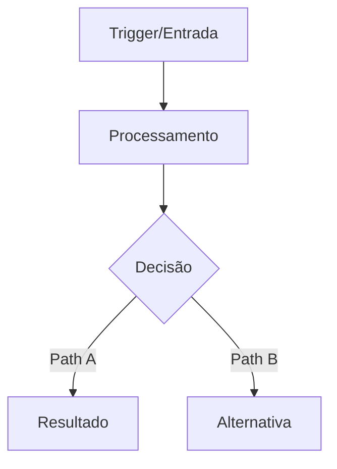
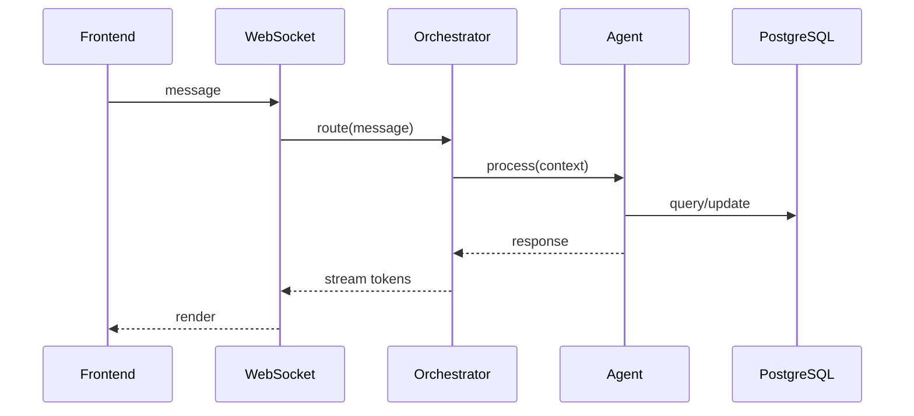
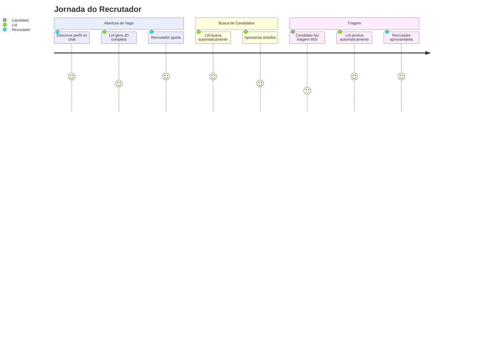
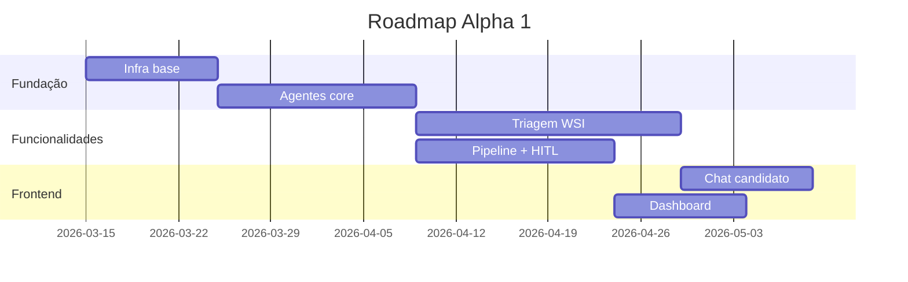

# Proposta v3: Skill "Document Factory" — Pacotes de Implementação Autocontidos

> v3.0 — 11/março/2026. Incorpora Guia de Arquitetura IA v1.0 (7.658 linhas) como fonte canônica: templates 4-file (Apêndice B), blocos de compliance imutáveis (Apêndice C), checklists de produção (§44), estrutura de pastas (§6), 10 seções obrigatórias de system prompt (§5.5), anti-padrões (§35), env vars template (§7), YAML canônico de domínio (§33.7), FairnessGuard mensagens aprovadas (§33.1-33.2), textos LGPD aprovados por jurídico (§33.3-33.4), feedback de reprovação (§33.5), diretrizes éticas obrigatórias (§33.6), checklist de compliance IA (§33.8), e checklist de reprodução em novo ambiente (§37).

---

## 0. Documentos Canônicos (Fonte de Verdade)

A skill extrai conteúdo real destes documentos — NÃO gera do zero:

| # | Documento | Linhas | O que a skill extrai |
|---|-----------|--------|---------------------|
| D1 | `docs/GUIA_ARQUITETURA_IA_v1.0.md` | 7.658 | Templates canônicos, shells, checklists, compliance, estrutura |
| D2 | `docs/diagnostico-agentes-mvp.md` | 5.251 | Catálogo por agente, gap analysis, inventário de arquivos |
| D3 | `docs/roadmap-mvp-alpha1-cards-unificados.md` | 7.854 | Cards existentes, YAML metadata, referências cruzadas |
| D4 | `lia-agent-system/app/core/seeds/guardrails_seed.py` | 177 | 13 guardrails reais (texto aprovado) |
| D5 | `lia-agent-system/app/prompts/shared/lia_persona.yaml` | 219 | Persona, tom, vocabulário RH, persistência |
| D6 | `lia-agent-system/app/prompts/shared/agent_prompts.yaml` | 1.686 | System prompts por domínio |
| D7 | `lia-agent-system/app/shared/compliance/fairness_guard.py` | 381 | Categorias discriminatórias + viés implícito |
| D8 | `lia-agent-system/app/prompts/shared/defensive.yaml` | 163 | Triggers de clarificação, respostas fora de escopo |
| D9 | `lia-agent-system/app/domains/*/agents/*` | ~12 domínios | 4-file pattern implementado (referência real) |

### Seções-Chave do Guia (D1) que a Skill Referencia

| Seção Guia | Conteúdo | Usado em qual Bloco do Card |
|-----------|----------|----------------------------|
| §5.5 | 10 Seções Obrigatórias do System Prompt | Bloco 7.2 (System Prompt) |
| §6 | Estrutura de Pastas (3 níveis) | Bloco 8 (onde criar arquivos) |
| §7 | Template completo de env vars | Bloco 4.2 (integrações) |
| §14 | 13 Agentes + 3 Grafos (catálogo) | Bloco 3.4 (tools) |
| §33.1 | FairnessGuard mensagens por categoria | Bloco 7.6 (FairnessGuard) |
| §33.2 | Léxico de viés implícito (11 termos) | Bloco 7.6 (FairnessGuard) |
| §33.3 | Termo de consentimento LGPD (aprovado jurídico) | Bloco 7.7 (LGPD) |
| §33.4 | Texto de opt-out (aprovado jurídico) | Bloco 7.7 (LGPD) |
| §33.5 | Template de feedback de reprovação | Bloco 5.2 (comunicação) |
| §33.6 | Diretrizes éticas obrigatórias (texto do prompt) | Bloco 7.2 (System Prompt) |
| §33.7 | YAML canônico de domínio (cv_screening exemplo) | Bloco 7.2 (System Prompt) |
| §33.8 | Checklist de compliance IA (25 itens) | Bloco 13 (Testes) |
| §35 | Anti-padrões (o que NUNCA fazer) | Bloco 6.2 (Edge Cases) |
| §37 | Checklist de reprodução em novo ambiente | Bloco 9 (Roteiro) |
| §44 | Checklist de produção (por agente + integração + sistema) | Bloco 13 (Testes) |
| Apêndice A | LGPD, Fairness, DEI — código portável completo | Bloco 8 (Conteúdo) |
| Apêndice B | Template completo 4 arquivos ReAct (shell canônico) | Bloco 8 (Conteúdo) |
| Apêndice C | Blocos de compliance — textos imutáveis | Bloco 7 (Governança) |
| Apêndice D | Few-shot — guia para recrutadores | Bloco 7.2 (Exemplos) |
| Apêndice H | Conceitos para o time (explicações) | Doc Tipo C (Produto) |

---

## 1. Aprendizados Consolidados

### 1.1 O que funcionou (manter)

| Aspecto | Por que funciona | Onde aplicar |
|---------|-----------------|--------------|
| **Estado V5 vs LIA** (gap analysis) | Dev sabe exatamente o que existe e o que falta | Card Tipo A |
| **Tools com Serviços (tabela)** | Mapeia tool → serviço → arquivo = zero ambiguidade | Card Tipo A |
| **Padrão 13B.7** (classe + domain + guardrails) | Dev copia estrutura sem inventar | Card Tipo A |
| **Roteiro de Reprodução** (lista numerada de arquivos) | Checklist implementável = dev segue na ordem | Card Tipo A |
| **Para Alpha 1 / Escopo explícito** | Evita over-engineering | Card Tipo A |
| **Referências cruzadas (§seção)** | Dev aprofunda quando precisa | Todos |
| **Glossário na seção 0** | Time fala a mesma língua desde a página 1 | Doc Tipo B e C |
| **Inventário exaustivo (§13C)** | Ninguém pergunta "onde está X?" | Doc Tipo B |
| **Blueprint replicável (§13B)** | Escala sem divergência arquitetural | Doc Tipo B |
| **Fora do escopo explícito (§22)** | Previne scope creep | Todos |

### 1.2 O que faltou (adicionar)

| Gap | Solução | Onde |
|-----|---------|------|
| Cards sem conteúdo real dos arquivos | **Seção "Conteúdo dos Arquivos"** com texto/código copy-paste | Card A |
| Sem grafos/diagramas de fluxo | **Mermaid obrigatório** (fluxo + grafo LangGraph + sequência) | Card A, Doc B |
| Sem mapa de integrações | **Seção "Integrações & Dependências"** (serviços externos, internos, webhooks) | Card A |
| Sem camada de comunicação | **Seção "Comunicação & Automações"** (triggers, canais, templates) | Card A |
| Sem comportamento de componentes | **Seção "Comportamento & Estados"** (estados, transições, edge cases) | Card A |
| Sem critérios de aceite formais | **Given/When/Then** + cenários de erro | Card A |
| Sem textos de governança prontos | **Seção "Governança — Textos Prontos"** (guardrails, persona, ethical guidelines, FairnessGuard) | Card A |
| Sem template de system prompt | **Conteúdo real** do system prompt com 10 seções preenchidas | Card A (agentes) |
| Sem template de tool registry | **Código real** com ToolDefinition, wrappers, stage_tools | Card A (agentes) |
| Sem riscos e mitigações | **Matriz de Risco** (prob × impacto × mitigação) | Card A |
| Sem contexto de negócio para stakeholders | **Seção "Valor de Negócio"** (linguagem simples) | Card A, Doc C |
| Docs longos sem resumo executivo | **TL;DR obrigatório** (3 linhas) | Todos |

---

## 2. Escopo da Skill — 3 Tipos de Artefato

### Tipo A — Card de Implementação (Pacote Completo)
> **Para**: Dev + AI Coding Assistant (Claude Code, Cursor, Copilot, Windsurf)
> **Filosofia**: O card contém TUDO — o dev abre, copia, cola, adapta. Zero perguntas.
> **Diferencial**: Entrega conteúdo real dos arquivos, não apenas descrições.

### Tipo B — Documento Técnico (Blueprint/Diagnóstico)
> **Para**: Time de engenharia, reuniões técnicas, onboarding, sprint planning
> **Filosofia**: Catálogo exaustivo com inventário, gap analysis, roteiros de reprodução.

### Tipo C — Documento de Produto (Apresentação/Stakeholder)
> **Para**: Stakeholders, reuniões de produto, demos, board, investidores
> **Filosofia**: Linguagem de negócio, fluxos visuais, métricas, jornadas de usuário.

---

## 3. Estrutura Completa — Tipo A: Card de Implementação

### BLOCO 1: METADATA (YAML)

```yaml
# ═══════════════════════════════════════════════════════════════
# CARD: [ID] — [Título Descritivo]
# Tipo: [ver classificação abaixo]
# ═══════════════════════════════════════════════════════════════

Titulo: "[ID] [Título]"
Tipo: [ReAct Agent (4-file) | LangGraph StateGraph | Serviço REST | Componente React | Hook React | Infra/DevOps | Celery Job | Migration DB]
Area: [Backend | Frontend | Full-Stack | DevOps | IA/ML]
Sprint: [número]
Pontos: [fibonacci: 1,2,3,5,8,13,21]
Prioridade: [P0-Blocker | P1-Critical | P2-High | P3-Medium]
Epic: "[Nome] (JIRA-KEY)"
Tags: [lista]
Classificacao: [🟢 MVP CRÍTICO | 🟡 MVP SUPORTE | 🔵 PÓS-MVP | 🔴 TECH DEBT]
Dependencias: [lista de IDs com descrição curta]
Referencias_Diagnostico: [§seções relevantes]
```

---

### BLOCO 2: CONTEXTO (para humanos)

#### 2.1 TL;DR (3 linhas máximo)
> O que é, por que importa, o que entrega.

#### 2.2 Valor de Negócio
> Linguagem não-técnica. Qual problema resolve para o usuário?
> Quem usa (persona)? Em que momento? O que muda na experiência?
> Métrica de sucesso (ex: "reduz tempo de triagem de 48h para 2h")

#### 2.3 Estado Atual vs Alvo
```
ATUAL (V5):  [o que existe — com paths de arquivo]
ALVO (LIA):  [o que deve existir ao final — com paths de arquivo]
GAP:         [lista precisa do que falta]
VEREDICTO:   [criar do zero | adaptar de LIA | migrar de V5 | mesclar V5+LIA]
```

---

### BLOCO 3: ARQUITETURA (para devs e IA)

#### 3.1 Diagrama de Fluxo (Mermaid — obrigatório)


#### 3.2 Grafo LangGraph (se agente — Mermaid obrigatório)
```mermaid
stateDiagram-v2
  [*] --> load_context
  load_context --> generate_question
  generate_question --> deliver_question
  deliver_question --> validate_response
  validate_response --> score_response
  score_response --> advance_block: block_complete
  score_response --> generate_question: more_questions
  advance_block --> generate_feedback: all_blocks_done
  advance_block --> generate_question: next_block
  generate_feedback --> [*]

  note right of validate_response: PromptInjectionGuard.check()
  note right of generate_feedback: HITL: interrupt_before
```

#### 3.3 Diagrama de Sequência (interações entre componentes — quando aplicável)


#### 3.4 Tools / Componentes (tabela)
| # | Tool/Componente | O que faz | Serviço/Classe | Arquivo | Dependência Externa |
|---|----------------|-----------|----------------|---------|---------------------|

#### 3.5 API Endpoints
| Método | Endpoint | Descrição | Auth | Rate Limit | Request Schema | Response Schema |
|--------|----------|-----------|------|------------|---------------|----------------|

#### 3.6 Modelo de Dados
| Tabela | Campos-chave | Tipo | Relações FK | Migration | Índices |
|--------|-------------|------|-------------|-----------|---------|

#### 3.7 Eventos & Webhooks (se aplicável)
| Evento Emitido | Quando | Consumers | Payload |
|----------------|--------|-----------|---------|

---

### BLOCO 4: INTEGRAÇÕES & DEPENDÊNCIAS

#### 4.1 Mapa de Impacto (onde este card toca)
```
PRODUZ dados para:   [lista de cards/serviços que consomem output deste]
CONSOME dados de:    [lista de cards/serviços que alimentam este]
DISPARA automação:   [lista de triggers/events que este card gera]
RECEBE automação de: [lista de triggers/events que chegam neste card]
COMUNICA via:        [canais — email, WhatsApp, Teams, WS, REST]
```

#### 4.2 Integrações Externas
| Serviço | Tipo | Credencial (env var) | Fallback |
|---------|------|---------------------|----------|

#### 4.3 Integrações Internas (entre domínios)
| Domínio | Serviço Consumido | Como Conecta | Arquivo |
|---------|-------------------|-------------|---------|

---

### BLOCO 5: COMUNICAÇÃO & AUTOMAÇÕES

#### 5.1 Triggers de Automação (se aplicável)
| Trigger | Tipo | Frequência | Handler | Ação Resultante |
|---------|------|-----------|---------|-----------------|

#### 5.2 Templates de Comunicação (se aplicável)
| Template | Canal | Quando Envia | Variáveis | Tone Policy |
|----------|-------|-------------|-----------|-------------|

#### 5.3 Notificações (se aplicável)
| Evento | Destinatário | Canal | Prioridade | Fallback |
|--------|-------------|-------|-----------|----------|

---

### BLOCO 6: COMPORTAMENTO & ESTADOS

#### 6.1 Estados do Componente/Serviço
| Estado | Descrição | Transição Para | Trigger da Transição |
|--------|-----------|---------------|---------------------|

#### 6.2 Edge Cases & Tratamento de Erros
| Cenário | Comportamento Esperado | Fallback |
|---------|----------------------|----------|

#### 6.3 Limites Operacionais
| Recurso | Limite | Ação quando excede |
|---------|--------|-------------------|

---

### BLOCO 7: GOVERNANÇA — CONTEÚDO CANÔNICO (do Guia de Arquitetura IA v1.0)

> **REGRA CRÍTICA** (Guia §33, Apêndice C):
> "Os blocos abaixo foram aprovados por compliance, jurídico e RH WeDOTalent.
> Copie-os exatamente. Não reescreva. Não 'melhore o português'. Não suavize o tom.
> Uma palavra trocada no lugar errado pode ser passivo legal."
>
> A skill EXTRAI conteúdo real dos documentos canônicos (D1-D9). Não inventa textos.

#### 7.1 Guardrails — Extrair de `guardrails_seed.py` (D4)
```
INSTRUÇÃO PARA A SKILL:
→ Ler lia-agent-system/app/core/seeds/guardrails_seed.py
→ Copiar PRIMARY_GUARDRAILS (6 regras globais — aplicam a TODOS os agentes)
→ Copiar SECONDARY_GUARDRAILS filtrando por domain="[domain_do_card]"
→ Se o card cria um novo domínio, criar novo SECONDARY com regras específicas

FORMATO NO CARD:
# Guardrails Primários (obrigatórios — todos agentes)
[COPIAR TEXTO REAL de PRIMARY_GUARDRAILS — 6 regras]

# Guardrails Secundários (domínio: [domain])
[COPIAR OU CRIAR SECONDARY_GUARDRAILS para este domínio]

FONTE: Guia §25 + guardrails_seed.py (177 linhas)
```

#### 7.2 System Prompt — 10 Seções Obrigatórias (Guia §5.5 + Apêndice B Arquivo 3)
```
INSTRUÇÃO PARA A SKILL:
→ Ler Guia §5.5 para as 10 seções obrigatórias
→ Ler Apêndice B Arquivo 3 ({domain}_system_prompt.py) para o shell canônico
→ Ler §33.6 para o bloco de Diretrizes Éticas (obrigatório em TODOS prompts de avaliação)
→ Ler §33.7 para o YAML canônico de domínio (cv_screening como exemplo)
→ PREENCHER o shell com o conteúdo específico do domínio

AS 10 SEÇÕES OBRIGATÓRIAS (Guia §5.5 — nesta ordem):
1. === IDENTIDADE ===           → Nome, personalidade, tom, idioma
2. === FILOSOFIA CENTRAL ===    → Chat como interface principal
3. === INSTRUCOES REACT ===     → Como raciocinar (Thought/Action/Observe)
4. === ESTAGIOS ===             → Estágios do domínio com campos de cada um
5. === COMPLIANCE E ETICA ===   → LGPD, FairnessGuard, regras de validação
6. === EXEMPLOS ===             → Few-shot: entrada → raciocínio → resposta (mín. 2)
7. === CONTRA-ARGUMENTACAO ===  → Quando e como discordar do recrutador com dados
8. === CALIBRACAO ===           → Adaptar ao porte (STARTUP/PME/CORPORAÇÃO)
9. === CONFIRMACOES ===         → Palavras de confirmação/negação em PT-BR
10. === REGRAS CRITICAS ===     → Lista de NUNCA/SEMPRE

BLOCO ÉTICO OBRIGATÓRIO (Guia §33.6 — copiar literal):
"""
DIRETRIZES ÉTICAS E LEGAIS — OBRIGATÓRIAS
==========================================
Você está avaliando candidatos para um processo seletivo regulado pela LGPD,
CLT e melhores práticas de IA responsável (EU AI Act Art. 10).

AVALIE APENAS com base em:
- Competências técnicas declaradas e comprovadas com evidências concretas
- Experiência profissional diretamente relevante para o cargo
- Respostas às perguntas de triagem/WSI
- Adequação aos requisitos explícitos da vaga (critérios pré-definidos)

IGNORE COMPLETAMENTE — estes dados NÃO são critérios de seleção:
- Nome do candidato (pode revelar gênero ou etnia)
- Idade ou ano de formatura (discriminação etária — Lei 10.741/2003)
- Foto ou qualquer característica física
- Instituição de ensino (avalie o nível educacional, não o nome da escola)
- Gaps no currículo (períodos sem trabalho não são critério negativo)
- Estado civil, filhos ou situação familiar
- Endereço, bairro ou região (exceto requisito explícito e justificado)
- Sobrenome ou origem étnica inferida

ZONA DE FRONTEIRA (score 60-70%):
Sempre recomende revisão humana. Nunca rejeite automaticamente nesta faixa.

DETECÇÃO DE VIÉS PRÓPRIO:
Se perceber que está prestes a usar qualquer critério listado acima como IGNORAR,
pare, revise o raciocínio e corrija antes de gerar a resposta final.
"""

YAML CANÔNICO DE DOMÍNIO (Guia §33.7 — usar como template):
metadata:
  domain: "[domain]"
  version: "1.0"
persona: |
  [DESCRIÇÃO DO PAPEL ESPECIALIZADO]
scope_in:
  - [O que este agente FAZ]
scope_out:
  - [O que este agente NÃO FAZ — com redirect ao agente correto]
behavioral_rules:
  - [REGRAS ESPECÍFICAS DO DOMÍNIO]
system_prompt: |
  [PROMPT COMPLETO COM AS 10 SEÇÕES]
intent_examples:
  - "[EXEMPLO 1 de frase do recrutador]"
  - "[EXEMPLO 2]"

FONTE: Guia §5.5, §33.6, §33.7, Apêndice B Arquivo 3
```

#### 7.3 Shell de Agente ReAct — 4 Arquivos (Guia Apêndice B — SHELL CANÔNICO)
```
INSTRUÇÃO PARA A SKILL:
→ Ler Guia Apêndice B (linhas 5406-5974) — contém os 4 arquivos completos
→ O shell é o template aprovado pelo especialista André (Apêndice F):
  "Não vai mais ser artesanato, vai ser linha de produção."
→ Substituir [DOMAIN] pelo nome do domínio
→ PREENCHER cada arquivo com a lógica específica do card

ESTRUTURA DE DIRETÓRIOS:
app/domains/[domain]/
├── agents/
│   ├── [domain]_react_agent.py     ← Classe principal (~260 linhas — Apêndice B)
│   ├── [domain]_tool_registry.py   ← Tools + wrappers (~100-1200 linhas)
│   ├── [domain]_system_prompt.py   ← Prompt 10 seções (~80-200 linhas)
│   └── [domain]_stage_context.py   ← Stages + transições (~100 linhas)
└── services/                       ← Serviços de domínio (lógica de negócio)

ARQUIVO 1 — react_agent.py (SHELL CANÔNICO):
→ Herda: EnhancedAgentMixin + BaseAgent
→ Imports obrigatórios: agent_interface, enhanced_agent_mixin, react_loop, working_memory, observability
→ _CONFIRMATION_WORDS: set de 14 palavras PT-BR
→ process(): 6 passos (carregar memória → contexto stage → config ReAct → observer → executar loop → build output + learning)
→ _build_output(): AgentOutput com actions, field_updates, navigation, confidence, reasoning_steps, tool_results
→ _check_stage_navigation(): Requer confirmação do usuário + campos obrigatórios
→ _save_memory(): Salvar working memory (collected_fields, current_stage, agent_notes)
→ get_status(): Status do agente

ARQUIVO 2 — tool_registry.py:
→ _STAGE_TOOL_MAP: dict[str, list[str]] mapeando stage → tools
→ get_[domain]_tools(): List[ToolDefinition] com todas tools
→ get_stage_tools(stage): Filtra tools pelo stage atual
→ Cada tool wrapper: async def _wrap_xxx(**kwargs) -> dict

ARQUIVO 3 — system_prompt.py:
→ _LIA_IDENTITY: Bloco fixo (copiar do Apêndice B)
→ _STAGE_PROMPTS: dict[str, str] com prompt por stage
→ _REACT_INSTRUCTIONS: Bloco fixo (copiar do Apêndice B)
→ get_[domain]_system_prompt(stage, context): Monta prompt final

ARQUIVO 4 — stage_context.py:
→ STAGE_DEFINITIONS: dict com required_fields, optional_fields, next_stage, transition_criteria
→ get_stage_context(stage, collected_fields): Retorna dict com missing_required, transition_ready
→ get_transition_prompt(current, next): Mensagem de transição PT-BR

FONTE: Guia Apêndice B (linhas 5406-5974, ~570 linhas de código completo)
```

#### 7.4 Shell de Grafo LangGraph (quando tipo = StateGraph)
```
INSTRUÇÃO PARA A SKILL:
→ Para grafos (job_wizard, wsi_interview, interview_scheduling):
→ Definir State class (TypedDict ou Pydantic)
→ Definir nós como funções async
→ Definir arestas (edges) com condições
→ Definir interrupt_before para HITL
→ Definir checkpointer (PostgresSaver para produção)

TEMPLATE DE GRAFO:
from langgraph.graph import StateGraph, END
from langgraph.checkpoint.postgres import PostgresSaver

class [Domain]State(TypedDict):
    session_id: str
    company_id: str
    [campos_específicos_do_domínio]: ...
    messages: list
    current_node: str
    status: str  # active | completed | error | paused_hitl

# Nós
async def [node_name](state: [Domain]State) -> [Domain]State:
    """[DOCSTRING — o que este nó faz, inputs, outputs]"""
    ...

# Grafo
graph = StateGraph([Domain]State)
graph.add_node("[node1]", [node1_func])
graph.add_node("[node2]", [node2_func])
graph.add_edge("[node1]", "[node2]")
graph.add_conditional_edges("[node2]", [condition_func], {...})
graph.set_entry_point("[node1]")

# HITL
graph.interrupt_before = ["[node_que_requer_aprovação]"]

# Compilar
checkpointer = PostgresSaver(conn_string=DATABASE_URL)
compiled = graph.compile(checkpointer=checkpointer)

FONTE: Guia §17 (Job Wizard), §17A (WSI Interview), §17B (Scheduling)
```

#### 7.5 Persona & Vocabulário (Extrair de lia_persona.yaml — D5)
```
INSTRUÇÃO PARA A SKILL:
→ Ler lia-agent-system/app/prompts/shared/lia_persona.yaml (219 linhas)
→ Copiar seções relevantes para este domínio:
  - lia_persona (identidade, tom, evite/use)
  - hr_vocabulary (termos técnicos RH — tabela completa)
  - ethical_guidelines (critérios permitidos vs proibidos)
  - data_persistence (regras de salvamento de dados)
→ NÃO MODIFICAR — estes textos são compartilhados por todos os agentes

CONTEÚDO FIXO (copiar literal do lia_persona.yaml):
- Tom: Profissional, empático, direto e proativo
- Linguagem: Formal mas acessível, sem gírias ou abreviações
- Tratamento: Sempre "você", nunca "vc" ou "tu"
- Evite: "blz", "tmj", "pra", "vc", "tb", "msm", emojis excessivos
- Use: Termos técnicos RH em PT-BR, linguagem inclusiva e neutra de gênero

FONTE: D5 (lia_persona.yaml, 219 linhas)
```

#### 7.6 FairnessGuard — Mensagens Aprovadas (Guia §33.1 + §33.2)
```
INSTRUÇÃO PARA A SKILL:
→ Ler Guia §33.1 para DISCRIMINATORY_CATEGORIES (5 categorias, textos com base legal)
→ Ler Guia §33.2 para IMPLICIT_BIAS_TERMS (11 termos sutis)
→ Ler fairness_guard.py (381 linhas) para regex patterns
→ COPIAR LITERAL — textos aprovados por jurídico

CATEGORIAS COM BASE LEGAL (Guia §33.1):
- genero: Art. 5º CLT
- idade: Lei 10.741/2003 + CLT Art. 373-A
- etnia_raca: CF Art. 5º XLII + Lei 7.716/1989
- religiao: CF Art. 5º VIII
- orientacao_sexual: STF ADO 26
- deficiencia: Lei 8.213/1991 + LBI Lei 13.146/2015

VIÉS IMPLÍCITO (Guia §33.2 — 11 termos):
- "boa aparência" → discriminação estética (Lei 12.984/14)
- "bairros nobres" / "região nobre" → discriminação socioeconômica
- "universidades de primeira linha" / "faculdade de ponta" → elitismo acadêmico
- "escola particular" → discriminação socioeconômica
- "clube social" → discriminação de classe
- "perfil adequado" → viés inconsciente mascarado
- "apresentação pessoal" → discriminação estética
- "morar próximo" → discriminação socioeconômica
- "boa família" → discriminação de origem

FONTE: Guia §33.1, §33.2, D7 (fairness_guard.py, 381 linhas)
```

#### 7.7 LGPD — Textos Aprovados por Jurídico (Guia §33.3, §33.4, §33.5)
```
INSTRUÇÃO PARA A SKILL:
→ Copiar LITERAL os textos das seções 33.3, 33.4, 33.5 do Guia
→ NÃO REESCREVER — aprovados por jurídico versão 2026-01

CONSENTIMENTO (§33.3): Termo de 12 linhas com 4 direitos LGPD
OPT-OUT (§33.4): Texto de cancelamento com retenção legal (2 anos)
REPROVAÇÃO (§33.5): Template com [FIXO] e [OPCIONAL] — sugestões requerem HITL

ATENÇÃO (do Guia):
"NÃO gere automaticamente o campo [SUGESTOES_DESENVOLVIMENTO] com LLM sem revisão
humana. Sugestões mal calibradas podem ser percebidas como condescendentes ou
discriminatórias. Exigir aprovação do recrutador antes de enviar."

FONTE: Guia §33.3, §33.4, §33.5
```

#### 7.8 Prompts Defensivos (Extrair de defensive.yaml — D8)
```
INSTRUÇÃO PARA A SKILL:
→ Ler lia-agent-system/app/prompts/shared/defensive.yaml (163 linhas)
→ Copiar triggers de clarificação e respostas fora de escopo

TRIGGERS OBRIGATÓRIOS:
- Sem job_id no contexto → "Qual vaga você está trabalhando?"
- Sem candidate_id → "Qual candidato?"
- Fora do escopo (médico, jurídico, financeiro) → "Não posso ajudar com [tema]. Sou especializada em recrutamento."
- Erro de recuperação → JSON estruturado de fallback

FONTE: D8 (defensive.yaml, 163 linhas)
```

#### 7.9 Checklist de Compliance IA (Guia §33.8 — 25 itens)
```
INSTRUÇÃO PARA A SKILL:
→ Copiar checklist do Guia §33.8
→ Incluir DENTRO do card como requisito de "Done"

CHECKLIST (a skill copia do Guia):
ARQUITETURA:
- [ ] Identifiquei o que é determinístico vs não-determinístico (Guia §12)
- [ ] Guardrails determinísticos nas extremidades (entrada e saída)
- [ ] Nenhuma decisão de compliance depende exclusivamente de LLM

PROMPTS:
- [ ] Incluí bloco de Diretrizes Éticas Obrigatórias (§33.6)
- [ ] scope_out explícito com redirecionamento ao agente correto
- [ ] Copiei textos de compliance das §33.x, não reescrevi

FAIRNESSGUARD:
- [ ] FairnessGuard chamado ANTES da LLM (não depois)
- [ ] Camada 1 (regex) ativa para todos inputs do recrutador
- [ ] Novos termos via processo de aprovação

LGPD:
- [ ] Dados pessoais não aparecem em logs em texto plano
- [ ] Opt-out verificado antes de comunicação ao candidato
- [ ] Consentimento verificado antes de banco de talentos

TESTES:
- [ ] Determinísticos com assertEqual
- [ ] Não-determinísticos com testes de estrutura/limites
- [ ] Four-Fifths Rule sem regressão
- [ ] FairnessGuard testado para 6 blocos

AUDITORIA:
- [ ] decision_log com criteria_used e criteria_ignored
- [ ] BiasAuditSnapshot para vagas >20 candidatos
- [ ] Drift detection ativo

FONTE: Guia §33.8
```

---

### BLOCO 8: CONTEÚDO DOS ARQUIVOS (copy-paste ready)

> **Esta é a seção mais importante.** Cada arquivo que o dev precisa criar/modificar
> tem seu conteúdo aqui — pronto para copiar e colar.

#### 8.1 Arquivo: [path/to/file1.py]
```python
# ═══════════════════════════════════════════════
# [path/to/file1.py]
# Card: [CARD-ID] — [Título]
# ═══════════════════════════════════════════════

"""
[Docstring com contexto, responsabilidades, e referências]
"""

[CÓDIGO COMPLETO DO ARQUIVO]
# - Classes com docstrings
# - Métodos com type hints
# - Imports explícitos
# - TODO markers para partes que dependem de outros cards
```

#### 8.2 Arquivo: [path/to/file2.tsx]
```tsx
// ═══════════════════════════════════════════════
// [path/to/file2.tsx]
// Card: [CARD-ID] — [Título]
// ═══════════════════════════════════════════════

[CÓDIGO COMPLETO DO COMPONENTE]
// - Props interface com JSDoc
// - Estados explícitos
// - Hooks com dependências
// - Tailwind classes DS v4.2.1
// - ARIA labels
```

#### 8.3 Arquivo: [path/to/migration.py]
```python
# Alembic migration
# Card: [CARD-ID]

def upgrade():
    [SQL COMPLETO]

def downgrade():
    [SQL REVERSO]
```

#### 8.4 Arquivo: [path/to/test.py]
```python
# Testes obrigatórios
# Card: [CARD-ID]

[CÓDIGO COMPLETO DOS TESTES]
# - Happy path
# - Edge cases
# - Compliance (FairnessGuard)
# - Error handling
```

---

### BLOCO 9: ROTEIRO DE IMPLEMENTAÇÃO (ordem)

```
FASE 1 — Fundação (dia 1)
1. [ ] [arquivo] — [o que fazer] (ref: [arquivo existente] L[linhas])
2. [ ] [arquivo] — [o que fazer]

FASE 2 — Lógica (dia 2-3)
3. [ ] [arquivo] — [o que fazer]
4. [ ] [arquivo] — [o que fazer]

FASE 3 — Integração (dia 4)
5. [ ] [arquivo] — Conectar com [serviço]
6. [ ] [arquivo] — Registrar no [router/orchestrator]

FASE 4 — Testes & Compliance (dia 5)
7. [ ] [arquivo] — Testes unitários (mínimo 5 cenários)
8. [ ] [arquivo] — Testes de compliance (FairnessGuard)
9. [ ] Rodar checklist 18 itens (AGT-000)
```

---

### BLOCO 10: CRITÉRIOS DE ACEITE

```gherkin
# Cenário principal
DADO [pré-condição completa]
QUANDO [ação específica do usuário/sistema]
ENTÃO [resultado esperado verificável]
E [efeito colateral esperado]

# Cenário de erro
DADO [pré-condição de erro]
QUANDO [ação que causa erro]
ENTÃO [comportamento de erro esperado]
E [log/alerta gerado]

# Cenário de compliance
DADO [input com viés potencial]
QUANDO [processamento pela IA]
ENTÃO FairnessGuard bloqueia E mensagem educativa é exibida

# Cenário HITL (se aplicável)
DADO [ação que requer aprovação humana]
QUANDO [agente tenta executar]
ENTÃO interrupt_before pausa o grafo
E HITLConfirmCard é exibido ao consultor
E ação só executa após aprovação
```

---

### BLOCO 11: ESCOPO & LIMITES

```
ENTRA (este card):
- [lista do que o card cobre]

NÃO ENTRA (explícito):
- [lista do que NÃO implementar — com justificativa]

PÓS-MVP (backlog):
- [lista de melhorias futuras — com card de referência se existir]

DEPENDÊNCIA BLOQUEANTE:
- [card X] deve estar pronto antes (motivo: [porquê])

DEPENDÊNCIA SOFT:
- [card Y] pode ser feito em paralelo mas integra depois
```

---

### BLOCO 12: RISCOS & MITIGAÇÕES

| Risco | Prob. | Impacto | Mitigação | Owner |
|-------|-------|---------|-----------|-------|

---

### BLOCO 13: TESTES OBRIGATÓRIOS + CHECKLIST DE PRODUÇÃO (Guia §44)

```
UNITÁRIOS (mínimo 5):
- [ ] [cenário happy path] — [o que testa]
- [ ] [cenário de erro] — [o que testa]
- [ ] [cenário de compliance] — [o que testa]
- [ ] [cenário de edge case] — [o que testa]
- [ ] [cenário multi-tenant] — company_id isolado

INTEGRAÇÃO (mínimo 2):
- [ ] [cenário end-to-end 1]
- [ ] [cenário end-to-end 2]

COMPLIANCE (obrigatório para IA):
- [ ] FairnessGuard com input discriminatório (6 categorias §33.1)
- [ ] PromptInjection com input malicioso
- [ ] PII Masking com dados sensíveis (nome, CPF, email)
- [ ] Four-Fifths Rule sem regressão (se avaliação)

CHECKLIST DE PRODUÇÃO POR AGENTE (Guia §44):
- [ ] Padrão 4 arquivos completo
- [ ] company_id + user_id em todos os traces
- [ ] Guardrails primários aplicados (via banco)
- [ ] Guardrails secundários de domínio configurados
- [ ] Fallback de LLM (Claude → OpenAI/Gemini)
- [ ] Fallback manual (usuário pode fazer sem LIA)
- [ ] Timeout por iteração/nó configurado
- [ ] Persistência de estado para agentes longa duração
- [ ] AgentHealthAlertService.record_failure/success() integrado
- [ ] AgentQualityEvaluator.evaluate_if_sampled() integrado
- [ ] Decisão final NÃO truncada

CHECKLIST POR INTEGRAÇÃO EXTERNA (Guia §44):
- [ ] Rate limiting respeitado
- [ ] Retry com exponential backoff
- [ ] Circuit breaker para serviços críticos
- [ ] Custo monitorado (tokens, créditos)
- [ ] Identificação de IA em comunicações externas

CHECKLIST COMPLIANCE IA (Guia §33.8):
- [ ] Determinístico vs não-determinístico identificado
- [ ] Guardrails nas extremidades (entrada + saída)
- [ ] Bloco ético §33.6 incluído no prompt
- [ ] scope_out explícito com redirect
- [ ] Textos compliance copiados (não reescritos)
- [ ] PII não aparece em logs texto plano
- [ ] decision_log com criteria_used/ignored
```

---

### BLOCO 14: REFERÊNCIAS & CÓDIGO-FONTE

```
DOCUMENTAÇÃO:
- [doc1.md] §[seção] — [o que tem]
- [doc2.md] §[seção] — [o que tem]

CÓDIGO DE REFERÊNCIA (LIA — copiar padrão):
- [arquivo1.py] (L[início]-[fim]) — [o que usar de referência]
- [arquivo2.py] (L[início]-[fim]) — [o que usar de referência]

CÓDIGO DE REFERÊNCIA (V5 — adaptar):
- [arquivo3.py] (L[início]-[fim]) — [o que adaptar]

SKILLS RELACIONADAS:
- [skill-name] — [quando consultar]
```

---

## 4. Estrutura Completa — Tipo B: Documento Técnico

```markdown
# [Título do Documento]
> Versão X.Y — Data. Autor: [nome/agente].
> Última atualização: [data]. Linhas: [N].

## TL;DR (5 linhas)

## Sumário (com links internos)

## §0 — Glossário
| Termo | Sigla | Definição | Exemplo | Ref |
|-------|-------|-----------|---------|-----|

## §1 — Contexto & Motivação
> Por que este documento existe? Qual problema resolve?
> Quem são os leitores? O que esperam encontrar aqui?

## §2 — Escopo & Limites
> O que cobre. O que NÃO cobre. Documentos complementares.

## §3 — Arquitetura Geral
> Diagrama de blocos (Mermaid). Visão macro.
> Decisões arquiteturais (ADRs) com justificativa.

## §4-N — Seções Técnicas (padrão por seção)
### Cada seção contém:
- Objetivo (1 parágrafo)
- Estado atual (com evidências: código, métricas)
- Estado alvo
- Gap analysis (tabela: componente | V5 | LIA | gap | prioridade)
- Recomendações (numeradas, acionáveis)
- Diagrama (Mermaid quando aplicável)
- Código de referência (snippets reais)
- Referências cruzadas (→ Ver §X)

## §N+1 — Inventário de Arquivos
| # | Arquivo | Linhas | Domínio | Responsabilidade | Cards Relacionados |
|---|---------|--------|---------|-----------------|-------------------|

## §N+2 — Catálogo por Domínio/Componente
### Para cada item:
- Identificação (nome, classe, arquivo)
- Estado V5 vs LIA
- Tools/API surface
- Dependências
- Gaps
- Prioridade Alpha 1

## §N+3 — Matriz de Decisões Arquiteturais
| # | Decisão | Opções Avaliadas | Escolha | Justificativa | Impacto |
|---|---------|-----------------|---------|---------------|---------|

## §N+4 — Blueprint de Replicação
> Padrão obrigatório que todo novo componente deve seguir.
> Checklist de produção.

## §N+5 — Compliance & Governança
> Guardrails aplicáveis, FairnessGuard, LGPD, auditoria.
> Textos reais dos guardrails_seed.py.

## §N+6 — Roadmap de Implementação
| Fase | Sprint | Cards | SPs | Dependências | Milestone |
|------|--------|-------|-----|-------------- |-----------|

## §N+7 — Fora do Escopo (Explícito)
> O que foi avaliado e NÃO entra. Com justificativa.

## §N+8 — NFRs (Non-Functional Requirements)
| NFR | Métrica | Target | Como Medir |
|-----|---------|--------|------------|

## Changelog
| Versão | Data | Autor | Mudanças |
|--------|------|-------|----------|

## Apêndices
> Dados complementares, tabelas grandes, código extenso.
```

---

## 5. Estrutura Completa — Tipo C: Documento de Produto

```markdown
# [Título] — Visão de Produto
> Versão X.Y — Data. Para: [público-alvo].

## Resumo Executivo (1 parágrafo para C-level)

## Glossário de Produto (termos na linguagem do cliente)
| Termo | O que significa para o cliente |
|-------|------------------------------|

## Problema & Oportunidade
> Dor do cliente (com dados/citações).
> Tamanho da oportunidade.
> Benchmark competitivo (como outros resolvem).

## Solução
> O que fazemos. Como funciona (alto nível, sem código).
> Diferencial vs concorrentes.

## Jornada do Usuário
> Passo a passo visual (Mermaid ou diagrama).
> Personas envolvidas. Pontos de contato. Momentos "wow".



## Funcionalidades
### Para cada feature:
| Feature | Descrição (linguagem de negócio) | Valor | Status | Sprint |
|---------|--------------------------------|-------|--------|--------|

## Arquitetura Simplificada
> Diagrama de blocos SEM código.
> "O sistema faz X, conecta com Y, entrega Z."

## Métricas de Sucesso
| KPI | O que mede | Baseline | Meta | Como Medir |
|-----|-----------|----------|------|------------|

## Roadmap Visual


## FAQ
> Perguntas frequentes de stakeholders (com respostas prontas).

## Apêndices
> Detalhes complementares para quem quiser aprofundar.
```

---

## 6. Regras de Qualidade da Skill

### 6.1 Validações Obrigatórias (a skill rejeita card incompleto)

| # | Regra | Severidade | Aplicável a |
|---|-------|-----------|-------------|
| Q1 | Card sem TL;DR | ERRO | Todos |
| Q2 | Card sem Critério de Aceite (Given/When/Then) | ERRO | Tipo A |
| Q3 | Card sem Roteiro de Implementação | ERRO | Tipo A |
| Q4 | Card sem Diagrama Mermaid | AVISO | Tipo A |
| Q5 | Card > 21 SPs sem sugestão de split | ERRO | Tipo A |
| Q6 | Card de agente sem System Prompt completo | ERRO | Tipo A (agentes) |
| Q7 | Card de agente sem Tool Registry | ERRO | Tipo A (agentes) |
| Q8 | Card de agente sem Guardrails | ERRO | Tipo A (agentes) |
| Q9 | Card sem seção "NÃO entra" | AVISO | Todos |
| Q10 | Card sem Mapa de Impacto | AVISO | Tipo A |
| Q11 | Documento sem Glossário | AVISO | Tipo B, C |
| Q12 | Card de frontend sem estados do componente | AVISO | Tipo A (frontend) |
| Q13 | Card sem Testes Obrigatórios | ERRO | Tipo A |
| Q14 | Card de IA sem cenário de compliance | ERRO | Tipo A (IA) |
| Q15 | Referência circular entre cards | ERRO | Tipo A |

### 6.2 Checklist de Completude (score 0-100%)

```
METADATA (10%):      [ ] YAML completo com todos os campos
CONTEXTO (10%):      [ ] TL;DR + Valor de Negócio + Estado Atual vs Alvo
ARQUITETURA (20%):   [ ] Diagramas + Tools/API + Modelo de Dados
INTEGRAÇÕES (10%):   [ ] Mapa de Impacto + Integrações externas/internas
COMUNICAÇÃO (5%):    [ ] Triggers + Templates + Notificações
COMPORTAMENTO (5%):  [ ] Estados + Edge Cases + Limites
GOVERNANÇA (15%):    [ ] Guardrails + Prompt + FairnessGuard + Persona
CONTEÚDO (15%):      [ ] Arquivos completos copy-paste
IMPLEMENTAÇÃO (5%):  [ ] Roteiro ordenado + fases
QUALIDADE (5%):      [ ] Critérios aceite + Testes + Riscos
```

---

## 7. Funcionalidades Extras da Skill

### 7.1 Extração Automática do Codebase

A skill pode extrair conteúdo real do Replit para popular cards:
- **Guardrails**: Lê `guardrails_seed.py` → preenche Bloco 7.1
- **Persona**: Lê `lia_persona.yaml` → preenche Bloco 7.5
- **System Prompts**: Lê `*_system_prompt.py` existentes → gera template
- **Tool Registries**: Lê `*_tool_registry.py` existentes → gera template
- **FairnessGuard**: Lê `fairness_guard.py` → preenche Bloco 7.6
- **Automações**: Lê `automation_scheduler.py` + handlers → preenche Bloco 5
- **Endpoints**: Lê `app/api/v1/*.py` → preenche API Endpoints
- **Modelos**: Lê `libs/models/` → preenche Modelo de Dados

### 7.2 Sincronização Jira

- Formata card em ADF (Atlassian Document Format) para API v3
- Cria/atualiza issues via REST API
- Vincula a épicos existentes
- Define story points, sprint, labels
- Valida completude antes de enviar

### 7.3 Geração de PR Description

- Extrai do card: TL;DR + Roteiro + Critérios de Aceite
- Formata como PR description GitHub-ready

### 7.4 Compatibilidade AI Coding Assistants

Cards otimizados para:
- **Claude Code**: Bloco 8 (conteúdo dos arquivos) = instrução direta
- **Cursor**: Referências de arquivo + código = autocompletar contextualizado
- **Copilot Workspace**: Critérios de aceite = plano de implementação
- **Windsurf**: Roteiro de implementação = sequência de ações

---

## 8. Triggers da Skill

| Trigger (frase do usuário) | Ação | Tipo |
|---------------------------|------|------|
| "criar card para [feature]" | Gera Card Completo (Tipo A) | A |
| "criar card de agente para [domínio]" | Gera Card com 4-file pattern completo | A |
| "criar card frontend para [componente]" | Gera Card com estados, hooks, props | A |
| "criar cards para épico [nome]" | Gera N cards com dependências | A batch |
| "enriquecer card [ID]" | Adiciona seções faltantes | A |
| "criar documento técnico sobre [tema]" | Gera Doc Técnico (Tipo B) | B |
| "criar diagnóstico de [sistema/módulo]" | Gera Diagnóstico com inventário | B |
| "criar blueprint de [padrão]" | Gera Blueprint replicável | B |
| "criar documento de produto sobre [tema]" | Gera Doc Produto (Tipo C) | C |
| "criar roadmap de [escopo]" | Gera Roadmap visual | B/C |
| "gerar glossário de [domínio]" | Extrai termos e gera glossário | B/C |
| "sincronizar cards com Jira" | Envia para Jira via API | A |
| "validar card [ID]" | Roda checklist de completude | A |
| "extrair conteúdo de [arquivo] para card" | Lê arquivo e popula blocos | A |

---

## 9. Próximos Passos

1. **Você avalia** esta proposta v3 e sugere ajustes
2. **Eu crio** a skill em `.agents/skills/document-factory/SKILL.md` incorporando:
   - Os 14 blocos de card com referências canônicas do Guia (§5.5, §6, §33.x, §44, Apêndices B-C)
   - Os 9 documentos canônicos (D1-D9) como fonte de extração
   - O shell de 4 arquivos (Apêndice B) como template interno
   - Textos de compliance imutáveis (Apêndice C) literais
   - Checklists de produção (§44) e compliance IA (§33.8)
3. **Testamos** gerando 2-3 cards reais (ex: AGT-003 ScreeningAgent, AGT-007 Orchestrator)
4. **Iteramos** até o formato estar ideal
5. **Documentamos** o padrão no `replit.md`

---

*Proposta v3.0 — 11/março/2026*
