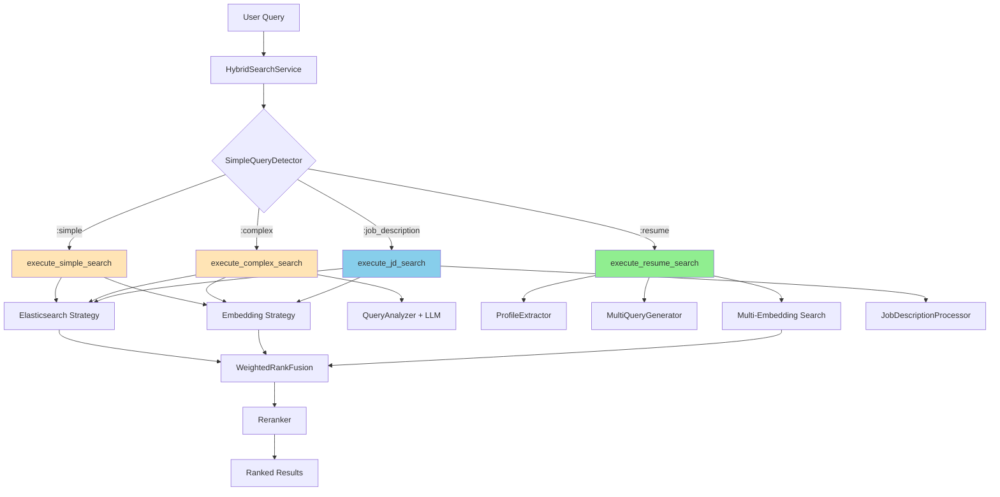
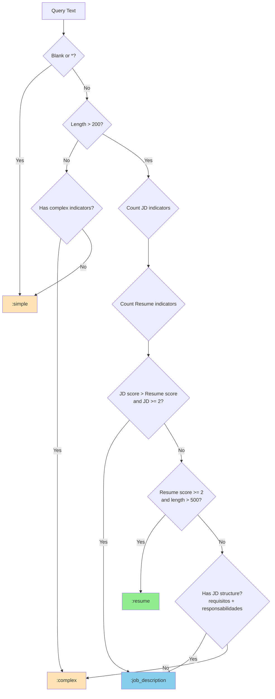
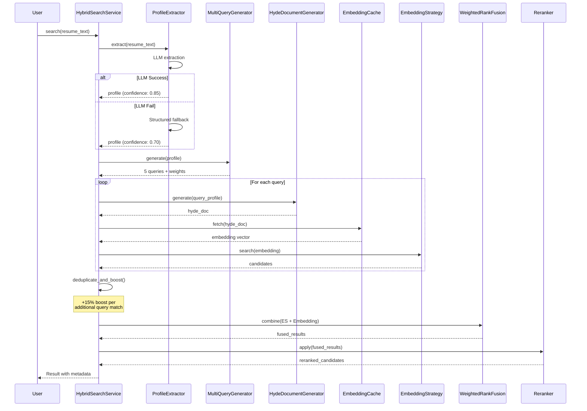
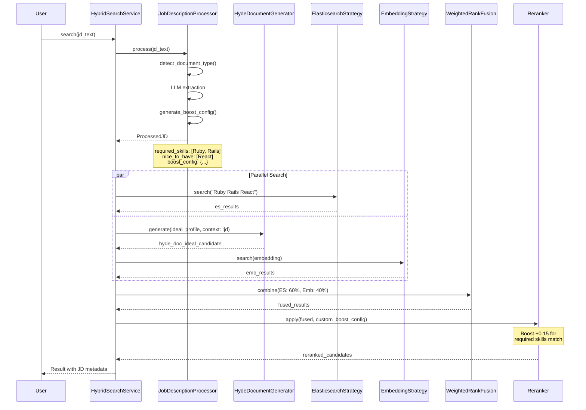
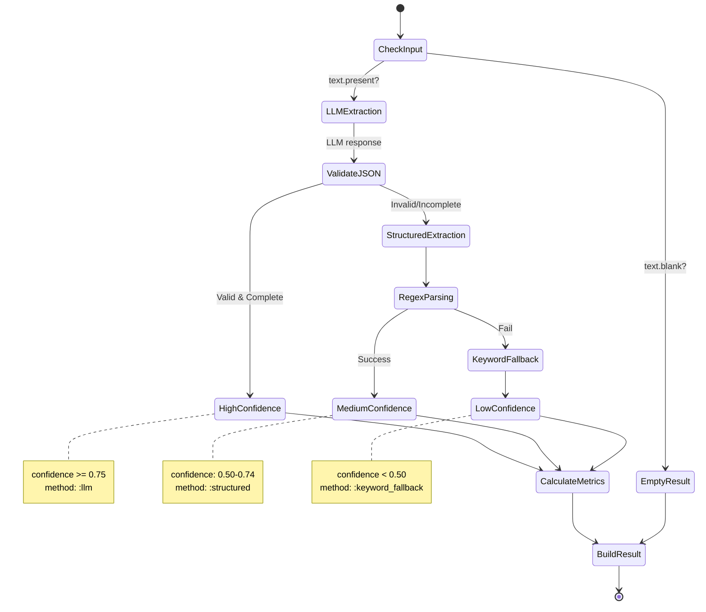
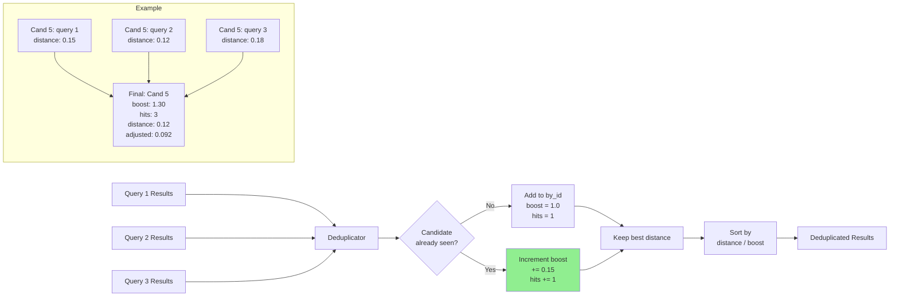
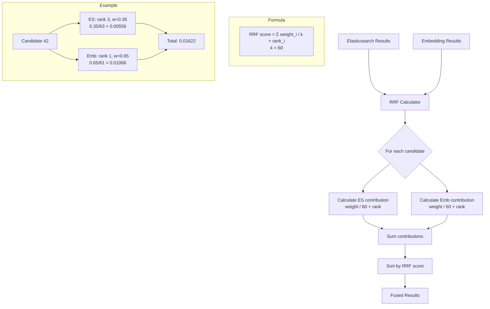
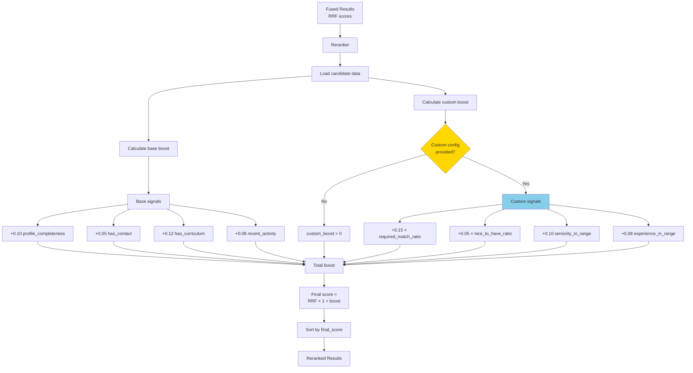
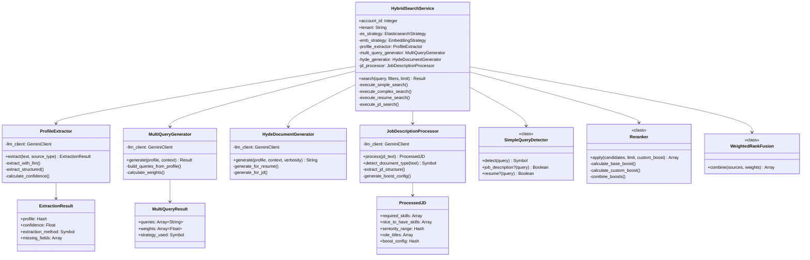
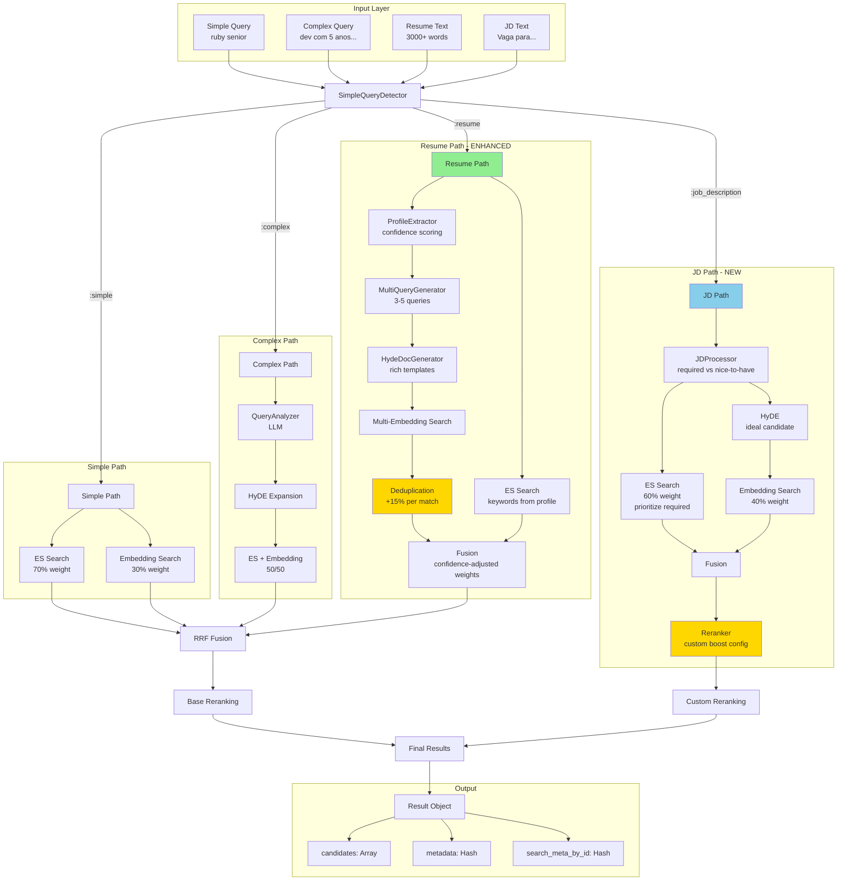

# Local Search - Diagramas Visuais (Mermaid)

> **Diagramas em formato Mermaid**  
> Renderize estes diagramas no GitHub, GitLab, ou em ferramentas que suportam Mermaid  
> **Última atualização:** 2026-02-01

## 📊 Índice de Diagramas

1. [Fluxo Principal de Busca](#1-fluxo-principal-de-busca)
2. [Detecção de Tipo de Query](#2-detecção-de-tipo-de-query)
3. [Resume Search - Multi-Query Flow](#3-resume-search---multi-query-flow)
4. [Job Description Search Flow](#4-job-description-search-flow)
5. [Profile Extraction Flow](#5-profile-extraction-flow)
6. [Deduplication e Multi-Query Boost](#6-deduplication-e-multi-query-boost)
7. [Weighted Rank Fusion](#7-weighted-rank-fusion)
8. [Reranking com Boosts](#8-reranking-com-boosts)
9. [Arquitetura de Classes](#9-arquitetura-de-classes)
10. [Fluxo de Dados Completo](#10-fluxo-de-dados-completo)

---

## 1. Fluxo Principal de Busca



---

## 2. Detecção de Tipo de Query



---

## 3. Resume Search - Multi-Query Flow



---

## 4. Job Description Search Flow



---

## 5. Profile Extraction Flow



---

## 6. Deduplication e Multi-Query Boost



---

## 7. Weighted Rank Fusion



---

## 8. Reranking com Boosts



---

## 9. Arquitetura de Classes



---

## 10. Fluxo de Dados Completo



---

## Como Usar os Diagramas

### No GitHub/GitLab

Os diagramas Mermaid são renderizados automaticamente em arquivos `.md`:

1. Copie o código Mermaid
2. Cole em um arquivo `.md`
3. Commit e visualize no GitHub/GitLab

### Ferramentas Online

- **Mermaid Live Editor:** https://mermaid.live/
- **Draw.io (diagrams.net):** Importa Mermaid
- **VS Code:** Extensão "Markdown Preview Mermaid Support"

### Exportar como Imagem

```bash
# Usando mermaid-cli
npm install -g @mermaid-js/mermaid-cli

# Converter para PNG
mmdc -i diagram.mmd -o diagram.png

# Converter para SVG
mmdc -i diagram.mmd -o diagram.svg
```

---

## Legenda de Cores

| Cor | Significado |
|-----|-------------|
| 🟢 Verde (#90EE90) | Resume Search (Enhanced) |
| 🔵 Azul (#87CEEB) | JD Search (New) |
| 🟡 Amarelo (#FFE4B5) | Simple/Complex Search (Original) |
| 🟡 Dourado (#FFD700) | Componente crítico/boost |

---

**Versão:** 2.0  
**Formato:** Mermaid.js  
**Última atualização:** 2026-02-01
