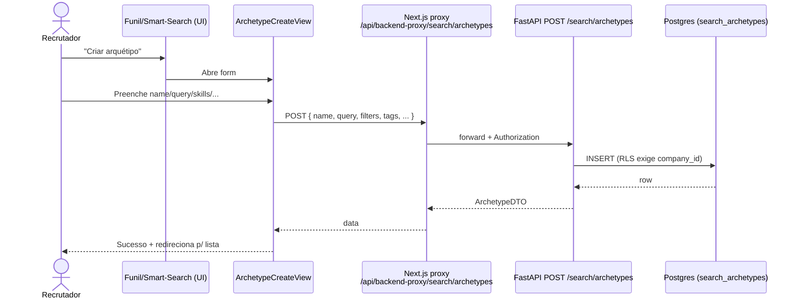
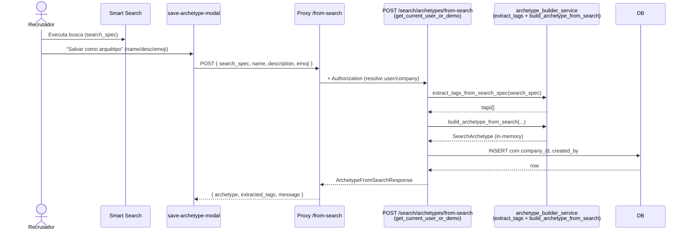
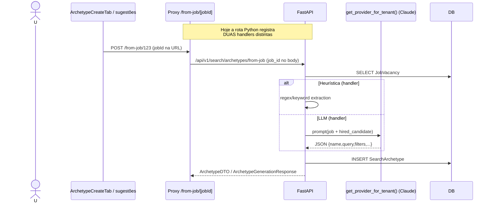
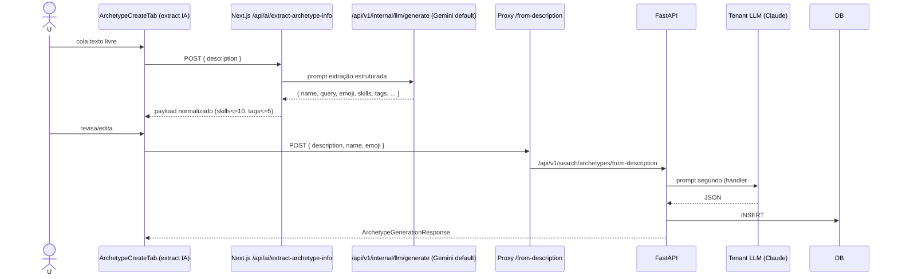
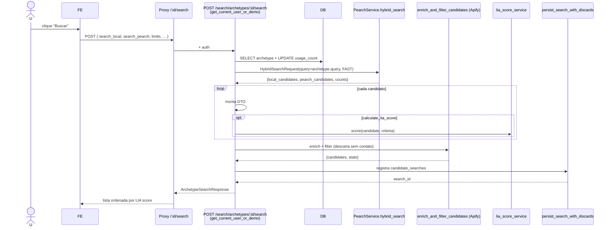
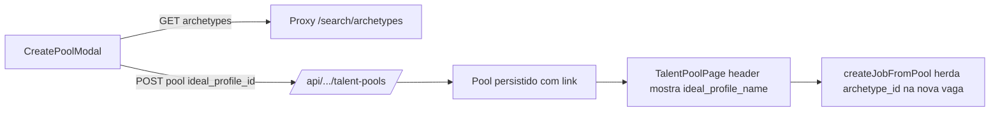
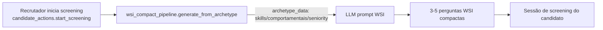

# Auditoria Completa — Funcionalidade de Arquétipos (Search Archetypes)

> Auditoria somente-leitura realizada em abril/2026. Cobre backend Python (`lia-agent-system`), backend Ruby (`ats_api`), camada de proxy Next.js e frontend (`plataforma-lia`).
> Todas as referências `path:linha` apontam para o estado do repositório no momento desta auditoria.

## Índice

1. [Sumário Executivo](#1-sumário-executivo)
2. [Modelo de Dados](#2-modelo-de-dados)
3. [Backend Python (`lia-agent-system`)](#3-backend-python-lia-agent-system)
4. [Backend Ruby (`ats_api`)](#4-backend-ruby-ats_api)
5. [Camada de Proxy Next.js](#5-camada-de-proxy-nextjs)
6. [Frontend (`plataforma-lia`)](#6-frontend-plataforma-lia)
7. [Fluxos (diagramas Mermaid)](#7-fluxos-diagramas-mermaid)
8. [Matriz de Estado de Implementação](#8-matriz-de-estado-de-implementação)
9. [Hard-codes, Mocks e Fallbacks](#9-hard-codes-mocks-e-fallbacks)
10. [TODOs / FIXMEs / Dívidas Técnicas](#10-todos--fixmes--dívidas-técnicas)
11. [Multi-tenancy & Segurança](#11-multi-tenancy--segurança)
12. [Gaps e Recomendações Priorizadas](#12-gaps-e-recomendações-priorizadas)

---

## 1. Sumário Executivo

**O que é um Arquétipo?** Template reutilizável de busca de candidatos. Combina uma query em linguagem natural, filtros estruturados (skills, senioridade, indústria, anos de experiência), tags, emoji e metadados de uso. Permite ao recrutador disparar uma busca híbrida (Local + Pearch) sem reescrever critérios.

**Onde aparece na plataforma:**

| Tela | Uso |
|---|---|
| Funil de Talentos → aba "Arquétipos" (EAP) | Listar / criar / executar arquétipos |
| Funil de Talentos → modos de busca | Modo "Arquétipos" no smart-search |
| Bancos de Talentos | Vincular arquétipo como "perfil ideal" do pool |
| Searches salvas / histórico | Identificar buscas executadas em modo "archetypes" |
| Página de Candidatos | Salvar busca atual como arquétipo / executar arquétipo |
| Pipeline WSI Compact | Usar arquétipo como "perfil ideal" para gerar perguntas |

**Maturidade global: ~60%** (estimativa). CRUD funcional e seed completo, geração via IA implementada, multi-tenancy parcialmente aplicado. Frontend tem **fragmentação significativa** (modais e hooks duplicados entre `components/search/*` e `components/pages/candidates/*`). Existe **ambiguidade arquitetural crítica**: o mesmo conceito é modelado e versionado em **dois backends paralelos** (Python e Ruby/Rails) com schemas divergentes.

**Top-5 riscos:**
1. **Dois backends, schemas divergentes** — a fonte da verdade hoje é o Python (proxy Next.js encaminha 100% para FastAPI), mas o Rails mantém modelo, controller, services e specs ativos, gerando dívida silenciosa.
2. **Rotas duplicadas no Python** — `POST /archetypes/from-job/{job_id}` e `POST /archetypes/from-job` coexistem (idem `from-description`). FastAPI usa a primeira que registrar; comportamento frágil.
3. **Endpoints sem tenant guard** — apenas 2 dos 11 endpoints Python aplicam `get_current_user_or_demo`; o resto roda sem filtro de `company_id` (mas **a tabela tem RLS habilitada**, mitigando parcialmente).
4. **Hard-code massivo de defaults** — 30 `DEFAULT_ARCHETYPES` em código Python; emoji maps, regex de extração e listas de skills duplicados em 3 lugares.
5. **Drift Python ↔ Ruby no formulário de edição** — o `EditArchetypeModal` cobre os campos do schema Python, mas não tem suporte para os campos exclusivos do schema Ruby (`is_public`, `is_deleted`/soft-delete, `contract_type`). Se a consolidação de backend mover para Rails, o formulário fica incompleto.

---

## 2. Modelo de Dados

### 2.1 Tabela `search_archetypes` (Postgres — gerida pelo Python)

Definição em [`lia-agent-system/libs/models/lia_models/archetype.py:14-71`](../../../lia-agent-system/libs/models/lia_models/archetype.py).

| Coluna | Tipo | Default | Notas |
|---|---|---|---|
| `id` | `String(50)` PK | — | id customizado ou `custom-<uuid8>` / `desc-<uuid8>` / `job-<uuid8>` |
| `name` | `String(100)` | — | indexado |
| `description` | `Text` | NULL | máx 500 (validação Pydantic) |
| `emoji` | `String(10)` | `🎯` | |
| `query` | `Text` | — | query em linguagem natural |
| `filters` | `JSON` | `{}` | seniority, experience_years_min, skills, work_model, … |
| `tags` | `JSON (list)` | `[]` | |
| `industry` | `String(100)` | NULL | indexado (`tecnologia`/`financas`/`rh`/`compras`/`comercial`) |
| `seniority` | `String(50)` | NULL | indexado (`junior`/`pleno`/`senior`/`lead`) |
| `is_default` | `Boolean` | `false` | indexado; protege contra DELETE |
| `is_active` | `Boolean` | `true` | indexado; soft-disable |
| `usage_count` | `Integer` | `0` | incrementado a cada `/search` |
| `company_id` | `String(100)` | NULL | indexado; **RLS depende deste campo** |
| `created_by` | `String(255)` | NULL | id do usuário ou `lia-system` |
| `created_at` / `updated_at` | `DateTime` | `now()` | |

**Migrations Alembic:**
- A migration de criação não está em `alembic/versions/` (a tabela aparece na enumeração `RLS_TABLES_NULLABLE` em [`068_rls_deny_by_default.py:132`](../../../lia-agent-system/alembic/versions/068_rls_deny_by_default.py)). Isso indica que a tabela foi criada via `Base.metadata.create_all()` ou em migration anterior não preservada — **gap de governança**.
- Migration **068** ativa RLS forçada com policies `tenant_select`/`insert`/`update`/`delete` baseadas em `app_current_company_id()` ([`068_rls_deny_by_default.py:183`](../../../lia-agent-system/alembic/versions/068_rls_deny_by_default.py)).
- Pré-RLS, a migration faz `UPDATE search_archetypes SET company_id='demo_company' WHERE company_id IS NULL` ([linha ~178](../../../lia-agent-system/alembic/versions/068_rls_deny_by_default.py)) — tornando arquétipos-padrão visíveis apenas dentro do tenant `demo_company`.

### 2.2 Tabela `search_archetypes` (Postgres — gerida pelo Rails)

Definição em [`ats_api/db/migrate/20251223145738_create_search_archetypes.rb`](../../../ats_api/db/migrate/20251223145738_create_search_archetypes.rb) e modelo em [`ats_api/app/models/search_archetype.rb`](../../../ats_api/app/models/search_archetype.rb).

| Coluna | Tipo | Default | Diferença vs Python |
|---|---|---|---|
| `id` | `bigint` PK | — | bigint, não string |
| `account_id` | FK accounts NOT NULL | — | equivalente a `company_id` (renomeado) |
| `user_id` | FK users | NULL | "criado por" tipado |
| `uid` | `string` UNIQUE | — | identificador externo (estilo slug) |
| `name`, `emoji`, `description` | string/text | `🎯` | |
| `query` | text | NULL | |
| `seniority` | **integer enum** | NULL | `intern`(0) … `c_level`(7) — vs string no Python |
| `min_experience_years` | integer | NULL | dedicated column vs JSON no Python |
| `industry`, `location` | string | NULL | `location` é dedicated (ausente no Python) |
| `work_model` | integer enum | 0 | `any/remote/hybrid/onsite` |
| `contract_type` | integer enum | 0 | ausente no Python |
| `languages`, `skills`, `tags` | `string[]` | `[]` | arrays nativos vs JSON no Python |
| `local_filters`, `global_filters` | `jsonb` | `{}` | separação Local vs Pearch (mais sofisticada) |
| `is_default`, `is_public` | boolean | `false` | `is_public` ausente no Python |
| `usage_count`, `last_used_at` | int/datetime | 0/NULL | `last_used_at` ausente no Python |
| `is_deleted` | boolean | `false` | **soft-delete** vs hard-delete no Python |

**Índices:** `[account_id,is_deleted]`, `[account_id,is_public] WHERE is_public=true`, GIN em `skills` e `tags`.
**Migration auxiliar:** [`20251223150007_add_search_archetype_to_sourcings.rb`](../../../ats_api/db/migrate/20251223150007_add_search_archetype_to_sourcings.rb) adiciona FK `search_archetype_id` a `sourcings`.

### 2.3 Seed de defaults

Função `seed_default_archetypes(db)` em [`archetype.py:509-534`](../../../lia-agent-system/libs/models/lia_models/archetype.py).

- Itera `DEFAULT_ARCHETYPES` (30 entradas, [linhas 74-506](../../../lia-agent-system/libs/models/lia_models/archetype.py)) em 4 grupos: Tecnologia (11), Finanças (5), RH (5), Compras/Supply Chain (5+).
- Insere apenas se `id` não existir.
- **Disparada inline pelo endpoint `GET /archetypes`** ([`archetypes.py:140`](../../../lia-agent-system/app/api/v1/candidate_search/archetypes.py)) — primeiro listing após deploy popula a tabela. Risco: corrida concorrente em workers paralelos.
- Não há mecanismo equivalente no Rails (defaults são apenas `is_default: true` em registros criados manualmente).

---

## 3. Backend Python (`lia-agent-system`)

### 3.1 Modelo SQLAlchemy

`SearchArchetype` em [`libs/models/lia_models/archetype.py:14`](../../../lia-agent-system/libs/models/lia_models/archetype.py) — vide §2.1.

### 3.2 Schemas Pydantic

[`app/schemas/archetype.py`](../../../lia-agent-system/app/schemas/archetype.py):
- `ArchetypeBase`, `ArchetypeCreate`, `ArchetypeUpdate`, `ArchetypeResponse`
- `ArchetypeFromSearchCreate`, `ArchetypeFromSearchResponse`
- `ArchetypeListResponse`

> **Duplicação:** o módulo de endpoints redefine internamente `ArchetypeDTO`, `ArchetypeListResponse`, `ArchetypeCreateRequest`, `ArchetypeUpdateRequest`, `ArchetypeSearchRequest` e variantes ([`candidate_search/archetypes.py:31-119`](../../../lia-agent-system/app/api/v1/candidate_search/archetypes.py)) — schemas paralelos com nomes iguais a `app/schemas/archetype.py`. Causa drift entre `api.generated.ts` e modelos canônicos.

### 3.3 Endpoints REST

Todos sob `/api/v1/search/...` (router montado em [`api/v1/candidate_search/__init__.py:22-27`](../../../lia-agent-system/app/api/v1/candidate_search/__init__.py)). Arquivo: [`archetypes.py`](../../../lia-agent-system/app/api/v1/candidate_search/archetypes.py).

| # | Método | Rota | Schema | Auth | Tenant guard | Linhas | Notas |
|---|---|---|---|---|---|---|---|
| 1 | GET | `/archetypes` | — | ❌ nenhum | ❌ | 121-192 | Faz seed de defaults inline; não filtra por `company_id`. RLS no DB filtra. |
| 2 | POST | `/archetypes` | `ArchetypeCreateRequest` | ❌ nenhum | ❌ | 195-264 | Não popula `company_id`/`created_by` — depende do RLS rejeitar. |
| 3 | POST | `/archetypes/from-search` | `ArchetypeFromSearchCreate` | ✅ `get_current_user_or_demo` | ✅ exige `company_id` (HTTP 400 se NULL) | 267-335 | Único endpoint que delega para `archetype_builder_service`. |
| 4 | GET | `/archetypes/suggestions/closed-jobs` | — | ❌ nenhum | ❌ | 366-438 | Lista vagas fechadas; sem filtro de tenant. |
| 5 | POST | `/archetypes/from-job/{job_id}` | query `custom_name` | ❌ nenhum | ❌ | 441-584 | Versão **regex/heurística** (sem LLM). Cria `id=job-<uuid8>`. |
| 6 | POST | `/archetypes/from-description` | `ArchetypeFromDescriptionRequest` (sem emoji) | ❌ nenhum | ❌ | 587-717 | Versão **regex/heurística** (sem LLM). Conflita com #11. |
| 7 | GET | `/archetypes/{archetype_id}` | — | ❌ | ❌ | 720-759 | |
| 8 | DELETE | `/archetypes/{archetype_id}` | — | ❌ | ❌ | 762-802 | Bloqueia delete se `is_default=True`. |
| 9 | PUT | `/archetypes/{archetype_id}` | `ArchetypeUpdateRequest` | ❌ | ❌ | 805-874 | Permite edição de defaults (comentário "can now be fully edited"). |
| 10 | POST | `/archetypes/{archetype_id}/search` | `ArchetypeSearchRequest` | ✅ `get_current_user_or_demo` | ❌ (não filtra arquétipo por tenant) | 877-1097 | Hybrid search (Local + Pearch); incrementa `usage_count`; calcula LIA score; persiste em `candidate_searches` via `persist_search_with_discards`. |
| 11 | POST | `/archetypes/from-job` | `ArchetypeGenerationRequest` | ❌ | ⚠️ herda `company_id` da vaga | 1116-1280 | Versão **com LLM (Claude)** via `get_provider_for_tenant()`. **Conflita com #5.** |
| 12 | POST | `/archetypes/from-description` | `ArchetypeFromDescriptionRequest` (com emoji) | ❌ | ❌ (`company_id=None` sempre) | 1289-1407 | Versão **com LLM**. **Conflita com #6.** |
| 13 | GET | `/archetypes/suggestions` | — | ❌ | ❌ | 1418-1460 | Endpoint mais novo; conflita semanticamente com #4. Marcada `RAILS-DEPRECATED`. |

**🚨 Conflitos de rota / duplicação:**
- (5) e (11) registram `POST /archetypes/from-job(...)`. FastAPI matcha por ordem de declaração: a (5) com path-param ganha quando `job_id` está na URL; a (11) responde quando vier no body — mas ambas estão registradas no mesmo router e geram entradas duplicadas no OpenAPI (vide [`api.generated.ts:2952` e `:3053`](../../../plataforma-lia/src/types/api.generated.ts)).
- (6) e (12) registram `POST /archetypes/from-description`. **A última registrada (12) sobrescreve (6)** no comportamento real, tornando a heurística (6) **dead code**.

**Outro arquivo:** [`app/api/v1/search_archetypes.py`](../../../lia-agent-system/app/api/v1/search_archetypes.py) é apenas um router vazio com docstring; registrado em [`api/routes.py:407`](../../../lia-agent-system/app/api/routes.py) por compatibilidade. **Pode ser removido.**

### 3.4 Services

| Serviço | Caminho | Função | Estado |
|---|---|---|---|
| `archetype_builder_service` (shim) | [`app/shared/services/archetype_builder_service.py`](../../../lia-agent-system/app/shared/services/archetype_builder_service.py) | Re-exporta tudo do domain. | ✅ |
| `archetype_builder_service` (real) | [`app/domains/cv_screening/services/archetype_builder_service.py`](../../../lia-agent-system/app/domains/cv_screening/services/archetype_builder_service.py) | `extract_tags_from_search_spec`, `build_archetype_from_search`, `_generate_archetype_id`. Usado **só** por `/from-search`. | ✅ |
| `multi_strategy_search` | [`app/services/multi_strategy_search.py`](../../../lia-agent-system/app/services/multi_strategy_search.py) | Estratégia `_strategy_direct` (linha 142) reusa critérios estilo arquétipo; ranking ponderado. | ✅ |
| `wsi_compact_pipeline` | [`app/services/wsi_compact_pipeline.py`](../../../lia-agent-system/app/services/wsi_compact_pipeline.py) | `generate_from_archetype` (linha 56): consome arquétipo como "perfil ideal" e gera 3-5 perguntas WSI compactas (linhas 117-142). | ✅ |
| `analysis_service` | [`app/shared/services/analysis_service.py`](../../../lia-agent-system/app/shared/services/analysis_service.py) | Define `ARCHETYPE_BIG_FIVE_MAP` (linhas 46-55) e `_infer_wsi_traits` (linha 303). **Conceito diferente** — Big Five archetypes (Catalisador Visionário etc.), não SearchArchetype. |
| `tool_registry_metadata.yaml` | [`app/tools/tool_registry_metadata.yaml:451-461`](../../../lia-agent-system/app/tools/tool_registry_metadata.yaml) | `create_talent_pool` aceita `archetype_id` opcional (linha 461). |
| `candidate_actions.py` | [`app/orchestrator/action_handlers/candidate_actions.py`](../../../lia-agent-system/app/orchestrator/action_handlers/candidate_actions.py) | Não menciona `SearchArchetype` diretamente; chama `start_screening` (linha 71/276) que entra no pipeline WSI. |
| `talent_pool/{actions,domain}.py` | [`app/domains/talent_pool/`](../../../lia-agent-system/app/domains/talent_pool/) | `create_talent_pool(archetype_id?)`, `create_job_from_pool` herda `archetype_id` para nova vaga (`actions.py:5,10`; `domain.py:110,527`). |

### 3.5 Big Five Archetypes vs Search Archetypes

⚠️ **Distinção crítica.** O sistema usa o termo "archetype" para **dois conceitos não relacionados**:

1. **Search Archetype** — esta auditoria (templates de busca).
2. **Big Five Behavioral Archetype** — perfis psicométricos (`Catalisador Visionário`, `Executor Confiável`, etc.) usados pela WSI (linhas 480-515 de [`wsi/evaluation.py`](../../../lia-agent-system/app/api/v1/wsi/evaluation.py)) e por `analysis.yaml` (linhas 7-14, peso 25% no score final — [`prompts/domains/analysis.yaml`](../../../lia-agent-system/app/prompts/domains/analysis.yaml)).

A namespace compartilhada gera ambiguidade em prompts, logs e nomes de variáveis.

---

## 4. Backend Ruby (`ats_api`)

### 4.1 Modelo

[`ats_api/app/models/search_archetype.rb`](../../../ats_api/app/models/search_archetype.rb) — vide schema em §2.2.
- Enums Rails para `seniority`, `work_model`, `contract_type`.
- Soft delete via `is_deleted`.
- Default scope filtra `is_deleted: false`.

### 4.2 Controller

[`ats_api/app/controllers/v1/users/search_archetypes_controller.rb`](../../../ats_api/app/controllers/v1/users/search_archetypes_controller.rb), montado em [`config/routes.rb:430-440`](../../../ats_api/config/routes.rb) sob `/v1/users/search_archetypes` (param `:uid`):

| Verb | Path | Método | Auth | Scoping |
|---|---|---|---|---|
| GET | `/` | `index` | user | `account_id` + (próprios ∪ públicos ∪ defaults) |
| GET | `/defaults` | `defaults` | user | `is_default: true` |
| GET | `/enums` | `enums` | user | retorna labels localizados |
| GET | `/:uid` | `show` | user | scope account |
| POST | `/` | `create` | user | aceita `from_description` (IA) ou `from_job_id` |
| PUT | `/:uid` | `update` | owner/admin (`authorize_edit!`) | scope account |
| DELETE | `/:uid` | `destroy` | owner/admin | soft-delete (`is_deleted=true`) |
| POST | `/:uid/search` | `search` | user | checa créditos Pearch antes de iniciar global |
| POST | `/:uid/duplicate` | `duplicate` | user | clona para o usuário atual |

### 4.3 Services

- [`SearchArchetypes::CreateFromDescriptionService`](../../../ats_api/app/services/search_archetypes/create_from_description_service.rb) — chama `Llm::Gateway` (Gemini) com prompt para devolver JSON estruturado; fallback se IA falhar usa descrição como query crua.
- [`SearchArchetypes::CreateFromJobService`](../../../ats_api/app/services/search_archetypes/create_from_job_service.rb) — extrai dados de uma vaga existente.
- [`SearchArchetypes::ExecuteSearchService`](../../../ats_api/app/services/search_archetypes/execute_search_service.rb) — cria `Sourcing` e enfileira `LocalSearchJob`/`PearchJob`.
- [`SearchArchetypes::ToLocalSearchService`](../../../ats_api/app/services/search_archetypes/to_local_search_service.rb) — traduz arquétipo → params Elasticsearch (split de location por vírgula, mapeamento `seniority` → `position_level`).
- [`SearchArchetypes::ToPearchParamsService`](../../../ats_api/app/services/search_archetypes/to_pearch_params_service.rb) — traduz arquétipo → params Pearch; constantes `SENIORITY_TO_TITLES`, `WORK_MODEL_KEYWORDS` hard-coded.
- [`SearchArchetypes::LocalSearchJob`](../../../ats_api/app/jobs/search_archetypes/local_search_job.rb) — executa busca, opcionalmente híbrida (vetorial + keyword), broadcast via `SourcingChannel` (ActionCable).

Specs em [`ats_api/spec/`](../../../ats_api/spec/) cobrem `to_pearch_params_service`, `to_local_search_service`, controller e modelo.

### 4.4 Qual é a fonte da verdade hoje?

**O frontend fala 100% com o backend Python.** Toda chamada de proxy (§5) aponta para `BACKEND_URL` (FastAPI). Os endpoints Rails de archetypes **não estão sendo invocados pela plataforma** (a API Rails atende outras entidades — candidatos, vagas, sourcings). O esforço Rails é o **modelo "ideal"** mais sofisticado (enums, soft-delete, hybrid filters, ActionCable broadcast) mas vive como **dívida técnica não-utilizada**. Decisão arquitetural pendente: consolidar em um único backend.

---

## 5. Camada de Proxy Next.js

Diretório: [`plataforma-lia/src/app/api/backend-proxy/search/archetypes/`](../../../plataforma-lia/src/app/api/backend-proxy/search/archetypes/).

| Arquivo | Métodos | Backend | Path remoto |
|---|---|---|---|
| `route.ts` | GET, POST | FastAPI (`BACKEND_URL`) | `/api/v1/search/archetypes` |
| `[archetypeId]/route.ts` | GET, PUT, DELETE | FastAPI | `/api/v1/search/archetypes/:id` |
| `[archetypeId]/search/route.ts` | POST | FastAPI | `/api/v1/search/archetypes/:id/search` |
| `from-description/route.ts` | POST | FastAPI | `/api/v1/search/archetypes/from-description` |
| `from-job/[jobId]/route.ts` | POST | FastAPI | `/api/v1/search/archetypes/from-job` (mapeia `jobId`→`job_id` no body) |
| `from-search/route.ts` | POST | FastAPI | `/api/v1/search/archetypes/from-search` |
| `suggestions/closed-jobs/route.ts` | GET | FastAPI | `/api/v1/search/archetypes/suggestions` |

Características:
- Quase todos os arquivos usam `createProxyHandlers` ([`plataforma-lia/src/lib/api/proxy-handler.ts`](../../../plataforma-lia/src/lib/api/proxy-handler.ts)) com `backendTarget: "fastapi"` (default).
- `getAuthHeaders(request)` ([`plataforma-lia/src/lib/api/auth-headers.ts:135`](../../../plataforma-lia/src/lib/api/auth-headers.ts)) injeta `Authorization` a partir de cookie (`lia_access_token` ou `workos_session`).
- Em DEV (`LIA_DEV_MODE='true'`) injeta `X-Dev-Api-Key`.
- Resposta envelope `{ ok, data, meta }` é desempacotada para retornar `data` cru (linha 263 do helper).
- **Não envia `X-Tenant-Id` explícito** — backend deduz do JWT.

Rota auxiliar fora do proxy: [`plataforma-lia/src/app/api/ai/extract-archetype-info/route.ts`](../../../plataforma-lia/src/app/api/ai/extract-archetype-info/route.ts) chama `/api/v1/internal/llm/generate` com prompt para extrair `name/query/emoji/skills/tags/seniority/industry/experience_years_min` da descrição livre. Faz strip de fences markdown e default `name="Novo Arquétipo"`/`emoji="🎯"`.

---

## 6. Frontend (`plataforma-lia`)

### 6.1 Componentes principais

| Arquivo | Responsabilidade | Origem dos dados |
|---|---|---|
| [`components/search/ArchetypesList.tsx`](../../../plataforma-lia/src/components/search/ArchetypesList.tsx) | Lista filtrável com search/scope; callbacks `onSelect/onDelete/onToggleFavorite`. | Props de pai. |
| [`components/search/SearchModeArchetypes.tsx`](../../../plataforma-lia/src/components/search/SearchModeArchetypes.tsx) | Container do modo "Arquétipos" no smart-search. State: `view` (list/details/create). | `useSmartSearchArchetypes`. |
| [`components/search/SearchArchetypeCreateTab.tsx`](../../../plataforma-lia/src/components/search/SearchArchetypeCreateTab.tsx) | Aba de criação (manual ou via JD). | — |
| [`components/search/ArchetypeCreateTab.tsx`](../../../plataforma-lia/src/components/search/ArchetypeCreateTab.tsx) | Extração de arquétipo a partir de JD livre via IA. | `/api/ai/extract-archetype-info`. |
| [`components/search/ArchetypeCreateView.tsx`](../../../plataforma-lia/src/components/search/ArchetypeCreateView.tsx) | Form full para criar/editar (name/seniority/skills/desc). | `useArchetypeCrud.save`. |
| [`components/search/ArchetypeScopeButtons.tsx`](../../../plataforma-lia/src/components/search/ArchetypeScopeButtons.tsx) | Toggle Mine/Public/Templates. | Stateless. |
| [`components/search/SSIModeContent.tsx`](../../../plataforma-lia/src/components/search/SSIModeContent.tsx) | Texto auxiliar conforme modo de busca ativo. | Props. |
| [`components/search/save-archetype-modal.tsx`](../../../plataforma-lia/src/components/search/save-archetype-modal.tsx) | Modal "salvar busca como arquétipo" no modo Smart Search. | `POST /api/backend-proxy/search/archetypes`. |
| [`components/pages/candidates/SaveAsArchetypeModal.tsx`](../../../plataforma-lia/src/components/pages/candidates/SaveAsArchetypeModal.tsx) | **Variante do anterior** — mesma função, página de Candidatos. | `useCandidatesArchetypes`. |
| [`components/pages/candidates/DeleteArchetypeModal.tsx`](../../../plataforma-lia/src/components/pages/candidates/DeleteArchetypeModal.tsx) | Confirma delete. | `DELETE` proxy. |
| [`components/search/ArchetypeCard.tsx`](../../../plataforma-lia/src/components/search/ArchetypeCard.tsx) | Card individual de arquétipo no smart-search (collapsed). Props: `arch`, `isExpanded`, `isSelected`, callbacks `onToggleExpand/onSelectArchetype/onOpenEditArchetype/onDeleteArchetype`. | Tipo `ArchetypeVacancy` em [`smart-search-input`](../../../plataforma-lia/src/components/search/smart-search-input.tsx). |
| [`components/search/ArchetypeCardExpanded.tsx`](../../../plataforma-lia/src/components/search/ArchetypeCardExpanded.tsx) | Variante expandida com filtros visíveis (skills, languages, location, work_model, employment_type, experience_years_min). | Idem. |
| [`components/search/EditArchetypeModal.tsx`](../../../plataforma-lia/src/components/search/EditArchetypeModal.tsx) | Modal completo de edição (nome/query/desc/emoji/tags/skills/seniority + sub-seções). Usa `useSemanticSearch`. | Recebe `editingArchetype` e dezenas de callbacks `onEdit*Change`. |
| [`components/search/EditArchetypeRequirements.tsx`](../../../plataforma-lia/src/components/search/EditArchetypeRequirements.tsx) | Sub-seção: senioridade, indústria, anos mínimos, location, work_model, languages, employment_type. Usa `INDUSTRIES` de [`lib/industry-constants`](../../../plataforma-lia/src/lib/industry-constants.ts). | — |
| [`components/search/EditArchetypeSkillsSection.tsx`](../../../plataforma-lia/src/components/search/EditArchetypeSkillsSection.tsx) | Sub-seção: skills + sugestões IA + sugestões semânticas. | `useSemanticSearch` (via parent). |
| [`components/search/EditArchetypeTagsSection.tsx`](../../../plataforma-lia/src/components/search/EditArchetypeTagsSection.tsx) | Sub-seção: tags + sugestões IA + sugestões semânticas. | Idem. |
| [`components/expandable-ai-prompt/tabs/EAPTabArquetipos.tsx`](../../../plataforma-lia/src/components/expandable-ai-prompt/tabs/EAPTabArquetipos.tsx) | Aba "Arquétipos" no Expandable AI Prompt do Funil. | `useArchetypeHandlers`. |
| [`components/expandable-ai-prompt/EAPModals.tsx`](../../../plataforma-lia/src/components/expandable-ai-prompt/EAPModals.tsx) | Hub de modais (incl. "salvar como arquétipo"). | — |
| [`components/talent-funnel-tabs/saved-searches-tab.tsx`](../../../plataforma-lia/src/components/talent-funnel-tabs/saved-searches-tab.tsx) | Lista buscas salvas; identifica modo `archetypes`. | Store local. |
| [`components/talent-funnel-tabs/history-tab.tsx`](../../../plataforma-lia/src/components/talent-funnel-tabs/history-tab.tsx) | Histórico; idem. | Store local. |
| [`components/pages-talent-pools/TalentPoolPage.tsx`](../../../plataforma-lia/src/components/pages-talent-pools/TalentPoolPage.tsx) | `CreatePoolModal` busca arquétipos para vincular `ideal_profile_id`; header mostra `pool.ideal_profile_name`; `createJobFromPool` herda arquétipo. | Proxy GET. |
| [`app/[locale]/(dashboard)/funil-de-talentos/FunilDeTalentosClient.tsx`](../../../plataforma-lia/src/app/[locale]/(dashboard)/funil-de-talentos/FunilDeTalentosClient.tsx) | Página-cliente do Funil de Talentos. Hospeda as abas (saved-searches, history, archetypes) e o smart-search. | `useCandidatesList`, `useTalentFunnel`, store. |

> **Edição rica via UI: existe.** Diferentemente do que indicamos numa rodada anterior desta auditoria, a plataforma já possui `EditArchetypeModal` + `EditArchetypeRequirements` + `EditArchetypeSkillsSection` + `EditArchetypeTagsSection`, além de `ArchetypeCard`/`ArchetypeCardExpanded` para a listagem no smart-search. A leitura visual desses componentes mostra cobertura completa de campos do schema Python (`name`, `query`, `description`, `emoji`, `tags`, `skills`, `seniority`, `industry`, `experience_years_min`, `location`, `work_model`, `languages`, `employment_type`). Drift residual: o schema Ruby (`is_public`, `is_deleted`) ainda não tem espelho no formulário.

### 6.2 Hooks

| Arquivo | Responsabilidade |
|---|---|
| [`hooks/recruitment/use-archetypes.ts`](../../../plataforma-lia/src/hooks/recruitment/use-archetypes.ts) | Hook genérico de listagem (Talent Pools, etc.). |
| [`hooks/prompt/usePromptArchetypeState.ts`](../../../plataforma-lia/src/hooks/prompt/usePromptArchetypeState.ts) | State local do prompt em "modo arquétipo". |
| [`components/search/hooks/useArchetypeCallbacks.tsx`](../../../plataforma-lia/src/components/search/hooks/useArchetypeCallbacks.tsx) | Callbacks padronizados (executar, abrir detalhes). |
| [`components/search/hooks/useArchetypeCrud.tsx`](../../../plataforma-lia/src/components/search/hooks/useArchetypeCrud.tsx) | CRUD encapsulado (loading/error). |
| [`components/search/hooks/useSmartSearchCallbacksArchetypeOps.ts`](../../../plataforma-lia/src/components/search/hooks/useSmartSearchCallbacksArchetypeOps.ts) | Ponte Smart Search ↔ Arquétipo. |
| [`components/search/hooks/useSmartSearchArchetypes.ts`](../../../plataforma-lia/src/components/search/hooks/useSmartSearchArchetypes.ts) | Fetch + filtragem para Smart Search. |
| [`components/search/hooks/smartSearchConstants.ts`](../../../plataforma-lia/src/components/search/hooks/smartSearchConstants.ts) | Constantes/types/defaults. |
| [`components/expandable-ai-prompt/useArchetypeHandlers.ts`](../../../plataforma-lia/src/components/expandable-ai-prompt/useArchetypeHandlers.ts) | Aplicar arquétipo selecionado ao prompt EAP. |
| [`components/expandable-ai-prompt/useEAPCallbacks.tsx`](../../../plataforma-lia/src/components/expandable-ai-prompt/useEAPCallbacks.tsx) / [`useEAPEffects.tsx`](../../../plataforma-lia/src/components/expandable-ai-prompt/useEAPEffects.tsx) | Lifecycle/sync com arquétipos. |
| [`components/pages/candidates/hooks/useCandidatesArchetypes.ts`](../../../plataforma-lia/src/components/pages/candidates/hooks/useCandidatesArchetypes.ts) | CRUD + execução na página Candidatos. **Duplica useArchetypeCrud.** |

### 6.3 Store

[`stores/talent-funnel-store.ts`](../../../plataforma-lia/src/stores/talent-funnel-store.ts):
- Tipo `SearchMode = 'natural' | 'boolean' | 'archetypes'`.
- `SavedSearch` e `SearchHistoryItem` armazenam o `mode`.
- Não armazena lista de arquétipos (busca server-side em cada uso).

### 6.4 Tipos gerados

[`types/api.generated.ts`](../../../plataforma-lia/src/types/api.generated.ts) expõe (geração via openapi):
- Operações: `List Archetypes`, `Create Archetype`, `Create Archetype From Search`, `Create Archetype From Job` (linha 2952), `Generate Archetype From Description`, `Get/Update/Delete Archetype`, `Search By Archetype`, **`Generate Archetype From Job`** (linha 3053 — duplicata), `Get Archetype Suggestions`.
- Schemas: `ArchetypeCandidateResponse`, `ArchetypeCreateRequest`, `ArchetypeDTO`, `ArchetypeFromSearchCreate/Response`, `ArchetypeGenerationRequest/Response`, `ArchetypeResponse`.
- A duplicação de operations confirma o problema de rotas conflitantes (§3.3).

---

## 7. Fluxos (diagramas Mermaid)

### 7.1 Criação manual



### 7.2 Criação a partir de busca atual (`from-search`)



### 7.3 Criação a partir de vaga (`from-job/{id}` heurística OU `from-job` LLM)



### 7.4 Criação a partir de descrição livre (`from-description`)



### 7.5 Execução de busca (`/{id}/search`)



### 7.6 Uso no Banco Vivo de Talentos



### 7.7 Uso no WSI Compact (perfil ideal)



---

## 8. Matriz de Estado de Implementação

Legenda: ✅ completo · 🟡 parcial · ❌ ausente · 🔴 com defeito conhecido.

| Funcionalidade | Backend Python | Backend Ruby | Frontend | Hard-coded? | Status | Observação |
|---|---|---|---|---|---|---|
| CRUD básico | ✅ | ✅ | ✅ (CreateView, list, delete modal) | parcial (defaults) | ✅ | Update via PUT permite mudar defaults — talvez indesejado |
| Listagem c/ filtros (industry/seniority/active) | ✅ | ✅ | ✅ (ArchetypesList) | — | ✅ | |
| Seed de defaults | ✅ (30 entries) | ❌ | n/a | **sim** (em código) | 🟡 | Disparada inline no GET — risco de corrida |
| Criar `from-search` | ✅ | n/a | ✅ (save-archetype-modal) | — | ✅ | Único endpoint com tenant guard real |
| Criar `from-job/{id}` (heurística) | ✅ #5 | n/a (Ruby tem from_job_id) | ✅ via sugestões | sim (regex/emoji) | 🔴 | Conflita com #11 |
| Criar `from-job` (LLM Claude) | ✅ #11 | ✅ (Gemini) | ✅ | sim (prompt) | 🟡 | Duplicação OpenAPI |
| Criar `from-description` (heurística) | ✅ #6 (dead code) | n/a | parcial | sim (regex/skills list) | 🔴 | Sobrescrita por #12 |
| Criar `from-description` (LLM) | ✅ #12 | ✅ | ✅ (ArchetypeCreateTab + /api/ai/extract-archetype-info) | sim (prompt) | 🟡 | 2 LLM calls em pipeline |
| Sugestões de vagas fechadas | ✅ #4 + #13 | n/a | parcial | sim (emoji_map) | 🟡 | Duas rotas com schemas diferentes |
| Execução `/search` (hybrid) | ✅ | ✅ (jobs assíncronos + ActionCable) | ✅ (useCandidatesArchetypes) | parcial | ✅ | Falta filtrar arquétipo por tenant |
| LIA score por candidato | ✅ | ❌ | ✅ (exibido) | — | ✅ | |
| Edição inline (skills/tags/requirements) | ✅ via PUT | ✅ | ✅ (`EditArchetypeModal` + 3 sub-seções) | — | ✅ | Form não cobre `is_public`/`is_deleted`/`contract_type` (campos só do Ruby) |
| Escopo pessoal/empresa/público | 🟡 (`company_id` mas sem `is_public`) | ✅ (`is_public`) | ✅ (ScopeButtons) | — | 🟡 | Drift de schema |
| Soft-delete | ❌ (DELETE rígido) | ✅ (`is_deleted`) | n/a | — | 🟡 | |
| Integração WSI (perfil ideal) | ✅ (wsi_compact_pipeline) | ❌ | n/a | — | ✅ | |
| Integração orquestrador / tools | 🟡 (apenas `create_talent_pool` recebe `archetype_id`) | n/a | n/a | — | 🟡 | Sem tool dedicada `create_archetype` no registry |
| Integração Banco de Talentos | ✅ | n/a | ✅ (TalentPoolPage) | — | ✅ | |
| Histórico/saved-searches do modo arquétipo | ✅ (persist_search_with_discards) | n/a | ✅ | — | ✅ | |
| Exportação (CSV/Excel) | ❌ | ❌ | ❌ | — | ❌ | |
| Duplicar arquétipo | ❌ | ✅ (`POST /:uid/duplicate`) | ❌ | — | ❌ | |
| Compartilhar arquétipo entre usuários | 🟡 (via `company_id`) | ✅ (`is_public`) | ❌ | — | 🟡 | |

---

## 9. Hard-codes, Mocks e Fallbacks

### 9.1 Hard-codes em código de produção

| Localização | O quê | Risco |
|---|---|---|
| [`lia_models/archetype.py:74-506`](../../../lia-agent-system/libs/models/lia_models/archetype.py) | `DEFAULT_ARCHETYPES` — 30 templates fixos (queries, skills, tags) em PT-BR | Alterar = redeploy. Não internacionalizável. |
| [`archetypes.py:397-406`](../../../lia-agent-system/app/api/v1/candidate_search/archetypes.py) | `emoji_map` para sugestões closed-jobs | Duplicado em 3 lugares |
| [`archetypes.py:495-502`](../../../lia-agent-system/app/api/v1/candidate_search/archetypes.py) | `emoji_map` em `create_archetype_from_job` | Idem |
| [`archetypes.py:511-516`](../../../lia-agent-system/app/api/v1/candidate_search/archetypes.py) | `seniority_map` PT/EN | Mantido apenas no Python; Rails usa enum |
| [`archetypes.py:611-626`](../../../lia-agent-system/app/api/v1/candidate_search/archetypes.py) | Lista de title patterns (regex) — **Desenvolvedor/Engenheiro/Analista/...** | Frágil para títulos compostos |
| [`archetypes.py:633-637`](../../../lia-agent-system/app/api/v1/candidate_search/archetypes.py) | Regex senioridade `r'\b(sênior|senior|...)\b'` | Idem |
| [`archetypes.py:640-647`](../../../lia-agent-system/app/api/v1/candidate_search/archetypes.py) | `skill_keywords` — **lista fixa de 30 skills** (python, react, sap, …) | Vai envelhecer |
| [`archetypes.py:660-663`](../../../lia-agent-system/app/api/v1/candidate_search/archetypes.py) | `emoji_map` por indústria | Duplicação |
| [`archetypes.py:1149-1170` e `1314-1330`](../../../lia-agent-system/app/api/v1/candidate_search/archetypes.py) | Prompts LLM para `from-job` e `from-description` | Não estão em `app/prompts/`; difícil A/B testar |
| [`api/v1/candidate_search/archetypes.py:85-87`](../../../lia-agent-system/app/api/v1/candidate_search/archetypes.py) | Defaults: `local_limit=20`, `pearch_limit=15`, `pearch_type="fast"` | OK como default; sem feature flag |
| [`useCandidatesArchetypes.ts:99-100`](../../../plataforma-lia/src/components/pages/candidates/hooks/useCandidatesArchetypes.ts) | `seniorityKeywords`/`locationKeywords` para parsing local | Parser duplica regex do backend |
| [`useCandidatesArchetypes.ts:180-181`](../../../plataforma-lia/src/components/pages/candidates/hooks/useCandidatesArchetypes.ts) | `email=''`, `phone=''` em mappedCandidates | Placeholder; depende de enrichment |
| [`extract-archetype-info/route.ts:23-37`](../../../plataforma-lia/src/app/api/ai/extract-archetype-info/route.ts) | Prompt de extração + defaults `Novo Arquétipo`/`🎯`, limites 10 skills / 5 tags | OK porém isolado |
| [`068_rls_deny_by_default.py:178`](../../../lia-agent-system/alembic/versions/068_rls_deny_by_default.py) | `UPDATE search_archetypes SET company_id='demo_company' WHERE NULL` | Defaults amarrados a tenant `demo_company` |

### 9.2 Mocks de UI / fixtures em produção

- `useCandidatesArchetypes.ts` mantém parser local de tags (fallback quando backend não devolver), criando divergência visual com a busca real.
- Não foram encontrados mocks bloqueantes em `components/search/*`.

### 9.3 Fallbacks silenciosos

| Local | Padrão `try/except` |
|---|---|
| [`archetypes.py:191`](../../../lia-agent-system/app/api/v1/candidate_search/archetypes.py) | `Exception → HTTP 500` genérico no list |
| [`archetypes.py:262, 332-335, 437, 583, 716, 800, 873`](../../../lia-agent-system/app/api/v1/candidate_search/archetypes.py) | Mesma estrutura — engole stacktrace, devolve `str(e)` no detail (vaza interno) |
| [`archetypes.py:986, 1031`](../../../lia-agent-system/app/api/v1/candidate_search/archetypes.py) | `Failed to calculate LIA score` — apenas warning, score fica `None` |
| [`archetypes.py:1267-1270`](../../../lia-agent-system/app/api/v1/candidate_search/archetypes.py) | `JSONDecodeError` da resposta do LLM → 500 genérico |
| [`extract-archetype-info/route.ts`](../../../plataforma-lia/src/app/api/ai/extract-archetype-info/route.ts) | Strip de fences markdown manual; se LLM responder texto puro vira `JSON.parse error` |

---

## 10. TODOs / FIXMEs / Dívidas Técnicas

`rg "TODO|FIXME|XXX|HACK"` em arquivos de arquétipo retornou:

- [`candidate_search/_shared.py:50`](../../../lia-agent-system/app/api/v1/candidate_search/_shared.py) — `TODO(phase2): extract to repository — candidate search shared DB access` (afeta arquétipos indiretamente).
- [`candidate_search/_shared.py:91`](../../../lia-agent-system/app/api/v1/candidate_search/_shared.py) — TODO equivalente para job requirements.
- [`archetypes.py:1430` (comentário)](../../../lia-agent-system/app/api/v1/candidate_search/archetypes.py) — `RAILS-DEPRECATED: This endpoint manages Rails-owned entities…` na rota `/archetypes/suggestions` (handler #13).

Não foram encontrados TODOs explícitos no frontend de arquétipos. Dívidas implícitas:

1. Hooks duplicados: `useArchetypeCrud` (search) ↔ `useCandidatesArchetypes` (candidates).
2. Modais duplicados: `save-archetype-modal.tsx` ↔ `SaveAsArchetypeModal.tsx`.
3. `EditArchetypeModal` cobre apenas os campos do schema Python; sem `is_public`/`is_deleted`/`contract_type` (campos exclusivos do Ruby).
4. Schemas Pydantic duplicados (`app/schemas/archetype.py` ↔ classes inline em `candidate_search/archetypes.py`).
5. Backend Ruby `SearchArchetype` ativo no código mas **não exercido pelo proxy**.

---

## 11. Multi-tenancy & Segurança

### 11.1 Aplicação de `company_id` por endpoint Python

| Endpoint | Carrega `current_user`? | Filtra query por `company_id`? | Persiste `company_id`? |
|---|---|---|---|
| `GET /archetypes` | ❌ | ❌ (depende de RLS) | n/a |
| `POST /archetypes` | ❌ | n/a | ❌ (campo fica NULL) |
| `POST /archetypes/from-search` | ✅ | n/a | ✅ exige e grava |
| `GET /archetypes/suggestions/closed-jobs` | ❌ | ❌ | n/a |
| `POST /archetypes/from-job/{id}` (heurística) | ❌ | ❌ | ❌ |
| `POST /archetypes/from-description` (heurística) | ❌ | n/a | ❌ |
| `GET /archetypes/{id}` | ❌ | ❌ | n/a |
| `DELETE /archetypes/{id}` | ❌ | ❌ | n/a |
| `PUT /archetypes/{id}` | ❌ | ❌ | n/a |
| `POST /archetypes/{id}/search` | ✅ | ❌ (busca arquétipo sem filtro) | n/a |
| `POST /archetypes/from-job` (LLM) | ❌ | ❌ | ✅ herda do JobVacancy |
| `POST /archetypes/from-description` (LLM) | ❌ | n/a | ❌ (`company_id=None`) |

### 11.2 RLS

Migration **068** ([`068_rls_deny_by_default.py:132,183`](../../../lia-agent-system/alembic/versions/068_rls_deny_by_default.py)) habilita `ROW LEVEL SECURITY FORCE` em `search_archetypes` com 4 policies (SELECT/INSERT/UPDATE/DELETE) baseadas em `company_id = app_current_company_id()`. O setting é aplicado pela `AuthEnforcementMiddleware` (FastAPI) e por middleware análogo em Rails.

**Riscos residuais:**
- Endpoints sem `Depends(get_current_user_or_demo)` não chamam o middleware tenant — se a chamada vier de contexto sem `app.company_id` setado, a RLS retorna 0 linhas (defeito silencioso) ou bloqueia INSERT.
- POST/PUT que não populam `company_id` dependem da policy `WITH CHECK (company_id = app_current_company_id())` para validar — mas como o campo entra `NULL`, a policy **rejeita o INSERT**, gerando 500. Isso pode estar mascarando funcionalidade quebrada nos endpoints heurísticos.
- `seed_default_archetypes` insere com `company_id=None`. Em produção sob RLS, **a seed falharia** a menos que rode em contexto privilegiado (`SET app.company_id`) ou com role superusuário. A migration força `'demo_company'` retroativamente, mas seeds futuros precisam de tratamento explícito.
- Testes em [`tests/api/test_job_vacancies_route_shadowing.py`](../../../lia-agent-system/tests/api/test_job_vacancies_route_shadowing.py) e [`tests/test_wsi_compact_pipeline.py`](../../../lia-agent-system/tests/test_wsi_compact_pipeline.py) tocam arquétipos mas **não cobrem multi-tenancy**.

### 11.3 Vazamento entre empresas

Cenário plausível: usuário da empresa A invoca `GET /archetypes/{id}` com id criado por B. Sem `Depends(...)`, o middleware tenant pode não acionar; se o `app.company_id` herdado da request anterior for válido, o `SELECT` retorna o arquétipo — vazamento. Validação ideal: passar `current_user.company_id` em todo `WHERE`.

---

## 12. Gaps e Recomendações Priorizadas

| # | Gap | Impacto | Esforço | Arquivos principais |
|---|---|---|---|---|
| 1 | **Resolver duplicação de rotas `from-job` e `from-description`** (decidir heurística vs LLM e remover a outra) | Alto — comportamento depende da ordem de declaração; OpenAPI duplicado quebra typegen | S | `app/api/v1/candidate_search/archetypes.py` |
| 2 | **Definir fonte de verdade Python vs Ruby** (recomendar deprecar o módulo Rails ou migrar tudo para Rails) | Alto — manter dois schemas divergentes vai gerar drift permanente | L | `ats_api/app/{models,controllers/v1/users,services,jobs}/search_archetype*` + `lia-agent-system/...` |
| 3 | **Aplicar `Depends(get_current_user_or_demo)` em TODOS os endpoints** e filtrar `WHERE company_id = current_user.company_id` em GET/PUT/DELETE/SEARCH | Alto — RLS é defesa em profundidade, mas guard explícito previne classe inteira de bugs | M | `archetypes.py` (todas handlers) |
| 4 | **Persistir `company_id` e `created_by` nos POST `from-job` (#5/#11) e `from-description` (#6/#12)** | Alto — sem isso a RLS rejeita INSERT (defeito potencialmente mascarado) | S | `archetypes.py:538-557, 674-690, 1218-1248, 1331-1356` |
| 5 | **Estender `EditArchetypeModal` para campos do Ruby** (`is_public`, `is_deleted`/soft-delete, `contract_type`) caso o Rails seja escolhido como backend canônico | Médio — viabiliza paridade entre os dois schemas | M | `plataforma-lia/src/components/search/EditArchetypeModal.tsx` + sub-seções |
| 6 | **Consolidar modais "salvar como arquétipo"** (`save-archetype-modal` ↔ `SaveAsArchetypeModal`) e hooks (`useArchetypeCrud` ↔ `useCandidatesArchetypes`) | Médio — manutenção dupla, drift de UX | M | `components/search/save-archetype-modal.tsx`, `components/pages/candidates/SaveAsArchetypeModal.tsx`, hooks |
| 7 | **Mover seed para migration ou comando CLI** em vez de inline no `GET /archetypes` (com tratamento RLS) | Médio — corrida concorrente; defeito silencioso pós-RLS | S | `lia_models/archetype.py:509`, `archetypes.py:140` |
| 8 | **Externalizar prompts e listas hard-coded** (skill_keywords, emoji_map, prompts LLM) para `app/prompts/` e/ou tabela DB | Médio — viabiliza A/B test, i18n e manutenção sem deploy | M | `archetypes.py` (ver §9) |
| 9 | **Adicionar soft-delete (`is_deleted`) e `is_public`** ao modelo Python para alinhar com Ruby + UI | Médio — atalha futuras migrações; permite "desfazer" delete | M | `lia_models/archetype.py`, schemas, endpoints |
| 10 | **Substituir `except Exception → 500 str(e)` por error mapping seguro** (sanitizar mensagens, logar stacktrace) | Baixo — vaza detalhes internos para o cliente | S | `archetypes.py` (todas handlers) |

> **Nota:** itens marcados S = ≤1 dia, M = ≤1 semana, L = épico (>1 semana).

---

### Apêndice A — Referência rápida de arquivos auditados

- Backend Python: `lia-agent-system/libs/models/lia_models/archetype.py`, `app/schemas/archetype.py`, `app/api/v1/candidate_search/{archetypes.py,_shared.py,__init__.py}`, `app/api/v1/search_archetypes.py`, `app/shared/services/archetype_builder_service.py`, `app/domains/cv_screening/services/archetype_builder_service.py`, `app/services/{multi_strategy_search,wsi_compact_pipeline}.py`, `app/orchestrator/action_handlers/candidate_actions.py`, `app/domains/talent_pool/{actions,domain}.py`, `app/tools/tool_registry_metadata.yaml`, `app/prompts/domains/analysis.yaml`, `app/shared/services/analysis_service.py`, `alembic/versions/068_rls_deny_by_default.py`.
- Backend Ruby: `ats_api/app/models/search_archetype.rb`, `ats_api/app/controllers/v1/users/search_archetypes_controller.rb`, `ats_api/app/services/search_archetypes/*.rb`, `ats_api/app/jobs/search_archetypes/local_search_job.rb`, `ats_api/app/serializer/search_archetype_serializer.rb`, `ats_api/db/migrate/20251223145738_create_search_archetypes.rb`, `ats_api/db/migrate/20251223150007_add_search_archetype_to_sourcings.rb`, `ats_api/config/routes.rb:430-440`.
- Proxy/Frontend Next.js: `plataforma-lia/src/app/api/backend-proxy/search/archetypes/**`, `plataforma-lia/src/app/api/ai/extract-archetype-info/route.ts`, `plataforma-lia/src/components/search/{ArchetypesList,ArchetypeCreateView,ArchetypeCreateTab,SearchArchetypeCreateTab,ArchetypeScopeButtons,SSIModeContent,SearchModeArchetypes,save-archetype-modal}.tsx`, `plataforma-lia/src/components/search/hooks/{useArchetypeCallbacks,useArchetypeCrud,useSmartSearchArchetypes,useSmartSearchCallbacksArchetypeOps,smartSearchConstants}.{ts,tsx}`, `plataforma-lia/src/components/expandable-ai-prompt/{tabs/EAPTabArquetipos,useArchetypeHandlers,useEAPCallbacks,useEAPEffects,EAPModals}.{ts,tsx}`, `plataforma-lia/src/components/talent-funnel-tabs/{saved-searches,history}-tab.tsx`, `plataforma-lia/src/components/pages-talent-pools/TalentPoolPage.tsx`, `plataforma-lia/src/components/pages/candidates/{SaveAsArchetypeModal,DeleteArchetypeModal}.tsx`, `plataforma-lia/src/components/pages/candidates/hooks/useCandidatesArchetypes.ts`, `plataforma-lia/src/hooks/recruitment/use-archetypes.ts`, `plataforma-lia/src/hooks/prompt/usePromptArchetypeState.ts`, `plataforma-lia/src/stores/talent-funnel-store.ts`, `plataforma-lia/src/types/api.generated.ts`.

### Apêndice B — Evidência reprodutível (inventário verificável)

Comandos executados em 2026-04-23 sobre o HEAD da branch desta auditoria. Para reproduzir, rode da raiz do repositório.

**B.1 Componentes de UI de arquétipo (frontend Next.js)**

```bash
ls plataforma-lia/src/components/search/ | grep -iE 'archetype'
```

Saída (13 arquivos, todos confirmados como existentes):

```
ArchetypeCard.tsx
ArchetypeCardExpanded.tsx
ArchetypeCreateTab.tsx
ArchetypeCreateView.tsx
ArchetypeScopeButtons.tsx
ArchetypesList.tsx
EditArchetypeModal.tsx
EditArchetypeRequirements.tsx
EditArchetypeSkillsSection.tsx
EditArchetypeTagsSection.tsx
SearchArchetypeCreateTab.tsx
SearchModeArchetypes.tsx
save-archetype-modal.tsx
```

```bash
ls plataforma-lia/src/components/pages/candidates/ | grep -iE 'archetype'
```

```
DeleteArchetypeModal.tsx
SaveAsArchetypeModal.tsx
```

```bash
ls 'plataforma-lia/src/app/[locale]/(dashboard)/funil-de-talentos/'
```

```
candidato  FunilDeTalentosClient.tsx  __tests__
```

**B.2 Endpoints Python expostos (handlers e duplicações)**

```bash
rg -n '@router\.(get|post|put|delete|patch)' lia-agent-system/app/api/v1/candidate_search/archetypes.py
```

```
121:@router.get   /archetypes
195:@router.post  /archetypes
267:@router.post  /archetypes/from-search
366:@router.get   /archetypes/suggestions/closed-jobs
441:@router.post  /archetypes/from-job/{job_id}
587:@router.post  /archetypes/from-description
720:@router.get   /archetypes/{archetype_id}
762:@router.delete /archetypes/{archetype_id}
805:@router.put   /archetypes/{archetype_id}
877:@router.post  /archetypes/{archetype_id}/search
1116:@router.post /archetypes/from-job              ← DUPLICATA de :441
1286:@router.post /archetypes/from-description      ← DUPLICATA de :587
1410:@router.get  /archetypes/suggestions           ← variante de :366 (RAILS-DEPRECATED)
```

→ Confirma a duplicação `from-job` (#5 vs #11) e `from-description` (#6 vs #12) reportadas em §3 e §6 (Top-5 riscos, item 2).

**B.3 Backend Ruby (controller + model)**

```bash
ls ats_api/app/controllers/v1/users/search_archetypes_controller.rb \
   ats_api/app/models/search_archetype.rb \
   ats_api/db/migrate/2025122314*.rb
```

Todos existentes — confirma o backend Ruby ainda ativo.

**B.4 Migration RLS deny-by-default**

```bash
ls lia-agent-system/alembic/versions/068_rls_deny_by_default.py
```

Existe — base para análise de tenant guard em §11.

**B.5 Critério de "componente existente" usado nesta auditoria**

Um componente é considerado "existente" se: (a) o arquivo está presente no `ls` acima **e** (b) é importado/referenciado por pelo menos um outro arquivo do frontend (verificável via `rg <Componente> plataforma-lia/src/`). Componentes presentes mas órfãos (sem importadores) seriam classificados como dead code; nenhum desses 13 componentes de `components/search/` se enquadra hoje.

**B.6 Premissas e limitações desta auditoria**

- A análise é **estática** (leitura de código + `rg`/`ls`); nenhum endpoint foi exercido em runtime, nem foi inspecionada a tabela `search_archetypes` em ambiente real. Conclusões sobre comportamento de RLS, ordem de roteamento FastAPI e cabeçalhos do proxy refletem o que está escrito no código — não foram validadas em produção.
- A "fonte da verdade" do proxy Next.js para arquétipos foi inferida a partir de `app/api/backend-proxy/search/archetypes/**`; mudanças futuras de roteamento (por exemplo, feature flag para Rails) podem alterar a leitura de §3.
- O critério de "endpoint duplicado" é "dois `@router.<verb>` com o mesmo path no mesmo módulo". Conflitos entre módulos diferentes (ex.: `app/api/v1/search_archetypes.py`) não foram exaustivamente cruzados.

— *Fim da auditoria.*
