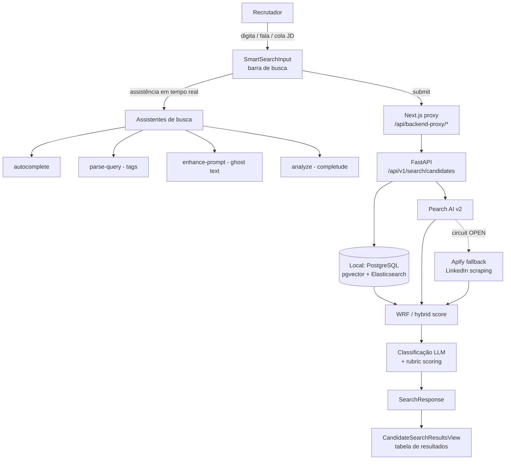
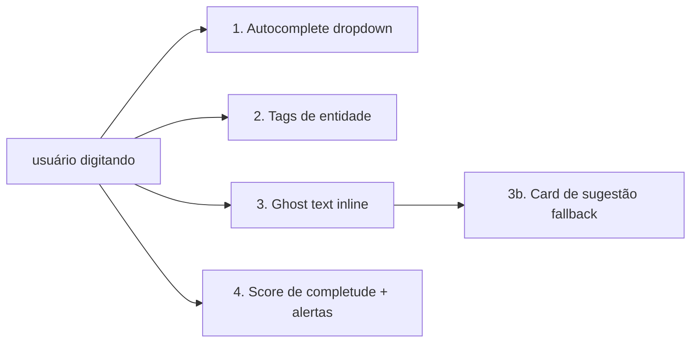
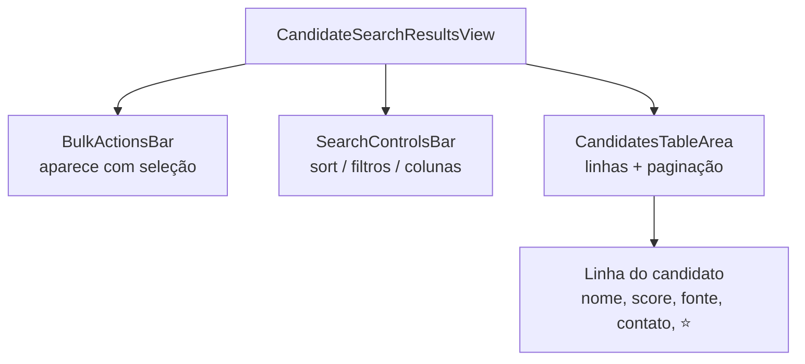

# Handoff — Funil de Talentos: Busca & Gestão de Resultados

> **Objetivo deste documento:** permitir que um time de devs **replique do zero**, em outro ambiente, toda a funcionalidade de **busca de candidatos** do Funil de Talentos e as abas de **gestão de resultados** (Histórico, Buscas Salvas, Listas, Favoritos).
>
> **Fora de escopo (por enquanto):** a aba **Banco de Talentos** (ainda em construção) — será documentada quando finalizada.
>
> **Como ler:** a **Parte A** descreve a busca como *fluxos end-to-end* (a espinha dorsal). A **Parte B** cobre as abas de gestão. A **Parte C** é material de *referência* (integrações, contratos de API, config, checklist de replicação). A tabela de resultados é documentada **uma única vez** (§5) e todos os fluxos apontam para ela.
>
> **Stack:** Next.js + React + TypeScript (`plataforma-lia`) · FastAPI + PostgreSQL/pgvector (`lia-agent-system`) · Rails (`ats_api`, sistema-de-registro legado) · Elasticsearch · Pearch AI + Apify (fontes externas) · Gemini (transcrição/classificação).

---

## Índice

**Parte A — Busca**
1. [Visão geral & arquitetura](#1-visão-geral--arquitetura)
2. [Conceitos-chave: os 2 eixos](#2-conceitos-chave-os-2-eixos)
3. [Anatomia da UI](#3-anatomia-da-ui)
4. [Os 5 fluxos de busca](#4-os-5-fluxos-de-busca)
   - [4.1 Natural](#41-fluxo-natural) · [4.2 Similar](#42-fluxo-similar) · [4.3 JD](#43-fluxo-jd-job-description) · [4.4 Boolean](#44-fluxo-boolean) · [4.5 Archetypes](#45-fluxo-archetypes)
5. [A tabela de resultados (destino comum)](#5-a-tabela-de-resultados-destino-comum)

**Parte B — Gestão de resultados**
6. [Histórico](#6-histórico) · 7. [Buscas Salvas](#7-buscas-salvas) · 8. [Listas](#8-listas) · 9. [Favoritos](#9-favoritos)

**Parte C — Referência**
10. [Fontes & escopo](#10-fontes--escopo) · 11. [Ranking & scoring](#11-ranking--scoring) · 12. [Integrações externas](#12-integrações-externas-pearch--apify) · 13. [Filtros de contato](#13-filtros-de-contato) · 14. [Contratos de API](#14-contratos-de-api) · 15. [Componentes & estado](#15-componentes--estado-frontend) · 16. [Config & env vars](#16-config--variáveis-de-ambiente) · 17. [Checklist de replicação](#17-checklist-de-replicação-em-outro-ambiente) · 18. [Gaps & pontos de atenção](#18-gaps--pontos-de-atenção)

---

# PARTE A — BUSCA

## 1. Visão geral & arquitetura

O Funil de Talentos é uma SPA React que conversa com o backend FastAPI **sempre via proxy** (`/api/backend-proxy/*` → `/api/v1/*`). O backend orquestra três fontes de dados e devolve uma lista única, rankeada e normalizada de candidatos.



**Princípios para replicação:**
- O frontend nunca chama o backend diretamente — sempre pelo proxy `/api/backend-proxy/...` (resolve CORS/cookies httpOnly).
- A busca externa (Pearch/Apify) **só dispara se explicitamente habilitada** (`search_pearch=true`). O default do lib é `false` (busca local).
- Tudo é **multi-tenant**: os candidatos retornados são sempre filtrados por `company_id` ativo (do JWT). Nunca confie em `company_id` vindo do cliente.

---

## 2. Conceitos-chave: os 2 eixos

> ⚠️ **O erro mais comum** é achar que "local/híbrida/global" são os tipos de busca. **Não são.** Existem **dois eixos ortogonais** que se combinam livremente.

### Eixo 1 — Tipo de busca (*como* você expressa a intenção)

| Tipo | O que é | Entrada |
|---|---|---|
| **Natural** | Linguagem natural, com assistência (autocomplete, tags, ghost text, voz) | Texto livre ou áudio |
| **Similar** | "Ache parecidos com este perfil/CV" via similaridade vetorial | Um candidato/CV de referência |
| **JD** | Cola uma Job Description inteira; o sistema extrai requisitos | Texto longo (a vaga) |
| **Boolean** | Operadores `AND` / `OR` / `NOT` para controle fino | Expressão booleana |
| **Archetypes** | Busca a partir de um arquétipo salvo (template de perfil) | Seleção de arquétipo |

### Eixo 2 — Fonte / escopo (*onde* procura)

| Fonte (UI) | Flags backend | Fonte de dados | Custo |
|---|---|---|---|
| **Local** | `search_local=true`, `search_pearch=false` | PostgreSQL (pgvector) + Elasticsearch internos | Grátis |
| **Híbrida** | `search_local=true`, `search_pearch=true` | Local **+** Pearch, fundidos via WRF | Créditos Pearch + enrich |
| **Global** | `search_local=false`, `search_pearch=true` | Só Pearch (Apify como fallback) | Créditos Pearch + enrich |

### A matriz (qualquer tipo × qualquer fonte)

|  | Local | Híbrida | Global |
|---|---|---|---|
| **Natural** | ✅ | ✅ | ✅ |
| **Similar** | ✅ | ✅ | ✅ |
| **JD** | ✅ | ✅ | ✅ |
| **Boolean** | ✅ | ✅ | ✅ |
| **Archetypes** | ✅ | ✅ | ✅ |

O **tipo** define qual endpoint/preparo de query roda; a **fonte** define quais flags (`search_local`/`search_pearch`) vão no payload. Os dois são escolhidos independentemente na UI antes do submit.

---

## 3. Anatomia da UI

Componente raiz canônico: `plataforma-lia/src/components/pages/candidates-page.tsx` (719 linhas — **única implementação válida**; não criar alternativas). Orquestrado por `useCandidatesPageCore` + `CandidatesPageHeader` + `CandidatesPageModals` + `CandidateSearchResultsView` + a barra de busca (`SmartSearchInput`).

### 3.1 As 6 abas do Funil

| Aba | Componente | Status |
|---|---|---|
| **Busca / Resultados** | `CandidateSearchResultsView` | ✅ documentada (§4, §5) |
| **Histórico** | `talent-funnel-tabs/history-tab.tsx` | ✅ §6 |
| **Buscas Salvas** | `talent-funnel-tabs/saved-searches-tab.tsx` | ✅ §7 |
| **Listas** | `talent-funnel-tabs/lists-tab.tsx` | ✅ §8 |
| **Favoritos** | `talent-funnel-tabs/favorites-tab.tsx` | ✅ §9 |
| **Banco de Talentos** | — | ⛔ fora de escopo (em construção) |

### 3.2 A barra de busca (`SmartSearchInput` / `SSIModeNatural`)

Arquivo: `plataforma-lia/src/components/search/ssi-modes/SSIModeNatural.tsx`.

| Controle | Ação | Localização |
|---|---|---|
| **Abas de tipo** | Natural · Similar · JD · Boolean · Archetypes | seletor de modo |
| **Seletor de fonte** | 🏠 Home (Local) · ⚡ Zap (Híbrida) · 🌐 Globe (Global) | `SSIModeNatural.tsx:115-189` — trocar p/ Híbrida/Global abre modal de confirmação de custo |
| **Filtro Email** | ✉️ exige email (`require_emails`) | `:191-243` |
| **Filtro Telefone** | ☎️ exige telefone (`require_phone_numbers`) | `:191-243` |
| **Microfone** 🎤 | grava áudio e transcreve (Gemini) | `AudioRecordButton` (ver §4.1) |
| **Buscar** 🔍 | dispara a busca | — |

A troca de fonte para Híbrida/Global passa por `confirmSourceChange` (`useCandidatesSearch.ts:193`); ligar filtros de contato passa por `handleContactFilterChange` (`:220`), que abre modal de custo de enriquecimento.

---

## 4. Os 5 fluxos de busca

Todos os 5 tipos seguem o **mesmo template de fluxo** (facilita a replicação):

```
1. O que é / quando usar (regra de negócio)
2. Gatilho na UI (qual aba/controle ativa)
3. Entrada (métodos de input)
4. Assistência em tempo real (quando aplicável)
5. Submit (o que é montado no payload)
6. Backend (endpoint, processamento, fontes)
7. Ranking/scoring aplicado
8. → Tabela de resultados (§5) + o que é específico
9. Regras de negócio & edge cases
```

### 4.1 Fluxo Natural

**1. O que é:** busca por linguagem natural ("devs frontend sênior em SP, remoto, React"), com toda a camada de assistência por IA. É o modo default e o mais usado.

**2. Gatilho:** aba **Natural** (default) na barra de busca.

**3. Entrada:** três métodos —
- **Texto** no `textarea`.
- **🎤 Voz** → `AudioRecordButton` (`plataforma-lia/src/components/ui/audio-record-button.tsx`): grava, envia via `transcribeAudio` (`:181`) para o proxy `/api/backend-proxy/transcribe/audio` (`:59`) → backend `POST /api/v1/voice/transcribe` (`lia-agent-system/app/api/v1/voice.py:70`), **provider Google Gemini `gemini-2.5-flash`**. O texto transcrito é inserido no `textarea`.

**4. Assistência em tempo real** — **4 elementos distintos** abaixo/dentro do prompt:



| # | Elemento | Componente (linha) | Fonte de dados |
|---|---|---|---|
| 1 | **Autocomplete** (dropdown com categorias: cargo, skill, local…) | `SSIModeNatural.tsx:315-426` | `GET /api/backend-proxy/search/autocomplete` → backend `search_assistant.py:494` (`get_predictive_suggestions`); templates + taxonomias. Debounce ~400ms, mín. 2 chars na última palavra |
| 2 | **Tags de entidade** (chips abaixo do input: localização, cargo, skills, experiência) | `SSIModeNatural.tsx:429-472` | `POST /api/backend-proxy/search/parse-query` → regex em `jd_search.py:304` (`parse_search_query`) |
| 3 | **Ghost text** (sufixo cinza inline; **Tab** aceita) | `SSIModeNatural.tsx:79-88` | `POST /api/backend-proxy/search/enhance-prompt` (mostra se confiança > 0.6) |
| 3b | **Card "Sugestão"** (fallback quando o ghost text não casa com o prefixo) | `SSIModeNatural.tsx:288-313` | mesmo endpoint `enhance-prompt` |
| 4 | **Score de completude + alertas** | via `analyze` | `POST /api/backend-proxy/search-assistant/analyze` → 5 critérios: cargo, localização, anos de experiência, skills, indústria |

**5. Submit:** monta `SearchRequest` com `query` (texto natural) + `search_spec` (entidades extraídas) + flags de fonte + flags de contato. Ver payload completo em §14.

**6. Backend:** `POST /api/v1/search/candidates` (`search.py:105`). Gera `search_fingerprint` (hash estável de query+spec, ignora chaves utilitárias) → busca multi-fonte → enriquece → rankeia.

**7. Ranking:** pgvector cosine + hybrid score; se Híbrida/Global, fusão WRF; se houver `job_id`, rubric scoring. Ver §11.

**8. → Tabela de resultados (§5).** Específico do Natural: as tags de entidade alimentam o `search_spec` que aparece como filtros aplicados.

**9. Edge cases:** query < 5 chars não dispara parse; autocomplete só na última palavra; transcrição falha → mantém texto digitado.

### 4.2 Fluxo Similar

**1. O que é:** "encontre candidatos parecidos com este" — similaridade vetorial pura a partir de um perfil/CV de referência.

**2. Gatilho:** aba **Similar** (ou ação "Buscar similares" em um candidato).

**3. Entrada:** um candidato de referência (id) ou um CV.

**5–6. Submit/Backend:** `POST /api/backend-proxy/search/candidates/similar` → `similar_search.py`. Usa embedding do perfil de referência e faz nearest-neighbor por cosine no pgvector.

**7. Ranking:** distância vetorial (`1 - (embedding <=> :embedding::vector)`); opcional post-filter LLM.

**8. → Tabela de resultados (§5).** Específico: coluna de similaridade em vez de match-score de vaga.

### 4.3 Fluxo JD (Job Description)

**1. O que é:** cola-se uma vaga inteira; o sistema extrai requisitos e busca/ranqueia contra eles.

**2. Gatilho:** aba **JD**.

**3. Entrada:** texto longo da JD (ou `job_id` existente).

**5–6. Submit/Backend:** `POST /api/backend-proxy/search/candidates/by-job-description`. Extrai requisitos (essential/important/nice-to-have) e busca.

**7. Ranking:** quando há `job_id`/JD, aplica **rubric scoring** (§11): cada candidato é avaliado por requisito com `RubricEvaluationService`.

**8. → Tabela de resultados (§5).** Específico: coluna **Match Score** (0–99) + `match_summary` por candidato.

### 4.4 Fluxo Boolean

**1. O que é:** controle fino com operadores `AND`/`OR`/`NOT` (ex.: `(React OR Vue) AND TypeScript NOT estágio`).

**2. Gatilho:** aba **Boolean**.

**3. Entrada:** expressão booleana.

**5–6. Submit/Backend:** vai pelo mesmo `POST /api/v1/search/candidates`, com a expressão interpretada na camada de query (full-text/Elasticsearch para o termo lógico).

**7. Ranking:** combina match textual (BM25/text score) com hybrid score.

**8. → Tabela de resultados (§5).**

### 4.5 Fluxo Archetypes

**1. O que é:** busca a partir de um **arquétipo** salvo (template de perfil reutilizável).

**2. Gatilho:** aba **Archetypes** → seleciona um arquétipo.

**5–6. Submit/Backend:** `POST /api/backend-proxy/search/archetypes/{id}/search` — o arquétipo carrega query+spec pré-definidos e executa como uma busca normal.

**8. → Tabela de resultados (§5).**

---

## 5. A tabela de resultados (destino comum)

> **Todos os 5 fluxos terminam aqui.** É o **mesmo componente** (`CandidateSearchResultsView`) para qualquer tipo/fonte de busca. Replique uma vez só.

Arquivo: `plataforma-lia/src/components/.../CandidateSearchResultsView.tsx`.

### 5.1 Estrutura



### 5.2 Bulk actions (barra que aparece ao selecionar candidatos)

`onAddToVacancy` · `onAddToList` (Importar p/ lista) · `onShare` · `onBulkEmail` · `onWSIScreening` · `onToggleFavoriteBatch` · `onHide` (ocultar) · **Save to Base** (persistir contatos revelados na base local via `POST /candidates/persist-revealed`).

### 5.3 Controles (SearchControlsBar)

- **Sort:** Match Score · Mais recentes · etc.
- **Filtros de tabela:** toggle.
- **Config de colunas.**
- **Paginação:** em `CandidatesTableArea`.

### 5.4 Por linha

Nome, título/empresa atual, **badge de fonte** (Local/Pearch), **score** (match de vaga ou similaridade), status de contato (email/telefone revelado ou bloqueado), **⭐ favoritar** (§9), ação "adicionar à lista" (§8).

### 5.5 Candidatos descartados

Candidatos filtrados por falta de email/telefone (quando `require_*` ligado) **não somem silenciosamente** — são persistidos em `candidate_searches.discarded_candidates` (JSONB) e acessíveis via `GET /api/backend-proxy/search/{search_id}/discarded`. A UI mostra contagem de descartados (ícone ⚠️ no Histórico, §6).

### 5.6 Mapeamento de candidato

`useCandidatesExecuteSearch.ts` → `mapCandidateToInternal` normaliza o `CandidateSearchResultDTO` (vindo de Local, Pearch ou Apify) para o modelo interno único renderizado pela tabela. **Toda fonte converge nesse mapper** — replicar esse contrato é essencial para a tabela funcionar igual.

---

# PARTE B — GESTÃO DE RESULTADOS

> ⚠️ **Atenção crítica de replicação:** **Histórico** e **Buscas Salvas** hoje são **client-side** (Zustand + `localStorage`, store `lia-talent-funnel-store`). **Não persistem no backend.** Já **Listas** e **Favoritos** persistem no backend. São dois mecanismos diferentes — não assuma uniformidade. (Migrar Histórico/Buscas Salvas para o backend é a próxima tarefa planejada — ver §18.)

## 6. Histórico

**Componente:** `talent-funnel-tabs/history-tab.tsx`. **Estado:** `useTalentFunnel` (`hooks/candidates/use-talent-funnel.ts`) + store Zustand `lia-talent-funnel-store` (limite `MAX_HISTORY_ITEMS = 100`).

**Dado por entrada (`SearchHistoryItem`):** `query`, `mode` (natural/similar/jd/boolean/archetypes), `source` (local/global/hybrid), timestamp (relativo: "Hoje", "Ontem"), **result count**, **discarded count**, **searchId** (UUID de `candidate_searches`), **fingerprint**.

**Ações:** re-executar (clicar no card → `onReExecuteSearch`) · excluir (🗑️) · salvar (🔖 abre modal → vira Busca Salva) · ver descartados (👤❌ toggle) · **Limpar Tudo**.

**Persistência backend (log, não a lista):** toda execução grava em `candidate_searches` via `CandidateRepository.record_search`. A *lista* do histórico vive no navegador. Endpoints relacionados:
- `GET /api/backend-proxy/search/{search_id}/discarded` — candidatos descartados.
- `GET /api/backend-proxy/candidates/search/snapshot?fingerprint={fp}` — **rehidrata resultados sem gastar créditos** (reaproveita busca anterior pelo fingerprint).

**Multi-tenancy:** `candidate_searches` é **RLS-EXEMPT** (guarda metadado de UX por usuário, não dado de tenant); acesso restrito por `user_id`. Os candidatos apontados continuam filtrados por `company_id`.

## 7. Buscas Salvas

**Componente:** `talent-funnel-tabs/saved-searches-tab.tsx`. **Gatilho de salvar:** botão "Salvar" (🔖) no `CandidatesPageHeader` (`:71-81`, só aparece com busca ativa) ou modal "Nova Busca Salva" na própria aba (`:423-533`).

**Schema (`SavedSearch`, `stores/talent-funnel-store.ts:24-40`):** `id`, `name`, `description`, `query`, `mode`, `source`, `filters`, `entities`, `metadata`, `usageCount`, `isFavorite` (pin), `avgResults`, `lastUsed`, `createdAt`, `updatedAt`.

**Ações:** salvar · editar/renomear · **executar** (`SearchCard` → "Executar") · excluir (com confirmação) · favoritar (estrela = pin no topo).

**⚠️ Não há alertas/agendamento** (sem cron, sem notificação) — apenas re-execução manual. **Persistência: client-side** (Zustand `persist`, chave `lia-talent-funnel-store`); limite 100. **Não há tabela própria no backend** hoje.

## 8. Listas

Coleções **nomeadas e colaborativas** de candidatos (com cor e descrição). Persistem no backend — **dual** (Python + Rails).

**Componente:** `talent-funnel-tabs/lists-tab.tsx` (hook `useListsTab`). **Como adicionar candidatos:** bulk action "List" na tabela de resultados (`CandidateSearchResultsView.tsx:315` → `onAddToList` → `handleAddToList`) ou botão individual "UserPlus" no `ListCard`.

**Operações (lib `services/lia-api/misc-api.ts`):** criar (`createCandidateList`) · editar (`updateCandidateList`) · excluir (soft delete, `deleteCandidateList`) · adicionar/remover membros (`addCandidatesToList:193` / `removeCandidatesFromList:203`) · **compartilhar** (`ShareSearchModal` — gera registro `shared_search`, envia por email/WhatsApp) · **assign-to-jobs** (`assignListToJobs:213` — vincula membros a múltiplas vagas).

**Endpoints (FastAPI):** `GET /candidate-lists` · `POST /candidate-lists` `{name, description, color}` · `PATCH /candidate-lists/{id}` · `POST /candidate-lists/{id}/candidates` `{candidate_ids, notes}` (dedup `on_conflict_do_nothing`) · `POST /candidate-lists/{id}/assign-jobs` `{job_vacancy_ids, candidate_ids?}`.

**Schema:**
- **FastAPI:** `candidate_lists` (`id`, `name`, `description`, `color`, `company_id`, `is_active`) + join `candidate_list_members` (`list_id`, `candidate_id`, `added_by`, `added_at`).
- **Rails (espelho):** `lists` (`id`, `name`, `description`, `color`, `account_id`, `user_id`) + `list_relationships` (polimórfico: `reference_type`, `reference_id`, `list_id`).

**Regras:** scoping por `company_id`/`account_id`; permissões via Pundit (Rails) e `require_company_id`+`get_current_user_or_demo` (FastAPI); adicionar um `SourcedProfile` (perfil externo) a uma lista dispara `ConvertToCandidateJob` para materializá-lo na base local.

## 9. Favoritos

"Bookmarks" pessoais — **por recrutador (user)**, dentro do tenant.

**Componente:** `talent-funnel-tabs/favorites-tab.tsx`. **Como favoritar:** ⭐ na linha da tabela (`handleFavoriteClick` → abre modal de nota opcional) ou bulk (`onToggleFavoriteBatch` → itera ids → `toggleFavoriteCandidate`).

**Endpoints (FastAPI, `candidates/candidates_metadata.py`):** `POST /v1/candidates/{id}/favorite` (toggle) · `PUT /v1/candidates/{id}/favorite` (atualiza `note`/`is_pinned`) · `GET /v1/candidates/favorites/list`. Request `FavoriteCreate`: `{note, is_pinned, source}`.

**Schema:**
- **FastAPI:** `candidate_favorites` (`id`, `candidate_id`, `user_id`, `company_id`, `note`, `is_pinned`); **`UniqueConstraint(candidate_id, user_id)`**.
- **Rails (espelho):** coluna array `favorite_user_ids` na tabela `candidates` (indexada no Elasticsearch → permite filtro "Meus Favoritos").

**Favoritos × Listas:** favorito = flag plana por usuário (+ pin + nota), pessoal; lista = coleção nomeada, compartilhável, many-to-many no nível do tenant.

---

# PARTE C — REFERÊNCIA

## 10. Fontes & escopo

| Fonte | Quando | Como ligar | Custo |
|---|---|---|---|
| **Local** | default | `search_local=true`, `search_pearch=false` | grátis |
| **Híbrida** | enriquecer com externo | `search_local=true`, `search_pearch=true` | créditos + enrich |
| **Global** | só externo | `search_local=false`, `search_pearch=true` | créditos + enrich |

A troca para Híbrida/Global **abre modal de confirmação de custo** (`AlertDialog` em `SmartSearchInput.tsx:353` → `confirmSourceChange`). O front mapeia `searchSource: 'local' | 'hybrid' | 'global'` (`useCandidatesSearch.ts:45`) para os booleans do payload.

## 11. Ranking & scoring

1. **Similaridade vetorial (pgvector):** `1 - (embedding <=> :embedding::vector)` (cosine) — `hybrid_search_service.py:173,256`.
2. **Hybrid score:** `alpha * vector_score + (1-alpha) * text_score` — `hybrid_search_service.py:87-89`.
3. **WRF (Weighted Reciprocal Fusion) — funde múltiplas fontes:** `score = Σ [ weight_i / (k + rank_i) ]`, `k=60` default e **dinâmico por confiança** — `wrf_dynamic_k_service.py`. Alta confiança → peso semântico 0.65; baixa → peso textual 0.70.
4. **Classificação de vaga por LLM (post-filter):** `LLMJobClassificationService` (`llm_job_classification_service.py`) usa **Gemini Flash** para marcar `COMPATIBLE`/`INCOMPATIBLE` por título/área/experiência; fallback heurístico por `INCOMPATIBLE_AREAS` (ex.: Saúde × Tecnologia).
5. **Rubric scoring (quando há `job_id`/JD):** `Exceeds=95`, `Meets=75`, `Partial=40`, `Missing=0`; pesos `Essential=3×`, `Important=2×`, `Nice-to-have=1×`. Fórmula: `Score = Σ(peso×pontos) / Σ(peso×95) × 100`, cap 99.

## 12. Integrações externas (Pearch + Apify)

### 12.1 Pearch AI (fonte global primária)

- **Serviço:** `PearchService` (`app/domains/sourcing/services/pearch_service.py`). **Endpoint:** `POST https://api.pearch.ai/v2/search`. **Auth:** Bearer `PEARCH_API_KEY` (`:153`).
- **Request (`PearchSearchRequest`):** `query`, `type` ("fast"), `insights`, `high_freshness`, `profile_scoring`, `strict_filters`, `require_emails`, `show_emails`, `limit` (1–1000), `custom_filters` (location/title/industries), `docid_blacklist`.
- **Response (`PearchSearchResponse`):** `uuid`, `thread_id`, `status`, `total_estimate`, `search_results[]` (cada um com `CandidateProfile`). Mapeado para `CandidateProfile` (`libs/models/lia_models/pearch.py`) → `CandidateSearchResultDTO`.
- **Créditos:** `fast=1`, `+insights=1`, `+profile_scoring=1`, `+high_freshness=2`. Tracking: `ConsumptionTrackingService.record_pearch_consumption` (`:558`).
- **Circuit breaker:** `failure_threshold=3`, `recovery_timeout=15s`. Timeout `HTTP_TIMEOUT_PEARCH_SECONDS` (~30–60s).
- **Dedup:** `_dedup_pearch_against_local` (`:1218`) remove resultado Pearch cujo `linkedin_url` já existe local.
- **Suppression:** `get_suppression_docids` envia até 500 docids já conhecidos em `docid_blacklist` (economiza créditos).

### 12.2 Apify (fallback de scraping LinkedIn)

> **LinkedIn não é uma fonte selecionável na UI.** Apify só entra como **fallback** quando o circuito da Pearch está **OPEN** e `APIFY_SEARCH_FALLBACK_ENABLED=true` (`search.py:160`).

- **Serviços:** `ApifyService`, `ApifySearchService`, `ApifyMCPClient` (via `mcp.apify.com`), mapper `ApifyProfileMapper`. **Auth:** Bearer `APIFY_API_KEY`.
- **Actors:** busca `curious_coder/linkedin-search`; scrape de perfil `dev_fusion/Linkedin-Profile-Scraper`; email `curious_coder/email-finder`.
- **Request (busca):** `{"searchTerms": ["query"], "maxResults": 15, "location": "..."}`. Response: JSON cru normalizado pelo `ApifyProfileMapper`.
- **Custos:** search `$0.02`, scrape `$0.01`, email `$0.01`. Tracking: `ConsumptionTrackingService.record_apify_search_call`. **Timeouts:** search 120s, scrape 30s, email 15s. **Circuit:** `failure_threshold=3`, `recovery_timeout=60s`.
- **Enrichment on-demand:** `ApifyService.enrich_candidate_profile` busca email/dados detalhados para um perfil específico (Pearch ou local).

## 13. Filtros de contato

- Flags `require_emails` / `require_phone_numbers` no `SearchRequestDTO` (`_shared.py:491-492`). Ligar na UI abre modal de custo de enriquecimento.
- Filtro aplicado no backend (`search.py:361`, via `getattr(c, "has_email", False)`); quem não tem vai para **descartados** (§5.5).
- **Validação:** `POST /api/backend-proxy/search/validate-contacts` (`candidate_search/validation.py`, `ContactValidationService`): verifica **MX record** (email) e **E.164** (telefone).

## 14. Contratos de API

**Rota de submit principal:** front `POST /api/backend-proxy/search/candidates` (`lib/api/candidate-search.ts:225`, `searchCandidates` / alias `searchCandidatesHybrid`) → backend `POST /api/v1/search/candidates` (`candidate_search/search.py:105`; router com prefixo `/search` em `candidate_search/__init__.py:24`, registrado sob `/api/v1` em `api/routes.py:304`).

### 14.1 Payload (`SearchRequestDTO` — `_shared.py:470`)

```jsonc
{
  "query": "devs frontend sênior em SP, remoto",   // linguagem natural (obrigatório)
  "thread_id": null,                                 // refinamento (opcional)
  "search_spec": { "location": "...", "skills": [] },// entidades extraídas (opcional)
  "search_local": true,                              // fonte
  "search_pearch": false,                            // fonte (default false no lib!)
  "pearch_type": "fast",
  "local_limit": 20,                                 // 1–100
  "pearch_limit": 15,                                // 0–50
  "show_emails": false,
  "show_phone_numbers": false,
  "high_freshness": false,                           // +2 créditos
  "require_emails": false,
  "require_phone_numbers": false,
  "job_vacancy_id": null,
  "exclude_candidate_ids": [],
  "include_discovered": true,
  "job_id": null                                     // se presente → rubric scoring
}
```

### 14.2 Tabela de endpoints (proxy → backend)

| Função | Proxy (front) | Backend |
|---|---|---|
| Busca principal | `POST /api/backend-proxy/search/candidates` | `POST /api/v1/search/candidates` |
| Parse de query | `POST /api/backend-proxy/search/parse-query` | `parse_search_query` (`jd_search.py:304`) |
| Autocomplete | `GET /api/backend-proxy/search/autocomplete` | `get_predictive_suggestions` (`search_assistant.py:494`) |
| Análise/completude | `POST /api/backend-proxy/search-assistant/analyze` | `search_assistant.py:345` |
| Enhance prompt (ghost) | `POST /api/backend-proxy/search/enhance-prompt` | enhance-prompt |
| Busca similar | `POST /api/backend-proxy/search/candidates/similar` | `similar_search.py` |
| Busca por JD | `POST /api/backend-proxy/search/candidates/by-job-description` | jd_search |
| Busca por arquétipo | `POST /api/backend-proxy/search/archetypes/{id}/search` | archetypes |
| Transcrição (voz) | `POST /api/backend-proxy/transcribe/audio` | `POST /api/v1/voice/transcribe` (`voice.py:70`, Gemini) |
| Descartados | `GET /api/backend-proxy/search/{search_id}/discarded` | discarded |
| Snapshot (rehidratar) | `GET /api/backend-proxy/candidates/search/snapshot?fingerprint=` | snapshot |
| Validar contatos | `POST /api/backend-proxy/search/validate-contacts` | `validation.py` |
| Persistir revelados | `POST /api/backend-proxy/candidates/persist-revealed` | `contact_persistence.py` |
| Listas | `.../candidate-lists*` | `candidate_lists` |
| Favoritos | `.../v1/candidates/{id}/favorite`, `.../favorites/list` | `candidates_metadata.py:156` |

## 15. Componentes & estado (frontend)

| Hook / store | Responsabilidade |
|---|---|
| `useCandidatesPageCore` | orquestrador (aba ativa, modais, handlers de bulk) |
| `useCandidatesSearchState` | resultados, contagens, créditos, metadata da busca |
| `useCandidatesViewState` | candidato selecionado, sort, paginação |
| `useCandidatesExecuteSearch` | execução da API + `mapCandidateToInternal` |
| `useSmartSearchCore` | estado interno da barra (parsing, autocomplete, enhancement) |
| `useTalentFunnel` | abas Histórico/Buscas Salvas/Listas/Favoritos |
| `candidates-store.ts` (Zustand) | array de candidatos + loading |
| `talent-funnel-store.ts` (Zustand `persist`) | Histórico + Buscas Salvas (**localStorage**) |

## 16. Config & variáveis de ambiente

| Var / flag | Para quê |
|---|---|
| `PEARCH_API_KEY` | auth Pearch |
| `APIFY_API_KEY` | auth Apify |
| `APIFY_SEARCH_FALLBACK_ENABLED` | habilita fallback Apify quando Pearch circuit OPEN |
| `HTTP_TIMEOUT_PEARCH_SECONDS` | timeout Pearch (~30–60s) |
| (Gemini via integração) | transcrição de voz + classificação de vaga |
| (Elasticsearch URL) | índice full-text local |
| (PostgreSQL + extensão `pgvector`) | embeddings + busca semântica |

## 17. Checklist de replicação em outro ambiente

1. **PostgreSQL + `pgvector`** habilitado; colunas de embedding nas tabelas de candidato.
2. **Elasticsearch** provisionado e índice de candidatos populado (full-text + campo `favorite_user_ids`).
3. **Migrations** aplicadas: `candidate_searches` (+ `discarded_candidates` JSONB), `candidate_lists` + `candidate_list_members`, `candidate_favorites`, e o array `favorite_user_ids` (Rails).
4. **Secrets:** `PEARCH_API_KEY`, `APIFY_API_KEY`, integração Gemini. Definir `APIFY_SEARCH_FALLBACK_ENABLED` conforme política.
5. **Proxy Next.js** `/api/backend-proxy/*` → `/api/v1/*` configurado (com repasse de cookies httpOnly).
6. **Backend:** subir FastAPI com os routers de `candidate_search`, `search_assistant`, `voice`, `candidate_lists`, `candidates_metadata`.
7. **Frontend:** garantir `candidates-page.tsx` como entry único + os hooks/stores da §15.
8. **Tenancy:** confirmar que `company_id` vem do JWT e filtra todos os resultados; `candidate_searches` permanece RLS-EXEMPT (per-user).
9. **Validar fluxos:** rodar cada um dos 5 tipos em Local; depois Híbrida/Global com créditos de teste.
10. **Smoke de voz:** gravar áudio → `voice/transcribe` retorna texto (Gemini).

## 18. Gaps & pontos de atenção

- 🔴 **Histórico e Buscas Salvas são client-side** (`localStorage`): não sincronizam entre dispositivos/usuários, somem ao limpar o navegador, limite 100. **→ Próxima tarefa: migrar para persistência no backend.**
- 🟡 **Buscas Salvas sem alertas/agendamento** — só re-execução manual (oportunidade de produto).
- 🟡 **Persistência dupla (Rails + Python)** para Listas/Favoritos — risco de divergência; definir a fonte-da-verdade ao replicar.
- 🟡 **`search_pearch` default `false`** no lib (`candidate-search.ts:234`) — Híbrida/Global precisam ligar explicitamente, senão a busca vira Local silenciosamente.
- 🟡 **Tamanho da base Pearch inconsistente:** UI afirma **800M+** (`SSIModeNatural.tsx:185-186`), log de health do backend cita **190M+** (`candidates_search.py:216`). Alinhar a fonte do número.
- 🟢 **LinkedIn ≠ fonte selecionável:** é Apify por baixo, só como fallback de circuit breaker. Não exponha como fonte independente sem revisar.
- 🟢 **`candidate_searches` é RLS-EXEMPT** (metadado per-user) — intencional, mas confirme que os candidatos apontados continuam guardados por `company_id`.

---

*Documento de handoff — escopo: tipos de busca + abas de gestão (Histórico, Buscas Salvas, Listas, Favoritos). Banco de Talentos será adicionado quando finalizado.*
