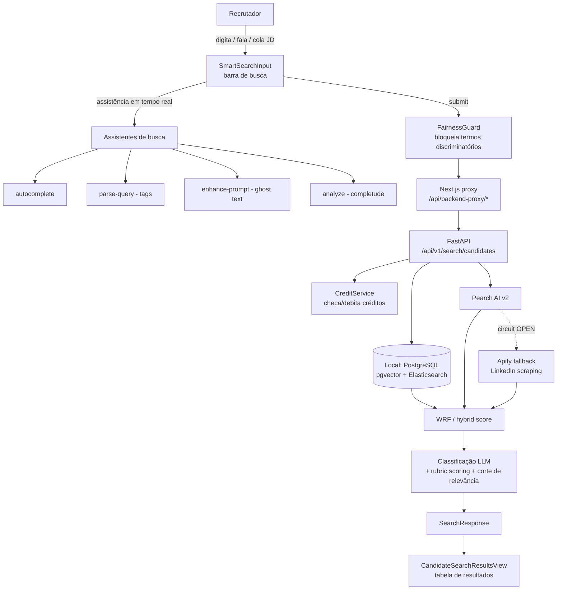
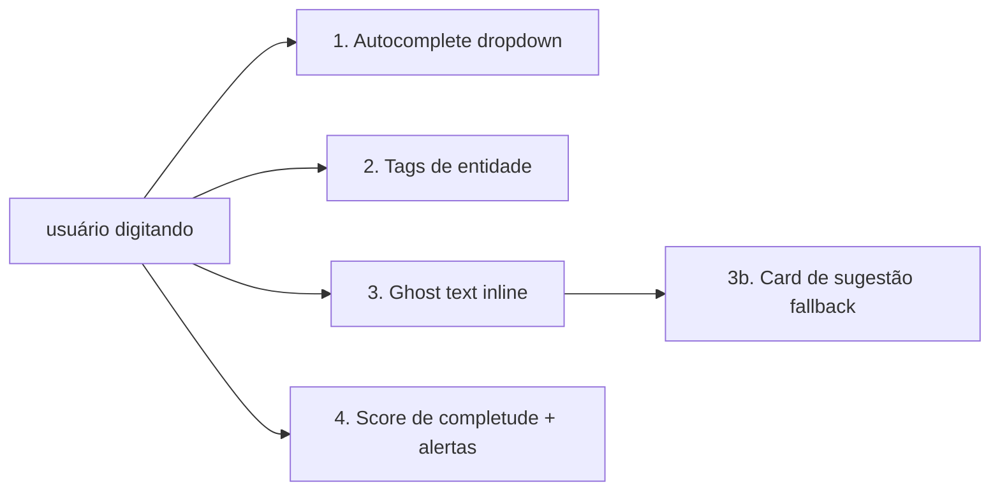
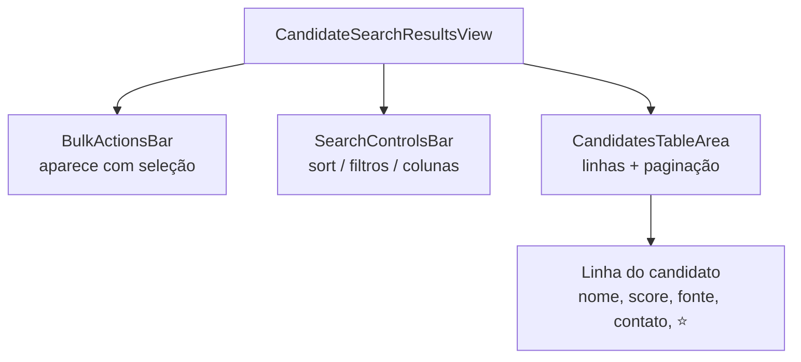
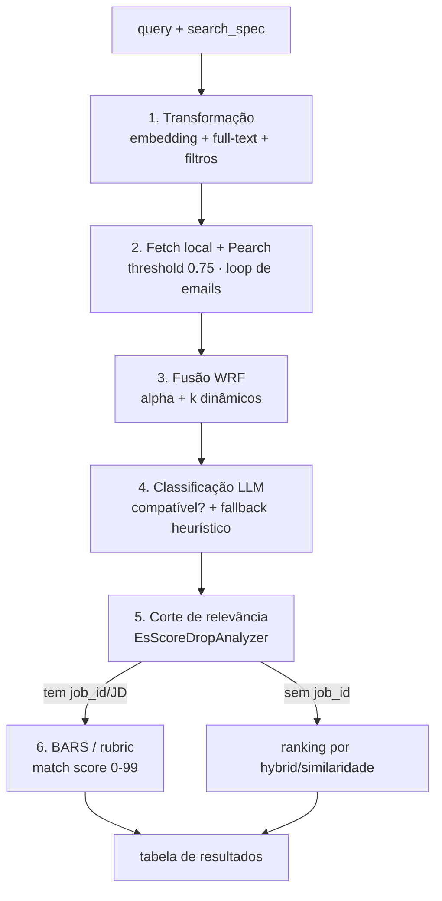

# Handoff — Funil de Talentos: Busca & Gestão de Resultados

> **Objetivo deste documento:** permitir que um time de devs **replique do zero**, em outro ambiente, toda a funcionalidade de **busca de candidatos** do Funil de Talentos e as abas de **gestão de resultados** (Histórico, Buscas Salvas, Listas, Favoritos).
>
> **Fora de escopo (por enquanto):** a aba **Banco de Talentos** (ainda em construção) — será documentada quando finalizada.
>
> **Como ler:** a **Parte A** descreve a busca como *fluxos end-to-end* (a espinha dorsal). A **Parte B** cobre as abas de gestão. A **Parte C** é material de *referência* (integrações, contratos de API, config, checklist de replicação). Cada funcionalidade traz um bloco **📋 Regras de negócio** explicando *o que* é imposto e *por quê*; o **§17** consolida tudo num quadro-resumo. A tabela de resultados é documentada **uma única vez** (§5).
>
> **Stack:** Next.js + React + TypeScript (`plataforma-lia`) · FastAPI + PostgreSQL/pgvector (`lia-agent-system`) · Rails (`ats_api`, sistema-de-registro legado) · Elasticsearch · Pearch AI + Apify (fontes externas) · Gemini (transcrição/classificação).

---

## Índice

**Parte A — Busca**
1. [Visão geral & arquitetura](#1-visão-geral--arquitetura)
2. [Conceitos-chave: os 2 eixos](#2-conceitos-chave-os-2-eixos)
3. [Anatomia da UI](#3-anatomia-da-ui)
4. [Os 5 fluxos de busca](#4-os-5-fluxos-de-busca)
   - [4.1 Natural](#41-fluxo-natural) · [4.2 Similar](#42-fluxo-similar) · [4.3 JD](#43-fluxo-jd-job-description) · [4.4 Boolean](#44-fluxo-boolean) · [4.5 Archetypes](#45-fluxo-archetypes)
   - [4.5.1 📊 Tabela-resumo: os 5 modos comparados](#451--tabela-resumo-os-5-modos-de-busca-comparados)
   - [4.6 📋 Regras de negócio da busca (valem para os 5 fluxos)](#46--regras-de-negócio-da-busca-valem-para-os-5-fluxos)
5. [A tabela de resultados (destino comum)](#5-a-tabela-de-resultados-destino-comum)

**Parte B — Gestão de resultados**
6. [Histórico](#6-histórico) · 7. [Buscas Salvas](#7-buscas-salvas) · 8. [Listas](#8-listas) · 9. [Favoritos](#9-favoritos)

**Parte C — Referência**
10. [Fontes & escopo](#10-fontes--escopo) · 11. [Ranking & scoring](#11-ranking--scoring) · 12. [Integrações externas](#12-integrações-externas-pearch--apify) · 13. [Filtros de contato](#13-filtros-de-contato) · 14. [Contratos de API](#14-contratos-de-api) · 15. [Componentes & estado](#15-componentes--estado-frontend) · 16. [Config & env vars](#16-config--variáveis-de-ambiente) · 17. [📋 Quadro-resumo de regras de negócio](#17--quadro-resumo-de-regras-de-negócio) · 18. [Checklist de replicação](#18-checklist-de-replicação-em-outro-ambiente) · 19. [Gaps & pontos de atenção](#19-gaps--pontos-de-atenção)

---

# PARTE A — BUSCA

## 1. Visão geral & arquitetura

O Funil de Talentos é uma SPA React que conversa com o backend FastAPI **sempre via proxy** (`/api/backend-proxy/*` → `/api/v1/*`). O backend orquestra três fontes de dados e devolve uma lista única, rankeada e normalizada de candidatos.



**Princípios para replicação:**
- O frontend nunca chama o backend diretamente — sempre pelo proxy `/api/backend-proxy/...` (resolve CORS/cookies httpOnly).
- A busca externa (Pearch/Apify) **só dispara se explicitamente habilitada** (`search_pearch=true`). O default do lib é `false` (busca local).
- Tudo é **multi-tenant**: os candidatos retornados são sempre filtrados por `company_id` ativo (do JWT). Nunca confie em `company_id` vindo do cliente.

---

## 2. Conceitos-chave: os 2 eixos

> ⚠️ **O erro mais comum** é achar que "local/híbrida/global" são os tipos de busca. **Não são.** Existem **dois eixos ortogonais** que se combinam livremente.

### Eixo 1 — Tipo de busca (*como* você expressa a intenção)

| Tipo | O que é | Entrada |
|---|---|---|
| **Natural** | Linguagem natural, com assistência (autocomplete, tags, ghost text, voz) | Texto livre ou áudio |
| **Similar** | "Ache parecidos com este perfil/CV" via similaridade vetorial | Um candidato/CV de referência |
| **JD** | Cola uma Job Description inteira; o sistema extrai requisitos | Texto longo (a vaga) |
| **Boolean** | Operadores `AND` / `OR` / `NOT` para controle fino | Expressão booleana |
| **Archetypes** | Busca a partir de um arquétipo salvo (template de perfil) | Seleção de arquétipo |

### Eixo 2 — Fonte / escopo (*onde* procura)

| Fonte (UI) | Flags backend | Fonte de dados | Custo |
|---|---|---|---|
| **Local** | `search_local=true`, `search_pearch=false` | PostgreSQL (pgvector) + Elasticsearch internos | Grátis |
| **Híbrida** | `search_local=true`, `search_pearch=true` | Local **+** Pearch, fundidos via WRF | Créditos Pearch + enrich |
| **Global** | `search_local=false`, `search_pearch=true` | Só Pearch (Apify como fallback) | Créditos Pearch + enrich |

### A matriz (qualquer tipo × qualquer fonte)

|  | Local | Híbrida | Global |
|---|---|---|---|
| **Natural** | ✅ | ✅ | ✅ |
| **Similar** | ✅ | ✅ | ✅ |
| **JD** | ✅ | ✅ | ✅ |
| **Boolean** | ✅ | ✅ | ✅ |
| **Archetypes** | ✅ | ✅ | ✅ |

O **tipo** define qual endpoint/preparo de query roda; a **fonte** define quais flags (`search_local`/`search_pearch`) vão no payload. Os dois são escolhidos independentemente na UI antes do submit.

---

## 3. Anatomia da UI

Componente raiz canônico: `plataforma-lia/src/components/pages/candidates-page.tsx` (719 linhas — **única implementação válida**; não criar alternativas). Orquestrado por `useCandidatesPageCore` + `CandidatesPageHeader` + `CandidatesPageModals` + `CandidateSearchResultsView` + a barra de busca (`SmartSearchInput`).

### 3.1 As 6 abas do Funil

| Aba | Componente | Status |
|---|---|---|
| **Busca / Resultados** | `CandidateSearchResultsView` | ✅ documentada (§4, §5) |
| **Histórico** | `talent-funnel-tabs/history-tab.tsx` | ✅ §6 |
| **Buscas Salvas** | `talent-funnel-tabs/saved-searches-tab.tsx` | ✅ §7 |
| **Listas** | `talent-funnel-tabs/lists-tab.tsx` | ✅ §8 |
| **Favoritos** | `talent-funnel-tabs/favorites-tab.tsx` | ✅ §9 |
| **Banco de Talentos** | — | ⛔ fora de escopo (em construção) |

### 3.2 A barra de busca (`SmartSearchInput` / `SSIModeNatural`)

Arquivo: `plataforma-lia/src/components/search/ssi-modes/SSIModeNatural.tsx`.

| Controle | Ação | Localização |
|---|---|---|
| **Abas de tipo** | Natural · Similar · JD · Boolean · Archetypes | seletor de modo |
| **Seletor de fonte** | 🏠 Home (Local) · ⚡ Zap (Híbrida) · 🌐 Globe (Global) | `SSIModeNatural.tsx:115-189` — trocar p/ Híbrida/Global abre modal de confirmação de custo |
| **Filtro Email** | ✉️ exige email (`require_emails`) | `:191-243` |
| **Filtro Telefone** | ☎️ exige telefone (`require_phone_numbers`) | `:191-243` |
| **Microfone** 🎤 | grava áudio e transcreve (Gemini) | `AudioRecordButton` (ver §4.1) |
| **Buscar** 🔍 | dispara a busca | — |

A troca de fonte para Híbrida/Global passa por `confirmSourceChange` (`useCandidatesSearch.ts:193`); ligar filtros de contato passa por `handleContactFilterChange` (`:220`), que abre modal de custo de enriquecimento.

---

## 4. Os 5 fluxos de busca

Todos os 5 tipos seguem o **mesmo template de fluxo** (facilita a replicação). As **regras de negócio comuns** aos cinco (créditos, fairness, revelação de contato, corte de relevância, dedup, tenant) estão consolidadas no **§4.6** — cada fluxo abaixo só anota o que é *específico* dele.

### 4.1 Fluxo Natural

**O que é:** busca por linguagem natural ("devs frontend sênior em SP, remoto, React"), com toda a camada de assistência por IA. É o modo default e o mais usado.

**Gatilho:** aba **Natural** (default) na barra de busca.

**Entrada:** três métodos —
- **Texto** no `textarea`.
- **🎤 Voz** → `AudioRecordButton` (`plataforma-lia/src/components/ui/audio-record-button.tsx`): grava, envia via `transcribeAudio` (`:181`) para o proxy `/api/backend-proxy/transcribe/audio` (`:59`) → backend `POST /api/v1/voice/transcribe` (`lia-agent-system/app/api/v1/voice.py:70`), **provider Google Gemini `gemini-2.5-flash`**. O texto transcrito é inserido no `textarea`.

**Assistência em tempo real** — **4 elementos distintos**:



| # | Elemento | Componente (linha) | Fonte de dados |
|---|---|---|---|
| 1 | **Autocomplete** (dropdown com categorias: cargo, skill, local…) | `SSIModeNatural.tsx:315-426` | `GET /api/backend-proxy/search/autocomplete` → `get_predictive_suggestions` (`search_assistant.py:494`). Debounce ~400ms, mín. 2 chars na última palavra |
| 2 | **Tags de entidade** (chips: localização, cargo, skills, experiência) | `SSIModeNatural.tsx:429-472` | `POST /api/backend-proxy/search/parse-query` → regex `jd_search.py:304` |
| 3 | **Ghost text** (sufixo cinza inline; **Tab** aceita) | `SSIModeNatural.tsx:79-88` | `POST /api/backend-proxy/search/enhance-prompt` (mostra se confiança > 0.6) |
| 3b | **Card "Sugestão"** (fallback quando o ghost não casa com o prefixo) | `SSIModeNatural.tsx:288-313` | mesmo endpoint `enhance-prompt` |
| 4 | **Score de completude + alertas** | via `analyze` | `POST /api/backend-proxy/search-assistant/analyze` → 5 critérios: cargo, localização, anos de experiência, skills, indústria |

#### 4.1.1 ⚙️ Determinístico vs 🤖 LLM — a verdade da camada de assistência

> ⚠️ **Mito a derrubar:** olhando a UI, parece que "tudo é IA preditiva". **Não é.** Dos 4 elementos de assistência, **apenas o ghost text (enhance-prompt) usa LLM**. Os outros três são **100% determinísticos** (dicionários estáticos + regex + contagem). Replicar isso **não** exige modelo de ML — exige portar as listas e as regras.

| Elemento | Mecanismo | Usa LLM? | Implementação |
|---|---|---|---|
| **1. Autocomplete** | prefixo/containment sobre taxonomias estáticas | ❌ **Determinístico** | `get_predictive_suggestions` (`search_assistant.py:494`) |
| **2. Tags de entidade** (`parse-query`) | regex + listas estáticas + `confidence` incremental | ❌ **Determinístico** | `parse_search_query` (`jd_search.py:304`) |
| **3. Ghost text / Sugestão** (`enhance-prompt`) | LLM (provider por-tenant via BYOK; Gemini como default), persona de sourcing | ✅ **LLM** | `misc_search.py:291` |
| **4. Completude + alertas** (`analyze`) | 5 critérios booleanos → `score = preenchidos/5×100` | ❌ **Determinístico** | `analyze_search` (`search_assistant.py:345`) |

**1. Autocomplete — determinístico (dicionário + prefixo).** `get_predictive_suggestions` percorre, **nesta ordem**, e retorna **no máx. 8** itens (`search_assistant.py:506-571`):
1. `AUTOCOMPLETE_TEMPLATES` — casa por `template["pattern"] in query_lower` **ou** `last_word.startswith(pattern[:3])`. É daqui que saem expansões como `sap → "Consultor SAP MM/SD/FI-CO"`, `abap → "ABAP OO"`, `dev → "Desenvolvedor Backend/Frontend/Full Stack"`, `data → "Data Scientist/Engineer/Analyst"`.
2. `JOB_TITLES_TAXONOMY` · 3. `SKILLS_TAXONOMY` · 4. `LOCATIONS_TAXONOMY` · 5. `INDUSTRIES_TAXONOMY` — todas por `title.lower().startswith(last_word)` (prefixo da **última palavra**).

> 🔴 **NÃO é predição/ML.** Não há análise de contexto, embedding nem ranking aprendido. "Tech Lead", "SAP S/4HANA" etc. **vêm de listas hardcoded**, não de inferência. Disparo no front com **debounce ~400ms** e **mín. 2 chars** na última palavra. Endpoints irmãos (mesma natureza determinística): `/suggestions` (`BEST_PRACTICES` + taxonomias, ordenado por `popularity_score` fixo) e `/synonyms` (lookup em `SYNONYM_MAP`).

**2. Tags de entidade — determinístico (regex + listas).** `parse-query` extrai 5 grupos de entidades por regex/listas estáticas e soma **`confidence` incremental** (`jd_search.py:304-623`):
- **Cargo** (`job_title`), **Localização** (cidades + UF), **Senioridade/Anos** (aliases + `\d+ anos`), **Skills** (lista de ~centenas de termos; `+0.2`, máx. 8), **Setor/Indústria** (regex por vertical; `+0.15`, primeiro match).
- **Normalização canônica:** `js`→`JavaScript`, `ts`→`TypeScript`, `nodejs`→`Node.js`, `k8s`→`Kubernetes`, `ml`→`Machine Learning`, `inglês fluente`→`Inglês Avançado`. `confidence` é **somatório capado em 1.0** (não é probabilidade de modelo). Se faltar grupo, devolve `suggestions[]` textuais ("Especifique o cargo…").

**3. Ghost text / Sugestão — LLM (o único cérebro de verdade).** `enhance-prompt` (`misc_search.py:291`) chama o **LLM** com uma **persona de sourcing/recrutamento** e retorna:
- `enhanced_query` — a busca reescrita/completada (**~200 chars máx.**), que vira o **ghost text inline** (sufixo cinza; **Tab** aceita) quando casa com o prefixo, ou o **Card "Sugestão"** (fallback) quando não casa.
- `explanation` (por que melhorou) + `suggestions[]` com `{label, value, category}`.
- **Gating no front:** só aparece se **confiança > 0.6**. É **aqui** — e só aqui — que mora a "inteligência" de inferir o perfil ideal a partir de texto incompleto.
- **Provider por-tenant (BYOK):** `get_tenant_llm_config(company_id)` resolve o `primary_provider` do tenant (ex.: Claude se o tenant tem BYOK Anthropic; Gemini se tem BYOK Google). Se o tenant não tem config, usa Gemini com a chave global WeDOTalent. Tenants BYOK não consomem créditos WeDOTalent para esta chamada.
- **UX — hint Tab visível:** o indicador "Tab para aceitar" foi movido de fora da textarea (`-bottom-5`) para dentro (`bottom-2`), com contraste aumentado (`text-secondary`) e animação `fade-in` ao aparecer — commit `a9c833926`.

**4. Completude + alertas — determinístico (5 critérios × 20 pts).** `analyze` calcula `calculate_completeness` sobre exatamente **5 chaves** — `job_title`, `location`, `years_experience`, `skills`, `industry` — cada preenchida vale **20 pts** → `score = (preenchidos/5)×100` (`search_assistant.py:146-166`). `analyze_search_quality` (`:169-227`) gera alertas por regra fixa:
- **`broad_search`** (WARNING) se `completeness < 40`.
- **`restrictive_search`** (INFO) se `completeness == 100` **e** `len(query) > 100`.
- **`ambiguous_term`** (INFO) para termos vagos hardcoded (`dev`, `analista`, `gerente`, `engineer`) quando não há especificador.
- **`synonym_suggestion`** (INFO) via `SYNONYM_MAP` (ex.: sugere `node/react/vue` ao ver `javascript`).

**Submit:** monta `SearchRequest` com `query` + `search_spec` (entidades) + flags de fonte/contato (payload completo em §14).

**Backend:** `POST /api/v1/search/candidates` (`search.py:105`). Gera `search_fingerprint` → busca multi-fonte → enriquece → rankeia.

**→ Tabela de resultados (§5).** Específico do Natural: as tags de entidade alimentam o `search_spec` que aparece como filtros aplicados.

**Edge cases:** query < 5 chars não dispara parse; autocomplete só na última palavra; transcrição falha → mantém o texto digitado.

#### 4.1.2 🗂️ Guia visual do autocomplete — o que o recrutador vê e como interpretar

##### O dropdown de autocomplete (aparece ao digitar)

O dropdown exibe até **6 itens**, cada um com três elementos:

```
[ícone]  texto sugerido                   categoria
  <>     Python com Django                 stack
  ↗      Python com FastAPI                stack
  ↗      Python para Data Science          stack
  📍     São Paulo - Capital               localizacao
  🧠     Grande São Paulo                  localizacao
```

**Função:** é um **enriquecedor de query**, não uma lista de candidatos. Clicar num item **preenche o campo de busca** com aquele texto — não executa a busca. O recrutador pode ajustar o texto antes de submeter.

**O que cada categoria significa para o recrutador:**

| Categoria (coluna direita) | O que representa | Exemplo |
|---|---|---|
| **stack** | Combinação de tecnologias/frameworks para refinar a skill | "Python com Django" |
| **cargo** | Título ou função exata | "Product Manager", "Data Scientist" |
| **habilidade** | Skill/tecnologia isolada | "SAP S/4HANA", "React Native" |
| **localizacao** | Cidade, região ou estado | "São Paulo - Capital", "Grande São Paulo" |
| **modalidade** | Regime de trabalho | "100% Remoto", "Híbrido (2-3x escritório)" |
| **experiencia** | Nível de senioridade ou anos | "Sênior (6+ anos)" |
| **setor** | Vertical de mercado | "Fintech / Serviços Financeiros" |
| **idioma** | Requisito de idioma | "Inglês Avançado", "Inglês Fluente" |
| **recent** | Você buscou isso recentemente | histórico do usuário na tabela `search_history` |
| **popular** | Buscas frequentes na sua empresa | dados de outros recrutadores da mesma empresa |

**O que cada ícone representa (campo `icon` retornado pelo backend):**

| Ícone na tela | `icon` no JSON | Categoria típica | Componente Lucide |
|---|---|---|---|
| `<>` | `"code"`, `"file-code"` | stack / habilidade técnica | `Code` |
| `↗` | `"zap"`, `"bar-chart"` | stack em alta / tendência | `TrendingUp` |
| `📍` | `"map-pin"` | localizacao (cidade específica) | `MapPin` |
| `🧠` | `"brain"` | cargo de dados (Data Scientist) ou **fallback** | `Brain` |
| `🏢` | `"building"`, `"layers"` | cargo / empresa / setor | `Building2` |
| `💼` | `"briefcase"`, `"clipboard"` | cargo / consultor | `Briefcase` / `FileText` |
| `🎯` | `"target"` | cargo de produto (PM, PO) | `Target` |
| `👥` | `"users"` | tech lead / liderança | `Users` |
| `🏠` | `"home"` | modalidade remoto/híbrido | `Building2` |
| `💰` | `"dollar-sign"`, `"credit-card"` | fintech / setor financeiro | `DollarSign` |
| `🌐` | `"globe"`, `"message-circle"` | idioma / localização global | `Globe` |
| `🎓` | `"book"` | idioma / educação | `GraduationCap` |
| `📊` | `"database"`, `"binary"` | dados / banco de dados / ERP | `Binary` |
| `⚙️` | `"settings"`, `"box"`, `"coffee"` | infra / cloud / Java | `Code` |
| `🏷️` | `"award"` | senioridade | `Award` |

##### AUTOCOMPLETE_TEMPLATES — padrões de digitação cobertos

O backend (`search_assistant.py:400`) tem templates hardcoded para os padrões mais comuns de busca. **50 patterns** a partir do commit `5567afe51` (histórico: 17 originais apenas tech → +13 domínios não-tech em `a9c833926` → +20 tech-gaps + normalização de acentuação em `5567afe51`). Esta tabela lista todos:

**Domínio tecnologia / ERP (17 originais):**

| Pattern (trigger) | Sugestões geradas | Categorias |
|---|---|---|
| `dev` | Desenvolvedor Backend, Frontend, Full Stack, Mobile | cargo |
| `python` | Python com Django, com FastAPI, para Data Science | stack |
| `react` | React com TypeScript, React Native, Next.js | stack |
| `senior` / `sênior` | Sênior (6+ anos), Tech Lead Sênior | experiencia / cargo |
| `remoto` | 100% Remoto, Remoto Brasil, Híbrido (2-3x) | modalidade / localizacao |
| `são paulo` | SP - Capital, Grande São Paulo, SP - Híbrido | localizacao / modalidade |
| `product` | Product Manager, Product Owner, Product Designer | cargo |
| `data` | Data Scientist, Data Engineer, Data Analyst | cargo |
| `fintech` | Fintech / Serviços Financeiros, bancos digitais | setor / experiencia |
| `inglês` | Inglês Avançado, Fluente, Intermediário | idioma |
| `sap` | SAP ABAP, MM, SD, FI/CO, Basis, S/4HANA | cargo / habilidade |
| `abap` | Desenvolvedor ABAP, SAP ABAP, ABAP OO | cargo / habilidade |
| `totvs` | Desenvolvedor TOTVS, Consultor Protheus, TOTVS RM | cargo / habilidade |
| `erp` | Consultor ERP, SAP ERP, Oracle ERP, TOTVS Protheus | cargo / habilidade |
| `consultor` | Consultor SAP, Funcional, Técnico, de Negócios | cargo |
| `aws` | AWS, AWS + Terraform, AWS + Kubernetes | skill / stack |
| `java` | Java com Spring Boot, Java Backend Sênior, JavaScript/TypeScript | stack / cargo / skill |

**Domínios não-tech (13 adicionados em `a9c833926`):**

| Pattern (trigger) | Sugestões geradas | Categorias |
|---|---|---|
| `analista` | Analista Financeiro Pleno, Analista de RH Sênior, Analista de Marketing Digital, Analista de BI, Analista Contábil | cargo |
| `financeiro` | Controller Financeiro, Gerente Financeiro, Analista Financeiro Sênior, Tesoureiro | cargo |
| `contab` | Contador CRC, Controller, Fiscal Tributário, IFRS/CPC | cargo / habilidade |
| `rh` | HRBP, Especialista em Recrutamento, Analista de Remuneração, DHO | cargo |
| `marketing` | Growth Marketing Sênior, Marketing de Performance, SEO/SEM Especialista, Marketing Digital B2B | cargo |
| `vendas` | Account Executive (AE), SDR/BDR, Gerente de Vendas B2B, Key Account Manager | cargo |
| `commercial` | Diretor Comercial, Gerente Comercial Sênior, Account Manager Enterprise | cargo |
| `logistica` | Analista de Supply Chain, Coordenador de Logística, Especialista em Compras, Analista de Estoque/WMS | cargo |
| `supply` | Analista de Supply Chain Sênior, Supply Chain + S&OP, Compras Estratégicas | cargo / stack |
| `juridico` | Advogado Trabalhista, Advogado Tributário, Compliance Officer, DPO (LGPD) | cargo |
| `gerente` | Gerente de Projetos (PMP), Gerente de Produto, Gerente Comercial, Gerente de RH | cargo |
| `diretor` | Diretor Financeiro (CFO), Diretor Comercial, Diretor de RH (CHRO), Diretor de Tecnologia (CTO) | cargo |
| `saude` | Médico Especialista, Enfermeiro(a) UTI, Analista de Saúde Corporativa | cargo |

**Tech gaps + normalização de acentuação (20 adicionados em `5567afe51`):**

| Pattern (trigger) | Sugestões geradas | Categorias | Observação |
|---|---|---|---|
| `node` | Node.js com Express, NestJS, TypeScript, GraphQL | stack | — |
| `angular` | Angular + TypeScript, + RxJS, Angular 17 Standalone | stack | — |
| `vue` | Vue.js 3 + Composition API, + Nuxt.js, + TypeScript | stack | — |
| `azure` | Azure Cloud (AZ-900), Azure DevOps, .NET com Azure, AKS | habilidade / stack | — |
| `devops` | DevOps Engineer (CI/CD), SRE, DevSecOps, Platform Engineer | cargo | — |
| `mobile` | iOS (Swift), Android (Kotlin), Flutter, React Native | cargo | — |
| `flutter` | Flutter Sênior, Flutter + Dart, Flutter + Firebase | cargo / stack | — |
| `qa` | QA Engineer (Automação), Analista Testes (Cypress/Selenium), SDET | cargo | — |
| `qualidade` | QA Engineer, Analista de Qualidade de Software, QA Sênior | cargo | alias de `qa` |
| `seguranca` | Analista de Segurança, Pentest/Red Team, SOC/Blue Team, DPO | cargo | — |
| `.net` | .NET Developer (C#), .NET com Azure, .NET Sênior (Microserviços), C# Backend | cargo / stack | — |
| `scrum` | Scrum Master (CSM), Agile Coach, RTE (SAFe) | cargo | — |
| `junior` | Desenvolvedor Júnior (0-2a), Analista Júnior, Estágio→Júnior | experiencia | **normaliza acento** — taxonomia tem "Júnior" |
| `pleno` | Desenvolvedor Pleno (2-5a), Analista Pleno, Pleno → Sênior | experiencia | — |
| `nivel` | Júnior / Pleno / Sênior / Tech Lead (seletor de nível) | experiencia | atalho de nível |
| `gestao` | Gestor de Projetos (PMP), Gestão de Pessoas/HRBP, Head de Produto, Gestão de Operações | cargo | **normaliza acento** — `gestão` sem acento não achava nada |
| `operacoes` | Analista de Operações Sênior, Gerente de Operações, COO/Head de Ops | cargo | **normaliza acento** |
| `pmo` | Analista de PMO Sênior, Gestor de PMO, PMO + Agile/Scrum | cargo | — |
| `fiscal` | Analista Fiscal (ICMS/ISS/PIS/COFINS), Especialista Tributário, Auditor Fiscal | cargo | — |
| `atendimento` | Customer Success Manager, CX Analyst, Analista de Atendimento, Supervisor | cargo | — |
| `engenheiro` | Engenheiro de Produção, Civil, Mecânico, Eletricista | cargo | — |
| `assistente` | Assistente Administrativo, Comercial, de RH, Financeiro | cargo | — |

> ⚠️ **Gap de acentuação resolvido:** padrões como `junior` (sem acento), `gestao` (sem ã), `operacoes` (sem ç) não casavam na taxonomia (que tem "Júnior", "Gestor", "Operações"). Os templates resolvem via `pattern in query_lower` que é case+accent-insensitive.

**Fora dos templates** (sem expansão pré-definida), o autocomplete cai no matching por prefixo nas taxonomias: `JOB_TITLES_TAXONOMY`, `SKILLS_TAXONOMY`, `LOCATIONS_TAXONOMY`, `INDUSTRIES_TAXONOMY`. Padrões não cobertos → o **ghost text (enhance-prompt, LLM) cobre qualquer domínio** ao parar de digitar — é a rede de segurança para tudo que templates e taxonomias não alcançam.

##### Os chips de sugestão abaixo da barra ("Sugestões: …")

```
Sugestões:  [React Sênior SP, 5+ anos]  [Analista Financeiro Pleno]   ← histórico do usuário
            [Backend Sênior em São Paulo, 5+ anos em fintechs, Node.js e Python]  ← fallback hardcoded
```

- **Onde:** abaixo da barra de busca, **apenas quando o campo está vazio** (`!value`)
- **Mecanismo:** **dinâmico com fallback estático** — `useSearchSuggestions()` faz um fetch no mount do componente e popula `dynamicSuggestions`. O render usa:
  ```ts
  displaySuggestions = dynamicSuggestions.length > 0
      ? dynamicSuggestions       // histórico ou arquétipos da empresa
      : SEARCH_SUGGESTIONS       // fallback: 2 exemplos hardcoded
  ```
- **Clicar** num chip preenche o `textarea` via `onChange(suggestion)` — não executa a busca automaticamente.

**Fluxo técnico completo:**

```
valor do campo === "" → SSIModeNatural monta
    → useSearchSuggestions() dispara fetch no useEffect
    → GET /api/backend-proxy/search/autocomplete/recent
        → proxy Next.js extrai userId do cookie workos_session
        → GET /api/v1/search/autocomplete/recent?x_user_id=...
            → backend: top-3 buscas mais recentes do usuário (search_history)
            → se vazio → arquétipos mais usados da empresa (search_archetypes)
            → se ainda vazio → { suggestions: [] }
    → hook seta dynamicSuggestions: string[]
→ chips renderizados de displaySuggestions
```

**Cenários em runtime:**

| Situação | O que aparece nos chips |
|---|---|
| Usuário já fez buscas | Suas 3 mais recentes (ex: `"React Sênior SP"`) |
| Usuário novo, empresa tem arquétipos | Arquétipos mais usados da empresa |
| Usuário novo, sem arquétipos | 2 exemplos hardcoded (`SEARCH_SUGGESTIONS`) |
| Erro de rede / 401 | 2 exemplos hardcoded (silencioso) |

- **Fetch:** acontece **uma vez no mount** — sem re-fetch a cada keystroke.
- **Arquivos:** `useSearchSuggestions()` (hook) · `SSIModeNatural.tsx:76` (consume o hook) · `SSIModeNatural.tsx:649-666` (render dos chips) · `SEARCH_SUGGESTIONS` (`:19-22`, fallback hardcoded)
- **Backend:** `GET /api/v1/search/autocomplete/recent` → `search_history` → `search_archetypes`

#### 4.1.3 🔍 Do texto à lista rankeada — o que acontece depois do submit (Natural)

> **Esta seção responde:** "O recrutador clicou em Buscar — o que acontece com o texto até os candidatos aparecerem ordenados?"
>
> O pipeline detalhado está em **§11**. Esta seção resume o que é **específico da busca Natural** e conecta os pontos.

##### O que vai no payload

```jsonc
POST /api/v1/search/candidates
{
  "query": "Analista Financeiro Sênior, CPA-20, São Paulo Capital, experiência em Fintech",
  //         ^ se o recrutador aceitou o enhanced_query (Tab), ESSE texto substitui o original
  //           se não aceitou, vai o texto que ele digitou
  "search_spec": {
    "job_title": "Analista Financeiro",  // ← vem das tags de entidade (§4.1.1 elemento 2)
    "location": "São Paulo",
    "skills": ["CPA-20"],
    "industry": "Fintech",
    "years_experience": null
  },
  "search_local": true,
  "search_pearch": false,  // default false — só vira true se recrutador escolheu Híbrida/Global
  ...
}
```

**Ponto-chave:** o `search_spec` (entidades extraídas pelas tags) **não duplica** a query — ele alimenta filtros estruturados (`EXISTS`/`IN`/`ILIKE`) no banco, enquanto a `query` alimenta semântica+BM25. São dois sinais complementares no mesmo pipeline.

##### Os 5 estágios que rodam no Natural (§11 detalha cada um)

```
query text + search_spec
    │
    ▼
[Estágio 1] Transformação em 3 sinais
    ├─ Semântica: embedding da query → cosine similarity pgvector (threshold 0.75)
    ├─ Textual: plainto_tsquery → ts_rank sobre name+summary+skills (BM25-like)
    └─ Filtros: search_spec → EXISTS/IN/ILIKE/overlap no PostgreSQL
    │
    ▼
[Estágio 2] Fetch das fontes
    ├─ Local: RAG híbrido (pgvector + Elasticsearch)
    └─ Pearch (só se search_pearch=true): paginação com docid_blacklist
    │
    ▼
[Estágio 3] Fusão WRF — alpha DINÂMICO por tipo de query
    ├─ Query com keywords técnicas ("React", "Python", "SAP") → alpha 0.3 (BM25 domina)
    ├─ Query comportamental ("liderança", "colaboração") → alpha 0.7 (semântica domina)
    └─ Default → alpha 0.5
    Score: hybrid = alpha × semantic + (1-alpha) × bm25
    WRF funde rankings ES × pgvector com pesos por qualification_level
    │
    ▼
[Estágio 4] Classificação LLM de compatibilidade
    Gemini Flash verifica se o perfil é compatível com a área/cargo da query
    Fallback: heurístico por INCOMPATIBLE_AREAS (ex.: bloqueia saúde × tecnologia)
    │
    ▼
[Estágio 5] Corte de relevância (EsScoreDropAnalyzer)
    Candidatos abaixo do limiar (alta→40% · média→55% · baixa→70% de tolerância) são cortados
    Queda abrupta entre vizinhos (>média+2σ) = corte automático
    │
    ▼
[NÃO roda no Natural] Estágio 6 — BARS/rubric (Match Score 0-99)
    ⚠️ SÓ roda quando há job_id ou JD colada (§4.3)
    No Natural típico: candidatos são rankeados pelo hybrid score do WRF
```

##### O que é específico do Natural vs os outros tipos

| Detalhe | Natural | Similar | JD/Boolean |
|---|---|---|---|
| **Query** | texto livre → embedding + BM25 | embedding do perfil de referência | requisitos extraídos da JD |
| **search_spec** | ✅ tags de entidade alimentam filtros | ❌ não usa | ✅ requisitos como filtros |
| **alpha WRF** | dinâmico por tipo de query | N/A (só cosine) | fixo |
| **BARS/rubric** | ❌ sem `job_id` típico | ❌ | ✅ sempre |
| **ghost text aceito** | substitui a `query` | N/A | N/A |
| **FairnessGuard** | ✅ | ✅ | ✅ |
| **Coluna de resultado** | hybrid score | similaridade % | Match Score 0-99 |

##### Leitura do resultado: o que cada número significa no Natural

- **Score na tabela** = hybrid score WRF (combinação semântica + BM25 + calibração de feedback)
- **Sem "Match Score"** — esse campo só aparece quando há BARS (fluxo JD/busca com `job_id`)
- **Badge de fonte** — Local (pgvector/ES) vs Pearch — vem do campo `search_source` no DTO
- **Like/Dislike** (§5.8) afeta o score em ±2.5 pts, capeado em ±5, via `_get_calibration_adjustment`

> Para o pipeline completo com todos os parâmetros numéricos (alpha, k, pesos WRF, thresholds de corte), ver **§11**.

---

#### 4.1.4 🤖 enhance-prompt (ghost text) — como funciona detalhadamente

> Este é o **único elemento de IA real** na assistência de busca. Os demais (autocomplete, tags, score de completude) são determinísticos. Entender este mecanismo é essencial para replicá-lo ou depurá-lo.

##### O que o recrutador vê

Enquanto digita (após ~800ms de pausa), um **texto cinza aparece inline** como continuação natural do que foi digitado — o "ghost text":

```
[textarea]  Analista Financeiro Sênior, CPA-20, São Paulo Capital, experiência em Fintech▌
            ^^^^^^^^^^^^^^^^^^^^^^^^^^^^^^^^^^^^^^^^^^^^^^^^^^^^^^^^^^^^^^^^^^^^^^^^^^^^^^^^
            texto do recrutador ──────────────────────────────────────────┘  ghost text ──┘
```

- **Tab** aceita o ghost text inteiro
- **Esc** ou continuar digitando descarta
- Se o ghost text **não começa com o que o recrutador digitou** (LLM sugeriu algo bem diferente), aparece como **Card "Sugestão"** abaixo da textarea em vez de inline

##### Fluxo técnico ponta-a-ponta

```
recrutador para de digitar (debounce)
    → POST /api/backend-proxy/search/enhance-prompt
        → FastAPI: enhance_search_prompt() (misc_search.py:291)
            → get_tenant_llm_config(company_id)  ← resolve provider por-tenant (BYOK)
            → build_system_prompt_with_persona(agent_type="sourcing")  ← persona da empresa
            → llm_service.generate(prompt, provider=_provider)
                ← enhanced_query (≤200 chars)
                ← explanation ("Adicionado: senioridade, localização precisa, setor")
                ← suggestions[] [{label, value, category}]
                ← confidence (0.0–1.0)
    → FE gating: só exibe se confidence > 0.6
    → Se enhanced_query.startsWith(userText): → ghost text inline
    → Senão: → Card "Sugestão" (fallback)
```

##### O prompt que vai ao LLM

O LLM recebe:
1. **Persona de sourcing** montada por `build_system_prompt_with_persona` — inclui nome/tom da IA do tenant (BYOK persona), contexto da empresa (se configurado), instruções de compliance
2. **Os 6 critérios de busca completa:** CARGO · SENIORIDADE · LOCALIZAÇÃO · HABILIDADES · SETOR/INDÚSTRIA · EXPERIÊNCIA (anos)
3. **A query original do recrutador**
4. **Contexto adicional** (vaga, filtros ativos — se fornecidos pelo FE)
5. **Regras de otimização:** desambiguar localização, sugerir nível de proficiência, máx. 200 chars, PT-BR, não inventar

##### O que o LLM retorna (JSON)

```jsonc
{
  "enhanced_query": "Analista Financeiro Sênior, CPA-20, São Paulo Capital, experiência em Fintech ou Banco Digital",
  "explanation": "Adicionado: senioridade (Sênior), certificação CPA-20, localização precisa (Capital), setor (Fintech)",
  "suggestions": [
    { "label": "Certificação", "value": "CPA-20 ou CPA-10", "category": "skills" },
    { "label": "Setor preferido", "value": "Fintech ou Banco Digital", "category": "industry" },
    { "label": "Modelo de trabalho", "value": "Híbrido SP ou Remoto", "category": "work_model" }
  ],
  "confidence": 0.87
}
```

Categorias válidas para `suggestions`: `experience`, `industry`, `work_model`, `location`, `seniority`, `skills`, `salary`, `education`, `languages`.

##### Por que o ghost text cobre o que templates não cobrem

| Recrutador digita | Template existe? | Taxonomia casa? | Ghost text (LLM)? |
|---|---|---|---|
| `"python"` | ✅ expande para Django/FastAPI/DS | ✅ completa "Python" | ✅ (se pausar) |
| `"marketing"` | ✅ expande para Growth/SEO/B2B | ✅ completa "Marketing Manager" | ✅ |
| `"gestor de inovacao"` | ❌ sem template | ❌ sem prefixo exato | ✅ LLM entende e completa |
| `"contador tributarista sp"` | ❌ sem template | ❌ multi-palavra | ✅ LLM completa com CRC, IFRS, senioridade |
| `"eng prod industria auto"`| ❌ sem template | ❌ abreviação | ✅ LLM infere Engenheiro de Produção Automotiva |
| `"cx fintech senior"`| ❌ sem template | ❌ sigla CX | ✅ LLM expande Customer Experience Sênior em Fintech |

**O ghost text é a rede de segurança universal** — funciona para qualquer domínio, idioma misto (pt/en), abreviações, e contextos de nicho. Templates e taxonomias otimizam a experiência mid-typing; o LLM garante que o recrutador nunca fique sem assistência.

##### Falha e fallback

- Exceção no LLM → `confidence: 0.0` → ghost text não aparece (sem erro visível para o recrutador)
- Response `confidence <= 0.6` → ghost text suprimido (qualidade baixa demais)
- JSON malformado → fallback para `enhanced_query = query original, confidence: 0.5`
- Nenhum dos fallbacks é silent-failure — todos são logados com `logger.error` (`misc_search.py:396`)

##### Arquivos-chave

| Arquivo | Responsabilidade |
|---|---|
| `lia-agent-system/app/api/v1/candidate_search/misc_search.py:291` | Endpoint `POST /enhance-prompt` — prompt, LLM call, parse JSON |
| `lia-agent-system/app/shared/tenant_llm_context.py` | `get_tenant_llm_config` — resolve provider por-tenant (BYOK) |
| `lia-agent-system/app/shared/prompts/persona_aware_prompt.py` | `build_system_prompt_with_persona` — persona de sourcing per-tenant |
| `plataforma-lia/src/hooks/search/useSmartSearchCore.ts` | Debounce, chamada ao endpoint, gating `confidence > 0.6` |
| `plataforma-lia/src/components/search/ssi-modes/SSIModeNatural.tsx:79-95` | Render do ghost text inline (overlay sobre textarea) |
| `plataforma-lia/src/components/search/ssi-modes/SSIModeNatural.tsx:288-313` | Card "Sugestão" (fallback quando não começa com user text) |
| `plataforma-lia/src/components/search/ssi-modes/SSIModeNatural.tsx:280-290` | Hint "Tab para aceitar" (inside textarea, `bottom-2`, fade-in) |

---

### 4.2 Fluxo Similar

**O que é:** "encontre candidatos parecidos com este" — similaridade vetorial pura a partir de um perfil/CV de referência.

**Gatilho:** aba **Similar** (ou ação "Buscar similares" em um candidato). **Entrada:** dois modos de referência —
- **Candidato** (`candidate_id` ou CV colado) — perfil real de alguém que se quer clonar
- **Vaga existente** (`job_id`) — usa o perfil-alvo da vaga como âncora de similaridade *(diferente do JD mode: Similar busca proximidade vetorial; JD extrai requisitos e avalia critérios)*

**Submit/Backend:** `POST /api/backend-proxy/search/candidates/similar` → `similar_search.py`. Usa o embedding do perfil de referência e faz nearest-neighbor por cosine no pgvector.

**Específico:** ranking por distância vetorial (`1 - (embedding <=> :embedding::vector)`); a tabela mostra **similaridade %** em vez de score estruturado. Não roda BARS.

### 4.3 Fluxo JD (Job Description)

**O que é:** cola-se uma vaga inteira; o sistema extrai requisitos (essential/important/nice-to-have) e busca/ranqueia contra eles.

**Gatilho:** aba **JD**. **Entrada:** texto longo da JD (ou `job_id` existente).

**Submit/Backend:** `POST /api/backend-proxy/search/candidates/by-job-description`.

**Específico:** quando há `job_id`/JD, aplica **rubric scoring** (§11) com `RubricEvaluationService` (BARS). A tabela ganha coluna **Match Score** (0–99) + `match_summary` por candidato.

### 4.4 Fluxo Boolean

**O que é:** controle fino com `AND`/`OR`/`NOT` (ex.: `(React OR Vue) AND TypeScript NOT estágio`).

**Gatilho:** aba **Boolean**. **Submit/Backend:** mesmo `POST /api/v1/search/candidates`, com a expressão interpretada na camada de query (full-text/Elasticsearch).

**Específico:** combina match textual (BM25/text score) com hybrid score.

### 4.5 Fluxo Archetypes

**O que é:** busca a partir de um **arquétipo** salvo — template de perfil ideal da empresa (ex.: "Tech Lead Sênior", "Analista Financeiro Pleno"). É o modo de **talent banking com avaliação estruturada**: permite encontrar candidatos sem ter uma vaga formal aberta.

**Gatilho:** aba **Arquétipos** → seleciona um arquétipo (ou `+ Criar Novo`). **Submit/Backend:** `POST /api/backend-proxy/search/archetypes/{id}/search` (`archetypes.py:781`).

**Estrutura de um arquétipo** (`SearchArchetype` model):

| Campo | Papel no scoring |
|---|---|
| `query` | Texto de busca (Natural-like) — usado para embedding + BM25 |
| `filters.skills[]` | Skills requeridas → `_calculate_skills_match` |
| `filters.seniority` | Nível esperado → `_calculate_seniority_match` |
| `filters.experience_years_min` | Experiência mínima → `_calculate_experience_match` |
| `industry` | Pesos por indústria em `get_weights_for_industry()` |
| `tags[]` | Chips de contexto (não entram no scoring direto) |

**Scoring:** `calculate_lia_score=True` por default. Usa `lia_score_service.calculate_score(candidate_data, criteria, industry=archetype.industry)` — score estruturado 0-100 com breakdown por dimensão (skills / senioridade / experiência / localização / título). A coluna **Score LIA** aparece na tabela por default.

**Diferença de JD:** JD extrai requisitos via LLM da descrição e usa `RubricEvaluationService` (BARS LLM-based). Arquétipo usa `lia_score_service` (heurístico weighted — mais rápido, sem custo LLM por candidato). Ambos produzem score 0-100 mas com metodologias diferentes.

**Ciclo de vida:** `from-search` (cria arquétipo a partir de busca Natural anterior) · `from-job` (cria a partir de vaga existente) · `from-description` (LLM extrai perfil de descrição livre).

> **Commit `9cca6579a` (2026-06-14):** adicionou `industry=archetype.industry` ao scoring (pesos por indústria) e tornou a coluna Score LIA visível por default.

---

### 4.5.1 📊 Tabela-resumo: os 5 modos de busca comparados

> Referência rápida para entender como cada modo difere em âncora, método de ranking e score produzido.

| Modo | Âncora da busca | Método de ranking | Score exibido | BARS/Rubric | Caso de uso |
|---|---|---|---|---|---|
| **Natural** | Intenção em texto livre | WRF fusion: embedding + BM25, alpha dinâmico por tipo de query | Relevância (hybrid 0-100) | ❌ | Talent banking genérico, exploração sem vaga |
| **Similar** | Perfil candidato ou vaga | Cosine similarity no pgvector (nearest-neighbor) | Similaridade % | ❌ | "Quero mais como esta pessoa / este perfil-alvo" |
| **Boolean** | Expressão lógica AND/OR/NOT | Full-text BM25 + hybrid score | Relevância (hybrid) | ❌ | Controle fino, filtragem técnica precisa |
| **Arquétipo** | Perfil ideal empresa (template) | WRF (busca) + `lia_score_service` heurístico (scoring estruturado) | Score LIA 0-100 | ❌ (heurístico) | Talent banking com avaliação estruturada, sem vaga formal |
| **JD / Descrição da Vaga** | Vaga formal ou JD colada | WRF (busca) + `RubricEvaluationService` LLM-based (BARS) | Match Score 0-99 | ✅ (LLM) | Recrutamento ativo, vaga definida, avaliação rigorosa |

**Notas:**
- **Natural vs Arquétipo:** Natural é exploração pura (relevância de texto). Arquétipo é exploração + avaliação estruturada contra um perfil-alvo definido.
- **Arquétipo vs JD:** Ambos avaliam contra critérios definidos. Arquétipo usa heurístico (rápido, sem LLM por candidato). JD usa LLM/BARS (mais preciso, custa mais tokens).
- **Similar (vaga) vs JD:** Similar com vaga encontra perfis próximos ao perfil-alvo da vaga (proximidade vetorial). JD avalia candidatos contra os *requisitos* extraídos da vaga (avaliação critério a critério). Resultados diferentes.
- **Alpha dinâmico (Natural/Boolean):** queries com keywords técnicas ("React", "Python") → alpha 0.3 (BM25 domina); queries comportamentais ("liderança", "colaboração") → alpha 0.7 (semântica domina). Detalhes em §11.

---

### 4.6 📋 Regras de negócio da busca (valem para os 5 fluxos)

> Estas regras se aplicam **independentemente do tipo** escolhido. São o coração do comportamento da busca — entendê-las é o que separa "renderizar uma tabela" de "replicar o produto".

**a) Créditos & custo**
- Créditos são **debitados por execução de busca** (não por candidato individual revelado), via `CreditService.consume_action` (`credit_service.py:152`), que faz o decremento com **lock de linha** (`with_for_update`) para evitar corrida.
- **Custo Pearch (por candidato):** base `fast` = **1 crédito**; add-ons `+insights` (+1), `+profile_scoring` (+1), `+high_freshness` (+2) — `pearch_service.py:221-224`.
- **Apify é cobrado em USD/BRL, não em créditos internos:** `apify_search` $0.02, `enrich`/`profile_scrape`/`email_finder` $0.01 cada — `consumption_tracking_service.py:20-27`.
- ⚠️ **Saldo insuficiente NÃO bloqueia a busca.** O sistema **retorna os resultados mesmo assim**, com aviso *"Créditos insuficientes… Resultados foram retornados, mas a ação não foi debitada"* (`search.py:413`). Decisão de produto: nunca deixar o recrutador "na mão" — degrada o billing, não a experiência. Quem replicar precisa decidir conscientemente se mantém esse comportamento.

**b) Fairness / anti-discriminação (FairnessGuard)**
- Antes de executar, o `FairnessGuard` **intercepta a query e bloqueia termos discriminatórios** (gênero, raça, idade, religião, etc.) — `fairness_guard.py:153-328`.
- O bloqueio retorna **HTTP 400** com `{"error": "fairness_blocked", "educational_message": "...", "category": "..."}` — `search.py:139-149` (busca) e `archetypes.py:1238-1247` (arquétipos).
- **UI feedback (wired — `e8bd38ad9`):** banner âmbar inline abaixo do campo de busca com ícone `ShieldAlert` + mensagem educativa; botão de fechar; mensagem também enviada como bolha LIA no painel lateral. O banner some automaticamente na próxima busca.
- É uma regra de compliance (CLT Art. 373-A, Lei 7.716/89, CF Art. 5º, LGPD Art. 20 / EU AI Act), não um simples validador.

**c) Revelação de contato & LGPD**
- Contatos vêm **mascarados por default** (`show_emails=False`); só são revelados se `show_emails`/`show_phone_numbers=true` (`search.py:142-143`). Revelar via Apify custa $0.01/tentativa.
- Com `require_emails`/`require_phone_numbers`, candidatos **sem contato são descartados** — regra de *"honest diagnostics"* (`search.py:356-368`): o modo de busca não finge ter encontrado quem não pode ser contatado. Os descartados são **persistidos** (§5.5), não perdidos.
- **Base legal LGPD:** Legítimo Interesse para recrutamento (Art. 7º, IX); toda revelação/uso passa por `AuditService` para trilha de auditoria (`_persist.py:6`).

**d) Corte de relevância**
- `EsScoreDropAnalyzer` **corta candidatos abaixo do limiar** de score, com tolerância por `qualification_level`: alta exigência tolera 40% de queda, média 55%, baixa 70% (`es_analyzer.py:12-16`).
- A classificação LLM marca incompatíveis (ex.: Saúde × Tecnologia); o rubric segue BARS com regra **"DO NOT INFER"** (`rubric_evaluation_service.py:335-342`). **Override:** o recrutador relaxa via `strict_filters=false` ou ajustando o `search_spec`.

**e) Dedup & suppression (economia)**
- Resultados Pearch são **deduplicados contra a base local** (`_dedup_pearch_against_local`).
- Até **500 docids já conhecidos** do tenant são enviados como `docid_blacklist` à Pearch (`_persist.py:236-267`, `search.py:145`). **Razão de negócio:** não pagar duas vezes pelo mesmo perfil nem duplicar na UI.

**f) Resiliência & reaproveitamento (economia)**
- Se o circuito da Pearch abre, cai para Apify (se habilitado) — `search.py:160-168`.
- O endpoint **`/snapshot` rehidrata resultados anteriores a custo ZERO de créditos** usando o `search_fingerprint` (`search.py:465-474`). Reabrir uma busca do Histórico não cobra de novo.

**g) Tenant & permissão**
- Todo endpoint usa `Depends(require_company_id)` (`require_company_id.py:116`): resolve o `company_id` do JWT e escopa a sessão.
- **"Rule Zero" (defense-in-depth):** mesmo com RLS no Postgres, **toda query de repositório inclui explicitamente `.where(company_id == company_id)`**. Busca global (paga) exige tenant com `company_id` ativo e saldo/plano gerido pelo `CreditService`.

---

## 5. A tabela de resultados (destino comum)

> **Todos os 5 fluxos terminam aqui.** É o **mesmo componente** (`CandidateSearchResultsView`) para qualquer tipo/fonte. Replique uma vez só.

Arquivo: `plataforma-lia/src/components/.../CandidateSearchResultsView.tsx`.

### 5.1 Estrutura



### 5.2 Bulk actions (barra que aparece ao selecionar candidatos)

`onAddToVacancy` · `onAddToList` (Importar p/ lista) · `onShare` · `onBulkEmail` · `onWSIScreening` · `onToggleFavoriteBatch` · `onHide` (ocultar) · **Save to Base** (persistir contatos revelados via `POST /candidates/persist-revealed`).

### 5.3 Controles (SearchControlsBar)

Sort (Match Score · Mais recentes…) · filtros de tabela · config de colunas · paginação (`CandidatesTableArea`).

### 5.4 Por linha

Nome, título/empresa atual, **badge de fonte** (Local/Pearch), **score** (match de vaga ou similaridade), status de contato (revelado/bloqueado), **👍/✖ feedback de busca** (Like/Dislike — §5.8), **⭐ favoritar** (§9), ação "adicionar à lista" (§8).

> ⚠️ **Não confundir** os dois marcadores por linha: **⭐ Favoritar** (§9, bookmark privado persistido por usuário) é **diferente** de **👍/✖ Like/Dislike** (§5.8, sinal de qualidade que **calibra o ranking**). Detalhe e comparação completa em §5.8.

### 5.5 Candidatos descartados

Candidatos filtrados por falta de email/telefone (quando `require_*` ligado) **não somem silenciosamente** — são persistidos em `candidate_searches.discarded_candidates` (JSONB, migração `083_persist_discarded_candidates`) e acessíveis via `GET /api/backend-proxy/search/{search_id}/discarded`. A UI mostra a contagem de descartados (⚠️ no Histórico, §6).

### 5.6 Mapeamento de candidato

`useCandidatesExecuteSearch.ts` → `mapCandidateToInternal` normaliza o `CandidateSearchResultDTO` (de Local, Pearch ou Apify) para o modelo interno único da tabela. **Toda fonte converge nesse mapper** — replicar esse contrato é essencial.

### 5.7 📋 Regras de negócio (tabela de resultados)

- **Persistir contatos revelados ("Save to Base"):** só o que foi revelado/pago pode ser persistido na base local (`POST /candidates/persist-revealed`), com auditoria. Evita "vazar" para a base perfis que o tenant não pagou.
- **Ocultar (`onHide`)** é por usuário/tenant: remove da visão atual sem apagar o candidato.
- **WSI Screening em lote** dispara a triagem apenas para candidatos elegíveis do tenant (escopo `company_id`).
- **Descartados nunca são silenciados** (§5.5): contagem sempre visível — transparência sobre o efeito dos filtros de contato.

---

## 5.8 Like / Dislike (Search Feedback)

> **O que é:** um sinal **👍 Like / ✖ Dislike** por candidato, na própria linha do resultado, que diz à LIA *"este perfil é (ir)relevante para ESTA busca"*. Diferente de ⭐ Favoritar (bookmark) e de Ocultar/Descartar (sumir da visão), o feedback **calibra o ranking**: likes sobem, dislikes descem candidatos parecidos em buscas com os **mesmos critérios**.

### 5.8.1 UI

- Componente: `plataforma-lia/src/components/search/SearchFeedbackButtons.tsx` — **👍 `ThumbsUp` / ✖ `XCircle`** por linha, com **update otimista** (pinta o estado antes da resposta e reverte em erro).
- Renderizado na coluna `"feedback"` da tabela via `CandidateTableCellRenderer.tsx`.
- POST para o proxy `POST /api/backend-proxy/search/feedback` (→ backend `POST /api/v1/search/feedback/`).
- Na **re-hidratação** de uma busca (reabrir do Histórico / re-executar), o front chama `GET /api/backend-proxy/search/feedback/by-search?fingerprint=…` e re-pinta os 👍/✖ que o recrutador já deu **para aquele conjunto de critérios**.

### 5.8.2 Endpoints (`search_feedback.py`, prefix `/search/feedback`)

| Método | Rota | Função |
|---|---|---|
| `POST` | `/search/feedback/` | Cria/alterna/remove o feedback (toggle — ver 5.8.4). Body: `candidate_id`, `feedback_type` (`like`\|`dislike`), `search_fingerprint?`, `job_id?`, `search_query?`, `candidate_score?`, `candidate_name?`, `reason?` |
| `GET` | `/search/feedback/by-search?fingerprint=` | Re-hidratação: `{ feedbacks: {candidate_id: feedback_type}, total }` do usuário para aquele fingerprint |
| `GET` | `/search/feedback/user/all?job_id=` | Todos os feedbacks do usuário (opcionalmente por vaga) |
| `GET` | `/search/feedback/{job_id}` | Feedbacks de uma vaga + agregados `{likes, dislikes}` |
| `DELETE` | `/search/feedback/{feedback_id}` | Remove um feedback do próprio usuário |

### 5.8.3 Tabela `search_feedbacks`

Modelo: `lia-agent-system/app/models/search_feedback.py` (`libs/models/lia_models/search_feedback.py`). Colunas-chave: `id`, **`company_id`** (RLS), `candidate_id`, `job_id?`, `user_id`, `search_query?`, **`search_fingerprint?`**, `feedback_type` (`like`\|`dislike`), `candidate_score?`, `candidate_name?`, `reason?`, timestamps.
- **RLS por `company_id`:** migração `222_add_company_id_rls_search_feedbacks` (deny-by-default; `company_id` casa `app_current_company_id()::text`).
- **Ancoragem por fingerprint:** migração `225_add_search_fingerprint_to_search_feedbacks` adiciona `search_fingerprint` (a "Fase 2"). O fingerprint = `SHA256[:32]` dos **critérios da busca** (query + filtros), gerado no backend (`_generate_search_fingerprint`). É isso que faz o like **valer para aquele contexto de busca**, não globalmente.

### 5.8.4 Lógica de toggle (idempotente por usuário+candidato)

O `POST` resolve o estado existente por **`user_id` + `candidate_id` (+`job_id`)** e decide (`search_feedback.py:48-80`):
- **Mesmo tipo** do que já existe → **remove** (`{action: "removed"}`). Clicar 👍 de novo desfaz o 👍.
- **Tipo diferente** → **alterna** (`{action: "toggled"}`). De 👍 para ✖ atualiza no lugar.
- **Não existia** → **cria** (`{action: "created"}`).

> ⚠️ **Nuance importante:** o toggle é chaveado por `user_id+candidate_id+job_id`, **enquanto a re-hidratação (`/by-search`)** é chaveada por `user_id+search_fingerprint`. Ou seja: o feedback é gravado por candidato, mas **reapresentado por contexto de busca**.

### 5.8.5 Efeito no ranking (+2.5 / −2.5) e o loop adaptativo

- `LIAScoreService._get_calibration_adjustment` aplica **+2.5 pts por like** e **−2.5 pts por dislike**, com a calibração total **capada em ±5** (`lia_score_service.py`). Os feedbacks do contexto atual entram via `load_search_feedback_for_ranking` (resolvendo pelo mesmo fingerprint).
- **Loop adaptativo (`ml_feedback_service`):** acumula o histórico de feedback para derivar `compute_calibration_adjustment` e `compute_job_weights` (ajuste de pesos por vaga, faixa **±30%**) — ou seja, com volume, a plataforma aprende **quais critérios** o recrutador valoriza naquela vaga e re-pondera o ranking, não só soma ±2.5 por candidato.
- ⚠️ `app/shared/services/ml_feedback_service.py` é um **shim** que delega para `app/domains/analytics/services` (ver §19, dupla implementação).

### 5.8.6 📋 Favoritos × Like/Dislike × Ocultar/Descartados (não confundir)

| Mecanismo | O que faz | Persistência | Escopo | Impacto no ranking |
|---|---|---|---|---|
| **⭐ Favoritos** (§9) | Bookmark de candidatos de interesse | Backend (`favorites`/Rails) | Por usuário, tenant-gated | **Nenhum** (só organiza) |
| **👍/✖ Like/Dislike** (§5.8) | Sinal de qualidade do resultado | Backend (`search_feedbacks`, RLS) | Por usuário, ancorado ao **fingerprint** | **Sim:** ±2.5 (cap ±5) + loop adaptativo (pesos ±30%) |
| **Ocultar (`onHide`)** (§5.7) | Some da visão atual | Por usuário/tenant | Sessão/visão | Remove da lista (não recalibra) |
| **Descartados** (§5.5) | Filtrados por falta de contato (`require_*`) | `candidate_searches.discarded_candidates` (JSONB) | Por busca | Excluídos do resultado (regra de honestidade, não preferência) |

---

# PARTE B — GESTÃO DE RESULTADOS

> ⚠️ **Atenção crítica de replicação:** **Histórico** e **Buscas Salvas** hoje são **client-side** (Zustand + `localStorage`, store `lia-talent-funnel-store`). **Não persistem no backend.** Já **Listas** e **Favoritos** persistem no backend. São dois mecanismos diferentes — não assuma uniformidade. (Migrar Histórico/Buscas Salvas para o backend é a próxima tarefa planejada — §19.)

## 6. Histórico

**Componente:** `talent-funnel-tabs/history-tab.tsx`. **Estado:** `useTalentFunnel` + store Zustand `lia-talent-funnel-store` (limite `MAX_HISTORY_ITEMS = 100`).

**Dado por entrada (`SearchHistoryItem`):** `query`, `mode`, `source`, timestamp (relativo), **result count**, **discarded count**, **searchId** (UUID de `candidate_searches`), **fingerprint**.

**Ações:** re-executar (clicar no card → `onReExecuteSearch`) · excluir (🗑️) · salvar (🔖 → vira Busca Salva) · ver descartados (👤❌) · **Limpar Tudo**.

**Persistência backend (log, não a lista):** toda execução grava em `candidate_searches` via `CandidateRepository.record_search` (`candidates_search.py:68`); colunas: `user_id`, `search_query`, `search_filters` (JSONB), `local_results_count`, `global_results_count`, `search_duration_ms`. A *lista* do histórico vive no navegador. Endpoints: `GET /search/{search_id}/discarded` e `GET /candidates/search/snapshot?fingerprint=`.

### 6.1 📋 Regras de negócio (Histórico)
- **Per-user, mas tenant-gated:** o registro é escopado por `user_id`; os candidatos que ele aponta são sempre filtrados por `company_id` (`candidates_search.py:33-36`).
- **`candidate_searches` é RLS-EXEMPT** (`candidates_search.py:53`) — porque guarda *metadado da busca* (atividade do usuário), não dado protegido de candidato. Os *resultados* continuam sob RLS da tabela `candidates`.
- **Retenção/limite:** sem TTL no backend; o front exibe os últimos **100** itens (localStorage). Limpar o navegador apaga a lista local (o log de backend permanece).
- **Descartados (Task #403):** persistidos em `discarded_candidates` para sobreviverem a refresh.
- **Reabrir sem custo:** re-execução por `snapshot`/fingerprint **não cobra créditos** (ver §4.6f).

## 7. Buscas Salvas

**Componente:** `talent-funnel-tabs/saved-searches-tab.tsx`. **Gatilho de salvar:** botão "Salvar" (🔖) no `CandidatesPageHeader` (`:71-81`, só com busca ativa) ou modal "Nova Busca Salva" (`:423-533`).

**Schema (`SavedSearch`, `talent-funnel-store.ts:24-40`):** `id`, `name`, `description`, `query`, `mode`, `source`, `filters`, `entities`, `metadata`, `usageCount`, `isFavorite` (pin), `avgResults`, `lastUsed`, `createdAt`, `updatedAt`.

**Ações:** salvar · editar/renomear · executar (`SearchCard` → "Executar") · excluir (com confirmação) · favoritar (pin no topo).

### 7.1 📋 Regras de negócio (Buscas Salvas)
- **Campos obrigatórios para salvar:** `id`, `name`, `query`, `mode`, `source`, `createdAt` (`talent-funnel-store.ts:25-38`).
- **Persistência client-side:** vivem em `localStorage` (chave `lia-talent-funnel-store`); limite 100. **Não há tabela própria no backend** hoje → não sincronizam entre dispositivos/usuários e somem ao limpar o navegador.
- **Sem compartilhamento entre usuários:** uma busca salva é privada do navegador daquele usuário. Para colaborar, usa-se **Listas** (§8) ou **Shared Searches** (link com token).
- **Sem alertas/agendamento:** modelo "pull" (o usuário re-executa manualmente). Não há worker/cron — é uma oportunidade de produto, não um bug.

## 8. Listas

Coleções **nomeadas e colaborativas** de candidatos (com cor e descrição). Persistem no backend — **dual** (Python + Rails).

**Componente:** `talent-funnel-tabs/lists-tab.tsx` (hook `useListsTab`). **Como adicionar:** bulk action "List" na tabela (`CandidateSearchResultsView.tsx:315` → `onAddToList`) ou botão "UserPlus" no `ListCard`.

**Endpoints (FastAPI):** `GET /candidate-lists` · `POST /candidate-lists` `{name, description, color}` · `PATCH /candidate-lists/{id}` · `POST /candidate-lists/{id}/candidates` `{candidate_ids, notes}` · `POST /candidate-lists/{id}/assign-jobs` `{job_vacancy_ids, candidate_ids?}`.

**Schema:**
- **FastAPI:** `candidate_lists` (`id`, `name`, `description`, `color`, `company_id`, `is_active`) + join `candidate_list_members` (`list_id`, `candidate_id`, `added_by`, `added_at`).
- **Rails (espelho):** `lists` (`id`, `name`, `description`, `color`, `account_id`, `user_id`) + `list_relationships` (polimórfico: `reference_type`, `reference_id`, `list_id`).

### 8.1 📋 Regras de negócio (Listas)
- **Permissões (Pundit, Rails):** policies (`candidate_list_policy.rb`) restringem tudo ao `account_id` do tenant — criar/editar/excluir/compartilhar exige pertencer ao tenant.
- **Soft-delete:** excluir uma lista marca `is_active = False` (`candidate_list_repository.py:125`) — não apaga fisicamente.
- **Dedup de membros:** inserção em lote usa `on_conflict_do_nothing` (`candidate_list_repository.py:198`) — adicionar um candidato já presente é ignorado silenciosamente.
- **Assign-to-jobs:** vincular membros a vagas cria registros `VacancyCandidate` com `stage="sourcing"`, `status="sourced"` (`candidate_list_repository.py:274-275`) — ou seja, entra no funil da vaga já na etapa de sourcing.
- **Conversão de perfil externo:** adicionar um `SourcedProfile` (perfil externo/Pearch) a uma lista **"reivindica" o perfil para a base do tenant** disparando `ConvertToCandidateJob` (vira `Candidate` real). É o ponto onde um perfil de fora entra oficialmente na base.
- **Compartilhamento:** `ShareSearchModal` cria um `SharedSearch` com **token** (`shared_searches_controller.rb`, `shared_search.rb:27`) — acesso por link, enviado por email/WhatsApp.

## 9. Favoritos

"Bookmarks" pessoais — **por recrutador (user)**, dentro do tenant.

**Componente:** `talent-funnel-tabs/favorites-tab.tsx`. **Como favoritar:** ⭐ na linha (`handleFavoriteClick` → modal de nota opcional) ou bulk (`onToggleFavoriteBatch`).

**Endpoints (FastAPI, `candidates/candidates_metadata.py`):** `POST /v1/candidates/{id}/favorite` (toggle) · `PUT /v1/candidates/{id}/favorite` (atualiza `note`/`is_pinned`) · `GET /v1/candidates/favorites/list`. Request `FavoriteCreate`: `{note, is_pinned, source}`.

**Schema:**
- **FastAPI:** `candidate_favorites` (`id`, `candidate_id`, `user_id`, `company_id`, `note`, `is_pinned`); **`UniqueConstraint(candidate_id, user_id)`**.
- **Rails (espelho):** coluna array `favorite_user_ids` na tabela `candidates` (indexada no Elasticsearch → filtro "Meus Favoritos").

### 9.1 📋 Regras de negócio (Favoritos)
- **Per-user dentro do tenant:** favoritar é pessoal (`user_id`), mas restrito ao `company_id` do recrutador (`candidate_favorites_repository.py:72`). Um favorito de um recrutador **não aparece** para outro.
- **Idempotência:** o `toggle_favorite` checa o par `(candidate_id, user_id)` antes de inserir (`candidates_metadata.py:170`), garantindo a `UniqueConstraint`.
- **Pin:** `is_pinned=true` eleva o candidato; listas vêm ordenadas com pinados primeiro (`candidate_favorites_repository.py:84`).
- **Nota opcional:** `note` livre para o recrutador lembrar o contexto/fit.
- **Favoritos × Listas:** favorito = marcador privado e plano (pin + nota) para *um* recrutador rastrear candidatos entre buscas; lista = coleção nomeada, **compartilhável no tenant**, many-to-many.

---

# PARTE C — REFERÊNCIA

## 10. Fontes & escopo

| Fonte | Quando | Como ligar | Custo |
|---|---|---|---|
| **Local** | default | `search_local=true`, `search_pearch=false` | grátis |
| **Híbrida** | enriquecer com externo | `search_local=true`, `search_pearch=true` | créditos + enrich |
| **Global** | só externo | `search_local=false`, `search_pearch=true` | créditos + enrich |

A troca para Híbrida/Global **abre modal de confirmação de custo** (`AlertDialog` em `SmartSearchInput.tsx:353` → `confirmSourceChange`). O front mapeia `searchSource: 'local' | 'hybrid' | 'global'` (`useCandidatesSearch.ts:45`) para os booleans do payload.

## 11. Ranking & scoring

> **Pipeline ponta-a-ponta:** o texto vira candidatos rankeados em **6 estágios**. Os estágios 1–4 são **busca/fusão** (sempre rodam); o estágio 6 (**BARS/rubric**) **só roda quando há `job_id`/JD**. Cada estágio tem parâmetros reais abaixo — replicar exige portar os números, não só o conceito.



### 11.1 Estágio 1 — Transformação do texto (query → sinais)

> **Embedding = somente busca LOCAL.** A Pearch recebe o texto puro e tem seu próprio pipeline de embedding interno (contrato de API imutável — veja §12.1). Todo o que está abaixo se aplica exclusivamente ao banco local do cliente (PostgreSQL/pgvector).

**Modelo de embedding** — não é um LLM generativo; é um modelo especializado que converte texto em vetores de números (sem gerar texto):
- **Primário:** Google Gemini **`text-embedding-004`** — 768 dimensões. Provider padrão (`EMBEDDING_DEFAULT_PROVIDER=gemini`).
- **Fallback:** OpenAI **`text-embedding-3-small`** — truncado para 768 dims. Ativado quando Gemini falha ou `EMBEDDING_DEFAULT_PROVIDER != "gemini"`.
- Implementação: `EmbeddingProviderFactory.embed_with_fallback()` → ordem `["gemini", "openai"]`. Cache Redis antes de chamar o provider.

**O que é embeddado (sempre local):**
- Perfis de candidatos — gerado uma vez ao entrar no banco, salvo na coluna `embedding` (pgvector).
- Query do recrutador — gerado em tempo de busca, comparado contra os perfis.
- JDs (descrições de vaga) — para os fluxos Similar+vaga e JD mode.

A mesma query alimenta **três representações** combinadas no estágio de fusão:
- **Semântica (pgvector):** embedding da query; similaridade = `1 - (embedding <=> :embedding::vector)` (cosine). **Threshold semântico padrão `0.75`** (`rag_pipeline_service.py` — `_DEFAULT_SEMANTIC_THRESHOLD`); só entram candidatos com `similaridade >= 0.75`.
- **Textual (full-text/BM25-like):** `ts_rank` com `plainto_tsquery` sobre `name + summary + skills`.
- **Filtros estruturados:** o `search_spec` (entidades das tags, §4.1) vira `EXISTS`/`IN`/`ILIKE`/`overlap` (`pearch_service.py::search_local_candidates`) — ex.: `industries` por operador de sobreposição, `funding_stages`/`institution_tiers`/`timezones` por subquery.

### 11.2 Estágio 2 — Fetch local + Pearch + dedup

- **Local:** RAG híbrido (semântica + textual) sobre PostgreSQL/pgvector + Elasticsearch.
- **Pearch (se `search_pearch=true`):** quando `require_emails` está ligado, roda o **loop de completude** `_accumulate_pearch_with_emails` (`pearch_service.py`): pagina com `docid_blacklist` + `thread_id` até atingir o `target` de candidatos **com email**, buscando `page_limit = min(max(restantes×2, 5), 50)` por página (compensa a atrição do filtro). Guardas: `SEARCH_HYBRID_EMAIL_MAX_PAGES` e `SEARCH_HYBRID_EMAIL_LOOP_DEADLINE_SECONDS`.
- **Dedup:** `_dedup_pearch_against_local` + suppression de até **500 docids** (§4.6e).

### 11.3 Estágio 3 — Fusão (alpha dinâmico + WRF com k dinâmico)

**Hybrid score (blend semântico×textual):** `hybrid_score = alpha × semantic + (1-alpha) × bm25`. O **`alpha` é dinâmico por tipo de termo** (`rag_pipeline_service.py::_detect_query_type`):

| Tipo de query | alpha (peso semântico) | Racional |
|---|---|---|
| Tech/cargo (keywords técnicas) | **0.3** (BM25 domina) | termo exato importa mais |
| Comportamental | **0.7** (semântica domina) | intenção/contexto importam |
| Default | **0.5** | equilíbrio |

**WRF (Weighted Reciprocal Fusion)** funde os rankings ES × pgvector: `score = w_es × 1/(k + rank_es) + w_pgv × 1/(k + rank_pgv)` (`wrf_dynamic_k_service.py:107-109`). **Pesos por `qualification_level`:** alta → ES 0.6 / PGV 0.4; média → 0.5 / 0.5; baixa → ES 0.4 / PGV 0.6.

**`k` é dinâmico** (controla recall × precisão; base: alta=25, média=45, baixa=70):
- **Precisão (↓ k):** se `top_avg >= 0.75` → `k = max(10, base×0.7)`; também reduz se o cluster é apertado (`spread < 0.05`).
- **Recall (↑ k):** se `top_avg <= 0.35` → `k = min(100, base×1.4)`.

### 11.4 Estágio 4 — Classificação de compatibilidade por LLM

`LLMJobClassificationService` (**Gemini Flash** via `generate_with_fallback`) marca cada candidato `compatible: true/false` (post-filter). **Fallback heurístico** `_heuristic_check` por `INCOMPATIBLE_AREAS` (ex.: bloqueia `saúde × tecnologia`) por detecção de área via keywords — usado quando o LLM falha.

### 11.5 Estágio 5 — Corte de relevância (`EsScoreDropAnalyzer`)

`es_analyzer.py` corta a cauda irrelevante por **dois critérios**:
- **Drop adaptativo:** mantém quem tem `score >= top_score × (1 - threshold)`, com `threshold` por `qualification_level` — **alta 40% · média 55% · baixa 70%**.
- **Queda abrupta:** se a diferença entre dois candidatos vizinhos no ranking ultrapassa `média + 2σ`, fixa o `steep_drop_index` como corte (se for mais restritivo que o adaptativo).

### 11.6 Estágio 6 — BARS / rubric scoring (**só com `job_id`/JD**)

> 🎯 **Onde BARS se aplica:** **avaliação de CV contra os requisitos de uma vaga** (fluxo JD ou busca com `job_id`). Produz o **Match Score (0–99)** + `match_summary`. **Onde NÃO se aplica:** a busca textual/semântica inicial (estágios 1–3), a fusão WRF, e os scores de **WSI / comportamental / cultural fit** — que são pipelines **separados** (§ `lia_score_service` faz o ranking unificado combinando rubricas, WSI, prereq e recência com pesos distintos).

`RubricEvaluationService` (`rubric_evaluation_service.py`) usa **BARS (Behaviorally Anchored Rating Scale)**:
- **Escala (pontos):** `Exceeds=100` · `Meets=75` · `Partial=40` · `Missing=0`.
- **Peso por prioridade:** `Essential=3×` · `Important=2×` · `Nice-to-have=1×`.
- **Multiplicador por evidência:** `Explícita=1.0` · `Implícita=0.7` · `Inferida=0.3`.
- **Fórmula:** `Score = Σ(pontos × evidência × prioridade) / Σ(100 × prioridade) × 100`, **cap 99.0** (100 fica reservado a override manual). Falhar um requisito **Essential** zera o score (exclusão).
- **Regra "DO NOT INFER"** (`:335-342`): o avaliador não inventa o que não está no CV; override do recrutador via `strict_filters=false` ou ajuste do `search_spec`.

### 11.7 Ranking unificado (LIA Score) e calibração por feedback

Quando há dados, `LIAScoreService` combina os sinais num **Ranking Score** ponderado por **disponibilidade de dados** (`rubricas/wsi/big_five/prereq/recency`) × `completeness_factor`, e aplica um **ajuste de calibração** (faixa **−5 a +5**) que **inclui o like/dislike do recrutador** (§5.8): `+2.5` por like, `−2.5` por dislike (`load_search_feedback_for_ranking` + `_get_calibration_adjustment`). Detalhe do efeito e do loop adaptativo (`ml_feedback_service`) em **§5.8**.

### 11.8 Score por fonte — o que a coluna "Match" realmente mostra

> ⚠️ **Ponto crítico para replicação:** a coluna de score na tabela de resultados exibe números que **parecem comparáveis mas vêm de escalas diferentes** dependendo da fonte do candidato.

**Como cada fonte gera seu score:**

| Fonte | Score bruto | Conversão | Valores possíveis | Método |
|---|---|---|---|---|
| **Local** (pgvector/ES) | WRF hybrid contínuo 0.0–1.0 | `× 100` | 0.0–100.0 (contínuo) | ES weight × 1/(k+rank_es) + PGV weight × 1/(k+rank_pgv) |
| **Pearch** (quando `profile_scoring=True`) | Inteiro 0–4 | `(score/4) × 100` | 0, 25, 50, **75**, 100 (5 valores discretos) | Pearch ranqueia internamente — metodologia opaca |
| **Pearch** (sem `profile_scoring`) | `None` | `0.0` | 0 | Sem score |
| **Apify** (fallback) | Não fornece score | `0.0` | 0 | Posição de retorno apenas |

**Como local e Pearch são mesclados (`search.py:264-268`):**
```python
candidates = []
for profile in result.local_candidates:      # 1. Local primeiro (ordem WRF)
    candidates.append(CandidateSearchResultDTO.from_profile(profile, "local"))
for profile in result.pearch_candidates:     # 2. Pearch em seguida (ordem Pearch)
    candidates.append(CandidateSearchResultDTO.from_profile(profile, "pearch"))
# Sem re-ranking conjunto — local e Pearch mantêm suas ordens independentes
```

**Implicação:** na busca Natural/Boolean/Similar sem `job_id`, os scores **não são comparáveis** entre fontes — 75.0% local (WRF) e 75.0% Pearch (score=3/4) foram calculados por sistemas completamente diferentes.

**Quando os scores voltam a ser comparáveis:**
- **JD mode** → BARS re-avalia TODOS (local + Pearch) uniformemente → `rubric_score` 0–99 unificado
- **Arquétipo** → `lia_score_service` re-avalia TODOS → `lia_score` 0–100 unificado
- **Like/dislike** → `apply_feedback_boost` aplica ±2.5 pts sobre o score existente (qualquer fonte)

## 12. Integrações externas (Pearch + Apify)

### 12.1 Pearch AI (fonte global primária)

- **Serviço:** `PearchService` (`app/domains/sourcing/services/pearch_service.py`). **Endpoint:** `POST https://api.pearch.ai/v2/search`. **Auth:** Bearer `PEARCH_API_KEY` (`:153`).
- **O que é enviado:** a **mesma `query` em linguagem natural** do recrutador (texto exato, não embedding). Isso é o **contrato da API Pearch** — o endpoint aceita somente `query: str`; não há opção de enviar vetores. A Pearch tem seu próprio modelo de embedding e busca semântica internamente. WeDOTalent não controla esse pipeline. (Os embeddings gerados pelo WeDOTalent servem exclusivamente a busca local via pgvector — veja §11.1.)
- **Request (`PearchSearchRequest`):** `query`, `type` ("fast"), `insights`, `high_freshness`, `profile_scoring`, `strict_filters`, `require_emails`, `show_emails`, `limit` (1–1000), `custom_filters`, `docid_blacklist`.
- **Response:** `uuid`, `thread_id`, `status`, `total_estimate`, `search_results[]` → cada resultado tem `score` (inteiro **0–4**) + `insights` (quando `insights=True`) + `profile` (mapeado para `CandidateProfile`).
- **Escala de score Pearch:** **0–4 inteiro** (não é percentual). WeDOTalent converte com `get_score_percentage()`:
  ```python
  (score / 4) * 100  # 0→0%, 1→25%, 2→50%, 3→75%, 4→100%
  ```
  Quando `profile_scoring=True`, a Pearch reranqueia seus próprios resultados antes de retornar. Sem `profile_scoring`, o `score` é `None` → converte para `0.0`.
- **`insights`** (quando habilitado): retorna `overall_summary` e `query_insights[]` por sub-query (`subquery`, `match_level`, `priority`, `short_rationale`, `short_quotes[]`). O `overall_summary` aparece como `match_summary` na tabela.
- **Créditos:** `fast=1`, `+insights=1`, `+profile_scoring=1`, `+high_freshness=2`. Tracking: `ConsumptionTrackingService.record_pearch_consumption`.
- **Circuit breaker:** `failure_threshold=3`, `recovery_timeout=15s`. Timeout `HTTP_TIMEOUT_PEARCH_SECONDS`.
- **Dedup:** `_dedup_pearch_against_local` (por URL LinkedIn/docid). **Suppression:** até 500 docids em `docid_blacklist` — candidatos locais já conhecidos não são retornados de novo, evitando pagar pela mesma pessoa.
- **Ver §11.8** para como o score Pearch aparece (e se compara) com candidatos locais na tabela.

### 12.2 Apify (fallback de scraping LinkedIn)

> **LinkedIn não é uma fonte selecionável na UI.** Apify só entra como **fallback** quando o circuito da Pearch está **OPEN** e `APIFY_SEARCH_FALLBACK_ENABLED=true` (`search.py:160`).

- **Serviços:** `ApifyService`, `ApifySearchService`, `ApifyMCPClient` (`mcp.apify.com`), mapper `ApifyProfileMapper`. **Auth:** Bearer `APIFY_API_KEY`.
- **Actors:** busca `curious_coder/linkedin-search`; scrape `dev_fusion/Linkedin-Profile-Scraper`; email `curious_coder/email-finder`.
- **Custos:** search `$0.02`, scrape `$0.01`, email `$0.01`. **Timeouts:** 120s / 30s / 15s. **Circuit:** `failure_threshold=3`, `recovery_timeout=60s`.
- **Enrichment on-demand:** `ApifyService.enrich_candidate_profile` busca email/dados de um perfil específico.

## 13. Filtros de contato

- Flags `require_emails` / `require_phone_numbers` no `SearchRequestDTO` (`_shared.py:491-492`). Ligar na UI abre modal de custo de enriquecimento.
- Filtro aplicado no backend (`search.py:361`); quem não tem contato vai para **descartados** (§5.5).
- **Validação:** `POST /api/backend-proxy/search/validate-contacts` (`validation.py`, `ContactValidationService`): **MX record** (email) e **E.164** (telefone).

## 14. Contratos de API

**Rota de submit principal:** front `POST /api/backend-proxy/search/candidates` (`lib/api/candidate-search.ts:225`) → backend `POST /api/v1/search/candidates` (`candidate_search/search.py:105`; prefixo `/search` em `candidate_search/__init__.py:24`, sob `/api/v1` em `api/routes.py:304`).

### 14.1 Payload (`SearchRequestDTO` — `_shared.py:470`)

```jsonc
{
  "query": "devs frontend sênior em SP, remoto",   // linguagem natural (obrigatório)
  "thread_id": null,                                 // refinamento (opcional)
  "search_spec": { "location": "...", "skills": [] },// entidades extraídas (opcional)
  "search_local": true,                              // fonte
  "search_pearch": false,                            // fonte (default false no lib!)
  "pearch_type": "fast",
  "local_limit": 20,                                 // 1–100
  "pearch_limit": 15,                                // 0–50
  "show_emails": false,
  "show_phone_numbers": false,
  "high_freshness": false,                           // +2 créditos
  "require_emails": false,
  "require_phone_numbers": false,
  "job_vacancy_id": null,
  "exclude_candidate_ids": [],
  "include_discovered": true,
  "job_id": null                                     // se presente → rubric scoring
}
```

### 14.2 Tabela de endpoints (proxy → backend)

| Função | Proxy (front) | Backend |
|---|---|---|
| Busca principal | `POST /api/backend-proxy/search/candidates` | `POST /api/v1/search/candidates` |
| Parse de query | `POST /api/backend-proxy/search/parse-query` | `parse_search_query` (`jd_search.py:304`) |
| Autocomplete | `GET /api/backend-proxy/search/autocomplete` | `get_predictive_suggestions` (`search_assistant.py:494`) |
| Análise/completude | `POST /api/backend-proxy/search-assistant/analyze` | `search_assistant.py:345` |
| Enhance prompt (ghost) | `POST /api/backend-proxy/search/enhance-prompt` | enhance-prompt |
| Busca similar | `POST /api/backend-proxy/search/candidates/similar` | `similar_search.py` |
| Busca por JD | `POST /api/backend-proxy/search/candidates/by-job-description` | jd_search |
| Busca por arquétipo | `POST /api/backend-proxy/search/archetypes/{id}/search` | archetypes |
| Transcrição (voz) | `POST /api/backend-proxy/transcribe/audio` | `POST /api/v1/voice/transcribe` (`voice.py:70`, Gemini) |
| Descartados | `GET /api/backend-proxy/search/{search_id}/discarded` | discarded |
| Snapshot (rehidratar) | `GET /api/backend-proxy/candidates/search/snapshot?fingerprint=` | snapshot (custo 0) |
| Validar contatos | `POST /api/backend-proxy/search/validate-contacts` | `validation.py` |
| Persistir revelados | `POST /api/backend-proxy/candidates/persist-revealed` | `contact_persistence.py` |
| Listas | `.../candidate-lists*` | `candidate_lists.py` |
| Favoritos | `.../v1/candidates/{id}/favorite`, `.../favorites/list` | `candidates_metadata.py:156` |

## 15. Componentes & estado (frontend)

| Hook / store | Responsabilidade |
|---|---|
| `useCandidatesPageCore` | orquestrador (aba ativa, modais, handlers de bulk) |
| `useCandidatesSearchState` | resultados, contagens, créditos, metadata da busca |
| `useCandidatesViewState` | candidato selecionado, sort, paginação |
| `useCandidatesExecuteSearch` | execução da API + `mapCandidateToInternal` |
| `useSmartSearchCore` | estado interno da barra (parsing, autocomplete, enhancement) |
| `useTalentFunnel` | abas Histórico/Buscas Salvas/Listas/Favoritos |
| `candidates-store.ts` (Zustand) | array de candidatos + loading |
| `talent-funnel-store.ts` (Zustand `persist`) | Histórico + Buscas Salvas (**localStorage**) |

_id` | bigint | — |
| `analysis` | jsonb | — |
| `ai_metadata` | jsonb | — |
| `score` | float | — |
| `search_source` | string | — |
| `search_score` | float | — |
| `is_deleted` | boolean | — |

Índice: UNIQUE `(sourced_profile_id, sourcing_id)`.

**`lists`** — listas Rails (multi-entidade, polimórfico)

`id`, `name`, `color`, `description`, `is_public`, `is_deleted`, `user_id`, `account_id`, `candidates_count`, `jobs_count`, `applies_count`.

**`list_relationships`** — join polimórfico

`id`, `reference_type`, `reference_id` (Candidate/Job/Apply), `list_id`, `account_id`, `position`, `score`, `general_comments`, `is_deleted`.
Índice: UNIQUE `(reference_type, reference_id, list_id)`.

**`shared_searches` (Rails)**

`id`, `uid` (UNIQUE), `token` (UNIQUE), `title`, `description`, `query`, `user_id`, `account_id`, `candidate_ids` (jsonb GIN), `shared_with_emails` (jsonb), `expires_at`, `is_deleted`.

**`pearch_search_logs`**

`id`, `account_id`, `user_id`, `query`, `thread_id`, `search_parameters` (jsonb GIN), `results_count`, `credits_used`, `credits_remaining_after`, `duration_seconds`, `status`.

**`pearch_credit_transactions`** — ledger imutável

`id`, `account_id`, `transaction_type` (purchase/refund/bonus/adjustment/consumption), `amount`, `balance_before`, `balance_after`, `reason`, `metadata` (jsonb), `reference_id`, `reference_type`.

**`accounts`** — colunas adicionadas

`pearch_credits integer`, `pearch_total_consumed integer`.

### 16.2 Tabelas FastAPI (UUID, company_id tenancy)

**`candidate_embeddings`**

| Coluna | Tipo | Notas |
|---|---|---|
| `id` | UUID PK | — |
| `company_id` | UUID | RLS |
| `candidate_id` | UUID | — |
| `name` | varchar | — |
| `summary` | text | — |
| `skills` | varchar[] | — |
| `experience_summary` | text | — |
| `embedding` | vector(768) | pgvector |
| `embedding_text` | text | texto usado para gerar |
| `embedding_provider` | varchar | "gemini" ou "openai" |
| `embedding_model` | varchar | — |
| `is_active` | boolean | — |

Índices: btree `(company_id, is_active)`; UNIQUE `(company_id, candidate_id)`.
RLS via `app_current_company_id()`.
**Sem índice HNSW** — linear scan. [VERIFICAR] — adicionar para escala.

**`candidate_lists`**

| Coluna | Tipo | Notas |
|---|---|---|
| `id` | UUID PK | — |
| `company_id` | UUID | RLS |
| `name` | varchar | — |
| `description` | text | nullable |
| `color` | varchar(20) | — |
| `created_by` | UUID | user_id |
| `is_active` | boolean | soft-delete |

Índice: `(company_id, name)`.

**`candidate_list_members`**

| Coluna | Tipo | Notas |
|---|---|---|
| `id` | UUID PK | — |
| `list_id` | UUID FK | cascade delete |
| `candidate_id` | UUID FK | — |
| `added_by` | UUID | — |
| `added_at` | timestamp | — |
| `notes` | text | nullable |
| `source` | varchar | default "manual" |

Constraint: UNIQUE `(list_id, candidate_id)`.

**`candidate_favorites`**

| Coluna | Tipo | Notas |
|---|---|---|
| `id` | UUID PK | — |
| `candidate_id` | UUID | — |
| `user_id` | UUID | — |
| `company_id` | UUID | RLS |
| `note` | text | nullable |
| `is_pinned` | boolean | default false |

Constraint: UNIQUE `(candidate_id, user_id)`.

**`search_feedbacks`**

| Coluna | Tipo | Notas |
|---|---|---|
| `id` | UUID PK | — |
| `company_id` | UUID | RLS (migração 222) |
| `candidate_id` | UUID | — |
| `job_id` | UUID | nullable |
| `user_id` | UUID | — |
| `search_query` | text | nullable |
| `search_fingerprint` | varchar(32) | SHA256[:32] (migração 225) |
| `feedback_type` | enum | `like` / `dislike` |
| `candidate_score` | float | nullable |
| `candidate_name` | varchar | nullable |
| `reason` | text | nullable |

**`candidate_searches`** — log de buscas FastAPI (RLS-EXEMPT)

| Coluna | Tipo | Notas |
|---|---|---|
| `id` | UUID PK | — |
| `user_id` | UUID | — |
| `search_query` | text | — |
| `search_filters` | jsonb | filtros aplicados |
| `local_results_count` | integer | — |
| `global_results_count` | integer | — |
| `search_duration_ms` | integer | — |
| `discarded_candidates` | jsonb | candidatos sem contato (migração 083) |

**`talent_pools`**

| Coluna | Tipo | Notas |
|---|---|---|
| `id` | UUID PK | — |
| `company_id` | UUID | RLS |
| `name` | varchar | — |
| `description` | text | nullable |
| `status` | varchar | ativo/pausado/arquivado |
| `archetype_id` | UUID | nullable |
| `screening_questions` | JSON | — |
| `screening_config` | JSON | — |
| `agent_sourcing_enabled` | boolean | — |
| `agent_config` | JSON | — |
| `candidates_count` | integer | — |
| `screened_count` | integer | — |
| `ready_count` | integer | — |

**`talent_pool_candidates`**

| Coluna | Tipo | Notas |
|---|---|---|
| `id` | UUID PK | — |
| `talent_pool_id` | UUID FK | — |
| `candidate_id` | bigint | Rails candidate id |
| `candidate_uuid` | UUID | FastAPI candidate id |
| `stage` | varchar | discovered/contacted/screening/screened/ready |
| `origin` | varchar | — |
| `fit_score` | float | nullable |
| `screening_data` | JSON | nullable |
| `match_criteria` | JSON | nullable |
| `moved_to_job_id` | UUID | nullable |
| `moved_at` | timestamp | nullable |

Constraint: UNIQUE `(talent_pool_id, candidate_id)`.

**`credit_accounts`**

`id`, `company_id` (UNIQUE), `balance` (integer).

**`credit_transactions`**

`id`, `company_id`, `action`, `amount`, `balance_before`, `balance_after`, `reference_id?`, `created_at`.

**`external_api_consumption`** — custos Apify em USD

`id`, `company_id`, `user_id`, `operation`, `credits_consumed`, `success`, `result_status`, `created_at`.

**`shared_searches` (FastAPI)** — mais rico que Rails

`id`, `company_id`, `share_type` (search/list), `source_list_id` (UUID, nullable), `status` (active/expired/revoked), `snapshot_payload` (JSONB), `token` (UNIQUE), `expires_at`, `created_by`.

Sub-tabelas:
- `shared_search_access` — OTP tokens por email convidado.
- `shared_search_feedback` — (approved/maybe/rejected) por candidato por revisor.

### 16.3 Relações-Chave

```
accounts (Rails)
  ├── pearch_credits (campo na tabela)
  ├── pearch_search_logs → pearch_credit_transactions
  ├── sourcings → sourced_profile_sourcings
  ├── sourced_profiles → candidates (quando importado via ConvertToCandidateJob)
  └── candidates (per-tenant schema Apartment)
      ├── favorite_user_ids[] (array, sem FK separada, indexado ES)
      ├── pin_user_ids[] (idem)
      └── evaluation_candidates (WSI)

embeddings (Rails, public schema)
  └── (reference_type, reference_id) → candidates | jobs
      HNSW cosine index

candidate_lists (FastAPI)
  └── candidate_list_members
      └── UNIQUE (list_id, candidate_id)

candidate_favorites (FastAPI)
  └── UNIQUE (candidate_id, user_id)

talent_pools (FastAPI)
  └── talent_pool_candidates
      └── UNIQUE (talent_pool_id, candidate_id)

shared_searches (FastAPI)
  ├── shared_search_access
  └── shared_search_feedback

search_feedbacks (FastAPI)
  └── RLS por company_id
      toggle key: (user_id, candidate_id, job_id)
      rehidratação key: (user_id, search_fingerprint)
```

### 16.4 Migrações Relevantes (por número)

| Número | Descrição |
|---|---|
| 083 | `candidate_searches.discarded_candidates` JSONB |
| 222 | RLS em `search_feedbacks` por `company_id` |
| 225 | `search_feedbacks.search_fingerprint` (ancoragem ao contexto) |
| 265 | `candidate_embeddings` (sem HNSW — gap identificado) |
| Rails 2026-01-27 | Remoção de embedding de `candidates`, criação de `embeddings` centralizado com HNSW |
| Rails 2026-01-28 | Índice HNSW em `embeddings.embedding` (`vector_cosine_ops`) |

---

## 17. Regras de Negócio Consolidadas

> Consolidação de todas as regras do documento. Use como checklist de paridade ao replicar.

| # | Regra | Onde se aplica | Comportamento | Evidência |
|---|---|---|---|---|
| RN-01 | Proxy obrigatório front→back | Tudo | Frontend nunca chama backend direto | Todas as proxy routes |
| RN-02 | `company_id` do JWT, nunca do payload | Tudo | `Depends(require_company_id)` em todo endpoint | `require_company_id.py:116` |
| RN-03 | `search_pearch` default `false` | Busca | Sem custo acidental; ligar explicitamente para Híbrida/Global | `candidate-search.ts:234` |
| RN-04 | Saldo insuficiente não bloqueia | Busca | Retorna resultados + aviso, não debita | `search.py:413` |
| RN-05 | FairnessGuard antes de tudo | Busca + Arquétipos | Termos discriminatórios → HTTP 400 + msg educativa; UI: banner âmbar + bolha LIA | `search.py:139-149` |
| RN-06 | Descartados persistidos | Busca (require_*) | Não some silenciosamente; contagem + endpoint dedicado | `search.py:356-368` |
| RN-07 | Snapshot/fingerprint custa zero | Histórico/Busca | Reabrir do histórico não debita | `search.py:465-474` |
| RN-08 | Crédito debitado com lock de linha | Busca Pearch | `with_for_update` evita corrida no saldo | `credit_service.py:152` |
| RN-09 | Custo Pearch: fast=1 + add-ons por candidato | Pearch | Insights +1, scoring +1, freshness +2 | `pearch_service.py:221-224` |
| RN-10 | Reveal email = 2 créditos; telefone = 14 créditos | Reveal | Tenta Apify ($0.01) primeiro, fallback Pearch | `contact.py` |
| RN-11 | Apify cobrado em USD, não créditos | Apify | $0.02 busca, $0.01 enrich/scrape/email | `consumption_tracking_service.py:20-27` |
| RN-12 | Contatos mascarados por default | Busca/Contato | `show_emails=false` default; revelar é opt-in | `search.py:142-143` |
| RN-13 | Circuit breaker Pearch → Apify | Resiliência | `failure_threshold=3`, `recovery_timeout=15s` | `search.py:160-168` |
| RN-14 | Dedup Pearch×local + suppression 500 docids | Pearch | Não pagar 2× pelo mesmo perfil | `_persist.py:236-267` |
| RN-15 | LGPD: base legal Legítimo Interesse Art. 7 IX | Busca/Contato | AuditService em toda revelação | `_persist.py:6` |
| RN-16 | Corte de relevância por qualification_level | Ranking | Alta 40%, média 55%, baixa 70% de tolerância | `es_analyzer.py:12-16` |
| RN-17 | BARS "DO NOT INFER" | Ranking (JD) | Não inventa o que não está no CV | `rubric_evaluation_service.py:335-342` |
| RN-18 | BARS só com `job_id`/JD | Ranking | Match Score 0-99, cap 99 | `rubric_evaluation_service.py` |
| RN-19 | Alpha WRF dinâmico por tipo de query | Ranking | Tech→0.3 (BM25), comportamental→0.7 (semântica) | `wrf_dynamic_k_service.py` |
| RN-20 | k WRF dinâmico por qualidade dos resultados | Ranking | top_avg≥0.75 → k menor (precisão); ≤0.35 → k maior (recall) | `wrf_dynamic_k_service.py:107` |
| RN-21 | Like/Dislike: +10/-10 clamped [0,100] | Resultados | `apply_feedback_boost()` in-memory | `_shared.py` |
| RN-22 | Loop adaptativo: pesos ±30%, mínimo 5 amostras | Ranking/ML | `MLFeedbackService`, cache Redis TTL 1h | `ml_feedback_service.py` |
| RN-23 | Toggle feedback por `user_id+candidate_id+job_id` | Feedback | Re-hidratação por `user_id+fingerprint` (chaves diferentes) | `search_feedback.py:48-101` |
| RN-24 | Só ghost text usa LLM; autocomplete/tags/completude são determinísticos | Busca Natural | Matar suposição de "tudo é IA preditiva" | `search_assistant.py:345,494` |
| RN-35 | Chips de sugestão são dinâmicos (histórico → arquétipos → fallback hardcoded) | Busca Natural | Usuário com histórico vê suas buscas recentes; sem histórico vê exemplos fixos | `useSearchSuggestions()`, `/autocomplete/recent` |
| RN-25 | `candidate_searches` é RLS-EXEMPT | Histórico | Metadado per-user de UX, não dado protegido | `candidates_search.py:53` |
| RN-26 | Histórico e Buscas Salvas são client-side | Histórico/Salvas | localStorage; não sincroniza entre dispositivos | `talent-funnel-store.ts` |
| RN-27 | Listas: soft-delete; dedup de membros on_conflict_do_nothing | Listas | `is_active=False`; duplicados ignorados | `candidate_list_repository.py:125,198` |
| RN-28 | Assign-to-jobs cria VacancyCandidate stage=sourcing | Listas→Vaga | Entra no pipeline da vaga em etapa de sourcing | `candidate_list_repository.py:274-275` |
| RN-29 | Adicionar SourcedProfile a lista → ConvertToCandidateJob | Listas | Perfil externo vira Candidate real no tenant | Rails job |
| RN-30 | Favoritos per-user, UniqueConstraint, pin primeiro | Favoritos | Marcador privado; não visível para outros recrutadores | `candidate_favorites_repository.py:72,84` |
| RN-31 | Chat LIA search_candidates: só DB local, sem Pearch/pgvector | Chat LIA | Gap crítico vs UI | `talent_tool_registry.py` |
| RN-32 | BigFive declarado mas não contribui para score | Ranking/ML | Slot de peso morto; não implementar como funcional | `lia_score_service.py` |
| RN-33 | candidate_embeddings sem índice HNSW | AI/ML | Linear scan; gap de performance em escala | Migração 265 |
| RN-34 | Dupla persistência Rails+FastAPI para Listas/Favoritos | Listas/Favoritos | Risco de divergência; definir fonte da verdade ao replicar | — |

---

## 18. Integrações e Parceiros

### 18.1 Pearch AI

- **URL:** `https://api.pearch.ai/v2/search`
- **Auth:** Bearer `PEARCH_API_KEY`
- **Modelo de request:** `PearchSearchRequest` — `query`, `type` ("fast"/"pro"), `insights`, `high_freshness`, `profile_scoring`, `strict_filters`, `require_emails`, `show_emails`, `limit` (1-1000), `custom_filters`, `docid_blacklist`.
- **Modelo de response:** `uuid`, `thread_id`, `status`, `total_estimate`, `search_results[]` (`CandidateProfile`).
- **Tamanho declarado da base:** 800M+ (UI: `SSIModeNatural.tsx:185-186`); 190M+ (log backend: `candidates_search.py:216`). [VERIFICAR] — alinhar a fonte do número.
- **Timeout:** `HTTP_TIMEOUT_PEARCH_SECONDS` (configurável).
- **Tracking de consumo:** `ConsumptionTrackingService.record_pearch_consumption()`.

### 18.2 Apify (Fallback de Scraping LinkedIn)

> LinkedIn NÃO é uma fonte selecionável na UI. Apify entra somente como fallback quando o circuit breaker da Pearch está OPEN e `APIFY_SEARCH_FALLBACK_ENABLED=true`.

- **Actors utilizados:**
  - Busca: `curious_coder/linkedin-search`
  - Scrape: `dev_fusion/Linkedin-Profile-Scraper`
  - Email: `curious_coder/email-finder`
- **Auth:** Bearer `APIFY_API_KEY`
- **Timeouts:** 120s (busca) / 30s (scrape) / 15s (email)
- **Circuit breaker:** `failure_threshold=3`, `recovery_timeout=60s`
- **Mapper:** `ApifyProfileMapper` — normaliza resposta Apify para `CandidateSearchResultDTO`

### 18.3 LLM — Gemini (default) + BYOK por tenant

O provider LLM é **resolvido por tenant** via `get_tenant_llm_config(company_id)` (`tenant_llm_context.py`). Default é Gemini; tenants com BYOK (Bring Your Own Key) usam sua própria chave e não consomem créditos WeDOTalent.

**Configuração BYOK:** tabela `tenant_llm_configs` (`primary_provider`, `providers: {gemini: {api_key}, claude: {api_key}}`). Flag denormalizada `ai_credits_balance.byok_active` para cheque rápido.

| Uso | Provider / Modelo default | Endpoint | BYOK suportado? |
|---|---|---|---|
| Transcrição de voz | Gemini `gemini-2.5-flash` | `/api/v1/voice/transcribe` | ❌ (fixo) |
| Ghost text (`enhance-prompt`) | Per-tenant via BYOK; default Gemini | `/api/v1/search/enhance-prompt` | ✅ Gemini + Claude |
| Classificação de compatibilidade | Gemini Flash via `generate_with_fallback` | Interno no pipeline | ❌ (fixo) |
| Embeddings (primário) | `text-embedding-004` | `CandidateEmbeddingService` | ❌ (fixo) |

### 18.4 OpenAI (Fallback de Embeddings)

- **Modelo:** `text-embedding-3-small`, truncado para 768 dims via parâmetro `dimensions`.
- **Ativado quando:** `EMBEDDING_DEFAULT_PROVIDER != "gemini"` ou falha do Gemini.

### 18.5 Twilio + Gemini Live (WSI Voz)

Para triagem WSI por voz (acionada a partir do Funil):
- Ligação via Twilio.
- Transcrição em tempo real via Gemini Live.
- Custo: ~$0.065+/chamada.
- Rate limiting: Redis `voice_calls:{company_id}:YYYY-MM`, limite `VOICE_CALLS_MONTHLY_DEFAULT_LIMIT = 100`.

### 18.6 ActionCable (Rails WebSocket)

Canal `search_credits_account_{account_id}` — broadcast em tempo real de balanço de créditos Pearch após cada consumo ou adição. Consumido pelo FE para atualizar o contador de créditos na UI sem polling.

### 18.7 Redis

| Uso | Chave | TTL |
|---|---|---|
| Token budget LLM | `token_budget:{company_id}:YYYY-MM-DD` | 25h |
| Cache calibração | por company_id/job_id | 1h |
| Circuit breaker Pearch | interno `PearchService` | 15s (recovery) |
| Circuit breaker Apify | interno `ApifyService` | 60s (recovery) |
| Rate limit voz | `voice_calls:{company_id}:YYYY-MM` | 33 dias |
| Dedup sessão de busca | `docid_blacklist` in-memory (não Redis) | Duração da sessão |

---

## 19. Glossário

| Termo | Definição |
|---|---|
| **Funil de Talentos** | Superfície de sourcing e gestão de candidatos em `/funil-de-talentos`. |
| **SearchMode** | Tipo de busca: natural / similar / jd / boolean / archetypes. |
| **SearchSource** | Fonte de dados: local / hybrid / global. |
| **Fingerprint** | SHA256[:32] da (query + search_spec). Identifica unicamente um contexto de busca para re-hidratação e ancoragem de feedback. |
| **WRF** | Weighted Reciprocal Fusion — algoritmo de fusão de rankings (Elasticsearch + pgvector). |
| **BARS** | Behaviorally Anchored Rating Scale — escala de avaliação de CV contra requisitos de vaga. |
| **Pearch** | Plataforma de sourcing global com 800M+ perfis profissionais. Custo em créditos. |
| **Apify** | Serviço de scraping (LinkedIn) usado como fallback quando Pearch está indisponível. Custo em USD. |
| **Reveal** | Ação de desbloquear email (2 créditos Pearch) ou telefone (14 créditos Pearch) de um perfil externo. |
| **alpha** | Peso do componente semântico no score híbrido WRF (0 = só BM25, 1 = só semântica). |
| **k dinâmico** | Parâmetro do WRF que controla recall (k alto) vs precisão (k baixo). Ajustado por `top_avg` dos scores. |
| **qualification_level** | Nível de exigência da busca (alta/média/baixa), derivado dos filtros. Afeta pesos WRF e threshold de corte. |
| **FairnessGuard** | Serviço que intercepta queries com termos discriminatórios e retorna mensagem educativa. Compliance EU AI Act / LGPD Art. 20. |
| **EsScoreDropAnalyzer** | Serviço que corta candidatos abaixo do limiar de relevância, com tolerância por qualification_level. |
| **LIAScoreService** | Serviço de score unificado que combina rubricas, WSI, prereq e recência com pesos por disponibilidade de dados. |
| **MLFeedbackService** | Serviço de calibração adaptativa que aprende pesos por vaga a partir do histórico de like/dislike. |
| **Tenant** | Empresa cliente do WeDOTalent. Identificada por `company_id` (FastAPI) / `account_id` (Rails). |
| **RLS** | Row-Level Security — política no PostgreSQL que filtra linhas por `company_id`. |
| **RLS-EXEMPT** | Tabela excluída de RLS por decisão intencional (ex.: `candidate_searches` — metadado per-user). |
| **Shim** | Arquivo em `app/shared/services` que apenas reexporta de `app/domains/*/services`. Sem lógica de negócio. |
| **HITL** | Human-in-the-Loop — gate de confirmação humana antes de ações sensíveis no chat LIA. |
| **Descartados** | Candidatos filtrados por falta de contato (`require_*`) e persistidos em `discarded_candidates` JSONB. |
| **Arquétipo** | Template de perfil de candidato reutilizável para buscas recorrentes. |
| **SourcedProfile** | Perfil externo retornado pelo Pearch, antes de ser "reivindicado" para a base do tenant. |
| **ConvertToCandidateJob** | Rails job que converte um SourcedProfile em Candidate real quando adicionado a uma lista. |
| **apply_table_state** | Tool do chat LIA que manipula a tabela de resultados (sort, filtro, tab) sem escrita no banco. |
| **Completeness Factor** | Fator de 0.0 a 1.0 que reduz o LIA score quando dados estão ausentes (sem CV, sem WSI, etc.). |
| **Rocchio** | Algoritmo de refinamento vetorial de busca usando centróide de likes/dislikes. Aplicado em sessões similares. |
| **Four-Fifths Rule** | Regra de fairness referenciada no MLFeedbackService: impede que ajustes de peso criem disparidade ≥ 80% entre grupos. |
| **HNSW** | Hierarchical Navigable Small World — estrutura de índice para busca aproximada de vizinhos mais próximos em pgvector. |

---END OF DOCUMENT---
