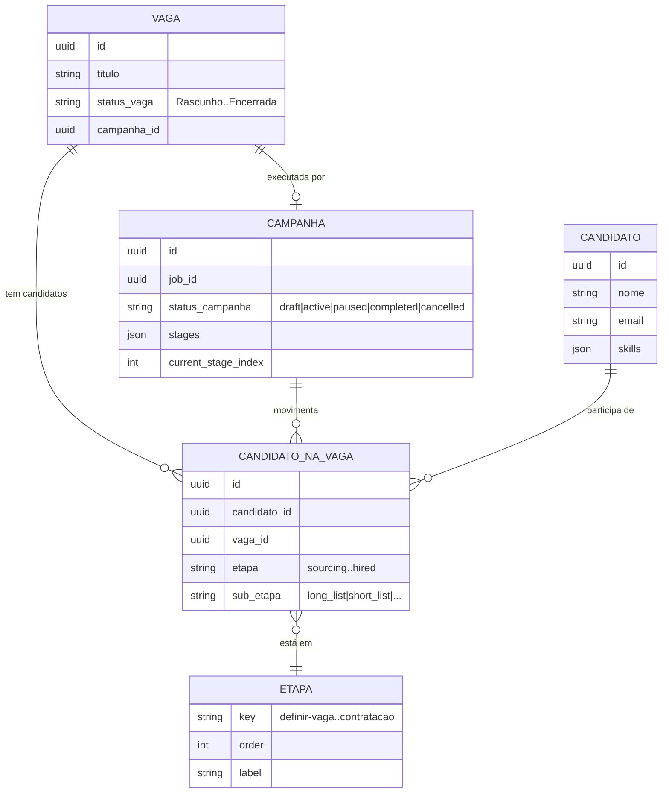
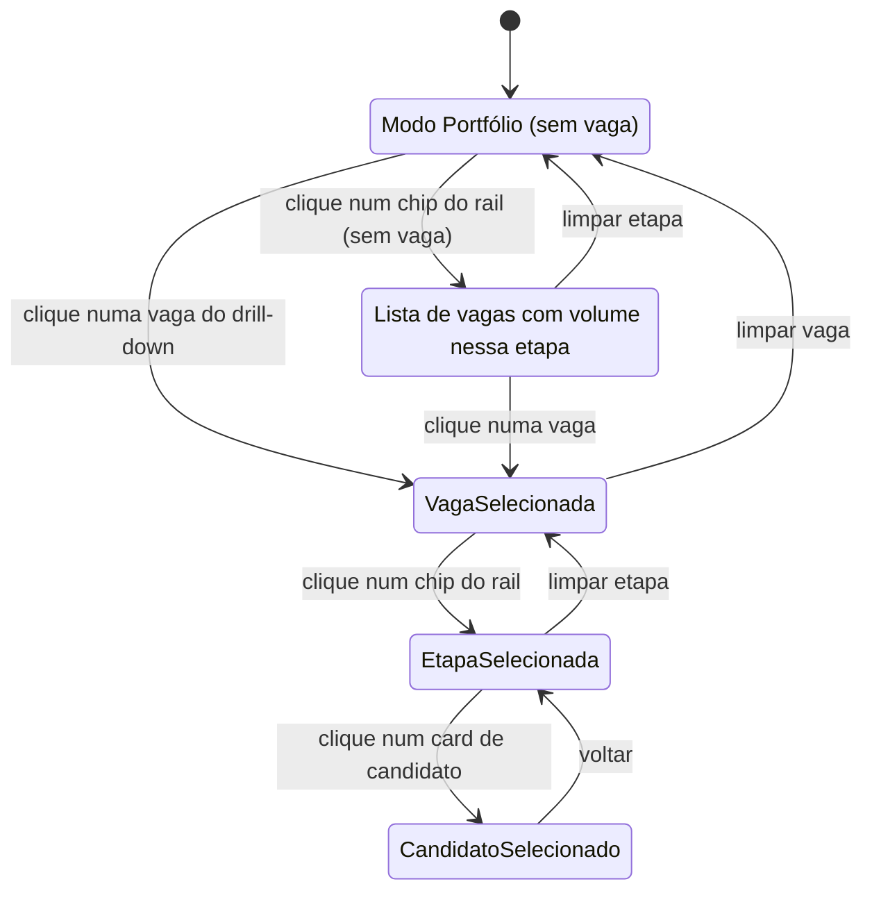

# Funil unificado — Especificação da Fase 2 (convergência pós-MVP)

> **Status:** Especificação técnico-produtual. Não há código de produção associado a este documento — ele serve de base para a task de implementação que será aberta após o MVP.
> **Autoria:** Time de Produto LIA.
> **Idioma:** PT-BR formal.
> **Pré-requisito de leitura:** [`funil-unificado-fase1-educativa.md`](../../.local/tasks/funil-unificado-fase1-educativa.md).

---

## 1. Visão de produto

A LIA quer que o recrutador opere o ciclo completo de uma vaga — desde a definição até a contratação — sem trocar de "mundo mental" entre páginas. Hoje a operação está fragmentada em três superfícies:

| Superfície atual | Foco | Granularidade dominante |
| --- | --- | --- |
| **Vagas** (`/jobs`, lista + kanban) | ciclo de vida da **vaga** | Rascunho → Enriquecida → WSI → Aguardando Aprovação → Publicada → Ao Vivo → Encerrada |
| **Funil de Talentos** (`/funil-de-talentos`) | descoberta e organização de **candidatos** independente de vaga | Banco de talentos, busca, listas |
| **Visão do Pipeline** (`/visao-do-funil`) | execução e movimentação de **candidatos por etapa** dentro de uma vaga | Funil → Triagem → Long List → Short List → Entrevistas → Proposta → Contratado |

A Fase 1 educativa já alinhou o **vocabulário visual** (catálogo canônico de etapas em `canonicalFunnelStages.ts`) e introduziu o **badge de campanha** como ponte entre a vaga e o motor de execução da LIA. A Fase 2 leva essa convergência ao seu desfecho natural: **uma única superfície orientada ao funil canônico, navegada pelo rail de chat e rail do rodapé já existentes**, na qual a Vaga, a Campanha, o Candidato e a Etapa se cruzam de forma explícita.

### Princípios de produto

1. **Funil canônico como bússola única.** O recrutador entra pela superfície unificada e o rail (chat + rodapé) é o índice mestre. Tudo que ele faz acontece "dentro" de uma etapa.
2. **Vaga e Campanha são duas faces da mesma moeda.** A Vaga é o objeto contratual (descrição, requisitos, status público). A Campanha é a LIA executando essa vaga (sourcing, triagem, contato). A nova superfície deixa essa relação visível em todo lugar.
3. **Macro ↔ micro sem big-bang.** O recrutador transita de "todas as vagas, todas as etapas" (visão portfólio) para "uma vaga, uma etapa, candidatos específicos" (visão de execução) sem mudar de página, apenas drillando.
4. **Migração incremental, sem perder o caminho velho.** Rotas legadas continuam funcionando como aliases enquanto a adoção é medida. O recrutador escolhe quando abandonar o atalho antigo.
5. **Consistência com a Fase 1.** O rail visual, os rótulos de etapa e o badge de campanha não mudam de identidade — apenas ganham novos pontos de aplicação.

---

## 2. Inventário do estado atual

### 2.1 Vagas (`/jobs`)

- **Responsabilidade:** ciclo de vida da vaga propriamente dita (criar, enriquecer com IA, gerar WSI, aprovar, publicar, encerrar).
- **Visualizações:** lista tabular + kanban por status da vaga.
- **Dados consumidos:** `jobs` (CRUD), `wsi` (geração de questionário), `recruitment_campaigns` (badge de campanha, leitura).
- **Sobreposição:** mostra contagem de candidatos por vaga, mas não permite manipulá-los.

### 2.2 Funil de Talentos (`/funil-de-talentos`)

- **Responsabilidade:** banco de talentos transversal — busca de candidatos por skills/cargo independente de uma vaga ativa.
- **Visualizações:** lista filtrável, perfil do candidato (`/funil-de-talentos/candidato/[id]`).
- **Dados consumidos:** `candidates`, `talent_pool`, `searches`.
- **Sobreposição:** o mesmo candidato aparece na Visão do Pipeline quando associado a uma vaga; hoje as duas páginas vivem em silos.

### 2.3 Visão do Pipeline (`/visao-do-funil`)

- **Responsabilidade:** execução do funil de candidatos dentro de uma vaga (mover entre etapas, ações em lote, conversa com a LIA sobre um candidato específico).
- **Visualizações:** rail magnificador por etapa + lista/kanban dos candidatos da etapa selecionada.
- **Dados consumidos:** `candidates` filtrados por `job_id`, `recruitment_campaigns` (status), `evaluations`, `interviews`.
- **Sobreposição:** assume uma vaga selecionada — quando o recrutador chega sem contexto, a página é menos útil.

### 2.4 Onde os dados se cruzam

| Objeto | Vagas | Funil de Talentos | Visão do Pipeline |
| --- | --- | --- | --- |
| **Vaga** | CRUD completo | mostra associação | seleção (`?job_id=`) |
| **Campanha** | badge informativo (Fase 1) | — | badge no header (Fase 1) |
| **Candidato** | apenas contagem | CRUD de perfil + busca | manipulação por etapa |
| **Etapa** | etapas da vaga (Rascunho→Encerrada) | — | etapas do candidato (Sourcing→Contratado) |

A duplicidade fundamental é: **as duas dimensões de "etapa"** (estado da vaga vs. estado dos candidatos) hoje vivem em superfícies separadas. A Fase 2 as projeta lado a lado.

---

## 3. Modelo conceitual unificado

A nova superfície opera sobre quatro objetos de primeira classe, todos refletidos no rail canônico:



### 3.1 Vaga

- Identidade contratual e pública: o que está sendo contratado.
- Status próprio: `rascunho | enriquecida | wsi | aguardando_aprovacao | publicada | ao_vivo | encerrada`.
- Possui no máximo **uma** Campanha ativa por vez. A Campanha pode ser substituída ao longo do tempo (histórico preservado).

### 3.2 Campanha

- Motor de execução: a LIA aplicando uma estratégia (sourcing, screening, outreach, etc.) sobre uma Vaga.
- Modelo já existe em `lia_models/recruitment_campaign.py` com `stages`, `current_stage_index`, `automation_level`, métricas agregadas.
- Status: `draft | active | paused | completed | cancelled`.
- O badge da Fase 1 ("Campanha ativa", "Pausada", "Sem campanha") é a manifestação visual mínima dessa relação. Na Fase 2 o badge ganha **ações** (pausar, retomar, encerrar), mas isso continua **fora do escopo desta especificação** (registrado como follow-up).

### 3.3 Candidato

- Pessoa no banco de talentos. Existe independentemente de qualquer vaga.
- Pode estar associado a 0..N vagas via `CandidatoNaVaga`.

### 3.4 CandidatoNaVaga (associação)

- Representa a presença de um candidato em uma vaga, com a sua **etapa atual** e **sub-etapa** (ex.: `screening` com sub-estágio `long_list`).
- É o objeto manipulado pelo kanban da Visão do Pipeline atual.
- A Fase 2 padroniza o vocabulário: as etapas são as do **catálogo canônico** (`definir-vaga`, `sourcing`, `triagem`, `entrevista`, `oferta`, `contratacao`), com sub-etapas opcionais quando faz sentido para o cliente.

### 3.5 Etapa (catálogo canônico)

- Fonte única: `plataforma-lia/src/components/workflow-rail/canonicalFunnelStages.ts`.
- Definida na Fase 1: `definir-vaga → sourcing → triagem → entrevista → oferta → contratacao`, com nodes utilitários (`analytics`, `ia-automacoes`).
- O rail de chat (densidade compacta) e o rail do rodapé (densidade fixa+expansível) já consomem esse catálogo. A nova superfície apenas o **promove** a "índice de navegação primário" da página.

---

## 4. Jornada do recrutador — antes vs. depois

### 4.1 Antes (estado atual)

| # | Tarefa do recrutador | Caminho atual |
| --- | --- | --- |
| 1 | Criar uma vaga nova | `/jobs` → botão "Nova Vaga" → wizard. Após criar, redireciona para `/jobs/[slug]`. |
| 2 | Acompanhar candidatos de uma vaga | `/jobs` → clicar na vaga → `/jobs/[slug]` → link "Ver pipeline" → `/visao-do-funil?job_id=...`. Três cliques, mudança de página. |
| 3 | Buscar candidato no banco de talentos | `/funil-de-talentos` → busca → perfil. Não há ponte direta para "associar à vaga X". |
| 4 | Mover candidato de etapa | `/visao-do-funil` → drag&drop ou menu de ação. Funciona, mas isolado das outras telas. |
| 5 | Encerrar vaga | `/jobs` → menu de ação → confirmar. Não há feedback do impacto na campanha. |
| 6 | Ver "como vão minhas vagas" no geral | Não existe. O recrutador alterna entre `/jobs` (status da vaga) e `/visao-do-funil` (uma vaga por vez). |

### 4.2 Depois (Fase 2)

| # | Tarefa do recrutador | Caminho proposto |
| --- | --- | --- |
| 1 | Criar uma vaga nova | Em qualquer tela, abrir o rail (chat ou rodapé) → chip **Definir Vaga** → wizard inline. Ao final, a superfície unificada já aparece com a vaga criada filtrável. |
| 2 | Acompanhar candidatos de uma vaga | Superfície unificada filtrada por **vaga = X**. Rail destaca a etapa onde há mais movimento. Um clique no chip abre o drill-down dos candidatos daquela etapa. |
| 3 | Buscar candidato no banco de talentos | Mesmo rail, chip **Sourcing** com filtro "Banco de talentos". Ação "Associar à vaga" inline (sem trocar de tela). |
| 4 | Mover candidato de etapa | Drag&drop dentro do drill-down. O rail superior atualiza contadores em tempo real. |
| 5 | Encerrar vaga | Ação no header da superfície unificada (com vaga selecionada). Diálogo educa: "Encerrar vaga também encerra a campanha associada — ok?". |
| 6 | Ver "como vão minhas vagas" no geral | **Modo Portfólio** (sem vaga selecionada): rail mostra contagens agregadas por etapa entre todas as vagas ativas. Drill-down por etapa lista *quais vagas* têm o que naquela etapa. |

### 4.3 Princípio de continuidade

Em todos os pontos de entrada legados (`/jobs`, `/funil-de-talentos`, `/visao-do-funil`), durante a janela de transição:

- A URL antiga continua respondendo, mas é renderizada pela nova superfície com o filtro pré-aplicado.
- Um banner informativo discreto (descartável e lembrado por usuário) explica: "Esta página agora vive dentro do **Funil unificado**. Seu filtro foi mantido."

---

## 5. Proposta de IA (Information Architecture) da nova superfície

### 5.1 Rota e nome

- **Rota canônica:** `/funil` (curta, memorável, alinhada à bússola conceitual).
- **Aliases preservados:** `/jobs`, `/funil-de-talentos`, `/visao-do-funil` redirecionam para `/funil` com filtros pré-aplicados.
- **Rótulo no menu lateral:** "Funil" (substitui as três entradas atuais; a substituição só ocorre quando a feature flag estiver 100% rollada).

### 5.2 Anatomia da tela

```
┌──────────────────────────────────────────────────────────────────────────┐
│  Header                                                                   │
│  ┌───────────────────────────────────────────────────────────────────┐  │
│  │ [Filtro Vaga ▾]  [Filtro Campanha ▾]  [Filtro Etapa ▾]  [+ Vaga]  │  │
│  │                                                                     │  │
│  │ Modo: ( ) Portfólio  (●) Vaga selecionada: "Eng. Backend Pleno"     │  │
│  │ Badge: [● Campanha ativa] (i)                                       │  │
│  └───────────────────────────────────────────────────────────────────┘  │
├──────────────────────────────────────────────────────────────────────────┤
│  Rail canônico (mesmo do rodapé/chat, em densidade "página")             │
│  ┌────────────────────────────────────────────────────────────────────┐ │
│  │ Definir → Sourcing → Triagem → Entrevista → Oferta → Contratação   │ │
│  │   (12)      (87)       (34)       (12)        (4)         (2)      │ │
│  │                          ▲                                          │ │
│  │                          └─ etapa selecionada                       │ │
│  └────────────────────────────────────────────────────────────────────┘ │
├──────────────────────────────────────────────────────────────────────────┤
│  Drill-down (depende de modo + etapa selecionada)                        │
│                                                                            │
│  Modo Portfólio + Etapa "Triagem":                                        │
│  ┌─────────────────────────────────────────────────────────────────────┐│
│  │  Vaga                            │ Em triagem │ Sub-etapa  │ Ações  ││
│  │  Eng. Backend Pleno              │     34     │ long_list  │  [→]   ││
│  │  Designer Sr.                    │     12     │ short_list │  [→]   ││
│  │  …                                                                   ││
│  └─────────────────────────────────────────────────────────────────────┘│
│                                                                            │
│  Modo Vaga selecionada + Etapa "Triagem":                                 │
│  ┌──── kanban com sub-etapas (long_list | short_list | rejeitado) ────┐ │
│  │  [card candidato]   [card candidato]   [card candidato]            │ │
│  │  [card candidato]   [card candidato]                                │ │
│  └─────────────────────────────────────────────────────────────────────┘│
└──────────────────────────────────────────────────────────────────────────┘
```

### 5.3 Estados da tela



### 5.4 Onde a LIA aparece

- **Painel lateral de chat permanece.** O `PipelineRailCard` continua sendo emitido nas mensagens do chat e usa o mesmo catálogo canônico.
- **CTA contextual.** Em qualquer estado da superfície, há um botão "Conversar com a LIA sobre isto" que abre o chat com o contexto pré-carregado (vaga, etapa, candidato selecionado).
- **Sugestões preditivas.** O painel "próximos passos" do rail do rodapé (`NEXT_STEPS_MAP` em `workflowRailCatalog.ts`) ganha hooks para alimentar uma faixa de sugestões dentro da própria superfície quando o recrutador para de interagir por alguns segundos.

### 5.5 Regras de URL

| Estado | URL |
| --- | --- |
| Portfólio | `/funil` |
| Portfólio + etapa | `/funil?stage=screening` |
| Vaga selecionada | `/funil?job=<id>` |
| Vaga + etapa | `/funil?job=<id>&stage=screening` |
| Vaga + etapa + sub-etapa | `/funil?job=<id>&stage=screening&substage=long_list` |
| Candidato | `/funil?job=<id>&candidate=<id>` (abre drawer lateral) |

URLs **shareable**, **bookmarkable** e **back-button-safe**.

---

## 6. Impactos em rotas e componentes

### 6.1 Frontend (Next.js)

| Item | Ação |
| --- | --- |
| `app/[locale]/funil/page.tsx` | **Novo.** Container da superfície unificada. |
| `app/[locale]/jobs/page.tsx` | Mantém rota; renderiza `<FunilPage initialFilter={{job: undefined, mode: "vagas"}} />` quando flag está ligada. |
| `app/[locale]/funil-de-talentos/page.tsx` | Idem; filtro inicial = banco de talentos. |
| `app/[locale]/visao-do-funil/page.tsx` | Idem; herda `?job_id=` e mapeia para `?job=`. |
| `components/workflow-rail/*` | Reaproveitado integralmente. Pode ganhar uma variante de densidade `"page"` além de `"compact"` e `"floating"`. |
| `components/chat/pipeline-rail-card.tsx` | Sem mudança visual; recebe novos `wizardHref` apontando para `/funil?...` quando a flag estiver ligada. |
| `components/pages/pipeline-overview/*` | Refatorado para se tornar o **drill-down "Vaga selecionada"** dentro da nova superfície. Não some — vira componente reutilizável. |

### 6.2 Backend (FastAPI)

A Fase 2 não inventa endpoint novo essencial, mas requer que três endpoints já existentes (ou em backlog) estejam **consolidados**:

| Endpoint | Estado hoje | Necessário para Fase 2 |
| --- | --- | --- |
| `GET /jobs` (com filtros) | ok | Adicionar `include=candidate_counts_by_stage` para alimentar o modo Portfólio sem N+1. |
| `GET /candidates?job_id=...&stage=...` | ok | Já atende; só precisa estar paginado e indexado. |
| `GET /recruitment-campaigns?job_id=...` | **`not_implemented`** (Fase 1 documentou) | Precisa estar implementado de verdade para o badge ter conteúdo real. **Bloqueador hard da Fase 2.** |
| `PATCH /candidates/{id}/stage` | ok | Continua atendendo o drag&drop. |

### 6.3 Permissões

- A superfície unificada **herda** as permissões já aplicadas às páginas legadas (RLS por `company_id`, papéis recrutador/admin).
- O modo Portfólio expõe apenas vagas que o usuário já podia ver em `/jobs`. Não há vetor novo de exposição.
- O CTA "Encerrar vaga" continua restrito ao mesmo papel que o tem hoje em `/jobs`.

---

## 7. Plano de migração incremental (sem big-bang)

### 7.1 Cronograma lógico (sem datas)

```
M1: Endpoint de campanhas implementado
M2: /funil disponível atrás de feature flag (off por padrão)
M3: Aliases legados redirecionam quando flag está on para o usuário
M4: Flag ligada para 10% dos tenants (canários internos)
M5: Flag ligada para 50% (recrutadores ativos)
M6: Flag ligada para 100%; menu lateral substitui 3 entradas por 1
M7: Páginas legadas removidas após 1 ciclo sem regressões
```

### 7.2 Estratégia de feature flag

- Flag: `funil_unificado_v2` (escopo por `company_id`, sobrepondo escopo por `user_id` para QA interno).
- **Default off** até M4. Permite rollback instantâneo.
- Avaliada server-side (no middleware Next.js) **e** client-side (no hook que decide qual componente renderizar). Server-side garante SEO/SSR; client-side evita flicker.
- A flag controla **três coisas simultâneas**: (1) renderização da nova `/funil`, (2) redirecionamento dos aliases, (3) substituição das entradas no menu lateral.

### 7.3 Aliases e deprecação

| Rota legada | Comportamento na Fase 2 | Quando remover |
| --- | --- | --- |
| `/jobs`, `/jobs/[slug]` | Redireciona para `/funil?job=<id>` (ou `/funil` na lista). | Após 60 dias com flag a 100%. |
| `/funil-de-talentos`, `/funil-de-talentos/candidato/[id]` | Redireciona para `/funil?stage=sourcing` (ou drawer do candidato). | Após 60 dias com flag a 100%. |
| `/visao-do-funil` | Redireciona para `/funil?job=<id>&stage=...` preservando query. | Após 60 dias com flag a 100%. |

Antes de remover, monitorar telemetria para garantir que < 1% do tráfego ainda chega pela rota legada via bookmark externo.

### 7.4 Telemetria de adoção

Eventos novos:

- `funil.viewed` (modo, vaga, etapa).
- `funil.drilldown` (de → para).
- `funil.legacy_redirect` (qual alias originou o redirecionamento).
- `funil.banner_dismissed` (educativo descartável).
- `funil.empty_state_shown` (para detectar tenants sem dados).

Métricas derivadas: tempo até primeira ação, número de telas trocadas por sessão, taxa de uso de cada rota legada residual.

### 7.5 Plano de rollback

Em qualquer momento até M6, virar a flag para `off` restaura o comportamento atual em < 1 minuto. Como nenhum código de UI legado é removido até M7, não há rollback "duro".

---

## 8. Riscos, dependências e métricas

### 8.1 Riscos conhecidos

| Risco | Mitigação |
| --- | --- |
| **Acoplamento atual com `/jobs`/`/visao-do-funil`** em links externos (e-mails da LIA, notificações). | Aliases permanecem indefinidamente; só os redirecionamentos mudam. Reescrever templates de e-mail apenas após M6. |
| **Recrutadores existentes acostumados ao modelo atual.** | Banner educativo descartável; tutorial in-app no primeiro acesso à `/funil`; não remover páginas legadas até taxa de adoção orgânica > 80%. |
| **Endpoint de campanhas continuar `not_implemented`.** | Bloqueador hard. Abrir task dependente antes de iniciar a Fase 2. Sem dados reais de campanha, a superfície perde a metade vertical do funil. |
| **Performance no modo Portfólio** (agregação de candidatos por etapa entre todas as vagas). | Pré-calcular contagens no backend (`include=candidate_counts_by_stage`) e cache curto (60 s) por `company_id`. |
| **Ambiguidade de "etapa".** A vaga tem etapas próprias (Rascunho..Encerrada) que não são as do candidato (Sourcing..Contratação). | A Fase 2 promove explicitamente o **funil canônico de candidatos** como rail principal. O status da vaga vira metadado do header (com cor própria), não compete com o rail. |
| **Sub-etapas customizadas por cliente** (long_list, short_list, etc.). | Manter sub-etapas como segundo nível dentro do drill-down. Catálogo canônico não muda. |
| **Conflito com `PipelineRailCard` no chat.** | Mantido como está. Apenas atualiza `wizardHref` para apontar para `/funil` quando a flag está ligada. |
| **Quebra de rotas em testes E2E existentes.** | Os aliases preservam URLs; testes que clicam em rótulos do menu precisam ser atualizados em uma única passagem na M6. |

### 8.2 Dependências

1. **Implementação real de `/recruitment-campaigns`** (modelo já existe em `lia_models/recruitment_campaign.py`). Fase 1 deixou como `not_implemented`; Fase 2 não pode subir sem.
2. **Catálogo canônico de etapas estável** (entregue na Fase 1) — se mudar, a superfície unificada muda junto.
3. **Endpoint `GET /jobs?include=candidate_counts_by_stage`** — pequena evolução do existente.
4. **Sistema de feature flags por `company_id`** — verificar se o atual já cobre escopo por tenant; caso não, abrir task de plataforma.
5. **Telemetria** — usar o mesmo pipeline já consumido pelo `WorkflowRail`.

### 8.3 Métricas de sucesso

| Categoria | Métrica | Meta inicial (revisar após M5) |
| --- | --- | --- |
| Adoção | % de sessões de recrutador que abrem `/funil` (direta ou via alias) | ≥ 90% em M5 |
| Substituição | % do tráfego que ainda chega pelas rotas legadas direto (não via redirect) | ≤ 5% em M6 |
| Eficiência | Mediana de páginas trocadas por sessão para completar "criar vaga + iniciar sourcing" | Reduzir em ≥ 40% vs. estado atual |
| Compreensão | Taxa de uso do badge de campanha (hover/click) | ≥ 25% dos recrutadores ativos por mês |
| Saúde | Erros 5xx em `/funil` | ≤ 0,5% das requisições |
| Satisfação | NPS qualitativo coletado in-app após 30 dias do M6 | ≥ +20 pontos vs. baseline |

---

## 9. Relação com a Fase 1 educativa

| Decisão da Fase 1 | Como evolui na Fase 2 |
| --- | --- |
| Catálogo único de etapas (`canonicalFunnelStages.ts`). | **Sem mudança.** É a fonte da verdade da superfície unificada. |
| Rail do chat e rail do rodapé com a mesma identidade visual. | **Reaproveitados.** A `/funil` adiciona uma terceira densidade (`"page"`) ao mesmo catálogo, sem novos rótulos. |
| Badge "Campanha ativa / Pausada / Sem campanha" no card da vaga e no header da Visão do Pipeline. | **Promovido.** O badge migra para o header da superfície unificada. Ações (pausar/retomar) ficam para uma task subsequente, fora desta especificação. |
| Tooltip educativo do badge. | **Mantido.** O texto pode ser ligeiramente revisto para refletir o novo contexto ("estes números vivem dentro do Funil unificado"). |
| Visibilidade do rail do rodapé em dev sem login. | **Mantida.** É pré-condição do desenvolvimento da `/funil`. |

A Fase 1 entrega o **vocabulário e a bússola visual**; a Fase 2 entrega a **superfície que opera sob essa bússola**. Sem a Fase 1, a Fase 2 teria que reinventar o catálogo; sem a Fase 2, a bússola continua existindo, mas cada página segue interpretando-a de um jeito.

---

## 10. Fora de escopo (registrado para tasks futuras)

- Ações de pausar/retomar/encerrar campanha a partir do badge.
- Edição inline da descrição da vaga dentro do header da superfície unificada.
- Exportações por etapa (CSV/PDF) consolidadas na nova superfície.
- Reescrita das mensagens automáticas da LIA para apontar links para `/funil`.
- Implementação real do endpoint `/recruitment-campaigns` (dependência, mas com task própria).
- Mockups de alta fidelidade (esta especificação fica em ASCII/Mermaid; alta fidelidade entra na execução).

---

## 11. Glossário

| Termo | Significado |
| --- | --- |
| **Funil canônico** | Sequência fixa de etapas (`definir-vaga → sourcing → triagem → entrevista → oferta → contratacao`) usada em todos os pontos do produto. |
| **Rail** | Componente visual que renderiza o funil canônico (chat, rodapé, página). Mesma identidade, três densidades. |
| **Vaga** | Objeto contratual e público; o que está sendo contratado. |
| **Campanha** | Execução pela LIA da estratégia de recrutamento de uma Vaga. |
| **Modo Portfólio** | Estado da `/funil` sem vaga selecionada, mostrando todas as vagas agregadas por etapa. |
| **Drill-down** | Transição de macro (portfólio) para micro (vaga, etapa, candidato) na mesma página. |
| **Alias legado** | Rota antiga (`/jobs`, `/funil-de-talentos`, `/visao-do-funil`) que continua respondendo após a migração, redirecionando para `/funil`. |

---

*Fim da especificação da Fase 2.*
