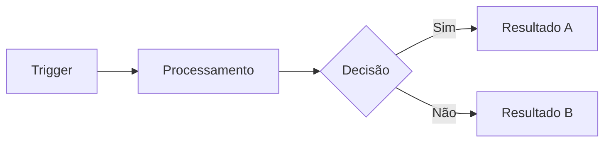
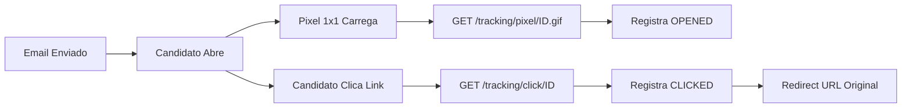

# Proposta: Skill "Document Factory" — Fábrica de Documentos & Cards Autocontidos

## 1. Aprendizados Consolidados

### 1.1 O que funcionou nos cards AGT (21 cards, 3 sessões)

| Aspecto | Aprendizado | Evidência |
|---------|------------|-----------|
| **Estado V5 vs LIA** | Comparação explícita "o que existe vs o que falta" elimina ambiguidade | Todos 21 cards usaram; devs sabem exatamente o gap |
| **Tools com Serviços (tabela)** | Mapear tool → serviço → arquivo concreto dá autonomia total ao dev | AGT-004 (14 tools), AGT-015 (20 tools) — zero perguntas |
| **Padrão 13B.7** | Definir classe, domain, guardrails por card = dev sabe copiar/colar | Todos agentes seguem o mesmo template |
| **Roteiro de Reprodução** | Lista de arquivos numerada = checklist implementável | 13 cards com roteiro — dev abre arquivo por arquivo |
| **Para Alpha 1** | Scope explícito evita over-engineering | "Alpha 1 usa como serviço REST" vs "Pós-Alpha ativa ReAct" |
| **Referências cruzadas** | Apontar §seção do diagnóstico = dev pode ir mais fundo | §14.1-§14.14, §13B, §13C.17 |
| **YAML metadata** | Sprint, pontos, prioridade, dependências = Jira-ready | 21 cards → Jira sem retrabalho |

### 1.2 O que funcionou no diagnóstico de agentes (5.251 linhas)

| Aspecto | Aprendizado |
|---------|------------|
| **Glossário na seção 0** | Time fala a mesma língua desde a página 1 |
| **Inventário exaustivo (§13C)** | ~165 arquivos catalogados = ninguém pergunta "onde está X?" |
| **Blueprint replicável (§13B)** | Padrão 4-file = escala sem divergência arquitetural |
| **Gap analysis tabular** | Tabela V5 vs LIA por componente = decisão visual rápida |
| **Roteiros de reprodução (§13C.17)** | Dev reproduz comportamento LIA no V5 seguindo lista |
| **Fora do escopo explícito (§22)** | Previne scope creep — "isso NÃO entra no Alpha 1" |

### 1.3 O que faltou / pode melhorar

| Gap | Solução na nova skill |
|-----|----------------------|
| Cards não tinham diagramas de fluxo | Adicionar seção `Fluxo Visual` (Mermaid) |
| Sem critérios de aceite formais | Adicionar `Critérios de Aceite` (Given/When/Then) |
| Sem estimativa de risco/complexidade | Adicionar `Matriz de Risco` |
| Documentos longos sem resumo executivo | Obrigar `TL;DR` no início |
| Sem versionamento explícito de templates | Template com `versão` e `changelog` |
| Sem contexto de negócio para stakeholders não-técnicos | Adicionar `Contexto de Negócio` (linguagem simples) |

---

## 2. Escopo da Skill

A skill "Document Factory" cobre **3 tipos de artefato**:

### Tipo A — Card Autocontido (Jira-Ready)
> Para: Dev + AI Coding Assistant (Claude Code, Cursor, Copilot)
> Objetivo: Card que contém TUDO para implementar sem perguntar nada

### Tipo B — Documento Técnico Explicativo
> Para: Time de engenharia, reuniões técnicas, onboarding
> Objetivo: Diagnósticos, blueprints, inventários, catálogos

### Tipo C — Documento de Produto
> Para: Stakeholders, reuniões de produto, apresentações, demos
> Objetivo: Roadmaps visuais, feature decks, glossários, fluxos

---

## 3. Estrutura Proposta — Tipo A: Card Autocontido

```yaml
# ═══════════════════════════════════════════════════
# CARD: [ID] — [Título Descritivo]
# ═══════════════════════════════════════════════════

# ── METADATA ──────────────────────────────────────
Titulo: "[ID] [Título]"
Tipo: [ReAct Agent | LangGraph StateGraph | Serviço REST | Componente React | Infra]
Area: [Backend | Frontend | Full-Stack | DevOps]
Sprint: [número]
Pontos: [fibonacci: 1,2,3,5,8,13,21]
Prioridade: [P0-Blocker | P1-Critical | P2-High | P3-Medium]
Epic: "[Nome do Épico] (JIRA-KEY)"
Tags: [lista de tags]
Classificacao: [🟢 MVP CRÍTICO | 🟡 MVP SUPORTE | 🔵 PÓS-MVP]
Dependencias: [lista de IDs]
Referencias: [seções de documentos]
```

### Seções Obrigatórias do Card

#### 1. TL;DR (3 linhas máximo)
> O que é, por que importa, o que entrega. Stakeholder lê APENAS isso.

#### 2. Contexto de Negócio
> Linguagem não-técnica. Qual problema resolve? Qual o valor para o usuário final?
> Quem usa? Quando usa? O que muda na experiência?

#### 3. Estado Atual vs Alvo
> **Atual**: O que existe hoje (com paths de arquivo)
> **Alvo**: O que deve existir ao final do card
> **Gap**: Lista precisa do que falta
> **Veredicto**: Decisão arquitetural (criar do zero / adaptar / migrar)

#### 4. Arquitetura & Fluxo

##### 4a. Fluxo Visual (Mermaid)


##### 4b. Componentes / Tools (Tabela)
| # | Tool/Componente | O que faz | Serviço/Arquivo | Dependência |
|---|----------------|-----------|-----------------|-------------|

##### 4c. API Endpoints (se aplicável)
| Método | Endpoint | Descrição | Auth | Rate Limit |
|--------|----------|-----------|------|------------|

##### 4d. Modelo de Dados (se aplicável)
| Tabela | Campos-chave | Relações | Migration |
|--------|-------------|----------|-----------|

#### 5. Padrão de Implementação
> Classe base, mixins, domain, guardrails, compliance.
> Para agentes: 4-file pattern, system prompt, tool registry.
> Para frontend: componentes, hooks, props interface.

#### 6. Roteiro de Implementação
> Lista numerada de arquivos a criar/modificar, na ordem de implementação.
> Cada item com: arquivo, o que fazer, referência de código existente.

```
1. [ ] arquivo.py — Criar classe X (ref: outro_arquivo.py L45-120)
2. [ ] arquivo2.py — Adicionar método Y
3. [ ] test_arquivo.py — Testes unitários (mínimo: 3 cenários)
```

#### 7. Critérios de Aceite
```gherkin
DADO [pré-condição]
QUANDO [ação do usuário/sistema]
ENTÃO [resultado esperado]

DADO [pré-condição alternativa]
QUANDO [ação diferente]
ENTÃO [resultado esperado diferente]
```

#### 8. Escopo & Limites
> **Entra**: Lista do que o card cobre
> **NÃO entra**: Lista explícita do que NÃO implementar neste card
> **Pós-MVP**: O que pode ser feito depois (nice-to-have)

#### 9. Riscos & Mitigações
| Risco | Probabilidade | Impacto | Mitigação |
|-------|--------------|---------|-----------|
| [descrição] | Alta/Média/Baixa | Alto/Médio/Baixo | [ação] |

#### 10. Testes Obrigatórios
> Unitários (mínimo), integração, e2e se aplicável.
> Cenários de erro, edge cases, compliance.

#### 11. Referências & Código-Fonte
> Links para documentação, seções do diagnóstico, arquivos de referência.
> Snippets de código quando útil.

---

## 4. Estrutura Proposta — Tipo B: Documento Técnico

```markdown
# [Título do Documento]
> Versão X.Y — Data. Autor: [nome/agente].

## TL;DR (5 linhas)

## Sumário Executivo (1 página)

## §0 — Glossário
| Termo | Definição | Exemplo |
|-------|-----------|---------|

## §1 — Contexto & Motivação
> Por que este documento existe? Qual problema resolve?

## §2 — Escopo
> O que cobre. O que NÃO cobre.

## §3-N — Seções Técnicas
### Padrão por seção:
- Objetivo da seção
- Estado atual (com evidências: código, métricas, screenshots)
- Estado alvo
- Gap analysis (tabela)
- Recomendações (numeradas, acionáveis)
- Referências cruzadas (→ Ver §X)

## §N+1 — Inventário de Arquivos
| # | Arquivo | Linhas | Responsabilidade | Seção Relacionada |
|---|---------|--------|-----------------|-------------------|

## §N+2 — Matriz de Decisões
| Decisão | Opções | Escolha | Justificativa |
|---------|--------|---------|---------------|

## §N+3 — Roadmap de Implementação
| Fase | Duração | Cards | Dependências |
|------|---------|-------|-------------- |

## §N+4 — Fora do Escopo (Explícito)
> Lista do que foi avaliado e descartado, com justificativa.

## Changelog
| Versão | Data | Mudanças |
|--------|------|----------|
```

---

## 5. Estrutura Proposta — Tipo C: Documento de Produto

```markdown
# [Título] — Visão de Produto
> Versão X.Y — Data

## Resumo Executivo (linguagem de negócio)
> 1 parágrafo para C-level.

## Problema & Oportunidade
> Dor do cliente. Tamanho do mercado. Benchmark competitivo.

## Solução Proposta
> O que fazemos. Como funciona (alto nível). Diferencial.

## Jornada do Usuário
> Passo a passo visual da experiência.
> Personas envolvidas. Pontos de contato.

## Funcionalidades
### Para cada feature:
| Feature | Descrição | Valor | Sprint | Status |
|---------|-----------|-------|--------|--------|

## Arquitetura (Simplificada)
> Diagrama de blocos (sem código). 
> "O sistema faz X, conecta com Y, entrega Z."

## Métricas de Sucesso
| KPI | Baseline | Meta | Como Medir |
|-----|----------|------|------------|

## Roadmap Visual
> Timeline com milestones. Mermaid gantt ou tabela.

## Glossário de Produto
> Termos na linguagem do cliente, NÃO técnicos.

## FAQ
> Perguntas frequentes de stakeholders.

## Apêndices
> Detalhes complementares para quem quiser aprofundar.
```

---

## 6. Funcionalidades da Skill

### 6.1 Comandos / Triggers

| Trigger | Ação | Tipo |
|---------|------|------|
| "criar card para [feature]" | Gera Card Autocontido (Tipo A) | A |
| "criar documento técnico sobre [tema]" | Gera Doc Técnico (Tipo B) | B |
| "criar documento de produto sobre [tema]" | Gera Doc Produto (Tipo C) | C |
| "criar cards para épico [nome]" | Gera N cards do épico | A (batch) |
| "enriquecer card [ID]" | Adiciona seções faltantes a card existente | A |
| "sincronizar cards com Jira" | Envia cards para Jira via API | A |
| "gerar glossário de [domínio]" | Extrai termos e gera glossário | B/C |
| "gerar roadmap de [escopo]" | Cria roadmap visual com timeline | B/C |

### 6.2 Regras de Qualidade

1. **Card sem Critério de Aceite = card incompleto** → Skill rejeita
2. **Card sem Roteiro de Implementação = card inútil** → Skill rejeita
3. **Documento sem Glossário = documento inacessível** → Skill alerta
4. **Documento sem TL;DR = documento ignorado** → Skill adiciona
5. **Card > 21 SPs = card precisa ser dividido** → Skill sugere split
6. **Referência circular entre cards = alerta de dependência** → Skill detecta
7. **Seção "NÃO entra" vazia = risco de scope creep** → Skill exige

### 6.3 Integração com Jira

A skill inclui lógica para:
- Formatar card em ADF (Atlassian Document Format) para API v3
- Criar/atualizar issues via REST API
- Vincular a épicos existentes
- Definir campos customizados (story points, sprint, labels)
- Validar que o card cumpre todas as seções obrigatórias antes de enviar

### 6.4 Integração com GitHub

A skill também pode:
- Gerar markdown para PR descriptions
- Criar issues no formato GitHub
- Gerar commit messages padronizados baseados no card

### 6.5 Compatibilidade com AI Coding Assistants

Cards gerados são otimizados para:
- **Claude Code / Cursor**: Roteiro numerado = prompt direto
- **Copilot**: Referências de arquivo = autocompletar contextualizado
- **GitHub Copilot Workspace**: Critérios de aceite = plano de implementação

---

## 7. Exemplo de Card Gerado pela Skill

```yaml
# ═══════════════════════════════════════════════════
# CARD: FTR-001 — Email Tracking com Pixel + Redirect
# ═══════════════════════════════════════════════════

Titulo: "FTR-001 Email Tracking com Pixel + Redirect"
Tipo: Serviço REST + Endpoints
Area: Backend
Sprint: 8
Pontos: 8
Prioridade: P2-High
Epic: "É36 Follow-up & Tracking (WT-XXXX)"
Tags: [backend, email, tracking, LGPD]
Classificacao: 🟡 MVP SUPORTE
Dependencias: [AGT-005, AGT-010]
Referencias: §5.3, §7
```

### TL;DR
Tracking de abertura (pixel 1×1) e clique (redirect) em emails enviados pela plataforma. Permite medir engajamento do candidato e alimentar automações de follow-up. LGPD: opt-out obrigatório.

### Contexto de Negócio
O recrutador hoje envia emails e não sabe se foram abertos. Com tracking, a LIA pode: (1) alertar quando candidato abriu mas não respondeu, (2) priorizar follow-up para quem não abriu, (3) medir eficácia de templates de email.

### Estado Atual vs Alvo
**Atual**: Emails enviados via Resend/SendGrid sem tracking. Não há visibilidade pós-envio.
**Alvo**: Pixel tracking (abertura), redirect tracking (clique), webhook (bounce/spam).
**Gap**: Tabelas email_tracking_events e email_followup_status não existem. Endpoints de tracking não existem.
**Veredicto**: Implementar do zero — funcionalidade nova.

### Fluxo Visual


### Tools / Componentes
| # | Componente | O que faz | Arquivo |
|---|-----------|-----------|---------|
| 1 | TrackingPixelEndpoint | Retorna GIF 1×1, registra abertura | app/api/v1/tracking.py |
| 2 | TrackingClickEndpoint | Registra clique, redireciona | app/api/v1/tracking.py |
| 3 | EmailTrackingService | CRUD tracking events | app/services/email_tracking_service.py |
| 4 | ResendWebhookHandler | Processa bounce/spam | app/api/v1/webhooks/resend.py |

### API Endpoints
| Método | Endpoint | Descrição | Auth |
|--------|----------|-----------|------|
| GET | /tracking/pixel/{id}.gif | Pixel tracking (abertura) | Nenhuma |
| GET | /tracking/click/{id} | Click tracking (redirect) | Nenhuma |
| POST | /tracking/webhook/resend | Webhook Resend (bounce) | Webhook secret |
| POST | /email/opt-out/{token} | Opt-out LGPD | Token JWT |

### Modelo de Dados
| Tabela | Campos-chave | Migration |
|--------|-------------|-----------|
| email_tracking_events | id, email_id, event_type (sent/opened/clicked/bounced), ip_hash, user_agent, created_at | 035_email_tracking.py |
| email_followup_status | id, candidate_id, job_id, send_count, last_sent_at, status, opted_out | 035_email_tracking.py |

### Roteiro de Implementação
```
1. [ ] libs/models/lia_models/email_tracking.py — Modelos SQLAlchemy
2. [ ] alembic/versions/035_email_tracking.py — Migration
3. [ ] app/services/email_tracking_service.py — CRUD + lógica de tracking
4. [ ] app/api/v1/tracking.py — Endpoints pixel + click + opt-out
5. [ ] app/api/v1/webhooks/resend.py — Webhook handler
6. [ ] tests/test_email_tracking.py — Testes unitários (5 cenários)
7. [ ] Integrar com CommunicationDispatcher — Adicionar tracking_id ao envio
```

### Critérios de Aceite
```gherkin
DADO um email enviado com pixel tracking
QUANDO o candidato abre o email
ENTÃO o sistema registra evento "opened" com timestamp

DADO um email com link rastreado
QUANDO o candidato clica no link
ENTÃO o sistema registra "clicked" E redireciona para URL original

DADO um candidato que clicou opt-out
QUANDO o sistema tenta enviar follow-up
ENTÃO o envio é bloqueado E registrado como "opted_out"
```

### Escopo & Limites
**Entra**: Pixel tracking, click tracking, webhook bounce, opt-out LGPD
**NÃO entra**: A/B testing de templates, analytics dashboard, heatmaps
**Pós-MVP**: Dashboard de métricas de email, integração com analytics

### Riscos & Mitigações
| Risco | Prob. | Impacto | Mitigação |
|-------|-------|---------|-----------|
| Bloqueio de pixel por email client | Alta | Médio | Click tracking como fallback |
| LGPD: tracking sem consentimento | Média | Alto | Opt-out obrigatório + banner |
| Volume alto de tracking events | Baixa | Médio | Particionamento por mês |

### Referências
- AGT-005 (CommunicationService) — serviço de envio
- AGT-010 (Follow-up 7 Dias) — lógica de re-envio
- Resend Webhooks: https://resend.com/docs/webhooks

---

## 8. Próximos Passos

1. **Você avalia** esta proposta e sugere ajustes
2. **Eu crio** a skill em `.agents/skills/document-factory/SKILL.md`
3. **Testamos** gerando 2-3 cards de exemplo com a skill
4. **Iteramos** até o formato estar ideal
5. **Documentamos** o padrão no `replit.md`

---

*Proposta v1.0 — 11/março/2026*
