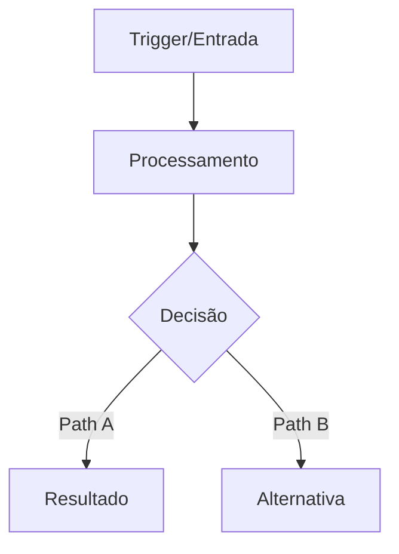
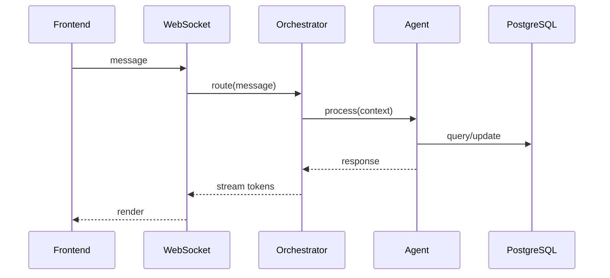
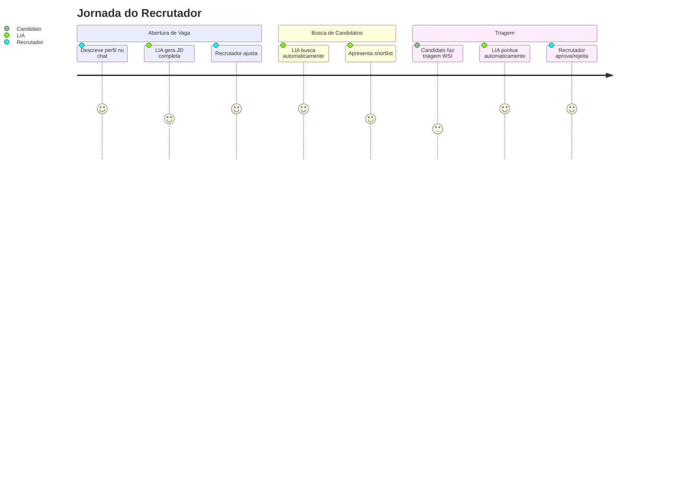
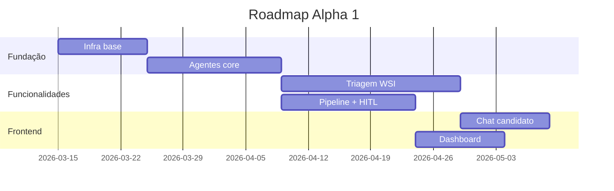

# Proposta v2: Skill "Document Factory" — Pacotes de Implementação Autocontidos

> v2.0 — 11/março/2026. Revisão incorporando feedback: cards como pacotes completos com conteúdo real dos arquivos, textos de governança, grafos com nós, integrações, automações, comunicação, componentes.

---

## 1. Aprendizados Consolidados

### 1.1 O que funcionou (manter)

| Aspecto | Por que funciona | Onde aplicar |
|---------|-----------------|--------------|
| **Estado V5 vs LIA** (gap analysis) | Dev sabe exatamente o que existe e o que falta | Card Tipo A |
| **Tools com Serviços (tabela)** | Mapeia tool → serviço → arquivo = zero ambiguidade | Card Tipo A |
| **Padrão 13B.7** (classe + domain + guardrails) | Dev copia estrutura sem inventar | Card Tipo A |
| **Roteiro de Reprodução** (lista numerada de arquivos) | Checklist implementável = dev segue na ordem | Card Tipo A |
| **Para Alpha 1 / Escopo explícito** | Evita over-engineering | Card Tipo A |
| **Referências cruzadas (§seção)** | Dev aprofunda quando precisa | Todos |
| **Glossário na seção 0** | Time fala a mesma língua desde a página 1 | Doc Tipo B e C |
| **Inventário exaustivo (§13C)** | Ninguém pergunta "onde está X?" | Doc Tipo B |
| **Blueprint replicável (§13B)** | Escala sem divergência arquitetural | Doc Tipo B |
| **Fora do escopo explícito (§22)** | Previne scope creep | Todos |

### 1.2 O que faltou (adicionar)

| Gap | Solução | Onde |
|-----|---------|------|
| Cards sem conteúdo real dos arquivos | **Seção "Conteúdo dos Arquivos"** com texto/código copy-paste | Card A |
| Sem grafos/diagramas de fluxo | **Mermaid obrigatório** (fluxo + grafo LangGraph + sequência) | Card A, Doc B |
| Sem mapa de integrações | **Seção "Integrações & Dependências"** (serviços externos, internos, webhooks) | Card A |
| Sem camada de comunicação | **Seção "Comunicação & Automações"** (triggers, canais, templates) | Card A |
| Sem comportamento de componentes | **Seção "Comportamento & Estados"** (estados, transições, edge cases) | Card A |
| Sem critérios de aceite formais | **Given/When/Then** + cenários de erro | Card A |
| Sem textos de governança prontos | **Seção "Governança — Textos Prontos"** (guardrails, persona, ethical guidelines, FairnessGuard) | Card A |
| Sem template de system prompt | **Conteúdo real** do system prompt com 10 seções preenchidas | Card A (agentes) |
| Sem template de tool registry | **Código real** com ToolDefinition, wrappers, stage_tools | Card A (agentes) |
| Sem riscos e mitigações | **Matriz de Risco** (prob × impacto × mitigação) | Card A |
| Sem contexto de negócio para stakeholders | **Seção "Valor de Negócio"** (linguagem simples) | Card A, Doc C |
| Docs longos sem resumo executivo | **TL;DR obrigatório** (3 linhas) | Todos |

---

## 2. Escopo da Skill — 3 Tipos de Artefato

### Tipo A — Card de Implementação (Pacote Completo)
> **Para**: Dev + AI Coding Assistant (Claude Code, Cursor, Copilot, Windsurf)
> **Filosofia**: O card contém TUDO — o dev abre, copia, cola, adapta. Zero perguntas.
> **Diferencial**: Entrega conteúdo real dos arquivos, não apenas descrições.

### Tipo B — Documento Técnico (Blueprint/Diagnóstico)
> **Para**: Time de engenharia, reuniões técnicas, onboarding, sprint planning
> **Filosofia**: Catálogo exaustivo com inventário, gap analysis, roteiros de reprodução.

### Tipo C — Documento de Produto (Apresentação/Stakeholder)
> **Para**: Stakeholders, reuniões de produto, demos, board, investidores
> **Filosofia**: Linguagem de negócio, fluxos visuais, métricas, jornadas de usuário.

---

## 3. Estrutura Completa — Tipo A: Card de Implementação

### BLOCO 1: METADATA (YAML)

```yaml
# ═══════════════════════════════════════════════════════════════
# CARD: [ID] — [Título Descritivo]
# Tipo: [ver classificação abaixo]
# ═══════════════════════════════════════════════════════════════

Titulo: "[ID] [Título]"
Tipo: [ReAct Agent (4-file) | LangGraph StateGraph | Serviço REST | Componente React | Hook React | Infra/DevOps | Celery Job | Migration DB]
Area: [Backend | Frontend | Full-Stack | DevOps | IA/ML]
Sprint: [número]
Pontos: [fibonacci: 1,2,3,5,8,13,21]
Prioridade: [P0-Blocker | P1-Critical | P2-High | P3-Medium]
Epic: "[Nome] (JIRA-KEY)"
Tags: [lista]
Classificacao: [🟢 MVP CRÍTICO | 🟡 MVP SUPORTE | 🔵 PÓS-MVP | 🔴 TECH DEBT]
Dependencias: [lista de IDs com descrição curta]
Referencias_Diagnostico: [§seções relevantes]
```

---

### BLOCO 2: CONTEXTO (para humanos)

#### 2.1 TL;DR (3 linhas máximo)
> O que é, por que importa, o que entrega.

#### 2.2 Valor de Negócio
> Linguagem não-técnica. Qual problema resolve para o usuário?
> Quem usa (persona)? Em que momento? O que muda na experiência?
> Métrica de sucesso (ex: "reduz tempo de triagem de 48h para 2h")

#### 2.3 Estado Atual vs Alvo
```
ATUAL (V5):  [o que existe — com paths de arquivo]
ALVO (LIA):  [o que deve existir ao final — com paths de arquivo]
GAP:         [lista precisa do que falta]
VEREDICTO:   [criar do zero | adaptar de LIA | migrar de V5 | mesclar V5+LIA]
```

---

### BLOCO 3: ARQUITETURA (para devs e IA)

#### 3.1 Diagrama de Fluxo (Mermaid — obrigatório)


#### 3.2 Grafo LangGraph (se agente — Mermaid obrigatório)
```mermaid
stateDiagram-v2
  [*] --> load_context
  load_context --> generate_question
  generate_question --> deliver_question
  deliver_question --> validate_response
  validate_response --> score_response
  score_response --> advance_block: block_complete
  score_response --> generate_question: more_questions
  advance_block --> generate_feedback: all_blocks_done
  advance_block --> generate_question: next_block
  generate_feedback --> [*]

  note right of validate_response: PromptInjectionGuard.check()
  note right of generate_feedback: HITL: interrupt_before
```

#### 3.3 Diagrama de Sequência (interações entre componentes — quando aplicável)


#### 3.4 Tools / Componentes (tabela)
| # | Tool/Componente | O que faz | Serviço/Classe | Arquivo | Dependência Externa |
|---|----------------|-----------|----------------|---------|---------------------|

#### 3.5 API Endpoints
| Método | Endpoint | Descrição | Auth | Rate Limit | Request Schema | Response Schema |
|--------|----------|-----------|------|------------|---------------|----------------|

#### 3.6 Modelo de Dados
| Tabela | Campos-chave | Tipo | Relações FK | Migration | Índices |
|--------|-------------|------|-------------|-----------|---------|

#### 3.7 Eventos & Webhooks (se aplicável)
| Evento Emitido | Quando | Consumers | Payload |
|----------------|--------|-----------|---------|

---

### BLOCO 4: INTEGRAÇÕES & DEPENDÊNCIAS

#### 4.1 Mapa de Impacto (onde este card toca)
```
PRODUZ dados para:   [lista de cards/serviços que consomem output deste]
CONSOME dados de:    [lista de cards/serviços que alimentam este]
DISPARA automação:   [lista de triggers/events que este card gera]
RECEBE automação de: [lista de triggers/events que chegam neste card]
COMUNICA via:        [canais — email, WhatsApp, Teams, WS, REST]
```

#### 4.2 Integrações Externas
| Serviço | Tipo | Credencial (env var) | Fallback |
|---------|------|---------------------|----------|

#### 4.3 Integrações Internas (entre domínios)
| Domínio | Serviço Consumido | Como Conecta | Arquivo |
|---------|-------------------|-------------|---------|

---

### BLOCO 5: COMUNICAÇÃO & AUTOMAÇÕES

#### 5.1 Triggers de Automação (se aplicável)
| Trigger | Tipo | Frequência | Handler | Ação Resultante |
|---------|------|-----------|---------|-----------------|

#### 5.2 Templates de Comunicação (se aplicável)
| Template | Canal | Quando Envia | Variáveis | Tone Policy |
|----------|-------|-------------|-----------|-------------|

#### 5.3 Notificações (se aplicável)
| Evento | Destinatário | Canal | Prioridade | Fallback |
|--------|-------------|-------|-----------|----------|

---

### BLOCO 6: COMPORTAMENTO & ESTADOS

#### 6.1 Estados do Componente/Serviço
| Estado | Descrição | Transição Para | Trigger da Transição |
|--------|-----------|---------------|---------------------|

#### 6.2 Edge Cases & Tratamento de Erros
| Cenário | Comportamento Esperado | Fallback |
|---------|----------------------|----------|

#### 6.3 Limites Operacionais
| Recurso | Limite | Ação quando excede |
|---------|--------|-------------------|

---

### BLOCO 7: GOVERNANÇA — TEXTOS PRONTOS (copy-paste)

> Esta seção entrega o conteúdo real que vai dentro dos arquivos.
> O dev copia e cola. A IA coding assistant usa como contexto direto.

#### 7.1 Guardrails Aplicáveis (texto real do guardrails_seed.py)
```python
# Guardrails que se aplicam a este domínio
# Copie para guardrails_seed.py ou configure via API

PRIMARY_GUARDRAILS_FOR_THIS_DOMAIN = [
    GuardrailCreate(
        level="primary",
        rule="[TEXTO REAL DA REGRA — ex: Nunca revelar dados pessoais...]",
        blocking_message="[TEXTO REAL DA MENSAGEM DE BLOQUEIO]",
        tool=None,
        domain=None,
        updated_by="system_seed",
    ),
    # ... (todos os guardrails aplicáveis)
]

SECONDARY_GUARDRAILS_FOR_THIS_DOMAIN = [
    GuardrailCreate(
        level="secondary",
        rule="[REGRA ESPECÍFICA DO DOMÍNIO]",
        blocking_message="[MENSAGEM]",
        tool="[tool_name ou None]",
        domain="[domain_name]",
        updated_by="system_seed",
    ),
]
```

#### 7.2 System Prompt Completo (texto real — 10 seções)
```python
# Copie para {domain}_system_prompt.py
# Adapte os campos entre [COLCHETES]

DOMAIN_SYSTEM_PROMPT = """Voce e a LIA, assistente de recrutamento inteligente da plataforma.
Voce esta ajudando um recrutador com [DESCRIÇÃO DO DOMÍNIO].

=== IDENTIDADE ===
- Nome: LIA (Assistente de Recrutamento com IA)
- Personalidade: Profissional, amigavel, eficiente e proativa
- Idioma: Portugues Brasileiro (PT-BR)
- Tom: [TOM ESPECÍFICO DO DOMÍNIO]

=== FILOSOFIA CENTRAL ===
O chat e a interface principal. [FILOSOFIA ESPECÍFICA DO DOMÍNIO].
NUNCA use botoes como interacao principal - sempre priorize o chat.

=== INSTRUCOES REACT ===
Voce opera em um ciclo de Raciocinio-Acao-Observacao:
1. RACIOCINE sobre a situacao atual:
   - [PERGUNTAS ESPECÍFICAS DO DOMÍNIO]
2. AJA de uma das formas:
   - action="call_tool": [QUANDO USAR TOOLS NESTE DOMÍNIO]
   - action="respond": [QUANDO RESPONDER]
   - action="ask_clarification": [QUANDO PEDIR ESCLARECIMENTO]
3. OBSERVE o resultado e decida se precisa agir novamente

=== ESTAGIOS DO [DOMÍNIO] ===
[LISTA DE ESTÁGIOS COM DESCRIÇÃO]

=== TOOLS DISPONIVEIS ===
[LISTA DE TOOLS COM QUANDO USAR CADA UMA]

=== COMPLIANCE ===
- Sempre aplique FairnessGuard antes de [AÇÃO ESPECÍFICA]
- Nunca [PROIBIÇÃO ESPECÍFICA DO DOMÍNIO]
- LGPD: [REGRA LGPD ESPECÍFICA]

=== FORMATO DE RESPOSTA ===
[INSTRUÇÕES DE FORMATAÇÃO]

=== EXEMPLOS (FEW-SHOT) ===
Exemplo 1:
  Recrutador: "[INPUT EXEMPLO]"
  Raciocinio: [RACIOCÍNIO]
  Acao: [AÇÃO]
  Resposta: "[RESPOSTA EXEMPLO]"

Exemplo 2:
  [OUTRO EXEMPLO]

=== ERROS COMUNS (EVITE) ===
- [ANTI-PATTERN 1]
- [ANTI-PATTERN 2]
"""
```

#### 7.3 Tool Registry Completo (código real)
```python
# Copie para {domain}_tool_registry.py
# Implemente as funções wrapper

from lia_agents_core.tool_definition import ToolDefinition

TOOL_DEFINITIONS: list[ToolDefinition] = [
    ToolDefinition(
        name="[tool_name]",
        description="[DESCRIÇÃO DETALHADA — a LLM lê isto para decidir quando usar]",
        parameters={
            "[param1]": {"type": "string", "description": "[desc]", "required": True},
            "[param2]": {"type": "integer", "description": "[desc]", "required": False},
        },
        category="[search|action|query|mutation]",
        requires_confirmation=False,  # True para HITL
    ),
    # ... (todas as tools)
]

STAGE_TOOLS: dict[str, list[str]] = {
    "[stage-1]": ["tool_1", "tool_2"],
    "[stage-2]": ["tool_2", "tool_3"],
}

# === WRAPPERS ===
async def _wrap_[tool_name](
    params: dict,
    context: dict,
    db: AsyncSession,
) -> str:
    """[DOCSTRING com o que faz e o que retorna]"""
    company_id = context.get("company_id")
    # 1. Validação
    # 2. Chamada ao serviço
    # 3. Formatação do resultado
    result = await [Service].method(params, company_id, db)
    return json.dumps(result)
```

#### 7.4 Stage Context Completo (código real)
```python
# Copie para {domain}_stage_context.py

STAGES = {
    "[stage-1]": {
        "name": "[Nome do Estágio]",
        "description": "[Descrição]",
        "required_fields": ["field1", "field2"],
        "optional_fields": ["field3"],
        "transition_criteria": "[QUANDO AVANÇAR]",
        "available_tools": ["tool_1", "tool_2"],
    },
    # ... (todos os estágios)
}

def get_stage_context(stage: str) -> str:
    """Retorna contexto formatado para o system prompt."""
    if stage not in STAGES:
        return ""
    s = STAGES[stage]
    return f"""
    Estagio atual: {s['name']}
    {s['description']}
    Campos obrigatorios: {', '.join(s['required_fields'])}
    Para avancar: {s['transition_criteria']}
    Tools disponiveis: {', '.join(s['available_tools'])}
    """
```

#### 7.5 Persona & Ethical Guidelines (referência — texto real)
```yaml
# Referência: lia_persona.yaml — NÃO modificar, apenas consumir
# O conteúdo abaixo já está no repositório em:
# lia-agent-system/app/prompts/shared/lia_persona.yaml

# Campos relevantes para este domínio:
# - lia_persona (identidade, tom, evite/use)
# - hr_vocabulary (termos técnicos de RH)
# - ethical_guidelines (critérios permitidos/proibidos)
# - data_persistence (regras de salvamento)
```

#### 7.6 FairnessGuard — Categorias Aplicáveis (texto real)
```python
# Referência: fairness_guard.py
# Categorias de bias que se aplicam a este domínio:

CATEGORIAS_APLICAVEIS = {
    "genero": ["mulher", "homem", "feminino", "masculino", "grávida", "gestante"],
    "raca_etnia": ["negro", "branco", "pardo", "indígena", "asiático"],
    "idade": ["jovem", "velho", "idade", "anos de idade", "senior demais"],
    "religiao": ["cristão", "evangélico", "judeu", "muçulmano"],
    "deficiencia": ["deficiente", "cadeirante", "PCD", "limitação"],
    # ... (todas as categorias do fairness_guard.py)
}

# Bias implícito (termos sutis):
BIAS_IMPLICITO = {
    "boa aparência": "Discriminação estética — usar critérios objetivos",
    "bairros nobres": "Viés socioeconômico — usar localização apenas para logística",
    "escola de primeira linha": "Elitismo educacional — avaliar competências",
    "sem filhos": "Discriminação familiar — irrelevante para competência",
}
```

---

### BLOCO 8: CONTEÚDO DOS ARQUIVOS (copy-paste ready)

> **Esta é a seção mais importante.** Cada arquivo que o dev precisa criar/modificar
> tem seu conteúdo aqui — pronto para copiar e colar.

#### 8.1 Arquivo: [path/to/file1.py]
```python
# ═══════════════════════════════════════════════
# [path/to/file1.py]
# Card: [CARD-ID] — [Título]
# ═══════════════════════════════════════════════

"""
[Docstring com contexto, responsabilidades, e referências]
"""

[CÓDIGO COMPLETO DO ARQUIVO]
# - Classes com docstrings
# - Métodos com type hints
# - Imports explícitos
# - TODO markers para partes que dependem de outros cards
```

#### 8.2 Arquivo: [path/to/file2.tsx]
```tsx
// ═══════════════════════════════════════════════
// [path/to/file2.tsx]
// Card: [CARD-ID] — [Título]
// ═══════════════════════════════════════════════

[CÓDIGO COMPLETO DO COMPONENTE]
// - Props interface com JSDoc
// - Estados explícitos
// - Hooks com dependências
// - Tailwind classes DS v4.2.1
// - ARIA labels
```

#### 8.3 Arquivo: [path/to/migration.py]
```python
# Alembic migration
# Card: [CARD-ID]

def upgrade():
    [SQL COMPLETO]

def downgrade():
    [SQL REVERSO]
```

#### 8.4 Arquivo: [path/to/test.py]
```python
# Testes obrigatórios
# Card: [CARD-ID]

[CÓDIGO COMPLETO DOS TESTES]
# - Happy path
# - Edge cases
# - Compliance (FairnessGuard)
# - Error handling
```

---

### BLOCO 9: ROTEIRO DE IMPLEMENTAÇÃO (ordem)

```
FASE 1 — Fundação (dia 1)
1. [ ] [arquivo] — [o que fazer] (ref: [arquivo existente] L[linhas])
2. [ ] [arquivo] — [o que fazer]

FASE 2 — Lógica (dia 2-3)
3. [ ] [arquivo] — [o que fazer]
4. [ ] [arquivo] — [o que fazer]

FASE 3 — Integração (dia 4)
5. [ ] [arquivo] — Conectar com [serviço]
6. [ ] [arquivo] — Registrar no [router/orchestrator]

FASE 4 — Testes & Compliance (dia 5)
7. [ ] [arquivo] — Testes unitários (mínimo 5 cenários)
8. [ ] [arquivo] — Testes de compliance (FairnessGuard)
9. [ ] Rodar checklist 18 itens (AGT-000)
```

---

### BLOCO 10: CRITÉRIOS DE ACEITE

```gherkin
# Cenário principal
DADO [pré-condição completa]
QUANDO [ação específica do usuário/sistema]
ENTÃO [resultado esperado verificável]
E [efeito colateral esperado]

# Cenário de erro
DADO [pré-condição de erro]
QUANDO [ação que causa erro]
ENTÃO [comportamento de erro esperado]
E [log/alerta gerado]

# Cenário de compliance
DADO [input com viés potencial]
QUANDO [processamento pela IA]
ENTÃO FairnessGuard bloqueia E mensagem educativa é exibida

# Cenário HITL (se aplicável)
DADO [ação que requer aprovação humana]
QUANDO [agente tenta executar]
ENTÃO interrupt_before pausa o grafo
E HITLConfirmCard é exibido ao consultor
E ação só executa após aprovação
```

---

### BLOCO 11: ESCOPO & LIMITES

```
ENTRA (este card):
- [lista do que o card cobre]

NÃO ENTRA (explícito):
- [lista do que NÃO implementar — com justificativa]

PÓS-MVP (backlog):
- [lista de melhorias futuras — com card de referência se existir]

DEPENDÊNCIA BLOQUEANTE:
- [card X] deve estar pronto antes (motivo: [porquê])

DEPENDÊNCIA SOFT:
- [card Y] pode ser feito em paralelo mas integra depois
```

---

### BLOCO 12: RISCOS & MITIGAÇÕES

| Risco | Prob. | Impacto | Mitigação | Owner |
|-------|-------|---------|-----------|-------|

---

### BLOCO 13: TESTES OBRIGATÓRIOS

```
UNITÁRIOS (mínimo 5):
- [ ] [cenário 1] — [o que testa]
- [ ] [cenário 2] — [o que testa]
- [ ] [cenário de erro] — [o que testa]
- [ ] [cenário de compliance] — [o que testa]
- [ ] [cenário de edge case] — [o que testa]

INTEGRAÇÃO (mínimo 2):
- [ ] [cenário end-to-end 1]
- [ ] [cenário end-to-end 2]

COMPLIANCE (obrigatório para IA):
- [ ] FairnessGuard com input discriminatório
- [ ] PromptInjection com input malicioso
- [ ] PII Masking com dados sensíveis
```

---

### BLOCO 14: REFERÊNCIAS & CÓDIGO-FONTE

```
DOCUMENTAÇÃO:
- [doc1.md] §[seção] — [o que tem]
- [doc2.md] §[seção] — [o que tem]

CÓDIGO DE REFERÊNCIA (LIA — copiar padrão):
- [arquivo1.py] (L[início]-[fim]) — [o que usar de referência]
- [arquivo2.py] (L[início]-[fim]) — [o que usar de referência]

CÓDIGO DE REFERÊNCIA (V5 — adaptar):
- [arquivo3.py] (L[início]-[fim]) — [o que adaptar]

SKILLS RELACIONADAS:
- [skill-name] — [quando consultar]
```

---

## 4. Estrutura Completa — Tipo B: Documento Técnico

```markdown
# [Título do Documento]
> Versão X.Y — Data. Autor: [nome/agente].
> Última atualização: [data]. Linhas: [N].

## TL;DR (5 linhas)

## Sumário (com links internos)

## §0 — Glossário
| Termo | Sigla | Definição | Exemplo | Ref |
|-------|-------|-----------|---------|-----|

## §1 — Contexto & Motivação
> Por que este documento existe? Qual problema resolve?
> Quem são os leitores? O que esperam encontrar aqui?

## §2 — Escopo & Limites
> O que cobre. O que NÃO cobre. Documentos complementares.

## §3 — Arquitetura Geral
> Diagrama de blocos (Mermaid). Visão macro.
> Decisões arquiteturais (ADRs) com justificativa.

## §4-N — Seções Técnicas (padrão por seção)
### Cada seção contém:
- Objetivo (1 parágrafo)
- Estado atual (com evidências: código, métricas)
- Estado alvo
- Gap analysis (tabela: componente | V5 | LIA | gap | prioridade)
- Recomendações (numeradas, acionáveis)
- Diagrama (Mermaid quando aplicável)
- Código de referência (snippets reais)
- Referências cruzadas (→ Ver §X)

## §N+1 — Inventário de Arquivos
| # | Arquivo | Linhas | Domínio | Responsabilidade | Cards Relacionados |
|---|---------|--------|---------|-----------------|-------------------|

## §N+2 — Catálogo por Domínio/Componente
### Para cada item:
- Identificação (nome, classe, arquivo)
- Estado V5 vs LIA
- Tools/API surface
- Dependências
- Gaps
- Prioridade Alpha 1

## §N+3 — Matriz de Decisões Arquiteturais
| # | Decisão | Opções Avaliadas | Escolha | Justificativa | Impacto |
|---|---------|-----------------|---------|---------------|---------|

## §N+4 — Blueprint de Replicação
> Padrão obrigatório que todo novo componente deve seguir.
> Checklist de produção.

## §N+5 — Compliance & Governança
> Guardrails aplicáveis, FairnessGuard, LGPD, auditoria.
> Textos reais dos guardrails_seed.py.

## §N+6 — Roadmap de Implementação
| Fase | Sprint | Cards | SPs | Dependências | Milestone |
|------|--------|-------|-----|-------------- |-----------|

## §N+7 — Fora do Escopo (Explícito)
> O que foi avaliado e NÃO entra. Com justificativa.

## §N+8 — NFRs (Non-Functional Requirements)
| NFR | Métrica | Target | Como Medir |
|-----|---------|--------|------------|

## Changelog
| Versão | Data | Autor | Mudanças |
|--------|------|-------|----------|

## Apêndices
> Dados complementares, tabelas grandes, código extenso.
```

---

## 5. Estrutura Completa — Tipo C: Documento de Produto

```markdown
# [Título] — Visão de Produto
> Versão X.Y — Data. Para: [público-alvo].

## Resumo Executivo (1 parágrafo para C-level)

## Glossário de Produto (termos na linguagem do cliente)
| Termo | O que significa para o cliente |
|-------|------------------------------|

## Problema & Oportunidade
> Dor do cliente (com dados/citações).
> Tamanho da oportunidade.
> Benchmark competitivo (como outros resolvem).

## Solução
> O que fazemos. Como funciona (alto nível, sem código).
> Diferencial vs concorrentes.

## Jornada do Usuário
> Passo a passo visual (Mermaid ou diagrama).
> Personas envolvidas. Pontos de contato. Momentos "wow".



## Funcionalidades
### Para cada feature:
| Feature | Descrição (linguagem de negócio) | Valor | Status | Sprint |
|---------|--------------------------------|-------|--------|--------|

## Arquitetura Simplificada
> Diagrama de blocos SEM código.
> "O sistema faz X, conecta com Y, entrega Z."

## Métricas de Sucesso
| KPI | O que mede | Baseline | Meta | Como Medir |
|-----|-----------|----------|------|------------|

## Roadmap Visual


## FAQ
> Perguntas frequentes de stakeholders (com respostas prontas).

## Apêndices
> Detalhes complementares para quem quiser aprofundar.
```

---

## 6. Regras de Qualidade da Skill

### 6.1 Validações Obrigatórias (a skill rejeita card incompleto)

| # | Regra | Severidade | Aplicável a |
|---|-------|-----------|-------------|
| Q1 | Card sem TL;DR | ERRO | Todos |
| Q2 | Card sem Critério de Aceite (Given/When/Then) | ERRO | Tipo A |
| Q3 | Card sem Roteiro de Implementação | ERRO | Tipo A |
| Q4 | Card sem Diagrama Mermaid | AVISO | Tipo A |
| Q5 | Card > 21 SPs sem sugestão de split | ERRO | Tipo A |
| Q6 | Card de agente sem System Prompt completo | ERRO | Tipo A (agentes) |
| Q7 | Card de agente sem Tool Registry | ERRO | Tipo A (agentes) |
| Q8 | Card de agente sem Guardrails | ERRO | Tipo A (agentes) |
| Q9 | Card sem seção "NÃO entra" | AVISO | Todos |
| Q10 | Card sem Mapa de Impacto | AVISO | Tipo A |
| Q11 | Documento sem Glossário | AVISO | Tipo B, C |
| Q12 | Card de frontend sem estados do componente | AVISO | Tipo A (frontend) |
| Q13 | Card sem Testes Obrigatórios | ERRO | Tipo A |
| Q14 | Card de IA sem cenário de compliance | ERRO | Tipo A (IA) |
| Q15 | Referência circular entre cards | ERRO | Tipo A |

### 6.2 Checklist de Completude (score 0-100%)

```
METADATA (10%):      [ ] YAML completo com todos os campos
CONTEXTO (10%):      [ ] TL;DR + Valor de Negócio + Estado Atual vs Alvo
ARQUITETURA (20%):   [ ] Diagramas + Tools/API + Modelo de Dados
INTEGRAÇÕES (10%):   [ ] Mapa de Impacto + Integrações externas/internas
COMUNICAÇÃO (5%):    [ ] Triggers + Templates + Notificações
COMPORTAMENTO (5%):  [ ] Estados + Edge Cases + Limites
GOVERNANÇA (15%):    [ ] Guardrails + Prompt + FairnessGuard + Persona
CONTEÚDO (15%):      [ ] Arquivos completos copy-paste
IMPLEMENTAÇÃO (5%):  [ ] Roteiro ordenado + fases
QUALIDADE (5%):      [ ] Critérios aceite + Testes + Riscos
```

---

## 7. Funcionalidades Extras da Skill

### 7.1 Extração Automática do Codebase

A skill pode extrair conteúdo real do Replit para popular cards:
- **Guardrails**: Lê `guardrails_seed.py` → preenche Bloco 7.1
- **Persona**: Lê `lia_persona.yaml` → preenche Bloco 7.5
- **System Prompts**: Lê `*_system_prompt.py` existentes → gera template
- **Tool Registries**: Lê `*_tool_registry.py` existentes → gera template
- **FairnessGuard**: Lê `fairness_guard.py` → preenche Bloco 7.6
- **Automações**: Lê `automation_scheduler.py` + handlers → preenche Bloco 5
- **Endpoints**: Lê `app/api/v1/*.py` → preenche API Endpoints
- **Modelos**: Lê `libs/models/` → preenche Modelo de Dados

### 7.2 Sincronização Jira

- Formata card em ADF (Atlassian Document Format) para API v3
- Cria/atualiza issues via REST API
- Vincula a épicos existentes
- Define story points, sprint, labels
- Valida completude antes de enviar

### 7.3 Geração de PR Description

- Extrai do card: TL;DR + Roteiro + Critérios de Aceite
- Formata como PR description GitHub-ready

### 7.4 Compatibilidade AI Coding Assistants

Cards otimizados para:
- **Claude Code**: Bloco 8 (conteúdo dos arquivos) = instrução direta
- **Cursor**: Referências de arquivo + código = autocompletar contextualizado
- **Copilot Workspace**: Critérios de aceite = plano de implementação
- **Windsurf**: Roteiro de implementação = sequência de ações

---

## 8. Triggers da Skill

| Trigger (frase do usuário) | Ação | Tipo |
|---------------------------|------|------|
| "criar card para [feature]" | Gera Card Completo (Tipo A) | A |
| "criar card de agente para [domínio]" | Gera Card com 4-file pattern completo | A |
| "criar card frontend para [componente]" | Gera Card com estados, hooks, props | A |
| "criar cards para épico [nome]" | Gera N cards com dependências | A batch |
| "enriquecer card [ID]" | Adiciona seções faltantes | A |
| "criar documento técnico sobre [tema]" | Gera Doc Técnico (Tipo B) | B |
| "criar diagnóstico de [sistema/módulo]" | Gera Diagnóstico com inventário | B |
| "criar blueprint de [padrão]" | Gera Blueprint replicável | B |
| "criar documento de produto sobre [tema]" | Gera Doc Produto (Tipo C) | C |
| "criar roadmap de [escopo]" | Gera Roadmap visual | B/C |
| "gerar glossário de [domínio]" | Extrai termos e gera glossário | B/C |
| "sincronizar cards com Jira" | Envia para Jira via API | A |
| "validar card [ID]" | Roda checklist de completude | A |
| "extrair conteúdo de [arquivo] para card" | Lê arquivo e popula blocos | A |

---

## 9. Próximos Passos

1. **Você avalia** esta proposta v2 e sugere ajustes
2. **Eu crio** a skill em `.agents/skills/document-factory/SKILL.md`
3. **Testamos** gerando 2-3 cards reais com a skill
4. **Iteramos** até o formato estar ideal
5. **Documentamos** o padrão no `replit.md`

---

*Proposta v2.0 — 11/março/2026*
