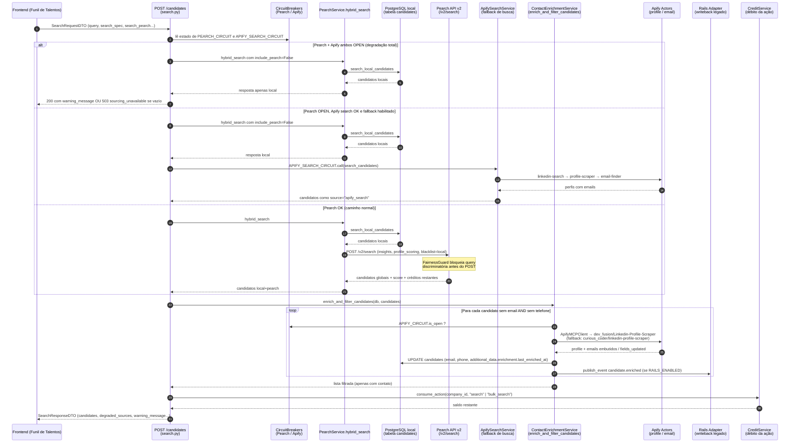

# Funil de Talentos — Fluxo de Busca de Candidatos (Pearch + Apify)

> Documento de referência técnica em pt-BR explicando, ponta a ponta, como funciona a busca de candidatos no **Funil de Talentos** da plataforma LIA, com foco na interação entre **Pearch AI** (descoberta global) e **Apify** (camada de enriquecimento de contato — internamente apelidada de "PIF"), incluindo a lógica condicional, custos, tabelas envolvidas, agentes de sourcing e ferramentas expostas ao loop ReAct.
>
> Toda afirmação aqui está ancorada em arquivos reais do repositório. Não há comportamento inventado.

---

## 1. Resumo executivo (validação da hipótese do usuário)

A hipótese original do usuário era:

1. A busca local (PostgreSQL) é executada primeiro, gratuitamente.
2. **Pearch AI** é chamada para identificar candidatos no banco global.
3. **Apify** ("PIF") é chamada **depois**, apenas para enriquecer candidatos cujos contatos (e‑mail/telefone) estão faltando, porque é muito mais barato que queimar créditos extra do Pearch.
4. Se o Apify não acha o mínimo de contato, o candidato cai fora.
5. Tudo isso para minimizar consumo de créditos Pearch e custo ao cliente.

**Veredito:** **a hipótese está essencialmente correta**, com três precisões importantes:

- "PIF" é um apelido interno; no código é a integração genérica com **Apify** (vários actors, cada um com função distinta — ver §6).
- O Apify aparece em **dois papéis distintos** que precisam ser separados:
  - **(a) Enriquecimento de contato** (papel principal e barato — `~US$ 0.01/candidato`) — chamado **depois** do Pearch para preencher e‑mail/telefone faltantes. É o papel que confirma a hipótese do usuário.
  - **(b) Busca de candidatos como *fallback*** quando o **circuit breaker do Pearch está aberto** (Pearch indisponível). Nesse caso o Apify *substitui* o Pearch como fonte de descoberta, executando um pipeline de 3 passos (search → scrape profile → email finder). Esse modo é desativado por padrão (`APIFY_SEARCH_FALLBACK_ENABLED=false`).
- O Pearch também tem seu próprio *fallback* interno: quando o circuit breaker do Pearch dispara durante a chamada, o serviço cai para uma busca interna RAG (BM25 + pgvector) sobre o pool local, em vez de retornar vazio.

A ordenação **local → Pearch → Apify(enrich)** é, portanto, real e foi desenhada exatamente com a justificativa de custo: Pearch cobra créditos por candidato (1 base + 1 insights + 1 scoring + 2 freshness, no modo `fast`) e cobraria mais ainda se fosse pedido para revelar contatos; Apify cobra `~US$ 0.01` por candidato enriquecido e é usado só onde há lacuna de contato.

---

## 2. Sequência ponta a ponta da busca

### 2.1. Diagrama (Mermaid)



### 2.2. Etapas em texto

1. **Entrada na API.** O frontend faz `POST /candidates` com `SearchRequestDTO`. O endpoint vive em `lia-agent-system/app/api/v1/candidate_search/search.py` (`search_candidates`, linhas ~100‑391).

2. **Avaliação de circuit breakers.** Antes de chamar qualquer fonte externa, o endpoint lê `PEARCH_CIRCUIT.state` e `APIFY_SEARCH_CIRCUIT.state` (`app.shared.resilience.circuit_breaker`). Três caminhos possíveis (search.py, linhas 146‑178):
   - **Degradação total** (Pearch+Apify search ambos `OPEN` e fallback habilitado): pula tudo que é externo, só roda local.
   - **Pearch OPEN, Apify search OK e fallback habilitado**: pula Pearch, agenda chamada ao `apify_search_service` depois da busca local.
   - **Caminho normal**: roda híbrido completo.

3. **`PearchService.hybrid_search`** (`pearch_service.py`, linhas 1062‑1238):
   1. **Local primeiro** (`search_local_candidates`) — só Postgres local, sem custo. Aplica filtros do `search_spec` (funding stages, indústrias, instituições, timezones, países HQ).
   2. **Pearch depois**, se `include_pearch=True` e a chave está configurada. Monta `PearchSearchRequest` com `insights=True`, `profile_scoring=True`, `docid_blacklist=ids_locais` (para não pagar por quem já estava no banco) e chama `search_candidates`, que faz `POST {BASE_URL}/v2/search`.
   3. Antes do POST, **`FairnessGuard.check`** valida a query e bloqueia termos discriminatórios (pearch_service.py linhas 266‑295). Falha-segura: se o guard quebrar, segue.

4. **Fallback do Pearch (interno).** Decoração `@circuit_breaker("pearch", failure_threshold=3, recovery_timeout=15.0, fallback=_pearch_search_fallback)` (linha 241). Quando o breaker dispara ou a chave não está setada, cai para **busca interna RAG** (`RAGPipelineService.search`, BM25 + pgvector) e devolve resultados convertidos para `PearchSearchResponse` com `status="internal_fallback"` (linhas 40‑118). Em 429 do Pearch, mesma rota.

5. **Fallback de busca via Apify** (`apify_search_service.py`). Se `APIFY_SEARCH_FALLBACK_ENABLED=true` e Pearch caiu, o endpoint chama `apify_search_service.search_candidates`, que executa um pipeline de 3 passos:
   - **Step 1 — `curious_coder/linkedin-search`** (`LINKEDIN_SEARCH_ACTOR_ID`): retorna URLs do LinkedIn.
   - **Step 2 — `dev_fusion/Linkedin-Profile-Scraper`** em paralelo (semáforo `APIFY_SEARCH_MAX_CONCURRENT=5`): scrapa perfis.
   - **Step 3 — `curious_coder/email-finder`**: tenta achar email para perfis sem email.
   - Cada etapa registra `StageRecord` com custo (`APIFY_SEARCH_COST_USD=$0.02`, `APIFY_PROFILE_SCRAPE_COST_USD=$0.01`, `APIFY_EMAIL_FINDER_COST_USD=$0.01`) e é gravada via `ConsumptionTrackingService.record_apify_search_call`.

6. **Combinação dos resultados.** O endpoint converte cada `CandidateProfile` em `CandidateSearchResultDTO` marcando `source="local"`, `source="pearch"` ou `source="apify_search"`.

7. **Enriquecimento de contato (Apify, papel principal).** Logo após combinar, o endpoint chama `enrich_and_filter_candidates(db, candidates)` (`_shared.py`, linhas 576‑689). Esse hook:
   - Para cada candidato **sem e‑mail AND sem telefone**, separa quem tem ID UUID (vai pelo `enrich_batch`) de quem tem ID não‑UUID (Apify direto via `enrich_by_linkedin_url`).
   - O `ContactEnrichmentService.enrich_candidate_contact` (`contact_enrichment_service.py`, linhas 67‑184) checa antes:
     - Se já tem contato (`_has_contact`) e `force=False`, retorna como `"existing"` sem custo.
     - Se foi enriquecido nas últimas **24h** (`DEDUP_WINDOW_HOURS = 24`, lido de `additional_data.enrichment.last_enriched_at`), retorna `"dedup_skip"`.
     - Se outro candidato com a mesma URL do LinkedIn foi enriquecido nas últimas 24h (`_linkedin_url_recently_enriched`), retorna `"dedup_linkedin_skip"`.
     - Se `APIFY_CIRCUIT.is_open`, pula sem chamar o Apify.
   - Caso contrário, dispara `CandidateEnrichmentService.enrich_candidate` (`app/domains/candidates/services/candidate_enrichment_service.py`, linhas 47‑140), que usa o `ApifyMCPClient` para chamar **`dev_fusion/Linkedin-Profile-Scraper`** como ator primário (esse ator já devolve `email`, `personalEmail`, `businessEmail`, `secondaryEmail` no próprio payload — não precisa de um `email-finder` à parte). Em caso de falha, faz **fallback** para `curious_coder/linkedin-profile-scraper` (constantes `LINKEDIN_PROFILE_ACTOR` e `LINKEDIN_PROFILE_ACTOR_ALT` no topo do arquivo). Os campos preenchidos são listados em `fields_updated`.
   - Atualiza o candidato em memória, faz `UPDATE` na tabela `candidates` e replica para o Rails legado via `RailsAdapter.publish_event("candidate.enriched", ...)` se `RAILS_ENABLED=true` (`contact_enrichment_service.py`, linhas 444‑484; `rails_adapter.py`).
   - **Filtra candidatos sem contato.** Após a tentativa de enriquecimento, se o candidato continua sem `email` nem `phone`, é removido do resultado (`_shared.py` linhas 670‑688). Esse é o "candidato cai fora" da hipótese do usuário.

8. **Avaliação por rubricas (opcional).** Se `request.job_id` foi passado, busca `JobRequirement` no banco e roda `_evaluate_candidates_with_rubrics` (LLM via `RubricEvaluationService`).

9. **Mensagem de expansão.** Se o usuário pediu só busca local e há poucos candidatos com aderência ≥ 60%, devolve `should_expand_to_global=True` com `expansion_message` sugerindo Pearch.

10. **Débito de créditos da empresa.** No fim, `CreditService.consume_action(db, company_id, "search"|"bulk_search")` debita os créditos do plano da empresa. Saldo baixo dispara `low_balance_warning`.

11. **Resposta.** O endpoint devolve `SearchResponseDTO` com `candidates`, `local_count`, `pearch_count` (incluindo fallback Apify), `warning_message`, `degraded_sources`, `can_load_more`, `should_expand_to_global` e `credits_remaining`.

---

## 3. Encontrar candidatos vs. enriquecer candidatos — separação clara

| Operação | Objetivo | Quem faz | Quando |
|---|---|---|---|
| **Encontrar candidatos** | Descobrir perfis que casam com a query | **Local (Postgres)** sempre primeiro; **Pearch AI** como fonte global; **Apify search pipeline** apenas como *fallback* quando Pearch está fora (e `APIFY_SEARCH_FALLBACK_ENABLED=true`) | A cada `POST /candidates` |
| **Enriquecer candidatos** (hook REST pós‑busca) | Preencher email/telefone faltantes | **`ApifyMCPClient` → `dev_fusion/Linkedin-Profile-Scraper`** (fallback `curious_coder/linkedin-profile-scraper`). O ator primário **já devolve emails embutidos**, dispensando `email-finder`. Nunca usa Pearch. | Pós‑busca, só nos candidatos sem `email` AND sem `phone`; sob *dedup* de 24h e circuit breaker |
| **Enriquecer perfil** (tool do agente) | Atualizar dados de carreira/skills (não só contato) | **`ApifyService.enrich_candidate_profile`** (`apify_service.py`) — invoca `dev_fusion/Linkedin-Profile-Scraper` e, se necessário, **`curious_coder/email-finder`** para descoberta extra de e‑mail. | Apenas quando o agente ReAct chama a tool `enrich_candidate_profile`; **não** entra no caminho REST normal. |
| **Buscar candidatos via Apify** (fallback de busca) | Substituir Pearch quando o circuit breaker está aberto | Pipeline `ApifySearchService` → `curious_coder/linkedin-search` + `dev_fusion/Linkedin-Profile-Scraper` + `curious_coder/email-finder` | Só quando `APIFY_SEARCH_FALLBACK_ENABLED=true` e Pearch indisponível |

> Importante: o *enriquecimento* nunca usa créditos Pearch. Mesmo no caminho "normal" em que Pearch retorna candidatos, **revelar contatos via Pearch não é usado** — o custo de revelação seria `2-14 créditos/candidato`, contra `~US$ 0.01` no Apify. A descrição da tool `enrich_candidate_contact` deixa isso explícito (ver §7).

---

## 4. Lógica condicional do enriquecimento Apify

Resumindo as guardas que disparam (ou não) uma chamada ao Apify para enriquecer contato (`contact_enrichment_service.py` + `_shared.py`):

```
SE candidato.email OU candidato.phone:
    → não enriquece (a menos que force=True)              # _has_contact
SE NOT linkedin_url:
    → não pode enriquecer                                 # sem alvo
SE additional_data.enrichment.last_enriched_at < 24h atrás:
    → skip "dedup_skip"                                   # _recently_enriched
SE outro candidato com mesma linkedin_url enriqueceu < 24h:
    → skip "dedup_linkedin_skip"                          # _linkedin_url_recently_enriched
SE APIFY_CIRCUIT.is_open:
    → skip "Apify circuit breaker open"                   # resilience
SENÃO:
    → chama Apify, custo = APIFY_COST_PER_ENRICHMENT_USD ($0.01)
    → grava additional_data.enrichment.last_enriched_at
    → publica evento candidate.enriched no Rails (se RAILS_ENABLED)
```

E após o enriquecimento, o filtro final em `enrich_and_filter_candidates` remove qualquer candidato que ainda esteja sem `email` E sem `phone` (não importa se a chamada ao Apify retornou erro, *no contact* ou foi pulada por dedup).

A função devolve uma tupla `(kept, EnrichmentStats)` (`_shared.py`). O `EnrichmentStats` carrega `enrichment_attempted` (quantos passaram pelo hook de enriquecimento) e `filtered_no_contact` (quantos foram silenciosamente descartados por continuarem sem email/telefone). Esses dois números são propagados para `SearchResponseDTO`, `SimilarSearchResponse`, `JobDescriptionSearchResponse` e `ArchetypeSearchResponse` pelos respectivos endpoints (`search.py`, `similar_search.py`, `jd_search.py`, `archetypes.py`) como `filtered_no_contact` / `enrichment_attempted`. O frontend lê esses campos no `useCandidatesExecuteSearch` e o `CandidatesTableArea` mostra um banner "N candidatos descartados por não termos como contatar" quando `filtered_no_contact > 0`, fechando o gap em que a contagem só vivia em log.

---

## 5. Modelo de custo e crédito

### 5.1 Pearch AI (créditos)

Definido em `PearchService.estimate_credits` (`pearch_service.py` linhas 176‑204). Esta é a **fonte autoritativa**:

| Componente | Créditos por candidato | Status no `estimate_credits` |
|---|---:|---|
| Base (modo `fast`) | 1 | implementado |
| `insights` | +1 | implementado |
| `profile_scoring` | +1 | implementado |
| `high_freshness` | +2 | implementado |
| Reveal de contato (`require_emails`, `show_emails`, `require_phone_numbers`, `show_phone_numbers`) | **não somado pelo `estimate_credits`** (`email_cost=0`, `phone_cost=0` no código) | descrições do `PearchSearchRequest` mencionam +1/+2/+1/+14 como preços oficiais da API Pearch, mas o cálculo interno **não os inclui** — ver §10.3(B) |

No caminho híbrido, `hybrid_search` envia `insights=True, profile_scoring=True`, então cada candidato Pearch custa **3 créditos** (ou 5 com `high_freshness`).

`docid_blacklist` recebe os IDs dos candidatos locais para que o Pearch não devolva (e não cobre por) perfis que já existem no nosso banco.

Os créditos consumidos são gravados em `ConsumptionTrackingService.record_pearch_call` (`pearch_service._track_pearch_consumption`, linhas 414‑442). O endpoint debita o crédito da empresa via `CreditService.consume_action` no fim da request.

### 5.2 Apify (USD)

Constantes em `apify_service.py`:

- `APIFY_COST_PER_ENRICHMENT_USD = $0.01` (enriquecimento de contato — operação `enrich`)
- Pipeline de busca (em `apify_search_service.py`):
  - `APIFY_SEARCH_COST_USD = $0.02` (`curious_coder/linkedin-search`)
  - `APIFY_PROFILE_SCRAPE_COST_USD = $0.01` (`dev_fusion/Linkedin-Profile-Scraper`)
  - `APIFY_EMAIL_FINDER_COST_USD = $0.01` (`curious_coder/email-finder`)

Tudo é gravado em `ConsumptionTrackingService.record_apify_call` / `record_apify_search_call` para faturamento e analytics.

### 5.3 Por que essa ordem minimiza custo?

- **Local primeiro:** zero custo, e qualquer hit reduz o número de slots que o Pearch precisaria pagar.
- **Pearch depois, com `docid_blacklist`:** evita pagar de novo por quem já temos.
- **Apify só onde há lacuna:** revelação de contato via Pearch ficaria entre 2 e 14 créditos/candidato; via Apify é fixo `~$0.01`.
- **Janela de dedup de 24h** evita re-enriquecer o mesmo perfil (ou a mesma URL) gastando duas vezes.
- **Circuit breakers** garantem que falhas em cascata não acumulem chamadas pagas.

---

## 6. Banco de dados e integradores externos

### 6.1 Tabelas tocadas

- `candidates` (`lia_models.candidate.Candidate`):
  - **Lida** em `search_local_candidates` (filtros + scoring local) e em `enrich_and_filter_candidates` (recarrega contatos atualizados).
  - **Escrita** em `CandidateEnrichmentService.enrich_candidate` ao gravar `email`, `phone`, `additional_data.enrichment.last_enriched_at`, `fields_updated`.
- `JobRequirement` (`lia_models.rubric`): leitura para avaliação por rubricas quando `job_id` é passado.
- Tabelas de consumo / billing via `ConsumptionTrackingService`:
  - `record_pearch_call` — créditos Pearch consumidos.
  - `record_apify_call` — custos Apify de enriquecimento.
  - `record_apify_search_call` — custos Apify do pipeline de busca fallback.
- Saldo de créditos: `CreditService.consume_action` / `get_balance`.
- Auditoria: `audit_service.log_decision` (decisões dos agentes ReAct, ver §7).
- Cache/dedup de enriquecimento: campo JSONB `additional_data.enrichment.last_enriched_at` na própria `candidates` (não há tabela dedicada — o `dedup window` é resolvido em SQL via `ILIKE` da `linkedin_url`).
- Pool de talentos / staging de descobertos: lido por `search_local_candidates` quando `include_discovered=True`.

### 6.2 Serviços externos

- **Pearch API v2** — `https://api.pearch.ai/v2/search` (`PearchService.search_candidates`).
- **Apify actors** (token em `APIFY_API_KEY`). Cada papel usa um caminho de chamada e um conjunto de actors diferente:
  - **Hook REST de enriquecimento de contato** (`CandidateEnrichmentService.enrich_candidate` via `ApifyMCPClient`):
    - `dev_fusion/Linkedin-Profile-Scraper` (`LINKEDIN_PROFILE_ACTOR`) — primário; já devolve `email`, `personalEmail`, `businessEmail`, `secondaryEmail`.
    - `curious_coder/linkedin-profile-scraper` (`LINKEDIN_PROFILE_ACTOR_ALT`) — fallback acionado quando o primário falha.
  - **Tool `enrich_candidate_profile` do agente** (`ApifyService.enrich_candidate_profile`):
    - `dev_fusion/Linkedin-Profile-Scraper` para o perfil.
    - `curious_coder/email-finder` chamado em sequência apenas quando o perfil retorna sem e‑mail.
  - **Fallback de busca via Apify** (`ApifySearchService`):
    - `curious_coder/linkedin-search` — descoberta de URLs.
    - `dev_fusion/Linkedin-Profile-Scraper` — scrape de cada perfil.
    - `curious_coder/email-finder` — última tentativa de e‑mail.
  - **Outros actors disponíveis no `ApifyService`**, fora do fluxo do candidato:
    - `voyager/linkedin-company-profile-scraper` — enriquecimento de empresa.
    - `bebity/glassdoor-scraper` — Glassdoor (company‑side).
    - `anchor/linkedin-person-scraper` — actor legado configurável via `APIFY_LEGACY_ACTOR`.
- **Rails Adapter** (`app/domains/integrations_hub/services/rails_adapter.py`): replica eventos `candidate.enriched` para o sistema legado, mapeando campos via `CANDIDATE_FORK_TO_RAILS` (gateado por `RAILS_ENABLED = bool(RAILS_API_URL)`).
- **RAG interno** (`app.domains.ai.services.rag_pipeline_service.RAGPipelineService`): usado como fallback do Pearch (BM25 + pgvector sobre o pool local).

---

## 7. Catálogo de agentes de sourcing e orquestradores

### 7.1 Agentes
| Nome (registry key) | Arquivo | Papel |
|---|---|---|
| `SourcingReActAgent` (`@register_agent("sourcing")`) | `app/domains/sourcing/agents/sourcing_react_agent.py` | Orquestrador ReAct principal de sourcing (LangGraph nativo). Agrega tools de **todos** os 6 sub‑agentes. Aplica FairnessGuard (Layer 1+3), HITL para outreach, AuditService. |
| `SourcingSearchAgent` (`@register_agent("sourcing_search")`) | `app/domains/sourcing/agents/sourcing_search_agent.py` | Sub‑agente especializado da etapa **talent‑search** (`search_candidates`, `filter_results`, `view_candidate`). Modelo Haiku. Herda de `SourcingReActAgent`. |
| `GithubSourcingAgent` | `app/domains/sourcing/agents/github_sourcing_agent.py` | Sourcing técnico via GitHub API (`github_search_developers`, `github_get_profile`, `github_get_repos`). |
| `StackOverflowSourcingAgent` | `app/domains/sourcing/agents/stackoverflow_sourcing_agent.py` | Sourcing por reputação/tags Stack Exchange (`so_search_experts`, `so_get_user_tags`, `so_get_user_answers`). |
| `DiversitySourcingAgent` | `app/domains/sourcing/agents/diversity_sourcing_agent.py` | Sourcing afirmativo (PCD, mulheres, negros/pardos, LGBTQIA+, 50+, refugiados, baixa renda). FairnessGuard Layer 3 + Four‑Fifths Rule. |
| Demais sub‑agentes do mesmo pacote | `passive_pipeline_agent.py`, `referral_agent.py`, `nurture_sequence_agent.py`, `sourcing_engagement_agent.py`, `sourcing_enrich_agent.py`, `sourcing_planner_agent.py` | Outras etapas do funil de sourcing (passive pipeline, referral, nurture, engagement, enrich dedicado, planner). Ver pasta `app/domains/sourcing/agents/`. |

### 7.2 Orquestradores
| Nome | Arquivo | Papel |
|---|---|---|
| `SourcingAgentOrchestrator` | `app/services/sourcing_agent_orchestrator.py` | Gere agentes persistentes por vaga / talent pool, calibração via Big Card e *feedback loop* tipo Juicebox (approve/reject ↔ `search_strategy`). |
| `TaskPlanner` | `app/orchestrator/task_planner.py` | Decompõe pedidos multi‑agentes (Job Planner → Sourcing → CV Screening → …) em plano ordenado de execução, mapeando para `AgentType.SOURCING` etc. |
| `ActionExecutor` | `app/orchestrator/action_executor/` (pacote: `executor.py`, `action_types.py`, `intents_config.py`, `utils.py`) | Camada que materializa as ações planejadas — invoca tools/agentes correspondentes a cada `action_type`. |
| `MainOrchestrator`, `CascadedRouter`, `FastRouter` | `app/orchestrator/{main_orchestrator.py, cascaded_router.py, fast_router.py}` | Roteamento de mensagens do usuário até o agente correto antes do `TaskPlanner`. |

`STAGE_DEFINITIONS` e `SOURCING_SUBAGENT_STAGE_MAP` (`app/domains/sourcing/agents/sourcing_stage_context.py`) documentam o mapeamento `domain → stage` (`sourcing_github → talent-search`, `sourcing_referral → shortlist-creation`, etc.). O roteamento real, porém, acontece por intenção: o `SourcingReActAgent` expõe **todas** as tools dos sub‑agentes diretamente no grafo LangGraph (`_get_tools`).

---

## 8. Catálogo de tools expostas ao loop ReAct

Definidas em `app/domains/sourcing/agents/sourcing_tool_registry.py` (`TOOL_DEFINITIONS`, mapa `STAGE_TOOLS`):

| Tool | Função interna | Estágio |
|---|---|---|
| `set_search_criteria` | `_wrap_set_search_criteria` | `search-criteria` |
| `suggest_skills` | `_wrap_suggest_skills` | `search-criteria` |
| `search_candidates` | `_wrap_search_candidates` (Postgres + opcional Pearch via `PearchService`) | `talent-search` |
| `filter_results` | `_wrap_filter_results` | `talent-search` |
| `view_candidate` | `_wrap_view_candidate` | `talent-search` |
| `enrich_candidate_profile` | `_wrap_enrich_candidate_profile` (Apify) | `talent-search`, `profile-analysis` |
| `enrich_candidate_contact` | `_wrap_enrich_candidate_contact` (Apify, ~$0.01/candidato — descrição cita explicitamente o trade‑off vs Pearch 2‑14 créditos) | `talent-search`, `profile-analysis` |
| `analyze_profile` | `_wrap_analyze_profile` | `profile-analysis` |
| `compare_candidates` | `_wrap_compare_candidates` | `profile-analysis` |
| `score_candidate` | `_wrap_score_candidate` | `profile-analysis` |
| `add_to_shortlist` / `remove_from_shortlist` / `rank_candidates` / `generate_report` | wrappers correspondentes | `shortlist-creation` |
| `send_outreach` / `generate_message` / `track_response` | wrappers correspondentes | `outreach` |
| `rag_search` | `_wrap_rag_search` (BM25 + pgvector) | global, complementar |

Sub‑agentes têm seus próprios *registries* (`github_tool_registry.py`, `stackoverflow_tool_registry.py`, `diversity_tool_registry.py`, `passive_pipeline_tool_registry.py`, `referral_tool_registry.py`, `nurture_sequence_tool_registry.py`) — todos agregados pelo `SourcingReActAgent._get_tools` e pela função `_aggregate_all_tool_names`.

> Observação importante: a tool `search_candidates` exposta ao agente ReAct **executa um SQL direto sobre `candidates`** com filtro opcional Pearch (`include_pearch`), mas **não passa pelo `enrich_and_filter_candidates`** do endpoint REST. Ou seja, o caminho HTTP (`POST /candidates`) e o caminho via agente compartilham o `PearchService` mas têm *hooks* de enriquecimento diferentes — ver §10.

---

## 9. Modelos de dados relevantes

- `SearchRequestDTO` / `SearchResponseDTO` / `CandidateSearchResultDTO` (`app/api/v1/candidate_search/_shared.py`) — DTOs do endpoint REST.
- `HybridSearchRequest` / `HybridSearchResponse` / `PearchSearchRequest` / `PearchSearchResponse` / `CandidateProfile` / `CreditEstimate` (`lia_models.pearch`).
- `Candidate` (`lia_models.candidate`) — modelo ORM principal; campo `additional_data` é JSONB e armazena, entre outras coisas, `enrichment.last_enriched_at` usado pelo dedup.
- `JobRequirement` / `JobRequirementCreate` / `RequirementPriorityEnum` (`lia_models.rubric`, `app/schemas/rubric.py`) — usados na avaliação por rubricas.
- `StageRecord` / `SearchPipelineResult` (`apify_search_service.py`) — telemetria do fallback Apify.

---

## 10. Filtros avançados, campos de tabela e consumo de créditos nos modais

> Esta seção é o material de referência para o time de desenvolvimento (front + back) entender exatamente quais campos o modal "Filtros avançados" do Funil de Talentos preenche, onde eles caem no banco, e como eles passam para Pearch e Apify.

### 10.1 Estrutura `SearchSpec` (contrato front ↔ back)

O modal de filtros avançados envia, dentro de `SearchRequestDTO.search_spec`, um dicionário que é desserializado em `SearchSpec` (`libs/models/lia_models/pearch.py`, linhas 392‑489). Cada campo abaixo é um filtro real exposto no modal.

| Categoria | Campo do `SearchSpec` | Tipo | Vai para o filtro local? | Vai para Pearch (`custom_filters`)? |
|---|---|---|---|---|
| Localização | `location`, `location_city`, `location_state`, `location_country` | string | sim (`location_city/state/country` em `candidates`) | sim — `custom_filters.location` (somente o campo agregado é mapeado) |
| Cargo | `job_title` | string | indireto (`current_title ILIKE`) | sim — `custom_filters.title` |
| Senioridade | `seniority` | string | sim (`seniority_level ILIKE`) | sim — `custom_filters.seniority` |
| Experiência | `years_experience`, `years_experience_min`, `years_experience_max` | string/int | sim (`years_of_experience` em `candidates`) | sim — `custom_filters.min_years_experience` (apenas mínimo) |
| Skills | `skills`, `required_skills`, `preferred_skills` | string[] | sim (`technical_skills && :skills_arr`) | sim — `custom_filters.skills` (união de `skills + required_skills`) |
| Indústria | `industry`, `industries` | string / string[] | sim (em `candidate_experiences.industries`) | sim — `custom_filters.industries` |
| Empresa | `company`, `companies`, `exclude_companies` | string / string[] | parcialmente (não há filtro local dedicado hoje) | sim — `custom_filters.companies` / `custom_filters.exclude_companies` |
| Salário | `salary_min`, `salary_max`, `salary_currency` | float | não (não há coluna de salário em `candidates`) | não (Pearch não expõe salário no `custom_filters`) |
| Modelo de trabalho | `work_model` (remote/hybrid/onsite), `contract_type` (CLT/PJ/freelance) | string | não (precisa ser inferido do JD/headline) | não |
| Idiomas | `languages` | string[] | não (lookup via `Language` quando disponível) | sim — `custom_filters.languages` |
| Educação | `education_level` | string | parcialmente (via `candidate_education`) | não |
| Disponibilidade | `is_open_to_work`, `has_email`, `has_phone` | bool | sim (`has_email`/`has_phone` no DTO de saída) | indireto (ativa `require_emails` / `require_phone_numbers`) |
| **Funding** *(novo)* | `funding_stages`, `funding_stage` | string[] / string | **sim** — `candidate_experiences.funding_stage` | não (Pearch ignora — filtro só local) |
| **HQ da empresa** *(novo)* | `company_hq_countries`, `company_hq_country` | string[] / string | **sim** — `candidate_experiences.company_hq_country` | não |
| **Tags da empresa** *(novo)* | `company_tags` | string[] | **sim** — `candidate_experiences.company_tags` | não |
| **Tier de instituição** *(novo)* | `institution_tiers`, `institution_tier` | string[] / string | **sim** — `candidate_education.institution_tier` | não |
| **País de instituição** *(novo)* | `institution_countries`, `institution_country` | string[] / string | **sim** — `candidate_education.institution_country` | não |
| **Ranking de instituição** *(novo)* | `institution_ranking_max` | int | **sim** — `candidate_education.institution_ranking <= N` | não |
| **Timezone do candidato** *(novo)* | `timezones`, `timezone` (suporta wildcard `%`/`*`) | string[] / string | **sim** — `candidates.timezone` (igualdade ou `ILIKE`) | não |

> Importante para o front: os campos marcados como *(novo)* são **exclusivos do banco local** — Pearch não recebe nem entende esses filtros. Se o usuário ligar só esses filtros e marcar "buscar global", os candidatos vindos do **Pearch** virão sem essa restrição. Hoje o `to_pearch_custom_filters()` simplesmente **não inclui** funding/HQ/tags/instituição/timezone — está consciente.

> Também relevante: `should_use_strict_filters()` decide se Pearch usa `strict_filters=true` quando ≥3 dos seguintes estão presentes: `location`, `seniority`, `years_experience_min`, `required_skills` não‑vazio, `industry/industries`. Os filtros novos *(funding, HQ, etc.)* **não contam** para essa especificidade.

### 10.2 Tabelas e colunas tocadas pelo fluxo

#### `candidates` (tabela principal)
- **Lida** em `search_local_candidates` e em `enrich_and_filter_candidates` (recarrega contatos atualizados).
- **Filtros aplicados**: `is_active`, `current_title`, `technical_skills`, `location_city/state/country`, `seniority_level`, `years_of_experience`, `lia_score`, `timezone` *(novo, migration 009)*.
- **Escrita pelo enriquecimento** (`CandidateEnrichmentService.enrich_candidate` via `dev_fusion/Linkedin-Profile-Scraper`):
  - Contato: `email`, `best_personal_email`, `best_business_email`, `secondary_email`, `phone` (quando vier do payload).
  - `additional_data` (JSONB): chave `enrichment.last_enriched_at` (ISO 8601, base do dedup de 24h).
  - Demais campos pessoais que vierem no payload do ator (~40 campos: `headline`, `summary`, `picture_url`, `linkedin_url`, `total_experience_years`, etc. — ver `_apply_profile_data` em `candidate_enrichment_service.py` a partir da linha ~194).
- **Novos campos da migration 009** (`database/migrations/009_add_filter_fields.sql`):
  - `timezone VARCHAR(50)` + índice parcial.
  - `past_locations JSONB` (`[{city, state, country, from, to}]`) — populado pelo enriquecimento do LinkedIn.

#### `candidate_experiences` (1:N de `candidates`)
- Populada pelo Apify (parser do `dev_fusion/Linkedin-Profile-Scraper`).
- **Colunas usadas como filtro**: `funding_stage`, `company_tags`, `company_hq_city`, `company_hq_state`, `company_hq_country`, `industries` (já existente).
- Migration 009 cria índices parciais em `funding_stage` e `company_hq_country`.

#### `candidate_education` (1:N de `candidates`)
- Também populada pelo enriquecimento Apify.
- **Colunas usadas como filtro**: `institution_city`, `institution_state`, `institution_country`, `institution_ranking`, `institution_tier` (todas adicionadas pela migration 009).
- Índices parciais em `institution_country` e `institution_tier`.

#### Consumo / billing
- `credit_accounts` — uma linha por `company_id`. Lida e atualizada por `CreditService.consume_action` (via `SELECT ... FOR UPDATE`).
- `credit_transactions` — *append‑only*. Cada busca/enriquecimento gera uma transação tipo `CONSUMPTION` com `action_type` (`search` / `bulk_search` / `apify_enrichment` / etc.), `amount` negativo, `balance_after`, `description`, `reference_type` / `reference_id` (quando aplicável).
- Tabelas de telemetria do `ConsumptionTrackingService`: registram cada chamada Pearch/Apify (créditos Pearch consumidos, USD do Apify, latência) — usadas para painel de consumo, **não** para o saldo do usuário.

### 10.3 Consumo de créditos nos modais (visão de produto)

Existem três conceitos **diferentes** que aparecem na UI/operacional e que não devem ser confundidos:

#### A) Crédito interno LIA (`credit_accounts.balance`)

Este é o crédito que o cliente vê na UI ("você tem N créditos restantes"). Custo **fixo por ação**, definido em `ACTION_CREDIT_COSTS` (`app/domains/credits/services/credit_service.py`, linhas 25‑37):

| `action_type` | Crédito por chamada | Quando é debitado |
|---|---:|---|
| `search` | **2** | Busca **só local** (modal de filtros avançados sem Pearch). Disparado quando `request.search_pearch=False`. |
| `bulk_search` | **5** | Busca **híbrida com Pearch**. Disparado quando `request.search_pearch=True`. |
| `pearch_search` | 2 | Reservado para chamadas explícitas de Pearch (não usado pelo endpoint REST hoje — ele cai em `bulk_search`). |
| `apify_enrichment` | **0** | Enriquecimento de contato pós‑busca. **Não consome crédito interno** — o custo Apify (USD) é tratado separadamente no painel de consumo. |
| `analysis` | 5 | Análise individual de perfil (tool `analyze_profile`). |
| `screening` | 10 | Triagem WSI por candidato. |
| `report` | 8 | Geração de relatório. |
| `ai_chat` | 1 | Cada mensagem do chat com a LIA. |
| `email_send` | 1 | Envio de e‑mail / outreach. |
| `interview_schedule` | 3 | Agendamento de entrevista. |
| `cv_parsing` | 3 | Parse de CV no upload. |

> **O que o front precisa mostrar no modal de busca:** se o usuário marca "incluir busca global (Pearch)", a label do botão deve indicar **"−5 créditos"**; senão, **"−2 créditos"**. O débito acontece **uma vez por busca**, não por candidato. `low_balance_warning` vira `true` quando o saldo cai abaixo de `account.low_balance_threshold` (default `20`) — usar para mostrar banner amarelo de "saldo baixo".

> **Modais de enriquecimento individual** ("Revelar contato", "Enriquecer perfil"): hoje gravam `action_type=apify_enrichment` com custo **0 créditos internos**, porque o custo é em USD para a operadora (LIA), não para o cliente. Se o produto decidir cobrar, basta mudar o valor em `ACTION_CREDIT_COSTS["apify_enrichment"]` — **nenhum outro código precisa mudar**. Documentar isso evita que o time ache que está "tudo grátis para sempre".

#### B) Créditos Pearch (telemetria, não cobra do usuário)

Pearch tem o próprio sistema de créditos, cobrado no contrato com a LIA (não com o cliente final). A função autoritativa é `PearchService.estimate_credits` (`pearch_service.py` linhas 176‑204). **Hoje** ela só conta base + insights + profile_scoring + freshness — explicitamente seta `email_cost=0` e `phone_cost=0`:

| Componente | Custo (créditos Pearch) | Status no `estimate_credits` |
|---|---:|---|
| Base (`SearchType.FAST`) | 1 / candidato | **implementado** (sempre que `include_pearch=True`) |
| `insights` | +1 / candidato | **implementado** (hardcoded em `hybrid_search`) |
| `profile_scoring` | +1 / candidato | **implementado** (hardcoded em `hybrid_search`) |
| `high_freshness` | +2 / candidato | **implementado** (não exposto no modal hoje) |

> Total padrão hoje: **3 créditos Pearch / candidato** (base+insights+scoring) ou **5 créditos** se `high_freshness=true`. Esse é o número que aparece no `warning_message` da `HybridSearchResponse` (`"Busca Pearch pode consumir até X créditos"`) e que o front pode mostrar como "estimativa de consumo Pearch", **separado** do "−5 créditos LIA".

**Não implementado em `estimate_credits` (planejado / informativo):** o `PearchSearchRequest` (`libs/models/lia_models/pearch.py` linhas 252‑257) documenta nas descrições dos próprios campos os preços oficiais de revelação de contato cobrados pela API Pearch — `require_emails` (+1), `show_emails` (+2), `require_phone_numbers` (+1), `require_phones_or_emails` (+1) e `show_phone_numbers` (+14) por candidato. Nenhum desses incrementos é somado pelo `estimate_credits` atual; o `warning_message` mostrado ao usuário, portanto, **subestima** o consumo Pearch caso esses campos sejam ligados. A regra de produto adotada hoje contorna esse buraco: nunca usar `show_emails`/`show_phone_numbers` no caminho REST — quem precisa de contato cai no Apify (`~US$ 0.01 / candidato`).

#### C) Custo Apify (telemetria, em USD)

| Operação | Custo (USD) | Onde é registrado |
|---|---:|---|
| Enriquecimento de contato (`apify_enrichment`) | `APIFY_COST_PER_ENRICHMENT_USD = $0.01` | `ConsumptionTrackingService.record_apify_call` |
| Pipeline de busca fallback — search step | `APIFY_SEARCH_COST_USD = $0.02` | `record_apify_search_call` |
| Pipeline de busca fallback — profile scrape | `APIFY_PROFILE_SCRAPE_COST_USD = $0.01` | `record_apify_search_call` |
| Pipeline de busca fallback — email finder | `APIFY_EMAIL_FINDER_COST_USD = $0.01` | `record_apify_search_call` |

Esses valores **não entram em `credit_accounts`** — são apenas registrados para painel de consumo / faturamento. Se o produto quiser repassar custo Apify ao cliente, é necessário (1) decidir taxa (ex.: `1 crédito = $0.005`), (2) mudar `ACTION_CREDIT_COSTS["apify_enrichment"]` para o valor proporcional, e (3) atualizar o modal para mostrar isso. Hoje, **não há repasse**.

### 10.4 Resumo prático por modal

| Modal | Ação no back | Crédito LIA debitado | Custo externo (Pearch / Apify) |
|---|---|---:|---|
| **Buscar (filtros avançados, sem Pearch)** | `POST /candidates` com `search_pearch=false` | **2** (`search`) | 0 |
| **Buscar (filtros avançados, com Pearch)** | `POST /candidates` com `search_pearch=true` | **5** (`bulk_search`) | Pearch ≈ 3 créditos / candidato (base+insights+scoring) + Apify `$0.01` para quem precisa de contato |
| **Revelar email/telefone do candidato** | `enrich_candidate_contact` (tool ou endpoint) | **0** (`apify_enrichment`) | Apify `$0.01` / candidato |
| **Enriquecer perfil completo** | `enrich_candidate_profile` (tool) | **0** | Apify `$0.01` (perfil) + `$0.01` (email-finder, se necessário) |
| **Análise individual de perfil** | tool `analyze_profile` | **5** (`analysis`) | 0 |
| **Triagem WSI por candidato** | screening | **10** (`screening`) | LLM (custo separado) |
| **Geração de relatório** | report | **8** (`report`) | 0 |
| **Mensagem para LIA** | chat | **1** (`ai_chat`) | LLM |
| **Outreach (envio de e‑mail)** | `send_outreach` | **1** (`email_send`) | provedor de e‑mail |

> Todas essas ações passam por `CreditService.consume_action`, gerando uma linha em `credit_transactions` com o `action_type` correspondente — o painel de consumo do cliente lê dessa tabela.

---

## 11. Perguntas em aberto / riscos identificados

1. **Duas implementações de `_evaluate_candidates_with_rubrics`** coexistem: uma em `_shared.py` (linhas 385‑403) que usa o singleton `rubric_evaluation_service` e outra em `search.py` (linhas 71‑95) que aceita `rubric_svc` injetado. O endpoint chama a segunda; a primeira é importada mas não usada pelo endpoint atual. Risco baixo, mas é fonte de confusão.

2. **Tool `search_candidates` do agente ReAct não passa por `enrich_and_filter_candidates`.** Ela faz SQL direto + chamada opcional ao `PearchService.search_candidates`, sem dedup, sem filtro de "sem contato" e sem débito de créditos. Quando o agente faz a busca, o comportamento é diferente do endpoint REST. Vale alinhar (ou documentar isso como decisão consciente).

3. **Fallback de busca via Apify está desativado por padrão** (`APIFY_SEARCH_FALLBACK_ENABLED=false`). Em produção, isso significa que se o Pearch ficar fora, o usuário só vê o pool local + RAG fallback do próprio Pearch. O caminho de fallback Apify só está exercitado em ambientes onde a flag foi ligada.

4. **Dedup por LinkedIn URL usa `ILIKE` sobre o slug** (`_linkedin_url_recently_enriched`, `contact_enrichment_service.py` linhas 419‑442). Se a URL não tiver `/in/`, o split devolve a string inteira e a busca pode bater amplo demais ou de menos. Funcional, mas frágil.

5. **`PearchService` decora com `@circuit_breaker` e com `@retry(stop=stop_after_attempt(2))`.** A interação retry × breaker é correta na prática, mas merece um teste explícito — duas tentativas dentro do mesmo `call` podem queimar duas falhas no breaker em sequência.

6. **Telemetria do crédito Pearch é estimada, não autoritativa.** `_track_pearch_consumption` usa `min(estimate.total_estimated, per_candidate * len(results))`. A própria Pearch também devolve `credits_remaining`, que é registrado mas não usado para auditar a estimativa. Pequeno risco de divergência contábil.

7. **`hybrid_search` engole exceções do Pearch silenciosamente** (linhas 1218‑1220) escrevendo apenas `warning_message`; o circuit breaker dispara separadamente via decorator, então a contagem de falhas e o que o usuário vê podem ficar desencaixados em casos raros.

8. **`enrich_and_filter_candidates` filtra candidatos sem contato no caminho REST** e agora devolve `EnrichmentStats(enrichment_attempted, filtered_no_contact)` junto com a lista. Os 4 endpoints REST de busca expõem `filtered_no_contact`/`enrichment_attempted` no DTO de resposta e o Funil de Talentos mostra um aviso explícito quando há candidatos descartados — antes essa contagem só aparecia em log (Task #394).

---

## 11. Referências cruzadas (arquivo → responsabilidade)

- `app/api/v1/candidate_search/search.py` — endpoint REST e orquestração de circuit breakers.
- `app/api/v1/candidate_search/_shared.py` — DTOs, `enrich_and_filter_candidates`, helpers.
- `app/domains/sourcing/services/pearch_service.py` — integração Pearch v2, `hybrid_search`, fallback RAG, estimativa de créditos.
- `app/domains/sourcing/services/contact_enrichment_service.py` — orquestra enriquecimento de contato via Apify, dedup 24h, sync Rails.
- `app/domains/candidates/services/candidate_enrichment_service.py` — `CandidateEnrichmentService.enrich_candidate`: executa o scrape LinkedIn em si via `ApifyMCPClient` + `dev_fusion/Linkedin-Profile-Scraper` (fallback `curious_coder/linkedin-profile-scraper`) e atualiza `candidates`.
- `app/domains/sourcing/services/apify_service.py` — wrapper de `ApifyService.run_apify_actor` e atalhos `_scrape_linkedin_person`, `_discover_email`, `enrich_candidate_profile` (usado pela tool do agente, **não** pelo hook REST).
- `app/domains/sourcing/services/apify_mcp_client.py` — cliente MCP usado pelo `CandidateEnrichmentService`.
- `app/domains/sourcing/services/apify_search_service.py` — pipeline 3‑step de busca como fallback do Pearch.
- `app/domains/sourcing/agents/sourcing_react_agent.py` — agente ReAct principal, agrega tools, FairnessGuard/HITL/Audit.
- `app/domains/sourcing/agents/sourcing_search_agent.py` — sub‑agente Haiku para `talent-search`.
- `app/domains/sourcing/agents/{github,stackoverflow,diversity,passive_pipeline,referral,nurture_sequence,...}_sourcing_agent.py` — sub‑agentes especializados.
- `app/domains/sourcing/agents/sourcing_tool_registry.py` — `TOOL_DEFINITIONS`, `STAGE_TOOLS`, wrappers (`_wrap_search_candidates`, `_wrap_enrich_candidate_contact`, `_wrap_enrich_candidate_profile`, etc.).
- `app/services/sourcing_agent_orchestrator.py` — orquestrador de agentes persistentes por vaga / pool (calibração + feedback loop).
- `app/orchestrator/task_planner.py` — `TaskPlanner` que decompõe pedidos multi‑agentes.
- `app/orchestrator/action_executor/` — `ActionExecutor` que materializa ações planejadas.
- `app/domains/integrations_hub/services/rails_adapter.py` — `RailsAdapter`, `CANDIDATE_FORK_TO_RAILS`, `publish_event`.
- `app/shared/resilience/circuit_breaker.py` — `PEARCH_CIRCUIT`, `APIFY_CIRCUIT`, `APIFY_SEARCH_CIRCUIT`, `get_degraded_response`.
- `app/shared/compliance/fairness_guard.py` — `FairnessGuard` (bloqueio de queries discriminatórias).
- `app/domains/billing/services/consumption_tracking_service.py` — `record_pearch_call`, `record_apify_call`, `record_apify_search_call`.
- `app/domains/credits/services/credit_service.py` — `CreditService.consume_action` / `get_balance`.
