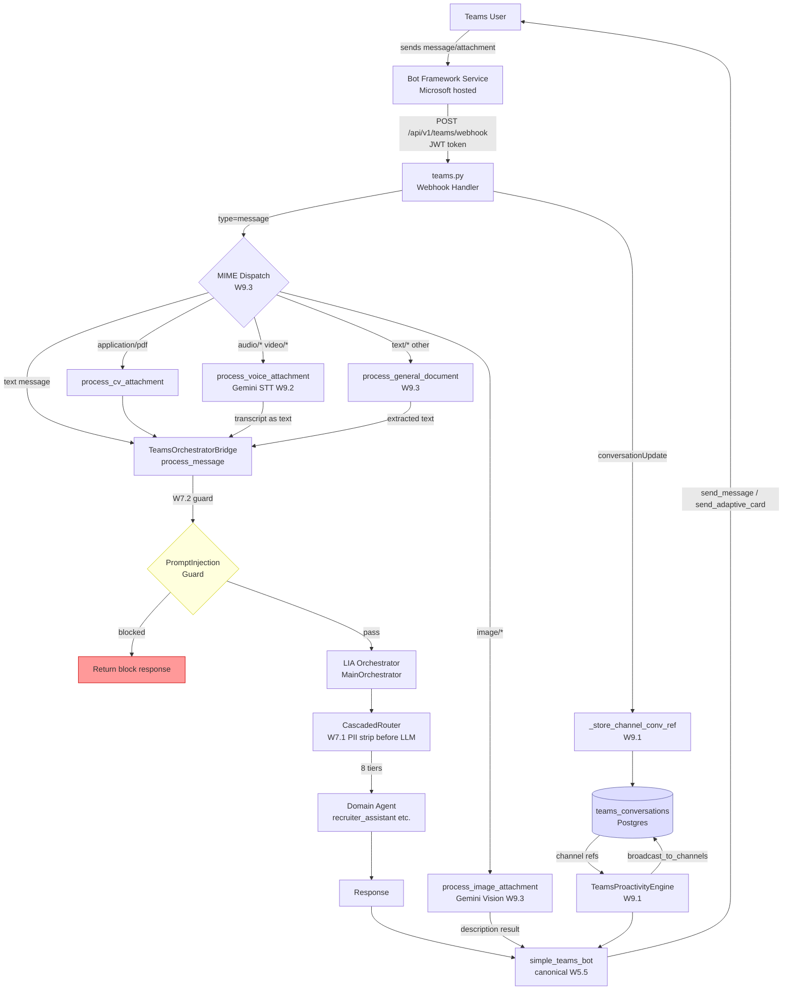

# Teams Endpoints Collection + Architecture Diagram

---

## Endpoint Collection (Bruno/Postman format)

Base URL: `https://{platform-domain}/api/v1/teams`

All endpoints require a valid Bot Framework JWT token unless noted as `public`.

---

### 1. Webhook (main entry point)

```
POST /teams/webhook
Content-Type: application/json
Authorization: Bearer <bot-framework-token>

// Text message
{
  "type": "message",
  "text": "Quantas vagas abertas temos hoje?",
  "from": { "id": "aad:<object-id>", "name": "Alice Recruiter" },
  "conversation": { "id": "19:abc@thread.v2" },
  "channelData": { "tenant": { "id": "<tenant-id>" } },
  "serviceUrl": "https://smba.trafficmanager.net/br/"
}

// PDF attachment
{
  "type": "message",
  "text": "",
  "attachments": [{
    "contentType": "application/pdf",
    "contentUrl": "https://smassets.teams.microsoft.com/...",
    "name": "candidato.pdf"
  }],
  ...
}

// Audio attachment (W9.2)
{
  "type": "message",
  "attachments": [{
    "contentType": "audio/mpeg",
    "contentUrl": "https://smassets.teams.microsoft.com/...",
    "name": "voice_note.mp3"
  }],
  ...
}
```

**Response:** `{"status": "ok"}`

---

### 2. Health

```
GET /teams/health
Authorization: Bearer <bot-token>

Response 200:
{
  "status": "healthy",
  "bot_configured": true,
  "proactivity_enabled": true
}
```

---

### 3. Manifest (public — for sideloading)

```
GET /teams/manifest
// No auth required

Response 200: JSON manifest object

GET /teams/manifest-zip
// Returns ZIP file for Teams app upload
```

---

### 4. Proactive Notifications

```
POST /teams/proactive/new-candidate
Authorization: Bearer <internal-token>
{
  "company_id": "<uuid>",
  "tenant_id": "<azure-tenant-id>",
  "candidate_name": "João Silva",
  "vacancy_title": "Engenheiro Python Sr",
  "match_score": 0.87
}

POST /teams/proactive/screening-complete
Authorization: Bearer <internal-token>
{
  "company_id": "<uuid>",
  "tenant_id": "<azure-tenant-id>",
  "candidate_id": "<uuid>",
  "result": "approved",
  "score": 4.2
}

POST /teams/proactive/daily-digest
Authorization: Bearer <internal-token>
{
  "company_id": "<uuid>",
  "tenant_id": "<azure-tenant-id>"
}

POST /teams/proactive/check
Authorization: Bearer <internal-token>
{
  "company_id": "<uuid>"
}
```

---

### 5. Calendar Integration

```
POST /teams/calendar/schedule
Authorization: Bearer <user-token (OBO)>
{
  "candidate_id": "<uuid>",
  "vacancy_id": "<uuid>",
  "recruiter_email": "recruiter@empresa.com",
  "candidate_email": "candidato@gmail.com",
  "scheduled_at": "2026-05-05T14:00:00-03:00",
  "duration_minutes": 60,
  "title": "Entrevista Técnica — Engenheiro Python"
}

POST /teams/calendar/cancel
{
  "event_id": "<microsoft-event-id>",
  "reason": "Candidato desistiu"
}
```

---

### 6. Tab Auth (SSO)

```
GET /teams/auth/sso-page
// Returns HTML page with TeamsSDK token acquisition script
// Redirects to /teams/auth/callback after token exchange

GET /teams/auth/callback?token=<sso-token>
// Exchanges Teams SSO token for Graph OBO token
// Returns user profile + internal JWT

POST /teams/tab/auth
{
  "teams_token": "<sso-token>",
  "tenant_id": "<azure-tenant-id>"
}
// Response: { "user_id": "...", "company_id": "...", "jwt": "..." }

POST /teams/tab/events
{
  "event_type": "page_view",
  "page": "pipeline",
  "duration_ms": 45000,
  "company_id": "<uuid>"
}
```

---

### 7. Messages (direct send — internal use)

```
POST /teams/messages
Authorization: Bearer <internal-token>
{
  "conversation_id": "19:abc@thread.v2",
  "service_url": "https://smba.trafficmanager.net/br/",
  "text": "Sua vaga foi aprovada.",
  "company_id": "<uuid>"
}
```

---

### 8. Audit + Feedback

```
GET /teams/webhook/audit-logs?company_id=<uuid>&limit=50
Authorization: Bearer <admin-token>

POST /teams/feedback
{
  "conversation_id": "19:abc@thread.v2",
  "rating": 5,
  "comment": "Resposta rápida e precisa",
  "message_id": "<uuid>"
}

POST /teams/send-notification
{
  "company_id": "<uuid>",
  "notification_type": "new_candidate",
  "data": { ... }
}
```

---

## Architecture Diagram (Mermaid)



---

## W9.x Attachment Processing Summary

| MIME type | Handler | Output |
|---|---|---|
| `application/pdf`, `*.pdf` | `process_cv_attachment` | Adaptive Card with candidate profile |
| `image/*` | `process_image_attachment` (Gemini Vision) | Text description + web platform link |
| `audio/*`, `video/*` | `process_voice_attachment` (Gemini STT) | Transcript routed through orchestrator |
| `text/plain`, `text/csv`, `*.txt`, `*.csv` | `process_general_document` | Text extracted → orchestrator as text message |
| `.docx`, `.xlsx`, binary | `process_general_document` | Redirect to web platform |
