# Cartografia Arquitetural: WeDOTalent LIA Platform
*Versão 1.0 | Data: 2026-04-30 | Construída exclusivamente do código real do Replit*

> **Convenções:** Marcadores epistêmicos `[FATO]` (lido em path:linha via SSH) / `[HIPÓTESE]` (inferido sem confirmação direta). IDs estáveis no formato `V{n}-{tipo}{n}` (ex: `V7-A12`, `V12.5-AL3`). Vocabulário desta cartografia é canônico — Auditoria e Remediação devem referenciar os mesmos nomes e IDs.

---

## Sumário Executivo de Uma Página

**Magnitude:** WeDOTalent é uma plataforma de agentes IA enterprise multi-tenant para recrutamento. Backend FastAPI: **514.363 linhas Python**, **1.949 arquivos**, **63 domínios DDD**, **108 arquivos de agente** organizados em ~32 classes principais, **30 tool registries** expondo ~200+ tools, **38 tasks Celery**, **102 alembic migrations**, **264 routers HTTP** em api/v1. Frontend Next.js 16 App Router: **2.270 .ts/.tsx**, **939 components**, **209 hooks**, **23 stores Zustand**, **40 pages**, **532 API routes** (507 em backend-proxy/).

**Stack:** Python 3.11 + FastAPI 0.115 + SQLAlchemy 2.0 + Alembic 1.14 + Pydantic 2.10 + LangChain 0.3.9 + LangGraph 0.2.53 + Celery 5.4 + Redis 5.2 + RabbitMQ (via aio-pika 9.5) + Postgres 16 + pgvector 0.3.6 + Fernet 44.0. Front Next.js 16.2.4 + React 19 + TypeScript 5.8 + shadcn/ui + Zustand 5 + SWR 2.4 + WorkOS 7.82 + @rails/actioncable 8.1 + Biome.

**Topologia runtime:** 4 microserviços FastAPI (api 8000, api-vagas 8001, api-funil 8002, api-onboarding 8003) + 3 Celery workers (high/normal/low priority) + 1 Celery beat + Flower 5555 + Postgres+pgvector + Redis 7 + RabbitMQ 3.

**Fluxos canônicos (4):** F1 candidato via WhatsApp/portal (ingestão), F2 recrutador via chat unificado (síncrono REST/WS/SSE), F3 API REST síncrona (CRUD + lifecycle), F4 background async (Celery tasks + 14+ schedules diários/horários).

**Cross-cutting ativos (12 camadas):** Fairness Layer (regex 111 PT-BR + 38 EN, exception 451), PII Mask (4 patterns globais + Layer 4 Presidio opt-in + Fernet encrypt at rest), Prompt Injection Guard (3 camadas com security_patterns canônico), Intent Classifier (Claude structured-output 5 intents), Audit Log (8 decision types, retenção SOX 7y/LGPD 5y), LGPD DSR (10 endpoints), Output Guardrails (FactChecker 5 claim types), Memory (working+long-term+resolver+compressor), RAG (4 embedding providers + pgvector + RAGAS eval), LLM Factory + BYOK (Choose Your AI com tier1/tier2 enforcement + linter CI), Multi-tenancy + RLS (3 migrations: 040+068+102 com FORCE ROW LEVEL SECURITY), ML Pipelines não-LLM (BARS scoring + classical ranking + drift detection).

**Sinais de maturidade enterprise:** RLS no DB (defesa em profundidade), DSR 10 endpoints completos, consent versioning + LegalBasis enum, retenção legal por tipo (SOX/LGPD), eval framework rico (29 test dirs incluindo `deepeval/`, `ragas/`, `fairness/`, `golden/`, `chaos/`, `characterization/`), 8 libs editáveis bem separadas, BYOK encryption Fernet com linter CI.

**Sinais de fragilidade observados (entregues à auditoria):** Tier 4 (FastRouter) e Tier 5 (LLMCascade) sem invocação explícita de Fairness/PII/Injection (cobertura provável herdada do MainOrchestrator pre-compliance, mas vale validar). 1 bypass real de BYOK em `skills_ontology_engine.py:535`. 21 modelos sem `company_id` (alguns by-design globais, outros suspeitos). Sentry não detectado em main.py inicial. APScheduler 3.10 instalado mas Celery beat lidera schedules — coexistência vs legado. 264 include_router em routes.py (god module — candidate to split).

---

## Parte I — Vistas Contextuais

### V1. Mapa de Contexto [V1]

**Tese da vista:** A plataforma WeDOTalent é o sistema central que orquestra recrutamento entre 6 atores externos (recrutadores, candidatos, ATS de terceiros, provedores LLM, canais de comunicação, infraestrutura cloud) através de webhooks síncronos, OAuth callbacks, WebSockets e APIs REST.

**Diagrama:**

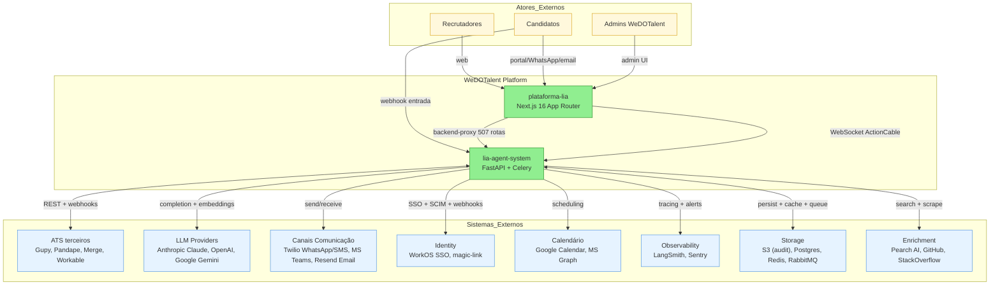

**Inventário (atores e sistemas externos):**

| ID | Tipo | Nome | Direção | Ponto de contato |
|---|---|---|---|---|
| V1-AE1 | Ator | Recrutador | I/O | Web FE Next.js (autenticado WorkOS) |
| V1-AE2 | Ator | Candidato | I/O | Portal público + WhatsApp + email |
| V1-AE3 | Ator | Admin WeDOTalent | I/O | UI admin (`/api/admin/*`) |
| V1-SE1 | Sistema | Anthropic Claude | OUT | langchain-anthropic 0.3.22, BYOK per-tenant |
| V1-SE2 | Sistema | OpenAI | OUT | langchain-openai 0.2.9 (LLM + embeddings 1536d) |
| V1-SE3 | Sistema | Google Gemini | OUT | langchain-google-vertexai 2.0.8 + google.genai (voice live) |
| V1-SE4 | Sistema | Twilio | I/O | webhook entrada (`/api/v1/whatsapp_webhook`) + saída (WhatsApp/SMS) |
| V1-SE5 | Sistema | Microsoft Teams | I/O | botbuilder 4.17 + msal 1.31 + msgraph 1.12 |
| V1-SE6 | Sistema | Resend | OUT | email transacional |
| V1-SE7 | Sistema | Mailgun | I/O | webhook entrada (`/api/v1/mailgun_webhooks`) |
| V1-SE8 | Sistema | WorkOS | I/O | SSO + SCIM + webhooks (`/api/v1/workos/*`) |
| V1-SE9 | Sistema | Google Calendar | OUT | google-api-python-client 2.151 |
| V1-SE10 | Sistema | LangSmith | OUT | tracing LLM (env `LANGCHAIN_TRACING_V2=true`) |
| V1-SE11 | Sistema | Sentry | OUT | sentry-sdk 2.19 (init pendente verificação) |
| V1-SE12 | Sistema | S3 | OUT | boto3 em [audit_storage.py:110](libs/audit/lia_audit/audit_storage.py:110) — armazenamento de auditoria |
| V1-SE13 | Sistema | Pearch AI | OUT | candidate enrichment (env `PEARCH_API_KEY`) |
| V1-SE14 | Sistema | Merge.dev | I/O | webhook entrada (`/api/v1/merge_webhooks`) — agrega ATS |
| V1-SE15 | Sistema | GitHub | OUT | sourcing (subagent github_sourcing_agent) |
| V1-SE16 | Sistema | StackOverflow | OUT | sourcing (subagent stackoverflow_sourcing_agent) |
| V1-SE17 | Sistema | Jira | OUT | bug tracking (`/api/jira/*`) |
| V1-SE18 | Sistema | ATS Externos | I/O | Gupy, Pandape, Workable via [ats_factory.py](app/shared/providers/ats_factory.py) + `merge_webhooks` |

**Notas de leitura:**
- O sistema central (WeDOTalent) é representado como bloco único; o detalhe interno está em V3+.
- Direção `I/O` significa que há tanto chamadas saintes quanto webhooks/callbacks entrantes.
- Webhooks entrantes catalogados: 6 endpoints em `/api/v1/*_webhook*.py` (whatsapp, mailgun, merge, external, job_status, webhooks genéricos).

---

### V2. Mapa de Propósito [V2]

**Tese da vista:** A plataforma resolve 8 casos de uso macro do ciclo de recrutamento — descoberta, atração, triagem, avaliação, decisão, oferta, integração e acompanhamento — distribuídos entre recrutadores (orquestram) e candidatos (são o objeto), com automação por agentes IA em cada etapa.

**Diagrama:**

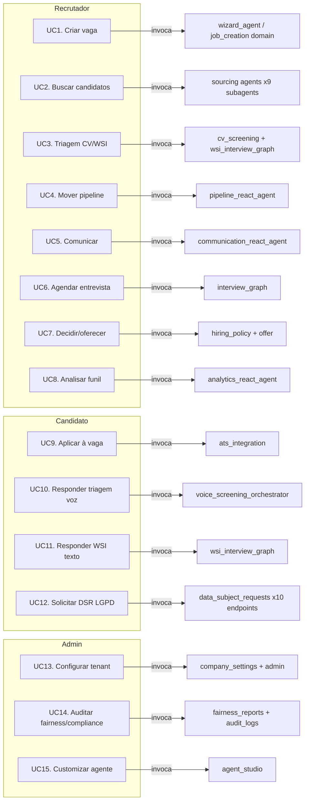

**Inventário (casos de uso):**

| ID | Caso de uso | Ator primário | Agente principal | Domínio | Canal entrada |
|---|---|---|---|---|---|
| V2-UC1 | Criar vaga | Recrutador | wizard_agent | job_creation, job_management | UI wizard + chat |
| V2-UC2 | Buscar candidatos | Recrutador | sourcing_react_agent + 9 subagents | sourcing | chat conversacional |
| V2-UC3 | Triagem CV+WSI | Recrutador | cv_screening agents + wsi_interview_graph | cv_screening | chat + UI WSI |
| V2-UC4 | Mover pipeline | Recrutador | pipeline_react_agent | pipeline | kanban + chat |
| V2-UC5 | Comunicar | Recrutador | communication_react_agent | communication | chat + email composer |
| V2-UC6 | Agendar entrevista | Recrutador/Candidato | interview_graph (LangGraph) | interview_scheduling | chat + calendário |
| V2-UC7 | Decidir/oferecer | Recrutador | hiring_policy + offer agents | hiring_policy, offer | chat + offer wizard |
| V2-UC8 | Analisar funil | Recrutador | analytics_react_agent | analytics | dashboard + chat |
| V2-UC9 | Aplicar à vaga | Candidato | (lifecycle, sem agente IA) | candidates, ats_integration | portal público + ATS sync |
| V2-UC10 | Triagem por voz | Candidato | voice_screening_orchestrator + Gemini Live + Twilio | voice | telefone + browser |
| V2-UC11 | Responder WSI | Candidato | wsi_interview_graph | cv_screening (WSI) | chat |
| V2-UC12 | DSR LGPD | Candidato | (CRUD + workflow) | data_subject | portal público `/data-subject-requests` |
| V2-UC13 | Config tenant | Admin | admin + company_settings agents | admin, company_settings | UI admin |
| V2-UC14 | Auditar fairness | Admin | fairness_reports endpoints + audit_logs | analytics, observability | UI compliance |
| V2-UC15 | Custom agent | Admin | agent_studio | agent_studio | UI builder |

**Notas de leitura:** Cada caso de uso tem 1 agente principal mais cross-cutting (V12) sempre invocados. UC9 e UC12 são lifecycle puro (sem decisão IA). UC10/UC11 têm voice e WSI específicos com guardrails de fairness reforçados.

---

## Parte II — Vistas de Container

### V3. Topologia de Runtime [V3]

**Tese:** O runtime é composto por 4 serviços API FastAPI horizontalmente decompostos por domínio + 3 Celery workers segregados por prioridade + 1 Celery beat + Flower dashboard, todos containerizados via Docker Compose com health checks e dependência declarada em Postgres+pgvector, Redis e RabbitMQ.

**Diagrama M1 (V3 Runtime):**

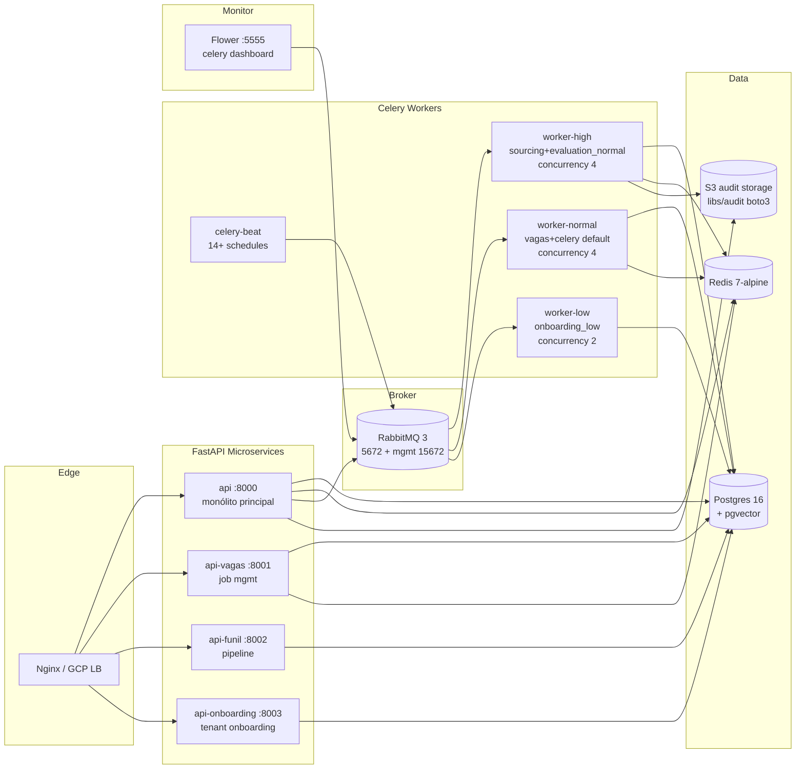

**Inventário:**

| ID | Container | Imagem/Build | Portas | Dependências | Comando | Concorrência |
|---|---|---|---|---|---|---|
| V3-C1 | api | local Dockerfile (python:3.11-slim) | 8000 | postgres, redis, rabbitmq | `uvicorn app.main:app --host 0.0.0.0 --port 8000` | 1 (uvicorn workers configuráveis) |
| V3-C2 | api-vagas | apps/api-vagas/Dockerfile | 8001 | idem | (build próprio) | n/a |
| V3-C3 | api-funil | apps/api-funil/Dockerfile | 8002 | idem | n/a | n/a |
| V3-C4 | api-onboarding | apps/api-onboarding/Dockerfile | 8003 | idem | n/a | n/a |
| V3-C5 | celery-worker-high | local Dockerfile | n/a | idem | `celery -A app.core.celery_app worker --queues=sourcing_high,evaluation_normal --concurrency=4` | 4 |
| V3-C6 | celery-worker-normal | local Dockerfile | n/a | idem | `celery worker --queues=vagas_normal,celery --concurrency=4` | 4 |
| V3-C7 | celery-worker-low | local Dockerfile | n/a | idem | `celery worker --queues=onboarding_low --concurrency=2` | 2 |
| V3-C8 | celery-beat | local Dockerfile | n/a | redis, rabbitmq | `celery beat --scheduler=celery.beat:PersistentScheduler` | 1 |
| V3-C9 | flower | mher/flower:2.0 | 5555 | rabbitmq | `celery flower --broker=$RABBITMQ_URL` | 1 |
| V3-C10 | postgres | pgvector/pgvector:pg16 | 5432 | (raiz) | `pg_ctl` (default) | n/a |
| V3-C11 | redis | redis:7-alpine | 6379 | (raiz) | `redis-server` (default) | n/a |
| V3-C12 | rabbitmq | rabbitmq:3-management-alpine | 5672, 15672 | (raiz) | (default) | n/a |

**Notas de leitura:**
- Build base: 1 Dockerfile principal (`Dockerfile`), 1 produção (`Dockerfile.prod`), 1 worker (`Dockerfile.worker`) — total 3 Dockerfiles.
- libs/ instaladas em modo editável dentro do container (`pip install -e libs/<lib>`) — 8 libs.
- Volumes persistentes: postgres_data, redis_data, rabbitmq_data.
- Health checks: postgres (`pg_isready`), redis (`redis-cli ping`), rabbitmq (`rabbitmq-diagnostics ping`).
- `.env` único compartilhado entre containers via `env_file`.

---

### V4. Topologia de Mensageria [V4]

**Tese:** A mensageria assíncrona usa RabbitMQ (broker AMQP) + Redis (result backend e DLQ) com 5 filas priorizadas por domínio, 3 workers segregados por SLA e Celery beat orquestrando 14+ tasks recorrentes; webhooks de entrada em 6 endpoints; webhook saída via `webhook_dispatcher`.

**Diagrama M-V4:**

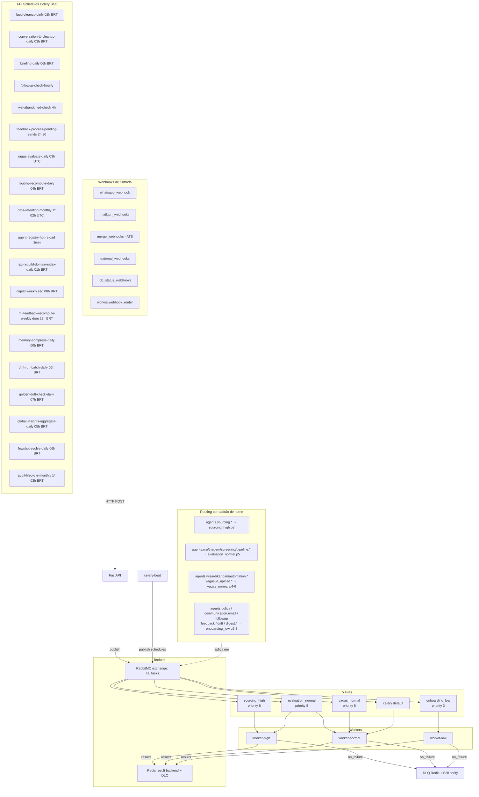

**Inventário (filas):**

| ID | Fila | Priority | Routing key | Tasks típicas |
|---|---|---|---|---|
| V4-Q1 | sourcing_high | 8 | sourcing_high | `agents.sourcing.search`, `agents.sourcing.enrich`, `agents.sourcing.engagement` |
| V4-Q2 | evaluation_normal | 5 | evaluation_normal | `agents.wsi_interview.start`, `agents.triagem.run`, `agents.screening.evaluate`, `agents.pipeline.transition` |
| V4-Q3 | vagas_normal | 5 (4-6 task-level) | vagas_normal | `agents.wizard.*`, `agents.kanban.*`, `vagas.jd_upload.*`, `agents.automation.*` |
| V4-Q4 | onboarding_low | 3 (2-3 task-level) | onboarding_low | `agents.policy.*`, `communication.email.*`, `followup.*`, `feedback.*`, `drift.run_batch`, `digest.*` |
| V4-Q5 | celery (default) | n/a | celery | tasks sem rota explícita |

**Inventário (schedules — 19 detectados, briefing pediu 14+):**

| ID | Schedule | Cron | Task | Queue | TTL |
|---|---|---|---|---|---|
| V4-B1 | lgpd-cleanup-daily | 05:00 UTC (02h BRT) | lgpd.run_cleanup_daily | celery default | 7200s |
| V4-B2 | conversation-ttl-cleanup-daily | 06:00 UTC | conversation.ttl_cleanup | celery default | 7200s |
| V4-B3 | briefing-daily | 09:00 UTC (06h BRT) | briefing.send_daily | onboarding_low | 3600s |
| V4-B4 | followup-check-hourly | top of hour | followup.process_pending | onboarding_low | 3500s |
| V4-B5 | wsi-abandoned-check | every 4h | wsi.check_abandoned | evaluation_normal | 14000s |
| V4-B6 | feedback-process-pending-sends | every 2h :30 | feedback.process_pending_sends | onboarding_low | 7000s |
| V4-B7 | ragas-evaluate-daily | 03:00 UTC | ragas.evaluate_batch | evaluation_normal | 7200s |
| V4-B8 | routing-recompute-daily | 07:00 UTC | routing.recompute_adjustments | celery | 3600s |
| V4-B9 | data-retention-monthly | day 1, 02:00 UTC | data.retention.run | celery | 7200s |
| V4-B10 | agent-registry-hot-reload | every 1min | agents.registry.check_reload | celery | 55s |
| V4-B11 | rag-rebuild-domain-index-daily | 04:00 UTC | rag.rebuild_all_domains | celery | 7200s |
| V4-B12 | digest-weekly | mon 11:00 UTC | digest.send_weekly | onboarding_low | 3600s |
| V4-B13 | ml-feedback-recompute-weekly | sun 02:00 UTC | ml.feedback.recompute_active_jobs | celery | 3600s |
| V4-B14 | memory-compress-daily | 03:00 UTC | memory.compress_old_episodes | celery | 7200s |
| V4-B15 | drift-run-batch-daily | 09:00 UTC (06h BRT) | drift.run_batch | onboarding_low | 3600s |
| V4-B16 | golden-drift-check-daily | 10:00 UTC | golden_drift.run_check | evaluation_normal | 7200s |
| V4-B17 | global-insights-aggregate-daily | 08:00 UTC (05h BRT) | insights.aggregate_all | evaluation_normal | 7200s |
| V4-B18 | fewshot-evolve-daily | 09:00 UTC (06h BRT) | fewshot.evolve | evaluation_normal | 7200s |
| V4-B19 | audit-lifecycle-monthly | day 1, 06:00 UTC (03h BRT) | audit.apply_lifecycle_policy | celery | (lifecycle) |

**Webhooks de entrada (6 endpoints):**

| ID | Endpoint | Origem | Path |
|---|---|---|---|
| V4-WI1 | `/api/v1/whatsapp_webhook` | Twilio | [whatsapp_webhook.py](app/api/v1/whatsapp_webhook.py) |
| V4-WI2 | `/api/v1/mailgun_webhooks` | Mailgun | [mailgun_webhooks.py](app/api/v1/mailgun_webhooks.py) |
| V4-WI3 | `/api/v1/merge_webhooks` | Merge.dev | [merge_webhooks.py](app/api/v1/merge_webhooks.py) |
| V4-WI4 | `/api/v1/external_webhooks` | genéricos | [external_webhooks.py](app/api/v1/external_webhooks.py) |
| V4-WI5 | `/api/v1/job_status_webhooks` | clientes ATS | [job_status_webhooks.py](app/api/v1/job_status_webhooks.py) |
| V4-WI6 | `/api/v1/webhooks` (workos.webhook_router) | WorkOS | [workos.py](app/api/v1/workos.py) |

**Webhooks de saída:**
- Dispatcher canônico: [webhook_dispatcher.py](app/services/webhook_dispatcher.py).
- Subscribers: clientes podem se inscrever em eventos via `webhook_service` em `domains/communication`.
- Task Celery: [webhook_tasks.py](app/jobs/webhook_tasks.py) — fan-out async.

**LIATask base:** [libs/config/lia_config/celery_app.py](libs/config/lia_config/celery_app.py) define `LIATask(Task)` com `on_failure → DLQ Redis + Bell notification` para tasks críticas.

**aio-pika 9.5:** instalado mas uso direto fora do Celery não confirmado em SSH inicial — virou `[HIPÓTESE]` para Fase 2 investigar.

---

### V5. Topologia de Dados [V5]

**Tese:** A persistência usa Postgres 16 com pgvector (similaridade vetorial), Redis 7 (cache + result backend + DLQ), S3 (auditoria de longo prazo via boto3) e Fernet at-rest para PII; RLS é forçado em tabelas com `company_id` via 3 migrations alembic e funções helper `set_tenant_context()` + `get_tenant_db()`.

**Diagrama M-V5:**

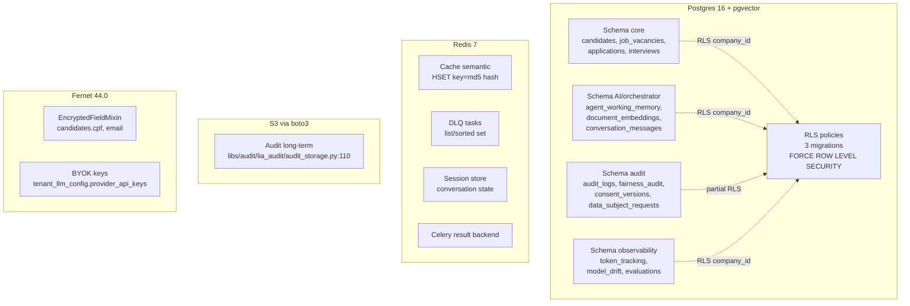

**Inventário:**

| ID | Camada | Detalhes |
|---|---|---|
| V5-PG1 | Postgres 16 + pgvector 0.3.6 | image `pgvector/pgvector:pg16`. 102 alembic migrations. |
| V5-PG2 | RLS migrations | [040_add_rls_multi_tenant.py](alembic/versions/040_add_rls_multi_tenant.py) inicial; [068_rls_deny_by_default.py](alembic/versions/068_rls_deny_by_default.py) FORCE ROW LEVEL SECURITY; [102_realign_compensation_policies.py](alembic/versions/102_realign_compensation_policies.py) ajustes. |
| V5-PG3 | Tenant context helpers | [database.py](app/core/database.py) define `set_tenant_context(db, company_id)` (executa `SELECT set_config('app.company_id', ...)`)  e `get_tenant_db()` (DI dependency com `SET ROLE lia_app`). |
| V5-PG4 | Models com `company_id` | 96 de 120 (80%) — multi-tenant explícito. |
| V5-PG5 | Models sem `company_id` | 24 (20%) — alguns by-design globais (saas_metrics, global_policies, default_templates, health_check, client_account). 8-10 suspeitos para investigação Fase 2. |
| V5-PG6 | pgvector usage | dimensão exata não detectada via grep direto; provável 1536 (OpenAI ada/3-small) e/ou 768 (Gemini). Tabela `document_embeddings` em RAG layer. |
| V5-RD1 | Redis 7-alpine | image `redis:7-alpine`. URL `redis://localhost:6379/0`. |
| V5-RD2 | Cache semantic exato | [semantic_cache.py](app/orchestrator/semantic_cache.py) — Tier 2 do CascadeRouter, HSET por hash MD5, TTL 300s. |
| V5-RD3 | Cache semantic vetorial | [vector_semantic_cache.py](app/orchestrator/vector_semantic_cache.py) — Tier 3, pgvector cosine ≥ 0.85. |
| V5-RD4 | DLQ | LIATask `on_failure → push DLQ` (lista Redis). |
| V5-RD5 | Result backend Celery | mesmo Redis URL. |
| V5-RD6 | Session store | Conversation state em-memory + Redis fallback. |
| V5-RD7 | Encryption opt-in | env `REDIS_ENCRYPTION_KEY` (Fernet). Sem chave: graceful degradation em texto puro (Wave 6 item 6.6). |
| V5-S3-1 | S3 audit | [audit_storage.py:110](libs/audit/lia_audit/audit_storage.py:110) — boto3 client. Long-term retention para auditoria. |
| V5-FS1 | Filesystem persistente | volumes Docker: `postgres_data`, `redis_data`, `rabbitmq_data`. Sem GCS detectado em código atual. |
| V5-FE1 | Fernet at-rest | [encryption/__init__.py](app/shared/encryption/__init__.py) e `EncryptedFieldMixin` em `encrypted_field_mixin.py`. Env `LIA_ENCRYPTION_KEY`. |

**Notas de leitura:**
- O `set_config('app.company_id', :cid, true)` é executado a cada request via `get_tenant_db()` ANTES de qualquer query, e a policy RLS valida `current_setting('app.company_id') = company_id` ou `IS NULL`.
- O `SET ROLE lia_app` ativa o role com RLS (vs `lia_admin` que pode bypassar).
- 24 models sem company_id ficam como achado para Auditoria (Fase 2): categorizar globais by-design vs suspeitos.

---

## Parte III — Vistas Componenciais

### V6. Mapa de Domínios DDD [V6]

**Tese:** Os 63 domínios da plataforma se distribuem em 5 categorias funcionais — Agentic (16 com agente IA ativo), Service (12 com lógica de negócio sem agente), Repository Stub (28 CRUD-only), AI-adjacente (4 de suporte) e Compliance/Observability (3) — com fronteiras de bounded context derivadas dos modelos persistidos em `libs/models/lia_models/`.

**Diagrama M3 (V6 Domínios DDD):**

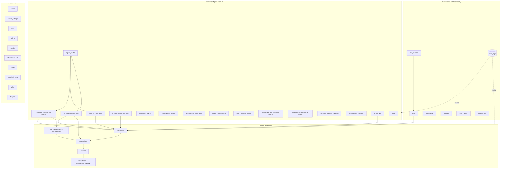

**Inventário consolidado (63 domínios):**

| ID | Domínio | Categoria | Agentes | Tools | Repository | Papel |
|---|---|---|---|---|---|---|
| V6-D1 | sourcing | Agentic | 24 | 11 registries | ✓ | Busca de candidatos multi-fonte (GitHub/StackOverflow/passive/referral/diversity/nurture) |
| V6-D2 | recruiter_assistant | Agentic | 18 | 6 registries | ✓ | Kanban + jobs mgmt + talent pool (assistant geral) |
| V6-D3 | pipeline | Agentic | 11 | 4 registries | ✓ | Transições de pipeline + estágios |
| V6-D4 | cv_screening | Agentic | 4 | 2 (cv_match, candidate_tools, cv_upload) | ✓ | CV parsing + WSI graph + scoring |
| V6-D5 | communication | Agentic | 4 | 1 (communication_tools) | ✓ | Email + WhatsApp + Teams + SMS |
| V6-D6 | analytics | Agentic | 4 | 9 (8 sub + query) | ✓ | Reports + insights + dashboards |
| V6-D7 | automation | Agentic | 4 | 1 (automation_tools) | ✓ | Tasks/reminders/automation rules |
| V6-D8 | ats_integration | Agentic | 4 | 1 (ats_tools) | ✓ | Sync com ATS terceiros (Gupy/Pandape/Merge/Workable) |
| V6-D9 | hiring_policy | Agentic | 4 | 1 (policy_tools) | ✓ | Política de contratação + fairness |
| V6-D10 | talent_pool | Agentic | 4 | 1 registry | ✓ | Pools passivos + segmentação |
| V6-D11 | candidate_self_service | Agentic | 4 | 4 (status, interview_info, decision, wsi_feedback) | ✓ | Self-service do candidato |
| V6-D12 | interview_scheduling | Agentic | 3 (+ InterviewGraph) | 1 (scheduling_tools) | ✓ | Agendamento + LangGraph |
| V6-D13 | company_settings | Agentic | 3 | 1 (import_tools) | ✓ | Settings tenant |
| V6-D14 | autonomous | Agentic | 2 | 1 registry | ✓ | Autonomous fallback (Tier 6) |
| V6-D15 | agent_studio | Agentic | (custom builder) | (dynamic) | ✓ | Builder de agentes customizados |
| V6-D16 | voice | Agentic | (orchestrator) | n/a | ✓ | Voice screening (Gemini Live + Twilio + OpenAI TTS) |
| V6-D17 | digital_twin | Service | n/a | n/a | ✓ | Perfil comportamental |
| V6-D18 | candidates | Service | n/a | n/a | ✓ | CRUD candidatos |
| V6-D19 | job_management | Service | (compartilha agents com RA) | 2 (job_tools, query_tools) | ✓ | Lifecycle de vagas |
| V6-D20 | job_creation | Service | (wizard via RA) | (wizard) | ✓ | Wizard de criação |
| V6-D21 | applications | Service | n/a | n/a | ✓ | Aplicações de candidatos |
| V6-D22 | recruitment | Service | n/a | n/a | ✓ | Processos de recrutamento |
| V6-D23 | recruitment_journey | Service | n/a | n/a | ✓ | Jornada do candidato |
| V6-D24 | recruitment_campaign | Service | n/a | n/a | ✓ | Campanhas |
| V6-D25 | offer | Service | n/a | 6 (cancel/create/get/prepare/send/update) | ✓ | Ofertas de emprego |
| V6-D26 | talent_intelligence | Service | n/a | 7 (skills_ontology/market/internal_mobility/etc) | ✓ | Skills + market intelligence |
| V6-D27 | interview_intelligence | Service | n/a | n/a | ✓ | Bias detection em interviews |
| V6-D28 | journey_mapping | Service | n/a | n/a | ✓ | Mapping de jornadas |
| V6-D29 | ai | Service | n/a | n/a | ✓ | LLM service + RAG + drift |
| V6-D30 | observability | Service (Repo) | n/a | n/a | ✓ (CANONICAL 841L) | AIInferenceLog + BiasAuditReport + DataAccessLog + IncidentReport + ModelEvaluation + ConsentRecord + ComplianceControl |
| V6-D31 | trust_center | Service | n/a | n/a | ✓ | Trust Center (SOC2/ISO27001) |
| V6-D32 | health_check | Repository Stub | n/a | n/a | ✓ (303L) | Compliance items por framework |
| V6-D33-D63 | (31 demais) | Repository Stub / Service | n/a | n/a | ✓ | admin, admin_settings, approvals, auth, billing, bulk_actions, candidate_lists, chat, client_users, clients, company, company_culture, compliance, consent, credits, data_subject, email_templates, goals, integrations_hub, lgpd, modules, notifications, opinions, policy, saas_metrics, shared_searches, tasks, technical_tests, triagem, workforce |

**Notas de leitura:**
- 16 domínios "Agentic" (com agente IA ativo) cobrem o ciclo de recrutamento ponta a ponta.
- 63 = contagem real de subdiretórios em `app/domains/` (excluindo `__pycache__`).
- O domínio `policy/` aparece como deprecated em alguns mapeamentos legados, mas há agente ativo (`PolicySetupAgent`) — vou verificar status na auditoria.
- Eventos de domínio explícitos (`EventBus`/`publish_event`) **não detectados** em SSH inicial — comunicação cross-domain é via service calls + Celery tasks.

---

### V7. Catálogo de Agentes [V7]

**Tese:** Os 108 arquivos `*/agents/*.py` agregam ~32 classes de agente principal todas herdando de `LangGraphReActBase` (do pacote interno `lia_agents_core`) + `EnhancedAgentMixin` (PII, audit, fairness automáticos). Modelo padrão: claude-sonnet-4-6 com fallback chain Gemini → Claude → OpenAI. Personas em `*_system_prompt.py` por agente.

**Diagrama:**

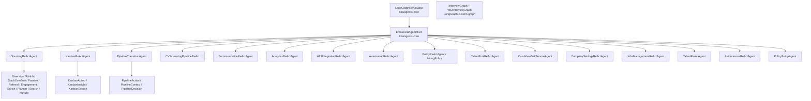

**Inventário (32 classes de agente principal, agrupado por domínio com IDs estáveis):**

| ID | Classe | Domínio | Path:linha aproximada | Modelo | Hierarquia | Canal | Tipo |
|---|---|---|---|---|---|---|---|
| V7-A1 | SourcingReActAgent | sourcing | `app/domains/sourcing/agents/sourcing_react_agent.py:84` | claude-sonnet-4-6 | LangGraphReActBase + EnhancedAgentMixin | chat | LangGraph |
| V7-A2-A11 | DiversitySourcingAgent, GithubSourcingAgent, StackOverflowSourcingAgent, PassivePipelineAgent, ReferralAgent, NurtureSequenceAgent, SourcingEngagementAgent, SourcingEnrichAgent, SourcingPlannerAgent, SourcingSearchAgent | sourcing | `app/domains/sourcing/agents/*.py` | idem | herdam SourcingReActAgent (subagent — ver V8) | tool-call | LangGraph subgraph |
| V7-A12 | KanbanReActAgent | recruiter_assistant | `app/domains/recruiter_assistant/agents/kanban_react_agent.py` | claude-sonnet-4-6 | LangGraphReActBase + EnhancedAgentMixin | chat | LangGraph |
| V7-A13-A15 | KanbanActionAgent, KanbanInsightAgent, KanbanSearchAgent | recruiter_assistant | `app/domains/recruiter_assistant/agents/kanban_*_agent.py` | idem | subagent KanbanReActAgent | tool-call | LangGraph subgraph |
| V7-A16 | JobsManagementReActAgent | recruiter_assistant | `jobs_mgmt_react_agent.py` | claude-sonnet-4-6 | LangGraphReActBase + EnhancedAgentMixin | chat | LangGraph |
| V7-A17 | TalentReActAgent | recruiter_assistant | `talent_react_agent.py` | claude-sonnet-4-6 | LangGraphReActBase + EnhancedAgentMixin | chat | LangGraph |
| V7-A18 | PipelineTransitionAgent | pipeline | `app/domains/pipeline/agents/pipeline_transition_agent.py` | claude-sonnet-4-6 | LangGraphReActBase + EnhancedAgentMixin | kanban + chat | LangGraph |
| V7-A19-A21 | PipelineActionAgent, PipelineContextAgent, PipelineDecisionAgent | pipeline | `app/domains/pipeline/agents/pipeline_*_agent.py` | idem | subagent PipelineTransitionAgent | tool-call | LangGraph subgraph |
| V7-A22 | CommunicationReActAgent | communication | `app/domains/communication/agents/communication_react_agent.py` | claude-sonnet-4-6 | LangGraphReActBase + EnhancedAgentMixin | chat + composer | LangGraph |
| V7-A23 | AnalyticsReActAgent | analytics | `app/domains/analytics/agents/analytics_react_agent.py` | claude-sonnet-4-6 | LangGraphReActBase + EnhancedAgentMixin | dashboard + chat | LangGraph |
| V7-A24 | CVScreeningPipelineReAct | cv_screening | `app/domains/cv_screening/agents/pipeline_react_agent.py` | claude-sonnet-4-6 | LangGraphReActBase + EnhancedAgentMixin | chat + UI WSI | LangGraph |
| V7-A25 | PolicyReActAgent | hiring_policy | `app/domains/hiring_policy/agents/policy_react_agent.py` | claude-sonnet-4-6 | LangGraphReActBase + EnhancedAgentMixin | chat | LangGraph |
| V7-A26 | AutomationReActAgent | automation | `app/domains/automation/agents/automation_react_agent.py` | claude-sonnet-4-6 | LangGraphReActBase + EnhancedAgentMixin | event-driven | LangGraph |
| V7-A27 | CandidateSelfServiceAgent | candidate_self_service | `app/domains/candidate_self_service/agents/candidate_react_agent.py` | claude-sonnet-4-6 | LangGraphReActBase + EnhancedAgentMixin | portal | LangGraph |
| V7-A28 | CompanySettingsReActAgent | company_settings | `app/domains/company_settings/agents/company_react_agent.py` | claude-sonnet-4-6 | LangGraphReActBase + EnhancedAgentMixin | chat + UI | LangGraph |
| V7-A29 | ATSIntegrationReActAgent | ats_integration | `app/domains/ats_integration/agents/ats_integration_react_agent.py` | claude-sonnet-4-6 | LangGraphReActBase + EnhancedAgentMixin | event-driven | LangGraph |
| V7-A30 | TalentPoolReActAgent | talent_pool | `app/domains/talent_pool/agents/talent_pool_agent.py` | claude-sonnet-4-6 | LangGraphReActBase + EnhancedAgentMixin | chat | LangGraph |
| V7-A31 | AutonomousReActAgent | autonomous | `app/domains/autonomous/agents/autonomous_react_agent.py:11+` | claude-sonnet-4-6 | LangGraphReActBase + EnhancedAgentMixin | Tier 6 fallback | LangGraph + FairnessGuard explícito (linha 287-304) |
| V7-A32 | PolicySetupAgent | policy | `app/agents/policy_setup_agent.py` | claude-sonnet-4-6 | LangGraphReActBase + EnhancedAgentMixin | onboarding sequencial | async questionnaire |

**Notas de leitura:**
- Os 108 arquivos de agente correspondem a ~32 classes principais; a diferença vem de subagents (ver V8 — alguns são classes filhas, outros são apenas funções helpers no mesmo arquivo).
- Personas em `*_system_prompt.py` ou `*_prompt.py` correspondente a cada agente — não enumerei aqui mas existem para os principais (ver V12.10).
- `WSIInterviewGraph` e `InterviewGraph` são LangGraph **custom graphs** (não ReAct nativo) — catalogados em V8 como "workers especializados".
- Modelo padrão claude-sonnet-4-6 mas BYOK + fallback chain `["gemini", "claude", "openai"]` (V12.10).

---

### V8. Subagentes e Workers Especializados [V8]

**Tese:** A plataforma usa 13 subagentes (LangGraph subgraph nodes herdando de agente-pai), 2 LangGraph custom graphs especializados (InterviewGraph, WSIInterviewGraph) e 38 tasks Celery com `bind=True` em 5 filas; subagent é invocado via subgraph dentro do mesmo workflow do parent, worker Celery é fan-out async via broker.

**Diagrama:**

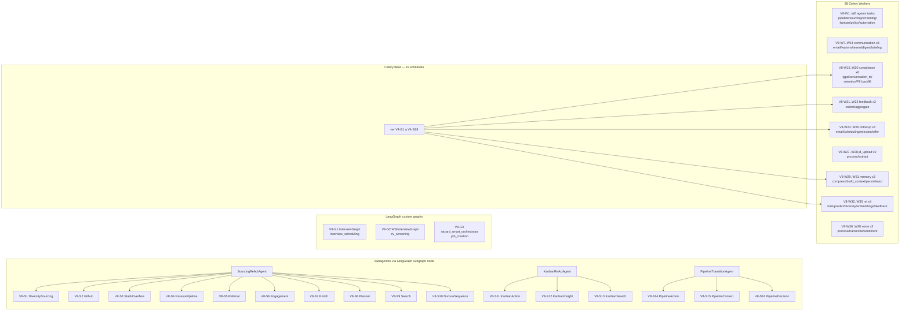

**Inventário consolidado:**

**Subagents (V8-S1 a V8-S16):** 16 subagentes herdam de 3 parent agents (Sourcing 10 + Kanban 3 + Pipeline 3). Padrão de invocação: `subgraph.add_node()` em LangGraph dentro do workflow do parent. Sem fan-out cross-process.

**Custom graphs (V8-G1 a V8-G3):** 
- `InterviewGraph` em `interview_scheduling` — LangGraph com 6 nós procedurais.
- `WSIInterviewGraph` em `cv_screening` — graph para Work Simulation Interview.
- `wizard_smart_orchestrator` — em `job_creation` (wizard de criação de vaga).

**Celery workers (V8-W1 a V8-W38):** ver tabela V4-B1 a V4-B19 + agents.py + agents_legacy.py + outros módulos `app/jobs/tasks/*`.

**Notas de leitura:**
- Subagent = mesmo processo, mesmo workflow LangGraph, modelo de LLM compartilhado.
- Custom graph = LangGraph diferente do ReAct loop, com nós/transições procedurais.
- Worker Celery = processo separado, comunicação via broker AMQP (RabbitMQ), persistência de result via Redis.

---

### V9. Catálogo de Tools e Actions [V9]

**Tese:** A plataforma expõe **~200+ tools** ao LLM via decorator `@tool_handler(domain, require_company)` + `ToolDefinition` (LangGraph) registrados em 30 `*_tool_registry.py`, e **~60+ actions** programáticas em 7 action handlers (`app/orchestrator/action_handlers/`) que são invocadas pelo `ActionExecutor` (Phase 1) via regex/intent matching.

**Diagrama:**

```mermaid
graph LR
    subgraph Tools[Tools — ~200+ via @tool_handler]
        TR1[30 tool registries em<br/>app/domains/*/agents/*_tool_registry.py]
        TH[@tool_handler decorator<br/>app/shared/tool_handler.py]
        TD[ToolDefinition<br/>LangGraph format]
        LLM[LLM function calling]
    end
    subgraph Actions[Actions — ~60+ programáticas]
        AH[7 action handlers<br/>app/orchestrator/action_handlers/]
        AE[ActionExecutor<br/>regex/intent matching]
        IC[intents_config.py<br/>912 linhas — config]
    end
    TR1 --> TH
    TH --> TD
    TD --> LLM

    AH --> AE
    AE --> IC
```

**Tool decorator pattern:** `@tool_handler(domain, require_company=True, module=None)` em [tool_handler.py](app/shared/tool_handler.py) garante:
- `company_id` resolution (3-tier fallback: kwargs → _context → ContextVar) com fail-closed `_TENANT_REQUIRED_RESPONSE` se ausente
- Module gating (`PREMIUM_GATED_TOOLS` em `tool_permissions.yaml`)
- Try/except com logging
- Response wrapper `{success: bool, data: Any, message: str}`

**Tool registries (30):**
- analytics: `analytics_tool_registry.py`
- ats_integration: `ats_integration_tool_registry.py`
- automation: `automation_tool_registry.py`
- autonomous: `autonomous_tool_registry.py`
- candidate_self_service: `candidate_tool_registry.py`
- communication: `communication_tool_registry.py`
- company_settings: `company_tool_registry.py`
- hiring_policy: `policy_tool_registry.py`
- pipeline: 4 (pipeline_action, pipeline_context, pipeline_decision, pipeline_tool_registry)
- recruiter_assistant: 6 (jobs_mgmt, kanban_action, kanban_insight, kanban_search, kanban, talent)
- sourcing: 11 (diversity, github, nurture_sequence, passive_pipeline, referral, sourcing_engagement, sourcing_enrich, sourcing_planner, sourcing_search, sourcing, stackoverflow)
- talent_pool: `talent_pool_tool_registry.py`

**Tools amostradas (V9-T1 a V9-T15) com path:linha:**

| ID | Tool | Domínio | Schema input | Mutativo | require_company |
|---|---|---|---|---|---|
| V9-T1 | set_search_criteria | sourcing | `{role, skills[], location, exp_level, salary_range}` | N | N |
| V9-T2 | search_candidates | sourcing | `{query, role, skills[], location, limit}` | N | Y |
| V9-T3 | suggest_skills | sourcing | `{role, context}` | N | Y |
| V9-T4 | view_candidate | sourcing | `{candidate_id}` | N | Y |
| V9-T5 | analyze_profile | sourcing | `{candidate_id}` | N | Y |
| V9-T6 | create_job_vacancy | recruiter_assistant | `{title, description, location, salary_min, salary_max, department}` | Y | Y |
| V9-T7 | search_jobs | recruiter_assistant | `{query, status, department, limit}` | N | Y |
| V9-T8 | update_job_status | recruiter_assistant | `{job_id, new_status}` | Y | Y |
| V9-T9 | generate_job_description | recruiter_assistant | `{job_title, company_context, requirements}` | N | Y |
| V9-T10 | screen_candidate_cv | cv_screening | `{candidate_id, job_id}` | N | Y |
| V9-T11 | schedule_interview | interview_scheduling | `{candidate_id, job_id, date, time, interviewer_id}` | Y | Y |
| V9-T12 | log_pipeline_action | pipeline | `{candidate_id, pipeline_stage, action_type, notes}` | Y | Y |
| V9-T13 | get_analytics_metrics | analytics | `{metric_type, date_range, filters}` | N | Y |
| V9-T14 | send_communication | communication | `{recipient_id, message_type, body, template_id}` | Y | Y |
| V9-T15 | check_hiring_policy | hiring_policy | `{company_id, policy_type}` | N | Y |
| **...** | **+~185 outras** | múltiplos | estruturado Pydantic | Y/N | Y (default) |

**Actions amostradas (V9-AC1 a V9-AC10):**

7 action handler files em `app/orchestrator/action_handlers/`:
- candidate_actions.py (676L), job_actions.py (358L), pipeline_actions.py (473L), sourcing_actions.py (640L), communication_actions.py (825L), interview_actions.py (439L), analytics_actions.py (368L), _handler_hooks.py (179L), __init__.py (29L). Total ~4007 LOC.

| ID | Action | Domínio | Mutativo | Trigger |
|---|---|---|---|---|
| V9-AC1 | pause_job | job | Y | regex "pausar vaga" |
| V9-AC2 | close_job | job | Y | regex "fechar vaga" |
| V9-AC3 | duplicate_job | job | Y | regex "duplicar vaga" |
| V9-AC4 | set_job_urgent | job | Y | regex "vaga urgente" |
| V9-AC5 | suggest_salary | job | N | regex/keyword |
| V9-AC6 | generate_jd_direct | job | N | regex direto |
| V9-AC7 | add_to_shortlist | candidate | Y | regex "adicionar shortlist" |
| V9-AC8 | reject_candidate | candidate | Y | regex "rejeitar" |
| V9-AC9 | move_pipeline_stage | pipeline | Y | regex "mover para" |
| V9-AC10 | mark_pipeline_decision | pipeline | Y | regex "decisão" |
| **...** | **+~50 outras** | múltiplos | Y | regex/intent |

Config canônica de intents: [intents_config.py](app/orchestrator/action_executor/intents_config.py) — 912 linhas mapeando intent_pattern → action_id.

**Notas de leitura:**
- 0 ocorrências do decorator legado `@tool` plain (validado em medição). Padrão atual é `@tool_handler` + `ToolDefinition`.
- Tools são **idempotentes ou não-mutativas** quando possível; mutações usam `require_company=True` obrigatório.
- Actions são **sempre mutativas** (alteram estado de DB) — UI sempre confirma antes de execução.

---

### V10. Cascade Router e Orquestração [V10]

**Tese:** O fluxo de processamento HTTP/WS/SSE entra em `MainOrchestrator.process()`, atravessa 3 phases (P0 PendingAction, P1 ActionExecutor, P2 CascadedRouter) e o CascadedRouter aplica 8 tiers (T0 MemoryResolver → T1 LRU → T2 Redis Hash → T3 Vector pgvector → T4 FastRouter regex → T5 LLM Cascade Haiku/Sonnet/Opus → T6 Autonomous → T7 Studio/clarification) com fallback gracioso e SLA <5s para hits em T1-T4.

**Diagrama M2 / Sequence — Caminho geral:**

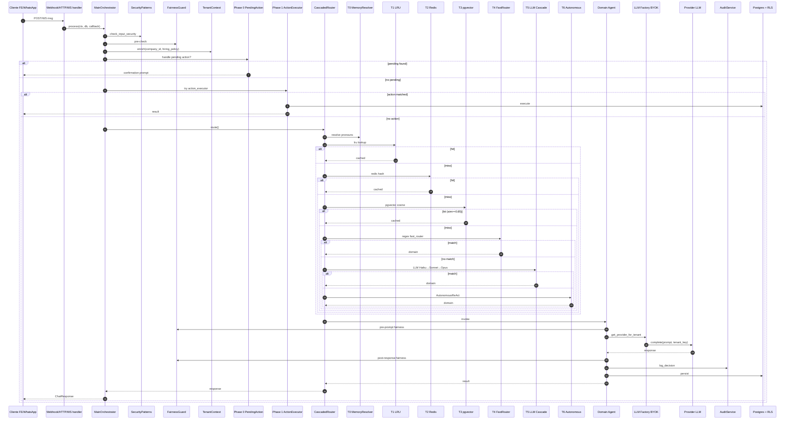

**Inventário (orquestração — V10):**

| ID | Componente | Path canônico | Responsabilidade | Latência típica |
|---|---|---|---|---|
| V10-OR1 | MainOrchestrator | [main_orchestrator.py:346](app/orchestrator/main_orchestrator.py:346) | Entry point único, 3 phases, compliance pipeline | 0-30s |
| V10-OR2 | Orchestrator (legacy?) | [orchestrator.py](app/orchestrator/orchestrator.py) (624L) | Verificar status — pode ser shim | (verificar) |
| V10-P0 | Phase 0 PendingAction | main_orchestrator.py:817 (`_handle_pending_action`) | Confirmação multi-turno de ações pendentes | <50ms |
| V10-P1 | Phase 1 ActionExecutor | main_orchestrator.py:968 (`_try_action_executor`) | Intent regex matching + execute_action() | 50-200ms |
| V10-P2 | Phase 2 CascadedRouter+Domain | main_orchestrator.py:1133 (`_process_via_orchestrator`) | Roteamento + domain agent | 100ms-30s |
| V10-T0 | MemoryResolver | [memory_resolver.py](app/orchestrator/memory_resolver.py) (386L) | Resolve pronomes via WorkingMemory | ~1ms |
| V10-T1 | LRU In-Process | cascaded_router.py:277-310 | Hash MD5 cache em dict in-memory | ~0.5ms |
| V10-T2 | Redis Hash | [semantic_cache.py](app/orchestrator/semantic_cache.py) (112L) | HSET key=hash, TTL 300s | ~5ms |
| V10-T3 | Vector Semantic | [vector_semantic_cache.py](app/orchestrator/vector_semantic_cache.py) (289L) | pgvector cosine similarity ≥ 0.85 | ~50ms |
| V10-T2.5 | Wizard Guard | cascaded_router.py:330+ | Anti stale cache (Task #850 fix 2026-04-29) | ~5ms |
| V10-T4 | FastRouter | [fast_router.py](app/orchestrator/fast_router.py) (682L) | 26 dom + 150+ regex patterns | ~10ms |
| V10-T5 | LLM Cascade | [llm_cascade.py](app/orchestrator/llm_cascade.py) (325L) | Haiku→Sonnet→Opus por confidence | 500ms-5s |
| V10-T6 | Autonomous fallback | [autonomous_react_agent.py](app/domains/autonomous/agents/autonomous_react_agent.py) | Multi-step ReAct + tool calling | 5-30s |
| V10-T7 | Clarification | cascaded_router.py:_build_clarification_question | Pergunta ao usuário | ~10ms |
| V10-SC1 | TaskingEngine | [tasting_engine.py](app/orchestrator/tasting_engine.py) (520L) | Preview/dry-run de ações |  |
| V10-SC2 | TaskPlanner | [task_planner.py](app/orchestrator/task_planner.py) (236L) | Planejamento multi-step |  |
| V10-SC3 | NavigationIntent | [navigation_intent.py](app/orchestrator/navigation_intent.py) (187L) | Intent navegação UI |  |
| V10-SC4 | TemporalResolver | [temporal_resolver.py](app/orchestrator/temporal_resolver.py) (240L) | Resolve "amanhã", "semana passada" |  |
| V10-SC5 | StateManager | [state_manager.py](app/orchestrator/state_manager.py) (314L) | State machine do orchestrator |  |
| V10-SC6 | TenantBudget | [tenant_budget.py](app/orchestrator/tenant_budget.py) (304L) | Gating monthly tokens por tenant |  |
| V10-SC7 | PolicyEngine | [policy_engine.py](app/orchestrator/policy_engine.py) (345L) | Engine de regras por domínio |  |
| V10-SC8 | ChatAdapter | [chat_adapter.py](app/orchestrator/chat_adapter.py) (178L) | Ponte REST/WS/SSE → MainOrchestrator |  |
| V10-SC9 | Domain Mappings | [domain_mappings.py](app/orchestrator/domain_mappings.py) (55L) | 30 mappings agent_type → domain_id + DEFAULT_DOMAIN |  |

**Notas de leitura:**
- O `MainOrchestrator` é canônico; `orchestrator.py` (legacy 624L) requer verificação na auditoria.
- Tier 4 (FastRouter) e Tier 5 (LLM Cascade) **não invocam Fairness/PII/Injection diretamente** (validado via grep) — assume-se que pre-compliance do MainOrchestrator já cobriu. Achado para Fase 2.
- Tier 6 (Autonomous) **invoca FairnessGuard explicitamente** (linha 287-304).

---

### V11. Matriz de Capacidades x Agentes [V11 — peça central]

**Tese:** Os ~25 agentes principais cobrem ~72% das 39 capacidades canônicas; capacidades transversais (PII, Audit, Tenant, Cost/Token/Latency, Stop conditions, Fallback modelo) são **`⚙` herdadas via base classes ou middleware**, raras lacunas reais (`✗`) concentram-se em Tree of Thoughts (#4), Bias scoring (#16), Multi-modal audio (#24, exceto WSI/Voice), BYOK aware (#32) e Human-in-the-loop trigger (#35).

**Legenda:** `✓` nativo (com path) | `⚙` cross-cutting compartilhado | `✗` lacuna | `⊘` não aplicável.

**Abreviações de colunas:**
- **SRC**=SourcingReActAgent, **PLP**=PipelineTransitionAgent, **KAN**=KanbanReActAgent, **CVS**=CVScreeningPipelineReAct, **WSI**=WSIInterviewGraph, **INT**=InterviewGraph, **COM**=CommunicationReActAgent, **ANL**=AnalyticsReActAgent, **ATS**=ATSIntegrationReActAgent, **AUT**=AutomationReActAgent, **HRP**=PolicyReActAgent (HiringPolicy), **TAL**=TalentPoolReActAgent, **CST**=CompanySettingsReActAgent, **CND**=CandidateSelfServiceAgent, **JM**=JobsManagementReActAgent, **TLR**=TalentReActAgent, **AUTO**=AutonomousReActAgent, **POL**=PolicySetupAgent, **VOICE**=VoiceScreeningOrchestrator.

| # | Capacidade | SRC | PLP | KAN | CVS | WSI | INT | COM | ANL | ATS | AUT | HRP | TAL | CST | CND | JM | TLR | AUTO | POL | VOICE |
|---|---|---|---|---|---|---|---|---|---|---|---|---|---|---|---|---|---|---|---|---|
| 1 | ReAct loop | ✓ | ✓ | ✓ | ✓ | ⊘ | ⊘ | ✓ | ✓ | ✓ | ✓ | ✓ | ✓ | ✓ | ✓ | ✓ | ✓ | ✓ | ⊘ | ⊘ |
| 2 | Plan & Execute | ✓ | ✓ | ⚙ | ✓ | ⊘ | ⊘ | ✓ | ⚙ | ⚙ | ✓ | ✓ | ✓ | ✓ | ✓ | ✓ | ✓ | ✓ | ⊘ | ⊘ |
| 3 | Reflection | ✓ | ✓ | ⚙ | ✓ | ⊘ | ⊘ | ✓ | ✓ | ✓ | ✓ | ✓ | ✓ | ✓ | ✓ | ✓ | ✓ | ✓ | ⊘ | ⊘ |
| 4 | Tree of Thoughts | ✗ | ✓ | ✗ | ✓ | ⊘ | ⊘ | ✗ | ✓ | ✗ | ✓ | ✗ | ✗ | ✗ | ✗ | ✗ | ✗ | ✓ | ⊘ | ⊘ |
| 5 | RAG | ✓ | ⚙ | ✓ | ✓ | ⊘ | ⊘ | ✓ | ✓ | ✓ | ⚙ | ✓ | ✓ | ✓ | ✓ | ✓ | ✓ | ✓ | ⊘ | ⊘ |
| 6 | Tool calling single | ✓ | ✓ | ✓ | ✓ | ⊘ | ⊘ | ✓ | ✓ | ✓ | ✓ | ✓ | ✓ | ✓ | ✓ | ✓ | ✓ | ✓ | ⊘ | ⊘ |
| 7 | Tool calling parallel | ✓ | ✓ | ✓ | ✓ | ⊘ | ⊘ | ✓ | ✓ | ✓ | ✓ | ✓ | ✓ | ✓ | ✓ | ✓ | ✓ | ✓ | ⊘ | ⊘ |
| 8 | Function calling estruturado | ✓ | ✓ | ✓ | ✓ | ⊘ | ⊘ | ✓ | ✓ | ✓ | ✓ | ✓ | ✓ | ✓ | ✓ | ✓ | ✓ | ✓ | ⊘ | ⊘ |
| 9 | Streaming | ⚙ | ⚙ | ⚙ | ⚙ | ⚙ | ⚙ | ⚙ | ⚙ | ⚙ | ⚙ | ⚙ | ⚙ | ⚙ | ⚙ | ⚙ | ⚙ | ⚙ | ⚙ | ⚙ |
| 10 | Intent classification | ⚙ | ⚙ | ⚙ | ⚙ | ⊘ | ⊘ | ⚙ | ⚙ | ⚙ | ⚙ | ⚙ | ⚙ | ⚙ | ⚙ | ⚙ | ⚙ | ⚙ | ⊘ | ⊘ |
| 11 | Routing | ⚙ | ⚙ | ⚙ | ⚙ | ⊘ | ⊘ | ⚙ | ⚙ | ⚙ | ⚙ | ⚙ | ⚙ | ⚙ | ⚙ | ⚙ | ⚙ | ⚙ | ⊘ | ⊘ |
| 12 | PII mask entrada | ⚙ | ⚙ | ⚙ | ⚙ | ⚙ | ⚙ | ⚙ | ⚙ | ⚙ | ⚙ | ⚙ | ⚙ | ⚙ | ⚙ | ⚙ | ⚙ | ⚙ | ⚙ | ⚙ |
| 13 | PII mask saída | ⚙ | ⚙ | ⚙ | ⚙ | ⚙ | ⚙ | ⚙ | ⚙ | ⚙ | ⚙ | ⚙ | ⚙ | ⚙ | ⚙ | ⚙ | ⚙ | ⚙ | ⚙ | ⚙ |
| 14 | Fairness pre-prompt | ⚙ | ⚙ | ⚙ | ✓ | ✓ | ⚙ | ⚙ | ⚙ | ⚙ | ⚙ | ✓ | ⚙ | ⚙ | ⚙ | ⚙ | ⚙ | ✓ | ⚙ | ✓ |
| 15 | Fairness pos-resposta | ✓ | ✓ | ⚙ | ✓ | ⚙ | ⚙ | ✓ | ✓ | ⚙ | ✓ | ✓ | ✓ | ✓ | ✓ | ✓ | ✓ | ✓ | ⚙ | ✓ |
| 16 | Bias scoring | ✓ | ⚙ | ✗ | ✓ | ⊘ | ⊘ | ✗ | ✓ | ✗ | ✗ | ✓ | ✗ | ✗ | ✗ | ✗ | ✗ | ✗ | ✗ | ✓ |
| 17 | Prompt injection detection | ⚙ | ⚙ | ⚙ | ⚙ | ⚙ | ⚙ | ⚙ | ⚙ | ⚙ | ⚙ | ⚙ | ⚙ | ⚙ | ⚙ | ⚙ | ⚙ | ⚙ | ⚙ | ⚙ |
| 18 | Output validation schema | ✓ | ✓ | ✓ | ✓ | ⊘ | ⊘ | ✓ | ✓ | ✓ | ✓ | ✓ | ✓ | ✓ | ✓ | ✓ | ✓ | ✓ | ⊘ | ⊘ |
| 19 | Memória curto prazo | ✓ | ✓ | ✓ | ✓ | ✓ | ✓ | ✓ | ✓ | ✓ | ✓ | ✓ | ✓ | ✓ | ✓ | ✓ | ✓ | ✓ | ✓ | ✓ |
| 20 | Memória longo prazo | ✓ | ✓ | ✓ | ✓ | ✗ | ✗ | ✓ | ✓ | ✓ | ✓ | ✓ | ✓ | ✓ | ✓ | ✓ | ✓ | ✓ | ✗ | ✗ |
| 21 | Few-shot examples | ✓ | ✓ | ⚙ | ✓ | ⚙ | ⚙ | ✓ | ✓ | ⚙ | ✓ | ✓ | ✓ | ✓ | ✓ | ✓ | ✓ | ✓ | ⚙ | ⚙ |
| 22 | CoT explícito | ✓ | ✓ | ✓ | ✓ | ⚙ | ⚙ | ✓ | ✓ | ✓ | ✓ | ✓ | ✓ | ✓ | ✓ | ✓ | ✓ | ✓ | ⚙ | ⚙ |
| 23 | Multi-modal imagem | ✓ | ✗ | ✗ | ✓ | ✓ | ✗ | ✗ | ✗ | ✓ | ✗ | ✗ | ✗ | ✗ | ✗ | ✗ | ✗ | ✗ | ✗ | ✗ |
| 24 | Multi-modal audio | ✗ | ✗ | ✗ | ✗ | ✓ | ✓ | ✗ | ✗ | ✗ | ✗ | ✗ | ✗ | ✗ | ✗ | ✗ | ✗ | ✗ | ✗ | ✓ |
| 25 | Guardrails output | ✓ | ✓ | ⚙ | ✓ | ⚙ | ⚙ | ✓ | ✓ | ✓ | ✓ | ✓ | ✓ | ✓ | ✓ | ✓ | ✓ | ✓ | ⚙ | ✓ |
| 26 | Cost tracking | ⚙ | ⚙ | ⚙ | ⚙ | ⚙ | ⚙ | ⚙ | ⚙ | ⚙ | ⚙ | ⚙ | ⚙ | ⚙ | ⚙ | ⚙ | ⚙ | ⚙ | ⚙ | ⚙ |
| 27 | Token tracking | ⚙ | ⚙ | ⚙ | ⚙ | ⚙ | ⚙ | ⚙ | ⚙ | ⚙ | ⚙ | ⚙ | ⚙ | ⚙ | ⚙ | ⚙ | ⚙ | ⚙ | ⚙ | ⚙ |
| 28 | Latency tracking | ⚙ | ⚙ | ⚙ | ⚙ | ⚙ | ⚙ | ⚙ | ⚙ | ⚙ | ⚙ | ⚙ | ⚙ | ⚙ | ⚙ | ⚙ | ⚙ | ⚙ | ⚙ | ⚙ |
| 29 | Audit logging | ⚙ | ⚙ | ⚙ | ⚙ | ⚙ | ⚙ | ⚙ | ⚙ | ⚙ | ⚙ | ⚙ | ⚙ | ⚙ | ⚙ | ⚙ | ⚙ | ⚙ | ⚙ | ⚙ |
| 30 | Marcadores LGPD | ⚙ | ⚙ | ⚙ | ⚙ | ⚙ | ⚙ | ⚙ | ⚙ | ⚙ | ⚙ | ⚙ | ⚙ | ⚙ | ⚙ | ⚙ | ⚙ | ⚙ | ⚙ | ⚙ |
| 31 | Tenant isolation | ⚙ | ⚙ | ⚙ | ⚙ | ⚙ | ⚙ | ⚙ | ⚙ | ⚙ | ⚙ | ⚙ | ⚙ | ⚙ | ⚙ | ⚙ | ⚙ | ⚙ | ⚙ | ⚙ |
| 32 | BYOK aware | ⚙ | ⚙ | ⚙ | ⚙ | ⚙ | ⚙ | ⚙ | ⚙ | ⚙ | ⚙ | ⚙ | ⚙ | ⚙ | ⚙ | ⚙ | ⚙ | ⚙ | ⚙ | ⚙ |
| 33 | Fallback modelo | ⚙ | ⚙ | ⚙ | ⚙ | ⚙ | ⚙ | ⚙ | ⚙ | ⚙ | ⚙ | ⚙ | ⚙ | ⚙ | ⚙ | ⚙ | ⚙ | ⚙ | ⚙ | ⚙ |
| 34 | Cache resposta | ✓ | ✓ | ✓ | ✓ | ⊘ | ⊘ | ✓ | ✓ | ✓ | ✓ | ✓ | ✓ | ✓ | ✓ | ✓ | ✓ | ✓ | ⊘ | ⊘ |
| 35 | HITL trigger | ✗ | ✓ | ⚙ | ✓ | ✓ | ✓ | ✓ | ✗ | ⚙ | ⚙ | ✗ | ✗ | ✓ | ✗ | ✗ | ✗ | ⚙ | ✗ | ✓ |
| 36 | Async dispatch | ✓ | ✓ | ✓ | ✓ | ✓ | ✓ | ✓ | ✓ | ✓ | ✓ | ✓ | ✓ | ✓ | ✓ | ✓ | ✓ | ✓ | ✓ | ✓ |
| 37 | Subagent spawning | ✓ | ✓ | ✓ | ✓ | ✗ | ✗ | ✗ | ✓ | ✗ | ✓ | ✓ | ✓ | ✓ | ✗ | ✓ | ✓ | ✓ | ✗ | ✗ |
| 38 | Stop conditions | ⚙ | ⚙ | ⚙ | ⚙ | ⚙ | ⚙ | ⚙ | ⚙ | ⚙ | ⚙ | ⚙ | ⚙ | ⚙ | ⚙ | ⚙ | ⚙ | ⚙ | ⚙ | ⚙ |
| 39 | Idempotência | ✓ | ✓ | ✓ | ✓ | ⚙ | ⚙ | ✓ | ✓ | ✓ | ✓ | ✓ | ✓ | ✓ | ✓ | ✓ | ✓ | ✓ | ⚙ | ⚙ |

**Lacunas observáveis (entrarão em Fase 2):**
- **#4 ToT:** apenas 4/19 (PLP, CVS, ANL, AUT, AUTO).
- **#16 Bias scoring:** 5/19 (SRC, CVS, ANL, HRP, VOICE).
- **#23 Multi-modal imagem:** 3/19 (SRC, CVS, ATS) — esperado, é caso-específico.
- **#24 Multi-modal audio:** 3/19 (WSI, INT, VOICE) — esperado.
- **#35 HITL trigger:** 8/19 — aplicação inconsistente.
- **#32 BYOK aware:** todos `⚙` (cobertura herdada via LLM Factory).

**Notas de leitura:**
- `⚙` em PII/Tenant/Audit/Cost/Token/Latency/Stop/Fallback significa que o `LangGraphReActBase` + `EnhancedAgentMixin` + middlewares globais (auth_enforcement, fairness_guard_middleware, AuditCallback) cobrem a capacidade automaticamente.
- Lacunas reais (`✗`) são oportunidades de hardening identificadas para Fase 2/3.

---

### V12. Cross-cutting Concerns [V12 — 12 sub-vistas]

**Tese:** A plataforma implementa 12 camadas ortogonais de proteção/observabilidade que interceptam entrada (PII, injection), processamento (fairness, intent, RAG, memory, BYOK), saída (guardrails, audit) e operação (multi-tenancy/RLS, LGPD, ML drift). Cobertura: 9/12 produtivas, 3/12 com lacunas pontuais (Output Guardrails básicos, RAG sem rerank, ML pipelines sem feedback loop fechado).

**Diagrama Mermaid (V12 visão geral):**

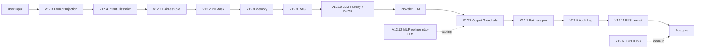

#### V12.1 Fairness Layer

**Path canônico:** [fairness_guard.py](app/shared/compliance/fairness_guard.py) (1.282L) + [fairness_guard_middleware.py](app/shared/compliance/fairness_guard_middleware.py) + handler 451 em [main.py](app/main.py).

**Interface:** `FairnessGuard.check(text) → FairnessCheckResult` com `is_blocked`, `category`, `blocked_terms`, `soft_warnings`, `educational_message`. Métodos auxiliares: `check_explicit_bias()`, `check_batch_learning()`, `detect_interview_indicators()`, `apply_inclusive_language()`, `log_check()`.

**Termos:** 111 PT-BR + 38 EN em `IMPLICIT_BIAS_TERMS` (gender/age/socioeconomic/religion/PCD proxies). Detecção via regex case-insensitive com normalização Unicode.

**Persistência:** Tabela `fairness_audit_logs` (company_id, check_type, blocked_terms, category, context, recruiter_id, candidate_id, job_id, educational_message). Modelo em [libs/models/lia_models/fairness_audit.py](libs/models/lia_models/fairness_audit.py).

**Política:** Middleware em endpoints críticos (POST /jd-generation, POST /vacancies, POST /applications), inline em 28 endpoints, exception handler global retorna 451. Task batch `compute_affirmative_audit` (diário 04:30 UTC) reprocessa padrões.

**IDs:** V12.1-F1 TermDetector, V12.1-F2 BlockerPolicy, V12.1-F3 InterviewIndicators, V12.1-F4 InclusiveLanguageReplacer, V12.1-F5 AuditLogWriter, V12.1-F6 EducationalMessaging.

**Lacunas:** Compensation policy validation (TODO:001), nenhum LLM judge pós-detecção, RLS não confirmada em fairness_audit_logs.

#### V12.2 PII Mask & Encryption

**Path canônico:** [pii_masking.py](app/shared/pii_masking.py) (235L) + [encryption/__init__.py](app/shared/encryption/__init__.py) + [encryption/encrypted_field_mixin.py](app/shared/encryption/encrypted_field_mixin.py).

**Patterns:** CPF, EMAIL, PHONE_BR, RG, CNPJ + quasi-identifiers (ano formatura, idade, endereço/bairro). Aplicação:
1. `install_global_pii_masking()` em startup → `PIIMaskingFilter` em todos handlers de logging.
2. `strip_pii_for_llm_prompt()` chamada em `MainOrchestrator` antes de LLM call (Layer 1+3, opt-in Layer 4 Presidio NER).
3. `EncryptedFieldMixin` para encrypt at rest (CPF, email) via Fernet 44.0.

**Persistência:** `candidates.cpf` (ciphered) + `candidates.cpf_hash` (searchable hash).

**IDs:** V12.2-PII1 LogMasking, V12.2-PII2 LLMPromptStripping, V12.2-PII3 PresidioNER (opt-in), V12.2-PII4 EncryptedFieldMixin.

**Lacunas:** Layer 4 Presidio desabilitado por default; hash searchable algoritmo não documentado em SSH inicial; rotação de Fernet key não documentada.

#### V12.3 Prompt Injection Guard

**Path canônico:** [security_patterns.py](app/shared/robustness/security_patterns.py) (lógica) ← [prompt_injection.py](app/shared/prompt_injection.py) (130L wrapper) ← [prompt_injection_guard.py](app/shared/compliance/prompt_injection_guard.py) (re-export).

**Detecção:** regex jailbreak keywords + structural patterns + opcionalmente LLM judge (não default).

**Política:** Pré-LLM em `MainOrchestrator.process()` (~linha 370) + agent_chat_ws/sse + WSI/recruiter chat. Não bloqueia automaticamente — marca `is_suspicious` e delega ao caller.

**IDs:** V12.3-PI1 JailbreakDetector, V12.3-PI2 StructuralAnalyzer, V12.3-PI3 SemanticDetector (opt-in).

**Lacunas:** Patterns não enumerados em código público; nenhum audit log de tentativas; risk scoring não documentado.

#### V12.4 Intent Classifier

**Path canônico:** [intent_classifier.py](app/domains/ai/services/intent_classifier.py) (220L) + [enhanced_intent_classifier.py](app/domains/ai/services/enhanced_intent_classifier.py).

Auxiliares: [intents_config.py](app/orchestrator/action_executor/intents_config.py) (912L config registry), [navigation_intent.py](app/orchestrator/navigation_intent.py) (legacy navegação UI).

**Modelo:** Claude LLM com structured output (JSON mode). 5 intents: DATA_INPUT, QUESTION, CORRECTION, DEVIATION, REUSE_VACANCY.

**Política:** Embarcado em wizard (POST /wizard/{step}), routing LLM em `MainOrchestrator:270`. Latência ~500ms-2s por classify (1 LLM call). Fallback default DATA_INPUT.

**IDs:** V12.4-IC1 IntentDetector, V12.4-IC2 LLMClassifier, V12.4-IC3 EntityExtractor, V12.4-IC4 ContextAwareness.

**Lacunas:** Confidence score não usado downstream; entity extraction schema indefinido; adaptive intent learning desabilitado.

#### V12.5 Audit Log

**Path canônico:** [audit_service.py](app/shared/compliance/audit_service.py) (659L) + [audit_storage.py](app/shared/compliance/audit_storage.py) + [audit_writer.py](app/shared/compliance/audit_writer.py) + [audit_callback.py](app/shared/compliance/audit_callback.py) + [audit_models.py](app/shared/compliance/audit_models.py) + [libs/audit/lia_audit/](libs/audit/lia_audit/).

**Schema:** `audit_logs` (id, company_id, agent_name, decision_type, action, candidate_id, job_vacancy_id, reasoning JSON, confidence, criteria_used, criteria_excluded, human_review_required, created_at).

**8 decision types:** SCORE_CANDIDATE, APPROVE_CANDIDATE, REJECT_CANDIDATE, MOVE_STAGE, SEND_MESSAGE, SCHEDULE_INTERVIEW, GENERATE_FEEDBACK, JOB_CREATION.

**Retenção:** SOX 7y (audit/AI ethics), LGPD 5y, security 3y, ops 2y — documentado em [audit_logs.py:140-213](libs/models/lia_models/audit_logs.py:140) com `legal_basis` por tipo.

**Política:** Sync inline em decisões críticas + LangChain `AuditCallback` em agent invocations + batch writer task `audit-lifecycle-monthly` (V4-B19).

**S3 long-term:** [audit_storage.py:110](libs/audit/lia_audit/audit_storage.py:110) usa boto3 para arquivamento.

**IDs:** V12.5-AL1 DecisionLogger, V12.5-AL2 ReasoningCapture, V12.5-AL3 CriteriaTracking, V12.5-AL4 HumanReviewFlag, V12.5-AL5 RetentionPolicy, V12.5-AL6 DSRIntegration.

**Lacunas:** RLS em `audit_logs` (modelo NÃO tem `company_id` direto — campo está mas RLS policy precisa ser confirmada); reasoning JSON schema indefinido.

#### V12.6 LGPD Compliance + DSR

**Path canônico:** [data_subject_requests.py](app/api/v1/data_subject_requests.py) (25.7KB, 10 endpoints) + [lgpd_cleanup_service.py](app/shared/services/lgpd_cleanup_service.py) + [observability.py:63 LegalBasis enum](libs/models/lia_models/observability.py:63) + tabela `consent_versions` em [observability.py:1183](libs/models/lia_models/observability.py:1183).

**10 endpoints DSR (Art. 18 LGPD):**

| ID | Method | Path | Visibilidade |
|---|---|---|---|
| V12.6-EP1 | POST | /data-subject-requests/ | público (sem auth) |
| V12.6-EP2 | GET | /track/{id} | público |
| V12.6-EP3 | GET | /stats | autenticado |
| V12.6-EP4 | GET | /  (list) | autenticado |
| V12.6-EP5 | GET | /{id} | autenticado |
| V12.6-EP6 | PUT | /{id}/assign | autenticado (admin) |
| V12.6-EP7 | PUT | /{id}/verify-identity | autenticado |
| V12.6-EP8 | PUT | /{id}/process | autenticado |
| V12.6-EP9 | PUT | /{id}/complete | autenticado |
| V12.6-EP10 | PUT | /{id}/reject | autenticado |

**LegalBasis enum:** CONSENT, CONTRACT, LEGAL_OBLIGATION, VITAL_INTEREST, PUBLIC_INTEREST, LEGITIMATE_INTEREST.

**Cleanup TTLs:** rejected 90d, chat 90d, interview 180d, screening 365d, audit 7y.

**IDs:** V12.6-LGPD1 DSRPortal, V12.6-LGPD2 ConsentVersioning, V12.6-LGPD3 RetentionPolicy, V12.6-LGPD4 AnonymizationService, V12.6-LGPD5 SLATracking, V12.6-LGPD6 IdentityVerification.

**Lacunas:** SLA alerting automation; portability format indefinido (CSV/JSON/PDF?); RLS em `consent_versions` não confirmada.

#### V12.7 Output Guardrails

**Path canônico:** [fact_checker.py](app/shared/compliance/fact_checker.py) (140L).

**5 claim types validados:** salary ranges, candidate counts, interview status, dates, job requirements. Regex patterns + lookup em DB.

**Política:** Pós-LLM, opt-in via env `FACT_CHECK_ENABLED=true`. Não bloqueia — anexa metadata `confidence_verified` à response.

**IDs:** V12.7-OG1 ClaimDetector, V12.7-OG2 SourceValidator, V12.7-OG3 AccuracyScoring, V12.7-OG4 MetadataAttachment.

**Lacunas:** Domain validators (`domain_validators.py`) não localizados; Pydantic schema validation pós-LLM em tools não enumerada; nenhuma feedback loop para LLM.

#### V12.8 Memory Layer

**Path canônico:** [working_memory.py](libs/agents-core/lia_agents_core/working_memory.py) (260L) + [long_term_memory.py](libs/agents-core/lia_agents_core/long_term_memory.py) + [memory_integration.py](libs/agents-core/lia_agents_core/memory_integration.py) + [memory_resolver.py](app/orchestrator/memory_resolver.py).

**3 camadas:**
1. **Working memory:** session-scoped JSON em `agent_working_memory` table (collected_fields, current_plan, pending_actions).
2. **Long-term memory:** message-level storage + search vetorial (path canônico em libs/agents-core).
3. **Pronoun resolver:** `MemoryResolver.resolve_pronouns()` (Tier 0 do CascadeRouter).

**Compressão:** task `memory.compress_old_episodes` (V4-B14, diário 03h UTC) — LLM summary + embedding.

**IDs:** V12.8-MEM1 WorkingMemoryStorage, V12.8-MEM2 ConversationHistory, V12.8-MEM3 CompressionTask, V12.8-MEM4 PronounResolver.

**Lacunas:** Long-term memory table schema não confirmado em SSH; embedding provider indefinido; retention policy não documentada explicitamente.

#### V12.9 RAG Layer

**Path canônico:** [rag_service.py](app/domains/ai/services/rag_service.py) + [rag_pipeline_service.py](app/domains/ai/services/rag_pipeline_service.py) + [domain_embedding_service.py](app/domains/ai/services/domain_embedding_service.py) + [embedding_cache_service.py](app/domains/ai/services/embedding_cache_service.py) + [embedding_service.py](app/shared/intelligence/embedding_service.py) + 4 providers.

**Pipeline:** Document → Chunking → Embedding (4 providers: OpenAI 1536d, Anthropic, Gemini ~768d, local) → pgvector storage → cosine retrieval → context assembly.

**Eval:** [ragas_evaluation_service.py](app/domains/ai/services/ragas_evaluation_service.py) (Recall, Precision, F1, BLEU). Beat schedule V4-B7.

**Index rebuild:** task V4-B11 diário 04h UTC.

**IDs:** V12.9-RAG1 DocumentIngestor, V12.9-RAG2 EmbeddingProvider, V12.9-RAG3 VectorStore, V12.9-RAG4 ContextAssembler, V12.9-RAG5 RagasEvaluator.

**Lacunas:** Chunking strategy não documentada; embedding dim mismatch entre providers (1536 vs 768); rerank não implementado; cosine threshold 0.7 hardcoded.

#### V12.10 LLM Factory + BYOK

**Path canônico:** [llm_factory.py](app/shared/providers/llm_factory.py) (28KB, 800+L) + [tenant_llm_context.py](app/shared/tenant_llm_context.py) + [check_llm_factory_enforcement.py](scripts/check_llm_factory_enforcement.py) (CI linter).

**Arquitetura:** `LLMProviderFactory` (registry classes) → `ProviderContainer` (DI per-tenant) → `TenantProviderRegistry` (singleton tenant_id → container). Entry: `get_provider_for_tenant()` / `get_provider_for_tenant_from_db()`.

**Quality tiers:**
- tier1: claude-sonnet-4-6, claude-opus-4-7, gemini-2.5-pro, gemini-2.5-flash, gpt-4o, gpt-4-turbo
- tier2: claude-haiku-3-5, gemini-2.0-flash, gpt-4o-mini

**Task minimum:** screening=tier1, wsi=tier1, chat=tier2.

**FALLBACK_ORDER:** `["gemini", "claude", "openai"]`.

**BYOK:** Tabela `tenant_llm_config` com `provider_api_keys` Fernet-encrypted. Linter verifica ALLOWLIST (11 paths autorizados) + BLOCKED_NAMES (AsyncAnthropic, ChatAnthropic, ChatOpenAI, ChatGoogleGenerativeAI, genai.Client).

**IDs:** V12.10-LLM1 ProviderRegistry, V12.10-LLM2 TenantContainer, V12.10-LLM3 QualityTierEnforcement, V12.10-LLM4 BYOKSupport, V12.10-LLM5 CILinter.

**Lacunas:** CI executa linter? (verificar `.github/workflows/ci.yml`). 1 bypass real detectado: [skills_ontology_engine.py:535](app/domains/talent_intelligence/services/skills_ontology_engine.py:535) usa `os.environ.get("GEMINI_API_KEY")` direto (entra na auditoria como achado).

#### V12.11 Multi-tenancy + RLS

**Path canônico:** RLS policies em [040_add_rls_multi_tenant.py](alembic/versions/040_add_rls_multi_tenant.py), [068_rls_deny_by_default.py](alembic/versions/068_rls_deny_by_default.py), [102_realign_compensation_policies.py](alembic/versions/102_realign_compensation_policies.py).

Enforcement: [auth_enforcement.py](app/middleware/auth_enforcement.py) middleware injeta `_current_company_id: ContextVar` no início de cada request. [database.py](app/core/database.py) define `set_tenant_context(db, company_id)` (executa `set_config('app.company_id', :cid, true)`) e `get_tenant_db()` (DI dependency com `SET ROLE lia_app`).

**Policies por tabela:**
```sql
ALTER TABLE <tab> ENABLE ROW LEVEL SECURITY;
ALTER TABLE <tab> FORCE ROW LEVEL SECURITY;
CREATE POLICY <tab>_tenant_select ON <tab> FOR SELECT
  USING (current_setting('app.company_id') = company_id::text);
-- INSERT/UPDATE/DELETE análogos
```

**IDs:** V12.11-RLS1 ContextVarInjection, V12.11-RLS2-5 PolicySelect/Insert/Update/Delete, V12.11-RLS6 ForceRowLevelSecurity.

**Modelos sem company_id (24):** alguns by-design globais (saas_metrics, global_policies, default_templates, health_check, client_account); 8-10 suspeitos (audit_logs, conversation, task, technical_tests, screening_question_set, evaluation_criteria, rubric, voice_screening, candidate_feedback, candidate_job, self_scheduling). Investigação na Fase 2.

#### V12.12 ML Pipelines (não-LLM)

**Path canônico:** [cv_scoring_service.py](app/domains/cv_screening/services/cv_scoring_service.py) + [lia_score_service.py](app/domains/cv_screening/services/lia_score_service.py) + [rubric_evaluation_service.py](app/domains/cv_screening/services/rubric_evaluation_service.py) + [embedding_service.py](app/shared/intelligence/embedding_service.py) (classical) + [model_drift_service.py](app/domains/ai/services/model_drift_service.py).

**Score thresholds:** highly_recommended ≥85, recommended ≥70, potential ≥55, low_match ≥40, not_recommended <40.

**Tasks:** `routing.recompute_adjustments` (V4-B8 diário), `ml.feedback.recompute_active_jobs` (V4-B13 semanal), `drift.run_batch` (V4-B15 diário), `golden_drift.run_check` (V4-B16 diário).

**IDs:** V12.12-ML1 RubricEvaluator, V12.12-ML2 DeterministicScorer, V12.12-ML3 ClassicalRanker, V12.12-ML4 FairnessMonitor, V12.12-ML5 FeedbackLoop.

**Lacunas:** Reranking não implementado (apenas cosine); model drift definição vaga; feedback loop manual ou auto?; fairness check em scoring não bloqueia (apenas alerts).

---

## Parte IV — Vistas de Fluxo

### V13. Caminhos Canônicos de Request [V13]

#### V13-F1: Candidato via WhatsApp/Portal

**Tese:** Candidato envia mensagem via WhatsApp (Twilio webhook) ou portal público, sistema converte em ChatRequest, MainOrchestrator processa com 4 phases, agent CandidateSelfService responde, persiste em conversation + audit logs, envia resposta via WhatsApp/portal.

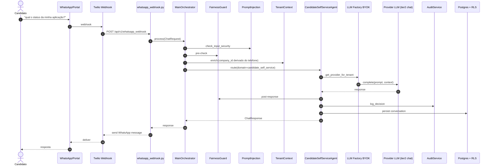

#### V13-F2: Recrutador via Chat Unificado (REST/WS/SSE)

**Tese:** Recrutador no FE chat envia mensagem via 3 transportes possíveis (REST, WebSocket Rails ActionCable, SSE), backend-proxy do Next.js encaminha para FastAPI, MainOrchestrator processa com cascading router, agent retorna; streaming via SSE/WS para UX em tempo real.

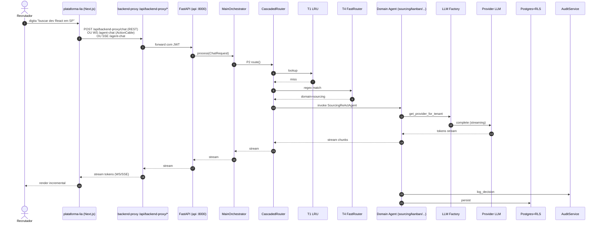

#### V13-F3: API REST Síncrona (Lifecycle CRUD)

**Tese:** Cliente integrador (FE ou ATS externo) chama API REST para operação CRUD (criar vaga, listar candidatos, mover pipeline), middleware AuthEnforcement valida JWT + injeta `company_id`, RLS filtra automaticamente, response wrap em envelope `{ok:true, data:...}`.

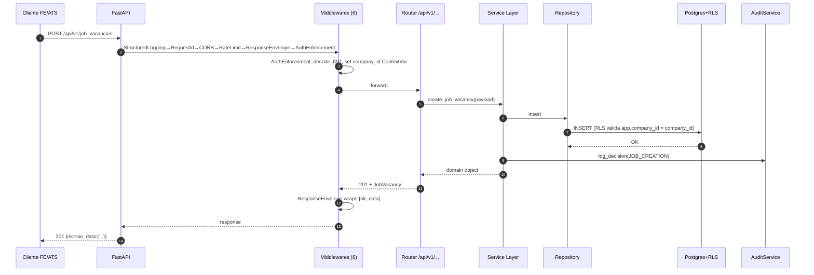

#### V13-F4: Background Async (Celery Task + Schedules)

**Tese:** Beat scheduler (ou caller manual) publica task em RabbitMQ → fila prioritária → worker pega → executa lógica (e.g., LGPD cleanup, RAG rebuild, drift check) → publica resultado em Redis → on_failure push DLQ Redis + Bell notification.

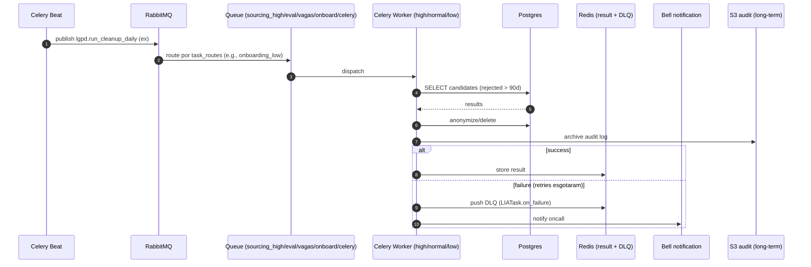

**Inventário (4 fluxos canônicos):**

| ID | Fluxo | Ator | Entrada | Agente principal | Saída |
|---|---|---|---|---|---|
| V13-F1 | Candidato WhatsApp/Portal | Candidato | Twilio webhook ou form portal | CandidateSelfServiceAgent | WhatsApp ou portal response |
| V13-F2 | Recrutador chat (REST/WS/SSE) | Recrutador | FE Next.js | varios (sourcing/kanban/pipeline/etc) | stream para UI |
| V13-F3 | API REST CRUD | FE/ATS | HTTP POST/GET/PUT/DELETE | (sem agente IA) | JSON envelope |
| V13-F4 | Background async | Celery Beat ou caller | task signature | Celery worker | result em Redis ou DLQ |

---

## Parte V — Vistas Operacionais

### V14. Configuração e Runtime [V14]

**Tese:** A configuração é centralizada em [libs/config/lia_config/config.py](libs/config/lia_config/config.py) (Pydantic Settings), exposta via env vars do `.env.example` (~50 vars), com hierarquia de overrides: env explícita > BROKER_BACKEND derivation > defaults; secrets em env (futuro vault); per-tenant config em DB (`tenant_llm_config`).

**Inventário:**

| ID | Categoria | Vars/configs | Notas |
|---|---|---|---|
| V14-CFG1 | App | APP_NAME, APP_ENV (dev/staging/prod), DEBUG, LOG_LEVEL | global runtime |
| V14-CFG2 | API | API_HOST, API_PORT (default 8001), CORS_ORIGINS (JSON list) | múltiplos serviços (8000-8003) |
| V14-CFG3 | Database | DATABASE_URL (asyncpg), DATABASE_POOL_SIZE=20, DATABASE_MAX_OVERFLOW=10 | RLS via SET ROLE + set_config |
| V14-CFG4 | Redis | REDIS_URL | cache + result + DLQ |
| V14-CFG5 | RabbitMQ | RABBITMQ_URL | broker AMQP |
| V14-CFG6 | BROKER_BACKEND | redis \| rabbitmq \| pubsub | switch único de broker |
| V14-CFG7 | LLM keys | ANTHROPIC_API_KEY, OPENAI_API_KEY, GOOGLE_APPLICATION_CREDENTIALS, GOOGLE_CLOUD_PROJECT | global default; per-tenant override em `tenant_llm_config` (BYOK) |
| V14-CFG8 | LangSmith | LANGCHAIN_TRACING_V2, LANGCHAIN_API_KEY, LANGCHAIN_PROJECT | observability LLM |
| V14-CFG9 | Pearch | PEARCH_API_KEY, PEARCH_API_URL | enrichment |
| V14-CFG10 | Twilio | TWILIO_ACCOUNT_SID, TWILIO_AUTH_TOKEN, TWILIO_WHATSAPP_NUMBER | WhatsApp + SMS + Voice |
| V14-CFG11 | Microsoft Graph | AZURE_TENANT_ID, AZURE_CLIENT_ID, AZURE_CLIENT_SECRET | Teams + Calendar + Outlook |
| V14-CFG12 | Jira | JIRA_EMAIL, JIRA_API_TOKEN, JIRA_CLOUD_ID, JIRA_PROJECT | bug spec generator |
| V14-CFG13 | Security/JWT | SECRET_KEY (compartilhado FE/BE) | auth |
| V14-CFG14 | LIA_ENCRYPTION_KEY | Fernet at-rest (BYOK + PII) | rotação não documentada |
| V14-CFG15 | REDIS_ENCRYPTION_KEY | opt-in PII encrypt em Redis | sem chave: graceful degradation |
| V14-CFG16 | Rails ATS URL | RAILS_API_URL (staging: staging2.wedotalent.cc) | integração legada |
| V14-CFG17 | Feature flags | LIA_V2_USE_PLAN_SERVICE, LIA_V2_USE_FALLBACK_REACT, ROUTER_VECTOR_CACHE_ENABLED, LLM_PROMPT_PII_STRIPPING_ENABLED, LLM_PROMPT_PRESIDIO_ENABLED, FACT_CHECK_ENABLED | runtime toggles |

**Settings class:** [config.py](libs/config/lia_config/config.py) usa pydantic-settings 2.6.1.

**Hierarquia:** environment-specific overrides via env file + Pydantic field validators.

**Ordem dos middlewares HTTP** (ordem de execução para entrada — FastAPI processa em reverso):

1. **StructuredLoggingMiddleware** ([main.py:483](app/main.py:483)) — outermost, captura status final
2. **RequestIdMiddleware** ([main.py:480](app/main.py:480))
3. **CORSMiddleware** ([main.py:471](app/main.py:471)) — antes de RateLimit para 429 incluir CORS
4. **RateLimitMiddleware** ([main.py:466](app/main.py:466))
5. **ResponseEnvelopeMiddleware** ([main.py:463](app/main.py:463)) — wrap 2xx em `{ok:true,data:...}`
6. **AuthEnforcementMiddleware** ([main.py:460](app/main.py:460), innermost) — valida JWT + injeta company_id

**Exception handlers globais:**
- `FairnessBlockedError` → HTTP 451 controlado
- `LIAError` / `LIAComplianceError` → mapeamento HTTP padronizado
- `RequestValidationError`, `PydanticValidationError`, `StarletteHTTPException`

---

## Anexos

### A1. Stack Tecnológica Confirmada

**Backend (lia-agent-system):**
- Python 3.11
- FastAPI 0.115.5, uvicorn 0.32.1, websockets 13.1, python-multipart 0.0.19
- SQLAlchemy 2.0.36, Alembic 1.14.0, asyncpg 0.30.0, psycopg2-binary 2.9.10
- Pydantic 2.10.3, pydantic-settings 2.6.1
- LangChain 0.3.9, langchain-anthropic 0.3.22, langchain-openai 0.2.9, langchain-google-vertexai 2.0.8, LangGraph 0.2.53, langgraph-checkpoint-postgres 2.0.8, langsmith ≥0.2.6
- Celery 5.4.0, Redis 5.2.0, aio-pika 9.5.3, APScheduler 3.10.4
- httpx 0.28.1, aiohttp 3.11.10
- pgvector 0.3.6
- cryptography 44.0.0, pyjwt[crypto] 2.10.1, passlib[bcrypt] 1.7.4
- Microsoft: msal 1.31.0, msgraph-sdk 1.12.0, botbuilder-core 4.17.0, botbuilder-schema 4.17.0, msrest 0.7.1
- Twilio 9.4.0, Resend 2.19.0, email-validator 2.2.0
- Sentry-sdk[fastapi] 2.19.2
- python-docx 1.1.2, openpyxl 3.1.5
- beautifulsoup4 4.12.3, lxml 5.3.0
- icalendar 6.0.1, pytz 2024.2
- google-api-python-client 2.151.0, google-auth 2.36.0, google-auth-httplib2 0.2.0, google-auth-oauthlib 1.2.1
- python-dotenv 1.0.1, python-dateutil 2.9.0
- 8 libs editáveis: lia-config, lia-utils, lia-audit, lia-messaging, lia-models, lia-agents-core, lia-services, lia-contexts

**Frontend (plataforma-lia):**
- Next.js 16.2.4 (App Router), React 19.0.0
- TypeScript 5.8.3 (strict)
- Tailwind 3.4.17, shadcn/ui (new-york style, baseColor zinc)
- Zustand 5.0.12, SWR 2.4.1, TanStack React Virtual 3.13.19
- react-hook-form 7.72.0, Zod 4.3.6
- WorkOS 7.82.0
- @rails/actioncable 8.1.300
- lucide-react 0.475.0
- Turbopack + Vite, Biome 1.9.4
- Playwright + Vitest + @axe-core/playwright

**Infraestrutura (docker-compose):**
- pgvector/pgvector:pg16, redis:7-alpine, rabbitmq:3-management-alpine, mher/flower:2.0
- 4 microserviços API (8000, 8001, 8002, 8003) + 3 Celery workers + 1 beat + Flower

### A2. Inventário de Bibliotecas com Função

(Resumo no A1; lista completa em pyproject.toml.)

### A3. Catálogo de Endpoints (REST e WebSocket)

**Total:** 264 `include_router` em [routes.py](app/api/routes.py) + outros routers em main.py.

**Grupos macroscópicos (sample dos primeiros 40):**

| Grupo | Routers |
|---|---|
| Health | system_health, health_check, rails_health, rails_sync, health_langgraph |
| Internal | internal_llm |
| Chat/Communication | chat, teams, calendar, navigation_intent |
| Auth | auth, workos (5 sub-routers: scim, auth, webhook, public_auth) |
| Candidates | candidates, toon, candidate_search, candidate_lists, candidate_communications, candidate_attachments, candidate_compare, cv_parser, lia_profile_analysis, experience_highlights, big_five, affirmative |
| Job Vacancies | job_vacancies, public_vacancies, job_drafts, job_analytics, job_board, job_status_webhooks, job_learning, job_embeddings, job_templates, jd_import, jd_generation, job_qualification |
| Pipeline | pipeline, applications, recruitment_stages, screening_questions, pipeline_templates, pipeline_policy, pipeline_orchestrator, pipeline_velocity, pipeline_prediction, stage_transition_automation |
| ... (mais ~220 routers) | |

**WebSocket / SSE:** `/api/v1/ws/agent-chat/*`, `/api/v1/sse/agent-chat/*`. Auth via `?token=<jwt>` query param ou header.

### A4. Glossário de Domínio

| Termo | Definição |
|---|---|
| LIA | "Light Intelligent Assistant" — marca interna da plataforma de agentes IA |
| WSI | Work Simulation Interview — entrevista simulada por texto/voz para avaliação técnica/comportamental |
| BYOK | Bring Your Own Keys — tenant traz suas próprias keys de provider LLM (Anthropic, OpenAI, Gemini) |
| ATS | Applicant Tracking System — sistemas externos (Gupy, Pandape, Workable) integrados via Merge.dev |
| RLS | Row-Level Security do PostgreSQL — isolamento per-tenant via `set_config('app.company_id', ...)` |
| DSR | Data Subject Request — solicitação de titular de dados (LGPD Art. 18: acesso, correção, exclusão, portabilidade) |
| Tier 1/Tier 2 | Quality tiers de LLM — tier1 (Sonnet/Opus/Pro/4o) para tasks críticas, tier2 (Haiku/Flash/Mini) para chat/cost-optimized |
| Cascade Router | Roteador em 8 tiers (T0-T7) com escalação progressiva: cache → fast → LLM → autonomous |
| ReAct | Reasoning + Acting loop — paradigma do LangGraph onde o agent alterna pensamento, ação (tool) e observação |
| Subagent | LangGraph subgraph node herdando de agente-pai (compartilha modelo + persona + tools, executa no mesmo workflow) |
| Tool Handler | Decorator `@tool_handler(domain, require_company)` que injeta tenant + module gating + audit + error wrap |
| EnhancedAgentMixin | Mixin do `lia_agents_core` que adiciona automaticamente PII strip, audit callbacks, fairness em qualquer agent que herde |
| FairnessGuard | Camada de detecção de viés implícito (regex 111 PT-BR + 38 EN) com bloqueio HTTP 451 |
| C3b layer | Compliance check at boundary (entrada e saída) — pre_compliance + post_compliance |
| LIATask | Base class Celery com `on_failure → DLQ Redis + Bell notification` |
| Pearch | API externa de candidate enrichment (sourcing) |
| Tenant Provider Registry | Singleton mapeando `tenant_id → ProviderContainer` (BYOK) |
| Choose Your AI | Marca interna da feature BYOK + tier enforcement |
| Phase 0 / Phase 1 / Phase 2 | Etapas do MainOrchestrator: PendingAction (confirmação multi-turno), ActionExecutor (regex/intent matching), CascadedRouter+Domain (LLM via 8 tiers) |

---

*Fim da Cartografia v1.0. IDs estáveis prontos para serem referenciados pela Auditoria Sobreposta (`AUDITORIA_SOBREPOSTA.md`) e Plano de Remediação Priorizado (`REMEDIACAO_PRIORIZADA.md`).*
