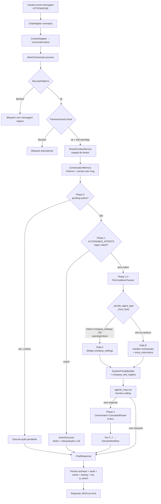
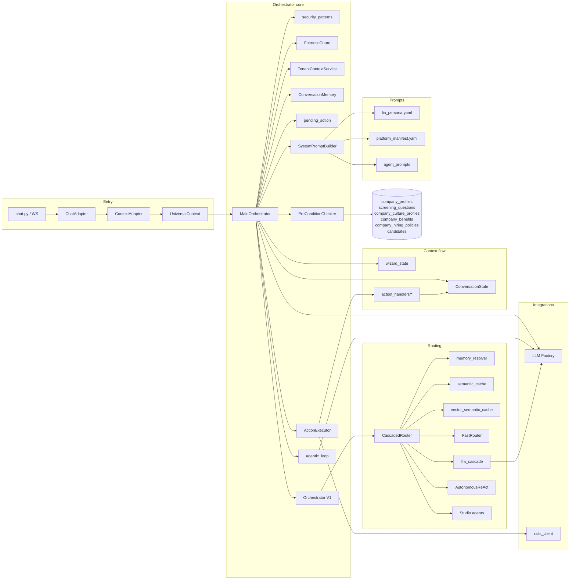

# Handoff — Camada IA Proativa da LIA

> **Audiência**: equipe de engenharia que vai reproduzir esta funcionalidade em outro produto/plataforma.
> **Idioma**: PT-BR. **Fonte da verdade**: o código em `lia-agent-system/`. Sempre que houver divergência entre este texto e o código, **o código vence**.
> **Escopo**: gap detection (`PreConditionChecker`) + roteamento dual (intenção vs. severidade) + agentes/tools/actions, ponta a ponta.
> **Não inclui**: implementação, refatoração, testes ou correções dos gaps listados — este handoff é apenas documentação.

---

## Índice

1. [Sumário executivo e exemplo guiado](#1-sumário-executivo-e-exemplo-guiado)
2. [Visão geral da arquitetura](#2-visão-geral-da-arquitetura)
3. [Entry points (API e adapters)](#3-entry-points-api-e-adapters)
4. [Orquestrador principal e fases](#4-orquestrador-principal-e-fases)
5. [Camada proativa: o `PreConditionChecker` em detalhe](#5-camada-proativa-o-preconditionchecker-em-detalhe)
6. [Roteamento dual (Path A bloqueante vs. Path B informacional)](#6-roteamento-dual-path-a-bloqueante-vs-path-b-informacional)
7. [Classificação de intenção (intent layer)](#7-classificação-de-intenção-intent-layer)
8. [ActionExecutor e action handlers](#8-actionexecutor-e-action-handlers)
9. [Agentes especializados e Cascaded Router](#9-agentes-especializados-e-cascaded-router)
10. [Tools e Tool Registry](#10-tools-e-tool-registry)
11. [Skills (camada conceitual vs. design system)](#11-skills-camada-conceitual-vs-design-system)
12. [Domínios (Domain layer)](#12-domínios-domain-layer)
13. [Integrações externas e o Rails bridge](#13-integrações-externas-e-o-rails-bridge)
14. [Prompt builder e persona](#14-prompt-builder-e-persona)
15. [Estado da conversa e multi-turn](#15-estado-da-conversa-e-multi-turn)
16. [Multi-tenant, segurança e governança](#16-multi-tenant-segurança-e-governança)
17. [Observabilidade, cache e qualidade](#17-observabilidade-cache-e-qualidade)
18. [Frontend: onde o usuário vê](#18-frontend-onde-o-usuário-vê)
19. [Gaps, riscos e dívida técnica](#19-gaps-riscos-e-dívida-técnica)
20. [Checklist de replicação no novo produto](#20-checklist-de-replicação-no-novo-produto)
21. [Apêndices](#21-apêndices)

---

## 1. Sumário executivo e exemplo guiado

### 1.1 Em um parágrafo

A "camada IA proativa" da LIA é o conjunto de mecanismos que faz o assistente **abrir a conversa diagnosticando lacunas reais do tenant** (perfil de empresa incompleto, vaga sem perguntas de triagem, catálogo de benefícios vazio, política de recrutamento ausente, candidatos sem contato), antes do LLM ser chamado. Isso é feito por uma fase determinística (`PreConditionChecker` — 8 checks SQL contra o banco do tenant) cujo resultado vira: (a) um **desvio de roteamento** para um agente corretivo (`company_settings`) quando a severidade é `warning|critical` ou o usuário pediu explicitamente "configurar empresa", ou (b) um bloco de **`extra_instructions`** anexado ao system prompt sob o cabeçalho `## Sugestoes Proativas (detectadas pelo sistema)` quando a severidade é `info`. Em ambos os caminhos, o **LLM passa a ter os achados em mão** e os menciona naturalmente na resposta. Não há "texto livre" do modelo: o que o usuário lê foi instigado por uma consulta determinística ao banco.

### 1.2 Conversa de referência (a "screenshot")

```
USUÁRIO: oi

LIA: Olá! Vejo que sua empresa ainda não tem vagas abertas no momento.
     Notei também que o catálogo de benefícios está vazio e que sua política
     de recrutamento ainda não foi formalizada. Posso te ajudar a configurar
     esses pontos para que as próximas buscas e triagens fiquem mais precisas?
     Por onde quer começar?
```

> **Honestidade técnica (código é a fonte da verdade)**:
> Dos três achados que aparecem na conversa de referência, **dois existem como check determinístico** no `PreConditionChecker` e **um não existe**:
>
> - "catálogo de benefícios está vazio" ← `_benefits_catalog_empty` ✅ (check #6 — `precondition_checker.py:333-349`).
> - "política de recrutamento ainda não foi formalizada" ← `_hiring_policy_missing` ✅ (check #7 — `precondition_checker.py:351-364`).
> - "sua empresa ainda não tem vagas abertas" ❌ — **não há `_company_has_no_jobs` no código atual**. Essa frase só pode aparecer se o LLM inferir a partir do `tenant_context_snippet` (que lista o nº de vagas abertas) ou se o agente `company_settings` chamar uma tool de diagnóstico. **É um ponto cego de determinismo** e está catalogado em [§19 Gap G-01](#19-gaps-riscos-e-dívida-técnica).
>
> O resto deste handoff descreve o ecossistema que produz frases como essas — e onde **o time deve fechar a lacuna** ao replicar.

### 1.3 Anatomia turno a turno

| Trecho da resposta | Origem técnica | Arquivo : linhas |
|---|---|---|
| Tom "Olá!" + "Posso te ajudar... Por onde quer começar?" | Persona base da LIA | `app/prompts/shared/lia_persona.yaml:6-104` |
| Decisão de não se reapresentar formalmente | Regras anti-repetição da persona + `_detect_ongoing_conversation` (apenas se houve mensagens anteriores) | `app/shared/prompts/system_prompt_builder.py:231-238`, `:332-336` |
| "catálogo de benefícios está vazio" | Hint `benefits_catalog_empty` (severity=`info`) | `app/orchestrator/precondition_checker.py:174-188` |
| "política de recrutamento ainda não foi formalizada" | Hint `hiring_policy_missing` (severity=`info`) | `app/orchestrator/precondition_checker.py:191-205` |
| Os dois hints **anexados ao prompt** sob "## Sugestoes Proativas..." (em vez de desviarem o agente) | Regra: severidade `info` → `_decide_agent_type_from_hints` mantém `orchestrator` | `app/orchestrator/main_orchestrator.py:144-193`, `:601-619` |
| "sua empresa ainda não tem vagas abertas" | **Não vem de `PreConditionChecker`** — provável inferência do LLM a partir do `tenant_context_snippet` injetado pelo `TenantContextService` | `app/shared/services/tenant_context_service.py` (`get_context()` → `to_prompt_snippet()`) |
| Mensagem `oi` → routear para resposta conversacional (não disparou nenhuma `ACTIONABLE_INTENT`) | `FastRouter` não match com confidence ≥ threshold; cai no agentic loop / orchestrator | `app/orchestrator/fast_router.py`, `app/orchestrator/agentic_loop.py` |

**Linha do tempo do request `oi`**:

1. Front envia POST → `MainOrchestrator.process()` (`main_orchestrator.py:345`).
2. `check_input_security()` e `FairnessGuard.check()` aprovam (mensagem inocente) — `:374-423`.
3. `TenantContextService.get_context()` enriquece `ctx.tenant_context_snippet` com nome/setor/tamanho/vagas-abertas da empresa — `:425-433`.
4. `_setup_conversation_memory()` cria/recupera a `Conversation` e injeta histórico em `ctx.extra` — `:468-481`.
5. **Phase 0** (`_handle_pending_action`): nenhuma ação pendente → segue — `:508-519`.
6. **Phase 1** (`_try_action_executor`): "oi" não dispara nenhum padrão de `MESSAGE_INTENT_PATTERNS` → segue — `:524-537`.
7. **Phase 1.5** (agentic loop): `precondition_checker.check(ctx)` roda os 8 checks — `:586-599`.
   - Retorna `[hint(benefits_catalog_empty, info), hint(hiring_policy_missing, info), hint(culture_profile_missing, info)]` (e possivelmente outros `info`).
   - `_decide_agent_type_from_hints(hints, intent="")` retorna `("orchestrator", [], [3 hints info])`.
   - O bloco `extra_instructions` é montado (`:601-619`):
     ```
     ## Sugestoes Proativas (detectadas pelo sistema)
     Voce DEVE mencionar estas proativamente se relevantes ao que o recrutador pediu:

     - [info] Catalogo de beneficios vazio. (...)
     - [info] Sua empresa nao tem politica de recrutamento formalizada. (...)
     - [info] Sua empresa ainda nao tem perfil cultural cadastrado (...)
     ```
   - `SystemPromptBuilder.build(agent_type="orchestrator", extra_instructions=...)` compõe o prompt final (`:656-666`).
8. `agentic_loop.run()` chama o LLM do tenant (chat provider) com função-calling habilitada — `:667-674`.
9. LLM responde em texto natural mencionando os hints. `_inject_nav_ui_action` adiciona `ui_action: navigate_to settings` se o texto refletir intenção de navegação — `:289-302`.
10. Mensagem persistida em `conversation_memory`; cache **não escrito** (resposta não é "fallback artifact").

Esse é o "fio condutor" — todos os capítulos seguintes detalham cada etapa.

### 1.4 Resumo da seção

**Como está hoje na LIA**: o turno "oi" passa por security/fairness check, ganha snippet de tenant, monta histórico, passa por PendingAction (vazio) → ActionExecutor (sem match) → Phase 1.5 (PreConditionChecker dispara hints `info`) → SystemPromptBuilder anexa `## Sugestoes Proativas` → LLM gera resposta natural mencionando os hints. Frase "sem vagas abertas" **não** é determinística — vem do `tenant_context_snippet`.

**Por que foi feito assim**: o produto precisa de aderência forte ("a LIA *de fato* sabe o estado da empresa"), e LLMs sozinhos alucinam. A camada determinística (`PreConditionChecker`) garante que os achados existem, e o LLM apenas fala em linguagem natural.

**Como o time deve replicar**: começar pelo exemplo guiado. Antes de escrever código, mapear no novo produto qual é o "oi" e quais 3-5 lacunas reais o sistema deve detectar. Isso vira a lista de checks da §5 e o gabarito de testes.

---

## 2. Visão geral da arquitetura

### 2.1 Pipeline em fases

```
HTTP/WS request
   │
   ▼
ChatAdapter (chat_adapter.py)            ─── normaliza payload
   │
   ▼
ContextAdapter → UniversalContext        ─── modelo único do turno
   │
   ▼
MainOrchestrator.process()               ─── único entry-point lógico
   │
   ├─► SecurityPatterns + FairnessGuard  ─── pré-checks (bloqueio absoluto)
   │
   ├─► TenantContextService              ─── injeta snippet do tenant
   │
   ├─► ConversationMemory.setup          ─── carrega histórico, salva user msg
   │
   ├─► Phase 0: PendingAction            ─── confirm/reject de ação pendente
   │
   ├─► Phase 1: ActionExecutor           ─── intent regex → action determinística
   │
   ├─► Phase 1.5: Agentic Loop           ─── PreConditionChecker → SystemPromptBuilder → LLM tool-calling
   │       │
   │       └─► _decide_agent_type_from_hints (dual routing)
   │
   ├─► Phase 2: Orchestrator + Cascaded Router (8 tiers)
   │       │
   │       ├─► Tier 0.0  rail_a_hint_override
   │       ├─► Tier 0    memory_resolver (pronomes)
   │       ├─► Tier 1    LRU in-process
   │       ├─► Tier 2    Redis exact hash
   │       ├─► Tier 3    pgvector cosine ≥0.85
   │       ├─► Tier 4    FastRouter regex
   │       ├─► Tier 5    LLM cascade (Haiku→Sonnet→Opus)
   │       ├─► Tier 6    AutonomousReActAgent (flagged)
   │       ├─► Tier 7    Studio custom agents
   │       └─► fallback  clarification_needed
   │
   └─► Persist + audit + cache + tasting hints + ui_action
   │
   ▼
ChatResponse  (success, content, agent_used, structured_data, ui_action, fairness_warnings)
```

### 2.2 Glossário operacional

| Termo | Significado neste código |
|---|---|
| **UniversalContext** | dataclass-like que normaliza o turno: `user_id`, `company_id`, `message`, `conversation_id`, `entity_type/entity_id`, `context_type`, `context_page`, `candidates`, `extra` (`app/orchestrator/context_adapter.py`). |
| **WizardState** | máquina de estados para fluxos guiados de criação de vaga (`app/orchestrator/wizard_state.py`). |
| **Intent** | string semântica vinda do classificador (ex: `mover_candidato`, `criar_tarefa`, `company_settings`). |
| **Action** | unidade fechada e auditada de mutação ou consulta determinística — definida em `ACTIONABLE_INTENTS` (`action_executor/intents_config.py`). |
| **Tool** | função invocável pelo LLM via function-calling (registrada em `app/tools/tool_registry_metadata.yaml`). |
| **Agent** | combinação de prompt + toolset + escopo (orquestrador, `company_settings`, agentes por domínio). |
| **Domain** | módulo funcional em `app/domains/<nome>/` com `agents/`, `tools/`, `services/`, `repositories/`. |
| **Skill** | termo **sobrecarregado** — ver [§11](#11-skills-camada-conceitual-vs-design-system). |
| **Hint / ProactiveHint** | dataclass com `type`, `message`, `severity`, `action`, `metadata` (`precondition_checker.py:47-55`). |
| **Gap** | sinônimo informal de hint quando severidade ≥ `warning` (não há tipo dedicado). |
| **Severity** | `info` \| `warning` \| `critical`. Determina se hint é **bloqueante** (Path A) ou **informacional** (Path B). |
| **Dual Path** | regra de roteamento `_decide_agent_type_from_hints` — Path A desvia para `company_settings`, Path B mantém `orchestrator` e injeta hint no prompt. |
| **Tenant Context** | snippet textual gerado por `TenantContextService.get_context()` → `to_prompt_snippet()` com nome da empresa, setor, vagas abertas etc. |
| **BYOK** | Bring Your Own Key — tenant traz suas chaves de LLM; resolvido em `tenant_llm_context.py` + `llm_factory.py`. |
| **Cascade** | hierarquia de modelos (Haiku → Sonnet → Opus) usada no Tier 5 do `CascadedRouter` para classificar intenção. |

### 2.3 Diagrama (a) — Fluxo ponta a ponta do turno conversacional



### 2.4 Resumo da seção

**Como está hoje na LIA**: pipeline em fases sequenciais com ordem fixa, único `MainOrchestrator.process()` como entry-point lógico, glossário de 15 conceitos, e diagrama (a) que mostra o caminho do `request` ao `response` com todos os 8 tiers do `CascadedRouter`.

**Por que foi feito assim**: ordem fixa elimina ambiguidade (cada fase tem responsabilidade única e short-circuit explícito); um único entry-point evita o problema histórico de "dupla delegação" (`MainOrchestrator → Orchestrator`). Glossário existe porque palavras como "skill" e "agent" estão sobrecarregadas.

**Como o time deve replicar**: copiar o glossário no `README` do novo produto antes do código. Implementar as fases na mesma ordem (security primeiro, hints na 1.5, fallback genérico no fim). **Não** combinar fases — cada uma deve ser substituível.

---

## 3. Entry points (API e adapters)

### 3.1 Rota principal de chat conversacional

**Arquivo**: `app/api/v1/lia_assistant/conversational.py` (510 linhas).
**Rota**: `POST /api/v1/lia/conversational/` (linha 113-114).

A rota recebe o payload `ConversationalRequest`, monta um prompt mínimo via `_build_conversational_prompt` (`:41`), enriquece com `TenantContextService` (`:256`), e gera resposta via `LLMService`. **Esta rota é um caminho lateral histórico** — ela **não** passa pelo `MainOrchestrator`. A entrada hoje preferida para chat completo é a rota WebSocket / `chat.py`, que chama `ChatAdapter → MainOrchestrator`.

### 3.2 Bridge para o MainOrchestrator

**Arquivo**: `app/api/v1/chat.py` (linha 23-37):

```python
from app.orchestrator.chat_adapter import ChatAdapter
from app.api.orchestrator_routes import get_main_orchestrator

_chat_adapter = None

def _get_chat_adapter():
    global _chat_adapter
    if _chat_adapter is None:
        _main_orch = get_main_orchestrator()
        _chat_adapter = ChatAdapter(main_orchestrator=_main_orch)
    return _chat_adapter
```

E `app/api/orchestrator_routes.py:104-109`:

```python
def get_main_orchestrator():
    """Dependency to get MainOrchestrator (consolidated entry-point)."""
    from app.orchestrator.main_orchestrator import MainOrchestrator
    ...
    return MainOrchestrator(orchestrator)
```

### 3.3 ChatAdapter

**Arquivo**: `app/orchestrator/chat_adapter.py` (211 linhas).
**Responsabilidades**: converter payloads heterogêneos (HTTP, WS, SSE, Rail A cards, smart suggestions) em `UniversalContext` único. Garante que todas as superfícies caem no mesmo orquestrador.

### 3.4 ContextAdapter / UniversalContext

**Arquivo**: `app/orchestrator/context_adapter.py` (335 linhas).
**Responsabilidade**: tipo único do turno. Os campos relevantes para a camada proativa:

- `company_id` — chave de tenant. Usado por `PreConditionChecker._cache_key`, todas as queries de gap, `TenantContextService`, `tenant_llm_context`.
- `intent` — quando o caller já classificou (ex: front enviou metadata Rail A), evita re-classificar.
- `context_type` / `context_page` — `"company_settings"`, `"settings_config"`, `"hiring_policy"` desviam para domínios específicos (`main_orchestrator.py:521-522`).
- `entity_type` / `entity_id` — quando a conversa é sobre uma vaga ou candidato específico.
- `extra` — dict livre. Recebe `proactive_hints` (payload estruturado para o front, `main_orchestrator.py:619`), `conversation_history`, `metadata` (rail_a, smart-suggestion).

### 3.5 Outras superfícies que entram no mesmo orquestrador

| Superfície | Arquivo | Por que existe |
|---|---|---|
| **Wizard de criação de vaga** | `app/api/v1/lia_assistant/wizard.py` (108 linhas — **deprecated**, redireciona) | Fluxo guiado multi-turno; estado em `WizardState`. |
| **Insights** | `app/api/v1/lia_assistant/insights.py` (452 linhas) | Geração de insights pontuais via mesma persona/agentes. |
| **WebSocket chat** | `app/api/v1/chat.py` | Streaming + SSE; usa `ChatAdapter` + `MainOrchestrator`. |

### 3.6 TenantContextService

**Arquivo**: `app/shared/services/tenant_context_service.py` (225 linhas).
**Chamada em**: `main_orchestrator.py:425-433`.
**O que faz**: dado `company_id` e (opcional) `job_id`, lê `company_profiles`, conta vagas abertas, candidatos no funil, e produz um snippet em texto via `to_prompt_snippet()`. Esse snippet vira o `tenant_context_snippet` injetado no `SystemPromptBuilder.build(tenant_context_snippet=...)`.

> É **provavelmente** esse snippet que dá ao LLM a informação "você não tem vagas abertas" na conversa de referência (ver §1.2). Não é determinístico no sentido `PreConditionChecker`: depende do LLM ler o snippet e mencionar.

### 3.7 Resumo da seção

**Como está hoje na LIA**: três entry points (rota REST `/lia/conversational/`, WebSocket `/chat`, wizard) convergem para o `ChatAdapter`, que normaliza tudo para `UniversalContext` e chama `MainOrchestrator`. `TenantContextService` enriquece com snippet do tenant antes do prompt.

**Por que foi feito assim**: o produto cresce adicionando superfícies (cards Rail A, smart suggestions, sub-aplicações). Sem `ChatAdapter` cada superfície duplicaria a lógica de normalização. `UniversalContext` é o tipo único que evita drift de schema.

**Como o time deve replicar**: definir um **único** tipo de contexto ANTES de plugar a primeira API. Adicionar superfícies novas só via adapter — nunca chamando o orquestrador direto com payloads próprios.

---

## 4. Orquestrador principal e fases

### 4.1 Anatomia de `MainOrchestrator`

**Arquivo**: `app/orchestrator/main_orchestrator.py` (1786 linhas — único entry-point lógico do chat).

```python
class MainOrchestrator:
    """Pipeline unificado eliminando dupla delegação MainOrchestrator → Orchestrator."""

    def __init__(self, orchestrator, *, plan_service=None,
                 fallback_react_service=None, policy_gate_service=None) -> None:
        self._orchestrator = orchestrator
        self._fairness_guard = FairnessGuard()
        self._tenant_context_service = TenantContextService()
        # Sprint III.A — services canônicos via DI
        self._plan_service = plan_service
        self._fallback_react_service = fallback_react_service
        self._policy_gate_service = policy_gate_service
```

(`main_orchestrator.py:304-343`)

### 4.2 Ciclo de vida de um turno

`MainOrchestrator.process()` (`:345-811`) executa, **nesta ordem fixa**:

| Etapa | Linha | Pode short-circuitar? | O que produz |
|---|---|---|---|
| `check_input_security` | 374-389 | Sim (block) | `ChatResponse(blocked_security)` |
| `FairnessGuard.check` | 393-409 | Sim (block) | `ChatResponse(blocked_bias)` |
| `FairnessGuard.check_implicit_bias` | 412-422 | Não | `_soft_warnings` (anexado depois) |
| `TenantContextService.get_context` | 425-433 | Não (try/except) | `ctx.tenant_context_snippet` |
| `RecruiterPersonalizationService` | 437-451 | Não (try/except) | `ctx.extra["recruiter_context"]` |
| User name/role lookup | 454-466 | Não | `ctx.user_name`, `ctx.user_role` |
| `ConversationMemory` setup (LIA-M01) | 468-481 | Não | `conv`, `conv_id`, `ctx.extra["conversation_history"]` |
| **Phase 0.0** Rail A capability gate | 483-506 | Sim (gate hit) | `ChatResponse(open_modal/navigate_to)` |
| **Phase 0** PendingAction | 508-519 | Sim (resolve) | `ChatResponse` |
| **Phase 1** ActionExecutor | 524-537 | Sim (action) | `ChatResponse(executed)` |
| **Phase 1.5** Agentic loop (com PreConditionChecker) | 539-767 | Sim (resposta) | `ChatResponse` |
| **Phase 2** Orchestrator completo | 770 | Não | `ChatResponse` |
| Performance metrics + nav ui_action | 784-794 | Não | `ChatResponse` final |

### 4.3 Pontos de short-circuit

A ordem não é flexível. Cada short-circuit **não passa** pelas fases seguintes:

1. **Security/Fairness blocks** — saída imediata, sem persistência de assistant message.
2. **Rail A capability gate** — quando a mensagem veio de um card de Rail A do front (`metadata.source == "rail_a"`) e a capacidade pode ser resolvida sem LLM (abrir modal de "adicionar candidato" etc.).
3. **PendingAction** — quando há ação aguardando confirmação ou parâmetros (multi-turn).
4. **ActionExecutor** — quando a regex match em `MESSAGE_INTENT_PATTERNS` produz uma `ACTIONABLE_INTENT` válida.
5. **Agentic loop com resposta** — quando `LIA_AGENTIC_LOOP=true` (default) e o LLM produz resposta direta ou via tool-calls.

### 4.4 Fase 0 — PendingAction

**Função**: `_handle_pending_action` (`main_orchestrator.py:817-1059`).
**Estado**: `pending_action_store` (`app/orchestrator/pending_action.py` — 244 linhas).

Quando uma action requer confirmação (`risk_level: high|medium`) ou tem parâmetros faltantes, o handler salva um `PendingAction` no store keyado por `conv_id`. No turno seguinte:

- Se a mensagem é confirmação (`is_confirmation` em `intents_config.py:760-768`): executa.
- Se é rejeição (`is_rejection` em `:770-775`): cancela.
- Se nem confirma nem rejeita: cancela o pending **e segue** para Phase 1.

### 4.5 Fase 1 — ActionExecutor

**Função**: `_try_action_executor` (chamada em `:527`).
**Skip condicional**: contextos `{"company_settings", "settings_config", "hiring_policy"}` pulam Phase 1 e vão direto para Phase 1.5 com agente especializado (`:521-526`).

Detalhes em [§8](#8-actionexecutor-e-action-handlers).

### 4.6 Fase 1.5 — Agentic Loop com PreConditionChecker

Esta é **a fase central deste documento**. Sequência (`main_orchestrator.py:539-767`):

```python
# 1. Skip se contexto é domínio dedicado
_skip_agentic = ctx.context_type in _DOMAIN_SPECIFIC_CONTEXTS
if not _skip_agentic and os.getenv("LIA_AGENTIC_LOOP","true").lower() not in ("false","0"):

    # 2. Provider de chat do tenant (Choose Your AI)
    _agentic_provider = "claude"  # default
    if _loop_company_id:
        _tenant_cfg = await get_tenant_llm_config(_loop_company_id)
        if _tenant_cfg:
            _agentic_provider = _tenant_cfg.get("routing",{}).get("chat") \
                or _tenant_cfg.get("primary_provider") or "claude"

    # 3. Pre-condition check
    _hints = await precondition_checker.check(ctx) or []

    # 4. Decisão de roteamento (sempre, mesmo se _hints vazio)
    _agent_type, _blocking_hints, _informational_hints = \
        _decide_agent_type_from_hints(_hints, intent=_ctx_intent)

    # 5. Bloco extra_instructions (se houver hints de qualquer severidade)
    if _hints:
        _proactive_hints_text = (
            "## Sugestoes Proativas (detectadas pelo sistema)\n"
            "Voce DEVE mencionar estas proativamente se relevantes ao que o recrutador pediu:\n\n"
            + "\n".join(f"- [{h.severity}] {h.message}" for h in _hints)
        )
        ctx.extra["proactive_hints"] = [serialized payload p/ frontend]

    # 6. Compor system prompt
    _system_prompt = SystemPromptBuilder.build(
        agent_type=_agent_type,
        tenant_context_snippet=...,
        user_name=..., user_role=...,
        conversation_history=ctx.extra.get("conversation_history", []),
        conversation_state=ctx.conversation_state,
        context_page=...,
        extra_instructions=_proactive_hints_text,
    )

    # 7. Rodar agentic loop (function-calling)
    _agentic_result = await agentic_loop.run(
        user_message=ctx.message, system_prompt=_system_prompt,
        conversation_history=..., company_id=_loop_company_id,
        user_id=..., provider=_agentic_provider,
    )

    # 8. Telemetria de onboarding (warning se LLM ignorou tools de onboarding)
    if _agent_type == "company_settings":
        ... checa se _tools_called intersecta _onboarding_tools | _OPERATIONAL_TOOLS
```

### 4.7 Fase 2 — Orchestrator completo

**Função**: `_process_via_orchestrator` (`:1132-1209`).
Pipeline: `ConversationMemory → CascadedRouter → DomainWorkflow → Orchestrator.process_request()`. Essa fase só é alcançada se a Phase 1.5 não produziu resposta (ex: agentic loop desabilitado, exceção, `LIA_AGENTIC_LOOP=false`).

Detalhes do `CascadedRouter` em [§9](#9-agentes-especializados-e-cascaded-router).

### 4.8 Estado da conversa que flui pelas fases

| Componente | Arquivo | Papel |
|---|---|---|
| `pending_action_store` | `app/orchestrator/pending_action.py` (244 linhas) | Multi-turn pendente (confirm/params). |
| `WizardState` | `app/orchestrator/wizard_state.py` (170 linhas) | Máquina de estados do wizard de vaga. |
| `state_manager` | `app/orchestrator/state_manager.py` (314 linhas) | `ConversationState` em memória. Atualizado por `update_after_action`. |
| `memory_resolver` | `app/orchestrator/memory_resolver.py` (380 linhas) | Resolve pronomes/referências de contexto (Tier 0 do router). |
| `temporal_resolver` | `app/orchestrator/temporal_resolver.py` (240 linhas) | Resolve "ontem", "semana passada", "a vaga que abri X". |

### 4.9 Resumo da seção

**Como está hoje na LIA**: `MainOrchestrator.process()` (1786 linhas) executa 12 etapas em ordem fixa, com 5 pontos de short-circuit (security, fairness, rail-A capability, pending action, action executor, agentic resposta). Phase 1.5 é o coração — onde `PreConditionChecker` roda e o `SystemPromptBuilder` monta o prompt final.

**Por que foi feito assim**: a regra "fases ortogonais, ordem imutável" impede regressões catastróficas (já houve uma documentada no próprio código sobre intent vs. severidade — `:67-95`). Estado da conversa flui via `ConversationState` para que cada fase enxergue o que veio antes.

**Como o time deve replicar**: implementar em ordem (Security → ActionExecutor → Agentic com hints → Router fallback). Resista à tentação de "otimizar" pulando etapas — short-circuit é OK, reordenar não é.

---

## 5. Camada proativa: o `PreConditionChecker` em detalhe

### 5.1 Arquivo e propósito

**Arquivo**: `app/orchestrator/precondition_checker.py` (389 linhas).
**Docstring** (`:1-22`): "Detects missing pre-conditions that block or degrade the recruiter's workflow and surfaces them as ProactiveHints."

### 5.2 Estrutura de dados

**`ProactiveHint`** (`:47-55`):

```python
@dataclass
class ProactiveHint:
    type: str
    message: str
    action: str | None = None
    severity: str = "info"  # "info" | "warning" | "critical"
    metadata: dict[str, Any] = field(default_factory=dict)
```

**Sem hierarquia, sem subtipos.** A serialização para o frontend (`main_orchestrator.py:608-617`) preserva esses cinco campos.

### 5.3 Cache de 5 minutos

**`_CHECKER_CACHE`** (`:31-44`):

```python
_CHECKER_CACHE: dict[str, tuple[list, float]] = {}
_CHECKER_TTL = 300.0  # 5 minutes

def _cache_key(ctx) -> str:
    return f"{getattr(ctx,'company_id','') or ''}:{(getattr(ctx,'intent','') or '').lower()}"

def clear_precondition_cache() -> None:
    _CHECKER_CACHE.clear()
```

> Cache **in-memory por processo**, sem invalidação por evento (criar vaga, importar benefícios etc.). Ver [§19 G-02](#19-gaps-riscos-e-dívida-técnica).

### 5.4 Inventário completo dos 8 checks

A tabela abaixo é **a referência canônica**. Linha base: `precondition_checker.py:61-231`.

| # | `type` | Tabela / coluna | Condição que dispara | Severidade | `action` | `next_tool` | Linhas |
|---|---|---|---|---|---|---|---|
| 1 | `missing_company_id` | (sem DB) | `ctx.company_id` vazio/None | `warning` | `navigate_to_settings` | — | 78-93 |
| 2 | `incomplete_company_profile` | `company_profiles` (`name`, `industry`, `company_size`) | qualquer campo NULL OU registro inexistente | `info` | `navigate_to_settings` | — | 100-114, 237-275 |
| 3 | `vacancy_no_screening_questions` | `screening_questions WHERE vacancy_id=:vid AND company_id=:cid` | `intent ∈ {screening, wsi, tria, triagem}` E `COUNT == 0` | `warning` | `suggest_screening_questions` | — | 118-135, 277-293 |
| 4 | `company_website_missing` | `company_profiles.website` | website NULL/vazio | `info` | `request_website_and_scrape` | `analyze_company_website` | 137-153, 295-316 |
| 5 | `culture_profile_missing` | `company_culture_profiles` | nenhum registro para `company_id` | `info` | `culture_onboarding` | — | 155-171, 318-331 |
| 6 | `benefits_catalog_empty` | `company_benefits WHERE is_active=true` | `COUNT == 0` | `info` | `navigate_to_benefits_import` | `import_benefits_from_data` | 173-188, 333-349 |
| 7 | `hiring_policy_missing` | `company_hiring_policies` | nenhum registro | `info` | `suggest_recruiting_policy` | `suggest_recruiting_policy` | 190-205, 351-364 |
| 8 | `candidates_missing_contact` | `candidates` (`email`, `phone`, `status`) | `intent` contém kw de outreach E `COUNT(sem email AND sem phone AND status NOT IN ('rejected','archived','hired')) >= 3` | `warning` | `batch_enrich_contacts` | `enrich_candidate_linkedin` | 207-227, 366-385 |

### 5.5 Mensagens exatas (pt-br, sem acentos no source — copy intencional)

```
[1 warning] Notei que seu perfil de empresa ainda nao esta configurado. Isso limita
            buscas de candidatos e triagens. Quer que eu te leve ate Configuracoes agora?
[2 info]    Seu perfil de empresa esta incompleto (faltam: <campos>). Isso reduz a
            precisao das recomendacoes. Posso te ajudar a completar em Configuracoes.
[3 warning] Essa vaga nao tem perguntas de triagem cadastradas. Posso sugerir um
            conjunto de perguntas baseado na descricao da vaga?
[4 info]    Nao vi o site da sua empresa cadastrado. Se voce me passar a URL, consigo
            preencher automaticamente varios campos (nome, setor, cultura, beneficios)
            via analyze_company_website (scraping inteligente).
[5 info]    Sua empresa ainda nao tem perfil cultural cadastrado (missao, visao,
            valores, modelo de trabalho). Isso ajuda a LIA a fazer match cultural nas
            triagens. Posso te guiar por 5 perguntas rapidas ou analisar via website.
[6 info]    Catalogo de beneficios vazio. Beneficios completos ajudam na atracao de
            candidatos. Posso importar de uma lista que voce tem ou te guiar na criacao.
            Categorias sugeridas: Saude, Alimentacao, Transporte, Educacao.
[7 info]    Sua empresa nao tem politica de recrutamento formalizada. Posso sugerir uma
            baseline apropriada ao seu setor e tamanho, ja validada por fairness guard
            (zero discriminacao).
[8 warning] Vi que <N> candidatos no seu pipeline estao sem email/telefone. Isso bloqueia
            outreach. Posso enriquecer em batch via LinkedIn (Apify). Custo rastreado
            por tenant.
```

### 5.6 Ordem de execução e fail-open

Os checks rodam em **ordem fixa** (1→8), **sequencialmente** (não em paralelo). Cada um:

- Está em um `try/except Exception` que loga em `DEBUG` e segue para o próximo (`:94-96, :115-116, :134-135, :152-153, :170-171, :187-188, :204-205, :226-227`).
- Quando o check #1 dispara (sem `company_id`), os checks 2-8 são pulados (`return hints` em `:93`).

**Critério "fail-open"** (`:64-67`): "Always returns a list; individual failures are logged and do not propagate." Se o banco está fora do ar, `_check_company_profile_completeness` retorna `[]` e o turno segue sem hints.

### 5.7 Gating por `intent`

Dois checks são gated por `intent`:

- Check 3 — só roda se `intent ∈ {screening, wsi, tria, triagem}` (`:121`).
- Check 8 — só roda se `intent` contém alguma de `("sourcing","outreach","contact","contato","enviar","mensagem")` (`:211-212`).

Os outros 6 checks rodam **em todo turno** (com cache de 5 min).

### 5.8 Como a lista de hints é usada downstream

Em `main_orchestrator.py:586-619`:

1. `_hints = await precondition_checker.check(ctx) or []`.
2. `_decide_agent_type_from_hints(_hints, intent=_ctx_intent)` retorna `(agent_type, blocking_hints, informational_hints)`.
3. Se `_hints != []`: monta o bloco `_proactive_hints_text` com `f"- [{h.severity}] {h.message}"` para cada hint, **sem distinguir bloqueante de informacional no texto** (apenas a severidade aparece).
4. Payload estruturado para o front em `ctx.extra["proactive_hints"]` (`:619`):
   ```python
   [{"type": ..., "message": ..., "severity": ..., "action": ..., "metadata": ...}, ...]
   ```
5. O bloco `_proactive_hints_text` vai como `extra_instructions=` para `SystemPromptBuilder.build(...)` (`:665`).

### 5.9 Diagrama (b) — Anatomia interna do `PreConditionChecker`

```mermaid
flowchart TD
    Start([check_ctx]) --> Cache{_CHECKER_CACHE<br/>hit < 5min?}
    Cache -->|sim| Return[Retorna hints cached]
    Cache -->|não| C1{Check 1<br/>company_id vazio?}

    C1 -->|sim warning| HW1[hint missing_company_id]
    HW1 --> CacheStore
    C1 -->|não| C2{Check 2<br/>profile incompleto?}

    C2 -->|sim info| H2[hint incomplete_company_profile]
    C2 -->|não| C3
    H2 --> C3

    C3{Check 3<br/>intent=screening &<br/>vaga sem perguntas?}
    C3 -->|sim warning| H3[hint vacancy_no_screening_questions]
    C3 -->|não| C4
    H3 --> C4

    C4{Check 4<br/>website vazio?}
    C4 -->|sim info| H4[hint company_website_missing]
    C4 -->|não| C5
    H4 --> C5

    C5{Check 5<br/>culture vazio?}
    C5 -->|sim info| H5[hint culture_profile_missing]
    C5 -->|não| C6
    H5 --> C6

    C6{Check 6<br/>benefits vazio?}
    C6 -->|sim info| H6[hint benefits_catalog_empty]
    C6 -->|não| C7
    H6 --> C7

    C7{Check 7<br/>hiring_policy vazio?}
    C7 -->|sim info| H7[hint hiring_policy_missing]
    C7 -->|não| C8
    H7 --> C8

    C8{Check 8<br/>intent=outreach &<br/>≥3 candidatos sem contato?}
    C8 -->|sim warning| H8[hint candidates_missing_contact]
    C8 -->|não| CacheStore
    H8 --> CacheStore

    CacheStore[Salva em _CHECKER_CACHE<br/>com timestamp] --> Decide

    Decide[_decide_agent_type_from_hints]
    Decide --> Out1{Intent ∈<br/>company_settings_intents?}
    Out1 -->|sim| PathA[Path A:<br/>agent_type=company_settings]
    Out1 -->|não| Out2{Algum hint<br/>com severity ∈<br/>warning/critical?}

    Out2 -->|sim| PathA
    Out2 -->|não| PathB[Path B:<br/>agent_type=orchestrator<br/>+ informational_hints<br/>injetados no prompt]

    PathA --> Build1[SystemPromptBuilder.build<br/>agent_type=company_settings<br/>extra_instructions=hints]
    PathB --> Build2[SystemPromptBuilder.build<br/>agent_type=orchestrator<br/>extra_instructions=hints]

    Build1 --> LLM[agentic_loop.run]
    Build2 --> LLM
```



### 5.10 Resumo da seção

**Como está hoje na LIA**: 8 checks SQL (1 sem DB, 7 com query direta) → lista de `ProactiveHint(type,message,severity,action,metadata)`. Cache 5 min in-memory keyed por `(company_id,intent)`. Fail-open (cada check em `try/except`). Dois checks são gated por intent (#3 screening, #8 outreach). Mensagens hardcoded em pt-br sem acentos.

**Por que foi feito assim**: determinismo > criatividade do LLM. Cache de 5 min equilibra latência (queries SQL adicionais por turno) vs. frescor (usuário pode configurar e voltar). Fail-open garante que banco fora não bloqueia o chat. Gating por intent evita ruído (não vou avisar sobre falta de outreach quando o usuário pediu kanban).

**Como o time deve replicar**: comece com 1 check end-to-end, prove valor, então expanda. Cache opcional na primeira versão. Use a tabela §5.4 como contrato — cada novo check escolhe `severity` consciente do efeito no roteamento (próxima seção).

---

## 6. Roteamento dual (Path A bloqueante vs. Path B informacional)

### 6.1 A função pura

**Função**: `_decide_agent_type_from_hints` (`main_orchestrator.py:144-193`).
**Assinatura** (parâmetros opcionais permitem override em testes):

```python
def _decide_agent_type_from_hints(
    hints: list,
    *,
    intent: str | None = None,
    onboarding_hint_types: frozenset[str] = _ONBOARDING_HINT_TYPES,
    blocking_severities: frozenset[str] = _BLOCKING_HINT_SEVERITIES,
    company_settings_intents: frozenset[str] = _COMPANY_SETTINGS_INTENTS,
) -> tuple[str, list, list]:
```

Retorna `(agent_type, blocking_hints, informational_hints)`.

### 6.2 Constantes que definem a regra

Em `main_orchestrator.py:88-105`:

```python
_ONBOARDING_HINT_TYPES: frozenset[str] = frozenset({
    "missing_company_id",
    "incomplete_company_profile",
    "company_website_missing",
    "culture_profile_missing",
    "benefits_catalog_empty",
    "hiring_policy_missing",
})
_BLOCKING_HINT_SEVERITIES: frozenset[str] = frozenset({"warning", "critical"})
_COMPANY_SETTINGS_INTENTS: frozenset[str] = frozenset({
    "company_settings",
    "configure_company",
    "settings_config",
    "hiring_policy",
})
```

> Note: **`vacancy_no_screening_questions` e `candidates_missing_contact` NÃO estão em `_ONBOARDING_HINT_TYPES`** mesmo sendo `severity=warning`. Eles **não desviam** o agente — apenas viram texto no bloco `extra_instructions`. Documentado em [§19 G-03](#19-gaps-riscos-e-dívida-técnica).

### 6.3 Tabela canônica de decisão

| Caso | Intent classificado | Hints retornados | `agent_type` resultante | Hints viram `extra_instructions`? |
|---|---|---|---|---|
| 1 | `"company_settings"` (ou `configure_company` / `settings_config` / `hiring_policy`) | qualquer | `company_settings` | sim |
| 2 | qualquer | inclui `incomplete_company_profile` com `warning|critical` | `company_settings` | sim |
| 3 | qualquer | inclui qualquer onboarding hint **só com severity=info** | `orchestrator` | sim |
| 4 | qualquer | inclui apenas hints fora de `_ONBOARDING_HINT_TYPES` (ex: `vacancy_no_screening_questions`, `candidates_missing_contact`) | `orchestrator` | sim |
| 5 | nenhum | nenhum | `orchestrator` | não |

### 6.4 Histórico — por que a regra existe assim

Comentário canônico (`main_orchestrator.py:67-95`):

> *"Antes desta mudança, o conjunto inteiro de `_ONBOARDING_HINT_TYPES` disparava delegação independentemente da severidade — o que fazia 'criar vaga' ser desviado para `company_settings` sempre que faltasse benefits/culture/policy (todos `info`), causando resposta genérica de 'erro interno' porque `company_settings` não tem a tool `create_job_vacancy` no toolset."*

A regra atual (intent explícito OU severity bloqueante) **garante que intenção primária do usuário não seja sequestrada** por hints informacionais.

### 6.5 Tabela de mapeamento gap → agente alvo / instrução

| Gap (hint) | Severity | Default routing | Tool sugerida (se Path A) |
|---|---|---|---|
| `missing_company_id` | warning | **Path A → `company_settings`** | `get_company_profile`, `save_company_field` |
| `incomplete_company_profile` | info | Path B (instrução) | — |
| `company_website_missing` | info | Path B | `analyze_company_website` |
| `culture_profile_missing` | info | Path B | `save_company_section` (cultura) |
| `benefits_catalog_empty` | info | Path B | `import_benefits_from_data` |
| `hiring_policy_missing` | info | Path B | `suggest_recruiting_policy` |
| `vacancy_no_screening_questions` | warning | Path B (não é onboarding type!) | — |
| `candidates_missing_contact` | warning | Path B (não é onboarding type!) | `enrich_candidate_linkedin` |

### 6.6 Onde as outras camadas decidem destino

`_decide_agent_type_from_hints` é **uma de três camadas** que decidem para onde a mensagem vai:

1. **`fast_router.match()`** (`fast_router.py`, 666 linhas) — regex/keyword com `DOMAIN_PATTERNS` retornando `(domain_id, confidence)`.
2. **`cascaded_router.route()`** (`cascaded_router.py`, 838 linhas) — 8 tiers, decide domain final.
3. **`_decide_agent_type_from_hints`** — só decide entre `orchestrator` vs. `company_settings` na Phase 1.5.

Sobreposição catalogada em [§19 G-04](#19-gaps-riscos-e-dívida-técnica).

### 6.7 Armadilhas conhecidas

- **Hint informacional ignorado pelo LLM**: o bloco `extra_instructions` diz "Voce DEVE mencionar estas proativamente se relevantes". Não há verificação determinística de que o LLM mencionou. Em prompts longos, o LLM pode ignorar.
- **Conflito com pending action**: se há `PendingAction` ativa, Phase 0 short-circuita antes da Phase 1.5 — o usuário não vê hints até resolver o pending.
- **Cache mascarando mudanças**: usuário cria vaga, mas o hint "vagas vazias" inferido pelo LLM (via `tenant_context_snippet`) pode persistir no cache de resposta (`response_cache_service`) por TTL.
- **Re-classificação de intent durante o turno**: `_ctx_intent` vem de `getattr(ctx,"intent","")`. Se o classificador de intent rodar **depois** de `_decide_agent_type_from_hints` (ex: dentro do `agentic_loop`), a decisão de Path A por intent explícito pode ser pulada.

### 6.8 Resumo da seção

**Como está hoje na LIA**: função pura `_decide_agent_type_from_hints` decide entre `orchestrator` (default) e `company_settings` (Path A) por: (a) intent ∈ `_COMPANY_SETTINGS_INTENTS`, OU (b) hint com `severity ∈ {warning,critical}` E `type ∈ _ONBOARDING_HINT_TYPES`. Caso contrário, mantém orchestrator e injeta hints como `extra_instructions`.

**Por que foi feito assim**: regressão histórica — antes, qualquer hint onboarding desviava o agente, sequestrando "criar vaga" para `company_settings` (que não tem `create_job_vacancy`). A regra atual respeita a intenção primária do usuário, só desvia quando severidade é alta E faz sentido para `company_settings` resolver.

**Como o time deve replicar**: implementar como **função pura** (sem efeitos colaterais), com tabela de truth como teste. Cuidar para não mover decisão para múltiplos lugares (gap G-04). Documentar as constantes (`_ONBOARDING_HINT_TYPES`, `_BLOCKING_HINT_SEVERITIES`) como **parte da API da camada**.

---

## 7. Classificação de intenção (intent layer)

### 7.1 As três camadas de classificação

| Camada | Arquivo | O que classifica | Quando roda |
|---|---|---|---|
| **`MESSAGE_INTENT_PATTERNS`** | `app/orchestrator/action_executor/intents_config.py:800-1078` | regex → intent name (ex: `mover_candidato`) | Phase 1 (`ActionExecutor`) |
| **`ACTIONABLE_INTENTS`** | `intents_config.py:1-758` | intent → action config (`domain_id`, `action_id`, `required_params`, `risk_level`) | Phase 1 (após match de regex) |
| **`FastRouter.DOMAIN_PATTERNS`** | `app/orchestrator/fast_router.py` | regex → `domain_id` + confidence | Tier 4 do `CascadedRouter` |
| **`navigation_intent`** | `app/orchestrator/navigation_intent.py` (224 linhas) | mensagem → página da plataforma | Pós-resposta (`_inject_nav_ui_action`) |

### 7.2 `MESSAGE_INTENT_PATTERNS` (Phase 1 regex)

Lista ordenada de tuplas `(intent_name, [regex])`. Exemplos representativos (`intents_config.py:800-980`):

| Intent | Padrão (resumido) |
|---|---|
| `atualizar_campo_candidato` | `r"atualiz[ae]r?\s+(o\s+)?(campo|telefone|email|...)"` |
| `criar_tarefa` | `r"(cria[rn]?|adiciona[rn]?)\s+(uma?\s+)?(tarefa|task|to.do)"` |
| `criar_lembrete` | `r"(cria[rn]?|adiciona[rn]?|coloca[rn]?)\s+(um?\s+)?(lembrete|reminder|aviso)"` |
| `agendar_entrevista` | `r"(agenda[rn]?|marca[rn]?)\s+(uma?\s+)?(entrevista|interview)\s+(com|para|pra)\s+\w+"` |
| `analisar_perfil` | `r"(avali[ae]r?|analisa[rn]?)\s+(o\s+)?(currículo|cv|perfil)..."` |
| `gerar_relatorio_kpi` | `r"(kpis?|indicadores?|métricas?)\s+(de\s+|do\s+)?(recrutamento|vagas?|contratação)"` |
| `lia_identidade` | regex de "quem é você", "qual seu nome", etc. |

### 7.3 `ACTIONABLE_INTENTS` (Phase 1 config)

Cada entrada (`intents_config.py:1-758`) tem o shape:

```python
"<intent_name>": {
    "domain_id": "<domain>",
    "action_id": "<action_handler_function>",
    "required_params": ["..."],
    "optional_params": ["..."],
    "risk_level": "read" | "low" | "medium" | "high",
    "requires_confirmation": True | False,
    "param_labels": {...},          # rótulos em pt-br
    "clarification_prompts": {...}, # perguntas para coletar params
}
```

**Risk level → confirmação**:
- `read` / `low` → executa direto.
- `medium` / `high` → cria `PendingAction(awaiting_confirmation=True)` antes de executar.

### 7.4 Como adicionar uma nova intenção

**Roteiro mínimo** (válido para o time replicador):

1. Em `MESSAGE_INTENT_PATTERNS` (`intents_config.py:800-1078`): adicionar tupla `("nova_intent", [r"<regex1>", r"<regex2>"])`.
2. Em `ACTIONABLE_INTENTS` (`intents_config.py:1-758`): adicionar dict com `domain_id`, `action_id`, `required_params`, `risk_level`, `requires_confirmation`.
3. Em `app/orchestrator/action_handlers/<family>.py`: implementar a função `<action_id>(...)` que retorna `ActionResult`.
4. Registrar handler no executor (geralmente automático via convenção `domain_id`).

### 7.5 `navigation_intent` (pós-resposta)

`app/orchestrator/navigation_intent.py` (224 linhas) — chamado em `main_orchestrator.py:1199-1207` e `:289-302`. Detecta se a resposta **deve** acompanhar uma ação de UI (`navigate_to`, `open_modal`). Quando `confidence >= 0.75`, injeta `ui_action: navigate_to` + `ui_action_params: {page, hint}` no `ChatResponse`.

### 7.6 `FastRouter` vs. `agentic_loop` — quem decide?

`FastRouter.match()` é **invocado em duas situações distintas**:

- **Cache lookup** (`main_orchestrator.py:1230-1232`): para gerar `cache_key` por domínio. Não decide rota.
- **Tier 4 do `CascadedRouter`** (`cascaded_router.py:362-411`): se `confidence >= ROUTER_FAST_CONFIDENCE_THRESHOLD`, usa o domínio dele.

Já o `agentic_loop` **não consulta o `FastRouter`** — ele recebe o `system_prompt` (com tools do agente) e deixa o LLM decidir via function-calling se chama tool ou responde texto.

### 7.7 Resumo da seção

**Como está hoje na LIA**: 4 camadas de classificação. `MESSAGE_INTENT_PATTERNS` (regex) + `ACTIONABLE_INTENTS` (config) na Phase 1. `FastRouter.DOMAIN_PATTERNS` no Tier 4 do `CascadedRouter`. `navigation_intent` pós-resposta para `ui_action`. Cada camada serve a um propósito diferente (action determinística vs. roteamento de domínio vs. UI).

**Por que foi feito assim**: regex é barato e determinístico para padrões frequentes; LLM é caro e deve ser último recurso. `ACTIONABLE_INTENTS` traz **risco e parâmetros explícitos** — confirmação multi-turn vem de graça.

**Como o time deve replicar**: comece pelo `ACTIONABLE_INTENTS` (a config). Depois plugue regex em `MESSAGE_INTENT_PATTERNS`. Só monte `FastRouter` quando tiver muitos domínios. Reserve LLM-classification para último.

---

## 8. ActionExecutor e action handlers

### 8.1 Conceito: action vs. tool

| Aspecto | **Action** | **Tool** |
|---|---|---|
| Disparo | Regex match em `MESSAGE_INTENT_PATTERNS` | Decisão do LLM via function-calling |
| Definição | `ACTIONABLE_INTENTS` + handler em `action_handlers/` | YAML em `tool_registry_metadata.yaml` + handler Python |
| Confirmação | Por `risk_level` (auto + multi-turn) | Cada tool define seus próprios checks |
| Auditoria | `_audit_output` em `main_orchestrator.py:1624-1645` | Cada tool emite logs |
| Quem chama | `MainOrchestrator` Phase 1 | `agentic_loop.run()` Phase 1.5 |

### 8.2 Pipeline de uma action

`MainOrchestrator._try_action_executor()` chama `action_executor.execute()`:

1. Tenta match contra `MESSAGE_INTENT_PATTERNS`.
2. Se match: pega config em `ACTIONABLE_INTENTS[intent_name]`.
3. Coleta parâmetros: `required_params` que já estão em `ctx` ou `candidates`.
4. Se faltarem `required_params` → cria `PendingAction(missing_params=...)` e retorna mensagem do `clarification_prompts[param]`.
5. Se completos:
   - Se `requires_confirmation=True` → cria `PendingAction(awaiting_confirmation=True)` com `confirmation_summary`.
   - Senão → executa imediatamente via handler em `action_handlers/<family>.py`.
6. `ActionResult` retorna com `status ∈ {executed, needs_params, needs_confirmation, error}` + `data` + `message`.
7. Se `executed`: passa pelo `_interpret_action_result` (`main_orchestrator.py:1065-1126`) que pede ao LLM para gerar resposta natural a partir do JSON do `data`.

### 8.3 Famílias de handlers

**Diretório**: `app/orchestrator/action_handlers/`.

| Família | Arquivo | Domínio | Exemplos de actions |
|---|---|---|---|
| pipeline | `pipeline_actions.py` | `pipeline_transition` | `mover_candidato`, `mover_candidatos_lote`, `mover_candidatos_por_etapa` |
| candidate | `candidate_actions.py` | `candidate_management` | `atualizar_campo_candidato`, `criar_nota`, `analisar_perfil`, `favoritar_candidato` |
| job | `job_actions.py` | `job_management` | `vaga_urgente`, `sugerir_salario`, `gerar_jd` |
| interview | `interview_actions.py` | `interview_scheduling` | `agendar_entrevista`, `reagendar_entrevista`, `cancelar_entrevista`, `enviar_lembrete_entrevista`, `gerar_link_agendamento` |
| communication | `communication_actions.py` | `communication` | `enviar_email`, `enviar_whatsapp`, `enviar_feedback`, `compartilhar_candidato`, `enviar_relatorio_candidato` |
| analytics | `analytics_actions.py` | `analytics` | `gerar_relatorio_kpi`, `health_check_vaga`, `analisar_funil`, `vagas_sem_candidatos` |
| sourcing | `sourcing_actions.py` | `sourcing` | `taguear_candidatos`, `rankear_candidatos`, `comparar_candidatos`, `buscar_candidatos`, `sugerir_candidatos`, `adicionar_candidato`, `exportar_candidatos` |

### 8.4 Exemplos por família (com config completa)

**Sourcing — `taguear_candidatos`** (`intents_config.py:460-475`):
```python
{
    "domain_id": "sourcing",
    "action_id": "tag_candidates",
    "required_params": ["candidate_ids", "tag"],
    "optional_params": ["list_name"],
    "risk_level": "low",
    "requires_confirmation": False,
    ...
}
```

**Pipeline — `mover_candidatos_lote`** (`intents_config.py:656-671`):
```python
{
    "domain_id": "pipeline_transition",
    "action_id": "batch_move_candidates",
    "required_params": ["candidate_ids", "to_stage"],
    "optional_params": ["from_stage", "reason"],
    "risk_level": "high",
    "requires_confirmation": True,
    ...
}
```

**Interview — `agendar_entrevista`** (`intents_config.py` — deduzido do mesmo padrão):
- `domain_id`: `interview_scheduling`
- `risk_level`: `medium`
- `requires_confirmation`: `True`

### 8.5 Confirmação multi-turn (Phase 0)

Quando `requires_confirmation=True`, o fluxo é:

```
T1 USER: "envia o feedback para Maria Silva"
   → match `enviar_feedback` (risk=medium) → params completos
   → cria PendingAction com confirmation_summary
T1 LIA:  "Vou enviar o feedback para Maria Silva. Confirma?"

T2 USER: "sim"
   → Phase 0 _handle_pending_action detecta confirmation
   → executa _execute_action(...)
   → remove pending, retorna result
T2 LIA:  "Feedback enviado para Maria Silva."
```

`is_confirmation` e `is_rejection` (`intents_config.py:760-775`) listam todas as variantes aceitas em pt-br.

### 8.6 Quando o ActionExecutor é pulado

Em `main_orchestrator.py:521-527`:

```python
_DOMAIN_SPECIFIC_CONTEXTS = {"company_settings", "settings_config", "hiring_policy"}

action_response = None
if ctx.context_type not in _DOMAIN_SPECIFIC_CONTEXTS:
    action_response = await self._try_action_executor(ctx, conv_id)
```

A justificativa: nesses contextos, o **agente especializado** (`company_settings_agent`) deve ler/escrever sem passar por intent regex. Ele tem seu próprio toolset (ver §9.2).

### 8.7 Resumo da seção

**Como está hoje na LIA**: 7 famílias de handlers (`pipeline`, `candidate`, `job`, `interview`, `communication`, `analytics`, `sourcing`) com ~50+ actions registradas. Cada action tem `risk_level` e `requires_confirmation` que definem se há multi-turn de confirmação. Pular Phase 1 em contextos `{company_settings, settings_config, hiring_policy}` é decisão deliberada — esses contextos têm seu próprio agente.

**Por que foi feito assim**: separar action (mutação determinística) de tool (decisão do LLM) facilita auditoria e fairness. `risk_level` permite escalar para "confirma?" sem reimplementar para cada action. Skip por contexto evita conflito quando o usuário está literalmente na página de configurações.

**Como o time deve replicar**: **action vs. tool é a divisão mais importante** do produto. Defina o contrato `ACTIONABLE_INTENTS` cedo. Para cada action, anote `risk_level` antes de implementar handler — isso evita "ah, esqueci de pedir confirmação".

---

## 9. Agentes especializados e Cascaded Router

### 9.1 `CascadedRouter` — 8 tiers

**Arquivo**: `app/orchestrator/cascaded_router.py` (838 linhas).
**Docstring** (`:1-13`):

```
Tier 0.0: rail_a_hint_override   — short-circuit por metadata estruturada do FE
Tier 0:   MemoryResolver         — pronomes/referências de contexto
Tier 1:   LRU in-process         — hash MD5 em memória local (O(1))
Tier 2:   Redis hash cache       — distribuído, exato, compartilhado entre workers
Tier 3:   VectorSemanticCache    — pgvector, cosine similarity >= 0.85
Tier 4:   FastRouter             — regex/keyword (O(n) patterns)
Tier 5:   LLM Cascade            — Haiku→Sonnet→Opus (caro)
Tier 6:   AutonomousReActAgent   — agente cross-domain, fallback final
Tier 7:   Studio Agent Matcher   — custom agents bound to current context
Fallback: clarification_needed   — pergunta ao usuário quando tudo falha
```

| Tier | Custo (latência) | Linha |
|---|---|---|
| 0.0 rail_a_hint | ~0ms | 209-229 |
| 0 memory_resolve | ~5ms | 232-251 |
| 1 LRU | <1ms | 256-282 |
| 2 Redis | ~10ms | 285-311 |
| 3 pgvector | ~50ms | 313-357 |
| 4 FastRouter | ~5ms | 362-411 |
| 5 LLM cascade Haiku→Sonnet→Opus | ~500-3000ms | 436-504 |
| 6 Autonomous ReAct (flagged) | ~5-20s | 506-541 |
| 7 Studio Custom Agents | varia | 543-end |
| Fallback clarification | LLM Build | bottom |

### 9.2 Agentes por domínio relevantes ao exemplo

| Domínio | Diretório | Quando é selecionado |
|---|---|---|
| `company_settings` | `app/domains/company_settings/` | `ctx.context_type` em `_DOMAIN_SPECIFIC_CONTEXTS` OU Path A (intent explícito ou warning/critical hint). Toolset: `company_tool_registry.OPERATIONAL_TOOL_NAMES` + onboarding tools (`check_company_completeness`, `analyze_company_website`, `import_benefits_from_data`, `suggest_recruiting_policy`, `save_company_field`, `save_company_section`, `process_uploaded_document`, `import_workforce_plan`) — referenciado em `main_orchestrator.py:683-699`. |
| `hiring_policy` | `app/domains/hiring_policy/` | `context_type == "hiring_policy"`. Reusa `company_settings` agent + tool `suggest_recruiting_policy`. |
| `job_creation` | `app/domains/job_creation/` | Wizard de vaga, intent `criar_vaga`. |
| `sourcing` | `app/domains/sourcing/` | Intent `buscar_candidatos`, `sugerir_candidatos`, etc. |
| `pipeline` | `app/domains/pipeline/` | Intent `mover_candidato*`, etc. |
| `recruiter_assistant` | `app/domains/recruiter_assistant/` | Default fallback domain (catch-all conversacional). |

### 9.3 `AGENT_TYPE_TO_DOMAIN` mapping

Em `app/orchestrator/domain_mappings.py` (136 linhas) — mapeamento canonical entre `agent_type` (string usada pelo `SystemPromptBuilder`) e `domain_id` (usado pelo router).

### 9.4 Agentic loop (Phase 1.5 e Tier 6)

**Arquivo**: `app/orchestrator/agentic_loop.py` (250 linhas).
**Função principal**: `agentic_loop.run(user_message, system_prompt, conversation_history, company_id, user_id, provider)`.
**Modelo conceitual**: ReAct (Reason → Act → Observe). Em cada iteração:
1. LLM recebe prompt + histórico + ferramentas disponíveis (declaradas via function-calling do provider).
2. LLM ou responde texto, ou pede tool call.
3. Se tool call: orchestrator executa, devolve observação, volta para o LLM.
4. Limite: `max_iterations` (default 8 ou 10).

Resultado:
```python
{
    "response": "<texto final>",
    "tool_calls_made": [{"name": "...", "arguments": {...}, "result": ...}, ...],
    "iterations": <int>,
}
```

### 9.5 `LLM Cascade` (Tier 5 detalhado)

**Arquivo**: `app/orchestrator/llm_cascade.py` (333 linhas).
**Sequência**: tenta classificar com Claude Haiku (barato, ~200 tok); se confidence baixa, escala para Sonnet; se ainda baixa, Opus. **Threshold**: env `ROUTER_LLM_CASCADE_MIN_CONFIDENCE=0.5` (`cascaded_router.py:435`). Resultados < threshold caem para Tier 6.

### 9.6 Falbacks

**Tier 6 — AutonomousReActAgent**: feature-flagged via `AUTONOMOUS_REACT_ENABLED=true` (`cascaded_router.py:508`). Agente cross-domain que tenta resolver sem decidir um único `domain_id` upfront.

**Fallback final**: `clarification_needed` — `SystemPromptBuilder.build_clarification(message, partial_matches, user_name)` (`system_prompt_builder.py:280-329`) gera pergunta + opções amigáveis.

### 9.7 Resumo da seção

**Como está hoje na LIA**: `CascadedRouter` com 8 tiers de custo crescente (cache → regex → LLM Haiku/Sonnet/Opus → autonomous → studio → clarification). Agentes especializados por domínio (`company_settings`, `hiring_policy`, `job_creation`, `sourcing`, `pipeline`, `recruiter_assistant`). `agentic_loop` é ReAct com function-calling, usado em Phase 1.5 e Tier 6.

**Por que foi feito assim**: cascata respeita orçamento (LLM caro só quando necessário). Tier 0.0 atende cards do front sem LLM. Tier 6 é fallback ReAct para queries cross-domain. Tier 7 atende custom agents do Studio (cliente plugou seu próprio agente).

**Como o time deve replicar**: comece com 2 tiers (regex + LLM). Adicione cache (Redis) quando tiver tráfego. Vector cache só vale para volumes altos. Estabeleça threshold mínimo de confidence por tier — Tier N só "vence" se passar do threshold.

---

## 10. Tools e Tool Registry

### 10.1 Arquivos do registry

| Arquivo | Linhas | Papel |
|---|---|---|
| `app/tools/tool_registry_metadata.yaml` | 1025 | Definição declarativa de cada tool: `name`, `description`, `parameters`, `scope`, `allowed_agents`. |
| `app/tools/tool_registry_loader.py` | 156 | Carrega o YAML, valida, expõe `get_tool(name)`. |
| `app/tools/registry.py` | 180 | Singleton de tools registradas. |
| `app/tools/executor.py` | 337 | Executa tool com policy gate (auditoria, rate limit). |
| `app/tools/scope_config.py` | 304 | Constantes `TALENT_FUNNEL`, `JOB_TABLE`, `IN_JOB`, `GLOBAL`. |
| `app/tools/tool_permissions.yaml` | 250 | Permissões por agente/tenant. |
| `app/tools/tool_permissions_loader.py` | 298 | Carrega permissions; usado pelo executor. |
| `app/tools/job_tools.py` | 187 | Handlers Python das tools relacionadas a vagas. |

### 10.2 Famílias de tools shared

| Família | Arquivo |
|---|---|
| Proactive | `app/shared/tools/proactive_tools.py` — tools chamadas pelo agente quando há gap (ex: `check_company_completeness`, `suggest_recruiting_policy`). |
| Insight | `app/shared/tools/insight_tools.py` — geração de insights pontuais. |
| Predictive | `app/shared/tools/predictive_tools.py` — previsão (turnover, time-to-fill). |
| Export | `app/shared/tools/export_tools.py` — geração de CSV/Excel. |

### 10.3 Como o agente "vê" só o subconjunto autorizado

Quando `agentic_loop.run()` monta o request para o LLM, ele filtra as tools disponíveis pelo cruzamento:

- `agent.allowed_tools` (definido no `system_prompt_builder` ou no `CustomAgent` do Studio).
- `tool.allowed_agents` (do YAML).
- `tool.scope` × `ctx.scope` (ex: tool de scope `IN_JOB` só aparece se `ctx.entity_type == "job"`).

Isso evita que um agente de `sourcing` chame `delete_company_profile` (tool de `company_settings`).

### 10.4 Como uma tool é declarada

```yaml
# tool_registry_metadata.yaml (estrutura)
tools:
  - name: analyze_company_website
    description: "Analisa site institucional e extrai nome, setor, valores, benefícios."
    scope: GLOBAL
    allowed_agents: [company_settings, orchestrator]
    parameters:
      type: object
      properties:
        url: {type: string, description: "URL do site da empresa"}
      required: [url]
```

E o handler Python (em `app/domains/company_settings/tools/...`):

```python
async def analyze_company_website(url: str, *, company_id: str) -> dict:
    """Scrape + LLM extraction → atualiza company_profiles."""
    ...
```

### 10.5 Tools por domínio

Em `app/domains/<domínio>/tools/` cada domínio define suas tools especializadas (ex: `app/domains/sourcing/tools/search_candidates.py`).

### 10.6 Resumo da seção

**Como está hoje na LIA**: registro central declarativo (YAML) + handler Python. Cada tool tem `scope` (`TALENT_FUNNEL`, `JOB_TABLE`, `IN_JOB`, `GLOBAL`), `allowed_agents`, e parâmetros tipados (JSON schema). Filtragem cruzada: o LLM só "vê" tools que o agente atual está autorizado a chamar **e** que fazem sentido no contexto (job/pool/global).

**Por que foi feito assim**: separar declaração (YAML legível por não-desenvolvedores, auditável) de implementação (Python). Scope evita que o agente de sourcing chame tool de configuração de empresa por engano. Permissions externas a YAML/DB permite alterar sem deploy.

**Como o time deve replicar**: comece com YAML simples (sem permissions) e tools globais. Quando tiver 10+ tools, adicione `scope`. Só introduza `allowed_agents` quando tiver 2+ agentes.

---

## 11. Skills (camada conceitual vs. design system)

> **Aviso de ambiguidade**: a palavra "skill" aparece em 3 contextos diferentes neste repositório.

| Uso | Onde | O que é |
|---|---|---|
| **Skills do design system / handoff** | `lia-agent-system/.local/skills/`, `.local/secondary_skills/` | Instruções de operação do **agente Replit** (humano usando IDE). Não tem nada a ver com a IA da LIA. |
| **Skills do agente IA** | **Não existe como tipo formal no código** | Conceito implícito: a "skill" do agente é a **tupla** `(Domain, Agent, Tools, Actions)`. |
| **Skills no contexto WSI** | persona, prompts | Termo de RH: hard skills, soft skills do candidato. |

### 11.1 Recomendação ao novo produto

Para evitar overload semântico:

- Use **`Capability`** para a unidade do agente (`Agent + Tools + Actions`).
- Use **`Domain`** para o módulo funcional.
- Reserve **`Skill`** apenas para o vocabulário de RH (competência do candidato).

### 11.2 Resumo da seção

**Como está hoje na LIA**: a palavra "skill" tem 3 sentidos no repo (skills do Replit, skills do agente, skills de RH). Não há tipo formal "Skill" no código — a "skill do agente" é a tupla `(Domain, Agent, Tools, Actions)`.

**Por que foi feito assim**: legado de naming. Adicionar tipo formal seria over-engineering — a tupla emerge do registro de domínio.

**Como o time deve replicar**: use `Capability` para a unidade do agente. Reserve `Skill` só para o vocabulário de RH (competência do candidato). Documente isso no README do novo produto.

---

## 12. Domínios (Domain layer)

### 12.1 Estrutura padrão

```
app/domains/<nome>/
    __init__.py
    agents/         # agentes específicos (sistema prompt, ferramentas autorizadas)
    tools/          # tools registradas no tool_registry
    actions/        # handlers chamados pelo ActionExecutor
    services/       # lógica de negócio (DB calls, cálculos)
    repositories/   # acesso a banco
```

### 12.2 Catálogo (fonte: `app/domains/`)

| Área | Domínios |
|---|---|
| **Recruitment Core** | `job_creation`, `job_management`, `job_vacancies_analytics`, `cv_screening`, `interview_scheduling`, `interview_intelligence`, `offer`, `journey_mapping` |
| **Talent Intelligence** | `talent_intelligence`, `internal_mobility`, `digital_twin`, `goals` |
| **Pipeline** | `pipeline` (transições), `bulk_actions`, `candidate_lists`, `candidate_self_service` |
| **Communication** | `communication` (email/whatsapp), `notifications`, `email_templates` |
| **Compliance** | `compliance`, `consent`, `lgpd`, `data_subject`, `approvals`, `opinions` |
| **Settings** | `company_settings`, `company_culture`, `hiring_policy`, `admin_settings`, `clients`, `client_users`, `modules`, `integrations_hub`, `ats_integration` |
| **Sourcing & CRM** | `sourcing`, `candidates`, `candidate_self_service` |
| **Recruiter UX** | `recruiter_assistant`, `chat`, `agent_studio`, `agent_memory` |
| **Operations** | `automation`, `autonomous`, `analytics`, `health_check`, `observability`, `billing`, `credits` |
| **Auth** | `auth` |

### 12.3 Registro

`app/domains/registry.py` — registro central. Cada domínio se registra para que o `CascadedRouter` saiba o `domain_id`.

`app/orchestrator/registry.py` (31 linhas) — registry leve do orquestrador.

`app/domains/DOMAIN_CATALOG.md` — **fonte da verdade já existente** (descreve cada domínio, owner, intents, dependências). Use como referência canônica antes deste handoff.

### 12.4 Resumo da seção

**Como está hoje na LIA**: ~50 domínios em `app/domains/`, organizados por área funcional. Estrutura padrão `agents/ tools/ actions/ services/ repositories/`. `DOMAIN_CATALOG.md` é a fonte da verdade. Registro central em `app/domains/registry.py`.

**Por que foi feito assim**: domínios são unidade de modularização — pluga/despluga sem afetar o resto. Estrutura padrão facilita onboarding (todo desenvolvedor sabe onde achar coisas). `DOMAIN_CATALOG.md` evita drift de documentação.

**Como o time deve replicar**: definir 5-7 domínios iniciais antes do primeiro código. Manter estrutura padrão **mesmo que pareça vazia** (`actions/__init__.py` vazio é OK). Atualizar o catálogo a cada novo domínio.

---

## 13. Integrações externas e o Rails bridge

### 13.1 Bridge para o monolito Rails

| Arquivo | Papel |
|---|---|
| `app/shared/rails_client.py` | Cliente HTTP para o monolito Rails (auth, lookup de candidatos, sync de status). |
| `app/shared/session_bridge.py` | Resolve sessão do JWT vindo do Rails. |
| `lia-agent-system/rails_migration/` (diretório) | Scripts de migração de leitura/escrita Rails → LIA. |

A IA lê do banco próprio (`lia-agent-system/lia_models/`). O Rails é consultado apenas para:
- Auth (validação de JWT do monolito).
- Sync de status de candidatos quando `client.has_ats_integration`.
- Logs de auditoria que precisam aparecer no admin Rails.

**Fallback**: se Rails está offline, a IA continua respondendo (lê só do banco próprio); apenas o sync de status é adiado.

### 13.2 Integrações terceiras

Provedores LLM (Gemini, Claude, OpenAI) e BYOK por tenant: ver **`docs/handoff/llm-factory.md`** — handoff canônico (tarefa #540), não duplicado aqui. *Redirecionamento operacional: enquanto a migração de paths não conclui, o conteúdo vive em `lia-agent-system/LLM_FACTORY_HANDOFF_v2.md` (mesma fonte, alias legado).*

Resumo:

- `app/shared/providers/llm_factory.py`: `ProviderContainer`, `TenantProviderRegistry`.
- `app/shared/tenant_llm_context.py`: resolução de chave/provider por tenant.
- `main_orchestrator.py:1302-1372` (`_route_with_tenant_llm`): injeta provider do tenant antes de delegar para o `Orchestrator.process_request()`.

Outras integrações:
- **Apify** (LinkedIn enrichment) — usado por `enrich_candidate_linkedin`.
- **Jira** / **GitHub** — installadas mas não usadas pela camada IA proativa diretamente.
- **HubSpot** / **WhatsApp** — integrações por domínio (`integrations_hub`).

### 13.3 Resumo da seção

**Como está hoje na LIA**: bridge HTTP (`rails_client.py`) para o monolito Rails (auth, sync de candidatos, audit). IA lê do banco próprio e fallback se Rails offline. Provedores LLM tratados em handoff separado (`docs/handoff/llm-factory.md`).

**Por que foi feito assim**: convivência durante a migração — o monolito ainda é fonte da verdade para auth e alguns dados. Fallback gracioso evita que a IA pare por causa de instabilidade do legado.

**Como o time deve replicar**: se houver legado, isolar o cliente HTTP em **um arquivo só** com timeout agressivo + fallback. Documentar **explicitamente** quais dados vêm de onde (planilha "campo → fonte da verdade").

---

## 14. Prompt builder e persona

### 14.1 `SystemPromptBuilder.build()`

**Arquivo**: `app/shared/prompts/system_prompt_builder.py` (336 linhas).
**Assinatura** (`:131-150`):

```python
@staticmethod
def build(
    *,
    agent_type: str = "orchestrator",
    tenant_context_snippet: str = "",
    user_name: str = "",
    user_role: str = "",
    recruiter_context: str = "",
    conversation_summary: str = "",
    conversation_history: list[dict[str, Any]] | None = None,
    context_page: str = "general",
    entity_type: str | None = None,
    intent: str = "",
    entities: dict[str, Any] | None = None,
    extra_instructions: str = "",
    conversation_state: Any | None = None,
) -> str:
```

### 14.2 Composição do prompt final (ordem real do código)

Em `system_prompt_builder.py:151-253`, na ordem:

```
1. _IDENTITY_OVERRIDE       (regra zero — nome, REGRA CRITICA não confirmar ações)
2. _load_persona_base()     (lia_persona.yaml — bloco principal)
3. _PLATFORM_KNOWLEDGE      (paginas, WSI, Bloom, Dreyfus, Big Five, Dynamic Cutoff)
4. _load_domain_additions(agent_type)  (especialização do agente, se houver)
5. ## Contexto Atual
   - ### Contexto do Cliente   (tenant_context_snippet)
   - ### Preferências do Recrutador  (recruiter_context)
   - ### Usuário               (user_name + user_role)
   - ### Localização           (context_page → descrição)
   - ### Resumo da Conversa Anterior  (conversation_summary)
   - ### Memória da Conversa   (conversation_state — last_entity, candidates, last_job_id)
6. ## Regras para esta mensagem  (anti-repetição se _detect_ongoing_conversation)
7. ## Roteamento  (intent + entities — só se intent definido)
8. REACT_INSTRUCTIONS  (só se agent_type != "orchestrator")
9. ## Instruções Adicionais  (← AQUI entra o bloco "Sugestoes Proativas" das preconditions)
```

### 14.3 O cabeçalho exato

Em `main_orchestrator.py:602-606`:

```python
_proactive_hints_text = (
    "## Sugestoes Proativas (detectadas pelo sistema)\n"
    "Voce DEVE mencionar estas proativamente se relevantes ao que o recrutador pediu:\n\n"
    + "\n".join(f"- [{h.severity}] {h.message}" for h in _hints)
)
```

E em `system_prompt_builder.py:250-251`:

```python
if extra_instructions:
    sections.append(f"\n## Instruções Adicionais\n{extra_instructions}")
```

> **O bloco "## Sugestoes Proativas" entra aninhado dentro de "## Instruções Adicionais"**. O LLM vê dois `##` adjacentes — funciona, mas é uma quirk. Aceitável; replicar tal qual.

### 14.4 `_IDENTITY_OVERRIDE`

`system_prompt_builder.py:112-129`:

```python
_IDENTITY_OVERRIDE = (
    "# REGRA ZERO -- SUA IDENTIDADE\n\n"
    "SEU NOME E LIA. VOCE E A LIA, assistente de recrutamento da WeDOTalent.\n"
    "Voce NAO e Gemini. Voce NAO e Claude. Voce NAO e GPT. ...\n"
    "...\n"
    "# REGRA CRITICA — NUNCA CONFIRME ACOES NAO EXECUTADAS\n\n"
    "JAMAIS informe que uma acao foi realizada (...) se voce nao recebeu confirmacao do "
    "sistema de que a acao foi executada com sucesso. ...\n"
    "Esta regra e absoluta — violá-la compromete a confianca do recrutador no sistema.\n\n"
    "---\n\n"
)
```

Esta é **a primeira coisa** que o LLM lê. Empilhada antes da persona para sobrepor identidade default do provider.

### 14.5 `lia_persona.yaml`

**Arquivo real**: `app/prompts/shared/lia_persona.yaml` (311 linhas).
**Caveat**: o spec lista `app/shared/lia_persona.yaml` — esse caminho não existe. O carregador (`system_prompt_builder.py:22-26`) usa `PromptLoader.load("shared/lia_persona")` que mapeia para `app/prompts/shared/lia_persona.yaml`.

**Estrutura do YAML**:
```yaml
metadata:
  domain: "shared"
  version: "2.0"
  description: "LIA persona — Single Source of Truth."

prompts:
  lia_persona: |
    # IDENTIDADE ABSOLUTA — LEIA PRIMEIRO — REGRA ZERO
    SEU NOME É LIA...
    ## Quem é a LIA ...
    ## Filosofia de Comunicação ...
    ## Inteligência Conversacional ...
    ## Regras Inviolaveis ...
    ## Anti-patterns — NUNCA faça isso ...
    ## Exemplos de Boas vs. Más Respostas ...
    ## Diretrizes Éticas (inegociáveis) ...
  hr_vocabulary: |
    ## Vocabulário Técnico de RH Brasileiro ...
  data_persistence_guidelines: |
    ## Diretrizes de Persistência de Dados (OBRIGATÓRIO) ...
  ethical_guidelines: |
    ## Diretrizes Éticas Obrigatórias ...
```

Apenas `lia_persona` é injetado por padrão (`_load_persona_base`). Os outros blocos (`hr_vocabulary`, `data_persistence_guidelines`, `ethical_guidelines`) são chamados sob demanda pelos agentes.

### 14.6 `_PLATFORM_KNOWLEDGE`

Carregado de `app/config/platform_manifest.yaml` (via `app/shared/platform_manifest.py`). Se manifest indisponível → fallback estático em `system_prompt_builder.py:61-92`. Contém: páginas da plataforma, metodologia WSI, Bloom Taxonomy, Dreyfus Model, Big Five, Dynamic Cutoff, Smart Saturation, capacidades técnicas.

### 14.7 `REACT_INSTRUCTIONS`

`system_prompt_builder.py:41-55` — bloco de instruções ReAct (Reason/Act/Observe), injetado **apenas** quando `agent_type != "orchestrator"` (`:247-248`). Define `action="call_tool" | "respond" | "ask_clarification"` e palavras de confirmação/negação.

### 14.8 Por que essa formatação importa

1. **Determinismo**: empilhamento por seções `## ...` permite o LLM "parsear" implicitamente. Se eliminássemos os títulos, o modelo confundiria contexto com instrução.
2. **Auditabilidade**: cada bloco rastreia uma fonte (persona file, manifest, hint, conversa).
3. **Cache**: trocar a posição do `extra_instructions` invalidaria todo cache de prompt — manter ordem fixa.

### 14.9 Resumo da seção

**Como está hoje na LIA**: prompt final montado por `SystemPromptBuilder.build()` em ordem fixa (identity override → persona → platform knowledge → contexto → regras → roteamento → ReAct → instruções adicionais). Persona em YAML (`lia_persona.yaml`, 311 linhas). Hints proativos entram como `extra_instructions` sob "## Sugestoes Proativas...".

**Por que foi feito assim**: ordem fixa é **cacheable** (LLM providers cobram menos pelo prefixo estável). Identity override empilhado antes da persona evita que o modelo se identifique como Claude/GPT. Persona em YAML separa conteúdo (PM/Designer) de código (Engenheiro).

**Como o time deve replicar**: persona em arquivo separado **desde o dia 1**. Identity override como primeira coisa do prompt. Definir **ordem fixa** de seções e nunca reordenar (cache de prompt depende disso).

---

## 15. Estado da conversa e multi-turn

### 15.1 Camadas de estado

| Camada | Arquivo | Escopo | Persistência |
|---|---|---|---|
| `pending_action_store` | `pending_action.py` (244 linhas) | Por `conversation_id` | In-memory |
| `WizardState` | `wizard_state.py` (170 linhas) | Por sessão de wizard | In-memory + DB (`workflow_data` da `Conversation`) |
| `ConversationState` | `state_manager.py` (314 linhas) | Por conversa | In-memory; campos `last_entity`, `mentioned_candidates`, `last_job_id` |
| `conversation_memory` | `app/domains/recruiter_assistant/services/conversation_memory.py` | Por `conversation_id` | DB (tabelas `conversations`, `conversation_messages`) |
| `MemoryResolver` | `memory_resolver.py` (380 linhas) | Por `session_id` | Working memory (Redis ou in-memory) — para resolver pronomes |
| `TemporalResolver` | `temporal_resolver.py` (240 linhas) | Stateless (calcula a partir do `now()`) | — |

### 15.2 `PendingAction`

**Estrutura** (`pending_action.py`):
```python
@dataclass
class PendingAction:
    pending_id: str
    intent: str
    collected_params: dict[str, Any]
    missing_params: list[str]
    awaiting_confirmation: bool = False
    confirmation_summary: dict | None = None

    def next_missing_param(self) -> str | None: ...
    def add_param(self, name, value): ...
    @property
    def is_complete(self) -> bool: ...
```

`pending_action_store` é singleton in-memory keyed por `conv_id`. **Não persistido** entre restarts do processo.

### 15.3 Fluxo multi-turn coleta de params

```
T1 USER: "agenda entrevista com Maria"
   → match "agendar_entrevista", required=["candidate_id","datetime"]
   → ctx.candidates contém Maria (resolvido por nome) → candidate_id ok
   → falta datetime → cria PendingAction(missing_params=["datetime"])
T1 LIA:  "Para qual data e horário?"

T2 USER: "amanhã 14h"
   → Phase 0 detecta pending → pega next_missing_param="datetime"
   → _extract_param_value("amanhã 14h", "datetime", candidates) → "2026-04-29T14:00"
   → params completos → requires_confirmation=true → cria summary
T2 LIA:  "Vou agendar entrevista com Maria Silva amanhã às 14h. Confirma?"

T3 USER: "sim"
   → Phase 0 detecta confirmation → executa → remove pending
T3 LIA:  "Entrevista agendada para 29/04 às 14h."
```

### 15.4 `ConversationState.update_after_action`

Em `main_orchestrator.py:1040-1048` (Phase 1) e `:771-780` (Phase 2):

```python
ctx.conversation_state.update_after_action(
    intent_or_action_type, context_type_or_agent_used, data,
)
```

Atualiza `last_entity`, `mentioned_candidates`, `last_job_id`. Esses campos são depois injetados no prompt como `### Memória da Conversa` (`system_prompt_builder.py:211-226`).

### 15.5 `MemoryResolver` — pronomes

**Tier 0 do `CascadedRouter`** (`cascaded_router.py:232-251`). Reescreve a mensagem ANTES de entrar no router:
- "ela" → último candidato mencionado.
- "essa vaga" → último `job_id`.
- "ontem" → permanece (o `TemporalResolver` cuida).

### 15.6 `TemporalResolver`

`temporal_resolver.py` (240 linhas) — converte expressões em datas absolutas. Chamado pelos handlers que precisam (ex: `agendar_entrevista`).

### 15.7 Por que isso é pré-requisito do path dual

Sem estado conversacional consistente, hint informacional vira ruído:
- Ex: usuário pediu "criar vaga"; hint `benefits_catalog_empty` aparece. Em T2 ele responde "ok continua" — sem `ConversationState`, o sistema não sabe que continua o fluxo de criação. Resultado: re-injeção do mesmo hint a cada turno.
- A regra anti-repetição (`_detect_ongoing_conversation`) e a flag `from_cache` evitam que o LLM repita o hint na próxima resposta — mas só funciona se `conversation_history` está populado.

### 15.8 Resumo da seção

**Como está hoje na LIA**: 6 camadas de estado (`PendingAction`, `WizardState`, `ConversationState`, `conversation_memory`, `MemoryResolver`, `TemporalResolver`). Multi-turn de confirmação e coleta de params via `PendingAction` (in-memory por processo — risco G-11). `MemoryResolver` resolve pronomes ANTES do router, `TemporalResolver` converte expressões de tempo.

**Por que foi feito assim**: cada estado tem escopo distinto (turno, conversa, sessão). Estado in-memory é pragmático no MVP — multi-réplica vira problema depois. Resolver pronomes cedo simplifica o resto do pipeline.

**Como o time deve replicar**: comece com 2 estados (`PendingAction` + `ConversationState`). Adicione `MemoryResolver` quando começar a aparecer "ela", "essa vaga" nos logs. Backstore Redis desde o dia 1 se for multi-réplica.

---

## 16. Multi-tenant, segurança e governança

### 16.1 Catálogo de guard-rails (ordem real do código)

| Camada | Arquivo | Onde dispara |
|---|---|---|
| `check_input_security` | `app/shared/robustness/security_patterns.py` | `main_orchestrator.py:374` E `cascaded_router.py:186-204` (defesa em profundidade) |
| `FairnessGuard.check` | `app/shared/compliance/fairness_guard.py` | `main_orchestrator.py:393-409` (block) |
| `FairnessGuard.check_implicit_bias` | mesmo | `main_orchestrator.py:412-422` (soft warnings) |
| `tenant_context_service` | `app/shared/services/tenant_context_service.py` | `main_orchestrator.py:425-433` (isolamento via `company_id` em todas as queries) |
| `tenant_llm_context` | `app/shared/tenant_llm_context.py` | `main_orchestrator.py:1316-1346` (BYOK, provider do tenant) |
| `policy_engine` | `app/shared/policy_engine.py` (referenced) e `app/orchestrator/policy_engine.py` (345 linhas) | tools/actions com `policy_constraints` |
| `policy_middleware` | `app/shared/policy_middleware.py` | rota HTTP |
| `pii_masking` | `app/shared/pii_masking.py` | mensagens persistidas em `conversation_memory` |
| `prompt_injection` | `app/shared/prompt_injection.py` | parte do `security_patterns` |
| `tenant_budget` | `app/orchestrator/tenant_budget.py` (304 linhas) | antes de invocar LLM (Tier 5, agentic loop) |
| `tenant_guard` | `app/shared/tenant_guard.py` | DB-level (RLS / SQL helpers) |
| `tenant_session` | `app/shared/tenant_session.py` | resolução de sessão por tenant |
| `module_gating` | `app/shared/module_gating.py` | feature flags por tenant |

### 16.2 Isolamento das queries do `PreConditionChecker`

Cada query do checker (`precondition_checker.py:237-385`) tem `WHERE company_id::text = :cid` (ou variação `id::text = :cid OR client_account_id::text = :cid` para cobrir as duas semânticas de token). **Não há JOIN cross-tenant**. **Não há `WHERE 1=1`**. Cumpre o contrato de isolamento.

> Risco residual: o `_cache_key` é `(company_id, intent)` — **não inclui** o `user_id`. Se dois usuários do mesmo tenant tiverem permissões diferentes (ex: admin vê política, recrutador não), o cache compartilha hints. Aceitável porque hints são read-only e refletem **o estado da empresa**, não do usuário. Vale documentar.

### 16.3 Budget de tokens por tenant

`tenant_budget.py` (304 linhas) — antes de cada chamada LLM, verifica orçamento mensal/diário. Em Phase 1.5, integrado no `agentic_loop` indiretamente via `LLMService`.

### 16.4 Guard-rails antes da resposta sair

Após o LLM responder:
1. `_persist_response` (`main_orchestrator.py:1511-1588`) — salva em `conversation_memory` com `pii_masking` aplicado pelo `conversation_memory.add_message`.
2. `_audit_output` (`main_orchestrator.py:1624-1645`) — se a resposta envolve `candidate_id` ou `job_id`, registra em `AuditService`.
3. `_inject_module_tasting_hints` (`:1684-1731`) — injeta sugestões de módulos premium (`tasting_engine`) — só para tenants com módulo correspondente desabilitado.
4. `_inject_nav_ui_action` — adiciona `ui_action: navigate_to` se a resposta refletir intenção de navegação.

### 16.5 Resumo da seção

**Como está hoje na LIA**: 13 camadas de guard-rails (security patterns, fairness guard, tenant context, BYOK, policy engine, PII masking, prompt injection, budget, tenant guard SQL). Defesa em profundidade — mesmo check (security) roda em 2 lugares. Queries do `PreConditionChecker` filtram por `company_id` em todas.

**Por que foi feito assim**: o sistema é multi-tenant + lida com dados pessoais (LGPD/GDPR). Defesa em profundidade é regra. Budget per-tenant evita "tenant rico paga conta de tenant grátis". Policy engine externalizada permite `change-without-deploy`.

**Como o time deve replicar**: guard-rails são **inegociáveis** — implementar antes do MVP. Mínimo: tenant isolation no SQL, PII masking, budget. Adicionar fairness guard quando começar a tomar decisões automáticas que afetam pessoas.

---

## 17. Observabilidade, cache e qualidade

### 17.1 Spans canônicos (`_observability.py`)

**Arquivo**: `app/orchestrator/_observability.py` (174 linhas) define `V2_SPANS` — nomes canônicos para tracing OpenTelemetry.

Spans usados em `main_orchestrator.py`:
- `V2_SPANS.PROCESS` (`@trace_span` em `:345`)
- `V2_SPANS.PHASE_2_VIA_ORCHESTRATOR` (`:1132`)
- `V2_SPANS.ROUTE_WITH_TENANT_LLM` (`:1302`)
- `V2_SPANS.PLAN_DETECT` (`:1382`)
- `V2_SPANS.FALLBACK_REACT_HANDLE` (`:1439`)

Cascaded router (`cascaded_router.py`) tem spans por tier: `router.tier0_memory_resolve`, `router.tier1_lru_cache`, ... `router.tier5_llm_cascade`, `router.tier6_autonomous_react`, `router.tier7_studio_agent`.

### 17.2 Métricas chave

`_perf_metrics` (`main_orchestrator.py:195-207`): por domínio, mantém últimas 200 latências. Expõe `get_perf_summary()` com `avg_ms` e `p95_ms`.

Logs estruturados em `:789-793`:
```python
logger.info(
    "[MainOrchestrator] response_time=%.1fms domain=%s intent=%s cache_hit=%s user=%s",
    _elapsed_ms, _domain, _phase2_response.intent_detected,
    getattr(_phase2_response,'from_cache',False), ctx.user_id,
)
```

E logs do `PreConditionChecker`:
- `:620` — `[PreConditionChecker] %d proactive hint(s) generated`
- `:627-641` — `[PreConditionChecker] Delegating to company_settings agent` com `extra={company_id, intent, blocking_hints, informational_hints, total_hints, decision_reason}`
- `:642-654` — `[PreConditionChecker] Onboarding hints detected but informational — keeping orchestrator`
- `:704-718` — `[Onboarding] LLM did NOT call any onboarding/operational tool despite delegate` (telemetria de aderência)

### 17.3 Cache semântico (Tier 3 do router)

| Arquivo | Linhas | Papel |
|---|---|---|
| `app/orchestrator/semantic_cache.py` | 112 | Redis hash exact-match (Tier 2). |
| `app/orchestrator/vector_semantic_cache.py` | 289 | pgvector cosine ≥ `ROUTER_VECTOR_SIMILARITY_THRESHOLD` (Tier 3). |
| `response_cache_service` | `app/domains/ai/services/response_cache_service.py` | Cache da **resposta final** (não só do roteamento) — TTL por domínio (`main_orchestrator.py:59-65`). |

### 17.4 Interação cache × hints proativos

**Cuidado documentado** (regra implícita no código, vale ressaltar):

- `_CACHEABLE_DOMAINS` (`main_orchestrator.py:55-58`) = `{"analytics","kanban_search","kanban_insight","recruiter_assistant","pipeline_context"}`. **Nenhum domínio de onboarding/settings está na lista.**
- O cache de **resposta** (`response_cache_service`) é gerado por `(domain_id, message, company_id)`. **Não inclui `proactive_hints`** no cache key.
- **Risco**: se o usuário receber um cache hit de um turno onde não havia hints, e no novo turno hints surgirem, o LLM **não verá o bloco** porque o cache é served direto.
- **Mitigação atual**: hints só rodam dentro do `agentic_loop` (Phase 1.5), e `recruiter_assistant` (cacheable) é normalmente atendido pela Phase 2 (CascadedRouter → DomainWorkflow). Cache de resposta para agentic loop **não acontece** porque o caminho do cache (`_try_cache_lookup`) é Phase 2-only.

### 17.5 `tasting_engine`

`app/orchestrator/tasting_engine.py` (520 linhas) — gera "tastings" (sugestões de módulos premium não contratados). Injetado no fim do `_process_via_orchestrator` (`main_orchestrator.py:1684-1731`). Independente do `PreConditionChecker`, mas relacionado conceitualmente: ambos detectam "lacunas" — um aponta gaps de configuração, outro aponta gaps de produto.

### 17.6 Pasta `quality/`

`app/shared/quality/` — métricas de qualidade da IA (avaliações, regression suite). Não dispara em request-time, é usado por jobs offline.

### 17.7 Resumo da seção

**Como está hoje na LIA**: spans canônicos OpenTelemetry, métricas in-memory por domínio, logs estruturados. Cache em 3 níveis (LRU, Redis exact, pgvector). Cuidado documentado: cache de resposta NÃO inclui `proactive_hints` no key — risco de servir resposta sem hints num turno onde hints existem.

**Por que foi feito assim**: observabilidade-first é regra de produção. Cache em camadas balanceia custo (LLM caro) e correção (semântico aproximado vs. exato).

**Como o time deve replicar**: span por fase + métrica `proactive_hints_count` desde o dia 1. Cache de resposta apenas para domínios `read-only` e safe (analytics, kanban). NUNCA cachear respostas de domínios mutáveis sem invalidação por evento.

---

## 18. Frontend: onde o usuário vê

### 18.1 Arquivos relevantes

**Páginas e providers**:
- `plataforma-lia/src/app/[locale]/(dashboard)/chat/page.tsx`
- `plataforma-lia/src/app/[locale]/(dashboard)/chat/ChatRouteClient.tsx`

**Componentes do chat unificado** (`plataforma-lia/src/components/unified-chat/`):

| Componente | Papel |
|---|---|
| `UnifiedChat.tsx` | Container principal. Conecta WS, gerencia estado. |
| `UnifiedChatHeader.tsx` | Cabeçalho. |
| `UnifiedMessageList.tsx` | Lista de mensagens. Renderiza bubbles + cards estruturados. |
| `UnifiedChatBubble.tsx` | Mensagem individual. |
| `UnifiedChatInput.tsx` | Input com mentions, slash commands. |
| **`NavigationHintCard.tsx`** | **Card clicável de navegação proativa** — recebe `proactive_hints` do payload e renderiza chips ("Ir para Configurações", "Importar benefícios"). |
| `OutreachCard.tsx` | Card de outreach (uso da `enrich_candidate_linkedin`). |
| `TastingInsightCard.tsx` | Card de "tasting" (módulos premium). |
| `ThinkingStepsCard.tsx` | Render dos steps do ReAct loop. |
| `SmartSuggestions.tsx` | Sugestões pós-resposta (`suggested_prompts`). |

### 18.2 Como hints chegam ao front

O backend (`main_orchestrator.py:608-619`) coloca `ctx.extra["proactive_hints"]` como lista de dicts:

```json
[
  {
    "type": "benefits_catalog_empty",
    "message": "Catalogo de beneficios vazio. ...",
    "severity": "info",
    "action": "navigate_to_benefits_import",
    "metadata": {"next_tool": "import_benefits_from_data", "target_page": "settings", "subsection": "benefits-import"}
  },
  ...
]
```

Esse payload é repassado ao WebSocket emitter junto com a resposta textual. O `UnifiedMessageList` detecta a presença de `proactive_hints` e renderiza um `<NavigationHintCard hint={hint}/>` por item, logo abaixo da mensagem do assistant.

**Click → ação**: cada card tem um `action` mapeado para uma ação do front (`navigate_to_settings` → `router.push('/settings?subsection=...')`; `request_website_and_scrape` → abre modal de URL; `culture_onboarding` → inicia wizard de cultura).

### 18.3 `ui_action` (mecanismo separado)

Distinto de `proactive_hints`: `ui_action` é uma **única ação** no nível do `ChatResponse` (ex: `navigate_to`, `open_modal`). Hints são plurais. Os dois coexistem.

### 18.4 Resumo da seção

**Como está hoje na LIA**: front Next.js renderiza chips clicáveis (`NavigationHintCard`) abaixo de cada mensagem do assistant quando `response.proactive_hints` está populado. Cada hint tem `action` mapeado para um handler do front (`navigate_to_settings` → router push, etc.). `ui_action` é separado de hints (singular vs. plural).

**Por que foi feito assim**: dar **affordance visual** ao hint — texto sozinho passa despercebido. Action do front é separado do conteúdo da mensagem para permitir tradução/A/B test do texto sem mexer no comportamento.

**Como o time deve replicar**: payload estruturado para hints (`{type, message, severity, action, metadata}`) — não embute HTML/Markdown no texto. Componente render que mapeia `action` → handler. Renderizar abaixo da mensagem, não dentro dela.

---

## 19. Gaps, riscos e dívida técnica

> Cada item lista: descrição, arquivo:linhas, severidade (P0=bloqueante, P1=alta, P2=média, P3=baixa), recomendação. **Nenhuma correção é feita aqui** — só catálogo.

### G-01 — Frase "sem vagas abertas" não tem check determinístico  [P1]

- **Onde**: a screenshot mostra "vejo que sua empresa não tem vagas abertas". O código de `precondition_checker.py:1-389` **não tem** `_company_has_no_jobs`. A frase só pode vir do LLM inferindo do `tenant_context_snippet` (`tenant_context_service.py`).
- **Risco**: a frase desaparece se o tenant context snippet mudar de formato; o LLM pode alucinar contagens de vagas.
- **Recomendação**: adicionar Check #9 `company_has_no_active_jobs` consultando `job_vacancies WHERE company_id=:cid AND status='active'`.

### G-02 — Cache do `PreConditionChecker` sem invalidação por evento  [P1]

- **Onde**: `precondition_checker.py:31-44` (TTL fixo 5 min, key `(company_id, intent)`).
- **Risco**: usuário cria política/importa benefícios → continuará vendo o mesmo hint nos próximos 5 min de chat.
- **Recomendação**: invalidar via callback nos handlers de `save_company_section`, `import_benefits_from_data`, `suggest_recruiting_policy`, `analyze_company_website`.

### G-03 — `vacancy_no_screening_questions` e `candidates_missing_contact` não estão em `_ONBOARDING_HINT_TYPES`  [P2]

- **Onde**: `main_orchestrator.py:88-95`.
- **Risco**: ambos são `severity=warning`, mas **não desviam** o agente. A frase aparece como sugestão, mas o agente ativo (`orchestrator`) não tem as tools para resolver (`suggest_screening_questions`, `enrich_candidate_linkedin` estão no toolset de `sourcing` / `screening`).
- **Recomendação**: ou adicionar esses tipos aos onboarding types, ou criar uma terceira categoria de hints "operational warnings" com seu próprio destino.

### G-04 — Três lugares decidindo destino  [P2]

- **Onde**: `fast_router.py:DOMAIN_PATTERNS`, `cascaded_router.py:route()`, `main_orchestrator.py:_decide_agent_type_from_hints`.
- **Risco**: drift de configuração. Adicionar um novo domínio requer atualizar 3 lugares.
- **Recomendação**: consolidar em um `RoutingDecisionService` único que receba `(message, intent, hints, context)` e devolva `(agent_type, domain_id, confidence)`.

### G-05 — Mensagens dos hints hardcoded em pt-br  [P2]

- **Onde**: `precondition_checker.py:84-225`. Sem acentos, sem i18n.
- **Risco**: futuro suporte a en/es exige editar o checker.
- **Recomendação**: extrair `messages.<lang>.yaml` por hint type; resolver pelo locale do tenant.

### G-06 — Severidade hardcoded, não configurável por tenant  [P2]

- **Onde**: severity é literal em `precondition_checker.py` (cada hint tem `severity="info"` ou `"warning"` codado).
- **Risco**: tenant enterprise quer "tratar política ausente como `critical`" → impossível sem mudança de código.
- **Recomendação**: tabela `tenant_hint_severity_overrides(company_id, hint_type, severity)` lida no runtime.

### G-07 — Acoplamento direto do checker ao schema do banco  [P1]

- **Onde**: queries SQL embutidas em `precondition_checker.py:237-385` (`text("SELECT name, industry, company_size FROM company_profiles ...")`).
- **Risco**: mudança de coluna em `company_profiles` quebra silenciosamente (queries em `try/except` retornam `[]`).
- **Recomendação**: mover queries para `repositories/` por domínio, com modelos SQLAlchemy.

### G-08 — Falta de testes automatizados  [P0]

- **Onde**: nenhum teste cobre `precondition_checker._check_*`, `_decide_agent_type_from_hints`, ou caminhos de routing dual.
- **Risco**: regressões silenciosas (já houve uma documentada em `main_orchestrator.py:67-95` sobre intent vs. severidade).
- **Recomendação**: bateria mínima — para cada hint, 1 teste happy path + 1 teste DB-down (fail-open) + tabela de truth `_decide_agent_type_from_hints` com 5 linhas (correspondendo à tabela §6.3).

### G-09 — Risco de prompt injection via `extra_instructions`  [P1]

- **Onde**: `main_orchestrator.py:602-606`. Mensagens dos hints **não passam por sanitização** antes de entrar no prompt.
- **Risco residual**: hoje as mensagens são literais Python no código (não há tenant data interpolado). Mas o `metadata` contém dados do tenant (`missing_fields=row[0]` etc.) — se vazasse para a mensagem em alguma evolução, abriria injection.
- **Recomendação**: sempre escapar `f"- [{h.severity}] {h.message}"` via `prompt_injection.escape()` antes de concatenar.

### G-10 — Sem mecanismo determinístico de verificação na resposta  [P2]

- **Onde**: o sistema confia que o LLM "vai mencionar" os hints. Não há post-check.
- **Risco**: prompts longos → LLM ignora; usuário não vê hint apesar de ele existir.
- **Recomendação**: post-processor que (a) verifica se a resposta cita pelo menos um hint, (b) se não cita, anexa um snippet "💡 Você sabia?..." abaixo da resposta.

### G-11 — `pending_action_store` in-memory  [P2]

- **Onde**: `pending_action.py` — singleton in-memory por processo.
- **Risco**: em deploy multi-réplica, request T2 pode cair em outra réplica e perder o pending.
- **Recomendação**: backstore Redis com TTL.

### G-12 — `_inject_module_tasting_hints` pode "abafar" hints proativos  [P3]

- **Onde**: `main_orchestrator.py:1684-1731` — anexa bloco de tasting ao final da resposta. Se a resposta já tem hints, o usuário vê dois "💡 ..." consecutivos, dilui mensagem.
- **Recomendação**: gating: não anexar tasting se `proactive_hints` não-vazio.

### G-13 — Cache de prompt sem versão  [P3]

- **Onde**: o `_PLATFORM_KNOWLEDGE`, persona e identity override são `@lru_cache(maxsize=1)`. Atualizar persona requer restart.
- **Risco**: A/B test de persona impossível em runtime.
- **Recomendação**: já existe o `PromptExperiment` (`cascaded_router.py:75-122`) — estender para a persona inteira.

### 19.14 Resumo da seção

**Como está hoje na LIA**: 13 gaps catalogados, 3 P0 (G-08 testes), 4 P1 (G-01 frase fantasma, G-02 cache invalidation, G-07 schema acoplado, G-09 prompt injection), 5 P2 e 1 P3. Cada um tem severidade e recomendação concreta.

**Por que foi feito assim**: visibilidade obriga decisão — listar gap não é "trabalho extra", é prevenir surpresa. Severizar evita "tudo é urgente".

**Como o time deve replicar**: usar a tabela como **matriz de risco do roadmap**. Decidir explicitamente (não implicitamente) quais gaps entram no MVP e quais ficam para v2. Documentar a decisão no novo produto.

---

## 20. Checklist de replicação no novo produto

Roteiro numerado para o time replicador. Cada passo aponta para o arquivo de referência na LIA.

### 1. Modelar `UniversalContext` e `TenantContext`

- Inspirar-se em: `app/orchestrator/context_adapter.py` (335 linhas).
- Mínimo: `user_id`, `company_id` (tenant), `message`, `conversation_id`, `context_type`, `context_page`, `entity_type`, `entity_id`, `extra: dict`.
- Adicionar `intent` (string) e `candidates` (list) cedo — Phase 1 e Phase 1.5 dependem.
- TenantContext: `app/shared/services/tenant_context_service.py` (225 linhas) — método `to_prompt_snippet()` que injeta no system prompt.

### 2. Scaffold do orquestrador com fases

- Inspirar-se em: `app/orchestrator/main_orchestrator.py:345-811` (método `process()`).
- Pipeline mínimo:
  1. Security check.
  2. Fairness check (ou equivalente do produto).
  3. Tenant context enrichment.
  4. Conversation memory setup.
  5. Phase 0 (pending action).
  6. Phase 1 (action executor).
  7. Phase 1.5 (preconditions + agentic loop).
  8. Phase 2 (router fallback).
  9. Persist + audit.
- Manter ordem fixa. Cada fase pode short-circuit (return early).

### 3. Implementar 1 precondition end-to-end

- Inspirar-se em: `app/orchestrator/precondition_checker.py` — comece com 1 check (ex: `incomplete_company_profile`).
- Estrutura:
  ```python
  @dataclass
  class ProactiveHint:
      type: str
      message: str
      action: str | None = None
      severity: str = "info"
      metadata: dict = field(default_factory=dict)
  ```
- Cache TTL 5 min keyed por `(company_id, intent)` — opcional na primeira versão, **desejável** na segunda.
- Fail-open: cada check em `try/except`.

### 4. Adicionar prompt builder com `extra_instructions`

- Inspirar-se em: `app/shared/prompts/system_prompt_builder.py`.
- Composição mínima na ordem: `IDENTITY_OVERRIDE → persona → platform_knowledge → contexto atual → extra_instructions`.
- Cabeçalho exato para hints: `## Sugestões Proativas (detectadas pelo sistema)\nVoce DEVE mencionar estas proativamente...`.
- Persona em YAML separado, carregada com `lru_cache`.

### 5. Plugar 1 agente e 1 tool

- Agente mínimo: `orchestrator` (default) + `company_settings` (corretivo).
- Tool mínima: `analyze_company_website(url)` ou `import_benefits_from_data(items)`.
- Registrar tool em YAML (`tool_registry_metadata.yaml` style) com `name`, `description`, `parameters`, `scope`, `allowed_agents`.
- Filtragem por agente: `agent.allowed_tools ∩ tool.allowed_agents`.

### 6. Implementar dual routing

- Inspirar-se em: `app/orchestrator/main_orchestrator.py:144-193` (`_decide_agent_type_from_hints`).
- Função pura, sem efeitos colaterais.
- Tabela canônica:
  | Caso | `agent_type` |
  |---|---|
  | intent ∈ `{company_settings,...}` | `company_settings` |
  | hint com severity `warning|critical` em `_ONBOARDING_HINT_TYPES` | `company_settings` |
  | demais | `orchestrator` |
- Documentar **quais hint types são "onboarding"** (frozenset explícito).

### 7. Adicionar observabilidade mínima

- Logger estruturado por fase: `[Orchestrator] response_time=Xms domain=Y intent=Z`.
- Span por fase (OpenTelemetry / Datadog APM).
- Métrica `proactive_hints_count` por turno.
- Métrica `dual_routing_decision` (`company_settings` vs. `orchestrator`).
- Telemetria de aderência: log warning se agente foi delegado mas LLM não chamou nenhuma tool de onboarding (espelho de `main_orchestrator.py:704-718`).

### 8. Escalar para N preconditions e N domínios

- Cada novo check vira função `_check_<tipo>` no `PreConditionChecker`.
- Cada novo domínio: pasta `domains/<nome>/{agents,tools,actions,services}` + registro em `registry.py`.
- Manter o `_decide_agent_type_from_hints` como **única** fonte de verdade para "qual agente atende quando há hints".
- Adicionar testes para a tabela de truth do dual routing **antes** de adicionar o segundo check.

### 9. Frontend mínimo

- Componente `<ProactiveHintCard hint={hint}/>` que recebe `{type, message, severity, action, metadata}` e renderiza chip clicável.
- Mapear `action` → handler do front (`navigate_to_settings` → router push, etc.).
- Renderizar abaixo da mensagem do assistant quando `response.proactive_hints?.length > 0`.

### 10. Hardening

- Invalidação de cache do checker em handlers de mutação (resolve G-02).
- Sanitização de `extra_instructions` antes de concatenar no prompt (G-09).
- Backstore Redis para `pending_action_store` (G-11).
- i18n das mensagens de hint (G-05).

### Resumo da seção

**Como está hoje na LIA**: cada item da seção 20 já é um passo concreto de "como replicar" — esta seção inteira É a recomendação executável.

**Por que foi feito assim**: o roteiro extrai o padrão sem despejar código — quem replica adapta para o stack do novo produto. Ordem dos passos minimiza retrabalho (modelar contexto antes de criar fases).

**Como o time deve replicar**: tratar a lista 1-10 como definição-de-pronto do MVP. Cada passo tem critério de aceite implícito (passo 3: "1 precondition end-to-end" — aceita só quando testada). Marcar progresso no `replit.md` do novo produto.

---

## 21. Apêndices

### A — Tabela completa de arquivos relevantes

| Path | Linhas | Responsabilidade (1 linha) |
|---|---|---|
| `app/orchestrator/main_orchestrator.py` | 1786 | Entry-point único do chat; pipeline de fases. |
| `app/orchestrator/orchestrator.py` | 536 | "V1" Orchestrator (delegado em Phase 2). |
| `app/orchestrator/precondition_checker.py` | 389 | 8 checks SQL → ProactiveHint[] com cache 5 min. |
| `app/orchestrator/cascaded_router.py` | 838 | 8 tiers de roteamento por domínio. |
| `app/orchestrator/fast_router.py` | 666 | Regex/keyword → (domain_id, confidence). |
| `app/orchestrator/llm_cascade.py` | 333 | Haiku→Sonnet→Opus para classificação. |
| `app/orchestrator/agentic_loop.py` | 250 | ReAct com function-calling. |
| `app/orchestrator/chat_adapter.py` | 211 | Bridge HTTP/WS → UniversalContext. |
| `app/orchestrator/context_adapter.py` | 335 | Modelo do turno. |
| `app/orchestrator/state_manager.py` | 314 | ConversationState. |
| `app/orchestrator/wizard_state.py` | 170 | Máquina de estados do wizard. |
| `app/orchestrator/pending_action.py` | 244 | Multi-turn pendente. |
| `app/orchestrator/memory_resolver.py` | 380 | Resolução de pronomes (Tier 0). |
| `app/orchestrator/temporal_resolver.py` | 240 | Resolução de "ontem", "semana passada". |
| `app/orchestrator/navigation_intent.py` | 224 | Pós-resposta: detecta intenção de navegação. |
| `app/orchestrator/policy_engine.py` | 345 | Policy constraints em actions/tools. |
| `app/orchestrator/semantic_cache.py` | 112 | Redis exact (Tier 2). |
| `app/orchestrator/vector_semantic_cache.py` | 289 | pgvector cosine (Tier 3). |
| `app/orchestrator/tasting_engine.py` | 520 | Sugestões de módulos premium. |
| `app/orchestrator/tenant_budget.py` | 304 | Budget de tokens por tenant. |
| `app/orchestrator/_observability.py` | 174 | Spans canônicos (V2_SPANS). |
| `app/orchestrator/registry.py` | 31 | Registry leve do orquestrador. |
| `app/orchestrator/domain_mappings.py` | 136 | `agent_type ↔ domain_id`. |
| `app/orchestrator/services/rail_a_hint_override.py` | 131 | Tier 0.0 — short-circuit por metadata FE. |
| `app/orchestrator/services/context_type_override.py` | 142 | Override do `context_type` por regra. |
| `app/orchestrator/services/plan_orchestration_service.py` | 234 | Plan execution (Sprint III.B, flag `LIA_V2_USE_PLAN_SERVICE`). |
| `app/orchestrator/services/fallback_react_service.py` | 294 | Late-intercept ReAct (flag `LIA_V2_USE_FALLBACK_REACT`). |
| `app/orchestrator/services/policy_gate_service.py` | 230 | Policy gate (Sprint III.B). |
| `app/orchestrator/heuristics/cv_matching_detector.py` | 72 | Heurística para detectar matching de CV. |
| `app/orchestrator/heuristics/technical_response_detector.py` | 72 | Detecta resposta "técnica" (artifact do router) → sinal para fallback. |
| `app/orchestrator/action_executor/executor.py` | 622 | Executa actions; cria pending; auditoria. |
| `app/orchestrator/action_executor/action_types.py` | 19 | Tipos `ActionResult`, `ACTIONABLE_INTENTS`. |
| `app/orchestrator/action_executor/intents_config.py` | 1078 | `MESSAGE_INTENT_PATTERNS` + `ACTIONABLE_INTENTS` + confirmation/rejection. |
| `app/orchestrator/action_executor/utils.py` | 575 | Helpers (`is_confirmation`, `resolve_candidate_from_context`). |
| `app/orchestrator/action_handlers/pipeline_actions.py` | 473 | Handlers do domínio pipeline. |
| `app/orchestrator/action_handlers/candidate_actions.py` | 1182 | Handlers de candidato. |
| `app/orchestrator/action_handlers/job_actions.py` | 614 | Handlers de vaga. |
| `app/orchestrator/action_handlers/interview_actions.py` | 466 | Handlers de entrevista. |
| `app/orchestrator/action_handlers/communication_actions.py` | 849 | Handlers de comunicação. |
| `app/orchestrator/action_handlers/analytics_actions.py` | 640 | Handlers de analytics. |
| `app/orchestrator/action_handlers/sourcing_actions.py` | 741 | Handlers de sourcing. |
| `app/orchestrator/action_handlers/_handler_hooks.py` | 265 | Hooks transversais (audit, telemetry). |
| `app/agents/base_agent.py` | 189 | Base abstrata de agentes. |
| `app/agents/nodes.py` | 1 | Re-export module (vazio — placeholder). |
| `app/agents/policy_setup_agent.py` | 20 | Stub do agente de setup de policy. |
| `app/agents/specialized/` | (dir) | Agentes especializados (mostly empty `__init__.py` — reservado). |
| `app/api/v1/lia_assistant/conversational.py` | 510 | Rota POST `/lia/conversational/`. |
| `app/api/v1/lia_assistant/wizard.py` | 108 | Rota wizard de vaga (deprecated). |
| `app/api/v1/lia_assistant/insights.py` | 452 | Rota de geração de insights. |
| `app/api/v1/chat.py` | 1218 | Rota WS de chat → ChatAdapter → MainOrchestrator. |
| `app/api/orchestrator_routes.py` | 332 | DI de `MainOrchestrator`. |
| `app/shared/prompts/system_prompt_builder.py` | 336 | `SystemPromptBuilder.build()` — composição modular. |
| `app/prompts/shared/lia_persona.yaml` | 311 | Persona base + vocabulary + ethical guidelines. |
| `app/config/platform_manifest.yaml` | 174 | Knowledge base de páginas/metodologias. |
| `app/shared/platform_manifest.py` | 129 | Loader do manifest. |
| `app/shared/services/tenant_context_service.py` | 225 | Snippet do tenant para prompt. |
| `app/shared/tenant_llm_context.py` | 279 | Resolução BYOK por tenant. |
| `app/shared/providers/llm_factory.py` | 729 | `ProviderContainer`, `TenantProviderRegistry`. Ver `docs/handoff/llm-factory.md` (canônico). |
| `app/shared/tenant_guard.py` | 74 | Guards a nível de query SQL. |
| `app/shared/tenant_session.py` | 34 | Resolução de sessão por tenant. |
| `app/shared/policy_engine.py` | (use `app/orchestrator/policy_engine.py` — 345) | Engine de políticas (constraints). |
| `app/shared/policy_middleware.py` | 111 | Middleware HTTP de policy. |
| `app/shared/pii_masking.py` | 235 | Mascaramento de PII em mensagens persistidas. |
| `app/shared/prompt_injection.py` | 112 | Detecção/escape de prompt injection. |
| `app/shared/robustness/security_patterns.py` | 473 | `check_input_security`, `get_block_response`. |
| `app/shared/compliance/fairness_guard.py` | 1278 | `FairnessGuard` (block + soft warnings). |
| `app/shared/compliance/audit_service.py` | 659 | `AuditService.log_output`. |
| `app/shared/rails_client.py` | 55 | Cliente HTTP para monolito Rails. |
| `app/shared/session_bridge.py` | 212 | Resolução de JWT do Rails. |
| `app/shared/module_gating.py` | 289 | Feature flags por tenant (módulos). |
| `app/shared/tools/proactive_tools.py` | 460 | Tools chamadas por gaps (proactive). |
| `app/shared/tools/insight_tools.py` | 437 | Tools de insight. |
| `app/shared/tools/predictive_tools.py` | 814 | Tools preditivas. |
| `app/shared/tools/export_tools.py` | 580 | Export CSV/Excel. |
| `app/tools/tool_registry_metadata.yaml` | 1025 | Registro declarativo de todas as tools. |
| `app/tools/tool_registry_loader.py` | 156 | Loader do registry. |
| `app/tools/tool_permissions.yaml` | 250 | Permissions por agente/tenant. |
| `app/tools/tool_permissions_loader.py` | 298 | Loader de permissions. |
| `app/tools/registry.py` | 180 | Singleton do registry. |
| `app/tools/executor.py` | 337 | Execução com policy gate. |
| `app/tools/scope_config.py` | 304 | Constantes de scope. |
| `app/tools/job_tools.py` | 187 | Handlers de tools de vagas. |
| `app/domains/DOMAIN_CATALOG.md` | (markdown) | **Fonte da verdade dos domínios.** |
| `app/domains/registry.py` | 242 | Registry de domínios. |
| `app/domains/company_settings/` | (dir — agente alvo do Path A) | Domain de configuração da empresa. |
| `app/domains/hiring_policy/` | (dir) | Política de recrutamento. |
| `app/domains/job_creation/`, `job_management/` | (dirs) | Vagas. |
| `app/domains/sourcing/` | (dir) | Busca/recomendação de candidatos. |
| `app/domains/pipeline/` | (dir) | Transições de pipeline. |
| `app/domains/recruiter_assistant/` | (dir — catch-all) | Conversacional + `conversation_memory`. |
| `app/domains/communication/` | (dir) | Email/WhatsApp. |
| `app/domains/talent_intelligence/` | (dir) | Skills/ontologia/market intel. |
| `app/domains/cv_screening/` | (dir) | Triagem de CV. |
| `libs/agents-core/lia_agents_core/langgraph_react_base.py` | 578 | Base LangGraph compartilhada. |
| `plataforma-lia/src/components/unified-chat/UnifiedChat.tsx` | (frontend, ver dir) | Container do chat. |
| `plataforma-lia/src/components/unified-chat/UnifiedMessageList.tsx` | (frontend) | Lista de mensagens. |
| `plataforma-lia/src/components/unified-chat/NavigationHintCard.tsx` | (frontend) | **Render do hint proativo.** |
| `plataforma-lia/src/components/unified-chat/ChatPageFullscreen.tsx` | (frontend) | Página fullscreen. |
| `plataforma-lia/src/components/unified-chat/InlineChatBridge.tsx` | (frontend) | Bridge inline. |
| `plataforma-lia/src/components/unified-chat/SmartSuggestions.tsx` | (frontend) | Sugestões pós-resposta. |
| `plataforma-lia/src/app/[locale]/(dashboard)/chat/page.tsx` | (frontend) | Page do chat. |
| `plataforma-lia/src/app/[locale]/(dashboard)/chat/ChatRouteClient.tsx` | (frontend) | Client component. |

> **Nota sobre os arquivos de frontend e diretórios**: este handoff é centrado no backend. As linhas exatas do frontend (Next.js / React) ficam fora do escopo — mantidos como referência de onde o usuário vê o resultado. Diretórios são listados como `(dir)` quando a unidade não é um arquivo único (a navegação interna está no `DOMAIN_CATALOG.md`).

### B — Glossário consolidado

| Termo | Definição |
|---|---|
| **Action** | Unidade fechada de mutação/consulta. Tem `domain_id`, `action_id`, `risk_level`, `requires_confirmation`. Disparada por intent regex em Phase 1. |
| **Agent** | Combinação de prompt + toolset + escopo. Ex: `orchestrator`, `company_settings`. |
| **Agent type** | String que identifica o agente em `SystemPromptBuilder.build(agent_type=...)`. |
| **Agentic loop** | Loop ReAct (Reason → Act → Observe) onde o LLM chama tools via function-calling. Phase 1.5 da LIA. |
| **BYOK** | Bring Your Own Key — tenant traz suas próprias chaves de LLM. |
| **CascadedRouter** | Roteador de 8 tiers que mapeia mensagem → `domain_id`. |
| **Capability** | Recomendação de nomenclatura para "skill do agente" (ver §11). |
| **ChatAdapter** | Bridge entre payloads HTTP/WS e `UniversalContext`. |
| **ConversationMemory** | Persistência de mensagens em `conversations` + `conversation_messages`. |
| **ConversationState** | Estado in-memory por conversa (last_entity, mentioned_candidates). |
| **Domain** | Módulo funcional em `app/domains/<nome>/`. |
| **Dual routing / Dual path** | Decisão entre Path A (desvia para `company_settings`) vs. Path B (mantém `orchestrator` + injeta hint). |
| **extra_instructions** | Bloco de texto anexado ao final do system prompt. Os hints proativos vão aqui. |
| **FairnessGuard** | Filtro de fairness (bloqueia + soft warnings). |
| **Gap** | Sinônimo informal de hint warning/critical. |
| **Hint / ProactiveHint** | Estrutura `{type, message, action, severity, metadata}` produzida pelo `PreConditionChecker`. |
| **Intent** | String semântica da mensagem (ex: `mover_candidato`). |
| **MainOrchestrator** | Entry-point único do chat. |
| **MemoryResolver** | Resolve pronomes/referências (Tier 0 do router). |
| **NavigationHintCard** | Componente front que renderiza hint clicável. |
| **PendingAction** | Estado multi-turn (aguardando confirmação ou parâmetros). |
| **PreConditionChecker** | 8 checks SQL → lista de hints. |
| **PromptInjectionGuard** | Guarda que detecta tentativas de injection (parte de `security_patterns`). |
| **ReAct** | Padrão Reason-Act-Observe. Usado no agentic loop. |
| **Severity** | `info | warning | critical`. Determina dual routing. |
| **Skill** | Termo sobrecarregado. Prefira `Capability`. Ver §11. |
| **System prompt** | Prompt final composto pelo `SystemPromptBuilder.build()`. |
| **Tasting** | Sugestão de módulo premium ("💡 Quer experimentar X?"). |
| **TenantContext** | Snippet com nome/setor/vagas-abertas da empresa, injetado no prompt. |
| **Tool** | Função invocável pelo LLM via function-calling. |
| **UniversalContext** | Modelo único do turno. |
| **WizardState** | Máquina de estados do wizard de criação de vaga. |

### C — Diagrama de dependências entre módulos do orquestrador



### D — Referência cruzada com outros handoffs

| Doc | Quando consultar |
|---|---|
| `docs/handoff/llm-factory.md` *(canônico — alias legado: `lia-agent-system/LLM_FACTORY_HANDOFF_v2.md`)* | Tudo que tocar em LLM provider, BYOK, tenant LLM context, fallback de provider, retry policy. |
| `lia-agent-system/docs/HANDOFF_LIA_MATURITY_PROGRAM_COMPLETE.md` | Histórico do programa de maturidade da LIA, decisões de arquitetura. |
| `lia-agent-system/docs/MAPA_CAMADA_INTELIGENCIA.md` | Mapa visual da camada de inteligência. |
| `lia-agent-system/docs/CONCEITOS_IA_WEDOTALENT.md` | Glossário e conceitos de IA do produto. |
| `lia-agent-system/docs/ai-architecture-audit.md` | Auditoria arquitetural recente. |
| `lia-agent-system/app/domains/DOMAIN_CATALOG.md` | **Fonte da verdade dos domínios.** Use antes de adicionar/renomear domain. |
| `lia-agent-system/docs/CONTRATO_RAILS_TEAMS.md` | Contrato com o time Rails. |
| `lia-agent-system/docs/RAILS_GAPS.md` | Gaps na integração Rails. |
| `lia-agent-system/docs/PRODUCTION_READINESS_REPORT.md` | Estado de prontidão para produção. |
| `lia-agent-system/docs/DOC_HANDOFF_TEAMS.md` | Handoff genérico entre times. |

### E — Tabelas do banco lidas pela camada IA proativa

| Tabela | Coluna(s) lidas | Por qual check | Linhas |
|---|---|---|---|
| `company_profiles` | `name`, `industry`, `company_size` | `_check_company_profile_completeness` | `precondition_checker.py:254-272` |
| `company_profiles` | `website` | `_get_company_website` | `:295-316` |
| `screening_questions` | `vacancy_id`, `company_id` (count) | `_vacancy_has_no_questions` | `:277-293` |
| `company_culture_profiles` | `company_id` (count) | `_culture_profile_missing` | `:318-331` |
| `company_benefits` | `company_id`, `is_active` (count) | `_benefits_catalog_empty` | `:333-349` |
| `company_hiring_policies` | `company_id` (count) | `_hiring_policy_missing` | `:351-364` |
| `candidates` | `company_id`, `email`, `phone`, `status` (count) | `_candidates_without_contact_count` | `:366-385` |

Adicionalmente, **outras camadas** leem:
- `company_profiles` em `TenantContextService` (snippet do prompt).
- `job_vacancies` (status='active') em `TenantContextService` (contagem para o snippet).
- `conversations`, `conversation_messages` em `ConversationMemory`.
- `users` (lookup de nome/role) em `MainOrchestrator:454-466`.

### F — Lista das constantes-chave (quick reference)

| Constante | Local | Valor |
|---|---|---|
| `_CHECKER_TTL` | `precondition_checker.py:35` | `300.0` (5 min) |
| `_CACHEABLE_DOMAINS` | `main_orchestrator.py:55-58` | `{"analytics","kanban_search","kanban_insight","recruiter_assistant","pipeline_context"}` |
| `_CACHE_TTL_BY_DOMAIN` | `main_orchestrator.py:59-65` | analytics 90s, kanban_search 60s, kanban_insight 120s, recruiter_assistant 300s, pipeline_context 60s |
| `_ONBOARDING_HINT_TYPES` | `main_orchestrator.py:88-95` | 6 tipos (não inclui `vacancy_no_screening_questions` nem `candidates_missing_contact`) |
| `_BLOCKING_HINT_SEVERITIES` | `main_orchestrator.py:96` | `{"warning","critical"}` |
| `_COMPANY_SETTINGS_INTENTS` | `main_orchestrator.py:100-105` | `{"company_settings","configure_company","settings_config","hiring_policy"}` |
| `_DOMAIN_SPECIFIC_CONTEXTS` | `main_orchestrator.py:522` | `{"company_settings","settings_config","hiring_policy"}` |
| `LIA_AGENTIC_LOOP` | env, default `true` | Habilita Phase 1.5 |
| `LIA_AGENTIC_INTERPRET` | env, default `true` | LLM interpreta `ActionResult` (Phase 0/1) |
| `LIA_V2_USE_PLAN_SERVICE` | env, default `false` | Sprint III.B feature flag |
| `LIA_V2_USE_FALLBACK_REACT` | env, default `false` | Sprint III.D feature flag |
| `AUTONOMOUS_REACT_ENABLED` | env, default `false` | Tier 6 do CascadedRouter |
| `ROUTER_FAST_CONFIDENCE_THRESHOLD` | settings | Threshold mínimo de Tier 4 |
| `ROUTER_LLM_CASCADE_MIN_CONFIDENCE` | env, default `0.5` | Threshold mínimo de Tier 5 |
| `ROUTER_VECTOR_SIMILARITY_THRESHOLD` | settings | Threshold de Tier 3 |
| `ROUTER_CACHE_MAX_SIZE` | settings | LRU cap (Tier 1) |
| `ROUTER_SUMMARY_EVERY_N_MESSAGES` | settings | Frequência de sumarização |

---

### Resumo dos apêndices

**Como está hoje na LIA**: 6 apêndices (A tabela de arquivos com linhas, B glossário, C diagrama mermaid de dependências, D refs cruzadas com outros handoffs, E tabelas de DB lidas pela camada, F constantes-chave).

**Por que foi feito assim**: handoffs longos precisam de índices laterais — quem volta ao doc 6 meses depois acha por aqui. Diagrama de dependências (C) é o "mapa político" do orquestrador.

**Como o time deve replicar**: manter no novo produto **pelo menos** apêndice A (tabela arquivos→linhas→responsabilidade) e B (glossário). Eles são o que mais envelhece — atualizar a cada release.

---

**Fim do handoff.**

Para qualquer evolução desta camada (correção de gap, novo check, novo agente), o **código continua sendo a fonte da verdade**. Este documento é um mapa — atualize-o quando mexer no código, ou marque-o como obsoleto.
