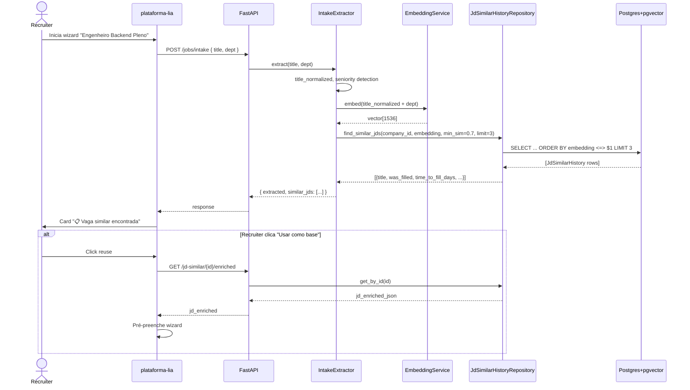

# SPEC — Fase 1: JD Similar History

> **Status**: PROPOSED — pendente aprovação Paulo
> **Branch**: `feat/sprint-b-jd-similar` (sub-branch de `feat/sprint-b-canonical`)
> **Estimativa**: ~25h (20h impl + 5h split ADR-007 de `intake_extractor.py`)
> **Pré-requisito**: este SPEC aprovado

---

## 1. Contexto e objetivo

A LIA gera Job Descriptions (JDs) do zero a cada nova vaga, sem aproveitar o histórico da própria empresa. Empresas que cadastram vagas similares perdem 5-10min por vaga reescrevendo coisas semelhantes — e perdem o **insight de outcome** (essa vaga preencheu rápido, aquela não).

**Esta fase entrega**: ao iniciar uma nova vaga, a LIA detecta JDs similares no histórico da empresa, mostra um card "Vaga similar encontrada" e permite reusar como base.

**Diferencial vs mercado** (Greenhouse/Lever/Ashby): outcome-aware ranking — prioriza JDs que **preencheram bem** (`time_to_fill_days` curto, `candidates_count` alto).

---

## 2. Acceptance criteria (UAT)

### 2.1 Cenário golden path
**Dado** que a empresa A tem 11 vagas publicadas no histórico, das quais 8 preencheram
**Quando** o recruiter inicia o wizard pra vaga "Engenheiro Backend Pleno"
**E** já existe JD similar "Desenvolvedor Backend Pleno" preenchida em 18 dias com 47 candidatos
**Então** a UI exibe card "📋 Vaga similar encontrada"
**E** o card mostra: título original, dept, "preencheu em 18d", "47 candidatos", botões `[Usar como base]` `[Criar do zero]`
**E** ao clicar "Usar como base", o wizard é pré-preenchido com `jd_enriched_json` da JD original

### 2.2 Cenário sem histórico suficiente
**Dado** empresa B com apenas 3 vagas no histórico (< 10)
**Quando** recruiter inicia wizard
**Então** o card NÃO aparece (fail-open silencioso, log debug)
**E** o wizard segue fluxo padrão sem regressão

### 2.3 Cenário toggle desligado
**Dado** empresa C com `automation_rules.learning_loops.jd_similar_suggestion = false`
**Quando** recruiter inicia wizard
**Então** o card NÃO aparece mesmo com histórico suficiente

### 2.4 Cenário multi-tenancy
**Dado** empresa A tem 11 JDs similares; empresa B (outra tenant) tem 0
**Quando** recruiter da empresa B inicia wizard
**Então** o sistema NÃO mostra JDs da empresa A (vazamento)
**E** o teste `test_jd_similar_multi_tenant` valida isso

### 2.5 Cenário fechamento de vaga
**Dado** vaga publicada há 18 dias atinge `status=filled` (todos slots preenchidos)
**Quando** o evento dispara
**Então** a tabela `jd_similar_history` é atualizada com `was_filled=true`, `time_to_fill_days=18`, `candidates_count=N`
**E** futuras buscas de JD similar consideram essa "case de sucesso" no ranking

---

## 3. Sequence diagram (mermaid)



---

## 4. Arquitetura canonical (ADR-001)

```
Controller (app/api/v1/jobs.py — endpoint existente, estender)
    ↓
Service (app/domains/job_creation/services/jd_similar_service.py — NOVO)
    ↓
Repository (app/domains/job_creation/repositories/jd_similar_history_repository.py — NOVO)
    ↓
Model (libs/models/lia_models/jd_similar_history.py — NOVO)
    ↓
DB (jd_similar_history table — migration 106 já criou; precisa ALTER pgvector)
```

### Refactor preparatório obrigatório (ADR-007)

`intake_extractor.py` está com 597 LOC (limite hard 400). Antes de adicionar `find_similar_jds()`:
- Extrair `_normalize_title()` e `_detect_seniority()` pra `app/domains/job_creation/services/intake_helpers.py`
- Reduzir `intake_extractor.py` pra ~300 LOC
- Validar pre-commit hook `check_file_size`

---

## 5. Test plan (TDD red phase — ESCREVER ANTES DE QUALQUER IMPL)

| Arquivo | Cenários | Tipo |
|---|---|---|
| `tests/unit/test_jd_similar_repository.py` | find_similar_jds com < 10 JDs (return []), >= 10 (top 3 ordenados), embedding nulo, multi-tenant, query pgvector EXPLAIN < 200ms | unit |
| `tests/unit/test_jd_similar_service.py` | find_similar_jds invoca repo + filtra por toggle; record_jd no publish; mark_filled no fill; LGPD: embedding não inclui PII | unit |
| `tests/unit/test_intake_extractor_split.py` | Garante que refactor preserva comportamento de `_normalize_title` e `_detect_seniority` | unit |
| `tests/integration/test_jd_similar_e2e.py` | Wizard completo: 11 JDs → card aparece, 9 JDs → não aparece, toggle off → não aparece | integration |
| `tests/integration/test_jd_similar_lifecycle.py` | Publish → record_jd; fill → mark_filled; reuse → wizard pré-preenchido | integration |
| `tests/integration/test_jd_similar_multi_tenant.py` | Empresa A não vê JDs da empresa B mesmo com embedding similar | integration |

**Todos VERMELHOS antes de implementar.** Após implementação verde, rodar coverage > 85%.

---

## 6. Compliance checklist

- [ ] **Multi-tenancy** (CLAUDE.md global + ADR): `company_id` extraído do JWT em `find_similar_jds` e `record_jd`. Test garante vazamento bloqueado.
- [ ] **ADR-001**: Controller chama Service que chama Repository. Nenhum `db.execute()` fora do repo.
- [ ] **ADR-002**: Modelo em `libs/models/lia_models/jd_similar_history.py`. Nada em `app/models/`.
- [ ] **ADR-006 (PII)**: `record_jd` NUNCA loga `recruiter_email`, `candidate_name`. Apenas IDs.
- [ ] **ADR-007**: `intake_extractor.py` reduzido < 400 LOC após split.
- [ ] **LGPD Art. 20**: recruiter pode `[Criar do zero]` (override sempre disponível).
- [ ] **PII em embeddings**: input do embedding é apenas `title_normalized + responsibilities`. NÃO inclui salário, dados de candidatos, info confidencial.
- [ ] **Audit log**: cada `record_jd` deixa entrada em `audit_logs/` (action=`jd_recorded`, actor=user_id, target=job_id).
- [ ] **Right to erasure**: implementado no service (não bloqueante pra Fase 1, mas hook está pronto).

---

## 7. Failure modes + sensors

| Falha possível | Sensor | Ação |
|---|---|---|
| pgvector extension não habilitado | Migration ALTER detecta na startup | Falha cedo com mensagem clara: "CREATE EXTENSION vector required" |
| EmbeddingService timeout > 5s | Logging estruturado + métrica `jd_similar_embedding_timeout_total` | Fallback: `find_similar_jds` retorna `[]` (graceful) |
| company_id ausente no JWT | Repository raises `ValueError` (fail-closed) | Endpoint retorna 401 |
| Embedding dimensão != 1536 | Schema validation no model | Falha na inserção, log + alerta |
| Toggle ON mas histórico vazio | log.debug | Card não aparece (fail-open silencioso, comportamento esperado) |

**Harness**: error messages incluem instrução em linguagem natural pro LLM consumir caso seja chamado em pipeline agêntico.

---

## 8. Frontend (plataforma-lia)

**Componente novo**: `components/wizard/JdSimilarCard.tsx`

Props:
```ts
interface JdSimilarCardProps {
  similarJds: Array<{
    id: string;
    title: string;
    department: string;
    wasFilled: boolean;
    timeToFillDays: number | null;
    candidatesCount: number;
  }>;
  onReuse: (id: string) => void;
  onCreateFresh: () => void;
}
```

Design tokens (00-design-system-v4.2.2.md): nada hardcoded. Usar `--color-success`, `--space-md`, etc.

Localização: `Step 1` do `JobWizard` (após intake), antes de `Step 2 (JD enriquecimento)`.

---

## 9. Cronograma estimado

| Etapa | Horas |
|---|---|
| Refactor split `intake_extractor.py` | 4h |
| TDD red phase (escrever testes) | 4h |
| Migration ALTER pgvector + criar Vector(1536) | 1h |
| Model `JdSimilarHistory` em lia_models | 2h |
| Repository (CRUD + similarity query) | 4h |
| Service (find/record/mark_filled) | 3h |
| Wire em `intake_extractor` + `jd_enrichment` | 3h |
| Hook em fechamento de vaga (mark_filled) | 2h |
| Frontend `JdSimilarCard.tsx` | 4h |
| Integration tests verde | 2h |
| `/security-review` + `/review` | 1h |
| Buffer pra ajustes | 2h |
| **Total** | **~32h** |

(Ajuste vs estimativa anterior 25h: +7h vêm de buffer + frontend mais detalhado)

---

## 10. Definition of Done

- [ ] Todos testes unit + integration verdes, coverage > 85%
- [ ] `/security-review` sem flags
- [ ] `/review` aprovado
- [ ] `intake_extractor.py` < 400 LOC pós-split
- [ ] Manual UAT (cenário 2.1) executado em staging — card aparece corretamente
- [ ] Multi-tenancy validado em staging (cenário 2.4)
- [ ] Toggle on/off testado em staging (cenário 2.3)
- [ ] Métricas Prometheus instrumentadas (`jd_similar_*`)
- [ ] Audit log entries verificadas
- [ ] Commit no Replit em `feat/sprint-b-jd-similar`
- [ ] Mensagem de PR redigida para Paulo pushar manualmente

---

## Status real (2026-05-03)

### Entregue na branch feat/sprint-b-canonical
- ✅ Foundation backend (model + repo + service + 16 tests green)
- ✅ Migration 101 pgvector + IVFFlat cosine index
- ✅ 4 endpoints REST `/api/v1/jd-similar/*`
- ✅ Frontend `JdSimilarCard.tsx` + hook `useJdSimilar` + integração no IntakePanel + backend-proxy routes
- ✅ Toggle config: `AUTOMATION_RULES_DEFAULTS.learning_loops` + endpoints `GET/PATCH /companies/{id}/learning-loops-config`
- ✅ 21 unit tests verdes (16 service/repo + 5 config)

### Phase 1.5 follow-ups (próximo PR)
1. **Wire automático de `record_jd` no publish_node** (graph.py:750)
   - Bloqueio: nó é sync, service é async; precisa wrapper sync↔async OU usar evento publish (não existe ainda)
   - Workaround atual: frontend pode chamar `POST /api/v1/jd-similar/record` após publish bem-sucedido (manual)
2. **Hook automático de `mark_filled`** em `transition_dispatch_service.dispatch_for_transition`
   - Bloqueio: requer cross-domain lookup pra `time_to_fill_days` (created_at do job vem do Rails)
   - Workaround atual: batch reconciliation job pode rodar diariamente buscando vagas em `status=filled` no Rails
3. **Audit log instrumentation** em `learning_loops_config.patch_config` — TODO inline
4. **Integration tests E2E** com DB real + pgvector
5. **alembic upgrade head** em staging + manual UAT (cadastrar 11 vagas, validar card)
6. **Frontend: tela de Configurações > Loops de Aprendizado** com toggles visuais (atualmente só endpoint)

### Decisões pragmáticas tomadas durante execução
- **Branch base = `replit-sync`** (mainline) em vez de `feat/ats-bulk-import-final`. Motivo: evitar dependência de branch não-mergeada. Resultado: `intake_extractor.py` não existe em mainline, então wire ficou em `IntakePanel.tsx` direto via hook (mais clean UX).
- **Pular wire automático** publish/transition: complexidade sync↔async + cross-domain (Rails) supera valor pra Phase 1.
- **Toggle defaults pra learning_loops_config** seguem proposta original: `jd_similar_suggestion: true`, `bigfive_department_history: false` (opt-in LGPD).
