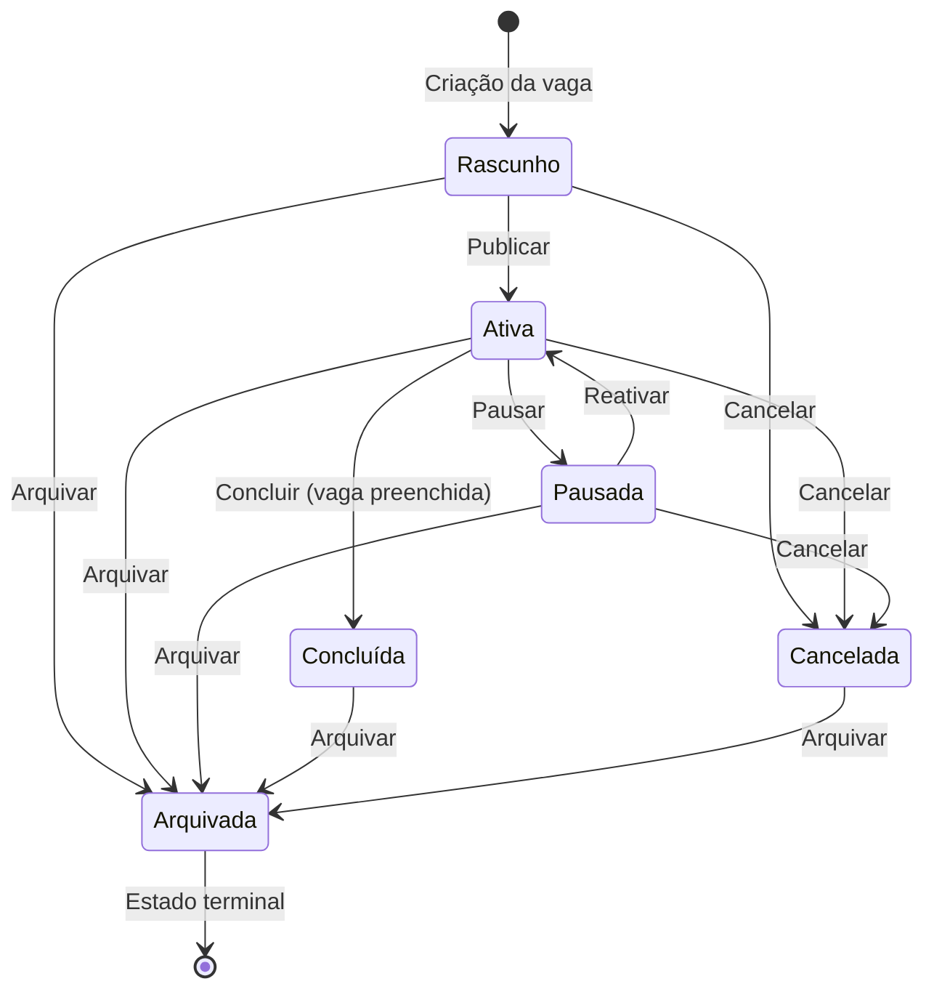
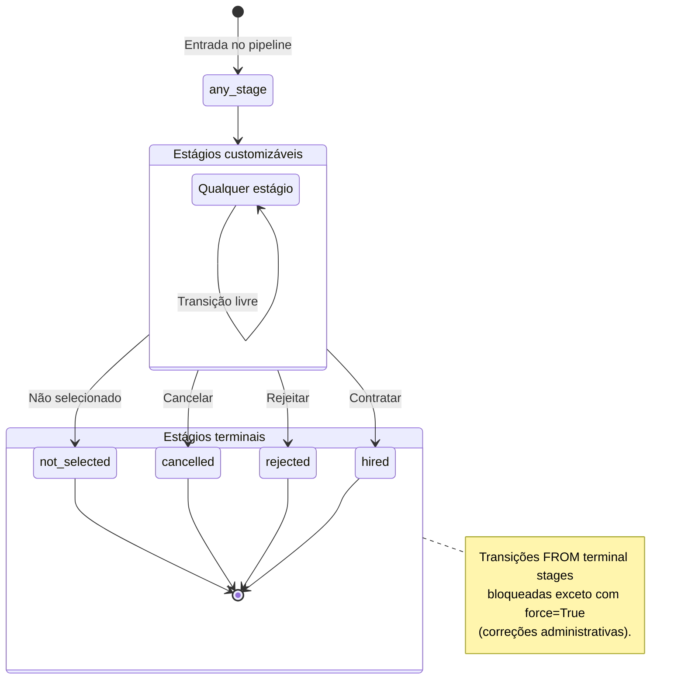

# State Machines — WeDOTalent LIA

Documentação visual das máquinas de estado do sistema. Gerada a partir do código-fonte
e validada por sensor automatizado (`tests/contract/test_gap05_002_state_machine_doc.py`).

---

## 1. Job Vacancy Status Transitions

**Fonte:** `app/api/v1/job_vacancies/_shared.py` — `ALLOWED_STATUS_TRANSITIONS`

### Diagrama

### Tabela de transições

| Estado atual | Transições permitidas |
|---|---|
| **Rascunho** | Ativa, Cancelada, Arquivada |
| **Ativa** | Pausada, Concluída, Cancelada, Arquivada |
| **Pausada** | Ativa, Cancelada, Arquivada |
| **Concluída** | Arquivada |
| **Cancelada** | Arquivada |
| **Arquivada** | _(nenhuma — estado terminal)_ |

### Descrição dos estados

- **Rascunho**: Vaga criada mas ainda não publicada. Recrutador pode editar livremente.
- **Ativa**: Vaga publicada e recebendo candidatos. Triagem e processos seletivos em andamento.
- **Pausada**: Vaga temporariamente suspensa (ex: orçamento congelado). Pode ser reativada.
- **Concluída**: Vaga preenchida com sucesso. Caminho unidirecional para Arquivada.
- **Cancelada**: Vaga cancelada (ex: posição eliminada). Caminho unidirecional para Arquivada.
- **Arquivada**: Estado terminal. Nenhuma transição permitida. Vaga mantida para histórico.

### Invariantes

1. **Arquivada é absorvente** — todo estado pode transitar para Arquivada, mas Arquivada não transita para nenhum.
2. **Concluída e Cancelada são quase-terminais** — só permitem transição para Arquivada.
3. **Ciclo Ativa ↔ Pausada** — único ciclo permitido no grafo.

---

## 2. Candidate Stage Transitions (Pipeline FSM)

**Fonte:** `app/services/state_machines/candidate_fsm.py` — `TERMINAL_STAGES` + `validate_stage_transition()`

### Diagrama

### Estágios terminais

| Estágio | Significado |
|---|---|
| `hired` | Candidato contratado |
| `rejected` | Candidato rejeitado pelo recrutador |
| `cancelled` | Processo cancelado |
| `not_selected` | Candidato não selecionado (decisão final) |

### Regras

1. **Transição livre entre estágios não-terminais** — colunas do kanban são customizáveis por empresa; qualquer transição entre elas é válida.
2. **Terminal = sem saída** — `validate_stage_transition()` levanta `LIAInvalidStateTransition` (HTTP 409) ao tentar mover candidato FROM um estágio terminal.
3. **Escape hatch: `force=True`** — agentes com autoridade explícita (ex: correções administrativas) podem forçar transição de estágio terminal. Uso auditado.
4. **`from_stage=None` sempre permitido** — colocação inicial do candidato no pipeline.
