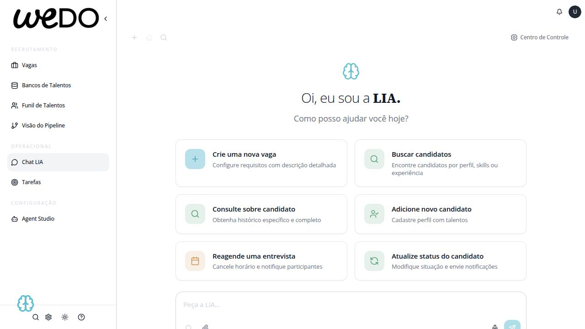

# Auditoria Profunda de Design — LIA Platform

**Data:** 09/04/2026  
**Versão:** 1.0  
**Escopo:** Análise completa de todas as páginas, componentes compartilhados, tokens de design e estratégia de melhoria progressiva.  
**Referência:** `DIAGNOSTICO_DESIGN_ELEVENLABS.md` (comparação inicial)  
**Filosofia:** Equilíbrio entre densidade operacional (recruiter power-user) e clareza visual (ElevenLabs-inspired). Não é cópia — é evolução.

---

## Sumário

1. [Inventário de Páginas e Componentes](#1-inventário)
2. [Análise de Componentes Compartilhados](#2-componentes-compartilhados)
3. [Análise Página-a-Página](#3-análise-página-a-página)
4. [Análise de Impacto dos Tokens Globais](#4-impacto-tokens-globais)
5. [Estratégia de Hierarquia da Informação](#5-hierarquia-da-informação)
6. [Plano de Migração Progressiva](#6-plano-de-migração)

---

## 1. Inventário

### 1.1 Páginas Principais (17)

| # | Página | Arquivo | Complexidade | Linhas | Screenshot |
|---|--------|---------|--------------|--------|------------|
| 1 | Chat LIA | `pages/chat-page.tsx` + `chat-page/` | ALTA | ~727 + hooks |  |
| 2 | Funil de Talentos | `pages/candidates-page.tsx` + `candidates/` | MUITO ALTA | ~705 + 15+ sub-componentes | (search + results views) |
| 3 | Gestão de Vagas | `pages/jobs-page.tsx` + `jobs/` | ALTA | ~316 + sub-componentes | (overview + list views) |
| 4 | Job Kanban | `pages/job-kanban-page.tsx` + `job-kanban/` | ALTA | ~117 + 3 sub-componentes | (acessível via Vagas > card) |
| 5 | Tarefas | `pages/tasks-page.tsx` + `tasks/` | MÉDIA | ~234 | (dashboard view) |
| 6 | Configurações | `pages/settings-page-enhanced.tsx` | ALTA | ~679 | (sidebar + hub views) |
| 7 | Agent Studio | `pages-agent-studio/AgentStudioPage.tsx` | MÉDIA | ~481 | (cards + create modal) |
| 8 | Visão do Pipeline | `pages/pipeline-overview-page.tsx` | MÉDIA | ~376 | (stage flow view) |
| 9 | Indicadores | `pages/indicators-page.tsx` + `indicators/` | ALTA | ~166 + 5 tabs lazy | (charts + analytics) |
| 10 | Bancos de Talentos | `pages-candidates/TalentPoolsTab.tsx` | MÉDIA | ~148 | (pool cards grid) |
| 11 | Biblioteca LIA | `pages/lia-library-page.tsx` | MÉDIA | ~392 | (command cards) |
| 12 | Templates | `pages/templates-page.tsx` | MÉDIA | ~408 | (grid/list + create modal) |
| 13 | Central Comunicação | `settings/CommunicationHub.tsx` | MÉDIA | ~141 + 5 sub-tabs | (gated por licença) |
| 14 | Créditos IA | `pages/ai-credits-page.tsx` | MÉDIA | ~277 | (rota: `/configuracoes/ai-credits`) |
| 15 | Integrações ATS | `pages/ats-integrations-page.tsx` | ALTA | ~419 | (via Settings hub) |
| 16 | Integrações Externas | `pages/integrations-page.tsx` | MÉDIA | ~124 + sub-componentes | (webhooks/notificações) |
| 17 | Onboarding | `pages/onboarding-page.tsx` + sub-views | MÉDIA | ~107 + 3 sub-views | (gestão de integração RH) |

**Nota sobre screenshots:** O screenshot do Chat LIA (visão principal com sidebar) está salvo em `docs/screenshots/chat-page.jpg`. As demais páginas são acessíveis via sidebar navigation ou sub-rotas do Settings. A captura do Chat inclui a sidebar completa visível, servindo como referência do layout shell (sidebar + header + conteúdo) compartilhado por todas as páginas. Páginas como Créditos IA, Integrações ATS, Integrações Externas e Onboarding são acessadas via sub-rotas (`/configuracoes/ai-credits`) ou via Settings hubs e não estão no menu principal do sidebar.

### 1.2 Componentes Compartilhados Críticos

| Componente | Arquivo(s) | Usado em |
|------------|-----------|----------|
| Sidebar | `sidebar.tsx` (531 linhas) | Todas as páginas |
| Header Bar | `header-bar.tsx` | Todas as páginas |
| Card / CardContent | `ui/card.tsx` | Todas as páginas |
| Button | `ui/button.tsx` | Todas as páginas |
| Badge | `ui/badge.tsx` | Todas as páginas |
| Tabs | `ui/tabs.tsx` | Candidates, Jobs, Settings |
| Dialog / Modal | `ui/dialog.tsx` | 20+ modais |
| Table (custom) | Inline em `CandidateSearchResultsView` | Candidates |
| Input / Search | `ui/input.tsx`, `SmartSearchInput` | Chat, Candidates |
| ErrorBoundarySection | `ui/error-boundary-section.tsx` | Todas as páginas |
| LIA Float (FAB + Panel) | `lia-float/` | Global overlay |
| CandidatePreview | `candidate-preview.tsx` | Candidates, Jobs |
| Toast (Sonner) | Sonner library | Global |

### 1.3 Design Tokens Atuais

| Token Layer | Arquivo | Status |
|-------------|---------|--------|
| CSS Variables | `styles/design-tokens.css` | Ativo, ~200 vars |
| Tailwind Config | `tailwind.config.ts` | Ativo, custom theme |
| TypeScript Tokens | `lib/design-tokens.ts` | Ativo, ~670 linhas |
| Globals CSS | `styles/globals.css` | Ativo, base styles |

---

## 2. Componentes Compartilhados

### 2.1 Sidebar

**Estado Atual:**
- Width: 240px expandida, 64px colapsada
- Background: `bg-lia-bg-primary` (branco) com borda direita `border-lia-border-subtle`
- 3 seções: RECRUTAMENTO (4 itens), OPERACIONAL (2 itens), CONFIGURAÇÃO (1 item)
- Font: `text-base-ui` (11px) — item labels
- Icons: `w-4 h-4` (16px)
- Item padding: `py-2 px-2`, min-height 40px
- Active state: `bg-lia-bg-tertiary` + `font-semibold`
- Footer: ThemeToggle + Search + Settings + Help icons
- Section labels: uppercase, `text-micro` (10px), `text-lia-text-disabled`
- Inclui Recent Items expandable + Job Filters expandable
- Colapsável com chevron

**Classificação: AJUSTAR**

**Problemas:**
1. Font 11px é pequena demais para navegação principal — diminui discoverability
2. Ícones 16px competem com texto 11px, proporção visual desequilibrada
3. Recent Items e Job Filters adicionam complexidade ao sidebar que deveria ser simples
4. Section labels em 10px são quase ilegíveis
5. Footer com 4 ícones fica apertado quando colapsado
6. Falta ação "+" ao lado de itens criáveis (ex: Vagas)

**Recomendações:**
- Font → 13px para labels de menu
- Icons → `w-5 h-5` (20px)
- Padding → `py-2.5 px-3`
- Section labels → 11px (text-base-ui) com tracking mais amplo
- Mover Recent Items para o header ou uma seção separada
- Adicionar "+" button inline ao lado de "Vagas"

---

### 2.2 Header Bar

**Estado Atual:**
- Background: `bg-lia-bg-primary` com borda inferior
- Height: ~48px
- Contém: título da página, notificações, avatar, "Centro de Controle" button
- Font: varia por página (text-xl em Jobs, text-base em Tasks)

**Classificação: AJUSTAR**

**Problemas:**
1. Inconsistência no tamanho de título entre páginas
2. Sem breadcrumb para contexto de navegação
3. "Centro de Controle" é confuso para novos usuários
4. Notificação badge sem número

**Recomendações:**
- Padronizar título: `text-lg font-semibold` em todas as páginas
- Considerar breadcrumb leve (seção > sub-seção)
- Renomear "Centro de Controle" → ícone + tooltip

---

### 2.3 Cards

**Estado Atual:**
- Border: `border border-lia-border-subtle` (1px, gray-200)
- Radius: `rounded-md` (8px) — apesar de `--radius: 0.75rem` (12px) definido em globals
- Padding: varia — `p-3` (Tasks), `p-4` (Jobs), `p-5` (Chat)
- Shadow: nenhum (flat design)
- CardHeader + CardTitle + CardContent pattern

**Classificação: MANTER (com ajustes menores)**

**Problemas:**
1. Inconsistência de padding entre páginas (p-3 vs p-4 vs p-5)
2. `rounded-md` (8px) vs `--radius` (12px) — decisão inconsistente
3. Cards em Tasks são extremamente compactos

**Recomendações:**
- Padronizar padding mínimo: `p-4` para todos os cards
- Decidir radius: ou 8px (`rounded-md`) globalmente, ou 12px (`rounded-lg`) globalmente
- Considerar `shadow-sm` sutil para elevação visual

---

### 2.4 Buttons

**Estado Atual (Design Tokens):**
- Primary: `bg-lia-btn-primary-bg` (preto) + `text-white`
- Secondary: `bg-lia-bg-tertiary` + `text-lia-text-primary`
- Ghost: transparent + text color
- Sizes: `h-7 px-2.5` (sm), `h-8 px-3` (default), `h-9 px-4` (md)
- Font: `text-xs` (12px) em quase todos os botões

**Classificação: MANTER**

**Análise:** Os botões estão bem tokenizados e seguem o DS v4. O tamanho `h-8` é adequado para power-users. Único ponto: botões com `font-['Open_Sans',sans-serif]` inline deveriam usar a classe Tailwind `font-open-sans` para consistência.

---

### 2.5 Badges

**Estado Atual:**
- Definidos em `design-tokens.ts` com variantes: success, warning, error, info, neutral
- Font: `text-xs` (12px) ou `text-micro` (10px)
- Padding: `px-2 py-0.5`
- Radius: `rounded-full` ou `rounded-md`

**Classificação: MANTER**

**Análise:** Bem implementados. Cores de status claras e consistentes. Apenas garantir que todos os badges usem `badgeStyles` do design-tokens ao invés de classes inline.

---

### 2.6 Tabs

**Estado Atual:**
- Padrão 1 (Jobs): Chips rounded com `bg-lia-bg-tertiary` para active, `text-xs` (12px)
- Padrão 2 (Candidates): Tab bar com contador, underline ou background highlight
- Padrão 3 (Settings): Sidebar vertical de categorias
- Font: `text-xs` consistente

**Classificação: AJUSTAR**

**Problemas:**
1. Três padrões diferentes de tabs na plataforma
2. Sem componente unificado — cada página implementa seus próprios tabs
3. Jobs tabs têm `font-['Open_Sans',sans-serif]` inline

**Recomendações:**
- Unificar em 1-2 padrões: chip tabs (horizontal) + vertical nav (Settings)
- Extrair para componente `<PageTabs>` compartilhado
- Remover font inline, usar classe global

---

### 2.7 Tables

**Estado Atual:**
- Implementação custom em `CandidateSearchResultsView` (não usa shadcn Table)
- Columns: configuráveis, reordenáveis, com resize
- Row height: compacta (~40px)
- Font: `text-xs` (12px) para dados, `text-micro` (10px) para labels
- Pinned rows, batch selection, inline actions
- Column widths: persisted state

**Classificação: MANTER**

**Análise:** A tabela de candidatos é o coração da plataforma para power-users. A densidade alta é intencional e correta para o caso de uso (recrutadores analisando 50-200 candidatos). Não deve ser "relaxada" para parecer ElevenLabs — recrutadores precisam ver o máximo de dados possível.

---

### 2.8 Modals / Dialogs

**Estado Atual:**
- shadcn Dialog base com custom styling
- ~20+ modais diferentes na plataforma
- Overlay: backdrop blur
- Content: `max-w-lg` a `max-w-4xl` dependendo do conteúdo
- Close: X button no canto superior direito

**Classificação: MANTER**

**Análise:** Modais estão bem implementados. O padrão shadcn + customização é adequado. Apenas garantir consistência de padding interno (`p-6` mínimo).

---

### 2.9 Empty States

**Estado Atual:**
- Chat: ícone Brain + "Oi, eu sou a LIA" + sugestões de prompt
- Candidates: mensagem textual simples
- Jobs: skeleton loading → dados
- Agent Studio: "Nenhum agente criado" textual

**Classificação: AJUSTAR**

**Problemas:**
1. Chat tem um empty state elaborado, mas outras páginas são básicas
2. Sem ilustrações SVG consistentes
3. Sem CTA claro em empty states (exceto Chat)

**Recomendações:**
- Criar componente `<EmptyState>` compartilhado com: ícone, título, descrição, CTA
- Não precisa de ilustrações complexas (mantém alinhamento com design austero)
- Garantir que cada empty state tenha uma ação primária

---

### 2.10 Inputs / Formulários

**Estado Atual:**
- Font: `text-xs` (12px) para inputs
- Border: `border-lia-border-subtle` (gray-200)
- Focus: `focus:outline-none` + custom ring ou border color
- Padding: `px-3 py-2`
- Search inputs: ícone search à direita

**Classificação: MANTER (com ajuste menor)**

**Problemas:**
1. Inline `font-['Open_Sans',sans-serif]` em vários inputs (chat-page, jobs-page)
2. Focus ring inconsistente entre inputs

**Recomendações:**
- Remover `font-['Open_Sans',sans-serif]` inline — já definido no tema global
- Padronizar focus ring: `focus:ring-1 focus:ring-lia-border-medium`

---

## 3. Análise Página-a-Página

### 3.1 Chat LIA

**Classificação: MANTER**

**Análise:**
O Chat é a página mais polida da plataforma. O empty state com Brain icon + greeting + suggestion dock é excelente. A área de input com file upload, audio recording, context pills e smart search é feature-rich sem ser caótica.

**Pontos positivos:**
- Empty state bem desenhado com hierarquia clara
- Context pills para busca
- Quick action chips dinâmicos
- HITL (Human-in-the-Loop) confirm cards
- ChatMessageList com scroll management

**Problemas menores:**
1. `bg-white` hardcoded no container principal (linha 133) — deveria ser `bg-lia-bg-primary`
2. `font-['Open_Sans',sans-serif]` inline em 3+ lugares — deveria usar classe global
3. Header com `bg-white` hardcoded (linha 137)
4. Suggestions buttons com `font-['Open_Sans',sans-serif]` inline

**Impacto do fix:** Baixo esforço, alto impacto para dark mode consistency.

---

### 3.2 Funil de Talentos (Candidates)

**Classificação: MANTER (componentes internos podem ter AJUSTES)**

**Análise:**
A página mais complexa da plataforma. Contém 70+ variáveis de estado, ~40 handlers, e é a principal ferramenta de trabalho dos recrutadores. A density é intencional.

**Estrutura:**
- Header com tabs (Search, Favorites, History, Saved Searches, Lists)
- Search tab: CandidateSearchBar → CandidateSearchResultsView (tabela)
- Favorites tab: FavoritesTab
- Cada tab tem preview lateral (CandidatePreview)
- Modais: 20+ modais para ações (email, WhatsApp, WSI, scheduling, etc.)

**Pontos positivos:**
- Search-first approach (AI-powered)
- Tabela com columns configuráveis e resize
- Preview lateral com resize handle
- Batch actions (select all, bulk email, bulk WSI)
- Cross-tab filtering

**Problemas:**
1. `useCandidatesPageCore` hook exporta 170+ variáveis — code smell, não design issue
2. Padding da área de conteúdo é `px-4 pt-2 pb-2` — funcional mas tight
3. CandidatePreview tem `h-[calc(100vh-6rem)]` hardcoded

**Recomendações:**
- Não alterar a densidade da tabela (core workflow do recruiter)
- Considerar `px-5 pt-3 pb-3` para a área de conteúdo (mais breathing room sem perder dados)
- Avaliar se o preview lateral precisa de padding interno maior

---

### 3.3 Gestão de Vagas (Jobs)

**Classificação: AJUSTAR**

**Análise:**
Layout funcional com Overview + List tabs. A página segue bem o DS v4 com tokens corretos na maioria dos lugares.

**Estrutura:**
- Header: título com ícone Briefcase + "Nova Vaga" CTA + tab chips
- Overview tab: `JobsOverviewPanel` com métricas + LIA prompt
- List tab: `JobsListContent` com filtros + lista agrupada por status
- Kanban view: `JobKanbanPage` para gestão de pipeline
- Fullscreen chat modal para criação de vaga via LIA

**Pontos positivos:**
- Tab chips com contadores
- Loading skeleton bem feito
- Kanban view para visual pipeline management
- Chat inline para criação assistida

**Problemas:**
1. Título usa `text-xl` (20px) — inconsistente com Tasks (`text-base`, 16px)
2. `font-['Open_Sans',sans-serif]` inline no título e nos tab chips
3. Tab chips usam `text-xs` (12px) — poderia ser `text-base-ui` (11px) para consistência
4. Padding superior `pt-3` mas padding inferior `pb-0` — assimétrico
5. Spacing entre título e tabs é `mb-0.5` — muito apertado

**Recomendações:**
- Padronizar título: `text-lg` (18px) como compromisso entre Jobs (20px) e Tasks (16px)
- Espaçamento título→tabs: `mb-2` (8px) mínimo
- Remover font inline, usar `font-open-sans`

---

### 3.4 Tarefas

**Classificação: AJUSTAR**

**Análise:**
A página mais densa da plataforma. Padding `p-2`, título `text-base` (16px), e cards com `p-2` criam uma interface que sente "apertada".

**Estrutura:**
- Header: Target icon + "Tarefas" + subtitle dinâmico + "Nova Tarefa" CTA
- DailyBriefingCard (AI-generated summary do dia)
- TasksMetricsBar (KPIs horizontais)
- Grid 3-column: MyTasksCard, ActiveAlertsCard, ActiveJobsCard
- ActivityFeed + Interviews section

**Pontos positivos:**
- Daily briefing com AI é diferencial competitivo
- Métricas condensadas são úteis para dashboard
- Filter by task type (todas, pendentes, LIA)

**Problemas:**
1. Padding geral `p-2` é extremamente compacto — até para power-users
2. Título `text-base` (16px) — menor que outras páginas
3. `mb-1.5` entre header e conteúdo — insuficiente
4. Cards com `mb-2` — espaçamento minimal entre seções
5. "Nova Tarefa" button com `h-7` — menor que o padrão `h-8` de outras páginas

**Recomendações:**
- Padding geral → `p-3` ou `px-4 pt-3`
- Título → `text-lg` para consistência cross-page
- Espaçamento vertical entre seções → `mb-3` mínimo
- Button "Nova Tarefa" → `h-8` para consistência

---

### 3.5 Configurações

**Classificação: MANTER**

**Análise:**
Design sólido com navegação lateral por categorias. Usa design tokens corretamente.

**Estrutura:**
- Sidebar vertical esquerda: categorias (Empresa & Equipe, Recrutamento, etc.)
- Área de conteúdo principal: hub dinâmico por categoria
- Progress metrics no topo
- 7 sub-hubs com dynamic import (CompanyTeamHub, RecruitmentHub, etc.)

**Pontos positivos:**
- Categorias com ícones + status (completed/incomplete/pending)
- Progress tracking visual
- Estimated time per section
- Dynamic imports para performance

**Problemas menores:**
1. Muitos ícones importados (30+) — poderia usar icon map como AgentStudio
2. `getDefaultSections()` duplica dados que poderiam estar em config

**Recomendações:**
- Considerar extrair section definitions para arquivo de config separado
- Sem mudanças visuais necessárias — layout é limpo e funcional

---

### 3.6 Agent Studio

**Classificação: AJUSTAR**

**Análise:**
Página bem organizada que usa design tokens de forma exemplar (`textStyles`, `cardStyles`, `badgeStyles`, `buttonStyles`, `tabStyles`). É o melhor exemplo de como as outras páginas deveriam usar tokens.

**Estrutura:**
- Header: Bot icon + "Agent Studio" + "Novo Agente" CTA
- Cards de agentes existentes com status badges
- Metrics por agente (profiles_viewed, approved, rejected)
- Create modal com sector templates
- Tab sections: Meus Agentes, Templates

**Pontos positivos:**
- Uso exemplar de design tokens TS
- Status config com labels e styles centralizados
- Sector templates com ícones mapeados
- Clean create flow

**Problemas:**
1. Backend data fetch pode falhar silently (JSON parse catch vazio)
2. Card layout poderia ter mais breathing room entre cards

**Recomendações:**
- Usar como referência para padronização de outras páginas
- Grid de cards: `gap-4` → `gap-5` para mais espaçamento

---

### 3.7 Visão do Pipeline

**Classificação: AJUSTAR**

**Análise:**
Visualização de funil com estágios do pipeline. Design funcional mas básico.

**Estrutura:**
- Header: GitBranch icon + "Visão do Pipeline" + total de candidatos
- Horizontal flow de estágios (cards clicáveis)
- Cada estágio: emoji + nome + count
- Drill-down: lista de candidatos por estágio
- Pagination (PAGE_SIZE = 20)

**Pontos positivos:**
- Visual flow claro entre estágios
- Emoji map para quick recognition
- Expandable candidate list per stage

**Problemas:**
1. Fetch URL `/api/backend-proxy/pipeline-overview` está com bug de roteamento (backend router order issue)
2. Sem loading skeleton — usa spinner genérico
3. Candidate previews são básicos (apenas nome + iniciais)
4. Sem ações inline (mover candidato entre estágios, por exemplo)

**Recomendações:**
- Fix do bug de roteamento (prioridade ALTA — funcional)
- Adicionar loading skeleton consistente com Jobs page
- Considerar drag-and-drop entre estágios (futuro)

---

### 3.8 Job Kanban

**Classificação: MANTER**

**Análise:**
Sub-view da página de Vagas, acessada ao clicar em uma vaga. Componente bem arquitetado com header + content + modals separados.

**Estrutura:**
- `KanbanJobHeader`: back button, job info, actions (status, edit, report, LIA suggestions, share)
- `KanbanPageContent`: columns por estágio do pipeline, candidatos como cards arrastáveis
- `KanbanPageModals`: modais de ação (status, close, edit, share)
- Proactive Insights: alertas contextuais por urgência (urgent, high, normal)

**Pontos positivos:**
- Drag-and-drop funcional entre colunas
- Proactive insights com gradação de cor por urgência
- Animations para drag (keyframes pulse/fadeIn)
- CSS variables para drop zone (`--wedo-cyan-bg-05`)
- ErrorBoundary wrapper

**Problemas menores:**
1. `font-['Open_Sans']` inline no loading state (linha 18)
2. `h-screen` hardcoded — deveria usar `h-full` para integração com layout pai
3. CSS `<style jsx>` inline — poderia estar em CSS module

**Recomendações:**
- Substituir `h-screen` por `h-full`
- Remover `font-['Open_Sans']` inline
- Sem mudanças visuais necessárias — layout kanban é funcional e limpo

---

### 3.9 Indicadores e Analytics

**Classificação: AJUSTAR**

**Análise:**
Dashboard executivo com 5 tabs lazy-loaded (Strategic, Recruiters, Predictions, Alerts, Agent Control). É uma das poucas páginas que usa padding generoso (`p-6`) e font sizes maiores.

**Estrutura:**
- Header: título `text-2xl font-bold` + "Exportar Relatório" + "Atualizar Dados"
- `ExpandableAIPrompt`: prompt de LIA para analytics
- Tabs: underline style (`border-b-2`) — diferente do chip style de Jobs
- Strategic tab: charts com chart.js (lazy loaded ~300kb)
- Recruiters tab: filtros avançados + grid de performance
- Alerts tab: alertas de recrutamento
- Predictions tab: previsões AI
- Agent Control tab: gestão de agentes

**Pontos positivos:**
- Lazy loading de chart.js reduz bundle em ~300kb
- Tab pattern com underline é limpo e claro
- Export modal avançado com opções por role
- AI prompt integrado para consultas analytics

**Problemas:**
1. Título `text-2xl font-bold` (24px) — maior que qualquer outra página da plataforma
2. Tab style (underline `border-b-2`) é um 4º padrão de tab na plataforma (chip, vertical, custom, underline)
3. Padding `p-6 space-y-6` — mais generoso que o padrão da plataforma
4. Cores de tab ativa/inativa parecem invertidas (`text-lia-text-secondary` para ativa, `text-lia-text-primary` para inativa)

**Recomendações:**
- Título → `text-lg font-semibold` para consistência cross-page
- Padding → `px-4 pt-3` ou manter `p-6` como exceção para dashboards
- Corrigir cores de tab (ativa deveria ter `text-lia-text-primary`, não `text-lia-text-secondary`)
- Avaliar unificação para chip tabs ou manter underline como variante "dashboard"

---

### 3.10 Bancos de Talentos

**Classificação: MANTER**

**Análise:**
Componente que usa design tokens de forma exemplar (como AgentStudio). Grid de cards de pools com empty state bem construído.

**Estrutura:**
- Header: título via `textStyles.h3` + "Novo Banco" CTA via `buttonStyles.primary`
- Empty state: ícone Database + mensagem + CTA "Criar primeiro banco"
- Grid: 3 colunas responsivas (`grid-cols-1 md:grid-cols-2 lg:grid-cols-3`)
- Pool cards: `PoolCard` component com summary stats
- Create modal: `CreatePoolModal`

**Pontos positivos:**
- Uso exemplar de design tokens TS (`textStyles`, `cardStyles`, `badgeStyles`, `buttonStyles`)
- Empty state com CTA claro
- Responsive grid
- Loading state com `textStyles.caption`

**Problemas menores:**
1. Empty state usa `text-gray-300` hardcoded para ícone (deveria ser `text-lia-text-disabled`)
2. Depende de `useTalentPools` hook compartilhado — bem modular

**Recomendações:**
- Fix `text-gray-300` → `text-lia-text-disabled`
- Usar como referência para padronização de outras páginas (junto com AgentStudio)

---

### 3.11 Biblioteca LIA

**Classificação: AJUSTAR**

**Análise:**
Página de comandos/prompts prontos para a LIA. Funciona como um "cookbook" para recrutadores. Usa categorias com cores e ícones.

**Estrutura:**
- Header: BookOpen icon + "Biblioteca LIA" + subtítulo
- Search bar para filtrar comandos
- Categoria filter chips com ícones (Candidatos, Vagas, Indicadores, Automações, Relatórios, Comunicação)
- Toggle favorites
- Command cards: título + comando + descrição + ações (copiar, executar, favoritar)
- AI prompt integrado no rodapé

**Pontos positivos:**
- Categories com ícones e cores de accent (usa CSS vars corretamente)
- Copy-to-clipboard com feedback visual
- Execute command flow (navega para Chat LIA com comando)
- Favorites persistidas via `useUIPreferencesStore`
- Usage counter por comando

**Problemas:**
1. Categorias usam inline styles com `var(--wedo-cyan)` etc — funcional mas poderia usar tokens TS
2. Cards não seguem o mesmo padrão de `cardStyles` de design-tokens
3. Sem sorting options visíveis (sempre por usage)
4. Sem paginação — todos os 12 comandos hardcoded

**Recomendações:**
- Migrar cards para usar `cardStyles.flat` ou `cardStyles.bordered` de design-tokens
- Considerar adicionar sorting (por uso, recente, categoria)
- Os 12 comandos hardcoded deveriam vir de config ou API no futuro

---

### 3.12 Templates

**Classificação: AJUSTAR**

**Análise:**
Página de templates de comandos com funcionalidade completa (CRUD, duplicar, executar, filtrar, ordenar). Usa Zustand store para persistência.

**Estrutura:**
- Header: título + stats (total, uso, taxa de sucesso, tempo economizado, compartilhados)
- Filter bar: search + category filter + sort + view mode (grid/list)
- Template cards: nome + descrição + command preview + tags + actions
- Create/Edit modal com formulário completo
- Execute action: navega para Funil de Talentos

**Pontos positivos:**
- CRUD completo com persistência via store
- Stats calculados (tempo economizado em horas)
- Dual view mode (grid/list)
- Category filter funcional
- Duplicate action

**Problemas:**
1. Usa `confirm()` nativo para delete — deveria usar Dialog component
2. `window.location.href` para execute — deveria usar router ou `onNavigate`
3. Font sizes e padding não verificados contra DS v4
4. Cards possivelmente não usam tokens de design-tokens.ts

**Recomendações:**
- Substituir `confirm()` por Dialog component
- Substituir `window.location.href` por `onNavigate` pattern
- Audit de tokens de design em cards e labels
- Baixa prioridade — página funcional e raramente acessada

---

### 3.13 Central de Comunicação

**Classificação: MANTER**

**Análise:**
Hub de comunicação com 5 sub-tabs. Gated por licença (`hasModuleAccess('communication_center')`). Quando sem acesso, exibe `ModuleUpsell`.

**Estrutura:**
- Tabs: Templates, Assinatura, Horários LGPD, Alertas, A/B Testing
- Usa `tabStyles` de design-tokens corretamente
- Cada tab é componente separado com lazy rendering
- `useCommunicationHub` centraliza estado

**Pontos positivos:**
- Usa `tabStyles` de design-tokens — consistência
- License gating com upsell component
- Tabs bem organizadas com ícones
- State centralizado em custom hook

**Problemas menores:**
1. `eslint-disable-next-line` para `react-hooks/exhaustive-deps` — tech debt menor
2. Componente relativamente pequeno (141 linhas) — bem modular

**Recomendações:**
- Sem mudanças visuais necessárias
- Modelo de referência para outros hubs de settings

---

### 3.14 Créditos IA

**Classificação: MANTER**

**Análise:**
Dashboard de consumo de tokens IA com gráficos (Recharts/BarChart) e alertas de limite. Acessado via rota `/configuracoes/ai-credits`.

**Estrutura:**
- Usage Alert: banner com gradação (100% = error, 80% = warning)
- Metrics cards: saldo, uso, custo estimado, trending
- Chart: BarChart de consumo diário (últimos 30 dias) via Recharts
- Breakdown por agente: tabela de consumo por agent type
- Loading/Error states com mensagens claras

**Pontos positivos:**
- Alertas com tokens semânticos corretos (`status-error`, `status-warning`)
- Chart com Recharts (ResponsiveContainer) — boa responsividade
- Formatação inteligente de tokens (K, M)
- Error boundary com mensagem clara

**Problemas menores:**
1. Sem padding padrão explícito no root — herda do layout pai
2. Cards usam `p-6` — consistente com Indicadores mas maior que o padrão geral

**Recomendações:**
- Sem mudanças visuais necessárias — página de nicho bem implementada
- Considerar alinhar padding com padrão global quando definido

---

### 3.15 Integrações ATS

**Classificação: MANTER**

**Análise:**
Página complexa de gestão de integrações com ATS (Applicant Tracking Systems). Usa design tokens exemplarmente (`textStyles`, `cardStyles`). Acessada via Settings hub.

**Estrutura:**
- Overview: 4 metric cards (Sistemas Conectados, Registros Sincronizados, Integrações Ativas, Tempo Médio Sync)
- ATS Systems list: cards por sistema com status (connected, connecting, error, disabled)
- Sync logs: histórico de sincronizações
- Configuration modal: `SystemConfigurationModal` para setup de cada ATS
- View tabs: Overview, Systems, Integrations, Logs

**Pontos positivos:**
- Uso exemplar de design tokens (`textStyles.label`, `textStyles.titleXl`, `textStyles.caption`)
- Status icons com cores semânticas corretas
- Cards com `p-6` e grid responsivo
- Hook separado `useAtsIntegrations` — boa separação de concerns

**Problemas menores:**
1. `text-2xl` hardcoded em metric values — poderia usar `textStyles.titleXl`
2. Metric cards poderiam ser componente reutilizável (padrão repetido com Indicadores)

**Recomendações:**
- Extrair metric card como componente compartilhado `<MetricCard>`
- Usar como referência para padronização de design tokens

---

### 3.16 Integrações Externas

**Classificação: AJUSTAR**

**Análise:**
Página de integrações com webhooks e notificações externas (Teams, etc.). Layout com sidebar + conteúdo.

**Estrutura:**
- Header: Settings icon `w-8 h-8` + "Integrações Externas" `text-2xl font-bold`
- Stats cards: `IntegrationsStatsCards`
- Grid 12 colunas: sidebar + lista + templates
- Webhook logs toggle
- New Integration modal
- CTA: "Nova Integração" com dark mode tokens explícitos

**Pontos positivos:**
- 12-column grid para layout flexível
- Dark mode tokens explícitos no botão primário
- Modal de criação integrado
- Webhook event logs

**Problemas:**
1. Título `text-2xl font-bold` (24px) — inconsistente com padrão proposto (`text-lg`)
2. Settings icon `w-8 h-8` (32px) — muito grande vs padrão `w-5 h-5` (20px)
3. `min-h-screen` no container — deveria ser `h-full` para integração com shell
4. `mb-8` entre header e conteúdo — excessivo vs padrão `mb-2` a `mb-4`
5. `font-sans` inline — desnecessário (já é default global)

**Recomendações:**
- Título → `text-lg font-semibold`
- Icon → `w-5 h-5`
- Container → `h-full` em vez de `min-h-screen`
- Remover `font-sans` inline

---

### 3.17 Onboarding

**Classificação: AJUSTAR**

**Análise:**
Módulo de onboarding para integração de novos colaboradores. Tabs com pill/chip style, 4 sub-views.

**Estrutura:**
- Header: "Onboarding Automatizado" `text-sm font-semibold` + Export/Settings CTAs
- Tabs: pill style em `bg-lia-bg-tertiary` container (segmented control pattern)
- Views: Overview (`OnboardingOverview`), Candidates (`OnboardingCandidates`), Templates, Analytics
- Candidate detail modal: `CandidateDetailModal`
- `max-w-7xl mx-auto` — centrado com largura máxima

**Pontos positivos:**
- Tab style (segmented control) é limpo e moderno — 5º padrão de tab mas visualmente coerente
- Tokens corretos para cores (`text-lia-text-primary`, `bg-lia-bg-tertiary`)
- `max-w-7xl` centra o conteúdo para telas grandes
- Padding `p-6` generoso

**Problemas:**
1. Título `text-sm font-semibold` (14px) — menor que todas as outras páginas
2. Padding `p-6` + `max-w-7xl mx-auto` — padrão diferente de todas as outras páginas
3. Mais um padrão de tab (segmented control) — total de 5 padrões na plataforma
4. `motion-reduce:transition-none` corretamente aplicado ✓

**Recomendações:**
- Título → `text-lg font-semibold` para consistência
- Avaliar se segmented control pode substituir chip tabs como padrão unificado
- Manter `max-w-7xl mx-auto` como exceção para páginas standalone

---

## 4. Impacto dos Tokens Globais

### 4.1 Análise de `text-base-ui` (11px)

**Definição:** `text-base-ui: ['0.6875rem', { lineHeight: '1.2', letterSpacing: '-0.01em' }]`

**Onde é usado:**
- Sidebar menu items
- Tasks page subtitle (`textStyles.bodySmall`)
- Table cell values
- Form labels

**Impacto de alteração (ex: 11px → 13px):**
- Sidebar: items ficariam 15-20% mais largos → pode quebrar em 240px width
- Tables: rows ficariam mais altas → menos dados visíveis por tela
- Tasks: cards ficariam maiores → layout grid pode precisar ajuste
- **Risco: MÉDIO** — alteração global afeta muitos componentes

**Recomendação:** NÃO alterar `text-base-ui` globalmente. Em vez disso:
- Criar `text-nav` (13px) para sidebar items
- Manter `text-base-ui` (11px) para data tables e UI dense
- Criar `text-body` (13-14px) para content areas

### 4.2 Análise de `rounded-md` vs `--radius`

**Estado atual:**
- `globals.css`: `--radius: 0.75rem` (12px)
- shadcn components: usam `rounded-md` que resolve para 8px via Tailwind default (não usa `--radius`)
- Cards: `rounded-md` (8px)
- Badges: `rounded-full` ou `rounded-md`
- Buttons: `rounded-md` (8px)

**Impacto de alterar `--radius` para 8px:**
- Mínimo — poucos componentes usam `--radius` diretamente
- shadcn `ui/button.tsx` e `ui/card.tsx` usam classes Tailwind diretas

**Recomendação:** Alinhar `--radius` para `0.5rem` (8px) e manter `rounded-md` como padrão. Isso elimina a inconsistência sem impacto visual.

### 4.3 Análise de cores hardcoded

**Ocorrências de `bg-white` (deveria ser `bg-lia-bg-primary`):**
- `chat-page.tsx` linha 133: container principal
- `chat-page.tsx` linha 137: header
- Potencialmente em sub-componentes não auditados

**Ocorrências de `font-['Open_Sans',sans-serif]` inline:**
- `chat-page.tsx`: search input (linha 193), suggestion buttons (linha 375)
- `jobs-page.tsx`: título (linha 135), tab chips (linha 159)
- `tasks-page.tsx`: título (linha 65)

**Impacto de limpeza:**
- Dark mode fix para `bg-white` → `bg-lia-bg-primary`
- Consistência visual ao remover font inline → `font-open-sans` ou global CSS
- **Risco: BAIXO** — são fixes cosméticos sem impacto funcional

### 4.4 Análise de espaçamento inter-página

| Página | Padding principal | Título size | Gap título→conteúdo |
|--------|------------------|-------------|---------------------|
| Chat | `p-6` (input), `p-4` (messages) | h1 `text-3xl` (empty) | N/A |
| Candidates | `px-4 pt-2 pb-2` | via CandidatesPageHeader | `pt-2` |
| Jobs | `px-4 pt-3 pb-0` | `text-xl` | `mb-0.5` |
| Tasks | `p-2` | `text-base` | `mb-1.5` |
| Settings | via sub-hub | Varies | Varies |
| Agent Studio | via design tokens | `text-lg` (token) | Token spacing |
| Pipeline | Custom | `text-xl` | `mb-4` |

**Recomendação de padronização:**

```
Page padding:  px-4 pt-3 pb-2
Page title:    text-lg font-semibold (18px)
Title→content: mb-2 (8px) mínimo
Section gap:   mb-3 (12px) mínimo
```

---

## 5. Estratégia de Hierarquia da Informação

### 5.1 Princípio: "Progressive Density"

A plataforma LIA atende dois perfis de uso:

1. **Exploração** (overview, dashboard, busca inicial) → densidade BAIXA
2. **Execução** (tabela de candidatos, pipeline, tasks) → densidade ALTA

O design deve suportar ambos sem forçar um único nível de density.

### 5.2 Mapeamento de Density por Página

| Página | Perfil | Densidade Atual | Densidade Ideal |
|--------|--------|-----------------|-----------------|
| Chat LIA | Exploração | MÉDIA | MÉDIA ✓ |
| Candidates (search) | Exploração | MÉDIA | MÉDIA ✓ |
| Candidates (results) | Execução | ALTA | ALTA ✓ |
| Jobs (overview) | Exploração | MÉDIA | BAIXA ↓ |
| Jobs (list) | Execução | ALTA | ALTA ✓ |
| Job Kanban | Execução | ALTA | ALTA ✓ |
| Tasks | Exploração/Execução | MUITO ALTA | ALTA ↓ |
| Settings | Exploração | MÉDIA | MÉDIA ✓ |
| Agent Studio | Exploração | MÉDIA | MÉDIA ✓ |
| Pipeline | Exploração | MÉDIA | MÉDIA ✓ |
| Indicadores | Exploração | BAIXA | BAIXA ✓ |
| Bancos de Talentos | Exploração | MÉDIA | MÉDIA ✓ |
| Biblioteca LIA | Exploração | MÉDIA | MÉDIA ✓ |
| Templates | Exploração | MÉDIA | MÉDIA ✓ |
| Central Comunicação | Exploração | MÉDIA | MÉDIA ✓ |
| Créditos IA | Exploração | BAIXA | BAIXA ✓ |
| Integrações ATS | Exploração/Execução | MÉDIA | MÉDIA ✓ |
| Integrações Externas | Exploração | MÉDIA | MÉDIA ✓ (com ajustes spacing) |
| Onboarding | Exploração | MÉDIA | MÉDIA ✓ (com ajustes título) |

### 5.3 Tipografia: 3 Escalas

Em vez de alterar `text-base-ui` globalmente, definir 3 escalas de tipografia:

| Escala | Size | Line-height | Uso |
|--------|------|-------------|-----|
| **Dense** | 11px (`text-base-ui`) | 1.2 | Tabelas, badges, sidebar, data grids |
| **Comfortable** | 13px (novo `text-comfortable`) | 1.4 | Nav items, form labels, card body text |
| **Reading** | 14-15px (`text-sm`) | 1.5 | Descrições, empty states, briefings |

### 5.4 Espaçamento: 3 Modos

| Modo | Page padding | Card padding | Section gap | Uso |
|------|-------------|-------------|-------------|-----|
| **Compact** | `px-4 pt-2` | `p-3` | `gap-2` | Tabelas, dados tabulares |
| **Standard** | `px-4 pt-3` | `p-4` | `gap-3` | Maioria das páginas |
| **Relaxed** | `px-6 pt-4` | `p-5` | `gap-4` | Chat, overview, empty states |

---

## 6. Plano de Migração Progressiva

### Fase 0: Tokens & Cleanup (Risco ZERO)
**Estimativa:** 2-3 horas  
**Impacto visual:** Mínimo (fix de dark mode e consistency)

- [ ] Remover todas as instâncias de `bg-white` hardcoded → `bg-lia-bg-primary`
- [ ] Remover todas as instâncias de `font-['Open_Sans',sans-serif]` inline
- [ ] Alinhar `--radius` em globals.css para `0.5rem` (8px)
- [ ] Criar classes utilitárias: `text-comfortable` (13px), `text-nav` (13px)
- [ ] Audit: garantir que todos os badges usem `badgeStyles` de design-tokens

### Fase 1: Espaçamento & Consistência (Risco BAIXO)
**Estimativa:** 3-4 horas  
**Impacto visual:** Moderado — páginas "respiram" mais

- [ ] Padronizar page padding: `px-4 pt-3 pb-2` em todas as páginas
- [ ] Padronizar page title: `text-lg font-semibold` em todas as páginas
- [ ] Padronizar título→conteúdo gap: `mb-2` mínimo
- [ ] Tasks page: `p-2` → `px-4 pt-3`
- [ ] Jobs page: ajustar `pb-0` → `pb-2`, `mb-0.5` → `mb-2`
- [ ] Criar componente `<PageHeader>` compartilhado (título + subtitle + CTA)

### Fase 2: Sidebar & Navigation (Risco MÉDIO)
**Estimativa:** 4-6 horas  
**Impacto visual:** Significativo — sidebar é vista 100% do tempo

- [ ] Sidebar font: `text-base-ui` (11px) → `text-comfortable` (13px)
- [ ] Sidebar icons: `w-4 h-4` → `w-5 h-5`
- [ ] Sidebar item padding: `py-2 px-2` → `py-2.5 px-3`
- [ ] Section labels: `text-micro` (10px) → `text-base-ui` (11px)
- [ ] Adicionar "+" action button ao lado de "Vagas"
- [ ] Avaliar: mover Recent Items para header search
- [ ] Mover "Bancos de Talentos" e "Visão do Pipeline" como tabs de "Funil de Talentos" (já pendente)

### Fase 3: Componentes Compartilhados (Risco MÉDIO)
**Estimativa:** 4-6 horas  

- [ ] Criar componente `<EmptyState>` compartilhado
- [ ] Criar componente `<PageTabs>` compartilhado
- [ ] Unificar padrão de tabs: chip style (Jobs/Candidates) como padrão
- [ ] Extrair card padding inconsistencies
- [ ] Considerar `shadow-sm` para cards (teste A/B visual)

### Fase 4: Refinamentos por Página (Risco BAIXO)
**Estimativa:** 6-8 horas

- [ ] Chat: fix `bg-white` hardcoded + cleanup font inline
- [ ] Jobs Overview: mais breathing room, métricas maiores
- [ ] Tasks: density reduction per Fase 1 + card spacing
- [ ] Pipeline: loading skeleton + fix bug de roteamento
- [ ] Agent Studio: manter como referência, ajustar grid gap

### Fase 5: Dark Mode Validation (Risco BAIXO)
**Estimativa:** 2-3 horas

- [ ] Validar todas as páginas em dark mode após Fases 0-4
- [ ] Fix hardcoded colors revelados pelo dark mode
- [ ] Garantir contrast ratios WCAG AA em todos os textos

---

## Apêndice A: Tabela de Classificação Completa

| Componente/Página | Classificação | Prioridade | Fase |
|-------------------|---------------|-----------|------|
| **PÁGINAS** | | | |
| Chat LIA | MANTER | P3 | 4 |
| Funil de Talentos | MANTER | P3 | 4 |
| Gestão de Vagas | AJUSTAR | P2 | 1 |
| Job Kanban | MANTER | P3 | 4 |
| Tarefas | AJUSTAR | P1 | 1 |
| Configurações | MANTER | P4 | — |
| Agent Studio | AJUSTAR (menor) | P3 | 4 |
| Visão do Pipeline | AJUSTAR | P1 | 4 (bug fix) |
| Indicadores | AJUSTAR | P2 | 1 |
| Bancos de Talentos | MANTER | P4 | 0 (fix gray-300) |
| Biblioteca LIA | AJUSTAR | P3 | 3 |
| Templates | AJUSTAR | P3 | 4 |
| Central Comunicação | MANTER | P4 | — |
| Créditos IA | MANTER | P4 | — |
| Integrações ATS | MANTER | P4 | — |
| Integrações Externas | AJUSTAR | P3 | 1 |
| Onboarding | AJUSTAR | P3 | 1 |
| **COMPONENTES** | | | |
| Sidebar | AJUSTAR | P1 | 2 |
| Header Bar | AJUSTAR | P2 | 1 |
| Cards | MANTER (+minor) | P3 | 3 |
| Buttons | MANTER | P4 | — |
| Badges | MANTER | P4 | 0 |
| Tabs | AJUSTAR | P2 | 3 |
| Tables | MANTER | P4 | — |
| Modals | MANTER | P4 | — |
| Empty States | AJUSTAR | P3 | 3 |
| Inputs | MANTER (+minor) | P3 | 0 |
| Tokens (cleanup) | AJUSTAR | P0 | 0 |

## Apêndice B: Anti-Patterns Encontrados

1. **Inline font declarations**: `font-['Open_Sans',sans-serif]` em 5+ arquivos. Deveria usar `font-open-sans` (Tailwind class) ou confiar no body font global.

2. **Hardcoded `bg-white`**: Quebra dark mode. Sempre usar `bg-lia-bg-primary`.

3. **Inconsistent page padding**: Varia de `p-2` a `p-6` sem padrão claro.

4. **Mixed tab patterns**: 3 implementações diferentes de tabs na plataforma.

5. **Monster hooks**: `useCandidatesPageCore` exporta 170+ itens. Não é design issue mas afeta manutenibilidade.

6. **`h-[calc(100vh-Xrem)]` hardcoded**: Em CandidatePreview e outros. Frágil se header height mudar.

## Apêndice C: O que NÃO mudar

1. **Tabela de candidatos**: A densidade é feature, não bug. Recrutadores precisam ver 30+ candidatos sem scroll.

2. **Paleta monocromática**: 90% grayscale + 10% accent está correto. Não adicionar mais cores.

3. **Font stacks**: Open Sans (UI) + Inter (dados) é decisão correta. Não trocar.

4. **Icon size em tabelas**: `w-4 h-4` (16px) é correto para contexto denso.

5. **Chat input complexity**: File upload, audio, context pills são features essenciais. Não simplificar.

6. **Kanban view**: O design atual de drag-and-drop funciona bem. Não redesenhar.

---

**Próximos passos:** Priorizar Fase 0 (cleanup de tokens) → Fase 1 (espaçamento) → Fase 2 (sidebar) como primeiras ações pós-auditoria. Cada fase pode ser executada independentemente sem regressões.
